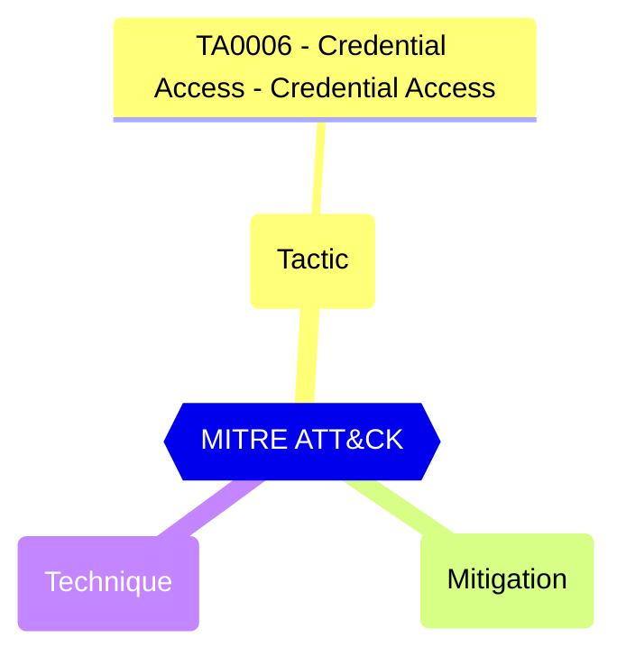
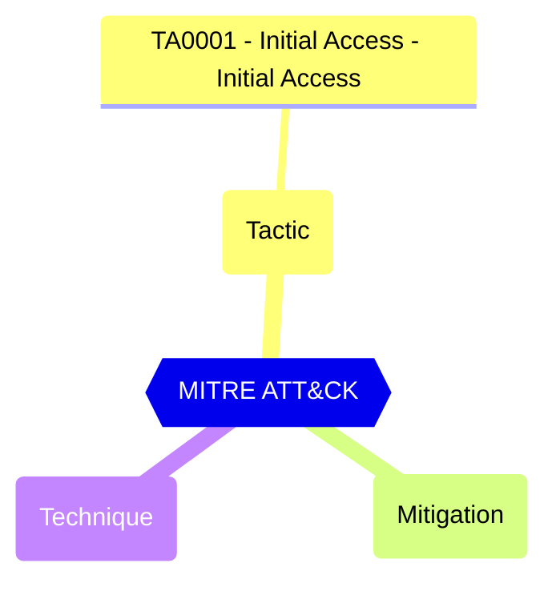
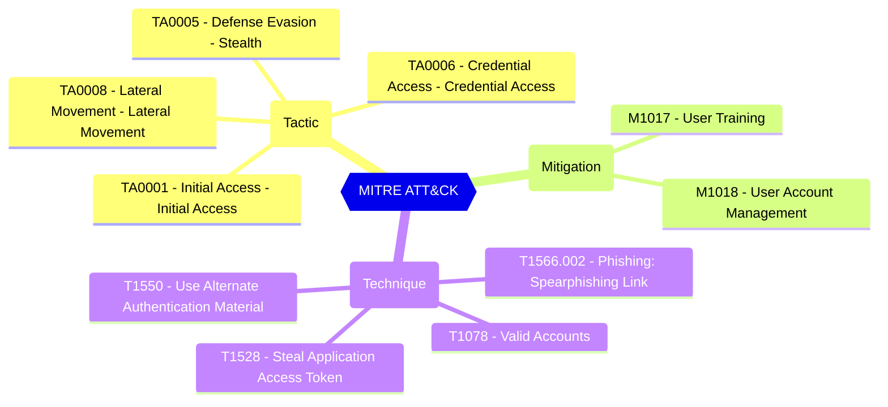
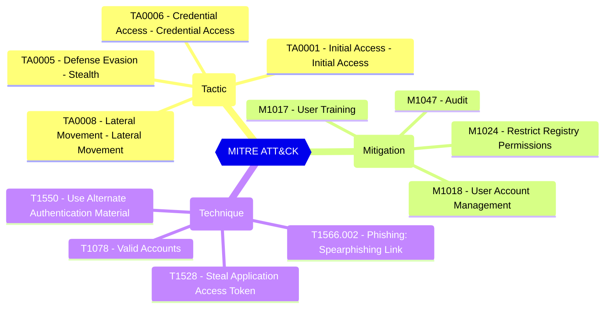
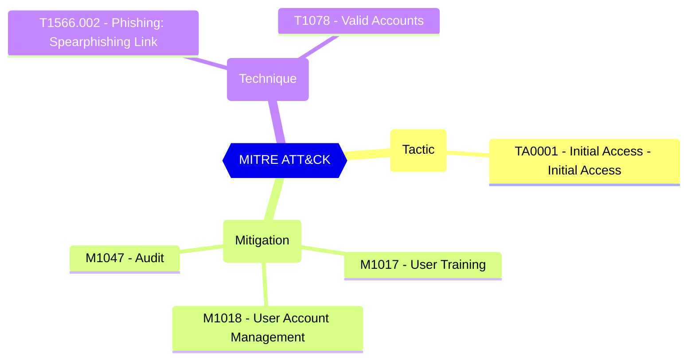
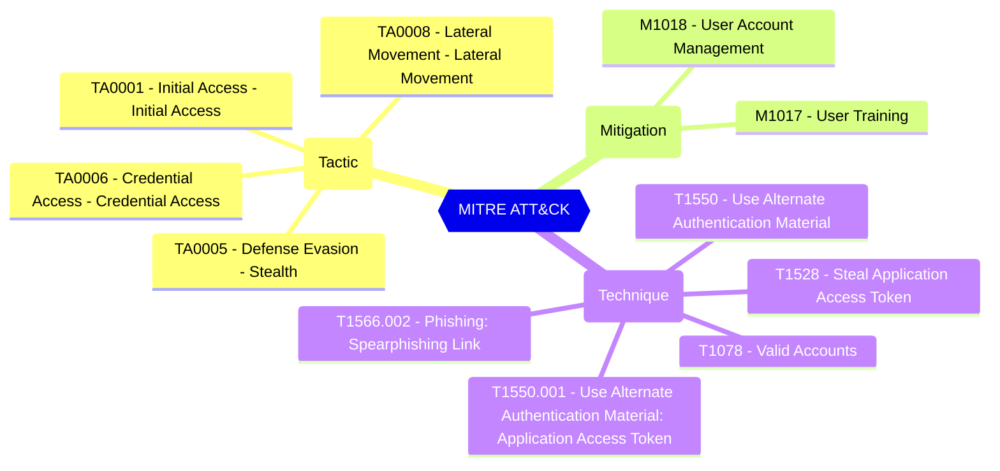
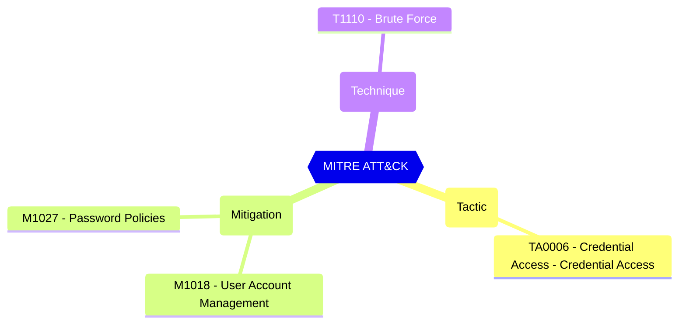

#  Maester Test Results

This is a summary of the test results from the Maester test run.

**Tenant:** TenantName (not connected to Graph)

**Date:** 2026-08-21T22:00:42.4273703+00:00

| 🔥 <br/> Total Tests | ✅ <br/> Passed  | ❌ <br/> Failed | 🔍 <br/> Investigate | ❔ <br/> Skipped | ❔ <br/> Not Run |
|:-:|:-:|:-:|:-:|:-:|:-:|
| **708** | **241** | **29** | **0** | **0** |**438** |


## Test summary

|Test|Severity|Status|
|-|:-:|:-:|
| AD-CFG-01: Tombstone lifetime configuration should be retrievable |  |  |
| AD-CFG-02: dSHeuristics count should be retrievable |  |  |
| AD-CFG-03: SPN mappings should be retrievable |  |  |
| AD-CFG-04: Optional features count should be retrievable |  |  |
| AD-CFG-05: Recycle bin enabled paths should be retrievable |  |  |
| AD-CFG-06: LDAP query policy count should be retrievable |  |  |
| AD-CFG-07: Default query policy should be retrievable |  |  |
| AD-CFG-08: AuthN policy container count should be retrievable |  |  |
| AD-CFG-09: AD activation objects count should be retrievable |  |  |
| AD-CFG-10: Well-known security principals count should be retrievable |  |  |
| AD-CFG-11: Registered DHCP servers count should be retrievable |  |  |
| AD-CFG-12: Enterprise CA count should be retrievable |  |  |
| AD-CFG-13: Certificate templates count should be retrievable |  |  |
| AD-CFG-14: Enrollment templates count should be retrievable |  |  |
| AD-CFG-15: Enrollment CA certificate details should be retrievable |  |  |
| AD-CFG-16: Trusted root CA count should be retrievable |  |  |
| AD-CFG-17: Trusted root CA details should be retrievable |  |  |
| AD-CFG-18: Intermediate CA count should be retrievable |  |  |
| AD-CFG-19: Intermediate CA details should be retrievable |  |  |
| AD-CFG-20: CRL distribution points count should be retrievable |  |  |
| AD-CFG-21: NTAuth certificates count should be retrievable |  |  |
| AD-CFG-22: KDS root keys count should be retrievable |  |  |
| AD-CFG-23: SMTP site links count should be retrievable |  |  |
| AD-CFG-24: IP site links count should be retrievable |  |  |
| AD-COMP-01: Computer disabled count should be retrievable |  |  |
| AD-COMP-02: Computer dormant count should be retrievable |  |  |
| AD-COMP-03: Computer CreatorSid count should be retrievable |  |  |
| AD-COMP-04: Computer non-standard primary group count should be retrievable |  |  |
| AD-COMP-05: Computer SID History count should be retrievable |  |  |
| AD-COMP-06: Computer default container count should be retrievable |  |  |
| AD-COMP-07: Computer OU count should be retrievable |  |  |
| AD-COMP-08: Computer per OU average should be retrievable |  |  |
| AD-COMP-09: Computer delegation count should be retrievable |  |  |
| AD-COMP-10: Computer delegation details should be retrievable |  |  |
| AD-DACL-01: Distinct DACL object count should be retrievable |  |  |
| AD-DACL-02: OU DACL entry count should be retrievable |  |  |
| AD-DACL-03: Conflict object count should be retrievable |  |  |
| AD-DACL-04: Conflict object details should be retrievable |  |  |
| AD-DACL-05: Deny ACE count should be retrievable |  |  |
| AD-DACL-06: Deny ACE details should be retrievable |  |  |
| AD-DACL-07: Distinct DACL identity count should be retrievable |  |  |
| AD-DACL-08: DACL ACE distribution per identity should be retrievable |  |  |
| AD-DACL-09: Privileged allow ACE count should be retrievable |  |  |
| AD-DACL-10: Privileged allow ACE details should be retrievable |  |  |
| AD-DACL-11: Privileged extended right count should be retrievable |  |  |
| AD-DACL-12: Privileged extended right details should be retrievable |  |  |
| AD-DACL-13: Privileged extended right identities should be retrievable |  |  |
| AD-DACL-14: Non-inherited ACE count should be retrievable |  |  |
| AD-DACL-15: Unresolved SID count should be retrievable |  |  |
| AD-DACL-16: Unresolved SID details should be retrievable |  |  |
| AD-DACL-17: Inherited object type count should be retrievable |  |  |
| AD-DACL-18: Inherited object type details should be retrievable |  |  |
| AD-DC-01: DC site coverage count should be retrievable |  |  |
| AD-DC-02: SMBv1 should be disabled on all domain controllers |  |  |
| AD-DC-03: SMBv3.1.1 enabled count should be retrievable |  |  |
| AD-DC-04: SMB signing should be enabled on all domain controllers |  |  |
| AD-DC-05: DCs with all FSMO roles count should be retrievable |  |  |
| AD-DC-06: FSMO role holder details should be retrievable |  |  |
| AD-DC-07: DC operating system count should be retrievable |  |  |
| AD-DC-08: DC operating system details should be retrievable |  |  |
| AD-DCD-01: DC non-standard LDAP port count should be retrievable |  |  |
| AD-DCD-02: DC non-standard LDAPS port count should be retrievable |  |  |
| AD-DCD-03: Read-only domain controller count should be retrievable |  |  |
| AD-DCD-04: Non-Global Catalog DC count should be retrievable |  |  |
| AD-DCOMP-01: Computers with unconstrained delegation count should be retrievable |  |  |
| AD-DCOMP-02: Non-DC computers should not have unconstrained delegation |  |  |
| AD-DCOMP-03: Non-DC computers with constrained delegation count should be retrievable |  |  |
| AD-DCOMP-04: Computer operating system count should be retrievable |  |  |
| AD-DCOMP-05: Computer operating system details should be retrievable |  |  |
| AD-DCOMP-06: Stale enabled computer count should be retrievable |  |  |
| AD-DCOMP-07: Computer DNS host name count should be retrievable |  |  |
| AD-DCOMP-08: Computer DNS zone count should be retrievable |  |  |
| AD-DCOMP-09: Computer DNS zone details should be retrievable |  |  |
| AD-DFSR-01: DFS-R subscription count should be retrievable |  |  |
| AD-DNS-01: DNS zone count should be retrievable |  |  |
| AD-DNS-02: Zones with only SOA/NS records should be retrievable |  |  |
| AD-DNS-03: Root servers with incorrect IPs should be retrievable |  |  |
| AD-DNS-04: Root server incorrect IP details should be retrievable |  |  |
| AD-DNS-05: Dynamic DNS record count should be retrievable |  |  |
| AD-DNS-06: Zones with non-default records should be retrievable |  |  |
| AD-DNS-07: Zone record count details should be retrievable |  |  |
| AD-DNS-08: Zone delegation count should be retrievable |  |  |
| AD-DNS-09: Zone delegation details should be retrievable |  |  |
| AD-DNS-10: SOA record details should be retrievable |  |  |
| AD-DNS-11: AD DS SRV record count should be retrievable |  |  |
| AD-DNS-12: AD DS SRV record details should be retrievable |  |  |
| AD-DNS-13: DNSSEC record count should be retrievable |  |  |
| AD-DNS-14: Empty zone count should be retrievable |  |  |
| AD-DNS-15: Duplicate zone count should be retrievable |  |  |
| AD-DNS-16: Reverse lookup zone count should be retrievable |  |  |
| AD-DNS-17: Non-standard zone count should be retrievable |  |  |
| AD-DNS-18: Reverse zone network count should be retrievable |  |  |
| AD-DNS-19: Reverse zone network details should be retrievable |  |  |
| AD-DOM-01: Domain functional level should be retrievable |  |  |
| AD-DOM-02: Machine account quota should be retrievable |  |  |
| AD-DOM-03: Domain controller count should be retrievable |  |  |
| AD-DOM-04: RIDs remaining should be retrievable |  |  |
| AD-DOM-05: Domain name standard compliance should be retrievable |  |  |
| AD-DOM-06: Domain name non-standard details should be retrievable |  |  |
| AD-DOM-07: NetBIOS name standard compliance should be retrievable |  |  |
| AD-DOM-08: NetBIOS name non-standard details should be retrievable |  |  |
| AD-DOMS-01: Allowed DNS suffixes count should be retrievable |  |  |
| AD-FEAT-01: Optional feature count should be retrievable |  |  |
| AD-FEAT-02: Optional feature enabled details should be retrievable |  |  |
| AD-FGPP-01: Fine-grained password policy count should be retrievable |  |  |
| AD-FGPP-02: Fine-grained password policy value count should be retrievable |  |  |
| AD-FGPP-03: Fine-grained password policy setting counts should be retrievable |  |  |
| AD-FGPP-04: Fine-grained password policy application targets should be retrievable |  |  |
| AD-FOR-01: Forest functional level should be retrievable |  |  |
| AD-FOR-02: Forest domain count should be retrievable |  |  |
| AD-FOR-03: Tombstone lifetime should be retrievable |  |  |
| AD-FOR-04: Recycle Bin status should be retrievable |  |  |
| AD-FORS-01: UPN suffixes count should be retrievable |  |  |
| AD-FORS-02: UPN suffixes details should be retrievable |  |  |
| AD-FORS-03: SPN suffixes count should be retrievable |  |  |
| AD-FORS-04: Cross-forest references count should be retrievable |  |  |
| AD-GCHG-01: Average group membership changes per year should be retrievable |  |  |
| AD-GMC-01: Distinct groups with members count should be retrievable |  |  |
| AD-GMC-02: Distinct account types of members count should be retrievable |  |  |
| AD-GMC-03: Member account types breakdown should be retrievable |  |  |
| AD-GMC-04: Trust members count should be retrievable |  |  |
| AD-GMC-05: Trust members details by group should be retrievable |  |  |
| AD-GMC-06: Foreign SID principals count should be retrievable |  |  |
| AD-GMC-07: Foreign SID details by domain should be retrievable |  |  |
| AD-GMC-08: Empty non-privileged group count should be retrievable |  |  |
| AD-GMC-09: Empty non-privileged group details should be retrievable |  |  |
| AD-GMC-10: Privileged groups with members count should be retrievable |  |  |
| AD-GMC-11: Privileged groups with members details should be retrievable |  |  |
| AD-GPO-01: GPO total count should be retrievable |  |  |
| AD-GPO-02: GPO created before 2020 count should be retrievable |  |  |
| AD-GPO-03: GPO stale-before-2020 count should be retrievable |  |  |
| AD-GPO-04: Unlinked GPO count should be compliant |  |  |
| AD-GPO-05: GPO unlinked details should be compliant |  |  |
| AD-GPOL-01: GPO linked count should be retrievable |  |  |
| AD-GPOL-02: Disabled GPO link count should be retrievable |  |  |
| AD-GPOL-03: GPO unlinked target count should be compliant |  |  |
| AD-GPOL-04: Enforced GPO link count should be retrievable |  |  |
| AD-GPOL-05: GPO blocked inheritance count should be compliant |  |  |
| AD-GPOL-06: GPO linked OU count should be retrievable |  |  |
| AD-GPOREP-01: GPOs without permissions count should be retrievable |  |  |
| AD-GPOREP-02: GPOs without permissions details should be retrievable |  |  |
| AD-GPOREP-03: GPOs without authenticated users count should be retrievable |  |  |
| AD-GPOREP-04: GPOs without authenticated users details should be retrievable |  |  |
| AD-GPOREP-05: GPOs without enterprise domain controllers count should be retrievable |  |  |
| AD-GPOREP-06: GPOs without domain computers count should be retrievable |  |  |
| AD-GPOREP-07: GPOs with deny ACE count should be retrievable |  |  |
| AD-GPOREP-08: GPOs with deny ACE details should be retrievable |  |  |
| AD-GPOREP-09: GPO inherited permissions count should be retrievable |  |  |
| AD-GPOREP-10: GPO no-apply Group Policy ACE count should be retrievable |  |  |
| AD-GPOREP-11: GPO no-apply Group Policy ACE details should be retrievable |  |  |
| AD-GPOREP-12: GPO disabled link count should be retrievable |  |  |
| AD-GPOREP-13: GPO disabled link details should be retrievable |  |  |
| AD-GPOREP-14: GPO enforcement count should be retrievable |  |  |
| AD-GPOREP-15: GPO version mismatch count should be retrievable |  |  |
| AD-GPOREP-16: GPO version mismatch details should be retrievable |  |  |
| AD-GPOREP-17: GPO Cpassword found count should be retrievable |  |  |
| AD-GPOREP-18: GPO Cpassword found details should be retrievable |  |  |
| AD-GPOREP-19: GPO default password found count should be retrievable |  |  |
| AD-GPOREP-20: GPO default password found details should be retrievable |  |  |
| AD-GPOS-01: GPO state total count should be retrievable |  |  |
| AD-GPOS-02: WMI filter count should be retrievable |  |  |
| AD-GPOS-03: WMI filter details should be compliant |  |  |
| AD-GPOS-04: Disabled GPO settings count should be retrievable |  |  |
| AD-GPOS-05: Computer disabled GPO settings details should be compliant |  |  |
| AD-GPOS-06: User disabled GPO settings details should be compliant |  |  |
| AD-GPOS-07: All disabled GPO settings details should be compliant |  |  |
| AD-GPOS-08: GPO owner distinct count should be retrievable |  |  |
| AD-GPOS-09: GPO owner details should be accessible |  |  |
| AD-GRP-01: Group AdminCount should be retrievable |  |  |
| AD-GRP-02: Groups in container objects count should be retrievable |  |  |
| AD-GRP-03: Stale groups count should be retrievable |  |  |
| AD-GRP-04: Groups with manager count should be retrievable |  |  |
| AD-GRP-05: Group SID History count should be retrievable |  |  |
| AD-GRP-06: Distribution group count should be retrievable |  |  |
| AD-GRP-07: Security group count should be retrievable |  |  |
| AD-GRP-08: Domain local group count should be retrievable |  |  |
| AD-GRP-09: Global group count should be retrievable |  |  |
| AD-GRP-10: Universal group count should be retrievable |  |  |
| AD-KRBTGT-01: KRBTGT password last set should be retrievable |  |  |
| AD-KRBTGT-02: KRBTGT last logon should be retrievable |  |  |
| AD-KRBTGT-03: KRBTGT should have standard UAC settings (disabled account) |  |  |
| AD-MSA-01: Managed service account count should be retrievable |  |  |
| AD-OU-01: OU overlapping name count should be retrievable |  |  |
| AD-OU-02: OU at domain root count should be retrievable |  |  |
| AD-OU-03: OU stale count should be retrievable |  |  |
| AD-OU-04: OU empty count should be retrievable |  |  |
| AD-OU-05: OU empty details should be retrievable |  |  |
| AD-PRINT-01: Printer total count should be retrievable |  |  |
| AD-PWDPOL-01: Password history count should be retrievable |  |  |
| AD-PWDPOL-02: Password maximum age should be retrievable |  |  |
| AD-PWDPOL-03: Password minimum length should be retrievable |  |  |
| AD-PWDPOL-04: Password complexity requirement should be retrievable |  |  |
| AD-PWDPOL-05: Password reversible encryption status should be retrievable |  |  |
| AD-PWDPOL-06: Account lockout duration should be retrievable |  |  |
| AD-PWDPOL-07: Account lockout threshold should be retrievable |  |  |
| AD-REPL-01: Disabled replication connection count should be retrievable |  |  |
| AD-REPL-02: Non-auto replication connection count should be retrievable |  |  |
| AD-ROOTDSE-01: Supported SASL mechanism count should be retrievable |  |  |
| AD-ROOTDSE-02: Supported SASL mechanism details should be retrievable |  |  |
| AD-ROOTDSE-03: Root DSE synchronized status should be retrievable |  |  |
| AD-SCH-01: Schema modification year count should be retrievable |  |  |
| AD-SCH-02: Schema modification year details should be retrievable |  |  |
| AD-SCH-03: Schema version entry count should be retrievable |  |  |
| AD-SCH-04: Schema version details should be retrievable |  |  |
| AD-SCH-05: LAPS installation status should be retrievable |  |  |
| AD-SITE-01: Site total count should be retrievable |  |  |
| AD-SITE-02: Sites without domain controllers count should be retrievable |  |  |
| AD-SITE-03: Sites without domain controllers details should be retrievable |  |  |
| AD-SITE-04: Sites without subnet associations count should be retrievable |  |  |
| AD-SITE-05: Sites without subnet associations details should be retrievable |  |  |
| AD-SPN-01: Computer SPN service class count should be retrievable |  |  |
| AD-SPN-02: Computer SPN service class usage should be retrievable |  |  |
| AD-SPN-03: Computer SPN unknown service class count should be retrievable |  |  |
| AD-SPN-04: Computer SPN unknown service class details should be retrievable |  |  |
| AD-SPN-05: Computer SPN non-FQDN hosts should be retrievable |  |  |
| AD-SPN-06: User SPN total count should be retrievable |  |  |
| AD-SPN-07: User SPN service class count should be retrievable |  |  |
| AD-SPN-08: User SPN service class usage should be retrievable |  |  |
| AD-SPN-09: User SPN unknown service class count should be retrievable |  |  |
| AD-SPN-10: User SPN unknown service class details should be retrievable |  |  |
| AD-SPN-11: User SPN non-FQDN hosts should be retrievable |  |  |
| AD-SPN-12: User SPN domain admin count should be retrievable |  |  |
| AD-SPN-13: User SPN domain admin details should be retrievable |  |  |
| AD-SUB-01: Subnet total count should be retrievable |  |  |
| AD-SUB-02: Sites with subnet associations count should be retrievable |  |  |
| AD-SUB-03: Catch-all subnets count should be retrievable |  |  |
| AD-SUB-04: IPv6 subnets count should be retrievable |  |  |
| AD-SUB-05: IPv6 catch-all subnets count should be retrievable |  |  |
| AD-SUB-06: Non-RFC1918 (public IP) subnets count should be retrievable |  |  |
| AD-SUB-07: Non-RFC1918 (public IP) subnets details should be retrievable |  |  |
| AD-SUB-08: Distinct first octets count should be retrievable |  |  |
| AD-SUB-09: Distinct first two octets (/16 networks) count should be retrievable |  |  |
| AD-SUB-10: Distinct first three octets (/24 networks) count should be retrievable |  |  |
| AD-SUB-11: Subnets without site associations count should be retrievable |  |  |
| AD-TRUST-01: Trust total count should be retrievable |  |  |
| AD-TRUST-02: Trust inter-forest count should be retrievable |  |  |
| AD-TRUST-03: Trust quarantined count should be retrievable |  |  |
| AD-TRUST-04: Trust non-quarantined details should be retrievable |  |  |
| AD-TRUST-05: Trust configuration details should be retrievable |  |  |
| AD-TRUST-06: Trust stale count should be retrievable |  |  |
| AD-TRUST-07: Trust stale details should be retrievable |  |  |
| AD-USER-01: Disabled user count should be retrievable |  |  |
| AD-USER-02: Dormant enabled user count should be retrievable |  |  |
| AD-USER-03: Non-expiring password user count should be retrievable |  |  |
| AD-USER-04: Reversible encryption user count should be retrievable |  |  |
| AD-USER-05: Delegation-enabled user count should be retrievable |  |  |
| AD-USER-06: DES-only Kerberos user count should be retrievable |  |  |
| AD-USER-07: No pre-authentication user count should be retrievable |  |  |
| AD-USER-08: Never-logged-in enabled user count should be retrievable |  |  |
| AD-USER-09: Password-not-required user count should be retrievable |  |  |
| AD-USER-10: Workstation-restricted user count should be retrievable |  |  |
| AD-USER-11: User AdminCount count should be retrievable |  |  |
| AD-USER-12: User non-standard primary group count should be retrievable |  |  |
| AD-USER-13: User SID History count should be retrievable |  |  |
| AD-USER-14: User SPN count should be retrievable |  |  |
| AD-USER-15: User manager count should be retrievable |  |  |
| AD-USER-16: User home directory count should be retrievable |  |  |
| AD-USER-17: User profile path count should be retrievable |  |  |
| AD-USER-18: User script path count should be retrievable |  |  |
| AD-USER-19: User in container count should be retrievable |  |  |
| AD-USER-20: Known service account count should be retrievable |  |  |
| AD-USER-21: Known service account details should be retrievable |  |  |
| AD-USER-22: Built-in administrator account count should be retrievable |  |  |
| AD-USER-23: Enabled built-in administrator details should be retrievable |  |  |
| AD-USER-24: Built-in administrator last logon details should be retrievable |  |  |
| AD-USER-25: Built-in administrator password age details should be retrievable |  |  |
| AD-USER-26: Honey pot user count should be retrievable |  |  |
| AD-USER-27: Honey pot user details should be retrievable |  |  |
| AD-USER-28: User delegation configured count should be retrievable |  |  |
| AD-USER-29: User delegation details should be retrievable |  |  |
| AZDO.1000: Azure DevOps OAuth apps can access resources in your organization through OAuth. | 🟠 High |  |
| AZDO.1001: Identities can connect to your organization's Git repos through SSH. | 🟠 High |  |
| AZDO.1002: Log Audit Events. | 🟠 High |  |
| AZDO.1003: Restrict public projects. | 🟠 High |  |
| AZDO.1004: Additional protections when using public package registries. | 🟠 High |  |
| AZDO.1005: IP Conditional Access policy validation. | 🟠 High |  |
| AZDO.1006: External Users access. | 🟠 High |  |
| AZDO.1007: Team and project administrator are allowed to invite new users. | 🟠 High |  |
| AZDO.1008: Request access to Azure DevOps by e-mail notifications to administrators. | 🟡 Medium |  |
| AZDO.1009: Feedback Collection. | ℹ️ Info |  |
| AZDO.1010: Audit streaming. | 🟠 High |  |
| AZDO.1011: Project Resource Limits. | ℹ️ Info |  |
| AZDO.1012: Work Items Tags Limits. | ℹ️ Info |  |
| AZDO.1013: Organization Owner should not be an individual. | 🟠 High |  |
| AZDO.1014: Anonymous access to pipeline badges. | 🟡 Medium |  |
| AZDO.1015: Limit variables that can be set at queue time. | 🟠 High |  |
| AZDO.1016: Limit job authorization scope to current project for non-release pipelines. | 🟠 High |  |
| AZDO.1017: Limit job authorization scope to current project for classic release pipelines. | 🟠 High |  |
| AZDO.1018: Protect access to repositories in YAML pipelines. | 🟠 High |  |
| AZDO.1019: Stage chooser. | 🟡 Medium |  |
| AZDO.1020: Creation of classic build pipelines. | 🟡 Medium |  |
| AZDO.1021: Creation of classic release pipelines. | 🟡 Medium |  |
| AZDO.1022: Limit building pull requests from forked GitHub repositories. | 🟠 High |  |
| AZDO.1023: Disable Marketplace tasks. | 🟠 High |  |
| AZDO.1024: Disable Node 6 tasks. | 🟡 Medium |  |
| AZDO.1025: Enable shell tasks arguments validation. | 🟠 High |  |
| AZDO.1026: Enable automatic enrollment to Advanced Security for Azure DevOps. | 🟡 Medium |  |
| AZDO.1027: Disable showing Gravatar images for users outside of your enterprise. | 🟡 Medium |  |
| AZDO.1028: Disable creation of TFVC repositories. | 🟡 Medium |  |
| AZDO.1029: Storage Usage Limit. | 🟡 Medium |  |
| AZDO.1030: Project Collection Administrators. | 🔴 Critical |  |
| AZDO.1031: Validate SSH Key Expiration. | 🟠 High |  |
| AZDO.1032: (Tenant) Restrict creation of global Personal Access Tokens. | 🟠 High |  |
| AZDO.1033: (Tenant) Enable automatic revocation of leaked Personal Access Tokens. | 🔴 Critical |  |
| AZDO.1034: (Tenant) Restrict creation of new Azure DevOps organizations. | 🟠 High |  |
| AZDO.1035: (Tenant) Restrict Personal Access Token lifespan. | 🟠 High |  |
| AZDO.1036: (Tenant) Restrict Personal Access Token full scope. | 🟠 High |  |
| AZDO.1037: (Organization) Restrict Personal Access Token creation. | 🟠 High |  |
| AZDO.1038: (Organization) Disallow extensions from accessing resources on the local network. | 🟡 Medium |  |
| CIS.GH.1.2.2: Ensure repository creation is limited to specific members | 🟡 Medium |  |
| CIS.GH.1.2.3: Ensure repository deletion is limited to specific users | 🟠 High |  |
| CIS.GH.1.2.4: Ensure issue deletion is limited to specific users | 🟡 Medium |  |
| CIS.GH.1.3.2: Ensure team creation is limited to specific members | 🟡 Medium |  |
| CIS.GH.1.3.8: Ensure strict base permissions are set for repositories | 🟠 High |  |
| CIS.M365.1.1.1: Ensure Administrative accounts are cloud-only | 🟠 High |  |
| CIS.M365.1.1.3: Ensure that between two and four global admins are designated | 🟠 High |  |
| CIS.M365.1.2.1: Ensure that only organizationally managed/approved public groups exist | 🟡 Medium |  |
| CIS.M365.1.2.2: Ensure sign-in to shared mailboxes is blocked | 🟠 High |  |
| CIS.M365.1.3.1: Ensure the 'Password expiration policy' is set to 'Set passwords to never expire (recommended)' | 🟠 High |  |
| CIS.M365.1.3.3: Ensure 'External sharing' of calendars is not available | 🟡 Medium |  |
| CIS.M365.1.3.4: Ensure 'User owned apps and services' is restricted |  |  |
| CIS.M365.1.3.5: Ensure internal phishing protection for Forms is enabled |  |  |
| CIS.M365.1.3.6: Ensure the customer lockbox feature is enabled | 🟠 High |  |
| CIS.M365.1.3.7: Ensure 'third-party storage services' are restricted in 'Microsoft 365 on the web' |  |  |
| CIS.M365.2.1.1: Ensure Safe Links for Office Applications is Enabled (Only Checks Priority 0 Policy) | 🟡 Medium |  |
| CIS.M365.2.1.11: Ensure comprehensive attachment filtering is applied | 🟠 High |  |
| CIS.M365.2.1.12: Ensure the connection filter IP allow list is not used (Only Checks Default Policy) | 🟡 Medium |  |
| CIS.M365.2.1.13: Ensure the connection filter safe list is off (Only Checks Default Policy) | 🟡 Medium |  |
| CIS.M365.2.1.2: Ensure the Common Attachment Types Filter is enabled (Only Checks Default Policy) | 🟡 Medium |  |
| CIS.M365.2.1.3: Ensure notifications for internal users sending malware is Enabled (Only Checks Default Policy) | 🟡 Medium |  |
| CIS.M365.2.1.4: Ensure Safe Attachments policy is enabled (Only Checks Default Policy) | 🟠 High |  |
| CIS.M365.2.1.5: Ensure Safe Attachments for SharePoint, OneDrive, and Microsoft Teams is Enabled | 🟠 High |  |
| CIS.M365.2.1.6: Ensure Exchange Online Spam Policies are set to notify administrators (Only Checks Default Policy) | 🟡 Medium |  |
| CIS.M365.2.1.7: Ensure that an anti-phishing policy has been created (Only Checks Default Policy) | 🟡 Medium |  |
| CIS.M365.2.1.9: Ensure that DKIM is enabled for all Exchange Online Domains | 🟠 High |  |
| CIS.M365.2.4.4: Ensure Zero-hour auto purge for Microsoft Teams is on (Only Checks ZAP is enabled) | 🟡 Medium |  |
| CIS.M365.3.1.1: Ensure Microsoft 365 audit log search is Enabled | 🟠 High |  |
| CIS.M365.4.1: Ensure devices without a compliance policy are marked 'not compliant' |  |  |
| CIS.M365.5.1.2.2: Ensure third party integrated applications are not allowed |  |  |
| CIS.M365.5.1.2.3: Ensure 'Restrict non-admin users from creating tenants' is set to 'Yes' |  |  |
| CIS.M365.5.1.3.1: Ensure a dynamic group for guest users is created |  |  |
| CIS.M365.5.1.4.6: Ensure users are restricted from recovering BitLocker keys |  |  |
| CIS.M365.5.1.5.1: Ensure user consent to apps accessing company data on their behalf is not allowed |  |  |
| CIS.M365.5.1.5.2: Ensure the admin consent workflow is enabled |  |  |
| CIS.M365.5.1.6.2: Ensure that guest user access is restricted |  |  |
| CIS.M365.5.2.3.5: Ensure weak authentication methods are disabled |  |  |
| CIS.M365.6.5.3: Ensure additional storage providers are restricted in Outlook on the web |  |  |
| CIS.M365.7.2.11: Ensure the SharePoint default sharing link permission is set |  |  |
| CIS.M365.7.2.2: Ensure SharePoint and OneDrive integration with Azure AD B2B is enabled |  |  |
| CIS.M365.7.2.5: Ensure that SharePoint guest users cannot share items they don't own |  |  |
| CIS.M365.7.2.7: Ensure link sharing is restricted in SharePoint and OneDrive |  |  |
| CIS.M365.7.2.9: Ensure guest access to a site or OneDrive will expire automatically |  |  |
| CIS.M365.7.3.1: Ensure Office 365 SharePoint infected files are disallowed for download |  |  |
| CIS.M365.8.1.1: Ensure external file sharing in Teams is enabled for only approved cloud storage services | 🟡 Medium |  |
| CIS.M365.8.2.2: Ensure communication with unmanaged Teams users is disabled | 🟡 Medium |  |
| CIS.M365.8.2.3: Ensure external Teams users cannot initiate conversations |  |  |
| CIS.M365.8.4.1: Ensure all or a majority of third-party and custom apps are blocked | 🟠 High |  |
| CIS.M365.8.5.3: Ensure only people in my org can bypass the lobby | 🟡 Medium |  |
| CIS.M365.8.6.1: Ensure users can report security concerns in Teams to internal destination | 🟡 Medium |  |
| CISA.MS.AAD.1.1: Legacy authentication SHALL be blocked. | 🟠 High |  |
| CISA.MS.AAD.2.1: Users detected as high risk SHALL be blocked. | 🟠 High |  |
| CISA.MS.AAD.2.2: A notification SHOULD be sent to the administrator when high-risk users are detected. | 🟠 High |  |
| CISA.MS.AAD.2.3: Sign-ins detected as high risk SHALL be blocked. | 🟠 High |  |
| CISA.MS.AAD.3.1: Phishing-resistant MFA SHALL be enforced for all users. | 🟠 High |  |
| CISA.MS.AAD.3.2: If phishing-resistant MFA has not been enforced, an alternative MFA method SHALL be enforced for all users. | 🟠 High |  |
| CISA.MS.AAD.3.3: If Microsoft Authenticator is enabled, it SHALL be configured to show login context information. | 🟡 Medium |  |
| CISA.MS.AAD.3.4: The Authentication Methods Manage Migration feature SHALL be set to Migration Complete. | 🟠 High |  |
| CISA.MS.AAD.3.5: The authentication methods SMS, Voice Call, and Email One-Time Passcode (OTP) SHALL be disabled. | 🟠 High |  |
| CISA.MS.AAD.3.6: Phishing-resistant MFA SHALL be required for highly privileged roles. | 🟠 High |  |
| CISA.MS.AAD.3.7: Managed devices SHOULD be required for authentication. | 🟠 High |  |
| CISA.MS.AAD.3.8: Managed Devices SHOULD be required to register MFA. | 🟠 High |  |
| CISA.MS.AAD.4.1: Security logs SHALL be sent to the agency's security operations center for monitoring. | 🟠 High |  |
| CISA.MS.AAD.5.1: Only administrators SHALL be allowed to register applications. | 🟠 High |  |
| CISA.MS.AAD.5.2: Only administrators SHALL be allowed to consent to applications. | 🟠 High |  |
| CISA.MS.AAD.5.3: An admin consent workflow SHALL be configured for applications. | 🟠 High |  |
| CISA.MS.AAD.5.4: Group owners SHALL NOT be allowed to consent to applications. | 🟠 High |  |
| CISA.MS.AAD.6.1: User passwords SHALL NOT expire. | 🟠 High |  |
| CISA.MS.AAD.7.1: A minimum of two users and a maximum of eight users SHALL be provisioned with the Global Administrator role. | 🟠 High |  |
| CISA.MS.AAD.7.2: Privileged users SHALL be provisioned with finer-grained roles instead of Global Administrator. | 🟠 High |  |
| CISA.MS.AAD.7.3: Privileged users SHALL be provisioned cloud-only accounts separate from an on-premises directory or other federated identity providers. | 🟠 High |  |
| CISA.MS.AAD.7.4: Permanent active role assignments SHALL NOT be allowed for highly privileged roles. | 🟠 High |  |
| CISA.MS.AAD.7.5: Provisioning users to highly privileged roles SHALL NOT occur outside of a PAM system. | 🟠 High |  |
| CISA.MS.AAD.7.6: Activation of the Global Administrator role SHALL require approval. | 🟠 High |  |
| CISA.MS.AAD.7.7: Eligible and Active highly privileged role assignments SHALL trigger an alert. | 🟠 High |  |
| CISA.MS.AAD.7.8: User activation of the Global Administrator role SHALL trigger an alert. | 🟠 High |  |
| CISA.MS.AAD.7.9: User activation of other highly privileged roles SHOULD trigger an alert. | 🟠 High |  |
| CISA.MS.AAD.8.1: Guest users SHOULD have limited or restricted access to Entra ID directory objects. | 🟡 Medium |  |
| CISA.MS.AAD.8.2: Only users with the Guest Inviter role SHOULD be able to invite guest users. | 🟠 High |  |
| CISA.MS.AAD.8.3: Guest invites SHOULD only be allowed to specific external domains that have been authorized by the agency for legitimate business purposes. | 🟡 Medium |  |
| CISA.MS.EXO.1.1: Automatic forwarding to external domains SHALL be disabled. | 🟠 High |  |
| CISA.MS.EXO.10.1: Emails SHALL be scanned for malware. | 🟠 High |  |
| CISA.MS.EXO.10.2: Emails identified as containing malware SHALL be quarantined or dropped. | 🟠 High |  |
| CISA.MS.EXO.10.3: Email scanning SHALL be capable of reviewing emails after delivery. | 🟠 High |  |
| CISA.MS.EXO.11.1: Impersonation protection checks SHOULD be used. | 🟠 High |  |
| CISA.MS.EXO.11.2: User warnings, comparable to the user safety tips included with EOP, SHOULD be displayed. | 🟡 Medium |  |
| CISA.MS.EXO.11.3: The phishing protection solution SHOULD include an AI-based phishing detection tool comparable to EOP Mailbox Intelligence. | 🟡 Medium |  |
| CISA.MS.EXO.12.1: IP allow lists SHOULD NOT be created. | 🟡 Medium |  |
| CISA.MS.EXO.12.2: Safe lists SHOULD NOT be enabled. | 🟡 Medium |  |
| CISA.MS.EXO.13.1: Mailbox auditing SHALL be enabled. | 🟠 High |  |
| CISA.MS.EXO.14.1: A spam filter SHALL be enabled. | 🟠 High |  |
| CISA.MS.EXO.14.2: Spam and high confidence spam SHALL be moved to either the junk email folder or the quarantine folder. | 🟡 Medium |  |
| CISA.MS.EXO.14.3: Allowed domains SHALL NOT be added to inbound anti-spam protection policies. | 🟡 Medium |  |
| CISA.MS.EXO.14.4: If a third-party party filtering solution is used, the solution SHOULD offer services comparable to the native spam filtering offered by Microsoft. | 🟡 Medium |  |
| CISA.MS.EXO.15.1: URL comparison with a block-list SHOULD be enabled. | 🟡 Medium |  |
| CISA.MS.EXO.15.2: Direct download links SHOULD be scanned for malware. | 🟠 High |  |
| CISA.MS.EXO.15.3: User click tracking SHOULD be enabled. | 🟡 Medium |  |
| CISA.MS.EXO.16.1: Alerts SHALL be enabled. | 🟠 High |  |
| CISA.MS.EXO.16.2: Alerts SHOULD be sent to a monitored address or incorporated into a security information and event management (SIEM) system. | 🟡 Medium |  |
| CISA.MS.EXO.17.1: Microsoft Purview Audit (Standard) logging SHALL be enabled. | 🟠 High |  |
| CISA.MS.EXO.17.2: Microsoft Purview Audit (Premium) logging SHALL be enabled. | 🟡 Medium |  |
| CISA.MS.EXO.17.3: Audit logs SHALL be maintained for at least the minimum duration dictated by OMB M-21-31 (Appendix C). | 🟡 Medium |  |
| CISA.MS.EXO.2.1: A list of approved IP addresses for sending mail SHALL be maintained. | 🟡 Medium |  |
| CISA.MS.EXO.2.2: An SPF policy SHALL be published for each domain, designating only these addresses as approved senders. | 🟡 Medium |  |
| CISA.MS.EXO.3.1: DKIM SHOULD be enabled for all domains. | 🟡 Medium |  |
| CISA.MS.EXO.4.1: A DMARC policy SHALL be published for every second-level domain. | 🟡 Medium |  |
| CISA.MS.EXO.4.2: The DMARC message rejection option SHALL be p=reject. | 🟠 High |  |
| CISA.MS.EXO.4.3: The DMARC point of contact for aggregate reports SHALL include reports@dmarc.cyber.dhs.gov. | 🟡 Medium |  |
| CISA.MS.EXO.5.1: SMTP AUTH SHALL be disabled. | 🟠 High |  |
| CISA.MS.EXO.6.1: Contact folders SHALL NOT be shared with all domains. | 🟡 Medium |  |
| CISA.MS.EXO.6.2: Calendar details SHALL NOT be shared with all domains. | 🟡 Medium |  |
| CISA.MS.EXO.7.1: External sender warnings SHALL be implemented. | 🟡 Medium |  |
| CISA.MS.EXO.8.1: A DLP solution SHALL be used. | 🟠 High |  |
| CISA.MS.EXO.8.2: The DLP solution SHALL protect personally identifiable information (PII) and sensitive information, as defined by the agency. | 🟡 Medium |  |
| CISA.MS.EXO.8.3: The selected DLP solution SHOULD offer services comparable to the native DLP solution offered by Microsoft. | 🟡 Medium |  |
| CISA.MS.EXO.8.4: At a minimum, the DLP solution SHALL restrict sharing credit card numbers, U.S. Individual Taxpayer Identification Numbers (ITIN), and U.S. Social Security numbers (SSN) via email. | 🟠 High |  |
| CISA.MS.EXO.9.1: Emails SHALL be filtered by attachment file types. | 🟡 Medium |  |
| CISA.MS.EXO.9.2: The attachment filter SHOULD attempt to determine the true file type and assess the file extension. | 🟡 Medium |  |
| CISA.MS.EXO.9.3: Disallowed file types SHALL be determined and enforced. | 🟠 High |  |
| CISA.MS.EXO.9.4: Alternatively chosen filtering solutions SHOULD offer services comparable to Microsoft Defender's Common Attachment Filter. | 🟡 Medium |  |
| CISA.MS.EXO.9.5: At a minimum, click-to-run files SHOULD be blocked (e.g., .exe, .cmd, and .vbe). | 🟠 High |  |
| CISA.MS.SHAREPOINT.1.1: External sharing for SharePoint SHALL be limited to Existing guests or Only People in your organization. | 🟡 Medium |  |
| CISA.MS.SHAREPOINT.1.2: External sharing for OneDrive SHALL be limited to Existing guests or Only People in your organization. |  |  |
| CISA.MS.SHAREPOINT.1.3: External sharing SHALL be restricted to approved external domains and/or users in approved security groups per interagency collaboration needs. | 🟠 High |  |
| CISA.MS.SHAREPOINT.2.1: File and folder default sharing scope SHALL be set to Specific People. |  |  |
| CISA.MS.SHAREPOINT.2.2: File and folder default sharing permissions SHALL be set to View only. |  |  |
| CISA.MS.SHAREPOINT.3.1: Expiration days for Anyone links SHALL be set to 30 days or less. |  |  |
| CISA.MS.SHAREPOINT.3.2: Allowable file and folder permissions for Anyone links SHALL be set to View only. |  |  |
| CISA.MS.SHAREPOINT.3.3: Reauthentication days for people who use a verification code SHALL be set to 30 days or less. |  |  |
| EIDSCA.AF01: Authentication Method - FIDO2 security key - State. | 🟠 High |  |
| EIDSCA.AF02: Authentication Method - FIDO2 security key - Allow self-service set up. | 🟡 Medium |  |
| EIDSCA.AF03: Authentication Method - FIDO2 security key - Enforce attestation. | 🟠 High |  |
| EIDSCA.AF04: Authentication Method - FIDO2 security key - Enforce key restrictions. | 🟠 High |  |
| EIDSCA.AF05: Authentication Method - FIDO2 security key - Restricted. | 🟠 High |  |
| EIDSCA.AF06: Authentication Method - FIDO2 security key - Restrict specific keys. | 🟡 Medium |  |
| EIDSCA.AG01: Authentication Method - General Settings - Manage migration. | 🟠 High |  |
| EIDSCA.AG02: Authentication Method - General Settings - Report suspicious activity - State. | 🟡 Medium |  |
| EIDSCA.AG03: Authentication Method - General Settings - Report suspicious activity - Included users/groups. | 🟡 Medium |  |
| EIDSCA.AM01: Authentication Method - Microsoft Authenticator - State. | 🟠 High |  |
| EIDSCA.AM02: Authentication Method - Microsoft Authenticator - Allow use of Microsoft Authenticator OTP. | 🟡 Medium |  |
| EIDSCA.AM03: Authentication Method - Microsoft Authenticator - Require number matching for push notifications. | 🟡 Medium |  |
| EIDSCA.AM04: Authentication Method - Microsoft Authenticator - Included users/groups of number matching for push notifications. | 🟡 Medium |  |
| EIDSCA.AM06: Authentication Method - Microsoft Authenticator - Show application name in push and passwordless notifications. | 🟡 Medium |  |
| EIDSCA.AM07: Authentication Method - Microsoft Authenticator - Included users/groups to show application name in push and passwordless notifications. | 🟡 Medium |  |
| EIDSCA.AM09: Authentication Method - Microsoft Authenticator - Show geographic location in push and passwordless notifications. | 🟡 Medium |  |
| EIDSCA.AM10: Authentication Method - Microsoft Authenticator - Included users/groups to show geographic location in push and passwordless notifications. | 🟡 Medium |  |
| EIDSCA.AP01: Default Authorization Settings - Enabled Self service password reset for administrators. | 🟠 High |  |
| EIDSCA.AP04: Default Authorization Settings - Guest invite restrictions. | 🟡 Medium |  |
| EIDSCA.AP05: Default Authorization Settings - Sign-up for email based subscription. | 🟡 Medium |  |
| EIDSCA.AP06: Default Authorization Settings - User can join the tenant by email validation. | 🟡 Medium |  |
| EIDSCA.AP07: Default Authorization Settings - Guest user access. | 🟠 High |  |
| EIDSCA.AP08: Default Authorization Settings - User consent policy assigned for applications. | 🟡 Medium |  |
| EIDSCA.AP09: Default Authorization Settings - Allow user consent on risk-based apps. | 🟡 Medium |  |
| EIDSCA.AP10: Default Authorization Settings - Default User Role Permissions - Allowed to create Apps. | 🟠 High |  |
| EIDSCA.AP14: Default Authorization Settings - Default User Role Permissions - Allowed to read other users. | 🟠 High |  |
| EIDSCA.AS04: Authentication Method - SMS - Use for sign-in. | 🟠 High |  |
| EIDSCA.AT01: Authentication Method - Temporary Access Pass - State. | 🟠 High |  |
| EIDSCA.AT02: Authentication Method - Temporary Access Pass - One-time. | 🟠 High |  |
| EIDSCA.AV01: Authentication Method - Voice call - State. | 🟠 High |  |
| EIDSCA.CP01: Default Settings - Consent Policy Settings - Group owner consent for apps accessing data. | 🟠 High |  |
| EIDSCA.CP03: Default Settings - Consent Policy Settings - Block user consent for risky apps. | 🟠 High |  |
| EIDSCA.CP04: Default Settings - Consent Policy Settings - Users can request admin consent to apps they are unable to consent to. | 🟡 Medium |  |
| EIDSCA.CR01: Consent Framework - Admin Consent Request - Policy to enable or disable admin consent request feature. | 🟠 High |  |
| EIDSCA.CR02: Consent Framework - Admin Consent Request - Reviewers will receive email notifications for requests. | 🟡 Medium |  |
| EIDSCA.CR03: Consent Framework - Admin Consent Request - Reviewers will receive email notifications when admin consent requests are about to expire. | 🟡 Medium |  |
| EIDSCA.CR04: Consent Framework - Admin Consent Request - Consent request duration (days). | 🟠 High |  |
| EIDSCA.PR01: Default Settings - Password Rule Settings - Password Protection - Mode. | 🟠 High |  |
| EIDSCA.PR02: Default Settings - Password Rule Settings - Password Protection - Enable password protection on Windows Server Active Directory. | 🟠 High |  |
| EIDSCA.PR03: Default Settings - Password Rule Settings - Enforce custom list. | 🟡 Medium |  |
| EIDSCA.PR05: Default Settings - Password Rule Settings - Smart Lockout - Lockout duration in seconds. | 🟡 Medium |  |
| EIDSCA.PR06: Default Settings - Password Rule Settings - Smart Lockout - Lockout threshold. | 🟡 Medium |  |
| EIDSCA.ST08: Default Settings - Classification and M365 Groups - M365 groups - Allow Guests to become Group Owner. | 🟡 Medium |  |
| EIDSCA.ST09: Default Settings - Classification and M365 Groups - M365 groups - Allow Guests to have access to groups content. | 🟡 Medium |  |
| MT.1001: At least one Conditional Access policy is configured with device compliance. | 🟡 Medium |  |
| MT.1002: App management restrictions on applications and service principals is configured and enabled. | 🟠 High |  |
| MT.1003: At least one Conditional Access policy is configured with All Apps. | 🟠 High |  |
| MT.1004: At least one Conditional Access policy is configured with All Apps and All Users. | 🟠 High |  |
| MT.1005: All Conditional Access policies are configured to exclude at least one emergency/break glass account or group. | 🟠 High |  |
| MT.1006: At least one Conditional Access policy is configured to require MFA for admins. | 🟠 High |  |
| MT.1007: At least one Conditional Access policy is configured to require MFA for all users. | 🟠 High |  |
| MT.1008: At least one Conditional Access policy is configured to require MFA for Azure management. | 🟠 High |  |
| MT.1009: At least one Conditional Access policy is configured to block other legacy authentication. | 🟠 High |  |
| MT.1010: At least one Conditional Access policy is configured to block legacy authentication for Exchange ActiveSync. | 🟠 High |  |
| MT.1011: At least one Conditional Access policy is configured to secure security info registration only from a trusted location. | 🟠 High |  |
| MT.1012: At least one Conditional Access policy is configured to require MFA for risky sign-ins. | 🟠 High |  |
| MT.1013: At least one Conditional Access policy is configured to require new password when user risk is high. | 🟠 High |  |
| MT.1014: At least one Conditional Access policy is configured to require compliant or Entra hybrid joined devices for admins. | 🟠 High |  |
| MT.1015: At least one Conditional Access policy is configured to block access for unknown or unsupported device platforms. | 🟡 Medium |  |
| MT.1016: At least one Conditional Access policy is configured to require MFA for guest access. | 🟠 High |  |
| MT.1017: At least one Conditional Access policy is configured to enforce non persistent browser session for non-corporate devices. | 🟠 High |  |
| MT.1018: At least one Conditional Access policy is configured to enforce sign-in frequency for non-corporate devices. | 🟡 Medium |  |
| MT.1019: At least one Conditional Access policy is configured to enable application enforced restrictions. | 🟡 Medium |  |
| MT.1020: All Conditional Access policies are configured to exclude Directory/OnPremises synchronization accounts or do not scope them. | 🟠 High |  |
| MT.1021: Security Defaults are enabled. | 🟠 High |  |
| MT.1022: All users utilizing a P1 license should be licensed. | 🟡 Medium |  |
| MT.1023: All users utilizing a P2 license should be licensed. | 🟡 Medium |  |
| MT.1025: No external user with permanent role assignment on Control Plane. | 🟠 High |  |
| MT.1026: No hybrid user with permanent role assignment on Control Plane. | 🟠 High |  |
| MT.1027: No Service Principal with Client Secret and permanent role assignment on Control Plane. | 🟠 High |  |
| MT.1028: No user with mailbox and permanent role assignment on Control Plane. | 🟠 High |  |
| MT.1029: Stale accounts are not assigned to privileged roles. | 🟠 High |  |
| MT.1030: Eligible role assignments on Control Plane are in use by administrators. | 🟠 High |  |
| MT.1031: Privileged role on Control Plane are managed by PIM only. | 🟠 High |  |
| MT.1032: Limited number of Global Admins are assigned. | 🟠 High |  |
| MT.1035: All security groups assigned to Conditional Access Policies should be protected by RMAU. | 🟠 High |  |
| MT.1036: All excluded objects should have a fallback include in another policy. | 🟡 Medium |  |
| MT.1037: Only users with Presenter role are allowed to present in Teams meetings | 🟠 High |  |
| MT.1038: Conditional Access policies should not include or exclude deleted groups. | 🟡 Medium |  |
| MT.1039: Ensure MailTips are enabled for end users | 🟢 Low |  |
| MT.1041: Ensure users installing Outlook add-ins is not allowed | 🟠 High |  |
| MT.1042: Restrict dial-in users from bypassing a meeting lobby  | 🟡 Medium |  |
| MT.1043: Ensure Spam confidence level (SCL) is configured in mail transport rules with specific domains | 🟡 Medium |  |
| MT.1044: Ensure modern authentication for Exchange Online is enabled | 🟠 High |  |
| MT.1045: Only invited users should be automatically admitted to Teams meetings | 🟡 Medium |  |
| MT.1046: Restrict anonymous users from joining meetings | 🟡 Medium |  |
| MT.1047: Restrict anonymous users from starting Teams meetings | 🟡 Medium |  |
| MT.1048: Limit external participants from having control in a Teams meeting | 🟡 Medium |  |
| MT.1049: Conditional Access policies for User Risk and Sign-in Risk should be configured separately. | 🟠 High |  |
| MT.1050: Apps with high-risk permissions having a direct path to Global Admin | 🟠 High |  |
| MT.1051: Apps with high-risk permissions having an indirect path to Global Admin | 🟠 High |  |
| MT.1052: At least one Conditional Access policy is targeting the Device Code authentication flow. | 🟠 High |  |
| MT.1053: Ensure intune device clean-up rule is configured | 🟡 Medium |  |
| MT.1054: Ensure built-in Device Compliance Policy marks devices with no compliance policy assigned as 'Not compliant' | 🟡 Medium |  |
| MT.1055: Microsoft 365 Group (and Team) creation should be restricted to approved users. | 🟡 Medium |  |
| MT.1056: Ensure that no person has permanent access to all Azure subscriptions at the root scope | 🟠 High |  |
| MT.1057: App registrations should no longer use secrets. | 🟡 Medium |  |
| MT.1058: Exchange application access policies must be configured. | 🟡 Medium |  |
| MT.1061: Device registration MFA control conflicts with Conditional Access policies. | 🟡 Medium |  |
| MT.1062: Ensure Direct Send is set to be rejected | 🟡 Medium |  |
| MT.1063: All App registration owners should have MFA registered | 🟠 High |  |
| MT.1064: Ensure that write permissions are required to create new management groups | 🟠 High |  |
| MT.1065: Ensure all Recovery Services Vaults have soft delete enabled | 🟠 High |  |
| MT.1066: Conditional Access policies should not reference non-existent users, groups, or roles. | 🟡 Medium |  |
| MT.1067: Authentication method policies should not reference non-existent groups. | 🟡 Medium |  |
| MT.1068: Restrict non-admin users from creating tenants. | 🟡 Medium |  |
| MT.1069: Restrict non-admin users from creating security groups. | 🟢 Low |  |
| MT.1070: Restrict device join to selected users/groups or none. | 🟡 Medium |  |
| MT.1071: At least one Conditional Access policy explicitly includes Azure DevOps. | 🟡 Medium |  |
| MT.1072: Conditional access policies should not use the deprecated Approved Client App grant. | 🟠 High |  |
| MT.1073: Soft- and hard-matching of synchronized objects should be blocked. | 🟡 Medium |  |
| MT.1074: Ensure no more then 100 outbound mails per day are send using the .onmicrosoft.com domain | 🟡 Medium |  |
| MT.1075: Require explicit assignment of Third Party Entra Apps. | 🟡 Medium |  |
| MT.1076: MOERA SHOULD NOT be used for sent mail | 🟠 High |  |
| MT.1077: App registrations with privileged API permissions should not have owners. | 🟡 Medium |  |
| MT.1078: App registrations with highly privileged directory roles should not have owners. | 🟡 Medium |  |
| MT.1079: Privileged API permissions on service principals should not remain unused. | 🟡 Medium |  |
| MT.1080: Credentials, tokens, or cookies from highly privileged users should not be exposed on vulnerable endpoints. | 🟡 Medium |  |
| MT.1081: Hybrid users should not be assigned Entra ID role assignments. | 🟡 Medium |  |
| MT.1083: Ensure Delicensing Resiliency is enabled | 🟢 Low |  |
| MT.1084: Microsoft Entra seamless single sign-on should be disabled for all domains in EntraID Connect servers. | 🟠 High |  |
| MT.1085: Pending approvals for Critical Asset Management should not be present. | 🟡 Medium |  |
| MT.1090: Global administrator role should not be added as local administrator on the device during Microsoft Entra join | 🟡 Medium |  |
| MT.1091: Registering user should not be added as local administrator on the device during Microsoft Entra join | 🟡 Medium |  |
| MT.1092: Intune APNS certificate should be valid for more than 30 days | 🟠 High |  |
| MT.1093: Apple Automated Device Enrollment Tokens should be valid for more than 30 days | 🟠 High |  |
| MT.1094: Apple Volume Purchase Program Tokens should be valid for more than 30 days | 🟠 High |  |
| MT.1095: Android Enterprise account connection should be healthy | 🟠 High |  |
| MT.1096: Ensure at least one Intune Multi Admin Approval policy is configured | 🟡 Medium |  |
| MT.1097: Ensure all Intune Certificate Connectors are healthy and running supported versions | 🟠 High |  |
| MT.1098: Mobile Threat Defense Connectors should be healthy | 🔴 Critical |  |
| MT.1099: Windows Diagnostic Data Processing should be enabled | 🟢 Low |  |
| MT.1100: Intune Diagnostic Settings should include Audit Logs | 🟠 High |  |
| MT.1101: Default Branding Profile should be customized | 🟢 Low |  |
| MT.1102: Windows Feature Update Policy Settings should not reference end of support builds | 🟠 High |  |
| MT.1103: Ensure Intune RBAC groups are protected by Restricted Management Administrative Units or Role Assignable groups | 🟠 High |  |
| MT.1105: Ensure MDM Authority is set to Intune | 🟢 Low |  |
| MT.1106: Catalog resources must have valid roles (no stale / removed app roles or SPNs). | 🟡 Medium |  |
| MT.1107: Access packages and catalogs should not reference deleted groups. | 🟡 Medium |  |
| MT.1108: Access packages should not reference inactive or orphaned assignment policies. | 🟡 Medium |  |
| MT.1109: Access package approval workflows must have valid approvers. | 🟡 Medium |  |
| MT.1110: No catalog should contain resources without any associated access packages. | 🟡 Medium |  |
| MT.1111: High privileged user should be linked to an identity. | 🟢 Low |  |
| MT.1112: Privileged user accounts should not remain enabled when the linked primary account is disabled. | 🟡 Medium |  |
| MT.1113: AI agents should not be shared with broad access control policies. | 🟠 High |  |
| MT.1114: AI agents should require user authentication. | 🟠 High |  |
| MT.1115: AI agents should not have risky HTTP configurations. | 🟡 Medium |  |
| MT.1116: AI agents should not send email with AI-controlled inputs. | 🟠 High |  |
| MT.1117: Published AI agents should not be dormant. | 🟢 Low |  |
| MT.1118: AI agents should not use author (maker) authentication for connections. | 🟡 Medium |  |
| MT.1119: AI agents should not have hard-coded credentials in topics. | 🟠 High |  |
| MT.1120: AI agents should not use MCP server tools without review. | 🟡 Medium |  |
| MT.1121: AI agents with generative orchestration should have custom instructions. | 🟡 Medium |  |
| MT.1122: AI agents should not have orphaned ownership. | 🟡 Medium |  |
| MT.1123: Ensure BitLocker full disk encryption is configured | 🟠 High |  |
| MT.1147: Do not sync krbtgt_AzureAD to Entra ID. | 🟠 High |  |
| MT.1148: Archive Scanning should be enabled. | 🟠 High |  |
| MT.1149: Behavior Monitoring should be enabled. | 🟠 High |  |
| MT.1150: Cloud Protection should be enabled. | 🟠 High |  |
| MT.1151: Email Scanning should be enabled. | 🟠 High |  |
| MT.1152: Script Scanning should be enabled. | 🟠 High |  |
| MT.1153: Real-time Monitoring should be enabled. | 🟠 High |  |
| MT.1154: Full Scan Removable Drives should be enabled. | 🟠 High |  |
| MT.1155: Full Scan Mapped Drives should be disabled for performance. | 🟠 High |  |
| MT.1156: Scanning Network Files should be enabled. | 🟠 High |  |
| MT.1157: CPU Load Factor should be optimized (20-30%). | 🟠 High |  |
| MT.1158: Scan should be scheduled. | 🟠 High |  |
| MT.1159: Quick Scan Time configuration is not required. | 🟠 High |  |
| MT.1160: Signatures should be checked before scan. | 🟠 High |  |
| MT.1161: Cloud Block Level should be High or higher. | 🟠 High |  |
| MT.1162: Cloud Extended Timeout should be 30-50 seconds. | 🟠 High |  |
| MT.1163: Signature Update Interval should be 1-4 hours. | 🟠 High |  |
| MT.1164: PUA Protection should be enabled. | 🟠 High |  |
| MT.1165: Network Protection should be enabled. | 🟠 High |  |
| MT.1166: Local Admin Merge should be disabled. | 🟠 High |  |
| MT.1167: Real-Time Scan Direction should cover both directions. | 🟠 High |  |
| MT.1168: Cleaned Malware should be retained for at least 30 days. | 🟠 High |  |
| MT.1169: Catch-up Full Scan should be disabled. | 🟠 High |  |
| MT.1170: Catch-up Quick Scan should be disabled. | 🟠 High |  |
| MT.1171: Sample Submission should send safe samples automatically. | 🟠 High |  |
| MT.1172: Unified audit log ingestion is enabled. | 🟠 High |  |
| MT.1173: Sensitivity labels are published for files used by Microsoft 365 Copilot. | 🟡 Medium |  |
| MT.1174: Insider Risk Management policy for Risky AI usage is enabled. | 🟡 Medium |  |
| MT.1175: DLP policy is configured for the Microsoft 365 Copilot location. | 🟠 High |  |
| MT.1176: Retention policy is configured for the Microsoft Copilot location. | 🟡 Medium |  |
| MT.1177: Ensure LAPS Configuration Policy is properly set. |  |  |
| MT.1178: Ensure ASR Rules are configured correctly. | 🟠 High |  |
| MT.1179: Ensure App Control for Business is enabled. | 🟠 High |  |
| MT.1180: Ensure Managed Installer Rules are configured correctly. | 🟡 Medium |  |
| MT.1182: Mature DMARC policy SHALL be published for every Entra managed and verified domain. |  |  |
| MT.1183: Temporary bypass for onPremisesObjectIdentifier updates should be disabled. | 🟡 Medium |  |
| MT.1184: Conditional Access policy without any target resources configured. | 🟡 Medium |  |
| MT.1185: Block legacy MSOnline (MSOL) PowerShell module. | 🟠 High |  |
| MT.1186: Require explicit assignment of high-privilege first-party Entra Apps. | 🟠 High |  |
| MT.1187: The Microsoft 365 traffic forwarding profile in Global Secure Access should be enabled. |  |  |
| MT.1188: Entra Private Access applications should be covered by a Conditional Access policy that requires a managed device. |  |  |
| MT.1189: Groups assigned to Global Secure Access traffic forwarding profiles should not be nested. |  |  |
| MT.1190: Entra Private Access applications should not use the Default connector group. |  |  |
| MT.1191: Break-glass accounts should be excluded from the Compliant Network Conditional Access policy. |  |  |
| MT.1192: Groups assigned to Entra Private Access applications should not be nested. |  |  |
| MT.1193: Entra Private Access application segments should avoid broad or risky destinations. |  |  |
| MT.1194: The baseline Global Secure Access security profile should enforce a threat-intelligence floor. |  |  |
| MT.1195: The Quick Access app should not be subject to a sign-in frequency Conditional Access control. |  |  |
| ORCA.100: Bulk Complaint Level threshold is between 4 and 6. | 🟡 Medium |  |
| ORCA.101: Bulk is marked as spam. | 🟡 Medium |  |
| ORCA.102: Advanced Spam filter options are turned off. | 🟡 Medium |  |
| ORCA.103: Outbound spam filter policy settings configured. | 🟡 Medium |  |
| ORCA.104: High Confidence Phish action set to Quarantine message. | 🟠 High |  |
| ORCA.105: Safe Links Synchronous URL detonation is enabled. | 🟡 Medium |  |
| ORCA.106: Quarantine retention period is 30 days. | 🟡 Medium |  |
| ORCA.107: End-user spam notification is enabled. | 🟢 Low |  |
| ORCA.108.1: DNS Records have been set up to support DKIM. | 🟡 Medium |  |
| ORCA.108: DKIM signing is set up for all your custom domains. | 🟡 Medium |  |
| ORCA.109: Senders are not being allow listed in an unsafe manner. | 🟡 Medium |  |
| ORCA.110: Internal Sender notifications are disabled. | 🟡 Medium |  |
| ORCA.111: Anti-phishing policy exists and EnableUnauthenticatedSender is true. | 🟠 High |  |
| ORCA.112: Anti-spoofing protection action is configured to Move message to the recipients' Junk Email folders in Anti-phishing policy. | 🟡 Medium |  |
| ORCA.113: AllowClickThrough is disabled in Safe Links policies. | 🟡 Medium |  |
| ORCA.114: No IP Allow Lists have been configured. | 🟠 High |  |
| ORCA.115: Mailbox intelligence based impersonation protection is enabled in anti-phishing policies. | 🟡 Medium |  |
| ORCA.116: Mailbox intelligence based impersonation protection action set to move message to junk mail folder. | 🟡 Medium |  |
| ORCA.118.1: Domains are not being allow listed in an unsafe manner in Anti-Spam Policies. | 🟠 High |  |
| ORCA.118.2: Domains are not being allow listed in an unsafe manner in Transport Rules. | 🟠 High |  |
| ORCA.118.3: Your own domains are not being allow listed in an unsafe manner in Anti-Spam Policies. | 🟡 Medium |  |
| ORCA.118.4: Your own domains are not being allow listed in an unsafe manner in Transport Rules. | 🟡 Medium |  |
| ORCA.119: Similar Domains Safety Tips is enabled. | ℹ️ Info |  |
| ORCA.120.1: Zero Hour Autopurge Enabled for Phish. | 🟡 Medium |  |
| ORCA.120.2: Zero Hour Autopurge Enabled for Malware. | 🟡 Medium |  |
| ORCA.120.3: Zero Hour Autopurge Enabled for Spam. | 🟡 Medium |  |
| ORCA.121: Supported filter policy action used. | 🟢 Low |  |
| ORCA.123: Unusual Characters Safety Tips is enabled. | ℹ️ Info |  |
| ORCA.124: Safe attachments unknown malware response set to block messages. | 🟠 High |  |
| ORCA.139: Spam action set to move message to junk mail folder or quarantine. | 🟢 Low |  |
| ORCA.140: High Confidence Spam action set to Quarantine message. | 🟠 High |  |
| ORCA.141: Bulk action set to Move message to Junk Email Folder. | 🟡 Medium |  |
| ORCA.142: Phish action set to Quarantine message. | 🟡 Medium |  |
| ORCA.143: Safety Tips are enabled. | ℹ️ Info |  |
| ORCA.156: Safe Links Policies are tracking when user clicks on safe links. | 🟡 Medium |  |
| ORCA.158: Safe Attachments is enabled for SharePoint and Teams. | 🟡 Medium |  |
| ORCA.179: Safe Links is enabled intra-organization. | 🟡 Medium |  |
| ORCA.180: Anti-phishing policy exists and EnableSpoofIntelligence is true. | 🟡 Medium |  |
| ORCA.189.2: Safe Links is not bypassed. | 🟠 High |  |
| ORCA.189: Safe Attachments is not bypassed. | 🟡 Medium |  |
| ORCA.205: Common attachment type filter is enabled. | 🟡 Medium |  |
| ORCA.220: Advanced Phish filter Threshold level is adequate. | 🟡 Medium |  |
| ORCA.221: Mailbox intelligence is enabled in anti-phishing policies. | 🟡 Medium |  |
| ORCA.222: Domain Impersonation action is set to move to Quarantine. | 🟡 Medium |  |
| ORCA.223: User impersonation action is set to move to Quarantine. | 🟠 High |  |
| ORCA.224: Similar Users Safety Tips is enabled. | ℹ️ Info |  |
| ORCA.225: Safe Documents is enabled for Office clients. | 🟡 Medium |  |
| ORCA.226: Each domain has a Safe Link policy applied to it. | 🟡 Medium |  |
| ORCA.227: Each domain has a Safe Attachments policy applied to it. | 🟡 Medium |  |
| ORCA.228: No trusted senders in Anti-phishing policy. | 🟠 High |  |
| ORCA.229: No trusted domains in Anti-phishing policy. | 🟡 Medium |  |
| ORCA.230: Each domain has a Anti-phishing policy applied to it, or the default policy is being used. | 🟡 Medium |  |
| ORCA.231: Each domain has a anti-spam policy applied to it, or the default policy is being used. | 🟡 Medium |  |
| ORCA.232: Each domain has a malware filter policy applied to it, or the default policy is being used. | 🟠 High |  |
| ORCA.233.1: Domains are pointed directly at EOP or enhanced filtering is configured on all default connectors. | 🟡 Medium |  |
| ORCA.233: Domains are pointed directly at EOP or enhanced filtering is used. | 🟡 Medium |  |
| ORCA.234: Click through is disabled for Safe Documents. | 🟡 Medium |  |
| ORCA.235: SPF records is set up for all your custom domains. | 🟡 Medium |  |
| ORCA.236: Safe Links is enabled for emails. | 🟡 Medium |  |
| ORCA.237: Safe Links is enabled for teams messages. | 🟡 Medium |  |
| ORCA.238: Safe Links is enabled for office documents. | 🟡 Medium |  |
| ORCA.239: No exclusions for the built-in protection policies. | 🟠 High |  |
| ORCA.240: Outlook is configured to display external tags for external emails. | 🟡 Medium |  |
| ORCA.241: Anti-phishing policy exists and EnableFirstContactSafetyTips is true. | 🟡 Medium |  |
| ORCA.242: Important protection alerts responsible for AIR activities are enabled. | 🟠 High |  |
| ORCA.243: Authenticated Receive Chain is set up for domains not pointing to EOP/MDO, or all domains point to EOP/MDO. | 🟡 Medium |  |
| ORCA.244: Policies are configured to honor sending domains DMARC. | 🟡 Medium |  |


## Test details

### ❌ AD-CFG-01: Tombstone lifetime configuration should be retrievable

**Severity:**  &nbsp;&nbsp;&nbsp;&nbsp; **Status:** ❌ Failed

#### Overview

#### Test-MtAdTombstoneLifetimeConfig

#### Why This Test Matters
The **tombstone lifetime** determines how long Active Directory retains “deleted but not yet purged” objects (for example, users, groups, and computer accounts). This directly impacts your ability to recover from:

- **Accidental deletions** performed by admins or during automation
- **Incident response actions** that remove objects and later need restoration
- **Mis-scoped deprovisioning** (bulk removals, OU moves, scripted cleanup)

If tombstone lifetime is **too short**, recovery may fail before you notice the issue. If it is **too long**, AD can accumulate a larger tombstone dataset, increasing replication/database growth and operational overhead.

#### Security Recommendation
- Align tombstone lifetime with your **operational recovery window** (common baselines are ~180 days or longer, but choose based on your incident response and retention requirements).
- Document and periodically review your **maximum time-to-detect** for directory changes.
- Ensure paired recovery controls are in place (for example, **Recycle Bin** where appropriate) so deleted objects can be restored safely.

#### How the Test Works
This test retrieves the environment’s configured tombstone lifetime value from AD configuration and reports it as an environment metric so you can verify it against your expected baseline.

#### Related Tests
- `Test-MtAdTombstoneLifetime` - Phase 5: Reviews tombstone lifetime in the context of overall AD recovery expectations.


#### Test Results

Unable to retrieve Active Directory configuration. Ensure you have appropriate permissions and the Active Directory module is installed.

**Tag**: `AD` `AD.Config` `AD-CFG-01`

**Category**: `Active Directory - Configuration`

**Source**: `C:\MaesterTests\ad\config\Test-MtAdTombstoneLifetimeConfig.Tests.ps1`

---

### ❌ AD-CFG-02: dSHeuristics count should be retrievable

**Severity:**  &nbsp;&nbsp;&nbsp;&nbsp; **Status:** ❌ Failed

#### Overview

#### Test-MtAdDsHeuristicsCount

#### Why This Test Matters
**dSHeuristics** is an AD configuration setting that controls behavior for advanced directory features and legacy compatibility. Because it influences protocol-level behavior (including areas such as LDAP security expectations and feature gating), an incorrect or unexpected dSHeuristics value can:

- Leave AD behaving in a more **legacy/less secure** mode
- Cause authentication and directory access **inconsistencies** across clients
- Increase the likelihood of **unsafe fallback behaviors** when clients interact with AD

#### Security Recommendation
- Confirm dSHeuristics is set according to your domain’s **hardening baseline** (and any guidance for your forest/domain functional level).
- Avoid “trial-and-error” changes; instead, validate configuration changes in a controlled test window.
- Prioritize alignment with modern security requirements (including enforcing secure LDAP behavior where applicable).

#### How the Test Works
This test queries AD configuration for the dSHeuristics setting(s) and reports a count-style metric indicating how many relevant dSHeuristics values are present/active so you can assess whether the environment matches your expected security baseline.

#### Related Tests
- `Test-MtAdLdapQueryPolicyCount` - Helps ensure LDAP is protected by sane query limits.


#### Test Results

Unable to retrieve Active Directory configuration. Ensure you have appropriate permissions and the Active Directory module is installed.

**Tag**: `AD` `AD.Config` `AD-CFG-02`

**Category**: `Active Directory - Configuration`

**Source**: `C:\MaesterTests\ad\config\Test-MtAdDsHeuristicsCount.Tests.ps1`

---

### ❌ AD-CFG-03: SPN mappings should be retrievable

**Severity:**  &nbsp;&nbsp;&nbsp;&nbsp; **Status:** ❌ Failed

#### Overview

#### Test-MtAdSpnMappings

#### Why This Test Matters
**SPN mappings** are used to support legacy or non-FQDN client behavior by mapping service principal names to the correct Kerberos realm/host context. While this can improve compatibility, misconfigured SPN mappings can create security and reliability issues, such as:

- **Authentication inconsistencies** (Kerberos vs. fallback behaviors)
- Clients receiving **unexpected service identity** resolution
- Increased exposure to **credential forwarding / downgrade-style** scenarios if legacy behavior is unintentionally permitted

#### Security Recommendation
- Keep SPN mappings **as minimal as possible**—only those required for supported legacy interoperability.
- Periodically review and remove stale mappings tied to retired hostnames/services.
- Validate that SPN mappings resolve to the **correct** target identities (FQDN/realm) for all required workloads.

#### How the Test Works
This test inspects the SPN mapping configuration exposed by AD, extracts the configured mappings, and provides a count/visibility metric so administrators can identify whether mappings exist that should not be present.

#### Related Tests
- `Test-MtAdWellKnownSecurityPrincipalsCount` - Identifies additional security principal surface that should be consistent with Kerberos hardening.


#### Test Results

Unable to retrieve Active Directory configuration. Ensure you have appropriate permissions and the Active Directory module is installed.

**Tag**: `AD` `AD.Config` `AD-CFG-03`

**Category**: `Active Directory - Configuration`

**Source**: `C:\MaesterTests\ad\config\Test-MtAdSpnMappings.Tests.ps1`

---

### ✅ AD-CFG-04: Optional features count should be retrievable

**Severity:**  &nbsp;&nbsp;&nbsp;&nbsp; **Status:** ✅ Passed

#### Overview

#### Test-MtAdOptionalFeaturesCount

#### Why This Test Matters
Active Directory **optional features** (and related feature flags) enable or enhance behaviors such as recoverability and directory management capabilities. Incorrectly enabled/disabled features can materially affect your security posture by:

- Reducing your ability to recover from accidental or malicious deletion
- Leaving legacy behaviors in place longer than necessary
- Causing operational drift that attackers can exploit via misconfiguration

In particular, features that improve recovery (such as those related to the Recycle Bin) directly impact resilience during incidents.

#### Security Recommendation
- Ensure critical recoverability features (notably **Recycle Bin**) are enabled for the partitions that contain important identity data.
- Treat optional feature changes as **security configuration changes**: use a change control process, test first, and validate after enabling/disabling.
- Keep optional feature configuration consistent across domains/partitions where required.

#### How the Test Works
This test retrieves the set of enabled AD optional feature flags and reports them as a count/visibility metric so administrators can confirm whether the expected security-enhancing features are active.

#### Related Tests
- `Test-MtAdRecycleBinEnabledPaths` - Shows where Recycle Bin is enabled.
- `Test-MtAdRecycleBinStatus` - Validates the Recycle Bin state.


#### Test Results

Active Directory optional features have been analyzed. Found 2 optional feature(s).

| Metric | Value |
| --- | --- |
| Optional Features Count | 2 |


**Tag**: `AD` `AD.Config` `AD-CFG-04`

**Category**: `Active Directory - Configuration`

**Source**: `C:\MaesterTests\ad\config\Test-MtAdOptionalFeaturesCount.Tests.ps1`

---

### ✅ AD-CFG-05: Recycle bin enabled paths should be retrievable

**Severity:**  &nbsp;&nbsp;&nbsp;&nbsp; **Status:** ✅ Passed

#### Overview

#### Test-MtAdRecycleBinEnabledPaths

#### Why This Test Matters
**Recycle Bin enabled paths** indicate which naming contexts/partitions have AD’s Recycle Bin functionality turned on. This matters because the Recycle Bin is a major control for limiting damage from:

- **Accidental deletions** (including bulk removal mistakes)
- **Insider misuse** where deletion is used to cover tracks
- **Operational failures** where objects must be restored quickly to resume secure workflows

Without Recycle Bin enabled for the right partitions, deleted objects may be **irrecoverable** once tombstone/purge timelines are exceeded.

#### Security Recommendation
- Enable Recycle Bin for all partitions that store security-critical objects (for example, identity data in domains/NCs you manage).
- Ensure your recovery playbooks explicitly reference Recycle Bin vs. tombstone recovery.
- Monitor for unexpected changes to enabled partitions and investigate immediately.

#### How the Test Works
This test enumerates AD partitions/paths and reports which ones have Recycle Bin enabled, giving administrators direct visibility into recoverability coverage.

#### Related Tests
- `Test-MtAdRecycleBinStatus` - Confirms overall Recycle Bin functionality state.


#### Test Results

Active Directory Recycle Bin enabled paths have been analyzed. Found 0 enabled scope(s).

| Metric | Value |
| --- | --- |
| Recycle Bin Feature Matches | 0 |
| Recycle Bin Enabled Path Count | 0 |


**Tag**: `AD` `AD.Config` `AD-CFG-05`

**Category**: `Active Directory - Configuration`

**Source**: `C:\MaesterTests\ad\config\Test-MtAdRecycleBinEnabledPaths.Tests.ps1`

---

### ❌ AD-CFG-06: LDAP query policy count should be retrievable

**Severity:**  &nbsp;&nbsp;&nbsp;&nbsp; **Status:** ❌ Failed

#### Overview

#### Test-MtAdLdapQueryPolicyCount

#### Why This Test Matters
**LDAP query policies** define resource limits for directory queries (for example, controlling maximum result sizes and query behaviors). Weak or missing limits can enable **resource exhaustion** against AD through:

- Expensive or unbounded queries
- Large searches that degrade DC performance
- Increased likelihood of availability-impacting denial-of-service (DoS)

This test helps ensure your directory query surface is bounded, making it harder for both accidental misconfigurations and malicious users to overwhelm AD.

#### Security Recommendation
- Set LDAP query policies to enforce practical limits aligned with your operational needs.
- Ensure policies are applied consistently across relevant directory contexts/partitions.
- Combine with access controls: even with good limits, ensure only authorized clients can perform heavy queries.

#### How the Test Works
This test reads LDAP query policy configuration from AD and produces a count/visibility metric indicating where query policies are present and/or set according to your expected baseline.

#### Related Tests
- `Test-MtAdDefaultQueryPolicy` - Validates the baseline LDAP query limits.


#### Test Results

Unable to retrieve Active Directory configuration. Ensure you have appropriate permissions and the Active Directory module is installed.

**Tag**: `AD` `AD.Config` `AD-CFG-06`

**Category**: `Active Directory - Configuration`

**Source**: `C:\MaesterTests\ad\config\Test-MtAdLdapQueryPolicyCount.Tests.ps1`

---

### ❌ AD-CFG-07: Default query policy should be retrievable

**Severity:**  &nbsp;&nbsp;&nbsp;&nbsp; **Status:** ❌ Failed

#### Overview

#### Test-MtAdDefaultQueryPolicy

#### Why This Test Matters
The **default query policy** sets baseline resource constraints for LDAP operations. If defaults are overly permissive, AD can be more vulnerable to availability attacks and performance degradation from:

- Large/inefficient LDAP searches
- High-frequency query patterns
- Legitimate admin/service queries running with insufficient guardrails

Proper limits reduce the impact of both **misuse** and **mistakes**, improving DC resilience during incidents.

#### Security Recommendation
- Review the default query policy and ensure it matches your organization’s acceptable performance envelope.
- Keep defaults conservative, then selectively allow exceptions only where required.
- Re-validate defaults after upgrades, migrations, or schema/config changes.

#### How the Test Works
This test retrieves the default LDAP query policy values and reports them as an analyzable metric so administrators can confirm baseline limits are configured as intended.

#### Related Tests
- `Test-MtAdLdapQueryPolicyCount` - Ensures query policy coverage/consistency across partitions.


#### Test Results

Unable to retrieve LDAP query policy information. Ensure you have appropriate permissions and the Active Directory module is installed.

**Tag**: `AD` `AD.Config` `AD-CFG-07`

**Category**: `Active Directory - Configuration`

**Source**: `C:\MaesterTests\ad\config\Test-MtAdDefaultQueryPolicy.Tests.ps1`

---

### ❌ AD-CFG-08: AuthN policy container count should be retrievable

**Severity:**  &nbsp;&nbsp;&nbsp;&nbsp; **Status:** ❌ Failed

#### Overview

#### Test-MtAdAuthNPolicyConfigCount

#### Why This Test Matters
**Authentication policies** control how clients can authenticate to and interact with domain controllers for certain operations (depending on configuration and policy scope). Inadequate or unexpected authentication policy configuration can:

- Increase exposure of DC authentication endpoints
- Allow broader authentication patterns than intended
- Complicate incident investigations by enabling inconsistent authentication behavior

Because authentication to domain controllers is a critical trust boundary, this test focuses on ensuring policies are explicitly configured and managed.

#### Security Recommendation
- Ensure authentication policies are configured to restrict DC access to **authorized systems** and approved authentication behaviors.
- Use change control: treat authentication policy changes as security-critical.
- Validate that policy configuration aligns with your domain’s intended security baseline and any application/service requirements.

#### How the Test Works
This test inspects AD authentication policy configuration and reports a count/visibility metric so administrators can confirm whether authentication policies are present and aligned with expectations.

#### Related Tests
- `Test-MtAdDsHeuristicsCount` - Helps validate advanced directory behavior settings that can influence authentication-related behaviors.


#### Test Results

Unable to retrieve Active Directory configuration. Ensure you have appropriate permissions and the Active Directory module is installed.

**Tag**: `AD` `AD.Config` `AD-CFG-08`

**Category**: `Active Directory - Configuration`

**Source**: `C:\MaesterTests\ad\config\Test-MtAdAuthNPolicyConfigCount.Tests.ps1`

---

### ❌ AD-CFG-09: AD activation objects count should be retrievable

**Severity:**  &nbsp;&nbsp;&nbsp;&nbsp; **Status:** ❌ Failed

#### Overview

#### Test-MtAdAdActivationObjectsCount

#### Why This Test Matters
AD-based activation objects are used by Windows for volume activation and related discovery workflows. If these objects are created, deleted, or altered without authorization, it can indicate licensing/tampering activity and may also reflect broader Active Directory compromise or unauthorized configuration changes.

#### Security Recommendation
- Treat activation-object changes as security-relevant change-management events.
- Restrict who can create/modify activation objects (least privilege) and remove unnecessary write permissions.
- Establish a known-good baseline for the number of activation objects per environment/forest and alert on deviations.
- Review recent directory change/audit events to identify the initiating account and purpose.

#### How the Test Works
- Enumerates activation-related objects stored in Active Directory.
- Counts the objects discovered in the activation container(s).
- Compares the count to an environment baseline and flags unexpected increases/decreases.

#### Related Tests
- [Test-MtAdWellKnownSecurityPrincipalsCount](./Test-MtAdWellKnownSecurityPrincipalsCount.md): Detects unexpected identity/config changes that may accompany tampering.
- [Test-MtAdRegisteredDhcpServersCount](./Test-MtAdRegisteredDhcpServersCount.md): Detects unauthorized network services registered in AD.


#### Test Results

Unable to retrieve Active Directory configuration. Ensure you have appropriate permissions and the Active Directory module is installed.

**Tag**: `AD` `AD.Config` `AD-CFG-09`

**Category**: `Active Directory - Configuration`

**Source**: `C:\MaesterTests\ad\config\Test-MtAdAdActivationObjectsCount.Tests.ps1`

---

### ❌ AD-CFG-10: Well-known security principals count should be retrievable

**Severity:**  &nbsp;&nbsp;&nbsp;&nbsp; **Status:** ❌ Failed

#### Overview

#### Test-MtAdWellKnownSecurityPrincipalsCount

#### Why This Test Matters
Well-known security principals are built-in identities with special meaning in Active Directory (for example, principals that Windows and AD components rely on for system behavior). Unexpected changes to these principals can indicate tampering, malicious SID/object replacement, or unauthorized directory modification.

#### Security Recommendation
- Validate that only the expected well-known principals exist (default is **27** for typical configurations).
- Restrict permissions to the container(s) holding well-known principals so only AD administrators can modify them.
- Audit changes by enabling directory change auditing and reviewing security event logs for modifications.
- Investigate any deviation immediately as a potential sign of directory tampering.

#### How the Test Works
- Locates the AD container(s) that store well-known security principal objects.
- Enumerates those objects and counts how many are present.
- Compares the count to the expected baseline (default **27**) and flags any unexpected values.

#### Related Tests
- [Test-MtAdAdActivationObjectsCount](./Test-MtAdAdActivationObjectsCount.md): Detects unexpected AD configuration objects that can reflect tampering.
- [Test-MtAdTrustedRootCaCount](./Test-MtAdTrustedRootCaCount.md): Identifies unauthorized trust anchors that can undermine authentication integrity.


#### Test Results

Unable to retrieve Active Directory configuration data for WellKnownSecurityPrincipals. Ensure you have appropriate permissions and the Active Directory module is installed.

**Tag**: `AD` `AD.Config` `AD-CFG-10`

**Category**: `Active Directory - Configuration`

**Source**: `C:\MaesterTests\ad\config\Test-MtAdWellKnownSecurityPrincipalsCount.Tests.ps1`

---

### ❌ AD-CFG-11: Registered DHCP servers count should be retrievable

**Severity:**  &nbsp;&nbsp;&nbsp;&nbsp; **Status:** ❌ Failed

#### Overview

#### Test-MtAdRegisteredDhcpServersCount

#### Why This Test Matters
DHCP servers registered in Active Directory are authorized to provide IP addresses to clients. If unauthorized DHCP servers are registered (or legitimate servers are removed), clients may receive incorrect network settings, experience instability, or be exposed to man-in-the-middle attacks via rogue DHCP.

#### Security Recommendation
- Maintain a strict allowlist of approved DHCP servers and ensure only those servers are registered in AD.
- Remove stale/unneeded DHCP server registrations as part of routine hygiene.
- Restrict permissions for DHCP registration operations to only the DHCP administrators and automation workflows you trust.
- Alert on any change in the number of registered DHCP servers.

#### How the Test Works
- Searches Active Directory for directory objects representing authorized/registered DHCP servers.
- Counts the number of such registered server objects.
- Compares the count to an environment baseline and flags unexpected additions/removals.

#### Related Tests
- [Test-MtAdWellKnownSecurityPrincipalsCount](./Test-MtAdWellKnownSecurityPrincipalsCount.md): Helps confirm AD identity integrity.
- [Test-MtAdEnterpriseCaCount](./Test-MtAdEnterpriseCaCount.md): Complements service authorization checks for certificate infrastructure.


#### Test Results

Unable to retrieve Active Directory configuration data for DhcpServers. Ensure you have appropriate permissions and the Active Directory module is installed.

**Tag**: `AD` `AD.Config` `AD-CFG-11`

**Category**: `Active Directory - Configuration`

**Source**: `C:\MaesterTests\ad\config\Test-MtAdRegisteredDhcpServersCount.Tests.ps1`

---

### ❌ AD-CFG-12: Enterprise CA count should be retrievable

**Severity:**  &nbsp;&nbsp;&nbsp;&nbsp; **Status:** ❌ Failed

#### Overview

#### Test-MtAdEnterpriseCaCount

#### Why This Test Matters
Enterprise Certification Authorities (CAs) issue certificates for domain authentication and other PKI-dependent services. An unauthorized or newly introduced Enterprise CA can issue valid certificates that authenticate users/computers, enabling impersonation, man-in-the-middle attacks, and potential privilege escalation.

#### Security Recommendation
- Maintain an allowlist of approved Enterprise CAs and treat CA additions as high-risk change events.
- Ensure only designated PKI administrators can create/modify CA objects.
- Validate CA certificate chains and revocation configuration after any CA change.
- Monitor and alert on deviations in the number of Enterprise CAs.

#### How the Test Works
- Enumerates Enterprise CA objects in Active Directory (enrollment-capable CA configuration objects).
- Counts how many Enterprise CAs are configured.
- Compares the observed count against the environment baseline and flags unexpected values.

#### Related Tests
- [Test-MtAdEnrollmentCaCertificateDetails](./Test-MtAdEnrollmentCaCertificateDetails.md): Reviews CA certificate validity periods and integrity.
- [Test-MtAdCertificateTemplatesCount](./Test-MtAdCertificateTemplatesCount.md): Ensures template exposure isn’t expanded beyond approved policies.
- [Test-MtAdTrustedRootCaCount](./Test-MtAdTrustedRootCaCount.md): Verifies trusted PKI trust anchors.


#### Test Results

Unable to retrieve Active Directory configuration data for EnterpriseCAs. Ensure you have appropriate permissions and the Active Directory module is installed.

**Tag**: `AD` `AD.Config` `AD-CFG-12`

**Category**: `Active Directory - Configuration`

**Source**: `C:\MaesterTests\ad\config\Test-MtAdEnterpriseCaCount.Tests.ps1`

---

### ❌ AD-CFG-13: Certificate templates count should be retrievable

**Severity:**  &nbsp;&nbsp;&nbsp;&nbsp; **Status:** ❌ Failed

#### Overview

#### Test-MtAdCertificateTemplatesCount

#### Why This Test Matters
Certificate templates define which certificate types can be issued and under what conditions. Overly permissive or unexpected templates can allow broader enrollment than intended, enabling privilege escalation through misconfigured enrollment permissions, risky EKUs, or unintended autoenrollment.

#### Security Recommendation
- Establish and document the set of approved certificate templates for each CA.
- Review template permissions (who can enroll, who can manage) and enrollment constraints at least quarterly.
- Remove templates that are unused, deprecated, or risky (e.g., excessive EKUs, weak key protection settings, misconfigured subject name rules).
- Alert on unexpected additions/removals or unusual counts of templates.

#### How the Test Works
- Queries Active Directory for configured certificate template objects.
- Counts the total number of certificate templates present.
- Compares the observed count to an expected baseline and flags unexpected deviations.

#### Related Tests
- [Test-MtAdEnrollmentTemplatesCount](./Test-MtAdEnrollmentTemplatesCount.md): Assesses which templates are actually available for enrollment.
- [Test-MtAdEnterpriseCaCount](./Test-MtAdEnterpriseCaCount.md): Links template exposure to the CAs that can issue them.


#### Test Results

Unable to retrieve Active Directory configuration data for CertificateTemplates. Ensure you have appropriate permissions and the Active Directory module is installed.

**Tag**: `AD` `AD.Config` `AD-CFG-13`

**Category**: `Active Directory - Configuration`

**Source**: `C:\MaesterTests\ad\config\Test-MtAdCertificateTemplatesCount.Tests.ps1`

---

### ❌ AD-CFG-14: Enrollment templates count should be retrievable

**Severity:**  &nbsp;&nbsp;&nbsp;&nbsp; **Status:** ❌ Failed

#### Overview

#### Test-MtAdEnrollmentTemplatesCount

#### Why This Test Matters
Enrollment templates represent which certificate templates are available for users/computers to request through AD-integrated enrollment. If unnecessary or risky templates are available for enrollment, an attacker may enroll for certificates that enable authentication, code-signing abuse, or access to privileged resources.

#### Security Recommendation
- Keep the enrollment template set minimal and aligned with your approved PKI strategy.
- Validate enrollment permissions and autoenrollment settings for each template that is enabled.
- Remove templates from enrollment that are not required for business operations.
- Monitor for unexpected changes to the number of enrollment templates.

#### How the Test Works
- Identifies enrollment-capable configuration in AD and enumerates enrollment templates exposed via that configuration.
- Counts the number of available enrollment templates.
- Compares the count to an environment baseline and flags unexpected increases (new template exposure) or decreases (possible misconfiguration/incident).

#### Related Tests
- [Test-MtAdCertificateTemplatesCount](./Test-MtAdCertificateTemplatesCount.md): Broader view of templates defined in AD.
- [Test-MtAdEnrollmentCaCertificateDetails](./Test-MtAdEnrollmentCaCertificateDetails.md): Ensures the CAs behind enrollment are healthy and not expired.


#### Test Results

Unable to retrieve Active Directory configuration data for EnrollmentTemplates. Ensure you have appropriate permissions and the Active Directory module is installed.

**Tag**: `AD` `AD.Config` `AD-CFG-14`

**Category**: `Active Directory - Configuration`

**Source**: `C:\MaesterTests\ad\config\Test-MtAdEnrollmentTemplatesCount.Tests.ps1`

---

### ❌ AD-CFG-15: Enrollment CA certificate details should be retrievable

**Severity:**  &nbsp;&nbsp;&nbsp;&nbsp; **Status:** ❌ Failed

#### Overview

#### Test-MtAdEnrollmentCaCertificateDetails

#### Why This Test Matters
Enrollment-capable CA certificates include validity periods and other critical properties. Expired or invalid CA certificates can break certificate issuance and domain authentication flows. In addition, unexpected certificate replacements (e.g., unknown thumbprints) can indicate PKI tampering.

#### Security Recommendation
- Monitor CA certificate expiration and rotate certificates through an approved operational process.
- Validate certificate thumbprints/subjects/issuers against your known-good CA configuration.
- Alert when CA certificates are within your rotation window (commonly 30/60 days, depending on your policy).
- Ensure CRL/OCSP and publication settings remain correct after certificate updates.

#### How the Test Works
- Enumerates enrollment-capable CA objects in Active Directory.
- Retrieves CA certificate details associated with those enrollment services.
- Evaluates certificate validity (e.g., already expired, or expiring soon based on your configured thresholds) and highlights unexpected certificate identity details.

#### Related Tests
- [Test-MtAdEnterpriseCaCount](./Test-MtAdEnterpriseCaCount.md): Helps confirm which CAs are expected to exist.
- [Test-MtAdTrustedRootCaCount](./Test-MtAdTrustedRootCaCount.md): Validates the trust anchors that support issued certificates.


#### Test Results

Unable to retrieve Active Directory configuration data for EnterpriseCAs. Ensure you have appropriate permissions and the Active Directory module is installed.

**Tag**: `AD` `AD.Config` `AD-CFG-15`

**Category**: `Active Directory - Configuration`

**Source**: `C:\MaesterTests\ad\config\Test-MtAdEnrollmentCaCertificateDetails.Tests.ps1`

---

### ❌ AD-CFG-16: Trusted root CA count should be retrievable

**Severity:**  &nbsp;&nbsp;&nbsp;&nbsp; **Status:** ❌ Failed

#### Overview

#### Test-MtAdTrustedRootCaCount

#### Why This Test Matters
Trusted root CAs act as the trust anchors for an entire PKI trust chain. If an attacker (or a misconfiguration) introduces an unauthorized trusted root CA, they may be able to construct certificates that validate through the trust chain, enabling broad compromise of authentication, TLS validation, and signed trust decisions.

#### Security Recommendation
- Maintain an allowlist of trusted root CAs and require strong change control for trust additions/removals.
- Restrict permissions on PKI trust anchor configuration to only PKI administrators.
- After any change, verify certificate thumbprints/subjects, revocation publication, and distribution behavior.
- Alert on unexpected changes in the number of trusted root CAs.

#### How the Test Works
- Enumerates trusted root CA entries published in Active Directory (trust anchor objects).
- Counts the number of trusted root CAs.
- Compares the observed count to an environment baseline and flags unexpected increases/decreases.

#### Related Tests
- [Test-MtAdEnrollmentCaCertificateDetails](./Test-MtAdEnrollmentCaCertificateDetails.md): Validates CA certificate validity and identity details.
- [Test-MtAdEnterpriseCaCount](./Test-MtAdEnterpriseCaCount.md): Confirms which CAs are configured for enrollment across the environment.


#### Test Results

Unable to retrieve trusted root CA information from Active Directory. Ensure you have appropriate permissions.

**Tag**: `AD` `AD.Config` `AD-CFG-16`

**Category**: `Active Directory - Configuration`

**Source**: `C:\MaesterTests\ad\config\Test-MtAdTrustedRootCaCount.Tests.ps1`

---

### ❌ AD-CFG-17: Trusted root CA details should be retrievable

**Severity:**  &nbsp;&nbsp;&nbsp;&nbsp; **Status:** ❌ Failed

#### Overview

#### Test-MtAdTrustedRootCaDetails

#### Why This Test Matters
Trusted Root Certification Authorities (CAs) define which certificate chains are trusted for AD-integrated scenarios. If an unauthorized or misconfigured trusted root certificate is present, attackers may be able to mint certificates that validate in your environment.

This test focuses on the *details* of trusted root CAs, including certificate validity, to help detect:
- Expired root certificates that can break trust and authentication flows
- Unexpected/unauthorized root certificates that broaden your trust boundaries

#### Security Recommendation
- Verify each trusted root CA certificate matches your approved public key infrastructure (PKI) inventory.
- Remove (or revoke and clean up) any trusted root CA entries that are not explicitly authorized.
- Establish monitoring/alerting for certificates approaching expiration so you can renew before outages occur.
- If roots were added during maintenance, record change tickets and validate thumbprints/subjects.

#### How the Test Works
The test enumerates trusted root CA certificates configured for AD (or in the module’s AD configuration view), extracts identifying attributes (e.g., subject/issuer and thumbprint) and certificate validity dates, and reports which trusted roots are present and whether they are within their expected validity window.

#### Related Tests
- [Test-MtAdTrustedRootCaCount](./Test-MtAdTrustedRootCaCount.md)


#### Test Results

Unable to retrieve trusted root CA details from Active Directory. Ensure you have appropriate permissions.

**Tag**: `AD` `AD.Config` `AD-CFG-17`

**Category**: `Active Directory - Configuration`

**Source**: `C:\MaesterTests\ad\config\Test-MtAdTrustedRootCaDetails.Tests.ps1`

---

### ❌ AD-CFG-18: Intermediate CA count should be retrievable

**Severity:**  &nbsp;&nbsp;&nbsp;&nbsp; **Status:** ❌ Failed

#### Overview

#### Test-MtAdIntermediateCaCount

#### Why This Test Matters
Intermediate Certification Authorities (CAs) sit between root CAs and end-entity certificates. They influence which certificate chains can be built for authentication and other PKI-backed operations.

A sudden change in the number of intermediate CAs can indicate:
- Unauthorized issuance paths being introduced
- Configuration drift from expected PKI baselines
- Incomplete/incorrect CA role deployment after PKI changes

Monitoring the *count* helps you detect unexpected additions/removals quickly, before they result in trust failures or broadened trust.

#### Security Recommendation
- Maintain an approved list of intermediate CA thumbprints/subjects and treat deviations as security-relevant events.
- Investigate and remediate any intermediate CA entries that were not deployed through your change management process.
- Use this count as an early indicator before running deeper CA detail validation tests.

#### How the Test Works
The test queries AD configuration for intermediate CA entries and returns the number of intermediate CAs currently present. This provides a baseline for expected PKI hierarchy structure and change detection.

#### Related Tests
- [Test-MtAdIntermediateCaDetails](./Test-MtAdIntermediateCaDetails.md)


#### Test Results

Unable to retrieve intermediate CA information from Active Directory. Ensure you have appropriate permissions.

**Tag**: `AD` `AD.Config` `AD-CFG-18`

**Category**: `Active Directory - Configuration`

**Source**: `C:\MaesterTests\ad\config\Test-MtAdIntermediateCaCount.Tests.ps1`

---

### ❌ AD-CFG-19: Intermediate CA details should be retrievable

**Severity:**  &nbsp;&nbsp;&nbsp;&nbsp; **Status:** ❌ Failed

#### Overview

#### Test-MtAdIntermediateCaDetails

#### Why This Test Matters
Intermediate CA certificates define the intermediate links used to build trust chains from trusted roots to issued certificates. If intermediate CA certificates expire, misconfigured, or unauthorized certificates are added, certificate chain validation can fail and authentication may break.

This test concentrates on *intermediate CA details* (including certificate validity) to help detect:
- Expired or soon-to-expire intermediate CAs that will break certificate chains
- Unexpected/unauthorized intermediates that expand who can issue certificates

#### Security Recommendation
- Confirm each intermediate CA certificate is part of your approved PKI hierarchy.
- Remove unauthorized intermediates and ensure only valid chain-building intermediates are retained.
- Set renewal timelines and alerting for intermediates approaching expiration.
- If you rotate intermediates, validate that dependent relying parties and AD-integrated flows continue to validate.

#### How the Test Works
The test enumerates intermediate CA certificates in the AD configuration context, extracts relevant identifiers (e.g., subject/issuer and thumbprint) and validity periods, and reports whether each intermediate is within the expected valid timeframe.

#### Related Tests
- [Test-MtAdIntermediateCaCount](./Test-MtAdIntermediateCaCount.md)


#### Test Results

Unable to retrieve intermediate CA details from Active Directory. Ensure you have appropriate permissions.

**Tag**: `AD` `AD.Config` `AD-CFG-19`

**Category**: `Active Directory - Configuration`

**Source**: `C:\MaesterTests\ad\config\Test-MtAdIntermediateCaDetails.Tests.ps1`

---

### ❌ AD-CFG-20: CRL distribution points count should be retrievable

**Severity:**  &nbsp;&nbsp;&nbsp;&nbsp; **Status:** ❌ Failed

#### Overview

#### Test-MtAdCrlDistributionPointsCount

#### Why This Test Matters
Certificate Revocation Lists (CRLs) are published at specific locations called *CRL distribution points*. These endpoints enable relying parties (including AD-integrated components) to check whether certificates have been revoked.

If CRL distribution points are missing, misconfigured, or reduced unexpectedly, revocation checking can fail. That can allow previously revoked certificates to remain effectively trusted longer than intended.

Monitoring the *count* of CRL distribution points helps detect:
- Missing distribution points after CA configuration changes
- Unexpected additions (potentially pointing to untrusted or incorrect publishing locations)

#### Security Recommendation
- Ensure CRL distribution points are configured to reliable, access-controlled endpoints.
- Validate that all intended distribution points are present and reachable from relying-party networks.
- Alert on changes to the number of distribution points—treat deviations as configuration drift.

#### How the Test Works
The test inspects AD configuration for CRL distribution point entries, counts them, and reports the current number. This provides a lightweight indicator that your revocation publication settings align with expected CA configuration.


#### Test Results

Unable to retrieve CRL distribution point information from Active Directory. Ensure you have appropriate permissions.

**Tag**: `AD` `AD.Config` `AD-CFG-20`

**Category**: `Active Directory - Configuration`

**Source**: `C:\MaesterTests\ad\config\Test-MtAdCrlDistributionPointsCount.Tests.ps1`

---

### ❌ AD-CFG-21: NTAuth certificates count should be retrievable

**Severity:**  &nbsp;&nbsp;&nbsp;&nbsp; **Status:** ❌ Failed

#### Overview

#### Test-MtAdNtAuthCertificatesCount

#### Why This Test Matters
NTAuth certificates determine which Certification Authorities (CAs) are trusted to issue certificates for domain authentication scenarios (commonly smart card / certificate-based logon).

An increase in NTAuth certificates can mean additional CAs are now trusted—expanding the trust boundary and potentially enabling an attacker to obtain a certificate from an unintended CA.

Monitoring NTAuth certificate *count* helps detect:
- Unauthorized or accidental additions of NTAuth trust anchors
- Drift away from your approved CA list

#### Security Recommendation
- Treat the NTAuth store as security-critical: only add CAs that are explicitly approved.
- Review NTAuth changes immediately; require change ticket + CA validation before trusting new certificates.
- Remove any NTAuth certificates that are no longer required or are not in the approved CA list.

#### How the Test Works
The test queries the AD NTAuth certificate container, counts the number of configured NTAuth certificates, and outputs the result so you can track drift and investigate deviations.


#### Test Results

Unable to retrieve NTAuth certificate information from Active Directory. Ensure you have appropriate permissions.

**Tag**: `AD` `AD.Config` `AD-CFG-21`

**Category**: `Active Directory - Configuration`

**Source**: `C:\MaesterTests\ad\config\Test-MtAdNtAuthCertificatesCount.Tests.ps1`

---

### ❌ AD-CFG-22: KDS root keys count should be retrievable

**Severity:**  &nbsp;&nbsp;&nbsp;&nbsp; **Status:** ❌ Failed

#### Overview

#### Test-MtAdKdsRootKeysCount

#### Why This Test Matters
KDS root keys are used to generate keys required for Group Managed Service Accounts (gMSA) and related group-managed credential operations.

If KDS root keys are missing, misconfigured, or unexpectedly changed, service account provisioning can fail—potentially causing insecure workarounds or prolonged downtime.

Monitoring the *count* of KDS root keys helps identify:
- Missing keys that prevent proper gMSA key derivation
- Unexpected additional keys that could indicate misconfiguration or unauthorized changes

#### Security Recommendation
- Ensure KDS root keys are deployed according to your Microsoft recommended procedures.
- Validate the expected number of keys for your environment (e.g., per forest/role) and alert on deviations.
- Restrict administrative access to actions that can modify KDS root keys.

#### How the Test Works
The test enumerates KDS root keys present in AD (or the module’s KDS configuration view), then reports how many keys are currently configured.


#### Test Results

Unable to retrieve KDS root key information. Ensure you have appropriate permissions and the Active Directory module is installed.

**Tag**: `AD` `AD.Config` `AD-CFG-22`

**Category**: `Active Directory - Configuration`

**Source**: `C:\MaesterTests\ad\config\Test-MtAdKdsRootKeysCount.Tests.ps1`

---

### ❌ AD-CFG-23: SMTP site links count should be retrievable

**Severity:**  &nbsp;&nbsp;&nbsp;&nbsp; **Status:** ❌ Failed

#### Overview

#### Test-MtAdSmtpSiteLinksCount

#### Why This Test Matters
SMTP site links are a replication transport mechanism used in AD. They’re considered rare and mostly legacy/compatibility-oriented; many modern environments rely on RPC over IP (or other supported transports) rather than SMTP.

Using SMTP replication can be less secure and more difficult to harden than standard transports, depending on network controls, email path hardening, and endpoint exposure.

Monitoring SMTP site link *count* helps detect:
- Unexpected SMTP replication configuration (often a sign of misconfiguration or old legacy settings being retained)
- Potential exposure of replication paths through email-based infrastructure

#### Security Recommendation
- Prefer RPC/IP (or other supported modern transports) and remove unnecessary SMTP site links.
- If SMTP must remain (legacy reasons), ensure you have strong network controls, hardened mail flow paths, and strict access rules.
- Periodically review replication transport configuration and validate it matches security baselines.

#### How the Test Works
The test queries AD site link configuration entries that use SMTP as the replication transport and returns the number of such SMTP site links.


#### Test Results

Unable to retrieve Active Directory site link information. Ensure you have appropriate permissions and the Active Directory module is installed.

**Tag**: `AD` `AD.Config` `AD-CFG-23`

**Category**: `Active Directory - Configuration`

**Source**: `C:\MaesterTests\ad\config\Test-MtAdSmtpSiteLinksCount.Tests.ps1`

---

### ❌ AD-CFG-24: IP site links count should be retrievable

**Severity:**  &nbsp;&nbsp;&nbsp;&nbsp; **Status:** ❌ Failed

#### Overview

#### Test-MtAdIpSiteLinksCount

#### Why This Test Matters
IP site links are the standard replication transport for Active Directory. They typically use direct network communication (e.g., RPC over IP) that can be secured with conventional network controls, firewall rules, and monitoring.

Monitoring the IP site link *count* helps ensure your replication topology is using the intended, more controllable transport mechanism and highlights drift where legacy or less secure transports might be taking precedence.

This test helps answer:
- Are there the expected number of IP site links?
- Is replication configuration moving away from the preferred transport?

#### Security Recommendation
- Ensure replication uses IP-based transports wherever possible.
- Keep firewall rules tight between domain controllers and validate required ports/paths.
- Compare IP site link configuration against your designed replication topology; investigate unexpected changes.

#### How the Test Works
The test queries AD site link configuration entries using IP as the replication transport and returns the number of IP-based site links.

#### Related Tests
- [Test-MtAdSmtpSiteLinksCount](./Test-MtAdSmtpSiteLinksCount.md)


#### Test Results

Unable to retrieve Active Directory site link information. Ensure you have appropriate permissions and the Active Directory module is installed.

**Tag**: `AD` `AD.Config` `AD-CFG-24`

**Category**: `Active Directory - Configuration`

**Source**: `C:\MaesterTests\ad\config\Test-MtAdIpSiteLinksCount.Tests.ps1`

---

### ✅ AD-COMP-01: Computer disabled count should be retrievable

**Severity:**  &nbsp;&nbsp;&nbsp;&nbsp; **Status:** ✅ Passed

#### Overview

#### Test-MtAdComputerDisabledCount

#### Why This Test Matters

Disabled computer accounts that remain in Active Directory represent a security hygiene issue. While disabling a computer account is a valid administrative action (typically when decommissioning systems), these accounts should eventually be removed to:

- **Reduce attack surface**: Disabled accounts can be re-enabled by attackers who gain privileged access
- **Prevent confusion**: Distinguish between active and truly decommissioned systems
- **Maintain directory cleanliness**: Simplify auditing and compliance reporting
- **Avoid stale data**: Ensure Group Policy and software deployment targets are accurate

#### Security Recommendation

Regularly review disabled computer accounts and delete those that are permanently decommissioned. Consider establishing a process where disabled computers are automatically deleted after a defined retention period (e.g., 30-90 days).

#### How the Test Works

This test retrieves all computer objects from Active Directory and counts:
- Total number of computer accounts
- Number of disabled computer accounts
- Percentage of computers that are disabled

The test returns informational results to help you assess the scope of disabled accounts in your environment.

#### Related Tests

- `Test-MtAdComputerDormantCount` - Identifies enabled computers that haven't logged on recently
- `Test-MtAdComputerInDefaultContainer` - Finds computers in the default container (another hygiene indicator)


#### Test Results

Active Directory computer objects have been analyzed. 1 out of 2 computers (50%) are disabled.

| Metric | Value |
| --- | --- |
| Total Computers | 2 |
| Enabled Computers | 1 |
| Disabled Computers | 1 |
| Disabled Percentage | 50% |


**Tag**: `AD` `AD.Computer` `AD-COMP-01`

**Category**: `Active Directory - Computer Objects`

**Source**: `C:\MaesterTests\ad\computer\Test-MtAdComputerDisabledCount.Tests.ps1`

---

### ✅ AD-COMP-02: Computer dormant count should be retrievable

**Severity:**  &nbsp;&nbsp;&nbsp;&nbsp; **Status:** ✅ Passed

#### Overview

#### Test-MtAdComputerDormantCount

#### Why This Test Matters

Dormant (stale) computer accounts—enabled accounts that haven't authenticated in 90+ days—pose significant security risks:

- **Attack vector**: Attackers can exploit dormant accounts that may have weak or unchanged passwords
- **Shadow IT**: These may represent forgotten test systems, VMs, or decommissioned hardware still in the directory
- **Lateral movement**: Compromised dormant accounts can be used to move laterally within the network
- **Compliance issues**: Many security frameworks require identification and remediation of stale accounts

#### Security Recommendation

Establish a process to:
1. Identify dormant computers (this test)
2. Investigate whether they represent legitimate systems
3. Disable accounts for systems that are truly decommissioned
4. Delete disabled accounts after a verification period

#### How the Test Works

This test examines all enabled computer accounts and identifies those where:
- The `lastLogonDate` property is more than 90 days old
- The account remains enabled

The 90-day threshold is a common security baseline, though your organization may adjust this based on your specific requirements (e.g., seasonal systems, remote workstations).

#### Related Tests

- `Test-MtAdComputerDisabledCount` - Counts already-disabled computer accounts
- `Test-MtAdComputerInDefaultContainer` - Identifies computers that may be unmanaged


#### Test Results

Active Directory computer objects have been analyzed. 0 out of 1 enabled computers (0%) have not logged on for more than 90 days.

| Metric | Value |
| --- | --- |
| Total Computers | 2 |
| Enabled Computers | 1 |
| Dormant Computers (>90 days) | 0 |
| Dormant Percentage (of enabled) | 0% |


**Tag**: `AD` `AD.Computer` `AD-COMP-02`

**Category**: `Active Directory - Computer Objects`

**Source**: `C:\MaesterTests\ad\computer\Test-MtAdComputerDormantCount.Tests.ps1`

---

### ✅ AD-COMP-03: Computer CreatorSid count should be retrievable

**Severity:**  &nbsp;&nbsp;&nbsp;&nbsp; **Status:** ✅ Passed

#### Overview

#### Test-MtAdComputerCreatorSidCount

#### Why This Test Matters

The `ms-ds-CreatorSid` attribute identifies which security principal created a computer account. This is valuable for:

- **Audit trail**: Understanding who or what created computer accounts helps trace unauthorized additions
- **Delegation analysis**: Identifying service accounts or users with excessive computer creation rights
- **Security monitoring**: Detecting unusual computer creation patterns that may indicate compromise
- **Compliance**: Meeting requirements for tracking resource creation in the directory

#### Security Recommendation

Computer account creation should be tightly controlled:
- Limit the `ms-DS-MachineAccountQuota` attribute (default is 10) to prevent standard users from creating computer accounts
- Use dedicated service accounts for automated computer provisioning
- Regularly audit computer accounts to identify those created by unexpected principals
- Consider setting the quota to 0 and using pre-staged computer accounts or dedicated provisioning processes

#### How the Test Works

This test counts computer objects that have the `ms-ds-CreatorSid` attribute populated. This attribute is typically set when:
- A user or service account explicitly creates a computer account
- The creating principal has been captured in the directory

Note: Not all computer accounts will have this attribute, depending on how they were created.

#### Related Tests

- `Test-MtAdComputerNonStandardGroup` - Identifies computers with unusual primary group assignments
- `Test-MtAdComputerInDefaultContainer` - Finds computers that may have been auto-created


#### Test Results

Active Directory computer objects have been analyzed. 0 out of 1 enabled computers (0%) have the CreatorSid attribute set.

| Metric | Value |
| --- | --- |
| Total Computers | 2 |
| Enabled Computers | 1 |
| Computers with CreatorSid | 0 |
| CreatorSid Percentage | 0% |


**Tag**: `AD` `AD.Computer` `AD-COMP-03`

**Category**: `Active Directory - Computer Objects`

**Source**: `C:\MaesterTests\ad\computer\Test-MtAdComputerCreatorSidCount.Tests.ps1`

---

### ✅ AD-COMP-04: Computer non-standard primary group count should be retrievable

**Severity:**  &nbsp;&nbsp;&nbsp;&nbsp; **Status:** ✅ Passed

#### Overview

#### Test-MtAdComputerNonStandardGroup

#### Why This Test Matters

Computer accounts should use standard primary group IDs. Non-standard primary groups may indicate:

- **Misconfiguration**: Computers accidentally assigned to incorrect groups
- **Custom security configurations**: Potential deviations from security baselines
- **Legacy issues**: Remnants of previous domain configurations or migrations
- **Privilege escalation risks**: Computers in inappropriate groups may have excessive permissions

The standard primary groups for computers are:
- **515** - Domain Computers (standard workstations and member servers)
- **516** - Domain Controllers (DC computer accounts)
- **521** - Read-only Domain Controllers (RODC computer accounts)

#### Security Recommendation

- Review computers with non-standard primary groups to understand why they deviate
- Ensure custom primary groups are intentional and properly documented
- Verify that computers are not accidentally placed in groups that grant excessive privileges
- Consider standardizing on the default groups unless there's a specific security requirement

#### How the Test Works

This test examines the `primaryGroupId` attribute of all enabled computer accounts and identifies those where the value is not 515, 516, or 521.

#### Related Tests

- `Test-MtAdComputerSidHistoryCount` - Identifies computers with migration artifacts
- `Test-MtAdComputerOUCount` - Shows the distribution of computers across OUs


#### Test Results

Active Directory computer objects have been analyzed. 0 out of 1 enabled computers (0%) have non-standard primary group IDs.

| Metric | Value |
| --- | --- |
| Total Computers | 2 |
| Enabled Computers | 1 |
| Non-Standard Primary Group | 0 |
| Non-Standard Percentage | 0% |

**Standard Primary Group IDs:** 515 (Domain Computers), 516 (Domain Controllers), 521 (Read-only Domain Controllers)


**Tag**: `AD` `AD.Computer` `AD-COMP-04`

**Category**: `Active Directory - Computer Objects`

**Source**: `C:\MaesterTests\ad\computer\Test-MtAdComputerNonStandardGroup.Tests.ps1`

---

### ✅ AD-COMP-05: Computer SID History count should be retrievable

**Severity:**  &nbsp;&nbsp;&nbsp;&nbsp; **Status:** ✅ Passed

#### Overview

#### Test-MtAdComputerSidHistoryCount

#### Why This Test Matters

SID History is an attribute used during domain migrations to maintain access to resources in the source domain. While necessary during migrations, persistent SID History on computer accounts can indicate:

- **Incomplete migrations**: Computers that were migrated but never fully transitioned
- **Security risks**: SIDs from untrusted or less-secure domains may grant unintended access
- **Directory bloat**: Unnecessary data in the directory that complicates troubleshooting
- **Audit complexity**: Makes it harder to determine effective permissions

#### Security Recommendation

- Review computers with SID History to determine if the migration is complete
- Remove SID History attributes once systems are fully migrated and resource access is verified
- Be cautious of SID History containing SIDs from external or untrusted domains
- Document any computers that legitimately require long-term SID History

#### How the Test Works

This test counts computer objects where the `SIDHistory` attribute is populated. This attribute typically contains one or more SIDs from the computer's previous domain(s).

#### Related Tests

- `Test-MtAdComputerNonStandardGroup` - Identifies other migration or configuration anomalies
- `Test-MtAdComputerDormantCount` - Finds stale accounts that may be migration remnants


#### Test Results

Active Directory computer objects have been analyzed. 0 out of 2 computers (0%) have SID History set.

| Metric | Value |
| --- | --- |
| Total Computers | 2 |
| Computers with SID History | 0 |
| SID History Percentage | 0% |


**Tag**: `AD` `AD.Computer` `AD-COMP-05`

**Category**: `Active Directory - Computer Objects`

**Source**: `C:\MaesterTests\ad\computer\Test-MtAdComputerSidHistoryCount.Tests.ps1`

---

### ✅ AD-COMP-06: Computer default container count should be retrievable

**Severity:**  &nbsp;&nbsp;&nbsp;&nbsp; **Status:** ✅ Passed

#### Overview

#### Test-MtAdComputerInDefaultContainer

#### Why This Test Matters

Computers located in the default `CN=Computers` container represent a security and management concern:

- **No Group Policy inheritance**: The Computers container is not an OU, so it doesn't support Group Policy inheritance
- **Management gaps**: Computers in the default container may not receive security policies, software updates, or configurations
- **Provisioning issues**: Indicates the domain join process hasn't been customized or automated provisioning is failing
- **Shadow IT**: May represent unauthorized systems joined to the domain

#### Security Recommendation

- Move all computers from the default Computers container into appropriate OUs based on:
  - Geographic location
  - Department or function
  - Security requirements
- Implement a standardized domain join process that places computers in the correct OU
- Use redircmp.exe to redirect new computer accounts to a specific OU
- Regularly audit the default container for new additions

#### How the Test Works

This test identifies enabled computer accounts where the Distinguished Name contains `CN=Computers,` indicating they are in the default Computers container rather than a proper organizational unit.

#### Related Tests

- `Test-MtAdComputerOUCount` - Shows the distribution of computers across OUs
- `Test-MtAdComputerPerOUAverage` - Analyzes OU structure effectiveness


#### Test Results

Active Directory computer objects have been analyzed. 0 out of 1 enabled computers (0%) are located in the default Computers container.

| Metric | Value |
| --- | --- |
| Total Computers | 2 |
| Enabled Computers | 1 |
| In Default Computers Container | 0 |
| Default Container Percentage | 0% |


**Tag**: `AD` `AD.Computer` `AD-COMP-06`

**Category**: `Active Directory - Computer Objects`

**Source**: `C:\MaesterTests\ad\computer\Test-MtAdComputerInDefaultContainer.Tests.ps1`

---

### ✅ AD-COMP-07: Computer OU count should be retrievable

**Severity:**  &nbsp;&nbsp;&nbsp;&nbsp; **Status:** ✅ Passed

#### Overview

#### Test-MtAdComputerOUCount

#### Why This Test Matters

The organizational structure of computer accounts reflects your Active Directory management maturity:

- **Management efficiency**: Well-structured OUs enable targeted Group Policy and administrative delegation
- **Security boundaries**: OUs can represent security zones with different policy requirements
- **Operational clarity**: Clear structure makes troubleshooting and auditing easier
- **Compliance alignment**: Many frameworks require logical organization of directory objects

A single flat structure (few OUs) or excessive fragmentation (many OUs with few computers) both indicate potential management challenges.

#### Security Recommendation

- Design an OU structure that supports:
  - Geographic distribution (if applicable)
  - Functional separation (workstations, servers, administrative tiers)
  - Security policy boundaries
- Avoid placing computers directly in the domain root
- Ensure the structure supports your Group Policy design
- Regularly review and consolidate underutilized OUs

#### How the Test Works

This test analyzes all enabled computer accounts and counts the distinct organizational units (containers) where computers are located. It provides insight into the breadth of your OU structure.

#### Related Tests

- `Test-MtAdComputerPerOUAverage` - Calculates the average computers per OU
- `Test-MtAdComputerInDefaultContainer` - Identifies computers in the unmanaged default container


#### Test Results

Active Directory computer objects have been analyzed. Computers are distributed across 1 distinct organizational units/containers.

| Metric | Value |
| --- | --- |
| Total Computers | 2 |
| Enabled Computers | 1 |
| Distinct OUs/Containers | 1 |

**Sample Containers:**

- OU=Domain Controllers,DC=misoule02,DC=local


**Tag**: `AD` `AD.Computer` `AD-COMP-07`

**Category**: `Active Directory - Computer Objects`

**Source**: `C:\MaesterTests\ad\computer\Test-MtAdComputerOUCount.Tests.ps1`

---

### ✅ AD-COMP-08: Computer per OU average should be retrievable

**Severity:**  &nbsp;&nbsp;&nbsp;&nbsp; **Status:** ✅ Passed

#### Overview

#### Test-MtAdComputerPerOUAverage

#### Why This Test Matters

Understanding the distribution density of computers across OUs helps identify:

- **Overloaded OUs**: OUs with too many computers may indicate poor structure or policy bottlenecks
- **Underutilized OUs**: Many OUs with very few computers may indicate unnecessary complexity
- **Policy application issues**: Uneven distribution can lead to inconsistent security policy application
- **Administrative burden**: Poor structure increases management overhead

The average, minimum, and maximum computers per OU provide metrics for assessing organizational efficiency.

#### Security Recommendation

- Aim for a balanced OU structure that:
  - Supports your Group Policy design (each OU should have a clear policy purpose)
  - Enables delegated administration without excessive granularity
  - Can be easily understood and navigated by administrators
- Investigate OUs with unusually high computer counts
- Consider consolidating OUs with very few computers if they serve similar purposes
- Document the OU design rationale for future administrators

#### How the Test Works

This test groups all enabled computers by their parent container and calculates:
- Average computers per OU
- Minimum computers in any OU
- Maximum computers in any OU
- Distribution across the top containers

#### Related Tests

- `Test-MtAdComputerOUCount` - Counts the total number of OUs with computers
- `Test-MtAdComputerInDefaultContainer` - Identifies potential OU structure gaps


#### Test Results

Active Directory computer objects have been analyzed. The average number of computers per organizational unit is 1.

| Metric | Value |
| --- | --- |
| Total Computers | 2 |
| Enabled Computers | 1 |
| Distinct OUs/Containers | 1 |
| Average Computers per OU | 1 |
| Minimum Computers in OU | 1 |
| Maximum Computers in OU | 1 |

**Top 5 Containers by Computer Count:**

| OU=Domain Controllers,DC=misoule02,DC=local | 1 |


**Tag**: `AD` `AD.Computer` `AD-COMP-08`

**Category**: `Active Directory - Computer Objects`

**Source**: `C:\MaesterTests\ad\computer\Test-MtAdComputerPerOUAverage.Tests.ps1`

---

### ✅ AD-COMP-09: Computer delegation count should be retrievable

**Severity:**  &nbsp;&nbsp;&nbsp;&nbsp; **Status:** ✅ Passed

#### Overview

#### Test-MtAdComputerDelegationCount

#### Why This Test Matters

Kerberos delegation allows a service to impersonate users when accessing other resources. While necessary for some applications, delegation—especially unconstrained delegation—creates significant security risks:

- **Unconstrained delegation**: The service can impersonate users to ANY service on ANY system (highest risk)
- **Constrained delegation**: Limited to specific services, but still requires careful management
- **Protocol transition**: Allows S4U2Self/S4U2Proxy operations that can be exploited
- **Lateral movement**: Attackers can abuse delegation for privilege escalation and lateral movement

#### Security Recommendation

- **Minimize unconstrained delegation**: Use it only when absolutely necessary, and never on tier 0 systems
- **Prefer constrained delegation**: Limit services to only those they need to access
- **Use resource-based constrained delegation**: More secure alternative in modern environments
- **Regular audits**: Periodically review which computers have delegation enabled
- **Remove unused delegation**: Disable delegation on systems that no longer require it
- **Consider Group Managed Service Accounts (gMSA)**: These provide better security for service accounts

#### How the Test Works

This test counts computers with different delegation configurations:
- `TrustedForDelegation` (unconstrained delegation)
- `TrustedToAuthForDelegation` (constrained delegation with protocol transition)

#### Related Tests

- `Test-MtAdComputerDelegationDetails` - Provides detailed breakdown of delegation per computer
- `Test-MtAdComputerDormantCount` - Identifies stale accounts that may have delegation enabled


#### Test Results

Active Directory computer objects have been analyzed. 1 out of 1 enabled computers (100%) have delegation configured.

| Metric | Value |
| --- | --- |
| Total Computers | 2 |
| Enabled Computers | 1 |
| Computers with Any Delegation | 1 |
| Unconstrained Delegation | 1 |
| Constrained/Protocol Transition | 0 |
| Delegation Percentage | 100% |


**Tag**: `AD` `AD.Computer` `AD-COMP-09`

**Category**: `Active Directory - Computer Objects`

**Source**: `C:\MaesterTests\ad\computer\Test-MtAdComputerDelegationCount.Tests.ps1`

---

### ✅ AD-COMP-10: Computer delegation details should be retrievable

**Severity:**  &nbsp;&nbsp;&nbsp;&nbsp; **Status:** ✅ Passed

#### Overview

#### Test-MtAdComputerDelegationDetails

#### Why This Test Matters

Detailed visibility into Kerberos delegation configurations is essential for security because:

- **Risk prioritization**: Unconstrained delegation poses significantly higher risk than constrained delegation
- **Attack path analysis**: Understanding delegation relationships helps identify potential lateral movement paths
- **Compliance requirements**: Many security frameworks require documentation of delegation configurations
- **Incident response**: Knowing which systems have delegation helps during security investigations

Computers with unconstrained delegation should be treated as high-value targets requiring enhanced monitoring and protection.

#### Security Recommendation

For each computer with delegation enabled:

1. **Verify necessity**: Confirm the delegation is required for business operations
2. **Minimize scope**: Replace unconstrained with constrained delegation where possible
3. **Implement tiering**: Ensure tier 0 systems (Domain Controllers) never have unconstrained delegation
4. **Monitor closely**: Systems with delegation should have enhanced logging and monitoring
5. **Document exceptions**: Maintain a registry of systems requiring delegation with business justifications
6. **Regular review**: Quarterly review of delegation configurations

#### How the Test Works

This test provides a detailed breakdown of:
- Computers with unconstrained delegation (highest risk)
- Computers with constrained delegation and protocol transition
- Per-computer details including name, enabled status, and distinguished name

#### Related Tests

- `Test-MtAdComputerDelegationCount` - Provides summary counts of delegation
- `Test-MtAdComputerDormantCount` - Identifies stale accounts that may have delegation


#### Test Results

Active Directory computer delegation configuration has been analyzed. 1 computers have delegation configured.

| Metric | Value |
| --- | --- |
| Total Computers | 2 |
| Enabled Computers | 1 |
| Computers with Any Delegation | 1 |
| Unconstrained Delegation | 1 |
| Constrained/Protocol Transition | 0 |

**Computers with Unconstrained Delegation (High Risk):**

| Computer Name | Enabled | Distinguished Name |
| --- | --- | --- |
| MiSouleDC02 | True | CN=MiSouleDC02,OU=Domain Controllers,DC=misoule02,DC=local |


**Tag**: `AD` `AD.Computer` `AD-COMP-10`

**Category**: `Active Directory - Computer Objects`

**Source**: `C:\MaesterTests\ad\computer\Test-MtAdComputerDelegationDetails.Tests.ps1`

---

### ✅ AD-DACL-01: Distinct DACL object count should be retrievable

**Severity:**  &nbsp;&nbsp;&nbsp;&nbsp; **Status:** ✅ Passed

#### Overview

#### Test-MtAdDaclDistinctObjectCount

#### Why This Test Matters

Knowing how many distinct Active Directory objects are represented in the collected DACL dataset helps establish the scope of permission analysis.

- **Measures DACL coverage** across collected directory objects
- **Provides a baseline** for comparing later DACL metrics
- **Helps validate collection breadth** when reviewing AD permission visibility

#### Security Recommendation

Use this count as a baseline metric when reviewing DACL analysis. Unexpectedly low counts can indicate collection gaps, limited visibility, or an unexpectedly small review scope.

#### How the Test Works

This test retrieves `$adState.DaclEntries`, extracts the `ObjectDN` value from each entry, deduplicates the object list, and reports the total number of unique objects with DACL entries.

#### Related Tests

- `Test-MtAdDaclOuObjectCount`
- `Test-MtAdDaclConflictObjectCount`
- `Test-MtAdDaclDenyAceCount`


#### Test Results

Active Directory DACL data has been analyzed. 177 distinct object(s) have one or more DACL entries available for review.

| Metric | Value |
| --- | --- |
| Total DACL Entries | 5052 |
| Distinct Objects With DACL Entries | 177 |
| Average ACEs Per Object | 28.54 |


**Tag**: `AD` `AD.DACL` `AD-DACL-01`

**Category**: `Active Directory - DACL`

**Source**: `C:\MaesterTests\ad\dacl\Test-MtAdDaclDistinctObjectCount.Tests.ps1`

---

### ✅ AD-DACL-02: OU DACL entry count should be retrievable

**Severity:**  &nbsp;&nbsp;&nbsp;&nbsp; **Status:** ✅ Passed

#### Overview

#### Test-MtAdDaclOuObjectCount

#### Why This Test Matters

Organizational Units are a common delegation boundary in Active Directory. Understanding how many DACL entries apply to OU objects helps focus permission review on objects that commonly control administration and policy scoping.

- **Highlights OU permission surface area**
- **Supports delegation review** for administrative boundaries
- **Provides context** for OU-focused DACL investigations

#### Security Recommendation

Review OU permissions regularly, especially where OUs host privileged users, servers, or administrative delegation models. Unexpectedly large or complex OU ACLs can indicate legacy delegation that should be validated.

#### How the Test Works

This test retrieves `$adState.DaclEntries`, filters entries where `ObjectClass` equals `organizationalUnit`, and reports the count of OU DACL entries and distinct OU objects represented.

#### Related Tests

- `Test-MtAdDaclDistinctObjectCount`
- `Test-MtAdDaclDenyAceCount`
- `Test-MtAdDaclDenyAceDetails`


#### Test Results

Active Directory DACL data has been filtered to Organizational Unit objects. 30 DACL entries were found across 1 OU object(s).

| Metric | Value |
| --- | --- |
| Total DACL Entries | 5052 |
| OU DACL Entries | 30 |
| Distinct OU Objects With DACL Entries | 1 |


**Tag**: `AD` `AD.DACL` `AD-DACL-02`

**Category**: `Active Directory - DACL`

**Source**: `C:\MaesterTests\ad\dacl\Test-MtAdDaclOuObjectCount.Tests.ps1`

---

### ✅ AD-DACL-03: Conflict object count should be retrievable

**Severity:**  &nbsp;&nbsp;&nbsp;&nbsp; **Status:** ✅ Passed

#### Overview

#### Test-MtAdDaclConflictObjectCount

#### Why This Test Matters

Conflict objects with `CNF` markers typically originate from replication or naming conflicts. Even when old, they can indicate historical AD hygiene issues and should be understood before being ignored.

- **Surfaces replication-conflict remnants** in DACL analysis
- **Helps identify cleanup candidates**
- **Provides context** for unexpected objects appearing in permission reviews

#### Security Recommendation

Investigate conflict objects and confirm whether they are expected remnants, still referenced, or safe to clean up. Review their permissions before remediation to understand any delegated access that may still exist.

#### How the Test Works

This test retrieves `$adState.DaclEntries`, searches for `CNF` within `ObjectDN`, deduplicates matching distinguished names, and reports the number of unique conflict objects and associated DACL entries.

#### Related Tests

- `Test-MtAdDaclConflictObjectDetails`
- `Test-MtAdDaclDistinctObjectCount`
- `Test-MtAdDaclDenyAceDetails`


#### Test Results

Active Directory DACL data has been reviewed for conflict objects. 0 conflict object(s) with CNF markers were identified in the DACL dataset.

| Metric | Value |
| --- | --- |
| Conflict Objects In DACL Data | 0 |
| DACL Entries On Conflict Objects | 0 |


**Tag**: `AD` `AD.DACL` `AD-DACL-03`

**Category**: `Active Directory - DACL`

**Source**: `C:\MaesterTests\ad\dacl\Test-MtAdDaclConflictObjectCount.Tests.ps1`

---

### ✅ AD-DACL-04: Conflict object details should be retrievable

**Severity:**  &nbsp;&nbsp;&nbsp;&nbsp; **Status:** ✅ Passed

#### Overview

#### Test-MtAdDaclConflictObjectDetails

#### Why This Test Matters

High-level counts are useful, but remediation usually requires object-level detail. This test helps administrators pinpoint each conflict object present in the DACL dataset and understand how many ACEs are attached to it.

- **Shows the exact conflict objects** found in DACL analysis
- **Supports cleanup validation** by exposing object class and DN
- **Quantifies ACE volume** on each conflict object

#### Security Recommendation

Review each listed conflict object, confirm why it exists, and determine whether it is still needed. If an object is obsolete, validate dependencies and permissions before cleanup.

#### How the Test Works

This test retrieves `$adState.DaclEntries`, filters for entries whose `ObjectDN` contains `CNF`, groups them by object distinguished name, and returns each object with its class and ACE count.

#### Related Tests

- `Test-MtAdDaclConflictObjectCount`
- `Test-MtAdDaclDenyAceDetails`
- `Test-MtAdDaclOuObjectCount`


#### Test Results

Active Directory DACL conflict-object details have been compiled. 0 conflict object(s) were identified in the dataset.

| Metric | Value |
| --- | --- |
| Conflict Objects | 0 |
| DACL Entries On Conflict Objects | 0 |

**No conflict objects were identified in the collected DACL data.**


**Tag**: `AD` `AD.DACL` `AD-DACL-04`

**Category**: `Active Directory - DACL`

**Source**: `C:\MaesterTests\ad\dacl\Test-MtAdDaclConflictObjectDetails.Tests.ps1`

---

### ✅ AD-DACL-05: Deny ACE count should be retrievable

**Severity:**  &nbsp;&nbsp;&nbsp;&nbsp; **Status:** ✅ Passed

#### Overview

#### Test-MtAdDaclDenyAceCount

#### Why This Test Matters

Deny ACEs are powerful because they can override allow permissions and create access outcomes that are difficult to troubleshoot. Counting them provides a quick baseline for how much explicit denial logic exists in the collected AD permission set.

- **Highlights explicit deny usage** in AD DACLs
- **Supports troubleshooting** for delegation and access issues
- **Helps prioritize deeper review** when deny ACE volume is high

#### Security Recommendation

Review deny ACE usage carefully. Ensure each deny entry is intentional, documented, and still required. Excessive or poorly understood deny entries can create administrative confusion and mask broader permission issues.

#### How the Test Works

This test retrieves `$adState.DaclEntries`, filters entries where `AccessControlType` contains `Deny`, and reports the total deny ACE count along with the number of affected objects.

#### Related Tests

- `Test-MtAdDaclDenyAceDetails`
- `Test-MtAdDaclDistinctObjectCount`
- `Test-MtAdDaclOuObjectCount`


#### Test Results

Active Directory DACL data has been reviewed for deny authorizations. 0 deny ACE(s) were identified across 0 object(s).

| Metric | Value |
| --- | --- |
| Total DACL Entries | 5052 |
| Deny ACEs | 0 |
| Objects With Deny ACEs | 0 |


**Tag**: `AD` `AD.DACL` `AD-DACL-05`

**Category**: `Active Directory - DACL`

**Source**: `C:\MaesterTests\ad\dacl\Test-MtAdDaclDenyAceCount.Tests.ps1`

---

### ✅ AD-DACL-06: Deny ACE details should be retrievable

**Severity:**  &nbsp;&nbsp;&nbsp;&nbsp; **Status:** ✅ Passed

#### Overview

#### Test-MtAdDaclDenyAceDetails

#### Why This Test Matters

When deny ACEs exist, administrators need to know exactly which identities are denied on which objects. Grouping deny ACEs by object and identity makes it easier to review intent and spot concentrated or unusual deny patterns.

- **Maps denied principals to specific objects**
- **Supports delegated access reviews**
- **Helps identify concentrated deny patterns** that deserve validation

#### Security Recommendation

Review each deny ACE grouping to confirm it reflects an intentional control. Focus especially on privileged objects, administrative groups, and OUs used for delegation.

#### How the Test Works

This test retrieves `$adState.DaclEntries`, filters entries where `AccessControlType` contains `Deny`, groups results by `ObjectDN` and `IdentityReference`, and reports the count of deny ACEs for each combination.

#### Related Tests

- `Test-MtAdDaclDenyAceCount`
- `Test-MtAdDaclConflictObjectDetails`
- `Test-MtAdDaclOuObjectCount`


#### Test Results

Active Directory DACL deny-ACE details have been compiled. The results are grouped by object and identity reference for review.

| Metric | Value |
| --- | --- |
| Deny ACEs | 0 |
| Object and Identity Combinations | 0 |

**No deny ACEs were identified in the collected DACL data.**


**Tag**: `AD` `AD.DACL` `AD-DACL-06`

**Category**: `Active Directory - DACL`

**Source**: `C:\MaesterTests\ad\dacl\Test-MtAdDaclDenyAceDetails.Tests.ps1`

---

### ✅ AD-DACL-07: Distinct DACL identity count should be retrievable

**Severity:**  &nbsp;&nbsp;&nbsp;&nbsp; **Status:** ✅ Passed

#### Overview

#### Test-MtAdDaclDistinctIdentityCount

#### Why This Test Matters

Every DACL ACE references a security principal. Tracking the number of distinct identities appearing in delegated permissions helps you understand how widely access has been spread across the directory.

- **Delegation Visibility**: A large number of distinct identities can indicate broad or inconsistent delegation.
- **Review Prioritization**: Security teams can focus on identities that appear repeatedly across sensitive objects.
- **Baseline Tracking**: Repeated measurement makes it easier to spot growth in delegated access over time.

#### Security Recommendation

Keep delegation models simple and intentional. Prefer group-based administration over direct assignment to many individual accounts or SIDs.

#### How the Test Works

This test reads `DaclEntries` from `Get-MtADDomainState`, extracts unique `IdentityReference` values, and reports how many distinct identities appear across all collected ACEs.

#### Related Tests

- `Test-MtAdDaclIdentityAceDistribution`
- `Test-MtAdDaclPrivilegedAllowAceCount`
- `Test-MtAdDaclPrivilegedExtendedRightCount`


#### Test Results

This informational test summarizes how many unique identities are present across collected DACL ACEs.

| Metric | Value |
| --- | --- |
| Total DACL ACEs | 5052 |
| Distinct identities | 26 |
| Distinct objects represented | 177 |
| Identity with most ACEs | S-1-5-32-554 |
| ACEs for most represented identity | 2266 |


**Tag**: `AD` `AD.DACL` `AD-DACL-07`

**Category**: `Active Directory - DACL`

**Source**: `C:\MaesterTests\ad\dacl\Test-MtAdDaclDistinctIdentityCount.Tests.ps1`

---

### ✅ AD-DACL-08: DACL ACE distribution per identity should be retrievable

**Severity:**  &nbsp;&nbsp;&nbsp;&nbsp; **Status:** ✅ Passed

#### Overview

#### Test-MtAdDaclIdentityAceDistribution

#### Why This Test Matters

Knowing which identities appear most frequently in DACLs helps identify central delegation patterns, inherited administrative groups, and accounts that may have accumulated permissions over time.

- **Hotspot Detection**: Frequently occurring identities can represent broad administrative reach.
- **Permission Hygiene**: Distribution data helps distinguish expected administrative groups from unusual direct assignments.
- **Operational Review**: Repeated counts per identity make it easier to validate changes after cleanup or redesign.

#### Security Recommendation

Review identities with unusually high ACE counts. Confirm they are expected administrative groups and not stale accounts, orphaned SIDs, or overly broad delegated principals.

#### How the Test Works

This test reads `DaclEntries` from `Get-MtADDomainState`, groups entries by `IdentityReference`, and reports the number of ACEs associated with each identity.

#### Related Tests

- `Test-MtAdDaclDistinctIdentityCount`
- `Test-MtAdDaclPrivilegedAllowAceDetails`
- `Test-MtAdDaclPrivilegedExtendedRightDetails`


#### Test Results

This informational test shows how DACL ACEs are distributed across identities.

| Metric | Value |
| --- | --- |
| Total identities | 26 |
| Total DACL ACEs | 5052 |

| IdentityReference | ACE Count | Distinct Objects | Allow ACEs | Deny ACEs |
| --- | --- | --- | --- | --- |
| S-1-5-32-554 | 2266 | 165 | 0 | 0 |
| S-1-5-10 | 682 | 165 | 0 | 0 |
| S-1-5-9 | 466 | 156 | 0 | 0 |
| S-1-5-11 | 229 | 173 | 0 | 0 |
| S-1-5-21-3640606350-1427217885-397751749-512 | 210 | 176 | 0 | 0 |
| S-1-5-18 | 183 | 176 | 0 | 0 |
| S-1-5-21-3640606350-1427217885-397751749-519 | 179 | 177 | 0 | 0 |
| S-1-5-32-544 | 173 | 167 | 0 | 0 |
| S-1-3-0 | 160 | 160 | 0 | 0 |
| S-1-5-21-3640606350-1427217885-397751749-526 | 150 | 150 | 0 | 0 |
| S-1-5-21-3640606350-1427217885-397751749-527 | 150 | 150 | 0 | 0 |
| S-1-5-32-560 | 55 | 55 | 0 | 0 |
| S-1-5-32-548 | 48 | 41 | 0 | 0 |
| S-1-5-32-561 | 34 | 17 | 0 | 0 |
| S-1-1-0 | 21 | 21 | 0 | 0 |
| S-1-5-21-3640606350-1427217885-397751749-517 | 20 | 20 | 0 | 0 |
| S-1-5-21-3640606350-1427217885-397751749-520 | 7 | 7 | 0 | 0 |
| S-1-5-21-3640606350-1427217885-397751749-553 | 5 | 2 | 0 | 0 |
| S-1-5-32-550 | 5 | 5 | 0 | 0 |
| S-1-5-21-3640606350-1427217885-397751749-498 | 2 | 2 | 0 | 0 |
| S-1-5-21-3640606350-1427217885-397751749-516 | 2 | 2 | 0 | 0 |
| S-1-5-20 | 1 | 1 | 0 | 0 |
| S-1-5-21-3640606350-1427217885-397751749-1101 | 1 | 1 | 0 | 0 |
| S-1-5-21-3640606350-1427217885-397751749-515 | 1 | 1 | 0 | 0 |
| S-1-5-21-3640606350-1427217885-397751749-522 | 1 | 1 | 0 | 0 |
| S-1-5-32-557 | 1 | 1 | 0 | 0 |


**Tag**: `AD` `AD.DACL` `AD-DACL-08`

**Category**: `Active Directory - DACL`

**Source**: `C:\MaesterTests\ad\dacl\Test-MtAdDaclIdentityAceDistribution.Tests.ps1`

---

### ✅ AD-DACL-09: Privileged allow ACE count should be retrievable

**Severity:**  &nbsp;&nbsp;&nbsp;&nbsp; **Status:** ✅ Passed

#### Overview

#### Test-MtAdDaclPrivilegedAllowAceCount

#### Why This Test Matters

Allow ACEs that grant `GenericAll`, `WriteDacl`, `WriteOwner`, or `ExtendedRight` can enable high-impact control over Active Directory objects. These permissions are commonly involved in privilege escalation and persistence paths.

- **GenericAll**: Grants broad control over the object.
- **WriteDacl / WriteOwner**: Enables permission tampering or ownership takeover.
- **ExtendedRight**: May allow sensitive control-access operations depending on object type.

#### Security Recommendation

Limit privileged rights to tightly controlled administrative groups. Investigate unexpected identities or objects that accumulate these permissions.

#### How the Test Works

This test reads `DaclEntries` from `Get-MtADDomainState`, filters to allow ACEs, and counts entries where `ActiveDirectoryRights` includes `GenericAll`, `WriteDacl`, `WriteOwner`, or `ExtendedRight`.

#### Related Tests

- `Test-MtAdDaclPrivilegedAllowAceDetails`
- `Test-MtAdDaclPrivilegedExtendedRightCount`
- `Test-MtAdDaclDistinctIdentityCount`


#### Test Results

This informational test counts allow ACEs that grant high-impact Active Directory rights.

| Metric | Value |
| --- | --- |
| Total DACL ACEs | 5052 |
| Privileged allow ACEs | 0 |
| Distinct objects with privileged allow ACEs | 0 |
| Distinct identities with privileged allow ACEs | 0 |
| ACEs containing GenericAll | 0 |
| ACEs containing WriteDacl | 0 |
| ACEs containing WriteOwner | 0 |
| ACEs containing ExtendedRight | 0 |


**Tag**: `AD` `AD.DACL` `AD-DACL-09`

**Category**: `Active Directory - DACL`

**Source**: `C:\MaesterTests\ad\dacl\Test-MtAdDaclPrivilegedAllowAceCount.Tests.ps1`

---

### ✅ AD-DACL-10: Privileged allow ACE details should be retrievable

**Severity:**  &nbsp;&nbsp;&nbsp;&nbsp; **Status:** ✅ Passed

#### Overview

#### Test-MtAdDaclPrivilegedAllowAceDetails

#### Why This Test Matters

A count alone does not show where powerful ACEs are applied. Grouping privileged allow ACEs by object helps identify high-value directory objects that carry sensitive delegated rights.

- **Object-Centric Review**: Highlights which objects hold the most powerful ACEs.
- **Delegation Validation**: Makes it easier to confirm whether privileged rights are intentional.
- **Attack Path Awareness**: Sensitive permissions on administrative objects can enable escalation.

#### Security Recommendation

Review objects with privileged allow ACEs and confirm the assigned identities and rights are justified. Reduce direct assignments where possible and prefer auditable group-based delegation.

#### How the Test Works

This test reads `DaclEntries` from `Get-MtADDomainState`, filters to allow ACEs containing `GenericAll`, `WriteDacl`, `WriteOwner`, or `ExtendedRight`, and groups the results by object.

#### Related Tests

- `Test-MtAdDaclPrivilegedAllowAceCount`
- `Test-MtAdDaclIdentityAceDistribution`
- `Test-MtAdDaclPrivilegedExtendedRightDetails`


#### Test Results

This informational test groups privileged allow ACEs by object and summarizes the rights observed.

| Object Name | Object Class | ACE Count | Distinct Identities | Privileged Rights | Object DN |
| --- | --- | --- | --- | --- | --- |
| No privileged allow ACEs found |  | 0 | 0 |  |  |


**Tag**: `AD` `AD.DACL` `AD-DACL-10`

**Category**: `Active Directory - DACL`

**Source**: `C:\MaesterTests\ad\dacl\Test-MtAdDaclPrivilegedAllowAceDetails.Tests.ps1`

---

### ✅ AD-DACL-11: Privileged extended right count should be retrievable

**Severity:**  &nbsp;&nbsp;&nbsp;&nbsp; **Status:** ✅ Passed

#### Overview

#### Test-MtAdDaclPrivilegedExtendedRightCount

#### Why This Test Matters

Extended rights control specific privileged operations in Active Directory, such as sensitive control-access permissions tied to object classes or administrative workflows. Understanding how often they are delegated helps surface potentially risky permission models.

- **Sensitive Operations**: Some extended rights can enable password resets, replication access, or other administrative actions.
- **Delegation Mapping**: Counting these ACEs helps you understand how broadly control-access permissions are assigned.
- **Scope Awareness**: Distinct `ObjectType` values show how granular or broad the delegation is.

#### Security Recommendation

Review principals granted extended rights and verify that those delegations are necessary, documented, and limited to the smallest practical scope.

#### How the Test Works

This test reads `DaclEntries` from `Get-MtADDomainState`, filters to allow ACEs whose `ActiveDirectoryRights` includes `ExtendedRight`, and reports counts across identities, objects, and object types.

#### Related Tests

- `Test-MtAdDaclPrivilegedExtendedRightDetails`
- `Test-MtAdDaclPrivilegedAllowAceCount`
- `Test-MtAdDaclPrivilegedAllowAceDetails`


#### Test Results

This informational test counts allow ACEs that grant the ExtendedRight permission.

| Metric | Value |
| --- | --- |
| Total DACL ACEs | 5052 |
| ExtendedRight allow ACEs | 0 |
| Distinct ObjectType values | 0 |
| Distinct identities with ExtendedRight | 0 |
| Distinct objects with ExtendedRight | 0 |


**Tag**: `AD` `AD.DACL` `AD-DACL-11`

**Category**: `Active Directory - DACL`

**Source**: `C:\MaesterTests\ad\dacl\Test-MtAdDaclPrivilegedExtendedRightCount.Tests.ps1`

---

### ✅ AD-DACL-12: Privileged extended right details should be retrievable

**Severity:**  &nbsp;&nbsp;&nbsp;&nbsp; **Status:** ✅ Passed

#### Overview

#### Test-MtAdDaclPrivilegedExtendedRightDetails

#### Why This Test Matters

Extended rights are most useful when you can see which specific `ObjectType` values are being delegated. Grouping ACEs by GUID reveals whether permissions are narrowly targeted or broadly applied.

- **GUID-Level Visibility**: Highlights which extended-right object types occur most often.
- **Delegation Review**: Helps correlate control-access permissions with documented administration patterns.
- **Change Tracking**: Makes it easier to compare extended-right usage over time.

#### Security Recommendation

Document the purpose of delegated extended rights and review object types with high counts or unexpected identity coverage.

#### How the Test Works

This test reads `DaclEntries` from `Get-MtADDomainState`, filters to allow ACEs containing `ExtendedRight`, normalizes missing `ObjectType` values, and groups the results by `ObjectType`.

#### Related Tests

- `Test-MtAdDaclPrivilegedExtendedRightCount`
- `Test-MtAdDaclPrivilegedAllowAceDetails`
- `Test-MtAdDaclIdentityAceDistribution`


#### Test Results

This informational test groups ExtendedRight allow ACEs by ObjectType GUID.

| ObjectType | ACE Count | Distinct Objects | Distinct Identities |
| --- | --- | --- | --- |
| No ExtendedRight allow ACEs found | 0 | 0 | 0 |


**Tag**: `AD` `AD.DACL` `AD-DACL-12`

**Category**: `Active Directory - DACL`

**Source**: `C:\MaesterTests\ad\dacl\Test-MtAdDaclPrivilegedExtendedRightDetails.Tests.ps1`

---

### ✅ AD-DACL-13: Privileged extended right identities should be retrievable

**Severity:**  &nbsp;&nbsp;&nbsp;&nbsp; **Status:** ✅ Passed

#### Overview

#### Test-MtAdDaclPrivilegedExtendedRightIdentity

#### Why This Test Matters

Privileged extended rights in Active Directory can authorize sensitive operations that go beyond standard read or write permissions.

- **Privilege escalation risk**: Rights such as password reset or replication access can enable takeover paths
- **Delegation review**: Extended rights are often assigned during admin delegation and may persist longer than intended
- **Exposure visibility**: Grouping by identity shows which principals hold high-impact rights across the directory

#### Security Recommendation

- Review every identity granted privileged extended rights
- Confirm the assignment is documented, approved, and still required
- Remove stale delegations, especially for replication and password-management rights

#### How the Test Works

This test reads `$adState.DaclEntries`, filters for allow ACEs with `ActiveDirectoryRights = ExtendedRight`, matches them to a set of privileged extended right GUIDs, and groups the results by `IdentityReference`.

#### Related Tests

- `Test-MtAdDaclPrivilegedExtendedRightCount` - Counts privileged extended rights in use
- `Test-MtAdDaclPrivilegedExtendedRightDetails` - Breaks down privileged extended rights by type
- `Test-MtAdDaclNonInheritedAceCount` - Counts explicit DACL entries that may represent custom delegations


#### Test Results

Active Directory DACL entries were analyzed for privileged extended rights. 8 identity reference(s) have at least one privileged extended right ACE.

| IdentityReference | Privileged Extended Rights | ACE Count |
| --- | --- | --- |
| S-1-1-0 | Change Password | 20 |
| S-1-5-10 | Change Password, Receive As, Send As | 19 |
| S-1-5-32-544 | DS-Replication-Get-Changes, DS-Replication-Get-Changes-All, DS-Replication-Get-Changes-In-Filtered-Set, DS-Replication-Manage-Topology, Read Only Replication Secret Synchronization | 5 |
| S-1-5-9 | DS-Replication-Get-Changes, DS-Replication-Get-Changes-In-Filtered-Set, DS-Replication-Manage-Topology, Read Only Replication Secret Synchronization | 4 |
| S-1-5-11 | Unexpire Password | 1 |
| S-1-5-21-3640606350-1427217885-397751749-498 | DS-Replication-Get-Changes | 1 |
| S-1-5-21-3640606350-1427217885-397751749-516 | DS-Replication-Get-Changes-All | 1 |
| S-1-5-32-557 | Create Inbound Forest Trust | 1 |


**Tag**: `AD` `AD.DACL` `AD-DACL-13`

**Category**: `Active Directory - DACL`

**Source**: `C:\MaesterTests\ad\dacl\Test-MtAdDaclPrivilegedExtendedRightIdentity.Tests.ps1`

---

### ✅ AD-DACL-14: Non-inherited ACE count should be retrievable

**Severity:**  &nbsp;&nbsp;&nbsp;&nbsp; **Status:** ✅ Passed

#### Overview

#### Test-MtAdDaclNonInheritedAceCount

#### Why This Test Matters

Non-inherited ACEs represent explicit access assignments applied directly to directory objects.

- **Custom delegation visibility**: Explicit ACEs often reveal manual delegations and exceptions
- **Misconfiguration detection**: Direct permissions are more likely to diverge from baseline inheritance
- **Review prioritization**: Objects with many explicit ACEs deserve closer security review

#### Security Recommendation

- Review why explicit permissions were added instead of relying on inheritance
- Remove unnecessary one-off ACEs and standardize delegations where possible
- Pay special attention to explicit ACEs on privileged containers and administrative objects

#### How the Test Works

This test reads `$adState.DaclEntries` and counts entries where `IsInherited` is `$false`.

#### Related Tests

- `Test-MtAdDaclDenyAceCount` - Counts deny ACEs in DACLs
- `Test-MtAdDaclPrivilegedAllowAceCount` - Counts privileged allow authorizations
- `Test-MtAdDaclUnresolvedSidCount` - Identifies stale SID references in ACEs


#### Test Results

Active Directory DACL inheritance was analyzed. 1159 ACE(s) are explicitly assigned and not inherited.

| Metric | Value |
| --- | --- |
| Total DACL Entries | 5052 |
| Non-Inherited ACEs | 1159 |


**Tag**: `AD` `AD.DACL` `AD-DACL-14`

**Category**: `Active Directory - DACL`

**Source**: `C:\MaesterTests\ad\dacl\Test-MtAdDaclNonInheritedAceCount.Tests.ps1`

---

### ✅ AD-DACL-15: Unresolved SID count should be retrievable

**Severity:**  &nbsp;&nbsp;&nbsp;&nbsp; **Status:** ✅ Passed

#### Overview

#### Test-MtAdDaclUnresolvedSidCount

#### Why This Test Matters

Unresolved SIDs in DACLs often indicate deleted users or groups, stale migration artifacts, or incomplete cleanup.

- **Stale delegation detection**: Old ACEs can remain after identities are removed
- **Operational hygiene**: Orphaned SID references make permissions harder to review and audit
- **Migration validation**: Unresolved SIDs can reveal accounts that were not fully remapped or retired

#### Security Recommendation

- Investigate unresolved SID ACEs and determine whether they can be removed
- Validate that deprovisioning and migration processes clean up obsolete permissions
- Review privileged containers first, where stale ACEs can cause confusion during incident response

#### How the Test Works

This test reads `$adState.DaclEntries` and looks for entries whose `IdentityReference` starts with `S-1-5-21`, which commonly indicates a SID that did not resolve to a friendly name.

#### Related Tests

- `Test-MtAdDaclUnresolvedSidDetails` - Lists unresolved SID references by object
- `Test-MtAdDaclDistinctIdentityCount` - Counts distinct identities present in ACEs
- `Test-MtAdDaclIdentityAceDistribution` - Shows ACE distribution across identities


#### Test Results

Active Directory DACL identities were analyzed. 12 unresolved SID reference(s) were found across 728 ACE(s).

| Metric | Value |
| --- | --- |
| Total DACL Entries | 5052 |
| ACEs with Unresolved SID IdentityReference | 728 |
| Distinct Unresolved SIDs | 12 |


**Tag**: `AD` `AD.DACL` `AD-DACL-15`

**Category**: `Active Directory - DACL`

**Source**: `C:\MaesterTests\ad\dacl\Test-MtAdDaclUnresolvedSidCount.Tests.ps1`

---

### ✅ AD-DACL-16: Unresolved SID details should be retrievable

**Severity:**  &nbsp;&nbsp;&nbsp;&nbsp; **Status:** ✅ Passed

#### Overview

#### Test-MtAdDaclUnresolvedSidDetails

#### Why This Test Matters

Knowing which directory objects contain orphaned SID ACEs helps target cleanup work where it matters most.

- **Object-focused remediation**: Grouping unresolved SIDs by object shows exactly where stale ACEs exist
- **Audit clarity**: Makes manual DACL review easier during privileged access assessments
- **Change tracking**: Helps confirm whether decommissioned identities still linger on important objects

#### Security Recommendation

- Remove orphaned ACEs after confirming the referenced SID is no longer valid
- Prioritize cleanup on privileged OUs, admin groups, and delegation-heavy containers
- Document recurring sources of unresolved SIDs to improve identity lifecycle processes

#### How the Test Works

This test reads `$adState.DaclEntries`, filters unresolved `IdentityReference` values that begin with `S-1-5-21`, and groups them by `ObjectDN`.

#### Related Tests

- `Test-MtAdDaclUnresolvedSidCount` - Counts unresolved SID references
- `Test-MtAdDaclNonInheritedAceCount` - Counts explicit ACEs that may require review
- `Test-MtAdDaclInheritedObjectTypeDetails` - Shows inheritance targeting across ACEs


#### Test Results

Active Directory DACL entries were analyzed for orphaned SID references. 177 object(s) contain unresolved SID ACEs.

| ObjectDN | Distinct Unresolved SID Count | Unresolved SIDs |
| --- | --- | --- |
| CN=MiSouleDC02,OU=Domain Controllers,DC=misoule02,DC=local | 5 | S-1-5-21-3640606350-1427217885-397751749-512, S-1-5-21-3640606350-1427217885-397751749-517, S-1-5-21-3640606350-1427217885-397751749-519, S-1-5-21-3640606350-1427217885-397751749-526, S-1-5-21-3640606350-1427217885-397751749-527 |
| CN=MiSouleDC03,CN=Computers,DC=misoule02,DC=local | 5 | S-1-5-21-3640606350-1427217885-397751749-512, S-1-5-21-3640606350-1427217885-397751749-517, S-1-5-21-3640606350-1427217885-397751749-519, S-1-5-21-3640606350-1427217885-397751749-526, S-1-5-21-3640606350-1427217885-397751749-527 |
| CN=CHILD$,CN=Users,DC=misoule02,DC=local | 5 | S-1-5-21-3640606350-1427217885-397751749-512, S-1-5-21-3640606350-1427217885-397751749-517, S-1-5-21-3640606350-1427217885-397751749-519, S-1-5-21-3640606350-1427217885-397751749-526, S-1-5-21-3640606350-1427217885-397751749-527 |
| CN=Guest,CN=Users,DC=misoule02,DC=local | 6 | S-1-5-21-3640606350-1427217885-397751749-512, S-1-5-21-3640606350-1427217885-397751749-517, S-1-5-21-3640606350-1427217885-397751749-519, S-1-5-21-3640606350-1427217885-397751749-526, S-1-5-21-3640606350-1427217885-397751749-527, S-1-5-21-3640606350-1427217885-397751749-553 |
| CN=IP Security,CN=System,DC=misoule02,DC=local | 7 | S-1-5-21-3640606350-1427217885-397751749-498, S-1-5-21-3640606350-1427217885-397751749-512, S-1-5-21-3640606350-1427217885-397751749-515, S-1-5-21-3640606350-1427217885-397751749-519, S-1-5-21-3640606350-1427217885-397751749-520, S-1-5-21-3640606350-1427217885-397751749-526, S-1-5-21-3640606350-1427217885-397751749-527 |
| DC=misoule02,DC=local | 7 | S-1-5-21-3640606350-1427217885-397751749-498, S-1-5-21-3640606350-1427217885-397751749-512, S-1-5-21-3640606350-1427217885-397751749-516, S-1-5-21-3640606350-1427217885-397751749-519, S-1-5-21-3640606350-1427217885-397751749-522, S-1-5-21-3640606350-1427217885-397751749-526, S-1-5-21-3640606350-1427217885-397751749-527 |
| CN={31B2F340-016D-11D2-945F-00C04FB984F9},CN=Policies,CN=System,DC=misoule02,DC=local | 2 | S-1-5-21-3640606350-1427217885-397751749-512, S-1-5-21-3640606350-1427217885-397751749-519 |
| CN={6AC1786C-016F-11D2-945F-00C04fB984F9},CN=Policies,CN=System,DC=misoule02,DC=local | 2 | S-1-5-21-3640606350-1427217885-397751749-512, S-1-5-21-3640606350-1427217885-397751749-519 |
| CN=Keys,DC=misoule02,DC=local | 5 | S-1-5-21-3640606350-1427217885-397751749-512, S-1-5-21-3640606350-1427217885-397751749-516, S-1-5-21-3640606350-1427217885-397751749-519, S-1-5-21-3640606350-1427217885-397751749-526, S-1-5-21-3640606350-1427217885-397751749-527 |
| CN=MicrosoftDNS,CN=System,DC=misoule02,DC=local | 5 | S-1-5-21-3640606350-1427217885-397751749-1101, S-1-5-21-3640606350-1427217885-397751749-512, S-1-5-21-3640606350-1427217885-397751749-519, S-1-5-21-3640606350-1427217885-397751749-526, S-1-5-21-3640606350-1427217885-397751749-527 |
| CN=Policies,CN=System,DC=misoule02,DC=local | 5 | S-1-5-21-3640606350-1427217885-397751749-512, S-1-5-21-3640606350-1427217885-397751749-519, S-1-5-21-3640606350-1427217885-397751749-520, S-1-5-21-3640606350-1427217885-397751749-526, S-1-5-21-3640606350-1427217885-397751749-527 |
| CN=0b7fb422-3609-4587-8c2e-94b10f67d1bf,CN=Operations,CN=DomainUpdates,CN=System,DC=misoule02,DC=local | 4 | S-1-5-21-3640606350-1427217885-397751749-512, S-1-5-21-3640606350-1427217885-397751749-519, S-1-5-21-3640606350-1427217885-397751749-526, S-1-5-21-3640606350-1427217885-397751749-527 |
| CN=0e660ea3-8a5e-4495-9ad7-ca1bd4638f9e,CN=Operations,CN=DomainUpdates,CN=System,DC=misoule02,DC=local | 4 | S-1-5-21-3640606350-1427217885-397751749-512, S-1-5-21-3640606350-1427217885-397751749-519, S-1-5-21-3640606350-1427217885-397751749-526, S-1-5-21-3640606350-1427217885-397751749-527 |
| CN=10b3ad2a-6883-4fa7-90fc-6377cbdc1b26,CN=Operations,CN=DomainUpdates,CN=System,DC=misoule02,DC=local | 4 | S-1-5-21-3640606350-1427217885-397751749-512, S-1-5-21-3640606350-1427217885-397751749-519, S-1-5-21-3640606350-1427217885-397751749-526, S-1-5-21-3640606350-1427217885-397751749-527 |
| CN=13d15cf0-e6c8-11d6-9793-00c04f613221,CN=Operations,CN=DomainUpdates,CN=System,DC=misoule02,DC=local | 4 | S-1-5-21-3640606350-1427217885-397751749-512, S-1-5-21-3640606350-1427217885-397751749-519, S-1-5-21-3640606350-1427217885-397751749-526, S-1-5-21-3640606350-1427217885-397751749-527 |
| CN=231fb90b-c92a-40c9-9379-bacfc313a3e3,CN=Operations,CN=DomainUpdates,CN=System,DC=misoule02,DC=local | 4 | S-1-5-21-3640606350-1427217885-397751749-512, S-1-5-21-3640606350-1427217885-397751749-519, S-1-5-21-3640606350-1427217885-397751749-526, S-1-5-21-3640606350-1427217885-397751749-527 |
| CN=2416c60a-fe15-4d7a-a61e-dffd5df864d3,CN=Operations,CN=DomainUpdates,CN=System,DC=misoule02,DC=local | 4 | S-1-5-21-3640606350-1427217885-397751749-512, S-1-5-21-3640606350-1427217885-397751749-519, S-1-5-21-3640606350-1427217885-397751749-526, S-1-5-21-3640606350-1427217885-397751749-527 |
| CN=293f0798-ea5c-4455-9f5d-45f33a30703b,CN=Operations,CN=DomainUpdates,CN=System,DC=misoule02,DC=local | 4 | S-1-5-21-3640606350-1427217885-397751749-512, S-1-5-21-3640606350-1427217885-397751749-519, S-1-5-21-3640606350-1427217885-397751749-526, S-1-5-21-3640606350-1427217885-397751749-527 |
| CN=2951353e-d102-4ea5-906c-54247eeec741,CN=Operations,CN=DomainUpdates,CN=System,DC=misoule02,DC=local | 4 | S-1-5-21-3640606350-1427217885-397751749-512, S-1-5-21-3640606350-1427217885-397751749-519, S-1-5-21-3640606350-1427217885-397751749-526, S-1-5-21-3640606350-1427217885-397751749-527 |
| CN=3051c66f-b332-4a73-9a20-2d6a7d6e6a1c,CN=Operations,CN=DomainUpdates,CN=System,DC=misoule02,DC=local | 4 | S-1-5-21-3640606350-1427217885-397751749-512, S-1-5-21-3640606350-1427217885-397751749-519, S-1-5-21-3640606350-1427217885-397751749-526, S-1-5-21-3640606350-1427217885-397751749-527 |
| CN=3a6b3fbf-3168-4312-a10d-dd5b3393952d,CN=Operations,CN=DomainUpdates,CN=System,DC=misoule02,DC=local | 4 | S-1-5-21-3640606350-1427217885-397751749-512, S-1-5-21-3640606350-1427217885-397751749-519, S-1-5-21-3640606350-1427217885-397751749-526, S-1-5-21-3640606350-1427217885-397751749-527 |
| CN=3c784009-1f57-4e2a-9b04-6915c9e71961,CN=Operations,CN=DomainUpdates,CN=System,DC=misoule02,DC=local | 4 | S-1-5-21-3640606350-1427217885-397751749-512, S-1-5-21-3640606350-1427217885-397751749-519, S-1-5-21-3640606350-1427217885-397751749-526, S-1-5-21-3640606350-1427217885-397751749-527 |
| CN=3e4f4182-ac5d-4378-b760-0eab2de593e2,CN=Operations,CN=DomainUpdates,CN=System,DC=misoule02,DC=local | 4 | S-1-5-21-3640606350-1427217885-397751749-512, S-1-5-21-3640606350-1427217885-397751749-519, S-1-5-21-3640606350-1427217885-397751749-526, S-1-5-21-3640606350-1427217885-397751749-527 |
| CN=434bb40d-dbc9-4fe7-81d4-d57229f7b080,CN=Operations,CN=DomainUpdates,CN=System,DC=misoule02,DC=local | 4 | S-1-5-21-3640606350-1427217885-397751749-512, S-1-5-21-3640606350-1427217885-397751749-519, S-1-5-21-3640606350-1427217885-397751749-526, S-1-5-21-3640606350-1427217885-397751749-527 |
| CN=446f24ea-cfd5-4c52-8346-96e170bcb912,CN=Operations,CN=DomainUpdates,CN=System,DC=misoule02,DC=local | 4 | S-1-5-21-3640606350-1427217885-397751749-512, S-1-5-21-3640606350-1427217885-397751749-519, S-1-5-21-3640606350-1427217885-397751749-526, S-1-5-21-3640606350-1427217885-397751749-527 |
| CN=4aaabc3a-c416-4b9c-a6bb-4b453ab1c1f0,CN=Operations,CN=DomainUpdates,CN=System,DC=misoule02,DC=local | 4 | S-1-5-21-3640606350-1427217885-397751749-512, S-1-5-21-3640606350-1427217885-397751749-519, S-1-5-21-3640606350-1427217885-397751749-526, S-1-5-21-3640606350-1427217885-397751749-527 |
| CN=4c93ad42-178a-4275-8600-16811d28f3aa,CN=Operations,CN=DomainUpdates,CN=System,DC=misoule02,DC=local | 4 | S-1-5-21-3640606350-1427217885-397751749-512, S-1-5-21-3640606350-1427217885-397751749-519, S-1-5-21-3640606350-1427217885-397751749-526, S-1-5-21-3640606350-1427217885-397751749-527 |
| CN=4dfbb973-8a62-4310-a90c-776e00f83222,CN=Operations,CN=DomainUpdates,CN=System,DC=misoule02,DC=local | 4 | S-1-5-21-3640606350-1427217885-397751749-512, S-1-5-21-3640606350-1427217885-397751749-519, S-1-5-21-3640606350-1427217885-397751749-526, S-1-5-21-3640606350-1427217885-397751749-527 |
| CN=51cba88b-99cf-4e16-bef2-c427b38d0767,CN=Operations,CN=DomainUpdates,CN=System,DC=misoule02,DC=local | 4 | S-1-5-21-3640606350-1427217885-397751749-512, S-1-5-21-3640606350-1427217885-397751749-519, S-1-5-21-3640606350-1427217885-397751749-526, S-1-5-21-3640606350-1427217885-397751749-527 |
| CN=54afcfb9-637a-4251-9f47-4d50e7021211,CN=Operations,CN=DomainUpdates,CN=System,DC=misoule02,DC=local | 4 | S-1-5-21-3640606350-1427217885-397751749-512, S-1-5-21-3640606350-1427217885-397751749-519, S-1-5-21-3640606350-1427217885-397751749-526, S-1-5-21-3640606350-1427217885-397751749-527 |
| CN=57428d75-bef7-43e1-938b-2e749f5a8d56,CN=Operations,CN=DomainUpdates,CN=System,DC=misoule02,DC=local | 4 | S-1-5-21-3640606350-1427217885-397751749-512, S-1-5-21-3640606350-1427217885-397751749-519, S-1-5-21-3640606350-1427217885-397751749-526, S-1-5-21-3640606350-1427217885-397751749-527 |
| CN=5c82b233-75fc-41b3-ac71-c69592e6bf15,CN=Operations,CN=DomainUpdates,CN=System,DC=misoule02,DC=local | 4 | S-1-5-21-3640606350-1427217885-397751749-512, S-1-5-21-3640606350-1427217885-397751749-519, S-1-5-21-3640606350-1427217885-397751749-526, S-1-5-21-3640606350-1427217885-397751749-527 |
| CN=5e1574f6-55df-493e-a671-aaeffca6a100,CN=Operations,CN=DomainUpdates,CN=System,DC=misoule02,DC=local | 4 | S-1-5-21-3640606350-1427217885-397751749-512, S-1-5-21-3640606350-1427217885-397751749-519, S-1-5-21-3640606350-1427217885-397751749-526, S-1-5-21-3640606350-1427217885-397751749-527 |
| CN=61b34cb0-55ee-4be9-b595-97810b92b017,CN=Operations,CN=DomainUpdates,CN=System,DC=misoule02,DC=local | 4 | S-1-5-21-3640606350-1427217885-397751749-512, S-1-5-21-3640606350-1427217885-397751749-519, S-1-5-21-3640606350-1427217885-397751749-526, S-1-5-21-3640606350-1427217885-397751749-527 |
| CN=6ada9ff7-c9df-45c1-908e-9fef2fab008a,CN=Operations,CN=DomainUpdates,CN=System,DC=misoule02,DC=local | 4 | S-1-5-21-3640606350-1427217885-397751749-512, S-1-5-21-3640606350-1427217885-397751749-519, S-1-5-21-3640606350-1427217885-397751749-526, S-1-5-21-3640606350-1427217885-397751749-527 |
| CN=6bcd5678-8314-11d6-977b-00c04f613221,CN=Operations,CN=DomainUpdates,CN=System,DC=misoule02,DC=local | 4 | S-1-5-21-3640606350-1427217885-397751749-512, S-1-5-21-3640606350-1427217885-397751749-519, S-1-5-21-3640606350-1427217885-397751749-526, S-1-5-21-3640606350-1427217885-397751749-527 |
| CN=6bcd5679-8314-11d6-977b-00c04f613221,CN=Operations,CN=DomainUpdates,CN=System,DC=misoule02,DC=local | 4 | S-1-5-21-3640606350-1427217885-397751749-512, S-1-5-21-3640606350-1427217885-397751749-519, S-1-5-21-3640606350-1427217885-397751749-526, S-1-5-21-3640606350-1427217885-397751749-527 |
| CN=6bcd567a-8314-11d6-977b-00c04f613221,CN=Operations,CN=DomainUpdates,CN=System,DC=misoule02,DC=local | 4 | S-1-5-21-3640606350-1427217885-397751749-512, S-1-5-21-3640606350-1427217885-397751749-519, S-1-5-21-3640606350-1427217885-397751749-526, S-1-5-21-3640606350-1427217885-397751749-527 |
| CN=6bcd567b-8314-11d6-977b-00c04f613221,CN=Operations,CN=DomainUpdates,CN=System,DC=misoule02,DC=local | 4 | S-1-5-21-3640606350-1427217885-397751749-512, S-1-5-21-3640606350-1427217885-397751749-519, S-1-5-21-3640606350-1427217885-397751749-526, S-1-5-21-3640606350-1427217885-397751749-527 |
| CN=6bcd567c-8314-11d6-977b-00c04f613221,CN=Operations,CN=DomainUpdates,CN=System,DC=misoule02,DC=local | 4 | S-1-5-21-3640606350-1427217885-397751749-512, S-1-5-21-3640606350-1427217885-397751749-519, S-1-5-21-3640606350-1427217885-397751749-526, S-1-5-21-3640606350-1427217885-397751749-527 |
| CN=6bcd567d-8314-11d6-977b-00c04f613221,CN=Operations,CN=DomainUpdates,CN=System,DC=misoule02,DC=local | 4 | S-1-5-21-3640606350-1427217885-397751749-512, S-1-5-21-3640606350-1427217885-397751749-519, S-1-5-21-3640606350-1427217885-397751749-526, S-1-5-21-3640606350-1427217885-397751749-527 |
| CN=6bcd567e-8314-11d6-977b-00c04f613221,CN=Operations,CN=DomainUpdates,CN=System,DC=misoule02,DC=local | 4 | S-1-5-21-3640606350-1427217885-397751749-512, S-1-5-21-3640606350-1427217885-397751749-519, S-1-5-21-3640606350-1427217885-397751749-526, S-1-5-21-3640606350-1427217885-397751749-527 |
| CN=6bcd567f-8314-11d6-977b-00c04f613221,CN=Operations,CN=DomainUpdates,CN=System,DC=misoule02,DC=local | 4 | S-1-5-21-3640606350-1427217885-397751749-512, S-1-5-21-3640606350-1427217885-397751749-519, S-1-5-21-3640606350-1427217885-397751749-526, S-1-5-21-3640606350-1427217885-397751749-527 |
| CN=6bcd5680-8314-11d6-977b-00c04f613221,CN=Operations,CN=DomainUpdates,CN=System,DC=misoule02,DC=local | 4 | S-1-5-21-3640606350-1427217885-397751749-512, S-1-5-21-3640606350-1427217885-397751749-519, S-1-5-21-3640606350-1427217885-397751749-526, S-1-5-21-3640606350-1427217885-397751749-527 |
| CN=6bcd5681-8314-11d6-977b-00c04f613221,CN=Operations,CN=DomainUpdates,CN=System,DC=misoule02,DC=local | 4 | S-1-5-21-3640606350-1427217885-397751749-512, S-1-5-21-3640606350-1427217885-397751749-519, S-1-5-21-3640606350-1427217885-397751749-526, S-1-5-21-3640606350-1427217885-397751749-527 |
| CN=6bcd5682-8314-11d6-977b-00c04f613221,CN=Operations,CN=DomainUpdates,CN=System,DC=misoule02,DC=local | 4 | S-1-5-21-3640606350-1427217885-397751749-512, S-1-5-21-3640606350-1427217885-397751749-519, S-1-5-21-3640606350-1427217885-397751749-526, S-1-5-21-3640606350-1427217885-397751749-527 |
| CN=6bcd5683-8314-11d6-977b-00c04f613221,CN=Operations,CN=DomainUpdates,CN=System,DC=misoule02,DC=local | 4 | S-1-5-21-3640606350-1427217885-397751749-512, S-1-5-21-3640606350-1427217885-397751749-519, S-1-5-21-3640606350-1427217885-397751749-526, S-1-5-21-3640606350-1427217885-397751749-527 |
| CN=6bcd5684-8314-11d6-977b-00c04f613221,CN=Operations,CN=DomainUpdates,CN=System,DC=misoule02,DC=local | 4 | S-1-5-21-3640606350-1427217885-397751749-512, S-1-5-21-3640606350-1427217885-397751749-519, S-1-5-21-3640606350-1427217885-397751749-526, S-1-5-21-3640606350-1427217885-397751749-527 |
| CN=6bcd5685-8314-11d6-977b-00c04f613221,CN=Operations,CN=DomainUpdates,CN=System,DC=misoule02,DC=local | 4 | S-1-5-21-3640606350-1427217885-397751749-512, S-1-5-21-3640606350-1427217885-397751749-519, S-1-5-21-3640606350-1427217885-397751749-526, S-1-5-21-3640606350-1427217885-397751749-527 |
| CN=6bcd5686-8314-11d6-977b-00c04f613221,CN=Operations,CN=DomainUpdates,CN=System,DC=misoule02,DC=local | 4 | S-1-5-21-3640606350-1427217885-397751749-512, S-1-5-21-3640606350-1427217885-397751749-519, S-1-5-21-3640606350-1427217885-397751749-526, S-1-5-21-3640606350-1427217885-397751749-527 |
| CN=6bcd5687-8314-11d6-977b-00c04f613221,CN=Operations,CN=DomainUpdates,CN=System,DC=misoule02,DC=local | 4 | S-1-5-21-3640606350-1427217885-397751749-512, S-1-5-21-3640606350-1427217885-397751749-519, S-1-5-21-3640606350-1427217885-397751749-526, S-1-5-21-3640606350-1427217885-397751749-527 |
| CN=6bcd5688-8314-11d6-977b-00c04f613221,CN=Operations,CN=DomainUpdates,CN=System,DC=misoule02,DC=local | 4 | S-1-5-21-3640606350-1427217885-397751749-512, S-1-5-21-3640606350-1427217885-397751749-519, S-1-5-21-3640606350-1427217885-397751749-526, S-1-5-21-3640606350-1427217885-397751749-527 |
| CN=6bcd5689-8314-11d6-977b-00c04f613221,CN=Operations,CN=DomainUpdates,CN=System,DC=misoule02,DC=local | 4 | S-1-5-21-3640606350-1427217885-397751749-512, S-1-5-21-3640606350-1427217885-397751749-519, S-1-5-21-3640606350-1427217885-397751749-526, S-1-5-21-3640606350-1427217885-397751749-527 |
| CN=6bcd568a-8314-11d6-977b-00c04f613221,CN=Operations,CN=DomainUpdates,CN=System,DC=misoule02,DC=local | 4 | S-1-5-21-3640606350-1427217885-397751749-512, S-1-5-21-3640606350-1427217885-397751749-519, S-1-5-21-3640606350-1427217885-397751749-526, S-1-5-21-3640606350-1427217885-397751749-527 |
| CN=6bcd568b-8314-11d6-977b-00c04f613221,CN=Operations,CN=DomainUpdates,CN=System,DC=misoule02,DC=local | 4 | S-1-5-21-3640606350-1427217885-397751749-512, S-1-5-21-3640606350-1427217885-397751749-519, S-1-5-21-3640606350-1427217885-397751749-526, S-1-5-21-3640606350-1427217885-397751749-527 |
| CN=6bcd568c-8314-11d6-977b-00c04f613221,CN=Operations,CN=DomainUpdates,CN=System,DC=misoule02,DC=local | 4 | S-1-5-21-3640606350-1427217885-397751749-512, S-1-5-21-3640606350-1427217885-397751749-519, S-1-5-21-3640606350-1427217885-397751749-526, S-1-5-21-3640606350-1427217885-397751749-527 |
| CN=6bcd568d-8314-11d6-977b-00c04f613221,CN=Operations,CN=DomainUpdates,CN=System,DC=misoule02,DC=local | 4 | S-1-5-21-3640606350-1427217885-397751749-512, S-1-5-21-3640606350-1427217885-397751749-519, S-1-5-21-3640606350-1427217885-397751749-526, S-1-5-21-3640606350-1427217885-397751749-527 |
| CN=6E157EDF-4E72-4052-A82A-EC3F91021A22,CN=Operations,CN=DomainUpdates,CN=System,DC=misoule02,DC=local | 4 | S-1-5-21-3640606350-1427217885-397751749-512, S-1-5-21-3640606350-1427217885-397751749-519, S-1-5-21-3640606350-1427217885-397751749-526, S-1-5-21-3640606350-1427217885-397751749-527 |
| CN=6ff880d6-11e7-4ed1-a20f-aac45da48650,CN=Operations,CN=DomainUpdates,CN=System,DC=misoule02,DC=local | 4 | S-1-5-21-3640606350-1427217885-397751749-512, S-1-5-21-3640606350-1427217885-397751749-519, S-1-5-21-3640606350-1427217885-397751749-526, S-1-5-21-3640606350-1427217885-397751749-527 |
| CN=71482d49-8870-4cb3-a438-b6fc9ec35d70,CN=Operations,CN=DomainUpdates,CN=System,DC=misoule02,DC=local | 4 | S-1-5-21-3640606350-1427217885-397751749-512, S-1-5-21-3640606350-1427217885-397751749-519, S-1-5-21-3640606350-1427217885-397751749-526, S-1-5-21-3640606350-1427217885-397751749-527 |
| CN=7868d4c8-ac41-4e05-b401-776280e8e9f1,CN=Operations,CN=DomainUpdates,CN=System,DC=misoule02,DC=local | 4 | S-1-5-21-3640606350-1427217885-397751749-512, S-1-5-21-3640606350-1427217885-397751749-519, S-1-5-21-3640606350-1427217885-397751749-526, S-1-5-21-3640606350-1427217885-397751749-527 |
| CN=7cfb016c-4f87-4406-8166-bd9df943947f,CN=Operations,CN=DomainUpdates,CN=System,DC=misoule02,DC=local | 4 | S-1-5-21-3640606350-1427217885-397751749-512, S-1-5-21-3640606350-1427217885-397751749-519, S-1-5-21-3640606350-1427217885-397751749-526, S-1-5-21-3640606350-1427217885-397751749-527 |
| CN=7F950403-0AB3-47F9-9730-5D7B0269F9BD,CN=Operations,CN=DomainUpdates,CN=System,DC=misoule02,DC=local | 4 | S-1-5-21-3640606350-1427217885-397751749-512, S-1-5-21-3640606350-1427217885-397751749-519, S-1-5-21-3640606350-1427217885-397751749-526, S-1-5-21-3640606350-1427217885-397751749-527 |
| CN=7ffef925-405b-440a-8d58-35e8cd6e98c3,CN=Operations,CN=DomainUpdates,CN=System,DC=misoule02,DC=local | 4 | S-1-5-21-3640606350-1427217885-397751749-512, S-1-5-21-3640606350-1427217885-397751749-519, S-1-5-21-3640606350-1427217885-397751749-526, S-1-5-21-3640606350-1427217885-397751749-527 |
| CN=82112ba0-7e4c-4a44-89d9-d46c9612bf91,CN=Operations,CN=DomainUpdates,CN=System,DC=misoule02,DC=local | 4 | S-1-5-21-3640606350-1427217885-397751749-512, S-1-5-21-3640606350-1427217885-397751749-519, S-1-5-21-3640606350-1427217885-397751749-526, S-1-5-21-3640606350-1427217885-397751749-527 |
| CN=83C53DA7-427E-47A4-A07A-A324598B88F7,CN=Operations,CN=DomainUpdates,CN=System,DC=misoule02,DC=local | 4 | S-1-5-21-3640606350-1427217885-397751749-512, S-1-5-21-3640606350-1427217885-397751749-519, S-1-5-21-3640606350-1427217885-397751749-526, S-1-5-21-3640606350-1427217885-397751749-527 |
| CN=8437C3D8-7689-4200-BF38-79E4AC33DFA0,CN=Operations,CN=DomainUpdates,CN=System,DC=misoule02,DC=local | 4 | S-1-5-21-3640606350-1427217885-397751749-512, S-1-5-21-3640606350-1427217885-397751749-519, S-1-5-21-3640606350-1427217885-397751749-526, S-1-5-21-3640606350-1427217885-397751749-527 |
| CN=860c36ed-5241-4c62-a18b-cf6ff9994173,CN=Operations,CN=DomainUpdates,CN=System,DC=misoule02,DC=local | 4 | S-1-5-21-3640606350-1427217885-397751749-512, S-1-5-21-3640606350-1427217885-397751749-519, S-1-5-21-3640606350-1427217885-397751749-526, S-1-5-21-3640606350-1427217885-397751749-527 |
| CN=8ca38317-13a4-4bd4-806f-ebed6acb5d0c,CN=Operations,CN=DomainUpdates,CN=System,DC=misoule02,DC=local | 4 | S-1-5-21-3640606350-1427217885-397751749-512, S-1-5-21-3640606350-1427217885-397751749-519, S-1-5-21-3640606350-1427217885-397751749-526, S-1-5-21-3640606350-1427217885-397751749-527 |
| CN=8ddf6913-1c7b-4c59-a5af-b9ca3b3d2c4c,CN=Operations,CN=DomainUpdates,CN=System,DC=misoule02,DC=local | 4 | S-1-5-21-3640606350-1427217885-397751749-512, S-1-5-21-3640606350-1427217885-397751749-519, S-1-5-21-3640606350-1427217885-397751749-526, S-1-5-21-3640606350-1427217885-397751749-527 |
| CN=9738c400-7795-4d6e-b19d-c16cd6486166,CN=Operations,CN=DomainUpdates,CN=System,DC=misoule02,DC=local | 4 | S-1-5-21-3640606350-1427217885-397751749-512, S-1-5-21-3640606350-1427217885-397751749-519, S-1-5-21-3640606350-1427217885-397751749-526, S-1-5-21-3640606350-1427217885-397751749-527 |
| CN=98de1d3e-6611-443b-8b4e-f4337f1ded0b,CN=Operations,CN=DomainUpdates,CN=System,DC=misoule02,DC=local | 4 | S-1-5-21-3640606350-1427217885-397751749-512, S-1-5-21-3640606350-1427217885-397751749-519, S-1-5-21-3640606350-1427217885-397751749-526, S-1-5-21-3640606350-1427217885-397751749-527 |
| CN=9cac1f66-2167-47ad-a472-2a13251310e4,CN=Operations,CN=DomainUpdates,CN=System,DC=misoule02,DC=local | 4 | S-1-5-21-3640606350-1427217885-397751749-512, S-1-5-21-3640606350-1427217885-397751749-519, S-1-5-21-3640606350-1427217885-397751749-526, S-1-5-21-3640606350-1427217885-397751749-527 |
| CN=A0C238BA-9E30-4EE6-80A6-43F731E9A5CD,CN=Operations,CN=DomainUpdates,CN=System,DC=misoule02,DC=local | 4 | S-1-5-21-3640606350-1427217885-397751749-512, S-1-5-21-3640606350-1427217885-397751749-519, S-1-5-21-3640606350-1427217885-397751749-526, S-1-5-21-3640606350-1427217885-397751749-527 |
| CN=a1789bfb-e0a2-4739-8cc0-e77d892d080a,CN=Operations,CN=DomainUpdates,CN=System,DC=misoule02,DC=local | 4 | S-1-5-21-3640606350-1427217885-397751749-512, S-1-5-21-3640606350-1427217885-397751749-519, S-1-5-21-3640606350-1427217885-397751749-526, S-1-5-21-3640606350-1427217885-397751749-527 |
| CN=a3dac986-80e7-4e59-a059-54cb1ab43cb9,CN=Operations,CN=DomainUpdates,CN=System,DC=misoule02,DC=local | 4 | S-1-5-21-3640606350-1427217885-397751749-512, S-1-5-21-3640606350-1427217885-397751749-519, S-1-5-21-3640606350-1427217885-397751749-526, S-1-5-21-3640606350-1427217885-397751749-527 |
| CN=a86fe12a-0f62-4e2a-b271-d27f601f8182,CN=Operations,CN=DomainUpdates,CN=System,DC=misoule02,DC=local | 4 | S-1-5-21-3640606350-1427217885-397751749-512, S-1-5-21-3640606350-1427217885-397751749-519, S-1-5-21-3640606350-1427217885-397751749-526, S-1-5-21-3640606350-1427217885-397751749-527 |
| CN=ab402345-d3c3-455d-9ff7-40268a1099b6,CN=Operations,CN=DomainUpdates,CN=System,DC=misoule02,DC=local | 4 | S-1-5-21-3640606350-1427217885-397751749-512, S-1-5-21-3640606350-1427217885-397751749-519, S-1-5-21-3640606350-1427217885-397751749-526, S-1-5-21-3640606350-1427217885-397751749-527 |
| CN=Access Control Assistance Operators,CN=Builtin,DC=misoule02,DC=local | 4 | S-1-5-21-3640606350-1427217885-397751749-512, S-1-5-21-3640606350-1427217885-397751749-519, S-1-5-21-3640606350-1427217885-397751749-526, S-1-5-21-3640606350-1427217885-397751749-527 |
| CN=ActiveDirectoryUpdate,CN=DomainUpdates,CN=System,DC=misoule02,DC=local | 4 | S-1-5-21-3640606350-1427217885-397751749-512, S-1-5-21-3640606350-1427217885-397751749-519, S-1-5-21-3640606350-1427217885-397751749-526, S-1-5-21-3640606350-1427217885-397751749-527 |
| CN=aed72870-bf16-4788-8ac7-22299c8207f1,CN=Operations,CN=DomainUpdates,CN=System,DC=misoule02,DC=local | 4 | S-1-5-21-3640606350-1427217885-397751749-512, S-1-5-21-3640606350-1427217885-397751749-519, S-1-5-21-3640606350-1427217885-397751749-526, S-1-5-21-3640606350-1427217885-397751749-527 |
| CN=Allowed RODC Password Replication Group,CN=Users,DC=misoule02,DC=local | 4 | S-1-5-21-3640606350-1427217885-397751749-512, S-1-5-21-3640606350-1427217885-397751749-519, S-1-5-21-3640606350-1427217885-397751749-526, S-1-5-21-3640606350-1427217885-397751749-527 |
| CN=b96ed344-545a-4172-aa0c-68118202f125,CN=Operations,CN=DomainUpdates,CN=System,DC=misoule02,DC=local | 4 | S-1-5-21-3640606350-1427217885-397751749-512, S-1-5-21-3640606350-1427217885-397751749-519, S-1-5-21-3640606350-1427217885-397751749-526, S-1-5-21-3640606350-1427217885-397751749-527 |
| CN=bab5f54d-06c8-48de-9b87-d78b796564e4,CN=Operations,CN=DomainUpdates,CN=System,DC=misoule02,DC=local | 4 | S-1-5-21-3640606350-1427217885-397751749-512, S-1-5-21-3640606350-1427217885-397751749-519, S-1-5-21-3640606350-1427217885-397751749-526, S-1-5-21-3640606350-1427217885-397751749-527 |
| CN=c3c927a6-cc1d-47c0-966b-be8f9b63d991,CN=Operations,CN=DomainUpdates,CN=System,DC=misoule02,DC=local | 4 | S-1-5-21-3640606350-1427217885-397751749-512, S-1-5-21-3640606350-1427217885-397751749-519, S-1-5-21-3640606350-1427217885-397751749-526, S-1-5-21-3640606350-1427217885-397751749-527 |
| CN=c4f17608-e611-11d6-9793-00c04f613221,CN=Operations,CN=DomainUpdates,CN=System,DC=misoule02,DC=local | 4 | S-1-5-21-3640606350-1427217885-397751749-512, S-1-5-21-3640606350-1427217885-397751749-519, S-1-5-21-3640606350-1427217885-397751749-526, S-1-5-21-3640606350-1427217885-397751749-527 |
| CN=C81FC9CC-0130-4FD1-B272-634D74818133,CN=Operations,CN=DomainUpdates,CN=System,DC=misoule02,DC=local | 4 | S-1-5-21-3640606350-1427217885-397751749-512, S-1-5-21-3640606350-1427217885-397751749-519, S-1-5-21-3640606350-1427217885-397751749-526, S-1-5-21-3640606350-1427217885-397751749-527 |
| CN=c88227bc-fcca-4b58-8d8a-cd3d64528a02,CN=Operations,CN=DomainUpdates,CN=System,DC=misoule02,DC=local | 4 | S-1-5-21-3640606350-1427217885-397751749-512, S-1-5-21-3640606350-1427217885-397751749-519, S-1-5-21-3640606350-1427217885-397751749-526, S-1-5-21-3640606350-1427217885-397751749-527 |
| CN=Cert Publishers,CN=Users,DC=misoule02,DC=local | 4 | S-1-5-21-3640606350-1427217885-397751749-512, S-1-5-21-3640606350-1427217885-397751749-519, S-1-5-21-3640606350-1427217885-397751749-526, S-1-5-21-3640606350-1427217885-397751749-527 |
| CN=Certificate Service DCOM Access,CN=Builtin,DC=misoule02,DC=local | 4 | S-1-5-21-3640606350-1427217885-397751749-512, S-1-5-21-3640606350-1427217885-397751749-519, S-1-5-21-3640606350-1427217885-397751749-526, S-1-5-21-3640606350-1427217885-397751749-527 |
| CN=Cloneable Domain Controllers,CN=Users,DC=misoule02,DC=local | 4 | S-1-5-21-3640606350-1427217885-397751749-512, S-1-5-21-3640606350-1427217885-397751749-519, S-1-5-21-3640606350-1427217885-397751749-526, S-1-5-21-3640606350-1427217885-397751749-527 |
| CN=ComPartitions,CN=System,DC=misoule02,DC=local | 4 | S-1-5-21-3640606350-1427217885-397751749-512, S-1-5-21-3640606350-1427217885-397751749-519, S-1-5-21-3640606350-1427217885-397751749-526, S-1-5-21-3640606350-1427217885-397751749-527 |
| CN=ComPartitionSets,CN=System,DC=misoule02,DC=local | 4 | S-1-5-21-3640606350-1427217885-397751749-512, S-1-5-21-3640606350-1427217885-397751749-519, S-1-5-21-3640606350-1427217885-397751749-526, S-1-5-21-3640606350-1427217885-397751749-527 |
| CN=Computers,DC=misoule02,DC=local | 4 | S-1-5-21-3640606350-1427217885-397751749-512, S-1-5-21-3640606350-1427217885-397751749-519, S-1-5-21-3640606350-1427217885-397751749-526, S-1-5-21-3640606350-1427217885-397751749-527 |
| CN=Cryptographic Operators,CN=Builtin,DC=misoule02,DC=local | 4 | S-1-5-21-3640606350-1427217885-397751749-512, S-1-5-21-3640606350-1427217885-397751749-519, S-1-5-21-3640606350-1427217885-397751749-526, S-1-5-21-3640606350-1427217885-397751749-527 |
| CN=d262aae8-41f7-48ed-9f35-56bbb677573d,CN=Operations,CN=DomainUpdates,CN=System,DC=misoule02,DC=local | 4 | S-1-5-21-3640606350-1427217885-397751749-512, S-1-5-21-3640606350-1427217885-397751749-519, S-1-5-21-3640606350-1427217885-397751749-526, S-1-5-21-3640606350-1427217885-397751749-527 |
| CN=d85c0bfd-094f-4cad-a2b5-82ac9268475d,CN=Operations,CN=DomainUpdates,CN=System,DC=misoule02,DC=local | 4 | S-1-5-21-3640606350-1427217885-397751749-512, S-1-5-21-3640606350-1427217885-397751749-519, S-1-5-21-3640606350-1427217885-397751749-526, S-1-5-21-3640606350-1427217885-397751749-527 |
| CN=dda1d01d-4bd7-4c49-a184-46f9241b560e,CN=Operations,CN=DomainUpdates,CN=System,DC=misoule02,DC=local | 4 | S-1-5-21-3640606350-1427217885-397751749-512, S-1-5-21-3640606350-1427217885-397751749-519, S-1-5-21-3640606350-1427217885-397751749-526, S-1-5-21-3640606350-1427217885-397751749-527 |
| CN=de10d491-909f-4fb0-9abb-4b7865c0fe80,CN=Operations,CN=DomainUpdates,CN=System,DC=misoule02,DC=local | 4 | S-1-5-21-3640606350-1427217885-397751749-512, S-1-5-21-3640606350-1427217885-397751749-519, S-1-5-21-3640606350-1427217885-397751749-526, S-1-5-21-3640606350-1427217885-397751749-527 |
| CN=Denied RODC Password Replication Group,CN=Users,DC=misoule02,DC=local | 4 | S-1-5-21-3640606350-1427217885-397751749-512, S-1-5-21-3640606350-1427217885-397751749-519, S-1-5-21-3640606350-1427217885-397751749-526, S-1-5-21-3640606350-1427217885-397751749-527 |
| CN=Distributed COM Users,CN=Builtin,DC=misoule02,DC=local | 4 | S-1-5-21-3640606350-1427217885-397751749-512, S-1-5-21-3640606350-1427217885-397751749-519, S-1-5-21-3640606350-1427217885-397751749-526, S-1-5-21-3640606350-1427217885-397751749-527 |
| CN=DnsAdmins,CN=Users,DC=misoule02,DC=local | 4 | S-1-5-21-3640606350-1427217885-397751749-512, S-1-5-21-3640606350-1427217885-397751749-519, S-1-5-21-3640606350-1427217885-397751749-526, S-1-5-21-3640606350-1427217885-397751749-527 |
| CN=DnsUpdateProxy,CN=Users,DC=misoule02,DC=local | 4 | S-1-5-21-3640606350-1427217885-397751749-512, S-1-5-21-3640606350-1427217885-397751749-519, S-1-5-21-3640606350-1427217885-397751749-526, S-1-5-21-3640606350-1427217885-397751749-527 |
| CN=Domain Computers,CN=Users,DC=misoule02,DC=local | 4 | S-1-5-21-3640606350-1427217885-397751749-512, S-1-5-21-3640606350-1427217885-397751749-519, S-1-5-21-3640606350-1427217885-397751749-526, S-1-5-21-3640606350-1427217885-397751749-527 |
| CN=Domain Guests,CN=Users,DC=misoule02,DC=local | 4 | S-1-5-21-3640606350-1427217885-397751749-512, S-1-5-21-3640606350-1427217885-397751749-519, S-1-5-21-3640606350-1427217885-397751749-526, S-1-5-21-3640606350-1427217885-397751749-527 |
| CN=Domain Users,CN=Users,DC=misoule02,DC=local | 4 | S-1-5-21-3640606350-1427217885-397751749-512, S-1-5-21-3640606350-1427217885-397751749-519, S-1-5-21-3640606350-1427217885-397751749-526, S-1-5-21-3640606350-1427217885-397751749-527 |
| CN=DomainUpdates,CN=System,DC=misoule02,DC=local | 4 | S-1-5-21-3640606350-1427217885-397751749-512, S-1-5-21-3640606350-1427217885-397751749-519, S-1-5-21-3640606350-1427217885-397751749-526, S-1-5-21-3640606350-1427217885-397751749-527 |
| CN=E5F9E791-D96D-4FC9-93C9-D53E1DC439BA,CN=Operations,CN=DomainUpdates,CN=System,DC=misoule02,DC=local | 4 | S-1-5-21-3640606350-1427217885-397751749-512, S-1-5-21-3640606350-1427217885-397751749-519, S-1-5-21-3640606350-1427217885-397751749-526, S-1-5-21-3640606350-1427217885-397751749-527 |
| CN=e6d5fd00-385d-4e65-b02d-9da3493ed850,CN=Operations,CN=DomainUpdates,CN=System,DC=misoule02,DC=local | 4 | S-1-5-21-3640606350-1427217885-397751749-512, S-1-5-21-3640606350-1427217885-397751749-519, S-1-5-21-3640606350-1427217885-397751749-526, S-1-5-21-3640606350-1427217885-397751749-527 |
| CN=ebad865a-d649-416f-9922-456b53bbb5b8,CN=Operations,CN=DomainUpdates,CN=System,DC=misoule02,DC=local | 4 | S-1-5-21-3640606350-1427217885-397751749-512, S-1-5-21-3640606350-1427217885-397751749-519, S-1-5-21-3640606350-1427217885-397751749-526, S-1-5-21-3640606350-1427217885-397751749-527 |
| CN=Enterprise Read-only Domain Controllers,CN=Users,DC=misoule02,DC=local | 4 | S-1-5-21-3640606350-1427217885-397751749-512, S-1-5-21-3640606350-1427217885-397751749-519, S-1-5-21-3640606350-1427217885-397751749-526, S-1-5-21-3640606350-1427217885-397751749-527 |
| CN=Event Log Readers,CN=Builtin,DC=misoule02,DC=local | 4 | S-1-5-21-3640606350-1427217885-397751749-512, S-1-5-21-3640606350-1427217885-397751749-519, S-1-5-21-3640606350-1427217885-397751749-526, S-1-5-21-3640606350-1427217885-397751749-527 |
| CN=f3dd09dd-25e8-4f9c-85df-12d6d2f2f2f5,CN=Operations,CN=DomainUpdates,CN=System,DC=misoule02,DC=local | 4 | S-1-5-21-3640606350-1427217885-397751749-512, S-1-5-21-3640606350-1427217885-397751749-519, S-1-5-21-3640606350-1427217885-397751749-526, S-1-5-21-3640606350-1427217885-397751749-527 |
| CN=f4728883-84dd-483c-9897-274f2ebcf11e,CN=Operations,CN=DomainUpdates,CN=System,DC=misoule02,DC=local | 4 | S-1-5-21-3640606350-1427217885-397751749-512, S-1-5-21-3640606350-1427217885-397751749-519, S-1-5-21-3640606350-1427217885-397751749-526, S-1-5-21-3640606350-1427217885-397751749-527 |
| CN=f58300d1-b71a-4DB6-88a1-a8b9538beaca,CN=Operations,CN=DomainUpdates,CN=System,DC=misoule02,DC=local | 4 | S-1-5-21-3640606350-1427217885-397751749-512, S-1-5-21-3640606350-1427217885-397751749-519, S-1-5-21-3640606350-1427217885-397751749-526, S-1-5-21-3640606350-1427217885-397751749-527 |
| CN=f607fd87-80cf-45e2-890b-6cf97ec0e284,CN=Operations,CN=DomainUpdates,CN=System,DC=misoule02,DC=local | 4 | S-1-5-21-3640606350-1427217885-397751749-512, S-1-5-21-3640606350-1427217885-397751749-519, S-1-5-21-3640606350-1427217885-397751749-526, S-1-5-21-3640606350-1427217885-397751749-527 |
| CN=f7ed4553-d82b-49ef-a839-2f38a36bb069,CN=Operations,CN=DomainUpdates,CN=System,DC=misoule02,DC=local | 4 | S-1-5-21-3640606350-1427217885-397751749-512, S-1-5-21-3640606350-1427217885-397751749-519, S-1-5-21-3640606350-1427217885-397751749-526, S-1-5-21-3640606350-1427217885-397751749-527 |
| CN=ff4f9d27-7157-4cb0-80a9-5d6f2b14c8ff,CN=Operations,CN=DomainUpdates,CN=System,DC=misoule02,DC=local | 4 | S-1-5-21-3640606350-1427217885-397751749-512, S-1-5-21-3640606350-1427217885-397751749-519, S-1-5-21-3640606350-1427217885-397751749-526, S-1-5-21-3640606350-1427217885-397751749-527 |
| CN=ForeignSecurityPrincipals,DC=misoule02,DC=local | 4 | S-1-5-21-3640606350-1427217885-397751749-512, S-1-5-21-3640606350-1427217885-397751749-519, S-1-5-21-3640606350-1427217885-397751749-526, S-1-5-21-3640606350-1427217885-397751749-527 |
| CN=Group Policy Creator Owners,CN=Users,DC=misoule02,DC=local | 4 | S-1-5-21-3640606350-1427217885-397751749-512, S-1-5-21-3640606350-1427217885-397751749-519, S-1-5-21-3640606350-1427217885-397751749-526, S-1-5-21-3640606350-1427217885-397751749-527 |
| CN=Guests,CN=Builtin,DC=misoule02,DC=local | 4 | S-1-5-21-3640606350-1427217885-397751749-512, S-1-5-21-3640606350-1427217885-397751749-519, S-1-5-21-3640606350-1427217885-397751749-526, S-1-5-21-3640606350-1427217885-397751749-527 |
| CN=Hyper-V Administrators,CN=Builtin,DC=misoule02,DC=local | 4 | S-1-5-21-3640606350-1427217885-397751749-512, S-1-5-21-3640606350-1427217885-397751749-519, S-1-5-21-3640606350-1427217885-397751749-526, S-1-5-21-3640606350-1427217885-397751749-527 |
| CN=IIS_IUSRS,CN=Builtin,DC=misoule02,DC=local | 4 | S-1-5-21-3640606350-1427217885-397751749-512, S-1-5-21-3640606350-1427217885-397751749-519, S-1-5-21-3640606350-1427217885-397751749-526, S-1-5-21-3640606350-1427217885-397751749-527 |
| CN=Incoming Forest Trust Builders,CN=Builtin,DC=misoule02,DC=local | 4 | S-1-5-21-3640606350-1427217885-397751749-512, S-1-5-21-3640606350-1427217885-397751749-519, S-1-5-21-3640606350-1427217885-397751749-526, S-1-5-21-3640606350-1427217885-397751749-527 |
| CN=Managed Service Accounts,DC=misoule02,DC=local | 4 | S-1-5-21-3640606350-1427217885-397751749-512, S-1-5-21-3640606350-1427217885-397751749-519, S-1-5-21-3640606350-1427217885-397751749-526, S-1-5-21-3640606350-1427217885-397751749-527 |
| CN=Meetings,CN=System,DC=misoule02,DC=local | 4 | S-1-5-21-3640606350-1427217885-397751749-512, S-1-5-21-3640606350-1427217885-397751749-519, S-1-5-21-3640606350-1427217885-397751749-526, S-1-5-21-3640606350-1427217885-397751749-527 |
| CN=Microsoft,CN=Program Data,DC=misoule02,DC=local | 4 | S-1-5-21-3640606350-1427217885-397751749-512, S-1-5-21-3640606350-1427217885-397751749-519, S-1-5-21-3640606350-1427217885-397751749-526, S-1-5-21-3640606350-1427217885-397751749-527 |
| CN=Network Configuration Operators,CN=Builtin,DC=misoule02,DC=local | 4 | S-1-5-21-3640606350-1427217885-397751749-512, S-1-5-21-3640606350-1427217885-397751749-519, S-1-5-21-3640606350-1427217885-397751749-526, S-1-5-21-3640606350-1427217885-397751749-527 |
| CN=Operations,CN=DomainUpdates,CN=System,DC=misoule02,DC=local | 4 | S-1-5-21-3640606350-1427217885-397751749-512, S-1-5-21-3640606350-1427217885-397751749-519, S-1-5-21-3640606350-1427217885-397751749-526, S-1-5-21-3640606350-1427217885-397751749-527 |
| CN=Performance Log Users,CN=Builtin,DC=misoule02,DC=local | 4 | S-1-5-21-3640606350-1427217885-397751749-512, S-1-5-21-3640606350-1427217885-397751749-519, S-1-5-21-3640606350-1427217885-397751749-526, S-1-5-21-3640606350-1427217885-397751749-527 |
| CN=Performance Monitor Users,CN=Builtin,DC=misoule02,DC=local | 4 | S-1-5-21-3640606350-1427217885-397751749-512, S-1-5-21-3640606350-1427217885-397751749-519, S-1-5-21-3640606350-1427217885-397751749-526, S-1-5-21-3640606350-1427217885-397751749-527 |
| CN=PolicyTemplate,CN=WMIPolicy,CN=System,DC=misoule02,DC=local | 3 | S-1-5-21-3640606350-1427217885-397751749-512, S-1-5-21-3640606350-1427217885-397751749-519, S-1-5-21-3640606350-1427217885-397751749-520 |
| CN=PolicyType,CN=WMIPolicy,CN=System,DC=misoule02,DC=local | 3 | S-1-5-21-3640606350-1427217885-397751749-512, S-1-5-21-3640606350-1427217885-397751749-519, S-1-5-21-3640606350-1427217885-397751749-520 |
| CN=Pre-Windows 2000 Compatible Access,CN=Builtin,DC=misoule02,DC=local | 4 | S-1-5-21-3640606350-1427217885-397751749-512, S-1-5-21-3640606350-1427217885-397751749-519, S-1-5-21-3640606350-1427217885-397751749-526, S-1-5-21-3640606350-1427217885-397751749-527 |
| CN=Program Data,DC=misoule02,DC=local | 4 | S-1-5-21-3640606350-1427217885-397751749-512, S-1-5-21-3640606350-1427217885-397751749-519, S-1-5-21-3640606350-1427217885-397751749-526, S-1-5-21-3640606350-1427217885-397751749-527 |
| CN=Protected Users,CN=Users,DC=misoule02,DC=local | 4 | S-1-5-21-3640606350-1427217885-397751749-512, S-1-5-21-3640606350-1427217885-397751749-519, S-1-5-21-3640606350-1427217885-397751749-526, S-1-5-21-3640606350-1427217885-397751749-527 |
| CN=PSPs,CN=System,DC=misoule02,DC=local | 4 | S-1-5-21-3640606350-1427217885-397751749-512, S-1-5-21-3640606350-1427217885-397751749-519, S-1-5-21-3640606350-1427217885-397751749-526, S-1-5-21-3640606350-1427217885-397751749-527 |
| CN=RAS and IAS Servers Access Check,CN=System,DC=misoule02,DC=local | 4 | S-1-5-21-3640606350-1427217885-397751749-519, S-1-5-21-3640606350-1427217885-397751749-526, S-1-5-21-3640606350-1427217885-397751749-527, S-1-5-21-3640606350-1427217885-397751749-553 |
| CN=RAS and IAS Servers,CN=Users,DC=misoule02,DC=local | 4 | S-1-5-21-3640606350-1427217885-397751749-512, S-1-5-21-3640606350-1427217885-397751749-519, S-1-5-21-3640606350-1427217885-397751749-526, S-1-5-21-3640606350-1427217885-397751749-527 |
| CN=RDS Endpoint Servers,CN=Builtin,DC=misoule02,DC=local | 4 | S-1-5-21-3640606350-1427217885-397751749-512, S-1-5-21-3640606350-1427217885-397751749-519, S-1-5-21-3640606350-1427217885-397751749-526, S-1-5-21-3640606350-1427217885-397751749-527 |
| CN=RDS Management Servers,CN=Builtin,DC=misoule02,DC=local | 4 | S-1-5-21-3640606350-1427217885-397751749-512, S-1-5-21-3640606350-1427217885-397751749-519, S-1-5-21-3640606350-1427217885-397751749-526, S-1-5-21-3640606350-1427217885-397751749-527 |
| CN=RDS Remote Access Servers,CN=Builtin,DC=misoule02,DC=local | 4 | S-1-5-21-3640606350-1427217885-397751749-512, S-1-5-21-3640606350-1427217885-397751749-519, S-1-5-21-3640606350-1427217885-397751749-526, S-1-5-21-3640606350-1427217885-397751749-527 |
| CN=Remote Desktop Users,CN=Builtin,DC=misoule02,DC=local | 4 | S-1-5-21-3640606350-1427217885-397751749-512, S-1-5-21-3640606350-1427217885-397751749-519, S-1-5-21-3640606350-1427217885-397751749-526, S-1-5-21-3640606350-1427217885-397751749-527 |
| CN=Remote Management Users,CN=Builtin,DC=misoule02,DC=local | 4 | S-1-5-21-3640606350-1427217885-397751749-512, S-1-5-21-3640606350-1427217885-397751749-519, S-1-5-21-3640606350-1427217885-397751749-526, S-1-5-21-3640606350-1427217885-397751749-527 |
| CN=RpcServices,CN=System,DC=misoule02,DC=local | 4 | S-1-5-21-3640606350-1427217885-397751749-512, S-1-5-21-3640606350-1427217885-397751749-519, S-1-5-21-3640606350-1427217885-397751749-526, S-1-5-21-3640606350-1427217885-397751749-527 |
| CN=Storage Replica Administrators,CN=Builtin,DC=misoule02,DC=local | 4 | S-1-5-21-3640606350-1427217885-397751749-512, S-1-5-21-3640606350-1427217885-397751749-519, S-1-5-21-3640606350-1427217885-397751749-526, S-1-5-21-3640606350-1427217885-397751749-527 |
| CN=System,DC=misoule02,DC=local | 4 | S-1-5-21-3640606350-1427217885-397751749-512, S-1-5-21-3640606350-1427217885-397751749-519, S-1-5-21-3640606350-1427217885-397751749-526, S-1-5-21-3640606350-1427217885-397751749-527 |
| CN=Terminal Server License Servers,CN=Builtin,DC=misoule02,DC=local | 4 | S-1-5-21-3640606350-1427217885-397751749-512, S-1-5-21-3640606350-1427217885-397751749-519, S-1-5-21-3640606350-1427217885-397751749-526, S-1-5-21-3640606350-1427217885-397751749-527 |
| CN=Users,CN=Builtin,DC=misoule02,DC=local | 4 | S-1-5-21-3640606350-1427217885-397751749-512, S-1-5-21-3640606350-1427217885-397751749-519, S-1-5-21-3640606350-1427217885-397751749-526, S-1-5-21-3640606350-1427217885-397751749-527 |
| CN=Users,DC=misoule02,DC=local | 4 | S-1-5-21-3640606350-1427217885-397751749-512, S-1-5-21-3640606350-1427217885-397751749-519, S-1-5-21-3640606350-1427217885-397751749-526, S-1-5-21-3640606350-1427217885-397751749-527 |
| CN=Windows Authorization Access Group,CN=Builtin,DC=misoule02,DC=local | 4 | S-1-5-21-3640606350-1427217885-397751749-512, S-1-5-21-3640606350-1427217885-397751749-519, S-1-5-21-3640606350-1427217885-397751749-526, S-1-5-21-3640606350-1427217885-397751749-527 |
| CN=Windows2003Update,CN=DomainUpdates,CN=System,DC=misoule02,DC=local | 4 | S-1-5-21-3640606350-1427217885-397751749-512, S-1-5-21-3640606350-1427217885-397751749-519, S-1-5-21-3640606350-1427217885-397751749-526, S-1-5-21-3640606350-1427217885-397751749-527 |
| CN=WinsockServices,CN=System,DC=misoule02,DC=local | 4 | S-1-5-21-3640606350-1427217885-397751749-512, S-1-5-21-3640606350-1427217885-397751749-519, S-1-5-21-3640606350-1427217885-397751749-526, S-1-5-21-3640606350-1427217885-397751749-527 |
| CN=WMIGPO,CN=WMIPolicy,CN=System,DC=misoule02,DC=local | 3 | S-1-5-21-3640606350-1427217885-397751749-512, S-1-5-21-3640606350-1427217885-397751749-519, S-1-5-21-3640606350-1427217885-397751749-520 |
| OU=Domain Controllers,DC=misoule02,DC=local | 4 | S-1-5-21-3640606350-1427217885-397751749-512, S-1-5-21-3640606350-1427217885-397751749-519, S-1-5-21-3640606350-1427217885-397751749-526, S-1-5-21-3640606350-1427217885-397751749-527 |
| CN=Account Operators,CN=Builtin,DC=misoule02,DC=local | 3 | S-1-5-21-3640606350-1427217885-397751749-512, S-1-5-21-3640606350-1427217885-397751749-517, S-1-5-21-3640606350-1427217885-397751749-519 |
| CN=Administrators,CN=Builtin,DC=misoule02,DC=local | 3 | S-1-5-21-3640606350-1427217885-397751749-512, S-1-5-21-3640606350-1427217885-397751749-517, S-1-5-21-3640606350-1427217885-397751749-519 |
| CN=AdminSDHolder,CN=System,DC=misoule02,DC=local | 3 | S-1-5-21-3640606350-1427217885-397751749-512, S-1-5-21-3640606350-1427217885-397751749-517, S-1-5-21-3640606350-1427217885-397751749-519 |
| CN=Backup Operators,CN=Builtin,DC=misoule02,DC=local | 3 | S-1-5-21-3640606350-1427217885-397751749-512, S-1-5-21-3640606350-1427217885-397751749-517, S-1-5-21-3640606350-1427217885-397751749-519 |
| CN=Domain Admins,CN=Users,DC=misoule02,DC=local | 3 | S-1-5-21-3640606350-1427217885-397751749-512, S-1-5-21-3640606350-1427217885-397751749-517, S-1-5-21-3640606350-1427217885-397751749-519 |
| CN=Domain Controllers,CN=Users,DC=misoule02,DC=local | 3 | S-1-5-21-3640606350-1427217885-397751749-512, S-1-5-21-3640606350-1427217885-397751749-517, S-1-5-21-3640606350-1427217885-397751749-519 |
| CN=Enterprise Admins,CN=Users,DC=misoule02,DC=local | 3 | S-1-5-21-3640606350-1427217885-397751749-512, S-1-5-21-3640606350-1427217885-397751749-517, S-1-5-21-3640606350-1427217885-397751749-519 |
| CN=Enterprise Key Admins,CN=Users,DC=misoule02,DC=local | 3 | S-1-5-21-3640606350-1427217885-397751749-512, S-1-5-21-3640606350-1427217885-397751749-517, S-1-5-21-3640606350-1427217885-397751749-519 |
| CN=Key Admins,CN=Users,DC=misoule02,DC=local | 3 | S-1-5-21-3640606350-1427217885-397751749-512, S-1-5-21-3640606350-1427217885-397751749-517, S-1-5-21-3640606350-1427217885-397751749-519 |
| CN=krbtgt,CN=Users,DC=misoule02,DC=local | 3 | S-1-5-21-3640606350-1427217885-397751749-512, S-1-5-21-3640606350-1427217885-397751749-517, S-1-5-21-3640606350-1427217885-397751749-519 |
| CN=labadmin,CN=Users,DC=misoule02,DC=local | 3 | S-1-5-21-3640606350-1427217885-397751749-512, S-1-5-21-3640606350-1427217885-397751749-517, S-1-5-21-3640606350-1427217885-397751749-519 |
| CN=Machine,CN={31B2F340-016D-11D2-945F-00C04FB984F9},CN=Policies,CN=System,DC=misoule02,DC=local | 2 | S-1-5-21-3640606350-1427217885-397751749-512, S-1-5-21-3640606350-1427217885-397751749-519 |
| CN=Machine,CN={6AC1786C-016F-11D2-945F-00C04fB984F9},CN=Policies,CN=System,DC=misoule02,DC=local | 2 | S-1-5-21-3640606350-1427217885-397751749-512, S-1-5-21-3640606350-1427217885-397751749-519 |
| CN=Print Operators,CN=Builtin,DC=misoule02,DC=local | 3 | S-1-5-21-3640606350-1427217885-397751749-512, S-1-5-21-3640606350-1427217885-397751749-517, S-1-5-21-3640606350-1427217885-397751749-519 |
| CN=Read-only Domain Controllers,CN=Users,DC=misoule02,DC=local | 3 | S-1-5-21-3640606350-1427217885-397751749-512, S-1-5-21-3640606350-1427217885-397751749-517, S-1-5-21-3640606350-1427217885-397751749-519 |
| CN=Replicator,CN=Builtin,DC=misoule02,DC=local | 3 | S-1-5-21-3640606350-1427217885-397751749-512, S-1-5-21-3640606350-1427217885-397751749-517, S-1-5-21-3640606350-1427217885-397751749-519 |
| CN=Schema Admins,CN=Users,DC=misoule02,DC=local | 3 | S-1-5-21-3640606350-1427217885-397751749-512, S-1-5-21-3640606350-1427217885-397751749-517, S-1-5-21-3640606350-1427217885-397751749-519 |
| CN=Server Operators,CN=Builtin,DC=misoule02,DC=local | 3 | S-1-5-21-3640606350-1427217885-397751749-512, S-1-5-21-3640606350-1427217885-397751749-517, S-1-5-21-3640606350-1427217885-397751749-519 |
| CN=SOM,CN=WMIPolicy,CN=System,DC=misoule02,DC=local | 3 | S-1-5-21-3640606350-1427217885-397751749-512, S-1-5-21-3640606350-1427217885-397751749-519, S-1-5-21-3640606350-1427217885-397751749-520 |
| CN=User,CN={31B2F340-016D-11D2-945F-00C04FB984F9},CN=Policies,CN=System,DC=misoule02,DC=local | 2 | S-1-5-21-3640606350-1427217885-397751749-512, S-1-5-21-3640606350-1427217885-397751749-519 |
| CN=User,CN={6AC1786C-016F-11D2-945F-00C04fB984F9},CN=Policies,CN=System,DC=misoule02,DC=local | 2 | S-1-5-21-3640606350-1427217885-397751749-512, S-1-5-21-3640606350-1427217885-397751749-519 |
| CN=WMIPolicy,CN=System,DC=misoule02,DC=local | 3 | S-1-5-21-3640606350-1427217885-397751749-512, S-1-5-21-3640606350-1427217885-397751749-519, S-1-5-21-3640606350-1427217885-397751749-520 |


**Tag**: `AD` `AD.DACL` `AD-DACL-16`

**Category**: `Active Directory - DACL`

**Source**: `C:\MaesterTests\ad\dacl\Test-MtAdDaclUnresolvedSidDetails.Tests.ps1`

---

### ✅ AD-DACL-17: Inherited object type count should be retrievable

**Severity:**  &nbsp;&nbsp;&nbsp;&nbsp; **Status:** ✅ Passed

#### Overview

#### Test-MtAdDaclInheritedObjectTypeCount

#### Why This Test Matters

Inherited object type GUIDs define which descendant object classes an inheritable ACE targets.

- **Delegation scope visibility**: Helps show how precisely ACE inheritance is scoped
- **Privilege impact analysis**: Broad inheritance can extend powerful rights to many child objects
- **Configuration review**: Distinct inherited object types reveal the variety of object classes affected by delegations

#### Security Recommendation

- Review inherited ACEs that target sensitive descendant object classes
- Prefer precise scoping over overly broad inheritance where possible
- Validate that inheritance design matches your delegation model and administrative boundaries

#### How the Test Works

This test reads `$adState.DaclEntries`, filters for `InheritedObjectType` GUIDs that are not the all-zero default value, and counts the distinct GUIDs present.

#### Related Tests

- `Test-MtAdDaclInheritedObjectTypeDetails` - Provides a breakdown by inherited object type GUID
- `Test-MtAdDaclNonInheritedAceCount` - Counts ACEs that are explicitly assigned
- `Test-MtAdDaclPrivilegedAllowAceDetails` - Shows privileged allow authorizations in DACLs


#### Test Results

Active Directory DACL inheritance targets were analyzed. 4 distinct inherited object type GUID(s) were referenced across 2831 ACE(s).

| Metric | Value |
| --- | --- |
| Total DACL Entries | 5052 |
| ACEs with Specific InheritedObjectType | 2831 |
| Distinct InheritedObjectType GUIDs | 4 |


**Tag**: `AD` `AD.DACL` `AD-DACL-17`

**Category**: `Active Directory - DACL`

**Source**: `C:\MaesterTests\ad\dacl\Test-MtAdDaclInheritedObjectTypeCount.Tests.ps1`

---

### ✅ AD-DACL-18: Inherited object type details should be retrievable

**Severity:**  &nbsp;&nbsp;&nbsp;&nbsp; **Status:** ✅ Passed

#### Overview

#### Test-MtAdDaclInheritedObjectTypeDetails

#### Why This Test Matters

Inherited object type detail helps explain where inheritable ACEs are intended to apply.

- **Scoping transparency**: Reveals which descendant object classes are targeted most often
- **Delegation review**: Helps validate whether inherited permissions are narrowly or broadly applied
- **Troubleshooting support**: Useful when investigating unexpected effective permissions on child objects

#### Security Recommendation

- Review heavily used inherited object type targets for overly broad delegations
- Confirm that inherited ACE scope matches intended administrative boundaries
- Reassess inherited rights on sensitive containers if descendant object targeting is not well understood

#### How the Test Works

This test reads `$adState.DaclEntries`, filters out the all-zero `InheritedObjectType` value, and groups the remaining ACEs by inherited object type GUID.

#### Related Tests

- `Test-MtAdDaclInheritedObjectTypeCount` - Counts distinct inherited object type GUIDs
- `Test-MtAdDaclPrivilegedExtendedRightIdentity` - Shows identities with privileged extended rights
- `Test-MtAdDaclUnresolvedSidDetails` - Lists objects containing orphaned SID ACEs


#### Test Results

Active Directory DACL inheritance targets were grouped by inherited object type. 4 inherited object type GUID group(s) were identified.

| InheritedObjectType | ACE Count | Distinct ObjectDN Count |
| --- | --- | --- |
| bf967aba-0de6-11d0-a285-00aa003049e2 | 1043 | 149 |
| 4828cc14-1437-45bc-9b07-ad6f015e5f28 | 894 | 149 |
| bf967a86-0de6-11d0-a285-00aa003049e2 | 596 | 149 |
| bf967a9c-0de6-11d0-a285-00aa003049e2 | 298 | 149 |


**Tag**: `AD` `AD.DACL` `AD-DACL-18`

**Category**: `Active Directory - DACL`

**Source**: `C:\MaesterTests\ad\dacl\Test-MtAdDaclInheritedObjectTypeDetails.Tests.ps1`

---

### ✅ AD-DC-01: DC site coverage count should be retrievable

**Severity:**  &nbsp;&nbsp;&nbsp;&nbsp; **Status:** ✅ Passed

#### Overview

#### Test-MtAdDcSiteCoverageCount

#### Why This Test Matters

Active Directory sites are used to define the physical topology of your network and optimize authentication traffic. Understanding site coverage helps ensure:

- **Geographic redundancy**: Authentication services are available in all locations
- **Network efficiency**: Clients authenticate to the nearest DC
- **Disaster recovery**: Multiple sites provide failover capabilities
- **Capacity planning**: Proper distribution of DCs across sites

Sites without domain controllers may indicate:
- Hub-and-spoke topology where remote sites rely on central DCs
- Misconfigured site topology
- Missing DCs in satellite offices

#### Security Recommendation

Review your site topology regularly to ensure all locations have adequate DC coverage. Consider placing at least one DC in each major geographic location to ensure authentication resilience.

#### How the Test Works

This test retrieves all domain controllers and counts the unique sites that contain at least one DC. It compares this to the total number of sites in the domain.

#### Related Tests

- `Test-MtAdDomainControllerCount` - Total count of domain controllers
- `Test-MtAdDcOperatingSystemDetails` - DC OS distribution information


#### Test Results

Active Directory site coverage has been analyzed. Domain controllers are present in 1 out of 1 site(s).

| Metric | Value |
| --- | --- |
| Sites with Domain Controllers | 1 |
| Total Sites in Domain | 1 |
| Total Domain Controllers | 1 |
| Site Names | Default-First-Site-Name |


**Tag**: `AD` `AD.DomainController` `AD-DC-01`

**Category**: `Active Directory - Domain Controllers`

**Source**: `C:\MaesterTests\ad\domaincontroller\Test-MtAdDcSiteCoverageCount.Tests.ps1`

---

### ✅ AD-DC-02: SMBv1 should be disabled on all domain controllers

**Severity:**  &nbsp;&nbsp;&nbsp;&nbsp; **Status:** ✅ Passed

#### Overview

#### Test-MtAdDcSmbv1EnabledCount

#### Why This Test Matters

SMBv1 (Server Message Block version 1) is an outdated protocol with significant security vulnerabilities:

- **EternalBlue exploit**: Used in WannaCry and NotPetya ransomware attacks
- **No encryption**: SMBv1 traffic is not encrypted
- **No integrity checks**: Vulnerable to man-in-the-middle attacks
- **Deprecated by Microsoft**: Microsoft strongly recommends disabling SMBv1

Domain controllers with SMBv1 enabled pose a critical security risk as they are high-value targets for attackers.

#### Security Recommendation

**Disable SMBv1 on all domain controllers immediately.**

To disable SMBv1 on a domain controller:
```powershell
#### Check current status
Get-SmbServerConfiguration | Select-Object EnableSMB1Protocol

#### Disable SMBv1
Set-SmbServerConfiguration -EnableSMB1Protocol $false -Force

#### Disable SMBv1 feature (requires restart)
Disable-WindowsOptionalFeature -Online -FeatureName SMB1Protocol
```

#### How the Test Works

This test queries the SMB server configuration on each domain controller to check if SMBv1 protocol is enabled. It reports:
- Number of DCs with SMBv1 enabled
- Names of affected DCs
- Overall security status

#### Related Tests

- `Test-MtAdDcSmbSigningEnabledCount` - SMB signing configuration
- `Test-MtAdDcSmbv311EnabledCount` - SMBv3.1.1 protocol status


#### Test Results

✅ **Secure Configuration**: SMBv1 is disabled on all 1 domain controller(s) that were checked.

| Metric | Value |
| --- | --- |
| Total DCs Checked | 1 |
| DCs with SMBv1 Enabled | 0 |
| DCs with SMBv1 Disabled | 1 |


**Tag**: `AD` `AD.DomainController` `AD-DC-02`

**Category**: `Active Directory - Domain Controllers`

**Source**: `C:\MaesterTests\ad\domaincontroller\Test-MtAdDcSmbv1EnabledCount.Tests.ps1`

---

### ✅ AD-DC-03: SMBv3.1.1 enabled count should be retrievable

**Severity:**  &nbsp;&nbsp;&nbsp;&nbsp; **Status:** ✅ Passed

#### Overview

#### Test-MtAdDcSmbv311EnabledCount

#### Why This Test Matters

SMBv3.1.1 is the latest version of the Server Message Block protocol and includes important security enhancements:

- **Pre-authentication integrity**: Prevents man-in-the-middle attacks
- **AES-128-GCM encryption**: Stronger encryption for SMB traffic
- **Secure dialect negotiation**: Prevents downgrade attacks
- **Required for Windows 11**: Modern Windows versions prefer SMBv3.1.1

Having SMBv3.1.1 enabled ensures your domain controllers can support the most secure SMB communications.

#### Security Recommendation

Enable SMBv3.1.1 on all domain controllers running Windows Server 2016 or later to ensure maximum SMB security.

To verify SMBv3.1.1 status:
```powershell
Get-SmbServerConfiguration | Select-Object EnableSMB3_1_1Protocol
```

#### How the Test Works

This test queries the SMB server configuration on each domain controller to check if SMBv3.1.1 protocol is enabled. It reports the count and names of DCs with this protocol enabled.

#### Related Tests

- `Test-MtAdDcSmbv1EnabledCount` - SMBv1 protocol status (should be disabled)
- `Test-MtAdDcSmbSigningEnabledCount` - SMB signing configuration


#### Test Results

SMBv3.1.1 protocol status has been analyzed on 1 domain controller(s). 0 DC(s) have SMBv3.1.1 enabled.

| Metric | Value |
| --- | --- |
| Total DCs Checked | 1 |
| DCs with SMBv3.1.1 Enabled | 0 |
| DCs with SMBv3.1.1 Disabled | 1 |


**Tag**: `AD` `AD.DomainController` `AD-DC-03`

**Category**: `Active Directory - Domain Controllers`

**Source**: `C:\MaesterTests\ad\domaincontroller\Test-MtAdDcSmbv311EnabledCount.Tests.ps1`

---

### ✅ AD-DC-04: SMB signing should be enabled on all domain controllers

**Severity:**  &nbsp;&nbsp;&nbsp;&nbsp; **Status:** ✅ Passed

#### Overview

#### Test-MtAdDcSmbSigningEnabledCount

#### Why This Test Matters

SMB signing (also known as security signatures) is a security feature that helps prevent:

- **Man-in-the-middle attacks**: Attackers cannot modify SMB packets in transit
- **Session hijacking**: Ensures the integrity of SMB sessions
- **Replay attacks**: Prevents attackers from replaying captured SMB traffic

Without SMB signing, an attacker on the network could intercept and modify SMB traffic between clients and domain controllers.

#### Security Recommendation

**Enable SMB signing on all domain controllers.**

To enable SMB signing:
```powershell
#### Check current status
Get-SmbServerConfiguration | Select-Object EnableSecuritySignature, RequireSecuritySignature

#### Enable SMB signing
Set-SmbServerConfiguration -EnableSecuritySignature $true -RequireSecuritySignature $true -Force
```

You can also enforce SMB signing through Group Policy:
- Computer Configuration > Policies > Windows Settings > Security Settings > Local Policies > Security Options
- "Microsoft network server: Digitally sign communications (always)" = Enabled

#### How the Test Works

This test queries the SMB server configuration on each domain controller to check if SMB signing is enabled and required. It reports:
- Number of DCs with signing enabled
- Number of DCs with signing required
- Names of DCs without signing enabled

#### Related Tests

- `Test-MtAdDcSmbv1EnabledCount` - SMBv1 protocol status
- `Test-MtAdDcSmbv311EnabledCount` - SMBv3.1.1 protocol status


#### Test Results

✅ **Secure Configuration**: SMB signing is enabled on all 1 domain controller(s).

| Metric | Value |
| --- | --- |
| Total DCs Checked | 1 |
| DCs with Signing Enabled | 1 |
| DCs with Signing Required | 1 |
| DCs without Signing | 0 |


**Tag**: `AD` `AD.DomainController` `AD-DC-04`

**Category**: `Active Directory - Domain Controllers`

**Source**: `C:\MaesterTests\ad\domaincontroller\Test-MtAdDcSmbSigningEnabledCount.Tests.ps1`

---

### ✅ AD-DC-05: DCs with all FSMO roles count should be retrievable

**Severity:**  &nbsp;&nbsp;&nbsp;&nbsp; **Status:** ✅ Passed

#### Overview

#### Test-MtAdDcAllFsmoRolesCount

#### Why This Test Matters

FSMO (Flexible Single Master Operations) roles are critical directory services operations that can only be performed by one domain controller at a time:

- **Schema Master**: Controls schema updates
- **Domain Naming Master**: Controls domain additions/removals
- **PDC Emulator**: Primary DC for backward compatibility
- **RID Master**: Allocates relative IDs for SIDs
- **Infrastructure Master**: Handles cross-domain object references

Concentrating all 5 FSMO roles on a single DC creates a single point of failure. While not a direct security issue, it impacts:

- **Availability**: If the FSMO role holder fails, certain operations cannot be performed
- **Disaster recovery**: All critical roles are in one location
- **Maintenance**: Updates to the FSMO holder require careful planning

#### Security Recommendation

Consider distributing FSMO roles across multiple domain controllers for redundancy:

- Place Schema Master and Domain Naming Master in the forest root domain
- Place PDC Emulator, RID Master, and Infrastructure Master in each domain
- Ensure at least one FSMO role holder is in a different physical location
- Document FSMO role locations and transfer procedures

#### How the Test Works

This test identifies which domain controllers hold FSMO roles and counts how many DCs hold all 5 roles. It displays:
- Current FSMO role holders
- Number of unique DCs holding roles
- Whether any single DC holds all roles

#### Related Tests

- `Test-MtAdDcFsmoRoleHolderDetails` - Detailed FSMO role distribution
- `Test-MtAdDomainControllerCount` - Total DC count


#### Test Results

⚠️ **Design Notice**: 1 domain controller(s) hold all 5 FSMO roles. Consider distributing roles for redundancy.

| Metric | Value |
| --- | --- |
| Total Domain Controllers | 1 |
| Unique FSMO Role Holders | 1 |
| DCs with All 5 FSMO Roles | 1 |

| FSMO Role | Current Holder |
| --- | --- |
| PDC Emulator | MiSouleDC02.misoule02.local |
| Schema Master | MiSouleDC02.misoule02.local |
| Domain Naming Master | MiSouleDC02.misoule02.local |
| Infrastructure Master | MiSouleDC02.misoule02.local |
| RID Master | MiSouleDC02.misoule02.local |


**Tag**: `AD` `AD.DomainController` `AD-DC-05`

**Category**: `Active Directory - Domain Controllers`

**Source**: `C:\MaesterTests\ad\domaincontroller\Test-MtAdDcAllFsmoRolesCount.Tests.ps1`

---

### ✅ AD-DC-06: FSMO role holder details should be retrievable

**Severity:**  &nbsp;&nbsp;&nbsp;&nbsp; **Status:** ✅ Passed

#### Overview

#### Test-MtAdDcFsmoRoleHolderDetails

#### Why This Test Matters

Understanding FSMO (Flexible Single Master Operations) role distribution is critical for:

- **Operational awareness**: Knowing which DCs perform critical directory operations
- **Disaster recovery**: Being able to quickly seize roles if a DC fails
- **Maintenance planning**: Understanding impact of DC downtime
- **Security monitoring**: Tracking changes to FSMO role holders

The 5 FSMO roles are:
1. **Schema Master** (forest-wide): Controls Active Directory schema updates
2. **Domain Naming Master** (forest-wide): Controls domain additions and removals
3. **PDC Emulator** (domain-wide): Primary DC for backward compatibility and time sync
4. **RID Master** (domain-wide): Allocates relative IDs for security identifiers
5. **Infrastructure Master** (domain-wide): Handles cross-domain object references

#### Security Recommendation

- Document your FSMO role holders and keep the documentation updated
- Ensure FSMO role holders are highly available DCs
- Place at least one role holder in a different site for geographic redundancy
- Monitor for unexpected FSMO role transfers
- Test FSMO role seizure procedures periodically

#### How the Test Works

This test retrieves the current FSMO role holders from the domain and forest objects, then displays:
- Which DC holds each FSMO role
- How many roles each DC holds
- Total number of unique FSMO role holders

#### Related Tests

- `Test-MtAdDcAllFsmoRolesCount` - Identifies DCs holding all 5 roles
- `Test-MtAdDomainControllerCount` - Total DC count


#### Test Results

FSMO role distribution has been analyzed across 1 domain controller(s).

| Metric | Value |
| --- | --- |
| Total Domain Controllers | 1 |
| DCs Holding FSMO Roles | 1 |
| Total FSMO Roles | 5 |

| Domain Controller | FSMO Roles Held | Role Count |
| --- | --- | --- |
| MiSouleDC02.misoule02.local | PDC Emulator, Schema Master, Domain Naming Master, Infrastructure Master, RID Master | 5 |


**Tag**: `AD` `AD.DomainController` `AD-DC-06`

**Category**: `Active Directory - Domain Controllers`

**Source**: `C:\MaesterTests\ad\domaincontroller\Test-MtAdDcFsmoRoleHolderDetails.Tests.ps1`

---

### ✅ AD-DC-07: DC operating system count should be retrievable

**Severity:**  &nbsp;&nbsp;&nbsp;&nbsp; **Status:** ✅ Passed

#### Overview

#### Test-MtAdDcOperatingSystemCount

#### Why This Test Matters

Knowing the operating systems running on your domain controllers is important for:

- **Lifecycle management**: Identifying DCs running end-of-life operating systems
- **Security patching**: Ensuring all DCs receive security updates
- **Feature availability**: Determining which AD features are available
- **Standardization**: Reducing OS variety for easier management
- **Upgrade planning**: Identifying DCs that need to be upgraded

Running outdated operating systems on domain controllers poses security risks as they may not receive security patches.

#### Security Recommendation

- Standardize on a supported Windows Server version for all DCs
- Plan to upgrade DCs running end-of-life operating systems
- Ensure all DCs are receiving security updates
- Consider running the latest Windows Server version for new DCs

Current Windows Server support status:
- Windows Server 2022: Supported
- Windows Server 2019: Supported
- Windows Server 2016: Supported
- Windows Server 2012 R2: Extended support ended October 2023
- Windows Server 2012: Extended support ended October 2023
- Earlier versions: Not supported

#### How the Test Works

This test retrieves the OperatingSystem attribute from all domain controllers and counts the unique OS versions in use.

#### Related Tests

- `Test-MtAdDcOperatingSystemDetails` - Detailed OS distribution breakdown
- `Test-MtAdDomainControllerCount` - Total DC count


#### Test Results

Domain controller operating systems have been analyzed. There are 1 distinct OS version(s) across 1 domain controller(s).

| Metric | Value |
| --- | --- |
| Total Domain Controllers | 1 |
| Distinct Operating Systems | 1 |
| Operating Systems | Windows Server 2022 Datacenter Azure Edition |


**Tag**: `AD` `AD.DomainController` `AD-DC-07`

**Category**: `Active Directory - Domain Controllers`

**Source**: `C:\MaesterTests\ad\domaincontroller\Test-MtAdDcOperatingSystemCount.Tests.ps1`

---

### ✅ AD-DC-08: DC operating system details should be retrievable

**Severity:**  &nbsp;&nbsp;&nbsp;&nbsp; **Status:** ✅ Passed

#### Overview

#### Test-MtAdDcOperatingSystemDetails

#### Why This Test Matters

Understanding the operating system distribution across your domain controllers helps with:

- **Security compliance**: Identifying DCs on unsupported OS versions
- **Patch management**: Planning update cycles across different OS versions
- **Upgrade planning**: Prioritizing which DCs to upgrade first
- **Capacity planning**: Understanding feature availability across DCs
- **Risk assessment**: Evaluating exposure from outdated systems

Domain controllers running end-of-life operating systems are a critical security risk as they no longer receive security updates, making them vulnerable to known exploits.

#### Security Recommendation

**Upgrade domain controllers running end-of-life operating systems immediately.**

Priority order for upgrades:
1. Windows Server 2008 R2 and earlier (unsupported)
2. Windows Server 2012/2012 R2 (extended support ended)
3. Windows Server 2016 (still supported, but older)

Upgrade process:
1. Promote new DCs on supported OS versions
2. Transfer FSMO roles if needed
3. Demote old DCs
4. Remove from domain

#### How the Test Works

This test retrieves the OperatingSystem attribute from all domain controllers and groups them by OS version, showing:
- Count of DCs per OS version
- Percentage distribution
- Names of DCs running each OS

#### Related Tests

- `Test-MtAdDcOperatingSystemCount` - Count of unique OS versions
- `Test-MtAdDomainControllerCount` - Total DC count


#### Test Results

Domain controller operating system distribution has been analyzed across 1 DC(s).

| Metric | Value |
| --- | --- |
| Total Domain Controllers | 1 |
| Distinct Operating Systems | 1 |

| Operating System | DC Count | Percentage | Domain Controllers |
| --- | --- | --- | --- |
| Windows Server 2022 Datacenter Azure Edition | 1 | 100% | MiSouleDC02 |


**Tag**: `AD` `AD.DomainController` `AD-DC-08`

**Category**: `Active Directory - Domain Controllers`

**Source**: `C:\MaesterTests\ad\domaincontroller\Test-MtAdDcOperatingSystemDetails.Tests.ps1`

---

### ✅ AD-DCD-01: DC non-standard LDAP port count should be retrievable

**Severity:**  &nbsp;&nbsp;&nbsp;&nbsp; **Status:** ✅ Passed

#### Overview

#### Test-MtAdDcNonStandardLdapPortCount

#### Why This Test Matters

Domain controllers typically use the standard LDAP port (389) for directory services communication. Non-standard LDAP ports may indicate:

- **Custom configurations** that could affect compatibility with standard LDAP clients and tools
- **Security evasion attempts** where alternate ports are used to bypass network monitoring
- **Legacy configurations** that haven't been updated to standard settings
- **Multi-tenant or specialized deployments** with unique port requirements

While non-standard ports may be intentional for specific scenarios, they can cause issues with:
- LDAP client connectivity
- Directory synchronization services
- Authentication protocols expecting standard ports
- Network security monitoring and firewall rules

#### Security Recommendation

1. **Document intentional deviations**: If non-standard ports are required, ensure they are well-documented with business justification
2. **Review firewall rules**: Ensure proper firewall rules are in place for any non-standard ports
3. **Monitor for unauthorized changes**: Non-standard ports without documentation may indicate unauthorized configuration changes
4. **Consider standardization**: Where possible, use standard ports to simplify management and troubleshooting

#### How the Test Works

This test retrieves all domain controllers and checks their configured LDAP port. The standard LDAP port is 389. The test reports:

- Total number of domain controllers
- Number of DCs using the standard LDAP port (389)
- Number of DCs using non-standard LDAP ports
- Names of DCs with non-standard ports and the specific ports they use

#### Related Tests

- `Test-MtAdDcNonStandardLdapsPortCount` - Checks for non-standard secure LDAP ports
- `Test-MtAdDcSiteCoverageCount` - Analyzes DC distribution across sites


#### Test Results

✅ **Standard Configuration**: All 1 domain controller(s) are using the standard LDAP port (389).

| Metric | Value |
| --- | --- |
| Total Domain Controllers | 1 |
| DCs Using Standard LDAP Port (389) | 1 |
| DCs Using Non-Standard LDAP Port | 0 |


**Tag**: `AD` `AD.DomainController` `AD-DCD-01`

**Category**: `Active Directory - Domain Controllers`

**Source**: `C:\MaesterTests\ad\domaincontroller\Test-MtAdDcNonStandardLdapPortCount.Tests.ps1`

---

### ✅ AD-DCD-02: DC non-standard LDAPS port count should be retrievable

**Severity:**  &nbsp;&nbsp;&nbsp;&nbsp; **Status:** ✅ Passed

#### Overview

#### Test-MtAdDcNonStandardLdapsPortCount

#### Why This Test Matters

Domain controllers typically use the standard LDAPS port (636) for secure directory services communication. Non-standard LDAPS ports may indicate:

- **Custom SSL/TLS configurations** that could affect secure LDAP client connectivity
- **Security evasion attempts** where alternate ports are used to bypass network monitoring
- **Legacy or specialized deployments** with unique security requirements
- **Load balancer or proxy configurations** using different port mappings

Using non-standard LDAPS ports can cause issues with:
- Secure LDAP (LDAPS) client connectivity
- Certificate-based authentication
- Applications hardcoded to use port 636
- Network security monitoring and compliance auditing

#### Security Recommendation

1. **Use standard ports where possible**: Port 636 is the industry standard for LDAPS and should be used unless there's a specific requirement
2. **Document security exceptions**: Any non-standard ports should be documented with security justification
3. **Ensure proper certificate configuration**: Non-standard LDAPS ports must have valid SSL/TLS certificates configured
4. **Audit regularly**: Review non-standard port usage during security audits to detect unauthorized changes

#### How the Test Works

This test retrieves all domain controllers and checks their configured LDAPS (SSL) port. The standard LDAPS port is 636. The test reports:

- Total number of domain controllers
- Number of DCs using the standard LDAPS port (636)
- Number of DCs using non-standard LDAPS ports
- Names of DCs with non-standard ports and the specific ports they use

#### Related Tests

- `Test-MtAdDcNonStandardLdapPortCount` - Checks for non-standard LDAP ports
- `Test-MtAdDcReadOnlyCount` - Analyzes RODC deployment


#### Test Results

✅ **Standard Configuration**: All 1 domain controller(s) are using the standard LDAPS port (636).

| Metric | Value |
| --- | --- |
| Total Domain Controllers | 1 |
| DCs Using Standard LDAPS Port (636) | 1 |
| DCs Using Non-Standard LDAPS Port | 0 |


**Tag**: `AD` `AD.DomainController` `AD-DCD-02`

**Category**: `Active Directory - Domain Controllers`

**Source**: `C:\MaesterTests\ad\domaincontroller\Test-MtAdDcNonStandardLdapsPortCount.Tests.ps1`

---

### ✅ AD-DCD-03: Read-only domain controller count should be retrievable

**Severity:**  &nbsp;&nbsp;&nbsp;&nbsp; **Status:** ✅ Passed

#### Overview

#### Test-MtAdDcReadOnlyCount

#### Why This Test Matters

Read-Only Domain Controllers (RODCs) are a critical security feature introduced in Windows Server 2008 designed specifically for deployment in locations where physical security cannot be guaranteed, such as branch offices. RODCs provide several security benefits:

- **Reduced attack surface**: RODCs maintain a read-only copy of the Active Directory database, preventing directory modifications from compromised locations
- **Credential caching control**: Administrators can configure which credentials (if any) are cached on the RODC, limiting exposure if the server is compromised
- **Read-only DNS**: RODCs can host read-only DNS zones, reducing DNS poisoning risks
- **Filtered attribute set**: Sensitive attributes can be prevented from replicating to RODCs

Understanding your RODC deployment helps ensure:
- Appropriate placement in less secure locations
- Proper credential caching policies
- Compliance with security standards for branch office infrastructure

#### Security Recommendation

1. **Deploy RODCs in branch offices**: Use RODCs instead of writable DCs in locations with limited physical security
2. **Configure credential caching**: Limit cached credentials to only those needed for local operations
3. **Monitor RODC replication**: Regularly audit what data is being replicated to RODCs
4. **Plan for RODC compromise**: Have procedures in place for quickly resetting passwords if an RODC is compromised
5. **Review RODC placement**: Ensure all RODCs are justified and necessary

#### How the Test Works

This test retrieves all domain controllers and identifies which are configured as Read-Only Domain Controllers. The test reports:

- Total number of domain controllers
- Number of writable domain controllers
- Number of read-only domain controllers (RODCs)
- Names and sites of RODCs (if any exist)

#### Related Tests

- `Test-MtAdDcNonGlobalCatalogCount` - Checks Global Catalog configuration
- `Test-MtAdDcSiteCoverageCount` - Analyzes DC distribution across sites
- `Test-MtAdSiteWithoutDcCount` - Identifies sites without DC coverage


#### Test Results

ℹ️ **No RODCs**: All 1 domain controller(s) are writable DCs. Consider RODCs for branch office locations with limited physical security.

| Metric | Value |
| --- | --- |
| Total Domain Controllers | 1 |
| Writable Domain Controllers | 1 |
| Read-Only Domain Controllers (RODC) | 0 |


**Tag**: `AD` `AD.DomainController` `AD-DCD-03`

**Category**: `Active Directory - Domain Controllers`

**Source**: `C:\MaesterTests\ad\domaincontroller\Test-MtAdDcReadOnlyCount.Tests.ps1`

---

### ✅ AD-DCD-04: Non-Global Catalog DC count should be retrievable

**Severity:**  &nbsp;&nbsp;&nbsp;&nbsp; **Status:** ✅ Passed

#### Overview

#### Test-MtAdDcNonGlobalCatalogCount

#### Why This Test Matters

Global Catalogs (GCs) maintain a partial replica of all objects in the Active Directory forest, enabling:

- **Forest-wide searches**: Users can search for objects across all domains in the forest
- **Universal group membership caching**: Required for authentication when universal groups are used
- **Efficient authentication**: Users can be authenticated even when their home domain's DC is unavailable

In a **single-domain environment**, all domain controllers should be Global Catalogs for optimal performance and redundancy. There's no downside to making all DCs GCs when there's only one domain.

In a **multi-domain forest**, proper Global Catalog placement is critical:
- Each site should have at least one GC for optimal authentication performance
- Too few GCs can cause authentication delays and failures
- Too many GCs can increase replication traffic

#### Security Recommendation

1. **Single-domain forests**: Configure all DCs as Global Catalogs
2. **Multi-domain forests**: Ensure each site has at least one GC, preferably in the same site as the users
3. **Monitor GC health**: Regularly verify GCs are functioning properly
4. **Plan for GC failure**: Ensure redundant GC coverage for business-critical sites
5. **Universal group considerations**: If not using universal groups, GC requirements may be reduced, but GCs still provide benefits for directory searches

#### How the Test Works

This test retrieves all domain controllers and identifies which are configured as Global Catalogs. The test reports:

- Total number of domain controllers
- Number of DCs configured as Global Catalogs
- Number of DCs not configured as Global Catalogs
- Names of non-GC DCs (if any exist)
- Forest domain count to provide context for the configuration

The test provides different guidance based on whether the forest is single-domain or multi-domain.

#### Related Tests

- `Test-MtAdDcReadOnlyCount` - Analyzes RODC deployment
- `Test-MtAdDcSiteCoverageCount` - Analyzes DC distribution across sites
- `Test-MtAdForestDomainCount` - Determines the number of domains in the forest


#### Test Results

✅ **Optimal Configuration**: All 1 domain controller(s) are configured as Global Catalogs.

| Metric | Value |
| --- | --- |
| Total Domain Controllers | 1 |
| Global Catalog Servers | 1 |
| Non-Global Catalog DCs | 0 |
| Forest Domain Count | 2 |


**Tag**: `AD` `AD.DomainController` `AD-DCD-04`

**Category**: `Active Directory - Domain Controllers`

**Source**: `C:\MaesterTests\ad\domaincontroller\Test-MtAdDcNonGlobalCatalogCount.Tests.ps1`

---

### ✅ AD-DCOMP-01: Computers with unconstrained delegation count should be retrievable

**Severity:**  &nbsp;&nbsp;&nbsp;&nbsp; **Status:** ✅ Passed

#### Overview

#### Test-MtAdComputerUnconstrainedDelegationCount

#### Why This Test Matters

- Unconstrained delegation is one of the most dangerous configurations in Active Directory. When enabled on a computer, it allows services on that computer to impersonate authenticated users to ANY service on ANY computer in the domain.

**Security Risks:**
- **Complete Impersonation**: Attackers can impersonate any user who authenticates to the computer
- **Lateral Movement**: Compromising one computer with unconstrained delegation enables access to all domain resources
- **Privilege Escalation**: Can be used to escalate from standard user to domain admin
- **Ticket Theft**: Attackers can harvest TGTs from memory on these computers

#### Security Recommendation

1. **Eliminate unconstrained delegation**:
   - Replace with constrained delegation or resource-based constrained delegation
   - Audit all computers with this setting
   - Prioritize non-DC computers for remediation

2. **Protect computers that require delegation**:
   - Limit to absolute minimum necessary
   - Place in isolated OU with strict access controls
   - Monitor for compromise indicators

3. **Use alternatives**:
   - **Constrained Delegation**: Limits impersonation to specific services
   - **Resource-Based Constrained Delegation**: More flexible and secure approach
   - **Protocol Transition**: When combined with constrained delegation

#### How the Test Works

This test counts computers with the `TrustedForDelegation` flag enabled and categorizes them by:
- Domain Controllers vs. non-DC computers
- Total count and percentage

#### Related Tests

- `Test-MtAdComputerNonDcUnconstrainedDelegationCount` - Focuses on non-DC computers (critical risk)
- `Test-MtAdComputerNonDcConstrainedDelegationCount` - Reviews constrained delegation
- `Test-MtAdUserDelegationConfiguredCount` - Reviews user account delegation


#### Test Results

Computers with unconstrained delegation have been identified. This configuration allows services to impersonate users to any service.

| Metric | Value |
| --- | --- |
| Total Computers | 2 |
| Computers with Unconstrained Delegation | 1 |
| Domain Controllers with Unconstrained Delegation | 1 |
| Non-DC Computers with Unconstrained Delegation | 0 |
| Percentage with Unconstrained Delegation | 50% |


**Tag**: `AD` `AD.Security` `AD-DCOMP-01`

**Category**: `Active Directory - Security Accounts`

**Source**: `C:\MaesterTests\ad\security\Test-MtAdComputerUnconstrainedDelegationCount.Tests.ps1`

---

### ✅ AD-DCOMP-02: Non-DC computers should not have unconstrained delegation

**Severity:**  &nbsp;&nbsp;&nbsp;&nbsp; **Status:** ✅ Passed

#### Overview

#### Test-MtAdComputerNonDcUnconstrainedDelegationCount

#### Why This Test Matters

- Non-domain controller computers with unconstrained delegation represent a **CRITICAL** security vulnerability. While domain controllers may have legitimate reasons for unconstrained delegation in certain legacy scenarios, regular computers should **NEVER** have this configuration.

**Critical Security Risks:**
- **Domain Compromise**: A single compromised computer with unconstrained delegation can lead to full domain compromise
- **Unrestricted Impersonation**: Any service on the computer can impersonate any domain user to any service
- **Attack Vector**: Common target for attackers seeking to escalate privileges
- **Stealthy Access**: Can be exploited without triggering typical security alerts

**The target count for this test should ALWAYS be ZERO.**

#### Security Recommendation

1. **Immediate Action Required**:
   - Identify all non-DC computers with unconstrained delegation
   - Remove unconstrained delegation immediately
   - Investigate why it was configured

2. **Replace with secure alternatives**:
   - **Constrained Delegation**: Limit to specific required services
   - **Resource-Based Constrained Delegation**: Modern, flexible approach
   - **Managed Service Accounts**: Use gMSAs where possible

3. **Audit and Monitor**:
   - Regular audits of delegation settings
   - Alert on any new unconstrained delegation configurations
   - Review applications requiring delegation

#### How the Test Works

This test specifically identifies non-DC computers with the `TrustedForDelegation` flag enabled and reports:
- Count of affected computers
- Computer names and operating systems
- Compliance status (should be zero)

**Pass Criteria**: Zero non-DC computers with unconstrained delegation

#### Related Tests

- `Test-MtAdComputerUnconstrainedDelegationCount` - Overall unconstrained delegation count
- `Test-MtAdComputerNonDcConstrainedDelegationCount` - Reviews constrained delegation on non-DCs
- `Test-MtAdComputerDelegationCount` - General delegation overview


#### Test Results

Non-DC computers with unconstrained delegation represent a critical security risk and should be eliminated.

| Metric | Value |
| --- | --- |
| Total Non-DC Computers | 1 |
| Non-DC Computers with Unconstrained Delegation | 0 |
| Status | PASS - No non-DC computers with unconstrained delegation |


**Tag**: `AD` `AD.Security` `AD-DCOMP-02`

**Category**: `Active Directory - Security Accounts`

**Source**: `C:\MaesterTests\ad\security\Test-MtAdComputerNonDcUnconstrainedDelegationCount.Tests.ps1`

---

### ✅ AD-DCOMP-03: Non-DC computers with constrained delegation count should be retrievable

**Severity:**  &nbsp;&nbsp;&nbsp;&nbsp; **Status:** ✅ Passed

#### Overview

#### Test-MtAdComputerNonDcConstrainedDelegationCount

#### Why This Test Matters

- Constrained delegation (also known as "protocol transition" or S4U2Proxy) is safer than unconstrained delegation but still carries security risks. It allows a service to impersonate a user to specific services only, rather than any service in the domain.

**Security Considerations:**
- **Limited Scope**: Safer than unconstrained but still enables impersonation
- **Configuration Complexity**: Easy to misconfigure and accidentally grant excessive permissions
- **Attack Surface**: Each computer with constrained delegation expands the attack surface
- **Legacy Protocol**: Some implementations may fall back to less secure methods

#### Security Recommendation

1. **Minimize Usage**:
   - Use only where absolutely necessary
   - Regular review of all constrained delegation configurations
   - Document business justification for each instance

2. **Secure Configuration**:
   - Limit to specific SPNs (Service Principal Names)
   - Use protocol transition only when required
   - Regular auditing of delegation settings

3. **Consider Modern Alternatives**:
   - **Resource-Based Constrained Delegation**: More flexible and easier to manage
   - **Group Managed Service Accounts (gMSA)**: Automatic password management
   - **Managed Identity**: For cloud and hybrid scenarios

#### How the Test Works

This test counts non-DC computers with the `TrustedToAuthForDelegation` flag enabled, which indicates:
- Constrained delegation is configured
- Protocol transition may be enabled

#### Related Tests

- `Test-MtAdComputerUnconstrainedDelegationCount` - Overall unconstrained delegation
- `Test-MtAdComputerNonDcUnconstrainedDelegationCount` - Critical non-DC unconstrained delegation
- `Test-MtAdUserDelegationConfiguredCount` - User account delegation settings


#### Test Results

Non-DC computers with constrained delegation have been identified. These should be reviewed to ensure they are necessary and properly configured.

| Metric | Value |
| --- | --- |
| Total Non-DC Computers | 1 |
| Non-DC Computers with Constrained Delegation | 0 |
| Non-DC Computers with Both Delegation Types | 0 |


**Tag**: `AD` `AD.Security` `AD-DCOMP-03`

**Category**: `Active Directory - Security Accounts`

**Source**: `C:\MaesterTests\ad\security\Test-MtAdComputerNonDcConstrainedDelegationCount.Tests.ps1`

---

### ✅ AD-DCOMP-04: Computer operating system count should be retrievable

**Severity:**  &nbsp;&nbsp;&nbsp;&nbsp; **Status:** ✅ Passed

#### Overview

#### Test-MtAdComputerOperatingSystemCount

#### Why This Test Matters

- Understanding the distribution of operating systems in your Active Directory environment is crucial for security management. High OS diversity can indicate:

**Security Implications:**
- **Legacy Systems**: Older operating systems may no longer receive security updates
- **Inconsistent Patching**: Different OS versions may have varying patch levels
- **Unsupported Platforms**: End-of-life operating systems pose significant security risks
- **Compliance Issues**: Regulatory requirements may mandate specific OS versions

**Common Scenarios:**
- Windows Server 2008/2012 reaching end-of-life
- Mixed Windows and Linux environments
- Workstations running outdated client OS versions

#### Security Recommendation

1. **Standardize Operating Systems**:
   - Minimize OS diversity where possible
   - Establish standard builds for servers and workstations
   - Maintain supported OS versions only

2. **Identify End-of-Life Systems**:
   - Create inventory of systems nearing end-of-life
   - Plan upgrade paths for legacy systems
   - Isolate unsupported systems if upgrades are delayed

3. **Patch Management**:
   - Ensure all systems receive regular security updates
   - Prioritize critical and high-severity patches
   - Test patches on representative OS versions

#### How the Test Works

This test analyzes computer objects in Active Directory and:
- Counts distinct operating systems
- Shows distribution percentages
- Identifies computers without OS data

#### Related Tests

- `Test-MtAdComputerOperatingSystemDetails` - Detailed OS and service pack information
- `Test-MtAdComputerStaleEnabledCount` - Identifies stale computer accounts
- `Test-MtAdDcOperatingSystemDetails` - Domain Controller OS distribution


#### Test Results

Domain computer operating system diversity has been analyzed.

| Metric | Value |
| --- | --- |
| Total Computers | 2 |
| Distinct Operating Systems | 1 |
| Computers with OS Data | 2 |
| Computers without OS Data | 0 |

**Operating Systems in Use:**

| Operating System | Count | Percentage |
| --- | --- | --- |
| Windows Server 2022 Datacenter Azure Edition | 2 | 100% |


**Tag**: `AD` `AD.Security` `AD-DCOMP-04`

**Category**: `Active Directory - Security Accounts`

**Source**: `C:\MaesterTests\ad\security\Test-MtAdComputerOperatingSystemCount.Tests.ps1`

---

### ✅ AD-DCOMP-05: Computer operating system details should be retrievable

**Severity:**  &nbsp;&nbsp;&nbsp;&nbsp; **Status:** ✅ Passed

#### Overview

#### Test-MtAdComputerOperatingSystemDetails

#### Why This Test Matters

- Detailed knowledge of operating system versions and service pack levels is essential for effective vulnerability management and security compliance. This information helps identify:

**Security Risks:**
- **Missing Service Packs**: Systems without critical updates
- **End-of-Life Versions**: Operating systems no longer receiving security patches
- **Version Fragmentation**: Inconsistent patch levels across the environment
- **Unsupported Configurations**: OS versions that violate security policies

**Compliance Requirements:**
- Many frameworks require specific OS versions
- Service pack levels may be mandated
- Documentation of OS landscape is often required

#### Security Recommendation

1. **Maintain Current Service Packs**:
   - Apply latest service packs and cumulative updates
   - Test before deployment to production
   - Maintain rollback procedures

2. **Upgrade End-of-Life Systems**:
   - Prioritize systems running unsupported OS versions
   - Develop migration plans for legacy applications
   - Consider virtualization for legacy requirements

3. **Standardize Configurations**:
   - Use standard OS images for new deployments
   - Implement configuration management
   - Regular compliance scanning

#### How the Test Works

This test provides detailed analysis including:
- Operating system names and versions
- Service pack levels
- Distribution counts and percentages
- Identification of systems without OS information

#### Related Tests

- `Test-MtAdComputerOperatingSystemCount` - Summary OS count
- `Test-MtAdComputerStaleEnabledCount` - Stale computer identification
- `Test-MtAdDcOperatingSystemDetails` - Domain Controller OS details


#### Test Results

Detailed operating system distribution has been analyzed. Review for unsupported or end-of-life systems.

| Metric | Value |
| --- | --- |
| Total Computers | 2 |
| Computers with OS Data | 2 |
| Distinct OS/Service Pack Combinations | 1 |

**Operating System Details (Top 15):**

| Operating System | Count | Percentage |
| --- | --- | --- |
| Windows Server 2022 Datacenter Azure Edition No Service Pack | 2 | 100% |


**Tag**: `AD` `AD.Security` `AD-DCOMP-05`

**Category**: `Active Directory - Security Accounts`

**Source**: `C:\MaesterTests\ad\security\Test-MtAdComputerOperatingSystemDetails.Tests.ps1`

---

### ✅ AD-DCOMP-06: Stale enabled computer count should be retrievable

**Severity:**  &nbsp;&nbsp;&nbsp;&nbsp; **Status:** ✅ Passed

#### Overview

#### Test-MtAdComputerStaleEnabledCount

#### Why This Test Matters

Stale enabled computer accounts represent a significant security risk in Active Directory. These are computer accounts that remain enabled but have not authenticated to the domain for an extended period (typically 180 days or more).

**Security Risks:**
- **Attack Vector**: Stale accounts can be compromised and reactivated by attackers
- **Lateral Movement**: Compromised stale accounts provide footholds for lateral movement
- **Credential Theft**: May have weak or unchanged passwords
- **Shadow IT**: May indicate forgotten or unauthorized systems
- **Compliance Issues**: Violates security policies requiring regular account review

**Common Causes:**
- Decommissioned systems that were never disabled
- Virtual machines that were deleted but not removed from AD
- Test systems that are no longer in use
- Hardware refreshes where old accounts remain

#### Security Recommendation

1. **Regular Review Process**:
   - Quarterly review of stale enabled computers
   - Document business justification for exceptions
   - Automate detection and reporting

2. **Remediation Actions**:
   - Disable computers after 90-180 days of inactivity
   - Delete disabled computers after additional review period
   - Verify with system owners before deletion

3. **Preventive Measures**:
   - Implement automated provisioning/deprovisioning
   - Use computer account lifecycle management
   - Regular audits of computer account creation

#### How the Test Works

This test identifies enabled computers that:
- Have never logged on, OR
- Have not logged on for 180+ days

Provides counts and lists affected computers.

#### Related Tests

- `Test-MtAdComputerDormantCount` - Dormant computer identification
- `Test-MtAdComputerDisabledCount` - Disabled computer analysis
- `Test-MtAdUserDormantEnabledCount` - Stale user account check


#### Test Results

Stale enabled computer accounts have been identified. These should be reviewed and disabled if no longer needed.

| Metric | Value |
| --- | --- |
| Total Enabled Computers | 1 |
| Stale Enabled Computers (180+ days) | 0 |
| Never Logged On | 0 |
| Not Logged On in 180+ Days | 0 |
| Stale Percentage | 0% |


**Tag**: `AD` `AD.Security` `AD-DCOMP-06`

**Category**: `Active Directory - Security Accounts`

**Source**: `C:\MaesterTests\ad\security\Test-MtAdComputerStaleEnabledCount.Tests.ps1`

---

### ✅ AD-DCOMP-07: Computer DNS host name count should be retrievable

**Severity:**  &nbsp;&nbsp;&nbsp;&nbsp; **Status:** ✅ Passed

#### Overview

#### Test-MtAdComputerDnsHostNameCount

#### Why This Test Matters

- DNS host names (the `dNSHostName` attribute) are essential for proper Active Directory functionality, particularly for Kerberos authentication and service principal name (SPN) registration.

**Security Implications:**
- **Kerberos Authentication**: Required for proper Kerberos ticket requests
- **SPN Registration**: Service Principal Names depend on valid DNS host names
- **Name Resolution**: Critical for service discovery and connectivity
- **Certificate Management**: SSL/TLS certificates often depend on DNS names

**Missing DNS Host Names May Indicate:**
- Improper computer provisioning
- Legacy systems from older AD versions
- Configuration errors during domain join
- Incomplete computer account setup

#### Security Recommendation

1. **Ensure Proper Configuration**:
   - All computers should have valid DNS host names
   - DNS names should match the computer's actual network name
   - Regular validation of DNS registration

2. **DNS Integration**:
   - Enable dynamic DNS updates for domain members
   - Verify DNS records match AD computer accounts
   - Monitor for DNS registration failures

3. **Remediation**:
   - Update computers missing DNS host names
   - Delete stale computer accounts without DNS names
   - Investigate provisioning process if widespread issue

#### How the Test Works

This test counts computers with and without the `dNSHostName` attribute populated and reports:
- Total computers
- Computers with DNS host names
- Computers without DNS host names
- Percentage coverage

#### Related Tests

- `Test-MtAdComputerDnsZoneCount` - DNS zone distribution
- `Test-MtAdComputerDnsZoneDetails` - Detailed DNS zone analysis
- `Test-MtAdComputerSpnSetCount` - SPN configuration check


#### Test Results

DNS host name configuration has been analyzed. DNS host names are required for proper Kerberos authentication.

| Metric | Value |
| --- | --- |
| Total Computers | 2 |
| Computers with DNS Host Name | 2 |
| Computers without DNS Host Name | 0 |
| Percentage with DNS Host Name | 100% |


**Tag**: `AD` `AD.Security` `AD-DCOMP-07`

**Category**: `Active Directory - Security Accounts`

**Source**: `C:\MaesterTests\ad\security\Test-MtAdComputerDnsHostNameCount.Tests.ps1`

---

### ✅ AD-DCOMP-08: Computer DNS zone count should be retrievable

**Severity:**  &nbsp;&nbsp;&nbsp;&nbsp; **Status:** ✅ Passed

#### Overview

#### Test-MtAdComputerDnsZoneCount

#### Why This Test Matters

- Understanding DNS zone distribution across domain computers helps identify network topology, disjoint namespace configurations, and potential DNS-related security issues.

**Security and Operational Insights:**
- **Disjoint Namespaces**: Multiple DNS zones may indicate disjoint namespace configurations
- **Multi-Domain Environments**: Helps understand domain and forest structure
- **DNS Security**: Identifies zones that need DNSSEC or other security measures
- **Network Segmentation**: May reveal network segmentation or perimeter boundaries

**Common Scenarios:**
- Single-domain environments typically have one DNS zone
- Multi-domain forests have multiple zones
- Disjoint namespaces require special configuration
- External DNS zones for perimeter networks

#### Security Recommendation

1. **Validate Zone Configuration**:
   - Ensure all DNS zones are intentional and documented
   - Review disjoint namespace configurations
   - Verify DNS zone delegation is correct

2. **DNS Security**:
   - Enable DNSSEC for all DNS zones
   - Implement secure dynamic updates
   - Monitor for unauthorized zone transfers

3. **Documentation**:
   - Document all DNS zones and their purposes
   - Maintain network topology diagrams
   - Review during security audits

#### How the Test Works

This test extracts DNS zones from computer `dNSHostName` attributes and:
- Counts unique DNS zones
- Lists all zones in use
- Identifies computers without DNS host names

#### Related Tests

- `Test-MtAdComputerDnsHostNameCount` - DNS host name coverage
- `Test-MtAdComputerDnsZoneDetails` - Detailed zone breakdown
- `Test-MtAdDnsZoneCount` - DNS server zone analysis


#### Test Results

DNS zone distribution has been analyzed.

| Metric | Value |
| --- | --- |
| Total Computers | 2 |
| Computers with DNS Host Name | 2 |
| Unique DNS Zones | 1 |

**DNS Zones in Use:**

| DNS Zone |
| --- |
| misoule02.local |


**Tag**: `AD` `AD.Security` `AD-DCOMP-08`

**Category**: `Active Directory - Security Accounts`

**Source**: `C:\MaesterTests\ad\security\Test-MtAdComputerDnsZoneCount.Tests.ps1`

---

### ✅ AD-DCOMP-09: Computer DNS zone details should be retrievable

**Severity:**  &nbsp;&nbsp;&nbsp;&nbsp; **Status:** ✅ Passed

#### Overview

#### Test-MtAdComputerDnsZoneDetails

#### Why This Test Matters

- Detailed analysis of DNS zone distribution provides visibility into Active Directory topology and helps identify potential configuration issues or security concerns related to DNS.

**Security and Operational Value:**
- **Topology Mapping**: Understand how computers are distributed across DNS domains
- **Disjoint Namespace Detection**: Identify computers in unexpected DNS zones
- **Configuration Validation**: Verify computers are in appropriate zones
- **Compliance Verification**: Ensure DNS configuration meets organizational standards

**Potential Issues Identified:**
- Computers in incorrect DNS zones
- Disjoint namespace misconfigurations
- Orphaned computer accounts
- DNS registration failures

#### Security Recommendation

1. **Zone Assignment Review**:
   - Verify computers are in appropriate DNS zones
   - Investigate computers in unexpected zones
   - Document legitimate multi-zone scenarios

2. **DNS Configuration Audit**:
   - Regular review of DNS zone configuration
   - Validate DNS delegation settings
   - Check for stale or orphaned records

3. **Remediation**:
   - Move computers to correct zones if misconfigured
   - Delete stale computer accounts
   - Fix DNS registration issues

#### How the Test Works

This test provides detailed analysis:
- Breakdown of computers by DNS zone
- Counts per zone with percentages
- List of computers without DNS host names
- Distribution statistics

#### Related Tests

- `Test-MtAdComputerDnsZoneCount` - DNS zone count summary
- `Test-MtAdComputerDnsHostNameCount` - DNS host name coverage
- `Test-MtAdAllowedDnsSuffixesCount` - DNS suffix configuration


#### Test Results

Detailed DNS zone distribution has been analyzed.

| Metric | Value |
| --- | --- |
| Total Computers | 2 |
| Computers with DNS Host Name | 2 |
| Unique DNS Zones | 1 |

**Computers by DNS Zone:**

| DNS Zone | Computer Count | Percentage |
| --- | --- | --- |
| misoule02.local | 2 | 100% |


**Tag**: `AD` `AD.Security` `AD-DCOMP-09`

**Category**: `Active Directory - Security Accounts`

**Source**: `C:\MaesterTests\ad\security\Test-MtAdComputerDnsZoneDetails.Tests.ps1`

---

### ✅ AD-DFSR-01: DFS-R subscription count should be retrievable

**Severity:**  &nbsp;&nbsp;&nbsp;&nbsp; **Status:** ✅ Passed

#### Overview

#### Test-MtAdDfsrSubscriptionCount

#### Why This Test Matters

DFS-R (Distributed File System Replication) is the modern, recommended technology for replicating SYSVOL content between domain controllers:

- **Reliability**: DFS-R is more reliable than the legacy FRS (File Replication Service)
- **Scalability**: Better handles large SYSVOL contents and many DCs
- **Conflict Resolution**: Superior handling of file conflicts
- **Migration Status**: Indicates whether the domain has migrated from FRS to DFS-R

Microsoft recommends migrating from FRS to DFS-R for all domains. A count of DFS-R subscriptions compared to DC count shows migration coverage.

#### Security Recommendation

- Migrate all domains from FRS to DFS-R if not already done
- Ensure all domain controllers have DFS-R subscriptions
- Monitor DFS-R replication health regularly
- Document any DCs without DFS-R subscriptions
- Plan migration for any remaining FRS-based SYSVOL replication

#### How the Test Works

This test counts DFS-R subscription objects and reports:
- Total DFS-R subscription count
- Domain controller count
- Coverage percentage (subscriptions vs. DCs)
- Details of subscription objects

#### Related Tests

- `Test-MtAdDisabledReplicationConnectionCount` - Checks AD replication connection health


#### Test Results

DFS-R subscription count has been retrieved. DFS-R is the recommended technology for SYSVOL replication.

| Property | Value |
| --- | --- |
| DFS-R Subscription Count | 1 |
| Domain Controller Count | 1 |
| DFS-R Coverage | Complete (all DCs have subscriptions) |

**DFS-R Subscription Details:**

| Subscription Name | Distinguished Name |
| --- | --- |
| SYSVOL Subscription | CN=SYSVOL Subscription,CN=Domain System Volume,CN=DFSR-Lo... |


**Tag**: `AD` `AD.Replication` `AD-DFSR-01`

**Category**: `Active Directory - Replication`

**Source**: `C:\MaesterTests\ad\replication\Test-MtAdDfsrSubscriptionCount.Tests.ps1`

---

### ✅ AD-DNS-01: DNS zone count should be retrievable

**Severity:**  &nbsp;&nbsp;&nbsp;&nbsp; **Status:** ✅ Passed

#### Overview

#### Test-MtAdDnsZoneCount

#### Why This Test Matters

DNS zones are the primary organizational units for DNS data. Understanding how many zones contain resource records helps assess:

- **Infrastructure complexity**: More zones indicate a more complex DNS environment
- **Administrative boundaries**: Zones often represent different administrative domains
- **Service distribution**: Multiple zones may indicate delegated or distributed services
- **Security posture**: Unused or empty zones may represent configuration drift

#### Security Recommendation

Regularly audit DNS zones to ensure they are all necessary and properly configured. Remove unused zones and verify that zone delegation follows your organization's security policies.

#### How the Test Works

This test retrieves all DNS zones and counts those that contain resource records. It provides:
- Total number of DNS zones
- Count of zones with records
- Count of empty zones

#### Related Tests

- `Test-MtAdDnsEmptyZoneCount` - Identifies zones with no records
- `Test-MtAdDnsZonesWithOnlySoaNs` - Finds zones with only default records


#### Test Results

Active Directory DNS zones have been analyzed. 5 out of 5 zones contain resource records.

| Metric | Value |
| --- | --- |
| Total DNS Zones | 5 |
| Zones with Records | 5 |
| Empty Zones | 0 |


**Tag**: `AD` `AD.DNS` `AD-DNS-01`

**Category**: `Active Directory - DNS Infrastructure`

**Source**: `C:\MaesterTests\ad\dns\Test-MtAdDnsZoneCount.Tests.ps1`

---

### ✅ AD-DNS-02: Zones with only SOA/NS records should be retrievable

**Severity:**  &nbsp;&nbsp;&nbsp;&nbsp; **Status:** ✅ Passed

#### Overview

#### Test-MtAdDnsZonesWithOnlySoaNs

#### Why This Test Matters

DNS zones that contain only SOA (Start of Authority) and NS (Name Server) records are essentially placeholder zones. These zones:

- **May indicate incomplete configuration**: Zones created but never populated with actual records
- **Could represent abandoned infrastructure**: Services that were planned but never deployed
- **Might be unnecessary**: Adding complexity without providing value
- **Can cause confusion**: Administrators may assume these zones are actively used

#### Security Recommendation

Review zones with only SOA/NS records and either:
- Populate them with necessary resource records if they serve a purpose
- Delete them if they are no longer needed
- Document their purpose if they are intentionally placeholder zones

#### How the Test Works

This test identifies DNS zones that contain only SOA and NS records, with no A, AAAA, CNAME, MX, SRV, or other record types.

#### Related Tests

- `Test-MtAdDnsZoneCount` - Counts all zones with records
- `Test-MtAdDnsEmptyZoneCount` - Finds zones with zero records


#### Test Results

Active Directory DNS zones have been analyzed. 2 out of 5 zones contain only SOA and NS records.

| Metric | Value |
| --- | --- |
| Total DNS Zones | 5 |
| Zones with Only SOA/NS | 2 |
| Percentage | 40% |

### Zones with Only SOA/NS Records

| Zone Name | Zone Type |
| --- | --- |
| 0.in-addr.arpa | Primary |
| 255.in-addr.arpa | Primary |


**Tag**: `AD` `AD.DNS` `AD-DNS-02`

**Category**: `Active Directory - DNS Infrastructure`

**Source**: `C:\MaesterTests\ad\dns\Test-MtAdDnsZonesWithOnlySoaNs.Tests.ps1`

---

### ✅ AD-DNS-03: Root servers with incorrect IPs should be retrievable

**Severity:**  &nbsp;&nbsp;&nbsp;&nbsp; **Status:** ✅ Passed

#### Overview

#### Test-MtAdDnsRootServerIncorrectCount

#### Why This Test Matters

Root DNS server hints are essential for external DNS resolution. Incorrect root server IP addresses can:

- **Prevent external DNS resolution**: Clients cannot resolve internet domain names
- **Indicate compromise**: Unexpected changes may indicate DNS poisoning attacks
- **Cause service outages**: Applications dependent on external DNS will fail
- **Impact security updates**: Systems may be unable to reach update servers

The root server IP addresses are maintained by IANA and change very infrequently. Any deviation from the official addresses should be investigated immediately.

#### Security Recommendation

- Verify root server hints against the official IANA list
- Investigate any discrepancies immediately
- Use secure update mechanisms for root hints
- Monitor for unauthorized changes to DNS configuration

#### How the Test Works

This test compares configured root server IP addresses against the official IANA root server list and reports any discrepancies.

#### Related Tests

- `Test-MtAdDnsRootServerIncorrectDetails` - Provides detailed information about incorrect root servers


#### Test Results

DNS root server hints have been analyzed. 0 out of 0 root servers have incorrect IP addresses.

| Metric | Value |
| --- | --- |
| Total Root Servers | 0 |
| Incorrect IPs | 0 |
| Correct IPs | 0 |


**Tag**: `AD` `AD.DNS` `AD-DNS-03`

**Category**: `Active Directory - DNS Infrastructure`

**Source**: `C:\MaesterTests\ad\dns\Test-MtAdDnsRootServerIncorrectCount.Tests.ps1`

---

### ✅ AD-DNS-04: Root server incorrect IP details should be retrievable

**Severity:**  &nbsp;&nbsp;&nbsp;&nbsp; **Status:** ✅ Passed

#### Overview

#### Test-MtAdDnsRootServerIncorrectDetails

#### Why This Test Matters

Detailed information about incorrect root server configurations is essential for:

- **Rapid remediation**: Knowing exactly which servers are misconfigured enables quick fixes
- **Root cause analysis**: Understanding the scope helps identify how the misconfiguration occurred
- **Security incident response**: Unexpected changes may indicate compromise or attack
- **Compliance documentation**: Detailed records support audit requirements

#### Security Recommendation

When incorrect root server IPs are detected:
1. Document all discrepancies
2. Update root hints to match official IANA addresses
3. Investigate the cause of the discrepancy
4. Implement monitoring to detect future unauthorized changes

#### How the Test Works

This test provides detailed information about each root server that has an incorrect IP address, including:
- Configured IP address
- Expected (correct) IP address
- Status of all root servers

#### Related Tests

- `Test-MtAdDnsRootServerIncorrectCount` - Counts root servers with incorrect IPs


#### Test Results

DNS root server hint details have been analyzed. 0 root servers have incorrect IP addresses.

| Metric | Value |
| --- | --- |
| Total Root Servers | 0 |
| Incorrect IPs | 0 |
| Correct IPs | 0 |


**Tag**: `AD` `AD.DNS` `AD-DNS-04`

**Category**: `Active Directory - DNS Infrastructure`

**Source**: `C:\MaesterTests\ad\dns\Test-MtAdDnsRootServerIncorrectDetails.Tests.ps1`

---

### ✅ AD-DNS-05: Dynamic DNS record count should be retrievable

**Severity:**  &nbsp;&nbsp;&nbsp;&nbsp; **Status:** ✅ Passed

#### Overview

#### Test-MtAdDnsDynamicRecordCount

#### Why This Test Matters

Dynamic DNS allows clients to register and update their own DNS records. While convenient, excessive dynamic registration can indicate:

- **Security risks**: Unauthorized devices may register in DNS
- **Configuration issues**: Misconfigured clients may create excessive records
- **Stale data**: Dynamic records may not be cleaned up properly
- **Resource exhaustion**: Too many dynamic records can impact DNS performance

Understanding the ratio of dynamic to static records helps assess the security and hygiene of your DNS environment.

#### Security Recommendation

- Enable secure dynamic updates only (require authentication)
- Implement aging and scavenging to remove stale records
- Monitor for unusual patterns in dynamic registration
- Restrict dynamic updates to authorized systems only

#### How the Test Works

This test counts DNS records that have timestamps (dynamic) versus those without (static) and reports the ratio.

#### Related Tests

- `Test-MtAdDnsZoneRecordDetails` - Provides detailed record counts per zone


#### Test Results

Active Directory DNS records have been analyzed. 36 out of 52 records (69.23%) are dynamic.

| Metric | Value |
| --- | --- |
| Total DNS Records | 52 |
| Dynamic Records | 36 |
| Static Records | 16 |
| Dynamic Percentage | 69.23% |


**Tag**: `AD` `AD.DNS` `AD-DNS-05`

**Category**: `Active Directory - DNS Infrastructure`

**Source**: `C:\MaesterTests\ad\dns\Test-MtAdDnsDynamicRecordCount.Tests.ps1`

---

### ✅ AD-DNS-06: Zones with non-default records should be retrievable

**Severity:**  &nbsp;&nbsp;&nbsp;&nbsp; **Status:** ✅ Passed

#### Overview

#### Test-MtAdDnsZonesWithRecordsCount

#### Why This Test Matters

Zones with non-default records (beyond SOA and NS) are actively used for DNS resolution. Understanding which zones contain actual service records helps:

- **Identify active services**: Zones with records indicate active DNS services
- **Assess attack surface**: More active zones mean more potential targets
- **Plan maintenance**: Active zones require more careful change management
- **Audit compliance**: Verify only authorized zones are in use

#### Security Recommendation

Regularly review zones with non-default records to ensure they are all necessary and properly secured. Verify that zone contents align with authorized services and applications.

#### How the Test Works

This test identifies DNS zones that contain records beyond the default SOA and NS records, excluding special zones like RootDNSServers and reverse lookup zones.

#### Related Tests

- `Test-MtAdDnsZoneCount` - Counts all zones with records
- `Test-MtAdDnsZonesWithOnlySoaNs` - Finds zones with only default records


#### Test Results

Active Directory DNS zones have been analyzed. 1 out of 5 zones contain non-default records.

| Metric | Value |
| --- | --- |
| Total DNS Zones | 5 |
| Zones with Non-Default Records | 1 |
| Zones with Only Default Records | 4 |

### Zones with Non-Default Records

| Zone Name | Zone Type |
| --- | --- |
| misoule02.local | Primary |


**Tag**: `AD` `AD.DNS` `AD-DNS-06`

**Category**: `Active Directory - DNS Infrastructure`

**Source**: `C:\MaesterTests\ad\dns\Test-MtAdDnsZonesWithRecordsCount.Tests.ps1`

---

### ✅ AD-DNS-07: Zone record count details should be retrievable

**Severity:**  &nbsp;&nbsp;&nbsp;&nbsp; **Status:** ✅ Passed

#### Overview

#### Test-MtAdDnsZoneRecordDetails

#### Why This Test Matters

Detailed record distribution across zones helps identify:

- **High-traffic zones**: Zones with many records may be critical infrastructure
- **Underutilized zones**: Zones with few records may be candidates for consolidation
- **Potential issues**: Unusual record distributions may indicate problems
- **Resource planning**: Understanding record counts helps capacity planning

#### Security Recommendation

Review zones with unusually high record counts for:
- Stale or orphaned records that should be removed
- Unauthorized records that may indicate compromise
- Configuration errors causing excessive record creation

#### How the Test Works

This test provides a detailed breakdown of record counts per zone, including the most common record types in each zone.

#### Related Tests

- `Test-MtAdDnsZoneCount` - Counts zones with records
- `Test-MtAdDnsDynamicRecordCount` - Analyzes dynamic vs static records


#### Test Results

Active Directory DNS zone record details have been analyzed. 5 zones contain 52 records.

| Metric | Value |
| --- | --- |
| Total DNS Zones | 5 |
| Total DNS Records | 52 |
| Average Records per Zone | 10.4 |

### Record Count by Zone (Top 15)

| Zone Name | Zone Type | Record Count | Top Record Types |
| --- | --- | --- | --- |
| misoule02.local | Primary | 27 | SRV:17, A:6, NS:3 |
| _msdcs.misoule02.local | Primary | 18 | SRV:11, A:2, CNAME:2 |
| 127.in-addr.arpa | Primary | 3 | PTR:1, SOA:1, NS:1 |
| 0.in-addr.arpa | Primary | 2 | SOA:1, NS:1 |
| 255.in-addr.arpa | Primary | 2 | SOA:1, NS:1 |


**Tag**: `AD` `AD.DNS` `AD-DNS-07`

**Category**: `Active Directory - DNS Infrastructure`

**Source**: `C:\MaesterTests\ad\dns\Test-MtAdDnsZoneRecordDetails.Tests.ps1`

---

### ✅ AD-DNS-08: Zone delegation count should be retrievable

**Severity:**  &nbsp;&nbsp;&nbsp;&nbsp; **Status:** ✅ Passed

#### Overview

#### Test-MtAdDnsZoneDelegationCount

#### Why This Test Matters

DNS zone delegations transfer authority for a subdomain to different name servers. Monitoring delegations is important because:

- **Security boundaries**: Delegations may cross administrative or security boundaries
- **External dependencies**: Delegations may point to external/untrusted servers
- **Configuration complexity**: Each delegation adds management overhead
- **Potential hijacking**: Unauthorized delegations could redirect traffic

#### Security Recommendation

- Audit all zone delegations regularly
- Verify delegated servers are under your organization's control
- Document the purpose of each delegation
- Monitor for unauthorized delegation changes

#### How the Test Works

This test counts NS records that represent delegations (where the record name is not "@"), indicating authority delegation to another server.

#### Related Tests

- `Test-MtAdDnsZoneDelegationDetails` - Provides detailed delegation information


#### Test Results

Active Directory DNS zone delegations have been analyzed. 2 zone delegations were found.

| Metric | Value |
| --- | --- |
| Total NS Records | 8 |
| Zone Delegations | 2 |
| Standard NS Records | 6 |


**Tag**: `AD` `AD.DNS` `AD-DNS-08`

**Category**: `Active Directory - DNS Infrastructure`

**Source**: `C:\MaesterTests\ad\dns\Test-MtAdDnsZoneDelegationCount.Tests.ps1`

---

### ✅ AD-DNS-09: Zone delegation details should be retrievable

**Severity:**  &nbsp;&nbsp;&nbsp;&nbsp; **Status:** ✅ Passed

#### Overview

#### Test-MtAdDnsZoneDelegationDetails

#### Why This Test Matters

Detailed information about DNS delegations is essential for:

- **Security auditing**: Understanding what subdomains are delegated and to whom
- **Dependency mapping**: Knowing which external servers are trusted
- **Incident response**: Quickly identifying affected delegations during incidents
- **Compliance documentation**: Maintaining records of DNS infrastructure

#### Security Recommendation

Review delegation details regularly and:
- Verify all target name servers are authorized
- Remove delegations for decommissioned services
- Document the purpose and owner of each delegation
- Implement monitoring for delegation changes

#### How the Test Works

This test provides detailed information about each zone delegation, including:
- Parent zone name
- Delegated subdomain
- Target name server

#### Related Tests

- `Test-MtAdDnsZoneDelegationCount` - Counts zone delegations


#### Test Results

Active Directory DNS zone delegation details have been analyzed. 2 zone delegations were found.

| Metric | Value |
| --- | --- |
| Total Zone Delegations | 2 |
| Zones with Delegations | 1 |

### Zone Delegation Details

| Parent Zone | Delegated Subdomain | Target Name Server |
| --- | --- | --- |
| misoule02.local | _msdcs | misouledc02.misoule02.local. |
| misoule02.local | child | MiSouleDC03.child.misoule02.local. |


**Tag**: `AD` `AD.DNS` `AD-DNS-09`

**Category**: `Active Directory - DNS Infrastructure`

**Source**: `C:\MaesterTests\ad\dns\Test-MtAdDnsZoneDelegationDetails.Tests.ps1`

---

### ✅ AD-DNS-10: SOA record details should be retrievable

**Severity:**  &nbsp;&nbsp;&nbsp;&nbsp; **Status:** ✅ Passed

#### Overview

#### Test-MtAdDnsSoaDetails

#### Why This Test Matters

SOA (Start of Authority) records contain critical zone management parameters:

- **Primary server**: The authoritative source for zone data
- **Responsible party**: Contact information for zone administration
- **Serial number**: Used for zone transfer synchronization
- **Refresh/Retry/Expire**: Controls secondary server behavior

Incorrect SOA settings can cause:
- Zone transfer failures
- DNS resolution delays
- Inconsistent data across servers
- Administrative confusion

#### Security Recommendation

- Ensure primary server values point to valid, secured DNS servers
- Use appropriate contact information that reaches responsible administrators
- Monitor serial numbers for unexpected changes
- Set appropriate TTL values to balance performance and flexibility

#### How the Test Works

This test retrieves SOA record details for each zone, including primary server, responsible party, serial number, and timing parameters.

#### Related Tests

- `Test-MtAdDnsZonesWithOnlySoaNs` - Identifies zones with only SOA/NS records


#### Test Results

Active Directory DNS SOA records have been analyzed. 5 zones have SOA records configured.

| Metric | Value |
| --- | --- |
| Total Zones | 5 |
| Zones with SOA Records | 5 |

### SOA Record Details

| Zone Name | Primary Server | Responsible Party | Serial | Refresh | Retry | Expire | TTL |
| --- | --- | --- | --- | --- | --- | --- | --- |
| _msdcs.misoule02.local | misouledc02.misoule02.local. |  | 17 | 00:15:00 |  | 1.00:00:00 | 01:00:00 |
| misoule02.local | misouledc02.misoule02.local. |  | 32 | 00:15:00 |  | 1.00:00:00 | 01:00:00 |


**Tag**: `AD` `AD.DNS` `AD-DNS-10`

**Category**: `Active Directory - DNS Infrastructure`

**Source**: `C:\MaesterTests\ad\dns\Test-MtAdDnsSoaDetails.Tests.ps1`

---

### ✅ AD-DNS-11: AD DS SRV record count should be retrievable

**Severity:**  &nbsp;&nbsp;&nbsp;&nbsp; **Status:** ✅ Passed

#### Overview

#### Test-MtAdDnsAdSrvRecordCount

#### Why This Test Matters

SRV records are essential for Active Directory service location. They enable clients to find:

- **Domain controllers** (_ldap records)
- **Global Catalog servers** (_gc records)
- **Kerberos services** (_kerberos records)
- **Password change services** (_kpasswd records)

Missing or incorrect SRV records can prevent:
- Domain join operations
- Authentication
- Group Policy application
- Service discovery

#### Security Recommendation

- Monitor SRV record counts for unexpected changes
- Verify SRV records point to authorized domain controllers only
- Protect DNS zones containing SRV records from unauthorized modification
- Regularly test service location from client perspectives

#### How the Test Works

This test counts SRV records used by Active Directory Domain Services, including _ldap, _gc, _kerberos, and _kpasswd service records.

#### Related Tests

- `Test-MtAdDnsAdSrvRecordDetails` - Provides detailed SRV record information


#### Test Results

Active Directory DNS SRV records have been analyzed. 28 AD DS SRV records were found.

| Metric | Value |
| --- | --- |
| Total SRV Records | 28 |
| AD DS SRV Records | 28 |
| Non-AD SRV Records | 0 |

### AD DS SRV Records by Service

| Service | Count |
| --- | --- |
| _ldap | 17 |
| _kerberos | 5 |
| _gc | 4 |
| _kpasswd | 2 |


**Tag**: `AD` `AD.DNS` `AD-DNS-11`

**Category**: `Active Directory - DNS Infrastructure`

**Source**: `C:\MaesterTests\ad\dns\Test-MtAdDnsAdSrvRecordCount.Tests.ps1`

---

### ✅ AD-DNS-12: AD DS SRV record details should be retrievable

**Severity:**  &nbsp;&nbsp;&nbsp;&nbsp; **Status:** ✅ Passed

#### Overview

#### Test-MtAdDnsAdSrvRecordDetails

#### Why This Test Matters

Detailed SRV record information is critical for:

- **Troubleshooting**: Understanding which servers provide which services
- **Security auditing**: Verifying only authorized servers are advertised
- **Capacity planning**: Understanding service distribution across DCs
- **Incident response**: Quickly identifying affected services

SRV records contain priority and weight values that control client behavior. Understanding these values helps ensure optimal and secure service location.

#### Security Recommendation

Review SRV record details regularly:
- Verify target hosts are authorized domain controllers
- Check priority and weight values are appropriate
- Monitor for unauthorized SRV record additions
- Ensure SRV records are protected from modification

#### How the Test Works

This test provides detailed information about each AD DS SRV record, including:
- Service and protocol
- Target host and port
- Priority and weight values

#### Related Tests

- `Test-MtAdDnsAdSrvRecordCount` - Counts AD DS SRV records


#### Test Results

Active Directory DNS SRV record details have been analyzed. 28 AD DS SRV records were found.

| Metric | Value |
| --- | --- |
| AD DS SRV Records | 28 |

### AD DS SRV Record Details

| Record Name | Zone | Target Host | Port | Priority | Weight |
| --- | --- | --- | --- | --- | --- |
| _kerberos._tcp.dc | _msdcs.misoule02.local | misouledc02.misoule02.local. | 88 | 0 | 100 |
| _kerberos._tcp.Default-First-Site-Name._sites.dc | _msdcs.misoule02.local | misouledc02.misoule02.local. | 88 | 0 | 100 |
| _ldap._tcp.4ce19697-0bd3-4e2c-8cb9-b44531a8bb22.domains | _msdcs.misoule02.local | misouledc02.misoule02.local. | 389 | 0 | 100 |
| _ldap._tcp.be9045db-d249-4a52-bff2-75698a4de324.domains | _msdcs.misoule02.local | misouledc03.child.misoule02.local. | 389 | 0 | 100 |
| _ldap._tcp.dc | _msdcs.misoule02.local | misouledc02.misoule02.local. | 389 | 0 | 100 |
| _ldap._tcp.Default-First-Site-Name._sites.dc | _msdcs.misoule02.local | misouledc02.misoule02.local. | 389 | 0 | 100 |
| _ldap._tcp.Default-First-Site-Name._sites.gc | _msdcs.misoule02.local | misouledc03.child.misoule02.local. | 3268 | 0 | 100 |
| _ldap._tcp.Default-First-Site-Name._sites.gc | _msdcs.misoule02.local | misouledc02.misoule02.local. | 3268 | 0 | 100 |
| _ldap._tcp.gc | _msdcs.misoule02.local | misouledc03.child.misoule02.local. | 3268 | 0 | 100 |
| _ldap._tcp.gc | _msdcs.misoule02.local | misouledc02.misoule02.local. | 3268 | 0 | 100 |
| _ldap._tcp.pdc | _msdcs.misoule02.local | misouledc02.misoule02.local. | 389 | 0 | 100 |
| _gc._tcp | misoule02.local | misouledc02.misoule02.local. | 3268 | 0 | 100 |
| _gc._tcp | misoule02.local | misouledc03.child.misoule02.local. | 3268 | 0 | 100 |
| _gc._tcp.Default-First-Site-Name._sites | misoule02.local | misouledc03.child.misoule02.local. | 3268 | 0 | 100 |
| _gc._tcp.Default-First-Site-Name._sites | misoule02.local | misouledc02.misoule02.local. | 3268 | 0 | 100 |
| _kerberos._tcp | misoule02.local | misouledc02.misoule02.local. | 88 | 0 | 100 |
| _kerberos._tcp.Default-First-Site-Name._sites | misoule02.local | misouledc02.misoule02.local. | 88 | 0 | 100 |
| _kerberos._udp | misoule02.local | misouledc02.misoule02.local. | 88 | 0 | 100 |
| _kpasswd._tcp | misoule02.local | misouledc02.misoule02.local. | 464 | 0 | 100 |
| _kpasswd._udp | misoule02.local | misouledc02.misoule02.local. | 464 | 0 | 100 |
| _ldap._tcp | misoule02.local | misouledc02.misoule02.local. | 389 | 0 | 100 |
| _ldap._tcp.Default-First-Site-Name._sites | misoule02.local | misouledc02.misoule02.local. | 389 | 0 | 100 |
| _ldap._tcp.Default-First-Site-Name._sites.DomainDnsZones | misoule02.local | misouledc02.misoule02.local. | 389 | 0 | 100 |
| _ldap._tcp.Default-First-Site-Name._sites.ForestDnsZones | misoule02.local | misouledc03.child.misoule02.local. | 389 | 0 | 100 |
| _ldap._tcp.Default-First-Site-Name._sites.ForestDnsZones | misoule02.local | misouledc02.misoule02.local. | 389 | 0 | 100 |
| _ldap._tcp.DomainDnsZones | misoule02.local | misouledc02.misoule02.local. | 389 | 0 | 100 |
| _ldap._tcp.ForestDnsZones | misoule02.local | misouledc02.misoule02.local. | 389 | 0 | 100 |
| _ldap._tcp.ForestDnsZones | misoule02.local | misouledc03.child.misoule02.local. | 389 | 0 | 100 |


**Tag**: `AD` `AD.DNS` `AD-DNS-12`

**Category**: `Active Directory - DNS Infrastructure`

**Source**: `C:\MaesterTests\ad\dns\Test-MtAdDnsAdSrvRecordDetails.Tests.ps1`

---

### ✅ AD-DNS-13: DNSSEC record count should be retrievable

**Severity:**  &nbsp;&nbsp;&nbsp;&nbsp; **Status:** ✅ Passed

#### Overview

#### Test-MtAdDnsDnssecRecordCount

#### Why This Test Matters

DNSSEC (DNS Security Extensions) provides authentication of DNS data through digital signatures. Trust anchors are the starting points for DNSSEC validation:

- **Data integrity**: DNSSEC prevents DNS spoofing and cache poisoning
- **Authentication**: Clients can verify DNS responses are authentic
- **Compliance**: Some regulations require DNSSEC deployment
- **Trust establishment**: Trust anchors enable validation chains

#### Security Recommendation

- Deploy DNSSEC for all externally-facing DNS zones
- Maintain secure trust anchor distribution
- Monitor for DNSSEC validation failures
- Keep DNSSEC keys properly managed and rotated

#### How the Test Works

This test counts DNSSEC trust anchor records configured in the TrustAnchors zone.

#### Related Tests

- None currently


#### Test Results

Active Directory DNSSEC configuration has been analyzed. 0 DNSSEC trust anchor records were found.

| Metric | Value |
| --- | --- |
| DNSSEC Trust Anchors | 0 |


**Tag**: `AD` `AD.DNS` `AD-DNS-13`

**Category**: `Active Directory - DNS Infrastructure`

**Source**: `C:\MaesterTests\ad\dns\Test-MtAdDnsDnssecRecordCount.Tests.ps1`

---

### ✅ AD-DNS-14: Empty zone count should be retrievable

**Severity:**  &nbsp;&nbsp;&nbsp;&nbsp; **Status:** ✅ Passed

#### Overview

#### Test-MtAdDnsEmptyZoneCount

#### Why This Test Matters

Empty DNS zones (zones with no resource records) may indicate:

- **Incomplete configuration**: Zones created but never populated
- **Abandoned infrastructure**: Services that were planned but never deployed
- **Configuration errors**: Failed zone creation or replication issues
- **Cleanup opportunities**: Removing unused zones reduces complexity

Empty zones add administrative overhead without providing value and may confuse administrators.

#### Security Recommendation

- Audit empty zones regularly
- Delete zones that are no longer needed
- Document the purpose of any intentionally empty zones
- Investigate unexpected empty zones for potential issues

#### How the Test Works

This test identifies DNS zones that contain zero resource records of any type.

#### Related Tests

- `Test-MtAdDnsZoneCount` - Counts zones with records
- `Test-MtAdDnsZonesWithOnlySoaNs` - Finds zones with only default records


#### Test Results

Active Directory DNS zones have been analyzed. 0 out of 5 zones are empty.

| Metric | Value |
| --- | --- |
| Total DNS Zones | 5 |
| Empty Zones | 0 |
| Zones with Records | 5 |


**Tag**: `AD` `AD.DNS` `AD-DNS-14`

**Category**: `Active Directory - DNS Infrastructure`

**Source**: `C:\MaesterTests\ad\dns\Test-MtAdDnsEmptyZoneCount.Tests.ps1`

---

### ✅ AD-DNS-15: Duplicate zone count should be retrievable

**Severity:**  &nbsp;&nbsp;&nbsp;&nbsp; **Status:** ✅ Passed

#### Overview

#### Test-MtAdDnsDuplicateZoneCount

#### Why This Test Matters

Duplicate or conflict DNS zones (indicated by CNF: or InProgress- prefixes) indicate:

- **Replication conflicts**: The same zone was created on multiple DCs simultaneously
- **Incomplete operations**: Zone creation started but did not complete
- **Directory issues**: Potential problems with Active Directory replication
- **Configuration drift**: Inconsistent state across domain controllers

These zones should be investigated and resolved to ensure consistent DNS behavior.

#### Security Recommendation

- Investigate all duplicate/conflict zones immediately
- Resolve replication conflicts following Microsoft guidance
- Verify zone consistency across all DNS servers
- Monitor for future conflict creation

#### How the Test Works

This test identifies zones with names containing " CNF:" or "..InProgress-" prefixes, which indicate replication conflicts or incomplete operations.

#### Related Tests

- None currently


#### Test Results

Active Directory DNS zones have been analyzed. 0 duplicate or conflict zones were found.

| Metric | Value |
| --- | --- |
| Total DNS Zones | 5 |
| Duplicate/Conflict Zones | 0 |


**Tag**: `AD` `AD.DNS` `AD-DNS-15`

**Category**: `Active Directory - DNS Infrastructure`

**Source**: `C:\MaesterTests\ad\dns\Test-MtAdDnsDuplicateZoneCount.Tests.ps1`

---

### ✅ AD-DNS-16: Reverse lookup zone count should be retrievable

**Severity:**  &nbsp;&nbsp;&nbsp;&nbsp; **Status:** ✅ Passed

#### Overview

#### Test-MtAdDnsReverseZoneCount

#### Why This Test Matters

Reverse lookup zones enable IP-to-name resolution (PTR records) and are essential for:

- **Security auditing**: Identifying systems by IP address
- **Network troubleshooting**: Resolving IPs to hostnames
- **Application functionality**: Many services require reverse DNS
- **Compliance**: Some regulations require reverse DNS configuration

The number of reverse zones indicates network coverage for reverse resolution.

#### Security Recommendation

- Maintain reverse zones for all internal networks
- Ensure reverse records are kept synchronized with forward records
- Protect reverse zones from unauthorized modification
- Monitor for unexpected changes to reverse zones

#### How the Test Works

This test counts reverse lookup zones (zones ending in .in-addr.arpa for IPv4 and .ip6.arpa for IPv6).

#### Related Tests

- `Test-MtAdDnsReverseZoneNetworkCount` - Counts distinct networks with reverse zones
- `Test-MtAdDnsReverseZoneNetworkDetails` - Provides detailed network information


#### Test Results

Active Directory DNS zones have been analyzed. 3 reverse lookup zones were found.

| Metric | Value |
| --- | --- |
| Total DNS Zones | 5 |
| Reverse Lookup Zones | 3 |
| IPv4 Reverse Zones (.in-addr.arpa) | 3 |
| IPv6 Reverse Zones (.ip6.arpa) | 0 |
| Forward Lookup Zones | 2 |


**Tag**: `AD` `AD.DNS` `AD-DNS-16`

**Category**: `Active Directory - DNS Infrastructure`

**Source**: `C:\MaesterTests\ad\dns\Test-MtAdDnsReverseZoneCount.Tests.ps1`

---

### ✅ AD-DNS-17: Non-standard zone count should be retrievable

**Severity:**  &nbsp;&nbsp;&nbsp;&nbsp; **Status:** ✅ Passed

#### Overview

#### Test-MtAdDnsNonStandardZoneCount

#### Why This Test Matters

Non-standard DNS zone names (not compliant with RFCs 952, 1035, and 1123) may cause:

- **Compatibility issues**: Some DNS clients and applications may fail
- **Resolution problems**: Non-standard names may not resolve correctly
- **Management difficulties**: Unusual characters can complicate administration
- **Security risks**: Special characters might be used in injection attacks

Standard DNS names should contain only letters, numbers, and hyphens.

#### Security Recommendation

- Use only RFC-compliant names for DNS zones
- Rename or remove zones with non-standard names
- Implement naming conventions that follow RFC standards
- Audit zone names regularly for compliance

#### How the Test Works

This test identifies zones with names that do not comply with RFC standards for internet domain names, excluding special zones like TrustAnchors and _msdcs.

#### Related Tests

- None currently


#### Test Results

Active Directory DNS zones have been analyzed. 0 zones have non-standard names.

| Metric | Value |
| --- | --- |
| Total DNS Zones | 5 |
| Non-Standard Zones | 0 |
| Standard Zones | 5 |


**Tag**: `AD` `AD.DNS` `AD-DNS-17`

**Category**: `Active Directory - DNS Infrastructure`

**Source**: `C:\MaesterTests\ad\dns\Test-MtAdDnsNonStandardZoneCount.Tests.ps1`

---

### ✅ AD-DNS-18: Reverse zone network count should be retrievable

**Severity:**  &nbsp;&nbsp;&nbsp;&nbsp; **Status:** ✅ Passed

#### Overview

#### Test-MtAdDnsReverseZoneNetworkCount

#### Why This Test Matters

Understanding how many distinct networks have reverse lookup zones helps:

- **Network coverage assessment**: Ensure all internal networks have reverse DNS
- **IP space management**: Understand which networks are configured for reverse resolution
- **Security monitoring**: Identify gaps in reverse DNS coverage
- **Compliance verification**: Meet requirements for reverse DNS configuration

Each reverse zone represents a network segment that can be resolved from IP to hostname.

#### Security Recommendation

- Maintain reverse zones for all production networks
- Ensure consistent coverage across the organization
- Document any networks intentionally without reverse zones
- Monitor for unauthorized reverse zone creation

#### How the Test Works

This test analyzes reverse lookup zone names to extract and count unique network addresses.

#### Related Tests

- `Test-MtAdDnsReverseZoneCount` - Counts reverse lookup zones
- `Test-MtAdDnsReverseZoneNetworkDetails` - Provides detailed network information


#### Test Results

Active Directory DNS reverse zones have been analyzed. 3 distinct networks have reverse lookup zones.

| Metric | Value |
| --- | --- |
| Reverse Lookup Zones | 3 |
| Distinct Networks | 3 |


**Tag**: `AD` `AD.DNS` `AD-DNS-18`

**Category**: `Active Directory - DNS Infrastructure`

**Source**: `C:\MaesterTests\ad\dns\Test-MtAdDnsReverseZoneNetworkCount.Tests.ps1`

---

### ✅ AD-DNS-19: Reverse zone network details should be retrievable

**Severity:**  &nbsp;&nbsp;&nbsp;&nbsp; **Status:** ✅ Passed

#### Overview

#### Test-MtAdDnsReverseZoneNetworkDetails

#### Why This Test Matters

Detailed information about networks with reverse lookup zones enables:

- **Network inventory**: Complete list of networks with reverse DNS
- **Security auditing**: Verification that only authorized networks are configured
- **Troubleshooting**: Quick identification of reverse DNS coverage
- **Documentation**: Accurate records of DNS infrastructure

Understanding which networks have reverse zones is essential for comprehensive DNS management.

#### Security Recommendation

Review reverse zone network details regularly:
- Verify all listed networks are authorized
- Ensure CIDR notation is appropriate for each network
- Document the purpose of each reverse zone
- Remove reverse zones for decommissioned networks

#### How the Test Works

This test provides detailed information about each network with a reverse lookup zone, including:
- Network address
- CIDR notation
- Reverse zone name
- Zone type

#### Related Tests

- `Test-MtAdDnsReverseZoneCount` - Counts reverse lookup zones
- `Test-MtAdDnsReverseZoneNetworkCount` - Counts distinct networks


#### Test Results

Active Directory DNS reverse zone network details have been analyzed. 3 networks have reverse lookup zones.

| Metric | Value |
| --- | --- |
| Networks with Reverse Zones | 3 |

### Network Details

| Network | CIDR | Reverse Zone | Zone Type |
| --- | --- | --- | --- |
| 0.0 | /8 | 0.in-addr.arpa | Primary |
| 127.0 | /8 | 127.in-addr.arpa | Primary |
| 255.0 | /8 | 255.in-addr.arpa | Primary |


**Tag**: `AD` `AD.DNS` `AD-DNS-19`

**Category**: `Active Directory - DNS Infrastructure`

**Source**: `C:\MaesterTests\ad\dns\Test-MtAdDnsReverseZoneNetworkDetails.Tests.ps1`

---

### ✅ AD-DOM-01: Domain functional level should be retrievable

**Severity:**  &nbsp;&nbsp;&nbsp;&nbsp; **Status:** ✅ Passed

#### Overview

#### Test-MtAdDomainFunctionalLevel

#### Why This Test Matters

The domain functional level determines which Active Directory features are available in your domain. Higher functional levels unlock important security capabilities:

- **Windows Server 2016+**: Enables features like privileged access management (PAM), temporary group membership, and enhanced authentication policies
- **Windows Server 2012 R2+**: Provides access to claims-based authentication and compound authentication
- **Security Posture**: Running at lower functional levels means missing modern security features that protect against contemporary attack vectors

#### Security Recommendation

Aim to maintain your domain at the highest functional level supported by your domain controllers. Before raising the functional level:

1. Verify all domain controllers are running a Windows Server version that supports the target level
2. Test applications for compatibility with the higher functional level
3. Plan the upgrade during a maintenance window
4. Document the change and communicate to stakeholders

#### How the Test Works

This test retrieves the current domain functional level from Active Directory and displays it along with basic domain information. The test is informational and helps you understand your current security capabilities.

#### Related Tests

- `Test-MtAdForestFunctionalLevel` - Retrieves the forest functional level
- `Test-MtAdDomainControllerCount` - Counts domain controllers in the domain


#### Test Results

The Active Directory domain functional level has been retrieved successfully.

| Property | Value |
| --- | --- |
| Domain Functional Level | Windows2016Domain |
| Domain Name | misoule02 |
| Domain SID | S-1-5-21-3640606350-1427217885-397751749 |


**Tag**: `AD` `AD.Domain` `AD-DOM-01`

**Category**: `Active Directory - Domain`

**Source**: `C:\MaesterTests\ad\domain\Test-MtAdDomainFunctionalLevel.Tests.ps1`

---

### ✅ AD-DOM-02: Machine account quota should be retrievable

**Severity:**  &nbsp;&nbsp;&nbsp;&nbsp; **Status:** ✅ Passed

#### Overview

#### Test-MtAdMachineAccountQuota

#### Why This Test Matters

The machine account quota (ms-DS-MachineAccountQuota) attribute controls how many computer accounts a standard (non-administrative) user can join to the domain. The default value of 10 can create security risks:

- **Rogue Computer Joins**: Attackers with valid user credentials can join unauthorized computers to the domain
- **Lateral Movement**: Joined computers can be used as pivot points for further attacks
- **Resource Exhaustion**: Excessive computer accounts can clutter the directory and complicate management

#### Security Recommendation

Consider reducing the machine account quota to 0 and using alternative methods for computer joins:

1. **Set quota to 0**: Prevents standard users from joining computers
2. **Use pre-staged accounts**: Administrators create computer accounts in advance
3. **Delegate join permissions**: Grant specific groups permission to join computers
4. **Implement privileged access workstations**: Use dedicated admin workstations for domain joins

To modify the quota:
```powershell
Set-ADDomain -Identity "yourdomain.com" -Replace @{"ms-DS-MachineAccountQuota"="0"}
```

#### How the Test Works

This test retrieves the current machine account quota value from Active Directory. The test is informational and helps you assess whether the default value poses a risk in your environment.

#### Related Tests

- `Test-MtAdDomainFunctionalLevel` - Retrieves the domain functional level
- `Test-MtAdDomainControllerCount` - Counts domain controllers


#### Test Results

The machine account quota determines how many computer accounts a standard user can create in the domain.

| Property | Value |
| --- | --- |
| Machine Account Quota | 10 |
| Default Value | 10 |
| Using Default | False |
| Domain | misoule02 |


**Tag**: `AD` `AD.Domain` `AD-DOM-02`

**Category**: `Active Directory - Domain`

**Source**: `C:\MaesterTests\ad\domain\Test-MtAdMachineAccountQuota.Tests.ps1`

---

### ✅ AD-DOM-03: Domain controller count should be retrievable

**Severity:**  &nbsp;&nbsp;&nbsp;&nbsp; **Status:** ✅ Passed

#### Overview

#### Test-MtAdDomainControllerCount

#### Why This Test Matters

Understanding the number and distribution of domain controllers in your domain is critical for:

 * **High Availability**: Ensuring sufficient DCs exist to handle authentication load and provide redundancy
 * **Disaster Recovery**: Knowing how many DCs need to be recovered in a disaster scenario
 * **Site Coverage**: Verifying that all sites have appropriate DC coverage for local authentication
 * **Capacity Planning**: Determining if additional DCs are needed based on user and computer growth

#### Security Recommendation

 * **Minimum Redundancy**: Maintain at least 2 DCs per domain for fault tolerance
 * **Geographic Distribution**: Place DCs strategically across sites to ensure local authentication
 * **RODC Consideration**: Consider Read-Only Domain Controllers (RODC) for branch offices
 * **Regular Monitoring**: Track DC health and availability as part of your security monitoring

#### How the Test Works

This test retrieves all domain controllers from Active Directory and counts them. It also lists the names of all DCs for easy reference.

#### Related Tests

- `Test-MtAdDomainFunctionalLevel` - Retrieves the domain functional level
- `Test-MtAdForestDomainCount` - Counts domains in the forest


#### Test Results

Active Directory domain controllers have been counted. There are 1 domain controller(s) in the domain.

| Metric | Value |
| --- | --- |
| Total Domain Controllers | 1 |
| Domain | misoule02 |
| DC Names | MiSouleDC02 |


**Tag**: `AD` `AD.Domain` `AD-DOM-03`

**Category**: `Active Directory - Domain`

**Source**: `C:\MaesterTests\ad\domain\Test-MtAdDomainControllerCount.Tests.ps1`

---

### ✅ AD-DOM-04: RIDs remaining should be retrievable

**Severity:**  &nbsp;&nbsp;&nbsp;&nbsp; **Status:** ✅ Passed

#### Overview

#### Test-MtAdRidsRemaining

#### Why This Test Matters

RIDs (Relative Identifiers) are essential for creating unique Security Identifiers (SIDs) for every user, group, and computer in Active Directory. Each domain has a finite pool of approximately 1 billion RIDs:

 * **SID Exhaustion**: Running out of RIDs would prevent creation of any new security principals
 * **Business Impact**: New users, groups, or computers could not be created
 * **Recovery Complexity**: RID pool exhaustion requires complex forest recovery procedures

#### Security Recommendation

Monitor RID consumption regularly:

 * **Normal Usage**: Most domains use only a small fraction of available RIDs over their lifetime
 * **High Consumption**: Rapid RID consumption may indicate:
  * Excessive computer account creation/deletion cycles
  * Automated provisioning scripts creating many accounts
  * Security issues like computer account flooding attacks
 * **Threshold Alerting**: Set alerts when RID usage exceeds 50% (very conservative) or 75%

If RID consumption is unexpectedly high:
1. Investigate the source of high account creation
2. Review computer join policies and scripts
3. Consider implementing stricter controls on account creation

#### How the Test Works

This test retrieves the RID available pool from Active Directory and calculates the remaining RIDs. The RID pool is a 64-bit value where the high 32 bits represent the total pool and the low 32 bits represent used RIDs.

#### Related Tests

- `Test-MtAdDomainControllerCount` - Counts domain controllers (RID masters)
- `Test-MtAdMachineAccountQuota` - Checks machine account creation limits


#### Test Results

The RID pool status has been retrieved. There are  RIDs remaining in the domain.

| Property | Value |
| --- | --- |
| Available RIDs |  |
| Total RIDs |  |
| Used RIDs |  |
| Domain | misoule02 |
| Percentage Used | 0% |


**Tag**: `AD` `AD.Domain` `AD-DOM-04`

**Category**: `Active Directory - Domain`

**Source**: `C:\MaesterTests\ad\domain\Test-MtAdRidsRemaining.Tests.ps1`

---

### ✅ AD-DOM-05: Domain name standard compliance should be retrievable

**Severity:**  &nbsp;&nbsp;&nbsp;&nbsp; **Status:** ✅ Passed

#### Overview

#### Test-MtAdDomainNameStandardCompliance

#### Why This Test Matters

Domain names that don't comply with RFC 1123 and RFC 952 standards can cause various problems:

- **DNS Resolution Issues**: Non-compliant names may not resolve correctly in some DNS implementations
- **Certificate Problems**: SSL/TLS certificates may not work properly with non-standard domain names
- **Application Compatibility**: Some applications enforce strict domain name validation
- **Interoperability**: Issues with cross-forest trusts and external integrations

RFC standards require domain names to:
- Start with a letter or digit
- Contain only letters, digits, and hyphens
- Not exceed 63 characters per label
- Not end with a hyphen

#### Security Recommendation

- **Avoid Non-Standard Characters**: Don't use underscores, spaces, or special characters in domain names
- **Keep Labels Short**: Each domain label should be 63 characters or less
- **Plan Renames Carefully**: Domain rename is complex; plan during initial deployment
- **Document Exceptions**: If non-compliant names exist, document the business justification

#### How the Test Works

This test checks all domain names in the forest against RFC 1123 naming standards. It splits each domain into labels (separated by dots) and validates each label against the standard naming pattern.

#### Related Tests

- `Test-MtAdDomainNameNonStandardDetails` - Lists details of non-compliant domain names
- `Test-MtAdNetbiosNameStandardCompliance` - Checks NetBIOS name compliance


#### Test Results

Domain name RFC compliance has been checked. 0 out of 2 domain(s) have non-compliant names.

| Metric | Value |
| --- | --- |
| Total Domains | 2 |
| Non-Compliant Domains | 0 |
| Compliant Domains | 2 |


**Tag**: `AD` `AD.Domain` `AD-DOM-05`

**Category**: `Active Directory - Domain`

**Source**: `C:\MaesterTests\ad\domain\Test-MtAdDomainNameStandardCompliance.Tests.ps1`

---

### ✅ AD-DOM-06: Domain name non-standard details should be retrievable

**Severity:**  &nbsp;&nbsp;&nbsp;&nbsp; **Status:** ✅ Passed

#### Overview

#### Test-MtAdDomainNameNonStandardDetails

#### Why This Test Matters

This test provides detailed information about non-compliant domain names, helping you:

- **Identify Problem Domains**: Pinpoint exactly which domains have naming issues
- **Plan Remediation**: Understand the specific compliance violations
- **Document Exceptions**: Create records of non-compliant names for audit purposes
- **Prevent Future Issues**: Ensure new domains follow naming standards

#### Security Recommendation

When non-compliant domain names are identified:

1. **Assess Impact**: Determine if the non-compliance causes actual operational issues
2. **Document**: Record the domain names and reasons for non-compliance
3. **Plan Migration**: If rename is necessary, plan carefully as it's a complex operation
4. **Prevent**: Establish naming standards for future domain additions

#### How the Test Works

This test checks each domain name label against RFC 1123 standards and provides detailed information about which specific labels are non-compliant and why.

#### Related Tests

- `Test-MtAdDomainNameStandardCompliance` - Counts non-compliant domain names
- `Test-MtAdNetbiosNameNonStandardDetails` - Lists non-compliant NetBIOS names


#### Test Results

Domain name compliance details have been retrieved.

| Metric | Value |
| --- | --- |
| Total Domains | 2 |
| Non-Compliant Domains | 0 |

All domain names comply with RFC 1123 standards.

**Tag**: `AD` `AD.Domain` `AD-DOM-06`

**Category**: `Active Directory - Domain`

**Source**: `C:\MaesterTests\ad\domain\Test-MtAdDomainNameNonStandardDetails.Tests.ps1`

---

### ✅ AD-DOM-07: NetBIOS name standard compliance should be retrievable

**Severity:**  &nbsp;&nbsp;&nbsp;&nbsp; **Status:** ✅ Passed

#### Overview

#### Test-MtAdNetbiosNameStandardCompliance

#### Why This Test Matters

NetBIOS names are still used in many Windows networking scenarios, even though DNS is the primary name resolution method. Non-compliant NetBIOS names can cause:

- **Legacy Application Issues**: Older applications may not handle non-standard characters
- **WINS Problems**: Windows Internet Name Service may have trouble with invalid names
- **Network Browsing**: Issues with network neighborhood and browsing services
- **Script Failures**: PowerShell and batch scripts may fail with special characters

Valid NetBIOS names should:
- Be 1-15 characters in length
- Contain only alphanumeric characters and: !@#$%^&'()_-.+{}~
- Not contain: \ / : * ? " < > |

#### Security Recommendation

- **Use Simple Names**: Stick to alphanumeric characters for maximum compatibility
- **Keep Short**: Stay well under the 15-character limit
- **Avoid Special Characters**: Even allowed special characters can cause issues
- **Document Requirements**: If special characters are needed, document the business case

#### How the Test Works

This test validates NetBIOS names against standard naming conventions, checking for valid characters and length requirements.

#### Related Tests

- `Test-MtAdNetbiosNameNonStandardDetails` - Lists non-compliant NetBIOS names
- `Test-MtAdDomainNameStandardCompliance` - Checks domain name compliance


#### Test Results

NetBIOS name compliance has been checked. 0 out of 1 NetBIOS name(s) are non-compliant.

| Metric | Value |
| --- | --- |
| Total NetBIOS Names | 1 |
| Non-Compliant Names | 0 |
| Compliant Names | 1 |


**Tag**: `AD` `AD.Domain` `AD-DOM-07`

**Category**: `Active Directory - Domain`

**Source**: `C:\MaesterTests\ad\domain\Test-MtAdNetbiosNameStandardCompliance.Tests.ps1`

---

### ✅ AD-DOM-08: NetBIOS name non-standard details should be retrievable

**Severity:**  &nbsp;&nbsp;&nbsp;&nbsp; **Status:** ✅ Passed

#### Overview

#### Test-MtAdNetbiosNameNonStandardDetails

#### Why This Test Matters

This test provides detailed information about NetBIOS naming violations, helping you:

- **Identify Specific Issues**: See exactly which characters or length issues exist
- **Plan Corrections**: Understand what needs to change to achieve compliance
- **Document Exceptions**: Record non-compliant names and their specific issues
- **Prevent Problems**: Address issues before they cause application failures

#### Security Recommendation

When non-compliant NetBIOS names are identified:

1. **Review Impact**: Determine if the naming issues affect critical systems
2. **Assess Change Feasibility**: NetBIOS name changes require domain reconfiguration
3. **Document Workarounds**: If names can't be changed, document mitigation strategies
4. **Enforce Standards**: Implement naming policies for future domains

#### How the Test Works

This test checks each NetBIOS name for length compliance (1-15 characters) and invalid characters (\ / : * ? " < > |), providing detailed issue descriptions.

#### Related Tests

- `Test-MtAdNetbiosNameStandardCompliance` - Counts non-compliant NetBIOS names
- `Test-MtAdDomainNameNonStandardDetails` - Lists non-compliant domain names


#### Test Results

NetBIOS name compliance details have been retrieved.

| Metric | Value |
| --- | --- |
| Total NetBIOS Names | 1 |
| Non-Compliant Names | 0 |

All NetBIOS names comply with naming standards.

**Tag**: `AD` `AD.Domain` `AD-DOM-08`

**Category**: `Active Directory - Domain`

**Source**: `C:\MaesterTests\ad\domain\Test-MtAdNetbiosNameNonStandardDetails.Tests.ps1`

---

### ✅ AD-DOMS-01: Allowed DNS suffixes count should be retrievable

**Severity:**  &nbsp;&nbsp;&nbsp;&nbsp; **Status:** ✅ Passed

#### Overview

#### Test-MtAdAllowedDnsSuffixesCount

#### Why This Test Matters

Allowed DNS suffixes control which DNS domain names can be used when joining computers to an Active Directory domain. This configuration is important for:

- **Domain Join Security**: Restricting allowed DNS suffixes prevents unauthorized computers from joining the domain with unexpected DNS names
- **Namespace Consistency**: Ensures that joined computers use DNS names that align with organizational naming conventions
- **DNS Hygiene**: Prevents DNS namespace pollution from computers with non-standard or unexpected DNS suffixes
- **Compliance**: Some security frameworks require control over which DNS namespaces can participate in the domain

#### Security Recommendation

Consider configuring allowed DNS suffixes to enhance security:

1. **Define Standard Suffixes**: Configure allowed DNS suffixes to match your organization's standard DNS namespaces
2. **Restrict Domain Joins**: When allowed DNS suffixes are configured, only computers with matching DNS suffixes can join the domain
3. **Document Exceptions**: If no suffixes are configured (allowing any), document this decision and the associated risk acceptance
4. **Regular Review**: Review and update allowed DNS suffixes as the organization's DNS infrastructure evolves

**Note:** By default, no allowed DNS suffixes are configured, which permits computers with any DNS suffix to join the domain. While this provides flexibility, it may not meet strict security requirements.

#### How the Test Works

This test retrieves the allowed DNS suffixes configuration from the domain using `Get-ADDomain`. It counts the number of configured allowed DNS suffixes and reports the current configuration status. The test helps administrators understand whether domain join restrictions based on DNS suffix are in place.

#### Related Tests

- `Test-MtAdDomainNameStandardCompliance` - Checks domain name RFC compliance
- `Test-MtAdNetbiosNameStandardCompliance` - Checks NetBIOS name compliance


#### Test Results

The Active Directory domain allowed DNS suffixes have been analyzed successfully.

| Property | Value |
| --- | --- |
| Allowed DNS Suffix Count | 0 |
| Domain Name | misoule02 |
| Domain DNS Root | misoule02.local |
| Allowed DNS Suffixes | (none configured - any DNS suffix allowed) |

**Note:** No allowed DNS suffixes are configured. Computers with any DNS suffix can join the domain.


**Tag**: `AD` `AD.Domain` `AD-DOMS-01`

**Category**: `Active Directory - Domain`

**Source**: `C:\MaesterTests\ad\domain\Test-MtAdAllowedDnsSuffixesCount.Tests.ps1`

---

### ✅ AD-FEAT-01: Optional feature count should be retrievable

**Severity:**  &nbsp;&nbsp;&nbsp;&nbsp; **Status:** ✅ Passed

#### Overview

#### Test-MtAdOptionalFeatureCount

#### Why This Test Matters

Active Directory optional features extend the base functionality of AD and can significantly impact security capabilities:

- **Recycle Bin**: Critical for recovering accidentally or maliciously deleted objects
- **Privileged Access Management (PAM)**: Enables time-based group membership for just-in-time access
- **Feature Awareness**: Understanding available features helps assess security posture

Knowing which optional features are available helps administrators understand the full capabilities of their Active Directory environment and identify opportunities to enhance security.

#### Security Recommendation

- Enable the Active Directory Recycle Bin if not already enabled
- Consider PAM for privileged access scenarios
- Regularly review available optional features
- Keep domain and forest functional levels current to access newer features
- Document enabled optional features and their configuration

#### How the Test Works

This test retrieves all Active Directory optional features and counts:
- Total number of optional features available
- List of feature names

#### Related Tests

- `Test-MtAdOptionalFeatureEnabledDetails` - Provides detailed information about enabled features
- `Test-MtAdRecycleBinStatus` - Checks if the Recycle Bin is enabled


#### Test Results

Active Directory optional features have been enumerated. These features extend AD capabilities beyond base functionality.

| Property | Value |
| --- | --- |
| Total Optional Features | 2 |
| Available Features | Recycle Bin Feature, Privileged Access Management Feature |


**Tag**: `AD` `AD.Replication` `AD-FEAT-01`

**Category**: `Active Directory - Replication`

**Source**: `C:\MaesterTests\ad\replication\Test-MtAdOptionalFeatureCount.Tests.ps1`

---

### ✅ AD-FEAT-02: Optional feature enabled details should be retrievable

**Severity:**  &nbsp;&nbsp;&nbsp;&nbsp; **Status:** ✅ Passed

#### Overview

#### Test-MtAdOptionalFeatureEnabledDetails

#### Why This Test Matters

Understanding which Active Directory optional features are enabled and their scope is crucial for security management:

- **Recycle Bin**: Should be enabled at the forest level for object recovery capabilities
- **Privileged Access Management**: May be enabled for specific domains or the entire forest
- **Feature Scope**: Knowing where features are enabled helps ensure consistent security policies

Enabled optional features represent additional capabilities that can enhance security but also increase the attack surface if not properly managed.

#### Security Recommendation

- Enable Recycle Bin at the forest level if not already enabled
- Document all enabled optional features and their scope
- Regularly review enabled features to ensure they align with security requirements
- Understand the implications of each enabled feature
- Monitor for unauthorized enabling of optional features

#### How the Test Works

This test retrieves detailed information about enabled optional features:
- Total optional features available
- Number of features with enabled scopes
- Feature names and their enabled scope counts
- Detailed breakdown of each enabled feature

#### Related Tests

- `Test-MtAdOptionalFeatureCount` - Counts total available optional features
- `Test-MtAdRecycleBinStatus` - Specifically checks Recycle Bin status


#### Test Results

Active Directory optional feature details have been retrieved. Enabled features extend AD functionality.

| Property | Value |
| --- | --- |
| Total Optional Features | 2 |
| Enabled Features | 0 |


**Tag**: `AD` `AD.Replication` `AD-FEAT-02`

**Category**: `Active Directory - Replication`

**Source**: `C:\MaesterTests\ad\replication\Test-MtAdOptionalFeatureEnabledDetails.Tests.ps1`

---

### ❌ AD-FGPP-01: Fine-grained password policy count should be retrievable

**Severity:**  &nbsp;&nbsp;&nbsp;&nbsp; **Status:** ❌ Failed

#### Overview

#### Test-MtAdFineGrainedPolicyCount

#### Why This Test Matters

Fine-grained password policies (FGPP) provide critical flexibility for security-conscious organizations:

* **Privileged account protection**: Apply stricter password policies to administrators and service accounts
* **Risk-based policies**: Different policies for different risk levels (e.g., IT admins vs. regular users)
* **Compliance flexibility**: Meet varying compliance requirements for different user populations
* **Service account security**: Enforce stronger policies for accounts that cannot use MFA

Without FGPPs, all users in the domain are subject to the same password policy, which often results in either:
- Too weak a policy for privileged accounts, or
- Too restrictive a policy for regular users, leading to workarounds

#### Security Recommendation

Consider implementing fine-grained password policies for:
- **Domain Admins and privileged accounts**: Stronger requirements (longer passwords, shorter max age)
- **Service accounts**: Long, complex passwords that don't expire (since they can't easily be changed)
- **High-risk users**: Users with access to sensitive data

To create a fine-grained password policy:
1. Open **Active Directory Administrative Center**
2. Navigate to **System** > **Password Settings Container**
3. Right-click and select **New** > **Password Settings**
4. Configure policy settings and apply to appropriate users/groups

#### How the Test Works

This test retrieves all fine-grained password policies using `Get-ADFineGrainedPasswordPolicy` and counts them. The test reports:
* Number of FGPPs configured
* Whether FGPPs are being used for granular policy control

#### Related Tests

- `Test-MtAdFineGrainedPolicyAppliesTo` - Shows which users/groups each policy applies to
- `Test-MtAdPasswordHistoryCount` - Checks the default domain password history


#### Test Results

Unable to retrieve fine-grained password policies. Ensure you have appropriate permissions and the Active Directory module is installed.

**Tag**: `AD` `AD.PasswordPolicy` `AD-FGPP-01`

**Category**: `Active Directory - Password Policy`

**Source**: `C:\MaesterTests\ad\passwordpolicy\Test-MtAdFineGrainedPolicyCount.Tests.ps1`

---

### ❌ AD-FGPP-02: Fine-grained password policy value count should be retrievable

**Severity:**  &nbsp;&nbsp;&nbsp;&nbsp; **Status:** ❌ Failed

#### Overview

#### Test-MtAdFineGrainedPolicyValueCount

#### Why This Test Matters

Understanding the variation in fine-grained password policy settings helps you:

- **Identify inconsistencies**: Spot policies that may be too lenient or too strict
- **Validate policy design**: Ensure you have appropriate differentiation between user types
- **Find gaps**: Discover if certain security controls are missing from some policies
- **Audit compliance**: Verify that all policies meet minimum security requirements

Having multiple distinct values indicates you're using FGPPs to differentiate security requirements. Having identical values across all policies may indicate unnecessary duplication.

#### Security Recommendation

Review your fine-grained password policies to ensure:
- **Privileged accounts** have the strongest policies (longest passwords, shortest max age)
- **Service accounts** have appropriate policies (very long passwords, no expiration if needed)
- **Regular users** have balanced policies (secure but usable)
- **No policies are weaker** than the default domain policy

To review policy values:
1. Open **Active Directory Administrative Center**
2. Navigate to **System** > **Password Settings Container**
3. Review each policy's settings
4. Ensure policies are appropriately differentiated

#### How the Test Works

This test retrieves all fine-grained password policies using `Get-ADFineGrainedPasswordPolicy` and counts distinct values for key settings:
- Minimum password length
- Maximum password age
- Password history count
- Complexity enabled
- Lockout threshold

The test reports the variety of settings across all policies.

#### Related Tests

- `Test-MtAdFineGrainedPolicyCount` - Counts the number of FGPPs
- `Test-MtAdFineGrainedPolicyAppliesTo` - Shows which users/groups each policy applies to


#### Test Results

Unable to retrieve fine-grained password policies. Ensure you have appropriate permissions and the Active Directory module is installed.

**Tag**: `AD` `AD.PasswordPolicy` `AD-FGPP-02`

**Category**: `Active Directory - Password Policy`

**Source**: `C:\MaesterTests\ad\passwordpolicy\Test-MtAdFineGrainedPolicyValueCount.Tests.ps1`

---

### ❌ AD-FGPP-03: Fine-grained password policy setting counts should be retrievable

**Severity:**  &nbsp;&nbsp;&nbsp;&nbsp; **Status:** ❌ Failed

#### Overview

#### Test-MtAdFineGrainedPolicySettingCounts

#### Why This Test Matters

Having a detailed breakdown of fine-grained password policy settings allows you to:

- **Audit security levels**: Verify that privileged accounts have stronger policies
- **Identify misconfigurations**: Spot policies that may be incorrectly configured
- **Ensure compliance**: Validate that all policies meet minimum security requirements
- **Document coverage**: Understand exactly what controls are in place

This detailed view complements the value count by showing the actual settings rather than just the number of variations.

#### Security Recommendation

When reviewing fine-grained password policy settings, ensure:

| User Type | Min Length | Max Age | History | Complexity | Lockout Threshold |
|-----------|------------|---------|---------|------------|-------------------|
| Domain Admins | 15+ | 60 days | 24+ | Enabled | 3-5 |
| Service Accounts | 20+ | Never | 24+ | Enabled | 3-5 |
| Regular Users | 14+ | 90 days | 24 | Enabled | 5 |

To review and modify policy settings:
1. Open **Active Directory Administrative Center**
2. Navigate to **System** > **Password Settings Container**
3. Double-click each policy to review settings
4. Adjust as needed to meet security requirements

#### How the Test Works

This test retrieves all fine-grained password policies using `Get-ADFineGrainedPasswordPolicy` and creates a table showing key settings for each policy:
- Policy name
- Minimum password length
- Maximum password age (in days)
- Password history count
- Complexity enabled (Yes/No)
- Lockout threshold

#### Related Tests

- `Test-MtAdFineGrainedPolicyCount` - Counts the number of FGPPs
- `Test-MtAdFineGrainedPolicyValueCount` - Shows distinct values across policies
- `Test-MtAdFineGrainedPolicyAppliesTo` - Shows which users/groups each policy applies to


#### Test Results

Unable to retrieve fine-grained password policies. Ensure you have appropriate permissions and the Active Directory module is installed.

**Tag**: `AD` `AD.PasswordPolicy` `AD-FGPP-03`

**Category**: `Active Directory - Password Policy`

**Source**: `C:\MaesterTests\ad\passwordpolicy\Test-MtAdFineGrainedPolicySettingCounts.Tests.ps1`

---

### ❌ AD-FGPP-04: Fine-grained password policy application targets should be retrievable

**Severity:**  &nbsp;&nbsp;&nbsp;&nbsp; **Status:** ❌ Failed

#### Overview

#### Test-MtAdFineGrainedPolicyAppliesTo

#### Why This Test Matters

Understanding which users and groups each fine-grained password policy applies to is essential for:

- **Verifying coverage**: Ensure all privileged accounts are covered by stronger policies
- **Avoiding gaps**: Identify users who should have stricter policies but don't
- **Preventing conflicts**: Spot users who may be subject to multiple conflicting policies
- **Audit compliance**: Demonstrate that security controls are applied appropriately

A policy that doesn't apply to anyone is wasted configuration. A policy that applies to the wrong users can create security gaps or usability issues.

#### Security Recommendation

Ensure your fine-grained password policies are applied correctly:

- **Privileged groups**: Domain Admins, Enterprise Admins, Schema Admins should have the strongest policies
- **Service accounts**: Accounts used for services and applications need appropriate policies
- **No gaps**: All users with elevated privileges should be covered
- **No conflicts**: Users should not be subject to multiple FGPPs (the one with the lowest precedence wins)

To review and modify policy application:
1. Open **Active Directory Administrative Center**
2. Navigate to **System** > **Password Settings Container**
3. Double-click a policy
4. In the **Directly Applies To** section, review and modify the users and groups

**Note**: If a user is subject to multiple FGPPs, the one with the lowest precedence number wins. If precedence is equal, the policy with the most specific match wins.

#### How the Test Works

This test retrieves all fine-grained password policies using `Get-ADFineGrainedPasswordPolicy` and shows which users and groups each policy applies to. For each policy, the test reports:
- Policy name
- List of users and groups the policy applies to
- Object type (user, group, etc.)
- Warning if a policy has no application targets

#### Related Tests

- `Test-MtAdFineGrainedPolicyCount` - Counts the number of FGPPs
- `Test-MtAdFineGrainedPolicySettingCounts` - Shows detailed settings for each policy


#### Test Results

Unable to retrieve fine-grained password policies. Ensure you have appropriate permissions and the Active Directory module is installed.

**Tag**: `AD` `AD.PasswordPolicy` `AD-FGPP-04`

**Category**: `Active Directory - Password Policy`

**Source**: `C:\MaesterTests\ad\passwordpolicy\Test-MtAdFineGrainedPolicyAppliesTo.Tests.ps1`

---

### ✅ AD-FOR-01: Forest functional level should be retrievable

**Severity:**  &nbsp;&nbsp;&nbsp;&nbsp; **Status:** ✅ Passed

#### Overview

#### Test-MtAdForestFunctionalLevel

#### Why This Test Matters

The forest functional level determines which Active Directory features are available across all domains in the forest. Higher functional levels unlock important forest-wide security capabilities:

- **Windows Server 2016+**: Enables features like privileged access management (PAM) across the forest
- **Windows Server 2012 R2+**: Provides access to forest-wide authentication policies and silos
- **Global Features**: Some features require forest-wide consistency to function
- **Security Posture**: Running at lower levels means missing modern security features

#### Security Recommendation

Aim to maintain your forest at the highest functional level supported by all domain controllers:

1. **Verify Compatibility**: Ensure all DCs in all domains support the target level
2. **Test Applications**: Verify critical applications work at the higher level
3. **Plan Maintenance Window**: Schedule the upgrade appropriately
4. **Document Changes**: Record the upgrade for audit and compliance purposes

#### How the Test Works

This test retrieves the current forest functional level from Active Directory along with basic forest information including the root domain and domain count.

#### Related Tests

- `Test-MtAdDomainFunctionalLevel` - Retrieves the domain functional level
- `Test-MtAdForestDomainCount` - Counts domains in the forest


#### Test Results

The Active Directory forest functional level has been retrieved successfully.

| Property | Value |
| --- | --- |
| Forest Functional Level | Windows2016Forest |
| Forest Name | misoule02.local |
| Root Domain | misoule02.local |
| Domain Count | 2 |


**Tag**: `AD` `AD.Forest` `AD-FOR-01`

**Category**: `Active Directory - Forest`

**Source**: `C:\MaesterTests\ad\domain\Test-MtAdForestFunctionalLevel.Tests.ps1`

---

### ✅ AD-FOR-02: Forest domain count should be retrievable

**Severity:**  &nbsp;&nbsp;&nbsp;&nbsp; **Status:** ✅ Passed

#### Overview

#### Test-MtAdForestDomainCount

#### Why This Test Matters

Understanding the number and names of domains in your forest is critical for:

- **Security Boundaries**: Each domain represents a security boundary with its own policies
- **Trust Management**: Understanding trust relationships between domains
- **Administrative Scope**: Knowing where administrative permissions apply
- **Compliance Scope**: Determining the scope of compliance assessments
- **Disaster Recovery**: Planning recovery procedures across all domains

#### Security Recommendation

- **Minimize Domains**: Fewer domains reduce complexity and attack surface
- **Document Structure**: Maintain documentation of all domains and their purposes
- **Review Regularly**: Periodically review if all domains are still needed
- **Consistent Policies**: Apply consistent security policies across all domains

#### How the Test Works

This test retrieves all domains from the Active Directory forest and counts them. It also lists all domain names for reference.

#### Related Tests

- `Test-MtAdForestFunctionalLevel` - Retrieves the forest functional level
- `Test-MtAdDomainControllerCount` - Counts domain controllers in the current domain


#### Test Results

Active Directory forest domains have been counted. There are 2 domain(s) in the forest.

| Metric | Value |
| --- | --- |
| Total Domains | 2 |
| Forest Name | misoule02.local |
| Root Domain | misoule02.local |

### Domain List

| Domain Name |
| --- |
| child.misoule02.local |
| misoule02.local |


**Tag**: `AD` `AD.Forest` `AD-FOR-02`

**Category**: `Active Directory - Forest`

**Source**: `C:\MaesterTests\ad\domain\Test-MtAdForestDomainCount.Tests.ps1`

---

### ✅ AD-FOR-03: Tombstone lifetime should be retrievable

**Severity:**  &nbsp;&nbsp;&nbsp;&nbsp; **Status:** ✅ Passed

#### Overview

#### Test-MtAdTombstoneLifetime

#### Why This Test Matters

The tombstone lifetime determines how long deleted Active Directory objects are retained in the database before being permanently removed:

- **Accidental Deletion Recovery**: Longer lifetimes provide more time to recover accidentally deleted objects
- **Replication Stability**: Ensures deleted objects replicate to all DCs before being purged
- **Backup Recovery**: Aligns with backup retention strategies for directory recovery
- **Compliance**: Some regulations require specific retention periods for directory data

**Default Values**:
- **180 days**: Default for forests created on Windows Server 2003 SP1 and later
- **60 days**: Default for older forests (Windows 2000/2003 RTM)

#### Security Recommendation

- **Minimum 180 Days**: Maintain at least 180 days for adequate recovery time
- **Align with Backups**: Ensure tombstone lifetime matches or exceeds backup retention
- **Monitor Changes**: Track any modifications to this critical setting
- **Document**: Record the current setting and any business requirements

To modify the tombstone lifetime:
```powershell
$configurationNC = (Get-ADRootDSE).configurationNamingContext
Set-ADObject -Identity "CN=Directory Service,CN=Windows NT,CN=Services,$configurationNC" -Replace @{tombstoneLifetime=180}
```

#### How the Test Works

This test retrieves the tombstone lifetime from the Directory Service configuration object and reports the current value along with recommendations.

#### Related Tests

- `Test-MtAdRecycleBinStatus` - Checks if the AD Recycle Bin is enabled
- `Test-MtAdForestFunctionalLevel` - Retrieves the forest functional level (required for Recycle Bin)


#### Test Results

The Active Directory tombstone lifetime has been retrieved. Deleted objects are retained for 180 days before permanent removal.

| Property | Value |
| --- | --- |
| Tombstone Lifetime | 180 days |
| Default Value | 180 days |
| Using Default | True |
| Forest Name | misoule02.local |
| Recommendation | ✅ Meets recommendation (180+ days) |


**Tag**: `AD` `AD.Forest` `AD-FOR-03`

**Category**: `Active Directory - Forest`

**Source**: `C:\MaesterTests\ad\domain\Test-MtAdTombstoneLifetime.Tests.ps1`

---

### ✅ AD-FOR-04: Recycle Bin status should be retrievable

**Severity:**  &nbsp;&nbsp;&nbsp;&nbsp; **Status:** ✅ Passed

#### Overview

#### Test-MtAdRecycleBinStatus

#### Why This Test Matters

The Active Directory Recycle Bin provides significant advantages over traditional tombstone reanimation:

- **Complete Object Recovery**: Restores all object attributes, group memberships, and links
- **Simplified Recovery**: No need to restore from backup for accidental deletions
- **Reduced Downtime**: Faster recovery of critical objects
- **Attribute Preservation**: Unlike tombstone reanimation, all attributes are preserved

**Requirements**:
- Forest functional level of Windows Server 2008 R2 or higher
- Must be explicitly enabled (not enabled by default)

#### Security Recommendation

**Enable the Recycle Bin** if your forest functional level supports it:

```powershell
Enable-ADOptionalFeature -Identity "Recycle Bin Feature" -Scope ForestOrConfigurationSet -Target "yourforest.com"
```

**Important Considerations**:
- **Irreversible**: Once enabled, the Recycle Bin cannot be disabled
- **Database Size**: Increases AD database size due to preserved objects
- **Tombstone Lifetime**: Objects are retained for the tombstone lifetime period
- **Planning**: Ensure adequate disk space and backup strategies

#### How the Test Works

This test checks the optional features in Active Directory to determine if the Recycle Bin Feature is enabled and reports its status.

#### Related Tests

- `Test-MtAdTombstoneLifetime` - Retrieves the tombstone lifetime (affects Recycle Bin retention)
- `Test-MtAdForestFunctionalLevel` - Retrieves the forest functional level (required for Recycle Bin)


#### Test Results

The Active Directory Recycle Bin status has been retrieved. The Recycle Bin is currently DISABLED.

| Property | Value |
| --- | --- |
| Recycle Bin Enabled | False |
| Forest Name | misoule02.local |
| Forest Functional Level | Windows2016Forest |
| Status | ⚠️ Disabled - Deleted objects can only be recovered through tombstone reanimation or backup restore |


**Tag**: `AD` `AD.Forest` `AD-FOR-04`

**Category**: `Active Directory - Forest`

**Source**: `C:\MaesterTests\ad\domain\Test-MtAdRecycleBinStatus.Tests.ps1`

---

### ✅ AD-FORS-01: UPN suffixes count should be retrievable

**Severity:**  &nbsp;&nbsp;&nbsp;&nbsp; **Status:** ✅ Passed

#### Overview

#### Test-MtAdUpnSuffixesCount

#### Why This Test Matters

UPN (User Principal Name) suffixes are a critical component of Active Directory authentication infrastructure. They allow users to log on using an email-style username format (user@suffix) rather than the traditional domain\username format. Understanding the UPN suffix configuration is important for:

- **Authentication Experience**: UPN suffixes enable a consistent logon experience across multiple domains and forests
- **Identity Management**: During mergers and acquisitions, UPN suffixes help maintain brand identity while consolidating directories
- **Security Assessment**: Unnecessary or unauthorized UPN suffixes could indicate misconfiguration or security risks
- **Compliance**: Some compliance frameworks require visibility into all authentication namespaces

#### Security Recommendation

Regularly review configured UPN suffixes to ensure:
- Only legitimate organizational domains are configured as UPN suffixes
- Unused or deprecated UPN suffixes from past mergers are removed
- UPN suffixes align with the organization's current domain and brand strategy

#### How the Test Works

This test retrieves the UPN suffixes configured at the forest level using the `Get-ADForest` cmdlet. It counts the number of custom UPN suffixes and reports whether any are configured. The default forest domain is not counted as a custom suffix.

#### Related Tests

- `Test-MtAdUpnSuffixesDetails` - Provides detailed list of all configured UPN suffixes
- `Test-MtAdSpnSuffixesCount` - Checks SPN suffix configuration for service principal management


#### Test Results

The Active Directory forest UPN suffixes have been analyzed successfully.

| Property | Value |
| --- | --- |
| UPN Suffix Count | 0 |
| Forest Name | misoule02.local |
| UPN Suffixes | (none configured - using default forest domain) |


**Tag**: `AD` `AD.Forest` `AD-FORS-01`

**Category**: `Active Directory - Forest`

**Source**: `C:\MaesterTests\ad\domain\Test-MtAdUpnSuffixesCount.Tests.ps1`

---

### ✅ AD-FORS-02: UPN suffixes details should be retrievable

**Severity:**  &nbsp;&nbsp;&nbsp;&nbsp; **Status:** ✅ Passed

#### Overview

#### Test-MtAdUpnSuffixesDetails

#### Why This Test Matters

Detailed visibility into UPN (User Principal Name) suffix configuration is essential for maintaining a secure and well-managed Active Directory environment. UPN suffixes directly impact:

 * **User Authentication**: Users log on with UPN format (user@domain.com), making suffix configuration critical for daily operations
 * **Multi-Domain Environments**: Organizations with multiple domains or brands rely on UPN suffixes for seamless authentication
 * **Security Boundaries**: Understanding configured UPN suffixes helps identify potential authentication attack surfaces
 * **Operational Continuity**: During domain migrations or consolidations, UPN suffix management ensures user authentication continuity

#### Security Recommendation

Based on the UPN suffix details retrieved:

1. **Audit Regularly**: Review the list of UPN suffixes quarterly to ensure they align with current business requirements
2. **Remove Unused Suffixes**: Delete UPN suffixes from divested business units or completed migration projects
3. **Document Changes**: Maintain documentation of why each UPN suffix exists and which business unit owns it
4. **Monitor for Unauthorized Additions**: Unexpected UPN suffixes could indicate compromise or unauthorized administrative activity

#### How the Test Works

This test retrieves the complete list of UPN suffixes configured at the forest level. It displays each suffix individually, allowing administrators to review the complete authentication namespace configuration. The test uses `Get-ADForest` to access the `UPNSuffixes` property.

#### Related Tests

- `Test-MtAdUpnSuffixesCount` - Provides a count of configured UPN suffixes
- `Test-MtAdSpnSuffixesCount` - Checks SPN suffix configuration


#### Test Results

The Active Directory forest UPN suffix details have been retrieved successfully.

| Property | Value |
| --- | --- |
| Forest Name | misoule02.local |
| Root Domain | misoule02.local |
| UPN Suffix Count | 0 |

**Note:** No custom UPN suffixes are configured. Users will use the default forest domain as their UPN suffix.


**Tag**: `AD` `AD.Forest` `AD-FORS-02`

**Category**: `Active Directory - Forest`

**Source**: `C:\MaesterTests\ad\domain\Test-MtAdUpnSuffixesDetails.Tests.ps1`

---

### ✅ AD-FORS-03: SPN suffixes count should be retrievable

**Severity:**  &nbsp;&nbsp;&nbsp;&nbsp; **Status:** ✅ Passed

#### Overview

#### Test-MtAdSpnSuffixesCount

#### Why This Test Matters

SPN (Service Principal Name) suffixes simplify Service Principal Name management in complex Active Directory environments. They are important for:

- **Service Authentication**: SPNs are used by Kerberos to authenticate services; suffixes provide flexibility in how services are registered
- **Multi-Domain Services**: Organizations hosting services across multiple DNS namespaces use SPN suffixes to simplify SPN registration
- **Service Migration**: SPN suffixes enable service migration between domains without changing service configurations
- **Security Assessment**: Understanding SPN suffix configuration helps identify potential Kerberos authentication attack surfaces

#### Security Recommendation

Review SPN suffix configuration regularly:
- Ensure only legitimate organizational DNS domains are configured as SPN suffixes
- Remove unused SPN suffixes that may have been added for completed projects
- Verify that SPN suffixes align with the organization's service hosting strategy
- Monitor for unauthorized SPN suffix additions which could indicate compromise

#### How the Test Works

This test retrieves the SPN suffixes configured at the forest level using the `Get-ADForest` cmdlet. It counts the number of custom SPN suffixes and reports the configuration status. The default forest domain is available for SPN registration by default and is not counted as a custom suffix.

#### Related Tests

- `Test-MtAdUpnSuffixesCount` - Checks UPN suffix configuration for user authentication
- `Test-MtAdUpnSuffixesDetails` - Provides detailed UPN suffix information


#### Test Results

The Active Directory forest SPN suffixes have been analyzed successfully.

| Property | Value |
| --- | --- |
| SPN Suffix Count | 0 |
| Forest Name | misoule02.local |
| SPN Suffixes | (none configured - using default forest domain) |


**Tag**: `AD` `AD.Forest` `AD-FORS-03`

**Category**: `Active Directory - Forest`

**Source**: `C:\MaesterTests\ad\domain\Test-MtAdSpnSuffixesCount.Tests.ps1`

---

### ✅ AD-FORS-04: Cross-forest references count should be retrievable

**Severity:**  &nbsp;&nbsp;&nbsp;&nbsp; **Status:** ✅ Passed

#### Overview

#### Test-MtAdCrossForestReferencesCount

#### Why This Test Matters

Cross-forest references represent security principals (users, groups, computers) from trusted external forests that have been granted access to resources in the local forest. Understanding cross-forest references is critical for:

 * **Trust Management**: Cross-forest references indicate active trust relationships that must be monitored and maintained
 * **Security Boundaries**: External forest references expand the security boundary beyond the local forest
 * **Access Control**: References from external forests may have access to local resources; these must be regularly audited
 * **Compliance**: Many compliance frameworks require documentation and monitoring of cross-forest access
 * **Risk Assessment**: Unknown or unexpected cross-forest references could indicate security compromise or misconfiguration

#### Security Recommendation

If cross-forest references exist:

1. **Inventory and Document**: Maintain an inventory of all cross-forest references and their purposes
2. **Regular Review**: Review cross-forest references quarterly to ensure they are still needed
3. **Trust Verification**: Verify that trusts with external forests are still required and properly secured
4. **Access Audit**: Audit what resources cross-forest principals can access in the local forest
5. **Monitor for Changes**: Set up alerting for new cross-forest references, which could indicate unauthorized access provisioning

#### How the Test Works

This test retrieves cross-forest reference information from the forest configuration using `Get-ADForest`. It counts the number of cross-forest references and reports whether any external forest principals have been granted access to local resources.

#### Related Tests

- `Test-MtAdTrustTotalCount` - Checks for configured domain trusts
- `Test-MtAdTrustDetails` - Provides detailed trust configuration information


#### Test Results

The Active Directory forest cross-forest references have been analyzed successfully.

| Property | Value |
| --- | --- |
| Cross-Forest Reference Count | 0 |
| Forest Name | misoule02.local |
| Root Domain | misoule02.local |

**Note:** No cross-forest references found. This is expected in single-forest environments.


**Tag**: `AD` `AD.Forest` `AD-FORS-04`

**Category**: `Active Directory - Forest`

**Source**: `C:\MaesterTests\ad\domain\Test-MtAdCrossForestReferencesCount.Tests.ps1`

---

### ✅ AD-GCHG-01: Average group membership changes per year should be retrievable

**Severity:**  &nbsp;&nbsp;&nbsp;&nbsp; **Status:** ✅ Passed

#### Overview

#### Test-MtAdGroupChangeAveragePerYear

#### Why This Test Matters

Understanding the rate of group membership changes provides insights into:

- **Operational tempo**: How frequently group memberships change
- **Security monitoring**: Baseline for detecting anomalous activity
- **Compliance trends**: Track changes over time for audit purposes
- **Change management**: Identify periods of high activity
- **Lifecycle management**: Understand group creation and modification patterns

#### Security Recommendation

Monitor group membership changes for security anomalies:
- Establish baselines for normal change rates
- Alert on changes that exceed normal thresholds
- Review spikes in activity for unauthorized changes
- Correlate group changes with change management tickets
- Implement approval workflows for privileged group changes
- Document business reasons for high-volume change periods

#### How the Test Works

This test analyzes group metadata to calculate:
- Total groups in the directory
- Timespan since oldest group was created
- Average number of group modifications per year
- Breakdown of creations and modifications by year
- Groups modified within the last 90 days

The analysis helps identify trends and patterns in group management activity.

#### Related Tests

- `Test-MtAdGroupPrivilegedWithMembersDetails` - Reviews current privileged group state
- `Test-MtAdGroupEmptyNonPrivilegedDetails` - Identifies potentially stale groups


#### Test Results

### Group Membership Change Analysis

| Metric | Value |
| --- | --- |
| Total Groups | 48 |
| Years Active | 1 |
| Oldest Group Created | 2026-08-20 |
| Total Modifications | 48 |
| Average Changes Per Year | 48 |
| Recently Modified (90 days) | 48 |

### Changes by Year

| Year | Groups Created | Groups Modified |
| --- | --- | --- |
| 2026 | 48 | 48 |

### Recently Modified Groups (Last 90 Days)

| Group Name | Last Modified | Days Ago |
| --- | --- | --- |
| Server Operators | 2026-08-20 | 1 |
| RAS and IAS Servers | 2026-08-20 | 1 |
| Group Policy Creator Owners | 2026-08-20 | 1 |
| Incoming Forest Trust Builders | 2026-08-20 | 1 |
| Pre-Windows 2000 Compatible Access | 2026-08-20 | 1 |
| Account Operators | 2026-08-20 | 1 |
| Cert Publishers | 2026-08-20 | 1 |
| Enterprise Admins | 2026-08-20 | 1 |
| Schema Admins | 2026-08-20 | 1 |
| Domain Guests | 2026-08-20 | 1 |
| Domain Users | 2026-08-20 | 1 |
| Domain Admins | 2026-08-20 | 1 |
| Key Admins | 2026-08-20 | 1 |
| Protected Users | 2026-08-20 | 1 |
| Cloneable Domain Controllers | 2026-08-20 | 1 |
| DnsUpdateProxy | 2026-08-20 | 1 |
| DnsAdmins | 2026-08-20 | 1 |
| Enterprise Key Admins | 2026-08-20 | 1 |
| Allowed RODC Password Replication Group | 2026-08-20 | 1 |
| Terminal Server License Servers | 2026-08-20 | 1 |

> *... and 28 more groups*


**Tag**: `AD` `AD.Group` `AD.GCHG` `AD-GCHG-01`

**Category**: `Active Directory - Group Changes`

**Source**: `C:\MaesterTests\ad\group\Test-MtAdGroupChangeAveragePerYear.Tests.ps1`

---

### ✅ AD-GMC-01: Distinct groups with members count should be retrievable

**Severity:**  &nbsp;&nbsp;&nbsp;&nbsp; **Status:** ✅ Passed

#### Overview

#### Test-MtAdGroupMemberDistinctGroupCount

#### Why This Test Matters

Understanding which groups have members versus empty groups provides valuable insights into Active Directory utilization:

- **Group Hygiene**: Empty groups may represent unused or forgotten groups that could be cleaned up
- **Access Management**: Groups with members are actively used for access control and permissions
- **Audit Scope**: Focus security reviews on groups that actually grant access to resources
- **Directory Cleanup**: Identify candidates for decommissioning or consolidation

#### Security Recommendation

Regularly review group membership to identify:
- Empty groups that can be removed or disabled
- Groups with unexpectedly few members (potential misconfigurations)
- Groups with excessive members (may need splitting for better access control)

#### How the Test Works

This test analyzes Active Directory groups and counts:
- Total number of groups in the directory
- Number of groups that contain at least one member
- Percentage of groups with members
- Empty groups (for cleanup candidates)

For performance reasons, the test analyzes the first 100 groups if there are many groups in the directory.

#### Related Tests

- `Test-MtAdGroupMemberAccountTypeDetails` - Breaks down member types across groups
- `Test-MtAdGroupMemberTrustCount` - Identifies cross-domain trust members


#### Test Results

Active Directory groups have been analyzed. 15 out of 48 groups (31.25%) have at least one member.

| Metric | Value |
| --- | --- |
| Total Groups | 48 |
| Groups with Members | 15 |
| Empty Groups | 33 |
| Groups with Members % | 31.25% |


**Tag**: `AD` `AD.Group` `AD-GMC-01`

**Category**: `Active Directory - Group Members`

**Source**: `C:\MaesterTests\ad\group\Test-MtAdGroupMemberDistinctGroupCount.Tests.ps1`

---

### ✅ AD-GMC-02: Distinct account types of members count should be retrievable

**Severity:**  &nbsp;&nbsp;&nbsp;&nbsp; **Status:** ✅ Passed

#### Overview

#### Test-MtAdGroupMemberAccountTypeCount

#### Why This Test Matters

- Understanding the types of objects that can be group members helps assess Active Directory security posture:
- **Security Principal Types**: Groups can contain users, groups, computers, and foreign security principals
- **Nested Groups**: Groups containing other groups create inheritance chains that can be complex to audit
- **Computer Membership**: Computers in groups may indicate service accounts or special access requirements
- **Foreign Principals**: External domain members represent trust relationships that extend beyond the local domain

#### Security Recommendation

- Monitor group membership composition:
- Nested group membership can create unexpected access paths
- Foreign security principals indicate cross-domain access that should be regularly reviewed
- Computer accounts in sensitive groups may indicate misconfigurations

#### How the Test Works

- This test analyzes group membership across Active Directory and:
- Identifies distinct object classes among group members
- Counts unique account types (user, group, computer, foreignSecurityPrincipal)
- Provides visibility into membership composition

For performance reasons, the test analyzes members from the first 50 groups and deduplicates by SID.

#### Related Tests

- `Test-MtAdGroupMemberAccountTypeDetails` - Detailed breakdown of account types
- `Test-MtAdGroupMemberForeignSidCount` - Identifies foreign security principals specifically


#### Test Results

Active Directory group member account types have been analyzed. Found 3 distinct account types across 19 unique members.

| Metric | Value |
| --- | --- |
| Total Unique Members Analyzed | 19 |
| Distinct Account Types | 3 |
| Account Types Found | group, user, computer |


**Tag**: `AD` `AD.Group` `AD-GMC-02`

**Category**: `Active Directory - Group Members`

**Source**: `C:\MaesterTests\ad\group\Test-MtAdGroupMemberAccountTypeCount.Tests.ps1`

---

### ✅ AD-GMC-03: Member account types breakdown should be retrievable

**Severity:**  &nbsp;&nbsp;&nbsp;&nbsp; **Status:** ✅ Passed

#### Overview

#### Test-MtAdGroupMemberAccountTypeDetails

#### Why This Test Matters

A detailed breakdown of account types across group membership provides comprehensive visibility:

- **User Accounts**: Most common members - represent individual access
- **Group Nesting**: Groups within groups create hierarchical permissions
- **Computer Accounts**: Service accounts and system access requirements
- **Foreign Security Principals**: Cross-domain and cross-forest access

#### Security Recommendation

Review account type distributions to identify:
- Over-reliance on group nesting that may create privilege escalation paths
- Unusual patterns (e.g., many computer accounts in privileged groups)
- External principals that may need periodic trust validation

#### How the Test Works

This test provides a detailed analysis of group membership composition:
- Categorizes all unique members by their object class
- Shows count and percentage for each account type
- Identifies the distribution of member types across groups

For performance reasons, the test analyzes members from the first 50 groups and deduplicates by SID.

#### Related Tests

- `Test-MtAdGroupMemberAccountTypeCount` - Count of distinct account types
- `Test-MtAdGroupMemberTrustDetails` - Detailed view of trust members by group


#### Test Results

Active Directory group member account types have been analyzed. Found 4 distinct account types across 19 unique members.

| Metric | Value |
| --- | --- |
| Total Unique Members Analyzed | 19 |
| Distinct Account Types | 4 |

**Account Type Breakdown:**

| Account Type | Count | Percentage |
| --- | --- | --- |
| group | 9 | 47.37% |
|  | 4 | 21.05% |
| user | 4 | 21.05% |
| computer | 2 | 10.53% |


**Tag**: `AD` `AD.Group` `AD-GMC-03`

**Category**: `Active Directory - Group Members`

**Source**: `C:\MaesterTests\ad\group\Test-MtAdGroupMemberAccountTypeDetails.Tests.ps1`

---

### ✅ AD-GMC-04: Trust members count should be retrievable

**Severity:**  &nbsp;&nbsp;&nbsp;&nbsp; **Status:** ✅ Passed

#### Overview

#### Test-MtAdGroupMemberTrustCount

#### Why This Test Matters

- Trust members represent security principals from external domains that have been granted access within the local domain:
- **Cross-Domain Access**: Trust members can access resources in the local domain
- **Trust Validation**: External members require the trust relationship to remain valid
- **Security Boundaries**: Understanding where external access is granted helps maintain security boundaries
- **Audit Trail**: Trust members should be regularly reviewed for continued necessity

#### Security Recommendation

Regularly audit trust members:
- Verify that trust relationships are still required and properly maintained
- Review whether external users still need access to local resources
- Document the business justification for cross-domain access
- Monitor for trust members in privileged groups (Domain Admins, etc.)

#### How the Test Works

This test identifies trust members by:
- Detecting foreignSecurityPrincipal object class
- Identifying SIDs that don't match the current domain SID pattern
- Counting unique trust members across groups

For performance reasons, the test analyzes the first 50 groups.

#### Related Tests

- `Test-MtAdGroupMemberTrustDetails` - Detailed breakdown by group
- `Test-MtAdGroupMemberForeignSidCount` - Counts foreign SIDs specifically


#### Test Results

Active Directory group trust membership has been analyzed. Found 4 trust members from external domains.

| Metric | Value |
| --- | --- |
| Trust Members Found | 4 |
| Groups Analyzed | 48 |

**Trust members indicate cross-domain access configurations.** These may represent:
- Users or groups from trusted external domains
- Foreign security principals from forest trusts
- SID history from domain migrations


**Tag**: `AD` `AD.Group` `AD-GMC-04`

**Category**: `Active Directory - Group Members`

**Source**: `C:\MaesterTests\ad\group\Test-MtAdGroupMemberTrustCount.Tests.ps1`

---

### ✅ AD-GMC-05: Trust members details by group should be retrievable

**Severity:**  &nbsp;&nbsp;&nbsp;&nbsp; **Status:** ✅ Passed

#### Overview

#### Test-MtAdGroupMemberTrustDetails

#### Why This Test Matters

Understanding which specific groups contain trust members is critical for security management:

- **Privileged Access**: Trust members in privileged groups (Administrators, Domain Admins) represent significant risk
- **Access Path Analysis**: Knowing which groups contain external members helps trace access paths
- **Trust Management**: Groups with many trust members may indicate over-reliance on external access
- **Compliance**: Some compliance frameworks require documentation of cross-domain access

#### Security Recommendation

Perform detailed review of groups containing trust members:
- Prioritize review of privileged groups with external members
- Document the source domain and purpose of each trust member
- Establish processes to periodically validate continued need for external access
- Consider creating domain-local groups specifically for external access to maintain clear boundaries

#### How the Test Works

This test provides detailed analysis of trust membership:
- Identifies which groups contain trust members
- Lists trust members per group with their SIDs and types
- Shows the distribution of external access across groups

For performance reasons, the test analyzes the first 50 groups and limits display to 10 members per group.

#### Related Tests

- `Test-MtAdGroupMemberTrustCount` - Overall count of trust members
- `Test-MtAdGroupMemberForeignSidCount` - Analysis of foreign SIDs


#### Test Results

Active Directory group trust membership details have been analyzed. Found 5 trust members across 4 groups.

| Metric | Value |
| --- | --- |
| Groups with Trust Members | 4 |
| Total Trust Members | 5 |
| Groups Analyzed | 48 |

**Groups Containing Trust Members:**

**IIS_IUSRS** (1 trust members)

| Name | SID | Type |
| --- | --- | --- |
| IUSR | S-1-5-17 |  |

**Pre-Windows 2000 Compatible Access** (1 trust members)

| Name | SID | Type |
| --- | --- | --- |
| Authenticated Users | S-1-5-11 |  |

**Users** (2 trust members)

| Name | SID | Type |
| --- | --- | --- |
| Authenticated Users | S-1-5-11 |  |
| INTERACTIVE | S-1-5-4 |  |

**Windows Authorization Access Group** (1 trust members)

| Name | SID | Type |
| --- | --- | --- |
| ENTERPRISE DOMAIN CONTROLLERS | S-1-5-9 |  |


**Tag**: `AD` `AD.Group` `AD-GMC-05`

**Category**: `Active Directory - Group Members`

**Source**: `C:\MaesterTests\ad\group\Test-MtAdGroupMemberTrustDetails.Tests.ps1`

---

### ✅ AD-GMC-06: Foreign SID principals count should be retrievable

**Severity:**  &nbsp;&nbsp;&nbsp;&nbsp; **Status:** ✅ Passed

#### Overview

#### Test-MtAdGroupMemberForeignSidCount

#### Why This Test Matters

Foreign SIDs represent security identifiers from domains other than the current domain:

- **SID History**: Migrated accounts may retain original SIDs for access continuity
- **Trust Relationships**: External domain SIDs indicate trust-based access
- **Cross-Forest Access**: Forest trusts may introduce SIDs from entirely different forests
- **Security Auditing**: Foreign SIDs should be tracked as they bypass some local security checks

#### Security Recommendation

Monitor and audit foreign SIDs carefully:
- Review SID history from domain migrations for continued necessity
- Verify that trust relationships with external domains are still required
- Be cautious of foreign SIDs in highly privileged groups
- Document all foreign SID sources for compliance and security reviews

#### How the Test Works

This test analyzes group membership for foreign SIDs by:
- Comparing member SIDs against the current domain SID
- Identifying SIDs that don't match the local domain pattern
- Grouping foreign SIDs by their domain of origin
- Counting unique foreign SID principals

For performance reasons, the test analyzes the first 50 groups.

#### Related Tests

- `Test-MtAdGroupMemberTrustCount` - Count of trust members overall
- `Test-MtAdGroupMemberTrustDetails` - Detailed view by group


#### Test Results

Active Directory foreign SID principals have been analyzed. Found 4 foreign SID principals from 1 external domain(s).

| Metric | Value |
| --- | --- |
| Foreign SID Principals | 4 |
| Distinct External Domains | 1 |
| Groups Analyzed | 48 |
| Current Domain SID | S-1-5-21-3640606350-1427217885-397751749 |

**Foreign SID Principals by External Domain:**

| Domain SID | Count |
| --- | --- |
| Unknown | 4 |

**Note:** Foreign SIDs may represent:
- Users/groups from trusted external domains or forests
- Migrated accounts with SID history preserved
- Accounts from former domains still referenced in groups


**Tag**: `AD` `AD.Group` `AD-GMC-06`

**Category**: `Active Directory - Group Members`

**Source**: `C:\MaesterTests\ad\group\Test-MtAdGroupMemberForeignSidCount.Tests.ps1`

---

### ✅ AD-GMC-07: Foreign SID details by domain should be retrievable

**Severity:**  &nbsp;&nbsp;&nbsp;&nbsp; **Status:** ✅ Passed

#### Overview

#### Test-MtAdGroupMemberForeignSidDetails

#### Why This Test Matters

Foreign security principals (FSPs) represent security principals from trusted external domains or forests. Understanding their distribution is important because:

- **Trust visibility**: Identifies external trusts that may have been forgotten or are no longer needed
- **Security boundaries**: Helps assess the blast radius if an external domain is compromised
- **Access control**: Reveals who has access to resources from outside the domain
- **Cleanup opportunities**: May highlight groups that can be cleaned up after domain migrations

#### Security Recommendation

Regularly review foreign security principals:
- Remove memberships from domains that are no longer trusted
- Audit groups containing external accounts for appropriate access levels
- Document all domain trusts and their business justifications
- Consider converting external access to local accounts where appropriate
- Monitor for unexpected foreign principal additions

#### How the Test Works

This test examines all group memberships in Active Directory and identifies security principals with SIDs that don't match the local domain SID. It groups these foreign principals by their domain SID and counts how many exist from each external domain.

#### Related Tests

- `Test-MtAdGroupMemberForeignSidCount` - Counts total foreign security principals
- `Test-MtAdGroupPrivilegedWithMembersDetails` - Reviews privileged group memberships


#### Test Results

### Foreign Security Principals by Domain

| Domain SID | FSP Count | Groups Affected |
| --- | --- | --- |
| S-1-5 | 5 | Users, IIS_IUSRS, Pre-Windows 2000 Compatible Access, Windows Authorization Access Group |

**Total Foreign Security Principals:** 5
**External Domains:** 1


**Tag**: `AD` `AD.Group` `AD.GMC` `AD-GMC-07`

**Category**: `Active Directory - Group Members`

**Source**: `C:\MaesterTests\ad\group\Test-MtAdGroupMemberForeignSidDetails.Tests.ps1`

---

### ✅ AD-GMC-08: Empty non-privileged group count should be retrievable

**Severity:**  &nbsp;&nbsp;&nbsp;&nbsp; **Status:** ✅ Passed

#### Overview

#### Test-MtAdGroupEmptyNonPrivilegedCount

#### Why This Test Matters

Empty groups that are not privileged (no adminCount) represent directory clutter that should be addressed:

- **Directory hygiene**: Unused groups create noise and confusion in access management
- **Audit complexity**: Empty groups increase the surface area for security audits
- **Change tracking**: Groups created for temporary purposes but never cleaned up
- **Operational efficiency**: Simplifies group management and reduces confusion
- **Potential risks**: Empty groups could be populated unexpectedly

#### Security Recommendation

Implement a regular cleanup process:
- Review empty non-privileged groups quarterly
- Establish group lifecycle policies (creation, usage, retirement)
- Document exceptions for empty groups that must be preserved
- Consider automated cleanup for groups empty for extended periods
- Maintain an exceptions list for groups required by applications

#### How the Test Works

This test iterates through all Active Directory groups, checks their membership count, and identifies groups that:
1. Have no members
2. Do not have adminCount = 1 (not privileged groups protected by AdminSDHolder)

The test categorizes groups by their status (empty privileged, empty non-privileged, with members).

#### Related Tests

- `Test-MtAdGroupEmptyNonPrivilegedDetails` - Lists specific empty non-privileged groups
- `Test-MtAdGroupPrivilegedWithMembersCount` - Reviews privileged groups with members


#### Test Results

Active Directory group analysis found **25** empty non-privileged groups out of **48** total groups.

Empty non-privileged groups may be candidates for cleanup.

| Category | Count |
| --- | --- |
| Total Groups | 48 |
| Empty Non-Privileged Groups | 25 |
| Empty Privileged Groups | 8 |
| Groups with Members | 15 |
| Empty Non-Privileged Percentage | 52.08% |


**Tag**: `AD` `AD.Group` `AD.GMC` `AD-GMC-08`

**Category**: `Active Directory - Group Members`

**Source**: `C:\MaesterTests\ad\group\Test-MtAdGroupEmptyNonPrivilegedCount.Tests.ps1`

---

### ✅ AD-GMC-09: Empty non-privileged group details should be retrievable

**Severity:**  &nbsp;&nbsp;&nbsp;&nbsp; **Status:** ✅ Passed

#### Overview

#### Test-MtAdGroupEmptyNonPrivilegedDetails

#### Why This Test Matters

Detailed visibility into empty non-privileged groups enables effective cleanup:

- **Identification**: Lists specific groups that can be removed
- **Age assessment**: Shows creation and modification dates to determine staleness
- **Categorization**: Groups by type (security vs. distribution) and scope
- **Cleanup planning**: Provides data needed for maintenance windows
- **Audit trail**: Documents what was empty before cleanup

#### Security Recommendation

Before removing empty groups:
- Verify groups are not referenced by applications or scripts
- Check if groups are used in Group Policy or conditional access
- Document groups before deletion for potential rollback
- Consider disabling groups first before permanent deletion
- Communicate with application owners about group dependencies
- Maintain a log of cleaned groups for compliance purposes

#### How the Test Works

This test identifies all Active Directory groups that:
1. Have no members
2. Do not have adminCount = 1

It then lists these groups with their:
- Name
- Group scope (DomainLocal, Global, Universal)
- Group category (Security, Distribution)
- Creation date
- Last modification date

#### Related Tests

- `Test-MtAdGroupEmptyNonPrivilegedCount` - Counts empty non-privileged groups
- `Test-MtAdGroupPrivilegedWithMembersDetails` - Reviews privileged group memberships


#### Test Results

### Empty Non-Privileged Groups

**Total Empty Non-Privileged Groups:** 25

| Group Name | Scope | Category | Created | Last Modified |
| --- | --- | --- | --- | --- |
| Access Control Assistance Operators | DomainLocal | Security | 2026-08-20 | 2026-08-20 |
| Allowed RODC Password Replication Group | DomainLocal | Security | 2026-08-20 | 2026-08-20 |
| Cert Publishers | DomainLocal | Security | 2026-08-20 | 2026-08-20 |
| Certificate Service DCOM Access | DomainLocal | Security | 2026-08-20 | 2026-08-20 |
| Cloneable Domain Controllers | Global | Security | 2026-08-20 | 2026-08-20 |
| Cryptographic Operators | DomainLocal | Security | 2026-08-20 | 2026-08-20 |
| Distributed COM Users | DomainLocal | Security | 2026-08-20 | 2026-08-20 |
| DnsAdmins | DomainLocal | Security | 2026-08-20 | 2026-08-20 |
| DnsUpdateProxy | Global | Security | 2026-08-20 | 2026-08-20 |
| Enterprise Read-only Domain Controllers | Universal | Security | 2026-08-20 | 2026-08-20 |
| Event Log Readers | DomainLocal | Security | 2026-08-20 | 2026-08-20 |
| Hyper-V Administrators | DomainLocal | Security | 2026-08-20 | 2026-08-20 |
| Incoming Forest Trust Builders | DomainLocal | Security | 2026-08-20 | 2026-08-20 |
| Network Configuration Operators | DomainLocal | Security | 2026-08-20 | 2026-08-20 |
| Performance Log Users | DomainLocal | Security | 2026-08-20 | 2026-08-20 |
| Performance Monitor Users | DomainLocal | Security | 2026-08-20 | 2026-08-20 |
| Protected Users | Global | Security | 2026-08-20 | 2026-08-20 |
| RAS and IAS Servers | DomainLocal | Security | 2026-08-20 | 2026-08-20 |
| RDS Endpoint Servers | DomainLocal | Security | 2026-08-20 | 2026-08-20 |
| RDS Management Servers | DomainLocal | Security | 2026-08-20 | 2026-08-20 |
| RDS Remote Access Servers | DomainLocal | Security | 2026-08-20 | 2026-08-20 |
| Remote Desktop Users | DomainLocal | Security | 2026-08-20 | 2026-08-20 |
| Remote Management Users | DomainLocal | Security | 2026-08-20 | 2026-08-20 |
| Storage Replica Administrators | DomainLocal | Security | 2026-08-20 | 2026-08-20 |
| Terminal Server License Servers | DomainLocal | Security | 2026-08-20 | 2026-08-20 |


**Tag**: `AD` `AD.Group` `AD.GMC` `AD-GMC-09`

**Category**: `Active Directory - Group Members`

**Source**: `C:\MaesterTests\ad\group\Test-MtAdGroupEmptyNonPrivilegedDetails.Tests.ps1`

---

### ✅ AD-GMC-10: Privileged groups with members count should be retrievable

**Severity:**  &nbsp;&nbsp;&nbsp;&nbsp; **Status:** ✅ Passed

#### Overview

#### Test-MtAdGroupPrivilegedWithMembersCount

#### Why This Test Matters

Privileged groups with members require continuous monitoring as they provide administrative access:

- **Privileged access**: Members have elevated permissions in the domain
- **Attack surface**: More members increases the risk of credential compromise
- **Compliance requirements**: Most regulations require monitoring of privileged access
- **Change detection**: New memberships may indicate unauthorized elevation
- **Access review**: Supports regular attestation of privileged access

Well-known privileged groups include:
- **Domain Admins (RID 512)**: Full control of the domain
- **Enterprise Admins (RID 519)**: Full control of the forest
- **Schema Admins (RID 518)**: Can modify the Active Directory schema
- **Account Operators (RID 548)**: Can manage user and group accounts
- **Server Operators (RID 549)**: Can manage domain servers
- **Print Operators (RID 550)**: Can manage print queues
- **Backup Operators (RID 551)**: Can bypass file system security for backup

#### Security Recommendation

Implement strict controls for privileged groups:
- Minimize membership in Domain Admins and Enterprise Admins
- Use Privileged Access Workstations (PAWs) for privileged accounts
- Implement just-in-time administration where possible
- Monitor and alert on privileged group changes
- Conduct regular access reviews of privileged group membership
- Document business justifications for all privileged access

#### How the Test Works

This test identifies privileged groups (those with adminCount = 1 or well-known RIDs) and counts:
- Total privileged groups
- Privileged groups with members
- Privileged groups without members
- Well-known privileged groups with members

#### Related Tests

- `Test-MtAdGroupPrivilegedWithMembersDetails` - Lists privileged groups with member details
- `Test-MtAdGroupEmptyNonPrivilegedCount` - Reviews non-privileged empty groups


#### Test Results

Security audit found **5** privileged groups with members out of **13** total privileged groups.

These groups should be regularly audited for unauthorized membership changes.

| Category | Count |
| --- | --- |
| Total Privileged Groups | 13 |
| Privileged Groups with Members | 5 |
| Privileged Groups without Members | 8 |
| Well-Known Privileged with Members | 3 |

### Well-Known Privileged Groups with Members

| Group Name | RID | Member Count |
| --- | --- | --- |
| Domain Admins | 512 | 1 |
| Enterprise Admins | 519 | 1 |
| Schema Admins | 518 | 1 |


**Tag**: `AD` `AD.Group` `AD.GMC` `AD-GMC-10`

**Category**: `Active Directory - Group Members`

**Source**: `C:\MaesterTests\ad\group\Test-MtAdGroupPrivilegedWithMembersCount.Tests.ps1`

---

### ✅ AD-GMC-11: Privileged groups with members details should be retrievable

**Severity:**  &nbsp;&nbsp;&nbsp;&nbsp; **Status:** ✅ Passed

#### Overview

#### Test-MtAdGroupPrivilegedWithMembersDetails

#### Why This Test Matters

Understanding which privileged accounts have access is fundamental to Active Directory security:

- **Identity management**: Know who has administrative access
- **Over-privilege detection**: Identify accounts with excessive permissions
- **Attack path analysis**: Understand potential lateral movement routes
- **Compliance evidence**: Document privileged access for audits
- **Access certification**: Support periodic access reviews

Well-known privileged groups:
- **Domain Admins (RID 512)**: Full administrative control of the domain
- **Enterprise Admins (RID 519)**: Full administrative control of the forest
- **Schema Admins (RID 518)**: Can modify Active Directory schema
- **Account Operators (RID 548)**: Can manage user and group accounts
- **Server Operators (RID 549)**: Can manage domain servers
- **Print Operators (RID 550)**: Can manage print services
- **Backup Operators (RID 551)**: Can bypass file security for backup

#### Security Recommendation

Review privileged group membership regularly:
- Document all members and their justifications
- Remove stale or unnecessary memberships
- Verify service accounts aren't in privileged groups unnecessarily
- Consider implementing privileged access management (PAM) solutions
- Use separate administrative accounts for privileged activities
- Implement time-bound access for privileged roles
- Monitor for new privileged group additions

#### How the Test Works

This test lists all privileged groups (those with adminCount = 1 or well-known RIDs) and provides:
- Group name and RID
- Member count for each group
- Categorization by well-known vs. AdminSDHolder protected groups
- Total members across all privileged groups

#### Related Tests

- `Test-MtAdGroupPrivilegedWithMembersCount` - Counts privileged groups with members
- `Test-MtAdGroupMemberForeignSidDetails` - Reviews foreign security principals in groups


#### Test Results

### Privileged Groups with Members

**Total Privileged Groups:** 13
**Total Members in Privileged Groups:** 7

#### Well-Known Privileged Groups

| Group Name | RID | Well-Known Name | Members |
| --- | --- | --- | --- |
| **Schema Admins** | 518 | Schema Admins | 1 |
| **Enterprise Admins** | 519 | Enterprise Admins | 1 |
| **Domain Admins** | 512 | Domain Admins | 1 |
| **Account Operators** | 548 | Account Operators | 0 |
| **Backup Operators** | 551 | Backup Operators | 0 |
| **Server Operators** | 549 | Server Operators | 0 |
| **Print Operators** | 550 | Print Operators | 0 |

#### AdminSDHolder Protected Groups (adminCount = 1)

| Group Name | Members | Scope |
| --- | --- | --- |
| Administrators | 3 | DomainLocal |
| Domain Controllers | 1 | Global |
| Read-only Domain Controllers | 0 | Global |
| Enterprise Key Admins | 0 | Universal |
| Key Admins | 0 | Global |
| Replicator | 0 | DomainLocal |


**Tag**: `AD` `AD.Group` `AD.GMC` `AD-GMC-11`

**Category**: `Active Directory - Group Members`

**Source**: `C:\MaesterTests\ad\group\Test-MtAdGroupPrivilegedWithMembersDetails.Tests.ps1`

---

### ✅ AD-GPO-01: GPO total count should be retrievable

**Severity:**  &nbsp;&nbsp;&nbsp;&nbsp; **Status:** ✅ Passed

#### Overview

#### Test-MtAdGpoTotalCount

#### Why This Test Matters

Understanding the total number of Group Policy Objects (GPOs) in your Active Directory environment is crucial for several security and operational reasons:

- **Policy Sprawl**: A large number of GPOs can indicate policy sprawl, making it difficult to manage and troubleshoot policy conflicts
- **Performance Impact**: Each GPO adds processing overhead during user logon and computer startup
- **Security Complexity**: More GPOs mean more potential attack surfaces if any contain misconfigurations
- **Audit Requirements**: Compliance frameworks often require understanding of policy scope and distribution

#### Security Recommendation

Regularly audit your GPO inventory and consolidate redundant or overlapping policies. Consider:

- Merging GPOs with similar settings
- Removing unused or obsolete GPOs
- Documenting the purpose of each GPO
- Implementing a naming convention for better organization

#### How the Test Works

This test retrieves all Group Policy Objects from Active Directory and counts the total number. It uses the Get-MtADGpoState function to access cached GPO data.

#### Related Tests

- `Test-MtAdGpoUnlinkedCount` - Identifies GPOs that are not linked to any location
- `Test-MtAdGpoCreatedBefore2020Count` - Identifies potentially outdated GPOs
- `Test-MtAdGpoLinkedCount` - Counts GPOs that are actively linked


#### Test Results

Active Directory Group Policy Objects have been analyzed. The domain contains 2 GPO(s).

| Metric | Value |
| --- | --- |
| Total GPOs | 2 |


**Tag**: `AD` `AD.GPO` `AD-GPO-01`

**Category**: `Active Directory - Group Policy`

**Source**: `C:\MaesterTests\ad\gpo\Test-MtAdGpoTotalCount.Tests.ps1`

---

### ✅ AD-GPO-02: GPO created before 2020 count should be retrievable

**Severity:**  &nbsp;&nbsp;&nbsp;&nbsp; **Status:** ✅ Passed

#### Overview

#### Test-MtAdGpoCreatedBefore2020Count

#### Why This Test Matters

Group Policy Objects (GPOs) created a long time ago can be a sign of policy growth over time. Older GPOs may contain outdated security settings, legacy configuration patterns, and assumptions that no longer match your current security baseline.

Tracking the count of GPOs created before 2020 helps you quickly identify areas that may benefit from review and modernization.

#### Security Recommendation

- **Review legacy GPOs regularly**: Older GPOs are more likely to include security configurations that are no longer aligned to current best practices.
- **Validate intended changes**: Before updating or removing an older GPO, validate its purpose, inheritance, and scope to avoid unintended access or availability impacts.
- **Plan for modernization**: Consolidate redundant GPOs and update policy settings to match current compliance and security requirements.

#### How the Test Works

This test retrieves GPO state from Active Directory using **Get-MtADGpoState** (it uses `$gpoState.GPOs`).

It then filters all GPOs where the `CreationTime` is earlier than **January 1st, 2020** and reports the resulting count.

#### Related Tests

- `Test-MtAdGpoTotalCount` - Total GPO inventory
- `Test-MtAdGpoUnlinkedCount` - GPOs not linked anywhere
- `Test-MtAdGpoLinkedCount` - GPOs that are actively linked


#### Test Results

Active Directory Group Policy Objects have been analyzed. The domain contains 0 GPO(s) created before 2020-01-01.

| Metric | Value |
| --- | --- |
| GPOs created before 2020-01-01 | 0 |
| Total GPOs | 2 |


**Tag**: `AD` `AD.GPO` `AD-GPO-02`

**Category**: `Active Directory - Group Policy`

**Source**: `C:\MaesterTests\ad\gpo\Test-MtAdGpoCreatedBefore2020Count.Tests.ps1`

---

### ✅ AD-GPO-03: GPO stale-before-2020 count should be retrievable

**Severity:**  &nbsp;&nbsp;&nbsp;&nbsp; **Status:** ✅ Passed

#### Overview

#### Test-MtAdGpoChangedBefore2020Count

#### Why This Test Matters

Group Policy Objects (GPOs) that have not been modified for a long time can become "stale".
Stale GPOs may contain outdated security configurations, which can create security gaps
if they no longer match your current security baselines.

#### Security Recommendation

Regularly review GPOs that have not changed recently. Consider:

- Validating that security settings are still required and aligned with your current baseline
- Removing or updating policies that are no longer used or no longer appropriate
- Establishing a review cadence for long-lived policies

#### How the Test Works

This test uses `Get-MtADGpoState` to retrieve cached GPO data.
It filters GPOs where `ModificationTime` is earlier than `2020-01-01` and calculates:

- Total number of GPOs
- Number and percentage of stale GPOs

#### Related Tests

- `Test-MtAdGpoTotalCount` - Counts the total number of GPOs


#### Test Results

✅ No stale GPOs were detected (no GPOs have a ModificationTime earlier than 2020-01-01). Continue periodic reviews to ensure security configurations remain current.

| Metric | Value |
| --- | --- |
| Total GPOs | 2 |
| Stale GPOs (Modified before 2020-01-01) | 0 |
| Stale GPOs % | 0% |


**Tag**: `AD` `AD.GPO` `AD-GPO-03`

**Category**: `Active Directory - Group Policy`

**Source**: `C:\MaesterTests\ad\gpo\Test-MtAdGpoChangedBefore2020Count.Tests.ps1`

---

### ✅ AD-GPO-04: Unlinked GPO count should be compliant

**Severity:**  &nbsp;&nbsp;&nbsp;&nbsp; **Status:** ✅ Passed

#### Overview

#### Test-MtAdGpoUnlinkedCount

#### Why This Test Matters

Unlinked (or orphaned) Group Policy Objects (GPOs) exist in Active Directory but are not linked to any OU, domain, or site. While they may look harmless, they can still create operational and security risk:

- **Resource and operational overhead**: Unused GPOs add clutter and can increase administrative effort.
- **Accidental exposure**: An unlinked GPO can be mistakenly linked later, suddenly applying unknown settings to users or computers.
- **Harder incident investigation**: Policy behavior becomes harder to reason about when unused GPOs remain in the environment.

#### Security Recommendation

After verification, **remove unlinked GPOs** to reduce risk and simplify policy management:

- Confirm the GPO’s purpose (documentation, change history, owners).
- Verify it is not required for any special-case deployment path.
- If you are confident it is unused, remove it (or archive it) and ensure backups/restore requirements are met.
- Restrict who can create/link GPOs to prevent accidental re-introduction.

#### How the Test Works

This test retrieves Active Directory Group Policy state data using `Get-MtADGpoState` and:

1. Uses the cached list of GPOs (`$gpoState.GPOs`).
2. Extracts GPO link references from the collected `GPOLinks` (via `gPLink`).
3. Counts GPOs whose IDs are not referenced by any collected `gPLink` entry.

#### Related Tests

- `Test-MtAdGpoTotalCount` - Counts the total number of GPOs
- `Test-MtAdGpoLinkedCount` - Identifies GPOs that are actively linked
- `Test-MtAdGpoCreatedBefore2020Count` - Identifies potentially outdated GPOs


#### Test Results

✅ Unlinked/orphaned GPOs have not been found. Active Directory Group Policy Objects have been analyzed successfully.

| Metric | Value |
| --- | --- |
| Total GPOs | 2 |
| Linked GPOs | 2 |
| Unlinked GPOs | 0 |


**Tag**: `AD` `AD.GPO` `AD-GPO-04`

**Category**: `Active Directory - Group Policy`

**Source**: `C:\MaesterTests\ad\gpo\Test-MtAdGpoUnlinkedCount.Tests.ps1`

---

### ✅ AD-GPO-05: GPO unlinked details should be compliant

**Severity:**  &nbsp;&nbsp;&nbsp;&nbsp; **Status:** ✅ Passed

#### Overview

#### Test-MtAdGpoUnlinkedDetails

#### Why This Test Matters

Unlinked Group Policy Objects (GPOs) are policies that exist in Active Directory but are not linked to any
site, domain, or organizational unit (OU). Even when unlinked, these GPOs still represent configuration
artifacts that can create operational overhead and increase risk.

- **Security risk**: Unused policies may still contain insecure settings that could be re-enabled accidentally.
- **Operational complexity**: GPO sprawl makes it harder to reason about what policies actually apply.
- **Maintenance hygiene**: Tracking unlinked GPOs supports safe cleanup and ongoing policy governance.

#### Security Recommendation

Review the returned unlinked GPOs and consider removing those that are no longer needed.

This reduces the attack surface by removing unused policies that could be re-linked or misconfigured
in the future.

#### How the Test Works

This test uses `Get-MtADGpoState` to retrieve cached GPO data (`$gpoState.GPOs`). It then identifies unlinked
GPOs and generates a markdown table containing:

- **GPO DisplayName**
- **CreationTime**
- **ModificationTime**

The table is intended to support quick review during GPO cleanup and maintenance activities.

#### Related Tests

- `Test-MtAdGpoUnlinkedCount` - Identifies how many GPOs are not linked to any location
- `Test-MtAdGpoLinkedCount` - Counts GPOs that are actively linked
- `Test-MtAdGpoTotalCount` - Counts the total number of GPOs in the domain


#### Test Results

✅ Unlinked/orphaned GPOs have not been found. Active Directory Group Policy Objects have been analyzed successfully.

| GPO DisplayName | CreationTime | ModificationTime |
| --- | --- | --- |


**Tag**: `AD` `AD.GPO` `AD-GPO-05`

**Category**: `Active Directory - Group Policy`

**Source**: `C:\MaesterTests\ad\gpo\Test-MtAdGpoUnlinkedDetails.Tests.ps1`

---

### ✅ AD-GPOL-01: GPO linked count should be retrievable

**Severity:**  &nbsp;&nbsp;&nbsp;&nbsp; **Status:** ✅ Passed

#### Overview

#### Test-MtAdGpoLinkedCount

#### Why This Test Matters

Linked Group Policy Objects (GPOs) are actively applying settings to users and/or computers across your Active Directory environment.

For security assessments, it is important to understand the scope of actively linked (and therefore applying) policies. This test helps you:

- Identify the ratio of active vs unused policies
- Spot environments where many GPOs exist but only a subset are actually applied
- Prioritize review/cleanup efforts based on real policy exposure

#### Security Recommendation

- **Review linked (active) GPOs regularly**: Linked policies can change security posture immediately when modified.
- **Audit unused/unlinked GPOs**: Large numbers of unused policies can indicate mismanagement and increase the risk of accidental changes.
- **Use the linked ratio**: A low linked ratio might indicate policy sprawl or a backlog of orphaned policies.

#### How the Test Works

This test retrieves GPO state from Active Directory using **Get-MtADGpoState** (it uses `$gpoState.GPOs` and `$gpoState.GPOLinks`).

It then:

1. Parses `gPLink` values to identify **enabled** (0) and **enforced** (2) link entries.
2. Counts distinct GPO GUIDs that have at least one enabled link.
3. Compares linked GPO count vs total GPO count and reports both metrics in Markdown.

#### Related Tests

- `Test-MtAdGpoTotalCount` - Total GPO inventory
- `Test-MtAdGpoUnlinkedCount` - GPOs not linked anywhere
- `Test-MtAdGpoCreatedBefore2020Count` - Potentially legacy GPOs
- `Test-MtAdGpoChangedBefore2020Count` - Potentially stale GPOs


#### Test Results

Active Directory Group Policy Objects have been analyzed. The domain contains 2 GPO(s); 2 GPO(s) are linked and active across at least one scope (domain, OU, or site).

| Metric | Value |
| --- | --- |
| Total GPOs | 2 |
| Linked GPOs (Active) | 2 |
| Linked Ratio | 100% |


**Tag**: `AD` `AD.GPO` `AD-GPOL-01`

**Category**: `Active Directory - Group Policy`

**Source**: `C:\MaesterTests\ad\gpo\Test-MtAdGpoLinkedCount.Tests.ps1`

---

### ✅ AD-GPOL-02: Disabled GPO link count should be retrievable

**Severity:**  &nbsp;&nbsp;&nbsp;&nbsp; **Status:** ✅ Passed

#### Overview

#### Test-MtAdGpoDisabledLinkCount

#### Why This Test Matters

Disabled GPO links represent a potential security and operational concern in Active Directory environments:

- **Policy Gaps**: Disabled links mean GPOs that are configured but not applied, potentially leaving systems without intended security controls
- **Configuration Drift**: Disabled links may indicate temporary troubleshooting that was never reverted
- **Audit Challenges**: Disabled links create confusion during security audits about which policies are actually enforced
- **Compliance Risks**: Unintentionally disabled links can result in non-compliance with security baselines

#### Security Recommendation

Regularly review disabled GPO links and either:

- Re-enable links that were accidentally disabled
- Remove links that are no longer needed
- Document the justification for intentionally disabled links
- Ensure critical security policies are not inadvertently disabled

#### How the Test Works

This test retrieves GPO link information from Active Directory and counts:
- Total number of GPO links
- Number of enabled links (state 0)
- Number of disabled links (state 1)
- Number of enforced links (state 2)

The gPLink attribute is parsed to determine the state of each link.

#### Related Tests

- `Test-MtAdGpoEnforcedCount` - Counts enforced GPO links
- `Test-MtAdGpoLinkedCount` - Counts distinct GPOs with links
- `Test-MtAdGpoUnlinkedCount` - Identifies GPOs with no links


#### Test Results

Active Directory GPO links have been analyzed. 0 out of 2 links are disabled.

| Metric | Value |
| --- | --- |
| Total Links | 2 |
| Enabled Links | 2 |
| Disabled Links | 0 |
| Enforced Links | 0 |
| Disabled Percentage | 0% |


**Tag**: `AD` `AD.GPO` `AD-GPOL-02`

**Category**: `Active Directory - Group Policy Links`

**Source**: `C:\MaesterTests\ad\gpo\Test-MtAdGpoDisabledLinkCount.Tests.ps1`

---

### ❌ AD-GPOL-03: GPO unlinked target count should be compliant

**Severity:**  &nbsp;&nbsp;&nbsp;&nbsp; **Status:** ❌ Failed

#### Overview

#### Test-MtAdGpoUnlinkedTargetCount

#### Why This Test Matters

Active Directory targets (OUs, the domain root, and sites) without any Group Policy links may indicate incomplete security policy coverage.

When a target has no GPO links, security and configuration baselines may not be applied consistently—creating gaps that attackers or misconfigurations can exploit.

#### Security Recommendation

Investigate any unlinked targets and remediate the policy coverage gap:

- Confirm the target should receive baseline policies (security requirements, ownership, and intended design).
- Add the appropriate GPO links (typically security baselines and auditing policies) to restore consistent enforcement.
- Review GPO inheritance/blocking design to ensure links are not unintentionally prevented.
- Maintain a deployment cadence so new OUs/domains/sites do not remain unlinked.

Unlinked targets can represent missing or outdated configurations, so treat results as potential security configuration gaps.

#### How the Test Works

This test uses `Get-MtADGpoState` (and its cached `GPOLinks`/AD data) and:

1. Enumerates all OUs using `Get-ADOrganizationalUnit`.
2. Reads the `gPLink` value for the domain root.
3. Identifies site link objects from `Get-MtADGpoState` (`$gpoState.SiteContainers`).
4. Counts each target whose `gPLink` value contains no GPO GUID references (i.e., no GPO links).

#### Related Tests

- `Test-MtAdGpoUnlinkedCount` - Identifies GPOs that are not linked to any location
- `Test-MtAdGpoLinkedCount` - Counts distinct GPOs that are actively linked
- `Test-MtAdGpoUnlinkedDetails` - Returns details of unlinked GPOs
- `Test-MtAdGpoLinkedOUCount` - (if implemented) OUs with GPO links


#### Test Results

⚠️ One or more Active Directory targets do not have any GPO links (1). Unlinked targets can indicate incomplete policy coverage, leading to inconsistent security enforcement across the environment.

| Metric | Value |
| --- | --- |
| Total OUs | 1 |
| Unlinked OUs | 0 |
| Total Domains | 1 |
| Unlinked Domains | 0 |
| Total Sites (siteLink) | 1 |
| Unlinked Sites (siteLink) | 1 |
| Total Unlinked Targets | 1 |
| Sample Unlinked Targets | SiteLink: CN=DEFAULTIPSITELINK,CN=IP,CN=Inter-Site Transports,CN=Sites,CN=Configuration,DC=misoule02,DC=local |


**Tag**: `AD` `AD.GPO` `AD-GPOL-03`

**Category**: `Active Directory - Group Policy`

**Source**: `C:\MaesterTests\ad\gpo\Test-MtAdGpoUnlinkedTargetCount.Tests.ps1`

---

### ✅ AD-GPOL-04: Enforced GPO link count should be retrievable

**Severity:**  &nbsp;&nbsp;&nbsp;&nbsp; **Status:** ✅ Passed

#### Overview

#### Test-MtAdGpoEnforcementCount

#### Why This Test Matters

Enforced Group Policy Object (GPO) links are special link entries that **block inheritance** from being overridden at lower levels (for example, by child OUs).

This can be a powerful mechanism for security baselines, but it also increases the chance that a critical policy unintentionally becomes “sticky” across the domain.

#### Security Recommendation

- **Enforced GPOs override inheritance blocking**: any configuration enforced at a higher scope can still apply even if child OUs attempt to disable inheritance.
- **Use enforced links sparingly**: reserve them for critical security policies that must apply everywhere.
- **Review enforced policies regularly**: confirm the GPO’s purpose and ownership, and ensure the enforced settings remain aligned with current security requirements.

#### How the Test Works

This test retrieves Active Directory GPO state from `Get-MtADGpoState` (using `$gpoState.GPOLinks`) and:

1. Examines each collected link object for the `Enforced` property.
2. Counts link entries where `Enforced` is `$true`.
3. Reports the enforced link count and the enforced ratio in Markdown.

#### Related Tests

- `Test-MtAdGpoTotalCount` - Counts total GPO inventory
- `Test-MtAdGpoLinkedCount` - Identifies GPOs that are actively linked
- `Test-MtAdGpoUnlinkedCount` - Identifies GPOs not linked anywhere
- `Test-MtAdGpoUnlinkedDetails` - Shows unlinked GPO details


#### Test Results

✅ No enforced GPO links (inheritance-blocking links) were detected. Active Directory Group Policy Objects have been analyzed successfully.

| Metric | Value |
| --- | --- |
| Total GPO link entries | 2 |
| Enforced GPO link entries | 0 |
| Enforced link ratio | 0% |


**Tag**: `AD` `AD.GPO` `AD-GPOL-04`

**Category**: `Active Directory - Group Policy`

**Source**: `C:\MaesterTests\ad\gpo\Test-MtAdGpoEnforcedCount.Tests.ps1`

---

### ✅ AD-GPOL-05: GPO blocked inheritance count should be compliant

**Severity:**  &nbsp;&nbsp;&nbsp;&nbsp; **Status:** ✅ Passed

#### Overview

#### Test-MtAdGpoBlockedInheritanceCount

#### Why This Test Matters

GPO inheritance blocking controls whether settings from parent Organizational Units (OUs) flow down to child OUs.
When inheritance is blocked on an OU, policies from higher-level scopes won’t apply as expected.

For security assessments, this matters because inheritance blocking can create **security gaps**:

- **Parent OU policies won’t apply** to the affected OUs.
- Security baselines can become inconsistent across the directory.
- “Sticky” configurations at lower levels can persist unnoticed.

#### Security Recommendation

- **Review blocked inheritance regularly**: confirm each OU blocking inheritance has a documented business/technical justification.
- **Ensure compensating controls exist**: if parent policies won’t apply, equivalent security settings must be configured directly where needed.
- **Monitor and alert on changes**: inheritance blocking is often changed unintentionally during OU restructuring or delegation work.

#### How the Test Works

This test retrieves Organizational Units (OUs) from Active Directory using:

1. `Get-ADOrganizationalUnit -Filter * -Properties gpOptions`
2. Counts OUs where **`gpOptions -eq 1`** (where `gpOptions` indicates GPO inheritance blocking).
3. Reports the total OU count, the number of blocked OUs, and the blocked ratio in Markdown.

#### Related Tests

- `Test-MtAdGpoEnforcedCount` - Counts enforced (inheritance-blocking) link entries
- `Test-MtAdGpoLinkedCount` - Counts GPOs actively linked to apply settings
- `Test-MtAdGpoUnlinkedCount` - Identifies unlinked/orphaned GPOs


#### Test Results

✅ GPO inheritance blocking was not detected on any OU. Active Directory Group Policy Objects have been analyzed successfully.

| Metric | Value |
| --- | --- |
| Total OUs | 1 |
| OUs Blocking Inheritance | 0 |
| Blocked Ratio | 0% |


**Tag**: `AD` `AD.GPO` `AD-GPOL-05`

**Category**: `Active Directory - Group Policy`

**Source**: `C:\MaesterTests\ad\gpo\Test-MtAdGpoBlockedInheritanceCount.Tests.ps1`

---

### ✅ AD-GPOL-06: GPO linked OU count should be retrievable

**Severity:**  &nbsp;&nbsp;&nbsp;&nbsp; **Status:** ✅ Passed

#### Overview

#### Test-MtAdGpoLinkedOUCount

#### Why This Test Matters

Understanding the distribution of GPO links across Organizational Units is important for several security reasons:

- **Policy Coverage**: Identifies OUs that may lack necessary security policies
- **Compliance Assessment**: Helps ensure all organizational units receive appropriate policy coverage
- **Security Gaps**: OUs without GPO links may rely solely on domain-level policies, potentially missing OU-specific security controls
- **Policy Management**: Provides visibility into how broadly GPOs are deployed across the directory structure

#### Security Recommendation

Review OUs without GPO links to ensure:

- They inherit appropriate policies from parent containers
- They don't require OU-specific security policies
- Critical security settings are not being missed
- Consider creating OU-specific policies for organizational units with unique security requirements

#### How the Test Works

This test retrieves all Organizational Units from Active Directory and counts:
- Total number of OUs in the domain
- Number of OUs with GPO links (gPLink attribute is populated)
- Number of OUs without GPO links

The gPLink attribute is checked to determine if any GPOs are linked to each OU.

#### Related Tests

- `Test-MtAdGpoLinkedCount` - Counts distinct GPOs with links
- `Test-MtAdGpoUnlinkedTargetCount` - Counts targets without GPO links
- `Test-MtAdComputerOUCount` - Counts distinct OUs containing computers


#### Test Results

Active Directory Organizational Units have been analyzed. 1 out of 1 OUs have GPO links.

| Metric | Value |
| --- | --- |
| Total OUs | 1 |
| OUs with GPO Links | 1 |
| OUs without GPO Links | 0 |
| Linked OU Percentage | 100% |


**Tag**: `AD` `AD.GPO` `AD-GPOL-06`

**Category**: `Active Directory - Group Policy Links`

**Source**: `C:\MaesterTests\ad\gpo\Test-MtAdGpoLinkedOUCount.Tests.ps1`

---

### ✅ AD-GPOREP-01: GPOs without permissions count should be retrievable

**Severity:**  &nbsp;&nbsp;&nbsp;&nbsp; **Status:** ✅ Passed

#### Overview


#### Test Results

✅ No GPO reports were found with missing permissions. Active Directory GPO permissions were analyzed successfully.

| Metric | Value |
| --- | --- |
| Total GPO Reports | 0 |
| GPO Reports With No Permissions | 0 |


**Tag**: `AD` `AD.GPOState` `AD-GPOREP-01`

**Category**: `Active Directory - GPO State`

**Source**: `C:\MaesterTests\ad\gpostate\Test-MtAdGpoNoPermissionsCount.Tests.ps1`

---

### ✅ AD-GPOREP-02: GPOs without permissions details should be retrievable

**Severity:**  &nbsp;&nbsp;&nbsp;&nbsp; **Status:** ✅ Passed

#### Overview


#### Test Results

✅ No GPO reports were found with missing permissions.

| GPO Name | PermissionsPresent |
| --- | --- |


**Tag**: `AD` `AD.GPOState` `AD-GPOREP-02`

**Category**: `Active Directory - GPO State`

**Source**: `C:\MaesterTests\ad\gpostate\Test-MtAdGpoNoPermissionsDetails.Tests.ps1`

---

### ✅ AD-GPOREP-03: GPOs without authenticated users count should be retrievable

**Severity:**  &nbsp;&nbsp;&nbsp;&nbsp; **Status:** ✅ Passed

#### Overview


#### Test Results

✅ No GPO reports were found missing Authenticated Users. GPO permissions were analyzed successfully.

| Metric | Value |
| --- | --- |
| Total GPO Reports | 0 |
| GPO Reports Without Authenticated Users | 0 |


**Tag**: `AD` `AD.GPOState` `AD-GPOREP-03`

**Category**: `Active Directory - GPO State`

**Source**: `C:\MaesterTests\ad\gpostate\Test-MtAdGpoNoAuthenticatedUsersCount.Tests.ps1`

---

### ✅ AD-GPOREP-04: GPOs without authenticated users details should be retrievable

**Severity:**  &nbsp;&nbsp;&nbsp;&nbsp; **Status:** ✅ Passed

#### Overview


#### Test Results

✅ No GPO reports were found missing Authenticated Users.

| GPO Name | HasAuthenticatedUsers |
| --- | --- |


**Tag**: `AD` `AD.GPOState` `AD-GPOREP-04`

**Category**: `Active Directory - GPO State`

**Source**: `C:\MaesterTests\ad\gpostate\Test-MtAdGpoNoAuthenticatedUsersDetails.Tests.ps1`

---

### ✅ AD-GPOREP-05: GPOs without enterprise domain controllers count should be retrievable

**Severity:**  &nbsp;&nbsp;&nbsp;&nbsp; **Status:** ✅ Passed

#### Overview


#### Test Results

✅ No GPO reports were found missing Enterprise Domain Controllers.

| Metric | Value |
| --- | --- |
| Total GPO Reports | 0 |
| GPO Reports Without Enterprise Domain Controllers | 0 |


**Tag**: `AD` `AD.GPOState` `AD-GPOREP-05`

**Category**: `Active Directory - GPO State`

**Source**: `C:\MaesterTests\ad\gpostate\Test-MtAdGpoNoEnterpriseDcCount.Tests.ps1`

---

### ✅ AD-GPOREP-06: GPOs without domain computers count should be retrievable

**Severity:**  &nbsp;&nbsp;&nbsp;&nbsp; **Status:** ✅ Passed

#### Overview


#### Test Results

✅ No GPO reports were found missing Domain Computers.

| Metric | Value |
| --- | --- |
| Total GPO Reports | 0 |
| GPO Reports Without Domain Computers | 0 |


**Tag**: `AD` `AD.GPOState` `AD-GPOREP-06`

**Category**: `Active Directory - GPO State`

**Source**: `C:\MaesterTests\ad\gpostate\Test-MtAdGpoNoDomainComputersCount.Tests.ps1`

---

### ✅ AD-GPOREP-07: GPOs with deny ACE count should be retrievable

**Severity:**  &nbsp;&nbsp;&nbsp;&nbsp; **Status:** ✅ Passed

#### Overview


#### Test Results

✅ No GPO reports include a Deny ACE.

| Metric | Value |
| --- | --- |
| Total GPO Reports | 0 |
| GPO Reports With Deny ACE | 0 |


**Tag**: `AD` `AD.GPOState` `AD-GPOREP-07`

**Category**: `Active Directory - GPO State`

**Source**: `C:\MaesterTests\ad\gpostate\Test-MtAdGpoDenyAceCount.Tests.ps1`

---

### ✅ AD-GPOREP-08: GPOs with deny ACE details should be retrievable

**Severity:**  &nbsp;&nbsp;&nbsp;&nbsp; **Status:** ✅ Passed

#### Overview


#### Test Results

✅ No GPO reports include a Deny ACE.

| GPO Name | HasDenyAce |
| --- | --- |


**Tag**: `AD` `AD.GPOState` `AD-GPOREP-08`

**Category**: `Active Directory - GPO State`

**Source**: `C:\MaesterTests\ad\gpostate\Test-MtAdGpoDenyAceDetails.Tests.ps1`

---

### ✅ AD-GPOREP-09: GPO inherited permissions count should be retrievable

**Severity:**  &nbsp;&nbsp;&nbsp;&nbsp; **Status:** ✅ Passed

#### Overview


#### Test Results

✅ No GPO reports were found using inherited permissions.

| Metric | Value |
| --- | --- |
| Total GPO Reports | 0 |
| GPO Reports With Inherited Permissions | 0 |


**Tag**: `AD` `AD.GPOState` `AD-GPOREP-09`

**Category**: `Active Directory - GPO State`

**Source**: `C:\MaesterTests\ad\gpostate\Test-MtAdGpoInheritedPermissionsCount.Tests.ps1`

---

### ✅ AD-GPOREP-10: GPO no-apply Group Policy ACE count should be retrievable

**Severity:**  &nbsp;&nbsp;&nbsp;&nbsp; **Status:** ✅ Passed

#### Overview


#### Test Results

Active Directory GPOs have been analyzed for Apply Group Policy permissions. 2 out of 2 GPO(s) are missing the required ACE.

| Metric | Value |
| --- | --- |
| Total GPOs | 2 |
| GPOs missing Apply Group Policy ACE | 2 |


**Tag**: `AD` `AD.GPOState` `AD-GPOREP-10`

**Category**: `Active Directory - GPO State`

**Source**: `C:\MaesterTests\ad\gpostate\Test-MtAdGpoNoApplyGroupPolicyAceCount.Tests.ps1`

---

### ✅ AD-GPOREP-11: GPO no-apply Group Policy ACE details should be retrievable

**Severity:**  &nbsp;&nbsp;&nbsp;&nbsp; **Status:** ✅ Passed

#### Overview


#### Test Results

GPO apply permissions were analyzed. 2 GPO(s) are missing the required ACE.

| GPO Name | HasApplyGroupPolicyAce |
| --- | --- |
|  | False |
|  | False |


**Tag**: `AD` `AD.GPOState` `AD-GPOREP-11`

**Category**: `Active Directory - GPO State`

**Source**: `C:\MaesterTests\ad\gpostate\Test-MtAdGpoNoApplyGroupPolicyAceDetails.Tests.ps1`

---

### ✅ AD-GPOREP-12: GPO disabled link count should be retrievable

**Severity:**  &nbsp;&nbsp;&nbsp;&nbsp; **Status:** ✅ Passed

#### Overview

#### Test-MtAdGpoDisabledLinkCount

#### Why This Test Matters

Disabled GPO links represent a potential security and operational concern in Active Directory environments:

- **Policy Gaps**: Disabled links mean GPOs that are configured but not applied, potentially leaving systems without intended security controls
- **Configuration Drift**: Disabled links may indicate temporary troubleshooting that was never reverted
- **Audit Challenges**: Disabled links create confusion during security audits about which policies are actually enforced
- **Compliance Risks**: Unintentionally disabled links can result in non-compliance with security baselines

#### Security Recommendation

Regularly review disabled GPO links and either:

- Re-enable links that were accidentally disabled
- Remove links that are no longer needed
- Document the justification for intentionally disabled links
- Ensure critical security policies are not inadvertently disabled

#### How the Test Works

This test retrieves GPO link information from Active Directory and counts:
- Total number of GPO links
- Number of enabled links (state 0)
- Number of disabled links (state 1)
- Number of enforced links (state 2)

The gPLink attribute is parsed to determine the state of each link.

#### Related Tests

- `Test-MtAdGpoEnforcedCount` - Counts enforced GPO links
- `Test-MtAdGpoLinkedCount` - Counts distinct GPOs with links
- `Test-MtAdGpoUnlinkedCount` - Identifies GPOs with no links


#### Test Results

Active Directory GPO links have been analyzed. 0 out of 2 links are disabled.

| Metric | Value |
| --- | --- |
| Total Links | 2 |
| Enabled Links | 2 |
| Disabled Links | 0 |
| Enforced Links | 0 |
| Disabled Percentage | 0% |


**Tag**: `AD` `AD.GPOState` `AD-GPOREP-12`

**Category**: `Active Directory - GPO State`

**Source**: `C:\MaesterTests\ad\gpostate\Test-MtAdGpoDisabledLinkCount.Tests.ps1`

---

### ✅ AD-GPOREP-13: GPO disabled link details should be retrievable

**Severity:**  &nbsp;&nbsp;&nbsp;&nbsp; **Status:** ✅ Passed

#### Overview


#### Test Results

✅ No GPOs with disabled link configuration were found.

| GPO Name | DisabledLinks | Enforcement |
| --- | --- | --- |


**Tag**: `AD` `AD.GPOState` `AD-GPOREP-13`

**Category**: `Active Directory - GPO State`

**Source**: `C:\MaesterTests\ad\gpostate\Test-MtAdGpoDisabledLinkDetails.Tests.ps1`

---

### ✅ AD-GPOREP-14: GPO enforcement count should be retrievable

**Severity:**  &nbsp;&nbsp;&nbsp;&nbsp; **Status:** ✅ Passed

#### Overview


#### Test Results

Active Directory GPOs have been analyzed for enforced links. 0 out of 2 GPO(s) have enforced link(s).

| Metric | Value |
| --- | --- |
| Total GPOs | 2 |
| GPOs with enforced links | 0 |
| Enforced ratio | 0% |


**Tag**: `AD` `AD.GPOState` `AD-GPOREP-14`

**Category**: `Active Directory - GPO State`

**Source**: `C:\MaesterTests\ad\gpostate\Test-MtAdGpoEnforcementCount.Tests.ps1`

---

### ✅ AD-GPOREP-15: GPO version mismatch count should be retrievable

**Severity:**  &nbsp;&nbsp;&nbsp;&nbsp; **Status:** ✅ Passed

#### Overview


#### Test Results

Active Directory GPOs have been analyzed for version mismatches. 0 out of 2 GPO(s) indicate a version mismatch.

| Metric | Value |
| --- | --- |
| Total GPOs | 2 |
| GPOs with version mismatch | 0 |
| Mismatch ratio | 0% |


**Tag**: `AD` `AD.GPOState` `AD-GPOREP-15`

**Category**: `Active Directory - GPO State`

**Source**: `C:\MaesterTests\ad\gpostate\Test-MtAdGpoVersionMismatchCount.Tests.ps1`

---

### ✅ AD-GPOREP-16: GPO version mismatch details should be retrievable

**Severity:**  &nbsp;&nbsp;&nbsp;&nbsp; **Status:** ✅ Passed

#### Overview


#### Test Results

✅ No GPO version mismatches were found.

| GPO Name | HasVersionMismatch |
| --- | --- |


**Tag**: `AD` `AD.GPOState` `AD-GPOREP-16`

**Category**: `Active Directory - GPO State`

**Source**: `C:\MaesterTests\ad\gpostate\Test-MtAdGpoVersionMismatchDetails.Tests.ps1`

---

### ✅ AD-GPOREP-17: GPO Cpassword found count should be retrievable

**Severity:**  &nbsp;&nbsp;&nbsp;&nbsp; **Status:** ✅ Passed

#### Overview


#### Test Results

Active Directory GPOs have been analyzed for cpassword usage. 0 out of 2 GPO(s) contain a cpassword.

| Metric | Value |
| --- | --- |
| Total GPOs | 2 |
| GPOs with cpassword | 0 |
| cpassword ratio | 0% |


**Tag**: `AD` `AD.GPOState` `AD-GPOREP-17`

**Category**: `Active Directory - GPO State`

**Source**: `C:\MaesterTests\ad\gpostate\Test-MtAdGpoCpasswordFoundCount.Tests.ps1`

---

### ✅ AD-GPOREP-18: GPO Cpassword found details should be retrievable

**Severity:**  &nbsp;&nbsp;&nbsp;&nbsp; **Status:** ✅ Passed

#### Overview


#### Test Results

✅ No GPOs with cpassword were found.

| GPO Name | CpasswordFound | DefaultPasswordFound |
| --- | --- | --- |


**Tag**: `AD` `AD.GPOState` `AD-GPOREP-18`

**Category**: `Active Directory - GPO State`

**Source**: `C:\MaesterTests\ad\gpostate\Test-MtAdGpoCpasswordFoundDetails.Tests.ps1`

---

### ✅ AD-GPOREP-19: GPO default password found count should be retrievable

**Severity:**  &nbsp;&nbsp;&nbsp;&nbsp; **Status:** ✅ Passed

#### Overview


#### Test Results

Active Directory GPOs have been analyzed for default password usage. 0 out of 2 GPO(s) contain a default password.

| Metric | Value |
| --- | --- |
| Total GPOs | 2 |
| GPOs with default password | 0 |
| Default password ratio | 0% |


**Tag**: `AD` `AD.GPOState` `AD-GPOREP-19`

**Category**: `Active Directory - GPO State`

**Source**: `C:\MaesterTests\ad\gpostate\Test-MtAdGpoDefaultPasswordFoundCount.Tests.ps1`

---

### ✅ AD-GPOREP-20: GPO default password found details should be retrievable

**Severity:**  &nbsp;&nbsp;&nbsp;&nbsp; **Status:** ✅ Passed

#### Overview


#### Test Results

✅ No GPOs with default password were found.

| GPO Name | DefaultPasswordFound | CpasswordFound |
| --- | --- | --- |


**Tag**: `AD` `AD.GPOState` `AD-GPOREP-20`

**Category**: `Active Directory - GPO State`

**Source**: `C:\MaesterTests\ad\gpostate\Test-MtAdGpoDefaultPasswordFoundDetails.Tests.ps1`

---

### ✅ AD-GPOS-01: GPO state total count should be retrievable

**Severity:**  &nbsp;&nbsp;&nbsp;&nbsp; **Status:** ✅ Passed

#### Overview


#### Test Results

Active Directory GPO state has been analyzed. The domain contains 2 GPO(s) (state view).

| Metric | Value |
| --- | --- |
| Total GPOs (state) | 2 |


**Tag**: `AD` `AD.GPOState` `AD-GPOS-01`

**Category**: `Active Directory - GPO State`

**Source**: `C:\MaesterTests\ad\gpostate\Test-MtAdGpoStateTotalCount.Tests.ps1`

---

### ✅ AD-GPOS-02: WMI filter count should be retrievable

**Severity:**  &nbsp;&nbsp;&nbsp;&nbsp; **Status:** ✅ Passed

#### Overview


#### Test Results

Active Directory GPOs have been analyzed for WMI filters. 0 out of 2 GPO(s) have a WMI filter configured.

| Metric | Value |
| --- | --- |
| Total GPOs (state) | 2 |
| GPOs with WMI Filter | 0 |
| WMI Filter ratio | 0% |


**Tag**: `AD` `AD.GPOState` `AD-GPOS-02`

**Category**: `Active Directory - GPO State`

**Source**: `C:\MaesterTests\ad\gpostate\Test-MtAdGpoWmiFilterCount.Tests.ps1`

---

### ✅ AD-GPOS-03: WMI filter details should be compliant

**Severity:**  &nbsp;&nbsp;&nbsp;&nbsp; **Status:** ✅ Passed

#### Overview


#### Test Results

✅ No GPOs with WMI filter configuration were found.

| GPO DisplayName | Id | GpoStatus | WmiFilter | Owner |
| --- | --- | --- | --- | --- |


**Tag**: `AD` `AD.GPOState` `AD-GPOS-03`

**Category**: `Active Directory - GPO State`

**Source**: `C:\MaesterTests\ad\gpostate\Test-MtAdGpoWmiFilterDetails.Tests.ps1`

---

### ✅ AD-GPOS-04: Disabled GPO settings count should be retrievable

**Severity:**  &nbsp;&nbsp;&nbsp;&nbsp; **Status:** ✅ Passed

#### Overview


#### Test Results

Active Directory GPOs have been analyzed for disabled settings. 0 out of 2 GPO(s) have disabled settings (GpoStatus 0, 1, or 2).

| Metric | Value |
| --- | --- |
| Total GPOs (state) | 2 |
| GPOs with disabled settings | 0 |
| Disabled ratio | 0% |


**Tag**: `AD` `AD.GPOState` `AD-GPOS-04`

**Category**: `Active Directory - GPO State`

**Source**: `C:\MaesterTests\ad\gpostate\Test-MtAdGpoSettingsDisabledCount.Tests.ps1`

---

### ✅ AD-GPOS-05: Computer disabled GPO settings details should be compliant

**Severity:**  &nbsp;&nbsp;&nbsp;&nbsp; **Status:** ✅ Passed

#### Overview


#### Test Results

✅ No GPOs with computer settings disabled were found.

| GPO DisplayName | Id | GpoStatus | WmiFilter | Owner |
| --- | --- | --- | --- | --- |


**Tag**: `AD` `AD.GPOState` `AD-GPOS-05`

**Category**: `Active Directory - GPO State`

**Source**: `C:\MaesterTests\ad\gpostate\Test-MtAdGpoComputerSettingsDisabledDetails.Tests.ps1`

---

### ✅ AD-GPOS-06: User disabled GPO settings details should be compliant

**Severity:**  &nbsp;&nbsp;&nbsp;&nbsp; **Status:** ✅ Passed

#### Overview


#### Test Results

✅ No GPOs with user settings disabled were found.

| GPO DisplayName | Id | GpoStatus | WmiFilter | Owner |
| --- | --- | --- | --- | --- |


**Tag**: `AD` `AD.GPOState` `AD-GPOS-06`

**Category**: `Active Directory - GPO State`

**Source**: `C:\MaesterTests\ad\gpostate\Test-MtAdGpoUserSettingsDisabledDetails.Tests.ps1`

---

### ✅ AD-GPOS-07: All disabled GPO settings details should be compliant

**Severity:**  &nbsp;&nbsp;&nbsp;&nbsp; **Status:** ✅ Passed

#### Overview


#### Test Results

✅ No GPOs with all settings disabled were found.

| GPO DisplayName | Id | GpoStatus | WmiFilter | Owner |
| --- | --- | --- | --- | --- |


**Tag**: `AD` `AD.GPOState` `AD-GPOS-07`

**Category**: `Active Directory - GPO State`

**Source**: `C:\MaesterTests\ad\gpostate\Test-MtAdGpoAllSettingsDisabledDetails.Tests.ps1`

---

### ✅ AD-GPOS-08: GPO owner distinct count should be retrievable

**Severity:**  &nbsp;&nbsp;&nbsp;&nbsp; **Status:** ✅ Passed

#### Overview


#### Test Results

Active Directory GPO owners have been analyzed. There are 1 distinct owner(s).

| Metric | Value |
| --- | --- |
| Distinct GPO owner count | 1 |


**Tag**: `AD` `AD.GPOState` `AD-GPOS-08`

**Category**: `Active Directory - GPO State`

**Source**: `C:\MaesterTests\ad\gpostate\Test-MtAdGpoOwnerDistinctCount.Tests.ps1`

---

### ✅ AD-GPOS-09: GPO owner details should be accessible

**Severity:**  &nbsp;&nbsp;&nbsp;&nbsp; **Status:** ✅ Passed

#### Overview


#### Test Results

GPO owner details were returned for 1 distinct owner(s).

| Owner | GPO Count | GPO DisplayNames |
| --- | --- | --- |
| MISOULE02\Domain Admins | 2 | Default Domain Controllers Policy, Default Domain Policy |


**Tag**: `AD` `AD.GPOState` `AD-GPOS-09`

**Category**: `Active Directory - GPO State`

**Source**: `C:\MaesterTests\ad\gpostate\Test-MtAdGpoOwnerDetails.Tests.ps1`

---

### ✅ AD-GRP-01: Group AdminCount should be retrievable

**Severity:**  &nbsp;&nbsp;&nbsp;&nbsp; **Status:** ✅ Passed

#### Overview

#### Test-MtAdGroupAdminCount

#### Why This Test Matters

The AdminCount attribute is a critical Active Directory security marker that indicates a group is considered "protected" by the system. Groups with AdminCount set receive special security protections that prevent delegation of administrative privileges through inheritance. This test helps identify:

- **Privileged groups**: Groups that are members of protected groups like Domain Admins, Enterprise Admins, or Schema Admins
- **Security inheritance issues**: Groups that may have broken inheritance due to AdminCount settings
- **Audit targets**: Groups requiring enhanced monitoring due to their administrative nature
- **Delegation challenges**: Groups that cannot receive permissions through normal inheritance

#### Security Recommendation

- Review all groups with AdminCount set to ensure they still require elevated privileges
- Remove groups from protected groups if they no longer need administrative access
- Be aware that removing a group from a protected group does not automatically clear the AdminCount attribute
- Manually clear AdminCount for groups that should no longer be protected
- Monitor changes to AdminCount attributes as they indicate privilege escalation

#### How the Test Works

This test retrieves all group objects from Active Directory and counts:
- Total number of groups
- Number of groups with AdminCount attribute set (non-null and greater than 0)
- Percentage of groups with AdminCount

#### Related Tests

- `Test-MtAdGroupWithManagerCount` - Identifies groups with delegated management
- `Test-MtAdGroupSidHistoryCount` - Finds groups migrated from other domains


#### Test Results

Active Directory groups have been analyzed. 13 out of 48 groups (27.08%) have AdminCount set.

| Metric | Value |
| --- | --- |
| Total Groups | 48 |
| Groups with AdminCount | 13 |
| AdminCount Percentage | 27.08% |


**Tag**: `AD` `AD.Group` `AD-GRP-01`

**Category**: `Active Directory - Groups`

**Source**: `C:\MaesterTests\ad\group\Test-MtAdGroupAdminCount.Tests.ps1`

---

### ✅ AD-GRP-02: Groups in container objects count should be retrievable

**Severity:**  &nbsp;&nbsp;&nbsp;&nbsp; **Status:** ✅ Passed

#### Overview

#### Test-MtAdGroupInContainerCount

#### Why This Test Matters

- Active Directory supports two primary types of directory objects for storing other objects: Organizational Units (OUs) and Containers (CNs). While both can hold groups, they serve different purposes:
- **OUs (OU=)**: Designed for delegation, Group Policy application, and logical organization
- **Containers (CN=)**: System containers with limited flexibility (like CN=Users, CN=Computers)

- Storing groups in containers instead of OUs creates several issues:

- **Delegation limitations**: Cannot easily delegate management of container contents
- **No Group Policy**: Cannot link Group Policy Objects to containers
- **Poor organization**: Containers lack the hierarchical flexibility of OUs
- **Security risks**: Default containers like CN=Users are well-known targets

#### Security Recommendation

- Move all groups from default containers (CN=Users, CN=Builtin) to appropriate OUs
- Design an OU structure that reflects your administrative delegation model
- Implement a Group Policy strategy that works with your OU design
- Regularly audit for new groups created in containers

#### How the Test Works

- This test retrieves all group objects from Active Directory and analyzes their DistinguishedName property:
- Counts groups with DNs starting with "CN=" (in containers)
- Counts groups with DNs containing "OU=" (in Organizational Units)
- Calculates the percentage of groups in containers

#### Related Tests

- `Test-MtAdGroupWithManagerCount` - Helps identify groups ready for delegated management
- `Test-MtAdGroupStaleCount` - Identifies groups that may need cleanup after reorganization


#### Test Results

Active Directory groups have been analyzed. 48 out of 48 groups (100%) are located in container objects (CN=) rather than Organizational Units.

| Metric | Value |
| --- | --- |
| Total Groups | 48 |
| Groups in OUs (OU=) | 0 |
| Groups in Containers (CN=) | 48 |
| Container Percentage | 100% |


**Tag**: `AD` `AD.Group` `AD-GRP-02`

**Category**: `Active Directory - Groups`

**Source**: `C:\MaesterTests\ad\group\Test-MtAdGroupInContainerCount.Tests.ps1`

---

### ✅ AD-GRP-03: Stale groups count should be retrievable

**Severity:**  &nbsp;&nbsp;&nbsp;&nbsp; **Status:** ✅ Passed

#### Overview

#### Test-MtAdGroupStaleCount

#### Why This Test Matters

Groups that have not been modified for an extended period (in this case, before 2020) may represent:

- **Abandoned groups**: Created for projects or purposes that no longer exist
- **Orphaned permissions**: Groups with memberships that haven't been reviewed
- **Security blind spots**: Groups that could be repurposed by attackers
- **Directory clutter**: Unused objects that complicate administration
- **Compliance issues**: Undocumented groups that auditors may question

Stale groups pose particular risks because:
- They may contain members who should have been removed
- They might grant access to resources that should be restricted
- Their purpose may be forgotten, making them difficult to audit

#### Security Recommendation

- Establish a regular review process for groups that haven't been modified recently
- Document all groups and their purposes
- Consider implementing a group lifecycle policy with automatic expiration
- Remove groups that are no longer needed after confirming they're not referenced
- Update the modifyTimeStamp by reviewing group membership periodically

#### How the Test Works

This test retrieves all group objects from Active Directory and:
- Examines the modifyTimeStamp property of each group
- Counts groups where modifyTimeStamp is before January 1, 2020
- Calculates the percentage of stale groups in the environment

#### Related Tests

- `Test-MtAdGroupWithManagerCount` - Groups with managers are more likely to be actively maintained
- `Test-MtAdGroupSidHistoryCount` - Stale groups may be remnants of domain migrations


#### Test Results

Active Directory groups have been analyzed. 0 out of 48 groups (0%) have not been modified since before 2020.

| Metric | Value |
| --- | --- |
| Total Groups | 48 |
| Groups Modified Before 2020 | 0 |
| Stale Percentage | 0% |
| Cutoff Date | 2020-01-01 |


**Tag**: `AD` `AD.Group` `AD-GRP-03`

**Category**: `Active Directory - Groups`

**Source**: `C:\MaesterTests\ad\group\Test-MtAdGroupStaleCount.Tests.ps1`

---

### ✅ AD-GRP-04: Groups with manager count should be retrievable

**Severity:**  &nbsp;&nbsp;&nbsp;&nbsp; **Status:** ✅ Passed

#### Overview

#### Test-MtAdGroupWithManagerCount

#### Why This Test Matters

The ManagedBy attribute in Active Directory specifies who is responsible for managing a group. Assigning managers to groups provides several benefits:

- **Accountability**: Clear ownership for group membership decisions
- **Delegation**: Allows non-administrators to manage specific groups
- **Lifecycle management**: Facilitates regular review and cleanup
- **Audit trail**: Helps trace who authorized group changes
- **Self-service**: Enables business owners to manage their own access groups

However, not all groups need managers. Built-in groups, system groups, and highly privileged groups (like Domain Admins) should typically be managed only by IT administrators.

#### Security Recommendation

- Assign managers to business-purpose groups (department groups, project teams, etc.)
- Ensure managers understand their responsibilities for group membership review
- Implement a process for managers to regularly attest to group membership accuracy
- Do not assign managers to highly privileged groups that require IT-only management
- Consider using group expiration policies managed by group owners

#### How the Test Works

This test retrieves all group objects from Active Directory and:
- Checks the ManagedBy attribute for each group
- Counts groups where ManagedBy is populated (not null or empty)
- Calculates the percentage of managed vs. unmanaged groups

#### Related Tests

- `Test-MtAdGroupStaleCount` - Groups with managers should be reviewed regularly to prevent staleness
- `Test-MtAdGroupInContainerCount` - Groups with managers should typically be organized in appropriate OUs


#### Test Results

Active Directory groups have been analyzed. 0 out of 48 groups (0%) have a manager assigned.

| Metric | Value |
| --- | --- |
| Total Groups | 48 |
| Groups with Manager | 0 |
| Groups without Manager | 48 |
| Managed Percentage | 0% |


**Tag**: `AD` `AD.Group` `AD-GRP-04`

**Category**: `Active Directory - Groups`

**Source**: `C:\MaesterTests\ad\group\Test-MtAdGroupWithManagerCount.Tests.ps1`

---

### ✅ AD-GRP-05: Group SID History count should be retrievable

**Severity:**  &nbsp;&nbsp;&nbsp;&nbsp; **Status:** ✅ Passed

#### Overview

#### Test-MtAdGroupSidHistoryCount

#### Why This Test Matters

- SID History is an attribute used during Active Directory domain migrations to maintain access to resources in the source domain:
- Groups with SID History are important to monitor because persistent SID History on groups can indicate:
- **Incomplete migrations**: Groups that were migrated but never fully transitioned
- **Security risks**: SIDs from untrusted or decommissioned domains may grant unintended access
- **Directory bloat**: Unnecessary data that complicates troubleshooting and auditing
- **Audit complexity**: Makes it difficult to determine effective permissions
- **Trust dependencies**: Hidden dependencies on domains that may no longer exist
- Groups with SID History are particularly concerning because they often control access to resources, and the SID History may grant access to users or groups from the source domain.

#### Security Recommendation

- Review all groups with SID History to determine if migration is complete
- Remove SID History attributes once group memberships are verified in the new domain
- Be cautious of SID History containing SIDs from external or untrusted domains
- Document any groups that legitimately require long-term SID History
- Regularly audit SID History contents during security reviews

#### How the Test Works

- This test retrieves all group objects from Active Directory and:
- Checks the SIDHistory attribute for each group
- Counts groups where SIDHistory is populated with one or more SIDs
- Calculates the percentage of groups with SID History

#### Related Tests

- `Test-MtAdGroupStaleCount` - Groups with SID History may also be stale if migration was long ago
- `Test-MtAdGroupAdminCount` - Privileged groups with SID History require special attention


#### Test Results

Active Directory groups have been analyzed. 0 out of 48 groups (0%) have SID History set.

| Metric | Value |
| --- | --- |
| Total Groups | 48 |
| Groups with SID History | 0 |
| SID History Percentage | 0% |


**Tag**: `AD` `AD.Group` `AD-GRP-05`

**Category**: `Active Directory - Groups`

**Source**: `C:\MaesterTests\ad\group\Test-MtAdGroupSidHistoryCount.Tests.ps1`

---

### ✅ AD-GRP-06: Distribution group count should be retrievable

**Severity:**  &nbsp;&nbsp;&nbsp;&nbsp; **Status:** ✅ Passed

#### Overview

#### Test-MtAdGroupDistributionCount

#### Why This Test Matters

Distribution groups are email-only groups used for Exchange and email distribution lists. Understanding their count and proportion helps:

- **Email infrastructure assessment**: Provides visibility into the email distribution infrastructure
- **Security boundary awareness**: Distinguishes email-only groups from security groups that control access
- **Exchange management**: Helps assess Exchange/Exchange Online integration and email distribution complexity
- **Migration planning**: Useful when planning migrations to Exchange Online or other email systems

Distribution groups cannot be used for access control—they are purely for email functionality.

#### Security Recommendation

Regularly review distribution groups to:
1. Identify and remove stale or unused distribution lists
2. Ensure sensitive distribution groups have appropriate ownership
3. Verify that distribution groups are not being used inappropriately for security purposes
4. Consider converting distribution groups to Office 365 Groups where appropriate for modern collaboration

#### How the Test Works

This test examines all group objects and identifies those where:
- The `GroupCategory` property equals "Distribution"
- These groups are used solely for email distribution, not access control

The test provides counts and percentages to understand the distribution of group types in your environment.

#### Related Tests

- `Test-MtAdGroupSecurityCount` - Counts security groups used for access control
- `Test-MtAdGroupDomainLocalCount` - Counts domain local scope groups
- `Test-MtAdGroupGlobalCount` - Counts global scope groups
- `Test-MtAdGroupUniversalCount` - Counts universal scope groups


#### Test Results

Active Directory group objects have been analyzed. 0 out of 48 groups (0%) are distribution groups (email-only).

| Metric | Value |
| --- | --- |
| Total Groups | 48 |
| Distribution Groups | 0 |
| Distribution Percentage | 0% |


**Tag**: `AD` `AD.Group` `AD-GRP-06`

**Category**: `Active Directory - Groups`

**Source**: `C:\MaesterTests\ad\group\Test-MtAdGroupDistributionCount.Tests.ps1`

---

### ✅ AD-GRP-07: Security group count should be retrievable

**Severity:**  &nbsp;&nbsp;&nbsp;&nbsp; **Status:** ✅ Passed

#### Overview

#### Test-MtAdGroupSecurityCount

#### Why This Test Matters

Security groups are the foundation of access control in Active Directory. Understanding their count and distribution is critical for:

- **Access management assessment**: High numbers of security groups may indicate complex or poorly managed permissions
- **Security auditing**: Security groups directly control who can access what resources
- **Privilege analysis**: Helps identify the scale of group-based access control to audit
- **Compliance requirements**: Many frameworks require documentation and regular review of security groups

Security groups can be assigned permissions to resources, unlike distribution groups.

#### Security Recommendation

Establish governance around security groups:
1. Implement a naming convention for security groups to improve manageability
2. Regularly audit security group memberships, especially for privileged groups
3. Document the purpose and owner of each security group
4. Remove unused or stale security groups to reduce attack surface
5. Consider implementing privileged access management for highly sensitive groups

#### How the Test Works

This test examines all group objects and identifies those where:
- The `GroupCategory` property equals "Security"
- These groups can be assigned permissions and used for access control

The test provides counts and percentages to understand the proportion of security groups versus distribution groups.

#### Related Tests

- `Test-MtAdGroupDistributionCount` - Counts distribution groups (email-only)
- `Test-MtAdGroupDomainLocalCount` - Counts domain local scope groups
- `Test-MtAdGroupGlobalCount` - Counts global scope groups
- `Test-MtAdGroupUniversalCount` - Counts universal scope groups


#### Test Results

Active Directory group objects have been analyzed. 48 out of 48 groups (100%) are security groups (used for access control).

| Metric | Value |
| --- | --- |
| Total Groups | 48 |
| Security Groups | 48 |
| Security Percentage | 100% |


**Tag**: `AD` `AD.Group` `AD-GRP-07`

**Category**: `Active Directory - Groups`

**Source**: `C:\MaesterTests\ad\group\Test-MtAdGroupSecurityCount.Tests.ps1`

---

### ✅ AD-GRP-08: Domain local group count should be retrievable

**Severity:**  &nbsp;&nbsp;&nbsp;&nbsp; **Status:** ✅ Passed

#### Overview

#### Test-MtAdGroupDomainLocalCount

#### Why This Test Matters

Domain local groups have specific characteristics that affect your security architecture:

- **Domain boundary restriction**: Can only be used to assign permissions to resources within the same domain
- **Flexible membership**: Can contain users, global groups, and universal groups from any domain in the forest
- **Resource access control**: Typically used to grant access to specific resources (file shares, printers, applications)
- **AGDLP/AGUDLP strategy**: Part of Microsoft's recommended group nesting strategy (Accounts go into Global groups, which go into Domain Local groups for Permissions)

High numbers of domain local groups may indicate resource-specific access patterns.

#### Security Recommendation

Follow Microsoft's AGDLP/AGUDLP best practices:
1. Use domain local groups to assign permissions to resources in their domain
2. Nest global or universal groups (containing users) into domain local groups
3. Avoid adding individual users directly to domain local groups
4. Name domain local groups according to their resource access purpose (e.g., "DL-FileServer01-Modify")
5. Document all resources each domain local group provides access to

#### How the Test Works

This test examines all group objects and identifies those where:
- The `GroupScope` property equals "DomainLocal"
- These groups can only assign permissions to resources in their own domain

The test provides counts and percentages to understand the distribution of group scopes in your environment.

#### Related Tests

- `Test-MtAdGroupDistributionCount` - Counts distribution groups (email-only)
- `Test-MtAdGroupSecurityCount` - Counts security groups by category
- `Test-MtAdGroupGlobalCount` - Counts global scope groups
- `Test-MtAdGroupUniversalCount` - Counts universal scope groups


#### Test Results

Active Directory group objects have been analyzed. 33 out of 48 groups (68.75%) are domain local groups (resources in local domain only).

| Metric | Value |
| --- | --- |
| Total Groups | 48 |
| Domain Local Groups | 33 |
| Domain Local Percentage | 68.75% |


**Tag**: `AD` `AD.Group` `AD-GRP-08`

**Category**: `Active Directory - Groups`

**Source**: `C:\MaesterTests\ad\group\Test-MtAdGroupDomainLocalCount.Tests.ps1`

---

### ✅ AD-GRP-09: Global group count should be retrievable

**Severity:**  &nbsp;&nbsp;&nbsp;&nbsp; **Status:** ✅ Passed

#### Overview

#### Test-MtAdGroupGlobalCount

#### Why This Test Matters

Global groups are the most commonly used group type for organizing users in Active Directory:

- **User organization**: Used to organize users by role, department, or function
- **Forest-wide usage**: Can be used across the entire forest for access control
- **Domain replication**: Group membership only replicates within the domain, reducing replication traffic
- **AGDLP/AGUDLP strategy**: Accounts are placed into Global groups as the first step in the recommended group nesting strategy

A high number of global groups typically indicates well-organized user role management.

#### Security Recommendation

Optimize global group usage:
1. Use global groups to organize users by role, department, or business function
2. Keep global group membership relatively stable to minimize replication
3. Nest global groups into domain local or universal groups for resource access
4. Avoid assigning permissions directly to global groups—use them as user containers
5. Implement a naming convention that reflects the group's purpose (e.g., "G-Department-Finance")

#### How the Test Works

This test examines all group objects and identifies those where:
- The `GroupScope` property equals "Global"
- These groups can contain users and other global groups from the same domain
- Membership changes only replicate within the domain

The test provides counts and percentages to understand the distribution of group scopes in your environment.

#### Related Tests

- `Test-MtAdGroupDistributionCount` - Counts distribution groups (email-only)
- `Test-MtAdGroupSecurityCount` - Counts security groups by category
- `Test-MtAdGroupDomainLocalCount` - Counts domain local scope groups
- `Test-MtAdGroupUniversalCount` - Counts universal scope groups


#### Test Results

Active Directory group objects have been analyzed. 11 out of 48 groups (22.92%) are global groups (forest-wide usage).

| Metric | Value |
| --- | --- |
| Total Groups | 48 |
| Global Groups | 11 |
| Global Percentage | 22.92% |


**Tag**: `AD` `AD.Group` `AD-GRP-09`

**Category**: `Active Directory - Groups`

**Source**: `C:\MaesterTests\ad\group\Test-MtAdGroupGlobalCount.Tests.ps1`

---

### ✅ AD-GRP-10: Universal group count should be retrievable

**Severity:**  &nbsp;&nbsp;&nbsp;&nbsp; **Status:** ✅ Passed

#### Overview

#### Test-MtAdGroupUniversalCount

#### Why This Test Matters

Universal groups play a specific role in multi-domain Active Directory environments:

- **Cross-domain flexibility**: Can contain users and groups from any domain in the forest
- **Forest-wide access**: Can be used for access control across the entire forest
- **Global Catalog storage**: Group membership is stored in the Global Catalog
- **Replication impact**: Membership changes trigger forest-wide replication
- **Multi-domain consolidation**: Useful for nesting global groups from multiple domains

High numbers of universal groups may indicate a complex multi-domain environment or potential replication optimization opportunities.

#### Security Recommendation

Use universal groups strategically:
1. Minimize membership changes to universal groups to reduce replication traffic
2. Use universal groups primarily in multi-domain environments where cross-domain access is needed
3. Nest global groups (containing users) into universal groups rather than adding users directly
4. Consider the replication impact when designing universal group structure
5. Document the forest-wide access each universal group provides
6. In single-domain environments, prefer global and domain local groups

#### How the Test Works

This test examines all group objects and identifies those where:
- The `GroupScope` property equals "Universal"
- These groups can contain members from any domain in the forest
- Membership is stored in the Global Catalog

The test provides counts and percentages to understand the distribution of group scopes in your environment.

#### Related Tests

- `Test-MtAdGroupDistributionCount` - Counts distribution groups (email-only)
- `Test-MtAdGroupSecurityCount` - Counts security groups by category
- `Test-MtAdGroupDomainLocalCount` - Counts domain local scope groups
- `Test-MtAdGroupGlobalCount` - Counts global scope groups


#### Test Results

Active Directory group objects have been analyzed. 4 out of 48 groups (8.33%) are universal groups (forest-wide, stored in Global Catalog).

| Metric | Value |
| --- | --- |
| Total Groups | 48 |
| Universal Groups | 4 |
| Universal Percentage | 8.33% |


**Tag**: `AD` `AD.Group` `AD-GRP-10`

**Category**: `Active Directory - Groups`

**Source**: `C:\MaesterTests\ad\group\Test-MtAdGroupUniversalCount.Tests.ps1`

---

### ✅ AD-KRBTGT-01: KRBTGT password last set should be retrievable

**Severity:**  &nbsp;&nbsp;&nbsp;&nbsp; **Status:** ✅ Passed

#### Overview

#### Test-MtAdKrbtgtPasswordLastSet

#### Why This Test Matters

- The KRBTGT account is the most critical service account in Active Directory. It is used by the Key Distribution Center (KDC) service to encrypt and sign all Kerberos tickets within the domain. If this account is compromised, an attacker can forge Kerberos tickets (Golden Tickets) that grant unlimited access to any resource in the domain.

**Security Risks:**
- **Golden Ticket Attacks**: Compromised KRBTGT password allows attackers to forge TGTs for any user
- **Persistent Access**: Attackers can maintain access even after password changes if they create forged tickets with long lifetimes
- **Domain-Wide Impact**: A single compromised KRBTGT affects the entire domain

#### Security Recommendation

1. **Rotate KRBTGT password regularly**:
   - At least every 180 days (twice per year)
   - Immediately if compromise is suspected

2. **If compromise is suspected**:
   - Rotate the password **twice** with at least 10 hours between rotations
   - First rotation invalidates existing forged tickets
   - Second rotation ensures any tickets created between rotations are also invalidated

3. **Monitor for anomalies**:
   - Unexpected password changes
   - Unusual authentication patterns
   - KRBTGT account being enabled (it should always be disabled)

#### How the Test Works

This test retrieves the KRBTGT account from Active Directory and checks:
- Password last set date
- Days since last password change
- Account status (should be disabled)

#### Related Tests

- `Test-MtAdKrbtgtLastLogon` - Verifies KRBTGT has no interactive logons
- `Test-MtAdKrbtgtNonStandardUacCount` - Validates KRBTGT has standard UAC settings


#### Test Results

KRBTGT account password information retrieved. This account is used for Kerberos ticket encryption.

| Property | Value |
| --- | --- |
| Account Name | krbtgt |
| Password Last Set | 2026-08-20 21:14:24 |
| Days Since Change | 1 |
| Account Enabled | False |


**Tag**: `AD` `AD.Security` `AD-KRBTGT-01`

**Category**: `Active Directory - Security Accounts`

**Source**: `C:\MaesterTests\ad\security\Test-MtAdKrbtgtPasswordLastSet.Tests.ps1`

---

### ✅ AD-KRBTGT-02: KRBTGT last logon should be retrievable

**Severity:**  &nbsp;&nbsp;&nbsp;&nbsp; **Status:** ✅ Passed

#### Overview

#### Test-MtAdKrbtgtLastLogon

#### Why This Test Matters

The KRBTGT account is a service account that should never have interactive logons. It exists solely for the KDC service to use internally for Kerberos ticket operations. Any logon activity for this account may indicate:

**Security Concerns:**
- **Suspicious Activity**: Interactive logons suggest potential compromise or misuse
- **Account Misuse**: Administrators incorrectly attempting to use the account
- **Attack Indicators**: Attackers may attempt to activate or use the account

The KRBTGT account should:
- Always remain disabled (UAC = 514)
- Never have interactive logons
- Only be used internally by the KDC service

#### Security Recommendation

1. **Never enable the KRBTGT account**:
   - Standard UAC should be 514 (disabled, normal account)
   - Enabling this account creates a significant security risk

2. **Monitor for logon attempts**:
   - Any logon activity should be investigated immediately
   - Check security logs for attempted logons to this account

3. **Audit account changes**:
   - Monitor for UAC changes
   - Alert on any modifications to the KRBTGT account

#### How the Test Works

This test retrieves the KRBTGT account and checks:
- Last logon timestamp (should be null/never)
- Account enabled status (should be disabled)
- Password last set date

#### Related Tests

- `Test-MtAdKrbtgtPasswordLastSet` - Checks KRBTGT password age
- `Test-MtAdKrbtgtNonStandardUacCount` - Validates KRBTGT UAC settings


#### Test Results

KRBTGT account last logon information retrieved. This service account should not have interactive logons.

| Property | Value |
| --- | --- |
| Account Name | krbtgt |
| Last Logon Date | Never |
| Account Enabled | False |
| Password Last Set | 2026-08-20 21:14:24 |


**Tag**: `AD` `AD.Security` `AD-KRBTGT-02`

**Category**: `Active Directory - Security Accounts`

**Source**: `C:\MaesterTests\ad\security\Test-MtAdKrbtgtLastLogon.Tests.ps1`

---

### ✅ AD-KRBTGT-03: KRBTGT should have standard UAC settings (disabled account)

**Severity:**  &nbsp;&nbsp;&nbsp;&nbsp; **Status:** ✅ Passed

#### Overview

#### Test-MtAdKrbtgtNonStandardUacCount

#### Why This Test Matters

- The KRBTGT account must have specific User Account Control (UAC) settings to maintain security. The standard UAC value for KRBTGT is 514, which represents:

- **NORMAL_ACCOUNT (0x0200 = 512)**: Standard user account
- **ACCOUNTDISABLE (0x0002 = 2)**: Account is disabled
- **Combined: 514 (0x0202)**

**Security Risks of Non-Standard UAC:**
- **Enabled Account**: KRBTGT should never be enabled
- **Delegation Flags**: Could allow dangerous delegation configurations
- **Password Flags**: DONT_EXPIRE_PASSWORD could prevent required rotations
- **Tampering Indicator**: Non-standard UAC may suggest malicious modification

#### Security Recommendation

1. **Maintain standard UAC (514)**:
   - Account must remain disabled
   - No additional flags should be set
   - Regular audits of UAC settings

2. **Investigate non-standard UAC immediately**:
   - Determine who made changes
   - Assess if compromise has occurred
   - Reset UAC to standard value (514)

3. **Monitor for changes**:
   - Implement alerts for KRBTGT account modifications
   - Include UAC changes in security monitoring

#### How the Test Works

This test retrieves the KRBTGT account and:
- Compares current UAC against standard value (514)
- Decodes and displays all UAC flags
- Reports any non-standard configurations

#### Related Tests

- `Test-MtAdKrbtgtPasswordLastSet` - Checks KRBTGT password age
- `Test-MtAdKrbtgtLastLogon` - Verifies no interactive logons


#### Test Results

KRBTGT account UAC settings analyzed. Standard UAC should be 514 (disabled normal account).

| Property | Value |
| --- | --- |
| Account Name | krbtgt |
| Current UAC Value | 514 |
| Standard UAC Value | 514 |
| UAC Is Standard | Yes |
| UAC Flags | ACCOUNTDISABLE, NORMAL_ACCOUNT |


**Tag**: `AD` `AD.Security` `AD-KRBTGT-03`

**Category**: `Active Directory - Security Accounts`

**Source**: `C:\MaesterTests\ad\security\Test-MtAdKrbtgtNonStandardUacCount.Tests.ps1`

---

### ✅ AD-MSA-01: Managed service account count should be retrievable

**Severity:**  &nbsp;&nbsp;&nbsp;&nbsp; **Status:** ✅ Passed

#### Overview

#### Test-MtAdManagedServiceAccountCount

#### Why This Test Matters

- Managed Service Accounts (MSAs) and Group Managed Service Accounts (gMSAs) provide significant security improvements over traditional service accounts by automating password management and simplifying service principal name (SPN) management.

**Security Benefits:**
- **Automatic Password Rotation**: Passwords change automatically (every 30 days for gMSAs)
- **Eliminates Manual Management**: No need for administrators to manage service account passwords
- **No Interactive Logon**: Cannot be used for interactive logon, reducing attack surface
- **Reduced Credential Theft Risk**: Passwords are complex and regularly changed
- **Simplified Administration**: No manual password changes or coordination required

**Types of Managed Service Accounts:**
- **Standalone MSA**: For use on a single computer (legacy, largely replaced by gMSA)
- **Group MSA (gMSA)**: Can be used across multiple computers, preferred solution

#### Security Recommendation

1. **Use gMSAs Where Possible**:
   - Replace traditional service accounts with gMSAs
   - Prioritize high-privilege service accounts
   - Plan migration for legacy applications

2. **Implementation Requirements**:
   - At least one Windows Server 2012 or later domain controller
   - KDS root key must be created (one-time operation)
   - Applications must support gMSA authentication

3. **Best Practices**:
   - Use gMSAs for all new service deployments
   - Create separate gMSAs for different services
   - Document gMSA usage and permissions
   - Regular audit of gMSA deployments

#### How the Test Works

This test counts managed service accounts in Active Directory and categorizes them by:
- Total MSAs and gMSAs
- Group vs. standalone MSAs
- Account details and status

#### Related Tests

- `Test-MtAdUserKnownServiceAccountCount` - Traditional service account identification
- `Test-MtAdKdsRootKeysCount` - KDS root key requirement for gMSAs
- `Test-MtAdUserPasswordNeverExpiresCount` - Traditional accounts with non-expiring passwords

#### References

- [Microsoft: Group Managed Service Accounts Overview](https://docs.microsoft.com/en-us/windows-server/security/group-managed-service-accounts/group-managed-service-accounts-overview)
- [Microsoft: Getting Started with gMSAs](https://docs.microsoft.com/en-us/windows-server/security/group-managed-service-accounts/getting-started-with-group-managed-service-accounts)


#### Test Results

Managed service accounts provide automatic password management and improved security for service accounts.

| Metric | Value |
| --- | --- |
| Total Managed Service Accounts | 0 |
| Group Managed Service Accounts (gMSA) | 0 |
| Standalone Managed Service Accounts | 0 |

**No managed service accounts found.**

Consider using gMSAs for services instead of traditional service accounts for improved security.


**Tag**: `AD` `AD.Security` `AD-MSA-01`

**Category**: `Active Directory - Security Accounts`

**Source**: `C:\MaesterTests\ad\security\Test-MtAdManagedServiceAccountCount.Tests.ps1`

---

### ✅ AD-OU-01: OU overlapping name count should be retrievable

**Severity:**  &nbsp;&nbsp;&nbsp;&nbsp; **Status:** ✅ Passed

#### Overview

#### Test-MtAdOuOverlappingNameCount

#### Why This Test Matters
- Organizational Units with overlapping (duplicate) names can create administrative confusion and operational risks in Active Directory:
- Administrative errors: Administrators may inadvertently apply Group Policies, permissions, or settings to the wrong OU when multiple OUs share the same name
- Scripting complications: Automation scripts that reference OUs by name may target incorrect containers
- Policy application issues: Group Policy links may be applied to unintended OUs
- Audit confusion: Security audits and compliance reports become harder to interpret when OU names are ambiguous
- While Active Directory technically allows duplicate OU names (as long as they're in different locations), this practice should be minimized to reduce operational risk.

#### Security Recommendation
- Review OUs with duplicate names and consider renaming them to be more descriptive and unique. Use naming conventions that incorporate location, function, or department to make OU names unambiguous. For example:

- Instead of multiple "Users" OUs, use "NYC-Users", "LA-Users", "London-Users"
- Instead of multiple "Servers" OUs, use "Production-Servers", "Test-Servers", "Dev-Servers"

#### How the Test Works

- This test retrieves all Organizational Units from Active Directory and:
- Groups OUs by their Name property
- Identifies names that appear more than once
- Counts the number of duplicate name groups
- Lists all OUs that share names with other OUs

#### Related Tests
- `Test-MtAdOuAtDomainRootCount` - Analyzes OU structure at the domain root level
- `Test-MtAdOuEmptyCount` - Identifies OUs that contain no objects


#### Test Results

Active Directory Organizational Units have been analyzed. 0 duplicate OU name(s) found affecting 0 OU(s).

| Metric | Value |
| --- | --- |
| Total OUs | 1 |
| Duplicate OU Names | 0 |
| OUs with Duplicate Names | 0 |


**Tag**: `AD` `AD.OU` `AD-OU-01`

**Category**: `Active Directory - Organizational Units`

**Source**: `C:\MaesterTests\ad\ou\Test-MtAdOuOverlappingNameCount.Tests.ps1`

---

### ✅ AD-OU-02: OU at domain root count should be retrievable

**Severity:**  &nbsp;&nbsp;&nbsp;&nbsp; **Status:** ✅ Passed

#### Overview

#### Test-MtAdOuAtDomainRootCount

#### Why This Test Matters

- The structure of Organizational Units at the domain root level reveals important information about your Active Directory organization and management approach.
- Directory hierarchy: A large number of root-level OUs may indicate a flat structure that lacks organizational depth
- Management complexity: Many root-level OUs can make the directory harder to navigate and manage
- Delegation planning: Understanding root-level OUs helps with planning administrative delegation boundaries
- Organizational alignment: The OU structure should reflect your organization's logical structure
- A well-designed OU hierarchy typically has fewer root-level OUs with meaningful nested structures beneath them, rather than many OUs all at the root level.

#### Security Recommendation

- Consider implementing a hierarchical OU structure that:
  - Minimizes the number of OUs at the domain root (typically 5-10 major containers)
  - Groups related OUs under parent containers (e.g., by geography, department, or function)
  - Makes the directory easier to navigate and manage
  - Supports your Group Policy and delegation strategy

#### How the Test Works

- This test retrieves all Organizational Units from Active Directory and:
  - Identifies the domain's distinguished name
  - Counts OUs that are direct children of the domain root
  - Lists all root-level OUs with their distinguished names

#### Related Tests

- `Test-MtAdOuOverlappingNameCount` - Identifies OUs with duplicate names
- `Test-MtAdOuEmptyCount` - Finds OUs that contain no objects


#### Test Results

Active Directory Organizational Unit structure has been analyzed. 1 OU(s) exist at the domain root level out of 1 total OU(s).

| Metric | Value |
| --- | --- |
| Total OUs | 1 |
| Root-Level OUs | 1 |
| Nested OUs | 0 |

**Root-Level OUs:**

| OU Name | Distinguished Name |
| --- | --- |
| Domain Controllers | OU=Domain Controllers,DC=misoule02,DC=local |


**Tag**: `AD` `AD.OU` `AD-OU-02`

**Category**: `Active Directory - Organizational Units`

**Source**: `C:\MaesterTests\ad\ou\Test-MtAdOuAtDomainRootCount.Tests.ps1`

---

### ✅ AD-OU-03: OU stale count should be retrievable

**Severity:**  &nbsp;&nbsp;&nbsp;&nbsp; **Status:** ✅ Passed

#### Overview

#### Test-MtAdOuStaleCount

#### Why This Test Matters

- Organizational Units that haven't been modified since before 2020 may represent:
- Abandoned projects: OUs created for initiatives that were never completed or were abandoned
- Outdated structure: Organizational units that no longer reflect current business structure
- Directory clutter: Unused containers that make the directory harder to navigate
- Potential security gaps: Stale OUs may have outdated permissions or Group Policy links
- While stale OUs don't pose a direct security threat, they contribute to directory sprawl and can make administration more complex. They may also retain old permissions or Group Policy settings that are no longer appropriate.

#### Security Recommendation
- Regularly review OUs that haven't been modified in several years:
- Verify whether the OU is still needed for its original purpose
- Check if the OU contains any objects (see `Test-MtAdOuEmptyCount`)
- Review permissions and Group Policy links on stale OUs
- Consider deleting or repurposing OUs that are no longer needed
- Document the purpose of OUs to help future cleanup efforts

#### How the Test Works

- This test retrieves all Organizational Units from Active Directory and:
- Examines the last modified timestamp of each OU
- Counts OUs that haven't been modified since before January 1, 2020
- Lists stale OUs with their last modification date and distinguished name

#### Related Tests
- `Test-MtAdOuEmptyCount` - Identifies OUs with no objects
- `Test-MtAdOuEmptyDetails` - Provides detailed list of empty OUs
- `Test-MtAdGroupStaleCount` - Identifies groups not modified since before 2020


#### Test Results

Active Directory Organizational Units have been analyzed. 0 OU(s) (0%) have not been modified since before 2020.

| Metric | Value |
| --- | --- |
| Total OUs | 1 |
| Stale OUs (pre-2020) | 0 |
| Stale Percentage | 0% |


**Tag**: `AD` `AD.OU` `AD-OU-03`

**Category**: `Active Directory - Organizational Units`

**Source**: `C:\MaesterTests\ad\ou\Test-MtAdOuStaleCount.Tests.ps1`

---

### ✅ AD-OU-04: OU empty count should be retrievable

**Severity:**  &nbsp;&nbsp;&nbsp;&nbsp; **Status:** ✅ Passed

#### Overview

#### Test-MtAdOuEmptyCount

#### Why This Test Matters

- Empty Organizational Units (OUs that contain no users, groups, or computers) represent directory clutter that can:
  - Create confusion: Administrators may wonder if the OU has a purpose or if it can be deleted
  - Complicate navigation: Empty OUs make the directory structure harder to browse and understand
  - Accumulate over time: OUs created for temporary purposes or abandoned projects often remain indefinitely
  - Impact Group Policy: Empty OUs with linked GPOs may still be processed during policy refresh
- While empty OUs don't pose a direct security risk, they indicate opportunities for directory cleanup and maintenance. Regular cleanup of empty OUs helps maintain an organized, efficient directory structure.

#### Security Recommendation

- Periodically review and clean up empty Organizational Units:
  - Identify OUs that serve no current purpose
  - Check if empty OUs have Group Policy links that should be removed
  - Verify that empty OUs aren't placeholders for future use
  - Document any empty OUs that should be retained and why
  - Delete empty OUs that are no longer needed

- Consider establishing a regular cleanup schedule (quarterly or annually) to keep the directory organized.

#### How the Test Works

- This test retrieves all Organizational Units from Active Directory and:
  - Checks each OU for the presence of user objects
  - Checks each OU for the presence of group objects
  - Checks each OU for the presence of computer objects
  - Counts OUs that contain none of these object types
  - Reports the percentage of OUs that are empty

#### Related Tests

- `Test-MtAdOuEmptyDetails` - Provides detailed list of all empty OUs
- `Test-MtAdOuStaleCount` - Identifies OUs not modified since before 2020
- `Test-MtAdGroupEmptyNonPrivilegedCount` - Identifies empty non-privileged groups


#### Test Results

Active Directory Organizational Units have been analyzed. 0 OU(s) (0%) are empty (contain no users, groups, or computers).

| Metric | Value |
| --- | --- |
| Total OUs | 1 |
| Empty OUs | 0 |
| Empty Percentage | 0% |


**Tag**: `AD` `AD.OU` `AD-OU-04`

**Category**: `Active Directory - Organizational Units`

**Source**: `C:\MaesterTests\ad\ou\Test-MtAdOuEmptyCount.Tests.ps1`

---

### ✅ AD-OU-05: OU empty details should be retrievable

**Severity:**  &nbsp;&nbsp;&nbsp;&nbsp; **Status:** ✅ Passed

#### Overview

#### Test-MtAdOuEmptyDetails

#### Why This Test Matters

Understanding which specific Organizational Units are empty is essential for directory maintenance and cleanup efforts. This detailed view helps administrators:

- **Plan cleanup activities**: Identify specific OUs that can be evaluated for deletion
- **Assess creation dates**: Determine if empty OUs are recent (possibly in use) or old (likely abandoned)
- **Coordinate with teams**: Share specific OU names with relevant administrators for verification
- **Track cleanup progress**: Document which empty OUs have been reviewed and acted upon

The detailed list enables targeted cleanup efforts rather than broad, unfocused maintenance activities.

#### Security Recommendation

Use this detailed information to conduct a systematic review of empty OUs:

1. **Review with stakeholders**: Share the list with department administrators who may know if an OU is needed
2. **Check creation dates**: Older empty OUs are more likely candidates for deletion
3. **Verify Group Policy links**: Empty OUs with linked GPOs may still serve a purpose
4. **Document decisions**: Record why certain empty OUs are retained
5. **Schedule deletions**: Plan removal of confirmed-unused OUs during maintenance windows

Establish a process where new OUs are documented at creation time to prevent future accumulation of empty, undocumented containers.

#### How the Test Works

This test retrieves all Organizational Units from Active Directory and:
- Identifies OUs with no user, group, or computer objects
- Lists each empty OU with its name, creation date, and distinguished name
- Provides a complete inventory of empty containers for cleanup planning

#### Related Tests

- `Test-MtAdOuEmptyCount` - Provides count summary of empty OUs
- `Test-MtAdOuStaleCount` - Identifies OUs not modified since before 2020
- `Test-MtAdGroupEmptyNonPrivilegedDetails` - Lists empty non-privileged groups


#### Test Results

Active Directory Organizational Units have been analyzed. 0 OU(s) (0%) are empty (contain no users, groups, or computers).

| Metric | Value |
| --- | --- |
| Total OUs | 1 |
| Empty OUs | 0 |
| Empty Percentage | 0% |

**No empty OUs found.** All OUs contain at least one user, group, or computer object.


**Tag**: `AD` `AD.OU` `AD-OU-05`

**Category**: `Active Directory - Organizational Units`

**Source**: `C:\MaesterTests\ad\ou\Test-MtAdOuEmptyDetails.Tests.ps1`

---

### ❌ AD-PRINT-01: Printer total count should be retrievable

**Severity:**  &nbsp;&nbsp;&nbsp;&nbsp; **Status:** ❌ Failed

#### Overview

#### Test-MtAdPrinterTotalCount

#### Why This Test Matters

Published printers in Active Directory provide visibility into your organization's printing infrastructure. While printers themselves may not seem like a security concern, they present several security considerations:

- **Information disclosure**: Printer names and locations may reveal organizational structure
- **Access control**: Published printers may be accessible to unintended users
- **Driver vulnerabilities**: Printer drivers can be a vector for attacks
- **Document security**: Print jobs may contain sensitive information
- **Network exposure**: Printers may be accessible from unauthorized network segments

Understanding your printer publishing configuration helps:
- **Audit exposure**: Identify what printer information is publicly available
- **Access review**: Ensure printers are only accessible to appropriate users
- **Documentation**: Maintain accurate inventory of printing resources
- **Compliance**: Some regulations require tracking of printing infrastructure

#### Security Recommendation

Secure your printing infrastructure:
- **Minimize publishing**: Only publish printers that need to be discoverable
- **Location data**: Review printer location information for sensitive details
- **Access controls**: Restrict printer access using security groups
- **Secure printing**: Implement pull printing or secure release solutions
- **Regular audits**: Periodically review published printers for unauthorized additions

#### How the Test Works

This test queries Active Directory for printQueue objects to count published printers and provide details about printer publishing in the domain.

#### Related Tests

- `Test-MtAdOuEmptyCount` - Identify empty OUs that may contain legacy printer objects
- `Test-MtAdGroupDistributionCount` - Review groups that may control printer access


#### Test Results

Unable to retrieve printer information from Active Directory. Ensure you have appropriate permissions and the Active Directory module is installed.

**Tag**: `AD` `AD.Printer` `AD-PRINT-01`

**Category**: `Active Directory - Printer`

**Source**: `C:\MaesterTests\ad\printer\Test-MtAdPrinterTotalCount.Tests.ps1`

---

### ✅ AD-PWDPOL-01: Password history count should be retrievable

**Severity:**  &nbsp;&nbsp;&nbsp;&nbsp; **Status:** ✅ Passed

#### Overview

#### Test-MtAdPasswordHistoryCount

#### Why This Test Matters

Password history is a critical security control that prevents users from reusing their recent passwords. Without adequate password history:

* **Password cycling**: Users can quickly cycle through passwords to return to their favorite (often compromised) password
* **Compromised credential reuse**: If a password is breached, users may inadvertently reintroduce it into the environment
* **Weak compliance**: Many compliance frameworks require password history to prevent password reuse

The recommended minimum of 24 remembered passwords ensures that users cannot reuse passwords within a reasonable timeframe, forcing them to create truly unique passwords.

#### Security Recommendation

Configure the password history count to at least **24** (Microsoft and CIS recommendation). This prevents users from reusing their last 24 passwords, significantly reducing the risk of password reuse attacks.

To configure this setting:
1. Open **Active Directory Domains and Trusts** or **Group Policy Management**
2. Navigate to the Default Domain Policy
3. Edit: Computer Configuration > Policies > Windows Settings > Security Settings > Account Policies > Password Policy
4. Set **Enforce password history** to **24 or more**

#### How the Test Works

This test retrieves the default domain password policy using `Get-ADDefaultDomainPasswordPolicy` and extracts the `PasswordHistoryCount` value. The test reports:

* Current password history count
* Recommended minimum (24)
* Whether the configuration meets security best practices

#### Related Tests

- `Test-MtAdPasswordMaxAge` - Checks maximum password age
- `Test-MtAdPasswordMinLength` - Checks minimum password length
- `Test-MtAdPasswordComplexityRequired` - Checks if password complexity is enforced


#### Test Results

✅ Password history count meets or exceeds the recommended minimum of 24.

| Metric | Value |
| --- | --- |
| Password History Count | 24 |
| Recommended Minimum | 24 |


**Tag**: `AD` `AD.PasswordPolicy` `AD-PWDPOL-01`

**Category**: `Active Directory - Password Policy`

**Source**: `C:\MaesterTests\ad\passwordpolicy\Test-MtAdPasswordHistoryCount.Tests.ps1`

---

### ✅ AD-PWDPOL-02: Password maximum age should be retrievable

**Severity:**  &nbsp;&nbsp;&nbsp;&nbsp; **Status:** ✅ Passed

#### Overview

#### Test-MtAdPasswordMaxAge

#### Why This Test Matters

Maximum password age is a critical security control that forces users to change their passwords periodically. This control is important because:

- **Limits exposure window**: If a password is compromised, the attacker has a limited time to use it before the password expires
- **Reduces hash value**: Old password hashes that may have been extracted from breaches become useless after password changes
- **Forces regular hygiene**: Users must create new passwords regularly, reducing the chance of long-term password reuse across services

While NIST guidelines have shifted toward longer password ages (or no expiration) when combined with other controls like MFA, many compliance frameworks still require regular password changes. The 90-day recommendation balances security with usability.

#### Security Recommendation

Configure the maximum password age to **90 days or less** (or 0 for never expire if using modern authentication with MFA). For environments without comprehensive MFA deployment, regular password changes remain important.

To configure this setting:
1. Open **Group Policy Management**
2. Navigate to the Default Domain Policy
3. Edit: Computer Configuration > Policies > Windows Settings > Security Settings > Account Policies > Password Policy
4. Set **Maximum password age** to **90 days or less**

#### How the Test Works

This test retrieves the default domain password policy using `Get-ADDefaultDomainPasswordPolicy` and extracts the `MaxPasswordAge` value. The test reports:

* Current maximum password age in days
* Recommended maximum (90 days)
* Whether the configuration meets security best practices

#### Related Tests

- `Test-MtAdPasswordHistoryCount` - Checks password history enforcement
- `Test-MtAdPasswordMinLength` - Checks minimum password length
- `Test-MtAdPasswordComplexityRequired` - Checks if password complexity is enforced


#### Test Results

✅ Maximum password age meets the recommendation of 90 days or less.

| Metric | Value |
| --- | --- |
| Maximum Password Age | 42 days |
| Recommended Maximum | 90 days or less |


**Tag**: `AD` `AD.PasswordPolicy` `AD-PWDPOL-02`

**Category**: `Active Directory - Password Policy`

**Source**: `C:\MaesterTests\ad\passwordpolicy\Test-MtAdPasswordMaxAge.Tests.ps1`

---

### ✅ AD-PWDPOL-03: Password minimum length should be retrievable

**Severity:**  &nbsp;&nbsp;&nbsp;&nbsp; **Status:** ✅ Passed

#### Overview

#### Test-MtAdPasswordMinLength

#### Why This Test Matters

Minimum password length is one of the most effective controls against password-based attacks:

- **Brute-force resistance**: Each additional character exponentially increases the time required to brute-force a password
- **Dictionary attack protection**: Longer passwords are less likely to appear in common password dictionaries
- **Modern standard**: NIST and Microsoft now recommend longer passwords over complex character requirements

A minimum of 14 characters aligns with current NIST guidelines and provides significantly better security than the traditional 8-character minimum. Passphrases (multiple words strung together) are an excellent way to achieve length while maintaining memorability.

#### Security Recommendation

Configure the minimum password length to at least **14 characters** (NIST SP 800-63B recommendation). Consider:

* Using passphrases instead of complex passwords
* Combining length with complexity for maximum security
* Educating users on creating memorable long passwords

To configure this setting:
1. Open **Group Policy Management**
2. Navigate to the Default Domain Policy
3. Edit: Computer Configuration > Policies > Windows Settings > Security Settings > Account Policies > Password Policy
4. Set **Minimum password length** to **14 or more**

#### How the Test Works

This test retrieves the default domain password policy using `Get-ADDefaultDomainPasswordPolicy` and extracts the `MinPasswordLength` value. The test reports:
- Current minimum password length
- Recommended minimum (14 characters)
- Whether the configuration meets security best practices

#### Related Tests

- `Test-MtAdPasswordHistoryCount` - Checks password history enforcement
- `Test-MtAdPasswordMaxAge` - Checks maximum password age
- `Test-MtAdPasswordComplexityRequired` - Checks if password complexity is enforced


#### Test Results

⚠️ Minimum password length is below the recommended 14 characters. Consider increasing this to improve resistance against brute-force attacks.

| Metric | Value |
| --- | --- |
| Minimum Password Length | 7 characters |
| Recommended Minimum | 14 characters |


**Tag**: `AD` `AD.PasswordPolicy` `AD-PWDPOL-03`

**Category**: `Active Directory - Password Policy`

**Source**: `C:\MaesterTests\ad\passwordpolicy\Test-MtAdPasswordMinLength.Tests.ps1`

---

### ✅ AD-PWDPOL-04: Password complexity requirement should be retrievable

**Severity:**  &nbsp;&nbsp;&nbsp;&nbsp; **Status:** ✅ Passed

#### Overview

#### Test-MtAdPasswordComplexityRequired

#### Why This Test Matters

Password complexity requirements are a fundamental security control that helps prevent weak passwords:

* **Prevents common passwords**: Complexity requirements block easily guessable passwords like "password123" or "companyname2024"
* **Increases entropy**: Character diversity increases the search space for brute-force attacks
* **Meets compliance requirements**: Most security frameworks require password complexity

Complexity alone is not sufficient—length is equally important. The best approach combines both: long passwords (14+ characters) with complexity requirements.

#### Security Recommendation

**Enable password complexity requirements** to ensure passwords contain characters from at least three of these categories:
* Uppercase letters (A-Z)
* Lowercase letters (a-z)
* Numbers (0-9)
* Special characters (!@#$%^&*, etc.)

To configure this setting:
1. Open **Group Policy Management**
2. Navigate to the Default Domain Policy
3. Edit: Computer Configuration > Policies > Windows Settings > Security Settings > Account Policies > Password Policy
4. Enable **Password must meet complexity requirements**

#### How the Test Works

This test retrieves the default domain password policy using `Get-ADDefaultDomainPasswordPolicy` and checks the `ComplexityEnabled` property. The test reports:
* Whether complexity is currently enabled or disabled
* Recommended setting (Enabled)
* Whether the configuration meets security best practices

#### Related Tests

- `Test-MtAdPasswordHistoryCount` - Checks password history enforcement
- `Test-MtAdPasswordMaxAge` - Checks maximum password age
- `Test-MtAdPasswordMinLength` - Checks minimum password length


#### Test Results

✅ Password complexity is enabled. This helps prevent the use of common, easily guessable passwords.

| Metric | Value |
| --- | --- |
| Password Complexity | Enabled |
| Recommended Setting | Enabled |


**Tag**: `AD` `AD.PasswordPolicy` `AD-PWDPOL-04`

**Category**: `Active Directory - Password Policy`

**Source**: `C:\MaesterTests\ad\passwordpolicy\Test-MtAdPasswordComplexityRequired.Tests.ps1`

---

### ✅ AD-PWDPOL-05: Password reversible encryption status should be retrievable

**Severity:**  &nbsp;&nbsp;&nbsp;&nbsp; **Status:** ✅ Passed

#### Overview

#### Test-MtAdPasswordReversibleEncryption

#### Why This Test Matters

Reversible encryption for passwords is one of the most dangerous settings in Active Directory:

- **Complete password exposure**: Unlike one-way hashes, reversible encryption allows passwords to be decrypted by anyone with access to the encryption key
- **Domain compromise risk**: If an attacker gains access to the domain, they can extract all passwords stored with reversible encryption
- **No security benefit**: This setting exists only for legacy application compatibility and provides no security benefit

**This setting should never be enabled** in a production environment. If legacy applications require it, consider alternative authentication methods or application modernization.

#### Security Recommendation

**Disable reversible encryption immediately** unless you have a documented, approved exception for a specific legacy application.

To verify and configure this setting:
1. Open **Group Policy Management**
2. Navigate to the Default Domain Policy
3. Edit: Computer Configuration > Policies > Windows Settings > Security Settings > Account Policies > Password Policy
4. Ensure **Store passwords using reversible encryption** is **Disabled**

If you find this enabled:
- Document all affected user accounts
- Identify which applications require this setting
- Plan migration to modern authentication methods
- Disable the setting and reset all affected passwords

#### How the Test Works

This test retrieves the default domain password policy using `Get-ADDefaultDomainPasswordPolicy` and checks the `ReversibleEncryptionEnabled` property. The test reports:
- Whether reversible encryption is currently enabled or disabled
- Recommended setting (Disabled)
- Critical security warning if enabled

#### Related Tests

- `Test-MtAdPasswordComplexityRequired` - Checks password complexity requirements
- `Test-MtAdPasswordMinLength` - Checks minimum password length


#### Test Results

✅ Reversible encryption is disabled. This is the secure configuration as passwords are stored using one-way hashing.

| Metric | Value |
| --- | --- |
| Reversible Encryption | Disabled |
| Recommended Setting | Disabled |


**Tag**: `AD` `AD.PasswordPolicy` `AD-PWDPOL-05`

**Category**: `Active Directory - Password Policy`

**Source**: `C:\MaesterTests\ad\passwordpolicy\Test-MtAdPasswordReversibleEncryption.Tests.ps1`

---

### ✅ AD-PWDPOL-06: Account lockout duration should be retrievable

**Severity:**  &nbsp;&nbsp;&nbsp;&nbsp; **Status:** ✅ Passed

#### Overview

#### Test-MtAdAccountLockoutDuration

#### Why This Test Matters

Account lockout duration is a critical control for preventing brute-force attacks while maintaining usability:

- **Brute-force protection**: Lockouts prevent attackers from trying unlimited password combinations
- **Automatic recovery**: Users can regain access after the duration expires without administrative intervention
- **Balance point**: Too short provides little protection; too long impacts productivity

A lockout duration of at least 30 minutes provides adequate protection against automated attacks while minimizing help desk calls. Setting it to 0 (until administrator unlocks) provides maximum security but requires administrative overhead.

#### Security Recommendation

Configure the account lockout duration to at least **30 minutes** for automatic unlock, or set to **0** for manual unlock only (maximum security).

To configure this setting:
1. Open **Group Policy Management**
2. Navigate to the Default Domain Policy
3. Edit: Computer Configuration > Policies > Windows Settings > Security Settings > Account Policies > Account Lockout Policy
4. Set **Account lockout duration** to **30 minutes or more** (or 0 for manual unlock)

#### How the Test Works

This test retrieves the default domain password policy using `Get-ADDefaultDomainPasswordPolicy` and extracts the `LockoutDuration` value. The test reports:
- Current lockout duration in minutes (or "until administrator unlocks" if 0)
- Recommended minimum (30 minutes)
- Whether the configuration meets security best practices

#### Related Tests

- `Test-MtAdAccountLockoutThreshold` - Checks the number of failed attempts before lockout


#### Test Results

⚠️ Lockout duration is less than 30 minutes. Consider increasing this to provide better protection against brute-force attacks.

| Metric | Value |
| --- | --- |
| Lockout Duration | 10 minutes |
| Recommended Minimum | 30 minutes |


**Tag**: `AD` `AD.PasswordPolicy` `AD-PWDPOL-06`

**Category**: `Active Directory - Password Policy`

**Source**: `C:\MaesterTests\ad\passwordpolicy\Test-MtAdAccountLockoutDuration.Tests.ps1`

---

### ✅ AD-PWDPOL-07: Account lockout threshold should be retrievable

**Severity:**  &nbsp;&nbsp;&nbsp;&nbsp; **Status:** ✅ Passed

#### Overview

#### Test-MtAdAccountLockoutThreshold

#### Why This Test Matters

Account lockout threshold is one of the most important defenses against brute-force attacks:

* **Prevents automated attacks**: Limits the number of passwords an attacker can try
* **Detects attacks**: Lockout events can trigger alerts for security monitoring
* **Protects weak passwords**: Even users with weaker passwords get some protection

A threshold of 5 or fewer failed attempts provides strong protection while allowing for the occasional user mistake. Setting it to 0 (never lock out) removes this critical protection entirely.

#### Security Recommendation

Configure the account lockout threshold to **5 or fewer failed attempts**. Never disable account lockout (threshold = 0) as this removes critical protection against brute-force attacks.

To configure this setting:
1. Open **Group Policy Management**
2. Navigate to the Default Domain Policy
3. Edit: Computer Configuration > Policies > Windows Settings > Security Settings > Account Policies > Account Lockout Policy
4. Set **Account lockout threshold** to **5 or fewer invalid logon attempts**

**Note**: When you set the lockout threshold, Windows will suggest appropriate values for:
* Account lockout duration (recommend: 30 minutes)
* Reset account lockout counter after (recommend: 30 minutes)

#### How the Test Works

- Current lockout threshold (number of failed attempts)
- Recommended maximum (5 attempts)
- Critical warning if lockout is disabled

#### Related Tests

- `Test-MtAdAccountLockoutDuration` - Checks how long accounts remain locked


#### Test Results

❌ Account lockout is disabled. This allows unlimited password attempts, making brute-force attacks trivial. Enable account lockout immediately.

| Metric | Value |
| --- | --- |
| Lockout Threshold | Accounts never lock out |
| Recommended Maximum | 5 or fewer attempts |


**Tag**: `AD` `AD.PasswordPolicy` `AD-PWDPOL-07`

**Category**: `Active Directory - Password Policy`

**Source**: `C:\MaesterTests\ad\passwordpolicy\Test-MtAdAccountLockoutThreshold.Tests.ps1`

---

### ✅ AD-REPL-01: Disabled replication connection count should be retrievable

**Severity:**  &nbsp;&nbsp;&nbsp;&nbsp; **Status:** ✅ Passed

#### Overview

#### Test-MtAdDisabledReplicationConnectionCount

#### Why This Test Matters

Disabled replication connections in Active Directory can indicate several security and operational concerns:

- **Replication Failures**: Disabled connections may indicate failed or problematic replication between domain controllers
- **Incomplete Decommissioning**: Disabled connections from decommissioned DCs that weren't properly cleaned up
- **Attack Indicators**: Malicious actors may disable replication to prevent detection of changes made to the directory
- **Operational Risk**: Inconsistent directory data across domain controllers can lead to authentication failures and access control issues

Replication connections should normally be enabled to ensure consistent directory data across all domain controllers.

#### Security Recommendation

- Regularly review disabled replication connections
- Investigate and resolve the root cause of disabled connections
- Remove connections for permanently decommissioned domain controllers
- Monitor for unexpected changes to replication connection status
- Document any intentionally disabled connections with business justification

#### How the Test Works

This test retrieves all Active Directory replication connections and counts:
- Total replication connections
- Disabled connections
- Enabled connections
- Percentage of disabled connections

#### Related Tests

- `Test-MtAdNonAutoReplicationConnectionCount` - Identifies manually created replication connections


#### Test Results

Active Directory replication connections have been analyzed. Disabled connections may indicate replication issues.

| Property | Value |
| --- | --- |
| Total Replication Connections | 2 |
| Disabled Connections | 0 |
| Enabled Connections | 2 |
| Disabled Percentage | 0% |


**Tag**: `AD` `AD.Replication` `AD-REPL-01`

**Category**: `Active Directory - Replication`

**Source**: `C:\MaesterTests\ad\replication\Test-MtAdDisabledReplicationConnectionCount.Tests.ps1`

---

### ✅ AD-REPL-02: Non-auto replication connection count should be retrievable

**Severity:**  &nbsp;&nbsp;&nbsp;&nbsp; **Status:** ✅ Passed

#### Overview

#### Test-MtAdNonAutoReplicationConnectionCount

#### Why This Test Matters

Non-auto-generated (manual) replication connections bypass the Knowledge Consistency Checker (KCC) automatic topology generation. While sometimes necessary for specific scenarios, manual connections require careful management:

- **Topology Bypass**: Manual connections don't benefit from automatic optimization and failover
- **Documentation Gap**: Manual connections may lack proper documentation of their business purpose
- **Operational Debt**: Accumulated manual connections from past troubleshooting may no longer be needed
- **Security Risk**: Undocumented connections may hide unauthorized replication paths

#### Security Recommendation

- Prefer auto-generated connections for standard replication topology
- Document all manual connections with business justification
- Regularly audit manual connections to ensure they are still required
- Remove manual connections that are no longer needed
- Use manual connections only for specific scenarios like site bridging

#### How the Test Works

This test retrieves all Active Directory replication connections and identifies:
- Auto-generated vs. manual connections
- Count and percentage of manual connections
- Total replication connection count

#### Related Tests

- `Test-MtAdDisabledReplicationConnectionCount` - Identifies disabled replication connections


#### Test Results

Active Directory replication connections have been analyzed. Manual connections bypass automatic topology optimization and should be documented.

| Property | Value |
| --- | --- |
| Total Replication Connections | 2 |
| Auto-Generated Connections | 2 |
| Manual (Non-Auto) Connections | 0 |
| Manual Connection Percentage | 0% |


**Tag**: `AD` `AD.Replication` `AD-REPL-02`

**Category**: `Active Directory - Replication`

**Source**: `C:\MaesterTests\ad\replication\Test-MtAdNonAutoReplicationConnectionCount.Tests.ps1`

---

### ✅ AD-ROOTDSE-01: Supported SASL mechanism count should be retrievable

**Severity:**  &nbsp;&nbsp;&nbsp;&nbsp; **Status:** ✅ Passed

#### Overview

#### Test-MtAdSupportedSaslMechanismCount

#### Why This Test Matters

SASL (Simple Authentication and Security Layer) mechanisms define the authentication protocols that Active Directory supports. Understanding these mechanisms is important for:

- **Authentication Security**: Different mechanisms provide different security levels
- **Protocol Compatibility**: Ensuring clients can authenticate using appropriate methods
- **Security Baseline**: Tracking changes to supported mechanisms that could indicate misconfiguration

The default count is typically 4 mechanisms (GSSAPI, GSS-SPNEGO, EXTERNAL, DIGEST-MD5), though this may vary by configuration.

#### Security Recommendation

- Prefer Kerberos (GSSAPI) for authentication when possible
- Minimize use of less secure mechanisms like DIGEST-MD5
- Monitor for unexpected changes to supported SASL mechanisms
- Disable mechanisms that are not required in your environment
- Ensure clients are configured to use the most secure available mechanism

#### How the Test Works

This test retrieves the Root DSE and counts:
- Number of supported SASL mechanisms
- List of mechanism names

#### Related Tests

- `Test-MtAdSupportedSaslMechanismDetails` - Provides detailed information about each mechanism


#### Test Results

Active Directory supported SASL mechanisms have been enumerated. These mechanisms define available authentication protocols.

| Property | Value |
| --- | --- |
| Supported SASL Mechanisms Count | 4 |
| Mechanisms | GSSAPI, GSS-SPNEGO, EXTERNAL, DIGEST-MD5 |


**Tag**: `AD` `AD.Replication` `AD-ROOTDSE-01`

**Category**: `Active Directory - Replication`

**Source**: `C:\MaesterTests\ad\replication\Test-MtAdSupportedSaslMechanismCount.Tests.ps1`

---

### ✅ AD-ROOTDSE-02: Supported SASL mechanism details should be retrievable

**Severity:**  &nbsp;&nbsp;&nbsp;&nbsp; **Status:** ✅ Passed

#### Overview

#### Test-MtAdSupportedSaslMechanismDetails

#### Why This Test Matters

Understanding the SASL (Simple Authentication and Security Layer) mechanisms supported by Active Directory is crucial for authentication security:

- **Security Levels**: Different mechanisms offer varying levels of security
- **Protocol Selection**: Clients negotiate authentication based on available mechanisms
- **Attack Surface**: Unnecessary mechanisms increase the authentication attack surface
- **Compliance**: Some regulations may require specific authentication protocols

Common mechanisms and their security levels:
- **GSSAPI (Kerberos)**: Highest security, mutual authentication
- **GSS-SPNEGO**: Negotiate between Kerberos and NTLM
- **EXTERNAL**: TLS client certificate authentication
- **DIGEST-MD5**: Less secure, often disabled in hardened environments

#### Security Recommendation

- Use Kerberos (GSSAPI) as the primary authentication mechanism
- Disable DIGEST-MD5 if not explicitly required
- Enable EXTERNAL for certificate-based authentication scenarios
- Monitor authentication logs for mechanism usage patterns
- Document which mechanisms are required for your environment

#### How the Test Works

This test retrieves detailed information about each supported SASL mechanism:
- Mechanism name
- Description of the mechanism
- Security level assessment

#### Related Tests

- `Test-MtAdSupportedSaslMechanismCount` - Counts total supported mechanisms


#### Test Results

Active Directory SASL mechanism details have been retrieved. These mechanisms determine available authentication protocols.

| Property | Value |
| --- | --- |
| Total SASL Mechanisms | 4 |

**Supported SASL Mechanisms:**

| Mechanism | Description | Security Level |
| --- | --- | --- |
| GSSAPI | Kerberos authentication | High |
| GSS-SPNEGO | Negotiate (Kerberos/NTLM) | Medium-High |
| EXTERNAL | External authentication (TLS certs) | High |
| DIGEST-MD5 | Digest authentication | Low |


**Tag**: `AD` `AD.Replication` `AD-ROOTDSE-02`

**Category**: `Active Directory - Replication`

**Source**: `C:\MaesterTests\ad\replication\Test-MtAdSupportedSaslMechanismDetails.Tests.ps1`

---

### ✅ AD-ROOTDSE-03: Root DSE synchronized status should be retrievable

**Severity:**  &nbsp;&nbsp;&nbsp;&nbsp; **Status:** ✅ Passed

#### Overview

#### Test-MtAdRootDseSynchronizedStatus

#### Why This Test Matters

The Root DSE (Directory Service Agent) synchronization status indicates whether a domain controller has completed its initial replication with replication partners:

- **Directory Consistency**: Unsynchronized DCs may have stale data
- **Authentication Reliability**: Users may experience authentication failures
- **Replication Health**: Indicates overall replication topology health
- **Operational Readiness**: New or recovered DCs need to complete sync before serving clients

A synchronized status (isSynchronized = TRUE) indicates the DC is ready to serve directory requests with current data.

#### Security Recommendation

- Monitor synchronization status after DC promotion or recovery
- Investigate DCs that remain unsynchronized for extended periods
- Ensure all DCs complete initial synchronization before production use
- Include synchronization status in regular health checks
- Alert on unexpected synchronization failures

#### How the Test Works

This test checks the Root DSE isSynchronized attribute and reports:
- Synchronization status (Yes/No)
- Server DNS name
- Domain, forest, and DC functionality levels

#### Related Tests

- `Test-MtAdDisabledReplicationConnectionCount` - Checks for disabled replication connections
- `Test-MtAdNonAutoReplicationConnectionCount` - Identifies manual replication connections


#### Test Results

The Active Directory Root DSE is synchronized. The domain controller has completed initial replication.

| Property | Value |
| --- | --- |
| Root DSE Synchronized | Yes |
| Server DNS Name | MiSouleDC02.misoule02.local |
| Domain Controller Functionality | Windows2016 |
| Forest Functionality | Windows2016Forest |
| Domain Functionality | Windows2016Domain |


**Tag**: `AD` `AD.Replication` `AD-ROOTDSE-03`

**Category**: `Active Directory - Replication`

**Source**: `C:\MaesterTests\ad\replication\Test-MtAdRootDseSynchronizedStatus.Tests.ps1`

---

### ✅ AD-SCH-01: Schema modification year count should be retrievable

**Severity:**  &nbsp;&nbsp;&nbsp;&nbsp; **Status:** ✅ Passed

#### Overview

#### Test-MtAdSchemaModificationYearCount

#### Why This Test Matters

Understanding when your Active Directory schema has been modified provides important visibility into the evolution of your directory infrastructure. Schema modifications typically occur during:

- **Domain upgrades**: When upgrading to newer Windows Server versions
- **Application installations**: Products like Exchange, Skype for Business, and third-party applications extend the schema
- **Custom developments**: Organizations may add custom attributes or classes

Tracking schema modification years helps:
- **Audit trail**: Understand when major changes occurred
- **Compliance**: Document directory evolution for compliance purposes
- **Troubleshooting**: Correlate issues with schema change timeframes
- **Planning**: Identify when the directory was last updated

#### Security Recommendation

While schema modifications are normal and necessary, they should be:
- **Documented**: All schema changes should be recorded with business justification
- **Planned**: Schema changes should go through change control processes
- **Tested**: Schema extensions should be tested in a lab environment first
- **Authorized**: Only privileged administrators should have schema admin rights

#### How the Test Works

This test retrieves all schema objects and analyzes their creation dates to identify:
- How many different years have had schema modifications
- The total number of schema objects
- The first and most recent schema changes

#### Related Tests

- `Test-MtAdSchemaModificationYearDetails` - Provides detailed breakdown by year
- `Test-MtAdSchemaVersionEntryCount` - Shows the current schema version
- `Test-MtAdSchemaVersionDetails` - Provides comprehensive schema information


#### Test Results

Active Directory schema has been modified across 2 different years.

| Metric | Value |
| --- | --- |
| Total Schema Objects | 1770 |
| Years with Modifications | 2 |
| First Schema Change | 2017 |
| Most Recent Schema Change | 2026 |

**Years with Schema Modifications:**

| Year |
| --- |
| 2017 |
| 2026 |


**Tag**: `AD` `AD.Schema` `AD-SCH-01`

**Category**: `Active Directory - Schema`

**Source**: `C:\MaesterTests\ad\schema\Test-MtAdSchemaModificationYearCount.Tests.ps1`

---

### ✅ AD-SCH-02: Schema modification year details should be retrievable

**Severity:**  &nbsp;&nbsp;&nbsp;&nbsp; **Status:** ✅ Passed

#### Overview

#### Test-MtAdSchemaModificationYearDetails

#### Why This Test Matters

Detailed visibility into schema modifications by year provides a comprehensive timeline of your Active Directory's evolution. This information is valuable for:

- **Capacity planning**: Understanding growth patterns of the directory
- **Change management**: Tracking when major applications were deployed
- **Security auditing**: Identifying unauthorized or unexpected schema changes
- **Compliance reporting**: Documenting directory modifications for auditors

Unexpected spikes in schema modifications may indicate:
- Unauthorized application deployments
- Malicious schema extensions
- Improper testing procedures
- Lack of change control

#### Security Recommendation

Establish monitoring for schema changes:
- **Alert on schema modifications**: Configure alerts when schema changes occur
- **Regular reviews**: Periodically review schema modification history
- **Access controls**: Limit Schema Admins group membership
- **Audit logging**: Enable auditing for schema changes

#### How the Test Works

This test analyzes schema objects and groups them by creation year, providing:
- Count of schema objects created per year
- Percentage distribution across years
- Timeline of directory evolution

#### Related Tests

- `Test-MtAdSchemaModificationYearCount` - Shows count of years with modifications
- `Test-MtAdSchemaVersionEntryCount` - Shows current schema version
- `Test-MtAdSchemaVersionDetails` - Provides comprehensive schema details


#### Test Results

Active Directory schema modification details by year. Schema changes occurred across 2 different years.

| Metric | Value |
| --- | --- |
| Total Schema Objects | 1770 |
| Years with Modifications | 2 |

**Schema Modifications by Year:**

| Year | Object Count | Percentage |
| --- | --- | --- |
| 2017 | 1769 | 99.94% |
| 2026 | 1 | 0.06% |


**Tag**: `AD` `AD.Schema` `AD-SCH-02`

**Category**: `Active Directory - Schema`

**Source**: `C:\MaesterTests\ad\schema\Test-MtAdSchemaModificationYearDetails.Tests.ps1`

---

### ✅ AD-SCH-03: Schema version entry count should be retrievable

**Severity:**  &nbsp;&nbsp;&nbsp;&nbsp; **Status:** ✅ Passed

#### Overview

#### Test-MtAdSchemaVersionEntryCount

#### Why This Test Matters

The Active Directory schema version indicates the functional level and capabilities of your directory. Different schema versions correspond to different Windows Server releases:

| Schema Version | Windows Server Version |
|----------------|----------------------|
| 13 | Windows 2000 |
| 30 | Windows Server 2003 |
| 44 | Windows Server 2008 |
| 47 | Windows Server 2008 R2 |
| 56 | Windows Server 2012 |
| 69 | Windows Server 2012 R2 |
| 87 | Windows Server 2016 |
| 88 | Windows Server 2019/2022 |

Knowing your schema version is important for:
- **Compatibility**: Ensuring applications support your schema version
- **Feature availability**: Understanding what AD features are available
- **Upgrade planning**: Determining if schema updates are needed
- **Security**: Newer schema versions support enhanced security features

#### Security Recommendation

Keep your schema version current with your domain functional level:
- **Regular updates**: Update schema when upgrading domain controllers
- **Feature enablement**: Newer schemas enable security features like Authentication Policies
- **Application support**: Modern applications may require newer schema versions

#### How the Test Works

This test retrieves the objectVersion attribute from the schema container to determine the current schema version and maps it to the corresponding Windows Server version.

#### Related Tests

- `Test-MtAdSchemaVersionDetails` - Provides comprehensive schema details
- `Test-MtAdSchemaModificationYearCount` - Shows schema modification timeline
- `Test-MtAdDomainFunctionalLevel` - Shows domain functional level


#### Test Results

Active Directory schema version is 88 (Windows Server 2019/2022).

| Metric | Value |
| --- | --- |
| Schema Version | 88 |
| Corresponding OS | Windows Server 2019/2022 |
| Schema Created | 08/20/2026 21:13:15 |
| Last Modified | 08/21/2026 18:59:57 |


**Tag**: `AD` `AD.Schema` `AD-SCH-03`

**Category**: `Active Directory - Schema`

**Source**: `C:\MaesterTests\ad\schema\Test-MtAdSchemaVersionEntryCount.Tests.ps1`

---

### ✅ AD-SCH-04: Schema version details should be retrievable

**Severity:**  &nbsp;&nbsp;&nbsp;&nbsp; **Status:** ✅ Passed

#### Overview

#### Test-MtAdSchemaVersionDetails

#### Why This Test Matters

Comprehensive schema information provides the foundation for understanding your Active Directory infrastructure. The schema defines:

- **Object classes**: What types of objects can exist (users, computers, groups)
- **Attributes**: What properties objects can have
- **Constraints**: Rules for object creation and modification

Understanding schema details helps with:
- **Troubleshooting**: Identifying schema-related issues
- **Planning**: Preparing for application deployments
- **Documentation**: Maintaining accurate AD documentation
- **Security**: Detecting unauthorized schema modifications

#### Security Recommendation

Protect your schema with these practices:
- **Schema Admins group**: Keep membership minimal and monitored
- **Change control**: Require approval for all schema modifications
- **Documentation**: Maintain records of all schema extensions
- **Backup**: Regularly backup the schema NC (naming context)
- **Monitoring**: Alert on any schema modifications

#### How the Test Works

This test retrieves detailed information from the schema container including:
- Schema version number
- Corresponding Windows Server version
- Schema creation and modification dates
- Distribution of object classes
- Total schema object count

#### Related Tests

- `Test-MtAdSchemaVersionEntryCount` - Shows schema version number
- `Test-MtAdSchemaModificationYearCount` - Shows modification timeline
- `Test-MtAdSchemaModificationYearDetails` - Detailed modification breakdown


#### Test Results

Active Directory schema version details. The directory is running schema version 88 (Windows Server 2019/2022).

| Property | Value |
| --- | --- |
| Schema Version | 88 |
| Corresponding OS | Windows Server 2019/2022 |
| Schema Naming Context | CN=Schema,CN=Configuration,DC=misoule02,DC=local |
| Schema Created | 08/20/2026 21:13:15 |
| Last Modified | 08/21/2026 18:59:57 |
| Object GUID | 6ed17f2a-c5d1-4d2c-b49b-07fb56c17e91 |
| Total Schema Objects | 1770 |

**Schema Object Classes:**

| Object Class | Count |
| --- | --- |
| attributeSchema | 1499 |
| classSchema | 269 |
| subSchema | 1 |
| dMD | 1 |


**Tag**: `AD` `AD.Schema` `AD-SCH-04`

**Category**: `Active Directory - Schema`

**Source**: `C:\MaesterTests\ad\schema\Test-MtAdSchemaVersionDetails.Tests.ps1`

---

### ❌ AD-SCH-05: LAPS installation status should be retrievable

**Severity:**  &nbsp;&nbsp;&nbsp;&nbsp; **Status:** ❌ Failed

#### Overview

#### Test-MtAdLapsInstalledStatus

#### Why This Test Matters

The Local Administrator Password Solution (LAPS) is a critical security tool that:

- **Manages local admin passwords**: Automatically rotates passwords on domain-joined computers
- **Prevents lateral movement**: Eliminates shared local administrator passwords
- **Secure storage**: Stores passwords securely in Active Directory attributes
- **Access control**: Controls who can retrieve local administrator passwords
- **Audit trail**: Logs password access for compliance

Without LAPS, organizations commonly face these risks:
- **Pass-the-hash attacks**: Attackers use shared local credentials to move laterally
- **Persistent access**: Compromised local accounts provide ongoing access
- **Credential stuffing**: Shared passwords reused across multiple systems
- **Compliance failures**: Many frameworks require unique local admin passwords

#### Security Recommendation

Deploy LAPS across your entire domain:

1. **Install LAPS**: Download from Microsoft and extend the AD schema
2. **Group Policy**: Configure password rotation policies (recommended: every 30 days)
3. **Access controls**: Limit who can read the ms-Mcs-AdmPwd attribute
4. **Monitoring**: Alert on password retrieval events
5. **Legacy LAPS**: Consider upgrading to Windows LAPS (built into Windows 11/Server 2022)

#### How the Test Works

This test checks for the presence of LAPS schema attributes (ms-Mcs-AdmPwd) to determine if LAPS has been installed and configured in the Active Directory environment.

#### Related Tests

- `Test-MtAdComputerUnconstrainedDelegationCount` - Check for delegation risks
- `Test-MtAdUserPasswordNeverExpiresCount` - Identify password policy gaps
- `Test-MtAdPasswordComplexityRequired` - Verify password policies


#### Test Results

❌ Local Administrator Password Solution (LAPS) is not installed. Local administrator passwords may be shared across multiple systems, creating a security risk.

| Property | Value |
| --- | --- |
| LAPS Installed | No |
| Status | ❌ Not Installed |

**Recommendation:**

LAPS is not installed. Consider deploying LAPS to improve security by:
- Automatically rotating local administrator passwords
- Storing passwords securely in Active Directory
- Preventing lateral movement using shared local credentials

Download LAPS from: https://www.microsoft.com/download/details.aspx?id=46899

**Tag**: `AD` `AD.Schema` `AD-SCH-05`

**Category**: `Active Directory - Schema`

**Source**: `C:\MaesterTests\ad\schema\Test-MtAdLapsInstalledStatus.Tests.ps1`

---

### ✅ AD-SITE-01: Site total count should be retrievable

**Severity:**  &nbsp;&nbsp;&nbsp;&nbsp; **Status:** ✅ Passed

#### Overview

#### Test-MtAdSiteTotalCount

#### Why This Test Matters

Active Directory sites represent the physical topology of your network and are fundamental to:

- **Authentication efficiency**: Clients authenticate to domain controllers in their local site
- **Replication optimization**: Directory data replicates between sites on a controlled schedule
- **Service location**: Clients locate services (like DFS, Exchange) in their local site
- **Bandwidth conservation**: Site-aware applications minimize WAN traffic

Understanding the number and distribution of sites helps assess whether your Active Directory topology accurately reflects your physical network infrastructure.

#### Security Recommendation

Ensure that:
- Sites exist for all physical locations with domain resources
- Site topology is reviewed periodically as the network evolves
- Sites are properly named to reflect their geographic location
- Unused sites are removed to prevent confusion

#### How the Test Works

This test retrieves all Active Directory sites using `Get-ADReplicationSite` and counts the total number of sites configured in the domain.

#### Related Tests

- `Test-MtAdSiteWithoutDcCount` - Identifies sites without domain controllers
- `Test-MtAdSiteWithoutSubnetCount` - Identifies sites without subnet associations
- `Test-MtAdDcSiteCoverageCount` - Analyzes DC distribution across sites


#### Test Results

Active Directory sites have been analyzed. There are 1 site(s) configured in the domain.

| Metric | Value |
| --- | --- |
| Total Sites | 1 |
| Site Names | Default-First-Site-Name |


**Tag**: `AD` `AD.Site` `AD-SITE-01`

**Category**: `Active Directory - Sites and Subnets`

**Source**: `C:\MaesterTests\ad\site\Test-MtAdSiteTotalCount.Tests.ps1`

---

### ✅ AD-SITE-02: Sites without domain controllers count should be retrievable

**Severity:**  &nbsp;&nbsp;&nbsp;&nbsp; **Status:** ✅ Passed

#### Overview

#### Test-MtAdSiteWithoutDcCount

#### Why This Test Matters

Sites without domain controllers may indicate:

- **Authentication delays**: Clients in these sites must authenticate across the WAN to another site
- **Single points of failure**: If the WAN link fails, clients cannot authenticate
- **Incomplete deployment**: Sites may have been created but DCs were never deployed
- **Resource gaps**: Branch offices may lack local domain controller presence

Sites without DCs should be carefully evaluated to ensure they represent intentional design decisions rather than configuration gaps.

#### Security Recommendation

For sites without domain controllers:
- Consider deploying RODCs (Read-Only Domain Controllers) in branch offices
- Ensure WAN links are reliable and have adequate bandwidth
- Document the business justification for sites without local DCs
- Monitor authentication traffic from these sites

#### How the Test Works

This test compares the list of sites with domain controllers against all sites in the domain to identify sites that have no DC presence.

#### Related Tests

- `Test-MtAdSiteWithoutDcDetails` - Lists the specific sites without DCs
- `Test-MtAdSiteTotalCount` - Counts total sites in the domain
- `Test-MtAdDcSiteCoverageCount` - Analyzes DC distribution across sites


#### Test Results

Active Directory site coverage has been analyzed. 0 out of 1 site(s) do not have domain controllers.

| Metric | Value |
| --- | --- |
| Total Sites | 1 |
| Sites with DCs | 1 |
| Sites without DCs | 0 |


**Tag**: `AD` `AD.Site` `AD-SITE-02`

**Category**: `Active Directory - Sites and Subnets`

**Source**: `C:\MaesterTests\ad\site\Test-MtAdSiteWithoutDcCount.Tests.ps1`

---

### ✅ AD-SITE-03: Sites without domain controllers details should be retrievable

**Severity:**  &nbsp;&nbsp;&nbsp;&nbsp; **Status:** ✅ Passed

#### Overview

#### Test-MtAdSiteWithoutDcDetails

#### Why This Test Matters

Understanding which specific sites lack domain controllers is essential for:

- **Capacity planning**: Identifying locations that may need DC deployment
- **Troubleshooting**: Pinpointing sites that may experience authentication issues
- **Documentation**: Maintaining accurate records of DC deployment status
- **Risk assessment**: Evaluating the impact of WAN failures on authentication

Each site without a DC represents a potential single point of failure for authentication in that location.

#### Security Recommendation

For each site without a DC:
1. Verify if the site represents an active physical location
2. Assess the reliability and bandwidth of WAN connectivity
3. Consider deploying an RODC if the site has users or resources
4. Document the rationale for not having a local DC
5. Monitor authentication latency from these sites

#### How the Test Works

This test retrieves all sites and domain controllers, then identifies and lists specific sites that have no associated domain controllers.

#### Related Tests

- `Test-MtAdSiteWithoutDcCount` - Counts sites without DCs
- `Test-MtAdSiteTotalCount` - Counts total sites in the domain


#### Test Results

Active Directory sites without domain controllers have been analyzed.

| Metric | Value |
| --- | --- |
| Total Sites | 1 |
| Sites without DCs | 0 |

✅ All sites have domain controllers deployed.


**Tag**: `AD` `AD.Site` `AD-SITE-03`

**Category**: `Active Directory - Sites and Subnets`

**Source**: `C:\MaesterTests\ad\site\Test-MtAdSiteWithoutDcDetails.Tests.ps1`

---

### ✅ AD-SITE-04: Sites without subnet associations count should be retrievable

**Severity:**  &nbsp;&nbsp;&nbsp;&nbsp; **Status:** ✅ Passed

#### Overview

#### Test-MtAdSiteWithoutSubnetCount

#### Why This Test Matters

Sites without subnet associations cannot be used for client site assignment:

- **Authentication inefficiency**: Clients may authenticate to distant DCs
- **Replication issues**: Site topology may not reflect actual network boundaries
- **Configuration gaps**: Sites may have been created incompletely
- **Client confusion**: Computers cannot determine their site membership

Every site that should be used for client location must have at least one subnet assigned.

#### Security Recommendation

- Assign appropriate subnets to all production sites
- Remove sites that are no longer needed
- Ensure subnet assignments accurately reflect network boundaries
- Review site-subnet mappings during network changes

#### How the Test Works

This test analyzes subnet-to-site associations to identify sites that have no subnets assigned to them.

#### Related Tests

- `Test-MtAdSiteWithoutSubnetDetails` - Lists sites without subnet associations
- `Test-MtAdSubnetWithoutSiteCount` - Identifies orphaned subnets
- `Test-MtAdSiteTotalCount` - Counts total sites in the domain


#### Test Results

Active Directory site subnet associations have been analyzed. 1 out of 1 site(s) do not have subnets assigned.

| Metric | Value |
| --- | --- |
| Total Sites | 1 |
| Sites with Subnets | 0 |
| Sites without Subnets | 1 |
| Sites without Subnets % | 100% |
| Sites without Subnets | Default-First-Site-Name |


**Tag**: `AD` `AD.Site` `AD-SITE-04`

**Category**: `Active Directory - Sites and Subnets`

**Source**: `C:\MaesterTests\ad\site\Test-MtAdSiteWithoutSubnetCount.Tests.ps1`

---

### ✅ AD-SITE-05: Sites without subnet associations details should be retrievable

**Severity:**  &nbsp;&nbsp;&nbsp;&nbsp; **Status:** ✅ Passed

#### Overview

#### Test-MtAdSiteWithoutSubnetDetails

#### Why This Test Matters

Sites without subnets represent incomplete configuration that can lead to:

- **Client mislocation**: Computers may authenticate to incorrect DCs
- **Replication inefficiency**: Site topology doesn't guide replication paths
- **Service location failures**: Clients cannot locate local services
- **Administrative confusion**: Sites exist but cannot be used

Identifying and resolving these configuration gaps ensures the site topology functions correctly.

#### Security Recommendation

For each site without subnets:
1. Determine if the site represents an active location
2. If active, assign appropriate subnet(s) to the site
3. If inactive, consider deleting the site
4. Document the purpose of each site
5. Validate that subnet assignments match actual network topology

#### How the Test Works

This test retrieves all sites and subnets, identifies sites with no subnet associations, and lists them with their descriptions.

#### Related Tests

- `Test-MtAdSiteWithoutSubnetCount` - Counts sites without subnets
- `Test-MtAdSubnetWithoutSiteCount` - Counts orphaned subnets
- `Test-MtAdSiteTotalCount` - Counts total sites in the domain


#### Test Results

Active Directory sites without subnet associations have been analyzed.

| Metric | Value |
| --- | --- |
| Total Sites | 1 |
| Sites without Subnets | 1 |

### Sites Without Subnet Associations

| Site Name | Description |
| --- | --- |
| Default-First-Site-Name | N/A |

> **Note:** Sites without subnets cannot be used for client site assignment. Consider assigning subnets or removing unused sites.


**Tag**: `AD` `AD.Site` `AD-SITE-05`

**Category**: `Active Directory - Sites and Subnets`

**Source**: `C:\MaesterTests\ad\site\Test-MtAdSiteWithoutSubnetDetails.Tests.ps1`

---

### ✅ AD-SPN-01: Computer SPN service class count should be retrievable

**Severity:**  &nbsp;&nbsp;&nbsp;&nbsp; **Status:** ✅ Passed

#### Overview

#### Test-MtAdComputerSpnServiceClassCount

#### Why This Test Matters

Service Principal Names (SPNs) are critical for Kerberos authentication in Active Directory. Understanding the distribution of SPN service classes helps security teams:

- **Identify service exposure**: Know what services are exposed for Kerberos authentication
- **Detect anomalies**: Unusual SPN service classes may indicate unauthorized services or misconfigurations
- **Audit service footprint**: Track the services running across your infrastructure
- **Kerberoasting assessment**: SPNs are required for Kerberoasting attacks; knowing what exists helps assess risk

Common SPN service classes include HOST, HTTP, LDAP, MSSQLSvc, and CIFS. Unexpected service classes may warrant investigation.

#### Security Recommendation

Regularly audit SPN configurations to ensure:
- Only authorized services have SPNs registered
- SPNs are registered on the correct accounts
- Unused or legacy service SPNs are removed
- Sensitive SPNs (like those for database services) are properly secured

#### How the Test Works

This test retrieves all computer objects from Active Directory, extracts their SPNs, and counts the distinct service classes. An SPN has the format `serviceclass/host:port`, and this test focuses on the service class portion.

#### Related Tests

- `Test-MtAdComputerSpnServiceClassUsage` - Shows usage breakdown of each service class
- `Test-MtAdComputerSpnUnknownCount` - Identifies unrecognized SPN service classes
- `Test-MtAdUserSpnServiceClassCount` - Counts distinct service classes on user accounts


#### Test Results

Active Directory computer SPNs have been analyzed. 10 distinct service classes found across 31 SPNs.

| Metric | Value |
| --- | --- |
| Total SPNs | 31 |
| Distinct Service Classes | 10 |
| Computers with SPNs | 2 |


**Tag**: `AD` `AD.SPN` `AD-SPN-01`

**Category**: `Active Directory - SPN Analysis`

**Source**: `C:\MaesterTests\ad\spn\Test-MtAdComputerSpnServiceClassCount.Tests.ps1`

---

### ✅ AD-SPN-02: Computer SPN service class usage should be retrievable

**Severity:**  &nbsp;&nbsp;&nbsp;&nbsp; **Status:** ✅ Passed

#### Overview

#### Test-MtAdComputerSpnServiceClassUsage

#### Why This Test Matters

Understanding the distribution of SPN service classes across your computer infrastructure provides valuable security insights:

- **Service inventory**: See what services are deployed across your environment
- **Risk assessment**: Identify high-value targets (like database services with SPNs)
- **Compliance tracking**: Ensure only approved services are configured
- **Anomaly detection**: Spot unusual service classes that may indicate shadow IT or misconfigurations

Services with SPNs are targets for Kerberoasting attacks, so knowing which services exist helps prioritize security efforts.

#### Security Recommendation

Review the service class breakdown regularly:
- Validate that all services with SPNs are authorized
- Ensure sensitive services (MSSQLSvc, etc.) have additional protections
- Remove SPNs for decommissioned services
- Consider implementing SPN attribution monitoring for critical services

#### How the Test Works

This test analyzes all computer SPNs, groups them by service class, and provides a count and percentage for each service class. This gives you a clear view of your Kerberos-authenticated service landscape.

#### Related Tests

- `Test-MtAdComputerSpnServiceClassCount` - Counts distinct service classes
- `Test-MtAdComputerSpnUnknownCount` - Identifies unrecognized service classes
- `Test-MtAdUserSpnServiceClassUsage` - Shows user account SPN service class usage


#### Test Results

Active Directory computer SPN service class usage has been analyzed.

| Metric | Value |
| --- | --- |
| Total SPNs | 31 |
| Distinct Service Classes | 10 |

### Service Class Breakdown

| Service Class | Count | Percentage |
| --- | --- | --- |
| ldap | 8 | 25.81% |
| HOST | 7 | 22.58% |
| RestrictedKrbHost | 4 | 12.9% |
| TERMSRV | 4 | 12.9% |
| WSMAN | 2 | 6.45% |
| Dfsr-12F9A27C-BF97-4787-9364-D31B6C55EB04 | 2 | 6.45% |
| E3514235-4B06-11D1-AB04-00C04FC2DCD2 | 1 | 3.23% |
| GC | 1 | 3.23% |
| RPC | 1 | 3.23% |
| DNS | 1 | 3.23% |


**Tag**: `AD` `AD.SPN` `AD-SPN-02`

**Category**: `Active Directory - SPN Analysis`

**Source**: `C:\MaesterTests\ad\spn\Test-MtAdComputerSpnServiceClassUsage.Tests.ps1`

---

### ✅ AD-SPN-03: Computer SPN unknown service class count should be retrievable

**Severity:**  &nbsp;&nbsp;&nbsp;&nbsp; **Status:** ✅ Passed

#### Overview

#### Test-MtAdComputerSpnUnknownCount

#### Why This Test Matters

Unidentified SPN service classes can represent security risks:

- **Shadow IT**: Unknown services may be running without IT's knowledge or approval
- **Misconfigurations**: Typos or incorrect SPN registrations can cause authentication issues
- **Malicious services**: Attackers may register SPNs for rogue services
- **Legacy cleanup**: Old application SPNs may remain after decommissioning

Identifying unknown SPNs allows security teams to investigate and validate whether these services are legitimate and properly secured.

#### Security Recommendation

When unknown SPN service classes are identified:
- Investigate each unknown service class to determine its purpose
- Verify if the service is authorized and necessary
- Check if the SPN is registered on the correct account
- Remove SPNs for unauthorized or decommissioned services
- Document any custom or third-party SPNs for future reference

#### How the Test Works

This test compares discovered SPN service classes against a database of known SPNs (including standard Windows services, common enterprise applications, and database systems). Service classes not in the known list are flagged as unknown.

#### Related Tests

- `Test-MtAdComputerSpnUnknownDetails` - Provides detailed information about unknown SPNs
- `Test-MtAdComputerSpnServiceClassCount` - Counts all distinct service classes
- `Test-MtAdUserSpnUnknownCount` - Identifies unknown SPNs on user accounts


#### Test Results

Active Directory computer SPN analysis found 0 unknown service classes out of 10 total.

| Metric | Value |
| --- | --- |
| Total SPNs | 31 |
| Total Service Classes | 10 |
| Unknown Service Classes | 0 |


**Tag**: `AD` `AD.SPN` `AD-SPN-03`

**Category**: `Active Directory - SPN Analysis`

**Source**: `C:\MaesterTests\ad\spn\Test-MtAdComputerSpnUnknownCount.Tests.ps1`

---

### ✅ AD-SPN-04: Computer SPN unknown service class details should be retrievable

**Severity:**  &nbsp;&nbsp;&nbsp;&nbsp; **Status:** ✅ Passed

#### Overview

#### Test-MtAdComputerSpnUnknownDetails

#### Why This Test Matters

Detailed information about unknown SPNs enables security teams to:

- **Investigate effectively**: Know exactly which computers have unknown SPNs
- **Assess scope**: Understand how widespread an unknown service is
- **Track down owners**: Identify the computers to contact administrators
- **Document exceptions**: Build a list of authorized custom SPNs

This granular visibility is essential for maintaining SPN hygiene and security.

#### Security Recommendation

For each unknown SPN service class discovered:
1. Identify the service owner or application team
2. Determine if the service is legitimate and necessary
3. Verify the SPN is registered on the correct account (not a user account for a computer service)
4. Document approved custom SPNs in your security baseline
5. Remove or correct unauthorized SPNs

#### How the Test Works

This test analyzes all computer SPNs, compares service classes against a known database, and provides a detailed breakdown of unknown service classes including which computers have them and how many instances exist.

#### Related Tests

- `Test-MtAdComputerSpnUnknownCount` - Counts unknown service classes
- `Test-MtAdUserSpnUnknownDetails` - Details of unknown user account SPNs
- `Test-MtAdComputerSpnServiceClassUsage` - All service class usage breakdown


#### Test Results

Active Directory computer SPN unknown service class details.

| Metric | Value |
| --- | --- |
| Unknown Service Classes | 0 |
| Total Unknown SPN Instances | 0 |

No unknown SPN service classes found. All SPNs match the known service database.


**Tag**: `AD` `AD.SPN` `AD-SPN-04`

**Category**: `Active Directory - SPN Analysis`

**Source**: `C:\MaesterTests\ad\spn\Test-MtAdComputerSpnUnknownDetails.Tests.ps1`

---

### ✅ AD-SPN-05: Computer SPN non-FQDN hosts should be retrievable

**Severity:**  &nbsp;&nbsp;&nbsp;&nbsp; **Status:** ✅ Passed

#### Overview

#### Test-MtAdComputerSpnNonFqdnHosts

#### Why This Test Matters

SPNs should use fully qualified domain names (FQDNs) for the host portion to ensure proper Kerberos authentication across domain boundaries and to avoid ambiguity. Non-FQDN hosts can cause:

- **Authentication failures**: Kerberos may fail to find the correct service principal
- **DNS resolution issues**: Short names may not resolve correctly in all contexts
- **Cross-domain problems**: Non-FQDNs may not work across domain trusts
- **Configuration drift**: Indicates inconsistent SPN registration practices

#### Security Recommendation

Review SPNs with non-FQDN hosts:
- Determine if the SPN is still needed
- Update SPNs to use FQDN format (serviceclass/host.fqdn:port)
- Establish standards for SPN registration in your organization
- Use FQDNs consistently for all service principal names

#### How the Test Works

This test parses all computer SPNs and checks if the host portion contains a dot (indicating FQDN format). SPNs without dots in the host portion are flagged as non-FQDN.

#### Related Tests

- `Test-MtAdUserSpnNonFqdnHosts` - Checks user account SPNs for non-FQDN hosts
- `Test-MtAdComputerSpnServiceClassCount` - Overall SPN analysis


#### Test Results

Active Directory computer SPN host analysis found 10 SPNs with non-FQDN hosts out of 31 total.

| Metric | Value |
| --- | --- |
| Total SPNs | 31 |
| FQDN Hosts | 21 |
| Non-FQDN Hosts | 10 |
| Non-FQDN Percentage | 32.26% |

### Non-FQDN SPN Examples

| SPN | Computer |
| --- | --- |
| TERMSRV/MiSouleDC02 | MiSouleDC02 |
| RestrictedKrbHost/MiSouleDC02 | MiSouleDC02 |
| HOST/MiSouleDC02/MISOULE02 | MiSouleDC02 |
| HOST/MiSouleDC02 | MiSouleDC02 |
| ldap/MiSouleDC02/MISOULE02 | MiSouleDC02 |
| ldap/MiSouleDC02 | MiSouleDC02 |
| WSMAN/MiSouleDC03 | MiSouleDC03 |
| TERMSRV/MiSouleDC03 | MiSouleDC03 |
| RestrictedKrbHost/MiSouleDC03 | MiSouleDC03 |
| HOST/MiSouleDC03 | MiSouleDC03 |


**Tag**: `AD` `AD.SPN` `AD-SPN-05`

**Category**: `Active Directory - SPN Analysis`

**Source**: `C:\MaesterTests\ad\spn\Test-MtAdComputerSpnNonFqdnHosts.Tests.ps1`

---

### ✅ AD-SPN-06: User SPN total count should be retrievable

**Severity:**  &nbsp;&nbsp;&nbsp;&nbsp; **Status:** ✅ Passed

#### Overview

#### Test-MtAdUserSpnTotalCount

#### Why This Test Matters

User accounts with Service Principal Names (SPNs) are high-value targets for attackers because:

- **Kerberoasting**: Attackers can request service tickets for these SPNs and attempt to crack them offline
- **Service account exposure**: User accounts with SPNs often have elevated privileges
- **Password policy gaps**: Service accounts may have weaker password policies than expected
- **Shadow service accounts**: Unknown user accounts with SPNs may indicate unauthorized services

Understanding the scope of user SPNs helps assess your Kerberoasting attack surface.

#### Security Recommendation

Minimize user accounts with SPNs:
- Use Group Managed Service Accounts (gMSAs) instead of user accounts for services
- Regularly audit user accounts with SPNs
- Ensure service accounts have strong, regularly rotated passwords
- Consider using Managed Service Accounts (MSAs) where possible
- Remove SPNs from accounts that no longer need them

#### How the Test Works

This test retrieves all user objects from Active Directory, extracts their SPNs, and counts the total number of SPNs configured on user accounts.

#### Related Tests

- `Test-MtAdUserSpnServiceClassCount` - Counts distinct service classes on users
- `Test-MtAdUserSpnDomainAdminCount` - Identifies SPNs on domain admin accounts
- `Test-MtAdComputerSpnTotalCount` - Counts computer account SPNs


#### Test Results

Active Directory user SPN analysis found 1 SPNs across 4 user accounts.

| Metric | Value |
| --- | --- |
| Total User SPNs | 1 |
| Users with SPNs | 4 |
| Total Users | 4 |
| Users with SPNs Percentage | 100% |


**Tag**: `AD` `AD.SPN` `AD-SPN-06`

**Category**: `Active Directory - SPN Analysis`

**Source**: `C:\MaesterTests\ad\spn\Test-MtAdUserSpnTotalCount.Tests.ps1`

---

### ✅ AD-SPN-07: User SPN service class count should be retrievable

**Severity:**  &nbsp;&nbsp;&nbsp;&nbsp; **Status:** ✅ Passed

#### Overview

#### Test-MtAdUserSpnServiceClassCount

#### Why This Test Matters

Understanding the service classes of SPNs on user accounts helps security teams:

- **Identify service types**: Know what services are running under user credentials
- **Assess risk**: Some service classes (like MSSQLSvc) are higher-value targets
- **Detect anomalies**: Unexpected service classes may indicate unauthorized services
- **Plan migrations**: Identify candidates for migration to gMSAs

User accounts with database or application service SPNs are particularly sensitive.

#### Security Recommendation

Review service classes on user accounts:
- Database services (MSSQLSvc, oracle, postgres) should use gMSAs
- Web services (HTTP, HTTPS) should run under service accounts or gMSAs
- Legacy service classes may indicate outdated applications
- Document all user accounts with SPNs and their purposes

#### How the Test Works

This test retrieves all user objects with SPNs, extracts the service class from each SPN, and counts the distinct service classes in use.

#### Related Tests

- `Test-MtAdUserSpnServiceClassUsage` - Detailed breakdown of service class usage
- `Test-MtAdUserSpnTotalCount` - Total count of user SPNs
- `Test-MtAdComputerSpnServiceClassCount` - Computer account service classes


#### Test Results

Active Directory user SPN service class analysis found 1 distinct service classes across 1 SPNs.

| Metric | Value |
| --- | --- |
| Total User SPNs | 1 |
| Distinct Service Classes | 1 |
| Users with SPNs | 4 |
| Service Classes | kadmin |


**Tag**: `AD` `AD.SPN` `AD-SPN-07`

**Category**: `Active Directory - SPN Analysis`

**Source**: `C:\MaesterTests\ad\spn\Test-MtAdUserSpnServiceClassCount.Tests.ps1`

---

### ✅ AD-SPN-08: User SPN service class usage should be retrievable

**Severity:**  &nbsp;&nbsp;&nbsp;&nbsp; **Status:** ✅ Passed

#### Overview

#### Test-MtAdUserSpnServiceClassUsage

#### Why This Test Matters

A detailed breakdown of SPN service classes on user accounts enables:

- **Risk prioritization**: Identify high-value targets like database services
- **Service inventory**: Understand what services run under user credentials
- **Compliance assessment**: Ensure services meet security standards
- **Migration planning**: Prioritize which services to move to gMSAs first

Database and application services on user accounts pose the highest Kerberoasting risk.

#### Security Recommendation

Based on service class usage:
- Prioritize migrating database services (MSSQLSvc, oracle) to gMSAs
- Audit HTTP/HTTPS services running under user accounts
- Investigate custom or unknown service classes
- Document legitimate service accounts and their purposes

#### How the Test Works

This test analyzes all user SPNs, groups them by service class, and provides a count and percentage for each service class, helping you understand your user service account landscape.

#### Related Tests

- `Test-MtAdUserSpnServiceClassCount` - Counts distinct service classes
- `Test-MtAdUserSpnUnknownCount` - Identifies unrecognized service classes
- `Test-MtAdComputerSpnServiceClassUsage` - Computer account service class usage


#### Test Results

Active Directory user SPN service class usage has been analyzed.

| Metric | Value |
| --- | --- |
| Total User SPNs | 1 |
| Distinct Service Classes | 1 |
| Users with SPNs | 4 |

### Service Class Breakdown

| Service Class | Count | Percentage |
| --- | --- | --- |
| kadmin | 1 | 100% |


**Tag**: `AD` `AD.SPN` `AD-SPN-08`

**Category**: `Active Directory - SPN Analysis`

**Source**: `C:\MaesterTests\ad\spn\Test-MtAdUserSpnServiceClassUsage.Tests.ps1`

---

### ✅ AD-SPN-09: User SPN unknown service class count should be retrievable

**Severity:**  &nbsp;&nbsp;&nbsp;&nbsp; **Status:** ✅ Passed

#### Overview

#### Test-MtAdUserSpnUnknownCount

#### Why This Test Matters

Unknown SPN service classes on user accounts require immediate attention because:

- **High risk**: User accounts with SPNs are Kerberoasting targets
- **Shadow IT**: Unknown services may bypass security controls
- **Misconfigurations**: Could indicate improper SPN registration
- **Compliance issues**: Unauthorized services violate security policies

User accounts are preferred targets for Kerberoasting, making unknown SPNs on these accounts particularly concerning.

#### Security Recommendation

Investigate all unknown SPNs on user accounts:
- Determine the service owner and business justification
- Verify if the service requires a user account or can use gMSA
- Check for misconfigurations or typos
- Remove unauthorized SPNs immediately
- Document approved custom SPNs

#### How the Test Works

This test compares discovered user SPN service classes against a database of known SPNs and flags any unrecognized service classes for investigation.

#### Related Tests

- `Test-MtAdUserSpnUnknownDetails` - Detailed information about unknown user SPNs
- `Test-MtAdComputerSpnUnknownCount` - Unknown SPNs on computer accounts
- `Test-MtAdUserSpnServiceClassCount` - All user SPN service classes


#### Test Results

Active Directory user SPN analysis found 0 unknown service classes out of 1 total.

| Metric | Value |
| --- | --- |
| Total User SPNs | 1 |
| Total Service Classes | 1 |
| Unknown Service Classes | 0 |


**Tag**: `AD` `AD.SPN` `AD-SPN-09`

**Category**: `Active Directory - SPN Analysis`

**Source**: `C:\MaesterTests\ad\spn\Test-MtAdUserSpnUnknownCount.Tests.ps1`

---

### ✅ AD-SPN-10: User SPN unknown service class details should be retrievable

**Severity:**  &nbsp;&nbsp;&nbsp;&nbsp; **Status:** ✅ Passed

#### Overview

#### Test-MtAdUserSpnUnknownDetails

#### Why This Test Matters

Detailed information about unknown user SPNs is critical for security:

- **Immediate action required**: User SPNs are prime Kerberoasting targets
- **Accountability**: Know exactly which users have unknown SPNs
- **Investigation**: Track down service owners quickly
- **Risk assessment**: Determine if high-privilege users have unknown SPNs

Unknown SPNs on privileged user accounts represent the highest risk.

#### Security Recommendation

For each unknown user SPN:
1. Contact the user or their manager to understand the service
2. Verify if the service is legitimate and necessary
3. If legitimate, document it and consider migrating to gMSA
4. If unauthorized, remove the SPN immediately
5. Check if the account has been compromised

#### How the Test Works

This test analyzes all user SPNs, identifies unknown service classes, and provides detailed information about which users have these SPNs.

#### Related Tests

- `Test-MtAdUserSpnUnknownCount` - Counts unknown service classes on users
- `Test-MtAdUserSpnDomainAdminDetails` - Checks domain admin SPNs specifically
- `Test-MtAdComputerSpnUnknownDetails` - Unknown computer SPN details


#### Test Results

Active Directory user SPN unknown service class details.

| Metric | Value |
| --- | --- |
| Unknown Service Classes | 0 |
| Total Unknown SPN Instances | 0 |

No unknown SPN service classes found on user accounts. All SPNs match the known service database.


**Tag**: `AD` `AD.SPN` `AD-SPN-10`

**Category**: `Active Directory - SPN Analysis`

**Source**: `C:\MaesterTests\ad\spn\Test-MtAdUserSpnUnknownDetails.Tests.ps1`

---

### ✅ AD-SPN-11: User SPN non-FQDN hosts should be retrievable

**Severity:**  &nbsp;&nbsp;&nbsp;&nbsp; **Status:** ✅ Passed

#### Overview

#### Test-MtAdUserSpnNonFqdnHosts

#### Why This Test Matters

User account SPNs with non-FQDN hosts can cause:

- **Authentication failures**: Kerberos may fail to resolve short names
- **Cross-domain issues**: Non-FQDNs don't work across domain trusts
- **Service disruptions**: Applications may fail to authenticate
- **Configuration drift**: Indicates inconsistent SPN management

Since user accounts with SPNs are already high-value targets, ensuring proper FQDN configuration is essential.

#### Security Recommendation

Review and fix non-FQDN user SPNs:
- Update SPNs to use fully qualified domain names
- Establish SPN registration standards
- Use FQDNs consistently for all service principal names
- Consider this as part of a migration to gMSAs

#### How the Test Works

This test parses all user SPNs and checks if the host portion contains a dot (indicating FQDN format). SPNs without dots in the host portion are flagged as non-FQDN.

#### Related Tests

- `Test-MtAdComputerSpnNonFqdnHosts` - Checks computer SPNs for non-FQDN hosts
- `Test-MtAdUserSpnTotalCount` - Overall user SPN analysis


#### Test Results

Active Directory user SPN host analysis found 1 SPNs with non-FQDN hosts out of 1 total.

| Metric | Value |
| --- | --- |
| Total User SPNs | 1 |
| FQDN Hosts | 0 |
| Non-FQDN Hosts | 1 |
| Non-FQDN Percentage | 100% |

### Non-FQDN SPN Examples

| SPN | User |
| --- | --- |
| kadmin/changepw | krbtgt |


**Tag**: `AD` `AD.SPN` `AD-SPN-11`

**Category**: `Active Directory - SPN Analysis`

**Source**: `C:\MaesterTests\ad\spn\Test-MtAdUserSpnNonFqdnHosts.Tests.ps1`

---

### ✅ AD-SPN-12: User SPN domain admin count should be retrievable

**Severity:**  &nbsp;&nbsp;&nbsp;&nbsp; **Status:** ✅ Passed

#### Overview

#### Test-MtAdUserSpnDomainAdminCount

#### Why This Test Matters

Domain administrator accounts with SPNs represent the **highest possible Kerberoasting risk**:

- **Maximum privileges**: Domain admins have unrestricted access to the entire domain
- **Golden ticket risk**: Compromising a domain admin can lead to complete domain compromise
- **Service account misuse**: Domain admin accounts should never be used as service accounts
- **Password exposure**: SPNs enable offline password cracking attempts

**Zero domain admin accounts should have SPNs configured.**

#### Security Recommendation

If domain admin accounts have SPNs:
- **Immediate action**: Remove all SPNs from domain admin accounts
- **Investigate**: Determine why SPNs were configured
- **Migrate services**: Move services to dedicated service accounts or gMSAs
- **Audit**: Review who has domain admin privileges
- **Monitor**: Implement alerts for SPN changes to privileged accounts

#### How the Test Works

This test identifies domain administrator accounts (using the well-known RID 500) and checks if they have any SPNs configured. Any SPNs found on these accounts are flagged as critical security risks.

#### Related Tests

- `Test-MtAdUserSpnDomainAdminDetails` - Detailed SPN information for domain admins
- `Test-MtAdUserSpnTotalCount` - Overall user SPN count
- `Test-MtAdUserSpnServiceClassCount` - Service classes on user accounts


#### Test Results

Active Directory domain administrator SPN analysis.

| Metric | Value |
| --- | --- |
| Domain Admin Accounts | 1 |
| Domain Admins with SPNs | 1 |
| Total SPNs on Domain Admins | 0 |
| Percentage with SPNs | 100% |

**✅ Good**: No domain administrator accounts have SPNs configured.


**Tag**: `AD` `AD.SPN` `AD-SPN-12`

**Category**: `Active Directory - SPN Analysis`

**Source**: `C:\MaesterTests\ad\spn\Test-MtAdUserSpnDomainAdminCount.Tests.ps1`

---

### ✅ AD-SPN-13: User SPN domain admin details should be retrievable

**Severity:**  &nbsp;&nbsp;&nbsp;&nbsp; **Status:** ✅ Passed

#### Overview

#### Test-MtAdUserSpnDomainAdminDetails

#### Why This Test Matters

Detailed visibility into domain admin SPNs is critical for security incident response:

- **Immediate remediation**: Know exactly which SPNs to remove
- **Service identification**: Understand what services were improperly configured
- **Attack surface assessment**: Evaluate the scope of exposure
- **Compliance violation**: Domain admins should never have SPNs

Any SPN on a domain admin account is a critical finding requiring immediate action.

#### Security Recommendation

**Immediate actions required:**
1. Remove ALL SPNs from domain administrator accounts
2. Investigate how and why SPNs were configured
3. Create dedicated service accounts or gMSAs for the services
4. Review domain admin membership and remove unnecessary accounts
5. Implement monitoring for SPN changes to privileged accounts
6. Consider this a potential security incident requiring investigation

#### How the Test Works

This test identifies domain administrator accounts and provides detailed information about any SPNs configured on them, including service class, host, FQDN status, and full SPN value for remediation.

#### Related Tests

- `Test-MtAdUserSpnDomainAdminCount` - Counts SPNs on domain admins
- `Test-MtAdUserSpnTotalCount` - Overall user SPN analysis
- `Test-MtAdUserSpnUnknownDetails` - Unknown SPN details on all users


#### Test Results

Active Directory domain administrator SPN detailed analysis.

| Metric | Value |
| --- | --- |
| Domain Admin Accounts | 1 |
| Domain Admins with SPNs | 1 |
| Total SPNs on Domain Admins | 0 |

**✅ Good**: No domain administrator accounts have SPNs configured.


**Tag**: `AD` `AD.SPN` `AD-SPN-13`

**Category**: `Active Directory - SPN Analysis`

**Source**: `C:\MaesterTests\ad\spn\Test-MtAdUserSpnDomainAdminDetails.Tests.ps1`

---

### ✅ AD-SUB-01: Subnet total count should be retrievable

**Severity:**  &nbsp;&nbsp;&nbsp;&nbsp; **Status:** ✅ Passed

#### Overview

#### Test-MtAdSubnetTotalCount

#### Why This Test Matters

Subnets are the foundation of Active Directory site assignment:

- **Client location**: Subnets determine which site a client belongs to
- **Authentication routing**: Directs clients to the nearest domain controller
- **Service discovery**: Helps clients find local services
- **Network segmentation**: Reflects the physical network topology

Understanding the number and distribution of subnets helps ensure proper client site assignment across the organization.

#### Security Recommendation

- Maintain accurate subnet definitions that reflect the physical network
- Review subnet assignments during network changes
- Remove obsolete subnets to prevent misconfiguration
- Ensure all IP ranges in use are properly defined

#### How the Test Works

This test retrieves all Active Directory subnets using `Get-ADReplicationSubnet` and counts the total number of subnets configured.

#### Related Tests

- `Test-MtAdSubnetSiteAssociationCount` - Counts sites with subnet associations
- `Test-MtAdSubnetWithoutSiteCount` - Identifies orphaned subnets
- `Test-MtAdSiteTotalCount` - Counts total sites in the domain


#### Test Results

Active Directory subnets have been analyzed. There are 0 subnet(s) configured in the domain.

| Metric | Value |
| --- | --- |
| Total Subnets | 0 |


**Tag**: `AD` `AD.Site` `AD-SUB-01`

**Category**: `Active Directory - Sites and Subnets`

**Source**: `C:\MaesterTests\ad\site\Test-MtAdSubnetTotalCount.Tests.ps1`

---

### ✅ AD-SUB-02: Sites with subnet associations count should be retrievable

**Severity:**  &nbsp;&nbsp;&nbsp;&nbsp; **Status:** ✅ Passed

#### Overview

#### Test-MtAdSubnetSiteAssociationCount

#### Why This Test Matters

Sites with subnet associations are essential for:

- **Proper client site assignment**: Clients can determine their site based on IP address
- **Efficient authentication**: Clients authenticate to the nearest DC
- **Optimized replication**: Site topology guides inter-site replication
- **Service localization**: Clients find services in their local site

Sites without subnets cannot participate in site-aware operations.

#### Security Recommendation

- Ensure all production sites have appropriate subnets assigned
- Review site-subnet associations during network changes
- Document the rationale for any sites intentionally without subnets
- Validate that subnet boundaries match physical network segments

#### How the Test Works

This test analyzes subnet-to-site associations to count how many sites have at least one subnet assigned.

#### Related Tests

- `Test-MtAdSiteWithoutSubnetCount` - Counts sites without subnets
- `Test-MtAdSubnetTotalCount` - Counts total subnets
- `Test-MtAdSiteTotalCount` - Counts total sites


#### Test Results

Active Directory site subnet associations have been analyzed. 0 out of 1 site(s) have subnets assigned.

| Metric | Value |
| --- | --- |
| Total Sites | 1 |
| Sites with Subnets | 0 |
| Sites without Subnets | 1 |


**Tag**: `AD` `AD.Site` `AD-SUB-02`

**Category**: `Active Directory - Sites and Subnets`

**Source**: `C:\MaesterTests\ad\site\Test-MtAdSubnetSiteAssociationCount.Tests.ps1`

---

### ✅ AD-SUB-03: Catch-all subnets count should be retrievable

**Severity:**  &nbsp;&nbsp;&nbsp;&nbsp; **Status:** ✅ Passed

#### Overview

#### Test-MtAdSubnetCatchAllCount

#### Why This Test Matters

Catch-all subnets (overly broad IP ranges) can cause:

- **Authentication inefficiency**: Clients may authenticate to distant DCs
- **WAN congestion**: Unnecessary cross-site authentication traffic
- **Security concerns**: Difficult to track and audit client locations
- **Operational confusion**: Site boundaries don't reflect actual topology

Common catch-all subnets include 10.0.0.0/8, 172.16.0.0/12, and 192.168.0.0/16.

#### Security Recommendation

- Replace catch-all subnets with specific, appropriately-sized subnets
- Use /24 or smaller subnets for most locations
- Document exceptions where catch-all subnets are intentionally used
- Review subnet definitions during network planning

#### How the Test Works

This test identifies subnets with overly broad CIDR notation that could encompass multiple physical locations.

#### Related Tests

- `Test-MtAdSubnetNonInternalCount` - Identifies public IP subnets
- `Test-MtAdSubnetTotalCount` - Counts total subnets
- `Test-MtAdSiteWithoutSubnetCount` - Identifies sites without subnets


#### Test Results

Active Directory subnet analysis has been performed. 0 catch-all subnet(s) were found.

| Metric | Value |
| --- | --- |
| Total Subnets | 0 |
| Catch-All Subnets | 0 |


**Tag**: `AD` `AD.Site` `AD-SUB-03`

**Category**: `Active Directory - Sites and Subnets`

**Source**: `C:\MaesterTests\ad\site\Test-MtAdSubnetCatchAllCount.Tests.ps1`

---

### ✅ AD-SUB-04: IPv6 subnets count should be retrievable

**Severity:**  &nbsp;&nbsp;&nbsp;&nbsp; **Status:** ✅ Passed

#### Overview

#### Test-MtAdSubnetIpv6Count

#### Why This Test Matters

IPv6 subnet configuration is important for:

- **Future-proofing**: IPv6 adoption continues to grow
- **Dual-stack environments**: Supporting both IPv4 and IPv6 clients
- **Compliance**: Meeting IPv6 readiness requirements
- **Modern networks**: Many modern networks are IPv6-first

Understanding IPv6 subnet deployment helps assess the organization's IPv6 readiness.

#### Security Recommendation

- Define IPv6 subnets for all locations where IPv6 is deployed
- Ensure IPv6 subnets mirror IPv4 site topology
- Document IPv6 addressing scheme
- Plan for IPv6-only client support

#### How the Test Works

This test counts subnets that use IPv6 address format (containing colons).

#### Related Tests

- `Test-MtAdSubnetIpv6CatchAllCount` - Identifies overly broad IPv6 subnets
- `Test-MtAdSubnetTotalCount` - Counts total subnets
- `Test-MtAdSubnetSiteAssociationCount` - Counts sites with subnets


#### Test Results

Active Directory IPv6 subnet analysis has been performed. 0 IPv6 subnet(s) were found.

| Metric | Value |
| --- | --- |
| Total Subnets | 0 |
| IPv4 Subnets | 0 |
| IPv6 Subnets | 0 |


**Tag**: `AD` `AD.Site` `AD-SUB-04`

**Category**: `Active Directory - Sites and Subnets`

**Source**: `C:\MaesterTests\ad\site\Test-MtAdSubnetIpv6Count.Tests.ps1`

---

### ✅ AD-SUB-05: IPv6 catch-all subnets count should be retrievable

**Severity:**  &nbsp;&nbsp;&nbsp;&nbsp; **Status:** ✅ Passed

#### Overview

#### Test-MtAdSubnetIpv6CatchAllCount

#### Why This Test Matters

Overly broad IPv6 subnets can cause similar issues to IPv4 catch-all subnets:

- **Authentication inefficiency**: Clients may authenticate to distant DCs
- **Suboptimal routing**: Site boundaries don't reflect actual topology
- **Management complexity**: Difficult to track client locations
- **Security concerns**: Reduced granularity in access controls

IPv6 /48 prefixes or larger are considered catch-all ranges.

#### Security Recommendation

- Use appropriately-sized IPv6 subnets (typically /64 for client networks)
- Align IPv6 subnet boundaries with physical locations
- Document IPv6 subnet allocation scheme
- Review IPv6 subnet definitions regularly

#### How the Test Works

This test identifies IPv6 subnets with overly broad prefixes (/48 or smaller).

#### Related Tests

- `Test-MtAdSubnetIpv6Count` - Counts IPv6 subnets
- `Test-MtAdSubnetCatchAllCount` - Identifies IPv4 catch-all subnets
- `Test-MtAdSubnetTotalCount` - Counts total subnets


#### Test Results

Active Directory IPv6 catch-all subnet analysis has been performed. 0 IPv6 catch-all subnet(s) were found.

| Metric | Value |
| --- | --- |
| Total IPv6 Subnets | 0 |
| IPv6 Catch-All Subnets | 0 |


**Tag**: `AD` `AD.Site` `AD-SUB-05`

**Category**: `Active Directory - Sites and Subnets`

**Source**: `C:\MaesterTests\ad\site\Test-MtAdSubnetIpv6CatchAllCount.Tests.ps1`

---

### ✅ AD-SUB-06: Non-RFC1918 (public IP) subnets count should be retrievable

**Severity:**  &nbsp;&nbsp;&nbsp;&nbsp; **Status:** ✅ Passed

#### Overview

#### Test-MtAdSubnetNonInternalCount

#### Why This Test Matters

Using public IP addresses internally can cause:

- **Routing conflicts**: If public IPs are also used on the internet
- **Security risks**: Internal resources may be exposed
- **Compliance issues**: Violation of IP address allocation standards
- **Connectivity problems**: NAT and firewall complications

RFC1918 private ranges (10.0.0.0/8, 172.16.0.0/12, 192.168.0.0/16) should be used for internal networks.

#### Security Recommendation

- Use RFC1918 private IP ranges for internal networks
- If public IPs are required internally, ensure proper isolation
- Document any exceptions with business justification
- Review subnet assignments for compliance

#### How the Test Works

This test identifies subnets that use public IP address ranges outside of RFC1918 private ranges.

#### Related Tests

- `Test-MtAdSubnetNonInternalDetails` - Lists public IP subnets
- `Test-MtAdSubnetTotalCount` - Counts total subnets
- `Test-MtAdSubnetCatchAllCount` - Identifies overly broad subnets


#### Test Results

Active Directory subnet analysis has been performed. 0 non-internal (public IP) subnet(s) were found.

| Metric | Value |
| --- | --- |
| Total Subnets | 0 |
| Non-Internal (Public IP) Subnets | 0 |


**Tag**: `AD` `AD.Site` `AD-SUB-06`

**Category**: `Active Directory - Sites and Subnets`

**Source**: `C:\MaesterTests\ad\site\Test-MtAdSubnetNonInternalCount.Tests.ps1`

---

### ✅ AD-SUB-07: Non-RFC1918 (public IP) subnets details should be retrievable

**Severity:**  &nbsp;&nbsp;&nbsp;&nbsp; **Status:** ✅ Passed

#### Overview

#### Test-MtAdSubnetNonInternalDetails

#### Why This Test Matters

Detailed information about public IP subnet usage helps:

- **Identify misconfigurations**: Find subnets that should use private ranges
- **Assess security posture**: Evaluate exposure of internal resources
- **Plan remediation**: Prioritize subnet renumbering efforts
- **Document exceptions**: Record legitimate uses of public IPs

Each public IP subnet should be reviewed for proper isolation and business justification.

#### Security Recommendation

For each public IP subnet:
1. Verify if the use is intentional and justified
2. Ensure proper network isolation is in place
3. Document the business requirement
4. Plan migration to private ranges if appropriate
5. Review firewall and NAT configurations

#### How the Test Works

This test retrieves all subnets, identifies those using public IP ranges, and lists them with their site associations and descriptions.

#### Related Tests

- `Test-MtAdSubnetNonInternalCount` - Counts public IP subnets
- `Test-MtAdSubnetTotalCount` - Counts total subnets
- `Test-MtAdSubnetSiteAssociationCount` - Counts sites with subnets


#### Test Results

Active Directory non-internal subnet analysis has been performed.

| Metric | Value |
| --- | --- |
| Total Subnets | 0 |
| Non-Internal (Public IP) Subnets | 0 |

✅ All subnets use RFC1918 private IP ranges.


**Tag**: `AD` `AD.Site` `AD-SUB-07`

**Category**: `Active Directory - Sites and Subnets`

**Source**: `C:\MaesterTests\ad\site\Test-MtAdSubnetNonInternalDetails.Tests.ps1`

---

### ✅ AD-SUB-08: Distinct first octets count should be retrievable

**Severity:**  &nbsp;&nbsp;&nbsp;&nbsp; **Status:** ✅ Passed

#### Overview

#### Test-MtAdSubnetFirstOctetCount

#### Why This Test Matters

Analyzing subnet distribution by first octet provides:

- **Addressing scheme visibility**: Understanding IP allocation patterns
- **Network segmentation insight**: How the network is logically divided
- **Capacity planning**: Identifying available address space
- **Documentation**: Supporting network topology documentation

Common patterns include using 10.x for corporate, 172.x for datacenters, etc.

#### Security Recommendation

- Document the IP addressing scheme and first octet allocation
- Plan address space to avoid conflicts during acquisitions
- Reserve address space for future growth
- Review addressing scheme during network architecture changes

#### How the Test Works

This test extracts the first octet from all IPv4 subnets and counts the distinct values.

#### Related Tests

- `Test-MtAdSubnetFirstTwoOctetsCount` - Analyzes /16 networks
- `Test-MtAdSubnetFirstThreeOctetsCount` - Analyzes /24 networks
- `Test-MtAdSubnetTotalCount` - Counts total subnets


#### Test Results

Active Directory subnet first octet analysis has been performed. 0 distinct first octet(s) are in use.

| Metric | Value |
| --- | --- |
| Total IPv4 Subnets | 0 |
| Distinct First Octets | 0 |


**Tag**: `AD` `AD.Site` `AD-SUB-08`

**Category**: `Active Directory - Sites and Subnets`

**Source**: `C:\MaesterTests\ad\site\Test-MtAdSubnetFirstOctetCount.Tests.ps1`

---

### ✅ AD-SUB-09: Distinct first two octets (/16 networks) count should be retrievable

**Severity:**  &nbsp;&nbsp;&nbsp;&nbsp; **Status:** ✅ Passed

#### Overview

#### Test-MtAdSubnetFirstTwoOctetsCount

#### Why This Test Matters

Understanding /16 network distribution helps:

- **Network planning**: Identify how many major network blocks are in use
- **Segmentation analysis**: Understand logical network boundaries
- **Capacity assessment**: Determine available /16 networks
- **Documentation**: Support network architecture documentation

Each /16 represents a major network segment (65,534 hosts).

#### Security Recommendation

- Document the purpose of each /16 network block
- Plan /16 allocation to support organizational structure
- Reserve /16 blocks for future expansion
- Review /16 utilization during network planning

#### How the Test Works

This test extracts the first two octets from all IPv4 subnets and counts the distinct /16 networks.

#### Related Tests

- `Test-MtAdSubnetFirstOctetCount` - Analyzes first octets
- `Test-MtAdSubnetFirstThreeOctetsCount` - Analyzes /24 networks
- `Test-MtAdSubnetTotalCount` - Counts total subnets


#### Test Results

Active Directory subnet /16 network analysis has been performed. 0 distinct /16 network(s) are in use.

| Metric | Value |
| --- | --- |
| Total IPv4 Subnets | 0 |
| Distinct /16 Networks | 0 |


**Tag**: `AD` `AD.Site` `AD-SUB-09`

**Category**: `Active Directory - Sites and Subnets`

**Source**: `C:\MaesterTests\ad\site\Test-MtAdSubnetFirstTwoOctetsCount.Tests.ps1`

---

### ✅ AD-SUB-10: Distinct first three octets (/24 networks) count should be retrievable

**Severity:**  &nbsp;&nbsp;&nbsp;&nbsp; **Status:** ✅ Passed

#### Overview

#### Test-MtAdSubnetFirstThreeOctetsCount

#### Why This Test Matters

Analyzing /24 network distribution provides:

- **Subnet granularity**: Understanding the typical subnet size in use
- **Location mapping**: Each /24 often represents a specific location or VLAN
- **Capacity insight**: How many discrete network segments exist
- **Documentation**: Detailed network topology information

/24 networks (254 hosts) are the most common subnet size for client networks.

#### Security Recommendation

- Document the purpose of each /24 network
- Align /24 boundaries with physical locations or security zones
- Plan /24 allocation to support VLAN and location requirements
- Review /24 utilization for optimization opportunities

#### How the Test Works

This test extracts the first three octets from all IPv4 subnets and counts the distinct /24 networks.

#### Related Tests

- `Test-MtAdSubnetFirstOctetCount` - Analyzes first octets
- `Test-MtAdSubnetFirstTwoOctetsCount` - Analyzes /16 networks
- `Test-MtAdSubnetTotalCount` - Counts total subnets


#### Test Results

Active Directory subnet /24 network analysis has been performed. 0 distinct /24 network(s) are in use.

| Metric | Value |
| --- | --- |
| Total IPv4 Subnets | 0 |
| Distinct /24 Networks | 0 |


**Tag**: `AD` `AD.Site` `AD-SUB-10`

**Category**: `Active Directory - Sites and Subnets`

**Source**: `C:\MaesterTests\ad\site\Test-MtAdSubnetFirstThreeOctetsCount.Tests.ps1`

---

### ✅ AD-SUB-11: Subnets without site associations count should be retrievable

**Severity:**  &nbsp;&nbsp;&nbsp;&nbsp; **Status:** ✅ Passed

#### Overview

#### Test-MtAdSubnetWithoutSiteCount

#### Why This Test Matters

Subnets without site associations (orphaned subnets) can cause:

- **Client mislocation**: Computers with these IPs cannot determine their site
- **Authentication inefficiency**: Clients may authenticate to distant DCs
- **Configuration drift**: Orphaned subnets may indicate incomplete cleanup
- **Operational confusion**: Unclear which locations these subnets serve

Orphaned subnets should be either assigned to sites or removed.

#### Security Recommendation

- Assign orphaned subnets to appropriate sites
- Remove subnets that are no longer in use
- Review subnet assignments during network changes
- Document the purpose and location of all subnets

#### How the Test Works

This test identifies subnets that have no site association (SiteObject is null).

#### Related Tests

- `Test-MtAdSiteWithoutSubnetCount` - Identifies sites without subnets
- `Test-MtAdSubnetSiteAssociationCount` - Counts sites with subnets
- `Test-MtAdSubnetTotalCount` - Counts total subnets


#### Test Results

Active Directory subnet site associations have been analyzed. 0 subnet(s) are not associated with any site.

| Metric | Value |
| --- | --- |
| Total Subnets | 0 |
| Subnets with Site | 0 |
| Subnets without Site | 0 |


**Tag**: `AD` `AD.Site` `AD-SUB-11`

**Category**: `Active Directory - Sites and Subnets`

**Source**: `C:\MaesterTests\ad\site\Test-MtAdSubnetWithoutSiteCount.Tests.ps1`

---

### ✅ AD-TRUST-01: Trust total count should be retrievable

**Severity:**  &nbsp;&nbsp;&nbsp;&nbsp; **Status:** ✅ Passed

#### Overview

#### Test-MtAdTrustTotalCount

#### Why This Test Matters

Domain trusts are critical security boundaries in Active Directory environments. Understanding the number and configuration of trusts is essential for:

- **Security Assessment**: Knowing how many external entities can authenticate in your environment
- **Attack Surface Management**: Each trust represents a potential attack vector that needs monitoring
- **Compliance Reporting**: Many frameworks require documentation of trust relationships
- **Operational Visibility**: Understanding cross-domain authentication paths

Trusts allow users from one domain to access resources in another. While necessary for multi-domain environments, unnecessary or misconfigured trusts can create security vulnerabilities.

#### Security Recommendation

- **Inventory**: Maintain an inventory of all trust relationships and their purposes
- **Regular Review**: Periodically review trusts to ensure they are still needed
- **Documentation**: Document the business justification for each trust
- **Monitoring**: Monitor trust validation status and authentication events
- **Principle of Least Privilege**: Only create trusts when absolutely necessary

#### How the Test Works

This test retrieves all trust objects from Active Directory using `Get-ADTrust` and counts the total number of configured trusts. The test returns:

- Total count of trusts
- Informational result (no pass/fail criteria)

#### Related Tests

- `Test-MtAdTrustInterForestCount` - Identifies external/inter-forest trusts
- `Test-MtAdTrustQuarantinedCount` - Checks for SID filtering on trusts
- `Test-MtAdTrustStaleCount` - Identifies trusts not validated recently
- `Test-MtAdTrustDetails` - Provides detailed trust configuration information


#### Test Results

Active Directory trust relationships have been analyzed. There are 1 trust(s) configured in this domain.

| Metric | Value |
| --- | --- |
| Total Trusts | 1 |


**Tag**: `AD` `AD.Trust` `AD-TRUST-01`

**Category**: `Active Directory - Trusts`

**Source**: `C:\MaesterTests\ad\trust\Test-MtAdTrustTotalCount.Tests.ps1`

---

### ✅ AD-TRUST-02: Trust inter-forest count should be retrievable

**Severity:**  &nbsp;&nbsp;&nbsp;&nbsp; **Status:** ✅ Passed

#### Overview

#### Test-MtAdTrustInterForestCount

#### Why This Test Matters

Inter-forest trusts (external trusts) connect different Active Directory forests and pose unique security risks:

- **SID History Attacks**: External trusts may be vulnerable to SID history attacks where attackers inject privileged SIDs from the external domain
- **Less Visibility**: You have less control and visibility over security practices in external forests
- **Lateral Movement**: Compromised external domains can be used as pivot points for attacks
- **Trust Transitivity**: Understanding which trusts are external helps assess blast radius

Intra-forest trusts (within the same forest) generally have stronger security guarantees because they share a common schema and configuration.

#### Security Recommendation

- **Minimize External Trusts**: Only create inter-forest trusts when absolutely necessary
- **Enable SID Filtering**: Always enable SID filtering (quarantine) on external trusts
- **Selective Authentication**: Consider using selective authentication for external trusts
- **Regular Review**: Review external trusts quarterly to ensure they are still required
- **Monitor Closely**: Enable enhanced logging for authentication events across external trusts
- **Documentation**: Maintain detailed documentation of why each external trust exists

#### How the Test Works

This test analyzes all trust objects and identifies those where `IntraForest` is `$false`. The test returns:

- Total count of trusts
- Count of inter-forest trusts
- Count of intra-forest trusts

#### Related Tests

- `Test-MtAdTrustQuarantinedCount` - Checks if external trusts have SID filtering enabled
- `Test-MtAdTrustNonQuarantinedDetails` - Lists external trusts without SID filtering
- `Test-MtAdTrustTotalCount` - Overall trust count
- `Test-MtAdTrustDetails` - Detailed trust configuration


#### Test Results

No inter-forest trusts are configured. All trusts (if any) are within the same forest.

| Metric | Value |
| --- | --- |
| Total Trusts | 1 |
| Inter-Forest Trusts | 0 |
| Intra-Forest Trusts | 1 |


**Tag**: `AD` `AD.Trust` `AD-TRUST-02`

**Category**: `Active Directory - Trusts`

**Source**: `C:\MaesterTests\ad\trust\Test-MtAdTrustInterForestCount.Tests.ps1`

---

### ✅ AD-TRUST-03: Trust quarantined count should be retrievable

**Severity:**  &nbsp;&nbsp;&nbsp;&nbsp; **Status:** ✅ Passed

#### Overview

#### Test-MtAdTrustQuarantinedCount

#### Why This Test Matters

SID filtering (quarantined trusts) is a critical security control for inter-forest trusts:

- **Prevents Privilege Escalation**: Blocks malicious SID history from being honored across trust boundaries
- **Limits Blast Radius**: Contains the impact of a compromised external domain
- **Security Best Practice**: Microsoft recommends SID filtering for all external trusts
- **Compliance Requirement**: Many security frameworks require SID filtering on external trusts

Without SID filtering, an attacker who compromises a domain in a trusting forest could inject SIDs from the trusted forest's privileged groups (like Domain Admins or Enterprise Admins) into their own account, effectively gaining privileged access across the trust boundary.

#### Security Recommendation

- **Enable SID Filtering**: Enable SID filtering (quarantine) on ALL inter-forest trusts
- **Audit Regularly**: Regularly verify that external trusts remain quarantined
- **Document Exceptions**: If SID filtering cannot be enabled, document the risk and compensating controls
- **Use Forest Trusts**: When possible, use forest trusts instead of external trusts as they provide better security controls
- **Monitor Changes**: Alert on any changes to trust quarantine status

#### How the Test Works

This test checks the `Quarantined` property of each trust object. When `Quarantined` is `$true`, SID filtering is enabled. The test returns:

- Total count of trusts
- Count of quarantined trusts (SID filtering enabled)
- Count of non-quarantined trusts (SID filtering disabled)

#### Related Tests

- `Test-MtAdTrustNonQuarantinedDetails` - Lists specific trusts without SID filtering
- `Test-MtAdTrustInterForestCount` - Identifies external trusts that should be quarantined
- `Test-MtAdTrustDetails` - Shows quarantine status for all trusts


#### Test Results

No trusts are quarantined (SID filtering disabled). Consider enabling SID filtering on inter-forest trusts to prevent privilege escalation attacks.

| Metric | Value |
| --- | --- |
| Total Trusts | 1 |
| Quarantined Trusts | 0 |
| Non-Quarantined Trusts | 1 |


**Tag**: `AD` `AD.Trust` `AD-TRUST-03`

**Category**: `Active Directory - Trusts`

**Source**: `C:\MaesterTests\ad\trust\Test-MtAdTrustQuarantinedCount.Tests.ps1`

---

### ✅ AD-TRUST-04: Trust non-quarantined details should be retrievable

**Severity:**  &nbsp;&nbsp;&nbsp;&nbsp; **Status:** ✅ Passed

#### Overview

#### Test-MtAdTrustNonQuarantinedDetails

#### Why This Test Matters

Non-quarantined trusts (those without SID filtering) are a significant security risk:

- **SID History Vulnerability**: Attackers can exploit SID history to elevate privileges across trust boundaries
- **Privilege Escalation Path**: Compromised external accounts can gain access to privileged resources
- **Audit Finding**: Most security audits flag non-quarantined external trusts as high-risk
- **Compliance Gap**: Fails compliance requirements for many security frameworks

This test specifically identifies which trusts lack SID filtering, enabling targeted remediation.

#### Security Recommendation

**Immediate Actions:**
- Review each non-quarantined trust to determine if SID filtering can be enabled
- Test applications that rely on cross-trust authentication before enabling SID filtering
- Enable SID filtering on all inter-forest trusts where possible

**Long-term Strategy:**
- Replace external trusts with forest trusts where possible
- Implement selective authentication for sensitive resources
- Regularly audit trust configurations
- Document any trusts that must remain non-quarantined with business justification

**Command to Enable SID Filtering:**
```powershell
Set-ADTrust -Target <TrustName> -Quarantine $true
```

#### How the Test Works

This test filters trust objects where `Quarantined` is `$false` and displays:

- Target domain of the trust
- Trust direction (Inbound, Outbound, or Bidirectional)
- Whether it's an intra-forest or inter-forest trust
- Trust type (External, Forest, or Kerberos)

#### Related Tests

- `Test-MtAdTrustQuarantinedCount` - Count of quarantined vs non-quarantined trusts
- `Test-MtAdTrustInterForestCount` - Identifies external trusts that should be quarantined
- `Test-MtAdTrustDetails` - Complete trust configuration details


#### Test Results

All trusts are quarantined with SID filtering enabled. Good security posture!

| Metric | Value |
| --- | --- |
| Total Trusts | 1 |
| Non-Quarantined Trusts | 0 |


**Tag**: `AD` `AD.Trust` `AD-TRUST-04`

**Category**: `Active Directory - Trusts`

**Source**: `C:\MaesterTests\ad\trust\Test-MtAdTrustNonQuarantinedDetails.Tests.ps1`

---

### ✅ AD-TRUST-05: Trust configuration details should be retrievable

**Severity:**  &nbsp;&nbsp;&nbsp;&nbsp; **Status:** ✅ Passed

#### Overview

#### Test-MtAdTrustDetails

#### Why This Test Matters

Comprehensive trust documentation is essential for security operations:

- **Security Audits**: Auditors require detailed trust configuration information
- **Incident Response**: Understanding trust relationships helps during security incidents
- **Change Management**: Tracking trust configurations supports change control processes
- **Risk Assessment**: Detailed trust information enables proper risk evaluation
- **Compliance**: Many frameworks require documentation of trust relationships

Trust details reveal critical security properties including:
- **Direction**: Who can access whose resources
- **Type**: External vs Forest trust (different security models)
- **SID Filtering**: Whether the trust is quarantined
- **Selective Authentication**: Whether authentication is restricted

#### Security Recommendation

**Configuration Best Practices:**

1. **Use Forest Trusts**: Prefer forest trusts over external trusts for better security
2. **Enable SID Filtering**: Always enable SID filtering on external trusts
3. **Selective Authentication**: Use selective authentication when possible
4. **Inbound Only**: Prefer inbound trusts over bidirectional when possible
5. **Document Everything**: Maintain detailed documentation of each trust's purpose

**Trust Properties to Monitor:**
- `Quarantined`: Should be `$true` for external trusts
- `SelectiveAuthentication`: Consider enabling for sensitive environments
- `Direction`: Bidirectional trusts have higher risk
- `IntraForest`: External trusts (`$false`) need extra scrutiny

#### How the Test Works

This test retrieves all trust properties and displays:

- Target domain
- Trust direction
- Trust type
- Intra-forest status
- Quarantine (SID filtering) status
- Selective authentication status

#### Related Tests

- `Test-MtAdTrustTotalCount` - Overall trust count
- `Test-MtAdTrustInterForestCount` - External trust identification
- `Test-MtAdTrustQuarantinedCount` - SID filtering status
- `Test-MtAdTrustStaleCount` - Trust validation status


#### Test Results

Active Directory trust configuration details are listed below.

| Metric | Value |
| --- | --- |
| Total Trusts | 1 |

### Trust Configuration Details

| Target | Direction | Type | Intra-Forest | Quarantined | Selective Auth |
| --- | --- | --- | --- | --- | --- |
| child.misoule02.local | BiDirectional | Uplevel | Yes | No | No |


**Tag**: `AD` `AD.Trust` `AD-TRUST-05`

**Category**: `Active Directory - Trusts`

**Source**: `C:\MaesterTests\ad\trust\Test-MtAdTrustDetails.Tests.ps1`

---

### ✅ AD-TRUST-06: Trust stale count should be retrievable

**Severity:**  &nbsp;&nbsp;&nbsp;&nbsp; **Status:** ✅ Passed

#### Overview

#### Test-MtAdTrustStaleCount

#### Why This Test Matters

Stale trusts (those not validated for extended periods) indicate potential issues:

- **Decommissioned Domains**: The target domain may no longer exist
- **Connectivity Issues**: Network problems preventing trust validation
- **Orphaned Trusts**: Trusts created for temporary purposes that were never removed
- **Security Hygiene**: Unused trusts increase attack surface unnecessarily
- **Operational Risk**: Stale trusts may fail unexpectedly when needed

Trust validation occurs when the trusting domain attempts to verify the trust relationship with the trusted domain. If this hasn't happened in 60+ days, it suggests the trust is not actively used.

#### Security Recommendation

**Immediate Actions:**
- Review all stale trusts to determine if they are still needed
- Test connectivity to the target domain
- Verify the target domain still exists

**Remediation Steps:**
1. **Verify Need**: Confirm if the trust serves a business purpose
2. **Test Connectivity**: Attempt to validate the trust manually
3. **Remove if Unused**: Delete trusts that are no longer needed
4. **Document Exceptions**: For trusts that must remain, document why

**Command to Validate a Trust:**
```powershell
Test-ADTrust -Target <TrustName>
```

**Command to Remove a Trust:**
```powershell
Remove-ADTrust -Target <TrustName>
```

#### How the Test Works

This test checks the `LastValidated` property of each trust. Trusts are considered stale if:
- `LastValidated` is not null
- `LastValidated` is more than 60 days in the past

The test returns:
- Total trust count
- Count of stale trusts
- Count of trusts with unknown validation status
- Count of valid trusts

#### Related Tests

- `Test-MtAdTrustStaleDetails` - Lists specific stale trusts with details
- `Test-MtAdTrustTotalCount` - Overall trust count
- `Test-MtAdTrustDetails` - Complete trust configuration including last validated date


#### Test Results

No stale trusts detected. All configured trusts have been validated within the last 60 days.

| Metric | Value |
| --- | --- |
| Total Trusts | 1 |
| Stale Trusts (>60 days) | 0 |
| Unknown Validation Status | 0 |
| Valid Trusts | 1 |


**Tag**: `AD` `AD.Trust` `AD-TRUST-06`

**Category**: `Active Directory - Trusts`

**Source**: `C:\MaesterTests\ad\trust\Test-MtAdTrustStaleCount.Tests.ps1`

---

### ✅ AD-TRUST-07: Trust stale details should be retrievable

**Severity:**  &nbsp;&nbsp;&nbsp;&nbsp; **Status:** ✅ Passed

#### Overview

#### Test-MtAdTrustStaleDetails

#### Why This Test Matters

Identifying specific stale trusts enables targeted remediation:

- **Prioritization**: Focus cleanup efforts on the oldest, most likely unused trusts
- **Investigation**: Specific target domains can be investigated for existence and need
- **Risk Assessment**: Older trusts may represent higher security risks
- **Documentation**: Detailed stale trust information supports decision-making
- **Compliance**: Demonstrates active trust management for audits

Stale trusts often accumulate over time as:
- Temporary project trusts are forgotten
- Acquired company domains are decommissioned
- Network restructuring leaves orphaned connections
- Test environments are removed without cleanup

#### Security Recommendation

**Investigation Process:**

1. **Identify Target Domain**: Determine if the target domain still exists
2. **Check Business Need**: Verify if any systems still require the trust
3. **Test Validation**: Attempt manual trust validation
4. **Plan Removal**: Schedule removal if trust is confirmed unused
5. **Document**: Record removal rationale for audit purposes

**Sample Investigation Commands:**
```powershell
#### Test if the trust can be validated
Test-ADTrust -Target <TrustName>

#### Check when the trust was created
Get-ADTrust -Filter {Target -eq "<TrustName>"} -Properties Created

#### View detailed trust information
Get-ADTrust -Filter {Target -eq "<TrustName>"} -Properties *
```

**Removal Process:**
- Notify stakeholders before removing production trusts
- Remove during maintenance windows
- Document removal in change management system
- Monitor for any authentication failures after removal

#### How the Test Works

This test identifies trusts where `LastValidated` is more than 60 days old and displays:

- Target domain name
- Trust direction
- Last validation date
- Days since last validation
- Trust type

Results are sorted by last validation date (oldest first).

#### Related Tests

- `Test-MtAdTrustStaleCount` - Count of stale trusts
- `Test-MtAdTrustTotalCount` - Overall trust count
- `Test-MtAdTrustDetails` - Complete trust configuration information


#### Test Results

No stale trusts detected. All configured trusts have been validated within the last 60 days.

| Metric | Value |
| --- | --- |
| Total Trusts | 1 |
| Stale Trusts (>60 days) | 0 |


**Tag**: `AD` `AD.Trust` `AD-TRUST-07`

**Category**: `Active Directory - Trusts`

**Source**: `C:\MaesterTests\ad\trust\Test-MtAdTrustStaleDetails.Tests.ps1`

---

### ✅ AD-USER-01: Disabled user count should be retrievable

**Severity:**  &nbsp;&nbsp;&nbsp;&nbsp; **Status:** ✅ Passed

#### Overview

#### Test-MtAdUserDisabledCount

#### Why This Test Matters

Disabled user accounts are expected during offboarding, investigations, and staged deprovisioning. Tracking their volume helps identify stale objects that should be deleted, reduces directory clutter, and supports lifecycle governance.

#### Security Recommendation

Review disabled user accounts regularly and remove accounts that no longer need to exist. For retained accounts, document the business reason and expected retention period.

#### How the Test Works

This test retrieves cached Active Directory user data from `Get-MtADDomainState` and counts user objects where `Enabled = $false`. The result includes total, enabled, and disabled user counts plus the disabled percentage.

#### Related Tests

- `Test-MtAdUserDormantEnabledCount`
- `Test-MtAdUserNeverLoggedInCount`
- `Test-MtAdUserPasswordNotRequiredCount`


#### Test Results

Active Directory user objects have been analyzed. 2 out of 4 users (50%) are disabled.

| Metric | Value |
| --- | --- |
| Total Users | 4 |
| Enabled Users | 2 |
| Disabled Users | 2 |
| Disabled Percentage | 50% |


**Tag**: `AD` `AD.User` `AD-USER-01`

**Category**: `Active Directory - Users`

**Source**: `C:\MaesterTests\ad\user\Test-MtAdUserDisabledCount.Tests.ps1`

---

### ✅ AD-USER-02: Dormant enabled user count should be retrievable

**Severity:**  &nbsp;&nbsp;&nbsp;&nbsp; **Status:** ✅ Passed

#### Overview

#### Test-MtAdUserDormantEnabledCount

#### Why This Test Matters

Enabled user accounts that have not logged on for more than 90 days are a common sign of weak identity hygiene. Forgotten but still-enabled accounts can retain access, group memberships, and password material that attackers may target.

#### Security Recommendation

Investigate dormant enabled accounts and disable or remove those that are no longer needed. For exceptions such as break-glass or low-use service accounts, apply stronger controls and document ownership.

#### How the Test Works

This test retrieves Active Directory user data from `Get-MtADDomainState`, filters to enabled users, and counts accounts where `LastLogonDate` is older than 90 days. The output shows the number and percentage of dormant enabled users.

#### Related Tests

- `Test-MtAdUserDisabledCount`
- `Test-MtAdUserNeverLoggedInCount`
- `Test-MtAdUserPasswordNeverExpiresCount`


#### Test Results

Active Directory user objects have been analyzed. 0 out of 2 enabled users (0%) have not logged on in more than 90 days.

| Metric | Value |
| --- | --- |
| Total Users | 4 |
| Enabled Users | 2 |
| Dormant Enabled Users (>90 days) | 0 |
| Dormant Percentage (of enabled) | 0% |


**Tag**: `AD` `AD.User` `AD-USER-02`

**Category**: `Active Directory - Users`

**Source**: `C:\MaesterTests\ad\user\Test-MtAdUserDormantEnabledCount.Tests.ps1`

---

### ✅ AD-USER-03: Non-expiring password user count should be retrievable

**Severity:**  &nbsp;&nbsp;&nbsp;&nbsp; **Status:** ✅ Passed

#### Overview

#### Test-MtAdUserPasswordNeverExpiresCount

#### Why This Test Matters

Passwords that never expire reduce credential hygiene and increase the blast radius of password theft. While some service accounts may require non-expiring credentials, they should be rare, controlled, and closely monitored.

#### Security Recommendation

Minimize the use of non-expiring passwords. Where legacy constraints require them, migrate to managed service accounts, vaulting, or other compensating controls.

#### How the Test Works

This test retrieves Active Directory user data from `Get-MtADDomainState`, filters to enabled users, and counts accounts where `PasswordNeverExpires = $true`. The output includes the count and percentage relative to enabled users.

#### Related Tests

- `Test-MtAdUserDormantEnabledCount`
- `Test-MtAdUserPasswordNotRequiredCount`
- `Test-MtAdUserNeverLoggedInCount`


#### Test Results

Active Directory user objects have been analyzed. 0 out of 2 enabled users (0%) have non-expiring passwords.

| Metric | Value |
| --- | --- |
| Total Users | 4 |
| Enabled Users | 2 |
| Enabled Users with Password Never Expires | 0 |
| Non-Expiring Percentage (of enabled) | 0% |


**Tag**: `AD` `AD.User` `AD-USER-03`

**Category**: `Active Directory - Users`

**Source**: `C:\MaesterTests\ad\user\Test-MtAdUserPasswordNeverExpiresCount.Tests.ps1`

---

### ✅ AD-USER-04: Reversible encryption user count should be retrievable

**Severity:**  &nbsp;&nbsp;&nbsp;&nbsp; **Status:** ✅ Passed

#### Overview

#### Test-MtAdUserReversibleEncryptionCount

#### Why This Test Matters

Reversible password encryption is effectively equivalent to storing passwords in a decryptable form. Accounts configured this way create serious exposure if the directory or credential material is compromised.

#### Security Recommendation

Disable reversible password encryption unless it is required for a documented legacy dependency that cannot be modernized immediately. Remediate those dependencies as a priority.

#### How the Test Works

This test retrieves Active Directory user data from `Get-MtADDomainState` and counts accounts with reversible-encryption-style indicators. It checks explicit reversible encryption properties when available and falls back to the relevant `userAccountControl` flag.

#### Related Tests

- `Test-MtAdUserKerberosDesOnlyCount`
- `Test-MtAdUserPasswordNotRequiredCount`
- `Test-MtAdUserNoPreAuthCount`


#### Test Results

Active Directory user objects have been analyzed. 0 out of 4 users (0%) are configured for reversible password encryption behavior.

| Metric | Value |
| --- | --- |
| Total Users | 4 |
| Enabled Users | 2 |
| Users with Reversible Encryption | 0 |
| Reversible Encryption Percentage | 0% |


**Tag**: `AD` `AD.User` `AD-USER-04`

**Category**: `Active Directory - Users`

**Source**: `C:\MaesterTests\ad\user\Test-MtAdUserReversibleEncryptionCount.Tests.ps1`

---

### ✅ AD-USER-05: Delegation-enabled user count should be retrievable

**Severity:**  &nbsp;&nbsp;&nbsp;&nbsp; **Status:** ✅ Passed

#### Overview

#### Test-MtAdUserDelegationAllowedCount

#### Why This Test Matters

Delegation-capable user accounts can impersonate users to downstream services. If these accounts are over-privileged or poorly protected, they can become valuable pivot points for privilege escalation and lateral movement.

#### Security Recommendation

Limit delegation to only the accounts that need it, prefer constrained models, and protect delegated accounts with strong authentication, tiering, and monitoring.

#### How the Test Works

This test retrieves Active Directory user data from `Get-MtADDomainState` and counts accounts where `TrustedForDelegation` or `TrustedToAuthForDelegation` is enabled. The results break out delegation types and show the overall count.

#### Related Tests

- `Test-MtAdUserNoPreAuthCount`
- `Test-MtAdUserKerberosDesOnlyCount`
- `Test-MtAdUserPasswordNeverExpiresCount`


#### Test Results

Active Directory user objects have been analyzed. 0 out of 4 users (0%) are configured for Kerberos delegation.

| Metric | Value |
| --- | --- |
| Total Users | 4 |
| Enabled Users | 2 |
| Users with Any Delegation | 0 |
| Trusted for Delegation | 0 |
| Trusted to Auth for Delegation | 0 |
| Delegation Percentage | 0% |


**Tag**: `AD` `AD.User` `AD-USER-05`

**Category**: `Active Directory - Users`

**Source**: `C:\MaesterTests\ad\user\Test-MtAdUserDelegationAllowedCount.Tests.ps1`

---

### ✅ AD-USER-06: DES-only Kerberos user count should be retrievable

**Severity:**  &nbsp;&nbsp;&nbsp;&nbsp; **Status:** ✅ Passed

#### Overview

#### Test-MtAdUserKerberosDesOnlyCount

#### Why This Test Matters

DES is an obsolete Kerberos encryption type with known cryptographic weakness. Accounts limited to DES-only support should be considered legacy debt and prioritized for cleanup.

#### Security Recommendation

Move DES-only accounts to stronger Kerberos encryption types such as AES and eliminate dependencies on deprecated protocols. Validate application compatibility before enforcement.

#### How the Test Works

This test retrieves Active Directory user data from `Get-MtADDomainState` and counts accounts whose Kerberos settings indicate DES usage. It checks `KerberosEncryptionType` when available and falls back to `UseDESKeyOnly`.

#### Related Tests

- `Test-MtAdUserDelegationAllowedCount`
- `Test-MtAdUserReversibleEncryptionCount`
- `Test-MtAdUserNoPreAuthCount`


#### Test Results

Active Directory user objects have been analyzed. 0 out of 4 users (0%) are configured to use DES-only Kerberos encryption.

| Metric | Value |
| --- | --- |
| Total Users | 4 |
| Enabled Users | 2 |
| Users with DES-Only Kerberos | 0 |
| DES-Only Percentage | 0% |


**Tag**: `AD` `AD.User` `AD-USER-06`

**Category**: `Active Directory - Users`

**Source**: `C:\MaesterTests\ad\user\Test-MtAdUserKerberosDesOnlyCount.Tests.ps1`

---

### ✅ AD-USER-07: No pre-authentication user count should be retrievable

**Severity:**  &nbsp;&nbsp;&nbsp;&nbsp; **Status:** ✅ Passed

#### Overview

#### Test-MtAdUserNoPreAuthCount

#### Why This Test Matters

Accounts that do not require Kerberos pre-authentication are directly exposed to AS-REP roasting. Attackers can request offline-crackable material without first proving knowledge of the password.

#### Security Recommendation

Require pre-authentication for all accounts unless there is a justified exception. Review and remove legacy settings that disable this protection.

#### How the Test Works

This test retrieves Active Directory user data from `Get-MtADDomainState` and counts users where `DoesNotRequirePreAuth = $true` or the corresponding `userAccountControl` bit is set.

#### Related Tests

- `Test-MtAdUserDelegationAllowedCount`
- `Test-MtAdUserKerberosDesOnlyCount`
- `Test-MtAdUserPasswordNotRequiredCount`


#### Test Results

Active Directory user objects have been analyzed. 0 out of 4 users (0%) do not require Kerberos pre-authentication.

| Metric | Value |
| --- | --- |
| Total Users | 4 |
| Enabled Users | 2 |
| Users Without Pre-Authentication | 0 |
| No Pre-Authentication Percentage | 0% |


**Tag**: `AD` `AD.User` `AD-USER-07`

**Category**: `Active Directory - Users`

**Source**: `C:\MaesterTests\ad\user\Test-MtAdUserNoPreAuthCount.Tests.ps1`

---

### ✅ AD-USER-08: Never-logged-in enabled user count should be retrievable

**Severity:**  &nbsp;&nbsp;&nbsp;&nbsp; **Status:** ✅ Passed

#### Overview

#### Test-MtAdUserNeverLoggedInCount

#### Why This Test Matters

Enabled accounts that have never logged on may indicate incomplete provisioning, abandoned onboarding, or unnecessary standing access. These objects should be reviewed to ensure they still have a valid business purpose.

#### Security Recommendation

Investigate enabled accounts with no recorded logon activity. Disable or remove unused accounts and make sure future provisioning workflows include validation and cleanup steps.

#### How the Test Works

This test retrieves Active Directory user data from `Get-MtADDomainState`, filters to enabled users, and counts accounts where `LastLogonDate` is null.

#### Related Tests

- `Test-MtAdUserDormantEnabledCount`
- `Test-MtAdUserDisabledCount`
- `Test-MtAdUserPasswordNeverExpiresCount`


#### Test Results

Active Directory user objects have been analyzed. 1 out of 2 enabled users (50%) have never logged on.

| Metric | Value |
| --- | --- |
| Total Users | 4 |
| Enabled Users | 2 |
| Enabled Users Never Logged In | 1 |
| Never Logged In Percentage (of enabled) | 50% |


**Tag**: `AD` `AD.User` `AD-USER-08`

**Category**: `Active Directory - Users`

**Source**: `C:\MaesterTests\ad\user\Test-MtAdUserNeverLoggedInCount.Tests.ps1`

---

### ✅ AD-USER-09: Password-not-required user count should be retrievable

**Severity:**  &nbsp;&nbsp;&nbsp;&nbsp; **Status:** ✅ Passed

#### Overview

#### Test-MtAdUserPasswordNotRequiredCount

#### Why This Test Matters

Accounts that do not require passwords are a severe security weakness. Even if rarely used, they represent a misconfiguration that can undermine core authentication protections.

#### Security Recommendation

Investigate every account with `PasswordNotRequired` set. Require passwords, rotate credentials, and validate that no workflow depends on this unsafe configuration.

#### How the Test Works

This test retrieves Active Directory user data from `Get-MtADDomainState` and counts accounts where `PasswordNotRequired = $true`. The output shows the total count and percentage of affected users.

#### Related Tests

- `Test-MtAdUserPasswordNeverExpiresCount`
- `Test-MtAdUserNoPreAuthCount`
- `Test-MtAdUserReversibleEncryptionCount`


#### Test Results

Active Directory user objects have been analyzed. 2 out of 4 users (50%) do not require a password.

| Metric | Value |
| --- | --- |
| Total Users | 4 |
| Enabled Users | 2 |
| Users with Password Not Required | 2 |
| Password Not Required Percentage | 50% |


**Tag**: `AD` `AD.User` `AD-USER-09`

**Category**: `Active Directory - Users`

**Source**: `C:\MaesterTests\ad\user\Test-MtAdUserPasswordNotRequiredCount.Tests.ps1`

---

### ✅ AD-USER-10: Workstation-restricted user count should be retrievable

**Severity:**  &nbsp;&nbsp;&nbsp;&nbsp; **Status:** ✅ Passed

#### Overview

#### Test-MtAdUserWorkstationRestrictionCount

#### Why This Test Matters

Restricting where a user can log on can reduce exposure for privileged, administrative, or sensitive accounts. Measuring how often workstation restrictions are used helps assess adoption of this hardening control.

#### Security Recommendation

Consider applying workstation restrictions to privileged and high-value accounts where operationally feasible. Review configured restrictions periodically to ensure they remain accurate.

#### How the Test Works

This test retrieves Active Directory user data from `Get-MtADDomainState` and counts accounts where `LogonWorkstations` is populated.

#### Related Tests

- `Test-MtAdUserDelegationAllowedCount`
- `Test-MtAdUserDormantEnabledCount`
- `Test-MtAdUserNeverLoggedInCount`


#### Test Results

Active Directory user objects have been analyzed. 0 out of 4 users (0%) have workstation logon restrictions configured.

| Metric | Value |
| --- | --- |
| Total Users | 4 |
| Enabled Users | 2 |
| Users with Workstation Restrictions | 0 |
| Restriction Percentage | 0% |


**Tag**: `AD` `AD.User` `AD-USER-10`

**Category**: `Active Directory - Users`

**Source**: `C:\MaesterTests\ad\user\Test-MtAdUserWorkstationRestrictionCount.Tests.ps1`

---

### ✅ AD-USER-11: User AdminCount count should be retrievable

**Severity:**  &nbsp;&nbsp;&nbsp;&nbsp; **Status:** ✅ Passed

#### Overview

#### Test-MtAdUserAdminCountCount

#### Why This Test Matters

The `AdminCount` attribute is commonly set on protected and privileged accounts. These users often inherit AdminSDHolder protections and may retain elevated access or restricted ACL inheritance.

- **Privilege visibility**: Highlights accounts that may be administrative or formerly administrative
- **Delegation impact**: Protected accounts behave differently from standard users
- **Security review**: Helps identify users that warrant stronger monitoring and change control

#### Security Recommendation

- Review each account with `AdminCount = 1` to confirm it still requires elevated protections
- Validate that privileged accounts are intentionally assigned and documented
- Investigate stale or unexpected protected users and remove unnecessary privileged group membership

#### How the Test Works

This test counts user objects where the `AdminCount` attribute equals `1`.

#### Related Tests

- `Test-MtAdUserNonStandardPrimaryGroupCount` - Finds users with unusual group membership baselines
- `Test-MtAdUserSpnSetCount` - Identifies potentially high-value service accounts


#### Test Results

Active Directory users have been analyzed. 2 out of 4 users (50%) have AdminCount set to 1.

| Metric | Value |
| --- | --- |
| Total Users | 4 |
| Users with AdminCount = 1 | 2 |
| AdminCount Percentage | 50% |


**Tag**: `AD` `AD.User` `AD-USER-11`

**Category**: `Active Directory - Users`

**Source**: `C:\MaesterTests\ad\user\Test-MtAdUserAdminCountCount.Tests.ps1`

---

### ✅ AD-USER-12: User non-standard primary group count should be retrievable

**Severity:**  &nbsp;&nbsp;&nbsp;&nbsp; **Status:** ✅ Passed

#### Overview

#### Test-MtAdUserNonStandardPrimaryGroupCount

#### Why This Test Matters

Most user accounts use `PrimaryGroupId = 513`, which corresponds to `Domain Users`. When a user has a different primary group, the configuration is often intentional but uncommon.

- **Privilege review**: Non-standard primary groups can indicate elevated or specialized access models
- **Migration residue**: Legacy migrations and scripted provisioning may leave unusual values behind
- **Access clarity**: Atypical primary groups make account analysis more complex

#### Security Recommendation

- Review users whose `PrimaryGroupId` is not `513`
- Confirm the configuration is required and documented
- Standardize primary groups where there is no operational reason for deviation

#### How the Test Works

This test counts user objects where `primaryGroupId` is populated and not equal to `513`.

#### Related Tests

- `Test-MtAdUserAdminCountCount` - Highlights protected or privileged accounts
- `Test-MtAdUserSidHistoryCount` - Identifies migration-related account artifacts


#### Test Results

Active Directory users have been analyzed. 1 out of 4 users (25%) have a primaryGroupId other than 513 (Domain Users).

| Metric | Value |
| --- | --- |
| Total Users | 4 |
| Users with PrimaryGroupId = 513 | 3 |
| Users with Non-Standard Primary Group | 1 |
| Non-Standard Primary Group Percentage | 25% |


**Tag**: `AD` `AD.User` `AD-USER-12`

**Category**: `Active Directory - Users`

**Source**: `C:\MaesterTests\ad\user\Test-MtAdUserNonStandardPrimaryGroupCount.Tests.ps1`

---

### ✅ AD-USER-13: User SID History count should be retrievable

**Severity:**  &nbsp;&nbsp;&nbsp;&nbsp; **Status:** ✅ Passed

#### Overview

#### Test-MtAdUserSidHistoryCount

#### Why This Test Matters

`SIDHistory` is commonly used during migrations so users can retain access to resources secured with legacy SIDs. Long-term SID history can create unnecessary complexity and unintended access paths.

- **Migration artifact detection**: Identifies users that may still carry legacy identities
- **Trust boundary review**: Helps spot cross-domain access dependencies
- **Permission cleanup**: Supports least-privilege remediation after migrations

#### Security Recommendation

- Review users with `SIDHistory` to confirm ongoing business need
- Remove unnecessary SID history entries after resource migration is complete
- Pay special attention to SIDs originating from external or less-trusted domains

#### How the Test Works

This test counts user objects where the `SIDHistory` attribute contains one or more values.

#### Related Tests

- `Test-MtAdUserNonStandardPrimaryGroupCount` - Finds other migration or provisioning anomalies
- `Test-MtAdUserAdminCountCount` - Helps prioritize review of privileged accounts


#### Test Results

Active Directory users have been analyzed. 0 out of 4 users (0%) have SID History set.

| Metric | Value |
| --- | --- |
| Total Users | 4 |
| Users with SID History | 0 |
| SID History Percentage | 0% |


**Tag**: `AD` `AD.User` `AD-USER-13`

**Category**: `Active Directory - Users`

**Source**: `C:\MaesterTests\ad\user\Test-MtAdUserSidHistoryCount.Tests.ps1`

---

### ✅ AD-USER-14: User SPN count should be retrievable

**Severity:**  &nbsp;&nbsp;&nbsp;&nbsp; **Status:** ✅ Passed

#### Overview

#### Test-MtAdUserSpnSetCount

#### Why This Test Matters

User accounts with `ServicePrincipalName` values are typically used as service accounts. These accounts are important because they may be susceptible to Kerberoasting and often have broad or persistent access.

- **Kerberoasting exposure**: User SPNs are a common attack target
- **Service account discovery**: Helps inventory service identities in the domain
- **Hardening priority**: Supports review of password hygiene, delegation, and logon restrictions

#### Security Recommendation

- Review every user account with an SPN and confirm it is a legitimate service account
- Prefer managed service account options where possible
- Ensure service accounts use strong credential and monitoring controls

#### How the Test Works

This test counts user objects where the `ServicePrincipalName` attribute contains one or more values.

#### Related Tests

- `Test-MtAdUserKnownServiceAccountCount` - Identifies service accounts by naming convention
- `Test-MtAdUserAdminCountCount` - Highlights protected user accounts that may need extra scrutiny


#### Test Results

Active Directory users have been analyzed. 1 out of 4 users (25%) have one or more SPNs configured.

| Metric | Value |
| --- | --- |
| Total Users | 4 |
| Users with SPNs Configured | 1 |
| SPN Percentage | 25% |


**Tag**: `AD` `AD.User` `AD-USER-14`

**Category**: `Active Directory - Users`

**Source**: `C:\MaesterTests\ad\user\Test-MtAdUserSpnSetCount.Tests.ps1`

---

### ✅ AD-USER-15: User manager count should be retrievable

**Severity:**  &nbsp;&nbsp;&nbsp;&nbsp; **Status:** ✅ Passed

#### Overview

#### Test-MtAdUserManagerSetCount

#### Why This Test Matters

The `Manager` attribute is frequently used in governance workflows, approval chains, and identity lifecycle processes. Missing or inconsistent manager data can weaken access review quality.

- **Governance readiness**: Supports manager-based approval and review processes
- **Data quality insight**: Shows how complete identity metadata is across the domain
- **Operational control**: Helps identify where HR or provisioning integrations may be incomplete

#### Security Recommendation

- Populate manager data for workforce identities where appropriate
- Validate synchronization from authoritative systems such as HR platforms
- Use complete manager relationships to strengthen approval and certification processes

#### How the Test Works

This test counts user objects where the `Manager` attribute contains a non-empty value.

#### Related Tests

- `Test-MtAdUserHomeDirectoryCount` - Highlights legacy user provisioning attributes
- `Test-MtAdUserProfilePathCount` - Identifies additional operational dependencies


#### Test Results

Active Directory users have been analyzed. 0 out of 4 users (0%) have the Manager attribute populated.

| Metric | Value |
| --- | --- |
| Total Users | 4 |
| Users with Manager Set | 0 |
| Manager Coverage | 0% |


**Tag**: `AD` `AD.User` `AD-USER-15`

**Category**: `Active Directory - Users`

**Source**: `C:\MaesterTests\ad\user\Test-MtAdUserManagerSetCount.Tests.ps1`

---

### ✅ AD-USER-16: User home directory count should be retrievable

**Severity:**  &nbsp;&nbsp;&nbsp;&nbsp; **Status:** ✅ Passed

#### Overview

#### Test-MtAdUserHomeDirectoryCount

#### Why This Test Matters

The `HomeDirectory` attribute points users to network-based storage locations. While useful in legacy environments, it can reveal older provisioning patterns and dependencies on file servers.

- **Legacy infrastructure visibility**: Identifies users tied to mapped-drive style home folders
- **Access control review**: Highlights centralized storage paths that may contain sensitive data
- **Modernization planning**: Helps quantify remaining on-premises file service dependencies

#### Security Recommendation

- Review home directory locations for proper ACLs and ownership controls
- Confirm the attribute is still required for active users
- Retire obsolete mappings and legacy storage dependencies where feasible

#### How the Test Works

This test counts user objects where the `HomeDirectory` attribute contains a non-empty value.

#### Related Tests

- `Test-MtAdUserProfilePathCount` - Finds roaming profile dependencies
- `Test-MtAdUserScriptPathCount` - Identifies legacy logon automation


#### Test Results

Active Directory users have been analyzed. 0 out of 4 users (0%) have the HomeDirectory attribute populated.

| Metric | Value |
| --- | --- |
| Total Users | 4 |
| Users with Home Directory | 0 |
| Home Directory Percentage | 0% |


**Tag**: `AD` `AD.User` `AD-USER-16`

**Category**: `Active Directory - Users`

**Source**: `C:\MaesterTests\ad\user\Test-MtAdUserHomeDirectoryCount.Tests.ps1`

---

### ✅ AD-USER-17: User profile path count should be retrievable

**Severity:**  &nbsp;&nbsp;&nbsp;&nbsp; **Status:** ✅ Passed

#### Overview

#### Test-MtAdUserProfilePathCount

#### Why This Test Matters

The `ProfilePath` attribute is commonly associated with roaming profiles and centralized workstation state. It often points to legacy file server infrastructure that should be reviewed for resilience and access control.

- **Legacy profile management**: Identifies users depending on roaming profiles
- **Data exposure review**: Highlights centralized storage paths that may require tighter controls
- **Operational dependency mapping**: Helps quantify reliance on older desktop management models

#### Security Recommendation

- Review profile share permissions and access paths
- Confirm roaming profiles are still necessary for affected users
- Consider modern endpoint and profile management approaches where appropriate

#### How the Test Works

This test counts user objects where the `ProfilePath` attribute contains a non-empty value.

#### Related Tests

- `Test-MtAdUserHomeDirectoryCount` - Highlights related file share dependencies
- `Test-MtAdUserScriptPathCount` - Finds additional legacy sign-in configuration


#### Test Results

Active Directory users have been analyzed. 0 out of 4 users (0%) have the ProfilePath attribute populated.

| Metric | Value |
| --- | --- |
| Total Users | 4 |
| Users with Profile Path | 0 |
| Profile Path Percentage | 0% |


**Tag**: `AD` `AD.User` `AD-USER-17`

**Category**: `Active Directory - Users`

**Source**: `C:\MaesterTests\ad\user\Test-MtAdUserProfilePathCount.Tests.ps1`

---

### ✅ AD-USER-18: User script path count should be retrievable

**Severity:**  &nbsp;&nbsp;&nbsp;&nbsp; **Status:** ✅ Passed

#### Overview

#### Test-MtAdUserScriptPathCount

#### Why This Test Matters

The `ScriptPath` attribute can launch scripts automatically during user sign-in. These scripts may map drives, alter environment settings, or execute legacy administrative logic.

- **Execution surface**: Logon scripts can introduce code execution paths during authentication
- **Legacy dependency detection**: Helps identify environments still relying on older sign-in automation
- **Review priority**: Highlights scripts and shares that may need access hardening or modernization

#### Security Recommendation

- Review every configured logon script for business need and secure coding practices
- Protect the storage locations that host scripts from unauthorized modification
- Retire unnecessary scripts and move critical logic to managed modern tooling where possible

#### How the Test Works

This test counts user objects where the `ScriptPath` attribute contains a non-empty value.

#### Related Tests

- `Test-MtAdUserHomeDirectoryCount` - Identifies related legacy provisioning settings
- `Test-MtAdUserProfilePathCount` - Finds users with additional sign-in infrastructure dependencies


#### Test Results

Active Directory users have been analyzed. 0 out of 4 users (0%) have the ScriptPath attribute populated.

| Metric | Value |
| --- | --- |
| Total Users | 4 |
| Users with Script Path | 0 |
| Script Path Percentage | 0% |


**Tag**: `AD` `AD.User` `AD-USER-18`

**Category**: `Active Directory - Users`

**Source**: `C:\MaesterTests\ad\user\Test-MtAdUserScriptPathCount.Tests.ps1`

---

### ✅ AD-USER-19: User in container count should be retrievable

**Severity:**  &nbsp;&nbsp;&nbsp;&nbsp; **Status:** ✅ Passed

#### Overview

#### Test-MtAdUserInContainerCount

#### Why This Test Matters

Users are easier to manage when placed in organizational units (OUs) that align to administration, policy, and lifecycle requirements. Accounts stored in container paths such as `CN=Users` often indicate default placement or limited organizational structure.

- **Delegation limitations**: Containers are less flexible for delegated administration
- **Policy design impact**: OUs are the preferred structure for policy and lifecycle management
- **Default placement visibility**: Helps identify accounts still living in `CN=Users` or similar container paths

#### Security Recommendation

- Move standard user accounts from container paths into appropriate OUs
- Define an OU model that supports administration, policy, and lifecycle requirements
- Regularly review new accounts for default or non-standard placement

#### How the Test Works

This test counts user objects whose distinguished names indicate they are beneath a container path, including accounts under `CN=Users`.

#### Related Tests

- `Test-MtAdUserManagerSetCount` - Helps assess whether organizational metadata is mature enough for governance
- `Test-MtAdUserKnownServiceAccountCount` - Finds service accounts that may also require dedicated OUs


#### Test Results

Active Directory users have been analyzed. 4 out of 4 users (100%) are located in container paths such as CN=Users instead of OUs.

| Metric | Value |
| --- | --- |
| Total Users | 4 |
| Users in CN=Users | 4 |
| Users in Container Paths | 4 |
| Container Percentage | 100% |


**Tag**: `AD` `AD.User` `AD-USER-19`

**Category**: `Active Directory - Users`

**Source**: `C:\MaesterTests\ad\user\Test-MtAdUserInContainerCount.Tests.ps1`

---

### ✅ AD-USER-20: Known service account count should be retrievable

**Severity:**  &nbsp;&nbsp;&nbsp;&nbsp; **Status:** ✅ Passed

#### Overview

#### Test-MtAdUserKnownServiceAccountCount

#### Why This Test Matters

Many environments use recognizable naming conventions for service accounts such as `svc_`, `service_`, or `_svc`. These patterns make service accounts easier to inventory and harden.

- **Service account inventory**: Helps locate likely service identities quickly
- **Hardening prioritization**: Supports focused review of passwords, SPNs, and delegation
- **Monitoring alignment**: Makes it easier to target logon, privilege, and usage monitoring

#### Security Recommendation

- Review accounts matching known service account naming patterns for proper ownership and documentation
- Apply stronger controls to service accounts, including long random passwords and interactive logon restrictions
- Prefer managed service account options where the workload supports them

#### How the Test Works

This test counts user objects whose `SamAccountName` or `Name` matches common service account naming patterns such as `svc_`, `service_`, `_svc`, `sa_`, and similar variants.

#### Related Tests

- `Test-MtAdUserSpnSetCount` - Identifies service accounts through SPN usage
- `Test-MtAdUserAdminCountCount` - Highlights service accounts that may also be protected or privileged


#### Test Results

Active Directory users have been analyzed. 0 out of 4 users (0%) match common service account naming patterns.

| Metric | Value |
| --- | --- |
| Total Users | 4 |
| Users Matching Known Service Account Patterns | 0 |
| Service Account Pattern Percentage | 0% |


**Tag**: `AD` `AD.User` `AD-USER-20`

**Category**: `Active Directory - Users`

**Source**: `C:\MaesterTests\ad\user\Test-MtAdUserKnownServiceAccountCount.Tests.ps1`

---

### ✅ AD-USER-21: Known service account details should be retrievable

**Severity:**  &nbsp;&nbsp;&nbsp;&nbsp; **Status:** ✅ Passed

#### Overview

#### Test-MtAdUserKnownServiceAccountDetails

#### Why This Test Matters

Service accounts often run business-critical workloads and commonly receive exceptions such as long-lived credentials, SPNs, or privileged access. Naming-pattern reviews help defenders quickly identify accounts that deserve deeper validation.

- **Exposure reduction**: Find accounts likely used by services before attackers do.
- **Privilege review**: Verify service accounts are not over-privileged.
- **Credential hygiene**: Check for non-expiring passwords and stale patterns.
- **Inventory accuracy**: Confirm naming standards are applied consistently.

#### Security Recommendation

- Maintain a defined naming standard for service accounts.
- Review matched accounts for owner, purpose, and required privileges.
- Prefer gMSAs where possible instead of traditional user-based service accounts.
- Investigate service-like names that lack documentation.

#### How the Test Works

This test reviews AD user objects and flags accounts whose `SamAccountName` or `Name` matches common service-account conventions such as `svc-`, `service-`, `app-`, `sql-`, or `admin-svc`.

#### Related Tests

- `Test-MtAdUserDelegationConfiguredCount`
- `Test-MtAdUserDelegationDetails`


#### Test Results

Active Directory users were reviewed for known service account naming patterns.

| Metric | Value |
| --- | --- |
| Total Users Reviewed | 4 |
| Matching Service Account Patterns | 0 |
| Enabled Matches | 0 |
| Password Never Expires | 0 |
| Matches with SPNs | 0 |

No users matched the configured service account naming patterns.


**Tag**: `AD` `AD.User` `AD-USER-21`

**Category**: `Active Directory - Users`

**Source**: `C:\MaesterTests\ad\user\Test-MtAdUserKnownServiceAccountDetails.Tests.ps1`

---

### ✅ AD-USER-22: Built-in administrator account count should be retrievable

**Severity:**  &nbsp;&nbsp;&nbsp;&nbsp; **Status:** ✅ Passed

#### Overview

#### Test-MtAdUserBuiltInAdminCount

#### Why This Test Matters

Built-in and critical administrator-related accounts are among the most sensitive identities in Active Directory. Attackers frequently target these accounts because they provide durable, high-impact access.

- **High-value targets**: RID 500 accounts are especially attractive to attackers.
- **Detection support**: Helps validate whether renamed administrator accounts still exist.
- **Tier-0 review**: Critical system objects warrant extra monitoring and protection.

#### Security Recommendation

- Minimize use of built-in administrator accounts.
- Monitor all RID 500 activity closely.
- Apply strong credential protection and privileged access controls.
- Review critical system accounts for expected state and usage.

#### How the Test Works

This test counts user objects whose SID ends in `-500` or are marked as `isCriticalSystemObject`.

#### Related Tests

- `Test-MtAdUserBuiltInAdminEnabledDetails`
- `Test-MtAdUserBuiltInAdminLastLogonDetails`
- `Test-MtAdUserBuiltInAdminPasswordAgeDetails`


#### Test Results

Active Directory built-in administrator style accounts were counted.

| Metric | Value |
| --- | --- |
| Total Users Reviewed | 4 |
| Built-In Administrator Style Accounts | 4 |
| Enabled Built-In Administrator Style Accounts | 2 |
| RID 500 Accounts | 1 |
| Critical System Objects | 4 |


**Tag**: `AD` `AD.User` `AD-USER-22`

**Category**: `Active Directory - Users`

**Source**: `C:\MaesterTests\ad\user\Test-MtAdUserBuiltInAdminCount.Tests.ps1`

---

### ✅ AD-USER-23: Enabled built-in administrator details should be retrievable

**Severity:**  &nbsp;&nbsp;&nbsp;&nbsp; **Status:** ✅ Passed

#### Overview

#### Test-MtAdUserBuiltInAdminEnabledDetails

#### Why This Test Matters

Enabled built-in administrator style accounts provide immediate opportunities for misuse if their credentials are exposed. A simple inventory of active accounts in this category helps confirm whether emergency or legacy access remains enabled unnecessarily.

- **Exposure review**: Enabled privileged accounts increase attack surface.
- **Account validation**: Confirms which sensitive accounts remain active.
- **Operational control**: Supports decisions to disable or tightly restrict use.

#### Security Recommendation

- Disable built-in administrator accounts when not required.
- If they must remain enabled, restrict sign-in paths and monitor all usage.
- Ensure password rotation, MFA-equivalent controls, and break-glass procedures are documented.

#### How the Test Works

This test returns enabled user accounts that match the built-in administrator RID (`-500`) or are marked as critical system objects.

#### Related Tests

- `Test-MtAdUserBuiltInAdminCount`
- `Test-MtAdUserBuiltInAdminLastLogonDetails`


#### Test Results

Enabled built-in administrator style Active Directory user details were retrieved.

| Metric | Value |
| --- | --- |
| Enabled Built-In Administrator Style Accounts | 2 |

### Enabled Account Details

| SamAccountName | Display Name | SID | AdminCount | Last Logon |
| --- | --- | --- | --- | --- |
| CHILD$ | CHILD$ | S-1-5-21-3640606350-1427217885-397751749-1104 |  | Never/Unknown |
| labadmin | labadmin | S-1-5-21-3640606350-1427217885-397751749-500 | 1 | 2026-08-21 12:52:51 |


**Tag**: `AD` `AD.User` `AD-USER-23`

**Category**: `Active Directory - Users`

**Source**: `C:\MaesterTests\ad\user\Test-MtAdUserBuiltInAdminEnabledDetails.Tests.ps1`

---

### ✅ AD-USER-24: Built-in administrator last logon details should be retrievable

**Severity:**  &nbsp;&nbsp;&nbsp;&nbsp; **Status:** ✅ Passed

#### Overview

#### Test-MtAdUserBuiltInAdminLastLogonDetails

#### Why This Test Matters

Knowing when built-in administrator style accounts last authenticated is critical for detecting stale privileged access and spotting suspicious activity.

- **Unexpected use detection**: Recent logons on sensitive accounts may warrant investigation.
- **Stale privilege cleanup**: Dormant privileged accounts should be reviewed or disabled.
- **Incident response**: Last logon data helps reconstruct privileged account activity.

#### Security Recommendation

- Investigate interactive or unexpected usage of RID 500 accounts.
- Disable or tightly restrict privileged accounts with no valid business need.
- Correlate recent logons with change windows, tickets, and admin workflows.

#### How the Test Works

This test lists built-in administrator style accounts and returns their `LastLogonDate` plus the number of days since the recorded logon.

#### Related Tests

- `Test-MtAdUserBuiltInAdminEnabledDetails`
- `Test-MtAdUserBuiltInAdminPasswordAgeDetails`


#### Test Results

Built-in administrator style account last logon data was retrieved from Active Directory.

### Built-In Administrator Last Logon Details

| SamAccountName | Display Name | Enabled | Last Logon | Days Since Last Logon |
| --- | --- | --- | --- | --- |
| CHILD$ | CHILD$ | True | Never/Unknown | N/A |
| Guest | Guest | False | Never/Unknown | N/A |
| krbtgt | krbtgt | False | Never/Unknown | N/A |
| labadmin | labadmin | True | 2026-08-21 12:52:51 | 0 |


**Tag**: `AD` `AD.User` `AD-USER-24`

**Category**: `Active Directory - Users`

**Source**: `C:\MaesterTests\ad\user\Test-MtAdUserBuiltInAdminLastLogonDetails.Tests.ps1`

---

### ✅ AD-USER-25: Built-in administrator password age details should be retrievable

**Severity:**  &nbsp;&nbsp;&nbsp;&nbsp; **Status:** ✅ Passed

#### Overview

#### Test-MtAdUserBuiltInAdminPasswordAgeDetails

#### Why This Test Matters

Highly privileged accounts with old passwords are prime targets for password spraying, credential theft, and persistence. Reviewing password age for built-in administrator style accounts helps validate that sensitive credentials are rotated appropriately.

- **Credential risk reduction**: Long-lived privileged passwords increase exposure.
- **Control validation**: Supports verification of password rotation practices.
- **Exception tracking**: Highlights accounts with non-expiring privileged credentials.

#### Security Recommendation

- Rotate passwords for privileged accounts on a defined schedule.
- Avoid non-expiring passwords on privileged identities wherever possible.
- Review break-glass or emergency accounts separately with compensating controls.

#### How the Test Works

This test lists built-in administrator style accounts and reports `PasswordLastSet`, calculated password age in days, and `PasswordNeverExpires` state.

#### Related Tests

- `Test-MtAdUserBuiltInAdminCount`
- `Test-MtAdUserBuiltInAdminLastLogonDetails`


#### Test Results

Built-in administrator style account password age data was retrieved from Active Directory.

### Built-In Administrator Password Age Details

| SamAccountName | Display Name | Enabled | Password Last Set | Password Age (Days) | Password Never Expires |
| --- | --- | --- | --- | --- | --- |
| CHILD$ | CHILD$ | True | 2026-08-21 17:20:21 | 0 | False |
| Guest | Guest | False | Never/Unknown | N/A | True |
| krbtgt | krbtgt | False | 2026-08-20 21:14:24 | 1 | False |
| labadmin | labadmin | True | 2026-08-20 20:07:33 | 1 | False |


**Tag**: `AD` `AD.User` `AD-USER-25`

**Category**: `Active Directory - Users`

**Source**: `C:\MaesterTests\ad\user\Test-MtAdUserBuiltInAdminPasswordAgeDetails.Tests.ps1`

---

### ✅ AD-USER-26: Honey pot user count should be retrievable

**Severity:**  &nbsp;&nbsp;&nbsp;&nbsp; **Status:** ✅ Passed

#### Overview

#### Test-MtAdUserHoneyPotCount

#### Why This Test Matters

Accounts with names that look especially attractive to attackers can be useful as deliberate decoys, but they can also reflect risky naming practices or forgotten identities that warrant review.

- **Threat detection support**: Decoy-style names can be monitored for malicious interaction.
- **Naming hygiene**: Identifies user names likely to draw attacker attention.
- **Access review**: Confirms whether these accounts are intentional and documented.

#### Security Recommendation

- Document whether identified accounts are real users, service accounts, or deception assets.
- Apply strong monitoring to any deliberate honey pot or lure account.
- Disable or clean up misleading accounts that no longer serve a purpose.

#### How the Test Works

This test counts non-system user accounts whose names match attractive terms such as `admin`, `root`, `test`, `backup`, or `sql`.

#### Related Tests

- `Test-MtAdUserHoneyPotDetails`
- `Test-MtAdUserBuiltInAdminEnabledDetails`


#### Test Results

Active Directory users were reviewed for potential honey pot naming patterns.

| Metric | Value |
| --- | --- |
| Total Users Reviewed | 4 |
| Potential Honey Pot Users | 0 |
| Enabled Potential Honey Pot Users | 0 |


**Tag**: `AD` `AD.User` `AD-USER-26`

**Category**: `Active Directory - Users`

**Source**: `C:\MaesterTests\ad\user\Test-MtAdUserHoneyPotCount.Tests.ps1`

---

### ✅ AD-USER-27: Honey pot user details should be retrievable

**Severity:**  &nbsp;&nbsp;&nbsp;&nbsp; **Status:** ✅ Passed

#### Overview

#### Test-MtAdUserHoneyPotDetails

#### Why This Test Matters

Detailed visibility into potential honey pot style users helps separate intentional deception assets from legacy, misleading, or risky accounts.

- **Deception validation**: Confirm lure accounts are intentional and monitored.
- **Operational clarity**: Distinguish test or stale accounts from active users.
- **Risk reduction**: Remove attractive-but-unnecessary account names.

#### Security Recommendation

- Track owner and purpose for each identified account.
- Alert on any authentication attempts to intentional lure accounts.
- Disable or rename unnecessary accounts that imitate privileged or attractive targets.

#### How the Test Works

This test returns non-system users whose names match attacker-attractive terms and includes usage-oriented details such as enabled state, last logon, and password expiry status.

#### Related Tests

- `Test-MtAdUserHoneyPotCount`
- `Test-MtAdUserKnownServiceAccountDetails`


#### Test Results

Potential honey pot style Active Directory users were reviewed in detail.

| Metric | Value |
| --- | --- |
| Potential Honey Pot Users | 0 |

No potential honey pot users were identified using the configured naming rules.


**Tag**: `AD` `AD.User` `AD-USER-27`

**Category**: `Active Directory - Users`

**Source**: `C:\MaesterTests\ad\user\Test-MtAdUserHoneyPotDetails.Tests.ps1`

---

### ✅ AD-USER-28: User delegation configured count should be retrievable

**Severity:**  &nbsp;&nbsp;&nbsp;&nbsp; **Status:** ✅ Passed

#### Overview

#### Test-MtAdUserDelegationConfiguredCount

#### Why This Test Matters

Delegation on user accounts can be especially risky because user identities are often easier to misuse than computer accounts. Service accounts configured for delegation can become powerful lateral movement pivots.

- **Lateral movement risk**: Delegation can expand the blast radius of compromise.
- **Privilege abuse**: User-based services with delegation deserve special scrutiny.
- **Exposure tracking**: Supports routine review of delegation-enabled identities.

#### Security Recommendation

- Minimize delegation on user accounts.
- Prefer modern and least-privileged service identity patterns.
- Review all delegation-enabled users for valid business justification.
- Prioritize removal of unnecessary unconstrained delegation.

#### How the Test Works

This test counts user accounts with either `TrustedForDelegation` or `TrustedToAuthForDelegation` enabled and breaks out how many have each flag.

#### Related Tests

- `Test-MtAdUserDelegationDetails`
- `Test-MtAdUserKnownServiceAccountDetails`


#### Test Results

Active Directory users were reviewed for delegation configuration.

| Metric | Value |
| --- | --- |
| Total Users Reviewed | 4 |
| Users with Any Delegation Setting | 0 |
| TrustedForDelegation Enabled | 0 |
| TrustedToAuthForDelegation Enabled | 0 |
| Both Delegation Flags Enabled | 0 |


**Tag**: `AD` `AD.User` `AD-USER-28`

**Category**: `Active Directory - Users`

**Source**: `C:\MaesterTests\ad\user\Test-MtAdUserDelegationConfiguredCount.Tests.ps1`

---

### ✅ AD-USER-29: User delegation details should be retrievable

**Severity:**  &nbsp;&nbsp;&nbsp;&nbsp; **Status:** ✅ Passed

#### Overview

#### Test-MtAdUserDelegationDetails

#### Why This Test Matters

Delegation details on user accounts help defenders quickly identify high-risk service identities and prioritize cleanup.

- **Risk prioritization**: Unconstrained delegation is usually more dangerous than protocol transition alone.
- **Account review**: User-based service accounts with SPNs and delegation need strong justification.
- **Incident response**: Detailed visibility speeds triage during suspected Kerberos abuse.

#### Security Recommendation

- Review each delegation-enabled user for business need, owner, and scope.
- Remove unnecessary delegation settings.
- Replace legacy service users with safer identity patterns where possible.
- Monitor delegation-enabled accounts for unusual logon or ticket activity.

#### How the Test Works

This test lists each user with `TrustedForDelegation` or `TrustedToAuthForDelegation` enabled and labels the effective delegation type based on the available account flags.

#### Related Tests

- `Test-MtAdUserDelegationConfiguredCount`
- `Test-MtAdUserKnownServiceAccountDetails`


#### Test Results

Delegation-enabled Active Directory user details were retrieved.

| Metric | Value |
| --- | --- |
| Users with Any Delegation Setting | 0 |
| Unconstrained Delegation | 0 |
| Protocol Transition Enabled | 0 |

No users with delegation-related settings were identified.


**Tag**: `AD` `AD.User` `AD-USER-29`

**Category**: `Active Directory - Users`

**Source**: `C:\MaesterTests\ad\user\Test-MtAdUserDelegationDetails.Tests.ps1`

---

### ❔ AZDO.1000: Azure DevOps OAuth apps can access resources in your organization through OAuth.

**Severity:** 🟠 High &nbsp;&nbsp;&nbsp;&nbsp; **Status:** ❔ Not Run

#### Overview

Third-party application access via OAuth should be disabled.

Rationale: Third-party application access should not be used for Azure DevOps.

#### Remediation action:
Disable the policy to stop these requests and notifications.
1. Sign in to your organization.
2. Choose Organization settings.
3. Select Policies, locate the Third-party application access via Oauth policy and toggle it to off.

**Results:**
With the policy disabled, third-party applications can no longer access your Azure DevOps organization via OAuth. Any application that previously relied on OAuth access will encounter authentication errors and lose access. This does not affect Microsoft Entra ID OAuth app access.

#### Related links

* [Learn - Change application connection & security policies for your organization](https://aka.ms/vstspolicyoauth)
* [Learn - Use Azure DevOps OAuth 2.0 to create a web app](https://learn.microsoft.com/en-us/azure/devops/integrate/get-started/authentication/azure-devops-oauth?view=azure-devops)


#### Test Results

This test was not run.

**Learn more**: [https://aka.ms/vstspolicyoauth](https://aka.ms/vstspolicyoauth)

**Tag**: `AZDO` `AZDO.1000`

**Category**: `Azure DevOps`

**Source**: `C:\MaesterTests\Maester\AzureDevOps\Test-Azdo.Tests.ps1`

---

### ❔ AZDO.1001: Identities can connect to your organization's Git repos through SSH.

**Severity:** 🟠 High &nbsp;&nbsp;&nbsp;&nbsp; **Status:** ❔ Not Run

#### Overview

Connecting to Azure DevOps using SSH should be disabled.

Rationale: OAuth is the preferred and most secure authentication method.

#### Remediation action:
Disable the policy to stop these requests and notifications.
1. Sign in to your organization.
2. Choose Organization settings.
3. Select Policies under the Security section.
4. Locate the "SSH authentication" policy and toggle it to off.

**Results:**
Users can no longer use SSH to connect to Azure DevOps.

#### Related links

* [Learn - Use SSH key authentication](https://aka.ms/vstspolicyssh)
* [Learn - Authentication with Azure Repos](https://learn.microsoft.com/en-us/azure/devops/repos/git/auth-overview?view=azure-devops&source=recommendations&tabs=Windows)


#### Test Results

This test was not run.

**Learn more**: [https://aka.ms/vstspolicyssh](https://aka.ms/vstspolicyssh)

**Tag**: `AZDO` `AZDO.1001`

**Category**: `Azure DevOps`

**Source**: `C:\MaesterTests\Maester\AzureDevOps\Test-Azdo.Tests.ps1`

---

### ❔ AZDO.1002: Log Audit Events.

**Severity:** 🟠 High &nbsp;&nbsp;&nbsp;&nbsp; **Status:** ❔ Not Run

#### Overview

Auditing **should be** enabled.

Rationale: Keeping track of activities within your Azure DevOps environment is crucial for security and compliance. Auditing helps you monitor and log these activities, providing transparency and accountability.

#### Remediation action:
Enable the policy to stop these requests and notifications.
1. Sign in to your organization.
2. Choose Organization settings.
3. Select Policies under the Security header.
4. Switch the Log Audit Events button to ON.

**Results:**
Auditing is enabled for the organization. Refresh the page to see Auditing appear in the sidebar. Audit events start appearing in Auditing Logs and through any configured audit streams.


#### Related links

* [Learn - Enable and disable auditing](https://learn.microsoft.com/en-us/azure/devops/organizations/audit/azure-devops-auditing?view=azure-devops&tabs=preview-page#enable-and-disable-auditing)
* [Learn - Review audit log](https://learn.microsoft.com/en-us/azure/devops/organizations/audit/azure-devops-auditing?view=azure-devops&tabs=preview-page#review-audit-log)


#### Test Results

This test was not run.

**Learn more**: [https://learn.microsoft.com/en-us/azure/devops/organizations/audit/azure-devops-auditing?view=azure-devops&tabs=preview-page#enable-and-disable-auditing](https://learn.microsoft.com/en-us/azure/devops/organizations/audit/azure-devops-auditing?view=azure-devops&tabs=preview-page#enable-and-disable-auditing)

**Tag**: `AZDO` `AZDO.1002`

**Category**: `Azure DevOps`

**Source**: `C:\MaesterTests\Maester\AzureDevOps\Test-Azdo.Tests.ps1`

---

### ❔ AZDO.1003: Restrict public projects.

**Severity:** 🟠 High &nbsp;&nbsp;&nbsp;&nbsp; **Status:** ❔ Not Run

#### Overview

Public projects **should be** disabled.

Rationale: When you choose public visibility, anyone on the internet can view your project. With private visibility, only users you give access to can view your project.

#### Remediation action:
Disable the policy to stop these requests and notifications.
1. Sign in to your organization.
2. Choose Organization settings.
3. Select Policies under the Security section
4. Locate the "Allow public projects" policy and toggle it to off.

**Results:**
External users are not able to access your project.

#### Related links

* [Learn - Public projects](https://aka.ms/vsts-anon-access)
* [Learn - Change project to public or private](https://learn.microsoft.com/en-us/azure/devops/organizations/projects/make-project-public?view=azure-devops)


#### Test Results

This test was not run.

**Learn more**: [https://aka.ms/vsts-anon-access](https://aka.ms/vsts-anon-access)

**Tag**: `AZDO` `AZDO.1003`

**Category**: `Azure DevOps`

**Source**: `C:\MaesterTests\Maester\AzureDevOps\Test-Azdo.Tests.ps1`

---

### ❔ AZDO.1004: Additional protections when using public package registries.

**Severity:** 🟠 High &nbsp;&nbsp;&nbsp;&nbsp; **Status:** ❔ Not Run

#### Overview

Externally sourced package versions **should be** manually approved for internal use to prevent malicious packages from a public registry being inadvertently consumed.

Rationale: Previously, Azure Artifacts feeds presented package versions from all of its upstream sources. This includes package versions that were originally pushed to an Azure Artifacts feed (internally sourced) and package versions from common public repositories like npmjs.com, NuGet.org, Maven Central, and PyPI (externally sourced).

Configure a policy for additional security for your private feeds by limiting access to externally sourced packages when internally sourced packages are already present. This change provides a new layer of protection and prevents malicious packages from a public registry being inadvertently consumed. It does not affect any package versions that are already in use or cached in your feed.

#### Remediation action:

Enable the policy to opt-in for additional protective behavior.

1. Sign in to your organization.
2. Choose Organization settings.
3. Select policies under the security section
4. In the security policies section, toggle on ‘Additional protections when using public package registries’

**Results:**
The security behavior applies:
when an internally sourced version is already in your feed, or
when consuming a package from your feed for the first time (i.e. it is not yet in your feed), and at least one of the versions available from an upstream is internally sourced.
With the new behavior, any versions from the public registry will be blocked and not made available to download. You are able to configure the upstream behavior to allow externally sourced package versions if you choose to.

#### Related links

* [Microsoft Devblogs - Changes to Azure Artifacts Upstream Behavior](https://devblogs.microsoft.com/devops/changes-to-azure-artifact-upstream-behavior/)


#### Test Results

This test was not run.

**Learn more**: [https://devblogs.microsoft.com/devops/changes-to-azure-artifact-upstream-behavior/](https://devblogs.microsoft.com/devops/changes-to-azure-artifact-upstream-behavior/)

**Tag**: `AZDO` `AZDO.1004`

**Category**: `Azure DevOps`

**Source**: `C:\MaesterTests\Maester\AzureDevOps\Test-Azdo.Tests.ps1`

---

### ❔ AZDO.1005: IP Conditional Access policy validation.

**Severity:** 🟠 High &nbsp;&nbsp;&nbsp;&nbsp; **Status:** ❔ Not Run

#### Overview

Conditional Access Policies **should be** configured for Microsoft Entra ID-backed organizations.

Rationale: When you sign in to the web portal of a Microsoft Entra ID-backed organization, Microsoft Entra ID always performs validation for any Conditional Access Policies (CAPs) set by tenant administrators.

#### Remediation action:
Enable or configure the appropriate Conditional Access policy in Microsoft Entra to enforce sign-in requirements for your Azure DevOps organization.
1. Sign in to your organization.
2. Choose Organization settings.
3. Select Policies, and then toggle your policy to on or off as needed.
   1. If the “Enable IP Conditional Access policy Validation” organization policy is enabled, we check IP fencing policies on both web and non-interactive flows, such as non-Microsoft client flows (e.g., using a PAT with git operations).
   2. Sign-in policies might be enforced for PATs as well. Using PATs to make Microsoft Entra ID calls requires adherence to any sign-in policies that are set. For example, if a sign-in policy requires that a user sign in every seven days, you must also sign in every seven days to continue using PATs for Microsoft Entra ID requests.
> We support MFA policies on web flows only. For non-interactive flows, if they don't satisfy the conditional access policy, the user isn't prompted for MFA and gets blocked instead.
> We support IP-fencing conditional access policies (CAPs) for both IPv4 and IPv6 addresses. If your IPv6 address is being blocked, ensure that the tenant administrator configured CAPs to allow your IPv6 address. Additionally, consider including the IPv4-mapped address for any default IPv6 address in all CAP conditions.

**Results:**
When you sign in to the web portal of a Microsoft Entra ID-backed organization, Microsoft Entra ID always performs validation for any Conditional Access Policies (CAPs) set by tenant administrators.

#### Related links

* [Azure DevOps Security - Conditional Access Policies support on Azure DevOps](https://learn.microsoft.com/en-us/azure/devops/organizations/accounts/change-application-access-policies?view=azure-devops#cap-support-on-azure-devops)


#### Test Results

This test was not run.

**Learn more**: [https://learn.microsoft.com/en-us/azure/devops/organizations/accounts/change-application-access-policies?view=azure-devops#cap-support-on-azure-devops](https://learn.microsoft.com/en-us/azure/devops/organizations/accounts/change-application-access-policies?view=azure-devops#cap-support-on-azure-devops)

**Tag**: `AZDO` `AZDO.1005`

**Category**: `Azure DevOps`

**Source**: `C:\MaesterTests\Maester\AzureDevOps\Test-Azdo.Tests.ps1`

---

### ❔ AZDO.1006: External Users access.

**Severity:** 🟠 High &nbsp;&nbsp;&nbsp;&nbsp; **Status:** ❔ Not Run

#### Overview

External guest access to Azure DevOps **should be** a controlled process.

Rationale: External guest access can introduce potential security risks if not managed properly.

#### Remediation action:
Disable the "External guest access" policy to prevent external guest access if there's no business need for it.
1. Sign in to your organization.
2. Choose Organization settings.
3. Select Policies, locate the External guest access policy and toggle it to off.

#### Related links

* [Azure DevOps Security - Manage external guest access](https://learn.microsoft.com/en-us/azure/devops/organizations/security/security-overview?view=azure-devops#manage-external-guest-access)

#### Test Results

This test was not run.

**Learn more**: [https://learn.microsoft.com/en-us/azure/devops/organizations/security/security-overview?view=azure-devops#manage-external-guest-access](https://learn.microsoft.com/en-us/azure/devops/organizations/security/security-overview?view=azure-devops#manage-external-guest-access)

**Tag**: `AZDO` `AZDO.1006`

**Category**: `Azure DevOps`

**Source**: `C:\MaesterTests\Maester\AzureDevOps\Test-Azdo.Tests.ps1`

---

### ❔ AZDO.1007: Team and project administrator are allowed to invite new users.

**Severity:** 🟠 High &nbsp;&nbsp;&nbsp;&nbsp; **Status:** ❔ Not Run

#### Overview

Access to Azure DevOps **should be** a controlled process managed by the IAM team or the appropriate Azure DevOps administrator roles.

Rationale: By default, all administrators can invite new users to their Azure DevOps organization. Disabling this policy prevents Team and Project Administrators from inviting new users.
Project Collection Administrators (PCAs) can still add new users to the organization regardless of the policy status. Additionally, if a user is already a member of the organization, Project and Team Administrators can add that user to specific projects.

#### Remediation action:
Disable the policy to stop these invitations.
1. Sign in to your organization.
2. Choose Organization settings.
3. Select Policies, locate the **Allow team and project administrators to invite new users** policy and toggle it to off.
4. Now, only Project Collection Administrators can invite new users to Azure DevOps.

> Project and Team Administrators can directly add users to their projects through the permissions blade. However, if they attempt to add users through the Add Users button located in the Organization settings > Users section, it's not visible to them. Adding a user directly through Project settings > Permissions doesn't result in the user appearing automatically in the Organization settings > Users list. For the user to be reflected in the Users list, they must sign in to the system.

#### Related links

* [Azure DevOps Security - Restrict administrators from inviting new users](https://aka.ms/azure-devops-invitations-policy)


#### Test Results

This test was not run.

**Learn more**: [https://aka.ms/azure-devops-invitations-policy](https://aka.ms/azure-devops-invitations-policy)

**Tag**: `AZDO` `AZDO.1007`

**Category**: `Azure DevOps`

**Source**: `C:\MaesterTests\Maester\AzureDevOps\Test-Azdo.Tests.ps1`

---

### ❔ AZDO.1008: Request access to Azure DevOps by e-mail notifications to administrators.

**Severity:** 🟡 Medium &nbsp;&nbsp;&nbsp;&nbsp; **Status:** ❔ Not Run

#### Overview

Request access to Azure DevOps by e-mail notifications to administrators **should be** disabled.

Rationale: Access control to Azure DevOps is to be a controlled process where access is granted and tracked.

#### Remediation action:
Disable the policy to stop these requests and notifications.
1. Sign in to your organization.
2. Choose Organization settings.
3. Select Policies, locate the Request Access policy and toggle it to off.
4. Provide the URL to your internal process for gaining access. Users see this URL in the error report when they try to access the organization or a project within the organization that they don't have permission to access.

**Results:**
When users try to access a project without the required permissions, the error message includes the request access URL. This link is shown on the error page to maintain confidentiality, regardless of whether the project exists.

#### Related links

* [Azure DevOps Security - Disable your organization's Request Access policy](https://go.microsoft.com/fwlink/?linkid=2113172)


#### Test Results

This test was not run.

**Learn more**: [https://go.microsoft.com/fwlink/?linkid=2113172](https://go.microsoft.com/fwlink/?linkid=2113172)

**Tag**: `AZDO` `AZDO.1008`

**Category**: `Azure DevOps`

**Source**: `C:\MaesterTests\Maester\AzureDevOps\Test-Azdo.Tests.ps1`

---

### ❔ AZDO.1009: Feedback Collection.

**Severity:** ℹ️ Info &nbsp;&nbsp;&nbsp;&nbsp; **Status:** ❔ Not Run

#### Overview

Providing or collecting customer feedback to the product team for Azure DevOps **should be** enabled.

Rationale: You should have confidence that Microsoft is handling your data appropriately and for legitimate uses. Part of that assurance involves carefully restricting usage.

#### Remediation action:
Enable the policy to allow Microsoft to collect feedback.
1. Sign in to your organization.
2. Choose Organization settings.
3. Select Policies, locate the "Allow Microsoft to collect feedback from users" policy and toggle it to on.

#### Related links

* [Azure DevOps Privacy Policy](https://aka.ms/ADOPrivacyPolicy)
* [Manage Privacy policies for admins to control user feedback collection](https://learn.microsoft.com/en-us/azure/devops/organizations/security/data-protection?view=azure-devops#managing-privacy-policies-for-admins-to-control-user-feedback-collection)


#### Test Results

This test was not run.

**Learn more**: [https://aka.ms/ADOPrivacyPolicy](https://aka.ms/ADOPrivacyPolicy)

**Tag**: `AZDO` `AZDO.1009`

**Category**: `Azure DevOps`

**Source**: `C:\MaesterTests\Maester\AzureDevOps\Test-Azdo.Tests.ps1`

---

### ❔ AZDO.1010: Audit streaming.

**Severity:** 🟠 High &nbsp;&nbsp;&nbsp;&nbsp; **Status:** ❔ Not Run

#### Overview

Audit logs **should be** retained according to your organization's needs and protected from purging.

Rationale: Send auditing data to other Security Incident and Event Management (SIEM) tools and open new possibilities, such as the ability to trigger alerts for specific events, create views on auditing data, and perform anomaly detection. Setting up a stream also allows you to store more than 90-days of auditing data, which is the maximum amount of data that Azure DevOps keeps for your organizations.

#### Remediation action:

Create an audit stream, which sends data to other locations for further processing.

1. Sign in to your organization.
2. Choose Organization settings.
3. Select Auditing.
> If you don't see Auditing in Organization Settings, then auditing is not currently enabled for your organization. Someone in the organization owner or Project Collection Administrators (PCAs) group must enable Auditing in Organization Policies. You will then be able to see events on the Auditing page if you have the appropriate permissions.
1. Go to the Streams tab, and then select New stream.
2. Select the stream target that you want to configure, and then select from the following instructions to set up your stream target type.
   1. Splunk
   2. Event Grid
   3. Azure Monitor Log

**Results:**
Audit streams represent a pipeline that flows audit events from your Azure DevOps organization to a stream target. At least every half hour, new audit events are bundled and streamed to your targets. 

#### Related links

* [Azure DevOps Security - Create audit streaming](https://learn.microsoft.com/en-us/azure/devops/organizations/audit/auditing-streaming?view=azure-devops)


#### Test Results

This test was not run.

**Learn more**: [https://learn.microsoft.com/en-us/azure/devops/organizations/audit/auditing-streaming?view=azure-devops](https://learn.microsoft.com/en-us/azure/devops/organizations/audit/auditing-streaming?view=azure-devops)

**Tag**: `AZDO` `AZDO.1010`

**Category**: `Azure DevOps`

**Source**: `C:\MaesterTests\Maester\AzureDevOps\Test-Azdo.Tests.ps1`

---

### ❔ AZDO.1011: Project Resource Limits.

**Severity:** ℹ️ Info &nbsp;&nbsp;&nbsp;&nbsp; **Status:** ❔ Not Run

#### Overview

Azure DevOps supports up to 1,000 projects within an organization.

Rationale: Each project consumes metadata, service endpoints, pipelines, and storage. Maintaining a large number of rarely used or abandoned projects can increase management overhead and may impact organization performance or hit the hard limit.

#### Remediation action:
Regularly audit your project list and retire, archive, or consolidate projects that are no longer active. Consider using areas/teams within existing projects instead of creating new ones when possible.

**Results:**
Keeping your project count well below the limit prevents service errors and keeps the organization easier to govern.

#### Related links

* [Learn - About projects and scaling your organization](https://learn.microsoft.com/en-us/azure/devops/organizations/projects/about-projects?view=azure-devops)


#### Test Results

This test was not run.

**Learn more**: [https://learn.microsoft.com/en-us/azure/devops/organizations/projects/about-projects?view=azure-devops](https://learn.microsoft.com/en-us/azure/devops/organizations/projects/about-projects?view=azure-devops)

**Tag**: `AZDO` `AZDO.1011`

**Category**: `Azure DevOps`

**Source**: `C:\MaesterTests\Maester\AzureDevOps\Test-Azdo.Tests.ps1`

---

### ❔ AZDO.1012: Work Items Tags Limits.

**Severity:** ℹ️ Info &nbsp;&nbsp;&nbsp;&nbsp; **Status:** ❔ Not Run

#### Overview

Azure DevOps supports up to 150,000 tag definitions per organization or collection.

Rationale: Tags are useful for categorizing and querying work items, but an excessive number of unique tags can degrade performance and make management difficult. Hitting the limit may prevent users from creating new tags and could cause UI slowdowns.

#### Remediation action:
Regularly review your tag inventory and delete unused or obsolete tags. Consider standardizing on a controlled vocabulary or using area/iteration paths when appropriate.

**Results:**
Keeping the tag count below the limit ensures responsive work item searches and avoids hitting a hard cap that would block new tags.

#### Related links

* [Learn - Work tracking, process, and project limits](https://learn.microsoft.com/en-us/azure/devops/organizations/settings/work/object-limits?view=azure-devops)


#### Test Results

This test was not run.

**Learn more**: [https://learn.microsoft.com/en-us/azure/devops/organizations/settings/work/object-limits?view=azure-devops](https://learn.microsoft.com/en-us/azure/devops/organizations/settings/work/object-limits?view=azure-devops)

**Tag**: `AZDO` `AZDO.1012`

**Category**: `Azure DevOps`

**Source**: `C:\MaesterTests\Maester\AzureDevOps\Test-Azdo.Tests.ps1`

---

### ❔ AZDO.1013: Organization Owner should not be an individual.

**Severity:** 🟠 High &nbsp;&nbsp;&nbsp;&nbsp; **Status:** ❔ Not Run

#### Overview

Azure DevOps organization owner **should not** be assigned to a regular user.

Rationale: Owner has full administrative control over the organization, including the ability to manage users, projects, and settings. They can also configure security policies, access levels, and billing information. Ensure that the owner is aware of their responsibilities and has the necessary permissions to effectively manage the organization.

> This query will check if the owner has any of the following words as part of their name to conclude that it is not a regular user: (adm|admin|btg|svc|service)

#### Remediation action:
Ensure that the owner is not a regular user.
1. Sign in to your organization.
2. Choose Organization settings.
3. Select Overview > Change owner.
4. Select an identity from the dropdown menu, or search for an identity by entering the identity's name, and then select Change.

#### Related links

* [Learn - Change the organization owner](https://learn.microsoft.com/en-us/azure/devops/organizations/accounts/change-organization-ownership?view=azure-devops)


#### Test Results

This test was not run.

**Learn more**: [https://learn.microsoft.com/en-us/azure/devops/organizations/accounts/change-organization-ownership?view=azure-devops](https://learn.microsoft.com/en-us/azure/devops/organizations/accounts/change-organization-ownership?view=azure-devops)

**Tag**: `AZDO` `AZDO.1013`

**Category**: `Azure DevOps`

**Source**: `C:\MaesterTests\Maester\AzureDevOps\Test-Azdo.Tests.ps1`

---

### ❔ AZDO.1014: Anonymous access to pipeline badges.

**Severity:** 🟡 Medium &nbsp;&nbsp;&nbsp;&nbsp; **Status:** ❔ Not Run

#### Overview

Status badges in Azure DevOps **should be** disabled.

Rationale: Even in a private project, anonymous badge access is enabled by default. With anonymous badge access enabled, users outside your organization might be able to query information such as project names, branch names, job names, and build status through the badge status API.

#### Remediation action:
Enable the restriction to prevent anonymous access to status badges.
1. Sign in to your organization.
2. Choose Organization settings.
3. Select Settings under Pipelines.
4. Enable the policy "Disable anonymous access to badges"

**Results:**
Users outside of your organization cannot query information regarding your project names, branch names, job names, and build statuses through the badge status API.

#### Related links

* [Learn - Status badges](https://learn.microsoft.com/en-us/azure/devops/pipelines/create-first-pipeline?view=azure-devops&tabs=net%2Cbrowser#add-a-status-badge-to-your-repository)


#### Test Results

This test was not run.

**Learn more**: [https://learn.microsoft.com/en-us/azure/devops/pipelines/create-first-pipeline?view=azure-devops&tabs=net%2Cbrowser#add-a-status-badge-to-your-repository](https://learn.microsoft.com/en-us/azure/devops/pipelines/create-first-pipeline?view=azure-devops&tabs=net%2Cbrowser#add-a-status-badge-to-your-repository)

**Tag**: `AZDO` `AZDO.1014`

**Category**: `Azure DevOps`

**Source**: `C:\MaesterTests\Maester\AzureDevOps\Test-Azdo.Tests.ps1`

---

### ❔ AZDO.1015: Limit variables that can be set at queue time.

**Severity:** 🟠 High &nbsp;&nbsp;&nbsp;&nbsp; **Status:** ❔ Not Run

#### Overview

User-defined variables should not be able to override system variables or variables not defined by the pipeline author.

Rationale: Only those variables explicitly marked as "Settable at queue time" can be set by user.

#### Remediation action:
Enable the policy to limit variables that can be set at queue time.
1. Sign in to your organization.
2. Choose Organization settings.
3. Under the Pipelines section choose Settings.
4. In the General section, toggle on "Limit variables that can be set at queue time".

**Results:**
Only those variables explicitly marked as "Settable at queue time" can be set at queue time.

#### Related links

* [Learn - Secure use of variables in a pipeline](https://learn.microsoft.com/en-us/azure/devops/pipelines/security/inputs?view=azure-devops#limit-variables-that-can-be-set-at-queue-time)


#### Test Results

This test was not run.

**Learn more**: [https://learn.microsoft.com/en-us/azure/devops/pipelines/security/inputs?view=azure-devops#limit-variables-that-can-be-set-at-queue-time](https://learn.microsoft.com/en-us/azure/devops/pipelines/security/inputs?view=azure-devops#limit-variables-that-can-be-set-at-queue-time)

**Tag**: `AZDO` `AZDO.1015`

**Category**: `Azure DevOps`

**Source**: `C:\MaesterTests\Maester\AzureDevOps\Test-Azdo.Tests.ps1`

---

### ❔ AZDO.1016: Limit job authorization scope to current project for non-release pipelines.

**Severity:** 🟠 High &nbsp;&nbsp;&nbsp;&nbsp; **Status:** ❔ Not Run

#### Overview

YAML & build pipelines should have restricted access to only those repositories that are in the same project as the pipeline.

Rationale: If the scope is not restricted at either the organization level or project level, then every job in your YAML pipeline gets a collection scoped job access token. In other words, your pipeline has access to any repository in any project of your organization. If an adversary is able to gain access to a single pipeline in a single project, they will be able to gain access to any repository in your organization. This is why it is recommended that you restrict the scope at the highest level (organization settings) in order to contain the attack to a single project.

#### Remediation action:
Enable the policy to restrict the job authorization scope.
1. Sign in to your organization.
2. Choose Organization settings.
3. Under the Pipelines section choose Settings.
4. In the General section, toggle on "Limit job authorization scope to current project for non-release pipelines".

#### Related links

* [Learn - Job Authorization Scope](https://learn.microsoft.com/en-us/azure/devops/pipelines/process/access-tokens?view=azure-devops&tabs=yaml#job-authorization-scope)


#### Test Results

This test was not run.

**Learn more**: [https://learn.microsoft.com/en-us/azure/devops/pipelines/process/access-tokens?view=azure-devops&tabs=yaml#job-authorization-scope](https://learn.microsoft.com/en-us/azure/devops/pipelines/process/access-tokens?view=azure-devops&tabs=yaml#job-authorization-scope)

**Tag**: `AZDO` `AZDO.1016`

**Category**: `Azure DevOps`

**Source**: `C:\MaesterTests\Maester\AzureDevOps\Test-Azdo.Tests.ps1`

---

### ❔ AZDO.1017: Limit job authorization scope to current project for classic release pipelines.

**Severity:** 🟠 High &nbsp;&nbsp;&nbsp;&nbsp; **Status:** ❔ Not Run

#### Overview

Release pipelines should have restricted access to only those repositories that are in the same project as the pipeline.

Rationale: If the scope is not restricted at either the organization level or project level, then every job in your release pipeline gets a collection scoped job access token. In other words, your pipeline has access to any repository in any project of your organization. If an adversary is able to gain access to a single pipeline in a single project, they will be able to gain access to any repository in your organization. This is why it is recommended that you restrict the scope at the highest level (organization settings) in order to contain the attack to a single project.

#### Remediation action:
Enable the policy to restrict the job authorization scope.
1. Sign in to your organization.
2. Choose Organization settings.
3. Under the Pipelines section choose Settings.
4. In the General section, toggle on "Limit job authorization scope to current project for release pipelines".

#### Related links

* [Learn - Job Authorization Scope](https://learn.microsoft.com/en-us/azure/devops/pipelines/process/access-tokens?view=azure-devops&tabs=yaml#job-authorization-scope)


#### Test Results

This test was not run.

**Learn more**: [https://learn.microsoft.com/en-us/azure/devops/pipelines/process/access-tokens?view=azure-devops&tabs=yaml#job-authorization-scope](https://learn.microsoft.com/en-us/azure/devops/pipelines/process/access-tokens?view=azure-devops&tabs=yaml#job-authorization-scope)

**Tag**: `AZDO` `AZDO.1017`

**Category**: `Azure DevOps`

**Source**: `C:\MaesterTests\Maester\AzureDevOps\Test-Azdo.Tests.ps1`

---

### ❔ AZDO.1018: Protect access to repositories in YAML pipelines.

**Severity:** 🟠 High &nbsp;&nbsp;&nbsp;&nbsp; **Status:** ❔ Not Run

#### Overview

Access to repositories in YAML pipelines should apply checks and approval before granting access.

Rationale: To enhance security, consider separating your projects, using branch policies, and adding more security measures for forks. Minimize the scope of service connections and use the most secure authentication methods.

#### Remediation action:
Enable the policy to apply checks and approvals.
1. Sign in to your organization.
2. Choose Organization settings.
3. Under the Pipelines section choose Settings.
4. In the General section, toggle on "Protect access to repositories in YAML pipelines".

**Results:**
Apply checks and approvals when accessing repositories from YAML pipelines. Also, generate a job access token that is scoped to repositories that are explicitly referenced in the YAML pipeline.

#### Related links

* [Learn - Restrict project, repository, and service connection access](https://learn.microsoft.com/en-us/azure/devops/pipelines/security/overview?view=azure-devops#restrict-project-repository-and-service-connection-access)


#### Test Results

This test was not run.

**Learn more**: [https://learn.microsoft.com/en-us/azure/devops/pipelines/security/overview?view=azure-devops#restrict-project-repository-and-service-connection-access](https://learn.microsoft.com/en-us/azure/devops/pipelines/security/overview?view=azure-devops#restrict-project-repository-and-service-connection-access)

**Tag**: `AZDO` `AZDO.1018`

**Category**: `Azure DevOps`

**Source**: `C:\MaesterTests\Maester\AzureDevOps\Test-Azdo.Tests.ps1`

---

### ❔ AZDO.1019: Stage chooser.

**Severity:** 🟡 Medium &nbsp;&nbsp;&nbsp;&nbsp; **Status:** ❔ Not Run

#### Overview

Users should not be able to skip stages defined by the pipeline author.

Rationale: Users should not be able to select stages to skip from the Queue Pipeline panel.

#### Remediation action:
Enable the restriction to prevent users from skipping stages.
1. Sign in to your organization.
2. Choose Organization settings.
3. Select Settings under Pipelines, locate the "Disable stage chooser" policy and toggle it to on.

#### Related links

* [Learn - Stages](https://learn.microsoft.com/en-us/azure/devops/pipelines/process/stages?view=azure-devops&tabs=yaml)
* [Learn - Azure DevOps pipeline security](https://learn.microsoft.com/en-us/azure/devops/pipelines/security/overview?view=azure-devops)


#### Test Results

This test was not run.

**Learn more**: [https://learn.microsoft.com/en-us/azure/devops/pipelines/security/overview?view=azure-devops](https://learn.microsoft.com/en-us/azure/devops/pipelines/security/overview?view=azure-devops)

**Tag**: `AZDO` `AZDO.1019`

**Category**: `Azure DevOps`

**Source**: `C:\MaesterTests\Maester\AzureDevOps\Test-Azdo.Tests.ps1`

---

### ❔ AZDO.1020: Creation of classic build pipelines.

**Severity:** 🟡 Medium &nbsp;&nbsp;&nbsp;&nbsp; **Status:** ❔ Not Run

#### Overview

Creating classic build pipelines **should be** disabled.

Rationale: YAML pipelines offer the best security for your Azure Pipelines. In contrast to classic build and release pipelines.

#### Remediation action:
Enable the policy to disable creation of classic build pipelines.
1. Sign in to your organization.
2. Choose Organization settings.
3. Under the Pipelines section choose Settings.
4. In the General section, toggle on Disable creation of classic build pipelines.

**Results:**
*How the feature works*
If you turned on the toggle to Disable creation of classic build and classic release pipelines, then no classic build pipeline, classic release pipeline, task groups, and deployment groups can be created.

The user interface will not show the Releases, Task groups, and Deployment groups left-side menu items if you have none of them.

*Existing classic pipelines*
If you have classic build pipelines, classic release pipelines, task groups, or deployment groups, you’ll still be able to edit and run them. The Pipelines left-side menu will continue to show the corresponding menu items. However, the buttons to create new ones will be disabled.

#### Related links

* [Devblog - Disable creation of classic pipelines](https://devblogs.microsoft.com/devops/disable-creation-of-classic-pipelines/)


#### Test Results

This test was not run.

**Learn more**: [https://devblogs.microsoft.com/devops/disable-creation-of-classic-pipelines/](https://devblogs.microsoft.com/devops/disable-creation-of-classic-pipelines/)

**Tag**: `AZDO` `AZDO.1020`

**Category**: `Azure DevOps`

**Source**: `C:\MaesterTests\Maester\AzureDevOps\Test-Azdo.Tests.ps1`

---

### ❔ AZDO.1021: Creation of classic release pipelines.

**Severity:** 🟡 Medium &nbsp;&nbsp;&nbsp;&nbsp; **Status:** ❔ Not Run

#### Overview

Creating classic release pipelines **should be** disabled.

Rationale: YAML pipelines offer the best security for your Azure Pipelines. In contrast to classic build and release pipelines.

#### Remediation action:
Enable the policy to disable creation of classic release pipelines.
1. Sign in to your organization.
2. Choose Organization settings.
3. Under the Pipelines section choose Settings.
4. In the General section, toggle on Disable creation of classic release pipelines.

**Results:**
*How the feature works*
If you turned on the toggle to Disable creation of classic build and classic release pipelines, then no classic build pipeline, classic release pipeline, task groups, and deployment groups can be created.

The user interface will not show the Releases, Task groups, and Deployment groups left-side menu items if you have none of them.

*Existing classic pipelines*
If you have classic build pipelines, classic release pipelines, task groups, or deployment groups, you’ll still be able to edit and run them. The Pipelines left-side menu will continue to show the corresponding menu items. However, the buttons to create new ones will be disabled.

#### Related links

* [Devblog - Disable creation of classic pipelines](https://devblogs.microsoft.com/devops/disable-creation-of-classic-pipelines/)


#### Test Results

This test was not run.

**Learn more**: [https://devblogs.microsoft.com/devops/disable-creation-of-classic-pipelines/](https://devblogs.microsoft.com/devops/disable-creation-of-classic-pipelines/)

**Tag**: `AZDO` `AZDO.1021`

**Category**: `Azure DevOps`

**Source**: `C:\MaesterTests\Maester\AzureDevOps\Test-Azdo.Tests.ps1`

---

### ❔ AZDO.1022: Limit building pull requests from forked GitHub repositories.

**Severity:** 🟠 High &nbsp;&nbsp;&nbsp;&nbsp; **Status:** ❔ Not Run

#### Overview

Azure DevOps pipelines should not automatically build on every pull request and commit from a GitHub repository.

Rationale: Code should not be automatically built from GitHub.

#### Remediation action:
Enable the policy to stop building from GitHub repositories.
1. Sign in to your organization.
2. Choose Organization settings.
3. Select Settings under Pipelines.
4. Go to the section "Triggers" and turn on "Limit building pull requests from forked GitHub repositories"

#### Related links

* [Learn - Validate contributions from forks](https://learn.microsoft.com/en-us/azure/devops/pipelines/repos/github?view=azure-devops&tabs=yaml#validate-contributions-from-forks)


#### Test Results

This test was not run.

**Learn more**: [https://learn.microsoft.com/en-us/azure/devops/pipelines/repos/github?view=azure-devops&tabs=yaml#validate-contributions-from-forks](https://learn.microsoft.com/en-us/azure/devops/pipelines/repos/github?view=azure-devops&tabs=yaml#validate-contributions-from-forks)

**Tag**: `AZDO` `AZDO.1022`

**Category**: `Azure DevOps`

**Source**: `C:\MaesterTests\Maester\AzureDevOps\Test-Azdo.Tests.ps1`

---

### ❔ AZDO.1023: Disable Marketplace tasks.

**Severity:** 🟠 High &nbsp;&nbsp;&nbsp;&nbsp; **Status:** ❔ Not Run

#### Overview

Disable the ability to install and run tasks from the Marketplace, which gives you greater control over the code that executes in a pipeline.

Rationale: Tasks from the marketplace should be reviewed and approved.

#### Remediation action:
Enable the restriction to prevent marketplace tasks from executing in pipelines.
1. Sign in to your organization.
2. Choose Organization settings.
3. Select Settings under Pipelines.
4. Go to the section "Task restrictions" and turn on "Disable marketplace tasks"

**Results:**
With this enabled, pipelines will not use tasks installed from the Marketplace. Jobs which depend on Marketplace tasks will fail.

#### Related links

* [Learn - Prevent malicious code execution](https://learn.microsoft.com/en-us/azure/devops/pipelines/security/overview?view=azure-devops#prevent-malicious-code-execution)


#### Test Results

This test was not run.

**Learn more**: [https://learn.microsoft.com/en-us/azure/devops/pipelines/security/overview?view=azure-devops#prevent-malicious-code-execution](https://learn.microsoft.com/en-us/azure/devops/pipelines/security/overview?view=azure-devops#prevent-malicious-code-execution)

**Tag**: `AZDO` `AZDO.1023`

**Category**: `Azure DevOps`

**Source**: `C:\MaesterTests\Maester\AzureDevOps\Test-Azdo.Tests.ps1`

---

### ❔ AZDO.1024: Disable Node 6 tasks.

**Severity:** 🟡 Medium &nbsp;&nbsp;&nbsp;&nbsp; **Status:** ❔ Not Run

#### Overview

Disable Node 6 tasks.

Rationale: Node.js 6 reached end-of-life in April 2019 and no longer receives security patches. Pipeline tasks that use the Node 6 execution handler run on an unpatched, unsupported runtime, which may expose the pipeline to known vulnerabilities.

#### Remediation action:
Enable the restriction to prevent Node 6 tasks from executing in pipelines.
1. Sign in to your organization.
2. Choose Organization settings.
3. Select Settings under Pipelines.
4. Go to the section "Task restrictions" and turn on "Disable Node 6 tasks"

**Results:**
With this enabled, pipelines will fail if they utilize a task with a Node 6 execution handler.

#### Related links

* [Learn - Prevent malicious code execution](https://learn.microsoft.com/en-us/azure/devops/pipelines/security/overview?view=azure-devops#prevent-malicious-code-execution)
* [Learn - Remove Node 6 and Node 10 runners from Microsoft-hosted agents](https://learn.microsoft.com/en-us/azure/devops/release-notes/roadmap/2022/no-node-6-on-hosted-agents)


#### Test Results

This test was not run.

**Learn more**: [https://learn.microsoft.com/en-us/azure/devops/release-notes/roadmap/2022/no-node-6-on-hosted-agents](https://learn.microsoft.com/en-us/azure/devops/release-notes/roadmap/2022/no-node-6-on-hosted-agents)

**Tag**: `AZDO` `AZDO.1024`

**Category**: `Azure DevOps`

**Source**: `C:\MaesterTests\Maester\AzureDevOps\Test-Azdo.Tests.ps1`

---

### ❔ AZDO.1025: Enable shell tasks arguments validation.

**Severity:** 🟠 High &nbsp;&nbsp;&nbsp;&nbsp; **Status:** ❔ Not Run

#### Overview

Enable Shell Task Validation to prevent code injection.

Rationale: Code injection through arguments parameters should be prevented.

#### Remediation action:
Enable the policy to stop these requests and notifications.
1. Sign in to your organization.
2. Choose Organization settings.
3. Select Settings under Pipelines.
4. Go to the section "Task restrictions" and turn on "Enable shell tasks arguments validation"

**Results:**
This validation applies to the arguments parameter in the following specific tasks:
- PowerShell
- BatchScript
- Bash
- Ssh
- AzureFileCopy
- WindowsMachineFileCopy

#### Related links

* [Learn - Shell Tasks Validation](https://learn.microsoft.com/en-us/azure/devops/pipelines/security/inputs?view=azure-devops#shellTasksValidation)


#### Test Results

This test was not run.

**Learn more**: [https://learn.microsoft.com/en-us/azure/devops/pipelines/security/inputs?view=azure-devops#shellTasksValidation](https://learn.microsoft.com/en-us/azure/devops/pipelines/security/inputs?view=azure-devops#shellTasksValidation)

**Tag**: `AZDO` `AZDO.1025`

**Category**: `Azure DevOps`

**Source**: `C:\MaesterTests\Maester\AzureDevOps\Test-Azdo.Tests.ps1`

---

### ❔ AZDO.1026: Enable automatic enrollment to Advanced Security for Azure DevOps.

**Severity:** 🟡 Medium &nbsp;&nbsp;&nbsp;&nbsp; **Status:** ❔ Not Run

#### Overview

GitHub advanced Security for Azure DevOps **should be** automatically enabled for new projects.

Rationale: Newly created projects should have Advanced Security enabled upon creation.

#### Remediation action:
Organization-level onboarding
1. Sign in to your organization.
2. Go to your Organization settings for your Azure DevOps organization.
3. Select Repositories.
4. Select Enable all and see an estimate for the number of active committers for your organization appear.
5. Select Begin billing to activate Advanced Security for every existing repository in each project in your organization.
6. Select Automatically enable Advanced Security for new repositories so that any newly created projects have Advanced Security enabled upon creation.

**Results:**
Newly created projects have Advanced Security enabled upon creation.

#### Related links

* [Learn - GitHub Advanced Security for Azure DevOps](https://learn.microsoft.com/en-us/azure/devops/repos/security/configure-github-advanced-security-features?view=azure-devops&tabs=yaml#organization-level-onboarding)


#### Test Results

This test was not run.

**Learn more**: [https://learn.microsoft.com/en-us/azure/devops/repos/security/configure-github-advanced-security-features?view=azure-devops&tabs=yaml#organization-level-onboarding](https://learn.microsoft.com/en-us/azure/devops/repos/security/configure-github-advanced-security-features?view=azure-devops&tabs=yaml#organization-level-onboarding)

**Tag**: `AZDO` `AZDO.1026`

**Category**: `Azure DevOps`

**Source**: `C:\MaesterTests\Maester\AzureDevOps\Test-Azdo.Tests.ps1`

---

### ❔ AZDO.1027: Disable showing Gravatar images for users outside of your enterprise.

**Severity:** 🟡 Medium &nbsp;&nbsp;&nbsp;&nbsp; **Status:** ❔ Not Run

#### Overview

Gravatar images should not be exposed for users outside your enterprise.

Rationale: Gravatar images are served by an external service (gravatar.com) and may leak email hashes or profile information. Allowing them can reveal internal usernames or identities to outside observers and increases privacy risk.

#### Remediation action:
Disable the policy to stop these requests and notifications.
1. On your Azure DevOps organization page, select Organization settings at lower left, and then select Repositories in the left navigation.
2. On the All Repositories page, set Gravatar images to Off.

**Results:**
With the setting disabled, user avatars use generic initials or local images only, preventing any information from being fetched from third-party servers.

#### Related links

* [Learn - Gravatar images](https://learn.microsoft.com/en-us/azure/devops/repos/git/repository-settings?view=azure-devops&tabs=browser#gravatar-images)


#### Test Results

This test was not run.

**Learn more**: [https://learn.microsoft.com/en-us/azure/devops/repos/git/repository-settings?view=azure-devops&tabs=browser#gravatar-images](https://learn.microsoft.com/en-us/azure/devops/repos/git/repository-settings?view=azure-devops&tabs=browser#gravatar-images)

**Tag**: `AZDO` `AZDO.1027`

**Category**: `Azure DevOps`

**Source**: `C:\MaesterTests\Maester\AzureDevOps\Test-Azdo.Tests.ps1`

---

### ❔ AZDO.1028: Disable creation of TFVC repositories.

**Severity:** 🟡 Medium &nbsp;&nbsp;&nbsp;&nbsp; **Status:** ❔ Not Run

#### Overview

Creation of Team Foundation Version Control (TFVC) repositories **should be** disabled.

Rationale: Over the past several years, we added no new features to Team Foundation Version Control (TFVC). Git is the preferred version control system in Azure Repos. Furthermore, all the improvements we made in the past few years in terms of security, performance, and accessibility were only made to Git repositories.

#### Remediation action:
Enable the policy to disable the creation of TFVC repositories.
1. Sign in to your organization.
2. Choose Organization settings.
3. Under the Repos section choose Repositories.
4. In the All Repositories Settings section, toggle on "Disable creation of TFVC repositories".

**Results:**
Disable creation of TFVC repositories. You can still see and work on TFVC repositories created before.

#### Related links

* [Learn - Removal of TFVC in new projects](https://learn.microsoft.com/en-us/azure/devops/release-notes/roadmap/2024/no-tfvc-in-new-projects)


#### Test Results

This test was not run.

**Learn more**: [https://learn.microsoft.com/en-us/azure/devops/release-notes/roadmap/2024/no-tfvc-in-new-projects](https://learn.microsoft.com/en-us/azure/devops/release-notes/roadmap/2024/no-tfvc-in-new-projects)

**Tag**: `AZDO` `AZDO.1028`

**Category**: `Azure DevOps`

**Source**: `C:\MaesterTests\Maester\AzureDevOps\Test-Azdo.Tests.ps1`

---

### ❔ AZDO.1029: Storage Usage Limit.

**Severity:** 🟡 Medium &nbsp;&nbsp;&nbsp;&nbsp; **Status:** ❔ Not Run

#### Overview

Azure Artifacts provides 2 GiB of free storage for each organization. Once your organization reaches the maximum storage limit, you will not be able to publish new artifacts. To continue, you can either delete some of your existing artifacts or increase your storage limit.

Rationale: The storage limit should not be reached; hitting it blocks artifact publication.


#### Remediation action:
- [Configure retention policies](https://learn.microsoft.com/en-us/azure/devops/artifacts/how-to/delete-and-recover-packages?view=azure-devops&tabs=nuget#delete-packages-automatically-with-retention-policies)
- [Set up billing](https://learn.microsoft.com/en-us/azure/devops/organizations/billing/set-up-billing-for-your-organization-vs?view=azure-devops#set-up-billing)
- Increase Artifacts storage limit
  - [Set up billing for your organization.](https://learn.microsoft.com/en-us/azure/devops/organizations/billing/set-up-billing-for-your-organization-vs?view=azure-devops#set-up-billing)
  - Sign in to your Azure DevOps organization, select Organization settings > Billing, and select No limit, pay for what you use from the Usage limit dropdown.
  - Select Save when you are done.

#### Related links

* [Learn - Package size and count limits](https://learn.microsoft.com/en-us/azure/devops/artifacts/reference/limits?view=azure-devops)


#### Test Results

This test was not run.

**Learn more**: [https://learn.microsoft.com/en-us/azure/devops/artifacts/reference/limits?view=azure-devops](https://learn.microsoft.com/en-us/azure/devops/artifacts/reference/limits?view=azure-devops)

**Tag**: `AZDO` `AZDO.1029`

**Category**: `Azure DevOps`

**Source**: `C:\MaesterTests\Maester\AzureDevOps\Test-Azdo.Tests.ps1`

---

### ❔ AZDO.1030: Project Collection Administrators.

**Severity:** 🔴 Critical &nbsp;&nbsp;&nbsp;&nbsp; **Status:** ❔ Not Run

#### Overview

Project Collection Administrator is a highly privileged role, and membership should be restricted and regularly reviewed.

Rationale: Project Collection Administrators (PCAs) have unrestricted control over the Azure DevOps organization or collection. A compromised PCA account or an overly broad roster can lead to:
- Unapproved project creation or deletion
- Policy changes that weaken security
- Uncontrolled access to code, pipelines, and artifacts
- Configuration of billing or extensions that impact cost and service availability
Keeping the PCA group small and audited reduces the blast radius of insider threats and accidental misconfiguration.

#### Remediation action:
Restrict membership of the Project Collection Administrators group to only those individuals who absolutely require it. Periodically review the list and remove any stale accounts.

Implement privileged access management (PAM) or just-in-time access workflows so that high-privilege membership is temporary and audited. Use multifactor authentication and strong account hygiene for PCA accounts.

**Results:**
A small, well-managed PCA group reduces the risk of malicious or accidental changes and makes post-incident investigation simpler.

#### Related links

* [Learn - Azure DevOps Permissions](https://learn.microsoft.com/en-us/azure/devops/organizations/security/about-permissions?view=azure-devops&tabs=preview-page#permissions)


#### Test Results

This test was not run.

**Learn more**: [https://learn.microsoft.com/en-us/azure/devops/organizations/security/about-permissions?view=azure-devops&tabs=preview-page#permissions](https://learn.microsoft.com/en-us/azure/devops/organizations/security/about-permissions?view=azure-devops&tabs=preview-page#permissions)

**Tag**: `AZDO` `AZDO.1030`

**Category**: `Azure DevOps`

**Source**: `C:\MaesterTests\Maester\AzureDevOps\Test-Azdo.Tests.ps1`

---

### ❔ AZDO.1031: Validate SSH Key Expiration.

**Severity:** 🟠 High &nbsp;&nbsp;&nbsp;&nbsp; **Status:** ❔ Not Run

#### Overview

Validation of SSH key expiration date **should be** enabled.

Rationale: Expired SSH keys should not be valid for authentication towards Azure DevOps.

#### Remediation action:
Enable the policy to stop these requests and notifications.
1. Sign in to your organization.
2. Choose Organization settings.
3. Select Policies under Security.
4. Switch the Validate SSH key expiration button to ON.

**Results:**
When active, Azure DevOps enforces that keys with expired expiration dates immediately become invalid for authentication.

#### Related links

* [Learn - SSH key policies](https://learn.microsoft.com/en-us/azure/devops/organizations/accounts/change-application-access-policies?view=azure-devops#ssh-key-policies)
* [Learn - My SSH key has expired, what should I do?](https://learn.microsoft.com/en-us/azure/devops/repos/git/use-ssh-keys-to-authenticate?view=azure-devops#q-my-ssh-key-has-expired-what-should-i-do)


#### Test Results

This test was not run.

**Learn more**: [https://learn.microsoft.com/en-us/azure/devops/organizations/accounts/change-application-access-policies?view=azure-devops#ssh-key-policies](https://learn.microsoft.com/en-us/azure/devops/organizations/accounts/change-application-access-policies?view=azure-devops#ssh-key-policies)

**Tag**: `AZDO` `AZDO.1031`

**Category**: `Azure DevOps`

**Source**: `C:\MaesterTests\Maester\AzureDevOps\Test-Azdo.Tests.ps1`

---

### ❔ AZDO.1032: (Tenant) Restrict creation of global Personal Access Tokens.

**Severity:** 🟠 High &nbsp;&nbsp;&nbsp;&nbsp; **Status:** ❔ Not Run

#### Overview

Restrict creation of global Personal Access Tokens (PATs) **should be** enabled.

#### Prerequisites

- Your organization must be linked to a Microsoft Entra tenant.
- You must be an Azure DevOps Administrator to configure tenant policies.

#### Rationale

Global PATs can be used across all accessible organizations. Restricting their creation ensures tokens are confined to a single org, enforcing least privilege and reducing cross-org exposure risk.

#### Remediation action

Enable the tenant policy to stop creation of global PATs.
1. Sign in to your organization (https://dev.azure.com/{Your_Organization}).
2. Select Organization settings (gear icon).
3. Select Microsoft Entra, locate the "Restrict global personal access token creation" policy.
4. Move the toggle to On.

#### Allowlist and exceptions

- Add Microsoft Entra users or groups to the allowlist to exempt them from the restriction.
- Prefer groups over individual users to avoid identity residency problems.

**Existing PATs:**

Existing global PATs remain valid until they expire; the policy affects only newly created tokens.

**Results:**

When enabled, new PATs must be associated with a single Azure DevOps organization. Users not on the allowlist cannot create global tokens.


#### Related links
* [Learn - Restrict creation of global PATs (tenant policy)](https://learn.microsoft.com/en-us/azure/devops/organizations/accounts/manage-pats-with-policies-for-administrators?view=azure-devops#restrict-creation-of-global-pats-tenant-policy)


#### Test Results

This test was not run.

**Learn more**: [https://learn.microsoft.com/en-us/azure/devops/organizations/accounts/manage-pats-with-policies-for-administrators?view=azure-devops#restrict-creation-of-global-pats-tenant-policy](https://learn.microsoft.com/en-us/azure/devops/organizations/accounts/manage-pats-with-policies-for-administrators?view=azure-devops#restrict-creation-of-global-pats-tenant-policy)

**Tag**: `AZDO` `AZDO.1032`

**Category**: `Azure DevOps`

**Source**: `C:\MaesterTests\Maester\AzureDevOps\Test-Azdo.Tests.ps1`

---

### ❔ AZDO.1033: (Tenant) Enable automatic revocation of leaked Personal Access Tokens.

**Severity:** 🔴 Critical &nbsp;&nbsp;&nbsp;&nbsp; **Status:** ❔ Not Run

#### Overview

Automatic revocation of leaked Personal Access Tokens **should be** enabled.

#### Prerequisites

- Your organization must be linked to a Microsoft Entra tenant.
- You must be an Azure DevOps Administrator to configure tenant policies.

#### Rationale

Automatically revoking PATs detected as leaked minimizes the window of opportunity for unauthorized access. Disabling this policy leaves exposed tokens active even if they appear in public repositories.

#### Remediation action

Enable the tenant policy to revoke leaked tokens.
1. Sign in to your organization (https://dev.azure.com/{yourorganization}).
2. Select Organization settings (gear icon).
3. Select Microsoft Entra, locate the "Automatically revoke leaked personal access tokens" policy.
4. Move the toggle to On.

**Results:**

When enabled, Azure DevOps will automatically revoke any PATs detected as leaked or exposed. If the policy is later disabled, tokens checked into public GitHub repositories remain active.


#### Related links
* [Learn - Automatic revocation of leaked tokens](https://learn.microsoft.com/en-us/azure/devops/organizations/accounts/manage-pats-with-policies-for-administrators?view=azure-devops#automatic-revocation-of-leaked-tokens)


#### Test Results

This test was not run.

**Learn more**: [https://learn.microsoft.com/en-us/azure/devops/organizations/accounts/manage-pats-with-policies-for-administrators?view=azure-devops#automatic-revocation-of-leaked-tokens](https://learn.microsoft.com/en-us/azure/devops/organizations/accounts/manage-pats-with-policies-for-administrators?view=azure-devops#automatic-revocation-of-leaked-tokens)

**Tag**: `AZDO` `AZDO.1033`

**Category**: `Azure DevOps`

**Source**: `C:\MaesterTests\Maester\AzureDevOps\Test-Azdo.Tests.ps1`

---

### ❔ AZDO.1034: (Tenant) Restrict creation of new Azure DevOps organizations.

**Severity:** 🟠 High &nbsp;&nbsp;&nbsp;&nbsp; **Status:** ❔ Not Run

#### Overview

Restrict creation of new Azure DevOps organizations **should be** enabled.

#### Prerequisites

- You must have the Azure DevOps Administrator role in your Microsoft Entra tenant.

#### Rationale

Limiting who can create organizations helps maintain governance, control, and compliance across an enterprise Azure DevOps environment.

#### Remediation action

Enable the tenant policy to restrict organization creation.
1. Sign in to your organization (https://dev.azure.com/{Your_Organization}).
2. Select Organization settings (gear icon).
3. Select Microsoft Entra ID, and move the toggle to On to restrict organization creation.

#### Allowlist and exceptions

- After enabling the policy, add Microsoft Entra users or groups to the allowlist to permit them to create organizations.
- Use groups for allowlists to avoid identity residency concerns.

**Results:**

When enabled, only users on the allowlist (or Azure DevOps Administrators as permitted) can create new organizations.


#### Related links
* [Learn - Restrict organization creation](https://learn.microsoft.com/en-us/azure/devops/organizations/accounts/azure-ad-tenant-policy-restrict-org-creation?view=azure-devops#turn-on-the-policy)


#### Test Results

This test was not run.

**Learn more**: [https://learn.microsoft.com/en-us/azure/devops/organizations/accounts/azure-ad-tenant-policy-restrict-org-creation?view=azure-devops#turn-on-the-policy](https://learn.microsoft.com/en-us/azure/devops/organizations/accounts/azure-ad-tenant-policy-restrict-org-creation?view=azure-devops#turn-on-the-policy)

**Tag**: `AZDO` `AZDO.1034`

**Category**: `Azure DevOps`

**Source**: `C:\MaesterTests\Maester\AzureDevOps\Test-Azdo.Tests.ps1`

---

### ❔ AZDO.1035: (Tenant) Restrict Personal Access Token lifespan.

**Severity:** 🟠 High &nbsp;&nbsp;&nbsp;&nbsp; **Status:** ❔ Not Run

#### Overview

Restrict setting a maximum Personal Access Token (PAT) lifespan **should be** enabled.

#### Prerequisites

- Your organization must be linked to a Microsoft Entra tenant.
- You must be an Azure DevOps Administrator to configure tenant policies.

#### Rationale

Restricting PAT lifespan by enforcing a maximum expiration reduces the risk of long-lived credentials being reused after compromise, helps meet compliance requirements, and encourages regular credential rotation.

#### Remediation action

Enable the tenant policy to enforce a maximum PAT lifespan.
1. Sign in to your organization (https://dev.azure.com/{yourorganization}).
2. Select Organization settings (gear icon).
3. Select Microsoft Entra, find the "Enforce maximum personal access token lifespan" policy.
4. Move the toggle to On.
5. Enter the maximum number of days and select Save.

#### Allowlist and exceptions

- Each tenant policy has its own allowlist; add Microsoft Entra users or groups to exempt them from the restriction.
- Use groups for allowlists; adding named users can create identity residency concerns.

**Existing PATs:**

Existing PATs remain valid until their configured expiration date and are not retroactively shortened by this setting.

**Results:**

When enabled, newly created or renewed PATs will have a maximum lifespan (in days) and will automatically expire after that period.


#### Related links
* [Learn - Restrict personal access token lifespan](https://learn.microsoft.com/en-us/azure/devops/organizations/accounts/manage-pats-with-policies-for-administrators?view=azure-devops#restrict-personal-access-token-lifespan)


#### Test Results

This test was not run.

**Learn more**: [https://learn.microsoft.com/en-us/azure/devops/organizations/accounts/manage-pats-with-policies-for-administrators?view=azure-devops#restrict-personal-access-token-lifespan](https://learn.microsoft.com/en-us/azure/devops/organizations/accounts/manage-pats-with-policies-for-administrators?view=azure-devops#restrict-personal-access-token-lifespan)

**Tag**: `AZDO` `AZDO.1035`

**Category**: `Azure DevOps`

**Source**: `C:\MaesterTests\Maester\AzureDevOps\Test-Azdo.Tests.ps1`

---

### ❔ AZDO.1036: (Tenant) Restrict Personal Access Token full scope.

**Severity:** 🟠 High &nbsp;&nbsp;&nbsp;&nbsp; **Status:** ❔ Not Run

#### Overview

Restrict creation of full-scoped Personal Access Tokens (PATs) **should be** enabled.

#### Prerequisites

- Your organization must be linked to a Microsoft Entra tenant.
- You must be an Azure DevOps Administrator to configure tenant policies.

#### Rationale

Restricting full-scoped Personal Access Token (PAT) creation enforces least
privilege, reduces the risk of credential exposure, and limits the blast radius
if a token is compromised. It also helps meet compliance requirements and
prevents accidental or malicious use of overly permissive tokens.

#### Remediation action

Enable the tenant policy to restrict creation of full-scoped personal access tokens.
1. Sign in to your organization (https://dev.azure.com/{yourorganization}).
2. Select Organization settings (gear icon).
3. Select Microsoft Entra, find the "Restrict creation of full-scoped personal access tokens" policy.
4. Move the toggle to On.

#### Allowlist and exceptions

- Use Microsoft Entra groups for allowlists; adding named users can create identity residency concerns.
- Users or groups on the allowlist are exempt from the restriction and can create PATs of any scope.

**Existing PATs:**

Existing PATs remain valid until their configured expiration date and are not retroactively restricted.

**Results:**

When enabled, new personal access tokens (PATs) must have limited, defined
scopes. Creation of full-scope PATs (tokens that grant all accessible scopes)
will be blocked for users who are not on the allowlist.


#### Related links

* [Learn - Restrict creation of full-scoped PATs (tenant policy)](https://learn.microsoft.com/en-us/azure/devops/organizations/accounts/manage-pats-with-policies-for-administrators?view=azure-devops#restrict-creation-of-full-scoped-pats-tenant-policy)

#### Test Results

This test was not run.

**Learn more**: [https://learn.microsoft.com/en-us/azure/devops/organizations/accounts/manage-pats-with-policies-for-administrators?view=azure-devops#restrict-creation-of-full-scoped-pats-tenant-policy](https://learn.microsoft.com/en-us/azure/devops/organizations/accounts/manage-pats-with-policies-for-administrators?view=azure-devops#restrict-creation-of-full-scoped-pats-tenant-policy)

**Tag**: `AZDO` `AZDO.1036`

**Category**: `Azure DevOps`

**Source**: `C:\MaesterTests\Maester\AzureDevOps\Test-Azdo.Tests.ps1`

---

### ❔ AZDO.1037: (Organization) Restrict Personal Access Token creation.

**Severity:** 🟠 High &nbsp;&nbsp;&nbsp;&nbsp; **Status:** ❔ Not Run

#### Overview

Personal Access Token creation **should be** restricted at the organization level.

Rationale: Restricting PAT creation reduces the risk of long-lived credentials being used to access your Azure DevOps organization. Existing personal access tokens remain valid until expiration when the policy is enabled.

#### Remediation action:
Enable the policy to restrict Personal Access Token creation.
1. Sign in to your organization.
2. Choose Organization settings.
3. Select Policies, locate the "Restrict personal access token (PAT) creation" policy and toggle it to on.

**Results:**
With the policy enabled, users cannot create new Personal Access Tokens unless explicitly allowed through the allow list.

#### Related links

* [Learn - Manage PATs with policies for administrators](https://learn.microsoft.com/en-us/azure/devops/organizations/accounts/manage-pats-with-policies-for-administrators?view=azure-devops)


#### Test Results

This test was not run.

**Learn more**: [https://learn.microsoft.com/en-us/azure/devops/organizations/accounts/manage-pats-with-policies-for-administrators?view=azure-devops](https://learn.microsoft.com/en-us/azure/devops/organizations/accounts/manage-pats-with-policies-for-administrators?view=azure-devops)

**Tag**: `AZDO` `AZDO.1037`

**Category**: `Azure DevOps`

**Source**: `C:\MaesterTests\Maester\AzureDevOps\Test-Azdo.Tests.ps1`

---

### ❔ AZDO.1038: (Organization) Disallow extensions from accessing resources on the local network.

**Severity:** 🟡 Medium &nbsp;&nbsp;&nbsp;&nbsp; **Status:** ❔ Not Run

#### Overview

Extensions **should not be** allowed to access resources on the local network.

Rationale: Allowing extensions to make requests to local network resources (loopback addresses like 127.0.0.1 or private IP ranges) increases the risk of server-side request forgery (SSRF) attacks. This policy should be disabled unless your extensions specifically require local network access.

#### Remediation action:
Disable the policy to prevent extensions from accessing local network resources.
1. Sign in to your organization.
2. Choose Organization settings.
3. Select Policies, locate the "Allow extensions to access resources on the local network" policy and toggle it to off.

**Results:**
With the policy disabled, extensions cannot make requests to loopback addresses or private IP address ranges, reducing the risk of SSRF attacks.

#### Related links

* [Learn - Allow extensions to access resources on the local network](https://learn.microsoft.com/en-us/azure/devops/marketplace/allow-extensions-local-network?view=azure-devops)


#### Test Results

This test was not run.

**Learn more**: [https://learn.microsoft.com/en-us/azure/devops/marketplace/allow-extensions-local-network?view=azure-devops](https://learn.microsoft.com/en-us/azure/devops/marketplace/allow-extensions-local-network?view=azure-devops)

**Tag**: `AZDO` `AZDO.1038`

**Category**: `Azure DevOps`

**Source**: `C:\MaesterTests\Maester\AzureDevOps\Test-Azdo.Tests.ps1`

---

### ❔ CIS.GH.1.2.2: Ensure repository creation is limited to specific members

**Severity:** 🟡 Medium &nbsp;&nbsp;&nbsp;&nbsp; **Status:** ❔ Not Run

#### Overview

1.2.2 (L1) Ensure repository creation is limited to specific members

CIS Benchmark: CIS GitHub Benchmark v1.2.0

Assessment Status: Manual

#### Rationale

Repository sprawl makes source ownership, visibility, and review harder to manage. Limiting who can create public and private repositories reduces the chance that organization code or data is exposed through an unmanaged repository and keeps the repository inventory easier to monitor.

#### Impact

Members who previously created repositories directly may need an owner, administrator, or approved internal process to create new repositories for them.

#### Maester automation note

CIS marks this recommendation as Manual. This Maester test automates the portion of CIS GH 1.2.2 that maps to documented GitHub REST API evidence. It should be treated as automated evidence collection for the corresponding GitHub setting, not as a claim that every possible manual review path has been fully evaluated.

This test checks the organization member privilege settings returned by `GET /orgs/{org}`.

#### API evidence

Endpoint: `GET /orgs/{org}`

Evidence fields:

- `members_can_create_public_repositories`
- `members_can_create_private_repositories`
- `members_can_create_internal_repositories` when returned, shown as informational
- `members_allowed_repository_creation_type` is displayed when returned, but is not decisive

The test passes when public and private repository creation are `false`. Internal repository creation is shown as additional enterprise/GHEC context only because the CIS GH 1.2.2 literal audit covers public and private repository creation.

#### Permissions required

GitHub requires organization-owner visibility for full organization details. Use `Connect-MtGitHub` with a classic PAT that has `admin:org`, or a fine-grained PAT with organization Members read and Administration read permissions.

#### Remediation summary

In the organization settings, open **Member privileges** and clear the public and private repository creation options for members. For GHEC organizations associated with an enterprise, review internal repository creation separately as an enterprise governance decision.

#### Known limitations

This test uses the granular repository creation fields because GitHub is replacing the legacy `members_allowed_repository_creation_type` umbrella field. That umbrella value is displayed when returned, but is not decisive. If required granular fields are not returned, the test skips with a field-specific reason.

#### Related links

* [CIS GitHub Benchmark v1.2.0 - Section 1.2.2](https://www.cisecurity.org/benchmark/github)
* [GitHub REST API: Get an organization](https://docs.github.com/en/rest/orgs/orgs#get-an-organization)


#### Test Results

This test was not run.

**Tag**: `CIS.GH.1.2.2` `L1` `CIS GH Level 1` `CIS GH` `GitHub` `CIS` `CIS GitHub v1.2.0`

**Category**: `CIS`

**Source**: `C:\MaesterTests\cis\Test-MtCisGitHubRepositoryCreationLimited.Tests.ps1`

---

### ❔ CIS.GH.1.2.3: Ensure repository deletion is limited to specific users

**Severity:** 🟠 High &nbsp;&nbsp;&nbsp;&nbsp; **Status:** ❔ Not Run

#### Overview

1.2.3 (L1) Ensure repository deletion is limited to specific users

CIS Benchmark: CIS GitHub Benchmark v1.2.0

Assessment Status: Manual

#### Rationale

Deleting repositories can cause major source loss, break delivery workflows, and hide malicious or accidental activity. Repository deletion should therefore be limited to a small set of trusted people whose access is reviewed intentionally.

#### Impact

Members without the required repository or organization role will not be able to delete or transfer repositories. Teams may need a documented owner-led process for repository retirement.

#### Maester automation note

CIS marks this recommendation as Manual. This Maester test collects the organization setting evidence that maps to CIS GH 1.2.3, then reports Investigate because CIS still requires a human trust review.

When `members_can_delete_repositories` is `true`, CIS requires verifying that repository admin members are trusted and qualified. When it is `false`, CIS still requires verifying that organization owners are trusted and qualified.

#### API evidence

Endpoint: `GET /orgs/{org}`

Evidence field: `members_can_delete_repositories`

When this field is returned, the test records the actual value and returns Investigate so the remaining CIS manual review path is visible in Maester results.

#### Permissions required

GitHub requires organization-owner visibility for full organization details. Use `Connect-MtGitHub` with a classic PAT that has `admin:org`, or a fine-grained PAT with organization Members read and Administration read permissions.

#### Remediation summary

In the organization settings, open **Member privileges** and disable the option that allows members to delete or transfer repositories for the organization. If the setting remains enabled, manually verify that repository administrators are limited to trusted users and document the review. If the setting is disabled, verify that organization owners are limited to trusted users and document the review.

#### Known limitations

This test verifies the organization setting only. It does not enumerate repository administrators, organization owners, or decide whether those users are trusted.

#### Related links

* [CIS GitHub Benchmark v1.2.0 - Section 1.2.3](https://www.cisecurity.org/benchmark/github)
* [GitHub REST API: Get an organization](https://docs.github.com/en/rest/orgs/orgs#get-an-organization)


#### Test Results

This test was not run.

**Tag**: `CIS.GH.1.2.3` `L1` `CIS GH Level 1` `CIS GH` `GitHub` `CIS` `CIS GitHub v1.2.0`

**Category**: `CIS`

**Source**: `C:\MaesterTests\cis\Test-MtCisGitHubRepositoryDeletionLimited.Tests.ps1`

---

### ❔ CIS.GH.1.2.4: Ensure issue deletion is limited to specific users

**Severity:** 🟡 Medium &nbsp;&nbsp;&nbsp;&nbsp; **Status:** ❔ Not Run

#### Overview

1.2.4 (L1) Ensure issue deletion is limited to specific users

CIS Benchmark: CIS GitHub Benchmark v1.2.0

Assessment Status: Manual

#### Rationale

Issues often capture defects, milestones, operational history, and security-relevant discussion. Broad issue deletion rights can disrupt development records or remove evidence of suspicious activity, so deletion should be limited to trusted users.

#### Impact

Members without the required repository or organization role will not be able to delete issues. Organizations may need a documented escalation path for legitimate issue cleanup.

#### Maester automation note

CIS marks this recommendation as Manual. This Maester test collects the organization setting evidence that maps to CIS GH 1.2.4, then reports Investigate because CIS still requires a human trust review.

When `members_can_delete_issues` is `true`, CIS requires verifying that repository admin members are trusted and qualified. When it is `false`, CIS still requires verifying that organization owners are trusted and qualified.

#### API evidence

Endpoint: `GET /orgs/{org}`

Evidence field: `members_can_delete_issues`

When this field is returned, the test records the actual value and returns Investigate so the remaining CIS manual review path is visible in Maester results.

#### Permissions required

GitHub requires organization-owner visibility for full organization details. Use `Connect-MtGitHub` with a classic PAT that has `admin:org`, or a fine-grained PAT with organization Members read and Administration read permissions.

#### Remediation summary

In the organization settings, open **Member privileges** and disable the option that allows members to delete issues for the organization. If the setting remains enabled, manually verify that repository administrators are limited to trusted users and document the review. If the setting is disabled, verify that organization owners are limited to trusted users and document the review.

#### Known limitations

This test verifies the organization setting only. It does not enumerate repository administrators, organization owners, or decide whether those users are trusted.

#### Related links

* [CIS GitHub Benchmark v1.2.0 - Section 1.2.4](https://www.cisecurity.org/benchmark/github)
* [GitHub REST API: Get an organization](https://docs.github.com/en/rest/orgs/orgs#get-an-organization)


#### Test Results

This test was not run.

**Tag**: `CIS.GH.1.2.4` `L1` `CIS GH Level 1` `CIS GH` `GitHub` `CIS` `CIS GitHub v1.2.0`

**Category**: `CIS`

**Source**: `C:\MaesterTests\cis\Test-MtCisGitHubIssueDeletionLimited.Tests.ps1`

---

### ❔ CIS.GH.1.3.2: Ensure team creation is limited to specific members

**Severity:** 🟡 Medium &nbsp;&nbsp;&nbsp;&nbsp; **Status:** ❔ Not Run

#### Overview

1.3.2 (L1) Ensure team creation is limited to specific members

CIS Benchmark: CIS GitHub Benchmark v1.2.0

Assessment Status: Manual

#### Rationale

Teams can inherit access and quickly become part of the organization's permission model. Restricting team creation helps prevent shadow teams, accidental privilege expansion, and unnecessary organizational clutter.

#### Impact

Members who previously created teams directly may need an owner, administrator, or approved access-management process to create new teams.

#### Maester automation note

CIS marks this recommendation as Manual. This Maester test automates the portion of CIS GH 1.3.2 that maps to documented GitHub REST API evidence. It should be treated as automated evidence collection for the corresponding GitHub setting, not as a claim that every possible manual review path has been fully evaluated.

#### API evidence

Endpoint: `GET /orgs/{org}`

Evidence field: `members_can_create_teams`

The test passes when `members_can_create_teams` is `false`.

#### Permissions required

GitHub requires organization-owner visibility for full organization details. Use `Connect-MtGitHub` with a classic PAT that has `admin:org`, or a fine-grained PAT with organization Members read and Administration read permissions.

#### Remediation summary

In the organization settings, open **Member privileges** and disable **Allow members to create teams**.

#### Known limitations

This test verifies the organization-level team creation setting. It does not review custom operational processes for who may request or approve new teams.

#### Related links

* [CIS GitHub Benchmark v1.2.0 - Section 1.3.2](https://www.cisecurity.org/benchmark/github)
* [GitHub REST API: Get an organization](https://docs.github.com/en/rest/orgs/orgs#get-an-organization)


#### Test Results

This test was not run.

**Tag**: `CIS.GH.1.3.2` `L1` `CIS GH Level 1` `CIS GH` `GitHub` `CIS` `CIS GitHub v1.2.0`

**Category**: `CIS`

**Source**: `C:\MaesterTests\cis\Test-MtCisGitHubTeamCreationLimited.Tests.ps1`

---

### ❔ CIS.GH.1.3.8: Ensure strict base permissions are set for repositories

**Severity:** 🟠 High &nbsp;&nbsp;&nbsp;&nbsp; **Status:** ❔ Not Run

#### Overview

1.3.8 (L1) Ensure strict base permissions are set for repositories

CIS Benchmark: CIS GitHub Benchmark v1.2.0

Assessment Status: Manual

#### Rationale

Base permissions apply broadly across organization repositories. Keeping the default at none or read follows least privilege and lowers the chance that every member can change code where they do not have a specific business need.

#### Impact

Some members may lose default write access and require explicit repository, team, or role assignments before they can contribute changes.

#### Maester automation note

CIS marks this recommendation as Manual. This Maester test automates the portion of CIS GH 1.3.8 that maps to documented GitHub REST API evidence. It should be treated as automated evidence collection for the corresponding GitHub setting, not as a claim that every possible manual review path has been fully evaluated.

#### API evidence

Endpoint: `GET /orgs/{org}`

Evidence field: `default_repository_permission`

The test passes when `default_repository_permission` is `none` or `read`. It fails when the value is `write` or `admin`.

#### Permissions required

GitHub requires organization-owner visibility for full organization details. Use `Connect-MtGitHub` with a classic PAT that has `admin:org`, or a fine-grained PAT with organization Members read and Administration read permissions.

#### Remediation summary

In the organization settings, open **Member privileges** and set **Base permissions** to **None** or **Read**.

#### Known limitations

This test verifies the organization default repository permission only. It does not review per-repository collaborators, teams, or custom access grants.

#### Related links

* [CIS GitHub Benchmark v1.2.0 - Section 1.3.8](https://www.cisecurity.org/benchmark/github)
* [GitHub REST API: Get an organization](https://docs.github.com/en/rest/orgs/orgs#get-an-organization)


#### Test Results

This test was not run.

**Tag**: `CIS.GH.1.3.8` `L1` `CIS GH Level 1` `CIS GH` `GitHub` `CIS` `CIS GitHub v1.2.0`

**Category**: `CIS`

**Source**: `C:\MaesterTests\cis\Test-MtCisGitHubStrictBasePermission.Tests.ps1`

---

### ❔ CIS.M365.1.1.1: Ensure Administrative accounts are cloud-only

**Severity:** 🟠 High &nbsp;&nbsp;&nbsp;&nbsp; **Status:** ❔ Not Run

#### Overview

1.1.1 (L1) Ensure Administrative accounts are cloud-only

Administrative accounts are special privileged accounts that could have varying levels of access to data, users, and settings. Regular user accounts should never be utilized for administrative tasks and care should be taken, in the case of a hybrid environment, to keep administrative accounts separate from on-prem accounts. Administrative accounts should not have applications assigned so that they have no access to potentially vulnerable services (EX. email, Teams, SharePoint, etc.) and only access to perform tasks as needed for administrative purposes. **Ensure administrative accounts are not On-premises sync enabled.**

#### Rationale

In a hybrid environment, having separate accounts will help ensure that in the event of a breach in the cloud, that the breach does not affect the on-prem environment and vice versa.

#### Impact

Administrative users will need to utilize login/logout functionality to switch accounts when performing administrative tasks, which means they will not benefit from SSO. This will require a migration process from the 'daily driver' account to a dedicated admin account. Once the new admin account is created, permission sets should be migrated from the 'daily driver' account to the new admin account. This includes both M365 and Azure RBAC roles. Failure to migrate Azure RBAC roles could prevent an admin from seeing their subscriptions/resources while using their admin account.


#### Remediation action:

Remediation will require first identifying the privileged accounts that are synced from onpremises and then creating a new cloud-only account for that user. Once a replacement account is established, the hybrid account should have its role reduced to that of a nonprivileged user or removed depending on the need.


#### Related links

* [Microsoft 365 Admin Center](https://admin.microsoft.com)
* [Add users and assign licenses in Microsoft 365](https://learn.microsoft.com/en-us/microsoft-365/admin/add-users/add-users?view=o365-worldwide)
* [Step 2. Protect your Microsoft 365 privileged accounts](https://learn.microsoft.com/en-us/microsoft-365/enterprise/protect-your-global-administrator-accounts?view=o365-worldwide)
* [9. Use cloud native accounts for Microsoft Entra roles](https://learn.microsoft.com/en-us/entra/identity/role-based-access-control/best-practices#9-use-cloud-native-accounts-for-microsoft-entra-roles)
* [What is Microsoft Entra?](https://learn.microsoft.com/en-us/entra/fundamentals/what-is-entra)
* [Microsoft Entra built-in roles](https://learn.microsoft.com/en-us/entra/identity/role-based-access-control/permissions-reference)
* [CIS Microsoft 365 Foundations Benchmark v6.0.1 - Page 20](https://www.cisecurity.org/benchmark/microsoft_365)


#### Test Results

This test was not run.

**Tag**: `CIS.M365.1.1.1` `L1` `CIS E3 Level 1` `CIS E3` `CIS` `CIS M365 v6.0.1`

**Category**: `CIS`

**Source**: `C:\MaesterTests\cis\Test-MtCisCloudAdmin.Tests.ps1`

---

### ❔ CIS.M365.1.1.3: Ensure that between two and four global admins are designated

**Severity:** 🟠 High &nbsp;&nbsp;&nbsp;&nbsp; **Status:** ❔ Not Run

#### Overview

1.1.3 (L1) Ensure that between two and four global admins are designated

Between two and four global administrators should be designated in the tenant. Ideally, these accounts will not have licenses assigned to them which supports additional controls found in this benchmark.

#### Rationale

If there is only one global administrator, they could perform malicious activities without being detected by another admin. Designating multiple global administrators eliminates this risk and ensures redundancy if the sole remaining global administrator leaves the organization. However, to minimize the attack surface, there should be no more than four global admins set for any tenant. A large number of global admins increases the likelihood of a successful account breach by an external attacker.

#### Impact

The potential impact associated with ensuring compliance with this requirement is dependent upon the current number of global administrators configured in the tenant. If there is only one global administrator in a tenant, an additional global administrator will need to be identified and configured. If there are more than four global administrators, a review of role requirements for current global administrators will be required to identify which of the users require global administrator access.


#### Remediation action:

To correct the number of global tenant administrators:
1. Navigate to Microsoft 365 admin center [https://admin.microsoft.com](https://admin.microsoft.com).
2. Select **Users** > **Active Users**.
3. In the Search field enter the name of the user to be made a Global Administrator.
4. To create a new Global Admin:
 1. Select the user's name.
 2. A window will appear to the right.
 3. Select **Manage roles**.
 4. Select **Admin center access**.
 5. Check **Global Administrator**.
 6. Click Save changes.

To remove Global Admins:
1. Select **User**.
2. Under Roles select **Manage roles**.
3. De-Select the appropriate role.
4. Click **Save changes**.

#### Related links

* [Microsoft 365 Admin Center](https://admin.microsoft.com)
* [Get-MgDirectoryRole](https://learn.microsoft.com/en-us/powershell/module/microsoft.graph.identity.directorymanagement/get-mgdirectoryrole?view=graph-powershell-1.0)
* [All roles](https://learn.microsoft.com/en-us/entra/identity/role-based-access-control/permissions-reference#all-roles)
* [5. Limit the number of Global Administrators to less than 5](https://learn.microsoft.com/en-us/entra/identity/role-based-access-control/best-practices#5-limit-the-number-of-global-administrators-to-less-than-5)
* [CIS Microsoft 365 Foundations Benchmark v6.0.1 - Page 27](https://www.cisecurity.org/benchmark/microsoft_365)


#### Test Results

This test was not run.

**Tag**: `CIS.M365.1.1.3` `L1` `CIS E3 Level 1` `CIS E3` `CIS` `CIS M365 v6.0.1`

**Category**: `CIS`

**Source**: `C:\MaesterTests\cis\Test-MtCisGlobalAdminCount.Tests.ps1`

---

### ❔ CIS.M365.1.2.1: Ensure that only organizationally managed/approved public groups exist

**Severity:** 🟡 Medium &nbsp;&nbsp;&nbsp;&nbsp; **Status:** ❔ Not Run

#### Overview

1.2.1 (L2) Ensure that only organizationally managed/approved public groups exist

Microsoft 365 Groups is the foundational membership service that drives all teamwork across Microsoft 365. With Microsoft 365 Groups, you can give a group of people access to a collection of shared resources. When a new group is created in the
Administration panel, the default privacy value of the group is "Public". (In this case, ‘public’ means accessible to the identities within the organization without requiring group owner authorization to join.)
Ensure that Microsoft 365 Groups are set to **Private** in the Administration panel.

>Note: Although there are several different group types, this recommendation concerns Microsoft 365 Groups specifically.

#### Rationale

If group privacy is not controlled, any user may access sensitive information, depending on the group they try to access.
When the privacy value of a group is set to "Public," users may access data related to this group (e.g. SharePoint) via three methods:
1. The Azure Portal: Users can add themselves to the public group via the Azure Portal; however, administrators are notified when users access the Portal.
2. Access Requests: Users can request to join the group via the Groups application in the Access Panel. This provides the user with immediate access to the group, even though they are required to send a message to the group owner when
requesting to join.
3. SharePoint URL: Users can directly access a group via its SharePoint URL, which is usually guessable and can be found in the Groups application within the Access Panel.

#### Impact

If the recommendation is applied, group owners could receive more access requests than usual, especially regarding groups originally meant to be public.

#### Remediation action:

To enable only organizationally managed/approved public groups exist:
1. Navigate to Microsoft 365 admin center [https://admin.microsoft.com](https://admin.microsoft.com).
2. Click to expand **Teams & groups** select **Active teams & groups**.
3. On the **Active teams and groups** page, select the group's name that is public.
4. On the popup groups name page, **Select Settings**.
5. Under Privacy, select **Private**.

#### Related links

* [Microsoft 365 Admin Center](https://admin.microsoft.com)
* [Set up self-service group management in Microsoft Entra ID](https://learn.microsoft.com/en-us/entra/identity/users/groups-self-service-management)
* [Compare types of groups in Microsoft 365](https://learn.microsoft.com/en-us/microsoft-365/admin/create-groups/compare-groups?view=o365-worldwide)
* [CIS Microsoft 365 Foundations Benchmark v6.0.1 - Page 36](https://www.cisecurity.org/benchmark/microsoft_365)


#### Test Results

This test was not run.

**Tag**: `CIS.M365.1.2.1` `L2` `CIS E3 Level 2` `CIS E3` `CIS` `CIS M365 v6.0.1`

**Category**: `CIS`

**Source**: `C:\MaesterTests\cis\Test-MtCis365PublicGroup.Tests.ps1`

---

### ❔ CIS.M365.1.2.2: Ensure sign-in to shared mailboxes is blocked

**Severity:** 🟠 High &nbsp;&nbsp;&nbsp;&nbsp; **Status:** ❔ Not Run

#### Overview

1.2.2 (L1) Ensure sign-in to shared mailboxes is blocked

Shared mailboxes are used when multiple people need access to the same mailbox, such as a company information or support email address, reception desk, or other function that might be shared by multiple people. Users with permissions to the group mailbox can send as or send on behalf of the mailbox email address if the administrator has given that user permissions to do that. This is particularly useful for help and support mailboxes because users can send
emails from "Contoso Support" or "Building A Reception Desk." Shared mailboxes are created with a corresponding user account using a system generated password that is unknown at the time of creation. The recommended state is **Sign in blocked** for **Shared mailboxes**.

#### Rationale

The intent of the shared mailbox is the only allow delegated access from other mailboxes. An admin could reset the password, or an attacker could potentially gain access to the shared mailbox allowing the direct sign-in to the shared mailbox and subsequently the sending of email from a sender that does not have a unique identity. To prevent this, block sign-in for the account that is associated with the shared mailbox

#### Remediation action:

Block sign-in to shared mailboxes in the UI:
1. Navigate to Microsoft 365 admin center [https://admin.microsoft.com](https://admin.microsoft.com).
2. Click to expand **Teams & groups** and select **Shared mailboxes**.
3. Take note of all shared mailboxes.
4. Click to expand **Users** and select **Active users**.
5. Select a shared mailbox account to open its properties pane and then select **Block sign-in**.
6. Check the box for **Block this user from signing in.**
7. Repeat for any additional shared mailboxes.

##### PowerShell

1. Connect to Microsoft Graph using `Connect-MgGraph -Scopes "User.ReadWrite.All"`
2. Connect to Exchange Online using `Connect-ExchangeOnline`.
3. To disable sign-in for a single account:
```powershell
$MBX = Get-EXOMailbox -Identity TestUser@example.com
Update-MgUser -UserId $MBX.ExternalDirectoryObjectId -AccountEnabled:$false
```
3. The following will block sign-in to all Shared Mailboxes.
```powershell
$MBX = Get-EXOMailbox -RecipientTypeDetails SharedMailbox
$MBX | ForEach-Object { Update-MgUser -UserId #  Maester Test Results

This is a summary of the test results from the Maester test run.

**Tenant:** TenantName (not connected to Graph)

**Date:** 2026-08-21T22:00:42.4273703+00:00

| 🔥 <br/> Total Tests | ✅ <br/> Passed  | ❌ <br/> Failed | 🔍 <br/> Investigate | ❔ <br/> Skipped | ❔ <br/> Not Run |
|:-:|:-:|:-:|:-:|:-:|:-:|
| **708** | **241** | **29** | **0** | **0** |**438** |


## Test summary

|Test|Severity|Status|
|-|:-:|:-:|
| AD-CFG-01: Tombstone lifetime configuration should be retrievable |  |  |
| AD-CFG-02: dSHeuristics count should be retrievable |  |  |
| AD-CFG-03: SPN mappings should be retrievable |  |  |
| AD-CFG-04: Optional features count should be retrievable |  |  |
| AD-CFG-05: Recycle bin enabled paths should be retrievable |  |  |
| AD-CFG-06: LDAP query policy count should be retrievable |  |  |
| AD-CFG-07: Default query policy should be retrievable |  |  |
| AD-CFG-08: AuthN policy container count should be retrievable |  |  |
| AD-CFG-09: AD activation objects count should be retrievable |  |  |
| AD-CFG-10: Well-known security principals count should be retrievable |  |  |
| AD-CFG-11: Registered DHCP servers count should be retrievable |  |  |
| AD-CFG-12: Enterprise CA count should be retrievable |  |  |
| AD-CFG-13: Certificate templates count should be retrievable |  |  |
| AD-CFG-14: Enrollment templates count should be retrievable |  |  |
| AD-CFG-15: Enrollment CA certificate details should be retrievable |  |  |
| AD-CFG-16: Trusted root CA count should be retrievable |  |  |
| AD-CFG-17: Trusted root CA details should be retrievable |  |  |
| AD-CFG-18: Intermediate CA count should be retrievable |  |  |
| AD-CFG-19: Intermediate CA details should be retrievable |  |  |
| AD-CFG-20: CRL distribution points count should be retrievable |  |  |
| AD-CFG-21: NTAuth certificates count should be retrievable |  |  |
| AD-CFG-22: KDS root keys count should be retrievable |  |  |
| AD-CFG-23: SMTP site links count should be retrievable |  |  |
| AD-CFG-24: IP site links count should be retrievable |  |  |
| AD-COMP-01: Computer disabled count should be retrievable |  |  |
| AD-COMP-02: Computer dormant count should be retrievable |  |  |
| AD-COMP-03: Computer CreatorSid count should be retrievable |  |  |
| AD-COMP-04: Computer non-standard primary group count should be retrievable |  |  |
| AD-COMP-05: Computer SID History count should be retrievable |  |  |
| AD-COMP-06: Computer default container count should be retrievable |  |  |
| AD-COMP-07: Computer OU count should be retrievable |  |  |
| AD-COMP-08: Computer per OU average should be retrievable |  |  |
| AD-COMP-09: Computer delegation count should be retrievable |  |  |
| AD-COMP-10: Computer delegation details should be retrievable |  |  |
| AD-DACL-01: Distinct DACL object count should be retrievable |  |  |
| AD-DACL-02: OU DACL entry count should be retrievable |  |  |
| AD-DACL-03: Conflict object count should be retrievable |  |  |
| AD-DACL-04: Conflict object details should be retrievable |  |  |
| AD-DACL-05: Deny ACE count should be retrievable |  |  |
| AD-DACL-06: Deny ACE details should be retrievable |  |  |
| AD-DACL-07: Distinct DACL identity count should be retrievable |  |  |
| AD-DACL-08: DACL ACE distribution per identity should be retrievable |  |  |
| AD-DACL-09: Privileged allow ACE count should be retrievable |  |  |
| AD-DACL-10: Privileged allow ACE details should be retrievable |  |  |
| AD-DACL-11: Privileged extended right count should be retrievable |  |  |
| AD-DACL-12: Privileged extended right details should be retrievable |  |  |
| AD-DACL-13: Privileged extended right identities should be retrievable |  |  |
| AD-DACL-14: Non-inherited ACE count should be retrievable |  |  |
| AD-DACL-15: Unresolved SID count should be retrievable |  |  |
| AD-DACL-16: Unresolved SID details should be retrievable |  |  |
| AD-DACL-17: Inherited object type count should be retrievable |  |  |
| AD-DACL-18: Inherited object type details should be retrievable |  |  |
| AD-DC-01: DC site coverage count should be retrievable |  |  |
| AD-DC-02: SMBv1 should be disabled on all domain controllers |  |  |
| AD-DC-03: SMBv3.1.1 enabled count should be retrievable |  |  |
| AD-DC-04: SMB signing should be enabled on all domain controllers |  |  |
| AD-DC-05: DCs with all FSMO roles count should be retrievable |  |  |
| AD-DC-06: FSMO role holder details should be retrievable |  |  |
| AD-DC-07: DC operating system count should be retrievable |  |  |
| AD-DC-08: DC operating system details should be retrievable |  |  |
| AD-DCD-01: DC non-standard LDAP port count should be retrievable |  |  |
| AD-DCD-02: DC non-standard LDAPS port count should be retrievable |  |  |
| AD-DCD-03: Read-only domain controller count should be retrievable |  |  |
| AD-DCD-04: Non-Global Catalog DC count should be retrievable |  |  |
| AD-DCOMP-01: Computers with unconstrained delegation count should be retrievable |  |  |
| AD-DCOMP-02: Non-DC computers should not have unconstrained delegation |  |  |
| AD-DCOMP-03: Non-DC computers with constrained delegation count should be retrievable |  |  |
| AD-DCOMP-04: Computer operating system count should be retrievable |  |  |
| AD-DCOMP-05: Computer operating system details should be retrievable |  |  |
| AD-DCOMP-06: Stale enabled computer count should be retrievable |  |  |
| AD-DCOMP-07: Computer DNS host name count should be retrievable |  |  |
| AD-DCOMP-08: Computer DNS zone count should be retrievable |  |  |
| AD-DCOMP-09: Computer DNS zone details should be retrievable |  |  |
| AD-DFSR-01: DFS-R subscription count should be retrievable |  |  |
| AD-DNS-01: DNS zone count should be retrievable |  |  |
| AD-DNS-02: Zones with only SOA/NS records should be retrievable |  |  |
| AD-DNS-03: Root servers with incorrect IPs should be retrievable |  |  |
| AD-DNS-04: Root server incorrect IP details should be retrievable |  |  |
| AD-DNS-05: Dynamic DNS record count should be retrievable |  |  |
| AD-DNS-06: Zones with non-default records should be retrievable |  |  |
| AD-DNS-07: Zone record count details should be retrievable |  |  |
| AD-DNS-08: Zone delegation count should be retrievable |  |  |
| AD-DNS-09: Zone delegation details should be retrievable |  |  |
| AD-DNS-10: SOA record details should be retrievable |  |  |
| AD-DNS-11: AD DS SRV record count should be retrievable |  |  |
| AD-DNS-12: AD DS SRV record details should be retrievable |  |  |
| AD-DNS-13: DNSSEC record count should be retrievable |  |  |
| AD-DNS-14: Empty zone count should be retrievable |  |  |
| AD-DNS-15: Duplicate zone count should be retrievable |  |  |
| AD-DNS-16: Reverse lookup zone count should be retrievable |  |  |
| AD-DNS-17: Non-standard zone count should be retrievable |  |  |
| AD-DNS-18: Reverse zone network count should be retrievable |  |  |
| AD-DNS-19: Reverse zone network details should be retrievable |  |  |
| AD-DOM-01: Domain functional level should be retrievable |  |  |
| AD-DOM-02: Machine account quota should be retrievable |  |  |
| AD-DOM-03: Domain controller count should be retrievable |  |  |
| AD-DOM-04: RIDs remaining should be retrievable |  |  |
| AD-DOM-05: Domain name standard compliance should be retrievable |  |  |
| AD-DOM-06: Domain name non-standard details should be retrievable |  |  |
| AD-DOM-07: NetBIOS name standard compliance should be retrievable |  |  |
| AD-DOM-08: NetBIOS name non-standard details should be retrievable |  |  |
| AD-DOMS-01: Allowed DNS suffixes count should be retrievable |  |  |
| AD-FEAT-01: Optional feature count should be retrievable |  |  |
| AD-FEAT-02: Optional feature enabled details should be retrievable |  |  |
| AD-FGPP-01: Fine-grained password policy count should be retrievable |  |  |
| AD-FGPP-02: Fine-grained password policy value count should be retrievable |  |  |
| AD-FGPP-03: Fine-grained password policy setting counts should be retrievable |  |  |
| AD-FGPP-04: Fine-grained password policy application targets should be retrievable |  |  |
| AD-FOR-01: Forest functional level should be retrievable |  |  |
| AD-FOR-02: Forest domain count should be retrievable |  |  |
| AD-FOR-03: Tombstone lifetime should be retrievable |  |  |
| AD-FOR-04: Recycle Bin status should be retrievable |  |  |
| AD-FORS-01: UPN suffixes count should be retrievable |  |  |
| AD-FORS-02: UPN suffixes details should be retrievable |  |  |
| AD-FORS-03: SPN suffixes count should be retrievable |  |  |
| AD-FORS-04: Cross-forest references count should be retrievable |  |  |
| AD-GCHG-01: Average group membership changes per year should be retrievable |  |  |
| AD-GMC-01: Distinct groups with members count should be retrievable |  |  |
| AD-GMC-02: Distinct account types of members count should be retrievable |  |  |
| AD-GMC-03: Member account types breakdown should be retrievable |  |  |
| AD-GMC-04: Trust members count should be retrievable |  |  |
| AD-GMC-05: Trust members details by group should be retrievable |  |  |
| AD-GMC-06: Foreign SID principals count should be retrievable |  |  |
| AD-GMC-07: Foreign SID details by domain should be retrievable |  |  |
| AD-GMC-08: Empty non-privileged group count should be retrievable |  |  |
| AD-GMC-09: Empty non-privileged group details should be retrievable |  |  |
| AD-GMC-10: Privileged groups with members count should be retrievable |  |  |
| AD-GMC-11: Privileged groups with members details should be retrievable |  |  |
| AD-GPO-01: GPO total count should be retrievable |  |  |
| AD-GPO-02: GPO created before 2020 count should be retrievable |  |  |
| AD-GPO-03: GPO stale-before-2020 count should be retrievable |  |  |
| AD-GPO-04: Unlinked GPO count should be compliant |  |  |
| AD-GPO-05: GPO unlinked details should be compliant |  |  |
| AD-GPOL-01: GPO linked count should be retrievable |  |  |
| AD-GPOL-02: Disabled GPO link count should be retrievable |  |  |
| AD-GPOL-03: GPO unlinked target count should be compliant |  |  |
| AD-GPOL-04: Enforced GPO link count should be retrievable |  |  |
| AD-GPOL-05: GPO blocked inheritance count should be compliant |  |  |
| AD-GPOL-06: GPO linked OU count should be retrievable |  |  |
| AD-GPOREP-01: GPOs without permissions count should be retrievable |  |  |
| AD-GPOREP-02: GPOs without permissions details should be retrievable |  |  |
| AD-GPOREP-03: GPOs without authenticated users count should be retrievable |  |  |
| AD-GPOREP-04: GPOs without authenticated users details should be retrievable |  |  |
| AD-GPOREP-05: GPOs without enterprise domain controllers count should be retrievable |  |  |
| AD-GPOREP-06: GPOs without domain computers count should be retrievable |  |  |
| AD-GPOREP-07: GPOs with deny ACE count should be retrievable |  |  |
| AD-GPOREP-08: GPOs with deny ACE details should be retrievable |  |  |
| AD-GPOREP-09: GPO inherited permissions count should be retrievable |  |  |
| AD-GPOREP-10: GPO no-apply Group Policy ACE count should be retrievable |  |  |
| AD-GPOREP-11: GPO no-apply Group Policy ACE details should be retrievable |  |  |
| AD-GPOREP-12: GPO disabled link count should be retrievable |  |  |
| AD-GPOREP-13: GPO disabled link details should be retrievable |  |  |
| AD-GPOREP-14: GPO enforcement count should be retrievable |  |  |
| AD-GPOREP-15: GPO version mismatch count should be retrievable |  |  |
| AD-GPOREP-16: GPO version mismatch details should be retrievable |  |  |
| AD-GPOREP-17: GPO Cpassword found count should be retrievable |  |  |
| AD-GPOREP-18: GPO Cpassword found details should be retrievable |  |  |
| AD-GPOREP-19: GPO default password found count should be retrievable |  |  |
| AD-GPOREP-20: GPO default password found details should be retrievable |  |  |
| AD-GPOS-01: GPO state total count should be retrievable |  |  |
| AD-GPOS-02: WMI filter count should be retrievable |  |  |
| AD-GPOS-03: WMI filter details should be compliant |  |  |
| AD-GPOS-04: Disabled GPO settings count should be retrievable |  |  |
| AD-GPOS-05: Computer disabled GPO settings details should be compliant |  |  |
| AD-GPOS-06: User disabled GPO settings details should be compliant |  |  |
| AD-GPOS-07: All disabled GPO settings details should be compliant |  |  |
| AD-GPOS-08: GPO owner distinct count should be retrievable |  |  |
| AD-GPOS-09: GPO owner details should be accessible |  |  |
| AD-GRP-01: Group AdminCount should be retrievable |  |  |
| AD-GRP-02: Groups in container objects count should be retrievable |  |  |
| AD-GRP-03: Stale groups count should be retrievable |  |  |
| AD-GRP-04: Groups with manager count should be retrievable |  |  |
| AD-GRP-05: Group SID History count should be retrievable |  |  |
| AD-GRP-06: Distribution group count should be retrievable |  |  |
| AD-GRP-07: Security group count should be retrievable |  |  |
| AD-GRP-08: Domain local group count should be retrievable |  |  |
| AD-GRP-09: Global group count should be retrievable |  |  |
| AD-GRP-10: Universal group count should be retrievable |  |  |
| AD-KRBTGT-01: KRBTGT password last set should be retrievable |  |  |
| AD-KRBTGT-02: KRBTGT last logon should be retrievable |  |  |
| AD-KRBTGT-03: KRBTGT should have standard UAC settings (disabled account) |  |  |
| AD-MSA-01: Managed service account count should be retrievable |  |  |
| AD-OU-01: OU overlapping name count should be retrievable |  |  |
| AD-OU-02: OU at domain root count should be retrievable |  |  |
| AD-OU-03: OU stale count should be retrievable |  |  |
| AD-OU-04: OU empty count should be retrievable |  |  |
| AD-OU-05: OU empty details should be retrievable |  |  |
| AD-PRINT-01: Printer total count should be retrievable |  |  |
| AD-PWDPOL-01: Password history count should be retrievable |  |  |
| AD-PWDPOL-02: Password maximum age should be retrievable |  |  |
| AD-PWDPOL-03: Password minimum length should be retrievable |  |  |
| AD-PWDPOL-04: Password complexity requirement should be retrievable |  |  |
| AD-PWDPOL-05: Password reversible encryption status should be retrievable |  |  |
| AD-PWDPOL-06: Account lockout duration should be retrievable |  |  |
| AD-PWDPOL-07: Account lockout threshold should be retrievable |  |  |
| AD-REPL-01: Disabled replication connection count should be retrievable |  |  |
| AD-REPL-02: Non-auto replication connection count should be retrievable |  |  |
| AD-ROOTDSE-01: Supported SASL mechanism count should be retrievable |  |  |
| AD-ROOTDSE-02: Supported SASL mechanism details should be retrievable |  |  |
| AD-ROOTDSE-03: Root DSE synchronized status should be retrievable |  |  |
| AD-SCH-01: Schema modification year count should be retrievable |  |  |
| AD-SCH-02: Schema modification year details should be retrievable |  |  |
| AD-SCH-03: Schema version entry count should be retrievable |  |  |
| AD-SCH-04: Schema version details should be retrievable |  |  |
| AD-SCH-05: LAPS installation status should be retrievable |  |  |
| AD-SITE-01: Site total count should be retrievable |  |  |
| AD-SITE-02: Sites without domain controllers count should be retrievable |  |  |
| AD-SITE-03: Sites without domain controllers details should be retrievable |  |  |
| AD-SITE-04: Sites without subnet associations count should be retrievable |  |  |
| AD-SITE-05: Sites without subnet associations details should be retrievable |  |  |
| AD-SPN-01: Computer SPN service class count should be retrievable |  |  |
| AD-SPN-02: Computer SPN service class usage should be retrievable |  |  |
| AD-SPN-03: Computer SPN unknown service class count should be retrievable |  |  |
| AD-SPN-04: Computer SPN unknown service class details should be retrievable |  |  |
| AD-SPN-05: Computer SPN non-FQDN hosts should be retrievable |  |  |
| AD-SPN-06: User SPN total count should be retrievable |  |  |
| AD-SPN-07: User SPN service class count should be retrievable |  |  |
| AD-SPN-08: User SPN service class usage should be retrievable |  |  |
| AD-SPN-09: User SPN unknown service class count should be retrievable |  |  |
| AD-SPN-10: User SPN unknown service class details should be retrievable |  |  |
| AD-SPN-11: User SPN non-FQDN hosts should be retrievable |  |  |
| AD-SPN-12: User SPN domain admin count should be retrievable |  |  |
| AD-SPN-13: User SPN domain admin details should be retrievable |  |  |
| AD-SUB-01: Subnet total count should be retrievable |  |  |
| AD-SUB-02: Sites with subnet associations count should be retrievable |  |  |
| AD-SUB-03: Catch-all subnets count should be retrievable |  |  |
| AD-SUB-04: IPv6 subnets count should be retrievable |  |  |
| AD-SUB-05: IPv6 catch-all subnets count should be retrievable |  |  |
| AD-SUB-06: Non-RFC1918 (public IP) subnets count should be retrievable |  |  |
| AD-SUB-07: Non-RFC1918 (public IP) subnets details should be retrievable |  |  |
| AD-SUB-08: Distinct first octets count should be retrievable |  |  |
| AD-SUB-09: Distinct first two octets (/16 networks) count should be retrievable |  |  |
| AD-SUB-10: Distinct first three octets (/24 networks) count should be retrievable |  |  |
| AD-SUB-11: Subnets without site associations count should be retrievable |  |  |
| AD-TRUST-01: Trust total count should be retrievable |  |  |
| AD-TRUST-02: Trust inter-forest count should be retrievable |  |  |
| AD-TRUST-03: Trust quarantined count should be retrievable |  |  |
| AD-TRUST-04: Trust non-quarantined details should be retrievable |  |  |
| AD-TRUST-05: Trust configuration details should be retrievable |  |  |
| AD-TRUST-06: Trust stale count should be retrievable |  |  |
| AD-TRUST-07: Trust stale details should be retrievable |  |  |
| AD-USER-01: Disabled user count should be retrievable |  |  |
| AD-USER-02: Dormant enabled user count should be retrievable |  |  |
| AD-USER-03: Non-expiring password user count should be retrievable |  |  |
| AD-USER-04: Reversible encryption user count should be retrievable |  |  |
| AD-USER-05: Delegation-enabled user count should be retrievable |  |  |
| AD-USER-06: DES-only Kerberos user count should be retrievable |  |  |
| AD-USER-07: No pre-authentication user count should be retrievable |  |  |
| AD-USER-08: Never-logged-in enabled user count should be retrievable |  |  |
| AD-USER-09: Password-not-required user count should be retrievable |  |  |
| AD-USER-10: Workstation-restricted user count should be retrievable |  |  |
| AD-USER-11: User AdminCount count should be retrievable |  |  |
| AD-USER-12: User non-standard primary group count should be retrievable |  |  |
| AD-USER-13: User SID History count should be retrievable |  |  |
| AD-USER-14: User SPN count should be retrievable |  |  |
| AD-USER-15: User manager count should be retrievable |  |  |
| AD-USER-16: User home directory count should be retrievable |  |  |
| AD-USER-17: User profile path count should be retrievable |  |  |
| AD-USER-18: User script path count should be retrievable |  |  |
| AD-USER-19: User in container count should be retrievable |  |  |
| AD-USER-20: Known service account count should be retrievable |  |  |
| AD-USER-21: Known service account details should be retrievable |  |  |
| AD-USER-22: Built-in administrator account count should be retrievable |  |  |
| AD-USER-23: Enabled built-in administrator details should be retrievable |  |  |
| AD-USER-24: Built-in administrator last logon details should be retrievable |  |  |
| AD-USER-25: Built-in administrator password age details should be retrievable |  |  |
| AD-USER-26: Honey pot user count should be retrievable |  |  |
| AD-USER-27: Honey pot user details should be retrievable |  |  |
| AD-USER-28: User delegation configured count should be retrievable |  |  |
| AD-USER-29: User delegation details should be retrievable |  |  |
| AZDO.1000: Azure DevOps OAuth apps can access resources in your organization through OAuth. | 🟠 High |  |
| AZDO.1001: Identities can connect to your organization's Git repos through SSH. | 🟠 High |  |
| AZDO.1002: Log Audit Events. | 🟠 High |  |
| AZDO.1003: Restrict public projects. | 🟠 High |  |
| AZDO.1004: Additional protections when using public package registries. | 🟠 High |  |
| AZDO.1005: IP Conditional Access policy validation. | 🟠 High |  |
| AZDO.1006: External Users access. | 🟠 High |  |
| AZDO.1007: Team and project administrator are allowed to invite new users. | 🟠 High |  |
| AZDO.1008: Request access to Azure DevOps by e-mail notifications to administrators. | 🟡 Medium |  |
| AZDO.1009: Feedback Collection. | ℹ️ Info |  |
| AZDO.1010: Audit streaming. | 🟠 High |  |
| AZDO.1011: Project Resource Limits. | ℹ️ Info |  |
| AZDO.1012: Work Items Tags Limits. | ℹ️ Info |  |
| AZDO.1013: Organization Owner should not be an individual. | 🟠 High |  |
| AZDO.1014: Anonymous access to pipeline badges. | 🟡 Medium |  |
| AZDO.1015: Limit variables that can be set at queue time. | 🟠 High |  |
| AZDO.1016: Limit job authorization scope to current project for non-release pipelines. | 🟠 High |  |
| AZDO.1017: Limit job authorization scope to current project for classic release pipelines. | 🟠 High |  |
| AZDO.1018: Protect access to repositories in YAML pipelines. | 🟠 High |  |
| AZDO.1019: Stage chooser. | 🟡 Medium |  |
| AZDO.1020: Creation of classic build pipelines. | 🟡 Medium |  |
| AZDO.1021: Creation of classic release pipelines. | 🟡 Medium |  |
| AZDO.1022: Limit building pull requests from forked GitHub repositories. | 🟠 High |  |
| AZDO.1023: Disable Marketplace tasks. | 🟠 High |  |
| AZDO.1024: Disable Node 6 tasks. | 🟡 Medium |  |
| AZDO.1025: Enable shell tasks arguments validation. | 🟠 High |  |
| AZDO.1026: Enable automatic enrollment to Advanced Security for Azure DevOps. | 🟡 Medium |  |
| AZDO.1027: Disable showing Gravatar images for users outside of your enterprise. | 🟡 Medium |  |
| AZDO.1028: Disable creation of TFVC repositories. | 🟡 Medium |  |
| AZDO.1029: Storage Usage Limit. | 🟡 Medium |  |
| AZDO.1030: Project Collection Administrators. | 🔴 Critical |  |
| AZDO.1031: Validate SSH Key Expiration. | 🟠 High |  |
| AZDO.1032: (Tenant) Restrict creation of global Personal Access Tokens. | 🟠 High |  |
| AZDO.1033: (Tenant) Enable automatic revocation of leaked Personal Access Tokens. | 🔴 Critical |  |
| AZDO.1034: (Tenant) Restrict creation of new Azure DevOps organizations. | 🟠 High |  |
| AZDO.1035: (Tenant) Restrict Personal Access Token lifespan. | 🟠 High |  |
| AZDO.1036: (Tenant) Restrict Personal Access Token full scope. | 🟠 High |  |
| AZDO.1037: (Organization) Restrict Personal Access Token creation. | 🟠 High |  |
| AZDO.1038: (Organization) Disallow extensions from accessing resources on the local network. | 🟡 Medium |  |
| CIS.GH.1.2.2: Ensure repository creation is limited to specific members | 🟡 Medium |  |
| CIS.GH.1.2.3: Ensure repository deletion is limited to specific users | 🟠 High |  |
| CIS.GH.1.2.4: Ensure issue deletion is limited to specific users | 🟡 Medium |  |
| CIS.GH.1.3.2: Ensure team creation is limited to specific members | 🟡 Medium |  |
| CIS.GH.1.3.8: Ensure strict base permissions are set for repositories | 🟠 High |  |
| CIS.M365.1.1.1: Ensure Administrative accounts are cloud-only | 🟠 High |  |
| CIS.M365.1.1.3: Ensure that between two and four global admins are designated | 🟠 High |  |
| CIS.M365.1.2.1: Ensure that only organizationally managed/approved public groups exist | 🟡 Medium |  |
| CIS.M365.1.2.2: Ensure sign-in to shared mailboxes is blocked | 🟠 High |  |
| CIS.M365.1.3.1: Ensure the 'Password expiration policy' is set to 'Set passwords to never expire (recommended)' | 🟠 High |  |
| CIS.M365.1.3.3: Ensure 'External sharing' of calendars is not available | 🟡 Medium |  |
| CIS.M365.1.3.4: Ensure 'User owned apps and services' is restricted |  |  |
| CIS.M365.1.3.5: Ensure internal phishing protection for Forms is enabled |  |  |
| CIS.M365.1.3.6: Ensure the customer lockbox feature is enabled | 🟠 High |  |
| CIS.M365.1.3.7: Ensure 'third-party storage services' are restricted in 'Microsoft 365 on the web' |  |  |
| CIS.M365.2.1.1: Ensure Safe Links for Office Applications is Enabled (Only Checks Priority 0 Policy) | 🟡 Medium |  |
| CIS.M365.2.1.11: Ensure comprehensive attachment filtering is applied | 🟠 High |  |
| CIS.M365.2.1.12: Ensure the connection filter IP allow list is not used (Only Checks Default Policy) | 🟡 Medium |  |
| CIS.M365.2.1.13: Ensure the connection filter safe list is off (Only Checks Default Policy) | 🟡 Medium |  |
| CIS.M365.2.1.2: Ensure the Common Attachment Types Filter is enabled (Only Checks Default Policy) | 🟡 Medium |  |
| CIS.M365.2.1.3: Ensure notifications for internal users sending malware is Enabled (Only Checks Default Policy) | 🟡 Medium |  |
| CIS.M365.2.1.4: Ensure Safe Attachments policy is enabled (Only Checks Default Policy) | 🟠 High |  |
| CIS.M365.2.1.5: Ensure Safe Attachments for SharePoint, OneDrive, and Microsoft Teams is Enabled | 🟠 High |  |
| CIS.M365.2.1.6: Ensure Exchange Online Spam Policies are set to notify administrators (Only Checks Default Policy) | 🟡 Medium |  |
| CIS.M365.2.1.7: Ensure that an anti-phishing policy has been created (Only Checks Default Policy) | 🟡 Medium |  |
| CIS.M365.2.1.9: Ensure that DKIM is enabled for all Exchange Online Domains | 🟠 High |  |
| CIS.M365.2.4.4: Ensure Zero-hour auto purge for Microsoft Teams is on (Only Checks ZAP is enabled) | 🟡 Medium |  |
| CIS.M365.3.1.1: Ensure Microsoft 365 audit log search is Enabled | 🟠 High |  |
| CIS.M365.4.1: Ensure devices without a compliance policy are marked 'not compliant' |  |  |
| CIS.M365.5.1.2.2: Ensure third party integrated applications are not allowed |  |  |
| CIS.M365.5.1.2.3: Ensure 'Restrict non-admin users from creating tenants' is set to 'Yes' |  |  |
| CIS.M365.5.1.3.1: Ensure a dynamic group for guest users is created |  |  |
| CIS.M365.5.1.4.6: Ensure users are restricted from recovering BitLocker keys |  |  |
| CIS.M365.5.1.5.1: Ensure user consent to apps accessing company data on their behalf is not allowed |  |  |
| CIS.M365.5.1.5.2: Ensure the admin consent workflow is enabled |  |  |
| CIS.M365.5.1.6.2: Ensure that guest user access is restricted |  |  |
| CIS.M365.5.2.3.5: Ensure weak authentication methods are disabled |  |  |
| CIS.M365.6.5.3: Ensure additional storage providers are restricted in Outlook on the web |  |  |
| CIS.M365.7.2.11: Ensure the SharePoint default sharing link permission is set |  |  |
| CIS.M365.7.2.2: Ensure SharePoint and OneDrive integration with Azure AD B2B is enabled |  |  |
| CIS.M365.7.2.5: Ensure that SharePoint guest users cannot share items they don't own |  |  |
| CIS.M365.7.2.7: Ensure link sharing is restricted in SharePoint and OneDrive |  |  |
| CIS.M365.7.2.9: Ensure guest access to a site or OneDrive will expire automatically |  |  |
| CIS.M365.7.3.1: Ensure Office 365 SharePoint infected files are disallowed for download |  |  |
| CIS.M365.8.1.1: Ensure external file sharing in Teams is enabled for only approved cloud storage services | 🟡 Medium |  |
| CIS.M365.8.2.2: Ensure communication with unmanaged Teams users is disabled | 🟡 Medium |  |
| CIS.M365.8.2.3: Ensure external Teams users cannot initiate conversations |  |  |
| CIS.M365.8.4.1: Ensure all or a majority of third-party and custom apps are blocked | 🟠 High |  |
| CIS.M365.8.5.3: Ensure only people in my org can bypass the lobby | 🟡 Medium |  |
| CIS.M365.8.6.1: Ensure users can report security concerns in Teams to internal destination | 🟡 Medium |  |
| CISA.MS.AAD.1.1: Legacy authentication SHALL be blocked. | 🟠 High |  |
| CISA.MS.AAD.2.1: Users detected as high risk SHALL be blocked. | 🟠 High |  |
| CISA.MS.AAD.2.2: A notification SHOULD be sent to the administrator when high-risk users are detected. | 🟠 High |  |
| CISA.MS.AAD.2.3: Sign-ins detected as high risk SHALL be blocked. | 🟠 High |  |
| CISA.MS.AAD.3.1: Phishing-resistant MFA SHALL be enforced for all users. | 🟠 High |  |
| CISA.MS.AAD.3.2: If phishing-resistant MFA has not been enforced, an alternative MFA method SHALL be enforced for all users. | 🟠 High |  |
| CISA.MS.AAD.3.3: If Microsoft Authenticator is enabled, it SHALL be configured to show login context information. | 🟡 Medium |  |
| CISA.MS.AAD.3.4: The Authentication Methods Manage Migration feature SHALL be set to Migration Complete. | 🟠 High |  |
| CISA.MS.AAD.3.5: The authentication methods SMS, Voice Call, and Email One-Time Passcode (OTP) SHALL be disabled. | 🟠 High |  |
| CISA.MS.AAD.3.6: Phishing-resistant MFA SHALL be required for highly privileged roles. | 🟠 High |  |
| CISA.MS.AAD.3.7: Managed devices SHOULD be required for authentication. | 🟠 High |  |
| CISA.MS.AAD.3.8: Managed Devices SHOULD be required to register MFA. | 🟠 High |  |
| CISA.MS.AAD.4.1: Security logs SHALL be sent to the agency's security operations center for monitoring. | 🟠 High |  |
| CISA.MS.AAD.5.1: Only administrators SHALL be allowed to register applications. | 🟠 High |  |
| CISA.MS.AAD.5.2: Only administrators SHALL be allowed to consent to applications. | 🟠 High |  |
| CISA.MS.AAD.5.3: An admin consent workflow SHALL be configured for applications. | 🟠 High |  |
| CISA.MS.AAD.5.4: Group owners SHALL NOT be allowed to consent to applications. | 🟠 High |  |
| CISA.MS.AAD.6.1: User passwords SHALL NOT expire. | 🟠 High |  |
| CISA.MS.AAD.7.1: A minimum of two users and a maximum of eight users SHALL be provisioned with the Global Administrator role. | 🟠 High |  |
| CISA.MS.AAD.7.2: Privileged users SHALL be provisioned with finer-grained roles instead of Global Administrator. | 🟠 High |  |
| CISA.MS.AAD.7.3: Privileged users SHALL be provisioned cloud-only accounts separate from an on-premises directory or other federated identity providers. | 🟠 High |  |
| CISA.MS.AAD.7.4: Permanent active role assignments SHALL NOT be allowed for highly privileged roles. | 🟠 High |  |
| CISA.MS.AAD.7.5: Provisioning users to highly privileged roles SHALL NOT occur outside of a PAM system. | 🟠 High |  |
| CISA.MS.AAD.7.6: Activation of the Global Administrator role SHALL require approval. | 🟠 High |  |
| CISA.MS.AAD.7.7: Eligible and Active highly privileged role assignments SHALL trigger an alert. | 🟠 High |  |
| CISA.MS.AAD.7.8: User activation of the Global Administrator role SHALL trigger an alert. | 🟠 High |  |
| CISA.MS.AAD.7.9: User activation of other highly privileged roles SHOULD trigger an alert. | 🟠 High |  |
| CISA.MS.AAD.8.1: Guest users SHOULD have limited or restricted access to Entra ID directory objects. | 🟡 Medium |  |
| CISA.MS.AAD.8.2: Only users with the Guest Inviter role SHOULD be able to invite guest users. | 🟠 High |  |
| CISA.MS.AAD.8.3: Guest invites SHOULD only be allowed to specific external domains that have been authorized by the agency for legitimate business purposes. | 🟡 Medium |  |
| CISA.MS.EXO.1.1: Automatic forwarding to external domains SHALL be disabled. | 🟠 High |  |
| CISA.MS.EXO.10.1: Emails SHALL be scanned for malware. | 🟠 High |  |
| CISA.MS.EXO.10.2: Emails identified as containing malware SHALL be quarantined or dropped. | 🟠 High |  |
| CISA.MS.EXO.10.3: Email scanning SHALL be capable of reviewing emails after delivery. | 🟠 High |  |
| CISA.MS.EXO.11.1: Impersonation protection checks SHOULD be used. | 🟠 High |  |
| CISA.MS.EXO.11.2: User warnings, comparable to the user safety tips included with EOP, SHOULD be displayed. | 🟡 Medium |  |
| CISA.MS.EXO.11.3: The phishing protection solution SHOULD include an AI-based phishing detection tool comparable to EOP Mailbox Intelligence. | 🟡 Medium |  |
| CISA.MS.EXO.12.1: IP allow lists SHOULD NOT be created. | 🟡 Medium |  |
| CISA.MS.EXO.12.2: Safe lists SHOULD NOT be enabled. | 🟡 Medium |  |
| CISA.MS.EXO.13.1: Mailbox auditing SHALL be enabled. | 🟠 High |  |
| CISA.MS.EXO.14.1: A spam filter SHALL be enabled. | 🟠 High |  |
| CISA.MS.EXO.14.2: Spam and high confidence spam SHALL be moved to either the junk email folder or the quarantine folder. | 🟡 Medium |  |
| CISA.MS.EXO.14.3: Allowed domains SHALL NOT be added to inbound anti-spam protection policies. | 🟡 Medium |  |
| CISA.MS.EXO.14.4: If a third-party party filtering solution is used, the solution SHOULD offer services comparable to the native spam filtering offered by Microsoft. | 🟡 Medium |  |
| CISA.MS.EXO.15.1: URL comparison with a block-list SHOULD be enabled. | 🟡 Medium |  |
| CISA.MS.EXO.15.2: Direct download links SHOULD be scanned for malware. | 🟠 High |  |
| CISA.MS.EXO.15.3: User click tracking SHOULD be enabled. | 🟡 Medium |  |
| CISA.MS.EXO.16.1: Alerts SHALL be enabled. | 🟠 High |  |
| CISA.MS.EXO.16.2: Alerts SHOULD be sent to a monitored address or incorporated into a security information and event management (SIEM) system. | 🟡 Medium |  |
| CISA.MS.EXO.17.1: Microsoft Purview Audit (Standard) logging SHALL be enabled. | 🟠 High |  |
| CISA.MS.EXO.17.2: Microsoft Purview Audit (Premium) logging SHALL be enabled. | 🟡 Medium |  |
| CISA.MS.EXO.17.3: Audit logs SHALL be maintained for at least the minimum duration dictated by OMB M-21-31 (Appendix C). | 🟡 Medium |  |
| CISA.MS.EXO.2.1: A list of approved IP addresses for sending mail SHALL be maintained. | 🟡 Medium |  |
| CISA.MS.EXO.2.2: An SPF policy SHALL be published for each domain, designating only these addresses as approved senders. | 🟡 Medium |  |
| CISA.MS.EXO.3.1: DKIM SHOULD be enabled for all domains. | 🟡 Medium |  |
| CISA.MS.EXO.4.1: A DMARC policy SHALL be published for every second-level domain. | 🟡 Medium |  |
| CISA.MS.EXO.4.2: The DMARC message rejection option SHALL be p=reject. | 🟠 High |  |
| CISA.MS.EXO.4.3: The DMARC point of contact for aggregate reports SHALL include reports@dmarc.cyber.dhs.gov. | 🟡 Medium |  |
| CISA.MS.EXO.5.1: SMTP AUTH SHALL be disabled. | 🟠 High |  |
| CISA.MS.EXO.6.1: Contact folders SHALL NOT be shared with all domains. | 🟡 Medium |  |
| CISA.MS.EXO.6.2: Calendar details SHALL NOT be shared with all domains. | 🟡 Medium |  |
| CISA.MS.EXO.7.1: External sender warnings SHALL be implemented. | 🟡 Medium |  |
| CISA.MS.EXO.8.1: A DLP solution SHALL be used. | 🟠 High |  |
| CISA.MS.EXO.8.2: The DLP solution SHALL protect personally identifiable information (PII) and sensitive information, as defined by the agency. | 🟡 Medium |  |
| CISA.MS.EXO.8.3: The selected DLP solution SHOULD offer services comparable to the native DLP solution offered by Microsoft. | 🟡 Medium |  |
| CISA.MS.EXO.8.4: At a minimum, the DLP solution SHALL restrict sharing credit card numbers, U.S. Individual Taxpayer Identification Numbers (ITIN), and U.S. Social Security numbers (SSN) via email. | 🟠 High |  |
| CISA.MS.EXO.9.1: Emails SHALL be filtered by attachment file types. | 🟡 Medium |  |
| CISA.MS.EXO.9.2: The attachment filter SHOULD attempt to determine the true file type and assess the file extension. | 🟡 Medium |  |
| CISA.MS.EXO.9.3: Disallowed file types SHALL be determined and enforced. | 🟠 High |  |
| CISA.MS.EXO.9.4: Alternatively chosen filtering solutions SHOULD offer services comparable to Microsoft Defender's Common Attachment Filter. | 🟡 Medium |  |
| CISA.MS.EXO.9.5: At a minimum, click-to-run files SHOULD be blocked (e.g., .exe, .cmd, and .vbe). | 🟠 High |  |
| CISA.MS.SHAREPOINT.1.1: External sharing for SharePoint SHALL be limited to Existing guests or Only People in your organization. | 🟡 Medium |  |
| CISA.MS.SHAREPOINT.1.2: External sharing for OneDrive SHALL be limited to Existing guests or Only People in your organization. |  |  |
| CISA.MS.SHAREPOINT.1.3: External sharing SHALL be restricted to approved external domains and/or users in approved security groups per interagency collaboration needs. | 🟠 High |  |
| CISA.MS.SHAREPOINT.2.1: File and folder default sharing scope SHALL be set to Specific People. |  |  |
| CISA.MS.SHAREPOINT.2.2: File and folder default sharing permissions SHALL be set to View only. |  |  |
| CISA.MS.SHAREPOINT.3.1: Expiration days for Anyone links SHALL be set to 30 days or less. |  |  |
| CISA.MS.SHAREPOINT.3.2: Allowable file and folder permissions for Anyone links SHALL be set to View only. |  |  |
| CISA.MS.SHAREPOINT.3.3: Reauthentication days for people who use a verification code SHALL be set to 30 days or less. |  |  |
| EIDSCA.AF01: Authentication Method - FIDO2 security key - State. | 🟠 High |  |
| EIDSCA.AF02: Authentication Method - FIDO2 security key - Allow self-service set up. | 🟡 Medium |  |
| EIDSCA.AF03: Authentication Method - FIDO2 security key - Enforce attestation. | 🟠 High |  |
| EIDSCA.AF04: Authentication Method - FIDO2 security key - Enforce key restrictions. | 🟠 High |  |
| EIDSCA.AF05: Authentication Method - FIDO2 security key - Restricted. | 🟠 High |  |
| EIDSCA.AF06: Authentication Method - FIDO2 security key - Restrict specific keys. | 🟡 Medium |  |
| EIDSCA.AG01: Authentication Method - General Settings - Manage migration. | 🟠 High |  |
| EIDSCA.AG02: Authentication Method - General Settings - Report suspicious activity - State. | 🟡 Medium |  |
| EIDSCA.AG03: Authentication Method - General Settings - Report suspicious activity - Included users/groups. | 🟡 Medium |  |
| EIDSCA.AM01: Authentication Method - Microsoft Authenticator - State. | 🟠 High |  |
| EIDSCA.AM02: Authentication Method - Microsoft Authenticator - Allow use of Microsoft Authenticator OTP. | 🟡 Medium |  |
| EIDSCA.AM03: Authentication Method - Microsoft Authenticator - Require number matching for push notifications. | 🟡 Medium |  |
| EIDSCA.AM04: Authentication Method - Microsoft Authenticator - Included users/groups of number matching for push notifications. | 🟡 Medium |  |
| EIDSCA.AM06: Authentication Method - Microsoft Authenticator - Show application name in push and passwordless notifications. | 🟡 Medium |  |
| EIDSCA.AM07: Authentication Method - Microsoft Authenticator - Included users/groups to show application name in push and passwordless notifications. | 🟡 Medium |  |
| EIDSCA.AM09: Authentication Method - Microsoft Authenticator - Show geographic location in push and passwordless notifications. | 🟡 Medium |  |
| EIDSCA.AM10: Authentication Method - Microsoft Authenticator - Included users/groups to show geographic location in push and passwordless notifications. | 🟡 Medium |  |
| EIDSCA.AP01: Default Authorization Settings - Enabled Self service password reset for administrators. | 🟠 High |  |
| EIDSCA.AP04: Default Authorization Settings - Guest invite restrictions. | 🟡 Medium |  |
| EIDSCA.AP05: Default Authorization Settings - Sign-up for email based subscription. | 🟡 Medium |  |
| EIDSCA.AP06: Default Authorization Settings - User can join the tenant by email validation. | 🟡 Medium |  |
| EIDSCA.AP07: Default Authorization Settings - Guest user access. | 🟠 High |  |
| EIDSCA.AP08: Default Authorization Settings - User consent policy assigned for applications. | 🟡 Medium |  |
| EIDSCA.AP09: Default Authorization Settings - Allow user consent on risk-based apps. | 🟡 Medium |  |
| EIDSCA.AP10: Default Authorization Settings - Default User Role Permissions - Allowed to create Apps. | 🟠 High |  |
| EIDSCA.AP14: Default Authorization Settings - Default User Role Permissions - Allowed to read other users. | 🟠 High |  |
| EIDSCA.AS04: Authentication Method - SMS - Use for sign-in. | 🟠 High |  |
| EIDSCA.AT01: Authentication Method - Temporary Access Pass - State. | 🟠 High |  |
| EIDSCA.AT02: Authentication Method - Temporary Access Pass - One-time. | 🟠 High |  |
| EIDSCA.AV01: Authentication Method - Voice call - State. | 🟠 High |  |
| EIDSCA.CP01: Default Settings - Consent Policy Settings - Group owner consent for apps accessing data. | 🟠 High |  |
| EIDSCA.CP03: Default Settings - Consent Policy Settings - Block user consent for risky apps. | 🟠 High |  |
| EIDSCA.CP04: Default Settings - Consent Policy Settings - Users can request admin consent to apps they are unable to consent to. | 🟡 Medium |  |
| EIDSCA.CR01: Consent Framework - Admin Consent Request - Policy to enable or disable admin consent request feature. | 🟠 High |  |
| EIDSCA.CR02: Consent Framework - Admin Consent Request - Reviewers will receive email notifications for requests. | 🟡 Medium |  |
| EIDSCA.CR03: Consent Framework - Admin Consent Request - Reviewers will receive email notifications when admin consent requests are about to expire. | 🟡 Medium |  |
| EIDSCA.CR04: Consent Framework - Admin Consent Request - Consent request duration (days). | 🟠 High |  |
| EIDSCA.PR01: Default Settings - Password Rule Settings - Password Protection - Mode. | 🟠 High |  |
| EIDSCA.PR02: Default Settings - Password Rule Settings - Password Protection - Enable password protection on Windows Server Active Directory. | 🟠 High |  |
| EIDSCA.PR03: Default Settings - Password Rule Settings - Enforce custom list. | 🟡 Medium |  |
| EIDSCA.PR05: Default Settings - Password Rule Settings - Smart Lockout - Lockout duration in seconds. | 🟡 Medium |  |
| EIDSCA.PR06: Default Settings - Password Rule Settings - Smart Lockout - Lockout threshold. | 🟡 Medium |  |
| EIDSCA.ST08: Default Settings - Classification and M365 Groups - M365 groups - Allow Guests to become Group Owner. | 🟡 Medium |  |
| EIDSCA.ST09: Default Settings - Classification and M365 Groups - M365 groups - Allow Guests to have access to groups content. | 🟡 Medium |  |
| MT.1001: At least one Conditional Access policy is configured with device compliance. | 🟡 Medium |  |
| MT.1002: App management restrictions on applications and service principals is configured and enabled. | 🟠 High |  |
| MT.1003: At least one Conditional Access policy is configured with All Apps. | 🟠 High |  |
| MT.1004: At least one Conditional Access policy is configured with All Apps and All Users. | 🟠 High |  |
| MT.1005: All Conditional Access policies are configured to exclude at least one emergency/break glass account or group. | 🟠 High |  |
| MT.1006: At least one Conditional Access policy is configured to require MFA for admins. | 🟠 High |  |
| MT.1007: At least one Conditional Access policy is configured to require MFA for all users. | 🟠 High |  |
| MT.1008: At least one Conditional Access policy is configured to require MFA for Azure management. | 🟠 High |  |
| MT.1009: At least one Conditional Access policy is configured to block other legacy authentication. | 🟠 High |  |
| MT.1010: At least one Conditional Access policy is configured to block legacy authentication for Exchange ActiveSync. | 🟠 High |  |
| MT.1011: At least one Conditional Access policy is configured to secure security info registration only from a trusted location. | 🟠 High |  |
| MT.1012: At least one Conditional Access policy is configured to require MFA for risky sign-ins. | 🟠 High |  |
| MT.1013: At least one Conditional Access policy is configured to require new password when user risk is high. | 🟠 High |  |
| MT.1014: At least one Conditional Access policy is configured to require compliant or Entra hybrid joined devices for admins. | 🟠 High |  |
| MT.1015: At least one Conditional Access policy is configured to block access for unknown or unsupported device platforms. | 🟡 Medium |  |
| MT.1016: At least one Conditional Access policy is configured to require MFA for guest access. | 🟠 High |  |
| MT.1017: At least one Conditional Access policy is configured to enforce non persistent browser session for non-corporate devices. | 🟠 High |  |
| MT.1018: At least one Conditional Access policy is configured to enforce sign-in frequency for non-corporate devices. | 🟡 Medium |  |
| MT.1019: At least one Conditional Access policy is configured to enable application enforced restrictions. | 🟡 Medium |  |
| MT.1020: All Conditional Access policies are configured to exclude Directory/OnPremises synchronization accounts or do not scope them. | 🟠 High |  |
| MT.1021: Security Defaults are enabled. | 🟠 High |  |
| MT.1022: All users utilizing a P1 license should be licensed. | 🟡 Medium |  |
| MT.1023: All users utilizing a P2 license should be licensed. | 🟡 Medium |  |
| MT.1025: No external user with permanent role assignment on Control Plane. | 🟠 High |  |
| MT.1026: No hybrid user with permanent role assignment on Control Plane. | 🟠 High |  |
| MT.1027: No Service Principal with Client Secret and permanent role assignment on Control Plane. | 🟠 High |  |
| MT.1028: No user with mailbox and permanent role assignment on Control Plane. | 🟠 High |  |
| MT.1029: Stale accounts are not assigned to privileged roles. | 🟠 High |  |
| MT.1030: Eligible role assignments on Control Plane are in use by administrators. | 🟠 High |  |
| MT.1031: Privileged role on Control Plane are managed by PIM only. | 🟠 High |  |
| MT.1032: Limited number of Global Admins are assigned. | 🟠 High |  |
| MT.1035: All security groups assigned to Conditional Access Policies should be protected by RMAU. | 🟠 High |  |
| MT.1036: All excluded objects should have a fallback include in another policy. | 🟡 Medium |  |
| MT.1037: Only users with Presenter role are allowed to present in Teams meetings | 🟠 High |  |
| MT.1038: Conditional Access policies should not include or exclude deleted groups. | 🟡 Medium |  |
| MT.1039: Ensure MailTips are enabled for end users | 🟢 Low |  |
| MT.1041: Ensure users installing Outlook add-ins is not allowed | 🟠 High |  |
| MT.1042: Restrict dial-in users from bypassing a meeting lobby  | 🟡 Medium |  |
| MT.1043: Ensure Spam confidence level (SCL) is configured in mail transport rules with specific domains | 🟡 Medium |  |
| MT.1044: Ensure modern authentication for Exchange Online is enabled | 🟠 High |  |
| MT.1045: Only invited users should be automatically admitted to Teams meetings | 🟡 Medium |  |
| MT.1046: Restrict anonymous users from joining meetings | 🟡 Medium |  |
| MT.1047: Restrict anonymous users from starting Teams meetings | 🟡 Medium |  |
| MT.1048: Limit external participants from having control in a Teams meeting | 🟡 Medium |  |
| MT.1049: Conditional Access policies for User Risk and Sign-in Risk should be configured separately. | 🟠 High |  |
| MT.1050: Apps with high-risk permissions having a direct path to Global Admin | 🟠 High |  |
| MT.1051: Apps with high-risk permissions having an indirect path to Global Admin | 🟠 High |  |
| MT.1052: At least one Conditional Access policy is targeting the Device Code authentication flow. | 🟠 High |  |
| MT.1053: Ensure intune device clean-up rule is configured | 🟡 Medium |  |
| MT.1054: Ensure built-in Device Compliance Policy marks devices with no compliance policy assigned as 'Not compliant' | 🟡 Medium |  |
| MT.1055: Microsoft 365 Group (and Team) creation should be restricted to approved users. | 🟡 Medium |  |
| MT.1056: Ensure that no person has permanent access to all Azure subscriptions at the root scope | 🟠 High |  |
| MT.1057: App registrations should no longer use secrets. | 🟡 Medium |  |
| MT.1058: Exchange application access policies must be configured. | 🟡 Medium |  |
| MT.1061: Device registration MFA control conflicts with Conditional Access policies. | 🟡 Medium |  |
| MT.1062: Ensure Direct Send is set to be rejected | 🟡 Medium |  |
| MT.1063: All App registration owners should have MFA registered | 🟠 High |  |
| MT.1064: Ensure that write permissions are required to create new management groups | 🟠 High |  |
| MT.1065: Ensure all Recovery Services Vaults have soft delete enabled | 🟠 High |  |
| MT.1066: Conditional Access policies should not reference non-existent users, groups, or roles. | 🟡 Medium |  |
| MT.1067: Authentication method policies should not reference non-existent groups. | 🟡 Medium |  |
| MT.1068: Restrict non-admin users from creating tenants. | 🟡 Medium |  |
| MT.1069: Restrict non-admin users from creating security groups. | 🟢 Low |  |
| MT.1070: Restrict device join to selected users/groups or none. | 🟡 Medium |  |
| MT.1071: At least one Conditional Access policy explicitly includes Azure DevOps. | 🟡 Medium |  |
| MT.1072: Conditional access policies should not use the deprecated Approved Client App grant. | 🟠 High |  |
| MT.1073: Soft- and hard-matching of synchronized objects should be blocked. | 🟡 Medium |  |
| MT.1074: Ensure no more then 100 outbound mails per day are send using the .onmicrosoft.com domain | 🟡 Medium |  |
| MT.1075: Require explicit assignment of Third Party Entra Apps. | 🟡 Medium |  |
| MT.1076: MOERA SHOULD NOT be used for sent mail | 🟠 High |  |
| MT.1077: App registrations with privileged API permissions should not have owners. | 🟡 Medium |  |
| MT.1078: App registrations with highly privileged directory roles should not have owners. | 🟡 Medium |  |
| MT.1079: Privileged API permissions on service principals should not remain unused. | 🟡 Medium |  |
| MT.1080: Credentials, tokens, or cookies from highly privileged users should not be exposed on vulnerable endpoints. | 🟡 Medium |  |
| MT.1081: Hybrid users should not be assigned Entra ID role assignments. | 🟡 Medium |  |
| MT.1083: Ensure Delicensing Resiliency is enabled | 🟢 Low |  |
| MT.1084: Microsoft Entra seamless single sign-on should be disabled for all domains in EntraID Connect servers. | 🟠 High |  |
| MT.1085: Pending approvals for Critical Asset Management should not be present. | 🟡 Medium |  |
| MT.1090: Global administrator role should not be added as local administrator on the device during Microsoft Entra join | 🟡 Medium |  |
| MT.1091: Registering user should not be added as local administrator on the device during Microsoft Entra join | 🟡 Medium |  |
| MT.1092: Intune APNS certificate should be valid for more than 30 days | 🟠 High |  |
| MT.1093: Apple Automated Device Enrollment Tokens should be valid for more than 30 days | 🟠 High |  |
| MT.1094: Apple Volume Purchase Program Tokens should be valid for more than 30 days | 🟠 High |  |
| MT.1095: Android Enterprise account connection should be healthy | 🟠 High |  |
| MT.1096: Ensure at least one Intune Multi Admin Approval policy is configured | 🟡 Medium |  |
| MT.1097: Ensure all Intune Certificate Connectors are healthy and running supported versions | 🟠 High |  |
| MT.1098: Mobile Threat Defense Connectors should be healthy | 🔴 Critical |  |
| MT.1099: Windows Diagnostic Data Processing should be enabled | 🟢 Low |  |
| MT.1100: Intune Diagnostic Settings should include Audit Logs | 🟠 High |  |
| MT.1101: Default Branding Profile should be customized | 🟢 Low |  |
| MT.1102: Windows Feature Update Policy Settings should not reference end of support builds | 🟠 High |  |
| MT.1103: Ensure Intune RBAC groups are protected by Restricted Management Administrative Units or Role Assignable groups | 🟠 High |  |
| MT.1105: Ensure MDM Authority is set to Intune | 🟢 Low |  |
| MT.1106: Catalog resources must have valid roles (no stale / removed app roles or SPNs). | 🟡 Medium |  |
| MT.1107: Access packages and catalogs should not reference deleted groups. | 🟡 Medium |  |
| MT.1108: Access packages should not reference inactive or orphaned assignment policies. | 🟡 Medium |  |
| MT.1109: Access package approval workflows must have valid approvers. | 🟡 Medium |  |
| MT.1110: No catalog should contain resources without any associated access packages. | 🟡 Medium |  |
| MT.1111: High privileged user should be linked to an identity. | 🟢 Low |  |
| MT.1112: Privileged user accounts should not remain enabled when the linked primary account is disabled. | 🟡 Medium |  |
| MT.1113: AI agents should not be shared with broad access control policies. | 🟠 High |  |
| MT.1114: AI agents should require user authentication. | 🟠 High |  |
| MT.1115: AI agents should not have risky HTTP configurations. | 🟡 Medium |  |
| MT.1116: AI agents should not send email with AI-controlled inputs. | 🟠 High |  |
| MT.1117: Published AI agents should not be dormant. | 🟢 Low |  |
| MT.1118: AI agents should not use author (maker) authentication for connections. | 🟡 Medium |  |
| MT.1119: AI agents should not have hard-coded credentials in topics. | 🟠 High |  |
| MT.1120: AI agents should not use MCP server tools without review. | 🟡 Medium |  |
| MT.1121: AI agents with generative orchestration should have custom instructions. | 🟡 Medium |  |
| MT.1122: AI agents should not have orphaned ownership. | 🟡 Medium |  |
| MT.1123: Ensure BitLocker full disk encryption is configured | 🟠 High |  |
| MT.1147: Do not sync krbtgt_AzureAD to Entra ID. | 🟠 High |  |
| MT.1148: Archive Scanning should be enabled. | 🟠 High |  |
| MT.1149: Behavior Monitoring should be enabled. | 🟠 High |  |
| MT.1150: Cloud Protection should be enabled. | 🟠 High |  |
| MT.1151: Email Scanning should be enabled. | 🟠 High |  |
| MT.1152: Script Scanning should be enabled. | 🟠 High |  |
| MT.1153: Real-time Monitoring should be enabled. | 🟠 High |  |
| MT.1154: Full Scan Removable Drives should be enabled. | 🟠 High |  |
| MT.1155: Full Scan Mapped Drives should be disabled for performance. | 🟠 High |  |
| MT.1156: Scanning Network Files should be enabled. | 🟠 High |  |
| MT.1157: CPU Load Factor should be optimized (20-30%). | 🟠 High |  |
| MT.1158: Scan should be scheduled. | 🟠 High |  |
| MT.1159: Quick Scan Time configuration is not required. | 🟠 High |  |
| MT.1160: Signatures should be checked before scan. | 🟠 High |  |
| MT.1161: Cloud Block Level should be High or higher. | 🟠 High |  |
| MT.1162: Cloud Extended Timeout should be 30-50 seconds. | 🟠 High |  |
| MT.1163: Signature Update Interval should be 1-4 hours. | 🟠 High |  |
| MT.1164: PUA Protection should be enabled. | 🟠 High |  |
| MT.1165: Network Protection should be enabled. | 🟠 High |  |
| MT.1166: Local Admin Merge should be disabled. | 🟠 High |  |
| MT.1167: Real-Time Scan Direction should cover both directions. | 🟠 High |  |
| MT.1168: Cleaned Malware should be retained for at least 30 days. | 🟠 High |  |
| MT.1169: Catch-up Full Scan should be disabled. | 🟠 High |  |
| MT.1170: Catch-up Quick Scan should be disabled. | 🟠 High |  |
| MT.1171: Sample Submission should send safe samples automatically. | 🟠 High |  |
| MT.1172: Unified audit log ingestion is enabled. | 🟠 High |  |
| MT.1173: Sensitivity labels are published for files used by Microsoft 365 Copilot. | 🟡 Medium |  |
| MT.1174: Insider Risk Management policy for Risky AI usage is enabled. | 🟡 Medium |  |
| MT.1175: DLP policy is configured for the Microsoft 365 Copilot location. | 🟠 High |  |
| MT.1176: Retention policy is configured for the Microsoft Copilot location. | 🟡 Medium |  |
| MT.1177: Ensure LAPS Configuration Policy is properly set. |  |  |
| MT.1178: Ensure ASR Rules are configured correctly. | 🟠 High |  |
| MT.1179: Ensure App Control for Business is enabled. | 🟠 High |  |
| MT.1180: Ensure Managed Installer Rules are configured correctly. | 🟡 Medium |  |
| MT.1182: Mature DMARC policy SHALL be published for every Entra managed and verified domain. |  |  |
| MT.1183: Temporary bypass for onPremisesObjectIdentifier updates should be disabled. | 🟡 Medium |  |
| MT.1184: Conditional Access policy without any target resources configured. | 🟡 Medium |  |
| MT.1185: Block legacy MSOnline (MSOL) PowerShell module. | 🟠 High |  |
| MT.1186: Require explicit assignment of high-privilege first-party Entra Apps. | 🟠 High |  |
| MT.1187: The Microsoft 365 traffic forwarding profile in Global Secure Access should be enabled. |  |  |
| MT.1188: Entra Private Access applications should be covered by a Conditional Access policy that requires a managed device. |  |  |
| MT.1189: Groups assigned to Global Secure Access traffic forwarding profiles should not be nested. |  |  |
| MT.1190: Entra Private Access applications should not use the Default connector group. |  |  |
| MT.1191: Break-glass accounts should be excluded from the Compliant Network Conditional Access policy. |  |  |
| MT.1192: Groups assigned to Entra Private Access applications should not be nested. |  |  |
| MT.1193: Entra Private Access application segments should avoid broad or risky destinations. |  |  |
| MT.1194: The baseline Global Secure Access security profile should enforce a threat-intelligence floor. |  |  |
| MT.1195: The Quick Access app should not be subject to a sign-in frequency Conditional Access control. |  |  |
| ORCA.100: Bulk Complaint Level threshold is between 4 and 6. | 🟡 Medium |  |
| ORCA.101: Bulk is marked as spam. | 🟡 Medium |  |
| ORCA.102: Advanced Spam filter options are turned off. | 🟡 Medium |  |
| ORCA.103: Outbound spam filter policy settings configured. | 🟡 Medium |  |
| ORCA.104: High Confidence Phish action set to Quarantine message. | 🟠 High |  |
| ORCA.105: Safe Links Synchronous URL detonation is enabled. | 🟡 Medium |  |
| ORCA.106: Quarantine retention period is 30 days. | 🟡 Medium |  |
| ORCA.107: End-user spam notification is enabled. | 🟢 Low |  |
| ORCA.108.1: DNS Records have been set up to support DKIM. | 🟡 Medium |  |
| ORCA.108: DKIM signing is set up for all your custom domains. | 🟡 Medium |  |
| ORCA.109: Senders are not being allow listed in an unsafe manner. | 🟡 Medium |  |
| ORCA.110: Internal Sender notifications are disabled. | 🟡 Medium |  |
| ORCA.111: Anti-phishing policy exists and EnableUnauthenticatedSender is true. | 🟠 High |  |
| ORCA.112: Anti-spoofing protection action is configured to Move message to the recipients' Junk Email folders in Anti-phishing policy. | 🟡 Medium |  |
| ORCA.113: AllowClickThrough is disabled in Safe Links policies. | 🟡 Medium |  |
| ORCA.114: No IP Allow Lists have been configured. | 🟠 High |  |
| ORCA.115: Mailbox intelligence based impersonation protection is enabled in anti-phishing policies. | 🟡 Medium |  |
| ORCA.116: Mailbox intelligence based impersonation protection action set to move message to junk mail folder. | 🟡 Medium |  |
| ORCA.118.1: Domains are not being allow listed in an unsafe manner in Anti-Spam Policies. | 🟠 High |  |
| ORCA.118.2: Domains are not being allow listed in an unsafe manner in Transport Rules. | 🟠 High |  |
| ORCA.118.3: Your own domains are not being allow listed in an unsafe manner in Anti-Spam Policies. | 🟡 Medium |  |
| ORCA.118.4: Your own domains are not being allow listed in an unsafe manner in Transport Rules. | 🟡 Medium |  |
| ORCA.119: Similar Domains Safety Tips is enabled. | ℹ️ Info |  |
| ORCA.120.1: Zero Hour Autopurge Enabled for Phish. | 🟡 Medium |  |
| ORCA.120.2: Zero Hour Autopurge Enabled for Malware. | 🟡 Medium |  |
| ORCA.120.3: Zero Hour Autopurge Enabled for Spam. | 🟡 Medium |  |
| ORCA.121: Supported filter policy action used. | 🟢 Low |  |
| ORCA.123: Unusual Characters Safety Tips is enabled. | ℹ️ Info |  |
| ORCA.124: Safe attachments unknown malware response set to block messages. | 🟠 High |  |
| ORCA.139: Spam action set to move message to junk mail folder or quarantine. | 🟢 Low |  |
| ORCA.140: High Confidence Spam action set to Quarantine message. | 🟠 High |  |
| ORCA.141: Bulk action set to Move message to Junk Email Folder. | 🟡 Medium |  |
| ORCA.142: Phish action set to Quarantine message. | 🟡 Medium |  |
| ORCA.143: Safety Tips are enabled. | ℹ️ Info |  |
| ORCA.156: Safe Links Policies are tracking when user clicks on safe links. | 🟡 Medium |  |
| ORCA.158: Safe Attachments is enabled for SharePoint and Teams. | 🟡 Medium |  |
| ORCA.179: Safe Links is enabled intra-organization. | 🟡 Medium |  |
| ORCA.180: Anti-phishing policy exists and EnableSpoofIntelligence is true. | 🟡 Medium |  |
| ORCA.189.2: Safe Links is not bypassed. | 🟠 High |  |
| ORCA.189: Safe Attachments is not bypassed. | 🟡 Medium |  |
| ORCA.205: Common attachment type filter is enabled. | 🟡 Medium |  |
| ORCA.220: Advanced Phish filter Threshold level is adequate. | 🟡 Medium |  |
| ORCA.221: Mailbox intelligence is enabled in anti-phishing policies. | 🟡 Medium |  |
| ORCA.222: Domain Impersonation action is set to move to Quarantine. | 🟡 Medium |  |
| ORCA.223: User impersonation action is set to move to Quarantine. | 🟠 High |  |
| ORCA.224: Similar Users Safety Tips is enabled. | ℹ️ Info |  |
| ORCA.225: Safe Documents is enabled for Office clients. | 🟡 Medium |  |
| ORCA.226: Each domain has a Safe Link policy applied to it. | 🟡 Medium |  |
| ORCA.227: Each domain has a Safe Attachments policy applied to it. | 🟡 Medium |  |
| ORCA.228: No trusted senders in Anti-phishing policy. | 🟠 High |  |
| ORCA.229: No trusted domains in Anti-phishing policy. | 🟡 Medium |  |
| ORCA.230: Each domain has a Anti-phishing policy applied to it, or the default policy is being used. | 🟡 Medium |  |
| ORCA.231: Each domain has a anti-spam policy applied to it, or the default policy is being used. | 🟡 Medium |  |
| ORCA.232: Each domain has a malware filter policy applied to it, or the default policy is being used. | 🟠 High |  |
| ORCA.233.1: Domains are pointed directly at EOP or enhanced filtering is configured on all default connectors. | 🟡 Medium |  |
| ORCA.233: Domains are pointed directly at EOP or enhanced filtering is used. | 🟡 Medium |  |
| ORCA.234: Click through is disabled for Safe Documents. | 🟡 Medium |  |
| ORCA.235: SPF records is set up for all your custom domains. | 🟡 Medium |  |
| ORCA.236: Safe Links is enabled for emails. | 🟡 Medium |  |
| ORCA.237: Safe Links is enabled for teams messages. | 🟡 Medium |  |
| ORCA.238: Safe Links is enabled for office documents. | 🟡 Medium |  |
| ORCA.239: No exclusions for the built-in protection policies. | 🟠 High |  |
| ORCA.240: Outlook is configured to display external tags for external emails. | 🟡 Medium |  |
| ORCA.241: Anti-phishing policy exists and EnableFirstContactSafetyTips is true. | 🟡 Medium |  |
| ORCA.242: Important protection alerts responsible for AIR activities are enabled. | 🟠 High |  |
| ORCA.243: Authenticated Receive Chain is set up for domains not pointing to EOP/MDO, or all domains point to EOP/MDO. | 🟡 Medium |  |
| ORCA.244: Policies are configured to honor sending domains DMARC. | 🟡 Medium |  |


## Test details

%TestDetails%

___
Maester 2.2.0
.ExternalDirectoryObjectId -AccountEnabled:$false }
```

#### Related links

* [Microsoft 365 Admin Center](https://admin.microsoft.com)
* [About shared mailboxes in Microsoft 365](https://learn.microsoft.com/en-us/microsoft-365/admin/email/about-shared-mailboxes?view=o365-worldwide)
* [Create a shared mailbox](https://learn.microsoft.com/en-us/microsoft-365/admin/email/create-a-shared-mailbox?view=o365-worldwide#block-sign-in-for-the-shared-mailbox-account)
* [Block Microsoft 365 user accounts with PowerShell](https://learn.microsoft.com/en-us/microsoft-365/enterprise/block-user-accounts-with-microsoft-365-powershell?view=o365-worldwide#block-individual-user-accounts)
* [CIS Microsoft 365 Foundations Benchmark v6.0.1 - Page 39](https://www.cisecurity.org/benchmark/microsoft_365)


#### Test Results

This test was not run.

**Tag**: `CIS.M365.1.2.2` `L1` `CIS E3 Level 1` `CIS E3` `CIS` `CIS M365 v6.0.1`

**Category**: `CIS`

**Source**: `C:\MaesterTests\cis\Test-MtCisSharedMailboxSignIn.Tests.ps1`

---

### ❔ CIS.M365.1.3.1: Ensure the 'Password expiration policy' is set to 'Set passwords to never expire (recommended)'

**Severity:** 🟠 High &nbsp;&nbsp;&nbsp;&nbsp; **Status:** ❔ Not Run

#### Overview

1.3.1 (L1) Ensure the 'Password expiration policy' is set to 'Set passwords to never expire (recommended)'

Microsoft cloud-only accounts have a pre-defined password policy that cannot be changed. The only items that can change are the number of days until a password expires and whether or not passwords expire at all.

#### Rationale

Organizations such as NIST and Microsoft have updated their password policy recommendations to not arbitrarily require users to change their passwords after a specific amount of time, unless there is evidence that the password is compromised, or the user forgot it. They suggest this even for single factor (Password Only) use cases, with a reasoning that forcing arbitrary password changes on users actually make the passwords less secure. Other recommendations within this Benchmark suggest the use of MFA authentication for at least critical accounts (at minimum), which makes password expiration even less useful as well as password protection for Entra ID.

#### Impact

When setting passwords not to expire it is important to have other controls in place to supplement this setting. See below for related recommendations and user guidance.
* Ban common passwords.
* Educate users to not reuse organization passwords anywhere else.
* Enforce Multi-Factor Authentication registration for all users.

#### Remediation action:

To set Office 365 passwords are set to never expire:
1. Navigate to [Microsoft 365 admin center](https://admin.microsoft.com).
2. Click to expand **Settings** select **Org Settings**.
3. Click on **Security & privacy**.
4. Check the **Set passwords to never expire (recommended)** box.
5. Click **Save**.

##### PowerShell

1. Connect to the Microsoft Graph service using `Connect-MgGraph -Scopes "Domain.ReadWrite.All"`.
2. Run the following Microsoft Graph PowerShell command:
```powershell
Update-MgDomain -DomainId <Domain> -PasswordValidityPeriodInDays 2147483647
```

#### Related links

* [Microsoft 365 Admin Center](https://admin.microsoft.com)
* [NIST Special Publication 800-63B](https://pages.nist.gov/800-63-3/sp800-63b.html)
* [CIS Password Policy Guide](https://www.cisecurity.org/insights/white-papers/cis-password-policy-guide)
* [Password policy recommendations for Microsoft 365 passwords](https://learn.microsoft.com/en-us/microsoft-365/admin/misc/password-policy-recommendations?view=o365-worldwide)
* [CIS Microsoft 365 Foundations Benchmark v6.0.1 - Page 43](https://www.cisecurity.org/benchmark/microsoft_365)


#### Test Results

This test was not run.

**Tag**: `CIS.M365.1.3.1` `L1` `CIS E3 Level 1` `CIS E3` `CIS` `CIS M365 v6.0.1`

**Category**: `CIS`

**Source**: `C:\MaesterTests\cis\Test-MtCisPasswordExpiry.Tests.ps1`

---

### ❔ CIS.M365.1.3.3: Ensure 'External sharing' of calendars is not available

**Severity:** 🟡 Medium &nbsp;&nbsp;&nbsp;&nbsp; **Status:** ❔ Not Run

#### Overview

1.3.3 (L2) Ensure 'External sharing' of calendars is not available

External calendar sharing allows an administrator to enable the ability for users to share calendars with anyone outside of the organization. Outside users will be sent a URL that can be used to view the calendar.

#### Rationale

Attackers often spend time learning about organizations before launching an attack. Publicly available calendars can help attackers understand organizational relationships and determine when specific users may be more vulnerable to an attack, such as when they are traveling.

#### Impact

This functionality is not widely used. As a result, it is unlikely that implementation of this setting will cause an impact to most users. Users that do utilize this functionality are likely to experience a minor inconvenience when scheduling meetings or synchronizing calendars with people outside the tenant.

#### Remediation action:

To remediate using the UI:
1. Navigate to Microsoft 365 admin center [https://admin.microsoft.com](https://admin.microsoft.com).
2. Click to expand **Settings** select **Org settings**.
3. In the **Services** section click **Calendar**.
4. Uncheck **Let your users share their calendars with people outside of your organization who have Office 365 or Exchange**.
5. Click **Save**.

##### PowerShell

1. Connect to Exchange Online using `Connect-ExchangeOnline`.
2. Run the following Exchange Online PowerShell command:
```powershell
Set-SharingPolicy -Identity "Default Sharing Policy" -Enabled $False
```


#### Related links

* [Microsoft 365 Admin Center](https://admin.microsoft.com)
* [Share Microsoft 365 calendars with people outside your organization](https://learn.microsoft.com/en-us/microsoft-365/admin/manage/share-calendars-with-external-users?view=o365-worldwide)
* [CIS Microsoft 365 Foundations Benchmark v6.0.1 - Page 53](https://www.cisecurity.org/benchmark/microsoft_365)


#### Test Results

This test was not run.

**Tag**: `CIS.M365.1.3.3` `L2` `CIS E3 Level 2` `CIS E3` `CIS` `CIS M365 v6.0.1`

**Category**: `CIS`

**Source**: `C:\MaesterTests\cis\Test-MtCisCalendarSharing.Tests.ps1`

---

### ❔ CIS.M365.1.3.4: Ensure 'User owned apps and services' is restricted

**Severity:**  &nbsp;&nbsp;&nbsp;&nbsp; **Status:** ❔ Not Run

#### Overview

1.3.4 (L1) Ensure 'User owned apps and services' is restricted

By default, users can install add-ins in their Microsoft Word, Excel, and PowerPoint applications, allowing data access within the application.

Do not allow users to install add-ins in Word, Excel, or PowerPoint.

#### Rationale

Attackers commonly use vulnerable and custom-built add-ins to access data in user applications.

While allowing users to install add-ins by themselves does allow them to easily acquire useful add-ins that integrate with Microsoft applications, it can represent a risk if not used and monitored carefully.

Disable future user's ability to install add-ins in Microsoft Word, Excel, or PowerPoint helps reduce your threat-surface and mitigate this risk.

#### Impact

Implementation of this change will impact both end users and administrators. End users will not be able to install add-ins that they may want to install.

#### Remediation action:

1. Navigate to [Microsoft 365 admin center](https://admin.microsoft.com).
2. Click to expand **Settings** select **Org settings**.
3. In **Services** select **User owned apps and services.**
4. Uncheck **Let users access the Office Store** and **Let users start trials on behalf of your organization**
5. Click **Save**.

##### PowerShell

1. Connect to the Microsoft Graph service using `Connect-MgGraph -Scopes "OrgSettings-AppsAndServices.ReadWrite.All"`.
2. Run the following Microsoft Graph PowerShell commands:
```powershell
$uri = "https://graph.microsoft.com/beta/admin/appsAndServices"
$body = @{
    "Settings" = @{
        "isAppAndServicesTrialEnabled" = $false
        "isOfficeStoreEnabled" = $false
    }
} | ConvertTo-Json
Invoke-MgGraphRequest -Method PATCH -Uri $uri -Body $body
```

#### Related links

* [Microsoft 365 admin center](https://admin.microsoft.com)
* [Manage add-ins in the Microsoft 365 admin center](https://learn.microsoft.com/en-us/microsoft-365/admin/manage/manage-addins-in-the-admin-center?view=o365-worldwide&tabs=word-excel-powerpoint#manage-add-in-downloads-by-turning-onoff-the-office-store-across-all-apps-except-outlook)
* [CIS Microsoft 365 Foundations Benchmark v6.0.1 - Page 56](https://www.cisecurity.org/benchmark/microsoft_365)


#### Test Results

This test was not run.

**Tag**: `CIS.M365.1.3.4` `L1` `CIS E3 Level 1` `CIS E3` `CIS E5 Level 1` `CIS E5` `CIS` `Security` `CIS M365 v6.0.1`

**Category**: `CIS`

**Source**: `C:\MaesterTests\cis\Test-MtCisUserOwnedAppsRestricted.Tests.ps1`

---

### ❔ CIS.M365.1.3.5: Ensure internal phishing protection for Forms is enabled

**Severity:**  &nbsp;&nbsp;&nbsp;&nbsp; **Status:** ❔ Not Run

#### Overview

1.3.5 (L1) Ensure internal phishing protection for Forms is enabled

Microsoft Forms can be used for phishing attacks by asking personal or sensitive information and collecting the results. Microsoft 365 has built-in protection that will proactively scan for phishing attempt in forms such personal information request.

#### Rationale

Enabling internal phishing protection for Microsoft Forms will prevent attackers using forms for phishing attacks by asking personal or other sensitive information and URLs.

#### Impact

If potential phishing was detected, the form will be temporarily blocked and cannot be distributed, and response collection will not happen until it is unblocked by the administrator or keywords were removed by the creator.

#### Remediation action:

1. Navigate to [Microsoft 365 admin center](https://admin.microsoft.com).
2. Click to expand **Settings** select **Org settings**.
3. In **Services** select **Microsoft Forms**
4. Enable **Add internal phishing protection** under **Phishing protection**
5. Click Save.

##### PowerShell

1. Connect to the Microsoft Graph service using `Connect-MgGraph -Scopes "OrgSettings-AppsAndServices.ReadWrite.All"`.
2. Run the following Microsoft Graph PowerShell commands:
```powershell
$uri = 'https://graph.microsoft.com/beta/admin/forms/settings'
$body = @{ "isInOrgFormsPhishingScanEnabled" = $true } | ConvertTo-Json
Invoke-MgGraphRequest -Method PATCH -Uri $uri -Body $body
```

#### Related links

* [Microsoft 365 admin center](https://admin.microsoft.com)
* [Administrator settings for Microsoft Forms](https://learn.microsoft.com/en-us/microsoft-forms/administrator-settings-microsoft-forms)
* [Review and unblock forms or users detected and blocked for potential phishing](https://learn.microsoft.com/en-us/microsoft-forms/review-unblock-forms-users-detected-blocked-potential-phishing)
* [CIS Microsoft 365 Foundations Benchmark v6.0.1 - Page 59](https://www.cisecurity.org/benchmark/microsoft_365)


#### Test Results

This test was not run.

**Tag**: `CIS.M365.1.3.5` `L1` `CIS E3 Level 1` `CIS E3` `CIS E5 Level 1` `CIS E5` `CIS` `Security` `CIS M365 v6.0.1`

**Category**: `CIS`

**Source**: `C:\MaesterTests\cis\Test-MtCisFormsPhishingProtectionEnabled.Tests.ps1`

---

### ❔ CIS.M365.1.3.6: Ensure the customer lockbox feature is enabled

**Severity:** 🟠 High &nbsp;&nbsp;&nbsp;&nbsp; **Status:** ❔ Not Run

#### Overview

1.3.6 (L2) Ensure the customer lockbox feature is enabled

Customer Lockbox is a security feature that provides an additional layer of control and transparency to customer data in Microsoft 365. It offers an approval process for Microsoft support personnel to access organization data and creates an audited trail to meet compliance requirements.

#### Rationale

Enabling this feature protects organizational data against data spillage and exfiltration.

#### Impact

Administrators will need to grant Microsoft access to the tenant environment prior to a Microsoft engineer accessing the environment for support or troubleshooting.

#### Remediation action:

To enable the Customer Lockbox feature:
1. Navigate to Microsoft 365 admin center [https://admin.microsoft.com](https://admin.microsoft.com).
2. Click to expand **Settings** then select **Org settings**.
3. Select **Security & privacy** tab.
4. Click **Customer lockbox**.
5. Check the box **Require approval for all data access requests**.
6. Click **Save**.

##### PowerShell

1. Connect to Exchange Online using `Connect-ExchangeOnline`.
2. Run the following PowerShell command:
```powershell
Set-OrganizationConfig -CustomerLockBoxEnabled $true
```

#### Related links

* [Microsoft 365 Admin Center](https://admin.microsoft.com)
* [Turn Customer Lockbox requests on or off](https://learn.microsoft.com/en-us/purview/customer-lockbox-requests#turn-customer-lockbox-requests-on-or-off)
* [CIS Microsoft 365 Foundations Benchmark v6.0.1 - Page 61](https://www.cisecurity.org/benchmark/microsoft_365)


#### Test Results

This test was not run.

**Tag**: `CIS.M365.1.3.6` `L2` `CIS E5 Level 2` `CIS E5` `CIS` `CIS M365 v6.0.1`

**Category**: `CIS`

**Source**: `C:\MaesterTests\cis\Test-MtCisCustomerLockBox.Tests.ps1`

---

### ❔ CIS.M365.1.3.7: Ensure 'third-party storage services' are restricted in 'Microsoft 365 on the web'

**Severity:**  &nbsp;&nbsp;&nbsp;&nbsp; **Status:** ❔ Not Run

#### Overview

1.3.7 (L2) Ensure 'third-party storage services' are restricted in 'Microsoft 365 on the web'

Third-party storage can be enabled for users in Microsoft 365, allowing them to store and share documents using services such as Dropbox, alongside OneDrive and team sites.

Ensure **Microsoft 365 on the web** third-party storage services are restricted.

#### Rationale

By using external storage services an organization may increase the risk of data breaches and unauthorized access to confidential information. Additionally, third-party services may not adhere to the same security standards as the organization, making it difficult to maintain data privacy and security.

#### Impact

Impact associated with this change is highly dependent upon current practices in the tenant. If users do not use other storage providers, then minimal impact is likely. However, if users do regularly utilize providers outside of the tenant this will affect their ability to continue to do so.

#### Remediation action:

1. Navigate to [Microsoft 365 admin center](https://admin.microsoft.com)
2. Go to **Settings** > **Org Settings** > **Services** > **Microsoft 365 on the web**
3. Uncheck **Let users open files stored in third-party storage services in Microsoft 365 on the web**

##### PowerShell

1. Connect to Microsoft Graph using `Connect-MgGraph -Scopes "Application.ReadWrite.All"`
2. Run the following script:
```powershell
$SP = Get-MgServicePrincipal -Filter "appId eq 'c1f33bc0-bdb4-4248-ba9b-096807ddb43e'"
# If the service principal doesn't exist then create it first.
if (-not $SP) {
    $SP = New-MgServicePrincipal -AppId "c1f33bc0-bdb4-4248-ba9b-096807ddb43e"
}
Update-MgServicePrincipal -ServicePrincipalId $SP.Id -AccountEnabled:$false
```

#### Related links

* [Microsoft 365 admin center](https://admin.microsoft.com)
* [CIS Microsoft 365 Foundations Benchmark v6.0.1 - Page 63](https://www.cisecurity.org/benchmark/microsoft_365)


#### Test Results

This test was not run.

**Tag**: `CIS.M365.1.3.7` `L2` `CIS E3 Level 2` `CIS E3` `CIS E5 Level 2` `CIS E5` `CIS` `Security` `CIS M365 v6.0.1`

**Category**: `CIS`

**Source**: `C:\MaesterTests\cis\Test-MtCisThirdPartyStorageServicesRestricted.Tests.ps1`

---

### ❔ CIS.M365.2.1.1: Ensure Safe Links for Office Applications is Enabled (Only Checks Priority 0 Policy)

**Severity:** 🟡 Medium &nbsp;&nbsp;&nbsp;&nbsp; **Status:** ❔ Not Run

#### Overview

2.1.1 (L2) Ensure Safe Links for Office Applications is Enabled

Enabling Safe Links policy for Office applications allows URL's that exist inside of Office documents and email applications opened by Office, Office Online and Office mobile to be processed against Defender for Office time-of-click verification and rewritten if required.

>Note: E5 Licensing includes a number of Built-in Protection policies. When auditing policies note which policy you are viewing, and keep in mind CIS recommendations often extend the Default or Built-in Policies provided by MS. In order to Pass the highest priority policy must match all settings recommended.

#### Rationale

Safe Links for Office applications extends phishing protection to documents and emails that contain hyperlinks, even after they have been delivered to a user.

#### Impact

User impact associated with this change is minor - users may experience a very short delay when clicking on URLs in Office documents before being directed to the requested site. Users should be informed of the change as, in the event a link is unsafe and blocked, they will receive a message that it has been blocked.

#### Remediation action:

To create a Safe Links policy:

1. Navigate to Microsoft 365 admin center [https://admin.microsoft.com](https://admin.microsoft.com).
2. Under **Email & collaboration** select **Policies & rules**
3. Select **Threat policies** then **Safe Links**
4. Click on **+Create**
5. Name the policy then click **Next**
6. In **Domains** select all valid domains for the organization and **Next**
7. Ensure the following **URL & click protection settings** are defined:

**Email**
* Checked **On: Safe Links checks a list of known, malicious links when users click links in email. URLs are rewritten by default**
* Checked **Apply Safe Links to email messages sent within the organization**
* Checked **Apply real-time URL scanning for suspicious links and links that point to files**
* Checked **Wait for URL scanning to complete before delivering the message**
* Unchecked **Do not rewrite URLs, do checks via Safe Links API only**.

**Teams**
* Checked **On: Safe Links checks a list of known, malicious links when users click links in Microsoft Teams. URLs are not rewritten**.

**Office 365 Apps**
* Checked On: **Safe Links checks a list of known, malicious links when users click links in Microsoft Office apps. URLs are not rewritten**

**Click protection settings**
* Checked: **Track user clicks**
* Unchecked: **Let users click through the original URL**
* There is no recommendation for organization branding
8. Click **Next** twice and finally **Submit**.


##### PowerShell

1. Connect using `Connect-ExchangeOnline`.
2. Run the following PowerShell script to create a policy at highest priority that will apply to all valid domains on the tenant:

```powershell
# Create the Policy
$params = @{
    Name                     = "CIS SafeLinks Policy"
    EnableSafeLinksForEmail  = $true
    EnableSafeLinksForTeams  = $true
    EnableSafeLinksForOffice = $true
    TrackClicks              = $true
    AllowClickThrough        = $false
    ScanUrls                 = $true
    EnableForInternalSenders = $true
    DeliverMessageAfterScan  = $true
    DisableUrlRewrite        = $false

}
New-SafeLinksPolicy @params
# Create the rule for all users in all valid domains and associate with Policy
New-SafeLinksRule -Name "CIS SafeLinks" -SafeLinksPolicy "CIS SafeLinks Policy" -RecipientDomainIs (Get-AcceptedDomain).Name -Priority 0

```

#### Related links

* [Microsoft 365 Admin Center](https://admin.microsoft.com)
* [Set-SafeLinksPolicy](https://learn.microsoft.com/en-us/powershell/module/exchangepowershell/set-safelinkspolicy?view=exchange-ps)
* [Set up Safe Links policies in Microsoft Defender for Office 365](https://learn.microsoft.com/en-us/defender-office-365/safe-links-policies-configure?view=o365-worldwide)
* [Preset security policies in cloud organizations](https://learn.microsoft.com/en-us/defender-office-365/preset-security-policies?view=o365-worldwide)
* [CIS Microsoft 365 Foundations Benchmark v6.0.1 - Page 73](https://www.cisecurity.org/benchmark/microsoft_365)


#### Test Results

This test was not run.

**Tag**: `CIS.M365.2.1.1` `L2` `CIS E5 Level 2` `CIS E5` `CIS` `CIS M365 v6.0.1`

**Category**: `CIS`

**Source**: `C:\MaesterTests\cis\Test-MtCisSafeLink.Tests.ps1`

---

### ❔ CIS.M365.2.1.11: Ensure comprehensive attachment filtering is applied

**Severity:** 🟠 High &nbsp;&nbsp;&nbsp;&nbsp; **Status:** ❔ Not Run

#### Overview

2.1.11 (L2) Ensure comprehensive attachment filtering is applied

The Common Attachment Types Filter lets a user block known and custom malicious file types from being attached to emails. The policy provided by Microsoft covers 53 extensions, and an additional custom list of extensions can be defined.
The list of 184 extensions provided in this recommendation is comprehensive but not exhaustive.

#### Rationale

Blocking known malicious file types can help prevent malware-infested files from infecting a host or performing other malicious attacks such as phishing and data extraction.
Defining a comprehensive list of attachments can help protect against additional unknown and known threats. Many legacy file formats, binary files and compressed files have been used as delivery mechanisms for malicious software. Organizations can protect themselves from Business E-mail Compromise (BEC) by allow-listing only the file types relevant to their line of business and blocking all others.

#### Impact

For file types that are business necessary users will need to use other organizationally approved methods to transfer blocked extension types between business partners.

#### Remediation action:

To implement a new policy containing a comprehensive list of extensions:
1. Connect to Exchange Online using `Connect-ExchangeOnline`.
2. Run the following script after editing **InternalSenderAdminAddress**:
```
# Create an attachment policy and associated rule. The rule is
# intentionally disabled allowing the org to enable it when ready
$Policy = @{
    Name                                   = "CIS L2 Attachment Policy"
    EnableFileFilter                       = $true
    ZapEnabled                             = $true
    EnableInternalSenderAdminNotifications = $true
    InternalSenderAdminAddress             = 'admin@contoso.com' # Change this.
}
$L2Extensions = @(
    "7z", "a3x", "ace", "ade", "adp", "ani", "app", "appinstaller",
    "applescript", "application", "appref-ms", "appx", "appxbundle", "arj",
    "asd", "asx", "bas", "bat", "bgi", "bz2", "cab", "chm", "cmd", "com",
    "cpl", "crt", "cs", "csh", "daa", "dbf", "dcr", "deb",
    "desktopthemepackfile", "dex", "diagcab", "dif", "dir", "dll", "dmg",
    "doc", "docm", "dot", "dotm", "elf", "eml", "exe", "fxp", "gadget", "gz",
    "hlp", "hta", "htc", "htm", "html", "hwpx", "ics", "img",
    "inf", "ins", "iqy", "iso", "isp", "jar", "jnlp", "js", "jse", "kext",
    "ksh", "lha", "lib", "library-ms", "lnk", "lzh", "macho", "mam", "mda",
    "mdb", "mde", "mdt", "mdw", "mdz", "mht", "mhtml", "mof", "msc", "msi",
    "msix", "msp", "msrcincident", "mst", "ocx", "odt", "ops", "oxps", "pcd",
    "pif", "plg", "pot", "potm", "ppa", "ppam", "ppkg", "pps", "ppsm", "ppt",
    "pptm", "prf", "prg", "ps1", "ps11", "ps11xml", "ps1xml", "ps2",
    "ps2xml", "psc1", "psc2", "pub", "py", "pyc", "pyo", "pyw", "pyz",
    "pyzw", "rar", "reg", "rev", "rtf", "scf", "scpt", "scr", "sct",
    "searchConnector-ms", "service", "settingcontent-ms", "sh", "shb", "shs",
    "shtm", "shtml", "sldm", "slk", "so", "spl", "stm", "svg", "swf", "sys",
    "tar", "theme", "themepack", "timer", "uif", "url", "uue", "vb", "vbe",
    "vbs", "vhd", "vhdx", "vxd", "wbk", "website", "wim", "wiz", "ws", "wsc",
    "wsf", "wsh", "xla", "xlam", "xlc", "xll", "xlm", "xls", "xlsb", "xlsm",
    "xlt", "xltm", "xlw", "xnk", "xps", "xsl", "xz", "z"
)
# Create the policy
New-MalwareFilterPolicy @Policy -FileTypes $L2Extensions
# Create the rule for all accepted domains
$Rule = @{
    Name                = $Policy.Name
    Enabled             = $false
    MalwareFilterPolicy = $Policy.Name
    RecipientDomainIs   = (Get-AcceptedDomain).Name
    Priority            = 0
}
New-MalwareFilterRule @Rule
```
3. When prepared enable the rule either through the UI or PowerShell.

#### Related links

* [Microsoft 365 Defender](https://security.microsoft.com)
* [Get-MalwareFilterPolicy](https://learn.microsoft.com/en-us/powershell/module/exchangepowershell/get-malwarefilterpolicy?view=exchange-ps)
* [Configure anti-malware policies for cloud mailboxes](https://learn.microsoft.com/en-us/defender-office-365/anti-malware-policies-configure?view=o365-worldwide)
* [File format reference for Word, Excel, and PowerPoint](https://learn.microsoft.com/en-us/office/compatibility/office-file-format-reference)
* [CIS Microsoft 365 Foundations Benchmark v6.0.1 - Page 109](https://www.cisecurity.org/benchmark/microsoft_365)


#### Test Results

This test was not run.

**Tag**: `CIS.M365.2.1.11` `L2` `CIS E3 Level 2` `CIS E3` `CIS` `CIS M365 v6.0.1`

**Category**: `CIS`

**Source**: `C:\MaesterTests\cis\Test-MtCisAttachmentFilterComprehensive.Tests.ps1`

---

### ❔ CIS.M365.2.1.12: Ensure the connection filter IP allow list is not used (Only Checks Default Policy)

**Severity:** 🟡 Medium &nbsp;&nbsp;&nbsp;&nbsp; **Status:** ❔ Not Run

#### Overview

2.1.12 (L1) Ensure the connection filter IP allow list is not used

In Microsoft 365 organizations with Exchange Online mailboxes or standalone Exchange Online Protection (EOP) organizations without Exchange Online mailboxes, connection filtering and the default connection filter policy identify good or bad source email servers by IP addresses. The key components of the default connection filter policy are IP Allow List, IP Block List and Safe list.
The recommended state is **IP Allow List** empty or undefined.

#### Rationale

Without additional verification like mail flow rules, email from sources in the IP Allow List skips spam filtering and sender authentication (SPF, DKIM, DMARC) checks. This method creates a high risk of attackers successfully delivering email to the Inbox that would otherwise be filtered. Messages that are determined to be malware or high confidence phishing are filtered.

#### Impact

This is the default behavior. IP Allow lists may reduce false positives, however, this benefit is outweighed by the importance of a policy which scans all messages regardless of the origin. This supports the principle of zero trust.

#### Remediation action:

To remove IPs from the allow list:
1. Navigate to [Microsoft 365 Defender](https://security.microsoft.com).
2. Click to expand **Email & collaboration** select **Policies & rules** > **Threat policies**.
3. Under policies select **Anti-spam**.
4. Click on the **Connection filter policy (Default)**.
5. Click **Edit connection filter policy**.
6. Remove any IP entries from **Always allow messages from the following IP addresses or address range:**.
7. Click **Save**.

##### PowerShell

1. Connect to Exchange Online using `Connect-ExchangeOnline`.
2. Run the following PowerShell command:
```powershell
Set-HostedConnectionFilterPolicy -Identity Default -IPAllowList @{}
```

#### Related links

* [Microsoft 365 Defender](https://security.microsoft.com)
* [Configure connection filtering in cloud organizations](https://learn.microsoft.com/en-us/defender-office-365/connection-filter-policies-configure)
* [Create sender allowlists for cloud mailboxes](https://learn.microsoft.com/en-us/defender-office-365/create-safe-sender-lists-in-office-365#use-the-ip-allow-list)
* [When user and organization settings conflict](https://learn.microsoft.com/en-us/defender-office-365/how-policies-and-protections-are-combined#user-and-tenant-settings-conflict)
* [CIS Microsoft 365 Foundations Benchmark v6.0.1 - Page 116](https://www.cisecurity.org/benchmark/microsoft_365)


#### Test Results

This test was not run.

**Tag**: `CIS.M365.2.1.12` `L1` `CIS E3 Level 1` `CIS E3` `CIS` `CIS M365 v6.0.1`

**Category**: `CIS`

**Source**: `C:\MaesterTests\cis\Test-MtCisHostedConnectionFilterPolicy.Tests.ps1`

---

### ❔ CIS.M365.2.1.13: Ensure the connection filter safe list is off (Only Checks Default Policy)

**Severity:** 🟡 Medium &nbsp;&nbsp;&nbsp;&nbsp; **Status:** ❔ Not Run

#### Overview

2.1.13 (L1) Ensure the connection filter safe list is off

In Microsoft 365 organizations with Exchange Online mailboxes or standalone Exchange Online Protection (EOP) organizations without Exchange Online mailboxes, connection filtering and the default connection filter policy identify good or bad source email servers by IP addresses. The key components of the default connection filter policy are IP Allow List, IP Block List and Safe list. The safe list is a pre-configured allow list that is dynamically updated by Microsoft. The recommended safe list state is: Off or False

#### Rationale

Without additional verification like mail flow rules, email from sources in the IP Allow List skips spam filtering and sender authentication (SPF, DKIM, DMARC) checks. This method creates a high risk of attackers successfully delivering email to the Inbox that would otherwise be filtered. Messages that are determined to be malware or high confidence phishing are filtered. The safe list is managed dynamically by Microsoft, and administrators do not have visibility into which sender are included. Incoming messages from email servers on the safe list bypass spam filtering.

#### Impact

This is the default behavior. IP Allow lists may reduce false positives, however, this benefit is outweighed by the importance of a policy which scans all messages regardless of the origin. This supports the principle of zero trust.

#### Remediation action:

1. Navigate to [Microsoft 365 Defender](https://security.microsoft.com).
2. Click to expand **Email & collaboration** select **Policies & rules**> **Threat policies**.
3. Under Policies select **Anti-spam**.
4. Click on the **Connection filter policy (Default)**.
5. Click **Edit connection filter policy**.
6. Uncheck **Turn on safe list**.
7. Click **Save**.

##### PowerShell

1. Connect to Exchange Online using `Connect-ExchangeOnline`.
2. Run the following PowerShell command:
```powershell
Set-HostedConnectionFilterPolicy -Identity Default -EnableSafeList $false
```

#### Related links

* [Microsoft 365 Defender](https://security.microsoft.com)
* [Configure connection filtering in cloud organizations](https://learn.microsoft.com/en-us/defender-office-365/connection-filter-policies-configure)
* [Create sender allowlists for cloud mailboxes](https://learn.microsoft.com/en-us/defender-office-365/create-safe-sender-lists-in-office-365#use-the-ip-allow-list)
* [When user and organization settings conflict](https://learn.microsoft.com/en-us/defender-office-365/how-policies-and-protections-are-combined#user-and-tenant-settings-conflict)
* [CIS Microsoft 365 Foundations Benchmark v6.0.1 - Page 119](https://www.cisecurity.org/benchmark/microsoft_365)


#### Test Results

This test was not run.

**Tag**: `CIS.M365.2.1.13` `L1` `CIS E3 Level 1` `CIS E3` `CIS` `CIS M365 v6.0.1`

**Category**: `CIS`

**Source**: `C:\MaesterTests\cis\Test-MtCisConnectionFilterSafeList.Tests.ps1`

---

### ❔ CIS.M365.2.1.2: Ensure the Common Attachment Types Filter is enabled (Only Checks Default Policy)

**Severity:** 🟡 Medium &nbsp;&nbsp;&nbsp;&nbsp; **Status:** ❔ Not Run

#### Overview

2.1.2 (L1) Ensure the Common Attachment Types Filter is enabled

The Common Attachment Types Filter lets a user block known and custom malicious file types from being attached to emails.

#### Rationale

Blocking known malicious file types can help prevent malware-infested files from infecting a host.

#### Impact

Blocking common malicious file types should not cause an impact in modern computing environments.

#### Remediation action:

To enable the Common Attachment Types Filter:
1. Navigate to [Microsoft 365 Defender](https://security.microsoft.com).
2. Click to expand **Email & collaboration** select **Policies & rules**.
3. On the Policies & rules page select **Threat policies**.
4. Under polices select **Anti-malware** and click on the **Default (Default)** policy.
5. On the Policy page that appears on the right hand pane scroll to the bottom and click on **Edit protection settings**, check the **Enable the common attachments filter**.
6. Click Save.

##### PowerShell

1. Connect to Exchange Online using `Connect-ExchangeOnline`.
2. Run the following Exchange Online PowerShell command:
```powershell
Set-MalwareFilterPolicy -Identity Default -EnableFileFilter $true
```

>Note: Audit and Remediation guidance may focus on the Default policy however, if a Custom Policy exists in the organization's tenant, then ensure the setting is set as outlined in the highest priority policy listed.

#### Related links

* [Microsoft 365 Defender](https://security.microsoft.com)
* [Get-MalwareFilterPolicy](https://learn.microsoft.com/en-us/powershell/module/exchangepowershell/get-malwarefilterpolicy?view=exchange-ps)
* [Configure anti-malware policies for cloud mailboxes](https://learn.microsoft.com/en-us/defender-office-365/anti-malware-policies-configure?view=o365-worldwide)
* [CIS Microsoft 365 Foundations Benchmark v6.0.1 - Page 78](https://www.cisecurity.org/benchmark/microsoft_365)


#### Test Results

This test was not run.

**Tag**: `CIS.M365.2.1.2` `L1` `CIS E3 Level 1` `CIS E3` `CIS` `CIS M365 v6.0.1`

**Category**: `CIS`

**Source**: `C:\MaesterTests\cis\Test-MtCisAttachmentFilter.Tests.ps1`

---

### ❔ CIS.M365.2.1.3: Ensure notifications for internal users sending malware is Enabled (Only Checks Default Policy)

**Severity:** 🟡 Medium &nbsp;&nbsp;&nbsp;&nbsp; **Status:** ❔ Not Run

#### Overview

2.1.3 (L1) Ensure notifications for internal users sending malware is Enabled

Exchange Online Protection (EOP) is Microsoft's cloud-based filtering service that protects organizations against spam, malware, and other email threats. EOP is included in all Microsoft 365 organizations with Exchange Online mailboxes.

EOP uses flexible anti-malware policies for malware protection settings. These policies can be set to notify Admins of malicious activity.

#### Rationale

This setting alerts administrators that an internal user sent a message that contained malware. This may indicate an account or machine compromise that would need to be investigated.

#### Impact

Notification of account with potential issues should not have an impact on the user

#### Remediation action:

To enable notifications for internal users sending malware:
1. Navigate to Microsoft 365 Defender [https://security.microsoft.com](https://security.microsoft.com).
2. Click to expand **E-mail & Collaboration** select **Policies & rules**.
3. On the Policies & rules page select **Threat policies**.
4. Under Policies select **Anti-malware**.
5. Click on the **Default (Default)** policy.
6. Click on **Edit protection settings** and change the settings for **Notify an admin about undelivered messages from internal senders** to **On** and enter the email address of the administrator who should be notified under **Administrator email address**.
7. Click Save.

##### PowerShell

1. Connect to Exchange Online using `Connect-ExchangeOnline`.
2. Run the following command:
```powershell
Set-MalwareFilterPolicy -Identity '{Identity Name}' -EnableInternalSenderAdminNotifications $True -InternalSenderAdminAddress {admin@domain1.com}
```

>Note: Audit and Remediation guidance may focus on the Default policy however, if a Custom Policy exists in the organization's tenant, then ensure the setting is set as outlined in the highest priority policy listed.

#### Related links

* [Microsoft 365 Defender](https://security.microsoft.com)
* [Anti-malware protection for cloud mailboxes](https://learn.microsoft.com/en-us/defender-office-365/anti-malware-protection-about)
* [Configure anti-malware policies for cloud mailboxes](https://learn.microsoft.com/en-us/defender-office-365/anti-malware-policies-configure)
* [CIS Microsoft 365 Foundations Benchmark v6.0.1 - Page 81](https://www.cisecurity.org/benchmark/microsoft_365)


#### Test Results

This test was not run.

**Tag**: `CIS.M365.2.1.3` `L1` `CIS E3 Level 1` `CIS E3` `CIS` `CIS M365 v6.0.1`

**Category**: `CIS`

**Source**: `C:\MaesterTests\cis\Test-MtCisInternalMalwareNotification.Tests.ps1`

---

### ❔ CIS.M365.2.1.4: Ensure Safe Attachments policy is enabled (Only Checks Default Policy)

**Severity:** 🟠 High &nbsp;&nbsp;&nbsp;&nbsp; **Status:** ❔ Not Run

#### Overview

2.1.4 (L2) Ensure Safe Attachments policy is enabled

The Safe Attachments policy helps protect users from malware in email attachments by scanning attachments for viruses, malware, and other malicious content. When an email attachment is received by a user, Safe Attachments will scan the attachment in a secure environment and provide a verdict on whether the attachment is safe or not.

#### Rationale

Enabling Safe Attachments policy helps protect against malware threats in email attachments by analyzing suspicious attachments in a secure, cloud-based environment before they are delivered to the user's inbox. This provides an additional layer of security and can prevent new or unseen types of malware from infiltrating the organization's network.

#### Impact

Delivery of email with attachments may be delayed while scanning is occurring

#### Remediation action:

To enable the Safe Attachments policy:
1. Navigate to [Microsoft 365 Defender](https://security.microsoft.com).
2. Click to expand **E-mail & Collaboration** select **Policies & rules**.
3. On the Policies & rules page select **Threat policies**.
4. Under **Policies** select **Safe Attachments**.
5. Click + **Create**.
6. Create a Policy Name and Description, and then click **Next**.
7. Select all valid domains and click Next.
8. Select **Block**.
9. Quarantine policy is **AdminOnlyAccessPolicy**.
10. Leave **Enable redirect** unchecked.
11. Click **Next** and finally **Submit**.

##### PowerShell

1. Connect to Exchange Online using `Connect-ExchangeOnline`.
2. To change an existing policy modify the example below and run the following PowerShell command:
```powershell
Set-SafeAttachmentPolicy -Identity 'Example policy' -Action 'Block' -QuarantineTag 'AdminOnlyAccessPolicy' -Enable $true
```
3. Or, edit and run the below example to create a new safe attachments policy.
```powershell
New-SafeAttachmentPolicy -Name "CIS 2.1.4" -Enable $true -Action 'Block' -QuarantineTag 'AdminOnlyAccessPolicy'

New-SafeAttachmentRule -Name "CIS 2.1.4 Rule" -SafeAttachmentPolicy "CIS 2.1.4" -RecipientDomainIs 'exampledomain[.]com'
```

>Note: Policy targets such as users and domains should include domains, or groups that provide coverage for a majority of users in the organization. Different inclusion and exclusion use cases are not covered in the benchmark.

#### Related links

* [Microsoft 365 Defender](https://security.microsoft.com)
* [Safe Attachments in Microsoft Defender for Office 365](https://learn.microsoft.com/en-us/defender-office-365/safe-attachments-about)
* [Set up Safe Attachments policies in Microsoft Defender for Office 365](https://learn.microsoft.com/en-us/defender-office-365/safe-attachments-policies-configure)
* [CIS Microsoft 365 Foundations Benchmark v6.0.1 - Page 84](https://www.cisecurity.org/benchmark/microsoft_365)


#### Test Results

This test was not run.

**Tag**: `CIS.M365.2.1.4` `L2` `CIS E5 Level 2` `CIS E5` `CIS` `CIS M365 v6.0.1`

**Category**: `CIS`

**Source**: `C:\MaesterTests\cis\Test-MtCisSafeAttachment.Tests.ps1`

---

### ❔ CIS.M365.2.1.5: Ensure Safe Attachments for SharePoint, OneDrive, and Microsoft Teams is Enabled

**Severity:** 🟠 High &nbsp;&nbsp;&nbsp;&nbsp; **Status:** ❔ Not Run

#### Overview

2.1.5 (L2) Ensure Safe Attachments for SharePoint, OneDrive, and Microsoft Teams is Enabled

Safe Attachments for SharePoint, OneDrive, and Microsoft Teams scans these services for malicious files.

#### Rationale

Safe Attachments for SharePoint, OneDrive, and Microsoft Teams protect organizations from inadvertently sharing malicious files. When a malicious file is detected that file is blocked so that no one can open, copy, move, or share it until further actions are taken by the organization's security team.

#### Impact

Impact associated with Safe Attachments is minimal, and equivalent to impact associated with anti-virus scanners in an environment.


#### Remediation action:

To enable Safe Attachments for SharePoint, OneDrive, and Microsoft Teams:

1. Navigate to Microsoft 365 Defender [https://security.microsoft.com](https://security.microsoft.com)
2. Under **Email & collaboration** select **Policies & rules**
3. Select **Threat policies** then **Safe Attachments**
4. Click on **Global settings**
5. Click to **Enable Turn on Defender for Office 365 for SharePoint, OneDrive, and Microsoft Teams**
6. Click to **Enable Turn on Safe Documents for Office clients**
7. Click to **Disable Allow people to click through Protected View even if Safe Documents identified the file as malicious**
8. Click **Save**.

##### PowerShell

1. Connect to Exchange Online using `Connect-ExchangeOnline`.
2. Run the following PowerShell command:
```powershell
Set-AtpPolicyForO365 -EnableATPForSPOTeamsODB $true -EnableSafeDocs $true -AllowSafeDocsOpen $false
```

#### Related links

* [Microsoft 365 Defender](https://security.microsoft.com)
* [Safe Attachments for SharePoint, OneDrive, and Microsoft Teams](https://learn.microsoft.com/en-us/defender-office-365/safe-attachments-for-spo-odfb-teams-about)
* [CIS Microsoft 365 Foundations Benchmark v6.0.1 - Page 88](https://www.cisecurity.org/benchmark/microsoft_365)


#### Test Results

This test was not run.

**Tag**: `CIS.M365.2.1.5` `L2` `CIS E5 Level 2` `CIS E5` `CIS` `CIS M365 v6.0.1`

**Category**: `CIS`

**Source**: `C:\MaesterTests\cis\Test-MtCisSafeAttachmentsAtpPolicy.Tests.ps1`

---

### ❔ CIS.M365.2.1.6: Ensure Exchange Online Spam Policies are set to notify administrators (Only Checks Default Policy)

**Severity:** 🟡 Medium &nbsp;&nbsp;&nbsp;&nbsp; **Status:** ❔ Not Run

#### Overview

2.1.6 (L1) Ensure Exchange Online Spam Policies are set to notify administrators

In Microsoft 365 organizations with mailboxes in Exchange Online or standalone Exchange Online Protection (EOP) organizations without Exchange Online mailboxes, email messages are automatically protected against spam (junk email) by EOP. Configure Exchange Online Spam Policies to copy emails and notify someone when a sender in the organization has been blocked for sending spam emails.

#### Rationale

A blocked account is a good indication that the account in question has been breached, and an attacker is using it to send spam emails to other people.

#### Impact

Notification of users that have been blocked should not cause an impact to the user.

#### Remediation action:

To set the Exchange Online Spam Policies:

1. Navigate to Microsoft 365 Defender [https://security.microsoft.com](https://security.microsoft.com)
2. Under **Email & collaboration** select **Policies & rules**
3. Select **Threat policies** then **Anti-spam**
4. Click on the **Anti-spam outbound policy (default)**
5. Select **Edit protection settings** then under **Notifications**
6. Check **Send a copy of outbound messages that exceed these limits to these users and groups** then enter the desired email addresses
7. Check **Notify these users and groups if a sender is blocked due to sending outbound spam** then enter the desired email addresses.
8. Click **Save**.

##### PowerShell

1. Connect to Exchange Online using `Connect-ExchangeOnline`.
2. Run the following PowerShell command:
```powershell
$BccEmailAddress = @("<INSERT-EMAIL>")
$NotifyEmailAddress = @("<INSERT-EMAIL>")
Set-HostedOutboundSpamFilterPolicy -Identity Default -BccSuspiciousOutboundAdditionalRecipients $BccEmailAddress -BccSuspiciousOutboundMail $true -NotifyOutboundSpam $true -NotifyOutboundSpamRecipients $NotifyEmailAddress
```

>Note: Audit and Remediation guidance may focus on the Default policy however, if a Custom Policy exists in the organization's tenant, then ensure the setting is set as outlined in the highest priority policy listed.

#### Related links

* [Microsoft 365 Defender](https://security.microsoft.com)
* [Outbound spam protection for cloud mailboxes](https://learn.microsoft.com/en-us/defender-office-365/outbound-spam-protection-about)
* [CIS Microsoft 365 Foundations Benchmark v6.0.1 - Page 91](https://www.cisecurity.org/benchmark/microsoft_365)


#### Test Results

This test was not run.

**Tag**: `CIS.M365.2.1.6` `L1` `CIS E3 Level 1` `CIS E3` `CIS` `CIS M365 v6.0.1`

**Category**: `CIS`

**Source**: `C:\MaesterTests\cis\Test-MtCisOutboundSpamFilterPolicy.Tests.ps1`

---

### ❔ CIS.M365.2.1.7: Ensure that an anti-phishing policy has been created (Only Checks Default Policy)

**Severity:** 🟡 Medium &nbsp;&nbsp;&nbsp;&nbsp; **Status:** ❔ Not Run

#### Overview

2.1.7 (L1) Ensure that an anti-phishing policy has been created

By default, Office 365 includes built-in features that help protect users from phishing attacks. Set up anti-phishing polices to increase this protection, for example by refining settings to better detect and prevent impersonation and spoofing attacks. The default policy applies to all users within the organization and is a single view to fine-tune antiphishing protection. Custom policies can be created and configured for specific users, groups or domains within the organization and will take precedence over the default policy for the scoped users.

#### Rationale

Protects users from phishing attacks (like impersonation and spoofing) and uses safety tips to warn users about potentially harmful messages.

#### Impact

Mailboxes that are used for support systems such as helpdesk and billing systems send mail to internal users and are often not suitable candidates for impersonation protection. Care should be taken to ensure that these systems are excluded from Impersonation Protection.

#### Remediation action:

1. Navigate to [Microsoft 365 Defender](https://security.microsoft.com)
2. Click to expand **Email & collaboration** select **Policies & rules**
3. Select **Threat policies**.
4. Under Policies select **Anti-phishing** and click **Create**.
5. Name the policy, continuing and clicking **Next** as needed:
* Add **Groups** and/or **Domains** that contain a majority of the organization.
* Set **Phishing email threshold** to **3 - More Aggressive**
* Check **Enable users to protect** and add up to 350 users.
* Check **Enable domains to protect** and check **Include domains I own**.
* Check **Enable mailbox intelligence (Recommended)**.
* Check **Enable Intelligence for impersonation protection (Recommended)**.
* Check **Enable spoof intelligence (Recommended)**.
1. Under Actions configure the following:
* Set **If a message is detected as user impersonation to Quarantine the message**.
* Set **If a message is detected as domain impersonation to Quarantine the message**.
* Set **If Mailbox Intelligence detects an impersonated user to Quarantine the message**.
* Leave **Honor DMARC record policy when the message is detected as spoof** checked.
* Check **Show first contact safety tip (Recommended)**.
* Check **Show user impersonation safety tip**.
* Check **Show domain impersonation safety tip**.
* Check **Show user impersonation unusual characters safety tip**.
1. Finally click **Next** and **Submit** the policy.

>Note: DefaultFullAccessWithNotificationPolicy is suggested but not required. Users will be notified that impersonation emails are in the Quarantine

##### PowerShell

1. Connect to Exchange Online service using `Connect-ExchangeOnline`.
2. Run the following Exchange Online PowerShell script to create an AntiPhish policy:
```powershell
# Create the Policy
$params = @{
    Name                                = "CIS AntiPhish Policy"
    PhishThresholdLevel                 = 3
    EnableTargetedUserProtection        = $true
    EnableOrganizationDomainsProtection = $true
    EnableMailboxIntelligence           = $true
    EnableMailboxIntelligenceProtection = $true
    EnableSpoofIntelligence             = $true
    TargetedUserProtectionAction        = 'Quarantine'
    TargetedDomainProtectionAction      = 'Quarantine'
    MailboxIntelligenceProtectionAction = 'Quarantine'
    TargetedUserQuarantineTag           = 'DefaultFullAccessWithNotificationPolicy'
    MailboxIntelligenceQuarantineTag    = 'DefaultFullAccessWithNotificationPolicy'
    TargetedDomainQuarantineTag         = 'DefaultFullAccessWithNotificationPolicy'
    EnableFirstContactSafetyTips        = $true
    EnableSimilarUsersSafetyTips        = $true
    EnableSimilarDomainsSafetyTips      = $true
    EnableUnusualCharactersSafetyTips   = $true
    HonorDmarcPolicy                    = $true
}
New-AntiPhishPolicy @params
# Create the rule for all users in all valid domains and associate with Policy
New-AntiPhishRule -Name $params.Name -AntiPhishPolicy $params.Name -RecipientDomainIs (Get-AcceptedDomain).Name -Priority 0
```
3. The new policy can be edited in the UI or via PowerShell.

>Note: Remediation guidance is intended to help create a qualifying AntiPhish policy that meets the recommended criteria while protecting the majority of the organization. It's understood some individual user exceptions may exist or exceptions for the entire policy if another product acts as a similar control.


#### Related links

* [Microsoft 365 Defender](https://security.microsoft.com)
* [Anti-phishing protection in cloud organizations](https://learn.microsoft.com/en-us/defender-office-365/anti-phishing-protection-about)
* [Configure anti-phishing policies for all cloud mailboxes](https://learn.microsoft.com/en-us/defender-office-365/anti-phishing-policies-eop-configure)
* [CIS Microsoft 365 Foundations Benchmark v6.0.1 - Page 94](https://www.cisecurity.org/benchmark/microsoft_365)


#### Test Results

This test was not run.

**Tag**: `CIS.M365.2.1.7` `L1` `CIS E5 Level 1` `CIS E5` `CIS` `CIS M365 v6.0.1`

**Category**: `CIS`

**Source**: `C:\MaesterTests\cis\Test-MtCisSafeAntiPhishingPolicy.Tests.ps1`

---

### ❔ CIS.M365.2.1.9: Ensure that DKIM is enabled for all Exchange Online Domains

**Severity:** 🟠 High &nbsp;&nbsp;&nbsp;&nbsp; **Status:** ❔ Not Run

#### Overview

2.1.9 (L1) Ensure that DKIM is enabled for all Exchange Online Domains

DKIM is one of the trio of Authentication methods (SPF, DKIM and DMARC) that help prevent attackers from sending messages that look like they come from your domain. DKIM lets an organization add a digital signature to outbound email messages in the message header. When DKIM is configured, the organization authorizes it's domain to associate, or sign, its name to an email message using cryptographic authentication. Email systems that get email from this domain can use a digital signature to help verify whether incoming email is legitimate. Use of DKIM in addition to SPF and DMARC to help prevent malicious actors using spoofing techniques from sending messages that look like they are coming from your domain.

#### Rationale

By enabling DKIM with Office 365, messages that are sent from Exchange Online will be cryptographically signed. This will allow the receiving email system to validate that the messages were generated by a server that the organization authorized and not being spoofed.

#### Impact

There should be no impact of setting up DKIM however, organizations should ensure appropriate setup to ensure continuous mail-flow.

#### Remediation action:

To remediate using a DNS Provider:

1. For each accepted domain in Exchange Online, two DNS entries are required.
```txt
Host name: selector1._domainkey
Points to address or value: selector1-<domainGUID>._domainkey.<initialDomain>
TTL: 3600
Host name: selector2._domainkey
Points to address or value: selector2-<domainGUID>._domainkey.<initialDomain>
TTL: 3600
```

For Office 365, the selectors will always be **selector1** or **selector2**.

domainGUID is the same as the domainGUID in the customized MX record for your custom domain that appears before mail.protection.outlook.com. For example, in the following MX record for the domain contoso.com, the domainGUID is contoso-com:
```txt
contoso.com. 3600 IN MX 5 contoso-com.mail.protection.outlook.com
```

The initial domain is the domain that you used when you signed up for Office 365. Initial domains always end with on.microsoft.com.

1. After the DNS records are created, enable DKIM signing in Defender.
2. Navigate to [Microsoft 365 Defender](https://security.microsoft.com)
3. Expand **Email & collaboration** > **Policies & rules** > **Threat policies**.
4. Under **Rules** section click **Email authentication settings**.
5. Select **DKIM**
6. Click on each domain and click **Enable** next to **Sign messages for this domain with DKIM signature**.

Final remediation step using the Exchange Online PowerShell Module:

1. Connect to Exchange Online service using `Connect-ExchangeOnline`.
2. Run the following Exchange Online PowerShell command:
```powershell
Set-DkimSigningConfig -Identity < domainName > -Enabled $True
```

#### Related links

* [Microsoft 365 Defender](https://security.microsoft.com)
* [Set up DKIM to sign mail from your cloud domain](https://learn.microsoft.com/en-us/defender-office-365/email-authentication-dkim-configure?view=o365-worldwide)
* [CIS Microsoft 365 Foundations Benchmark v6.0.1 - Page 102](https://www.cisecurity.org/benchmark/microsoft_365)


#### Test Results

This test was not run.

**Tag**: `CIS.M365.2.1.9` `L1` `CIS E3 Level 1` `CIS E3` `CIS` `CIS M365 v6.0.1`

**Category**: `CIS`

**Source**: `C:\MaesterTests\cis\Test-MtCisDkim.Tests.ps1`

---

### ❔ CIS.M365.2.4.4: Ensure Zero-hour auto purge for Microsoft Teams is on (Only Checks ZAP is enabled)

**Severity:** 🟡 Medium &nbsp;&nbsp;&nbsp;&nbsp; **Status:** ❔ Not Run

#### Overview

2.4.4 (L1) Ensure Zero-hour auto purge for Microsoft Teams is on

Zero-hour auto purge (ZAP) is a protection feature that retroactively detects and neutralizes malware and high confidence phishing. When ZAP for Teams protection blocks a message, the message is blocked for everyone in the chat. The initial block happens right after delivery, but ZAP occurs up to 48 hours after delivery.

#### Rationale

ZAP is intended to protect users that have received zero-day malware messages or content that is weaponized after being delivered to users. It does this by continually monitoring spam and malware signatures taking automated retroactive action on messages that have already been delivered.

#### Impact

As with any anti-malware or anti-phishing product, false positives may occur

#### Remediation action:

To enable Zero-hour auto purge for Microsoft Teams:
1. Navigate to [Microsoft 365 Defender](https://security.microsoft.com)
2. Click to expand **System** select **Settings** > **Email & collaboration** > **Microsoft Teams protection**
3. Set **Zero-hour auto purge (ZAP)** to **On (Default)**.

##### PowerShell

1. Connect to Exchange Online using `Connect-ExchangeOnline`.
2. Run the following cmdlet:
```powershell
Set-TeamsProtectionPolicy -Identity "Teams Protection Policy" -ZapEnabled $true
```


#### Related links

* [Microsoft 365 Admin Center](https://admin.microsoft.com)
* [Zero-hour auto purge (ZAP) in Microsoft Teams](https://learn.microsoft.com/en-us/defender-office-365/zero-hour-auto-purge?view=o365-worldwide#zero-hour-auto-purge-zap-in-microsoft-teams)
* [Configure ZAP for Teams protection in Defender for Office 365](https://learn.microsoft.com/en-us/defender-office-365/mdo-support-teams-about?view=o365-worldwide#configure-zap-for-teams-protection-in-defender-for-office-365-plan-2)
* [CIS Microsoft 365 Foundations Benchmark v6.0.1 - Page 145](https://www.cisecurity.org/benchmark/microsoft_365)


#### Test Results

This test was not run.

**Tag**: `CIS.M365.2.4.4` `L1` `CIS E5 Level 1` `CIS E5` `CIS` `CIS M365 v6.0.1`

**Category**: `CIS`

**Source**: `C:\MaesterTests\cis\Test-MtCisZAP.Tests.ps1`

---

### ❔ CIS.M365.3.1.1: Ensure Microsoft 365 audit log search is Enabled

**Severity:** 🟠 High &nbsp;&nbsp;&nbsp;&nbsp; **Status:** ❔ Not Run

#### Overview

3.1.1 (L1) Ensure Microsoft 365 audit log search is Enabled

When audit log search is enabled in the Microsoft Purview compliance portal, user and admin activity within the organization is recorded in the audit log and retained for 180 days by default. However, some organizations may prefer to use a third-party security information and event management (SIEM) application to access their auditing data. In this scenario, a global admin can choose to turn off audit log search in Microsoft 365.

#### Rationale

Enabling audit log search in the Microsoft Purview compliance portal can help organizations improve their security posture, meet regulatory compliance requirements, respond to security incidents, and gain valuable operational insights

#### Remediation action:

1. Navigate to [Microsoft 365 Purview](https://purview.microsoft.com).
2. Select **Solutions** and then **Audit** to open the audit search.
3. Click blue bar **Start recording user and admin activity**.
4. Click **Yes** on the dialog box to confirm.

##### PowerShell

1. Connect to Exchange Online using `Connect-ExchangeOnline`.
2. Run the following PowerShell command:
```powershell
Set-AdminAuditLogConfig -UnifiedAuditLogIngestionEnabled $true
```

#### Related links

* [Microsoft 365 Purview](https://purview.microsoft.com)
* [CIS Microsoft 365 Foundations Benchmark v6.0.1 - Page 149](https://www.cisecurity.org/benchmark/microsoft_365)
* [Turn auditing on or off](https://learn.microsoft.com/en-us/purview/audit-log-enable-disable?view=o365-worldwide&tabs=microsoft-purview-portal)
* [Set-AdminAuditLogConfig](https://learn.microsoft.com/en-us/powershell/module/exchangepowershell/set-adminauditlogconfig?view=exchange-ps)
* [Verify the auditing status for your organization](https://learn.microsoft.com/en-us/purview/audit-log-enable-disable?view=o365-worldwide&tabs=microsoft-purview-portal#verify-the-auditing-status-for-your-organization)


#### Test Results

This test was not run.

**Tag**: `CIS.M365.3.1.1` `L1` `CIS E3 Level 1` `CIS E3` `CIS` `CIS M365 v6.0.1`

**Category**: `CIS`

**Source**: `C:\MaesterTests\cis\Test-MtCisAuditLogSearch.Tests.ps1`

---

### ❔ CIS.M365.4.1: Ensure devices without a compliance policy are marked 'not compliant'

**Severity:**  &nbsp;&nbsp;&nbsp;&nbsp; **Status:** ❔ Not Run

#### Overview

4.1 (L2) Ensure devices without a compliance policy are marked 'not compliant'

Compliance policies are sets of rules and conditions that are used to evaluate the configuration of managed devices. These policies can help secure organizational data and resources from devices that don't meet those configuration requirements. Managed devices must satisfy the conditions you set in your policies to be considered compliant by Intune. When combined with conditional access, this allows more control over how non-compliant devices are treated.

The recommended state is **Mark devices with no compliance policy assigned as** **Not compliant**

#### Rationale

Implementing this setting is a first step in adopting compliance policies for devices. When used in together with Conditional Access policies the attack surface can be reduced by forcing an action to be taken for non-compliant devices.

>Note: This section does not focus on which compliance policies to use, only that an organization should adopt and enforce them to their needs.

#### Impact

Any devices without a compliance policy will be marked not compliant. Care should be taken to first deploy any new compliance policies with a Conditional Access (CA) policy that is in the Report-only state. After the environment's device compliance is better understood it is then appropriate to finally align with **Mark devices with no compliance policy assigned as** and enable any CA policies that enforce actions based on device compliance.

If a mature environment already has an existing device compliance CA policy and a large number of devices without an assigned compliance policy, this could cause disruption as those devices would then be suddenly considered not compliant.


#### Remediation action:

1. Navigate to [Microsoft Intune admin center](https://intune.microsoft.com).
2. Click on **Devices** and then under **Managed devices** on **Compliance**.
3. Click **Compliance settings**.
4. Ensure **Mark devices with no compliance policy assigned as** set to **Not compliant**

##### PowerShell

1. Connect to Microsoft Graph using `Connect-MgGraph -Scopes "DeviceManagementConfiguration.ReadWrite.All"`
2. Run the following commands:
```powershell
$Uri = 'https://graph.microsoft.com/v1.0/deviceManagement'
$Body = @{
    settings = @{
        secureByDefault = $true
    }
} | ConvertTo-Json
Invoke-MgGraphRequest -Uri $Uri -Method PATCH -Body $Body
```

#### Related links

* [Microsoft Intune admin center](https://intune.microsoft.com)
* [Use compliance policies to set rules for devices you manage with Intune](https://learn.microsoft.com/en-us/intune/intune-service/protect/device-compliance-get-started)
* [CIS Microsoft 365 Foundations Benchmark v6.0.1 - Page 162](https://www.cisecurity.org/benchmark/microsoft_365)


#### Test Results

This test was not run.

**Tag**: `CIS.M365.4.1` `L2` `CIS E3 Level 2` `CIS E3` `CIS E5 Level 2` `CIS E5` `CIS` `Security` `CIS M365 v6.0.1`

**Category**: `CIS`

**Source**: `C:\MaesterTests\cis\Test-MtCisDevicesWithoutCompliancePolicyMarked.Tests.ps1`

---

### ❔ CIS.M365.5.1.2.2: Ensure third party integrated applications are not allowed

**Severity:**  &nbsp;&nbsp;&nbsp;&nbsp; **Status:** ❔ Not Run

#### Overview

5.1.2.2 (L2) Ensure third party integrated applications are not allowed

App registration allows users to register custom-developed applications for use within the directory.

#### Rationale

Third-party integrated applications connection to services should be disabled unless there is a very clear value and robust security controls are in place. While there are legitimate uses, attackers can grant access from breached accounts to third party applications to exfiltrate data from your tenancy without having to maintain the breached account.

#### Impact

The implementation of this change will impact both end users and administrators. End users will not be able to integrate third-party applications that they may wish to use. Administrators are likely to receive requests from end users to grant them permission to the necessary third-party applications.

#### Remediation action:

1. Navigate to [Microsoft 365 Entra admin center](https://entra.microsoft.com).
2. Click to expand **Entra ID** > **Users** select **Users settings**.
3. Set **Users can register applications** to **No**.
4. Click **Save**.

##### PowerShell

1. Connect to Microsoft Graph using `Connect-MgGraph -Scopes "Policy.ReadWrite.Authorization"`
2. Run the following commands:
```powershell
$param = @{ AllowedToCreateApps = "$false" }
Update-MgPolicyAuthorizationPolicy -DefaultUserRolePermissions $param
```

#### Related links

* [Microsoft 365 Entra admin center](https://entra.microsoft.com)
* [How and why applications are added to Microsoft Entra ID](https://learn.microsoft.com/en-us/entra/identity-platform/how-applications-are-added)
* [CIS Microsoft 365 Foundations Benchmark v6.0.1 - Page 173](https://www.cisecurity.org/benchmark/microsoft_365)


#### Test Results

This test was not run.

**Tag**: `CIS.M365.5.1.2.2` `L2` `CIS E3 Level 2` `CIS E3` `CIS E5 Level 2` `CIS E5` `CIS` `Security` `CIS M365 v6.0.1`

**Category**: `CIS`

**Source**: `C:\MaesterTests\cis\Test-MtCisThirdPartyApplicationsDisallowed.Tests.ps1`

---

### ❔ CIS.M365.5.1.2.3: Ensure 'Restrict non-admin users from creating tenants' is set to 'Yes'

**Severity:**  &nbsp;&nbsp;&nbsp;&nbsp; **Status:** ❔ Not Run

#### Overview

5.1.2.3 (L1) Ensure 'Restrict non-admin users from creating tenants' is set to 'Yes'

Non-privileged users can create tenants in the Microsoft Entra ID and Microsoft Entra administration portal under "Manage tenant". The creation of a tenant is recorded in the Audit log as category "DirectoryManagement" and activity "Create Company". By default, the user who creates a Microsoft Entra tenant is automatically assigned the Global Administrator role. The newly created tenant doesn't inherit any settings or configurations.

#### Rationale

Restricting tenant creation prevents unauthorized or uncontrolled deployment of resources and ensures that the organization retains control over its infrastructure. User generation of shadow IT could lead to multiple, disjointed environments that can make it difficult for IT to manage and secure the organization's data, especially if other users in the organization began using these tenants for business purposes under the misunderstanding that they were secured by the organization's security team.

#### Impact

Non-admin users will need to contact I.T. if they have a valid reason to create a tenant.

#### Remediation action:

1. Navigate to [Microsoft 365 Entra admin center](https://entra.microsoft.com).
2. Click to expand **Entra ID** > **Users** > **User settings**.
3. Set **Restrict non-admin users from creating tenants** to **Yes** then **Save**.

##### PowerShell

1. Connect to Microsoft Graph using `Connect-MgGraph -Scopes "Policy.ReadWrite.Authorization"`
2. Run the following commands:
```powershell
# Create hashtable and update the auth policy
$params = @{ AllowedToCreateTenants = $false }
Update-MgPolicyAuthorizationPolicy -DefaultUserRolePermissions $params
```

#### Related links

* [Microsoft 365 Entra admin center](https://entra.microsoft.com)
* [Restrict member users' default permissions](https://learn.microsoft.com/en-us/entra/fundamentals/users-default-permissions#restrict-member-users-default-permissions)
* [CIS Microsoft 365 Foundations Benchmark v6.0.1 - Page 175](https://www.cisecurity.org/benchmark/microsoft_365)


#### Test Results

This test was not run.

**Tag**: `CIS.M365.5.1.2.3` `L1` `CIS E3 Level 1` `CIS E3` `CIS E5 Level 1` `CIS E5` `CIS` `Security` `CIS M365 v6.0.1`

**Category**: `CIS`

**Source**: `C:\MaesterTests\cis\Test-MtCisCreateTenantDisallowed.Tests.ps1`

---

### ❔ CIS.M365.5.1.3.1: Ensure a dynamic group for guest users is created

**Severity:**  &nbsp;&nbsp;&nbsp;&nbsp; **Status:** ❔ Not Run

#### Overview

5.1.3.1 (L1) Ensure a dynamic group for guest users is created

A dynamic group is a dynamic configuration of security group membership for Microsoft Entra ID. Administrators can set rules to populate groups that are created in Entra ID based on user attributes (such as userType, department, or country/region). Members can be automatically added to or removed from a security group based on their attributes.

The recommended state is to create a dynamic group that includes guest accounts.

#### Rationale

Dynamic groups allow for an automated method to assign group membership.

Guest user accounts will be automatically added to this group and through this existing conditional access rules, access controls and other security measures will ensure that new guest accounts are restricted in the same manner as existing guest accounts.

#### Remediation action:

1. Navigate to [Microsoft 365 Entra admin center](https://entra.microsoft.com).
2. Click to expand **Identity** select **Groups**.
3. Click **All groups**
4. Select **New group** and assign the following values:
   - Group type: **Security**
   - Microsoft Entra roles can be assigned to the group: **No**
   - Membership type: **Dynamic User**
5. Click **Add dynamic query**.
6. Click **Edit** above the Rule Syntax box.
7. Enter `(user.userType -eq "Guest")`
8. Click **OK** and **Save**.

##### PowerShell

1. Connect to Microsoft Graph using `Connect-MgGraph -Scopes "Group.ReadWrite.All"`
2. In the script below edit DisplayName and MailNickname as needed and run:
```powershell
$params = @{
   DisplayName = "Dynamic Guest Group"
   MailNickname = "DynGuestUsers"
   MailEnabled = $false
   SecurityEnabled = $true
   GroupTypes = "DynamicMembership"
   MembershipRule = '(user.userType -eq "Guest")'
   MembershipRuleProcessingState = "On"
}
New-MgGroup @params
```

#### Related links

* [Microsoft 365 Entra admin center](https://entra.microsoft.com)
* [Create or update a dynamic membership group in Microsoft Entra ID](https://learn.microsoft.com/en-us/entra/identity/users/groups-create-rule)
* [Manage rules for dynamic membership groups in Microsoft Entra ID](https://learn.microsoft.com/en-us/entra/identity/users/groups-dynamic-membership)
* [Create and manage dynamic membership groups for B2B collaboration in Microsoft Entra External ID](https://learn.microsoft.com/en-us/entra/external-id/use-dynamic-groups)
* [CIS Microsoft 365 Foundations Benchmark v6.0.1 - Page 185](https://www.cisecurity.org/benchmark/microsoft_365)


#### Test Results

This test was not run.

**Tag**: `CIS.M365.5.1.3.1` `L1` `CIS E3 Level 1` `CIS E3` `CIS E5 Level 1` `CIS E5` `CIS` `Security` `CIS M365 v6.0.1`

**Category**: `CIS`

**Source**: `C:\MaesterTests\cis\Test-MtCisEnsureGuestUserDynamicGroup.Tests.ps1`

---

### ❔ CIS.M365.5.1.4.6: Ensure users are restricted from recovering BitLocker keys

**Severity:**  &nbsp;&nbsp;&nbsp;&nbsp; **Status:** ❔ Not Run

#### Overview

5.1.4.6 (L2) Ensure users are restricted from recovering BitLocker keys

This setting determines if users can self-service recover their BitLocker key(s). Restricting non-admin users from being able to see the BitLocker key(s) for their owned devices is the recommended state.

#### Rationale

Restricting user access to the self-service BitLocker recovery key portal helps mitigate the risk of recovery key exposure in the event of a compromised user account. If an attacker gains access to both the user's credentials and the physical device, they could potentially retrieve the recovery key and decrypt sensitive data. The recovery key itself is also considered sensitive information.

#### Impact

Users will no longer be able to retrieve their own BitLocker recovery key(s) from the My Account portal or the Microsoft Entra admin center. They'll need to contact a Cloud Device Administrator, Helpdesk Administrator, Intune Administrator, Security Administrator, or Security Reader to recover the key, which increases the support burden during device recovery scenarios.

#### Remediation action:

1. Navigate to [Microsoft 365 Entra admin center](https://entra.microsoft.com).
2. Click to expand **Entra ID** and select **Devices** > **Device settings**.
3. Set **Restrict non-admin users from recovering the BitLocker key(s) for their owned devices** to **Yes**.
4. Click the **Save** option at the top of the window.

Alternatively, use Microsoft Graph PowerShell:

```powershell
Connect-MgGraph -Scopes Policy.ReadWrite.Authorization
$params = @{
	defaultUserRolePermissions = @{
		allowedToReadBitlockerKeysForOwnedDevice = $false
	}
}
Invoke-MgGraphRequest -Method PATCH -Uri "https://graph.microsoft.com/v1.0/policies/authorizationPolicy" -Body $params
```

#### Related links

* [Microsoft 365 Entra admin center - Device settings](https://entra.microsoft.com/#view/Microsoft_AAD_Devices/DevicesMenuBlade/~/DeviceSettings/menuId/Overview)
* [Manage devices in Microsoft Entra ID using the Microsoft Entra admin center](https://learn.microsoft.com/en-us/entra/identity/devices/manage-device-identities#configure-device-settings)
* [CIS Microsoft 365 Foundations Benchmark v6.0.1 - Control 5.1.4.6](https://www.cisecurity.org/benchmark/microsoft_365)


#### Test Results

This test was not run.

**Tag**: `CIS.M365.5.1.4.6` `L2` `CIS E3 Level 2` `CIS E3` `CIS E5 Level 2` `CIS E5` `CIS` `Security` `CIS M365 v6.0.1`

**Category**: `CIS`

**Source**: `C:\MaesterTests\cis\Test-MtCisEnsureBitLockerKeyRecoveryRestricted.Tests.ps1`

---

### ❔ CIS.M365.5.1.5.1: Ensure user consent to apps accessing company data on their behalf is not allowed

**Severity:**  &nbsp;&nbsp;&nbsp;&nbsp; **Status:** ❔ Not Run

#### Overview

5.1.5.1 (L2) Ensure user consent to apps accessing company data on their behalf is not allowed

Control when end users and group owners are allowed to grant consent to applications, and when they will be required to request administrator review and approval. Allowing users to grant apps access to data helps them acquire useful applications and be productive but can represent a risk in some situations if it's not monitored and controlled carefully.

#### Rationale

Attackers commonly use custom applications to trick users into granting them access to company data. Restricting user consent mitigates this risk and helps to reduce the threat-surface.

#### Impact

If user consent is disabled, previous consent grants will still be honored but all future consent operations must be performed by an administrator. Tenant-wide admin consent can be requested by users through an integrated administrator consent request workflow or through organizational support processes

#### Remediation action:

1. Navigate to [Microsoft 365 Entra admin center](https://entra.microsoft.com).
2. Click to expand **Entra ID** and select **Enterprise apps**.
3. Under **Security** select **Consent and permissions** > **User consent settings**.
4. Under **User consent for applications** select **Do not allow user consent**.
5. Click the **Save** option at the top of the window.

#### Related links

* [Microsoft 365 Entra admin center](https://entra.microsoft.com)
* [Configure how users consent to applications](https://learn.microsoft.com/en-us/entra/identity/enterprise-apps/configure-user-consent?pivots=portal)
* [CIS Microsoft 365 Foundations Benchmark v6.0.1 - Page 211](https://www.cisecurity.org/benchmark/microsoft_365)


#### Test Results

This test was not run.

**Tag**: `CIS.M365.5.1.5.1` `L2` `CIS E3 Level 2` `CIS E3` `CIS E5 Level 2` `CIS E5` `CIS` `Security` `CIS M365 v6.0.1`

**Category**: `CIS`

**Source**: `C:\MaesterTests\cis\Test-MtCisEnsureUserConsentToAppsDisallowed.Tests.ps1`

---

### ❔ CIS.M365.5.1.5.2: Ensure the admin consent workflow is enabled

**Severity:**  &nbsp;&nbsp;&nbsp;&nbsp; **Status:** ❔ Not Run

#### Overview

5.1.5.2 (L1) Ensure the admin consent workflow is enabled

The admin consent workflow gives admins a secure way to grant access to applications that require admin approval. When a user tries to access an application but is unable to provide consent, they can send a request for admin approval. The request is sent via email to admins who have been designated as reviewers. A reviewer takes action on the request, and the user is notified of the action.

#### Rationale

The admin consent workflow (Preview) gives admins a secure way to grant access to applications that require admin approval. When a user tries to access an application but is unable to provide consent, they can send a request for admin approval. The request is sent via email to admins who have been designated as reviewers. A reviewer acts on the request, and the user is notified of the action.

#### Impact

To approve requests, a reviewer must be a global administrator, cloud application administrator, or application administrator. The reviewer must already have one of these admin roles assigned; simply designating them as a reviewer doesn't elevate their privileges.

#### Remediation action:

1. Navigate to [Microsoft Entra ID admin center](https://entra.microsoft.com).
2. Under **Entra ID** select **Enterprise apps**
3. Under **Security** select **Consent and permissions**
4. Under **Manage** select **Admin consent settings**
5. Set **Users can request admin consent to apps they are unable to consent to** to **Yes**
6. Click Save.

#### Related links

* [Microsoft Entra ID admin center](https://entra.microsoft.com)
* [Configure the admin consent workflow](https://learn.microsoft.com/en-us/entra/identity/enterprise-apps/configure-admin-consent-workflow)
* [CIS Microsoft 365 Foundations Benchmark v6.0.1 - Page 214](https://www.cisecurity.org/benchmark/microsoft_365)


#### Test Results

This test was not run.

**Tag**: `CIS.M365.5.1.5.2` `L1` `CIS E3 Level 1` `CIS E3` `CIS E5 Level 1` `CIS E5` `CIS` `Security` `CIS M365 v6.0.1`

**Category**: `CIS`

**Source**: `C:\MaesterTests\cis\Test-MtCisAdminConsentWorkflowEnabled.Tests.ps1`

---

### ❔ CIS.M365.5.1.6.2: Ensure that guest user access is restricted

**Severity:**  &nbsp;&nbsp;&nbsp;&nbsp; **Status:** ❔ Not Run

#### Overview

5.1.6.2 (L1) Ensure that guest user access is restricted

Microsoft Entra ID, part of Microsoft Entra, allows you to restrict what external guest users can see in their organization in Microsoft Entra ID. Guest users are set to a limited permission level by default in Microsoft Entra ID, while the default for member users is the full set of user permissions.

These directory level permissions are enforced across Microsoft Entra services including Microsoft Graph, PowerShell v2, the Azure portal, and My Apps portal. Microsoft 365 services leveraging Microsoft 365 groups for collaboration scenarios are also affected, specifically Outlook, Microsoft Teams, and SharePoint. They do not override the SharePoint or Microsoft Teams guest settings.

The recommended state is at least **Guest users have limited access to properties and memberships of directory objects** or more restrictive.

#### Rationale

By limiting guest access to the most restrictive state this helps prevent malicious group and user object enumeration in the Microsoft 365 environment. This first step, known as reconnaissance in The Cyber Kill Chain, is often conducted by attackers prior to more advanced targeted attacks.

#### Impact

The default is Guest users have limited access to properties and memberships of directory objects.

When using the 'most restrictive' setting, guests will only be able to access their own profiles and will not be allowed to see other users' profiles, groups, or group memberships.

There are some known issues with Yammer that will prevent guests that are signed in from leaving the group.

#### Remediation action:

1. Navigate to [Microsoft Entra ID admin center](https://entra.microsoft.com).
2. Click to expand **Entra ID** > **External Identities** select **External collaboration settings**.
3. Under **Guest user access** set **Guest user access restrictions** to one of the following:
* State: **Guest users have limited access to properties and memberships of directory objects**
* State: **Guest user access is restricted to properties and memberships of their own directory objects (most restrictive)**

##### PowerShell

1. Connect to Microsoft Graph using Connect-MgGraph -Scopes "Policy.ReadWrite.Authorization"
2. Run the following command to set the guest user access restrictions to default:
```powershell
# Guest users have limited access to properties and memberships of directory objects
Update-MgPolicyAuthorizationPolicy -GuestUserRoleId '10dae51f-b6af-4016-8d66-8c2a99b929b3'
```
3. Or, run the following command to set it to the "most restrictive":
```powershell
# Guest user access is restricted to properties and memberships of their own directory objects (most restrictive)
Update-MgPolicyAuthorizationPolicy -GuestUserRoleId '2af84b1e-32c8-42b7-82bc-daa82404023b'
```

>Note: Either setting allows for a passing state.

#### Related links

* [Microsoft Entra ID admin center](https://entra.microsoft.com)
* [Restrict guest access permissions in Microsoft Entra ID](https://learn.microsoft.com/en-us/entra/identity/users/users-restrict-guest-permissions)
* [Cyber Kill Chain](https://www.lockheedmartin.com/en-us/capabilities/cyber/cyber-kill-chain.html)
* [CIS Microsoft 365 Foundations Benchmark v6.0.1 - Page 221](https://www.cisecurity.org/benchmark/microsoft_365)


#### Test Results

This test was not run.

**Tag**: `CIS.M365.5.1.6.2` `L1` `CIS E3 Level 1` `CIS E3` `CIS E5 Level 1` `CIS E5` `CIS` `Security` `CIS M365 v6.0.1`

**Category**: `CIS`

**Source**: `C:\MaesterTests\cis\Test-MtCisEnsureGuestAccessRestricted.Tests.ps1`

---

### ❔ CIS.M365.5.2.3.5: Ensure weak authentication methods are disabled

**Severity:**  &nbsp;&nbsp;&nbsp;&nbsp; **Status:** ❔ Not Run

#### Overview

5.2.3.5 (L1) Ensure weak authentication methods are disabled

Authentication methods support a wide variety of scenarios for signing in to Microsoft 365 resources. Some of these methods are inherently more secure than others but require more investment in time to get users enrolled and operational.

SMS and Voice Call rely on telephony carrier communication methods to deliver the authenticating factor.

The recommended state is to Disable these methods:
* SMS
* Voice Call

#### Rationale

Traditional MFA methods such as SMS codes, email-based OTPs, and push notifications are becoming less effective against today’s attackers. Sophisticated phishing campaigns have demonstrated that second factors can be intercepted or spoofed. Attackers now exploit social engineering, man-in-the-middle tactics, and user fatigue (e.g., MFA bombing) to bypass these mechanisms. These risks are amplified in distributed, cloud-first organizations with hybrid workforces and varied device ecosystems.

The SMS and Voice call methods are vulnerable to SIM swapping which could allow an attacker to gain access to your Microsoft 365 account.

#### Impact

There may be increased administrative overhead in adopting more secure authentication methods depending on the maturity of the organization.

#### Remediation action:

1. Navigate to [Microsoft Entra admin center](https://entra.microsoft.com).
2. Click to expand **Entra ID** > **Authentication methods**
3. Select **Policies**.
4. Inspect each method that is out of compliance and remediate:
* Click on the method to open it.
* Change the **Enable** toggle to the off position.
* Click **Save**.

>Note: If the save button remains greyed out after toggling a method off, then first turn it back on and then change the position of the Target selection (all users or select groups). Turn the method off again and save. This was observed to be a bug in the UI at the time this document was published.

##### PowerShell

1. Connect to Graph using `Connect-MgGraph -Scopes "Policy.ReadWrite.AuthenticationMethod"`
2. Run the following to disable these two authentication methods:
```powershell
$params = @(
    @{ Id = "Sms"; State = "disabled" },
    @{ Id = "Voice"; State = "disabled" }
)
Update-MgPolicyAuthenticationMethodPolicy -AuthenticationMethodConfigurations $params
```

#### Related links

* [Microsoft Entra admin center](https://entra.microsoft.com)
* [Manage authentication methods for Microsoft Entra ID](https://learn.microsoft.com/en-us/entra/identity/authentication/concept-authentication-methods-manage)
* [Context and problem](https://learn.microsoft.com/en-us/security/zero-trust/sfi/phishing-resistant-mfa#context-and-problem)
* [What is SIM swapping & how does the hijacking scam work?](https://www.microsoft.com/en-us/microsoft-365-life-hacks/privacy-and-safety/what-is-sim-swapping)
* [CIS Microsoft 365 Foundations Benchmark v6.0.1 - Page 288](https://www.cisecurity.org/benchmark/microsoft_365)


#### Test Results

This test was not run.

**Tag**: `CIS.M365.5.2.3.5` `L1` `CIS E3 Level 1` `CIS E3` `CIS E5 Level 1` `CIS E5` `CIS` `Security` `CIS M365 v6.0.1`

**Category**: `CIS`

**Source**: `C:\MaesterTests\cis\Test-MtCisWeakAuthenticationMethodsDisabled.Tests.ps1`

---

### ❔ CIS.M365.6.5.3: Ensure additional storage providers are restricted in Outlook on the web

**Severity:**  &nbsp;&nbsp;&nbsp;&nbsp; **Status:** ❔ Not Run

#### Overview

6.5.3 (L2) Ensure additional storage providers are restricted in Outlook on the web

This setting allows users to open certain external files while working in Outlook on the web. If allowed, keep in mind that Microsoft doesn't control the use terms or privacy policies of those third-party services.

Ensure **AdditionalStorageProvidersAvailable** is restricted on the default OWA policy.

#### Rationale

By default, additional storage providers are allowed in Office on the Web (such as Box, Dropbox, Facebook, Google Drive, OneDrive Personal, etc.). This could lead to information leakage and additional risk of infection from organizational non-trusted storage providers. Restricting this will inherently reduce risk as it will narrow opportunities for infection and data leakage.

#### Impact

The impact associated with this change is highly dependent upon current practices in the tenant. If users do not use other storage providers, then minimal impact is likely. However, if users do regularly utilize providers outside of the tenant this will affect their ability to continue to do so.

#### Remediation

##### PowerShell

1. Connect to Exchange Online using `Connect-ExchangeOnline`.
2. Run the following PowerShell command:

```powershell
Set-OwaMailboxPolicy -Identity OwaMailboxPolicy-Default -AdditionalStorageProvidersAvailable $false
```

#### Default Value

```txt
AdditionalStorageProvidersAvailable : True
```

#### Related links

* [Set-OwaMailboxPolicy](https://learn.microsoft.com/en-us/powershell/module/exchangepowershell/set-owamailboxpolicy?view=exchange-ps)
* [3rd party cloud storage services supported by Office apps](https://support.microsoft.com/en-us/office/3rd-party-cloud-storage-services-supported-by-office-apps-fce12782-eccc-4cf5-8f4b-d1ebec513f72)
* [Microsoft Secure Score - Restrict third-party storage services](https://security.microsoft.com/securescore)
* [CIS Microsoft 365 Foundations Benchmark v6.0.1 - Page 356](https://www.cisecurity.org/benchmark/microsoft_365)


#### Test Results

This test was not run.

**Tag**: `CIS.M365.6.5.3` `L2` `CIS E3 Level 2` `CIS E3` `CIS E5 Level 2` `CIS E5` `CIS` `Security` `CIS M365 v6.0.1`

**Category**: `CIS`

**Source**: `C:\MaesterTests\cis\Test-MtCisExoAdditionalStorageProvider.Tests.ps1`

---

### ❔ CIS.M365.7.2.11: Ensure the SharePoint default sharing link permission is set

**Severity:**  &nbsp;&nbsp;&nbsp;&nbsp; **Status:** ❔ Not Run

#### Overview

7.2.11 (L1) Ensure the SharePoint default sharing link permission is set

This setting configures the permission that is selected by default for sharing link from a SharePoint site.

The recommended state is **View**.

## Rationale

Setting the view permission as the default ensures that users must deliberately select the edit permission when sharing a link. This approach reduces the risk of unintentionally granting edit privileges to a resource that only requires read access, supporting the principle of least privilege.

## Impact

Not applicable.

## Remediation

1. Navigate to [SharePoint admin center](https://admin.microsoft.com/sharepoint)
2. Click to expand **Policies** > **Sharing**.
3. Scroll to **File and folder links.**
4. Ensure **Choose the permission that's selected by default for sharing links** is set to **View**.

### PowerShell

1. Connect to SharePoint Online using `Connect-SPOService`
2. Run the following command:

```powershell
Set-SPOTenant -DefaultLinkPermission View
```

>Default Value: DefaultLinkPermission : Edit

## Related Links

* [Manage sharing settings for SharePoint and OneDrive in Microsoft 365](https://learn.microsoft.com/en-us/sharepoint/turn-external-sharing-on-or-off#file-and-folder-links)
* [CIS Microsoft 365 Foundations Benchmark v6.0.1 - Page 391](https://www.cisecurity.org/benchmark/microsoft_365)


#### Test Results

This test was not run.

**Tag**: `SharePoint Online` `OneDrive` `CIS.M365.7.2.11` `L1` `CIS E3 Level 1` `CIS E3` `CIS E5 Level 1` `CIS E5` `CIS` `CIS M365 v6.0.1`

**Category**: `CIS`

**Source**: `C:\MaesterTests\cis\Test-MtCisSpoDefaultSharingLinkPermission.Tests.ps1`

---

### ❔ CIS.M365.7.2.2: Ensure SharePoint and OneDrive integration with Azure AD B2B is enabled

**Severity:**  &nbsp;&nbsp;&nbsp;&nbsp; **Status:** ❔ Not Run

#### Overview

7.2.2 (L1) Ensure SharePoint and OneDrive integration with Azure AD B2B is enabled

Entra ID B2B provides authentication and management of guests. Authentication happens via one-time passcode when they don't already have a work or school account or a Microsoft account. Integration with SharePoint and OneDrive allows for more granular control of how guest user accounts are managed in the organization's AAD, unifying a similar guest experience already deployed in other Microsoft 365 services such as Teams.

>Note: Global Reader role currently can't access SharePoint using PowerShell.

## Rationale

External users assigned guest accounts will be subject to Entra ID access policies, such as multi-factor authentication. This provides a way to manage guest identities and control access to SharePoint and OneDrive resources. Without this integration, files can be shared without account registration, making it more challenging to audit and manage who has access to the organization's data.

## Impact

B2B collaboration is used with other Entra services so should not be new or unusual. Microsoft also has made the experience seamless when turning on integration on SharePoint sites that already have active files shared with guest users. The referenced Microsoft article on the subject has more details on this.

## Remediation

1. Connect to SharePoint Online using `Connect-SPOService`
2. Run the following command:

```powershell
Set-SPOTenant -EnableAzureADB2BIntegration $true
```

>Default Value: False

## Related Links

* [Enabling the integration](https://learn.microsoft.com/en-us/sharepoint/sharepoint-azureb2b-integration#enabling-the-integration)
* [What is Microsoft Entra B2B collaboration?](https://learn.microsoft.com/en-us/entra/external-id/what-is-b2b)
* [Set-SPOTenant](https://learn.microsoft.com/en-us/powershell/module/microsoft.online.sharepoint.powershell/set-spotenant?view=sharepoint-ps)
* [CIS Microsoft 365 Foundations Benchmark v6.0.1 - Page 368](https://www.cisecurity.org/benchmark/microsoft_365)


#### Test Results

This test was not run.

**Tag**: `SharePoint Online` `OneDrive` `CIS.M365.7.2.2` `L1` `CIS E3 Level 1` `CIS E3` `CIS E5 Level 1` `CIS E5` `CIS` `CIS M365 v6.0.1`

**Category**: `CIS`

**Source**: `C:\MaesterTests\cis\Test-MtCisSpoB2BIntegration.Tests.ps1`

---

### ❔ CIS.M365.7.2.5: Ensure that SharePoint guest users cannot share items they don't own

**Severity:**  &nbsp;&nbsp;&nbsp;&nbsp; **Status:** ❔ Not Run

#### Overview

7.2.5 (L2) Ensure that SharePoint guest users cannot share items they don't own

SharePoint gives users the ability to share files, folders, and site collections. Internal users can share with external collaborators, and with the right permissions could share to other external parties.

## Rationale

Sharing and collaboration are key; however, file, folder, or site collection owners should have the authority over what external users get shared with to prevent unauthorized disclosures of information.

## Impact

The impact associated with this change is highly dependent upon current practices. If users do not regularly share with external parties, then minimal impact is likely. However, if users do regularly share with guests/externally, minimum impacts could occur as those external users will be unable to 're-share' content.

## Remediation

1. Navigate to [SharePoint admin center](https://admin.microsoft.com/sharepoint)
2. Click to expand **Policies** > **Sharing**.
3. Scroll to and expand **More external sharing settings.**, uncheck **Allow guests to share items they don't own.**
4. Click **Save**.

### PowerShell

1. Connect to SharePoint Online using `Connect-SPOService`
2. Run the following command:

```powershell
Set-SPOTenant -PreventExternalUsersFromResharing $True
```

>Default Value: Checked (False)

## Related Links

* [Manage sharing settings for SharePoint and OneDrive in Microsoft 365](https://learn.microsoft.com/en-us/sharepoint/turn-external-sharing-on-or-off#change-the-organization-level-external-sharing-setting)
* [Overview of external sharing in SharePoint and OneDrive in Microsoft 365](https://learn.microsoft.com/en-us/sharepoint/external-sharing-overview)
* [CIS Microsoft 365 Foundations Benchmark v6.0.1 - Page 376](https://www.cisecurity.org/benchmark/microsoft_365)


#### Test Results

This test was not run.

**Tag**: `SharePoint Online` `OneDrive` `CIS.M365.7.2.5` `L2` `CIS E3 Level 2` `CIS E3` `CIS E5 Level 2` `CIS E5` `CIS` `CIS M365 v6.0.1`

**Category**: `CIS`

**Source**: `C:\MaesterTests\cis\Test-MtCisSpoGuestCannotShareUnownedItem.Tests.ps1`

---

### ❔ CIS.M365.7.2.7: Ensure link sharing is restricted in SharePoint and OneDrive

**Severity:**  &nbsp;&nbsp;&nbsp;&nbsp; **Status:** ❔ Not Run

#### Overview

7.2.7 (L1) Ensure link sharing is restricted in SharePoint and OneDrive

This setting sets the default link type that a user will see when sharing content in OneDrive or SharePoint. It does not restrict or exclude any other options. The recommended state is **Specific people (only the people the user specifies) or Only people in your organization** (more restrictive).

## Rationale

By defaulting to specific people, the user will first need to consider whether or not the content being shared should be accessible by the entire organization versus select individuals. This aids in reinforcing the concept of least privilege.

## Remediation

1. Navigate to [SharePoint admin center](https://admin.microsoft.com/sharepoint)
2. Click to expand **Policies** > **Sharing**.
3. Scroll to **File and folder links.**
4. Set **Choose the type of link that's selected by default when users share files and folders in SharePoint and OneDrive to Specific people (only the people the user specifies) or Only people in your organization.**


### PowerShell

1. Connect to SharePoint Online using `Connect-SPOService`
2. Run the following command:

```powershell
Set-SPOTenant -DefaultSharingLinkType Direct
```

3. Or, to set a more restrictive state:

```powershell
Set-SPOTenant -DefaultSharingLinkType Internal
```

>Default Value: Only people in your organization (Internal)

## Related Links

* [Set-SPOTenant](https://learn.microsoft.com/en-us/powershell/module/microsoft.online.sharepoint.powershell/set-spotenant?view=sharepoint-ps)
* [CIS Microsoft 365 Foundations Benchmark v6.0.1 - Page 381](https://www.cisecurity.org/benchmark/microsoft_365)


#### Test Results

This test was not run.

**Tag**: `SharePoint Online` `OneDrive` `CIS.M365.7.2.7` `L1` `CIS E3 Level 1` `CIS E3` `CIS E5 Level 1` `CIS E5` `CIS` `CIS M365 v6.0.1`

**Category**: `CIS`

**Source**: `C:\MaesterTests\cis\Test-MtCisSpoDefaultSharingLink.Tests.ps1`

---

### ❔ CIS.M365.7.2.9: Ensure guest access to a site or OneDrive will expire automatically

**Severity:**  &nbsp;&nbsp;&nbsp;&nbsp; **Status:** ❔ Not Run

#### Overview

7.2.9 (L1) Ensure guest access to a site or OneDrive will expire automatically

This policy setting configures the expiration time for each guest that is invited to the SharePoint site or with whom users share individual files and folders with.

The recommended state is **30** or less.

## Rationale

This setting ensures that guests who no longer need access to the site or link no longer have access after a set period of time. Allowing guest access for an indefinite amount of time could lead to loss of data confidentiality and oversight.

>Note: Guest membership applies at the Microsoft 365 group level. Guests who have permission to view a SharePoint site or use a sharing link may also have access to a Microsoft Teams team or security group.

## Impact

Site collection administrators will have to renew access to guests who still need access after 30 days. They will receive an e-mail notification once per week about guest access that is about to expire.

>Note: The guest expiration policy only applies to guests who use sharing links or guests who have direct permissions to a SharePoint site after the guest policy is enabled. The guest policy does not apply to guest users that have pre-existing permissions or access through a sharing link before the guest expiration policy is applied.

## Remediation

1. Navigate to [SharePoint admin center](https://admin.microsoft.com/sharepoint)
2. Click to expand **Policies** > **Sharing**.
3. Scroll to and expand **More external sharing settings.**
4. Set **Guest access to a site or OneDrive will expire automatically after this many days** to ***30***

### PowerShell

1. Connect to SharePoint Online using `Connect-SPOService`
2. Run the following command:

```powershell
Set-SPOTenant -ExternalUserExpireInDays 30 -ExternalUserExpirationRequired $True
```

>Default Value: ExternalUserExpirationRequired $false, ExternalUserExpireInDays 60 days

## Related Links

* [Manage sharing settings for SharePoint and OneDrive in Microsoft 365](https://learn.microsoft.com/en-us/sharepoint/turn-external-sharing-on-or-off#change-the-organization-level-external-sharing-setting)
* [Managing SharePoint Online Security: A Team Effort](https://learn.microsoft.com/en-us/microsoft-365/community/sharepoint-security-a-team-effort)
* [CIS Microsoft 365 Foundations Benchmark v6.0.1 - Page 385](https://www.cisecurity.org/benchmark/microsoft_365)


#### Test Results

This test was not run.

**Tag**: `SharePoint Online` `OneDrive` `CIS.M365.7.2.9` `L1` `CIS E3 Level 1` `CIS E3` `CIS E5 Level 1` `CIS E5` `CIS` `CIS M365 v6.0.1`

**Category**: `CIS`

**Source**: `C:\MaesterTests\cis\Test-MtCisSpoGuestAccessExpiry.Tests.ps1`

---

### ❔ CIS.M365.7.3.1: Ensure Office 365 SharePoint infected files are disallowed for download

**Severity:**  &nbsp;&nbsp;&nbsp;&nbsp; **Status:** ❔ Not Run

#### Overview

7.3.1 (L2) Ensure Office 365 SharePoint infected files are disallowed for download

By default, SharePoint online allows files that Defender for Office 365 has detected as infected to be downloaded.

## Rationale

Defender for Office 365 for SharePoint, OneDrive, and Microsoft Teams protects your organization from inadvertently sharing malicious files. When an infected file is detected that file is blocked so that no one can open, copy, move, or share it until further actions are taken by the organization's security team.

## Impact

The only potential impact associated with implementation of this setting is potential inconvenience associated with the small percentage of false positive detections that may occur.

## Remediation

### PowerShell

1. Connect to SharePoint Online using `Connect-SPOService -Url https://tenant-admin.sharepoint.com`, replacing "tenant" with the appropriate value.
2. Run the following PowerShell command to set the recommended value:

```powershell
Set-SPOTenant -DisallowInfectedFileDownload $true
```

>Note: The Global Reader role cannot access SharePoint using PowerShell according to Microsoft. See the reference section for more information.

>Default Value: False

## Related Links

* [Manage sharing settings for SharePoint and OneDrive in Microsoft 365](https://learn.microsoft.com/en-us/sharepoint/turn-external-sharing-on-or-off#change-the-organization-level-external-sharing-setting)
* [Overview of external sharing in SharePoint and OneDrive in Microsoft 365](https://learn.microsoft.com/en-us/sharepoint/external-sharing-overview)
* [CIS Microsoft 365 Foundations Benchmark v6.0.1 - Page 394](https://www.cisecurity.org/benchmark/microsoft_365)


#### Test Results

This test was not run.

**Tag**: `SharePoint Online` `CIS.M365.7.3.1` `L2` `CIS E5 Level 2` `CIS E5` `CIS` `CIS M365 v6.0.1`

**Category**: `CIS`

**Source**: `C:\MaesterTests\cis\Test-MtCisSpoPreventDownloadMaliciousFile.Tests.ps1`

---

### ❔ CIS.M365.8.1.1: Ensure external file sharing in Teams is enabled for only approved cloud storage services

**Severity:** 🟡 Medium &nbsp;&nbsp;&nbsp;&nbsp; **Status:** ❔ Not Run

#### Overview

8.1.1 (L2) Ensure external file sharing in Teams is enabled for only approved cloud storage services

Microsoft Teams enables collaboration via file sharing. This file sharing is conducted within Teams, using SharePoint Online, by default; however, third-party cloud services are allowed as well.

>Note: Skype for business is deprecated as of July 31, 2021 although these settings may still be valid for a period of time. See the link in the references section for more information.

#### Rationale

Ensuring that only authorized cloud storage providers are accessible from Teams will
help to dissuade the use of non-approved storage providers.

#### Impact

The impact associated with this change is highly dependent upon current practices in the tenant. If users do not use other storage providers, then minimal impact is likely. However, if users do regularly utilize providers outside of the tenant this will affect their ability to continue to do so.

#### Remediation action:

To change third-party cloud services using the UI:
1. Navigate to **Microsoft Teams admin center** [https://admin.teams.microsoft.com](https://admin.teams.microsoft.com).
2. Select **Settings & policies > Global (Org-wide default) settings.**
3. Click **Teams** to open the **Teams settings** section.
4. Under files set storages providers to **Off** unless they have first been authorized by the organization.

To change third-party cloud services using PowerShell:
1. Connect to Teams using **Connect-MicrosoftTeams**.
2. Run the following PowerShell command to disable external providers that are not authorized. (the example disables Citrix Files, DropBox, Box, Google Drive and Egnyte)

```
$Params = @{
 Identity = 'Global'
 AllowGoogleDrive = $false
 AllowShareFile = $false
 AllowBox = $false
 AllowDropBox = $false
 AllowEgnyte = $false
}
Set-CsTeamsClientConfiguration @Params
```

#### Related links

* [Microsoft 365 Admin Center](https://admin.microsoft.com)
* [Microsoft Teams Admin Center](https://admin.teams.microsoft.com).
* [Manage Teams with Microsoft Teams PowerShell](https://learn.microsoft.com/en-us/microsoftteams/teams-powershell-managing-teams)
* [CIS Microsoft 365 Foundations Benchmark v6.0.1 - Page 401](https://www.cisecurity.org/benchmark/microsoft_365)


#### Test Results

This test was not run.

**Tag**: `CIS` `CIS M365 v6.0.1` `CIS.M365.8.1.1` `CIS E3 Level 2`

**Category**: `CIS`

**Source**: `C:\MaesterTests\cis\Test-MtCisThirdPartyFileSharing.Tests.ps1`

---

### ❔ CIS.M365.8.2.2: Ensure communication with unmanaged Teams users is disabled

**Severity:** 🟡 Medium &nbsp;&nbsp;&nbsp;&nbsp; **Status:** ❔ Not Run

#### Overview

8.2.2 (L1) Ensure communication with unmanaged Teams users is disabled

This policy setting controls chats and meetings with external unmanaged Teams users (those not managed by an organization, such as Microsoft Teams (free)).

The recommended state is: **People in my organization can communicate with unmanaged Teams accounts set to Off**.

#### Rationale

Allowing users to communicate with unmanaged Teams users presents a potential security threat as little effort is required by threat actors to gain access to a trial or free Microsoft Teams account. Some real-world attacks and exploits delivered via Teams over external access channels include:
* DarkGate malware
* Social engineering / Phishing attacks by "Midnight Blizzard"
* GIFShell
* Username enumeration

#### Impact

Users will be unable to communicate with Teams users who are not managed by an organization. Organizations may choose to create additional policies for specific groups needing to communicate with unmanaged external users.

>Note: The settings that govern chats and meetings with external unmanaged Teams users aren't available in GCC, GCC High, or DOD deployments, or in private cloud environments

#### Remediation action:

To remediate using the UI:
1. Navigate to [Microsoft 365 Teams Admin Center](https://admin.teams.microsoft.com).
2. Click to expand **Users** select **External access**.
3. Select the **Policies** tab
4. Click on the **Global (Org-wide default)** policy.
5. Set **People in my organization can communicate with unmanaged Teams accounts** to **Off**.
6. Click **Save**.


##### PowerShell

1. Connect to Teams PowerShell using `Connect-MicrosoftTeams`.
2. Run the following command:
```powershell
Set-CsExternalAccessPolicy -Identity Global -EnableTeamsConsumerAccess $false
```

>Note: Configuring the organization settings to block communication is also in compliance with this control.


#### Related links

* [Microsoft 365 Teams Admin Center](https://admin.teams.microsoft.com)
* [IT Admins - Manage external meetings and chat with people and organizations using Microsoft identities](https://learn.microsoft.com/en-us/microsoftteams/trusted-organizations-external-meetings-chat?tabs=organization-settings)
* [Midnight Blizzard conducts targeted social engineering over Microsoft Teams](https://www.microsoft.com/en-us/security/blog/2023/08/02/midnight-blizzard-conducts-targeted-social-engineering-over-microsoft-teams/)
* [GIFShell Attack Lets Hackers Create Reverse Shell through Microsoft Teams GIFs](https://www.bitdefender.com/en-us/blog/hotforsecurity/gifshell-attack-lets-hackers-create-reverse-shell-through-microsoft-teams-gifs)
* [CIS Microsoft 365 Foundations Benchmark v6.0.1 - Page 413](https://www.cisecurity.org/benchmark/microsoft_365)


#### Test Results

This test was not run.

**Tag**: `CIS.M365.8.2.2` `CIS` `CIS M365 v6.0.1` `CIS E3 Level 1`

**Category**: `CIS`

**Source**: `C:\MaesterTests\cis\Test-MtCisCommunicateWithUnmanagedTeamsUsers.Tests.ps1`

---

### ❔ CIS.M365.8.2.3: Ensure external Teams users cannot initiate conversations

**Severity:**  &nbsp;&nbsp;&nbsp;&nbsp; **Status:** ❔ Not Run

#### Overview

8.2.3 (L1) Ensure external Teams users cannot initiate conversations

This setting prevents external users who are not managed by an organization from initiating contact with users in the protected organization. The recommended state is to uncheck **External users with Teams accounts not managed by an organization can contact users in my organization**.

>Note: Disabling this setting is used as an additional stop gap for the previous setting which disables communication with unmanaged Teams users entirely. If an organization chooses to have an exception to (L1) Ensure communication with unmanaged Teams users is disabled they can do so while also disabling the ability for the same group of users to initiate contact. Disabling communication entirely will also disable the ability for unmanaged users to initiate contact.

#### Rationale

Allowing users to communicate with unmanaged Teams users presents a potential security threat as little effort is required by threat actors to gain access to a trial or free Microsoft Teams account.

Some real-world attacks and exploits delivered via Teams over external access channels include:
* DarkGate malware
* Social engineering / Phishing attacks by "Midnight Blizzard"
* GIFShell
* Username enumeration

#### Impact

The impact of disabling this is very low.
Organizations may choose to create additional policies for specific groups that need to communicate with unmanaged external users.

>Note: Chats and meetings with external unmanaged Teams users isn't available in GCC, GCC High, or DOD deployments, or in private cloud environments.

#### Remediation action:

To remediate using the UI:
1. Navigate to [Microsoft 365 Teams Admin Center](https://admin.teams.microsoft.com).
2. Click to expand **Users** select **External access**.
3. Select the **Policies** tab
4. Click on the **Global (Org-wide default)** policy.
5. Locate the parent setting **People in my organization can communicate with unmanaged Teams accounts**.
6. Uncheck **External users with Teams accounts not managed by an organization can contact users in my organization**.
7. Click **Save**.

>Note: If People in my organization can communicate with unmanaged Teams accounts is already set to Off then this setting will not be visible and will satisfy the requirements of this recommendation.


##### PowerShell

1. Connect to Teams PowerShell using `Connect-MicrosoftTeams`.
2. Run the following command:
```powershell
Set-CsExternalAccessPolicy -Identity Global -EnableTeamsConsumerInbound $false
```

>Note: Configuring the organization settings to block inbound communication is also in compliance with this control.


#### Related links

* [Microsoft 365 Teams Admin Center](https://admin.teams.microsoft.com)
* [IT Admins - Manage external meetings and chat with people and organizations using Microsoft identities](https://learn.microsoft.com/en-us/microsoftteams/trusted-organizations-external-meetings-chat?tabs=organization-settings)
* [Midnight Blizzard conducts targeted social engineering over Microsoft Teams](https://www.microsoft.com/en-us/security/blog/2023/08/02/midnight-blizzard-conducts-targeted-social-engineering-over-microsoft-teams/)
* [GIFShell Attack Lets Hackers Create Reverse Shell through Microsoft Teams GIFs](https://www.bitdefender.com/en-us/blog/hotforsecurity/gifshell-attack-lets-hackers-create-reverse-shell-through-microsoft-teams-gifs)
* [CIS Microsoft 365 Foundations Benchmark v6.0.1 - Page 416](https://www.cisecurity.org/benchmark/microsoft_365)


#### Test Results

This test was not run.

**Tag**: `CIS.M365.8.2.3` `CIS` `CIS M365 v6.0.1` `CIS E3 Level 1`

**Category**: `CIS`

**Source**: `C:\MaesterTests\cis\Test-MtCisCommunicateInitiateExternalTeamsUsers.Tests.ps1`

---

### ❔ CIS.M365.8.4.1: Ensure all or a majority of third-party and custom apps are blocked

**Severity:** 🟠 High &nbsp;&nbsp;&nbsp;&nbsp; **Status:** ❔ Not Run

#### Overview

8.4.1 (L1) Ensure app permission policies are configured

This policy setting controls which class of apps are available for users to install.

#### Rationale

Allowing users to install third-party or unverified apps poses a potential risk of introducing malicious software to the environment.

#### Impact

Users will only be able to install approved classes of apps.

#### Remediation action:

1. Navigate to [Microsoft Teams Admin Center](https://admin.teams.microsoft.com).
2. Click to expand **Teams apps** select **Manage apps**.
3. In the upper right click **Actions** > ***Org-wide app settings***.
4. For **Microsoft apps** set **Let users install and use available apps by default** to **On** or less permissive.
5. For **Third-party apps** set **Let users install and use available apps by default** to **Off**.
6. For **Custom apps** set **Let users install and use available apps by default** to **Off**.
7. For **Custom apps** set **Let users interact with custom apps in preview** to **Off**.

#### Related links

* [Microsoft Teams Admin Center](https://admin.teams.microsoft.com).
* [Use app centric management to manage access to apps](https://learn.microsoft.com/en-us/microsoftteams/app-centric-management)
* [Disabling non-Microsoft and custom apps](https://learn.microsoft.com/en-us/defender-office-365/step-by-step-guides/reducing-attack-surface-in-microsoft-teams?view=o365-worldwide#disabling-third-party--custom-apps)
* [CIS Microsoft 365 Foundations Benchmark v6.0.1 - Page 425](https://www.cisecurity.org/benchmark/microsoft_365)


#### Test Results

This test was not run.

**Tag**: `CIS` `CIS M365 v6.0.1` `CIS.M365.8.4.1` `CIS E3 Level 1`

**Category**: `CIS`

**Source**: `C:\MaesterTests\cis\Test-MtCisThirdPartyAndCustomApps.Tests.ps1`

---

### ❔ CIS.M365.8.5.3: Ensure only people in my org can bypass the lobby

**Severity:** 🟡 Medium &nbsp;&nbsp;&nbsp;&nbsp; **Status:** ❔ Not Run

#### Overview

8.5.3 (L1) Ensure only people in my org can bypass the lobby

This policy setting controls who can join a meeting directly and who must wait in the lobby until they're admitted by an organizer, co-organizer, or presenter of the meeting.

The recommended state is **People who were invited** or more restrictive.

#### Rationale

For meetings that could contain sensitive information, it is best to allow the meeting organizer to vet anyone not directly sent an invite before admitting them to the meeting. This will also prevent the anonymous user from using the meeting link to have meetings at unscheduled times.

#### Impact

Individuals who are not part of the organization will have to wait in the lobby until they're admitted by an organizer, co-organizer, or presenter of the meeting.

Any individual who dials into the meeting regardless of status will also have to wait in the lobby. This includes internal users who are considered unauthenticated when dialing in.

#### Remediation action:

1. Navigate to [Microsoft Teams Admin Center](https://admin.teams.microsoft.com).
2. Select **Settings & policies** > **Global (Org-wide default) settings**.
3. Select **Meetings** to open the **meeting settings** section.
4. Under meeting join & lobby set **Who can bypass the lobby** to **People who were invited** or a more restrictive value: **People in my org, Only organizers and co-organizers**.

##### PowerShell

1. Connect to Teams PowerShell using `Connect-MicrosoftTeams`.
2. Run the following command to set the recommended state:
```powershell
Set-CsTeamsMeetingPolicy -Identity Global -AutoAdmittedUsers "InvitedUsers"
```

>Note: More restrictive values EveryoneInCompanyExcludingGuests or OrganizerOnly are also in compliance.

#### Related links

* [Microsoft Teams Admin Center](https://admin.teams.microsoft.com).
* [Overview of lobby settings and policies](https://learn.microsoft.com/en-us/microsoftteams/who-can-bypass-meeting-lobby#overview-of-lobby-settings-and-policies)
* [Set-CsTeamsMeetingPolicy](https://learn.microsoft.com/en-us/powershell/module/microsoftteams/set-csteamsmeetingpolicy?view=teams-ps&viewFallbackFrom=skype-ps)
* [CIS Microsoft 365 Foundations Benchmark v6.0.1 - Page 434](https://www.cisecurity.org/benchmark/microsoft_365)


#### Test Results

This test was not run.

**Tag**: `CIS.M365.8.5.3` `L1` `CIS E3 Level 1` `CIS E3` `CIS` `CIS M365 v6.0.1`

**Category**: `CIS`

**Source**: `C:\MaesterTests\cis\Test-MtCisTeamsLobbyBypass.Tests.ps1`

---

### ❔ CIS.M365.8.6.1: Ensure users can report security concerns in Teams to internal destination

**Severity:** 🟡 Medium &nbsp;&nbsp;&nbsp;&nbsp; **Status:** ❔ Not Run

#### Overview

8.6.1 (L1) Ensure users can report security concerns in Teams

User reporting settings allow a user to report a message as malicious for further analysis. This recommendation is composed of 3 different settings and all be configured to pass:
* **In the Teams admin center:** On by default and controls whether users are able to report messages from Teams. When this setting is turned off, users can't report messages within Teams, so the corresponding setting in the Microsoft 365 Defender portal is irrelevant.
* **In the Microsoft 365 Defender portal:** On by default for new tenants. Existing tenants need to enable it. If user reporting of messages is turned on in the Teams admin center, it also needs to be turned on the Defender portal for user reported messages to show up correctly on the User reported tab on the Submissions page.
* **Defender - Report message destinations:** This applies to more than just Microsoft Teams and allows for an organization to keep their reports contained. Due to how the parameters are configured on the backend it is included in this assessment as a requirement.

#### Rationale

Users will be able to more quickly and systematically alert administrators of suspicious malicious messages within Teams. The content of these messages may be sensitive in nature and therefore should be kept within the organization and not shared with Microsoft without first consulting company policy.

>Note
>* The reported message remains visible to the user in the Teams client.
>* Users can report the same message multiple times.
>* The message sender isn't notified that messages were reported.

#### Impact

Enabling message reporting has an impact beyond just addressing security concerns. When users of the platform report a message, the content could include messages that are threatening or harassing in nature, possibly stemming from colleagues.
Due to this the security staff responsible for reviewing and acting on these reports should be equipped with the skills to discern and appropriately direct such messages to the relevant departments, such as Human Resources (HR).

#### Remediation action:

1. Navigate to [Microsoft Teams Admin Center](https://admin.teams.microsoft.com).
2. Select **Settings & policies** > **Global (Org-wide default) settings**.
3. Select **Messaging** to open the **messaging settings** section.
4. Set **Report a security concern** to **On**.
5. Next, navigate to [Microsoft 365 Defender](https://security.microsoft.com).
6. Click on **Settings** > **Email & collaboration** > **User reported settings**.
7. Scroll to **Microsoft Teams**.
8. Check **Monitor reported messages in Microsoft Teams** and **Save**.
9. Set **Send reported messages to:** to **My reporting mailbox only** with reports configured to be sent to authorized staff.

##### PowerShell

1. Connect to Teams PowerShell using `Connect-MicrosoftTeams`.
2. Connect to Exchange Online PowerShell using `Connect-ExchangeOnline`.
3. Run the following cmdlet:
```powershell
Set-CsTeamsMessagingPolicy -Identity Global -AllowSecurityEndUserReporting $true
```

4. To configure the Defender reporting policies, edit and run this script:

```powershell
$usersub = "userreportedmessages@fabrikam.com" # Change this.
$params = @{
    Identity = "DefaultReportSubmissionPolicy"
    EnableReportToMicrosoft = $false
    ReportChatMessageEnabled = $false
    ReportChatMessageToCustomizedAddressEnabled = $true
    ReportJunkToCustomizedAddress = $true
    ReportNotJunkToCustomizedAddress = $true
    ReportPhishToCustomizedAddress = $true
    ReportJunkAddresses = $usersub
    ReportNotJunkAddresses = $usersub
    ReportPhishAddresses = $usersub
}
Set-ReportSubmissionPolicy @params
New-ReportSubmissionRule -Name DefaultReportSubmissionRule -ReportSubmissionPolicy DefaultReportSubmissionPolicy -SentTo $usersub

```

#### Related links

* [Microsoft Teams Admin Center](https://admin.teams.microsoft.com)
* [Microsoft 365 Defender](https://security.microsoft.com)
* [User reported settings in Microsoft Teams](https://learn.microsoft.com/en-us/defender-office-365/submissions-teams?view=o365-worldwide)
* [CIS Microsoft 365 Foundations Benchmark v6.0.1 - Page 451](https://www.cisecurity.org/benchmark/microsoft_365)


#### Test Results

This test was not run.

**Tag**: `CIS.M365.8.6.1` `L1` `CIS E3 Level 1` `CIS E3` `CIS` `CIS M365 v6.0.1`

**Category**: `CIS`

**Source**: `C:\MaesterTests\cis\Test-MtCisTeamsReportSecurityConcerns.Tests.ps1`

---

### ❔ CISA.MS.AAD.1.1: Legacy authentication SHALL be blocked.

**Severity:** 🟠 High &nbsp;&nbsp;&nbsp;&nbsp; **Status:** ❔ Not Run

#### Overview

Legacy authentication SHALL be blocked.

Rationale: The security risk of allowing legacy authentication protocols is they do not support MFA. Blocking legacy protocols reduces the impact of user credential theft.

#### Remediation action:

Follow the guide below to create a conditional access policy that blocks legacy authentication.

- [Block legacy authentication - Microsoft Learn](https://learn.microsoft.com/entra/identity/conditional-access/howto-conditional-access-policy-block-legacy#create-a-conditional-access-policy)

#### Related links

- [CISA Legacy Authentication - MS.AAD.1.1v1](https://github.com/cisagov/ScubaGear/blob/main/PowerShell/ScubaGear/baselines/aad.md#1-legacy-authentication)
- [CISA ScubaGear Rego Reference](https://github.com/cisagov/ScubaGear/blob/main/PowerShell/ScubaGear/Rego/AADConfig.rego#L47)


#### Test Results

This test was not run.

**Tag**: `MS.AAD` `MS.AAD.1.1` `CISA` `CISA.MS.AAD.1.1` `Entra ID P1`

**Category**: `CISA`

**Source**: `C:\MaesterTests\cisa\entra\Test-MtCisaBlockLegacyAuth.Tests.ps1`

---

### ❔ CISA.MS.AAD.2.1: Users detected as high risk SHALL be blocked.

**Severity:** 🟠 High &nbsp;&nbsp;&nbsp;&nbsp; **Status:** ❔ Not Run

#### Overview

Users detected as high risk SHALL be blocked.

Rationale: Blocking high-risk users may prevent compromised accounts from accessing the tenant. This prevents compromised accounts from accessing the tenant.

#### Remediation action:

Create a conditional access policy blocking users categorized as high risk by the Identity Protection service. Configure the following policy settings in the new conditional access policy as per the values below:

* Users > Include > **All users**
* Target resources > Cloud apps > **All cloud apps**
* Conditions > User risk > **High**
* Access controls > Grant > **Block Access**

Note: While CISA recommends blocking, the [Microsoft recommendation](https://learn.microsoft.com/entra/id-protection/howto-identity-protection-configure-risk-policies#microsofts-recommendation) is to require multi-factor authentication for high-risk users.

#### Related links

* [CISA Risk Based Policies - MS.AAD.2.1](https://github.com/cisagov/ScubaGear/blob/main/PowerShell/ScubaGear/baselines/aad.md#msaad21v1)
* [CISA ScubaGear Rego Reference](https://github.com/cisagov/ScubaGear/blob/main/PowerShell/ScubaGear/Rego/AADConfig.rego#L85)


#### Test Results

This test was not run.

**Tag**: `MS.AAD` `MS.AAD.2.1` `CISA.MS.AAD.2.1` `CISA` `Entra ID P2`

**Category**: `CISA`

**Source**: `C:\MaesterTests\cisa\entra\Test-MtCisaBlockHighRiskUsers.Tests.ps1`

---

### ❔ CISA.MS.AAD.2.2: A notification SHOULD be sent to the administrator when high-risk users are detected.

**Severity:** 🟠 High &nbsp;&nbsp;&nbsp;&nbsp; **Status:** ❔ Not Run

#### Overview

A notification SHOULD be sent to the administrator when high-risk users are detected.

Rationale: Notification enables the admin to monitor the event and remediate the risk. This helps the organization proactively respond to cyber intrusions as they occur.

#### Remediation action:

Follow the guide below to configure Entra ID Protection to send a regularly monitored security mailbox email notification when user accounts are determined to be high risk.

- [Configure Entra Identity Protection Notifications - Microsoft Learn](https://learn.microsoft.com/entra/id-protection/howto-identity-protection-configure-notifications#configure-users-at-risk-detected-alerts)

#### Related links

- [CISA Risk Based Policies - MS.AAD.2.2v1](https://github.com/cisagov/ScubaGear/blob/main/PowerShell/ScubaGear/baselines/aad.md#msaad22v1)
- [CISA ScubaGear Rego Reference](https://github.com/cisagov/ScubaGear/blob/main/PowerShell/ScubaGear/Rego/AADConfig.rego#L122)


#### Test Results

This test was not run.

**Tag**: `MS.AAD` `MS.AAD.2.2` `CISA.MS.AAD.2.2` `CISA` `Entra ID P2`

**Category**: `CISA`

**Source**: `C:\MaesterTests\cisa\entra\Test-MtCisaNotifyHighRiskUsers.Tests.ps1`

---

### ❔ CISA.MS.AAD.2.3: Sign-ins detected as high risk SHALL be blocked.

**Severity:** 🟠 High &nbsp;&nbsp;&nbsp;&nbsp; **Status:** ❔ Not Run

#### Overview

Sign-ins detected as high risk SHALL be blocked.

Rationale: Blocking high-risk sign ins may prevent compromised sign-ins from accessing the tenant. This prevents compromised sign-ins from accessing the tenant.

#### Remediation action:

Create a Conditional Access policy blocking sign-ins determined high risk by the Identity Protection service. Configure the following policy settings in the new Conditional Access policy as per the values below:

* Users > Include > **All users**
* Target resources > Cloud apps > **All cloud apps**
* Conditions > Sign-in risk > **High**
* Access controls > Grant > **Block Access**

Note: While CISA recommends blocking, the [Microsoft recommendation](https://learn.microsoft.com/entra/id-protection/howto-identity-protection-configure-risk-policies#microsofts-recommendation) is to require multi-factor authentication for high-risk sign-ins.

#### Related links

* [CISA Risk Based Policies - MS.AAD.2.3](https://github.com/cisagov/ScubaGear/blob/main/PowerShell/ScubaGear/baselines/aad.md#msaad23v1)
* [CISA ScubaGear Rego Reference](https://github.com/cisagov/ScubaGear/blob/main/PowerShell/ScubaGear/Rego/AADConfig.rego#L138)


#### Test Results

This test was not run.

**Tag**: `MS.AAD` `MS.AAD.2.3` `CISA.MS.AAD.2.3` `CISA` `Entra ID P2`

**Category**: `CISA`

**Source**: `C:\MaesterTests\cisa\entra\Test-MtCisaBlockHighRiskSignIns.Tests.ps1`

---

### ❔ CISA.MS.AAD.3.1: Phishing-resistant MFA SHALL be enforced for all users.

**Severity:** 🟠 High &nbsp;&nbsp;&nbsp;&nbsp; **Status:** ❔ Not Run

#### Overview

Phishing-resistant MFA SHALL be enforced for all users.

Rationale: Weaker forms of MFA do not protect against sophisticated phishing attacks. By enforcing methods resistant to phishing, those risks are minimized.

#### Remediation action:

Create a conditional access policy enforcing phishing-resistant MFA for all users. Configure the following policy settings in the new conditional access policy, per the values below:

* Users > Include > **All users**
* Target resources > Cloud apps > **All cloud apps**
* Access controls > Grant > Grant Access > Require authentication strength > **Phishing-resistant MFA**

#### Related links

* [CISA Strong Authentication & Secure Registration - MS.AAD.3.1v1](https://github.com/cisagov/ScubaGear/blob/main/PowerShell/ScubaGear/baselines/aad.md#msaad31v1)
* [CISA ScubaGear Rego Reference](https://github.com/cisagov/ScubaGear/blob/main/PowerShell/ScubaGear/Rego/AADConfig.rego#L181)


#### Test Results

This test was not run.

**Tag**: `MS.AAD` `MS.AAD.3.1` `CISA.MS.AAD.3.1` `CISA` `Entra ID P1`

**Category**: `CISA`

**Source**: `C:\MaesterTests\cisa\entra\Test-MtCisaPhishResistant.Tests.ps1`

---

### ❔ CISA.MS.AAD.3.2: If phishing-resistant MFA has not been enforced, an alternative MFA method SHALL be enforced for all users.

**Severity:** 🟠 High &nbsp;&nbsp;&nbsp;&nbsp; **Status:** ❔ Not Run

#### Overview

If phishing-resistant MFA has not been enforced, an alternative MFA method SHALL be enforced for all users.

Rationale: This is a stopgap security policy to help protect the tenant if phishing-resistant MFA has not been enforced. This policy requires MFA enforcement, thus reducing single-form authentication risk.

#### Remediation action:

If phishing-resistant MFA has not been enforced for all users yet, create a conditional access policy that enforces MFA but does not dictate MFA method. Configure the following policy settings in the new conditional access policy, per the values below:

* Users > Include > **All users**
* Target resources > Cloud apps > **All cloud apps**
* Access controls > Grant > Grant Access > **Require multifactor authentication**

#### Related links

* [CISA Strong Authentication & Secure Registration - MS.AAD.3.2v1](https://github.com/cisagov/ScubaGear/blob/main/PowerShell/ScubaGear/baselines/aad.md#msaad32v1)
* [CISA ScubaGear Rego Reference](https://github.com/cisagov/ScubaGear/blob/main/PowerShell/ScubaGear/Rego/AADConfig.rego#L214)


#### Test Results

This test was not run.

**Tag**: `MS.AAD` `MS.AAD.3.2` `CISA.MS.AAD.3.2` `CISA` `Entra ID P1`

**Category**: `CISA`

**Source**: `C:\MaesterTests\cisa\entra\Test-MtCisaMfa.Tests.ps1`

---

### ❔ CISA.MS.AAD.3.3: If Microsoft Authenticator is enabled, it SHALL be configured to show login context information.

**Severity:** 🟡 Medium &nbsp;&nbsp;&nbsp;&nbsp; **Status:** ❔ Not Run

#### Overview

If Microsoft Authenticator is enabled, it SHALL be configured to show login context information.

Rationale: This policy helps protect the tenant when Microsoft Authenticator is used by showing user context information, which helps reduce MFA phishing compromises.

#### Remediation action:

If Microsoft Authenticator is in use, configure Authenticator to display context information to users when they log in.

1. In Entra ID, click Security > [Authentication Methods](https://entra.microsoft.com/#view/Microsoft_AAD_IAM/AuthenticationMethodsMenuBlade/~/AdminAuthMethods/fromNav/Identity) > **Microsoft Authenticator**.
2. Click the **Configure tab**.
3. For **Allow use of Microsoft Authenticator OTP** select **No**.
4. Under Show application name in push and passwordless notifications select Status > **Enabled** and Target > Include > **All users**.
5. Under Show geographic location in push and passwordless notifications select Status > **Enabled** and Target > Include > **All users**.
6. Select **Save**.

#### Related links

* [CISA Strong Authentication & Secure Registration - MS.AAD.3.3v2](https://github.com/cisagov/ScubaGear/blob/main/PowerShell/ScubaGear/baselines/aad.md#msaad33v2)
* [CISA ScubaGear Rego Reference](https://github.com/cisagov/ScubaGear/blob/main/PowerShell/ScubaGear/Rego/AADConfig.rego#L254)


#### Test Results

This test was not run.

**Tag**: `MS.AAD` `MS.AAD.3.3` `CISA.MS.AAD.3.3` `CISA` `Entra ID P1`

**Category**: `CISA`

**Source**: `C:\MaesterTests\cisa\entra\Test-MtCisaAuthenticatorContext.Tests.ps1`

---

### ❔ CISA.MS.AAD.3.4: The Authentication Methods Manage Migration feature SHALL be set to Migration Complete.

**Severity:** 🟠 High &nbsp;&nbsp;&nbsp;&nbsp; **Status:** ❔ Not Run

#### Overview

The Authentication Methods Manage Migration feature SHALL be set to Migration Complete.

Rationale: To disable the legacy authentication methods screen for the tenant, configure the Manage Migration feature to Migration Complete. The MFA and Self-Service Password Reset (SSPR) authentication methods are both managed from a central admin page, thereby reducing administrative complexity and potential security misconfigurations.

#### Remediation action:

If phishing-resistant MFA has not been enforced for all users yet, create a conditional access policy that enforces MFA but does not dictate MFA method. Configure the following policy settings in the new conditional access policy, per the values below:

1. Go through the process of [migrating from the legacy Azure AD MFA and Self-Service Password Reset (SSPR) administration pages to the new unified Authentication Methods policy page](https://learn.microsoft.com/en-us/entra/identity/authentication/how-to-authentication-methods-manage).
2. Once ready to finish the migration, [set the **Manage Migration** option to **Migration Complete**](https://learn.microsoft.com/en-us/entra/identity/authentication/how-to-authentication-methods-manage#finish-the-migration).

#### Related links

* [CISA Strong Authentication & Secure Registration - MS.AAD.3.4v1](https://github.com/cisagov/ScubaGear/blob/main/PowerShell/ScubaGear/baselines/aad.md#msaad34v1)
* [CISA ScubaGear Rego Reference](https://github.com/cisagov/ScubaGear/blob/main/PowerShell/ScubaGear/Rego/AADConfig.rego#L284)


#### Test Results

This test was not run.

**Tag**: `MS.AAD` `MS.AAD.3.4` `CISA.MS.AAD.3.4` `CISA` `Entra ID P1`

**Category**: `CISA`

**Source**: `C:\MaesterTests\cisa\entra\Test-MtCisaMethodsMigration.Tests.ps1`

---

### ❔ CISA.MS.AAD.3.5: The authentication methods SMS, Voice Call, and Email One-Time Passcode (OTP) SHALL be disabled.

**Severity:** 🟠 High &nbsp;&nbsp;&nbsp;&nbsp; **Status:** ❔ Not Run

#### Overview

The authentication methods SMS, Voice Call, and Email One-Time Passcode (OTP) SHALL be disabled.

Rationale: SMS, voice call, and email OTP are the weakest authenticators. This policy forces users to use stronger MFA methods.

#### Remediation action:

If phishing-resistant MFA has not been deployed yet and Microsoft Authenticator is in use, configure Authenticator to display context information to users when they log in.

1. In **Entra ID**, click **Security** > **[Authentication methods](https://entra.microsoft.com/#view/Microsoft_AAD_IAM/AuthenticationMethodsMenuBlade/~/AdminAuthMethods/fromNav/Identity)**
2. Click on the **SMS**, **Voice Call**, and **Email OTP** authentication methods and disable each of them. Their statuses should be **Enabled** > **No** on the **Authentication methods** > **Policies** page.

#### Related links

* [Entra admin portal - Authentication methods](https://entra.microsoft.com/#view/Microsoft_AAD_IAM/AuthenticationMethodsMenuBlade/~/AdminAuthMethods/fromNav/Identity)
* [CISA Strong Authentication & Secure Registration - MS.AAD.3.5v1](https://github.com/cisagov/ScubaGear/blob/main/PowerShell/ScubaGear/baselines/aad.md#msaad35v1)
* [CISA ScubaGear Rego Reference](https://github.com/cisagov/ScubaGear/blob/main/PowerShell/ScubaGear/Rego/AADConfig.rego#L307)


#### Test Results

This test was not run.

**Tag**: `MS.AAD` `MS.AAD.3.5` `CISA.MS.AAD.3.5` `CISA` `Entra ID P1`

**Category**: `CISA`

**Source**: `C:\MaesterTests\cisa\entra\Test-MtCisaWeakFactor.Tests.ps1`

---

### ❔ CISA.MS.AAD.3.6: Phishing-resistant MFA SHALL be required for highly privileged roles.

**Severity:** 🟠 High &nbsp;&nbsp;&nbsp;&nbsp; **Status:** ❔ Not Run

#### Overview

Phishing-resistant MFA SHALL be required for highly privileged roles.

Rationale: This is a backup security policy to help protect privileged access to the tenant if the conditional access policy, which requires MFA for all users, is disabled or misconfigured.

#### Remediation action:

Create a conditional access policy enforcing phishing-resistant MFA for highly privileged roles. Configure the following policy settings in the new conditional access policy, per the values below:

1. In **Entra** under **Protection** and **Conditional Access**, select **[Policies](https://entra.microsoft.com/#view/Microsoft_AAD_ConditionalAccess/ConditionalAccessBlade/~/Policies/fromNav/)**.
2. Click on **New policy**
3. Under **New Conditional Access policy**, configure the following policy settings in the new conditional access policy, per the values below:
    * Users > Include > Select users and groups > Directory roles > select each of the roles listed in the **[Highly Privileged Roles](https://github.com/cisagov/ScubaGear/blob/main/PowerShell/ScubaGear/baselines/aad.md#highly-privileged-roles)** listed.
    * Target resources > Cloud apps > **All cloud apps**
    * Access controls > Grant > Grant Access > Require authentication strength > **Phishing-resistant MFA**
4. Click **Save**.

#### Related links

* [Entra admin center - Conditional Access | Policies](https://entra.microsoft.com/#view/Microsoft_AAD_ConditionalAccess/ConditionalAccessBlade/~/Policies/fromNav/)
* [CISA Strong Authentication & Secure Registration - MS.AAD.3.6v1](https://github.com/cisagov/ScubaGear/blob/main/PowerShell/ScubaGear/baselines/aad.md#msaad36v1)
* [CISA ScubaGear Rego Reference](https://github.com/cisagov/ScubaGear/blob/main/PowerShell/ScubaGear/Rego/AADConfig.rego#L354)
* [CISA ScubaGear Highly Privileged Roles](https://github.com/cisagov/ScubaGear/blob/main/PowerShell/ScubaGear/baselines/aad.md#highly-privileged-roles)


#### Test Results

This test was not run.

**Tag**: `MS.AAD` `MS.AAD.3.6` `CISA.MS.AAD.3.6` `CISA` `Entra ID P1`

**Category**: `CISA`

**Source**: `C:\MaesterTests\cisa\entra\Test-MtCisaPrivilegedPhishResistant.Tests.ps1`

---

### ❔ CISA.MS.AAD.3.7: Managed devices SHOULD be required for authentication.

**Severity:** 🟠 High &nbsp;&nbsp;&nbsp;&nbsp; **Status:** ❔ Not Run

#### Overview

Managed devices SHOULD be required for authentication.

Rationale: The security risk of an adversary authenticating to the tenant from their own device is reduced by requiring a managed device to authenticate. Managed devices are under the provisioning and control of the agency. [OMB-22-09](https://www.whitehouse.gov/wp-content/uploads/2022/01/M-22-09.pdf) states, "When authorizing users to access resources, agencies must consider at least one device-level signal alongside identity information about the authenticated user."

#### Remediation action:

Create a conditional access policy requiring a user's device to be either Microsoft Entra hybrid joined or compliant during authentication. Configure the following policy settings in the new conditional access policy, per the values below:

1. In **Entra** under **Protection** and **Conditional Access**, select **[Policies](https://entra.microsoft.com/#view/Microsoft_AAD_ConditionalAccess/ConditionalAccessBlade/~/Policies/fromNav/)**.
2. Click on **New policy**
3. Under **New Conditional Access policy**, configure the following policy settings in the new conditional access policy, per the values below:
    * Users > Include > **All users**
    * Target resources > Cloud apps > **All cloud apps**
    * Access controls > Grant > Grant Access > **Require device to be marked as compliant** and **Require Microsoft Entra hybrid joined device** > For multiple controls > **Require one of the selected controls**
4. Click **Save**.

#### Related links

* [Entra admin center - Conditional Access | Policies](https://entra.microsoft.com/#view/Microsoft_AAD_ConditionalAccess/ConditionalAccessBlade/~/Policies/fromNav/)
* [CISA Strong Authentication & Secure Registration - MS.AAD.3.7v1](https://github.com/cisagov/ScubaGear/blob/main/PowerShell/ScubaGear/baselines/aad.md#msaad37v1)
* [CISA ScubaGear Rego Reference](https://github.com/cisagov/ScubaGear/blob/main/PowerShell/ScubaGear/Rego/AADConfig.rego#L397)


#### Test Results

This test was not run.

**Tag**: `MS.AAD` `MS.AAD.3.7` `CISA.MS.AAD.3.7` `CISA` `Entra ID P1`

**Category**: `CISA`

**Source**: `C:\MaesterTests\cisa\entra\Test-MtCisaManagedDevice.Tests.ps1`

---

### ❔ CISA.MS.AAD.3.8: Managed Devices SHOULD be required to register MFA.

**Severity:** 🟠 High &nbsp;&nbsp;&nbsp;&nbsp; **Status:** ❔ Not Run

#### Overview

Managed Devices SHOULD be required to register MFA.

Rationale: Reduce risk of an adversary using stolen user credentials and then registering their own MFA device to access the tenant by requiring a managed device provisioned and controlled by the agency to perform registration actions. This prevents the adversary from using their own unmanaged device to perform the registration.

#### Remediation action:

Create a conditional access policy requiring a user to be on a managed device when registering for MFA.

1. In **Entra** under **Protection** and **Conditional Access**, select **[Policies](https://entra.microsoft.com/#view/Microsoft_AAD_ConditionalAccess/ConditionalAccessBlade/~/Policies/fromNav/)**.
2. Click on **New policy**
3. Under **New Conditional Access policy**, configure the following policy settings in the new conditional access policy, per the values below:
    * Users > Include > **All users**
    * Target resources > User actions > **Register security information**
    * Access controls > Grant > Grant Access > **Require device to be marked as compliant** and **Require Microsoft Entra hybrid joined device** > For multiple controls > **Require one of the selected controls**
4. Click **Save**.

#### Related links

* [Entra admin center - Conditional Access | Policies](https://entra.microsoft.com/#view/Microsoft_AAD_ConditionalAccess/ConditionalAccessBlade/~/Policies/fromNav/)
* [CISA Strong Authentication & Secure Registration - MS.AAD.3.8v1](https://github.com/cisagov/ScubaGear/blob/main/PowerShell/ScubaGear/baselines/aad.md#msaad38v1)
* [CISA ScubaGear Rego Reference](https://github.com/cisagov/ScubaGear/blob/main/PowerShell/ScubaGear/Rego/AADConfig.rego#L431)


#### Test Results

This test was not run.

**Tag**: `MS.AAD` `MS.AAD.3.8` `CISA.MS.AAD.3.8` `CISA` `Entra ID P1`

**Category**: `CISA`

**Source**: `C:\MaesterTests\cisa\entra\Test-MtCisaManagedDeviceRegistration.Tests.ps1`

---

### ❔ CISA.MS.AAD.4.1: Security logs SHALL be sent to the agency's security operations center for monitoring.

**Severity:** 🟠 High &nbsp;&nbsp;&nbsp;&nbsp; **Status:** ❔ Not Run

#### Overview

Security logs SHALL be sent to the agency's security operations center for monitoring.

Rationale: The security risk of not having visibility into cyber attacks is reduced by collecting logs in the agency’s centralized security detection infrastructure. This makes security events available for auditing, query, and incident response.

Note: The following logs (configured in Entra diagnostic settings), are required: `AuditLogs`, `SignInLogs`, `RiskyUsers`, `UserRiskEvents`, `NonInteractiveUserSignInLogs`, `ServicePrincipalSignInLogs`, `ADFSSignInLogs`, `RiskyServicePrincipals`, `ServicePrincipalRiskEvents`, `EnrichedOffice365AuditLogs`, `MicrosoftGraphActivityLogs`. If managed identities are used for Azure resources, also send the `ManagedIdentitySignInLogs` log type. If the Entra ID Provisioning Service is used to provision users to software-as-a-service (SaaS) apps or other systems, also send the `ProvisioningLogs` log type.

Note: Agencies can benefit from security detection capabilities offered by the CISA Cloud Log Aggregation Warehouse (CLAW) system. Agencies are urged to send the logs to CLAW. Contact CISA at cyberliason@cisa.dhs.gov to request integration instructions.

#### Remediation action:

Follow the configuration instructions unique to the products and integration patterns at your organization to send the security logs to the security operations center for monitoring.

#### Related links

* [CISA 4. Centralized Log Collection - MS.AAD.4.1v1](https://github.com/cisagov/ScubaGear/blob/main/PowerShell/ScubaGear/baselines/aad.md#msaad41v1)
* [CISA ScubaGear Rego Reference](https://github.com/cisagov/ScubaGear/blob/main/PowerShell/ScubaGear/Rego/AADConfig.rego#L523)


#### Test Results

This test was not run.

**Tag**: `MS.AAD` `MS.AAD.4.1` `CISA.MS.AAD.4.1` `CISA` `Entra ID P1`

**Category**: `CISA`

**Source**: `C:\MaesterTests\cisa\entra\Test-MtCisaDiagnosticSettings.Tests.ps1`

---

### ❔ CISA.MS.AAD.5.1: Only administrators SHALL be allowed to register applications.

**Severity:** 🟠 High &nbsp;&nbsp;&nbsp;&nbsp; **Status:** ❔ Not Run

#### Overview

Only administrators SHALL be allowed to register applications.

Rationale: Application access for the tenant presents a heightened security risk compared to interactive user access because applications are typically not subject to critical security protections, such as MFA policies. Reduce risk of unauthorized users installing malicious applications into the tenant by ensuring that only specific privileged users can register applications.

#### Remediation action:

1. In **Entra**, under **Identity** and **Users**, select **[User settings](https://entra.microsoft.com/#view/Microsoft_AAD_UsersAndTenants/UserManagementMenuBlade/~/UserSettings/menuId/UserSettings)**.
2. For **Users can register applications**, select **No**.
3. Click **Save**.

#### Related links

* [Entra admin center - User settings](https://entra.microsoft.com/#view/Microsoft_AAD_UsersAndTenants/UserManagementMenuBlade/~/UserSettings/menuId/UserSettings)
* [CISA Application Registration & Consent - MS.AAD.5.1v1](https://github.com/cisagov/ScubaGear/blob/main/PowerShell/ScubaGear/baselines/aad.md#msaad51v1)
* [CISA ScubaGear Rego Reference](https://github.com/cisagov/ScubaGear/blob/main/PowerShell/ScubaGear/Rego/AADConfig.rego#L542)


#### Test Results

This test was not run.

**Tag**: `MS.AAD` `MS.AAD.5.1` `CISA.MS.AAD.5.1` `CISA` `Entra ID Free`

**Category**: `CISA`

**Source**: `C:\MaesterTests\cisa\entra\Test-MtCisaAppRegistration.Tests.ps1`

---

### ❔ CISA.MS.AAD.5.2: Only administrators SHALL be allowed to consent to applications.

**Severity:** 🟠 High &nbsp;&nbsp;&nbsp;&nbsp; **Status:** ❔ Not Run

#### Overview

Only administrators SHALL be allowed to consent to applications.

Rationale: Limiting applications consent to only specific privileged users reduces risk of users giving insecure applications access to their data via [consent grant attacks](https://learn.microsoft.com/en-us/microsoft-365/security/office-365-security/detect-and-remediate-illicit-consent-grants?view=o365-worldwide).

#### Remediation action:

1. In **Entra** under **Identity** and **Applications**, select **Enterprise applications**.
2. Under **Security**, select **Consent and permissions**.
3. Under **Manage**, select **[User consent settings](https://entra.microsoft.com/#view/Microsoft_AAD_IAM/ConsentPoliciesMenuBlade/~/UserSettings)**.
4. Under **User consent for applications**, select **Do not allow user consent**.
5. Click **Save**.

#### Related links

* [Entra admin center - Consent and permissions | User consent settings](https://entra.microsoft.com/#view/Microsoft_AAD_IAM/ConsentPoliciesMenuBlade/~/UserSettings)
* [CISA Application Registration & Consent - MS.AAD.5.2v1](https://github.com/cisagov/ScubaGear/blob/main/PowerShell/ScubaGear/baselines/aad.md#msaad52v1)
* [CISA ScubaGear Rego Reference](https://github.com/cisagov/ScubaGear/blob/main/PowerShell/ScubaGear/Rego/AADConfig.rego#L575)


#### Test Results

This test was not run.

**Tag**: `MS.AAD` `MS.AAD.5.2` `CISA.MS.AAD.5.2` `CISA` `Entra ID Free`

**Category**: `CISA`

**Source**: `C:\MaesterTests\cisa\entra\Test-MtCisaAppUserConsent.Tests.ps1`

---

### ❔ CISA.MS.AAD.5.3: An admin consent workflow SHALL be configured for applications.

**Severity:** 🟠 High &nbsp;&nbsp;&nbsp;&nbsp; **Status:** ❔ Not Run

#### Overview

An admin consent workflow SHALL be configured for applications.

Rationale: Configuring an admin consent workflow reduces the risk of the previous policy by setting up a process for users to securely request access to applications necessary for business purposes. Administrators have the opportunity to review the permissions requested by new applications and approve or deny access based on a risk assessment.

#### Remediation action:

1. In **Entra** create a new **Group** that contains admin users responsible for reviewing and adjudicating application consent requests. Group members will be notified when users request consent for new applications.
2. Then in **Entra** under **Identity** and **Applications**, select **Enterprise applications**.
3. Under **Security**, select **Consent and permissions**.
3. Under **Manage**, select **[Admin consent settings](https://entra.microsoft.com/#view/Microsoft_AAD_IAM/ConsentPoliciesMenuBlade/~/AdminConsentSettings)**.
5. Under **Admin consent requests** and **Users can request admin consent to apps they are unable to consent to** select **Yes**.
6. Under **Who can review admin consent requests**, select **+ Add groups** and select the **group** responsible for reviewing and adjudicating app requests **(created in step one above)**.
7. Click **Save**.

#### Related links

* [Entra admin center - Consent and permissions | Admin consent settings](https://entra.microsoft.com/#view/Microsoft_AAD_IAM/ConsentPoliciesMenuBlade/~/AdminConsentSettings)
* [CISA Application Registration & Consent - MS.AAD.5.3v1](https://github.com/cisagov/ScubaGear/blob/main/PowerShell/ScubaGear/baselines/aad.md#msaad53v1)
* [CISA ScubaGear Rego Reference](https://github.com/cisagov/ScubaGear/blob/main/PowerShell/ScubaGear/Rego/AADConfig.rego#L613)


#### Test Results

This test was not run.

**Tag**: `MS.AAD` `MS.AAD.5.3` `CISA.MS.AAD.5.3` `CISA` `Entra ID Free`

**Category**: `CISA`

**Source**: `C:\MaesterTests\cisa\entra\Test-MtCisaAppAdminConsent.Tests.ps1`

---

### ❔ CISA.MS.AAD.5.4: Group owners SHALL NOT be allowed to consent to applications.

**Severity:** 🟠 High &nbsp;&nbsp;&nbsp;&nbsp; **Status:** ❔ Not Run

#### Overview

**This test is deprecated by CISA as of March 2025 and will always be skipped. The content below is retained as a historical archive and will be removed in a future version.**

MS.AAD.5.4v1 was removed because Microsoft announced via MC712143 that group owner consent to applications is no longer a configurable setting. The setting has been removed from the product entirely, making the policy moot. See [CISA SCuBA Removed Policies — MS.AAD.5.4v1](https://github.com/cisagov/ScubaGear/blob/main/PowerShell/ScubaGear/baselines/removedpolicies.md#msaad54v1).

Group owners SHALL NOT be allowed to consent to applications.

Rationale: In M365, group owners and team owners can consent to applications accessing data in the tenant. By requiring consent requests to go through an approval workflow, risk of exposure to malicious applications is reduced.

#### Remediation action:

1. In **Entra** under **Identity** and **Applications**, select **Enterprise applications**.
2. Under **Security**, select **Consent and permissions**.
3. Under **Manage**, select **[User consent settings](https://entra.microsoft.com/#view/Microsoft_AAD_IAM/ConsentPoliciesMenuBlade/~/UserSettings)**.
4. Under **Group owner consent for apps accessing data**, select **Do not allow group owner consent**.
5. Click **Save**.

#### Related links

* [Entra admin center - Consent and permissions | User consent settings](https://entra.microsoft.com/#view/Microsoft_AAD_IAM/ConsentPoliciesMenuBlade/~/UserSettings)
* [CISA Application Registration & Consent - MS.AAD.5.4v1](https://github.com/cisagov/ScubaGear/blob/main/PowerShell/ScubaGear/baselines/aad.md#msaad54v1)
* [CISA ScubaGear Rego Reference](https://github.com/cisagov/ScubaGear/blob/main/PowerShell/ScubaGear/Rego/AADConfig.rego#L665)


#### Test Results

This test was not run.

**Tag**: `MS.AAD` `MS.AAD.5.4` `CISA.MS.AAD.5.4` `CISA` `Entra ID Free` `Deprecated`

**Category**: `CISA`

**Source**: `C:\MaesterTests\cisa\entra\Test-MtCisaAppGroupOwnerConsent.Tests.ps1`

---

### ❔ CISA.MS.AAD.6.1: User passwords SHALL NOT expire.

**Severity:** 🟠 High &nbsp;&nbsp;&nbsp;&nbsp; **Status:** ❔ Not Run

#### Overview

User passwords SHALL NOT expire.

The National Institute of Standards and Technology (NIST), OMB, and Microsoft have published guidance indicating mandated periodic password changes make user accounts less secure. For example, OMB-22-09 states, "Password policies must not require use of special characters or regular rotation."

#### Remediation action:

Configure password policies to set passwords to never expire.
1. In **[Microsoft 365 admin center](https://admin.cloud.microsoft/)** under **Settings** and **Org settings**, select the tab **Security & privacy**.
2. Under **[Password expiration policy](https://admin.cloud.microsoft/?#/Settings/SecurityPrivacy/:/Settings/L1/PasswordPolicy)**, set **Set passwords to never expire**.
3. Click **Save**.

#### Related links

* [Microsoft 365 admin center - Org settings | Password expiration policy](https://admin.cloud.microsoft/?#/Settings/SecurityPrivacy/:/Settings/L1/PasswordPolicy)
* [Configure the **Password expiration policy** ](https://learn.microsoft.com/en-us/microsoft-365/admin/manage/set-password-expiration-policy?view=o365-worldwide#set-password-expiration-policy)
* [CISA Passwords - MS.AAD.6.1v1](https://github.com/cisagov/ScubaGear/blob/main/PowerShell/ScubaGear/baselines/aad.md#msaad61v1)
* [CISA ScubaGear Rego Reference](https://github.com/cisagov/ScubaGear/blob/main/PowerShell/ScubaGear/Rego/AADConfig.rego#L723)


#### Test Results

This test was not run.

**Tag**: `MS.AAD` `MS.AAD.6.1` `CISA.MS.AAD.6.1` `CISA` `Entra ID Free`

**Category**: `CISA`

**Source**: `C:\MaesterTests\cisa\entra\Test-MtCisaPasswordExpiration.Tests.ps1`

---

### ❔ CISA.MS.AAD.7.1: A minimum of two users and a maximum of eight users SHALL be provisioned with the Global Administrator role.

**Severity:** 🟠 High &nbsp;&nbsp;&nbsp;&nbsp; **Status:** ❔ Not Run

#### Overview

A minimum of two users and a maximum of eight users SHALL be provisioned with the Global Administrator role.

**Rationale:** The Global Administrator role provides unfettered access to the tenant (Azure and Microsoft 365). Limiting the number of users with this level of access makes tenant compromise more challenging. Microsoft recommends fewer than five users in the Global Administrator role. However, additional user accounts, up to eight, may be necessary to support emergency access and some operational scenarios.

#### Remediation action:

When counting the number of users assigned to the Global Administrator role, **count each user only once**.

1. In **Entra** under **Roles & adminis** and **[All roles](https://entra.microsoft.com/#view/Microsoft_AAD_IAM/RolesManagementMenuBlade/~/AllRoles)**, search for **Global Administrator** and click on it to go to the role and see who is assiged. Count users that are assigned directly to the role and users assigned via group membership.

    If you have **Entra ID PIM**, count both the **Eligible assignments** and **Active assignments**.

    If any of the groups assigned to Global Administrator are enrolled in **PIM for Groups**, also count the number of group members from the PIM for Groups portal **Eligible** assignments.

2. Validate that there are a total of two to eight users assigned to the Global Administrator role.

#### Related links

* [Entra admin center - Roles and administrators | All roles](https://entra.microsoft.com/#view/Microsoft_AAD_IAM/RolesManagementMenuBlade/~/AllRoles)
* [CISA 7.1 Highly Privileged User Access - MS.AAD.7.1v1](https://github.com/cisagov/ScubaGear/blob/main/PowerShell/ScubaGear/baselines/aad.md#msaad71v1)
* [CISA ScubaGear Rego Reference](https://github.com/cisagov/ScubaGear/blob/main/PowerShell/ScubaGear/Rego/AADConfig.rego#L761)


#### Test Results

This test was not run.

**Tag**: `MS.AAD` `MS.AAD.7.1` `CISA.MS.AAD.7.1` `CISA` `Entra ID Free`

**Category**: `CISA`

**Source**: `C:\MaesterTests\cisa\entra\Test-MtCisaGlobalAdminCount.Tests.ps1`

---

### ❔ CISA.MS.AAD.7.2: Privileged users SHALL be provisioned with finer-grained roles instead of Global Administrator.

**Severity:** 🟠 High &nbsp;&nbsp;&nbsp;&nbsp; **Status:** ❔ Not Run

#### Overview

Privileged users SHALL be provisioned with finer-grained roles instead of Global Administrator.

Rationale: Many privileged administrative users do not need unfettered access to the tenant to perform their duties. By assigning them to roles based on least privilege, the risks associated with having their accounts compromised are reduced.

#### Remediation action:

This policy is based on the ratio below:

`X = (Number of users assigned to the Global Administrator role) / (Number of users assigned to other highly privileged roles)`

1. Follow the instructions for policy MS.AAD.7.1v1 above to get a count of users assigned to the Global Administrator role.
2. Follow the instructions for policy MS.AAD.7.1v1 above but get a count of users assigned to the other highly privileged roles (not Global Administrator). If a user is assigned to both Global Administrator and other roles, only count that user for the Global Administrator assignment.
3. Divide the value from step 2 from the value from step 1 to calculate X. If X is less than or equal to 1 then the tenant is compliant with the policy.

#### Related links

* [CISA 7.2 Highly Privileged User Access - MS.AAD.7.2v1](https://github.com/cisagov/ScubaGear/blob/main/PowerShell/ScubaGear/baselines/aad.md#msaad72v1)
* [CISA ScubaGear Rego Reference](https://github.com/cisagov/ScubaGear/blob/main/PowerShell/ScubaGear/Rego/AADConfig.rego#L792)


#### Test Results

This test was not run.

**Tag**: `MS.AAD` `MS.AAD.7.2` `CISA.MS.AAD.7.2` `CISA` `Entra ID Free`

**Category**: `CISA`

**Source**: `C:\MaesterTests\cisa\entra\Test-MtCisaGlobalAdminRatio.Tests.ps1`

---

### ❔ CISA.MS.AAD.7.3: Privileged users SHALL be provisioned cloud-only accounts separate from an on-premises directory or other federated identity providers.

**Severity:** 🟠 High &nbsp;&nbsp;&nbsp;&nbsp; **Status:** ❔ Not Run

#### Overview

Privileged users SHALL be provisioned cloud-only accounts separate from an on-premises directory or other federated identity providers.

Rationale: Many privileged administrative users do not need unfettered access to the tenant to perform their duties. By assigning them to roles based on least privilege, the risks associated with having their accounts compromised are reduced.

#### Remediation action:

1. Perform the steps below for each [highly privileged role](https://entra.microsoft.com/#view/Microsoft_AAD_IAM/RolesManagementMenuBlade/~/AllRoles).
2. Review the users listed that have an **OnPremisesImmutableId** and have **OnPremisesSyncEnabled** set.
3. Create a cloud only user account for that individual and remove their hybrid identity from privileged roles.

#### Related links

* [Entra admin center - Roles and administrators | All roles](https://entra.microsoft.com/#view/Microsoft_AAD_IAM/RolesManagementMenuBlade/~/AllRoles)
* [CISA 7.3 Highly Privileged User Access - MS.AAD.7.3v1](https://github.com/cisagov/ScubaGear/blob/main/PowerShell/ScubaGear/baselines/aad.md#msaad73v1)
* [CISA ScubaGear Rego Reference](https://github.com/cisagov/ScubaGear/blob/main/PowerShell/ScubaGear/Rego/AADConfig.rego#L833)


#### Test Results

This test was not run.

**Tag**: `MS.AAD` `MS.AAD.7.3` `CISA` `CISA.MS.AAD.7.3` `Entra ID Free`

**Category**: `CISA`

**Source**: `C:\MaesterTests\cisa\entra\Test-MtCisaCloudGlobalAdmin.Tests.ps1`

---

### ❔ CISA.MS.AAD.7.4: Permanent active role assignments SHALL NOT be allowed for highly privileged roles.

**Severity:** 🟠 High &nbsp;&nbsp;&nbsp;&nbsp; **Status:** ❔ Not Run

#### Overview

Permanent active role assignments SHALL NOT be allowed for highly privileged roles.

Rationale: Instead of giving users permanent assignments to privileged roles, provisioning access just in time lessens exposure if those accounts become compromised. In Azure AD PIM or an alternative PAM system, just in time access can be provisioned by assigning users to roles as eligible instead of perpetually active.

Note: Exceptions to this policy are:
* **Emergency access** accounts that need **perpetual access** to the tenant in the rare event of system degradation or other scenarios.
* Some types of **service accounts** that require a user account with privileged roles; since these accounts are used by software programs, they **cannot** perform role activation.

#### Remediation action:

1. In **Entra admin center** select **Show more** and **Roles & Admins** and then **[All roles](https://entra.microsoft.com/#view/Microsoft_AAD_IAM/RolesManagementMenuBlade/~/AllRoles)**.

    Perform the steps below for each highly privileged role. We reference the Global Administrator role as an example.

2. Select the **Global administrator** role.
3. Under **Manage**, select **Assignments** and click the **Active assignments** tab.
4. Verify there are no users or groups with a value of **Permanent** in the **End time** column. If there are any, recreate those assignments to have an expiration date using Entra ID PIM or an alternative PAM system. If a group is identified and it is enrolled in PIM for Groups, see the exception cases below for details.

#### Related links

* [Entra admin center - Roles and administrators | All roles](https://entra.microsoft.com/#view/Microsoft_AAD_IAM/RolesManagementMenuBlade/~/AllRoles)
* [CISA 7.4 Highly Privileged User Access - MS.AAD.7.4v1](https://github.com/cisagov/ScubaGear/blob/main/PowerShell/ScubaGear/baselines/aad.md#msaad74v1)
* [CISA ScubaGear Rego Reference](https://github.com/cisagov/ScubaGear/blob/main/PowerShell/ScubaGear/Rego/AADConfig.rego#L856)


#### Test Results

This test was not run.

**Tag**: `MS.AAD` `MS.AAD.7.4` `CISA.MS.AAD.7.4` `CISA` `Entra ID P2`

**Category**: `CISA`

**Source**: `C:\MaesterTests\cisa\entra\Test-MtCisaPermanentRoleAssignment.Tests.ps1`

---

### ❔ CISA.MS.AAD.7.5: Provisioning users to highly privileged roles SHALL NOT occur outside of a PAM system.

**Severity:** 🟠 High &nbsp;&nbsp;&nbsp;&nbsp; **Status:** ❔ Not Run

#### Overview

Provisioning users to highly privileged roles SHALL NOT occur outside of a PAM system.

Rationale: Provisioning users to privileged roles within a PAM system enables enforcement of numerous privileged access policies and monitoring. If privileged users are assigned directly to roles in the M365 admin center or via PowerShell outside of the context of a PAM system, a significant set of critical security capabilities are bypassed.

#### Remediation action:

1. In **Entra admin center** select **Show more** > **Roles & admins** and then select **[All roles](https://entra.microsoft.com/#view/Microsoft_AAD_IAM/RolesManagementMenuBlade/~/AllRoles)**.

    Perform the steps below for each highly privileged role. We reference the **Global Administrator** role as an example.

2. Select the **Global administrator** role.
3. Under **Manage**, select **Assignments** and click the **Active assignments** tab.
4. For each user or group listed, examine the value in the Start time column. If it contains a value of -, this indicates the respective user/group was assigned to that role outside of Entra ID PIM. If the role was assigned outside of Entra ID PIM, delete the assignment and recreate it using Entra ID PIM.

#### Related links

* [Entra admin center - Roles and administrators | All roles](https://entra.microsoft.com/#view/Microsoft_Azure_PIMCommon/ResourceMenuBlade/~/roles/resourceId//resourceType/tenant/provider/aadroles)
* [CISA 7.5 Highly Privileged User Access - MS.AAD.7.5v1](https://github.com/cisagov/ScubaGear/blob/main/PowerShell/ScubaGear/baselines/aad.md#msaad75v1)
* [CISA ScubaGear Rego Reference](https://github.com/cisagov/ScubaGear/blob/main/PowerShell/ScubaGear/Rego/AADConfig.rego#L907)


#### Test Results

This test was not run.

**Tag**: `MS.AAD` `MS.AAD.7.5` `CISA.MS.AAD.7.5` `CISA` `Entra ID P2`

**Category**: `CISA`

**Source**: `C:\MaesterTests\cisa\entra\Test-MtCisaUnmanagedRoleAssignments.Tests.ps1`

---

### ❔ CISA.MS.AAD.7.6: Activation of the Global Administrator role SHALL require approval.

**Severity:** 🟠 High &nbsp;&nbsp;&nbsp;&nbsp; **Status:** ❔ Not Run

#### Overview

Activation of the Global Administrator role SHALL require approval.

Rationale: Requiring approval for a user to activate Global Administrator, which provides unfettered access, makes it more challenging for an attacker to compromise the tenant with stolen credentials and it provides visibility of activities indicating a compromise is taking place.

#### Remediation action:

1. In **Entra admin center** select **Identity governance** and **Privileged Identity Management**.
2. Under **Manage**, select **Microsoft Entra roles**.
3. Under **Manage**, select **[Roles](https://entra.microsoft.com/#view/Microsoft_Azure_PIMCommon/ResourceMenuBlade/~/roles/resourceId//resourceType/tenant/provider/aadroles)**.
4. Select the **Global Administrator** role in the list.
5. Click **Settings**.
6. Click **Edit**.
7. Select the **Require approval to activate** option.
8. Click **Update**.
9. Review the list of groups that are actively assigned to the **Global Administrator** role. If any of the groups are enrolled in PIM for Groups, then also apply the same configurations under step 2 above to each PIM group's Member settings.

#### Related links

* [Entra admin center - Privileged Identity Management | Microsoft Entra roles](https://entra.microsoft.com/#view/Microsoft_Azure_PIMCommon/ResourceMenuBlade/~/roles/resourceId//resourceType/tenant/provider/aadroles)
* [CISA 7.6 Highly Privileged User Access - MS.AAD.7.6v1](https://github.com/cisagov/ScubaGear/blob/main/PowerShell/ScubaGear/baselines/aad.md#msaad76v1)
* [CISA ScubaGear Rego Reference](https://github.com/cisagov/ScubaGear/blob/main/PowerShell/ScubaGear/Rego/AADConfig.rego#L938)


#### Test Results

This test was not run.

**Tag**: `MS.AAD` `MS.AAD.7.6` `CISA.MS.AAD.7.6` `CISA` `Entra ID P2`

**Category**: `CISA`

**Source**: `C:\MaesterTests\cisa\entra\Test-MtCisaRequireActivationApproval.Tests.ps1`

---

### ❔ CISA.MS.AAD.7.7: Eligible and Active highly privileged role assignments SHALL trigger an alert.

**Severity:** 🟠 High &nbsp;&nbsp;&nbsp;&nbsp; **Status:** ❔ Not Run

#### Overview

Eligible and Active highly privileged role assignments SHALL trigger an alert.

Rationale: Closely monitor assignment of the highest privileged roles for signs of compromise. Send assignment alerts to enable the security monitoring team to detect compromise attempts.

#### Remediation action:

1. In **Entra admin center** select **Identity governance** and **Privileged Identity Management**.
2. Under **Manage**, select **Microsoft Entra roles**.
3. Under **Manage**, select **[Roles](https://entra.microsoft.com/#view/Microsoft_Azure_PIMCommon/ResourceMenuBlade/~/roles/resourceId//resourceType/tenant/provider/aadroles)**.

    Perform the steps below for each highly privileged role. We reference the Global Administrator role as an example.

4. Click the **Global Administrator** role.
5. Click **Settings** and then click **Edit**.
6. Click the **Notifications** tab.
7. Under **Send notifications when members are assigned as eligible to this role**, in the **Role assignment alert** > **Additional recipients** textbox, enter the email address of the security monitoring mailbox configured to receive privileged role assignment alerts.
8. Under **Send notifications when members are assigned as active to this role**, in the **Role assignment alert** > **Additional recipients** textbox, enter the email address of the security monitoring mailbox configured to receive privileged role assignment alerts.
9. Click **Update**.
10. For each of the highly privileged roles, if they have any PIM groups actively assigned to them, then also apply the same configurations per the steps above to each PIM group's **Member** settings.

#### Related links

* [Entra admin center - Privileged Identity Management | Microsoft Entra roles](https://entra.microsoft.com/#view/Microsoft_Azure_PIMCommon/ResourceMenuBlade/~/roles/resourceId//resourceType/tenant/provider/aadroles)
* [CISA 7.7 Highly Privileged User Access - MS.AAD.7.7v1](https://github.com/cisagov/ScubaGear/blob/main/PowerShell/ScubaGear/baselines/aad.md#msaad77v1)
* [CISA ScubaGear Rego Reference](https://github.com/cisagov/ScubaGear/blob/main/PowerShell/ScubaGear/Rego/AADConfig.rego#L974)


#### Test Results

This test was not run.

**Tag**: `MS.AAD` `MS.AAD.7.7` `CISA.MS.AAD.7.7` `CISA` `Entra ID P2`

**Category**: `CISA`

**Source**: `C:\MaesterTests\cisa\entra\Test-MtCisaAssignmentNotification.Tests.ps1`

---

### ❔ CISA.MS.AAD.7.8: User activation of the Global Administrator role SHALL trigger an alert.

**Severity:** 🟠 High &nbsp;&nbsp;&nbsp;&nbsp; **Status:** ❔ Not Run

#### Overview

User activation of the Global Administrator role SHALL trigger an alert.

Rationale: Closely monitor activation of the Global Administrator role for signs of compromise. Send activation alerts to enable the security monitoring team to detect compromise attempts.

User activation of other highly privileged roles SHOULD trigger an alert.

Rationale: Closely monitor activation of high-risk roles for signs of compromise. Send activation alerts to enable the security monitoring team to detect compromise attempts. In some environments, activating privileged roles can generate a significant number of alerts.

#### Remediation action:

1. In **Entra admin center** select **Identity governance** and **Privileged Identity Management**.
2. Under **Manage**, select **Microsoft Entra roles**.
3. Under **Manage**, select **[Roles](https://entra.microsoft.com/#view/Microsoft_Azure_PIMCommon/ResourceMenuBlade/~/roles/resourceId//resourceType/tenant/provider/aadroles)**.
4. Search and click the **Global Administrator** role.

    For each of the highly privileged roles (other than Global Administrator), follow the same steps but enter a security monitoring mailbox different from the one used to monitor Global Administrator activations.

5. Click **Settings** and then click **Edit**.
6. Click the **Notifications** tab.
7. Under **Send notifications when eligible members activate this role**, in the **Role activation alert** > **Additional recipients** textbox, enter the email address of the security monitoring mailbox configured to receive role activation alerts.
8. Click **Update**.
9. If the role has any PIM groups actively assigned to it, then also apply the same configurations per the steps above to each PIM group's **Member** settings.

#### Related links

* [Entra admin center - Privileged Identity Management | Microsoft Entra roles](https://entra.microsoft.com/#view/Microsoft_Azure_PIMCommon/ResourceMenuBlade/~/roles/resourceId//resourceType/tenant/provider/aadroles)
* [CISA 7.8 Highly Privileged User Access - MS.AAD.7.8v1](https://github.com/cisagov/ScubaGear/blob/main/PowerShell/ScubaGear/baselines/aad.md#msaad78v1)
* [CISA ScubaGear Rego Reference](https://github.com/cisagov/ScubaGear/blob/main/PowerShell/ScubaGear/Rego/AADConfig.rego#L1022)
* [CISA 7.9 Highly Privileged User Access - MS.AAD.7.9v1](https://github.com/cisagov/ScubaGear/blob/main/PowerShell/ScubaGear/baselines/aad.md#msaad78v1)
* [CISA ScubaGear Rego Reference](https://github.com/cisagov/ScubaGear/blob/main/PowerShell/ScubaGear/Rego/AADConfig.rego#L1057)


#### Test Results

This test was not run.

**Tag**: `MS.AAD` `MS.AAD.7.8` `CISA.MS.AAD.7.8` `CISA` `Entra ID P2`

**Category**: `CISA`

**Source**: `C:\MaesterTests\cisa\entra\Test-MtCisaActivationNotificationGlobalAdmin.Tests.ps1`

---

### ❔ CISA.MS.AAD.7.9: User activation of other highly privileged roles SHOULD trigger an alert.

**Severity:** 🟠 High &nbsp;&nbsp;&nbsp;&nbsp; **Status:** ❔ Not Run

#### Overview

User activation of the Global Administrator role SHALL trigger an alert.

Rationale: Closely monitor activation of the Global Administrator role for signs of compromise. Send activation alerts to enable the security monitoring team to detect compromise attempts.

User activation of other highly privileged roles SHOULD trigger an alert.

Rationale: Closely monitor activation of high-risk roles for signs of compromise. Send activation alerts to enable the security monitoring team to detect compromise attempts. In some environments, activating privileged roles can generate a significant number of alerts.

#### Remediation action:

1. In **Entra admin center** select **Identity governance** and **Privileged Identity Management**.
2. Under **Manage**, select **Microsoft Entra roles**.
3. Under **Manage**, select **[Roles](https://entra.microsoft.com/#view/Microsoft_Azure_PIMCommon/ResourceMenuBlade/~/roles/resourceId//resourceType/tenant/provider/aadroles)**.
4. Search and click the **Global Administrator** role.

    For each of the highly privileged roles (other than Global Administrator), follow the same steps but enter a security monitoring mailbox different from the one used to monitor Global Administrator activations.

5. Click **Settings** and then click **Edit**.
6. Click the **Notifications** tab.
7. Under **Send notifications when eligible members activate this role**, in the **Role activation alert** > **Additional recipients** textbox, enter the email address of the security monitoring mailbox configured to receive role activation alerts.
8. Click **Update**.
9. If the role has any PIM groups actively assigned to it, then also apply the same configurations per the steps above to each PIM group's **Member** settings.

#### Related links

* [Entra admin center - Privileged Identity Management | Microsoft Entra roles](https://entra.microsoft.com/#view/Microsoft_Azure_PIMCommon/ResourceMenuBlade/~/roles/resourceId//resourceType/tenant/provider/aadroles)
* [CISA 7.8 Highly Privileged User Access - MS.AAD.7.8v1](https://github.com/cisagov/ScubaGear/blob/main/PowerShell/ScubaGear/baselines/aad.md#msaad78v1)
* [CISA ScubaGear Rego Reference](https://github.com/cisagov/ScubaGear/blob/main/PowerShell/ScubaGear/Rego/AADConfig.rego#L1022)
* [CISA 7.9 Highly Privileged User Access - MS.AAD.7.9v1](https://github.com/cisagov/ScubaGear/blob/main/PowerShell/ScubaGear/baselines/aad.md#msaad78v1)
* [CISA ScubaGear Rego Reference](https://github.com/cisagov/ScubaGear/blob/main/PowerShell/ScubaGear/Rego/AADConfig.rego#L1057)


#### Test Results

This test was not run.

**Tag**: `MS.AAD` `MS.AAD.7.9` `CISA.MS.AAD.7.9` `CISA` `Entra ID P2`

**Category**: `CISA`

**Source**: `C:\MaesterTests\cisa\entra\Test-MtCisaActivationNotificationOther.Tests.ps1`

---

### ❔ CISA.MS.AAD.8.1: Guest users SHOULD have limited or restricted access to Entra ID directory objects.

**Severity:** 🟡 Medium &nbsp;&nbsp;&nbsp;&nbsp; **Status:** ❔ Not Run

#### Overview

Guest users SHOULD have limited or restricted access to Azure AD directory objects.

Rationale: Limiting the amount of object information available to guest users in the tenant, reduces malicious reconnaissance exposure, should a guest account become compromised or be created by an adversary.

#### Remediation action

1. In **Entra ID** and **External Identities**, select **[External collaboration settings](https://entra.microsoft.com/#view/Microsoft_AAD_IAM/CompanyRelationshipsMenuBlade/~/Settings/menuId/Settings)**.
2. Under **Guest user access**, select either **Guest users have limited access to properties and memberships of directory objects** or **Guest user access is restricted to properties and memberships of their own directory objects (most restrictive)**.
3. Click **Save**.

#### Related links

* [Entra admin center - External Identities | External collaboration settings](https://entra.microsoft.com/#view/Microsoft_AAD_IAM/CompanyRelationshipsMenuBlade/~/Settings/menuId/Settings)
* [CISA Guest User Access - MS.AAD.8.1v1](https://github.com/cisagov/ScubaGear/blob/main/PowerShell/ScubaGear/baselines/aad.md#msaad81v1)
* [CISA ScubaGear Rego Reference](https://github.com/cisagov/ScubaGear/blob/main/PowerShell/ScubaGear/Rego/AADConfig.rego#L1100)


#### Test Results

This test was not run.

**Tag**: `MS.AAD` `MS.AAD.8.1` `CISA.MS.AAD.8.1` `CISA` `Entra ID Free`

**Category**: `CISA`

**Source**: `C:\MaesterTests\cisa\entra\Test-MtCisaGuestUserAccess.Tests.ps1`

---

### ❔ CISA.MS.AAD.8.2: Only users with the Guest Inviter role SHOULD be able to invite guest users.

**Severity:** 🟠 High &nbsp;&nbsp;&nbsp;&nbsp; **Status:** ❔ Not Run

#### Overview

Only users with the Guest Inviter role SHOULD be able to invite guest users.

Rationale: By only allowing an authorized group of individuals to invite external users to create accounts in the tenant, an agency can enforce a guest user account approval process, reducing the risk of unauthorized account creation.

#### Remediation action:

1. In **Entra ID** and **External Identities**, select **[External collaboration settings](https://entra.microsoft.com/#view/Microsoft_AAD_IAM/CompanyRelationshipsMenuBlade/~/Settings/menuId/Settings)**.
2. Under **Guest invite settings**, select **Only users assigned to specific admin roles can invite guest users** or **No one in the organization can invite guest users including admins (most restrictive)**.

3. Click **Save**.

#### Related links

* [Entra admin center - External Identities | External collaboration settings](https://entra.microsoft.com/#view/Microsoft_AAD_IAM/CompanyRelationshipsMenuBlade/~/Settings/menuId/Settings)
* [CISA Guest User Access - MS.AAD.8.2v1](https://github.com/cisagov/ScubaGear/blob/main/PowerShell/ScubaGear/baselines/aad.md#msaad82v1)
* [CISA ScubaGear Rego Reference](https://github.com/cisagov/ScubaGear/blob/main/PowerShell/ScubaGear/Rego/AADConfig.rego#L1157)


#### Test Results

This test was not run.

**Tag**: `MS.AAD` `MS.AAD.8.2` `CISA.MS.AAD.8.2` `CISA` `Entra ID Free`

**Category**: `CISA`

**Source**: `C:\MaesterTests\cisa\entra\Test-MtCisaGuestInvitation.Tests.ps1`

---

### ❔ CISA.MS.AAD.8.3: Guest invites SHOULD only be allowed to specific external domains that have been authorized by the agency for legitimate business purposes.

**Severity:** 🟡 Medium &nbsp;&nbsp;&nbsp;&nbsp; **Status:** ❔ Not Run

#### Overview

Guest invites SHOULD only be allowed to specific external domains that have been authorized by the agency for legitimate business purposes.

Rationale: Limiting which domains can be invited to create guest accounts in the tenant helps reduce the risk of users from unauthorized external organizations getting access.

> ⚠️ WARNING: This test utilizes a technical mechanism that differs from CISA's, though the outcome is the same.

#### Remediation action:

1. In **Entra admin center** select **External Identities** and **Cross-tenant access settings**.
2. Under **Default settings**, select [**Edit inbound defaults**](https://entra.microsoft.com/#view/Microsoft_AAD_IAM/InboundAccessSettings.ReactView/isDefault~/true/name//id/).
3. Under **B2B collaboration**, and **External users and groups**, ensure **Access status** is set to **Block access**.
4. Under **B2B collaboration**, and **Applications**, ensure **Access status** is set to **Block access**.

> This configuration will **only** allow B2B collaboration with other Entra tenants.

#### Related links

* [Entra admin center - External Identities | Cross-tenant access settings](https://entra.microsoft.com/#view/Microsoft_AAD_IAM/InboundAccessSettings.ReactView/isDefault~/true/name//id/)
* [CISA 8 Guest User Access - MS.AAD.8.3v1](https://github.com/cisagov/ScubaGear/blob/main/PowerShell/ScubaGear/baselines/aad.md#msaad83v1)
* [CISA ScubaGear Rego Reference](https://github.com/cisagov/ScubaGear/blob/main/PowerShell/ScubaGear/Rego/AADConfig.rego#L1190)


#### Test Results

This test was not run.

**Tag**: `MS.AAD` `MS.AAD.8.3` `CISA` `CISA.MS.AAD.8.3` `Entra ID Free`

**Category**: `CISA`

**Source**: `C:\MaesterTests\cisa\entra\Test-MtCisaCrossTenantInboundDefault.Tests.ps1`

---

### ❔ CISA.MS.EXO.1.1: Automatic forwarding to external domains SHALL be disabled.

**Severity:** 🟠 High &nbsp;&nbsp;&nbsp;&nbsp; **Status:** ❔ Not Run

#### Overview

Automatic forwarding to external domains SHALL be disabled.

Rationale: Adversaries can use automatic forwarding to gain persistent access to a victim's email. Disabling forwarding to external domains prevents this technique when the adversary is external to the organization but does not impede legitimate internal forwarding.

#### Remediation action:

To disable automatic forwarding to external domains:

1. Sign in to the **Exchange admin center**.
2. Select **Mail flow**, then **[Remote domains](https://admin.exchange.microsoft.com/#/remotedomains)**.
3. Select **Default**.
4. Under **Email reply types**, select **Edit reply types**.
5. Clear the checkbox next to **Allow automatic forwarding**, then click **Save**.
6. Return to **Remote domains** and repeat steps 4 and 5 for each additional remote domain in the list.

#### Related links

* [Exchange admin center - Remote domains](https://admin.exchange.microsoft.com/#/remotedomains)
* [CISA 1 Automatic Forwarding to External Domains - MS.EXO.1.1v1](https://github.com/cisagov/ScubaGear/blob/main/PowerShell/ScubaGear/baselines/exo.md#msexo11v1)
* [CISA ScubaGear Rego Reference](https://github.com/cisagov/ScubaGear/blob/main/PowerShell/ScubaGear/Rego/EXOConfig.rego#L28)


#### Test Results

This test was not run.

**Tag**: `MS.EXO` `MS.EXO.1.1` `CISA.MS.EXO.1.1` `CISA`

**Category**: `CISA`

**Source**: `C:\MaesterTests\cisa\exchange\Test-MtCisaAutoExternalForwarding.Tests.ps1`

---

### ❔ CISA.MS.EXO.10.1: Emails SHALL be scanned for malware.

**Severity:** 🟠 High &nbsp;&nbsp;&nbsp;&nbsp; **Status:** ❔ Not Run

#### Overview

Emails SHALL be filtered by attachment file types.

Rationale: Malicious attachments often take the form of click-to-run files. Sharing high risk file types, when necessary, is better left to a means other than email; the dangers of allowing them to be sent over email outweigh any potential benefits. Filtering email attachments based on file types can prevent spread of malware distributed via click-to-run email attachments.

#### Remediation action:

1. Sign in to **Microsoft 365 Defender**.
2. In the left-hand menu, go to **Email & Collaboration** > **Policies & Rules**.
3. Select **Threat Policies**.
4. From the **Templated policies** section, select **Preset Security Policies**.
5. Under **Standard protection**, slide the toggle switch to the right so the text next to the toggle reads **Standard protection is on**.
6. Under **Strict protection**, slide the toggle switch to the right so the text next to the toggle reads **Strict protection is on**.

Note: If the toggle slider in step 5 is grayed out, click on **Manage protection settings** instead and configure the policy settings according to [Use the Microsoft 365 Defender portal to assign Standard and Strict preset security policies to users | Microsoft Learn](https://learn.microsoft.com/en-us/microsoft-365/security/office-365-security/preset-security-policies?view=o365-worldwide#use-the-microsoft-365-defender-portal-to-assign-standard-and-strict-preset-security-policies-to-users).

#### Related links

* [Defender admin center - Preset security policies](https://security.microsoft.com/presetSecurityPolicies)
* [Defender admin center - Order and precedence of email protection](https://learn.microsoft.com/en-us/defender-office-365/how-policies-and-protections-are-combined)
* [CISA 9 Attachment File Type - MS.EXO.9.1v2](https://github.com/cisagov/ScubaGear/blob/main/PowerShell/ScubaGear/baselines/exo.md#msexo91v2)
* [CISA ScubaGear Rego Reference](https://github.com/cisagov/ScubaGear/blob/main/PowerShell/ScubaGear/Rego/EXOConfig.rego#L487)
* [Microsoft Learn - Common attachments filter in anti-malware policies](https://learn.microsoft.com/en-us/defender-office-365/anti-malware-protection-about#common-attachments-filter-in-anti-malware-policies)


#### Test Results

This test was not run.

**Tag**: `MS.EXO` `MS.EXO.10.1` `CISA.MS.EXO.10.1` `CISA`

**Category**: `CISA`

**Source**: `C:\MaesterTests\cisa\exchange\Test-MtCisaMalwareScan.Tests.ps1`

---

### ❔ CISA.MS.EXO.10.2: Emails identified as containing malware SHALL be quarantined or dropped.

**Severity:** 🟠 High &nbsp;&nbsp;&nbsp;&nbsp; **Status:** ❔ Not Run

#### Overview

Emails identified as containing malware SHALL be quarantined or dropped.

Rationale: Email can be used as a mechanism for delivering malware. Preventing emails with known malware from reaching user mailboxes helps ensure users cannot interact with those emails.

#### Remediation action:

1. Sign in to **Microsoft 365 Defender**.
2. In the left-hand menu, go to **Email & Collaboration** > **Policies & Rules**.
3. Select **Threat Policies**.
4. From the **Templated policies** section, select **Preset Security Policies**.
5. Under **Standard protection**, slide the toggle switch to the right so the text next to the toggle reads **Standard protection is on**.
6. Under **Strict protection**, slide the toggle switch to the right so the text next to the toggle reads **Strict protection is on**.

Note: If the toggle slider in step 5 is grayed out, click on **Manage protection settings** instead and configure the policy settings according to [Use the Microsoft 365 Defender portal to assign Standard and Strict preset security policies to users | Microsoft Learn](https://learn.microsoft.com/en-us/microsoft-365/security/office-365-security/preset-security-policies?view=o365-worldwide#use-the-microsoft-365-defender-portal-to-assign-standard-and-strict-preset-security-policies-to-users).

#### Related links

* [Defender admin center - Preset security policies](https://security.microsoft.com/presetSecurityPolicies)
* [Defender admin center - Order and precedence of email protection](https://learn.microsoft.com/en-us/defender-office-365/how-policies-and-protections-are-combined)
* [CISA 10 Malware Scanning - MS.EXO.10.2v1](https://github.com/cisagov/ScubaGear/blob/main/PowerShell/ScubaGear/baselines/exo.md#msexo102v1)
* [CISA ScubaGear Rego Reference](https://github.com/cisagov/ScubaGear/blob/main/PowerShell/ScubaGear/Rego/EXOConfig.rego#L582)
* [Microsoft Learn - Anatomy of a quarantine policy](https://learn.microsoft.com/en-us/defender-office-365/quarantine-policies#anatomy-of-a-quarantine-policy)


#### Test Results

This test was not run.

**Tag**: `MS.EXO` `MS.EXO.10.2` `CISA.MS.EXO.10.2` `CISA`

**Category**: `CISA`

**Source**: `C:\MaesterTests\cisa\exchange\Test-MtCisaMalwareAction.Tests.ps1`

---

### ❔ CISA.MS.EXO.10.3: Email scanning SHALL be capable of reviewing emails after delivery.

**Severity:** 🟠 High &nbsp;&nbsp;&nbsp;&nbsp; **Status:** ❔ Not Run

#### Overview

Email scanning SHALL be capable of reviewing emails after delivery.

Rationale: As known malware signatures are updated, it is possible for an email to be retroactively identified as containing malware after delivery. By scanning emails, the number of malware-infected in users' mailboxes can be reduced.

#### Remediation action:

1. Sign in to **Microsoft 365 Defender**.
2. In the left-hand menu, go to **Email & Collaboration** > **Policies & Rules**.
3. Select **Threat Policies**.
4. From the **Templated policies** section, select **Preset Security Policies**.
5. Under **Standard protection**, slide the toggle switch to the right so the text next to the toggle reads **Standard protection is on**.
6. Under **Strict protection**, slide the toggle switch to the right so the text next to the toggle reads **Strict protection is on**.

Note: If the toggle slider in step 5 is grayed out, click on **Manage protection settings** instead and configure the policy settings according to [Use the Microsoft 365 Defender portal to assign Standard and Strict preset security policies to users | Microsoft Learn](https://learn.microsoft.com/en-us/microsoft-365/security/office-365-security/preset-security-policies?view=o365-worldwide#use-the-microsoft-365-defender-portal-to-assign-standard-and-strict-preset-security-policies-to-users).

#### Related links

* [Defender admin center - Preset security policies](https://security.microsoft.com/presetSecurityPolicies)
* [Defender admin center - Order and precedence of email protection](https://learn.microsoft.com/en-us/defender-office-365/how-policies-and-protections-are-combined)
* [CISA 10 Malware Scanning - MS.EXO.10.3v1](https://github.com/cisagov/ScubaGear/blob/main/PowerShell/ScubaGear/baselines/exo.md#msexo103v1)
* [CISA ScubaGear Rego Reference](https://github.com/cisagov/ScubaGear/blob/main/PowerShell/ScubaGear/Rego/EXOConfig.rego#L597)
* [Microsoft Learn - Zero-hour auto purge (ZAP) for malware](https://learn.microsoft.com/en-us/defender-office-365/zero-hour-auto-purge#zero-hour-auto-purge-zap-for-email-messages)


#### Test Results

This test was not run.

**Tag**: `MS.EXO` `MS.EXO.10.3` `CISA.MS.EXO.10.3` `CISA`

**Category**: `CISA`

**Source**: `C:\MaesterTests\cisa\exchange\Test-MtCisaMalwareZap.Tests.ps1`

---

### ❔ CISA.MS.EXO.11.1: Impersonation protection checks SHOULD be used.

**Severity:** 🟠 High &nbsp;&nbsp;&nbsp;&nbsp; **Status:** ❔ Not Run

#### Overview

Impersonation protection checks SHOULD be used.

Rationale: Users might not be able to reliably identify phishing emails, especially if the `FROM` address is nearly indistinguishable from that of a known entity. By automatically identifying senders who appear to be impersonating known senders, the risk of a successful phishing attempt can be reduced.

#### Remediation action:

1. Sign in to **Microsoft 365 Defender**.
2. In the left-hand menu, go to **Email & Collaboration** > **Policies & Rules**.
3. Select **Threat Policies**.
4. From the **Templated policies** section, select **Preset Security Policies**.
5. Under **Standard protection**, slide the toggle switch to the right so the text next to the toggle reads **Standard protection is on**.
6. Under **Strict protection**, slide the toggle switch to the right so the text next to the toggle reads **Strict protection is on**.

Note: If the toggle slider in step 5 is grayed out, click on **Manage protection settings** instead and configure the policy settings according to [Use the Microsoft 365 Defender portal to assign Standard and Strict preset security policies to users | Microsoft Learn](https://learn.microsoft.com/en-us/microsoft-365/security/office-365-security/preset-security-policies?view=o365-worldwide#use-the-microsoft-365-defender-portal-to-assign-standard-and-strict-preset-security-policies-to-users).

#### Related links

* [Defender admin center - Preset security policies](https://security.microsoft.com/presetSecurityPolicies)
* [CISA 11 Phishing Protections - MS.EXO.11.1v1](https://github.com/cisagov/ScubaGear/blob/main/PowerShell/ScubaGear/baselines/exo.md#msexo111v1)
* [CISA ScubaGear Rego Reference](https://github.com/cisagov/ScubaGear/blob/main/PowerShell/ScubaGear/Rego/EXOConfig.rego#L617)
* [Microsoft Learn - Impersonation settings in anti-phishing policies in Microsoft Defender for Office 365](https://learn.microsoft.com/en-us/defender-office-365/anti-phishing-policies-about#impersonation-settings-in-anti-phishing-policies-in-microsoft-defender-for-office-365)


#### Test Results

This test was not run.

**Tag**: `MS.EXO` `MS.EXO.11.1` `CISA.MS.EXO.11.1` `CISA`

**Category**: `CISA`

**Source**: `C:\MaesterTests\cisa\exchange\Test-MtCisaImpersonation.Tests.ps1`

---

### ❔ CISA.MS.EXO.11.2: User warnings, comparable to the user safety tips included with EOP, SHOULD be displayed.

**Severity:** 🟡 Medium &nbsp;&nbsp;&nbsp;&nbsp; **Status:** ❔ Not Run

#### Overview

User warnings, comparable to the user safety tips included with EOP, SHOULD be displayed.

Rationale: Many tasks are better suited for automated processes, such as identifying unusual characters in the `FROM` address or identifying a first-time sender. User warnings can handle these tasks, reducing the burden on end users and the risk of successful phishing attempts.

#### Remediation action:

1. Sign in to **Microsoft 365 Defender**.
2. In the left-hand menu, go to **Email & Collaboration** > **Policies & Rules**.
3. Select **Threat Policies**.
4. From the **Templated policies** section, select **Preset Security Policies**.
5. Under **Standard protection**, slide the toggle switch to the right so the text next to the toggle reads **Standard protection is on**.
6. Under **Strict protection**, slide the toggle switch to the right so the text next to the toggle reads **Strict protection is on**.

Note: If the toggle slider in step 5 is grayed out, click on **Manage protection settings** instead and configure the policy settings according to [Use the Microsoft 365 Defender portal to assign Standard and Strict preset security policies to users | Microsoft Learn](https://learn.microsoft.com/en-us/microsoft-365/security/office-365-security/preset-security-policies?view=o365-worldwide#use-the-microsoft-365-defender-portal-to-assign-standard-and-strict-preset-security-policies-to-users).

#### Related links

* [Defender admin center - Preset security policies](https://security.microsoft.com/presetSecurityPolicies)
* [CISA 11 Phishing Protections - MS.EXO.11.2v1](https://github.com/cisagov/ScubaGear/blob/main/PowerShell/ScubaGear/baselines/exo.md#msexo112v1)
* [CISA ScubaGear Rego Reference](https://github.com/cisagov/ScubaGear/blob/main/PowerShell/ScubaGear/Rego/EXOConfig.rego#L632)
* [Microsoft Learn - Impersonation settings in anti-phishing policies in Microsoft Defender for Office 365](https://learn.microsoft.com/en-us/defender-office-365/anti-phishing-policies-about#impersonation-settings-in-anti-phishing-policies-in-microsoft-defender-for-office-365)


#### Test Results

This test was not run.

**Tag**: `MS.EXO` `MS.EXO.11.2` `CISA.MS.EXO.11.2` `CISA`

**Category**: `CISA`

**Source**: `C:\MaesterTests\cisa\exchange\Test-MtCisaImpersonationTip.Tests.ps1`

---

### ❔ CISA.MS.EXO.11.3: The phishing protection solution SHOULD include an AI-based phishing detection tool comparable to EOP Mailbox Intelligence.

**Severity:** 🟡 Medium &nbsp;&nbsp;&nbsp;&nbsp; **Status:** ❔ Not Run

#### Overview

The phishing protection solution SHOULD include an AI-based phishing detection tool comparable to EOP Mailbox Intelligence.

Rationale: Phishing attacks can result in unauthorized data disclosure and unauthorized access. Using AI-based phishing detection tools to improve the detection rate of phishing attempts helps reduce the risk of successful phishing attacks.

#### Remediation action:

1. Sign in to **Microsoft 365 Defender**.
2. In the left-hand menu, go to **Email & Collaboration** > **Policies & Rules**.
3. Select **Threat Policies**.
4. From the **Templated policies** section, select **Preset Security Policies**.
5. Under **Standard protection**, slide the toggle switch to the right so the text next to the toggle reads **Standard protection is on**.
6. Under **Strict protection**, slide the toggle switch to the right so the text next to the toggle reads **Strict protection is on**.

Note: If the toggle slider in step 5 is grayed out, click on **Manage protection settings** instead and configure the policy settings according to [Use the Microsoft 365 Defender portal to assign Standard and Strict preset security policies to users | Microsoft Learn](https://learn.microsoft.com/en-us/microsoft-365/security/office-365-security/preset-security-policies?view=o365-worldwide#use-the-microsoft-365-defender-portal-to-assign-standard-and-strict-preset-security-policies-to-users).

#### Related links

* [Defender admin center - Preset security policies](https://security.microsoft.com/presetSecurityPolicies)
* [CISA 11 Phishing Protections - MS.EXO.11.3v1](https://github.com/cisagov/ScubaGear/blob/main/PowerShell/ScubaGear/baselines/exo.md#msexo113v1)
* [CISA ScubaGear Rego Reference](https://github.com/cisagov/ScubaGear/blob/main/PowerShell/ScubaGear/Rego/EXOConfig.rego#L647)
* [Microsoft Learn - Mailbox intelligence impersonation protection](https://learn.microsoft.com/en-us/defender-office-365/anti-phishing-policies-about#mailbox-intelligence-impersonation-protection)


#### Test Results

This test was not run.

**Tag**: `MS.EXO` `MS.EXO.11.3` `CISA.MS.EXO.11.3` `CISA`

**Category**: `CISA`

**Source**: `C:\MaesterTests\cisa\exchange\Test-MtCisaMailboxIntelligence.Tests.ps1`

---

### ❔ CISA.MS.EXO.12.1: IP allow lists SHOULD NOT be created.

**Severity:** 🟡 Medium &nbsp;&nbsp;&nbsp;&nbsp; **Status:** ❔ Not Run

#### Overview

IP allow lists SHOULD NOT be created.

Rationale: Messages sent from IP addresses on an allow list bypass important security mechanisms, including spam filtering and sender authentication checks. Avoiding use of IP allow lists prevents potential threats from circumventing security mechanisms.

#### Remediation action:

To modify the connection filters, follow the instructions found in Use the Microsoft 365 Defender portal to modify the default connection filter policy.
1. Sign in to **Microsoft 365 Defender portal**.
2. From the left-hand menu, find **Email & collaboration** and select **Policies and Rules**.
3. Select **Threat Policies** from the list of policy names.
4. Under **Policies**, select [**Anti-spam**](https://security.microsoft.com/antispam).
5. Select **Connection filter policy (Default)**.
6. Click **Edit connection filter policy**.
7. Ensure no addresses are specified under **Always allow messages from the following IP addresses or address range**.

#### Related links

* [Defender admin center - Anti-spam policies](https://security.microsoft.com/antispam)
* [CISA 12 IP Allow Lists - MS.EXO.12.1v1](https://github.com/cisagov/ScubaGear/blob/main/PowerShell/ScubaGear/baselines/exo.md#msexo121v1)
* [CISA ScubaGear Rego Reference](https://github.com/cisagov/ScubaGear/blob/main/PowerShell/ScubaGear/Rego/EXOConfig.rego#L683)


#### Test Results

This test was not run.

**Tag**: `MS.EXO` `MS.EXO.12.1` `CISA.MS.EXO.12.1` `CISA`

**Category**: `CISA`

**Source**: `C:\MaesterTests\cisa\exchange\Test-MtCisaAntiSpamAllowList.Tests.ps1`

---

### ❔ CISA.MS.EXO.12.2: Safe lists SHOULD NOT be enabled.

**Severity:** 🟡 Medium &nbsp;&nbsp;&nbsp;&nbsp; **Status:** ❔ Not Run

#### Overview

Safe lists SHOULD NOT be enabled.

Rationale: Messages sent from allowed safe list addresses bypass important security mechanisms, including spam filtering and sender authentication checks. Avoiding use of safe lists prevents potential threats from circumventing security mechanisms. While blocking all malicious senders is not feasible, blocking specific known, malicious IP addresses may reduce the threat from specific senders.

#### Remediation action:

To modify the connection filters, follow the instructions found in Use the Microsoft 365 Defender portal to modify the default connection filter policy.
1. Sign in to **Microsoft 365 Defender portal**.
2. From the left-hand menu, find **Email & collaboration** and select **Policies and Rules**.
3. Select **Threat Policies** from the list of policy names.
4. Under **Policies**, select [**Anti-spam**](https://security.microsoft.com/antispam).
5. Select **Connection filter policy (Default)**.
6. Click **Edit connection filter policy**.
8. Ensure **Turn on safe list** is not selected.

#### Related links

* [Defender admin center - Anti-spam policies](https://security.microsoft.com/antispam)
* [CISA 12 IP Allow Lists - MS.EXO.12.2v1](https://github.com/cisagov/ScubaGear/blob/main/PowerShell/ScubaGear/baselines/exo.md#msexo122v1)
* [CISA ScubaGear Rego Reference](https://github.com/cisagov/ScubaGear/blob/main/PowerShell/ScubaGear/Rego/EXOConfig.rego#L710)


#### Test Results

This test was not run.

**Tag**: `MS.EXO` `MS.EXO.12.2` `CISA.MS.EXO.12.2` `CISA`

**Category**: `CISA`

**Source**: `C:\MaesterTests\cisa\exchange\Test-MtCisaAntiSpamSafeList.Tests.ps1`

---

### ❔ CISA.MS.EXO.13.1: Mailbox auditing SHALL be enabled.

**Severity:** 🟠 High &nbsp;&nbsp;&nbsp;&nbsp; **Status:** ❔ Not Run

#### Overview

Mailbox auditing SHALL be enabled.

Rationale: Exchange Online user accounts can be compromised or misused. Enabling mailbox auditing provides a valuable source of information to detect and respond to mailbox misuse.

#### Remediation action:

Mailbox auditing can be managed from the [Exchange Online PowerShell module](https://learn.microsoft.com/en-us/microsoft-365/compliance/audit-mailboxes?view=o365-worldwide). Follow the instructions listed on Manage mailbox auditing in Office 365.
1. To enable mailbox auditing by default for your organization via PowerShell:
2. Connect to the Exchange Online PowerShell.
3. Run the following command:
    `Set-OrganizationConfig –AuditDisabled $false`

#### Related links

* [Microsoft Learn - Mailbox Auditing](https://learn.microsoft.com/en-us/microsoft-365/compliance/audit-mailboxes?view=o365-worldwide)
* [CISA 13 Mailbox Auditing - MS.EXO.13.1v1](https://github.com/cisagov/ScubaGear/blob/main/PowerShell/ScubaGear/baselines/exo.md#msexo131v1)
* [CISA ScubaGear Rego Reference](https://github.com/cisagov/ScubaGear/blob/main/PowerShell/ScubaGear/Rego/EXOConfig.rego#L741)


#### Test Results

This test was not run.

**Tag**: `MS.EXO` `MS.EXO.13.1` `CISA.MS.EXO.13.1` `CISA`

**Category**: `CISA`

**Source**: `C:\MaesterTests\cisa\exchange\Test-MtCisaMailboxAuditing.Tests.ps1`

---

### ❔ CISA.MS.EXO.14.1: A spam filter SHALL be enabled.

**Severity:** 🟠 High &nbsp;&nbsp;&nbsp;&nbsp; **Status:** ❔ Not Run

#### Overview

A spam filter SHALL be enabled.

Rationale: Spam is a constant threat as junk mail can reduce user productivity, fill up mailboxes unnecessarily, and in some cases include malicious links or attachments. Filtering out spam reduces user workload burden, prevents junk mail congestion, and reduces potentially malicious content exposure.

#### Remediation action:

1. Sign in to **Microsoft 365 Defender**.
2. In the left-hand menu, go to **Email & Collaboration** > **Policies & Rules**.
3. Select **Threat Policies**.
4. From the **Templated policies** section, select [**Preset Security Policies**](https://security.microsoft.com/presetSecurityPolicies).
5. Under **Standard protection**, slide the toggle switch to the right so the text next to the toggle reads **Standard protection is on**.
6. Under **Strict protection**, slide the toggle switch to the right so the text next to the toggle reads **Strict protection is on**.

Note: If the toggle slider in step 5 is grayed out, click on **Manage protection settings** instead and configure the policy settings according to [Use the Microsoft 365 Defender portal to assign Standard and Strict preset security policies to users | Microsoft Learn](https://learn.microsoft.com/en-us/microsoft-365/security/office-365-security/preset-security-policies?view=o365-worldwide#use-the-microsoft-365-defender-portal-to-assign-standard-and-strict-preset-security-policies-to-users).

#### Related links

* [Defender admin center - Preset security policies](https://security.microsoft.com/presetSecurityPolicies)
* [CISA 14 Inbound Anti-Spam Protections - MS.EXO.14.1](https://github.com/cisagov/ScubaGear/blob/main/PowerShell/ScubaGear/baselines/exo.md#msexo141v2)
* [CISA ScubaGear Rego Reference](https://github.com/cisagov/ScubaGear/blob/main/PowerShell/ScubaGear/Rego/EXOConfig.rego#L753)


#### Test Results

This test was not run.

**Tag**: `MS.EXO` `MS.EXO.14.1` `CISA.MS.EXO.14.1` `CISA`

**Category**: `CISA`

**Source**: `C:\MaesterTests\cisa\exchange\Test-MtCisaSpamFilter.Tests.ps1`

---

### ❔ CISA.MS.EXO.14.2: Spam and high confidence spam SHALL be moved to either the junk email folder or the quarantine folder.

**Severity:** 🟡 Medium &nbsp;&nbsp;&nbsp;&nbsp; **Status:** ❔ Not Run

#### Overview

Spam and high confidence spam SHALL be moved to either the junk email folder or the quarantine folder.

Rationale: Spam is a constant threat as junk mail can reduce user productivity, fill up mailboxes unnecessarily, and in some cases include malicious links or attachments. Moving spam messages to a separate junk or quarantine folder helps users filter out spam while still giving them the ability to review messages, as needed, in case a message is filtered incorrectly.

#### Remediation action:

1. Sign in to **Microsoft 365 Defender**.
2. In the left-hand menu, go to **Email & Collaboration** > **Policies & Rules**.
3. Select **Threat Policies**.
4. From the **Templated policies** section, select [**Preset Security Policies**](https://security.microsoft.com/presetSecurityPolicies).
5. Under **Standard protection**, slide the toggle switch to the right so the text next to the toggle reads **Standard protection is on**.
6. Under **Strict protection**, slide the toggle switch to the right so the text next to the toggle reads **Strict protection is on**.

Note: If the toggle slider in step 5 is grayed out, click on **Manage protection settings** instead and configure the policy settings according to [Use the Microsoft 365 Defender portal to assign Standard and Strict preset security policies to users | Microsoft Learn](https://learn.microsoft.com/en-us/microsoft-365/security/office-365-security/preset-security-policies?view=o365-worldwide#use-the-microsoft-365-defender-portal-to-assign-standard-and-strict-preset-security-policies-to-users).

#### Related links

* [Defender admin center - Preset security policies](https://security.microsoft.com/presetSecurityPolicies)
* [CISA 14 Inbound Anti-Spam Protections - MS.EXO.14.2](https://github.com/cisagov/ScubaGear/blob/main/PowerShell/ScubaGear/baselines/exo.md#msexo142v1)
* [CISA ScubaGear Rego Reference](https://github.com/cisagov/ScubaGear/blob/main/PowerShell/ScubaGear/Rego/EXOConfig.rego#L768)


#### Test Results

This test was not run.

**Tag**: `MS.EXO` `MS.EXO.14.2` `CISA.MS.EXO.14.2` `CISA`

**Category**: `CISA`

**Source**: `C:\MaesterTests\cisa\exchange\Test-MtCisaSpamAction.Tests.ps1`

---

### ❔ CISA.MS.EXO.14.3: Allowed domains SHALL NOT be added to inbound anti-spam protection policies.

**Severity:** 🟡 Medium &nbsp;&nbsp;&nbsp;&nbsp; **Status:** ❔ Not Run

#### Overview

Allowed domains SHALL NOT be added to inbound anti-spam protection policies.

Rationale: Legitimate emails may be incorrectly filtered by spam protections. Adding allowed senders is an acceptable method of combating these false positives. Allowing an entire domain, especially a common domain like office.com, however, provides for a large number of potentially unknown users to bypass spam protections.

#### Remediation action:

1. Sign in to **Microsoft 365 Defender**.
2. In the left-hand menu, go to **Email & Collaboration** > **Policies & Rules**.
3. Select **Threat Policies**.
4. From the **Templated policies** section, select [**Preset Security Policies**](https://security.microsoft.com/presetSecurityPolicies).
5. Under **Standard protection**, slide the toggle switch to the right so the text next to the toggle reads **Standard protection is on**.
6. Under **Strict protection**, slide the toggle switch to the right so the text next to the toggle reads **Strict protection is on**.

Note: If the toggle slider in step 5 is grayed out, click on **Manage protection settings** instead and configure the policy settings according to [Use the Microsoft 365 Defender portal to assign Standard and Strict preset security policies to users | Microsoft Learn](https://learn.microsoft.com/en-us/microsoft-365/security/office-365-security/preset-security-policies?view=o365-worldwide#use-the-microsoft-365-defender-portal-to-assign-standard-and-strict-preset-security-policies-to-users).

#### Related links

* [Defender admin center - Preset security policies](https://security.microsoft.com/presetSecurityPolicies)
* [CISA 14 Inbound Anti-Spam Protections - MS.EXO.14.3](https://github.com/cisagov/ScubaGear/blob/main/PowerShell/ScubaGear/baselines/exo.md#msexo143v1)
* [CISA ScubaGear Rego Reference](https://github.com/cisagov/ScubaGear/blob/main/PowerShell/ScubaGear/Rego/EXOConfig.rego#L783)


#### Test Results

This test was not run.

**Tag**: `MS.EXO` `MS.EXO.14.3` `CISA.MS.EXO.14.3` `CISA`

**Category**: `CISA`

**Source**: `C:\MaesterTests\cisa\exchange\Test-MtCisaSpamBypass.Tests.ps1`

---

### ❔ CISA.MS.EXO.14.4: If a third-party party filtering solution is used, the solution SHOULD offer services comparable to the native spam filtering offered by Microsoft.

**Severity:** 🟡 Medium &nbsp;&nbsp;&nbsp;&nbsp; **Status:** ❔ Not Run

#### Overview

If a third-party party filtering solution is used, the solution SHOULD offer services comparable to the native spam filtering offered by Microsoft.

Rationale: Spam is a constant threat as junk mail can reduce user productivity, fill up mailboxes unnecessarily, and in some cases include malicious links or attachments. Filtering out spam reduces user workload burden, prevents junk mail congestion, and reduces potentially malicious content exposure.

#### Remediation action:

1. Sign in to **Microsoft 365 Defender**.
2. In the left-hand menu, go to **Email & Collaboration** > **Policies & Rules**.
3. Select **Threat Policies**.
4. From the **Templated policies** section, select [**Preset Security Policies**](https://security.microsoft.com/presetSecurityPolicies).
5. Under **Standard protection**, slide the toggle switch to the right so the text next to the toggle reads **Standard protection is on**.
6. Under **Strict protection**, slide the toggle switch to the right so the text next to the toggle reads **Strict protection is on**.

Note: If the toggle slider in step 5 is grayed out, click on **Manage protection settings** instead and configure the policy settings according to [Use the Microsoft 365 Defender portal to assign Standard and Strict preset security policies to users | Microsoft Learn](https://learn.microsoft.com/en-us/microsoft-365/security/office-365-security/preset-security-policies?view=o365-worldwide#use-the-microsoft-365-defender-portal-to-assign-standard-and-strict-preset-security-policies-to-users).

#### Related links

* [Defender admin center - Preset security policies](https://security.microsoft.com/presetSecurityPolicies)
* [CISA 14 Inbound Anti-Spam Protections - MS.EXO.14.4](https://github.com/cisagov/ScubaGear/blob/main/PowerShell/ScubaGear/baselines/exo.md#msexo144v1)
* [CISA ScubaGear Rego Reference](https://github.com/cisagov/ScubaGear/blob/main/PowerShell/ScubaGear/Rego/EXOConfig.rego#L794)


#### Test Results

This test was not run.

**Tag**: `MS.EXO` `MS.EXO.14.4` `CISA.MS.EXO.14.4` `CISA`

**Category**: `CISA`

**Source**: `C:\MaesterTests\cisa\exchange\Test-MtCisaSpamAlternative.Tests.ps1`

---

### ❔ CISA.MS.EXO.15.1: URL comparison with a block-list SHOULD be enabled.

**Severity:** 🟡 Medium &nbsp;&nbsp;&nbsp;&nbsp; **Status:** ❔ Not Run

#### Overview

URL comparison with a block-list SHOULD be enabled.

Rationale: Users may be directed to malicious websites via links in email. Blocking access to known, malicious URLs can prevent users from accessing known malicious websites.

#### Remediation action:

1. Sign in to **Microsoft 365 Defender**.
2. In the left-hand menu, go to **Email & Collaboration** > **Policies & Rules**.
3. Select **Threat Policies**.
4. From the **Templated policies** section, select **Preset Security Policies**.
5. Under either **Standard protection** or **Strict protection**, select **Manage protection settings**.
6. Select **Next** until you reach the **Apply Defender for Office 365 protection** page.
7. On the **Apply Defender for Office 365 protection** page, select **All recipients**.
8. (Optional) Under **Exclude these recipients**, add **Users** and **Groups** to be exempted from the preset policies.
9. Select **Next** on each page until the **Review and confirm your changes** page.
10. On the **Review and confirm your changes** page, select **Confirm**.

#### Related links

* [Defender admin center - Preset security policies](https://security.microsoft.com/presetSecurityPolicies)
* [CISA 15 Link Protection - MS.EXO.15.1](https://github.com/cisagov/ScubaGear/blob/main/PowerShell/ScubaGear/baselines/exo.md#msexo151v1)
* [CISA ScubaGear Rego Reference](https://github.com/cisagov/ScubaGear/blob/main/PowerShell/ScubaGear/Rego/EXOConfig.rego#L813)


#### Test Results

This test was not run.

**Tag**: `MS.EXO` `MS.EXO.15.1` `CISA.MS.EXO.15.1` `CISA`

**Category**: `CISA`

**Source**: `C:\MaesterTests\cisa\exchange\Test-MtCisaSafeLink.Tests.ps1`

---

### ❔ CISA.MS.EXO.15.2: Direct download links SHOULD be scanned for malware.

**Severity:** 🟠 High &nbsp;&nbsp;&nbsp;&nbsp; **Status:** ❔ Not Run

#### Overview

Direct download links SHOULD be scanned for malware.

Rationale: URLs in emails may direct users to download and run malware. Scanning direct download links in real-time for known malware and blocking access can prevent users from infecting their devices.

#### Remediation action:

1. Sign in to **Microsoft 365 Defender**.
2. In the left-hand menu, go to **Email & Collaboration** > **Policies & Rules**.
3. Select **Threat Policies**.
4. From the **Templated policies** section, select **Preset Security Policies**.
5. Under either **Standard protection** or **Strict protection**, select **Manage protection settings**.
6. Select **Next** until you reach the **Apply Defender for Office 365 protection** page.
7. On the **Apply Defender for Office 365 protection** page, select **All recipients**.
8. (Optional) Under **Exclude these recipients**, add **Users** and **Groups** to be exempted from the preset policies.
9. Select **Next** on each page until the **Review and confirm your changes** page.
10. On the **Review and confirm your changes** page, select **Confirm**.

#### Related links

* [Defender admin center - Preset security policies](https://security.microsoft.com/presetSecurityPolicies)
* [CISA 15 Link Protection - MS.EXO.15.2](https://github.com/cisagov/ScubaGear/blob/main/PowerShell/ScubaGear/baselines/exo.md#msexo152v1)
* [CISA ScubaGear Rego Reference](https://github.com/cisagov/ScubaGear/blob/main/PowerShell/ScubaGear/Rego/EXOConfig.rego#L828)


#### Test Results

This test was not run.

**Tag**: `MS.EXO` `MS.EXO.15.2` `CISA.MS.EXO.15.2` `CISA`

**Category**: `CISA`

**Source**: `C:\MaesterTests\cisa\exchange\Test-MtCisaSafeLinkDownloadScan.Tests.ps1`

---

### ❔ CISA.MS.EXO.15.3: User click tracking SHOULD be enabled.

**Severity:** 🟡 Medium &nbsp;&nbsp;&nbsp;&nbsp; **Status:** ❔ Not Run

#### Overview

User click tracking SHOULD be enabled.

Rationale: Users may click on malicious links in emails, leading to compromise or unauthorized data disclosure. Enabling user click tracking lets agencies know if a malicious link may have been visited after the fact to help tailor a response to a potential incident.

#### Remediation action:

1. Sign in to **Microsoft 365 Defender**.
2. In the left-hand menu, go to **Email & Collaboration** > **Policies & Rules**.
3. Select **Threat Policies**.
4. From the **Templated policies** section, select **Preset Security Policies**.
5. Under either **Standard protection** or **Strict protection**, select **Manage protection settings**.
6. Select **Next** until you reach the **Apply Defender for Office 365 protection** page.
7. On the **Apply Defender for Office 365 protection** page, select **All recipients**.
8. (Optional) Under **Exclude these recipients**, add **Users** and **Groups** to be exempted from the preset policies.
9. Select **Next** on each page until the **Review and confirm your changes** page.
10. On the **Review and confirm your changes** page, select **Confirm**.

#### Related links

* [Defender admin center - Preset security policies](https://security.microsoft.com/presetSecurityPolicies)
* [CISA 15 Link Protection - MS.EXO.15.3](https://github.com/cisagov/ScubaGear/blob/main/PowerShell/ScubaGear/baselines/exo.md#msexo153v1)
* [CISA ScubaGear Rego Reference](https://github.com/cisagov/ScubaGear/blob/main/PowerShell/ScubaGear/Rego/EXOConfig.rego#L843)


#### Test Results

This test was not run.

**Tag**: `MS.EXO` `MS.EXO.15.3` `CISA.MS.EXO.15.3` `CISA`

**Category**: `CISA`

**Source**: `C:\MaesterTests\cisa\exchange\Test-MtCisaSafeLinkClickTracking.Tests.ps1`

---

### ❔ CISA.MS.EXO.16.1: Alerts SHALL be enabled.

**Severity:** 🟠 High &nbsp;&nbsp;&nbsp;&nbsp; **Status:** ❔ Not Run

#### Overview

At a minimum, the following alerts SHALL be enabled:
- Suspicious email sending patterns detected.
- Suspicious Connector Activity.
- Suspicious Email Forwarding Activity.
- Messages have been delayed.
- Tenant restricted from sending unprovisioned email.
- Tenant restricted from sending email.
- A potentially malicious URL click was detected.

Rationale: Potentially malicious or service impacting events may go undetected without a means of detecting these events. Setting up a mechanism to alert administrators to events listed above draws attention to them to help minimize impact to users and the agency.

#### Remediation action:

1. Sign in to **Microsoft 365 Defender**.
2. Under **Email & collaboration**, select **Policies & rules**.
3. Select [**Alert Policy**](https://security.microsoft.com/alertpoliciesv2).
4. Select the checkbox next to each alert to enable as determined by the agency and at a minimum those referenced in the [CISA M365 Security Configuration Baseline for Exchange Online](https://github.com/cisagov/ScubaGear/blob/main/PowerShell/ScubaGear/baselines/exo.md#msexo161v1) which are:
    - Suspicious email sending patterns detected.
    - Suspicious connector activity.
    - Suspicious Email Forwarding Activity.
    - Messages have been delayed.
    - Tenant restricted from sending unprovisioned email.
    - Tenant restricted from sending email.
    - A potentially malicious URL click was detected.
5. Click the pencil icon from the top menu.
6. Select the **Enable selected policies** action from the **Bulk actions** menu.

#### Related links

* [Defender admin center - Alert policy](https://security.microsoft.com/alertpoliciesv2)
* [CISA 16 Alerts - MS.EXO.16.1](https://github.com/cisagov/ScubaGear/blob/main/PowerShell/ScubaGear/baselines/exo.md#msexo161v1)
* [CISA ScubaGear Rego Reference](https://github.com/cisagov/ScubaGear/blob/main/PowerShell/ScubaGear/Rego/EXOConfig.rego#L863)


#### Test Results

This test was not run.

**Tag**: `MS.EXO` `MS.EXO.16.1` `CISA.MS.EXO.16.1` `CISA`

**Category**: `CISA`

**Source**: `C:\MaesterTests\cisa\exchange\Test-MtCisaExoAlert.Tests.ps1`

---

### ❔ CISA.MS.EXO.16.2: Alerts SHOULD be sent to a monitored address or incorporated into a security information and event management (SIEM) system.

**Severity:** 🟡 Medium &nbsp;&nbsp;&nbsp;&nbsp; **Status:** ❔ Not Run

#### Overview

Alerts SHOULD be sent to a monitored address or incorporated into a security information and event management (SIEM) system.

Rationale: Suspicious or malicious events, if not resolved promptly, may have a greater impact to users and the agency. Sending alerts to a monitored email address or SIEM system helps ensure these suspicious or malicious events are acted upon in a timely manner to limit overall impact.

#### Remediation action:

1. Sign in to **Microsoft 365 Defender**.
2. Select [**Settings**](https://security.microsoft.com/securitysettings).
3. Select either:
    - [**Microsoft Sentinel**](https://security.microsoft.com/sentinel/settings).
    - **Defender XDR**, and under **General**, select [**Streaming API**](https://security.microsoft.com/securitysettings/defender/raw_data_export).
4. Ensure a SIEM integration is configured for your organization.

#### Related links

* [Defender admin center - Alert policy](https://security.microsoft.com/alertpoliciesv2)
* [Defender admin center - Streaming API](https://security.microsoft.com/securitysettings/defender/raw_data_export)
* [Defender admin center - Sentinel workspaces](https://security.microsoft.com/sentinel/settings)
* [CISA 16 Alerts - MS.EXO.16.2](https://github.com/cisagov/ScubaGear/blob/main/PowerShell/ScubaGear/baselines/exo.md#msexo162v1)
* [CISA ScubaGear Rego Reference](https://github.com/cisagov/ScubaGear/blob/main/PowerShell/ScubaGear/Rego/EXOConfig.rego#L878)


#### Test Results

This test was not run.

**Tag**: `MS.EXO` `MS.EXO.16.2` `CISA.MS.EXO.16.2` `CISA`

**Category**: `CISA`

**Source**: `C:\MaesterTests\cisa\exchange\Test-MtCisaExoAlertSiem.Tests.ps1`

---

### ❔ CISA.MS.EXO.17.1: Microsoft Purview Audit (Standard) logging SHALL be enabled.

**Severity:** 🟠 High &nbsp;&nbsp;&nbsp;&nbsp; **Status:** ❔ Not Run

#### Overview

Microsoft Purview Audit (Standard) logging SHALL be enabled.

Rationale: Responding to incidents without detailed information about activities that took place slows response actions. Enabling Microsoft Purview Audit (Standard) helps ensure agencies have visibility into user actions. Furthermore, Microsoft Purview Audit (Standard) is required for government agencies by OMB M-21-31 (referred to therein by its former name, Unified Audit Logs).

#### Remediation action:

To enable auditing via the Microsoft Purview compliance portal:
1. Sign in to the **Microsoft Purview compliance portal**.
2. Under **Solutions**, select [**Audit**](https://purview.microsoft.com/audit/auditsearch).
3. If auditing is not enabled, a banner is displayed to notify the administrator to start recording user and admin activity.
4. Click the **Start recording user and admin activity**.

#### Related links

* [Purview portal - Audit search](https://purview.microsoft.com/audit/auditsearch)
* [CISA 17 Audit Logging - MS.EXO.17.1](https://github.com/cisagov/ScubaGear/blob/main/PowerShell/ScubaGear/baselines/exo.md#msexo171v1)
* [CISA ScubaGear Rego Reference](https://github.com/cisagov/ScubaGear/blob/main/PowerShell/ScubaGear/Rego/EXOConfig.rego#L898)


#### Test Results

This test was not run.

**Tag**: `MS.EXO` `MS.EXO.17.1` `CISA.MS.EXO.17.1` `CISA`

**Category**: `CISA`

**Source**: `C:\MaesterTests\cisa\exchange\Test-MtCisaAuditLog.Tests.ps1`

---

### ❔ CISA.MS.EXO.17.2: Microsoft Purview Audit (Premium) logging SHALL be enabled.

**Severity:** 🟡 Medium &nbsp;&nbsp;&nbsp;&nbsp; **Status:** ❔ Not Run

#### Overview

**This is no longer applicable, and is deprecated by CISA. The content below is retained as a historical archive and will be removed in a future version.**

Microsoft Purview Audit (Premium) logging SHALL be enabled.

Rationale: Standard logging may not include relevant details necessary for visibility into user actions during an incident. Enabling Microsoft Purview Audit (Premium) captures additional event types not included with Standard. Furthermore, it is required for government agencies by OMB M-21-13 (referred to therein by its former name, Unified Audit Logs w/Advanced Features).

#### Remediation action:

To set up Microsoft Purview Audit (Premium), see [Set up Microsoft Purview Audit (Premium) | Microsoft Learn](https://learn.microsoft.com/en-us/purview/audit-premium-setup?view=o365-worldwide).

#### Related links

* [Purview portal - Audit search](https://purview.microsoft.com/audit/auditsearch)
* [CISA 17 Audit Logging - MS.EXO.17.2](https://github.com/cisagov/ScubaGear/blob/main/PowerShell/ScubaGear/baselines/exo.md#msexo172v1)
* [CISA ScubaGear Rego Reference](https://github.com/cisagov/ScubaGear/blob/main/PowerShell/ScubaGear/Rego/EXOConfig.rego#L913)


#### Test Results

This test was not run.

**Tag**: `MS.EXO` `MS.EXO.17.2` `CISA.MS.EXO.17.2` `CISA` `Deprecated`

**Category**: `CISA`

**Source**: `C:\MaesterTests\cisa\exchange\Test-MtCisaAuditLogPremium.Tests.ps1`

---

### ❔ CISA.MS.EXO.17.3: Audit logs SHALL be maintained for at least the minimum duration dictated by OMB M-21-31 (Appendix C).

**Severity:** 🟡 Medium &nbsp;&nbsp;&nbsp;&nbsp; **Status:** ❔ Not Run

#### Overview

Audit logs SHALL be maintained for at least the minimum duration dictated by OMB M-21-31 (Appendix C).

Rationale: Audit logs may no longer be available when needed if they are not retained for a sufficient time. Increased log retention time gives an agency the necessary visibility to investigate incidents that occurred some time ago. OMB M-21-13, Appendix C, Table 5 specifically calls out Unified Audit Logs in the Cloud Azure log category.

#### Remediation action:

To create one or more custom audit retention policies, if the default retention policy is not sufficient for agency needs, follow [Create an audit log retention policy](https://learn.microsoft.com/en-us/purview/audit-log-retention-policies?view=o365-worldwide&tabs=microsoft-purview-portal#create-an-audit-log-retention-policy) instructions. Ensure the duration selected in the retention policies is at least one year, in accordance with OMB M-21-31.

#### Related links

* [Purview portal - Audit policies](https://purview.microsoft.com/audit/auditpolicies)
* [CISA 17 Audit Logging - MS.EXO.17.3](https://github.com/cisagov/ScubaGear/blob/main/PowerShell/ScubaGear/baselines/exo.md#msexo173v1)
* [CISA ScubaGear Rego Reference](https://github.com/cisagov/ScubaGear/blob/main/PowerShell/ScubaGear/Rego/EXOConfig.rego#L928)


#### Test Results

This test was not run.

**Tag**: `MS.EXO` `MS.EXO.17.3` `CISA.MS.EXO.17.3` `CISA`

**Category**: `CISA`

**Source**: `C:\MaesterTests\cisa\exchange\Test-MtCisaAuditLogRetention.Tests.ps1`

---

### ❔ CISA.MS.EXO.2.1: A list of approved IP addresses for sending mail SHALL be maintained.

**Severity:** 🟡 Medium &nbsp;&nbsp;&nbsp;&nbsp; **Status:** ❔ Not Run

#### Overview

**This test is deprecated by CISA as of May 2024 and will always be skipped. The content below is retained as a historical archive and will be removed in a future version.**

MS.EXO.2.1v1 was removed because it is not a security configuration that can be audited; it acts as an implementation step for MS.EXO.2.2. Maintaining the list of approved IP addresses has been incorporated into the implementation guidance for MS.EXO.2.2 and removed as a standalone policy. See [CISA SCuBA Removed Policies — MS.EXO.2.1v1](https://github.com/cisagov/ScubaGear/blob/main/PowerShell/ScubaGear/baselines/removedpolicies.md#msexo21v1).

A list of approved IP addresses for sending mail SHALL be maintained.

Rationale: Failing to maintain an accurate list of authorized IP addresses may result in spoofed email messages or failure to deliver legitimate messages when SPF is enabled. Maintaining such a list helps ensure that unauthorized servers sending spoofed messages can be detected, and permits message delivery from legitimate senders.

#### Remediation action:

* Identify any approved senders specific to your agency.
* Perform regular review of SPF record and update as necessary.
* Additionally, see [External DNS records required for SPF](https://learn.microsoft.com/en-us/microsoft-365/enterprise/external-domain-name-system-records?view=o365-worldwide#external-dns-records-required-for-spf) for inclusions required for Microsoft to send email on behalf of your domain.

#### Related links

* [Exchange admin center - Accepted domains](https://admin.exchange.microsoft.com/#/accepteddomains)
* [CISA 2 Sender Policy Framework - MS.EXO.2.1v1](https://github.com/cisagov/ScubaGear/blob/main/PowerShell/ScubaGear/baselines/exo.md#msexo21v1)
* [CISA ScubaGear Rego Reference](https://github.com/cisagov/ScubaGear/blob/main/PowerShell/ScubaGear/Rego/EXOConfig.rego#L58)


#### Test Results

This test was not run.

**Tag**: `MS.EXO` `MS.EXO.2.1` `CISA.MS.EXO.2.1` `CISA` `Deprecated`

**Category**: `CISA`

**Source**: `C:\MaesterTests\cisa\exchange\Test-MtCisaSpfRestriction.Tests.ps1`

---

### ❔ CISA.MS.EXO.2.2: An SPF policy SHALL be published for each domain, designating only these addresses as approved senders.

**Severity:** 🟡 Medium &nbsp;&nbsp;&nbsp;&nbsp; **Status:** ❔ Not Run

#### Overview

An SPF policy SHALL be published for each domain, designating only these addresses as approved senders.

Rationale: An adversary may modify the `FROM` field of an email such that it appears to be a legitimate email sent by an agency, facilitating phishing attacks. Publishing an SPF policy for each agency domain mitigates forged `FROM` fields by providing a means for recipients to detect emails spoofed in this way. SPF is required for FCEB departments and agencies by Binding Operational Directive (BOD) 18-01, "Enhance Email and Web Security".

Coexistence domains related to Hybrid Configuration Wizard (HCW) are skipped.
Production use of coexistence domains is discouraged, and additional controls, such as transport rules, should be used to restrict their use.

#### Remediation action:

SPF is not configured through the Exchange admin center, but rather via DNS records hosted by the agency's domain. Thus, the exact steps needed to set up SPF varies from agency to agency. See [Add or edit an SPF TXT record to help prevent email spam (Outlook, Exchange Online) | Microsoft Learn](https://learn.microsoft.com/en-us/microsoft-365/admin/get-help-with-domains/create-dns-records-at-any-dns-hosting-provider?view=o365-worldwide#add-or-edit-an-spf-txt-record-to-help-prevent-email-spam-outlook-exchange-online) for more details.

To test your SPF configuration, consider using a web-based tool, such as those listed under [How can I validate SPF records for my domain? | Microsoft Learn](https://learn.microsoft.com/en-us/microsoft-365/admin/setup/domains-faq?view=o365-worldwide#how-can-i-validate-spf-records-for-my-domain). Additionally, SPF records can be requested using the PowerShell tool `Resolve-DnsName`. For example:

`Resolve-DnsName example.onmicrosoft.com txt`

If SPF is configured, you will see a response resembling `v=spf1 include:spf.protection.outlook.com -all` returned; though by necessity, the contents of the SPF policy may vary by agency. In this example, the SPF policy indicates the IP addresses listed by the policy for "spf.protection.outlook.com" are the only approved senders for "example.onmicrosoft.com." These IPs can be determined via an additional SPF lookup, this time for "spf.protection.outlook.com." Ensure the IP addresses listed as approved senders for your domain are those identified for MS.EXO.2.1v1. [See SPF TXT record syntax for Microsoft 365 | Microsoft Learn](https://learn.microsoft.com/en-us/microsoft-365/security/office-365-security/email-authentication-anti-spoofing?view=o365-worldwide#spf-txt-record-syntax-for-microsoft-365) for a more in-depth discussion of SPF record syntax.

#### Related links

* [Exchange admin center - Accepted domains](https://admin.exchange.microsoft.com/#/accepteddomains)
* [CISA 2 Sender Policy Framework - MS.EXO.2.2v1](https://github.com/cisagov/ScubaGear/blob/main/PowerShell/ScubaGear/baselines/exo.md#msexo22v1)
* [CISA ScubaGear Rego Reference](https://github.com/cisagov/ScubaGear/blob/main/PowerShell/ScubaGear/Rego/EXOConfig.rego#L75)


#### Test Results

This test was not run.

**Tag**: `MS.EXO` `MS.EXO.2.2` `CISA.MS.EXO.2.2` `CISA`

**Category**: `CISA`

**Source**: `C:\MaesterTests\cisa\exchange\Test-MtCisaSpfDirective.Tests.ps1`

---

### ❔ CISA.MS.EXO.3.1: DKIM SHOULD be enabled for all domains.

**Severity:** 🟡 Medium &nbsp;&nbsp;&nbsp;&nbsp; **Status:** ❔ Not Run

#### Overview

DKIM SHOULD be enabled for all domains.

Rationale: An adversary may modify the `FROM` field of an email such that it appears to be a legitimate email sent by an agency, facilitating phishing attacks. Enabling DKIM is another means for recipients to detect spoofed emails and verify the integrity of email content.

### Remediation action:

#### Option 1: Enable DKIM
To enable DKIM, follow the instructions listed on [Steps to Create, enable and disable DKIM from Microsoft 365 Defender portal | Microsoft Learn](https://learn.microsoft.com/en-us/microsoft-365/security/office-365-security/email-authentication-dkim-configure?view=o365-worldwide#steps-to-create-enable-and-disable-dkim-from-microsoft-365-defender-portal).

#### Option 2: Disallow mail to be sent from domain
If the domain is not used for sending mail, we recommend disabling the ability to send from this domain. This will skip the domain for this particular test.

1. Sign in to the [**Exchange Admin Center - Accepted Domains**](https://admin.exchange.microsoft.com/#/accepteddomains).
2. Select the domain to disable sending from.
3. Uncheck **Allow mail to be sent from this domain**.

We recommend doing this for **\*onmicrosoft.com** domains.

### Related links

* [Defender admin center - Email authentication settings](https://security.microsoft.com/authentication?viewid=DKIM)
* [CISA 3 Sender Policy Framework - MS.EXO.3.1v1](https://github.com/cisagov/ScubaGear/blob/main/PowerShell/ScubaGear/baselines/exo.md#msexo31v1)
* [CISA ScubaGear Rego Reference](https://github.com/cisagov/ScubaGear/blob/main/PowerShell/ScubaGear/Rego/EXOConfig.rego#L107)


#### Test Results

This test was not run.

**Tag**: `MS.EXO` `MS.EXO.3.1` `CISA.MS.EXO.3.1` `CISA`

**Category**: `CISA`

**Source**: `C:\MaesterTests\cisa\exchange\Test-MtCisaDkim.Tests.ps1`

---

### ❔ CISA.MS.EXO.4.1: A DMARC policy SHALL be published for every second-level domain.

**Severity:** 🟡 Medium &nbsp;&nbsp;&nbsp;&nbsp; **Status:** ❔ Not Run

#### Overview

A DMARC policy SHALL be published for every second-level domain.

Rationale: Without a DMARC policy available for each domain, recipients may improperly handle SPF and DKIM failures, possibly enabling spoofed emails to reach end users' mailboxes. Publishing DMARC records at the second-level domain protects the second-level domains and all subdomains.

#### Remediation action:

DMARC is not configured through the Exchange admin center, but rather via DNS records hosted by the agency's domain. As such, implementation varies depending on how an agency manages its DNS records. See [Form the DMARC TXT record for your domain | Microsoft Learn](https://learn.microsoft.com/en-us/microsoft-365/security/office-365-security/email-authentication-dmarc-configure?view=o365-worldwide#step-4-form-the-dmarc-txt-record-for-your-domain) for Microsoft guidance.

A DMARC record published at the second-level domain will protect all subdomains. In other words, a DMARC record published for `example.com` will protect both `a.example.com` and `b.example.com`, but a separate record would need to be published for `c.example.gov`.

To test your DMARC configuration, consider using one of many publicly available web-based tools. Additionally, DMARC records can be requested using the PowerShell tool `Resolve-DnsName`. For example:

`Resolve-DnsName _dmarc.example.com txt`

If DMARC is configured, a response resembling `v=DMARC1; p=reject; pct=100; rua=mailto:reports@dmarc.cyber.dhs.gov, mailto:reports@example.com; ruf=mailto:reports@example.com` will be returned, though by necessity, the contents of the record will vary by agency. In this example, the policy indicates all emails failing the SPF/DKIM checks are to be rejected and aggregate reports sent to reports@dmarc.cyber.dhs.gov and reports@example.com. Failure reports will be sent to reports@example.com.

#### Related links

* [Exchange admin center - Accepted domains](https://admin.exchange.microsoft.com/#/accepteddomains)
* [CISA 4 Domain-Based Message Authentication, Reporting, and Conformance (DMARC) - MS.EXO.4.1v1](https://github.com/cisagov/ScubaGear/blob/main/PowerShell/ScubaGear/baselines/exo.md#msexo41v1)
* [CISA ScubaGear Rego Reference](https://github.com/cisagov/ScubaGear/blob/main/PowerShell/ScubaGear/Rego/EXOConfig.rego#L147)


#### Test Results

This test was not run.

**Tag**: `MS.EXO` `MS.EXO.4.1` `CISA.MS.EXO.4.1` `CISA`

**Category**: `CISA`

**Source**: `C:\MaesterTests\cisa\exchange\Test-MtCisaDmarcRecordExist.Tests.ps1`

---

### ❔ CISA.MS.EXO.4.2: The DMARC message rejection option SHALL be p=reject.

**Severity:** 🟠 High &nbsp;&nbsp;&nbsp;&nbsp; **Status:** ❔ Not Run

#### Overview

The DMARC message rejection option SHALL be p=reject.

Rationale: Of the three policy options (i.e., none, quarantine, and reject), reject provides the strongest protection. Reject is the level of protection required by BOD 18-01 for FCEB departments and agencies.

#### Remediation action:

* See MS.EXO.4.1v1 Instructions for an overview of how to publish and check a DMARC record.
* Ensure the record published includes p=reject.

#### Related links

* [Exchange admin center - Accepted domains](https://admin.exchange.microsoft.com/#/accepteddomains)
* [CISA 4 Domain-Based Message Authentication, Reporting, and Conformance (DMARC) - MS.EXO.4.2v1](https://github.com/cisagov/ScubaGear/blob/main/PowerShell/ScubaGear/baselines/exo.md#msexo42v1)
* [CISA ScubaGear Rego Reference](https://github.com/cisagov/ScubaGear/blob/main/PowerShell/ScubaGear/Rego/EXOConfig.rego#L176)


#### Test Results

This test was not run.

**Tag**: `MS.EXO` `MS.EXO.4.2` `CISA.MS.EXO.4.2` `CISA`

**Category**: `CISA`

**Source**: `C:\MaesterTests\cisa\exchange\Test-MtCisaDmarcRecordReject.Tests.ps1`

---

### ❔ CISA.MS.EXO.4.3: The DMARC point of contact for aggregate reports SHALL include reports@dmarc.cyber.dhs.gov.

**Severity:** 🟡 Medium &nbsp;&nbsp;&nbsp;&nbsp; **Status:** ❔ Not Run

#### Overview

The DMARC point of contact for aggregate reports SHALL include `reports@dmarc.cyber.dhs.gov`.

Rationale: Email spoofing attempts are not inherently visible to domain owners. DMARC provides a mechanism to receive reports of spoofing attempts. Including reports@dmarc.cyber.dhs.gov as a point of contact for these reports gives CISA insight into spoofing attempts and is required by BOD 18-01 for FCEB departments and agencies.

**Note: Only federal, executive branch, departments and agencies should include this email address in their DMARC record.**

> For other organization's there are many services that offer managed DMARC analysis and reporting, though ensure you properly align your implementation with your organization's policies for data handling.

#### Remediation action:

* See MS.EXO.4.1v1 Instructions for an overview of how to publish and check a DMARC record.
* Ensure the record published includes reports@dmarc.cyber.dhs.gov as one of the emails for the RUA field.

#### Related links

* [Exchange admin center - Accepted domains](https://admin.exchange.microsoft.com/#/accepteddomains)
* [CISA 4 Domain-Based Message Authentication, Reporting, and Conformance (DMARC) - MS.EXO.4.3v1](https://github.com/cisagov/ScubaGear/blob/main/PowerShell/ScubaGear/baselines/exo.md#msexo43v1)
* [CISA ScubaGear Rego Reference](https://github.com/cisagov/ScubaGear/blob/main/PowerShell/ScubaGear/Rego/EXOConfig.rego#L207)


#### Test Results

This test was not run.

**Tag**: `MS.EXO` `MS.EXO.4.3` `CISA.MS.EXO.4.3` `CISA`

**Category**: `CISA`

**Source**: `C:\MaesterTests\cisa\exchange\Test-MtCisaDmarcAggregateCisa.Tests.ps1`

---

### ❔ CISA.MS.EXO.5.1: SMTP AUTH SHALL be disabled.

**Severity:** 🟠 High &nbsp;&nbsp;&nbsp;&nbsp; **Status:** ❔ Not Run

#### Overview

SMTP AUTH SHALL be disabled.

Rationale: SMTP AUTH is not used or needed by modern email clients. Therefore, disabling it as the global default conforms to the principle of least functionality.

#### Remediation action:

1. To disable SMTP AUTH for the organization:
2. Sign in to the **Exchange admin center**.
3. On the left hand pane, select [**Settings**](https://admin.exchange.microsoft.com/#/settings); then from the settings list, select **Mail Flow**.
4. Make sure the setting **Turn off SMTP AUTH protocol for your organization** is checked.

#### Related links

* [Exchange admin center - Settings](https://admin.exchange.microsoft.com/#/settings)
* [CISA 5 Simple Mail Transfer Protocol Authentication - MS.EXO.5.1v1](https://github.com/cisagov/ScubaGear/blob/main/PowerShell/ScubaGear/baselines/exo.md#msexo51v1)
* [CISA ScubaGear Rego Reference](https://github.com/cisagov/ScubaGear/blob/main/PowerShell/ScubaGear/Rego/EXOConfig.rego#L306)


#### Test Results

This test was not run.

**Tag**: `MS.EXO` `MS.EXO.5.1` `CISA.MS.EXO.5.1` `CISA`

**Category**: `CISA`

**Source**: `C:\MaesterTests\cisa\exchange\Test-MtCisaSmtpAuthentication.Tests.ps1`

---

### ❔ CISA.MS.EXO.6.1: Contact folders SHALL NOT be shared with all domains.

**Severity:** 🟡 Medium &nbsp;&nbsp;&nbsp;&nbsp; **Status:** ❔ Not Run

#### Overview

Contact folders SHALL NOT be shared with all domains.

Rationale: Contact folders may contain information that should not be shared by default with all domains. Disabling sharing with all domains closes an avenue for data exfiltration while still allowing for specific legitimate use as needed.

#### Remediation action:

To restrict sharing with all domains:
1. Sign in to the **Exchange admin center**.
2. On the left-hand pane under **Organization**, select **Sharing**.
3. Select [**Individual Sharing**](https://admin.exchange.microsoft.com/#/individualsharing).
4. For all existing policies, select the policy, then select **Manage domains**.
5. For all sharing rules under all existing policies, ensure **Sharing with everyone** and **Anonymous** do not include ContactsSharing.

#### Related links

* [Exchange admin center - Individual Sharing](https://admin.exchange.microsoft.com/#/individualsharing)
* [CISA 6 Calendar and Contact Sharing - MS.EXO.6.1v1](https://github.com/cisagov/ScubaGear/blob/main/PowerShell/ScubaGear/baselines/exo.md#msexo61v1)
* [CISA ScubaGear Rego Reference](https://github.com/cisagov/ScubaGear/blob/main/PowerShell/ScubaGear/Rego/EXOConfig.rego#L335)


#### Test Results

This test was not run.

**Tag**: `MS.EXO` `MS.EXO.6.1` `CISA.MS.EXO.6.1` `CISA`

**Category**: `CISA`

**Source**: `C:\MaesterTests\cisa\exchange\Test-MtCisaContactSharing.Tests.ps1`

---

### ❔ CISA.MS.EXO.6.2: Calendar details SHALL NOT be shared with all domains.

**Severity:** 🟡 Medium &nbsp;&nbsp;&nbsp;&nbsp; **Status:** ❔ Not Run

#### Overview

Calendar details SHALL NOT be shared with all domains.

Rationale: Calendar details may contain information that should not be shared by default with all domains. Disabling sharing with all domains closes an avenue for data exfiltration while still allowing for legitimate use as needed.

#### Remediation action:

To restrict sharing with all domains:
1. Sign in to the **Exchange admin center**.
2. On the left-hand pane under **Organization**, select **Sharing**.
3. Select [**Individual Sharing**](https://admin.exchange.microsoft.com/#/individualsharing).
4. For all existing policies, select the policy, then select **Manage domains**.
5. For all sharing rules under all existing policies, ensure **Sharing with everyone** and **Anonymous** do not include CalendarSharing.

#### Related links

* [Exchange admin center - Individual Sharing](https://admin.exchange.microsoft.com/#/individualsharing)
* [Microsoft 365 admin center - Org settings - Calendar](https://admin.microsoft.com/#/Settings/Services/:/Settings/L1/Calendar)
* [CISA 6 Calendar and Contact Sharing - MS.EXO.6.2v1](https://github.com/cisagov/ScubaGear/blob/main/PowerShell/ScubaGear/baselines/exo.md#msexo62v1)
* [CISA ScubaGear Rego Reference](https://github.com/cisagov/ScubaGear/blob/main/PowerShell/ScubaGear/Rego/EXOConfig.rego#L368)


#### Test Results

This test was not run.

**Tag**: `MS.EXO` `MS.EXO.6.2` `CISA.MS.EXO.6.2` `CISA`

**Category**: `CISA`

**Source**: `C:\MaesterTests\cisa\exchange\Test-MtCisaCalendarSharing.Tests.ps1`

---

### ❔ CISA.MS.EXO.7.1: External sender warnings SHALL be implemented.

**Severity:** 🟡 Medium &nbsp;&nbsp;&nbsp;&nbsp; **Status:** ❔ Not Run

#### Overview

External sender warnings SHALL be implemented.

Rationale: Phishing is an ever-present threat. Alerting users when email originates from outside their organization can encourage them to exercise increased caution, especially if an email is one they expected from an internal sender.

> ⚠️ WARNING: This test allows the use of a technical mechanism that differs from CISA's, though the outcome is the same.

#### Remediation action:

##### Option 1: Use external sender identification

This feature is only available for Outlook, Outlook for Mac, Outlook on the web, and Outlook for iOS and Android.

1. Connect to Exchange Online using PowerShell module `ExchangeOnlineManagement`
2. Enable the feature with the cmdlet `Set-ExternalInOutlook`

```powershell
Install-Module -Name ExchangeOnlineManagement
Connect-ExchangeOnline
Set-ExternalInOutlook -Enabled $true
```

##### Option 2: Prepend subject with "[External]"

To create a mail flow rule to produce external sender warnings:
1. Sign in to the **Exchange admin center**.
2. Under **Mail flow**, select [**Rules**](https://admin.exchange.microsoft.com/#/transportrules).
3. Click the plus (+) button to create a new rule.
4. Select **Modify messages…**.
5. Give the rule an appropriate name.
6. Under **Apply this rule if…**, select **The sender is external/internal**.
7. Under **select sender location**, select **Outside the organization**, then click **OK**.
8. Under **Do the following…**, select **Prepend the subject of the message with…**.
9. Under **specify subject prefix**, enter a message such as "[External]" (without the quotation marks), then click **OK**.
10. Click **Next**.
11. Under **Choose a mode for this rule**, select **Enforce**.
12. Leave the **Severity** as **Not Specified**.
13. Leave the **Match sender address in message** as **Header** and click **Next**.
14. Click **Finish** and then **Done**.
15. The new rule will be disabled. Re-select the new rule to show its settings and slide the **Enable or disable rule** slider to the right until it shows as **Enabled**.

#### Related links

* [Exchange admin center - Mail Flow Rules](https://admin.exchange.microsoft.com/#/transportrules)
* [CISA 7 External Sender Warnings - MS.EXO.7.1v1](https://github.com/cisagov/ScubaGear/blob/main/PowerShell/ScubaGear/baselines/exo.md#msexo71v1)
* [CISA ScubaGear Rego Reference](https://github.com/cisagov/ScubaGear/blob/main/PowerShell/ScubaGear/Rego/EXOConfig.rego#L405)


#### Test Results

This test was not run.

**Tag**: `MS.EXO` `MS.EXO.7.1` `CISA.MS.EXO.7.1` `CISA`

**Category**: `CISA`

**Source**: `C:\MaesterTests\cisa\exchange\Test-MtCisaExternalSenderWarning.Tests.ps1`

---

### ❔ CISA.MS.EXO.8.1: A DLP solution SHALL be used.

**Severity:** 🟠 High &nbsp;&nbsp;&nbsp;&nbsp; **Status:** ❔ Not Run

#### Overview

A DLP solution SHALL be used.

Rationale: Users may inadvertently disclose sensitive information to unauthorized individuals. A DLP solution may detect the presence of sensitive information in Exchange Online and block access to unauthorized entities.

#### Remediation action:

1. Sign in to the **Microsoft Purview compliance portal**.
2. Under the **Solutions** section, select **Data loss prevention**.
3. Select [**Policies**](https://purview.microsoft.com/datalossprevention/policies) from the left menu.
4. Select **Create policy**.
5. From the **Categories** list, select **Custom**.
6. From the **Templates** list, select **Custom policy** and then click **Next**.
7. Edit the name and description of the policy if desired, then click **Next**.
8. Under **Choose locations to apply the policy**, set **Status** to **On** for at least the Exchange email, OneDrive accounts, SharePoint sites, Teams chat and channel messages, and Devices locations, then click **Next**.
9. Under **Define policy settings**, select **Create or customize advanced DLP rules**, and then click **Next**.
10. Click **Create rule**. Assign the rule an appropriate name and description.
11. Click **Add condition**, then **Content contains**.
12. Click **Add**, then **Sensitive info types**.
13. Add information types that protect information sensitive to the agency.

    At a minimum, the agency should protect:
    - Credit card numbers
    - U.S. Individual Taxpayer Identification Numbers (ITIN)
    - U.S. Social Security Numbers (SSN)
    - All agency-defined PII and sensitive information

14. Click **Add**.
15. Under **Actions**, click **Add an action**.
16. Check **Restrict Access or encrypt the content in Microsoft 365 locations**.
17. Under this action, select **Block Everyone**.
18. Under **User notifications**, turn on **Use notifications to inform your users and help educate them on the proper use of sensitive info**.
19. Under **Microsoft 365 services**, a section that appears after user notifications are turned on, check the box next to **Notify users in Office 365 service with a policy tip**.
20. Click **Save**, then **Next**.
21. Select **Turn it on right away**, then click **Next**.
22. Click **Submit**.

#### Related links

* [Purview admin center - Data loss prevention policies](https://purview.microsoft.com/datalossprevention/policies)
* [CISA 8 Data Loss Prevention Solutions - MS.EXO.8.1](https://github.com/cisagov/ScubaGear/blob/main/PowerShell/ScubaGear/baselines/exo.md#msexo81v2)
* [CISA ScubaGear Rego Reference](https://github.com/cisagov/ScubaGear/blob/main/PowerShell/ScubaGear/Rego/EXOConfig.rego#L439)


#### Test Results

This test was not run.

**Tag**: `MS.EXO` `MS.EXO.8.1` `CISA.MS.EXO.8.1` `CISA`

**Category**: `CISA`

**Source**: `C:\MaesterTests\cisa\exchange\Test-MtCisaDlp.Tests.ps1`

---

### ❔ CISA.MS.EXO.8.2: The DLP solution SHALL protect personally identifiable information (PII) and sensitive information, as defined by the agency.

**Severity:** 🟡 Medium &nbsp;&nbsp;&nbsp;&nbsp; **Status:** ❔ Not Run

#### Overview

The DLP solution SHALL protect personally identifiable information (PII) and sensitive information, as defined by the agency.

> Reference your organization's policy defining PII.

Rationale: Users may inadvertently share sensitive information with others who should not have access to it. Data loss prevention policies provide a way for agencies to detect and prevent unauthorized disclosures.

#### Remediation action:

1. Sign in to the **Microsoft Purview compliance portal**.
2. Under the **Solutions** section, select **Data loss prevention**.
3. Select [**Policies**](https://purview.microsoft.com/datalossprevention/policies) from the left menu.
4. Select **Create policy**.
5. From the **Categories** list, select **Custom**.
6. From the **Templates** list, select **Custom policy** and then click **Next**.
7. Edit the name and description of the policy if desired, then click **Next**.
8. Under **Choose locations to apply the policy**, set **Status** to **On** for at least the Exchange email, OneDrive accounts, SharePoint sites, Teams chat and channel messages, and Devices locations, then click **Next**.
9. Under **Define policy settings**, select **Create or customize advanced DLP rules**, and then click **Next**.
10. Click **Create rule**. Assign the rule an appropriate name and description.
11. Click **Add condition**, then **Content contains**.
12. Click **Add**, then **Sensitive info types**.
13. Add information types that protect information sensitive to the agency.

    At a minimum, the agency should protect:
    - Credit card numbers
    - U.S. Individual Taxpayer Identification Numbers (ITIN)
    - U.S. Social Security Numbers (SSN)
    - All agency-defined PII and sensitive information

14. Click **Add**.
15. Under **Actions**, click **Add an action**.
16. Check **Restrict Access or encrypt the content in Microsoft 365 locations**.
17. Under this action, select **Block Everyone**.
18. Under **User notifications**, turn on **Use notifications to inform your users and help educate them on the proper use of sensitive info**.
19. Under **Microsoft 365 services**, a section that appears after user notifications are turned on, check the box next to **Notify users in Office 365 service with a policy tip**.
20. Click **Save**, then **Next**.
21. Select **Turn it on right away**, then click **Next**.
22. Click **Submit**.

#### Related links

* [Purview admin center - Data loss prevention policies](https://purview.microsoft.com/datalossprevention/policies)
* [CISA 8 Data Loss Prevention Solutions - MS.EXO.8.2](https://github.com/cisagov/ScubaGear/blob/main/PowerShell/ScubaGear/baselines/exo.md#msexo82v2)
* [CISA ScubaGear Rego Reference](https://github.com/cisagov/ScubaGear/blob/main/PowerShell/ScubaGear/Rego/EXOConfig.rego#L438)


#### Test Results

This test was not run.

**Tag**: `MS.EXO` `MS.EXO.8.2` `CISA.MS.EXO.8.2` `CISA`

**Category**: `CISA`

**Source**: `C:\MaesterTests\cisa\exchange\Test-MtCisaDlpPii.Tests.ps1`

---

### ❔ CISA.MS.EXO.8.3: The selected DLP solution SHOULD offer services comparable to the native DLP solution offered by Microsoft.

**Severity:** 🟡 Medium &nbsp;&nbsp;&nbsp;&nbsp; **Status:** ❔ Not Run

#### Overview

The selected DLP solution SHOULD offer services comparable to the native DLP solution offered by Microsoft.

Rationale: Any alternative DLP solution should be able to detect sensitive information in Exchange Online and block access to unauthorized entities.

> This test will always skip by default.

#### Related links

* [Purview admin center - Data loss prevention policies](https://purview.microsoft.com/datalossprevention/policies)
* [CISA 8 Data Loss Prevention Solutions - MS.EXO.8.3](https://github.com/cisagov/ScubaGear/blob/main/PowerShell/ScubaGear/baselines/exo.md#msexo83v1)
* [CISA ScubaGear Rego Reference](https://github.com/cisagov/ScubaGear/blob/main/PowerShell/ScubaGear/Rego/EXOConfig.rego#L453)


#### Test Results

This test was not run.

**Tag**: `MS.EXO` `MS.EXO.8.3` `CISA.MS.EXO.8.3` `CISA`

**Category**: `CISA`

**Source**: `C:\MaesterTests\cisa\exchange\Test-MtCisaDlpAlternate.Tests.ps1`

---

### ❔ CISA.MS.EXO.8.4: At a minimum, the DLP solution SHALL restrict sharing credit card numbers, U.S. Individual Taxpayer Identification Numbers (ITIN), and U.S. Social Security numbers (SSN) via email.

**Severity:** 🟠 High &nbsp;&nbsp;&nbsp;&nbsp; **Status:** ❔ Not Run

#### Overview

At a minimum, the DLP solution SHALL restrict sharing credit card numbers, U.S. Individual Taxpayer Identification Numbers (ITIN), and U.S. Social Security numbers (SSN) via email.

> Reference your organization's policy defining restricted information.

Rationale: Users may inadvertently share sensitive information with others who should not have access to it. Data loss prevention policies provide a way for agencies to detect and prevent unauthorized disclosures.

#### Remediation action:

1. Sign in to the **Microsoft Purview compliance portal**.
2. Under the **Solutions** section, select **Data loss prevention**.
3. Select [**Policies**](https://purview.microsoft.com/datalossprevention/policies) from the left menu.
4. Select **Create policy**.
5. From the **Categories** list, select **Custom**.
6. From the **Templates** list, select **Custom policy** and then click **Next**.
7. Edit the name and description of the policy if desired, then click **Next**.
8. Under **Choose locations to apply the policy**, set **Status** to **On** for at least the Exchange email, OneDrive accounts, SharePoint sites, Teams chat and channel messages, and Devices locations, then click **Next**.
9. Under **Define policy settings**, select **Create or customize advanced DLP rules**, and then click **Next**.
10. Click **Create rule**. Assign the rule an appropriate name and description.
11. Click **Add condition**, then **Content contains**.
12. Click **Add**, then **Sensitive info types**.
13. Add information types that protect information sensitive to the agency.

    At a minimum, the agency should protect:
    - Credit card numbers
    - U.S. Individual Taxpayer Identification Numbers (ITIN)
    - U.S. Social Security Numbers (SSN)
    - All agency-defined PII and sensitive information

14. Click **Add**.
15. Under **Actions**, click **Add an action**.
16. Check **Restrict Access or encrypt the content in Microsoft 365 locations**.
17. Under this action, select **Block Everyone**.
18. Under **User notifications**, turn on **Use notifications to inform your users and help educate them on the proper use of sensitive info**.
19. Under **Microsoft 365 services**, a section that appears after user notifications are turned on, check the box next to **Notify users in Office 365 service with a policy tip**.
20. Click **Save**, then **Next**.
21. Select **Turn it on right away**, then click **Next**.
22. Click **Submit**.

#### Related links

* [Purview admin center - Data loss prevention policies](https://purview.microsoft.com/datalossprevention/policies)
* [CISA 8 Data Loss Prevention Solutions - MS.EXO.8.4](https://github.com/cisagov/ScubaGear/blob/main/PowerShell/ScubaGear/baselines/exo.md#msexo84v1)
* [CISA ScubaGear Rego Reference](https://github.com/cisagov/ScubaGear/blob/main/PowerShell/ScubaGear/Rego/EXOConfig.rego#L468)


#### Test Results

This test was not run.

**Tag**: `MS.EXO` `MS.EXO.8.4` `CISA.MS.EXO.8.4` `CISA`

**Category**: `CISA`

**Source**: `C:\MaesterTests\cisa\exchange\Test-MtCisaDlpBaselineRule.Tests.ps1`

---

### ❔ CISA.MS.EXO.9.1: Emails SHALL be filtered by attachment file types.

**Severity:** 🟡 Medium &nbsp;&nbsp;&nbsp;&nbsp; **Status:** ❔ Not Run

#### Overview

Emails SHALL be filtered by attachment file types.

Rationale: Malicious attachments often take the form of click-to-run files. Sharing high risk file types, when necessary, is better left to a means other than email; the dangers of allowing them to be sent over email outweigh any potential benefits. Filtering email attachments based on file types can prevent spread of malware distributed via click-to-run email attachments.

#### Remediation action:

1. Sign in to **Microsoft 365 Defender**.
2. In the left-hand menu, go to **Email & Collaboration** > **Policies & Rules**.
3. Select **Threat Policies**.
4. From the **Templated policies** section, select **Preset Security Policies**.
5. Under **Standard protection**, slide the toggle switch to the right so the text next to the toggle reads **Standard protection is on**.
6. Under **Strict protection**, slide the toggle switch to the right so the text next to the toggle reads **Strict protection is on**.

Note: If the toggle slider in step 5 is grayed out, click on **Manage protection settings** instead and configure the policy settings according to [Use the Microsoft 365 Defender portal to assign Standard and Strict preset security policies to users | Microsoft Learn](https://learn.microsoft.com/en-us/microsoft-365/security/office-365-security/preset-security-policies?view=o365-worldwide#use-the-microsoft-365-defender-portal-to-assign-standard-and-strict-preset-security-policies-to-users).

#### Related links

* [Defender admin center - Preset security policies](https://security.microsoft.com/presetSecurityPolicies)
* [Defender admin center - Order and precedence of email protection](https://learn.microsoft.com/en-us/defender-office-365/how-policies-and-protections-are-combined)
* [CISA 9 Attachment File Type - MS.EXO.9.1v2](https://github.com/cisagov/ScubaGear/blob/main/PowerShell/ScubaGear/baselines/exo.md#msexo91v2)
* [CISA ScubaGear Rego Reference](https://github.com/cisagov/ScubaGear/blob/main/PowerShell/ScubaGear/Rego/EXOConfig.rego#L487)
* [Microsoft Learn - Common attachments filter in anti-malware policies](https://learn.microsoft.com/en-us/defender-office-365/anti-malware-protection-about#common-attachments-filter-in-anti-malware-policies)


#### Test Results

This test was not run.

**Tag**: `MS.EXO` `MS.EXO.9.1` `CISA.MS.EXO.9.1` `CISA`

**Category**: `CISA`

**Source**: `C:\MaesterTests\cisa\exchange\Test-MtCisaAttachmentFilter.Tests.ps1`

---

### ❔ CISA.MS.EXO.9.2: The attachment filter SHOULD attempt to determine the true file type and assess the file extension.

**Severity:** 🟡 Medium &nbsp;&nbsp;&nbsp;&nbsp; **Status:** ❔ Not Run

#### Overview

The attachment filter SHOULD attempt to determine the true file type and assess the file extension.

Rationale: Users can change a file extension at the end of a file name (e.g., notepad.exe to notepad.txt) to obscure the actual file type. Verifying the file type and checking that this matches the designated file extension can help detect instances where the file extension was changed.

#### Remediation action:

1. Sign in to **Microsoft 365 Defender**.
2. In the left-hand menu, go to **Email & Collaboration** > **Policies & Rules**.
3. Select **Threat Policies**.
4. From the **Templated policies** section, select [**Preset Security Policies**](https://security.microsoft.com/presetSecurityPolicies).
5. Under **Standard protection**, slide the toggle switch to the right so the text next to the toggle reads **Standard protection is on**.
6. Under **Strict protection**, slide the toggle switch to the right so the text next to the toggle reads **Strict protection is on**.

Note: If the toggle slider in step 5 is grayed out, click on **Manage protection settings** instead and configure the policy settings according to [Use the Microsoft 365 Defender portal to assign Standard and Strict preset security policies to users | Microsoft Learn](https://learn.microsoft.com/en-us/microsoft-365/security/office-365-security/preset-security-policies?view=o365-worldwide#use-the-microsoft-365-defender-portal-to-assign-standard-and-strict-preset-security-policies-to-users).

#### Related links

* [Defender admin center - Preset security policies](https://security.microsoft.com/presetSecurityPolicies)
* [CISA 9 Attachment File Type - MS.EXO.9.2v1](https://github.com/cisagov/ScubaGear/blob/main/PowerShell/ScubaGear/baselines/exo.md#msexo92v1)
* [CISA ScubaGear Rego Reference](https://github.com/cisagov/ScubaGear/blob/main/PowerShell/ScubaGear/Rego/EXOConfig.rego#L502)
* [Microsoft Learn - True type matching in the common attachments filter](https://learn.microsoft.com/en-us/defender-office-365/anti-malware-protection-about#true-type-matching-in-the-common-attachments-filter)


#### Test Results

This test was not run.

**Tag**: `MS.EXO` `MS.EXO.9.2` `CISA.MS.EXO.9.2` `CISA`

**Category**: `CISA`

**Source**: `C:\MaesterTests\cisa\exchange\Test-MtCisaAttachmentFileType.Tests.ps1`

---

### ❔ CISA.MS.EXO.9.3: Disallowed file types SHALL be determined and enforced.

**Severity:** 🟠 High &nbsp;&nbsp;&nbsp;&nbsp; **Status:** ❔ Not Run

#### Overview

The attachment filter SHOULD attempt to determine the true file type and assess the file extension.

Rationale: Users can change a file extension at the end of a file name (e.g., notepad.exe to notepad.txt) to obscure the actual file type. Verifying the file type and checking that this matches the designated file extension can help detect instances where the file extension was changed.

#### Remediation action:

1. Sign in to **Microsoft 365 Defender**.
2. In the left-hand menu, go to **Email & Collaboration** > **Policies & Rules**.
3. Select **Threat Policies**.
4. From the **Templated policies** section, select [**Preset Security Policies**](https://security.microsoft.com/presetSecurityPolicies).
5. Under **Standard protection**, slide the toggle switch to the right so the text next to the toggle reads **Standard protection is on**.
6. Under **Strict protection**, slide the toggle switch to the right so the text next to the toggle reads **Strict protection is on**.

Note: If the toggle slider in step 5 is grayed out, click on **Manage protection settings** instead and configure the policy settings according to [Use the Microsoft 365 Defender portal to assign Standard and Strict preset security policies to users | Microsoft Learn](https://learn.microsoft.com/en-us/microsoft-365/security/office-365-security/preset-security-policies?view=o365-worldwide#use-the-microsoft-365-defender-portal-to-assign-standard-and-strict-preset-security-policies-to-users).

#### Related links

* [Defender admin center - Preset security policies](https://security.microsoft.com/presetSecurityPolicies)
* [CISA 9 Attachment File Type - MS.EXO.9.2v1](https://github.com/cisagov/ScubaGear/blob/main/PowerShell/ScubaGear/baselines/exo.md#msexo92v1)
* [CISA ScubaGear Rego Reference](https://github.com/cisagov/ScubaGear/blob/main/PowerShell/ScubaGear/Rego/EXOConfig.rego#L502)
* [Microsoft Learn - True type matching in the common attachments filter](https://learn.microsoft.com/en-us/defender-office-365/anti-malware-protection-about#true-type-matching-in-the-common-attachments-filter)


#### Test Results

This test was not run.

**Tag**: `MS.EXO` `MS.EXO.9.3` `CISA.MS.EXO.9.3` `CISA`

**Category**: `CISA`

**Source**: `C:\MaesterTests\cisa\exchange\Test-MtCisaBlockFileType.Tests.ps1`

---

### ❔ CISA.MS.EXO.9.4: Alternatively chosen filtering solutions SHOULD offer services comparable to Microsoft Defender's Common Attachment Filter.

**Severity:** 🟡 Medium &nbsp;&nbsp;&nbsp;&nbsp; **Status:** ❔ Not Run

#### Overview

Alternatively chosen filtering solutions SHOULD offer services comparable to Microsoft Defender's Common Attachment Filter.

Rationale: Malicious attachments often take the form of click-to-run files. Sharing high risk file types, when necessary, is better left to a means other than email; the dangers of allowing them to be sent over email outweigh any potential benefits. Filtering email attachments based on file types can prevent spread of malware distributed via click-to-run email attachments.

> Note: This test will always result in a skip result.

#### Remediation action:

1. Sign in to **Microsoft 365 Defender**.
2. In the left-hand menu, go to **Email & Collaboration** > **Policies & Rules**.
3. Select **Threat Policies**.
4. From the **Templated policies** section, select **Preset Security Policies**.
5. Under **Standard protection**, slide the toggle switch to the right so the text next to the toggle reads **Standard protection is on**.
6. Under **Strict protection**, slide the toggle switch to the right so the text next to the toggle reads **Strict protection is on**.

Note: If the toggle slider in step 5 is grayed out, click on **Manage protection settings** instead and configure the policy settings according to [Use the Microsoft 365 Defender portal to assign Standard and Strict preset security policies to users | Microsoft Learn](https://learn.microsoft.com/en-us/microsoft-365/security/office-365-security/preset-security-policies?view=o365-worldwide#use-the-microsoft-365-defender-portal-to-assign-standard-and-strict-preset-security-policies-to-users).

#### Related links

* [Defender admin center - Preset security policies](https://security.microsoft.com/presetSecurityPolicies)
* [CISA 9 Attachment File Type - MS.EXO.9.4v1](https://github.com/cisagov/ScubaGear/blob/main/PowerShell/ScubaGear/baselines/exo.md#msexo94v1)
* [CISA ScubaGear Rego Reference](https://github.com/cisagov/ScubaGear/blob/main/PowerShell/ScubaGear/Rego/EXOConfig.rego#L532)


#### Test Results

This test was not run.

**Tag**: `MS.EXO` `MS.EXO.9.4` `CISA.MS.EXO.9.4` `CISA`

**Category**: `CISA`

**Source**: `C:\MaesterTests\cisa\exchange\Test-MtCisaEmailFilterAlternative.Tests.ps1`

---

### ❔ CISA.MS.EXO.9.5: At a minimum, click-to-run files SHOULD be blocked (e.g., .exe, .cmd, and .vbe).

**Severity:** 🟠 High &nbsp;&nbsp;&nbsp;&nbsp; **Status:** ❔ Not Run

#### Overview

At a minimum, click-to-run files SHOULD be blocked (e.g., .exe, .cmd, and .vbe).

Rationale: Malicious attachments often take the form of click-to-run files. Blocking a list of common executable files helps mitigate the risk of adversarial exploitation.

#### Remediation action:

1. Sign in to **Microsoft 365 Defender**.
2. In the left-hand menu, go to **Email & Collaboration** > **Policies & Rules**.
3. Select **Threat Policies**.
4. From the **Templated policies** section, select **Preset Security Policies**.
5. Under **Standard protection**, slide the toggle switch to the right so the text next to the toggle reads **Standard protection is on**.
6. Under **Strict protection**, slide the toggle switch to the right so the text next to the toggle reads **Strict protection is on**.

Note: If the toggle slider in step 5 is grayed out, click on **Manage protection settings** instead and configure the policy settings according to [Use the Microsoft 365 Defender portal to assign Standard and Strict preset security policies to users | Microsoft Learn](https://learn.microsoft.com/en-us/microsoft-365/security/office-365-security/preset-security-policies?view=o365-worldwide#use-the-microsoft-365-defender-portal-to-assign-standard-and-strict-preset-security-policies-to-users).

#### Related links

* [Defender admin center - Preset security policies](https://security.microsoft.com/presetSecurityPolicies)
* [CISA 9 Attachment File Type - MS.EXO.9.5v1](https://github.com/cisagov/ScubaGear/blob/main/PowerShell/ScubaGear/baselines/exo.md#msexo95v1)
* [CISA ScubaGear Rego Reference](https://github.com/cisagov/ScubaGear/blob/main/PowerShell/ScubaGear/Rego/EXOConfig.rego#L547)


#### Test Results

This test was not run.

**Tag**: `MS.EXO` `MS.EXO.9.5` `CISA.MS.EXO.9.5` `CISA`

**Category**: `CISA`

**Source**: `C:\MaesterTests\cisa\exchange\Test-MtCisaBlockExecutable.Tests.ps1`

---

### ❔ CISA.MS.SHAREPOINT.1.1: External sharing for SharePoint SHALL be limited to Existing guests or Only People in your organization.

**Severity:** 🟡 Medium &nbsp;&nbsp;&nbsp;&nbsp; **Status:** ❔ Not Run

#### Overview

External sharing for SharePoint SHALL be limited to Existing guests or Only People in your organization.

Rationale: Sharing information outside the organization via SharePoint increases the risk of unauthorized access. By limiting external sharing, administrators decrease the risk of access to information.

#### Remediation action:

1. Sign in to the [SharePoint admin center](https://go.microsoft.com/fwlink/?linkid=2185219).
2. Select Policies > Sharing.
3. Adjust external sharing slider for SharePoint to Existing guests or Only people in your organization.

> ⚠️ WARNING: This will break existing sharing.

4. Select Save.

#### Related links

* [CISA 1 External Sharing - MS.SHAREPOINT.1.1v1](https://github.com/cisagov/ScubaGear/blob/main/PowerShell/ScubaGear/baselines/sharepoint.md#mssharepoint11v1)
* [CISA ScubaGear Rego Reference](https://github.com/cisagov/ScubaGear/blob/main/PowerShell/ScubaGear/Rego/SharepointConfig.rego#L68)


#### Test Results

This test was not run.

**Tag**: `MS.SHAREPOINT` `MS.SHAREPOINT.1.1` `CISA.MS.SHAREPOINT.1.1` `CISA`

**Category**: `CISA`

**Source**: `C:\MaesterTests\cisa\spo\Test-MtCisaSpoSharing.Tests.ps1`

---

### ❔ CISA.MS.SHAREPOINT.1.2: External sharing for OneDrive SHALL be limited to Existing guests or Only People in your organization.

**Severity:**  &nbsp;&nbsp;&nbsp;&nbsp; **Status:** ❔ Not Run

#### Overview

External sharing for OneDrive SHALL be limited to Existing guests or Only People in your organization.

Rationale: Restricting OneDrive sharing reduces the risk of unauthorized data exposure from individual user storage. Allowing broad external sharing of OneDrive content increases the attack surface.

#### Remediation action:

1. Sign in to the [SharePoint admin center](https://go.microsoft.com/fwlink/?linkid=2185219).
2. Select Policies > Sharing.
3. Adjust external sharing slider for OneDrive to **Existing guests** or **Only people in your organization**.
4. Select Save.

#### Related links

* [CISA 1 OneDrive Sharing - MS.SHAREPOINT.1.2v1](https://github.com/cisagov/ScubaGear/blob/main/PowerShell/ScubaGear/baselines/sharepoint.md#mssharepoint12v1)
* [CISA ScubaGear Rego Reference](https://github.com/cisagov/ScubaGear/blob/main/PowerShell/ScubaGear/Rego/SharepointConfig.rego)


#### Test Results

This test was not run.

**Tag**: `MS.SHAREPOINT` `MS.SHAREPOINT.1.2` `CISA.MS.SHAREPOINT.1.2` `CISA`

**Category**: `CISA`

**Source**: `C:\MaesterTests\cisa\spo\Test-MtCisaSpoOneDriveSharing.Tests.ps1`

---

### ❔ CISA.MS.SHAREPOINT.1.3: External sharing SHALL be restricted to approved external domains and/or users in approved security groups per interagency collaboration needs.

**Severity:** 🟠 High &nbsp;&nbsp;&nbsp;&nbsp; **Status:** ❔ Not Run

#### Overview

External sharing SHALL be restricted to approved external domains and/or users in approved security groups per interagency collaboration needs.

Rationale: By limiting sharing to domains or approved security groups used for interagency collaboration purposes, administrators help prevent sharing with unknown organizations and individuals.

#### Remediation action:

This policy is only applicable if the external sharing slider on the admin page is set to any value other than Only People in your organization.
1. Sign in to the [SharePoint admin center](https://go.microsoft.com/fwlink/?linkid=2185219).
2. Select Policies > Sharing.
3. Expand More external sharing settings.
4. Select Limit external sharing by domain.
5. Select Add domains.
6. Add each approved external domain users are allowed to share files with.
7. Select Manage security groups
8. Add each approved security group. Members of these groups will be allowed to share files externally.
9. Select Save.

#### Related links

* [CISA 1 External Sharing - MS.SHAREPOINT.1.3v1](https://github.com/cisagov/ScubaGear/blob/main/PowerShell/ScubaGear/baselines/sharepoint.md#mssharepoint13v1)
* [CISA ScubaGear Rego Reference](https://github.com/cisagov/ScubaGear/blob/main/PowerShell/ScubaGear/Rego/SharepointConfig.rego#L130)


#### Test Results

This test was not run.

**Tag**: `MS.SHAREPOINT` `MS.SHAREPOINT.1.3` `CISA.MS.SHAREPOINT.1.3` `CISA`

**Category**: `CISA`

**Source**: `C:\MaesterTests\cisa\spo\Test-MtCisaSpoSharingAllowedDomain.Tests.ps1`

---

### ❔ CISA.MS.SHAREPOINT.2.1: File and folder default sharing scope SHALL be set to Specific People.

**Severity:**  &nbsp;&nbsp;&nbsp;&nbsp; **Status:** ❔ Not Run

#### Overview

File and folder default sharing scope SHALL be set to Specific People (only the people the user specifies).

Rationale: Overly permissive default sharing settings increase the risk of unintentional data exposure. Setting the default to Specific People ensures users make deliberate sharing decisions.

#### Remediation action:

1. Sign in to the [SharePoint admin center](https://go.microsoft.com/fwlink/?linkid=2185219).
2. Select Policies > Sharing.
3. Under File and folder links, set the default link type to **Specific people (only the people the user specifies)**.
4. Select Save.

#### Related links

* [CISA 2 Default Sharing Scope - MS.SHAREPOINT.2.1v1](https://github.com/cisagov/ScubaGear/blob/main/PowerShell/ScubaGear/baselines/sharepoint.md#mssharepoint21v1)
* [CISA ScubaGear Rego Reference](https://github.com/cisagov/ScubaGear/blob/main/PowerShell/ScubaGear/Rego/SharepointConfig.rego)


#### Test Results

This test was not run.

**Tag**: `MS.SHAREPOINT` `MS.SHAREPOINT.2.1` `CISA.MS.SHAREPOINT.2.1` `CISA`

**Category**: `CISA`

**Source**: `C:\MaesterTests\cisa\spo\Test-MtCisaSpoDefaultSharingScope.Tests.ps1`

---

### ❔ CISA.MS.SHAREPOINT.2.2: File and folder default sharing permissions SHALL be set to View only.

**Severity:**  &nbsp;&nbsp;&nbsp;&nbsp; **Status:** ❔ Not Run

#### Overview

File and folder default sharing permissions SHALL be set to View only.

Rationale: Setting the default permission to View reduces the risk of accidental editing of shared documents by external parties.

#### Remediation action:

1. Sign in to the [SharePoint admin center](https://go.microsoft.com/fwlink/?linkid=2185219).
2. Select Policies > Sharing.
3. Under File and folder links, set the default link permission to **View**.
4. Select Save.

#### Related links

* [CISA 2 Default Sharing Permission - MS.SHAREPOINT.2.2v1](https://github.com/cisagov/ScubaGear/blob/main/PowerShell/ScubaGear/baselines/sharepoint.md#mssharepoint22v1)
* [CISA ScubaGear Rego Reference](https://github.com/cisagov/ScubaGear/blob/main/PowerShell/ScubaGear/Rego/SharepointConfig.rego)


#### Test Results

This test was not run.

**Tag**: `MS.SHAREPOINT` `MS.SHAREPOINT.2.2` `CISA.MS.SHAREPOINT.2.2` `CISA`

**Category**: `CISA`

**Source**: `C:\MaesterTests\cisa\spo\Test-MtCisaSpoDefaultSharingPermission.Tests.ps1`

---

### ❔ CISA.MS.SHAREPOINT.3.1: Expiration days for Anyone links SHALL be set to 30 days or less.

**Severity:**  &nbsp;&nbsp;&nbsp;&nbsp; **Status:** ❔ Not Run

#### Overview

Expiration days for Anyone links SHALL be set to 30 days or less.

Rationale: Anyone links that do not expire or have excessively long expiration periods pose a persistent risk of unauthorized access. Setting an expiration of 30 days or less ensures that shared content access is time-limited.

#### Remediation action:

1. Sign in to the [SharePoint admin center](https://go.microsoft.com/fwlink/?linkid=2185219).
2. Select Policies > Sharing.
3. Under Advanced settings for Anyone links, check **These links must expire within this many days** and set to **30** days or less.
4. Select Save.

#### Related links

* [CISA 3 Anyone Link Expiration - MS.SHAREPOINT.3.1v1](https://github.com/cisagov/ScubaGear/blob/main/PowerShell/ScubaGear/baselines/sharepoint.md#mssharepoint31v1)
* [CISA ScubaGear Rego Reference](https://github.com/cisagov/ScubaGear/blob/main/PowerShell/ScubaGear/Rego/SharepointConfig.rego)


#### Test Results

This test was not run.

**Tag**: `MS.SHAREPOINT` `MS.SHAREPOINT.3.1` `CISA.MS.SHAREPOINT.3.1` `CISA`

**Category**: `CISA`

**Source**: `C:\MaesterTests\cisa\spo\Test-MtCisaSpoAnyoneLinkExpiration.Tests.ps1`

---

### ❔ CISA.MS.SHAREPOINT.3.2: Allowable file and folder permissions for Anyone links SHALL be set to View only.

**Severity:**  &nbsp;&nbsp;&nbsp;&nbsp; **Status:** ❔ Not Run

#### Overview

Allowable file and folder permissions for Anyone links SHALL be set to View only.

Rationale: Allowing edit permissions on Anyone links increases the risk of unauthorized modifications to shared content. Restricting to View only limits the potential impact of anonymous access.

#### Remediation action:

1. Sign in to the [SharePoint admin center](https://go.microsoft.com/fwlink/?linkid=2185219).
2. Select Policies > Sharing.
3. Under Advanced settings for Anyone links, set the file and folder permissions to **View**.
4. Select Save.

#### Related links

* [CISA 3 Anyone Link Permission - MS.SHAREPOINT.3.2v1](https://github.com/cisagov/ScubaGear/blob/main/PowerShell/ScubaGear/baselines/sharepoint.md#mssharepoint32v1)
* [CISA ScubaGear Rego Reference](https://github.com/cisagov/ScubaGear/blob/main/PowerShell/ScubaGear/Rego/SharepointConfig.rego)


#### Test Results

This test was not run.

**Tag**: `MS.SHAREPOINT` `MS.SHAREPOINT.3.2` `CISA.MS.SHAREPOINT.3.2` `CISA`

**Category**: `CISA`

**Source**: `C:\MaesterTests\cisa\spo\Test-MtCisaSpoAnyoneLinkPermission.Tests.ps1`

---

### ❔ CISA.MS.SHAREPOINT.3.3: Reauthentication days for people who use a verification code SHALL be set to 30 days or less.

**Severity:**  &nbsp;&nbsp;&nbsp;&nbsp; **Status:** ❔ Not Run

#### Overview

Reauthentication days for people who use a verification code SHALL be set to 30 days or less.

Rationale: Requiring periodic reauthentication via verification codes ensures that external users maintain valid access and reduces the risk of prolonged unauthorized access through stale sessions.

#### Remediation action:

1. Sign in to the [SharePoint admin center](https://go.microsoft.com/fwlink/?linkid=2185219).
2. Select Policies > Sharing.
3. Under Advanced settings, check **Guests must sign in using the same account to which sharing invitations are sent**.
4. Check **People who use a verification code must reauthenticate after this many days** and set to **30** days or less.
5. Select Save.

#### Related links

* [CISA 3 Verification Code Reauth - MS.SHAREPOINT.3.3v1](https://github.com/cisagov/ScubaGear/blob/main/PowerShell/ScubaGear/baselines/sharepoint.md#mssharepoint33v1)
* [CISA ScubaGear Rego Reference](https://github.com/cisagov/ScubaGear/blob/main/PowerShell/ScubaGear/Rego/SharepointConfig.rego)


#### Test Results

This test was not run.

**Tag**: `MS.SHAREPOINT` `MS.SHAREPOINT.3.3` `CISA.MS.SHAREPOINT.3.3` `CISA`

**Category**: `CISA`

**Source**: `C:\MaesterTests\cisa\spo\Test-MtCisaSpoVerificationCodeReauth.Tests.ps1`

---

### ❔ EIDSCA.AF01: Authentication Method - FIDO2 security key - State.

**Severity:** 🟠 High &nbsp;&nbsp;&nbsp;&nbsp; **Status:** ❔ Not Run

#### Overview

Whether the FIDO2 security keys is enabled in the tenant.

enabled

#### Test script
```
https://graph.microsoft.com/beta/policies/authenticationMethodsPolicy/authenticationMethodConfigurations('Fido2')
.state -eq 'enabled'
```

#### Related links

- [Open in Graph Explorer](https://developer.microsoft.com/en-us/graph/graph-explorer?request=policies/authenticationMethodsPolicy/authenticationMethodConfigurations('Fido2')&method=GET&version=beta&GraphUrl=https://graph.microsoft.com)
- [fido2AuthenticationMethodConfiguration resource type - Microsoft Graph v1.0 | Microsoft Learn](https://learn.microsoft.com/en-us/graph/api/resources/fido2authenticationmethodconfiguration)


#### Test Results

This test was not run.

**Learn more**: [https://maester.dev/docs/tests/EIDSCA.AF01](https://maester.dev/docs/tests/EIDSCA.AF01)

**Tag**: `EIDSCA` `EIDSCA.AF01`

**Category**: `EIDSCA`

**Source**: `C:\MaesterTests\EIDSCA\Test-EIDSCA.Generated.Tests.ps1`

---

### ❔ EIDSCA.AF02: Authentication Method - FIDO2 security key - Allow self-service set up.

**Severity:** 🟡 Medium &nbsp;&nbsp;&nbsp;&nbsp; **Status:** ❔ Not Run

#### Overview

Allows users to register a FIDO key through the MySecurityInfo portal, even if enabled by Authentication Methods policy.


#### Test script
```
https://graph.microsoft.com/beta/policies/authenticationMethodsPolicy/authenticationMethodConfigurations('Fido2')
.isSelfServiceRegistrationAllowed -eq 'true'
```

#### Related links

- [Open in Graph Explorer](https://developer.microsoft.com/en-us/graph/graph-explorer?request=policies/authenticationMethodsPolicy/authenticationMethodConfigurations('Fido2')&method=GET&version=beta&GraphUrl=https://graph.microsoft.com)
- [fido2AuthenticationMethodConfiguration resource type - Microsoft Graph v1.0 | Microsoft Learn](https://learn.microsoft.com/en-us/graph/api/resources/fido2authenticationmethodconfiguration)


#### Test Results

This test was not run.

**Learn more**: [https://maester.dev/docs/tests/EIDSCA.AF02](https://maester.dev/docs/tests/EIDSCA.AF02)

**Tag**: `EIDSCA` `EIDSCA.AF02`

**Category**: `EIDSCA`

**Source**: `C:\MaesterTests\EIDSCA\Test-EIDSCA.Generated.Tests.ps1`

---

### ❔ EIDSCA.AF03: Authentication Method - FIDO2 security key - Enforce attestation.

**Severity:** 🟠 High &nbsp;&nbsp;&nbsp;&nbsp; **Status:** ❔ Not Run

#### Overview

Requires the FIDO security key metadata to be published and verified with the FIDO Alliance Metadata Service, and also pass Microsoft's additional set of validation testing.


#### Test script
```
https://graph.microsoft.com/beta/policies/authenticationMethodsPolicy/authenticationMethodConfigurations('Fido2')
.isAttestationEnforced -eq 'true'
```

#### Related links

- [Open in Graph Explorer](https://developer.microsoft.com/en-us/graph/graph-explorer?request=policies/authenticationMethodsPolicy/authenticationMethodConfigurations('Fido2')&method=GET&version=beta&GraphUrl=https://graph.microsoft.com)
- [fido2AuthenticationMethodConfiguration resource type - Microsoft Graph v1.0 | Microsoft Learn](https://learn.microsoft.com/en-us/graph/api/resources/fido2authenticationmethodconfiguration)


#### Test Results

This test was not run.

**Learn more**: [https://maester.dev/docs/tests/EIDSCA.AF03](https://maester.dev/docs/tests/EIDSCA.AF03)

**Tag**: `EIDSCA` `EIDSCA.AF03`

**Category**: `EIDSCA`

**Source**: `C:\MaesterTests\EIDSCA\Test-EIDSCA.Generated.Tests.ps1`

---

### ❔ EIDSCA.AF04: Authentication Method - FIDO2 security key - Enforce key restrictions.

**Severity:** 🟠 High &nbsp;&nbsp;&nbsp;&nbsp; **Status:** ❔ Not Run

#### Overview

Manages if registration of FIDO2 keys should be restricted.

Restrict usage of FIDO2 from unauthorized vendors or platforms

#### Test script
```
https://graph.microsoft.com/beta/policies/authenticationMethodsPolicy/authenticationMethodConfigurations('Fido2')
.keyRestrictions.isEnforced -eq 'true'
```

#### Related links

- [Open in Graph Explorer](https://developer.microsoft.com/en-us/graph/graph-explorer?request=policies/authenticationMethodsPolicy/authenticationMethodConfigurations('Fido2')&method=GET&version=beta&GraphUrl=https://graph.microsoft.com)
- [fido2AuthenticationMethodConfiguration resource type - Microsoft Graph v1.0 | Microsoft Learn](https://learn.microsoft.com/en-us/graph/api/resources/fido2authenticationmethodconfiguration)


#### Test Results

This test was not run.

**Learn more**: [https://maester.dev/docs/tests/EIDSCA.AF04](https://maester.dev/docs/tests/EIDSCA.AF04)

**Tag**: `EIDSCA` `EIDSCA.AF04`

**Category**: `EIDSCA`

**Source**: `C:\MaesterTests\EIDSCA\Test-EIDSCA.Generated.Tests.ps1`

---

### ❔ EIDSCA.AF05: Authentication Method - FIDO2 security key - Restricted.

**Severity:** 🟠 High &nbsp;&nbsp;&nbsp;&nbsp; **Status:** ❔ Not Run

#### Overview

You can work with your Security key provider to determine the AAGuids of their devices for allowing or blocking usage.


#### Test script
```
https://graph.microsoft.com/beta/policies/authenticationMethodsPolicy/authenticationMethodConfigurations('Fido2')
.keyRestrictions.aaGuids -notcontains $null -eq 'true'
```

#### Related links

- [Open in Graph Explorer](https://developer.microsoft.com/en-us/graph/graph-explorer?request=policies/authenticationMethodsPolicy/authenticationMethodConfigurations('Fido2')&method=GET&version=beta&GraphUrl=https://graph.microsoft.com)
- [fido2AuthenticationMethodConfiguration resource type - Microsoft Graph v1.0 | Microsoft Learn](https://learn.microsoft.com/en-us/graph/api/resources/fido2authenticationmethodconfiguration)


#### Test Results

This test was not run.

**Learn more**: [https://maester.dev/docs/tests/EIDSCA.AF05](https://maester.dev/docs/tests/EIDSCA.AF05)

**Tag**: `EIDSCA` `EIDSCA.AF05`

**Category**: `EIDSCA`

**Source**: `C:\MaesterTests\EIDSCA\Test-EIDSCA.Generated.Tests.ps1`

---

### ❔ EIDSCA.AF06: Authentication Method - FIDO2 security key - Restrict specific keys.

**Severity:** 🟡 Medium &nbsp;&nbsp;&nbsp;&nbsp; **Status:** ❔ Not Run

#### Overview

Defines if list of AADGUID will be used to allow or block registration.

You should use Block or Allow as value to allow- or blocklisting of AAGuids.

#### Test script
```
https://graph.microsoft.com/beta/policies/authenticationMethodsPolicy/authenticationMethodConfigurations('Fido2')
.keyRestrictions.aaGuids -notcontains $null -and ($result.keyRestrictions.enforcementType -eq 'allow' -or $result.keyRestrictions.enforcementType -eq 'block') -eq 'true'
```

#### Related links

- [Open in Graph Explorer](https://developer.microsoft.com/en-us/graph/graph-explorer?request=policies/authenticationMethodsPolicy/authenticationMethodConfigurations('Fido2')&method=GET&version=beta&GraphUrl=https://graph.microsoft.com)
- [fido2AuthenticationMethodConfiguration resource type - Microsoft Graph v1.0 | Microsoft Learn](https://learn.microsoft.com/en-us/graph/api/resources/fido2authenticationmethodconfiguration)


#### Test Results

This test was not run.

**Learn more**: [https://maester.dev/docs/tests/EIDSCA.AF06](https://maester.dev/docs/tests/EIDSCA.AF06)

**Tag**: `EIDSCA` `EIDSCA.AF06`

**Category**: `EIDSCA`

**Source**: `C:\MaesterTests\EIDSCA\Test-EIDSCA.Generated.Tests.ps1`

---

### ❔ EIDSCA.AG01: Authentication Method - General Settings - Manage migration.

**Severity:** 🟠 High &nbsp;&nbsp;&nbsp;&nbsp; **Status:** ❔ Not Run

#### Overview

The state of migration of the authentication methods policy from the legacy multifactor authentication and self-service password reset (SSPR) policies. In January 2024, the legacy multifactor authentication and self-service password reset policies will be deprecated and you'll manage all authentication methods here in the authentication methods policy. Use this control to manage your migration from the legacy policies to the new unified policy.

On September 30th, 2025, the legacy multifactor authentication and self-service password reset policies will be deprecated and you'll manage all authentication methods here in the authentication methods policy. Use this control to manage your migration from the legacy policies to the new unified policy.

#### Test script
```
https://graph.microsoft.com/beta/policies/authenticationMethodsPolicy
.policyMigrationState -in @('migrationComplete', '')
```

#### Related links

- [Open in Graph Explorer](https://developer.microsoft.com/en-us/graph/graph-explorer?request=policies/authenticationMethodsPolicy&method=GET&version=beta&GraphUrl=https://graph.microsoft.com)
- [Get authenticationMethodsPolicy - Microsoft Graph v1.0 | Microsoft Learn](https://learn.microsoft.com/en-us/graph/api/authenticationmethodspolicy-get)
- [View in Microsoft Entra admin center](https://entra.microsoft.com/#view/Microsoft_AAD_IAM/AuthenticationMethodsMenuBlade/~/AdminAuthMethods)


#### Test Results

This test was not run.

**Learn more**: [https://maester.dev/docs/tests/EIDSCA.AG01](https://maester.dev/docs/tests/EIDSCA.AG01)

**Tag**: `EIDSCA` `EIDSCA.AG01`

**Category**: `EIDSCA`

**Source**: `C:\MaesterTests\EIDSCA\Test-EIDSCA.Generated.Tests.ps1`

---

### ❔ EIDSCA.AG02: Authentication Method - General Settings - Report suspicious activity - State.

**Severity:** 🟡 Medium &nbsp;&nbsp;&nbsp;&nbsp; **Status:** ❔ Not Run

#### Overview

Allows users to report suspicious activities if they receive an authentication request that they did not initiate. This control is available when using the Microsoft Authenticator app and voice calls. Reporting suspicious activity will set the user's risk to high. If the user is subject to risk-based Conditional Access policies, they may be blocked.

Allows to integrate report of fraud attempt by users to identity protection: Users who report an MFA prompt as suspicious are set to High User Risk. Administrators can use risk-based policies to limit access for these users, or enable self-service password reset (SSPR) for users to remediate problems on their own.

#### Test script
```
https://graph.microsoft.com/beta/policies/authenticationMethodsPolicy
.reportSuspiciousActivitySettings.state -eq 'enabled'
```

#### Related links

- [Open in Graph Explorer](https://developer.microsoft.com/en-us/graph/graph-explorer?request=policies/authenticationMethodsPolicy&method=GET&version=beta&GraphUrl=https://graph.microsoft.com)
- [Get authenticationMethodsPolicy - Microsoft Graph v1.0 | Microsoft Learn](https://learn.microsoft.com/en-us/graph/api/authenticationmethodspolicy-get)
- [View in Microsoft Entra admin center](https://entra.microsoft.com/#view/Microsoft_AAD_IAM/AuthenticationMethodsMenuBlade/~/AuthMethodsSettings)


#### Test Results

This test was not run.

**Learn more**: [https://maester.dev/docs/tests/EIDSCA.AG02](https://maester.dev/docs/tests/EIDSCA.AG02)

**Tag**: `EIDSCA` `EIDSCA.AG02`

**Category**: `EIDSCA`

**Source**: `C:\MaesterTests\EIDSCA\Test-EIDSCA.Generated.Tests.ps1`

---

### ❔ EIDSCA.AG03: Authentication Method - General Settings - Report suspicious activity - Included users/groups.

**Severity:** 🟡 Medium &nbsp;&nbsp;&nbsp;&nbsp; **Status:** ❔ Not Run

#### Overview

Object Id or scope of users which will be included to report suspicious activities if they receive an authentication request that they did not initiate.

Apply this feature to all users.

#### Test script
```
https://graph.microsoft.com/beta/policies/authenticationMethodsPolicy
.reportSuspiciousActivitySettings.includeTarget.id -eq 'all_users'
```

#### Related links

- [Open in Graph Explorer](https://developer.microsoft.com/en-us/graph/graph-explorer?request=policies/authenticationMethodsPolicy&method=GET&version=beta&GraphUrl=https://graph.microsoft.com)
- [Get authenticationMethodsPolicy - Microsoft Graph v1.0 | Microsoft Learn](https://learn.microsoft.com/en-us/graph/api/authenticationmethodspolicy-get)
- [View in Microsoft Entra admin center](https://entra.microsoft.com/#view/Microsoft_AAD_IAM/AuthenticationMethodsMenuBlade/~/AuthMethodsSettings)


#### Test Results

This test was not run.

**Learn more**: [https://maester.dev/docs/tests/EIDSCA.AG03](https://maester.dev/docs/tests/EIDSCA.AG03)

**Tag**: `EIDSCA` `EIDSCA.AG03`

**Category**: `EIDSCA`

**Source**: `C:\MaesterTests\EIDSCA\Test-EIDSCA.Generated.Tests.ps1`

---

### ❔ EIDSCA.AM01: Authentication Method - Microsoft Authenticator - State.

**Severity:** 🟠 High &nbsp;&nbsp;&nbsp;&nbsp; **Status:** ❔ Not Run

#### Overview

Whether the Authenticator App is enabled in the tenant.

enabled

#### Test script
```
https://graph.microsoft.com/beta/policies/authenticationMethodsPolicy/authenticationMethodConfigurations('MicrosoftAuthenticator')
.state -eq 'enabled'
```

#### Related links

- [Open in Graph Explorer](https://developer.microsoft.com/en-us/graph/graph-explorer?request=policies/authenticationMethodsPolicy/authenticationMethodConfigurations('MicrosoftAuthenticator')&method=GET&version=beta&GraphUrl=https://graph.microsoft.com)
- [microsoftAuthenticatorAuthenticationMethodConfiguration resource type - Microsoft Graph v1.0 | Microsoft Learn](https://learn.microsoft.com/en-us/graph/api/resources/microsoftauthenticatorauthenticationmethodconfiguration)
- [View in Microsoft Entra admin center](https://entra.microsoft.com/#view/Microsoft_AAD_IAM/AuthenticationMethodsMenuBlade/~/AdminAuthMethods)


#### Test Results

This test was not run.

**Learn more**: [https://maester.dev/docs/tests/EIDSCA.AM01](https://maester.dev/docs/tests/EIDSCA.AM01)

**Tag**: `EIDSCA` `EIDSCA.AM01`

**Category**: `EIDSCA`

**Source**: `C:\MaesterTests\EIDSCA\Test-EIDSCA.Generated.Tests.ps1`

---

### ❔ EIDSCA.AM02: Authentication Method - Microsoft Authenticator - Allow use of Microsoft Authenticator OTP.

**Severity:** 🟡 Medium &nbsp;&nbsp;&nbsp;&nbsp; **Status:** ❔ Not Run

#### Overview

Defines if users can use the OTP code generated by the Authenticator App.

CISA MS.AAD.3.3v2 recommends disabling Microsoft Authenticator OTP. We recommend using this method only if no stronger MFA option is available, or if it is needed for specific restore scenarios. Make sure you have configured authentication strength to require stronger and phishing-resistant authentication methods, in order to enforce stronger authentication than OTP in all other scenarios.

#### Test script
```
https://graph.microsoft.com/beta/policies/authenticationMethodsPolicy/authenticationMethodConfigurations('MicrosoftAuthenticator')
.isSoftwareOathEnabled -eq 'false'
```

#### Related links

- [Open in Graph Explorer](https://developer.microsoft.com/en-us/graph/graph-explorer?request=policies/authenticationMethodsPolicy/authenticationMethodConfigurations('MicrosoftAuthenticator')&method=GET&version=beta&GraphUrl=https://graph.microsoft.com)
- [microsoftAuthenticatorAuthenticationMethodConfiguration resource type - Microsoft Graph v1.0 | Microsoft Learn](https://learn.microsoft.com/en-us/graph/api/resources/microsoftauthenticatorauthenticationmethodconfiguration)
- [View in Microsoft Entra admin center](https://entra.microsoft.com/#view/Microsoft_AAD_IAM/AuthenticationMethodsMenuBlade/~/AdminAuthMethods)


#### Test Results

This test was not run.

**Learn more**: [https://maester.dev/docs/tests/EIDSCA.AM02](https://maester.dev/docs/tests/EIDSCA.AM02)

**Tag**: `EIDSCA` `EIDSCA.AM02`

**Category**: `EIDSCA`

**Source**: `C:\MaesterTests\EIDSCA\Test-EIDSCA.Generated.Tests.ps1`

---

### ❔ EIDSCA.AM03: Authentication Method - Microsoft Authenticator - Require number matching for push notifications.

**Severity:** 🟡 Medium &nbsp;&nbsp;&nbsp;&nbsp; **Status:** ❔ Not Run

#### Overview

Defines if number matching is required for MFA notifications.


#### Test script
```
https://graph.microsoft.com/beta/policies/authenticationMethodsPolicy/authenticationMethodConfigurations('MicrosoftAuthenticator')
.featureSettings.numberMatchingRequiredState.state -eq 'enabled'
```

#### Related links

- [Open in Graph Explorer](https://developer.microsoft.com/en-us/graph/graph-explorer?request=policies/authenticationMethodsPolicy/authenticationMethodConfigurations('MicrosoftAuthenticator')&method=GET&version=beta&GraphUrl=https://graph.microsoft.com)
- [microsoftAuthenticatorAuthenticationMethodConfiguration resource type - Microsoft Graph v1.0 | Microsoft Learn](https://learn.microsoft.com/en-us/graph/api/resources/microsoftauthenticatorauthenticationmethodconfiguration)


#### Test Results

This test was not run.

**Learn more**: [https://maester.dev/docs/tests/EIDSCA.AM03](https://maester.dev/docs/tests/EIDSCA.AM03)

**Tag**: `EIDSCA` `EIDSCA.AM03`

**Category**: `EIDSCA`

**Source**: `C:\MaesterTests\EIDSCA\Test-EIDSCA.Generated.Tests.ps1`

---

### ❔ EIDSCA.AM04: Authentication Method - Microsoft Authenticator - Included users/groups of number matching for push notifications.

**Severity:** 🟡 Medium &nbsp;&nbsp;&nbsp;&nbsp; **Status:** ❔ Not Run

#### Overview

Object Id or scope of users which will be showing number matching in the Authenticator App.


#### Test script
```
https://graph.microsoft.com/beta/policies/authenticationMethodsPolicy/authenticationMethodConfigurations('MicrosoftAuthenticator')
.featureSettings.numberMatchingRequiredState.includeTarget.id -eq 'all_users'
```

#### Related links

- [Open in Graph Explorer](https://developer.microsoft.com/en-us/graph/graph-explorer?request=policies/authenticationMethodsPolicy/authenticationMethodConfigurations('MicrosoftAuthenticator')&method=GET&version=beta&GraphUrl=https://graph.microsoft.com)
- [microsoftAuthenticatorAuthenticationMethodConfiguration resource type - Microsoft Graph v1.0 | Microsoft Learn](https://learn.microsoft.com/en-us/graph/api/resources/microsoftauthenticatorauthenticationmethodconfiguration)


#### Test Results

This test was not run.

**Learn more**: [https://maester.dev/docs/tests/EIDSCA.AM04](https://maester.dev/docs/tests/EIDSCA.AM04)

**Tag**: `EIDSCA` `EIDSCA.AM04`

**Category**: `EIDSCA`

**Source**: `C:\MaesterTests\EIDSCA\Test-EIDSCA.Generated.Tests.ps1`

---

### ❔ EIDSCA.AM06: Authentication Method - Microsoft Authenticator - Show application name in push and passwordless notifications.

**Severity:** 🟡 Medium &nbsp;&nbsp;&nbsp;&nbsp; **Status:** ❔ Not Run

#### Overview

Determines whether the user's Authenticator app will show them the client app they are signing into.


#### Test script
```
https://graph.microsoft.com/beta/policies/authenticationMethodsPolicy/authenticationMethodConfigurations('MicrosoftAuthenticator')
.featureSettings.displayAppInformationRequiredState.state -eq 'enabled'
```

#### Related links

- [Open in Graph Explorer](https://developer.microsoft.com/en-us/graph/graph-explorer?request=policies/authenticationMethodsPolicy/authenticationMethodConfigurations('MicrosoftAuthenticator')&method=GET&version=beta&GraphUrl=https://graph.microsoft.com)
- [microsoftAuthenticatorAuthenticationMethodConfiguration resource type - Microsoft Graph v1.0 | Microsoft Learn](https://learn.microsoft.com/en-us/graph/api/resources/microsoftauthenticatorauthenticationmethodconfiguration)


#### Test Results

This test was not run.

**Learn more**: [https://maester.dev/docs/tests/EIDSCA.AM06](https://maester.dev/docs/tests/EIDSCA.AM06)

**Tag**: `EIDSCA` `EIDSCA.AM06`

**Category**: `EIDSCA`

**Source**: `C:\MaesterTests\EIDSCA\Test-EIDSCA.Generated.Tests.ps1`

---

### ❔ EIDSCA.AM07: Authentication Method - Microsoft Authenticator - Included users/groups to show application name in push and passwordless notifications.

**Severity:** 🟡 Medium &nbsp;&nbsp;&nbsp;&nbsp; **Status:** ❔ Not Run

#### Overview

Object Id or scope of users which will be showing app information in the Authenticator App.


#### Test script
```
https://graph.microsoft.com/beta/policies/authenticationMethodsPolicy/authenticationMethodConfigurations('MicrosoftAuthenticator')
.featureSettings.displayAppInformationRequiredState.includeTarget.id -eq 'all_users'
```

#### Related links

- [Open in Graph Explorer](https://developer.microsoft.com/en-us/graph/graph-explorer?request=policies/authenticationMethodsPolicy/authenticationMethodConfigurations('MicrosoftAuthenticator')&method=GET&version=beta&GraphUrl=https://graph.microsoft.com)
- [microsoftAuthenticatorAuthenticationMethodConfiguration resource type - Microsoft Graph v1.0 | Microsoft Learn](https://learn.microsoft.com/en-us/graph/api/resources/microsoftauthenticatorauthenticationmethodconfiguration)


#### Test Results

This test was not run.

**Learn more**: [https://maester.dev/docs/tests/EIDSCA.AM07](https://maester.dev/docs/tests/EIDSCA.AM07)

**Tag**: `EIDSCA` `EIDSCA.AM07`

**Category**: `EIDSCA`

**Source**: `C:\MaesterTests\EIDSCA\Test-EIDSCA.Generated.Tests.ps1`

---

### ❔ EIDSCA.AM09: Authentication Method - Microsoft Authenticator - Show geographic location in push and passwordless notifications.

**Severity:** 🟡 Medium &nbsp;&nbsp;&nbsp;&nbsp; **Status:** ❔ Not Run

#### Overview

Determines whether the user's Authenticator app will show them the geographic location of where the authentication request originated from.


#### Test script
```
https://graph.microsoft.com/beta/policies/authenticationMethodsPolicy/authenticationMethodConfigurations('MicrosoftAuthenticator')
.featureSettings.displayLocationInformationRequiredState.state -eq 'enabled'
```

#### Related links

- [Open in Graph Explorer](https://developer.microsoft.com/en-us/graph/graph-explorer?request=policies/authenticationMethodsPolicy/authenticationMethodConfigurations('MicrosoftAuthenticator')&method=GET&version=beta&GraphUrl=https://graph.microsoft.com)
- [microsoftAuthenticatorAuthenticationMethodConfiguration resource type - Microsoft Graph v1.0 | Microsoft Learn](https://learn.microsoft.com/en-us/graph/api/resources/microsoftauthenticatorauthenticationmethodconfiguration)


#### Test Results

This test was not run.

**Learn more**: [https://maester.dev/docs/tests/EIDSCA.AM09](https://maester.dev/docs/tests/EIDSCA.AM09)

**Tag**: `EIDSCA` `EIDSCA.AM09`

**Category**: `EIDSCA`

**Source**: `C:\MaesterTests\EIDSCA\Test-EIDSCA.Generated.Tests.ps1`

---

### ❔ EIDSCA.AM10: Authentication Method - Microsoft Authenticator - Included users/groups to show geographic location in push and passwordless notifications.

**Severity:** 🟡 Medium &nbsp;&nbsp;&nbsp;&nbsp; **Status:** ❔ Not Run

#### Overview

Object Id or scope of users which will be showing geographic location in the Authenticator App.


#### Test script
```
https://graph.microsoft.com/beta/policies/authenticationMethodsPolicy/authenticationMethodConfigurations('MicrosoftAuthenticator')
.featureSettings.displayLocationInformationRequiredState.includeTarget.id -eq 'all_users'
```

#### Related links

- [Open in Graph Explorer](https://developer.microsoft.com/en-us/graph/graph-explorer?request=policies/authenticationMethodsPolicy/authenticationMethodConfigurations('MicrosoftAuthenticator')&method=GET&version=beta&GraphUrl=https://graph.microsoft.com)
- [microsoftAuthenticatorAuthenticationMethodConfiguration resource type - Microsoft Graph v1.0 | Microsoft Learn](https://learn.microsoft.com/en-us/graph/api/resources/microsoftauthenticatorauthenticationmethodconfiguration)


#### Test Results

This test was not run.

**Learn more**: [https://maester.dev/docs/tests/EIDSCA.AM10](https://maester.dev/docs/tests/EIDSCA.AM10)

**Tag**: `EIDSCA` `EIDSCA.AM10`

**Category**: `EIDSCA`

**Source**: `C:\MaesterTests\EIDSCA\Test-EIDSCA.Generated.Tests.ps1`

---

### ❔ EIDSCA.AP01: Default Authorization Settings - Enabled Self service password reset for administrators.

**Severity:** 🟠 High &nbsp;&nbsp;&nbsp;&nbsp; **Status:** ❔ Not Run

#### Overview

Indicates whether administrators of the tenant can use the Self-Service Password Reset (SSPR). The policy applies to some critical critical roles in Microsoft Entra ID.

Administrators with sensitive roles should use phishing-resistant authentication methods only and therefore not able to reset their password using SSPR.

#### Test script
```
https://graph.microsoft.com/beta/policies/authorizationPolicy
.allowedToUseSSPR -eq 'false'
```

#### Related links

- [Open in Graph Explorer](https://developer.microsoft.com/en-us/graph/graph-explorer?request=policies/authorizationPolicy&method=GET&version=beta&GraphUrl=https://graph.microsoft.com)
- [authorizationPolicy resource type - Microsoft Graph v1.0 | Microsoft Learn](https://learn.microsoft.com/en-us/graph/api/resources/authorizationpolicy)
- [View in Microsoft Entra admin center](https://entra.microsoft.com/#view/Microsoft_AAD_IAM/PasswordResetMenuBlade/~/AdminPasswordResetPolicy)

## MITRE ATT&CK


|Tactic|Technique|Mitigation|
|---|---|---|
|[TA0006 - Credential Access - Credential Access](https://attack.mitre.org/tactics/TA0006)|||


#### Test Results

This test was not run.

**Learn more**: [https://maester.dev/docs/tests/EIDSCA.AP01](https://maester.dev/docs/tests/EIDSCA.AP01)

**Tag**: `EIDSCA` `EIDSCA.AP01`

**Category**: `EIDSCA`

**Source**: `C:\MaesterTests\EIDSCA\Test-EIDSCA.Generated.Tests.ps1`

---

### ❔ EIDSCA.AP04: Default Authorization Settings - Guest invite restrictions.

**Severity:** 🟡 Medium &nbsp;&nbsp;&nbsp;&nbsp; **Status:** ❔ Not Run

#### Overview

Manages controls who can invite guests to your directory to collaborate on resources secured by your Entra ID (Azure AD), such as SharePoint sites or Azure resources.

CISA SCuBA 2.18: Only users with the Guest Inviter role SHOULD be able to invite guest users

#### Test script
```
https://graph.microsoft.com/beta/policies/authorizationPolicy
.allowInvitesFrom -in @('adminsAndGuestInviters','none')
```

#### Related links

- [Open in Graph Explorer](https://developer.microsoft.com/en-us/graph/graph-explorer?request=policies/authorizationPolicy&method=GET&version=beta&GraphUrl=https://graph.microsoft.com)
- [authorizationPolicy resource type - Microsoft Graph v1.0 | Microsoft Learn](https://learn.microsoft.com/en-us/graph/api/resources/authorizationpolicy)
- [View in Microsoft Entra admin center](https://entra.microsoft.com/#view/Microsoft_AAD_IAM/AllowlistPolicyBlade)

## MITRE ATT&CK


|Tactic|Technique|Mitigation|
|---|---|---|
|[TA0003 - Persistence - Persistence](https://attack.mitre.org/tactics/TA0003)|||


#### Test Results

This test was not run.

**Learn more**: [https://maester.dev/docs/tests/EIDSCA.AP04](https://maester.dev/docs/tests/EIDSCA.AP04)

**Tag**: `EIDSCA` `EIDSCA.AP04`

**Category**: `EIDSCA`

**Source**: `C:\MaesterTests\EIDSCA\Test-EIDSCA.Generated.Tests.ps1`

---

### ❔ EIDSCA.AP05: Default Authorization Settings - Sign-up for email based subscription.

**Severity:** 🟡 Medium &nbsp;&nbsp;&nbsp;&nbsp; **Status:** ❔ Not Run

#### Overview

Indicates whether users can sign up for email based subscriptions.


#### Test script
```
https://graph.microsoft.com/beta/policies/authorizationPolicy
.allowedToSignUpEmailBasedSubscriptions -eq 'false'
```

#### Related links

- [Open in Graph Explorer](https://developer.microsoft.com/en-us/graph/graph-explorer?request=policies/authorizationPolicy&method=GET&version=beta&GraphUrl=https://graph.microsoft.com)
- [authorizationPolicy resource type - Microsoft Graph v1.0 | Microsoft Learn](https://learn.microsoft.com/en-us/graph/api/resources/authorizationpolicy)


## MITRE ATT&CK


|Tactic|Technique|Mitigation|
|---|---|---|
|[TA0001 - Initial Access - Initial Access](https://attack.mitre.org/tactics/TA0001)|||


#### Test Results

This test was not run.

**Learn more**: [https://maester.dev/docs/tests/EIDSCA.AP05](https://maester.dev/docs/tests/EIDSCA.AP05)

**Tag**: `EIDSCA` `EIDSCA.AP05`

**Category**: `EIDSCA`

**Source**: `C:\MaesterTests\EIDSCA\Test-EIDSCA.Generated.Tests.ps1`

---

### ❔ EIDSCA.AP06: Default Authorization Settings - User can join the tenant by email validation.

**Severity:** 🟡 Medium &nbsp;&nbsp;&nbsp;&nbsp; **Status:** ❔ Not Run

#### Overview

Controls whether users can join the tenant by email validation. To join, the user must have an email address in a domain which matches one of the verified domains in the tenant.

[Self-service sign up for email-verified users - Microsoft Entra ID - Microsoft Learn](https://learn.microsoft.com/en-us/azure/active-directory/enterprise-users/directory-self-service-signup)

#### Test script
```
https://graph.microsoft.com/beta/policies/authorizationPolicy
.allowEmailVerifiedUsersToJoinOrganization -eq 'false'
```

#### Related links

- [Open in Graph Explorer](https://developer.microsoft.com/en-us/graph/graph-explorer?request=policies/authorizationPolicy&method=GET&version=beta&GraphUrl=https://graph.microsoft.com)
- [authorizationPolicy resource type - Microsoft Graph v1.0 | Microsoft Learn](https://learn.microsoft.com/en-us/graph/api/resources/authorizationpolicy)


## MITRE ATT&CK


|Tactic|Technique|Mitigation|
|---|---|---|
|[TA0001 - Initial Access - Initial Access](https://attack.mitre.org/tactics/TA0001)|||


#### Test Results

This test was not run.

**Learn more**: [https://maester.dev/docs/tests/EIDSCA.AP06](https://maester.dev/docs/tests/EIDSCA.AP06)

**Tag**: `EIDSCA` `EIDSCA.AP06`

**Category**: `EIDSCA`

**Source**: `C:\MaesterTests\EIDSCA\Test-EIDSCA.Generated.Tests.ps1`

---

### ❔ EIDSCA.AP07: Default Authorization Settings - Guest user access.

**Severity:** 🟠 High &nbsp;&nbsp;&nbsp;&nbsp; **Status:** ❔ Not Run

#### Overview

Represents role templateId for the role that should be granted to guest user.

CISA SCuBA 2.18: Guest users SHOULD have limited access to Entra ID (Azure AD) directory objects.

#### Test script
```
https://graph.microsoft.com/beta/policies/authorizationPolicy
.guestUserRoleId -eq '2af84b1e-32c8-42b7-82bc-daa82404023b'
```

#### Related links

- [Open in Graph Explorer](https://developer.microsoft.com/en-us/graph/graph-explorer?request=policies/authorizationPolicy&method=GET&version=beta&GraphUrl=https://graph.microsoft.com)
- [authorizationPolicy resource type - Microsoft Graph v1.0 | Microsoft Learn](https://learn.microsoft.com/en-us/graph/api/resources/authorizationpolicy)
- [View in Microsoft Entra admin center](https://entra.microsoft.com/#view/Microsoft_AAD_IAM/AllowlistPolicyBlade)

## MITRE ATT&CK


|Tactic|Technique|Mitigation|
|---|---|---|
|[TA0043 - Reconnaissance - Reconnaissance](https://attack.mitre.org/tactics/TA0043)|||


#### Test Results

This test was not run.

**Learn more**: [https://maester.dev/docs/tests/EIDSCA.AP07](https://maester.dev/docs/tests/EIDSCA.AP07)

**Tag**: `EIDSCA` `EIDSCA.AP07`

**Category**: `EIDSCA`

**Source**: `C:\MaesterTests\EIDSCA\Test-EIDSCA.Generated.Tests.ps1`

---

### ❔ EIDSCA.AP08: Default Authorization Settings - User consent policy assigned for applications.

**Severity:** 🟡 Medium &nbsp;&nbsp;&nbsp;&nbsp; **Status:** ❔ Not Run

#### Overview

Defines if user consent to apps is allowed, and if it is, which app consent policy (permissionGrantPolicy) governs the permissions.

Microsoft recommends to allow to user consent for apps from verified publisher for selected permissions. CISA SCuBA 2.7 defines that all Non-Admin Users SHALL Be Prevented From Providing Consent To Third-Party Applications.

#### Test script
```
https://graph.microsoft.com/beta/policies/authorizationPolicy
.permissionGrantPolicyIdsAssignedToDefaultUserRole -clike 'ManagePermissionGrantsForSelf*' -eq 'ManagePermissionGrantsForSelf.microsoft-user-default-low'
```

#### Related links

- [Open in Graph Explorer](https://developer.microsoft.com/en-us/graph/graph-explorer?request=policies/authorizationPolicy&method=GET&version=beta&GraphUrl=https://graph.microsoft.com)
- [authorizationPolicy resource type - Microsoft Graph v1.0 | Microsoft Learn](https://learn.microsoft.com/en-us/graph/api/resources/authorizationpolicy)
- [View in Microsoft Entra admin center](https://entra.microsoft.com/#view/Microsoft_AAD_UsersAndTenants/UserManagementMenuBlade/~/UserSettings)

## MITRE ATT&CK


|Tactic|Technique|Mitigation|
|---|---|---|
|[TA0001 - Initial Access - Initial Access](https://attack.mitre.org/tactics/TA0001)<br/>[TA0005 - Defense Evasion - Stealth](https://attack.mitre.org/tactics/TA0005)<br/>[TA0006 - Credential Access - Credential Access](https://attack.mitre.org/tactics/TA0006)<br/>[TA0008 - Lateral Movement - Lateral Movement](https://attack.mitre.org/tactics/TA0008)|[T1566.002 - Phishing: Spearphishing Link](https://attack.mitre.org/techniques/T1566/002)<br/>[T1078 - Valid Accounts](https://attack.mitre.org/techniques/T1078)<br/>[T1550 - Use Alternate Authentication Material](https://attack.mitre.org/techniques/T1550)<br/>[T1528 - Steal Application Access Token](https://attack.mitre.org/techniques/T1528)|[M1017 - User Training](https://attack.mitre.org/mitigations/M1017)<br/>[M1018 - User Account Management](https://attack.mitre.org/mitigations/M1018)|


#### Test Results

This test was not run.

**Learn more**: [https://maester.dev/docs/tests/EIDSCA.AP08](https://maester.dev/docs/tests/EIDSCA.AP08)

**Tag**: `EIDSCA` `EIDSCA.AP08`

**Category**: `EIDSCA`

**Source**: `C:\MaesterTests\EIDSCA\Test-EIDSCA.Generated.Tests.ps1`

---

### ❔ EIDSCA.AP09: Default Authorization Settings - Allow user consent on risk-based apps.

**Severity:** 🟡 Medium &nbsp;&nbsp;&nbsp;&nbsp; **Status:** ❔ Not Run

#### Overview

Indicates whether user consent for risky apps is allowed. For example, consent requests for newly registered multi-tenant apps that are not publisher verified and require non-basic permissions are considered risky.

[Configure risk-based step-up consent - Microsoft Entra ID - Microsoft Learn](https://learn.microsoft.com/en-us/azure/active-directory/manage-apps/configure-risk-based-step-up-consent)

#### Test script
```
https://graph.microsoft.com/beta/policies/authorizationPolicy
.allowUserConsentForRiskyApps -eq 'false'
```

#### Related links

- [Open in Graph Explorer](https://developer.microsoft.com/en-us/graph/graph-explorer?request=policies/authorizationPolicy&method=GET&version=beta&GraphUrl=https://graph.microsoft.com)
- [authorizationPolicy resource type - Microsoft Graph v1.0 | Microsoft Learn](https://learn.microsoft.com/en-us/graph/api/resources/authorizationpolicy)
- [View in Microsoft Entra admin center](https://entra.microsoft.com/#view/Microsoft_AAD_IAM/ConsentPoliciesMenuBlade/~/UserSettings)

## MITRE ATT&CK


|Tactic|Technique|Mitigation|
|---|---|---|
|[TA0001 - Initial Access - Initial Access](https://attack.mitre.org/tactics/TA0001)<br/>[TA0005 - Defense Evasion - Stealth](https://attack.mitre.org/tactics/TA0005)<br/>[TA0006 - Credential Access - Credential Access](https://attack.mitre.org/tactics/TA0006)<br/>[TA0008 - Lateral Movement - Lateral Movement](https://attack.mitre.org/tactics/TA0008)|[T1566.002 - Phishing: Spearphishing Link](https://attack.mitre.org/techniques/T1566/002)<br/>[T1078 - Valid Accounts](https://attack.mitre.org/techniques/T1078)<br/>[T1550 - Use Alternate Authentication Material](https://attack.mitre.org/techniques/T1550)<br/>[T1528 - Steal Application Access Token](https://attack.mitre.org/techniques/T1528)|[M1017 - User Training](https://attack.mitre.org/mitigations/M1017)<br/>[M1018 - User Account Management](https://attack.mitre.org/mitigations/M1018)|


#### Test Results

This test was not run.

**Learn more**: [https://maester.dev/docs/tests/EIDSCA.AP09](https://maester.dev/docs/tests/EIDSCA.AP09)

**Tag**: `EIDSCA` `EIDSCA.AP09`

**Category**: `EIDSCA`

**Source**: `C:\MaesterTests\EIDSCA\Test-EIDSCA.Generated.Tests.ps1`

---

### ❔ EIDSCA.AP10: Default Authorization Settings - Default User Role Permissions - Allowed to create Apps.

**Severity:** 🟠 High &nbsp;&nbsp;&nbsp;&nbsp; **Status:** ❔ Not Run

#### Overview

Controls if non-admin users may register custom-developed applications for use within this directory.

CISA SCuBA 2.6: Only Administrators SHALL Be Allowed To Register Third-Party Applications

#### Test script
```
https://graph.microsoft.com/beta/policies/authorizationPolicy
.defaultUserRolePermissions.allowedToCreateApps -eq 'false'
```

#### Related links

- [Open in Graph Explorer](https://developer.microsoft.com/en-us/graph/graph-explorer?request=policies/authorizationPolicy&method=GET&version=beta&GraphUrl=https://graph.microsoft.com)
- [authorizationPolicy resource type - Microsoft Graph v1.0 | Microsoft Learn](https://learn.microsoft.com/en-us/graph/api/resources/authorizationpolicy)
- [View in Microsoft Entra admin center](https://entra.microsoft.com/#view/Microsoft_AAD_UsersAndTenants/UserManagementMenuBlade/~/UserSettings)

## MITRE ATT&CK


|Tactic|Technique|Mitigation|
|---|---|---|
|[TA0001 - Initial Access - Initial Access](https://attack.mitre.org/tactics/TA0001)<br/>[TA0005 - Defense Evasion - Stealth](https://attack.mitre.org/tactics/TA0005)<br/>[TA0006 - Credential Access - Credential Access](https://attack.mitre.org/tactics/TA0006)<br/>[TA0008 - Lateral Movement - Lateral Movement](https://attack.mitre.org/tactics/TA0008)|[T1566.002 - Phishing: Spearphishing Link](https://attack.mitre.org/techniques/T1566/002)<br/>[T1078 - Valid Accounts](https://attack.mitre.org/techniques/T1078)<br/>[T1550 - Use Alternate Authentication Material](https://attack.mitre.org/techniques/T1550)<br/>[T1528 - Steal Application Access Token](https://attack.mitre.org/techniques/T1528)|[M1017 - User Training](https://attack.mitre.org/mitigations/M1017)<br/>[M1018 - User Account Management](https://attack.mitre.org/mitigations/M1018)<br/>[M1024 - Restrict Registry Permissions](https://attack.mitre.org/mitigations/M1024)<br/>[M1047 - Audit](https://attack.mitre.org/mitigations/M1047)|


#### Test Results

This test was not run.

**Learn more**: [https://maester.dev/docs/tests/EIDSCA.AP10](https://maester.dev/docs/tests/EIDSCA.AP10)

**Tag**: `EIDSCA` `EIDSCA.AP10`

**Category**: `EIDSCA`

**Source**: `C:\MaesterTests\EIDSCA\Test-EIDSCA.Generated.Tests.ps1`

---

### ❔ EIDSCA.AP14: Default Authorization Settings - Default User Role Permissions - Allowed to read other users.

**Severity:** 🟠 High &nbsp;&nbsp;&nbsp;&nbsp; **Status:** ❔ Not Run

#### Overview

Prevents all non-admins from reading user information from the directory. This flag doesn't prevent reading user information in other Microsoft services like Exchange Online.

Restrict this default permissions for members have huge impact on collaboration features and user lookup.

#### Test script
```
https://graph.microsoft.com/beta/policies/authorizationPolicy
.defaultUserRolePermissions.allowedToReadOtherUsers -eq 'true'
```

#### Related links

- [Open in Graph Explorer](https://developer.microsoft.com/en-us/graph/graph-explorer?request=policies/authorizationPolicy&method=GET&version=beta&GraphUrl=https://graph.microsoft.com)
- [authorizationPolicy resource type - Microsoft Graph v1.0 | Microsoft Learn](https://learn.microsoft.com/en-us/graph/api/resources/authorizationpolicy)


## MITRE ATT&CK


|Tactic|Technique|Mitigation|
|---|---|---|
|[TA0043 - Reconnaissance - Reconnaissance](https://attack.mitre.org/tactics/TA0043)|||


#### Test Results

This test was not run.

**Learn more**: [https://maester.dev/docs/tests/EIDSCA.AP14](https://maester.dev/docs/tests/EIDSCA.AP14)

**Tag**: `EIDSCA` `EIDSCA.AP14`

**Category**: `EIDSCA`

**Source**: `C:\MaesterTests\EIDSCA\Test-EIDSCA.Generated.Tests.ps1`

---

### ❔ EIDSCA.AS04: Authentication Method - SMS - Use for sign-in.

**Severity:** 🟠 High &nbsp;&nbsp;&nbsp;&nbsp; **Status:** ❔ Not Run

#### Overview

Determines if users can use this authentication method to sign in to Microsoft Entra ID. true if users can use this method for primary authentication, otherwise false.

Avoid to use SMS as primary sign in factor (instead of a password) and consider to implement a MFA or passwordless option also for your special user groups, such as front-line workers.

#### Test script
```
https://graph.microsoft.com/beta/policies/authenticationMethodsPolicy/authenticationMethodConfigurations('Sms')
.includeTargets.isUsableForSignIn -eq 'false'
```

#### Related links

- [Open in Graph Explorer](https://developer.microsoft.com/en-us/graph/graph-explorer?request=policies/authenticationMethodsPolicy/authenticationMethodConfigurations('Sms')&method=GET&version=beta&GraphUrl=https://graph.microsoft.com)
- [phoneAuthenticationMethod resource type - Microsoft Graph v1.0 | Microsoft Learn](https://learn.microsoft.com/en-us/graph/api/resources/phoneauthenticationmethod)


#### Test Results

This test was not run.

**Learn more**: [https://maester.dev/docs/tests/EIDSCA.AS04](https://maester.dev/docs/tests/EIDSCA.AS04)

**Tag**: `EIDSCA` `EIDSCA.AS04`

**Category**: `EIDSCA`

**Source**: `C:\MaesterTests\EIDSCA\Test-EIDSCA.Generated.Tests.ps1`

---

### ❔ EIDSCA.AT01: Authentication Method - Temporary Access Pass - State.

**Severity:** 🟠 High &nbsp;&nbsp;&nbsp;&nbsp; **Status:** ❔ Not Run

#### Overview

Whether the Temporary Access Pass is enabled in the tenant.

Use Temporary Access Pass for secure onboarding users (initial password replacement) and enforce MFA for registering security information in Conditional Access Policy.

#### Test script
```
https://graph.microsoft.com/beta/policies/authenticationMethodsPolicy/authenticationMethodConfigurations('TemporaryAccessPass')
.state -eq 'enabled'
```

#### Related links

- [Open in Graph Explorer](https://developer.microsoft.com/en-us/graph/graph-explorer?request=policies/authenticationMethodsPolicy/authenticationMethodConfigurations('TemporaryAccessPass')&method=GET&version=beta&GraphUrl=https://graph.microsoft.com)
- [temporaryAccessPassAuthenticationMethodConfiguration resource type - Microsoft Graph v1.0 | Microsoft Learn](https://learn.microsoft.com/en-us/graph/api/resources/temporaryaccesspassauthenticationmethodconfiguration)


#### Test Results

This test was not run.

**Learn more**: [https://maester.dev/docs/tests/EIDSCA.AT01](https://maester.dev/docs/tests/EIDSCA.AT01)

**Tag**: `EIDSCA` `EIDSCA.AT01`

**Category**: `EIDSCA`

**Source**: `C:\MaesterTests\EIDSCA\Test-EIDSCA.Generated.Tests.ps1`

---

### ❔ EIDSCA.AT02: Authentication Method - Temporary Access Pass - One-time.

**Severity:** 🟠 High &nbsp;&nbsp;&nbsp;&nbsp; **Status:** ❔ Not Run

#### Overview

Determines whether the pass is limited to a one-time use.

Avoid to allow reusable passes and restrict usage to one-time use (if applicable)

#### Test script
```
https://graph.microsoft.com/beta/policies/authenticationMethodsPolicy/authenticationMethodConfigurations('TemporaryAccessPass')
.isUsableOnce -eq 'true'
```

#### Related links

- [Open in Graph Explorer](https://developer.microsoft.com/en-us/graph/graph-explorer?request=policies/authenticationMethodsPolicy/authenticationMethodConfigurations('TemporaryAccessPass')&method=GET&version=beta&GraphUrl=https://graph.microsoft.com)
- [temporaryAccessPassAuthenticationMethodConfiguration resource type - Microsoft Graph v1.0 | Microsoft Learn](https://learn.microsoft.com/en-us/graph/api/resources/temporaryaccesspassauthenticationmethodconfiguration)


#### Test Results

This test was not run.

**Learn more**: [https://maester.dev/docs/tests/EIDSCA.AT02](https://maester.dev/docs/tests/EIDSCA.AT02)

**Tag**: `EIDSCA` `EIDSCA.AT02`

**Category**: `EIDSCA`

**Source**: `C:\MaesterTests\EIDSCA\Test-EIDSCA.Generated.Tests.ps1`

---

### ❔ EIDSCA.AV01: Authentication Method - Voice call - State.

**Severity:** 🟠 High &nbsp;&nbsp;&nbsp;&nbsp; **Status:** ❔ Not Run

#### Overview

Whether the Voice call is enabled in the tenant.

Choose authentication methods with number matching (Authenticator)

#### Test script
```
https://graph.microsoft.com/beta/policies/authenticationMethodsPolicy/authenticationMethodConfigurations('Voice')
.state -eq 'disabled'
```

#### Related links

- [Open in Graph Explorer](https://developer.microsoft.com/en-us/graph/graph-explorer?request=policies/authenticationMethodsPolicy/authenticationMethodConfigurations('Voice')&method=GET&version=beta&GraphUrl=https://graph.microsoft.com)


#### Test Results

This test was not run.

**Learn more**: [https://maester.dev/docs/tests/EIDSCA.AV01](https://maester.dev/docs/tests/EIDSCA.AV01)

**Tag**: `EIDSCA` `EIDSCA.AV01`

**Category**: `EIDSCA`

**Source**: `C:\MaesterTests\EIDSCA\Test-EIDSCA.Generated.Tests.ps1`

---

### ❔ EIDSCA.CP01: Default Settings - Consent Policy Settings - Group owner consent for apps accessing data.

**Severity:** 🟠 High &nbsp;&nbsp;&nbsp;&nbsp; **Status:** ❔ Not Run

#### Overview

Group and team owners can authorize applications, such as applications published by third-party vendors, to access your organization's data associated with a group. For example, a team owner in Microsoft Teams can allow an app to read all Teams messages in the team, or list the basic profile of a group's members.

CISA SCuBA 2.7: Non-Admin Users SHALL Be Prevented From Providing Consent To Third-Party Applications.

#### Test script
```
https://graph.microsoft.com/beta/settings
.values -eq 'False'
```

#### Related links

- [Open in Graph Explorer](https://developer.microsoft.com/en-us/graph/graph-explorer?request=settings&method=GET&version=beta&GraphUrl=https://graph.microsoft.com)
- [directorySetting resource type - Microsoft Graph beta | Microsoft Learn](https://learn.microsoft.com/en-us/graph/api/resources/directorysetting)
- [View in Microsoft Entra admin center](https://entra.microsoft.com/#view/Microsoft_AAD_IAM/ConsentPoliciesMenuBlade/~/UserSettings)

## MITRE ATT&CK


|Tactic|Technique|Mitigation|
|---|---|---|
|[TA0001 - Initial Access - Initial Access](https://attack.mitre.org/tactics/TA0001)|[T1566.002 - Phishing: Spearphishing Link](https://attack.mitre.org/techniques/T1566/002)<br/>[T1078 - Valid Accounts](https://attack.mitre.org/techniques/T1078)|[M1017 - User Training](https://attack.mitre.org/mitigations/M1017)<br/>[M1018 - User Account Management](https://attack.mitre.org/mitigations/M1018)<br/>[M1047 - Audit](https://attack.mitre.org/mitigations/M1047)|


#### Test Results

This test was not run.

**Learn more**: [https://maester.dev/docs/tests/EIDSCA.CP01](https://maester.dev/docs/tests/EIDSCA.CP01)

**Tag**: `EIDSCA` `EIDSCA.CP01`

**Category**: `EIDSCA`

**Source**: `C:\MaesterTests\EIDSCA\Test-EIDSCA.Generated.Tests.ps1`

---

### ❔ EIDSCA.CP03: Default Settings - Consent Policy Settings - Block user consent for risky apps.

**Severity:** 🟠 High &nbsp;&nbsp;&nbsp;&nbsp; **Status:** ❔ Not Run

#### Overview

Defines whether user consent will be blocked when a risky request is detected

[Configure risk-based step-up consent - Microsoft Entra ID - Microsoft Learn](https://learn.microsoft.com/en-us/azure/active-directory/manage-apps/configure-risk-based-step-up-consent)

#### Test script
```
https://graph.microsoft.com/beta/settings
.values -eq 'true'
```

#### Related links

- [Open in Graph Explorer](https://developer.microsoft.com/en-us/graph/graph-explorer?request=settings&method=GET&version=beta&GraphUrl=https://graph.microsoft.com)
- [directorySetting resource type - Microsoft Graph beta | Microsoft Learn](https://learn.microsoft.com/en-us/graph/api/resources/directorysetting)


## MITRE ATT&CK


|Tactic|Technique|Mitigation|
|---|---|---|
|[TA0001 - Initial Access - Initial Access](https://attack.mitre.org/tactics/TA0001)|[T1566.002 - Phishing: Spearphishing Link](https://attack.mitre.org/techniques/T1566/002)<br/>[T1078 - Valid Accounts](https://attack.mitre.org/techniques/T1078)|[M1017 - User Training](https://attack.mitre.org/mitigations/M1017)<br/>[M1018 - User Account Management](https://attack.mitre.org/mitigations/M1018)<br/>[M1047 - Audit](https://attack.mitre.org/mitigations/M1047)|


#### Test Results

This test was not run.

**Learn more**: [https://maester.dev/docs/tests/EIDSCA.CP03](https://maester.dev/docs/tests/EIDSCA.CP03)

**Tag**: `EIDSCA` `EIDSCA.CP03`

**Category**: `EIDSCA`

**Source**: `C:\MaesterTests\EIDSCA\Test-EIDSCA.Generated.Tests.ps1`

---

### ❔ EIDSCA.CP04: Default Settings - Consent Policy Settings - Users can request admin consent to apps they are unable to consent to.

**Severity:** 🟡 Medium &nbsp;&nbsp;&nbsp;&nbsp; **Status:** ❔ Not Run

#### Overview

If this option is set to enabled, then users request admin consent to any app that requires access to data they do not have the permission to grant. If this option is set to disabled, then users must contact their admin to request to consent in order to use the apps they need.

CISA SCuBA 2.7: Non-Admin Users SHALL Be Prevented From Providing Consent To Third-Party Applications.

#### Test script
```
https://graph.microsoft.com/beta/settings
.values -eq 'true'
```

#### Related links

- [Open in Graph Explorer](https://developer.microsoft.com/en-us/graph/graph-explorer?request=settings&method=GET&version=beta&GraphUrl=https://graph.microsoft.com)
- [directorySetting resource type - Microsoft Graph beta | Microsoft Learn](https://learn.microsoft.com/en-us/graph/api/resources/directorysetting)
- [View in Microsoft Entra admin center](https://entra.microsoft.com/#view/Microsoft_AAD_IAM/ConsentPoliciesMenuBlade/~/AdminConsentSettings)

## MITRE ATT&CK


|Tactic|Technique|Mitigation|
|---|---|---|
|[TA0001 - Initial Access - Initial Access](https://attack.mitre.org/tactics/TA0001)|[T1566.002 - Phishing: Spearphishing Link](https://attack.mitre.org/techniques/T1566/002)<br/>[T1078 - Valid Accounts](https://attack.mitre.org/techniques/T1078)|[M1017 - User Training](https://attack.mitre.org/mitigations/M1017)<br/>[M1018 - User Account Management](https://attack.mitre.org/mitigations/M1018)<br/>[M1047 - Audit](https://attack.mitre.org/mitigations/M1047)|


#### Test Results

This test was not run.

**Learn more**: [https://maester.dev/docs/tests/EIDSCA.CP04](https://maester.dev/docs/tests/EIDSCA.CP04)

**Tag**: `EIDSCA` `EIDSCA.CP04`

**Category**: `EIDSCA`

**Source**: `C:\MaesterTests\EIDSCA\Test-EIDSCA.Generated.Tests.ps1`

---

### ❔ EIDSCA.CR01: Consent Framework - Admin Consent Request - Policy to enable or disable admin consent request feature.

**Severity:** 🟠 High &nbsp;&nbsp;&nbsp;&nbsp; **Status:** ❔ Not Run

#### Overview

Defines if admin consent request feature is enabled or disabled


#### Test script
```
https://graph.microsoft.com/beta/policies/adminConsentRequestPolicy
.isEnabled -eq 'true'
```

#### Related links

- [Open in Graph Explorer](https://developer.microsoft.com/en-us/graph/graph-explorer?request=policies/adminConsentRequestPolicy&method=GET&version=beta&GraphUrl=https://graph.microsoft.com)
- [adminConsentRequestPolicy resource type - Microsoft Graph v1.0 | Microsoft Learn](https://learn.microsoft.com/en-us/graph/api/resources/adminconsentrequestpolicy)
- [View in Microsoft Entra admin center](https://entra.microsoft.com/#view/Microsoft_AAD_IAM/ConsentPoliciesMenuBlade/~/AdminConsentSettings)

## MITRE ATT&CK


|Tactic|Technique|Mitigation|
|---|---|---|
|[TA0001 - Initial Access - Initial Access](https://attack.mitre.org/tactics/TA0001)<br/>[TA0005 - Defense Evasion - Stealth](https://attack.mitre.org/tactics/TA0005)<br/>[TA0006 - Credential Access - Credential Access](https://attack.mitre.org/tactics/TA0006)<br/>[TA0008 - Lateral Movement - Lateral Movement](https://attack.mitre.org/tactics/TA0008)|[T1078 - Valid Accounts](https://attack.mitre.org/techniques/T1078)<br/>[T1528 - Steal Application Access Token](https://attack.mitre.org/techniques/T1528)<br/>[T1550 - Use Alternate Authentication Material](https://attack.mitre.org/techniques/T1550)<br/>[T1550.001 - Use Alternate Authentication Material: Application Access Token](https://attack.mitre.org/techniques/T1550/001)<br/>[T1566.002 - Phishing: Spearphishing Link](https://attack.mitre.org/techniques/T1566/002)|[M1018 - User Account Management](https://attack.mitre.org/mitigations/M1018)<br/>[M1017 - User Training](https://attack.mitre.org/mitigations/M1017)|


#### Test Results

This test was not run.

**Learn more**: [https://maester.dev/docs/tests/EIDSCA.CR01](https://maester.dev/docs/tests/EIDSCA.CR01)

**Tag**: `EIDSCA` `EIDSCA.CR01`

**Category**: `EIDSCA`

**Source**: `C:\MaesterTests\EIDSCA\Test-EIDSCA.Generated.Tests.ps1`

---

### ❔ EIDSCA.CR02: Consent Framework - Admin Consent Request - Reviewers will receive email notifications for requests.

**Severity:** 🟡 Medium &nbsp;&nbsp;&nbsp;&nbsp; **Status:** ❔ Not Run

#### Overview

Specifies whether reviewers will receive notifications


#### Test script
```
https://graph.microsoft.com/beta/policies/adminConsentRequestPolicy
.notifyReviewers -eq 'true'
```

#### Related links

- [Open in Graph Explorer](https://developer.microsoft.com/en-us/graph/graph-explorer?request=policies/adminConsentRequestPolicy&method=GET&version=beta&GraphUrl=https://graph.microsoft.com)
- [adminConsentRequestPolicy resource type - Microsoft Graph v1.0 | Microsoft Learn](https://learn.microsoft.com/en-us/graph/api/resources/adminconsentrequestpolicy)
- [View in Microsoft Entra admin center](https://entra.microsoft.com/#view/Microsoft_AAD_IAM/ConsentPoliciesMenuBlade/~/AdminConsentSettings)

## MITRE ATT&CK


|Tactic|Technique|Mitigation|
|---|---|---|
|[TA0001 - Initial Access - Initial Access](https://attack.mitre.org/tactics/TA0001)<br/>[TA0005 - Defense Evasion - Stealth](https://attack.mitre.org/tactics/TA0005)<br/>[TA0006 - Credential Access - Credential Access](https://attack.mitre.org/tactics/TA0006)<br/>[TA0008 - Lateral Movement - Lateral Movement](https://attack.mitre.org/tactics/TA0008)|[T1078 - Valid Accounts](https://attack.mitre.org/techniques/T1078)<br/>[T1528 - Steal Application Access Token](https://attack.mitre.org/techniques/T1528)<br/>[T1550 - Use Alternate Authentication Material](https://attack.mitre.org/techniques/T1550)<br/>[T1550.001 - Use Alternate Authentication Material: Application Access Token](https://attack.mitre.org/techniques/T1550/001)<br/>[T1566.002 - Phishing: Spearphishing Link](https://attack.mitre.org/techniques/T1566/002)|[M1018 - User Account Management](https://attack.mitre.org/mitigations/M1018)<br/>[M1017 - User Training](https://attack.mitre.org/mitigations/M1017)|


#### Test Results

This test was not run.

**Learn more**: [https://maester.dev/docs/tests/EIDSCA.CR02](https://maester.dev/docs/tests/EIDSCA.CR02)

**Tag**: `EIDSCA` `EIDSCA.CR02`

**Category**: `EIDSCA`

**Source**: `C:\MaesterTests\EIDSCA\Test-EIDSCA.Generated.Tests.ps1`

---

### ❔ EIDSCA.CR03: Consent Framework - Admin Consent Request - Reviewers will receive email notifications when admin consent requests are about to expire.

**Severity:** 🟡 Medium &nbsp;&nbsp;&nbsp;&nbsp; **Status:** ❔ Not Run

#### Overview

Specifies whether reviewers will receive reminder emails


#### Test script
```
https://graph.microsoft.com/beta/policies/adminConsentRequestPolicy
.remindersEnabled -eq 'true'
```

#### Related links

- [Open in Graph Explorer](https://developer.microsoft.com/en-us/graph/graph-explorer?request=policies/adminConsentRequestPolicy&method=GET&version=beta&GraphUrl=https://graph.microsoft.com)
- [adminConsentRequestPolicy resource type - Microsoft Graph v1.0 | Microsoft Learn](https://learn.microsoft.com/en-us/graph/api/resources/adminconsentrequestpolicy)
- [View in Microsoft Entra admin center](https://entra.microsoft.com/#view/Microsoft_AAD_IAM/ConsentPoliciesMenuBlade/~/AdminConsentSettings)

## MITRE ATT&CK


|Tactic|Technique|Mitigation|
|---|---|---|
|[TA0001 - Initial Access - Initial Access](https://attack.mitre.org/tactics/TA0001)<br/>[TA0005 - Defense Evasion - Stealth](https://attack.mitre.org/tactics/TA0005)<br/>[TA0006 - Credential Access - Credential Access](https://attack.mitre.org/tactics/TA0006)<br/>[TA0008 - Lateral Movement - Lateral Movement](https://attack.mitre.org/tactics/TA0008)|[T1078 - Valid Accounts](https://attack.mitre.org/techniques/T1078)<br/>[T1528 - Steal Application Access Token](https://attack.mitre.org/techniques/T1528)<br/>[T1550 - Use Alternate Authentication Material](https://attack.mitre.org/techniques/T1550)<br/>[T1550.001 - Use Alternate Authentication Material: Application Access Token](https://attack.mitre.org/techniques/T1550/001)<br/>[T1566.002 - Phishing: Spearphishing Link](https://attack.mitre.org/techniques/T1566/002)|[M1018 - User Account Management](https://attack.mitre.org/mitigations/M1018)<br/>[M1017 - User Training](https://attack.mitre.org/mitigations/M1017)|


#### Test Results

This test was not run.

**Learn more**: [https://maester.dev/docs/tests/EIDSCA.CR03](https://maester.dev/docs/tests/EIDSCA.CR03)

**Tag**: `EIDSCA` `EIDSCA.CR03`

**Category**: `EIDSCA`

**Source**: `C:\MaesterTests\EIDSCA\Test-EIDSCA.Generated.Tests.ps1`

---

### ❔ EIDSCA.CR04: Consent Framework - Admin Consent Request - Consent request duration (days).

**Severity:** 🟠 High &nbsp;&nbsp;&nbsp;&nbsp; **Status:** ❔ Not Run

#### Overview

Specifies the duration the request is active before it automatically expires if no decision is applied


#### Test script
```
https://graph.microsoft.com/beta/policies/adminConsentRequestPolicy
.requestDurationInDays -le 30
```

#### Related links

- [Open in Graph Explorer](https://developer.microsoft.com/en-us/graph/graph-explorer?request=policies/adminConsentRequestPolicy&method=GET&version=beta&GraphUrl=https://graph.microsoft.com)
- [adminConsentRequestPolicy resource type - Microsoft Graph v1.0 | Microsoft Learn](https://learn.microsoft.com/en-us/graph/api/resources/adminconsentrequestpolicy)
- [View in Microsoft Entra admin center](https://entra.microsoft.com/#view/Microsoft_AAD_IAM/ConsentPoliciesMenuBlade/~/AdminConsentSettings)

## MITRE ATT&CK


|Tactic|Technique|Mitigation|
|---|---|---|
|[TA0001 - Initial Access - Initial Access](https://attack.mitre.org/tactics/TA0001)<br/>[TA0005 - Defense Evasion - Stealth](https://attack.mitre.org/tactics/TA0005)<br/>[TA0006 - Credential Access - Credential Access](https://attack.mitre.org/tactics/TA0006)<br/>[TA0008 - Lateral Movement - Lateral Movement](https://attack.mitre.org/tactics/TA0008)|[T1078 - Valid Accounts](https://attack.mitre.org/techniques/T1078)<br/>[T1528 - Steal Application Access Token](https://attack.mitre.org/techniques/T1528)<br/>[T1550 - Use Alternate Authentication Material](https://attack.mitre.org/techniques/T1550)<br/>[T1550.001 - Use Alternate Authentication Material: Application Access Token](https://attack.mitre.org/techniques/T1550/001)<br/>[T1566.002 - Phishing: Spearphishing Link](https://attack.mitre.org/techniques/T1566/002)|[M1018 - User Account Management](https://attack.mitre.org/mitigations/M1018)<br/>[M1017 - User Training](https://attack.mitre.org/mitigations/M1017)|


#### Test Results

This test was not run.

**Learn more**: [https://maester.dev/docs/tests/EIDSCA.CR04](https://maester.dev/docs/tests/EIDSCA.CR04)

**Tag**: `EIDSCA` `EIDSCA.CR04`

**Category**: `EIDSCA`

**Source**: `C:\MaesterTests\EIDSCA\Test-EIDSCA.Generated.Tests.ps1`

---

### ❔ EIDSCA.PR01: Default Settings - Password Rule Settings - Password Protection - Mode.

**Severity:** 🟠 High &nbsp;&nbsp;&nbsp;&nbsp; **Status:** ❔ Not Run

#### Overview

If set to Enforce, users will be prevented from setting banned passwords and the attempt will be logged. If set to Audit, the attempt will only be logged.

[Microsoft Entra Password Protection - Microsoft Entra ID - Microsoft Learn](https://learn.microsoft.com/en-us/azure/active-directory/authentication/concept-password-ban-bad-on-premises)

#### Test script
```
https://graph.microsoft.com/beta/settings
.values -eq 'Enforce'
```

#### Related links

- [Open in Graph Explorer](https://developer.microsoft.com/en-us/graph/graph-explorer?request=settings&method=GET&version=beta&GraphUrl=https://graph.microsoft.com)
- [directorySetting resource type - Microsoft Graph beta | Microsoft Learn](https://learn.microsoft.com/en-us/graph/api/resources/directorysetting)
- [View in Microsoft Entra admin center](https://entra.microsoft.com/#view/Microsoft_AAD_IAM/AuthenticationMethodsMenuBlade/~/PasswordProtection)

## MITRE ATT&CK


|Tactic|Technique|Mitigation|
|---|---|---|
|[TA0006 - Credential Access - Credential Access](https://attack.mitre.org/tactics/TA0006)|[T1110 - Brute Force](https://attack.mitre.org/techniques/T1110)|[M1018 - User Account Management](https://attack.mitre.org/mitigations/M1018)<br/>[M1027 - Password Policies](https://attack.mitre.org/mitigations/M1027)|


#### Test Results

This test was not run.

**Learn more**: [https://maester.dev/docs/tests/EIDSCA.PR01](https://maester.dev/docs/tests/EIDSCA.PR01)

**Tag**: `EIDSCA` `EIDSCA.PR01`

**Category**: `EIDSCA`

**Source**: `C:\MaesterTests\EIDSCA\Test-EIDSCA.Generated.Tests.ps1`

---

### ❔ EIDSCA.PR02: Default Settings - Password Rule Settings - Password Protection - Enable password protection on Windows Server Active Directory.

**Severity:** 🟠 High &nbsp;&nbsp;&nbsp;&nbsp; **Status:** ❔ Not Run

#### Overview

If set to Yes, password protection is turned on for Active Directory domain controllers when the appropriate agent is installed.

[Azure identity &amp; access security best practices - Microsoft Learn](https://learn.microsoft.com/en-us/azure/security/fundamentals/identity-management-best-practices#enable-password-management)

#### Test script
```
https://graph.microsoft.com/beta/settings
.values -eq 'True'
```

#### Related links

- [Open in Graph Explorer](https://developer.microsoft.com/en-us/graph/graph-explorer?request=settings&method=GET&version=beta&GraphUrl=https://graph.microsoft.com)
- [directorySetting resource type - Microsoft Graph beta | Microsoft Learn](https://learn.microsoft.com/en-us/graph/api/resources/directorysetting)
- [View in Microsoft Entra admin center](https://entra.microsoft.com/#view/Microsoft_AAD_IAM/AuthenticationMethodsMenuBlade/~/PasswordProtection)

## MITRE ATT&CK


|Tactic|Technique|Mitigation|
|---|---|---|
|[TA0006 - Credential Access - Credential Access](https://attack.mitre.org/tactics/TA0006)|[T1110 - Brute Force](https://attack.mitre.org/techniques/T1110)|[M1018 - User Account Management](https://attack.mitre.org/mitigations/M1018)<br/>[M1027 - Password Policies](https://attack.mitre.org/mitigations/M1027)|


#### Test Results

This test was not run.

**Learn more**: [https://maester.dev/docs/tests/EIDSCA.PR02](https://maester.dev/docs/tests/EIDSCA.PR02)

**Tag**: `EIDSCA` `EIDSCA.PR02`

**Category**: `EIDSCA`

**Source**: `C:\MaesterTests\EIDSCA\Test-EIDSCA.Generated.Tests.ps1`

---

### ❔ EIDSCA.PR03: Default Settings - Password Rule Settings - Enforce custom list.

**Severity:** 🟡 Medium &nbsp;&nbsp;&nbsp;&nbsp; **Status:** ❔ Not Run

#### Overview

When enabled, the words in the list below are used in the banned password system to prevent easy-to-guess passwords.

[Password protection in Microsoft Entra ID - Microsoft Entra ID - Microsoft Learn](https://learn.microsoft.com/en-us/azure/active-directory/authentication/concept-password-ban-bad#global-banned-password-list)

#### Test script
```
https://graph.microsoft.com/beta/settings
.values -eq 'True'
```

#### Related links

- [Open in Graph Explorer](https://developer.microsoft.com/en-us/graph/graph-explorer?request=settings&method=GET&version=beta&GraphUrl=https://graph.microsoft.com)
- [directorySetting resource type - Microsoft Graph beta | Microsoft Learn](https://learn.microsoft.com/en-us/graph/api/resources/directorysetting)
- [View in Microsoft Entra admin center](https://entra.microsoft.com/#view/Microsoft_AAD_IAM/AuthenticationMethodsMenuBlade/~/PasswordProtection)

## MITRE ATT&CK


|Tactic|Technique|Mitigation|
|---|---|---|
|[TA0006 - Credential Access - Credential Access](https://attack.mitre.org/tactics/TA0006)|[T1110 - Brute Force](https://attack.mitre.org/techniques/T1110)|[M1018 - User Account Management](https://attack.mitre.org/mitigations/M1018)<br/>[M1027 - Password Policies](https://attack.mitre.org/mitigations/M1027)|


#### Test Results

This test was not run.

**Learn more**: [https://maester.dev/docs/tests/EIDSCA.PR03](https://maester.dev/docs/tests/EIDSCA.PR03)

**Tag**: `EIDSCA` `EIDSCA.PR03`

**Category**: `EIDSCA`

**Source**: `C:\MaesterTests\EIDSCA\Test-EIDSCA.Generated.Tests.ps1`

---

### ❔ EIDSCA.PR05: Default Settings - Password Rule Settings - Smart Lockout - Lockout duration in seconds.

**Severity:** 🟡 Medium &nbsp;&nbsp;&nbsp;&nbsp; **Status:** ❔ Not Run

#### Overview

The minimum length in seconds of each lockout. If an account locks repeatedly, this duration increases.

[Prevent attacks using smart lockout - Microsoft Entra ID - Microsoft Learn](https://learn.microsoft.com/en-us/azure/active-directory/authentication/howto-password-smart-lockout)

#### Test script
```
https://graph.microsoft.com/beta/settings
.values -ge 60
```

#### Related links

- [Open in Graph Explorer](https://developer.microsoft.com/en-us/graph/graph-explorer?request=settings&method=GET&version=beta&GraphUrl=https://graph.microsoft.com)
- [directorySetting resource type - Microsoft Graph beta | Microsoft Learn](https://learn.microsoft.com/en-us/graph/api/resources/directorysetting)
- [View in Microsoft Entra admin center](https://entra.microsoft.com/#view/Microsoft_AAD_IAM/AuthenticationMethodsMenuBlade/~/PasswordProtection)

## MITRE ATT&CK


|Tactic|Technique|Mitigation|
|---|---|---|
|[TA0006 - Credential Access - Credential Access](https://attack.mitre.org/tactics/TA0006)|[T1110 - Brute Force](https://attack.mitre.org/techniques/T1110)|[M1018 - User Account Management](https://attack.mitre.org/mitigations/M1018)<br/>[M1027 - Password Policies](https://attack.mitre.org/mitigations/M1027)|


#### Test Results

This test was not run.

**Learn more**: [https://maester.dev/docs/tests/EIDSCA.PR05](https://maester.dev/docs/tests/EIDSCA.PR05)

**Tag**: `EIDSCA` `EIDSCA.PR05`

**Category**: `EIDSCA`

**Source**: `C:\MaesterTests\EIDSCA\Test-EIDSCA.Generated.Tests.ps1`

---

### ❔ EIDSCA.PR06: Default Settings - Password Rule Settings - Smart Lockout - Lockout threshold.

**Severity:** 🟡 Medium &nbsp;&nbsp;&nbsp;&nbsp; **Status:** ❔ Not Run

#### Overview

How many failed sign-ins are allowed on an account before its first lockout. If the first sign-in after a lockout also fails, the account locks out again.

[Prevent attacks using smart lockout - Microsoft Entra ID - Microsoft Learn](https://learn.microsoft.com/en-us/azure/active-directory/authentication/howto-password-smart-lockout)

#### Test script
```
https://graph.microsoft.com/beta/settings
.values -le 10
```

#### Related links

- [Open in Graph Explorer](https://developer.microsoft.com/en-us/graph/graph-explorer?request=settings&method=GET&version=beta&GraphUrl=https://graph.microsoft.com)
- [directorySetting resource type - Microsoft Graph beta | Microsoft Learn](https://learn.microsoft.com/en-us/graph/api/resources/directorysetting)
- [View in Microsoft Entra admin center](https://entra.microsoft.com/#view/Microsoft_AAD_IAM/AuthenticationMethodsMenuBlade/~/PasswordProtection)

## MITRE ATT&CK

```mermaid
mindmap
  root{{MITRE ATT&CK}}
    (Tactic)
      TA0006 - Credential Access - Credential Access
    (Mitigation)
      M1018 - User Account Management
      M1027 - Password Policies
    (Technique)
      T1110 - Brute Force
```
|Tactic|Technique|Mitigation|
|---|---|---|
|[TA0006 - Credential Access - Credential Access](https://attack.mitre.org/tactics/TA0006)|[T1110 - Brute Force](https://attack.mitre.org/techniques/T1110)|[M1018 - User Account Management](https://attack.mitre.org/mitigations/M1018)<br/>[M1027 - Password Policies](https://attack.mitre.org/mitigations/M1027)|


#### Test Results

This test was not run.

**Learn more**: [https://maester.dev/docs/tests/EIDSCA.PR06](https://maester.dev/docs/tests/EIDSCA.PR06)

**Tag**: `EIDSCA` `EIDSCA.PR06`

**Category**: `EIDSCA`

**Source**: `C:\MaesterTests\EIDSCA\Test-EIDSCA.Generated.Tests.ps1`

---

### ❔ EIDSCA.ST08: Default Settings - Classification and M365 Groups - M365 groups - Allow Guests to become Group Owner.

**Severity:** 🟡 Medium &nbsp;&nbsp;&nbsp;&nbsp; **Status:** ❔ Not Run

#### Overview

Indicating whether or not a guest user can be an owner of groups, manage

CISA SCuBA 2.18: Guest users SHOULD have limited access to Entra ID (Azure AD) directory objects

#### Test script
```
https://graph.microsoft.com/beta/settings
.values -eq 'false'
```

#### Related links

- [Open in Graph Explorer](https://developer.microsoft.com/en-us/graph/graph-explorer?request=settings&method=GET&version=beta&GraphUrl=https://graph.microsoft.com)
- [directorySetting resource type - Microsoft Graph beta | Microsoft Learn](https://learn.microsoft.com/en-us/graph/api/resources/directorysetting)


#### Test Results

This test was not run.

**Learn more**: [https://maester.dev/docs/tests/EIDSCA.ST08](https://maester.dev/docs/tests/EIDSCA.ST08)

**Tag**: `EIDSCA` `EIDSCA.ST08`

**Category**: `EIDSCA`

**Source**: `C:\MaesterTests\EIDSCA\Test-EIDSCA.Generated.Tests.ps1`

---

### ❔ EIDSCA.ST09: Default Settings - Classification and M365 Groups - M365 groups - Allow Guests to have access to groups content.

**Severity:** 🟡 Medium &nbsp;&nbsp;&nbsp;&nbsp; **Status:** ❔ Not Run

#### Overview

Indicating whether or not a guest user can have access to Microsoft 365 groups content. This setting does not require an Azure Active Directory Premium P1 license.

Manages if guest accounts can access resources through Microsoft 365 Group membership and could break collaboration if you disable it.

#### Test script
```
https://graph.microsoft.com/beta/settings
.values -eq 'True'
```

#### Related links

- [Open in Graph Explorer](https://developer.microsoft.com/en-us/graph/graph-explorer?request=settings&method=GET&version=beta&GraphUrl=https://graph.microsoft.com)
- [directorySetting resource type - Microsoft Graph beta | Microsoft Learn](https://learn.microsoft.com/en-us/graph/api/resources/directorysetting)


#### Test Results

This test was not run.

**Learn more**: [https://maester.dev/docs/tests/EIDSCA.ST09](https://maester.dev/docs/tests/EIDSCA.ST09)

**Tag**: `EIDSCA` `EIDSCA.ST09`

**Category**: `EIDSCA`

**Source**: `C:\MaesterTests\EIDSCA\Test-EIDSCA.Generated.Tests.ps1`

---

### ❔ MT.1001: At least one Conditional Access policy is configured with device compliance.

**Severity:** 🟡 Medium &nbsp;&nbsp;&nbsp;&nbsp; **Status:** ❔ Not Run

#### Overview

This test was not run.

#### Test Results

This test was not run.

**Learn more**: [https://maester.dev/docs/tests/MT.1001](https://maester.dev/docs/tests/MT.1001)

**Tag**: `Maester` `CA` `MT.1001`

**Category**: `Maester/Entra`

**Source**: `C:\MaesterTests\Maester\Entra\Test-ConditionalAccessBaseline.Tests.ps1`

---

### ❔ MT.1002: App management restrictions on applications and service principals is configured and enabled.

**Severity:** 🟠 High &nbsp;&nbsp;&nbsp;&nbsp; **Status:** ❔ Not Run

#### Overview

By default Microsoft Entra ID allows service principals and applications to be configured with weak credentials.

This can include

- client secrets instead of certificates
- secrets and certificates with long expiry (e.g. 10 year)

## How to fix

Using shorter expiry periods and certificates instead of secrets can help reduce the risk of credentials being compromised and used by an attacker.

The sample policy below can be used to enforce credential configurations on apps and service principals.

```powershell
Import-Module Microsoft.Graph.Identity.SignIns

$params = @{
isEnabled = $true
applicationRestrictions = @{
    passwordCredentials = @(
    @{
        restrictionType = "passwordAddition"
        maxLifetime = $null
        restrictForAppsCreatedAfterDateTime = [System.DateTime]::Parse("2021-01-01T10:37:00Z")
    }
    @{
        restrictionType = "passwordLifetime"
        maxLifetime = "P365D"
        restrictForAppsCreatedAfterDateTime = [System.DateTime]::Parse("2017-01-01T10:37:00Z")
    }
    @{
        restrictionType = "symmetricKeyAddition"
        maxLifetime = $null
        restrictForAppsCreatedAfterDateTime = [System.DateTime]::Parse("2021-01-01T10:37:00Z")
    }
    @{
        restrictionType = "customPasswordAddition"
        maxLifetime = $null
        restrictForAppsCreatedAfterDateTime = [System.DateTime]::Parse("2015-01-01T10:37:00Z")
    }
    @{
        restrictionType = "symmetricKeyLifetime"
        maxLifetime = "P365D"
        restrictForAppsCreatedAfterDateTime = [System.DateTime]::Parse("2015-01-01T10:37:00Z")
    }
    )
    keyCredentials = @(
    @{
        restrictionType = "asymmetricKeyLifetime"
        maxLifetime = "P365D"
        restrictForAppsCreatedAfterDateTime = [System.DateTime]::Parse("2015-01-01T10:37:00Z")
    }
    )
}
}

Update-MgPolicyDefaultAppManagementPolicy -BodyParameter $params
```

## Learn more

- [Tenant App Management Policy - Microsoft Graph Reference](https://learn.microsoft.com/graph/api/resources/tenantappmanagementpolicy?view=graph-rest-1.0)
- [What are Workload ID Premium features, and which are free?](https://learn.microsoft.com/en-us/entra/workload-id/workload-identities-faqs#what-are-workload-id-premium-features-and-which-are-free)
- [Microsoft Entra application management policies API overview](https://learn.microsoft.com/en-us/graph/api/resources/applicationauthenticationmethodpolicy?view=graph-rest-1.0#requirements)


#### Test Results

This test was not run.

**Learn more**: [https://maester.dev/docs/tests/MT.1002](https://maester.dev/docs/tests/MT.1002)

**Tag**: `Maester` `App` `MT.1002`

**Category**: `Maester/Entra`

**Source**: `C:\MaesterTests\Maester\Entra\Test-AppManagementPolicies.Tests.ps1`

---

### ❔ MT.1003: At least one Conditional Access policy is configured with All Apps.

**Severity:** 🟠 High &nbsp;&nbsp;&nbsp;&nbsp; **Status:** ❔ Not Run

#### Overview

This test was not run.

#### Test Results

This test was not run.

**Learn more**: [https://maester.dev/docs/tests/MT.1003](https://maester.dev/docs/tests/MT.1003)

**Tag**: `Maester` `CA` `MT.1003`

**Category**: `Maester/Entra`

**Source**: `C:\MaesterTests\Maester\Entra\Test-ConditionalAccessBaseline.Tests.ps1`

---

### ❔ MT.1004: At least one Conditional Access policy is configured with All Apps and All Users.

**Severity:** 🟠 High &nbsp;&nbsp;&nbsp;&nbsp; **Status:** ❔ Not Run

#### Overview

This test was not run.

#### Test Results

This test was not run.

**Learn more**: [https://maester.dev/docs/tests/MT.1004](https://maester.dev/docs/tests/MT.1004)

**Tag**: `Maester` `CA` `MT.1004`

**Category**: `Maester/Entra`

**Source**: `C:\MaesterTests\Maester\Entra\Test-ConditionalAccessBaseline.Tests.ps1`

---

### ❔ MT.1005: All Conditional Access policies are configured to exclude at least one emergency/break glass account or group.

**Severity:** 🟠 High &nbsp;&nbsp;&nbsp;&nbsp; **Status:** ❔ Not Run

#### Overview

It is recommended to have at least one emergency/break glass account or account group excluded from all conditional access policies.
This allows for emergency access to the tenant in case of a misconfiguration or other issues.

See [Manage emergency access accounts in Microsoft Entra ID - Microsoft Learn](https://learn.microsoft.com/entra/identity/role-based-access-control/security-emergency-access)


#### Test Results

This test was not run.

**Learn more**: [https://maester.dev/docs/tests/MT.1005](https://maester.dev/docs/tests/MT.1005)

**Tag**: `Maester` `CA` `MT.1005`

**Category**: `Maester/Entra`

**Source**: `C:\MaesterTests\Maester\Entra\Test-ConditionalAccessBaseline.Tests.ps1`

---

### ❔ MT.1006: At least one Conditional Access policy is configured to require MFA for admins.

**Severity:** 🟠 High &nbsp;&nbsp;&nbsp;&nbsp; **Status:** ❔ Not Run

#### Overview

This test checks if the tenant has at least one conditional access policy requiring MFA for admins.
The following roles are considered as admin roles:

- Global Administrator
- Application Administrator
- Authentication Administrator
- Billing Administrator
- Cloud Application Administrator
- Conditional Access Administrator
- Exchange Administrator
- Helpdesk Administrator
- Password Administrator
- Privileged Authentication Administrator
- Privileged Role Administrator
- Security Administrator
- SharePoint Administrator
- User Administrator

See [Require MFA for administrators - Microsoft Learn](https://learn.microsoft.com/entra/identity/conditional-access/howto-conditional-access-policy-admin-mfa)"


#### Test Results

This test was not run.

**Learn more**: [https://maester.dev/docs/tests/MT.1006](https://maester.dev/docs/tests/MT.1006)

**Tag**: `Maester` `CA` `MT.1006`

**Category**: `Maester/Entra`

**Source**: `C:\MaesterTests\Maester\Entra\Test-ConditionalAccessBaseline.Tests.ps1`

---

### ❔ MT.1007: At least one Conditional Access policy is configured to require MFA for all users.

**Severity:** 🟠 High &nbsp;&nbsp;&nbsp;&nbsp; **Status:** ❔ Not Run

#### Overview

This test checks if the tenant has at least one conditional access policy requiring MFA for all users.

See [Require MFA for all users - Microsoft Learn](https://learn.microsoft.com/entra/identity/conditional-access/howto-conditional-access-policy-all-users-mfa)


#### Test Results

This test was not run.

**Learn more**: [https://maester.dev/docs/tests/MT.1007](https://maester.dev/docs/tests/MT.1007)

**Tag**: `Maester` `CA` `MT.1007`

**Category**: `Maester/Entra`

**Source**: `C:\MaesterTests\Maester\Entra\Test-ConditionalAccessBaseline.Tests.ps1`

---

### ❔ MT.1008: At least one Conditional Access policy is configured to require MFA for Azure management.

**Severity:** 🟠 High &nbsp;&nbsp;&nbsp;&nbsp; **Status:** ❔ Not Run

#### Overview

This test was not run.

#### Test Results

This test was not run.

**Learn more**: [https://maester.dev/docs/tests/MT.1008](https://maester.dev/docs/tests/MT.1008)

**Tag**: `Maester` `CA` `MT.1008`

**Category**: `Maester/Entra`

**Source**: `C:\MaesterTests\Maester\Entra\Test-ConditionalAccessBaseline.Tests.ps1`

---

### ❔ MT.1009: At least one Conditional Access policy is configured to block other legacy authentication.

**Severity:** 🟠 High &nbsp;&nbsp;&nbsp;&nbsp; **Status:** ❔ Not Run

#### Overview

This test was not run.

#### Test Results

This test was not run.

**Learn more**: [https://maester.dev/docs/tests/MT.1009](https://maester.dev/docs/tests/MT.1009)

**Tag**: `Maester` `CA` `MT.1009`

**Category**: `Maester/Entra`

**Source**: `C:\MaesterTests\Maester\Entra\Test-ConditionalAccessBaseline.Tests.ps1`

---

### ❔ MT.1010: At least one Conditional Access policy is configured to block legacy authentication for Exchange ActiveSync.

**Severity:** 🟠 High &nbsp;&nbsp;&nbsp;&nbsp; **Status:** ❔ Not Run

#### Overview

This test was not run.

#### Test Results

This test was not run.

**Learn more**: [https://maester.dev/docs/tests/MT.1010](https://maester.dev/docs/tests/MT.1010)

**Tag**: `Maester` `CA` `MT.1010`

**Category**: `Maester/Entra`

**Source**: `C:\MaesterTests\Maester\Entra\Test-ConditionalAccessBaseline.Tests.ps1`

---

### ❔ MT.1011: At least one Conditional Access policy is configured to secure security info registration only from a trusted location.

**Severity:** 🟠 High &nbsp;&nbsp;&nbsp;&nbsp; **Status:** ❔ Not Run

#### Overview

Checks if the tenant has at least one conditional access policy securing security info registration.

See [Securing security info registration - Microsoft Learn](https://learn.microsoft.com/entra/identity/conditional-access/howto-conditional-access-policy-registration)


#### Test Results

This test was not run.

**Learn more**: [https://maester.dev/docs/tests/MT.1011](https://maester.dev/docs/tests/MT.1011)

**Tag**: `Maester` `CA` `MT.1011`

**Category**: `Maester/Entra`

**Source**: `C:\MaesterTests\Maester\Entra\Test-ConditionalAccessBaseline.Tests.ps1`

---

### ❔ MT.1012: At least one Conditional Access policy is configured to require MFA for risky sign-ins.

**Severity:** 🟠 High &nbsp;&nbsp;&nbsp;&nbsp; **Status:** ❔ Not Run

#### Overview

Checks if the tenant has at least one conditional access policy requiring multifactor authentication for risky sign-ins.

See [Sign-in risk-based multifactor authentication - Microsoft Learn](https://learn.microsoft.com/entra/identity/conditional-access/howto-conditional-access-policy-risk)


#### Test Results

This test was not run.

**Learn more**: [https://maester.dev/docs/tests/MT.1012](https://maester.dev/docs/tests/MT.1012)

**Tag**: `Maester` `CA` `MT.1012`

**Category**: `Maester/Entra`

**Source**: `C:\MaesterTests\Maester\Entra\Test-ConditionalAccessBaseline.Tests.ps1`

---

### ❔ MT.1013: At least one Conditional Access policy is configured to require new password when user risk is high.

**Severity:** 🟠 High &nbsp;&nbsp;&nbsp;&nbsp; **Status:** ❔ Not Run

#### Overview

Checks if the tenant has at least one conditional access policy requiring password change for high user risk.

See [User risk-based password change - Microsoft Learn](https://learn.microsoft.com/entra/identity/conditional-access/howto-conditional-access-policy-risk-user)


#### Test Results

This test was not run.

**Learn more**: [https://maester.dev/docs/tests/MT.1013](https://maester.dev/docs/tests/MT.1013)

**Tag**: `Maester` `CA` `MT.1013`

**Category**: `Maester/Entra`

**Source**: `C:\MaesterTests\Maester\Entra\Test-ConditionalAccessBaseline.Tests.ps1`

---

### ❔ MT.1014: At least one Conditional Access policy is configured to require compliant or Entra hybrid joined devices for admins.

**Severity:** 🟠 High &nbsp;&nbsp;&nbsp;&nbsp; **Status:** ❔ Not Run

#### Overview

This test was not run.

#### Test Results

This test was not run.

**Learn more**: [https://maester.dev/docs/tests/MT.1014](https://maester.dev/docs/tests/MT.1014)

**Tag**: `Maester` `CA` `MT.1014`

**Category**: `Maester/Entra`

**Source**: `C:\MaesterTests\Maester\Entra\Test-ConditionalAccessBaseline.Tests.ps1`

---

### ❔ MT.1015: At least one Conditional Access policy is configured to block access for unknown or unsupported device platforms.

**Severity:** 🟡 Medium &nbsp;&nbsp;&nbsp;&nbsp; **Status:** ❔ Not Run

#### Overview

This test was not run.

#### Test Results

This test was not run.

**Learn more**: [https://maester.dev/docs/tests/MT.1015](https://maester.dev/docs/tests/MT.1015)

**Tag**: `Maester` `CA` `MT.1015`

**Category**: `Maester/Entra`

**Source**: `C:\MaesterTests\Maester\Entra\Test-ConditionalAccessBaseline.Tests.ps1`

---

### ❔ MT.1016: At least one Conditional Access policy is configured to require MFA for guest access.

**Severity:** 🟠 High &nbsp;&nbsp;&nbsp;&nbsp; **Status:** ❔ Not Run

#### Overview

This check verifies if there is at least one conditional access policy that requires multifactor authentication for all guest accounts.

See [Require multifactor authentication for guest access - Microsoft Learn](https://learn.microsoft.com/entra/identity/conditional-access/howto-policy-guest-mfa)


#### Test Results

This test was not run.

**Learn more**: [https://maester.dev/docs/tests/MT.1016](https://maester.dev/docs/tests/MT.1016)

**Tag**: `Maester` `CA` `MT.1016`

**Category**: `Maester/Entra`

**Source**: `C:\MaesterTests\Maester\Entra\Test-ConditionalAccessBaseline.Tests.ps1`

---

### ❔ MT.1017: At least one Conditional Access policy is configured to enforce non persistent browser session for non-corporate devices.

**Severity:** 🟠 High &nbsp;&nbsp;&nbsp;&nbsp; **Status:** ❔ Not Run

#### Overview

This test was not run.

#### Test Results

This test was not run.

**Learn more**: [https://maester.dev/docs/tests/MT.1017](https://maester.dev/docs/tests/MT.1017)

**Tag**: `Maester` `CA` `MT.1017`

**Category**: `Maester/Entra`

**Source**: `C:\MaesterTests\Maester\Entra\Test-ConditionalAccessBaseline.Tests.ps1`

---

### ❔ MT.1018: At least one Conditional Access policy is configured to enforce sign-in frequency for non-corporate devices.

**Severity:** 🟡 Medium &nbsp;&nbsp;&nbsp;&nbsp; **Status:** ❔ Not Run

#### Overview

This test was not run.

#### Test Results

This test was not run.

**Learn more**: [https://maester.dev/docs/tests/MT.1018](https://maester.dev/docs/tests/MT.1018)

**Tag**: `Maester` `CA` `MT.1018`

**Category**: `Maester/Entra`

**Source**: `C:\MaesterTests\Maester\Entra\Test-ConditionalAccessBaseline.Tests.ps1`

---

### ❔ MT.1019: At least one Conditional Access policy is configured to enable application enforced restrictions.

**Severity:** 🟡 Medium &nbsp;&nbsp;&nbsp;&nbsp; **Status:** ❔ Not Run

#### Overview

This test was not run.

#### Test Results

This test was not run.

**Learn more**: [https://maester.dev/docs/tests/MT.1019](https://maester.dev/docs/tests/MT.1019)

**Tag**: `Maester` `CA` `MT.1019`

**Category**: `Maester/Entra`

**Source**: `C:\MaesterTests\Maester\Entra\Test-ConditionalAccessBaseline.Tests.ps1`

---

### ❔ MT.1020: All Conditional Access policies are configured to exclude Directory/OnPremises synchronization accounts or do not scope them.

**Severity:** 🟠 High &nbsp;&nbsp;&nbsp;&nbsp; **Status:** ❔ Not Run

#### Overview

This test was not run.

#### Test Results

This test was not run.

**Learn more**: [https://maester.dev/docs/tests/MT.1020](https://maester.dev/docs/tests/MT.1020)

**Tag**: `Maester` `CA` `MT.1020`

**Category**: `Maester/Entra`

**Source**: `C:\MaesterTests\Maester\Entra\Test-ConditionalAccessBaseline.Tests.ps1`

---

### ❔ MT.1021: Security Defaults are enabled.

**Severity:** 🟠 High &nbsp;&nbsp;&nbsp;&nbsp; **Status:** ❔ Not Run

#### Overview

This test was not run.

#### Test Results

This test was not run.

**Learn more**: [https://maester.dev/docs/tests/MT.1021](https://maester.dev/docs/tests/MT.1021)

**Tag**: `Maester` `CA` `MT.1021`

**Category**: `Maester/Entra`

**Source**: `C:\MaesterTests\Maester\Entra\Test-ConditionalAccessBaseline.Tests.ps1`

---

### ❔ MT.1022: All users utilizing a P1 license should be licensed.

**Severity:** 🟡 Medium &nbsp;&nbsp;&nbsp;&nbsp; **Status:** ❔ Not Run

#### Overview

This test was not run.

#### Test Results

This test was not run.

**Learn more**: [https://maester.dev/docs/tests/MT.1022](https://maester.dev/docs/tests/MT.1022)

**Tag**: `Entra` `License` `MT.1022`

**Category**: `Maester/Entra`

**Source**: `C:\MaesterTests\Maester\Entra\Test-ConditionalAccessBaseline.Tests.ps1`

---

### ❔ MT.1023: All users utilizing a P2 license should be licensed.

**Severity:** 🟡 Medium &nbsp;&nbsp;&nbsp;&nbsp; **Status:** ❔ Not Run

#### Overview

This test was not run.

#### Test Results

This test was not run.

**Learn more**: [https://maester.dev/docs/tests/MT.1023](https://maester.dev/docs/tests/MT.1023)

**Tag**: `Entra` `License` `MT.1023`

**Category**: `Maester/Entra`

**Source**: `C:\MaesterTests\Maester\Entra\Test-ConditionalAccessBaseline.Tests.ps1`

---

### ❔ MT.1025: No external user with permanent role assignment on Control Plane.

**Severity:** 🟠 High &nbsp;&nbsp;&nbsp;&nbsp; **Status:** ❔ Not Run

#### Overview

This test was not run.

#### Test Results

This test was not run.

**Learn more**: [https://maester.dev/docs/tests/MT.1025](https://maester.dev/docs/tests/MT.1025)

**Tag**: `Maester` `Privileged` `MT.1025`

**Category**: `Maester/Entra`

**Source**: `C:\MaesterTests\Maester\Entra\Test-PrivilegedAssignments.Tests.ps1`

---

### ❔ MT.1026: No hybrid user with permanent role assignment on Control Plane.

**Severity:** 🟠 High &nbsp;&nbsp;&nbsp;&nbsp; **Status:** ❔ Not Run

#### Overview

This test was not run.

#### Test Results

This test was not run.

**Learn more**: [https://maester.dev/docs/tests/MT.1026](https://maester.dev/docs/tests/MT.1026)

**Tag**: `Maester` `Privileged` `MT.1026`

**Category**: `Maester/Entra`

**Source**: `C:\MaesterTests\Maester\Entra\Test-PrivilegedAssignments.Tests.ps1`

---

### ❔ MT.1027: No Service Principal with Client Secret and permanent role assignment on Control Plane.

**Severity:** 🟠 High &nbsp;&nbsp;&nbsp;&nbsp; **Status:** ❔ Not Run

#### Overview

This test was not run.

#### Test Results

This test was not run.

**Learn more**: [https://maester.dev/docs/tests/MT.1027](https://maester.dev/docs/tests/MT.1027)

**Tag**: `Maester` `Privileged` `MT.1027`

**Category**: `Maester/Entra`

**Source**: `C:\MaesterTests\Maester\Entra\Test-PrivilegedAssignments.Tests.ps1`

---

### ❔ MT.1028: No user with mailbox and permanent role assignment on Control Plane.

**Severity:** 🟠 High &nbsp;&nbsp;&nbsp;&nbsp; **Status:** ❔ Not Run

#### Overview

This test was not run.

#### Test Results

This test was not run.

**Learn more**: [https://maester.dev/docs/tests/MT.1028](https://maester.dev/docs/tests/MT.1028)

**Tag**: `Maester` `Privileged` `MT.1028`

**Category**: `Maester/Entra`

**Source**: `C:\MaesterTests\Maester\Entra\Test-PrivilegedAssignments.Tests.ps1`

---

### ❔ MT.1029: Stale accounts are not assigned to privileged roles.

**Severity:** 🟠 High &nbsp;&nbsp;&nbsp;&nbsp; **Status:** ❔ Not Run

#### Overview

This test was not run.

#### Test Results

This test was not run.

**Learn more**: [https://maester.dev/docs/tests/MT.1029](https://maester.dev/docs/tests/MT.1029)

**Tag**: `Maester` `Privileged` `PIM` `MT.1029`

**Category**: `Maester/Entra`

**Source**: `C:\MaesterTests\Maester\Entra\Test-PrivilegedAssignments.Tests.ps1`

---

### ❔ MT.1030: Eligible role assignments on Control Plane are in use by administrators.

**Severity:** 🟠 High &nbsp;&nbsp;&nbsp;&nbsp; **Status:** ❔ Not Run

#### Overview

This test was not run.

#### Test Results

This test was not run.

**Learn more**: [https://maester.dev/docs/tests/MT.1030](https://maester.dev/docs/tests/MT.1030)

**Tag**: `Maester` `Privileged` `PIM` `MT.1030`

**Category**: `Maester/Entra`

**Source**: `C:\MaesterTests\Maester\Entra\Test-PrivilegedAssignments.Tests.ps1`

---

### ❔ MT.1031: Privileged role on Control Plane are managed by PIM only.

**Severity:** 🟠 High &nbsp;&nbsp;&nbsp;&nbsp; **Status:** ❔ Not Run

#### Overview

This test was not run.

#### Test Results

This test was not run.

**Learn more**: [https://maester.dev/docs/tests/MT.1031](https://maester.dev/docs/tests/MT.1031)

**Tag**: `Maester` `Privileged` `PIM` `MT.1031`

**Category**: `Maester/Entra`

**Source**: `C:\MaesterTests\Maester\Entra\Test-PrivilegedAssignments.Tests.ps1`

---

### ❔ MT.1032: Limited number of Global Admins are assigned.

**Severity:** 🟠 High &nbsp;&nbsp;&nbsp;&nbsp; **Status:** ❔ Not Run

#### Overview

This test was not run.

#### Test Results

This test was not run.

**Learn more**: [https://maester.dev/docs/tests/MT.1032](https://maester.dev/docs/tests/MT.1032)

**Tag**: `Maester` `Privileged` `PIM` `MT.1032`

**Category**: `Maester/Entra`

**Source**: `C:\MaesterTests\Maester\Entra\Test-PrivilegedAssignments.Tests.ps1`

---

### ❔ MT.1035: All security groups assigned to Conditional Access Policies should be protected by RMAU.

**Severity:** 🟠 High &nbsp;&nbsp;&nbsp;&nbsp; **Status:** ❔ Not Run

#### Overview

Security Groups will be used to exclude and include users from Conditional Access Policies. Modify group membership outside of Conditional Access Administrator or other privileged roles can lead to bypassing Conditional Access Policies.

To prevent this, you can protect these groups by using Restricted Management Administrative Units or Role Assignable Groups. Role Assignable Group should be used in combination of assignments to Entra ID roles. Restricted Management Administrative Units should be used to protect groups by restricting management to specific users or groups. This test checks if all groups used in Conditional Access Policies are protected.

See [Restricted management administrative units in Microsoft Entra ID - Microsoft Entra ID | Microsoft Learn](https://learn.microsoft.com/en-us/entra/identity/role-based-access-control/admin-units-restricted-management)

#### Test Results

This test was not run.

**Learn more**: [https://maester.dev/docs/tests/MT.1035](https://maester.dev/docs/tests/MT.1035)

**Tag**: `Maester` `CA` `MT.1035`

**Category**: `Maester/Entra`

**Source**: `C:\MaesterTests\Maester\Entra\Test-ConditionalAccessBaseline.Tests.ps1`

---

### ❔ MT.1036: All excluded objects should have a fallback include in another policy.

**Severity:** 🟡 Medium &nbsp;&nbsp;&nbsp;&nbsp; **Status:** ❔ Not Run

#### Overview

This test was not run.

#### Test Results

This test was not run.

**Learn more**: [https://maester.dev/docs/tests/MT.1036](https://maester.dev/docs/tests/MT.1036)

**Tag**: `Maester` `CA` `MT.1036`

**Category**: `Maester/Entra`

**Source**: `C:\MaesterTests\Maester\Entra\Test-ConditionalAccessBaseline.Tests.ps1`

---

### ❔ MT.1037: Only users with Presenter role are allowed to present in Teams meetings

**Severity:** 🟠 High &nbsp;&nbsp;&nbsp;&nbsp; **Status:** ❔ Not Run

#### Overview

This test checks the Org-wide default meeting policy is configured to only allow users in the **Presenter** role to request control and share content during meetings.

Restricting who can present limits meeting disruptions and reduces the risk of unwanted or inappropriate content being shared.

#### Remediation action:

To prevent standard attendees from sharing content during Teams meetings:

1. Click here to open [**Org-wide default settings > Meetings**](https://admin.teams.microsoft.com/one-policy/settings/meeting)
   * Or navigate to [Teams Admin Center](https://admin.teams.microsoft.com).
   * Click **Settings & policies > Org-wide default settings > Meetings**.
1. Scroll to the **Content sharing** section.
1. Set **Participants can give or request control** to **Off**.
1. Click Save.

#### Related links

* [Manage meeting policies for content sharing](https://learn.microsoft.com/en-us/microsoftteams/meeting-policies-content-sharing)
* [7 tips for safe online meetings and collaboration with Microsoft Teams - Tip 3: Determine who can present content or share their screen in your Teams meeting](https://techcommunity.microsoft.com/blog/microsoftteamsblog/7-tips-for-safe-online-meetings-and-collaboration-with-microsoft-teams/2072303)


#### Test Results

This test was not run.

**Tag**: `Maester` `Teams` `MT.1037`

**Category**: `Maester/Teams`

**Source**: `C:\MaesterTests\Maester\Teams\Test-TeamsMeeting.Tests.ps1`

---

### ❔ MT.1038: Conditional Access policies should not include or exclude deleted groups.

**Severity:** 🟡 Medium &nbsp;&nbsp;&nbsp;&nbsp; **Status:** ❔ Not Run

#### Overview

This test checks if there are any Conditional Access policies that target deleted security groups.

This usually happens when a group is deleted but is still referenced in a Conditional Access policy.

Deleted groups in your policy can lead to unexpected gaps. This may result in Conditional Access policies not being applied to the users you intended or the policy not being applied at all.

To fix this issue:

* Open the impacted Conditional access policy.
* If the group is no longer needed, click Save to remove the referenced group from the policy.
* If the group is still needed, update the policy to target a valid group.


#### Test Results

This test was not run.

**Learn more**: [https://maester.dev/docs/tests/MT.1038](https://maester.dev/docs/tests/MT.1038)

**Tag**: `Maester` `CA` `MT.1038`

**Category**: `Maester/Entra`

**Source**: `C:\MaesterTests\Maester\Entra\Test-ConditionalAccessBaseline.Tests.ps1`

---

### ❔ MT.1039: Ensure MailTips are enabled for end users

**Severity:** 🟢 Low &nbsp;&nbsp;&nbsp;&nbsp; **Status:** ❔ Not Run

#### Overview

MailTips SHOULD be enabled for end users

Rationale: MailTips assist end users with identifying strange patterns in emails they send, helping prevent accidental data leakage and improving overall email security awareness.

#### Remediation action:

1. Connect to Exchange Online:
```powershell
Connect-ExchangeOnline
```

2. Enable MailTips for external recipients:
```powershell
Set-OrganizationConfig -MailTipsExternalRecipientsTipsEnabled $true
```

3. Verify the setting:
```powershell
(Get-OrganizationConfig).MailTipsExternalRecipientsTipsEnabled
```
The result should be `True`.

#### Related links

* [MailTips in Exchange Online](https://learn.microsoft.com/en-us/exchange/clients-and-mobile-in-exchange-online/mailtips/mailtips)
* [Microsoft Secure Score - Enable MailTips](https://security.microsoft.com/securescore)


#### Test Results

This test was not run.

**Tag**: `Maester` `Exchange` `MT.1039`

**Category**: `Maester/Exchange`

**Source**: `C:\MaesterTests\Maester\Exchange\Test-ExchangeSetting.Tests.ps1`

---

### ❔ MT.1041: Ensure users installing Outlook add-ins is not allowed

**Severity:** 🟠 High &nbsp;&nbsp;&nbsp;&nbsp; **Status:** ❔ Not Run

#### Overview

Users SHOULD NOT be allowed to install Outlook add-ins

Rationale: When users can install their own Outlook add-ins, it creates security risks. Malicious add-ins could access email content, exploit vulnerabilities, or facilitate data exfiltration through legitimate-looking add-ins.

#### Remediation action:

1. Connect to Exchange Online:
```powershell
Connect-ExchangeOnline
```

2. Get the current role assignment policy:
```powershell
Get-RoleAssignmentPolicy | Where-Object { #  Maester Test Results

This is a summary of the test results from the Maester test run.

**Tenant:** TenantName (not connected to Graph)

**Date:** 2026-08-21T22:00:42.4273703+00:00

| 🔥 <br/> Total Tests | ✅ <br/> Passed  | ❌ <br/> Failed | 🔍 <br/> Investigate | ❔ <br/> Skipped | ❔ <br/> Not Run |
|:-:|:-:|:-:|:-:|:-:|:-:|
| **708** | **241** | **29** | **0** | **0** |**438** |


## Test summary

|Test|Severity|Status|
|-|:-:|:-:|
| AD-CFG-01: Tombstone lifetime configuration should be retrievable |  |  |
| AD-CFG-02: dSHeuristics count should be retrievable |  |  |
| AD-CFG-03: SPN mappings should be retrievable |  |  |
| AD-CFG-04: Optional features count should be retrievable |  |  |
| AD-CFG-05: Recycle bin enabled paths should be retrievable |  |  |
| AD-CFG-06: LDAP query policy count should be retrievable |  |  |
| AD-CFG-07: Default query policy should be retrievable |  |  |
| AD-CFG-08: AuthN policy container count should be retrievable |  |  |
| AD-CFG-09: AD activation objects count should be retrievable |  |  |
| AD-CFG-10: Well-known security principals count should be retrievable |  |  |
| AD-CFG-11: Registered DHCP servers count should be retrievable |  |  |
| AD-CFG-12: Enterprise CA count should be retrievable |  |  |
| AD-CFG-13: Certificate templates count should be retrievable |  |  |
| AD-CFG-14: Enrollment templates count should be retrievable |  |  |
| AD-CFG-15: Enrollment CA certificate details should be retrievable |  |  |
| AD-CFG-16: Trusted root CA count should be retrievable |  |  |
| AD-CFG-17: Trusted root CA details should be retrievable |  |  |
| AD-CFG-18: Intermediate CA count should be retrievable |  |  |
| AD-CFG-19: Intermediate CA details should be retrievable |  |  |
| AD-CFG-20: CRL distribution points count should be retrievable |  |  |
| AD-CFG-21: NTAuth certificates count should be retrievable |  |  |
| AD-CFG-22: KDS root keys count should be retrievable |  |  |
| AD-CFG-23: SMTP site links count should be retrievable |  |  |
| AD-CFG-24: IP site links count should be retrievable |  |  |
| AD-COMP-01: Computer disabled count should be retrievable |  |  |
| AD-COMP-02: Computer dormant count should be retrievable |  |  |
| AD-COMP-03: Computer CreatorSid count should be retrievable |  |  |
| AD-COMP-04: Computer non-standard primary group count should be retrievable |  |  |
| AD-COMP-05: Computer SID History count should be retrievable |  |  |
| AD-COMP-06: Computer default container count should be retrievable |  |  |
| AD-COMP-07: Computer OU count should be retrievable |  |  |
| AD-COMP-08: Computer per OU average should be retrievable |  |  |
| AD-COMP-09: Computer delegation count should be retrievable |  |  |
| AD-COMP-10: Computer delegation details should be retrievable |  |  |
| AD-DACL-01: Distinct DACL object count should be retrievable |  |  |
| AD-DACL-02: OU DACL entry count should be retrievable |  |  |
| AD-DACL-03: Conflict object count should be retrievable |  |  |
| AD-DACL-04: Conflict object details should be retrievable |  |  |
| AD-DACL-05: Deny ACE count should be retrievable |  |  |
| AD-DACL-06: Deny ACE details should be retrievable |  |  |
| AD-DACL-07: Distinct DACL identity count should be retrievable |  |  |
| AD-DACL-08: DACL ACE distribution per identity should be retrievable |  |  |
| AD-DACL-09: Privileged allow ACE count should be retrievable |  |  |
| AD-DACL-10: Privileged allow ACE details should be retrievable |  |  |
| AD-DACL-11: Privileged extended right count should be retrievable |  |  |
| AD-DACL-12: Privileged extended right details should be retrievable |  |  |
| AD-DACL-13: Privileged extended right identities should be retrievable |  |  |
| AD-DACL-14: Non-inherited ACE count should be retrievable |  |  |
| AD-DACL-15: Unresolved SID count should be retrievable |  |  |
| AD-DACL-16: Unresolved SID details should be retrievable |  |  |
| AD-DACL-17: Inherited object type count should be retrievable |  |  |
| AD-DACL-18: Inherited object type details should be retrievable |  |  |
| AD-DC-01: DC site coverage count should be retrievable |  |  |
| AD-DC-02: SMBv1 should be disabled on all domain controllers |  |  |
| AD-DC-03: SMBv3.1.1 enabled count should be retrievable |  |  |
| AD-DC-04: SMB signing should be enabled on all domain controllers |  |  |
| AD-DC-05: DCs with all FSMO roles count should be retrievable |  |  |
| AD-DC-06: FSMO role holder details should be retrievable |  |  |
| AD-DC-07: DC operating system count should be retrievable |  |  |
| AD-DC-08: DC operating system details should be retrievable |  |  |
| AD-DCD-01: DC non-standard LDAP port count should be retrievable |  |  |
| AD-DCD-02: DC non-standard LDAPS port count should be retrievable |  |  |
| AD-DCD-03: Read-only domain controller count should be retrievable |  |  |
| AD-DCD-04: Non-Global Catalog DC count should be retrievable |  |  |
| AD-DCOMP-01: Computers with unconstrained delegation count should be retrievable |  |  |
| AD-DCOMP-02: Non-DC computers should not have unconstrained delegation |  |  |
| AD-DCOMP-03: Non-DC computers with constrained delegation count should be retrievable |  |  |
| AD-DCOMP-04: Computer operating system count should be retrievable |  |  |
| AD-DCOMP-05: Computer operating system details should be retrievable |  |  |
| AD-DCOMP-06: Stale enabled computer count should be retrievable |  |  |
| AD-DCOMP-07: Computer DNS host name count should be retrievable |  |  |
| AD-DCOMP-08: Computer DNS zone count should be retrievable |  |  |
| AD-DCOMP-09: Computer DNS zone details should be retrievable |  |  |
| AD-DFSR-01: DFS-R subscription count should be retrievable |  |  |
| AD-DNS-01: DNS zone count should be retrievable |  |  |
| AD-DNS-02: Zones with only SOA/NS records should be retrievable |  |  |
| AD-DNS-03: Root servers with incorrect IPs should be retrievable |  |  |
| AD-DNS-04: Root server incorrect IP details should be retrievable |  |  |
| AD-DNS-05: Dynamic DNS record count should be retrievable |  |  |
| AD-DNS-06: Zones with non-default records should be retrievable |  |  |
| AD-DNS-07: Zone record count details should be retrievable |  |  |
| AD-DNS-08: Zone delegation count should be retrievable |  |  |
| AD-DNS-09: Zone delegation details should be retrievable |  |  |
| AD-DNS-10: SOA record details should be retrievable |  |  |
| AD-DNS-11: AD DS SRV record count should be retrievable |  |  |
| AD-DNS-12: AD DS SRV record details should be retrievable |  |  |
| AD-DNS-13: DNSSEC record count should be retrievable |  |  |
| AD-DNS-14: Empty zone count should be retrievable |  |  |
| AD-DNS-15: Duplicate zone count should be retrievable |  |  |
| AD-DNS-16: Reverse lookup zone count should be retrievable |  |  |
| AD-DNS-17: Non-standard zone count should be retrievable |  |  |
| AD-DNS-18: Reverse zone network count should be retrievable |  |  |
| AD-DNS-19: Reverse zone network details should be retrievable |  |  |
| AD-DOM-01: Domain functional level should be retrievable |  |  |
| AD-DOM-02: Machine account quota should be retrievable |  |  |
| AD-DOM-03: Domain controller count should be retrievable |  |  |
| AD-DOM-04: RIDs remaining should be retrievable |  |  |
| AD-DOM-05: Domain name standard compliance should be retrievable |  |  |
| AD-DOM-06: Domain name non-standard details should be retrievable |  |  |
| AD-DOM-07: NetBIOS name standard compliance should be retrievable |  |  |
| AD-DOM-08: NetBIOS name non-standard details should be retrievable |  |  |
| AD-DOMS-01: Allowed DNS suffixes count should be retrievable |  |  |
| AD-FEAT-01: Optional feature count should be retrievable |  |  |
| AD-FEAT-02: Optional feature enabled details should be retrievable |  |  |
| AD-FGPP-01: Fine-grained password policy count should be retrievable |  |  |
| AD-FGPP-02: Fine-grained password policy value count should be retrievable |  |  |
| AD-FGPP-03: Fine-grained password policy setting counts should be retrievable |  |  |
| AD-FGPP-04: Fine-grained password policy application targets should be retrievable |  |  |
| AD-FOR-01: Forest functional level should be retrievable |  |  |
| AD-FOR-02: Forest domain count should be retrievable |  |  |
| AD-FOR-03: Tombstone lifetime should be retrievable |  |  |
| AD-FOR-04: Recycle Bin status should be retrievable |  |  |
| AD-FORS-01: UPN suffixes count should be retrievable |  |  |
| AD-FORS-02: UPN suffixes details should be retrievable |  |  |
| AD-FORS-03: SPN suffixes count should be retrievable |  |  |
| AD-FORS-04: Cross-forest references count should be retrievable |  |  |
| AD-GCHG-01: Average group membership changes per year should be retrievable |  |  |
| AD-GMC-01: Distinct groups with members count should be retrievable |  |  |
| AD-GMC-02: Distinct account types of members count should be retrievable |  |  |
| AD-GMC-03: Member account types breakdown should be retrievable |  |  |
| AD-GMC-04: Trust members count should be retrievable |  |  |
| AD-GMC-05: Trust members details by group should be retrievable |  |  |
| AD-GMC-06: Foreign SID principals count should be retrievable |  |  |
| AD-GMC-07: Foreign SID details by domain should be retrievable |  |  |
| AD-GMC-08: Empty non-privileged group count should be retrievable |  |  |
| AD-GMC-09: Empty non-privileged group details should be retrievable |  |  |
| AD-GMC-10: Privileged groups with members count should be retrievable |  |  |
| AD-GMC-11: Privileged groups with members details should be retrievable |  |  |
| AD-GPO-01: GPO total count should be retrievable |  |  |
| AD-GPO-02: GPO created before 2020 count should be retrievable |  |  |
| AD-GPO-03: GPO stale-before-2020 count should be retrievable |  |  |
| AD-GPO-04: Unlinked GPO count should be compliant |  |  |
| AD-GPO-05: GPO unlinked details should be compliant |  |  |
| AD-GPOL-01: GPO linked count should be retrievable |  |  |
| AD-GPOL-02: Disabled GPO link count should be retrievable |  |  |
| AD-GPOL-03: GPO unlinked target count should be compliant |  |  |
| AD-GPOL-04: Enforced GPO link count should be retrievable |  |  |
| AD-GPOL-05: GPO blocked inheritance count should be compliant |  |  |
| AD-GPOL-06: GPO linked OU count should be retrievable |  |  |
| AD-GPOREP-01: GPOs without permissions count should be retrievable |  |  |
| AD-GPOREP-02: GPOs without permissions details should be retrievable |  |  |
| AD-GPOREP-03: GPOs without authenticated users count should be retrievable |  |  |
| AD-GPOREP-04: GPOs without authenticated users details should be retrievable |  |  |
| AD-GPOREP-05: GPOs without enterprise domain controllers count should be retrievable |  |  |
| AD-GPOREP-06: GPOs without domain computers count should be retrievable |  |  |
| AD-GPOREP-07: GPOs with deny ACE count should be retrievable |  |  |
| AD-GPOREP-08: GPOs with deny ACE details should be retrievable |  |  |
| AD-GPOREP-09: GPO inherited permissions count should be retrievable |  |  |
| AD-GPOREP-10: GPO no-apply Group Policy ACE count should be retrievable |  |  |
| AD-GPOREP-11: GPO no-apply Group Policy ACE details should be retrievable |  |  |
| AD-GPOREP-12: GPO disabled link count should be retrievable |  |  |
| AD-GPOREP-13: GPO disabled link details should be retrievable |  |  |
| AD-GPOREP-14: GPO enforcement count should be retrievable |  |  |
| AD-GPOREP-15: GPO version mismatch count should be retrievable |  |  |
| AD-GPOREP-16: GPO version mismatch details should be retrievable |  |  |
| AD-GPOREP-17: GPO Cpassword found count should be retrievable |  |  |
| AD-GPOREP-18: GPO Cpassword found details should be retrievable |  |  |
| AD-GPOREP-19: GPO default password found count should be retrievable |  |  |
| AD-GPOREP-20: GPO default password found details should be retrievable |  |  |
| AD-GPOS-01: GPO state total count should be retrievable |  |  |
| AD-GPOS-02: WMI filter count should be retrievable |  |  |
| AD-GPOS-03: WMI filter details should be compliant |  |  |
| AD-GPOS-04: Disabled GPO settings count should be retrievable |  |  |
| AD-GPOS-05: Computer disabled GPO settings details should be compliant |  |  |
| AD-GPOS-06: User disabled GPO settings details should be compliant |  |  |
| AD-GPOS-07: All disabled GPO settings details should be compliant |  |  |
| AD-GPOS-08: GPO owner distinct count should be retrievable |  |  |
| AD-GPOS-09: GPO owner details should be accessible |  |  |
| AD-GRP-01: Group AdminCount should be retrievable |  |  |
| AD-GRP-02: Groups in container objects count should be retrievable |  |  |
| AD-GRP-03: Stale groups count should be retrievable |  |  |
| AD-GRP-04: Groups with manager count should be retrievable |  |  |
| AD-GRP-05: Group SID History count should be retrievable |  |  |
| AD-GRP-06: Distribution group count should be retrievable |  |  |
| AD-GRP-07: Security group count should be retrievable |  |  |
| AD-GRP-08: Domain local group count should be retrievable |  |  |
| AD-GRP-09: Global group count should be retrievable |  |  |
| AD-GRP-10: Universal group count should be retrievable |  |  |
| AD-KRBTGT-01: KRBTGT password last set should be retrievable |  |  |
| AD-KRBTGT-02: KRBTGT last logon should be retrievable |  |  |
| AD-KRBTGT-03: KRBTGT should have standard UAC settings (disabled account) |  |  |
| AD-MSA-01: Managed service account count should be retrievable |  |  |
| AD-OU-01: OU overlapping name count should be retrievable |  |  |
| AD-OU-02: OU at domain root count should be retrievable |  |  |
| AD-OU-03: OU stale count should be retrievable |  |  |
| AD-OU-04: OU empty count should be retrievable |  |  |
| AD-OU-05: OU empty details should be retrievable |  |  |
| AD-PRINT-01: Printer total count should be retrievable |  |  |
| AD-PWDPOL-01: Password history count should be retrievable |  |  |
| AD-PWDPOL-02: Password maximum age should be retrievable |  |  |
| AD-PWDPOL-03: Password minimum length should be retrievable |  |  |
| AD-PWDPOL-04: Password complexity requirement should be retrievable |  |  |
| AD-PWDPOL-05: Password reversible encryption status should be retrievable |  |  |
| AD-PWDPOL-06: Account lockout duration should be retrievable |  |  |
| AD-PWDPOL-07: Account lockout threshold should be retrievable |  |  |
| AD-REPL-01: Disabled replication connection count should be retrievable |  |  |
| AD-REPL-02: Non-auto replication connection count should be retrievable |  |  |
| AD-ROOTDSE-01: Supported SASL mechanism count should be retrievable |  |  |
| AD-ROOTDSE-02: Supported SASL mechanism details should be retrievable |  |  |
| AD-ROOTDSE-03: Root DSE synchronized status should be retrievable |  |  |
| AD-SCH-01: Schema modification year count should be retrievable |  |  |
| AD-SCH-02: Schema modification year details should be retrievable |  |  |
| AD-SCH-03: Schema version entry count should be retrievable |  |  |
| AD-SCH-04: Schema version details should be retrievable |  |  |
| AD-SCH-05: LAPS installation status should be retrievable |  |  |
| AD-SITE-01: Site total count should be retrievable |  |  |
| AD-SITE-02: Sites without domain controllers count should be retrievable |  |  |
| AD-SITE-03: Sites without domain controllers details should be retrievable |  |  |
| AD-SITE-04: Sites without subnet associations count should be retrievable |  |  |
| AD-SITE-05: Sites without subnet associations details should be retrievable |  |  |
| AD-SPN-01: Computer SPN service class count should be retrievable |  |  |
| AD-SPN-02: Computer SPN service class usage should be retrievable |  |  |
| AD-SPN-03: Computer SPN unknown service class count should be retrievable |  |  |
| AD-SPN-04: Computer SPN unknown service class details should be retrievable |  |  |
| AD-SPN-05: Computer SPN non-FQDN hosts should be retrievable |  |  |
| AD-SPN-06: User SPN total count should be retrievable |  |  |
| AD-SPN-07: User SPN service class count should be retrievable |  |  |
| AD-SPN-08: User SPN service class usage should be retrievable |  |  |
| AD-SPN-09: User SPN unknown service class count should be retrievable |  |  |
| AD-SPN-10: User SPN unknown service class details should be retrievable |  |  |
| AD-SPN-11: User SPN non-FQDN hosts should be retrievable |  |  |
| AD-SPN-12: User SPN domain admin count should be retrievable |  |  |
| AD-SPN-13: User SPN domain admin details should be retrievable |  |  |
| AD-SUB-01: Subnet total count should be retrievable |  |  |
| AD-SUB-02: Sites with subnet associations count should be retrievable |  |  |
| AD-SUB-03: Catch-all subnets count should be retrievable |  |  |
| AD-SUB-04: IPv6 subnets count should be retrievable |  |  |
| AD-SUB-05: IPv6 catch-all subnets count should be retrievable |  |  |
| AD-SUB-06: Non-RFC1918 (public IP) subnets count should be retrievable |  |  |
| AD-SUB-07: Non-RFC1918 (public IP) subnets details should be retrievable |  |  |
| AD-SUB-08: Distinct first octets count should be retrievable |  |  |
| AD-SUB-09: Distinct first two octets (/16 networks) count should be retrievable |  |  |
| AD-SUB-10: Distinct first three octets (/24 networks) count should be retrievable |  |  |
| AD-SUB-11: Subnets without site associations count should be retrievable |  |  |
| AD-TRUST-01: Trust total count should be retrievable |  |  |
| AD-TRUST-02: Trust inter-forest count should be retrievable |  |  |
| AD-TRUST-03: Trust quarantined count should be retrievable |  |  |
| AD-TRUST-04: Trust non-quarantined details should be retrievable |  |  |
| AD-TRUST-05: Trust configuration details should be retrievable |  |  |
| AD-TRUST-06: Trust stale count should be retrievable |  |  |
| AD-TRUST-07: Trust stale details should be retrievable |  |  |
| AD-USER-01: Disabled user count should be retrievable |  |  |
| AD-USER-02: Dormant enabled user count should be retrievable |  |  |
| AD-USER-03: Non-expiring password user count should be retrievable |  |  |
| AD-USER-04: Reversible encryption user count should be retrievable |  |  |
| AD-USER-05: Delegation-enabled user count should be retrievable |  |  |
| AD-USER-06: DES-only Kerberos user count should be retrievable |  |  |
| AD-USER-07: No pre-authentication user count should be retrievable |  |  |
| AD-USER-08: Never-logged-in enabled user count should be retrievable |  |  |
| AD-USER-09: Password-not-required user count should be retrievable |  |  |
| AD-USER-10: Workstation-restricted user count should be retrievable |  |  |
| AD-USER-11: User AdminCount count should be retrievable |  |  |
| AD-USER-12: User non-standard primary group count should be retrievable |  |  |
| AD-USER-13: User SID History count should be retrievable |  |  |
| AD-USER-14: User SPN count should be retrievable |  |  |
| AD-USER-15: User manager count should be retrievable |  |  |
| AD-USER-16: User home directory count should be retrievable |  |  |
| AD-USER-17: User profile path count should be retrievable |  |  |
| AD-USER-18: User script path count should be retrievable |  |  |
| AD-USER-19: User in container count should be retrievable |  |  |
| AD-USER-20: Known service account count should be retrievable |  |  |
| AD-USER-21: Known service account details should be retrievable |  |  |
| AD-USER-22: Built-in administrator account count should be retrievable |  |  |
| AD-USER-23: Enabled built-in administrator details should be retrievable |  |  |
| AD-USER-24: Built-in administrator last logon details should be retrievable |  |  |
| AD-USER-25: Built-in administrator password age details should be retrievable |  |  |
| AD-USER-26: Honey pot user count should be retrievable |  |  |
| AD-USER-27: Honey pot user details should be retrievable |  |  |
| AD-USER-28: User delegation configured count should be retrievable |  |  |
| AD-USER-29: User delegation details should be retrievable |  |  |
| AZDO.1000: Azure DevOps OAuth apps can access resources in your organization through OAuth. | 🟠 High |  |
| AZDO.1001: Identities can connect to your organization's Git repos through SSH. | 🟠 High |  |
| AZDO.1002: Log Audit Events. | 🟠 High |  |
| AZDO.1003: Restrict public projects. | 🟠 High |  |
| AZDO.1004: Additional protections when using public package registries. | 🟠 High |  |
| AZDO.1005: IP Conditional Access policy validation. | 🟠 High |  |
| AZDO.1006: External Users access. | 🟠 High |  |
| AZDO.1007: Team and project administrator are allowed to invite new users. | 🟠 High |  |
| AZDO.1008: Request access to Azure DevOps by e-mail notifications to administrators. | 🟡 Medium |  |
| AZDO.1009: Feedback Collection. | ℹ️ Info |  |
| AZDO.1010: Audit streaming. | 🟠 High |  |
| AZDO.1011: Project Resource Limits. | ℹ️ Info |  |
| AZDO.1012: Work Items Tags Limits. | ℹ️ Info |  |
| AZDO.1013: Organization Owner should not be an individual. | 🟠 High |  |
| AZDO.1014: Anonymous access to pipeline badges. | 🟡 Medium |  |
| AZDO.1015: Limit variables that can be set at queue time. | 🟠 High |  |
| AZDO.1016: Limit job authorization scope to current project for non-release pipelines. | 🟠 High |  |
| AZDO.1017: Limit job authorization scope to current project for classic release pipelines. | 🟠 High |  |
| AZDO.1018: Protect access to repositories in YAML pipelines. | 🟠 High |  |
| AZDO.1019: Stage chooser. | 🟡 Medium |  |
| AZDO.1020: Creation of classic build pipelines. | 🟡 Medium |  |
| AZDO.1021: Creation of classic release pipelines. | 🟡 Medium |  |
| AZDO.1022: Limit building pull requests from forked GitHub repositories. | 🟠 High |  |
| AZDO.1023: Disable Marketplace tasks. | 🟠 High |  |
| AZDO.1024: Disable Node 6 tasks. | 🟡 Medium |  |
| AZDO.1025: Enable shell tasks arguments validation. | 🟠 High |  |
| AZDO.1026: Enable automatic enrollment to Advanced Security for Azure DevOps. | 🟡 Medium |  |
| AZDO.1027: Disable showing Gravatar images for users outside of your enterprise. | 🟡 Medium |  |
| AZDO.1028: Disable creation of TFVC repositories. | 🟡 Medium |  |
| AZDO.1029: Storage Usage Limit. | 🟡 Medium |  |
| AZDO.1030: Project Collection Administrators. | 🔴 Critical |  |
| AZDO.1031: Validate SSH Key Expiration. | 🟠 High |  |
| AZDO.1032: (Tenant) Restrict creation of global Personal Access Tokens. | 🟠 High |  |
| AZDO.1033: (Tenant) Enable automatic revocation of leaked Personal Access Tokens. | 🔴 Critical |  |
| AZDO.1034: (Tenant) Restrict creation of new Azure DevOps organizations. | 🟠 High |  |
| AZDO.1035: (Tenant) Restrict Personal Access Token lifespan. | 🟠 High |  |
| AZDO.1036: (Tenant) Restrict Personal Access Token full scope. | 🟠 High |  |
| AZDO.1037: (Organization) Restrict Personal Access Token creation. | 🟠 High |  |
| AZDO.1038: (Organization) Disallow extensions from accessing resources on the local network. | 🟡 Medium |  |
| CIS.GH.1.2.2: Ensure repository creation is limited to specific members | 🟡 Medium |  |
| CIS.GH.1.2.3: Ensure repository deletion is limited to specific users | 🟠 High |  |
| CIS.GH.1.2.4: Ensure issue deletion is limited to specific users | 🟡 Medium |  |
| CIS.GH.1.3.2: Ensure team creation is limited to specific members | 🟡 Medium |  |
| CIS.GH.1.3.8: Ensure strict base permissions are set for repositories | 🟠 High |  |
| CIS.M365.1.1.1: Ensure Administrative accounts are cloud-only | 🟠 High |  |
| CIS.M365.1.1.3: Ensure that between two and four global admins are designated | 🟠 High |  |
| CIS.M365.1.2.1: Ensure that only organizationally managed/approved public groups exist | 🟡 Medium |  |
| CIS.M365.1.2.2: Ensure sign-in to shared mailboxes is blocked | 🟠 High |  |
| CIS.M365.1.3.1: Ensure the 'Password expiration policy' is set to 'Set passwords to never expire (recommended)' | 🟠 High |  |
| CIS.M365.1.3.3: Ensure 'External sharing' of calendars is not available | 🟡 Medium |  |
| CIS.M365.1.3.4: Ensure 'User owned apps and services' is restricted |  |  |
| CIS.M365.1.3.5: Ensure internal phishing protection for Forms is enabled |  |  |
| CIS.M365.1.3.6: Ensure the customer lockbox feature is enabled | 🟠 High |  |
| CIS.M365.1.3.7: Ensure 'third-party storage services' are restricted in 'Microsoft 365 on the web' |  |  |
| CIS.M365.2.1.1: Ensure Safe Links for Office Applications is Enabled (Only Checks Priority 0 Policy) | 🟡 Medium |  |
| CIS.M365.2.1.11: Ensure comprehensive attachment filtering is applied | 🟠 High |  |
| CIS.M365.2.1.12: Ensure the connection filter IP allow list is not used (Only Checks Default Policy) | 🟡 Medium |  |
| CIS.M365.2.1.13: Ensure the connection filter safe list is off (Only Checks Default Policy) | 🟡 Medium |  |
| CIS.M365.2.1.2: Ensure the Common Attachment Types Filter is enabled (Only Checks Default Policy) | 🟡 Medium |  |
| CIS.M365.2.1.3: Ensure notifications for internal users sending malware is Enabled (Only Checks Default Policy) | 🟡 Medium |  |
| CIS.M365.2.1.4: Ensure Safe Attachments policy is enabled (Only Checks Default Policy) | 🟠 High |  |
| CIS.M365.2.1.5: Ensure Safe Attachments for SharePoint, OneDrive, and Microsoft Teams is Enabled | 🟠 High |  |
| CIS.M365.2.1.6: Ensure Exchange Online Spam Policies are set to notify administrators (Only Checks Default Policy) | 🟡 Medium |  |
| CIS.M365.2.1.7: Ensure that an anti-phishing policy has been created (Only Checks Default Policy) | 🟡 Medium |  |
| CIS.M365.2.1.9: Ensure that DKIM is enabled for all Exchange Online Domains | 🟠 High |  |
| CIS.M365.2.4.4: Ensure Zero-hour auto purge for Microsoft Teams is on (Only Checks ZAP is enabled) | 🟡 Medium |  |
| CIS.M365.3.1.1: Ensure Microsoft 365 audit log search is Enabled | 🟠 High |  |
| CIS.M365.4.1: Ensure devices without a compliance policy are marked 'not compliant' |  |  |
| CIS.M365.5.1.2.2: Ensure third party integrated applications are not allowed |  |  |
| CIS.M365.5.1.2.3: Ensure 'Restrict non-admin users from creating tenants' is set to 'Yes' |  |  |
| CIS.M365.5.1.3.1: Ensure a dynamic group for guest users is created |  |  |
| CIS.M365.5.1.4.6: Ensure users are restricted from recovering BitLocker keys |  |  |
| CIS.M365.5.1.5.1: Ensure user consent to apps accessing company data on their behalf is not allowed |  |  |
| CIS.M365.5.1.5.2: Ensure the admin consent workflow is enabled |  |  |
| CIS.M365.5.1.6.2: Ensure that guest user access is restricted |  |  |
| CIS.M365.5.2.3.5: Ensure weak authentication methods are disabled |  |  |
| CIS.M365.6.5.3: Ensure additional storage providers are restricted in Outlook on the web |  |  |
| CIS.M365.7.2.11: Ensure the SharePoint default sharing link permission is set |  |  |
| CIS.M365.7.2.2: Ensure SharePoint and OneDrive integration with Azure AD B2B is enabled |  |  |
| CIS.M365.7.2.5: Ensure that SharePoint guest users cannot share items they don't own |  |  |
| CIS.M365.7.2.7: Ensure link sharing is restricted in SharePoint and OneDrive |  |  |
| CIS.M365.7.2.9: Ensure guest access to a site or OneDrive will expire automatically |  |  |
| CIS.M365.7.3.1: Ensure Office 365 SharePoint infected files are disallowed for download |  |  |
| CIS.M365.8.1.1: Ensure external file sharing in Teams is enabled for only approved cloud storage services | 🟡 Medium |  |
| CIS.M365.8.2.2: Ensure communication with unmanaged Teams users is disabled | 🟡 Medium |  |
| CIS.M365.8.2.3: Ensure external Teams users cannot initiate conversations |  |  |
| CIS.M365.8.4.1: Ensure all or a majority of third-party and custom apps are blocked | 🟠 High |  |
| CIS.M365.8.5.3: Ensure only people in my org can bypass the lobby | 🟡 Medium |  |
| CIS.M365.8.6.1: Ensure users can report security concerns in Teams to internal destination | 🟡 Medium |  |
| CISA.MS.AAD.1.1: Legacy authentication SHALL be blocked. | 🟠 High |  |
| CISA.MS.AAD.2.1: Users detected as high risk SHALL be blocked. | 🟠 High |  |
| CISA.MS.AAD.2.2: A notification SHOULD be sent to the administrator when high-risk users are detected. | 🟠 High |  |
| CISA.MS.AAD.2.3: Sign-ins detected as high risk SHALL be blocked. | 🟠 High |  |
| CISA.MS.AAD.3.1: Phishing-resistant MFA SHALL be enforced for all users. | 🟠 High |  |
| CISA.MS.AAD.3.2: If phishing-resistant MFA has not been enforced, an alternative MFA method SHALL be enforced for all users. | 🟠 High |  |
| CISA.MS.AAD.3.3: If Microsoft Authenticator is enabled, it SHALL be configured to show login context information. | 🟡 Medium |  |
| CISA.MS.AAD.3.4: The Authentication Methods Manage Migration feature SHALL be set to Migration Complete. | 🟠 High |  |
| CISA.MS.AAD.3.5: The authentication methods SMS, Voice Call, and Email One-Time Passcode (OTP) SHALL be disabled. | 🟠 High |  |
| CISA.MS.AAD.3.6: Phishing-resistant MFA SHALL be required for highly privileged roles. | 🟠 High |  |
| CISA.MS.AAD.3.7: Managed devices SHOULD be required for authentication. | 🟠 High |  |
| CISA.MS.AAD.3.8: Managed Devices SHOULD be required to register MFA. | 🟠 High |  |
| CISA.MS.AAD.4.1: Security logs SHALL be sent to the agency's security operations center for monitoring. | 🟠 High |  |
| CISA.MS.AAD.5.1: Only administrators SHALL be allowed to register applications. | 🟠 High |  |
| CISA.MS.AAD.5.2: Only administrators SHALL be allowed to consent to applications. | 🟠 High |  |
| CISA.MS.AAD.5.3: An admin consent workflow SHALL be configured for applications. | 🟠 High |  |
| CISA.MS.AAD.5.4: Group owners SHALL NOT be allowed to consent to applications. | 🟠 High |  |
| CISA.MS.AAD.6.1: User passwords SHALL NOT expire. | 🟠 High |  |
| CISA.MS.AAD.7.1: A minimum of two users and a maximum of eight users SHALL be provisioned with the Global Administrator role. | 🟠 High |  |
| CISA.MS.AAD.7.2: Privileged users SHALL be provisioned with finer-grained roles instead of Global Administrator. | 🟠 High |  |
| CISA.MS.AAD.7.3: Privileged users SHALL be provisioned cloud-only accounts separate from an on-premises directory or other federated identity providers. | 🟠 High |  |
| CISA.MS.AAD.7.4: Permanent active role assignments SHALL NOT be allowed for highly privileged roles. | 🟠 High |  |
| CISA.MS.AAD.7.5: Provisioning users to highly privileged roles SHALL NOT occur outside of a PAM system. | 🟠 High |  |
| CISA.MS.AAD.7.6: Activation of the Global Administrator role SHALL require approval. | 🟠 High |  |
| CISA.MS.AAD.7.7: Eligible and Active highly privileged role assignments SHALL trigger an alert. | 🟠 High |  |
| CISA.MS.AAD.7.8: User activation of the Global Administrator role SHALL trigger an alert. | 🟠 High |  |
| CISA.MS.AAD.7.9: User activation of other highly privileged roles SHOULD trigger an alert. | 🟠 High |  |
| CISA.MS.AAD.8.1: Guest users SHOULD have limited or restricted access to Entra ID directory objects. | 🟡 Medium |  |
| CISA.MS.AAD.8.2: Only users with the Guest Inviter role SHOULD be able to invite guest users. | 🟠 High |  |
| CISA.MS.AAD.8.3: Guest invites SHOULD only be allowed to specific external domains that have been authorized by the agency for legitimate business purposes. | 🟡 Medium |  |
| CISA.MS.EXO.1.1: Automatic forwarding to external domains SHALL be disabled. | 🟠 High |  |
| CISA.MS.EXO.10.1: Emails SHALL be scanned for malware. | 🟠 High |  |
| CISA.MS.EXO.10.2: Emails identified as containing malware SHALL be quarantined or dropped. | 🟠 High |  |
| CISA.MS.EXO.10.3: Email scanning SHALL be capable of reviewing emails after delivery. | 🟠 High |  |
| CISA.MS.EXO.11.1: Impersonation protection checks SHOULD be used. | 🟠 High |  |
| CISA.MS.EXO.11.2: User warnings, comparable to the user safety tips included with EOP, SHOULD be displayed. | 🟡 Medium |  |
| CISA.MS.EXO.11.3: The phishing protection solution SHOULD include an AI-based phishing detection tool comparable to EOP Mailbox Intelligence. | 🟡 Medium |  |
| CISA.MS.EXO.12.1: IP allow lists SHOULD NOT be created. | 🟡 Medium |  |
| CISA.MS.EXO.12.2: Safe lists SHOULD NOT be enabled. | 🟡 Medium |  |
| CISA.MS.EXO.13.1: Mailbox auditing SHALL be enabled. | 🟠 High |  |
| CISA.MS.EXO.14.1: A spam filter SHALL be enabled. | 🟠 High |  |
| CISA.MS.EXO.14.2: Spam and high confidence spam SHALL be moved to either the junk email folder or the quarantine folder. | 🟡 Medium |  |
| CISA.MS.EXO.14.3: Allowed domains SHALL NOT be added to inbound anti-spam protection policies. | 🟡 Medium |  |
| CISA.MS.EXO.14.4: If a third-party party filtering solution is used, the solution SHOULD offer services comparable to the native spam filtering offered by Microsoft. | 🟡 Medium |  |
| CISA.MS.EXO.15.1: URL comparison with a block-list SHOULD be enabled. | 🟡 Medium |  |
| CISA.MS.EXO.15.2: Direct download links SHOULD be scanned for malware. | 🟠 High |  |
| CISA.MS.EXO.15.3: User click tracking SHOULD be enabled. | 🟡 Medium |  |
| CISA.MS.EXO.16.1: Alerts SHALL be enabled. | 🟠 High |  |
| CISA.MS.EXO.16.2: Alerts SHOULD be sent to a monitored address or incorporated into a security information and event management (SIEM) system. | 🟡 Medium |  |
| CISA.MS.EXO.17.1: Microsoft Purview Audit (Standard) logging SHALL be enabled. | 🟠 High |  |
| CISA.MS.EXO.17.2: Microsoft Purview Audit (Premium) logging SHALL be enabled. | 🟡 Medium |  |
| CISA.MS.EXO.17.3: Audit logs SHALL be maintained for at least the minimum duration dictated by OMB M-21-31 (Appendix C). | 🟡 Medium |  |
| CISA.MS.EXO.2.1: A list of approved IP addresses for sending mail SHALL be maintained. | 🟡 Medium |  |
| CISA.MS.EXO.2.2: An SPF policy SHALL be published for each domain, designating only these addresses as approved senders. | 🟡 Medium |  |
| CISA.MS.EXO.3.1: DKIM SHOULD be enabled for all domains. | 🟡 Medium |  |
| CISA.MS.EXO.4.1: A DMARC policy SHALL be published for every second-level domain. | 🟡 Medium |  |
| CISA.MS.EXO.4.2: The DMARC message rejection option SHALL be p=reject. | 🟠 High |  |
| CISA.MS.EXO.4.3: The DMARC point of contact for aggregate reports SHALL include reports@dmarc.cyber.dhs.gov. | 🟡 Medium |  |
| CISA.MS.EXO.5.1: SMTP AUTH SHALL be disabled. | 🟠 High |  |
| CISA.MS.EXO.6.1: Contact folders SHALL NOT be shared with all domains. | 🟡 Medium |  |
| CISA.MS.EXO.6.2: Calendar details SHALL NOT be shared with all domains. | 🟡 Medium |  |
| CISA.MS.EXO.7.1: External sender warnings SHALL be implemented. | 🟡 Medium |  |
| CISA.MS.EXO.8.1: A DLP solution SHALL be used. | 🟠 High |  |
| CISA.MS.EXO.8.2: The DLP solution SHALL protect personally identifiable information (PII) and sensitive information, as defined by the agency. | 🟡 Medium |  |
| CISA.MS.EXO.8.3: The selected DLP solution SHOULD offer services comparable to the native DLP solution offered by Microsoft. | 🟡 Medium |  |
| CISA.MS.EXO.8.4: At a minimum, the DLP solution SHALL restrict sharing credit card numbers, U.S. Individual Taxpayer Identification Numbers (ITIN), and U.S. Social Security numbers (SSN) via email. | 🟠 High |  |
| CISA.MS.EXO.9.1: Emails SHALL be filtered by attachment file types. | 🟡 Medium |  |
| CISA.MS.EXO.9.2: The attachment filter SHOULD attempt to determine the true file type and assess the file extension. | 🟡 Medium |  |
| CISA.MS.EXO.9.3: Disallowed file types SHALL be determined and enforced. | 🟠 High |  |
| CISA.MS.EXO.9.4: Alternatively chosen filtering solutions SHOULD offer services comparable to Microsoft Defender's Common Attachment Filter. | 🟡 Medium |  |
| CISA.MS.EXO.9.5: At a minimum, click-to-run files SHOULD be blocked (e.g., .exe, .cmd, and .vbe). | 🟠 High |  |
| CISA.MS.SHAREPOINT.1.1: External sharing for SharePoint SHALL be limited to Existing guests or Only People in your organization. | 🟡 Medium |  |
| CISA.MS.SHAREPOINT.1.2: External sharing for OneDrive SHALL be limited to Existing guests or Only People in your organization. |  |  |
| CISA.MS.SHAREPOINT.1.3: External sharing SHALL be restricted to approved external domains and/or users in approved security groups per interagency collaboration needs. | 🟠 High |  |
| CISA.MS.SHAREPOINT.2.1: File and folder default sharing scope SHALL be set to Specific People. |  |  |
| CISA.MS.SHAREPOINT.2.2: File and folder default sharing permissions SHALL be set to View only. |  |  |
| CISA.MS.SHAREPOINT.3.1: Expiration days for Anyone links SHALL be set to 30 days or less. |  |  |
| CISA.MS.SHAREPOINT.3.2: Allowable file and folder permissions for Anyone links SHALL be set to View only. |  |  |
| CISA.MS.SHAREPOINT.3.3: Reauthentication days for people who use a verification code SHALL be set to 30 days or less. |  |  |
| EIDSCA.AF01: Authentication Method - FIDO2 security key - State. | 🟠 High |  |
| EIDSCA.AF02: Authentication Method - FIDO2 security key - Allow self-service set up. | 🟡 Medium |  |
| EIDSCA.AF03: Authentication Method - FIDO2 security key - Enforce attestation. | 🟠 High |  |
| EIDSCA.AF04: Authentication Method - FIDO2 security key - Enforce key restrictions. | 🟠 High |  |
| EIDSCA.AF05: Authentication Method - FIDO2 security key - Restricted. | 🟠 High |  |
| EIDSCA.AF06: Authentication Method - FIDO2 security key - Restrict specific keys. | 🟡 Medium |  |
| EIDSCA.AG01: Authentication Method - General Settings - Manage migration. | 🟠 High |  |
| EIDSCA.AG02: Authentication Method - General Settings - Report suspicious activity - State. | 🟡 Medium |  |
| EIDSCA.AG03: Authentication Method - General Settings - Report suspicious activity - Included users/groups. | 🟡 Medium |  |
| EIDSCA.AM01: Authentication Method - Microsoft Authenticator - State. | 🟠 High |  |
| EIDSCA.AM02: Authentication Method - Microsoft Authenticator - Allow use of Microsoft Authenticator OTP. | 🟡 Medium |  |
| EIDSCA.AM03: Authentication Method - Microsoft Authenticator - Require number matching for push notifications. | 🟡 Medium |  |
| EIDSCA.AM04: Authentication Method - Microsoft Authenticator - Included users/groups of number matching for push notifications. | 🟡 Medium |  |
| EIDSCA.AM06: Authentication Method - Microsoft Authenticator - Show application name in push and passwordless notifications. | 🟡 Medium |  |
| EIDSCA.AM07: Authentication Method - Microsoft Authenticator - Included users/groups to show application name in push and passwordless notifications. | 🟡 Medium |  |
| EIDSCA.AM09: Authentication Method - Microsoft Authenticator - Show geographic location in push and passwordless notifications. | 🟡 Medium |  |
| EIDSCA.AM10: Authentication Method - Microsoft Authenticator - Included users/groups to show geographic location in push and passwordless notifications. | 🟡 Medium |  |
| EIDSCA.AP01: Default Authorization Settings - Enabled Self service password reset for administrators. | 🟠 High |  |
| EIDSCA.AP04: Default Authorization Settings - Guest invite restrictions. | 🟡 Medium |  |
| EIDSCA.AP05: Default Authorization Settings - Sign-up for email based subscription. | 🟡 Medium |  |
| EIDSCA.AP06: Default Authorization Settings - User can join the tenant by email validation. | 🟡 Medium |  |
| EIDSCA.AP07: Default Authorization Settings - Guest user access. | 🟠 High |  |
| EIDSCA.AP08: Default Authorization Settings - User consent policy assigned for applications. | 🟡 Medium |  |
| EIDSCA.AP09: Default Authorization Settings - Allow user consent on risk-based apps. | 🟡 Medium |  |
| EIDSCA.AP10: Default Authorization Settings - Default User Role Permissions - Allowed to create Apps. | 🟠 High |  |
| EIDSCA.AP14: Default Authorization Settings - Default User Role Permissions - Allowed to read other users. | 🟠 High |  |
| EIDSCA.AS04: Authentication Method - SMS - Use for sign-in. | 🟠 High |  |
| EIDSCA.AT01: Authentication Method - Temporary Access Pass - State. | 🟠 High |  |
| EIDSCA.AT02: Authentication Method - Temporary Access Pass - One-time. | 🟠 High |  |
| EIDSCA.AV01: Authentication Method - Voice call - State. | 🟠 High |  |
| EIDSCA.CP01: Default Settings - Consent Policy Settings - Group owner consent for apps accessing data. | 🟠 High |  |
| EIDSCA.CP03: Default Settings - Consent Policy Settings - Block user consent for risky apps. | 🟠 High |  |
| EIDSCA.CP04: Default Settings - Consent Policy Settings - Users can request admin consent to apps they are unable to consent to. | 🟡 Medium |  |
| EIDSCA.CR01: Consent Framework - Admin Consent Request - Policy to enable or disable admin consent request feature. | 🟠 High |  |
| EIDSCA.CR02: Consent Framework - Admin Consent Request - Reviewers will receive email notifications for requests. | 🟡 Medium |  |
| EIDSCA.CR03: Consent Framework - Admin Consent Request - Reviewers will receive email notifications when admin consent requests are about to expire. | 🟡 Medium |  |
| EIDSCA.CR04: Consent Framework - Admin Consent Request - Consent request duration (days). | 🟠 High |  |
| EIDSCA.PR01: Default Settings - Password Rule Settings - Password Protection - Mode. | 🟠 High |  |
| EIDSCA.PR02: Default Settings - Password Rule Settings - Password Protection - Enable password protection on Windows Server Active Directory. | 🟠 High |  |
| EIDSCA.PR03: Default Settings - Password Rule Settings - Enforce custom list. | 🟡 Medium |  |
| EIDSCA.PR05: Default Settings - Password Rule Settings - Smart Lockout - Lockout duration in seconds. | 🟡 Medium |  |
| EIDSCA.PR06: Default Settings - Password Rule Settings - Smart Lockout - Lockout threshold. | 🟡 Medium |  |
| EIDSCA.ST08: Default Settings - Classification and M365 Groups - M365 groups - Allow Guests to become Group Owner. | 🟡 Medium |  |
| EIDSCA.ST09: Default Settings - Classification and M365 Groups - M365 groups - Allow Guests to have access to groups content. | 🟡 Medium |  |
| MT.1001: At least one Conditional Access policy is configured with device compliance. | 🟡 Medium |  |
| MT.1002: App management restrictions on applications and service principals is configured and enabled. | 🟠 High |  |
| MT.1003: At least one Conditional Access policy is configured with All Apps. | 🟠 High |  |
| MT.1004: At least one Conditional Access policy is configured with All Apps and All Users. | 🟠 High |  |
| MT.1005: All Conditional Access policies are configured to exclude at least one emergency/break glass account or group. | 🟠 High |  |
| MT.1006: At least one Conditional Access policy is configured to require MFA for admins. | 🟠 High |  |
| MT.1007: At least one Conditional Access policy is configured to require MFA for all users. | 🟠 High |  |
| MT.1008: At least one Conditional Access policy is configured to require MFA for Azure management. | 🟠 High |  |
| MT.1009: At least one Conditional Access policy is configured to block other legacy authentication. | 🟠 High |  |
| MT.1010: At least one Conditional Access policy is configured to block legacy authentication for Exchange ActiveSync. | 🟠 High |  |
| MT.1011: At least one Conditional Access policy is configured to secure security info registration only from a trusted location. | 🟠 High |  |
| MT.1012: At least one Conditional Access policy is configured to require MFA for risky sign-ins. | 🟠 High |  |
| MT.1013: At least one Conditional Access policy is configured to require new password when user risk is high. | 🟠 High |  |
| MT.1014: At least one Conditional Access policy is configured to require compliant or Entra hybrid joined devices for admins. | 🟠 High |  |
| MT.1015: At least one Conditional Access policy is configured to block access for unknown or unsupported device platforms. | 🟡 Medium |  |
| MT.1016: At least one Conditional Access policy is configured to require MFA for guest access. | 🟠 High |  |
| MT.1017: At least one Conditional Access policy is configured to enforce non persistent browser session for non-corporate devices. | 🟠 High |  |
| MT.1018: At least one Conditional Access policy is configured to enforce sign-in frequency for non-corporate devices. | 🟡 Medium |  |
| MT.1019: At least one Conditional Access policy is configured to enable application enforced restrictions. | 🟡 Medium |  |
| MT.1020: All Conditional Access policies are configured to exclude Directory/OnPremises synchronization accounts or do not scope them. | 🟠 High |  |
| MT.1021: Security Defaults are enabled. | 🟠 High |  |
| MT.1022: All users utilizing a P1 license should be licensed. | 🟡 Medium |  |
| MT.1023: All users utilizing a P2 license should be licensed. | 🟡 Medium |  |
| MT.1025: No external user with permanent role assignment on Control Plane. | 🟠 High |  |
| MT.1026: No hybrid user with permanent role assignment on Control Plane. | 🟠 High |  |
| MT.1027: No Service Principal with Client Secret and permanent role assignment on Control Plane. | 🟠 High |  |
| MT.1028: No user with mailbox and permanent role assignment on Control Plane. | 🟠 High |  |
| MT.1029: Stale accounts are not assigned to privileged roles. | 🟠 High |  |
| MT.1030: Eligible role assignments on Control Plane are in use by administrators. | 🟠 High |  |
| MT.1031: Privileged role on Control Plane are managed by PIM only. | 🟠 High |  |
| MT.1032: Limited number of Global Admins are assigned. | 🟠 High |  |
| MT.1035: All security groups assigned to Conditional Access Policies should be protected by RMAU. | 🟠 High |  |
| MT.1036: All excluded objects should have a fallback include in another policy. | 🟡 Medium |  |
| MT.1037: Only users with Presenter role are allowed to present in Teams meetings | 🟠 High |  |
| MT.1038: Conditional Access policies should not include or exclude deleted groups. | 🟡 Medium |  |
| MT.1039: Ensure MailTips are enabled for end users | 🟢 Low |  |
| MT.1041: Ensure users installing Outlook add-ins is not allowed | 🟠 High |  |
| MT.1042: Restrict dial-in users from bypassing a meeting lobby  | 🟡 Medium |  |
| MT.1043: Ensure Spam confidence level (SCL) is configured in mail transport rules with specific domains | 🟡 Medium |  |
| MT.1044: Ensure modern authentication for Exchange Online is enabled | 🟠 High |  |
| MT.1045: Only invited users should be automatically admitted to Teams meetings | 🟡 Medium |  |
| MT.1046: Restrict anonymous users from joining meetings | 🟡 Medium |  |
| MT.1047: Restrict anonymous users from starting Teams meetings | 🟡 Medium |  |
| MT.1048: Limit external participants from having control in a Teams meeting | 🟡 Medium |  |
| MT.1049: Conditional Access policies for User Risk and Sign-in Risk should be configured separately. | 🟠 High |  |
| MT.1050: Apps with high-risk permissions having a direct path to Global Admin | 🟠 High |  |
| MT.1051: Apps with high-risk permissions having an indirect path to Global Admin | 🟠 High |  |
| MT.1052: At least one Conditional Access policy is targeting the Device Code authentication flow. | 🟠 High |  |
| MT.1053: Ensure intune device clean-up rule is configured | 🟡 Medium |  |
| MT.1054: Ensure built-in Device Compliance Policy marks devices with no compliance policy assigned as 'Not compliant' | 🟡 Medium |  |
| MT.1055: Microsoft 365 Group (and Team) creation should be restricted to approved users. | 🟡 Medium |  |
| MT.1056: Ensure that no person has permanent access to all Azure subscriptions at the root scope | 🟠 High |  |
| MT.1057: App registrations should no longer use secrets. | 🟡 Medium |  |
| MT.1058: Exchange application access policies must be configured. | 🟡 Medium |  |
| MT.1061: Device registration MFA control conflicts with Conditional Access policies. | 🟡 Medium |  |
| MT.1062: Ensure Direct Send is set to be rejected | 🟡 Medium |  |
| MT.1063: All App registration owners should have MFA registered | 🟠 High |  |
| MT.1064: Ensure that write permissions are required to create new management groups | 🟠 High |  |
| MT.1065: Ensure all Recovery Services Vaults have soft delete enabled | 🟠 High |  |
| MT.1066: Conditional Access policies should not reference non-existent users, groups, or roles. | 🟡 Medium |  |
| MT.1067: Authentication method policies should not reference non-existent groups. | 🟡 Medium |  |
| MT.1068: Restrict non-admin users from creating tenants. | 🟡 Medium |  |
| MT.1069: Restrict non-admin users from creating security groups. | 🟢 Low |  |
| MT.1070: Restrict device join to selected users/groups or none. | 🟡 Medium |  |
| MT.1071: At least one Conditional Access policy explicitly includes Azure DevOps. | 🟡 Medium |  |
| MT.1072: Conditional access policies should not use the deprecated Approved Client App grant. | 🟠 High |  |
| MT.1073: Soft- and hard-matching of synchronized objects should be blocked. | 🟡 Medium |  |
| MT.1074: Ensure no more then 100 outbound mails per day are send using the .onmicrosoft.com domain | 🟡 Medium |  |
| MT.1075: Require explicit assignment of Third Party Entra Apps. | 🟡 Medium |  |
| MT.1076: MOERA SHOULD NOT be used for sent mail | 🟠 High |  |
| MT.1077: App registrations with privileged API permissions should not have owners. | 🟡 Medium |  |
| MT.1078: App registrations with highly privileged directory roles should not have owners. | 🟡 Medium |  |
| MT.1079: Privileged API permissions on service principals should not remain unused. | 🟡 Medium |  |
| MT.1080: Credentials, tokens, or cookies from highly privileged users should not be exposed on vulnerable endpoints. | 🟡 Medium |  |
| MT.1081: Hybrid users should not be assigned Entra ID role assignments. | 🟡 Medium |  |
| MT.1083: Ensure Delicensing Resiliency is enabled | 🟢 Low |  |
| MT.1084: Microsoft Entra seamless single sign-on should be disabled for all domains in EntraID Connect servers. | 🟠 High |  |
| MT.1085: Pending approvals for Critical Asset Management should not be present. | 🟡 Medium |  |
| MT.1090: Global administrator role should not be added as local administrator on the device during Microsoft Entra join | 🟡 Medium |  |
| MT.1091: Registering user should not be added as local administrator on the device during Microsoft Entra join | 🟡 Medium |  |
| MT.1092: Intune APNS certificate should be valid for more than 30 days | 🟠 High |  |
| MT.1093: Apple Automated Device Enrollment Tokens should be valid for more than 30 days | 🟠 High |  |
| MT.1094: Apple Volume Purchase Program Tokens should be valid for more than 30 days | 🟠 High |  |
| MT.1095: Android Enterprise account connection should be healthy | 🟠 High |  |
| MT.1096: Ensure at least one Intune Multi Admin Approval policy is configured | 🟡 Medium |  |
| MT.1097: Ensure all Intune Certificate Connectors are healthy and running supported versions | 🟠 High |  |
| MT.1098: Mobile Threat Defense Connectors should be healthy | 🔴 Critical |  |
| MT.1099: Windows Diagnostic Data Processing should be enabled | 🟢 Low |  |
| MT.1100: Intune Diagnostic Settings should include Audit Logs | 🟠 High |  |
| MT.1101: Default Branding Profile should be customized | 🟢 Low |  |
| MT.1102: Windows Feature Update Policy Settings should not reference end of support builds | 🟠 High |  |
| MT.1103: Ensure Intune RBAC groups are protected by Restricted Management Administrative Units or Role Assignable groups | 🟠 High |  |
| MT.1105: Ensure MDM Authority is set to Intune | 🟢 Low |  |
| MT.1106: Catalog resources must have valid roles (no stale / removed app roles or SPNs). | 🟡 Medium |  |
| MT.1107: Access packages and catalogs should not reference deleted groups. | 🟡 Medium |  |
| MT.1108: Access packages should not reference inactive or orphaned assignment policies. | 🟡 Medium |  |
| MT.1109: Access package approval workflows must have valid approvers. | 🟡 Medium |  |
| MT.1110: No catalog should contain resources without any associated access packages. | 🟡 Medium |  |
| MT.1111: High privileged user should be linked to an identity. | 🟢 Low |  |
| MT.1112: Privileged user accounts should not remain enabled when the linked primary account is disabled. | 🟡 Medium |  |
| MT.1113: AI agents should not be shared with broad access control policies. | 🟠 High |  |
| MT.1114: AI agents should require user authentication. | 🟠 High |  |
| MT.1115: AI agents should not have risky HTTP configurations. | 🟡 Medium |  |
| MT.1116: AI agents should not send email with AI-controlled inputs. | 🟠 High |  |
| MT.1117: Published AI agents should not be dormant. | 🟢 Low |  |
| MT.1118: AI agents should not use author (maker) authentication for connections. | 🟡 Medium |  |
| MT.1119: AI agents should not have hard-coded credentials in topics. | 🟠 High |  |
| MT.1120: AI agents should not use MCP server tools without review. | 🟡 Medium |  |
| MT.1121: AI agents with generative orchestration should have custom instructions. | 🟡 Medium |  |
| MT.1122: AI agents should not have orphaned ownership. | 🟡 Medium |  |
| MT.1123: Ensure BitLocker full disk encryption is configured | 🟠 High |  |
| MT.1147: Do not sync krbtgt_AzureAD to Entra ID. | 🟠 High |  |
| MT.1148: Archive Scanning should be enabled. | 🟠 High |  |
| MT.1149: Behavior Monitoring should be enabled. | 🟠 High |  |
| MT.1150: Cloud Protection should be enabled. | 🟠 High |  |
| MT.1151: Email Scanning should be enabled. | 🟠 High |  |
| MT.1152: Script Scanning should be enabled. | 🟠 High |  |
| MT.1153: Real-time Monitoring should be enabled. | 🟠 High |  |
| MT.1154: Full Scan Removable Drives should be enabled. | 🟠 High |  |
| MT.1155: Full Scan Mapped Drives should be disabled for performance. | 🟠 High |  |
| MT.1156: Scanning Network Files should be enabled. | 🟠 High |  |
| MT.1157: CPU Load Factor should be optimized (20-30%). | 🟠 High |  |
| MT.1158: Scan should be scheduled. | 🟠 High |  |
| MT.1159: Quick Scan Time configuration is not required. | 🟠 High |  |
| MT.1160: Signatures should be checked before scan. | 🟠 High |  |
| MT.1161: Cloud Block Level should be High or higher. | 🟠 High |  |
| MT.1162: Cloud Extended Timeout should be 30-50 seconds. | 🟠 High |  |
| MT.1163: Signature Update Interval should be 1-4 hours. | 🟠 High |  |
| MT.1164: PUA Protection should be enabled. | 🟠 High |  |
| MT.1165: Network Protection should be enabled. | 🟠 High |  |
| MT.1166: Local Admin Merge should be disabled. | 🟠 High |  |
| MT.1167: Real-Time Scan Direction should cover both directions. | 🟠 High |  |
| MT.1168: Cleaned Malware should be retained for at least 30 days. | 🟠 High |  |
| MT.1169: Catch-up Full Scan should be disabled. | 🟠 High |  |
| MT.1170: Catch-up Quick Scan should be disabled. | 🟠 High |  |
| MT.1171: Sample Submission should send safe samples automatically. | 🟠 High |  |
| MT.1172: Unified audit log ingestion is enabled. | 🟠 High |  |
| MT.1173: Sensitivity labels are published for files used by Microsoft 365 Copilot. | 🟡 Medium |  |
| MT.1174: Insider Risk Management policy for Risky AI usage is enabled. | 🟡 Medium |  |
| MT.1175: DLP policy is configured for the Microsoft 365 Copilot location. | 🟠 High |  |
| MT.1176: Retention policy is configured for the Microsoft Copilot location. | 🟡 Medium |  |
| MT.1177: Ensure LAPS Configuration Policy is properly set. |  |  |
| MT.1178: Ensure ASR Rules are configured correctly. | 🟠 High |  |
| MT.1179: Ensure App Control for Business is enabled. | 🟠 High |  |
| MT.1180: Ensure Managed Installer Rules are configured correctly. | 🟡 Medium |  |
| MT.1182: Mature DMARC policy SHALL be published for every Entra managed and verified domain. |  |  |
| MT.1183: Temporary bypass for onPremisesObjectIdentifier updates should be disabled. | 🟡 Medium |  |
| MT.1184: Conditional Access policy without any target resources configured. | 🟡 Medium |  |
| MT.1185: Block legacy MSOnline (MSOL) PowerShell module. | 🟠 High |  |
| MT.1186: Require explicit assignment of high-privilege first-party Entra Apps. | 🟠 High |  |
| MT.1187: The Microsoft 365 traffic forwarding profile in Global Secure Access should be enabled. |  |  |
| MT.1188: Entra Private Access applications should be covered by a Conditional Access policy that requires a managed device. |  |  |
| MT.1189: Groups assigned to Global Secure Access traffic forwarding profiles should not be nested. |  |  |
| MT.1190: Entra Private Access applications should not use the Default connector group. |  |  |
| MT.1191: Break-glass accounts should be excluded from the Compliant Network Conditional Access policy. |  |  |
| MT.1192: Groups assigned to Entra Private Access applications should not be nested. |  |  |
| MT.1193: Entra Private Access application segments should avoid broad or risky destinations. |  |  |
| MT.1194: The baseline Global Secure Access security profile should enforce a threat-intelligence floor. |  |  |
| MT.1195: The Quick Access app should not be subject to a sign-in frequency Conditional Access control. |  |  |
| ORCA.100: Bulk Complaint Level threshold is between 4 and 6. | 🟡 Medium |  |
| ORCA.101: Bulk is marked as spam. | 🟡 Medium |  |
| ORCA.102: Advanced Spam filter options are turned off. | 🟡 Medium |  |
| ORCA.103: Outbound spam filter policy settings configured. | 🟡 Medium |  |
| ORCA.104: High Confidence Phish action set to Quarantine message. | 🟠 High |  |
| ORCA.105: Safe Links Synchronous URL detonation is enabled. | 🟡 Medium |  |
| ORCA.106: Quarantine retention period is 30 days. | 🟡 Medium |  |
| ORCA.107: End-user spam notification is enabled. | 🟢 Low |  |
| ORCA.108.1: DNS Records have been set up to support DKIM. | 🟡 Medium |  |
| ORCA.108: DKIM signing is set up for all your custom domains. | 🟡 Medium |  |
| ORCA.109: Senders are not being allow listed in an unsafe manner. | 🟡 Medium |  |
| ORCA.110: Internal Sender notifications are disabled. | 🟡 Medium |  |
| ORCA.111: Anti-phishing policy exists and EnableUnauthenticatedSender is true. | 🟠 High |  |
| ORCA.112: Anti-spoofing protection action is configured to Move message to the recipients' Junk Email folders in Anti-phishing policy. | 🟡 Medium |  |
| ORCA.113: AllowClickThrough is disabled in Safe Links policies. | 🟡 Medium |  |
| ORCA.114: No IP Allow Lists have been configured. | 🟠 High |  |
| ORCA.115: Mailbox intelligence based impersonation protection is enabled in anti-phishing policies. | 🟡 Medium |  |
| ORCA.116: Mailbox intelligence based impersonation protection action set to move message to junk mail folder. | 🟡 Medium |  |
| ORCA.118.1: Domains are not being allow listed in an unsafe manner in Anti-Spam Policies. | 🟠 High |  |
| ORCA.118.2: Domains are not being allow listed in an unsafe manner in Transport Rules. | 🟠 High |  |
| ORCA.118.3: Your own domains are not being allow listed in an unsafe manner in Anti-Spam Policies. | 🟡 Medium |  |
| ORCA.118.4: Your own domains are not being allow listed in an unsafe manner in Transport Rules. | 🟡 Medium |  |
| ORCA.119: Similar Domains Safety Tips is enabled. | ℹ️ Info |  |
| ORCA.120.1: Zero Hour Autopurge Enabled for Phish. | 🟡 Medium |  |
| ORCA.120.2: Zero Hour Autopurge Enabled for Malware. | 🟡 Medium |  |
| ORCA.120.3: Zero Hour Autopurge Enabled for Spam. | 🟡 Medium |  |
| ORCA.121: Supported filter policy action used. | 🟢 Low |  |
| ORCA.123: Unusual Characters Safety Tips is enabled. | ℹ️ Info |  |
| ORCA.124: Safe attachments unknown malware response set to block messages. | 🟠 High |  |
| ORCA.139: Spam action set to move message to junk mail folder or quarantine. | 🟢 Low |  |
| ORCA.140: High Confidence Spam action set to Quarantine message. | 🟠 High |  |
| ORCA.141: Bulk action set to Move message to Junk Email Folder. | 🟡 Medium |  |
| ORCA.142: Phish action set to Quarantine message. | 🟡 Medium |  |
| ORCA.143: Safety Tips are enabled. | ℹ️ Info |  |
| ORCA.156: Safe Links Policies are tracking when user clicks on safe links. | 🟡 Medium |  |
| ORCA.158: Safe Attachments is enabled for SharePoint and Teams. | 🟡 Medium |  |
| ORCA.179: Safe Links is enabled intra-organization. | 🟡 Medium |  |
| ORCA.180: Anti-phishing policy exists and EnableSpoofIntelligence is true. | 🟡 Medium |  |
| ORCA.189.2: Safe Links is not bypassed. | 🟠 High |  |
| ORCA.189: Safe Attachments is not bypassed. | 🟡 Medium |  |
| ORCA.205: Common attachment type filter is enabled. | 🟡 Medium |  |
| ORCA.220: Advanced Phish filter Threshold level is adequate. | 🟡 Medium |  |
| ORCA.221: Mailbox intelligence is enabled in anti-phishing policies. | 🟡 Medium |  |
| ORCA.222: Domain Impersonation action is set to move to Quarantine. | 🟡 Medium |  |
| ORCA.223: User impersonation action is set to move to Quarantine. | 🟠 High |  |
| ORCA.224: Similar Users Safety Tips is enabled. | ℹ️ Info |  |
| ORCA.225: Safe Documents is enabled for Office clients. | 🟡 Medium |  |
| ORCA.226: Each domain has a Safe Link policy applied to it. | 🟡 Medium |  |
| ORCA.227: Each domain has a Safe Attachments policy applied to it. | 🟡 Medium |  |
| ORCA.228: No trusted senders in Anti-phishing policy. | 🟠 High |  |
| ORCA.229: No trusted domains in Anti-phishing policy. | 🟡 Medium |  |
| ORCA.230: Each domain has a Anti-phishing policy applied to it, or the default policy is being used. | 🟡 Medium |  |
| ORCA.231: Each domain has a anti-spam policy applied to it, or the default policy is being used. | 🟡 Medium |  |
| ORCA.232: Each domain has a malware filter policy applied to it, or the default policy is being used. | 🟠 High |  |
| ORCA.233.1: Domains are pointed directly at EOP or enhanced filtering is configured on all default connectors. | 🟡 Medium |  |
| ORCA.233: Domains are pointed directly at EOP or enhanced filtering is used. | 🟡 Medium |  |
| ORCA.234: Click through is disabled for Safe Documents. | 🟡 Medium |  |
| ORCA.235: SPF records is set up for all your custom domains. | 🟡 Medium |  |
| ORCA.236: Safe Links is enabled for emails. | 🟡 Medium |  |
| ORCA.237: Safe Links is enabled for teams messages. | 🟡 Medium |  |
| ORCA.238: Safe Links is enabled for office documents. | 🟡 Medium |  |
| ORCA.239: No exclusions for the built-in protection policies. | 🟠 High |  |
| ORCA.240: Outlook is configured to display external tags for external emails. | 🟡 Medium |  |
| ORCA.241: Anti-phishing policy exists and EnableFirstContactSafetyTips is true. | 🟡 Medium |  |
| ORCA.242: Important protection alerts responsible for AIR activities are enabled. | 🟠 High |  |
| ORCA.243: Authenticated Receive Chain is set up for domains not pointing to EOP/MDO, or all domains point to EOP/MDO. | 🟡 Medium |  |
| ORCA.244: Policies are configured to honor sending domains DMARC. | 🟡 Medium |  |


## Test details

%TestDetails%

___
Maester 2.2.0
.IsDefault }
```

3. Check which app-related roles are assigned:
```powershell
Get-ManagementRoleAssignment -RoleAssignee "Default Role Assignment Policy" | Where-Object { #  Maester Test Results

This is a summary of the test results from the Maester test run.

**Tenant:** TenantName (not connected to Graph)

**Date:** 2026-08-21T22:00:42.4273703+00:00

| 🔥 <br/> Total Tests | ✅ <br/> Passed  | ❌ <br/> Failed | 🔍 <br/> Investigate | ❔ <br/> Skipped | ❔ <br/> Not Run |
|:-:|:-:|:-:|:-:|:-:|:-:|
| **708** | **241** | **29** | **0** | **0** |**438** |


## Test summary

|Test|Severity|Status|
|-|:-:|:-:|
| AD-CFG-01: Tombstone lifetime configuration should be retrievable |  |  |
| AD-CFG-02: dSHeuristics count should be retrievable |  |  |
| AD-CFG-03: SPN mappings should be retrievable |  |  |
| AD-CFG-04: Optional features count should be retrievable |  |  |
| AD-CFG-05: Recycle bin enabled paths should be retrievable |  |  |
| AD-CFG-06: LDAP query policy count should be retrievable |  |  |
| AD-CFG-07: Default query policy should be retrievable |  |  |
| AD-CFG-08: AuthN policy container count should be retrievable |  |  |
| AD-CFG-09: AD activation objects count should be retrievable |  |  |
| AD-CFG-10: Well-known security principals count should be retrievable |  |  |
| AD-CFG-11: Registered DHCP servers count should be retrievable |  |  |
| AD-CFG-12: Enterprise CA count should be retrievable |  |  |
| AD-CFG-13: Certificate templates count should be retrievable |  |  |
| AD-CFG-14: Enrollment templates count should be retrievable |  |  |
| AD-CFG-15: Enrollment CA certificate details should be retrievable |  |  |
| AD-CFG-16: Trusted root CA count should be retrievable |  |  |
| AD-CFG-17: Trusted root CA details should be retrievable |  |  |
| AD-CFG-18: Intermediate CA count should be retrievable |  |  |
| AD-CFG-19: Intermediate CA details should be retrievable |  |  |
| AD-CFG-20: CRL distribution points count should be retrievable |  |  |
| AD-CFG-21: NTAuth certificates count should be retrievable |  |  |
| AD-CFG-22: KDS root keys count should be retrievable |  |  |
| AD-CFG-23: SMTP site links count should be retrievable |  |  |
| AD-CFG-24: IP site links count should be retrievable |  |  |
| AD-COMP-01: Computer disabled count should be retrievable |  |  |
| AD-COMP-02: Computer dormant count should be retrievable |  |  |
| AD-COMP-03: Computer CreatorSid count should be retrievable |  |  |
| AD-COMP-04: Computer non-standard primary group count should be retrievable |  |  |
| AD-COMP-05: Computer SID History count should be retrievable |  |  |
| AD-COMP-06: Computer default container count should be retrievable |  |  |
| AD-COMP-07: Computer OU count should be retrievable |  |  |
| AD-COMP-08: Computer per OU average should be retrievable |  |  |
| AD-COMP-09: Computer delegation count should be retrievable |  |  |
| AD-COMP-10: Computer delegation details should be retrievable |  |  |
| AD-DACL-01: Distinct DACL object count should be retrievable |  |  |
| AD-DACL-02: OU DACL entry count should be retrievable |  |  |
| AD-DACL-03: Conflict object count should be retrievable |  |  |
| AD-DACL-04: Conflict object details should be retrievable |  |  |
| AD-DACL-05: Deny ACE count should be retrievable |  |  |
| AD-DACL-06: Deny ACE details should be retrievable |  |  |
| AD-DACL-07: Distinct DACL identity count should be retrievable |  |  |
| AD-DACL-08: DACL ACE distribution per identity should be retrievable |  |  |
| AD-DACL-09: Privileged allow ACE count should be retrievable |  |  |
| AD-DACL-10: Privileged allow ACE details should be retrievable |  |  |
| AD-DACL-11: Privileged extended right count should be retrievable |  |  |
| AD-DACL-12: Privileged extended right details should be retrievable |  |  |
| AD-DACL-13: Privileged extended right identities should be retrievable |  |  |
| AD-DACL-14: Non-inherited ACE count should be retrievable |  |  |
| AD-DACL-15: Unresolved SID count should be retrievable |  |  |
| AD-DACL-16: Unresolved SID details should be retrievable |  |  |
| AD-DACL-17: Inherited object type count should be retrievable |  |  |
| AD-DACL-18: Inherited object type details should be retrievable |  |  |
| AD-DC-01: DC site coverage count should be retrievable |  |  |
| AD-DC-02: SMBv1 should be disabled on all domain controllers |  |  |
| AD-DC-03: SMBv3.1.1 enabled count should be retrievable |  |  |
| AD-DC-04: SMB signing should be enabled on all domain controllers |  |  |
| AD-DC-05: DCs with all FSMO roles count should be retrievable |  |  |
| AD-DC-06: FSMO role holder details should be retrievable |  |  |
| AD-DC-07: DC operating system count should be retrievable |  |  |
| AD-DC-08: DC operating system details should be retrievable |  |  |
| AD-DCD-01: DC non-standard LDAP port count should be retrievable |  |  |
| AD-DCD-02: DC non-standard LDAPS port count should be retrievable |  |  |
| AD-DCD-03: Read-only domain controller count should be retrievable |  |  |
| AD-DCD-04: Non-Global Catalog DC count should be retrievable |  |  |
| AD-DCOMP-01: Computers with unconstrained delegation count should be retrievable |  |  |
| AD-DCOMP-02: Non-DC computers should not have unconstrained delegation |  |  |
| AD-DCOMP-03: Non-DC computers with constrained delegation count should be retrievable |  |  |
| AD-DCOMP-04: Computer operating system count should be retrievable |  |  |
| AD-DCOMP-05: Computer operating system details should be retrievable |  |  |
| AD-DCOMP-06: Stale enabled computer count should be retrievable |  |  |
| AD-DCOMP-07: Computer DNS host name count should be retrievable |  |  |
| AD-DCOMP-08: Computer DNS zone count should be retrievable |  |  |
| AD-DCOMP-09: Computer DNS zone details should be retrievable |  |  |
| AD-DFSR-01: DFS-R subscription count should be retrievable |  |  |
| AD-DNS-01: DNS zone count should be retrievable |  |  |
| AD-DNS-02: Zones with only SOA/NS records should be retrievable |  |  |
| AD-DNS-03: Root servers with incorrect IPs should be retrievable |  |  |
| AD-DNS-04: Root server incorrect IP details should be retrievable |  |  |
| AD-DNS-05: Dynamic DNS record count should be retrievable |  |  |
| AD-DNS-06: Zones with non-default records should be retrievable |  |  |
| AD-DNS-07: Zone record count details should be retrievable |  |  |
| AD-DNS-08: Zone delegation count should be retrievable |  |  |
| AD-DNS-09: Zone delegation details should be retrievable |  |  |
| AD-DNS-10: SOA record details should be retrievable |  |  |
| AD-DNS-11: AD DS SRV record count should be retrievable |  |  |
| AD-DNS-12: AD DS SRV record details should be retrievable |  |  |
| AD-DNS-13: DNSSEC record count should be retrievable |  |  |
| AD-DNS-14: Empty zone count should be retrievable |  |  |
| AD-DNS-15: Duplicate zone count should be retrievable |  |  |
| AD-DNS-16: Reverse lookup zone count should be retrievable |  |  |
| AD-DNS-17: Non-standard zone count should be retrievable |  |  |
| AD-DNS-18: Reverse zone network count should be retrievable |  |  |
| AD-DNS-19: Reverse zone network details should be retrievable |  |  |
| AD-DOM-01: Domain functional level should be retrievable |  |  |
| AD-DOM-02: Machine account quota should be retrievable |  |  |
| AD-DOM-03: Domain controller count should be retrievable |  |  |
| AD-DOM-04: RIDs remaining should be retrievable |  |  |
| AD-DOM-05: Domain name standard compliance should be retrievable |  |  |
| AD-DOM-06: Domain name non-standard details should be retrievable |  |  |
| AD-DOM-07: NetBIOS name standard compliance should be retrievable |  |  |
| AD-DOM-08: NetBIOS name non-standard details should be retrievable |  |  |
| AD-DOMS-01: Allowed DNS suffixes count should be retrievable |  |  |
| AD-FEAT-01: Optional feature count should be retrievable |  |  |
| AD-FEAT-02: Optional feature enabled details should be retrievable |  |  |
| AD-FGPP-01: Fine-grained password policy count should be retrievable |  |  |
| AD-FGPP-02: Fine-grained password policy value count should be retrievable |  |  |
| AD-FGPP-03: Fine-grained password policy setting counts should be retrievable |  |  |
| AD-FGPP-04: Fine-grained password policy application targets should be retrievable |  |  |
| AD-FOR-01: Forest functional level should be retrievable |  |  |
| AD-FOR-02: Forest domain count should be retrievable |  |  |
| AD-FOR-03: Tombstone lifetime should be retrievable |  |  |
| AD-FOR-04: Recycle Bin status should be retrievable |  |  |
| AD-FORS-01: UPN suffixes count should be retrievable |  |  |
| AD-FORS-02: UPN suffixes details should be retrievable |  |  |
| AD-FORS-03: SPN suffixes count should be retrievable |  |  |
| AD-FORS-04: Cross-forest references count should be retrievable |  |  |
| AD-GCHG-01: Average group membership changes per year should be retrievable |  |  |
| AD-GMC-01: Distinct groups with members count should be retrievable |  |  |
| AD-GMC-02: Distinct account types of members count should be retrievable |  |  |
| AD-GMC-03: Member account types breakdown should be retrievable |  |  |
| AD-GMC-04: Trust members count should be retrievable |  |  |
| AD-GMC-05: Trust members details by group should be retrievable |  |  |
| AD-GMC-06: Foreign SID principals count should be retrievable |  |  |
| AD-GMC-07: Foreign SID details by domain should be retrievable |  |  |
| AD-GMC-08: Empty non-privileged group count should be retrievable |  |  |
| AD-GMC-09: Empty non-privileged group details should be retrievable |  |  |
| AD-GMC-10: Privileged groups with members count should be retrievable |  |  |
| AD-GMC-11: Privileged groups with members details should be retrievable |  |  |
| AD-GPO-01: GPO total count should be retrievable |  |  |
| AD-GPO-02: GPO created before 2020 count should be retrievable |  |  |
| AD-GPO-03: GPO stale-before-2020 count should be retrievable |  |  |
| AD-GPO-04: Unlinked GPO count should be compliant |  |  |
| AD-GPO-05: GPO unlinked details should be compliant |  |  |
| AD-GPOL-01: GPO linked count should be retrievable |  |  |
| AD-GPOL-02: Disabled GPO link count should be retrievable |  |  |
| AD-GPOL-03: GPO unlinked target count should be compliant |  |  |
| AD-GPOL-04: Enforced GPO link count should be retrievable |  |  |
| AD-GPOL-05: GPO blocked inheritance count should be compliant |  |  |
| AD-GPOL-06: GPO linked OU count should be retrievable |  |  |
| AD-GPOREP-01: GPOs without permissions count should be retrievable |  |  |
| AD-GPOREP-02: GPOs without permissions details should be retrievable |  |  |
| AD-GPOREP-03: GPOs without authenticated users count should be retrievable |  |  |
| AD-GPOREP-04: GPOs without authenticated users details should be retrievable |  |  |
| AD-GPOREP-05: GPOs without enterprise domain controllers count should be retrievable |  |  |
| AD-GPOREP-06: GPOs without domain computers count should be retrievable |  |  |
| AD-GPOREP-07: GPOs with deny ACE count should be retrievable |  |  |
| AD-GPOREP-08: GPOs with deny ACE details should be retrievable |  |  |
| AD-GPOREP-09: GPO inherited permissions count should be retrievable |  |  |
| AD-GPOREP-10: GPO no-apply Group Policy ACE count should be retrievable |  |  |
| AD-GPOREP-11: GPO no-apply Group Policy ACE details should be retrievable |  |  |
| AD-GPOREP-12: GPO disabled link count should be retrievable |  |  |
| AD-GPOREP-13: GPO disabled link details should be retrievable |  |  |
| AD-GPOREP-14: GPO enforcement count should be retrievable |  |  |
| AD-GPOREP-15: GPO version mismatch count should be retrievable |  |  |
| AD-GPOREP-16: GPO version mismatch details should be retrievable |  |  |
| AD-GPOREP-17: GPO Cpassword found count should be retrievable |  |  |
| AD-GPOREP-18: GPO Cpassword found details should be retrievable |  |  |
| AD-GPOREP-19: GPO default password found count should be retrievable |  |  |
| AD-GPOREP-20: GPO default password found details should be retrievable |  |  |
| AD-GPOS-01: GPO state total count should be retrievable |  |  |
| AD-GPOS-02: WMI filter count should be retrievable |  |  |
| AD-GPOS-03: WMI filter details should be compliant |  |  |
| AD-GPOS-04: Disabled GPO settings count should be retrievable |  |  |
| AD-GPOS-05: Computer disabled GPO settings details should be compliant |  |  |
| AD-GPOS-06: User disabled GPO settings details should be compliant |  |  |
| AD-GPOS-07: All disabled GPO settings details should be compliant |  |  |
| AD-GPOS-08: GPO owner distinct count should be retrievable |  |  |
| AD-GPOS-09: GPO owner details should be accessible |  |  |
| AD-GRP-01: Group AdminCount should be retrievable |  |  |
| AD-GRP-02: Groups in container objects count should be retrievable |  |  |
| AD-GRP-03: Stale groups count should be retrievable |  |  |
| AD-GRP-04: Groups with manager count should be retrievable |  |  |
| AD-GRP-05: Group SID History count should be retrievable |  |  |
| AD-GRP-06: Distribution group count should be retrievable |  |  |
| AD-GRP-07: Security group count should be retrievable |  |  |
| AD-GRP-08: Domain local group count should be retrievable |  |  |
| AD-GRP-09: Global group count should be retrievable |  |  |
| AD-GRP-10: Universal group count should be retrievable |  |  |
| AD-KRBTGT-01: KRBTGT password last set should be retrievable |  |  |
| AD-KRBTGT-02: KRBTGT last logon should be retrievable |  |  |
| AD-KRBTGT-03: KRBTGT should have standard UAC settings (disabled account) |  |  |
| AD-MSA-01: Managed service account count should be retrievable |  |  |
| AD-OU-01: OU overlapping name count should be retrievable |  |  |
| AD-OU-02: OU at domain root count should be retrievable |  |  |
| AD-OU-03: OU stale count should be retrievable |  |  |
| AD-OU-04: OU empty count should be retrievable |  |  |
| AD-OU-05: OU empty details should be retrievable |  |  |
| AD-PRINT-01: Printer total count should be retrievable |  |  |
| AD-PWDPOL-01: Password history count should be retrievable |  |  |
| AD-PWDPOL-02: Password maximum age should be retrievable |  |  |
| AD-PWDPOL-03: Password minimum length should be retrievable |  |  |
| AD-PWDPOL-04: Password complexity requirement should be retrievable |  |  |
| AD-PWDPOL-05: Password reversible encryption status should be retrievable |  |  |
| AD-PWDPOL-06: Account lockout duration should be retrievable |  |  |
| AD-PWDPOL-07: Account lockout threshold should be retrievable |  |  |
| AD-REPL-01: Disabled replication connection count should be retrievable |  |  |
| AD-REPL-02: Non-auto replication connection count should be retrievable |  |  |
| AD-ROOTDSE-01: Supported SASL mechanism count should be retrievable |  |  |
| AD-ROOTDSE-02: Supported SASL mechanism details should be retrievable |  |  |
| AD-ROOTDSE-03: Root DSE synchronized status should be retrievable |  |  |
| AD-SCH-01: Schema modification year count should be retrievable |  |  |
| AD-SCH-02: Schema modification year details should be retrievable |  |  |
| AD-SCH-03: Schema version entry count should be retrievable |  |  |
| AD-SCH-04: Schema version details should be retrievable |  |  |
| AD-SCH-05: LAPS installation status should be retrievable |  |  |
| AD-SITE-01: Site total count should be retrievable |  |  |
| AD-SITE-02: Sites without domain controllers count should be retrievable |  |  |
| AD-SITE-03: Sites without domain controllers details should be retrievable |  |  |
| AD-SITE-04: Sites without subnet associations count should be retrievable |  |  |
| AD-SITE-05: Sites without subnet associations details should be retrievable |  |  |
| AD-SPN-01: Computer SPN service class count should be retrievable |  |  |
| AD-SPN-02: Computer SPN service class usage should be retrievable |  |  |
| AD-SPN-03: Computer SPN unknown service class count should be retrievable |  |  |
| AD-SPN-04: Computer SPN unknown service class details should be retrievable |  |  |
| AD-SPN-05: Computer SPN non-FQDN hosts should be retrievable |  |  |
| AD-SPN-06: User SPN total count should be retrievable |  |  |
| AD-SPN-07: User SPN service class count should be retrievable |  |  |
| AD-SPN-08: User SPN service class usage should be retrievable |  |  |
| AD-SPN-09: User SPN unknown service class count should be retrievable |  |  |
| AD-SPN-10: User SPN unknown service class details should be retrievable |  |  |
| AD-SPN-11: User SPN non-FQDN hosts should be retrievable |  |  |
| AD-SPN-12: User SPN domain admin count should be retrievable |  |  |
| AD-SPN-13: User SPN domain admin details should be retrievable |  |  |
| AD-SUB-01: Subnet total count should be retrievable |  |  |
| AD-SUB-02: Sites with subnet associations count should be retrievable |  |  |
| AD-SUB-03: Catch-all subnets count should be retrievable |  |  |
| AD-SUB-04: IPv6 subnets count should be retrievable |  |  |
| AD-SUB-05: IPv6 catch-all subnets count should be retrievable |  |  |
| AD-SUB-06: Non-RFC1918 (public IP) subnets count should be retrievable |  |  |
| AD-SUB-07: Non-RFC1918 (public IP) subnets details should be retrievable |  |  |
| AD-SUB-08: Distinct first octets count should be retrievable |  |  |
| AD-SUB-09: Distinct first two octets (/16 networks) count should be retrievable |  |  |
| AD-SUB-10: Distinct first three octets (/24 networks) count should be retrievable |  |  |
| AD-SUB-11: Subnets without site associations count should be retrievable |  |  |
| AD-TRUST-01: Trust total count should be retrievable |  |  |
| AD-TRUST-02: Trust inter-forest count should be retrievable |  |  |
| AD-TRUST-03: Trust quarantined count should be retrievable |  |  |
| AD-TRUST-04: Trust non-quarantined details should be retrievable |  |  |
| AD-TRUST-05: Trust configuration details should be retrievable |  |  |
| AD-TRUST-06: Trust stale count should be retrievable |  |  |
| AD-TRUST-07: Trust stale details should be retrievable |  |  |
| AD-USER-01: Disabled user count should be retrievable |  |  |
| AD-USER-02: Dormant enabled user count should be retrievable |  |  |
| AD-USER-03: Non-expiring password user count should be retrievable |  |  |
| AD-USER-04: Reversible encryption user count should be retrievable |  |  |
| AD-USER-05: Delegation-enabled user count should be retrievable |  |  |
| AD-USER-06: DES-only Kerberos user count should be retrievable |  |  |
| AD-USER-07: No pre-authentication user count should be retrievable |  |  |
| AD-USER-08: Never-logged-in enabled user count should be retrievable |  |  |
| AD-USER-09: Password-not-required user count should be retrievable |  |  |
| AD-USER-10: Workstation-restricted user count should be retrievable |  |  |
| AD-USER-11: User AdminCount count should be retrievable |  |  |
| AD-USER-12: User non-standard primary group count should be retrievable |  |  |
| AD-USER-13: User SID History count should be retrievable |  |  |
| AD-USER-14: User SPN count should be retrievable |  |  |
| AD-USER-15: User manager count should be retrievable |  |  |
| AD-USER-16: User home directory count should be retrievable |  |  |
| AD-USER-17: User profile path count should be retrievable |  |  |
| AD-USER-18: User script path count should be retrievable |  |  |
| AD-USER-19: User in container count should be retrievable |  |  |
| AD-USER-20: Known service account count should be retrievable |  |  |
| AD-USER-21: Known service account details should be retrievable |  |  |
| AD-USER-22: Built-in administrator account count should be retrievable |  |  |
| AD-USER-23: Enabled built-in administrator details should be retrievable |  |  |
| AD-USER-24: Built-in administrator last logon details should be retrievable |  |  |
| AD-USER-25: Built-in administrator password age details should be retrievable |  |  |
| AD-USER-26: Honey pot user count should be retrievable |  |  |
| AD-USER-27: Honey pot user details should be retrievable |  |  |
| AD-USER-28: User delegation configured count should be retrievable |  |  |
| AD-USER-29: User delegation details should be retrievable |  |  |
| AZDO.1000: Azure DevOps OAuth apps can access resources in your organization through OAuth. | 🟠 High |  |
| AZDO.1001: Identities can connect to your organization's Git repos through SSH. | 🟠 High |  |
| AZDO.1002: Log Audit Events. | 🟠 High |  |
| AZDO.1003: Restrict public projects. | 🟠 High |  |
| AZDO.1004: Additional protections when using public package registries. | 🟠 High |  |
| AZDO.1005: IP Conditional Access policy validation. | 🟠 High |  |
| AZDO.1006: External Users access. | 🟠 High |  |
| AZDO.1007: Team and project administrator are allowed to invite new users. | 🟠 High |  |
| AZDO.1008: Request access to Azure DevOps by e-mail notifications to administrators. | 🟡 Medium |  |
| AZDO.1009: Feedback Collection. | ℹ️ Info |  |
| AZDO.1010: Audit streaming. | 🟠 High |  |
| AZDO.1011: Project Resource Limits. | ℹ️ Info |  |
| AZDO.1012: Work Items Tags Limits. | ℹ️ Info |  |
| AZDO.1013: Organization Owner should not be an individual. | 🟠 High |  |
| AZDO.1014: Anonymous access to pipeline badges. | 🟡 Medium |  |
| AZDO.1015: Limit variables that can be set at queue time. | 🟠 High |  |
| AZDO.1016: Limit job authorization scope to current project for non-release pipelines. | 🟠 High |  |
| AZDO.1017: Limit job authorization scope to current project for classic release pipelines. | 🟠 High |  |
| AZDO.1018: Protect access to repositories in YAML pipelines. | 🟠 High |  |
| AZDO.1019: Stage chooser. | 🟡 Medium |  |
| AZDO.1020: Creation of classic build pipelines. | 🟡 Medium |  |
| AZDO.1021: Creation of classic release pipelines. | 🟡 Medium |  |
| AZDO.1022: Limit building pull requests from forked GitHub repositories. | 🟠 High |  |
| AZDO.1023: Disable Marketplace tasks. | 🟠 High |  |
| AZDO.1024: Disable Node 6 tasks. | 🟡 Medium |  |
| AZDO.1025: Enable shell tasks arguments validation. | 🟠 High |  |
| AZDO.1026: Enable automatic enrollment to Advanced Security for Azure DevOps. | 🟡 Medium |  |
| AZDO.1027: Disable showing Gravatar images for users outside of your enterprise. | 🟡 Medium |  |
| AZDO.1028: Disable creation of TFVC repositories. | 🟡 Medium |  |
| AZDO.1029: Storage Usage Limit. | 🟡 Medium |  |
| AZDO.1030: Project Collection Administrators. | 🔴 Critical |  |
| AZDO.1031: Validate SSH Key Expiration. | 🟠 High |  |
| AZDO.1032: (Tenant) Restrict creation of global Personal Access Tokens. | 🟠 High |  |
| AZDO.1033: (Tenant) Enable automatic revocation of leaked Personal Access Tokens. | 🔴 Critical |  |
| AZDO.1034: (Tenant) Restrict creation of new Azure DevOps organizations. | 🟠 High |  |
| AZDO.1035: (Tenant) Restrict Personal Access Token lifespan. | 🟠 High |  |
| AZDO.1036: (Tenant) Restrict Personal Access Token full scope. | 🟠 High |  |
| AZDO.1037: (Organization) Restrict Personal Access Token creation. | 🟠 High |  |
| AZDO.1038: (Organization) Disallow extensions from accessing resources on the local network. | 🟡 Medium |  |
| CIS.GH.1.2.2: Ensure repository creation is limited to specific members | 🟡 Medium |  |
| CIS.GH.1.2.3: Ensure repository deletion is limited to specific users | 🟠 High |  |
| CIS.GH.1.2.4: Ensure issue deletion is limited to specific users | 🟡 Medium |  |
| CIS.GH.1.3.2: Ensure team creation is limited to specific members | 🟡 Medium |  |
| CIS.GH.1.3.8: Ensure strict base permissions are set for repositories | 🟠 High |  |
| CIS.M365.1.1.1: Ensure Administrative accounts are cloud-only | 🟠 High |  |
| CIS.M365.1.1.3: Ensure that between two and four global admins are designated | 🟠 High |  |
| CIS.M365.1.2.1: Ensure that only organizationally managed/approved public groups exist | 🟡 Medium |  |
| CIS.M365.1.2.2: Ensure sign-in to shared mailboxes is blocked | 🟠 High |  |
| CIS.M365.1.3.1: Ensure the 'Password expiration policy' is set to 'Set passwords to never expire (recommended)' | 🟠 High |  |
| CIS.M365.1.3.3: Ensure 'External sharing' of calendars is not available | 🟡 Medium |  |
| CIS.M365.1.3.4: Ensure 'User owned apps and services' is restricted |  |  |
| CIS.M365.1.3.5: Ensure internal phishing protection for Forms is enabled |  |  |
| CIS.M365.1.3.6: Ensure the customer lockbox feature is enabled | 🟠 High |  |
| CIS.M365.1.3.7: Ensure 'third-party storage services' are restricted in 'Microsoft 365 on the web' |  |  |
| CIS.M365.2.1.1: Ensure Safe Links for Office Applications is Enabled (Only Checks Priority 0 Policy) | 🟡 Medium |  |
| CIS.M365.2.1.11: Ensure comprehensive attachment filtering is applied | 🟠 High |  |
| CIS.M365.2.1.12: Ensure the connection filter IP allow list is not used (Only Checks Default Policy) | 🟡 Medium |  |
| CIS.M365.2.1.13: Ensure the connection filter safe list is off (Only Checks Default Policy) | 🟡 Medium |  |
| CIS.M365.2.1.2: Ensure the Common Attachment Types Filter is enabled (Only Checks Default Policy) | 🟡 Medium |  |
| CIS.M365.2.1.3: Ensure notifications for internal users sending malware is Enabled (Only Checks Default Policy) | 🟡 Medium |  |
| CIS.M365.2.1.4: Ensure Safe Attachments policy is enabled (Only Checks Default Policy) | 🟠 High |  |
| CIS.M365.2.1.5: Ensure Safe Attachments for SharePoint, OneDrive, and Microsoft Teams is Enabled | 🟠 High |  |
| CIS.M365.2.1.6: Ensure Exchange Online Spam Policies are set to notify administrators (Only Checks Default Policy) | 🟡 Medium |  |
| CIS.M365.2.1.7: Ensure that an anti-phishing policy has been created (Only Checks Default Policy) | 🟡 Medium |  |
| CIS.M365.2.1.9: Ensure that DKIM is enabled for all Exchange Online Domains | 🟠 High |  |
| CIS.M365.2.4.4: Ensure Zero-hour auto purge for Microsoft Teams is on (Only Checks ZAP is enabled) | 🟡 Medium |  |
| CIS.M365.3.1.1: Ensure Microsoft 365 audit log search is Enabled | 🟠 High |  |
| CIS.M365.4.1: Ensure devices without a compliance policy are marked 'not compliant' |  |  |
| CIS.M365.5.1.2.2: Ensure third party integrated applications are not allowed |  |  |
| CIS.M365.5.1.2.3: Ensure 'Restrict non-admin users from creating tenants' is set to 'Yes' |  |  |
| CIS.M365.5.1.3.1: Ensure a dynamic group for guest users is created |  |  |
| CIS.M365.5.1.4.6: Ensure users are restricted from recovering BitLocker keys |  |  |
| CIS.M365.5.1.5.1: Ensure user consent to apps accessing company data on their behalf is not allowed |  |  |
| CIS.M365.5.1.5.2: Ensure the admin consent workflow is enabled |  |  |
| CIS.M365.5.1.6.2: Ensure that guest user access is restricted |  |  |
| CIS.M365.5.2.3.5: Ensure weak authentication methods are disabled |  |  |
| CIS.M365.6.5.3: Ensure additional storage providers are restricted in Outlook on the web |  |  |
| CIS.M365.7.2.11: Ensure the SharePoint default sharing link permission is set |  |  |
| CIS.M365.7.2.2: Ensure SharePoint and OneDrive integration with Azure AD B2B is enabled |  |  |
| CIS.M365.7.2.5: Ensure that SharePoint guest users cannot share items they don't own |  |  |
| CIS.M365.7.2.7: Ensure link sharing is restricted in SharePoint and OneDrive |  |  |
| CIS.M365.7.2.9: Ensure guest access to a site or OneDrive will expire automatically |  |  |
| CIS.M365.7.3.1: Ensure Office 365 SharePoint infected files are disallowed for download |  |  |
| CIS.M365.8.1.1: Ensure external file sharing in Teams is enabled for only approved cloud storage services | 🟡 Medium |  |
| CIS.M365.8.2.2: Ensure communication with unmanaged Teams users is disabled | 🟡 Medium |  |
| CIS.M365.8.2.3: Ensure external Teams users cannot initiate conversations |  |  |
| CIS.M365.8.4.1: Ensure all or a majority of third-party and custom apps are blocked | 🟠 High |  |
| CIS.M365.8.5.3: Ensure only people in my org can bypass the lobby | 🟡 Medium |  |
| CIS.M365.8.6.1: Ensure users can report security concerns in Teams to internal destination | 🟡 Medium |  |
| CISA.MS.AAD.1.1: Legacy authentication SHALL be blocked. | 🟠 High |  |
| CISA.MS.AAD.2.1: Users detected as high risk SHALL be blocked. | 🟠 High |  |
| CISA.MS.AAD.2.2: A notification SHOULD be sent to the administrator when high-risk users are detected. | 🟠 High |  |
| CISA.MS.AAD.2.3: Sign-ins detected as high risk SHALL be blocked. | 🟠 High |  |
| CISA.MS.AAD.3.1: Phishing-resistant MFA SHALL be enforced for all users. | 🟠 High |  |
| CISA.MS.AAD.3.2: If phishing-resistant MFA has not been enforced, an alternative MFA method SHALL be enforced for all users. | 🟠 High |  |
| CISA.MS.AAD.3.3: If Microsoft Authenticator is enabled, it SHALL be configured to show login context information. | 🟡 Medium |  |
| CISA.MS.AAD.3.4: The Authentication Methods Manage Migration feature SHALL be set to Migration Complete. | 🟠 High |  |
| CISA.MS.AAD.3.5: The authentication methods SMS, Voice Call, and Email One-Time Passcode (OTP) SHALL be disabled. | 🟠 High |  |
| CISA.MS.AAD.3.6: Phishing-resistant MFA SHALL be required for highly privileged roles. | 🟠 High |  |
| CISA.MS.AAD.3.7: Managed devices SHOULD be required for authentication. | 🟠 High |  |
| CISA.MS.AAD.3.8: Managed Devices SHOULD be required to register MFA. | 🟠 High |  |
| CISA.MS.AAD.4.1: Security logs SHALL be sent to the agency's security operations center for monitoring. | 🟠 High |  |
| CISA.MS.AAD.5.1: Only administrators SHALL be allowed to register applications. | 🟠 High |  |
| CISA.MS.AAD.5.2: Only administrators SHALL be allowed to consent to applications. | 🟠 High |  |
| CISA.MS.AAD.5.3: An admin consent workflow SHALL be configured for applications. | 🟠 High |  |
| CISA.MS.AAD.5.4: Group owners SHALL NOT be allowed to consent to applications. | 🟠 High |  |
| CISA.MS.AAD.6.1: User passwords SHALL NOT expire. | 🟠 High |  |
| CISA.MS.AAD.7.1: A minimum of two users and a maximum of eight users SHALL be provisioned with the Global Administrator role. | 🟠 High |  |
| CISA.MS.AAD.7.2: Privileged users SHALL be provisioned with finer-grained roles instead of Global Administrator. | 🟠 High |  |
| CISA.MS.AAD.7.3: Privileged users SHALL be provisioned cloud-only accounts separate from an on-premises directory or other federated identity providers. | 🟠 High |  |
| CISA.MS.AAD.7.4: Permanent active role assignments SHALL NOT be allowed for highly privileged roles. | 🟠 High |  |
| CISA.MS.AAD.7.5: Provisioning users to highly privileged roles SHALL NOT occur outside of a PAM system. | 🟠 High |  |
| CISA.MS.AAD.7.6: Activation of the Global Administrator role SHALL require approval. | 🟠 High |  |
| CISA.MS.AAD.7.7: Eligible and Active highly privileged role assignments SHALL trigger an alert. | 🟠 High |  |
| CISA.MS.AAD.7.8: User activation of the Global Administrator role SHALL trigger an alert. | 🟠 High |  |
| CISA.MS.AAD.7.9: User activation of other highly privileged roles SHOULD trigger an alert. | 🟠 High |  |
| CISA.MS.AAD.8.1: Guest users SHOULD have limited or restricted access to Entra ID directory objects. | 🟡 Medium |  |
| CISA.MS.AAD.8.2: Only users with the Guest Inviter role SHOULD be able to invite guest users. | 🟠 High |  |
| CISA.MS.AAD.8.3: Guest invites SHOULD only be allowed to specific external domains that have been authorized by the agency for legitimate business purposes. | 🟡 Medium |  |
| CISA.MS.EXO.1.1: Automatic forwarding to external domains SHALL be disabled. | 🟠 High |  |
| CISA.MS.EXO.10.1: Emails SHALL be scanned for malware. | 🟠 High |  |
| CISA.MS.EXO.10.2: Emails identified as containing malware SHALL be quarantined or dropped. | 🟠 High |  |
| CISA.MS.EXO.10.3: Email scanning SHALL be capable of reviewing emails after delivery. | 🟠 High |  |
| CISA.MS.EXO.11.1: Impersonation protection checks SHOULD be used. | 🟠 High |  |
| CISA.MS.EXO.11.2: User warnings, comparable to the user safety tips included with EOP, SHOULD be displayed. | 🟡 Medium |  |
| CISA.MS.EXO.11.3: The phishing protection solution SHOULD include an AI-based phishing detection tool comparable to EOP Mailbox Intelligence. | 🟡 Medium |  |
| CISA.MS.EXO.12.1: IP allow lists SHOULD NOT be created. | 🟡 Medium |  |
| CISA.MS.EXO.12.2: Safe lists SHOULD NOT be enabled. | 🟡 Medium |  |
| CISA.MS.EXO.13.1: Mailbox auditing SHALL be enabled. | 🟠 High |  |
| CISA.MS.EXO.14.1: A spam filter SHALL be enabled. | 🟠 High |  |
| CISA.MS.EXO.14.2: Spam and high confidence spam SHALL be moved to either the junk email folder or the quarantine folder. | 🟡 Medium |  |
| CISA.MS.EXO.14.3: Allowed domains SHALL NOT be added to inbound anti-spam protection policies. | 🟡 Medium |  |
| CISA.MS.EXO.14.4: If a third-party party filtering solution is used, the solution SHOULD offer services comparable to the native spam filtering offered by Microsoft. | 🟡 Medium |  |
| CISA.MS.EXO.15.1: URL comparison with a block-list SHOULD be enabled. | 🟡 Medium |  |
| CISA.MS.EXO.15.2: Direct download links SHOULD be scanned for malware. | 🟠 High |  |
| CISA.MS.EXO.15.3: User click tracking SHOULD be enabled. | 🟡 Medium |  |
| CISA.MS.EXO.16.1: Alerts SHALL be enabled. | 🟠 High |  |
| CISA.MS.EXO.16.2: Alerts SHOULD be sent to a monitored address or incorporated into a security information and event management (SIEM) system. | 🟡 Medium |  |
| CISA.MS.EXO.17.1: Microsoft Purview Audit (Standard) logging SHALL be enabled. | 🟠 High |  |
| CISA.MS.EXO.17.2: Microsoft Purview Audit (Premium) logging SHALL be enabled. | 🟡 Medium |  |
| CISA.MS.EXO.17.3: Audit logs SHALL be maintained for at least the minimum duration dictated by OMB M-21-31 (Appendix C). | 🟡 Medium |  |
| CISA.MS.EXO.2.1: A list of approved IP addresses for sending mail SHALL be maintained. | 🟡 Medium |  |
| CISA.MS.EXO.2.2: An SPF policy SHALL be published for each domain, designating only these addresses as approved senders. | 🟡 Medium |  |
| CISA.MS.EXO.3.1: DKIM SHOULD be enabled for all domains. | 🟡 Medium |  |
| CISA.MS.EXO.4.1: A DMARC policy SHALL be published for every second-level domain. | 🟡 Medium |  |
| CISA.MS.EXO.4.2: The DMARC message rejection option SHALL be p=reject. | 🟠 High |  |
| CISA.MS.EXO.4.3: The DMARC point of contact for aggregate reports SHALL include reports@dmarc.cyber.dhs.gov. | 🟡 Medium |  |
| CISA.MS.EXO.5.1: SMTP AUTH SHALL be disabled. | 🟠 High |  |
| CISA.MS.EXO.6.1: Contact folders SHALL NOT be shared with all domains. | 🟡 Medium |  |
| CISA.MS.EXO.6.2: Calendar details SHALL NOT be shared with all domains. | 🟡 Medium |  |
| CISA.MS.EXO.7.1: External sender warnings SHALL be implemented. | 🟡 Medium |  |
| CISA.MS.EXO.8.1: A DLP solution SHALL be used. | 🟠 High |  |
| CISA.MS.EXO.8.2: The DLP solution SHALL protect personally identifiable information (PII) and sensitive information, as defined by the agency. | 🟡 Medium |  |
| CISA.MS.EXO.8.3: The selected DLP solution SHOULD offer services comparable to the native DLP solution offered by Microsoft. | 🟡 Medium |  |
| CISA.MS.EXO.8.4: At a minimum, the DLP solution SHALL restrict sharing credit card numbers, U.S. Individual Taxpayer Identification Numbers (ITIN), and U.S. Social Security numbers (SSN) via email. | 🟠 High |  |
| CISA.MS.EXO.9.1: Emails SHALL be filtered by attachment file types. | 🟡 Medium |  |
| CISA.MS.EXO.9.2: The attachment filter SHOULD attempt to determine the true file type and assess the file extension. | 🟡 Medium |  |
| CISA.MS.EXO.9.3: Disallowed file types SHALL be determined and enforced. | 🟠 High |  |
| CISA.MS.EXO.9.4: Alternatively chosen filtering solutions SHOULD offer services comparable to Microsoft Defender's Common Attachment Filter. | 🟡 Medium |  |
| CISA.MS.EXO.9.5: At a minimum, click-to-run files SHOULD be blocked (e.g., .exe, .cmd, and .vbe). | 🟠 High |  |
| CISA.MS.SHAREPOINT.1.1: External sharing for SharePoint SHALL be limited to Existing guests or Only People in your organization. | 🟡 Medium |  |
| CISA.MS.SHAREPOINT.1.2: External sharing for OneDrive SHALL be limited to Existing guests or Only People in your organization. |  |  |
| CISA.MS.SHAREPOINT.1.3: External sharing SHALL be restricted to approved external domains and/or users in approved security groups per interagency collaboration needs. | 🟠 High |  |
| CISA.MS.SHAREPOINT.2.1: File and folder default sharing scope SHALL be set to Specific People. |  |  |
| CISA.MS.SHAREPOINT.2.2: File and folder default sharing permissions SHALL be set to View only. |  |  |
| CISA.MS.SHAREPOINT.3.1: Expiration days for Anyone links SHALL be set to 30 days or less. |  |  |
| CISA.MS.SHAREPOINT.3.2: Allowable file and folder permissions for Anyone links SHALL be set to View only. |  |  |
| CISA.MS.SHAREPOINT.3.3: Reauthentication days for people who use a verification code SHALL be set to 30 days or less. |  |  |
| EIDSCA.AF01: Authentication Method - FIDO2 security key - State. | 🟠 High |  |
| EIDSCA.AF02: Authentication Method - FIDO2 security key - Allow self-service set up. | 🟡 Medium |  |
| EIDSCA.AF03: Authentication Method - FIDO2 security key - Enforce attestation. | 🟠 High |  |
| EIDSCA.AF04: Authentication Method - FIDO2 security key - Enforce key restrictions. | 🟠 High |  |
| EIDSCA.AF05: Authentication Method - FIDO2 security key - Restricted. | 🟠 High |  |
| EIDSCA.AF06: Authentication Method - FIDO2 security key - Restrict specific keys. | 🟡 Medium |  |
| EIDSCA.AG01: Authentication Method - General Settings - Manage migration. | 🟠 High |  |
| EIDSCA.AG02: Authentication Method - General Settings - Report suspicious activity - State. | 🟡 Medium |  |
| EIDSCA.AG03: Authentication Method - General Settings - Report suspicious activity - Included users/groups. | 🟡 Medium |  |
| EIDSCA.AM01: Authentication Method - Microsoft Authenticator - State. | 🟠 High |  |
| EIDSCA.AM02: Authentication Method - Microsoft Authenticator - Allow use of Microsoft Authenticator OTP. | 🟡 Medium |  |
| EIDSCA.AM03: Authentication Method - Microsoft Authenticator - Require number matching for push notifications. | 🟡 Medium |  |
| EIDSCA.AM04: Authentication Method - Microsoft Authenticator - Included users/groups of number matching for push notifications. | 🟡 Medium |  |
| EIDSCA.AM06: Authentication Method - Microsoft Authenticator - Show application name in push and passwordless notifications. | 🟡 Medium |  |
| EIDSCA.AM07: Authentication Method - Microsoft Authenticator - Included users/groups to show application name in push and passwordless notifications. | 🟡 Medium |  |
| EIDSCA.AM09: Authentication Method - Microsoft Authenticator - Show geographic location in push and passwordless notifications. | 🟡 Medium |  |
| EIDSCA.AM10: Authentication Method - Microsoft Authenticator - Included users/groups to show geographic location in push and passwordless notifications. | 🟡 Medium |  |
| EIDSCA.AP01: Default Authorization Settings - Enabled Self service password reset for administrators. | 🟠 High |  |
| EIDSCA.AP04: Default Authorization Settings - Guest invite restrictions. | 🟡 Medium |  |
| EIDSCA.AP05: Default Authorization Settings - Sign-up for email based subscription. | 🟡 Medium |  |
| EIDSCA.AP06: Default Authorization Settings - User can join the tenant by email validation. | 🟡 Medium |  |
| EIDSCA.AP07: Default Authorization Settings - Guest user access. | 🟠 High |  |
| EIDSCA.AP08: Default Authorization Settings - User consent policy assigned for applications. | 🟡 Medium |  |
| EIDSCA.AP09: Default Authorization Settings - Allow user consent on risk-based apps. | 🟡 Medium |  |
| EIDSCA.AP10: Default Authorization Settings - Default User Role Permissions - Allowed to create Apps. | 🟠 High |  |
| EIDSCA.AP14: Default Authorization Settings - Default User Role Permissions - Allowed to read other users. | 🟠 High |  |
| EIDSCA.AS04: Authentication Method - SMS - Use for sign-in. | 🟠 High |  |
| EIDSCA.AT01: Authentication Method - Temporary Access Pass - State. | 🟠 High |  |
| EIDSCA.AT02: Authentication Method - Temporary Access Pass - One-time. | 🟠 High |  |
| EIDSCA.AV01: Authentication Method - Voice call - State. | 🟠 High |  |
| EIDSCA.CP01: Default Settings - Consent Policy Settings - Group owner consent for apps accessing data. | 🟠 High |  |
| EIDSCA.CP03: Default Settings - Consent Policy Settings - Block user consent for risky apps. | 🟠 High |  |
| EIDSCA.CP04: Default Settings - Consent Policy Settings - Users can request admin consent to apps they are unable to consent to. | 🟡 Medium |  |
| EIDSCA.CR01: Consent Framework - Admin Consent Request - Policy to enable or disable admin consent request feature. | 🟠 High |  |
| EIDSCA.CR02: Consent Framework - Admin Consent Request - Reviewers will receive email notifications for requests. | 🟡 Medium |  |
| EIDSCA.CR03: Consent Framework - Admin Consent Request - Reviewers will receive email notifications when admin consent requests are about to expire. | 🟡 Medium |  |
| EIDSCA.CR04: Consent Framework - Admin Consent Request - Consent request duration (days). | 🟠 High |  |
| EIDSCA.PR01: Default Settings - Password Rule Settings - Password Protection - Mode. | 🟠 High |  |
| EIDSCA.PR02: Default Settings - Password Rule Settings - Password Protection - Enable password protection on Windows Server Active Directory. | 🟠 High |  |
| EIDSCA.PR03: Default Settings - Password Rule Settings - Enforce custom list. | 🟡 Medium |  |
| EIDSCA.PR05: Default Settings - Password Rule Settings - Smart Lockout - Lockout duration in seconds. | 🟡 Medium |  |
| EIDSCA.PR06: Default Settings - Password Rule Settings - Smart Lockout - Lockout threshold. | 🟡 Medium |  |
| EIDSCA.ST08: Default Settings - Classification and M365 Groups - M365 groups - Allow Guests to become Group Owner. | 🟡 Medium |  |
| EIDSCA.ST09: Default Settings - Classification and M365 Groups - M365 groups - Allow Guests to have access to groups content. | 🟡 Medium |  |
| MT.1001: At least one Conditional Access policy is configured with device compliance. | 🟡 Medium |  |
| MT.1002: App management restrictions on applications and service principals is configured and enabled. | 🟠 High |  |
| MT.1003: At least one Conditional Access policy is configured with All Apps. | 🟠 High |  |
| MT.1004: At least one Conditional Access policy is configured with All Apps and All Users. | 🟠 High |  |
| MT.1005: All Conditional Access policies are configured to exclude at least one emergency/break glass account or group. | 🟠 High |  |
| MT.1006: At least one Conditional Access policy is configured to require MFA for admins. | 🟠 High |  |
| MT.1007: At least one Conditional Access policy is configured to require MFA for all users. | 🟠 High |  |
| MT.1008: At least one Conditional Access policy is configured to require MFA for Azure management. | 🟠 High |  |
| MT.1009: At least one Conditional Access policy is configured to block other legacy authentication. | 🟠 High |  |
| MT.1010: At least one Conditional Access policy is configured to block legacy authentication for Exchange ActiveSync. | 🟠 High |  |
| MT.1011: At least one Conditional Access policy is configured to secure security info registration only from a trusted location. | 🟠 High |  |
| MT.1012: At least one Conditional Access policy is configured to require MFA for risky sign-ins. | 🟠 High |  |
| MT.1013: At least one Conditional Access policy is configured to require new password when user risk is high. | 🟠 High |  |
| MT.1014: At least one Conditional Access policy is configured to require compliant or Entra hybrid joined devices for admins. | 🟠 High |  |
| MT.1015: At least one Conditional Access policy is configured to block access for unknown or unsupported device platforms. | 🟡 Medium |  |
| MT.1016: At least one Conditional Access policy is configured to require MFA for guest access. | 🟠 High |  |
| MT.1017: At least one Conditional Access policy is configured to enforce non persistent browser session for non-corporate devices. | 🟠 High |  |
| MT.1018: At least one Conditional Access policy is configured to enforce sign-in frequency for non-corporate devices. | 🟡 Medium |  |
| MT.1019: At least one Conditional Access policy is configured to enable application enforced restrictions. | 🟡 Medium |  |
| MT.1020: All Conditional Access policies are configured to exclude Directory/OnPremises synchronization accounts or do not scope them. | 🟠 High |  |
| MT.1021: Security Defaults are enabled. | 🟠 High |  |
| MT.1022: All users utilizing a P1 license should be licensed. | 🟡 Medium |  |
| MT.1023: All users utilizing a P2 license should be licensed. | 🟡 Medium |  |
| MT.1025: No external user with permanent role assignment on Control Plane. | 🟠 High |  |
| MT.1026: No hybrid user with permanent role assignment on Control Plane. | 🟠 High |  |
| MT.1027: No Service Principal with Client Secret and permanent role assignment on Control Plane. | 🟠 High |  |
| MT.1028: No user with mailbox and permanent role assignment on Control Plane. | 🟠 High |  |
| MT.1029: Stale accounts are not assigned to privileged roles. | 🟠 High |  |
| MT.1030: Eligible role assignments on Control Plane are in use by administrators. | 🟠 High |  |
| MT.1031: Privileged role on Control Plane are managed by PIM only. | 🟠 High |  |
| MT.1032: Limited number of Global Admins are assigned. | 🟠 High |  |
| MT.1035: All security groups assigned to Conditional Access Policies should be protected by RMAU. | 🟠 High |  |
| MT.1036: All excluded objects should have a fallback include in another policy. | 🟡 Medium |  |
| MT.1037: Only users with Presenter role are allowed to present in Teams meetings | 🟠 High |  |
| MT.1038: Conditional Access policies should not include or exclude deleted groups. | 🟡 Medium |  |
| MT.1039: Ensure MailTips are enabled for end users | 🟢 Low |  |
| MT.1041: Ensure users installing Outlook add-ins is not allowed | 🟠 High |  |
| MT.1042: Restrict dial-in users from bypassing a meeting lobby  | 🟡 Medium |  |
| MT.1043: Ensure Spam confidence level (SCL) is configured in mail transport rules with specific domains | 🟡 Medium |  |
| MT.1044: Ensure modern authentication for Exchange Online is enabled | 🟠 High |  |
| MT.1045: Only invited users should be automatically admitted to Teams meetings | 🟡 Medium |  |
| MT.1046: Restrict anonymous users from joining meetings | 🟡 Medium |  |
| MT.1047: Restrict anonymous users from starting Teams meetings | 🟡 Medium |  |
| MT.1048: Limit external participants from having control in a Teams meeting | 🟡 Medium |  |
| MT.1049: Conditional Access policies for User Risk and Sign-in Risk should be configured separately. | 🟠 High |  |
| MT.1050: Apps with high-risk permissions having a direct path to Global Admin | 🟠 High |  |
| MT.1051: Apps with high-risk permissions having an indirect path to Global Admin | 🟠 High |  |
| MT.1052: At least one Conditional Access policy is targeting the Device Code authentication flow. | 🟠 High |  |
| MT.1053: Ensure intune device clean-up rule is configured | 🟡 Medium |  |
| MT.1054: Ensure built-in Device Compliance Policy marks devices with no compliance policy assigned as 'Not compliant' | 🟡 Medium |  |
| MT.1055: Microsoft 365 Group (and Team) creation should be restricted to approved users. | 🟡 Medium |  |
| MT.1056: Ensure that no person has permanent access to all Azure subscriptions at the root scope | 🟠 High |  |
| MT.1057: App registrations should no longer use secrets. | 🟡 Medium |  |
| MT.1058: Exchange application access policies must be configured. | 🟡 Medium |  |
| MT.1061: Device registration MFA control conflicts with Conditional Access policies. | 🟡 Medium |  |
| MT.1062: Ensure Direct Send is set to be rejected | 🟡 Medium |  |
| MT.1063: All App registration owners should have MFA registered | 🟠 High |  |
| MT.1064: Ensure that write permissions are required to create new management groups | 🟠 High |  |
| MT.1065: Ensure all Recovery Services Vaults have soft delete enabled | 🟠 High |  |
| MT.1066: Conditional Access policies should not reference non-existent users, groups, or roles. | 🟡 Medium |  |
| MT.1067: Authentication method policies should not reference non-existent groups. | 🟡 Medium |  |
| MT.1068: Restrict non-admin users from creating tenants. | 🟡 Medium |  |
| MT.1069: Restrict non-admin users from creating security groups. | 🟢 Low |  |
| MT.1070: Restrict device join to selected users/groups or none. | 🟡 Medium |  |
| MT.1071: At least one Conditional Access policy explicitly includes Azure DevOps. | 🟡 Medium |  |
| MT.1072: Conditional access policies should not use the deprecated Approved Client App grant. | 🟠 High |  |
| MT.1073: Soft- and hard-matching of synchronized objects should be blocked. | 🟡 Medium |  |
| MT.1074: Ensure no more then 100 outbound mails per day are send using the .onmicrosoft.com domain | 🟡 Medium |  |
| MT.1075: Require explicit assignment of Third Party Entra Apps. | 🟡 Medium |  |
| MT.1076: MOERA SHOULD NOT be used for sent mail | 🟠 High |  |
| MT.1077: App registrations with privileged API permissions should not have owners. | 🟡 Medium |  |
| MT.1078: App registrations with highly privileged directory roles should not have owners. | 🟡 Medium |  |
| MT.1079: Privileged API permissions on service principals should not remain unused. | 🟡 Medium |  |
| MT.1080: Credentials, tokens, or cookies from highly privileged users should not be exposed on vulnerable endpoints. | 🟡 Medium |  |
| MT.1081: Hybrid users should not be assigned Entra ID role assignments. | 🟡 Medium |  |
| MT.1083: Ensure Delicensing Resiliency is enabled | 🟢 Low |  |
| MT.1084: Microsoft Entra seamless single sign-on should be disabled for all domains in EntraID Connect servers. | 🟠 High |  |
| MT.1085: Pending approvals for Critical Asset Management should not be present. | 🟡 Medium |  |
| MT.1090: Global administrator role should not be added as local administrator on the device during Microsoft Entra join | 🟡 Medium |  |
| MT.1091: Registering user should not be added as local administrator on the device during Microsoft Entra join | 🟡 Medium |  |
| MT.1092: Intune APNS certificate should be valid for more than 30 days | 🟠 High |  |
| MT.1093: Apple Automated Device Enrollment Tokens should be valid for more than 30 days | 🟠 High |  |
| MT.1094: Apple Volume Purchase Program Tokens should be valid for more than 30 days | 🟠 High |  |
| MT.1095: Android Enterprise account connection should be healthy | 🟠 High |  |
| MT.1096: Ensure at least one Intune Multi Admin Approval policy is configured | 🟡 Medium |  |
| MT.1097: Ensure all Intune Certificate Connectors are healthy and running supported versions | 🟠 High |  |
| MT.1098: Mobile Threat Defense Connectors should be healthy | 🔴 Critical |  |
| MT.1099: Windows Diagnostic Data Processing should be enabled | 🟢 Low |  |
| MT.1100: Intune Diagnostic Settings should include Audit Logs | 🟠 High |  |
| MT.1101: Default Branding Profile should be customized | 🟢 Low |  |
| MT.1102: Windows Feature Update Policy Settings should not reference end of support builds | 🟠 High |  |
| MT.1103: Ensure Intune RBAC groups are protected by Restricted Management Administrative Units or Role Assignable groups | 🟠 High |  |
| MT.1105: Ensure MDM Authority is set to Intune | 🟢 Low |  |
| MT.1106: Catalog resources must have valid roles (no stale / removed app roles or SPNs). | 🟡 Medium |  |
| MT.1107: Access packages and catalogs should not reference deleted groups. | 🟡 Medium |  |
| MT.1108: Access packages should not reference inactive or orphaned assignment policies. | 🟡 Medium |  |
| MT.1109: Access package approval workflows must have valid approvers. | 🟡 Medium |  |
| MT.1110: No catalog should contain resources without any associated access packages. | 🟡 Medium |  |
| MT.1111: High privileged user should be linked to an identity. | 🟢 Low |  |
| MT.1112: Privileged user accounts should not remain enabled when the linked primary account is disabled. | 🟡 Medium |  |
| MT.1113: AI agents should not be shared with broad access control policies. | 🟠 High |  |
| MT.1114: AI agents should require user authentication. | 🟠 High |  |
| MT.1115: AI agents should not have risky HTTP configurations. | 🟡 Medium |  |
| MT.1116: AI agents should not send email with AI-controlled inputs. | 🟠 High |  |
| MT.1117: Published AI agents should not be dormant. | 🟢 Low |  |
| MT.1118: AI agents should not use author (maker) authentication for connections. | 🟡 Medium |  |
| MT.1119: AI agents should not have hard-coded credentials in topics. | 🟠 High |  |
| MT.1120: AI agents should not use MCP server tools without review. | 🟡 Medium |  |
| MT.1121: AI agents with generative orchestration should have custom instructions. | 🟡 Medium |  |
| MT.1122: AI agents should not have orphaned ownership. | 🟡 Medium |  |
| MT.1123: Ensure BitLocker full disk encryption is configured | 🟠 High |  |
| MT.1147: Do not sync krbtgt_AzureAD to Entra ID. | 🟠 High |  |
| MT.1148: Archive Scanning should be enabled. | 🟠 High |  |
| MT.1149: Behavior Monitoring should be enabled. | 🟠 High |  |
| MT.1150: Cloud Protection should be enabled. | 🟠 High |  |
| MT.1151: Email Scanning should be enabled. | 🟠 High |  |
| MT.1152: Script Scanning should be enabled. | 🟠 High |  |
| MT.1153: Real-time Monitoring should be enabled. | 🟠 High |  |
| MT.1154: Full Scan Removable Drives should be enabled. | 🟠 High |  |
| MT.1155: Full Scan Mapped Drives should be disabled for performance. | 🟠 High |  |
| MT.1156: Scanning Network Files should be enabled. | 🟠 High |  |
| MT.1157: CPU Load Factor should be optimized (20-30%). | 🟠 High |  |
| MT.1158: Scan should be scheduled. | 🟠 High |  |
| MT.1159: Quick Scan Time configuration is not required. | 🟠 High |  |
| MT.1160: Signatures should be checked before scan. | 🟠 High |  |
| MT.1161: Cloud Block Level should be High or higher. | 🟠 High |  |
| MT.1162: Cloud Extended Timeout should be 30-50 seconds. | 🟠 High |  |
| MT.1163: Signature Update Interval should be 1-4 hours. | 🟠 High |  |
| MT.1164: PUA Protection should be enabled. | 🟠 High |  |
| MT.1165: Network Protection should be enabled. | 🟠 High |  |
| MT.1166: Local Admin Merge should be disabled. | 🟠 High |  |
| MT.1167: Real-Time Scan Direction should cover both directions. | 🟠 High |  |
| MT.1168: Cleaned Malware should be retained for at least 30 days. | 🟠 High |  |
| MT.1169: Catch-up Full Scan should be disabled. | 🟠 High |  |
| MT.1170: Catch-up Quick Scan should be disabled. | 🟠 High |  |
| MT.1171: Sample Submission should send safe samples automatically. | 🟠 High |  |
| MT.1172: Unified audit log ingestion is enabled. | 🟠 High |  |
| MT.1173: Sensitivity labels are published for files used by Microsoft 365 Copilot. | 🟡 Medium |  |
| MT.1174: Insider Risk Management policy for Risky AI usage is enabled. | 🟡 Medium |  |
| MT.1175: DLP policy is configured for the Microsoft 365 Copilot location. | 🟠 High |  |
| MT.1176: Retention policy is configured for the Microsoft Copilot location. | 🟡 Medium |  |
| MT.1177: Ensure LAPS Configuration Policy is properly set. |  |  |
| MT.1178: Ensure ASR Rules are configured correctly. | 🟠 High |  |
| MT.1179: Ensure App Control for Business is enabled. | 🟠 High |  |
| MT.1180: Ensure Managed Installer Rules are configured correctly. | 🟡 Medium |  |
| MT.1182: Mature DMARC policy SHALL be published for every Entra managed and verified domain. |  |  |
| MT.1183: Temporary bypass for onPremisesObjectIdentifier updates should be disabled. | 🟡 Medium |  |
| MT.1184: Conditional Access policy without any target resources configured. | 🟡 Medium |  |
| MT.1185: Block legacy MSOnline (MSOL) PowerShell module. | 🟠 High |  |
| MT.1186: Require explicit assignment of high-privilege first-party Entra Apps. | 🟠 High |  |
| MT.1187: The Microsoft 365 traffic forwarding profile in Global Secure Access should be enabled. |  |  |
| MT.1188: Entra Private Access applications should be covered by a Conditional Access policy that requires a managed device. |  |  |
| MT.1189: Groups assigned to Global Secure Access traffic forwarding profiles should not be nested. |  |  |
| MT.1190: Entra Private Access applications should not use the Default connector group. |  |  |
| MT.1191: Break-glass accounts should be excluded from the Compliant Network Conditional Access policy. |  |  |
| MT.1192: Groups assigned to Entra Private Access applications should not be nested. |  |  |
| MT.1193: Entra Private Access application segments should avoid broad or risky destinations. |  |  |
| MT.1194: The baseline Global Secure Access security profile should enforce a threat-intelligence floor. |  |  |
| MT.1195: The Quick Access app should not be subject to a sign-in frequency Conditional Access control. |  |  |
| ORCA.100: Bulk Complaint Level threshold is between 4 and 6. | 🟡 Medium |  |
| ORCA.101: Bulk is marked as spam. | 🟡 Medium |  |
| ORCA.102: Advanced Spam filter options are turned off. | 🟡 Medium |  |
| ORCA.103: Outbound spam filter policy settings configured. | 🟡 Medium |  |
| ORCA.104: High Confidence Phish action set to Quarantine message. | 🟠 High |  |
| ORCA.105: Safe Links Synchronous URL detonation is enabled. | 🟡 Medium |  |
| ORCA.106: Quarantine retention period is 30 days. | 🟡 Medium |  |
| ORCA.107: End-user spam notification is enabled. | 🟢 Low |  |
| ORCA.108.1: DNS Records have been set up to support DKIM. | 🟡 Medium |  |
| ORCA.108: DKIM signing is set up for all your custom domains. | 🟡 Medium |  |
| ORCA.109: Senders are not being allow listed in an unsafe manner. | 🟡 Medium |  |
| ORCA.110: Internal Sender notifications are disabled. | 🟡 Medium |  |
| ORCA.111: Anti-phishing policy exists and EnableUnauthenticatedSender is true. | 🟠 High |  |
| ORCA.112: Anti-spoofing protection action is configured to Move message to the recipients' Junk Email folders in Anti-phishing policy. | 🟡 Medium |  |
| ORCA.113: AllowClickThrough is disabled in Safe Links policies. | 🟡 Medium |  |
| ORCA.114: No IP Allow Lists have been configured. | 🟠 High |  |
| ORCA.115: Mailbox intelligence based impersonation protection is enabled in anti-phishing policies. | 🟡 Medium |  |
| ORCA.116: Mailbox intelligence based impersonation protection action set to move message to junk mail folder. | 🟡 Medium |  |
| ORCA.118.1: Domains are not being allow listed in an unsafe manner in Anti-Spam Policies. | 🟠 High |  |
| ORCA.118.2: Domains are not being allow listed in an unsafe manner in Transport Rules. | 🟠 High |  |
| ORCA.118.3: Your own domains are not being allow listed in an unsafe manner in Anti-Spam Policies. | 🟡 Medium |  |
| ORCA.118.4: Your own domains are not being allow listed in an unsafe manner in Transport Rules. | 🟡 Medium |  |
| ORCA.119: Similar Domains Safety Tips is enabled. | ℹ️ Info |  |
| ORCA.120.1: Zero Hour Autopurge Enabled for Phish. | 🟡 Medium |  |
| ORCA.120.2: Zero Hour Autopurge Enabled for Malware. | 🟡 Medium |  |
| ORCA.120.3: Zero Hour Autopurge Enabled for Spam. | 🟡 Medium |  |
| ORCA.121: Supported filter policy action used. | 🟢 Low |  |
| ORCA.123: Unusual Characters Safety Tips is enabled. | ℹ️ Info |  |
| ORCA.124: Safe attachments unknown malware response set to block messages. | 🟠 High |  |
| ORCA.139: Spam action set to move message to junk mail folder or quarantine. | 🟢 Low |  |
| ORCA.140: High Confidence Spam action set to Quarantine message. | 🟠 High |  |
| ORCA.141: Bulk action set to Move message to Junk Email Folder. | 🟡 Medium |  |
| ORCA.142: Phish action set to Quarantine message. | 🟡 Medium |  |
| ORCA.143: Safety Tips are enabled. | ℹ️ Info |  |
| ORCA.156: Safe Links Policies are tracking when user clicks on safe links. | 🟡 Medium |  |
| ORCA.158: Safe Attachments is enabled for SharePoint and Teams. | 🟡 Medium |  |
| ORCA.179: Safe Links is enabled intra-organization. | 🟡 Medium |  |
| ORCA.180: Anti-phishing policy exists and EnableSpoofIntelligence is true. | 🟡 Medium |  |
| ORCA.189.2: Safe Links is not bypassed. | 🟠 High |  |
| ORCA.189: Safe Attachments is not bypassed. | 🟡 Medium |  |
| ORCA.205: Common attachment type filter is enabled. | 🟡 Medium |  |
| ORCA.220: Advanced Phish filter Threshold level is adequate. | 🟡 Medium |  |
| ORCA.221: Mailbox intelligence is enabled in anti-phishing policies. | 🟡 Medium |  |
| ORCA.222: Domain Impersonation action is set to move to Quarantine. | 🟡 Medium |  |
| ORCA.223: User impersonation action is set to move to Quarantine. | 🟠 High |  |
| ORCA.224: Similar Users Safety Tips is enabled. | ℹ️ Info |  |
| ORCA.225: Safe Documents is enabled for Office clients. | 🟡 Medium |  |
| ORCA.226: Each domain has a Safe Link policy applied to it. | 🟡 Medium |  |
| ORCA.227: Each domain has a Safe Attachments policy applied to it. | 🟡 Medium |  |
| ORCA.228: No trusted senders in Anti-phishing policy. | 🟠 High |  |
| ORCA.229: No trusted domains in Anti-phishing policy. | 🟡 Medium |  |
| ORCA.230: Each domain has a Anti-phishing policy applied to it, or the default policy is being used. | 🟡 Medium |  |
| ORCA.231: Each domain has a anti-spam policy applied to it, or the default policy is being used. | 🟡 Medium |  |
| ORCA.232: Each domain has a malware filter policy applied to it, or the default policy is being used. | 🟠 High |  |
| ORCA.233.1: Domains are pointed directly at EOP or enhanced filtering is configured on all default connectors. | 🟡 Medium |  |
| ORCA.233: Domains are pointed directly at EOP or enhanced filtering is used. | 🟡 Medium |  |
| ORCA.234: Click through is disabled for Safe Documents. | 🟡 Medium |  |
| ORCA.235: SPF records is set up for all your custom domains. | 🟡 Medium |  |
| ORCA.236: Safe Links is enabled for emails. | 🟡 Medium |  |
| ORCA.237: Safe Links is enabled for teams messages. | 🟡 Medium |  |
| ORCA.238: Safe Links is enabled for office documents. | 🟡 Medium |  |
| ORCA.239: No exclusions for the built-in protection policies. | 🟠 High |  |
| ORCA.240: Outlook is configured to display external tags for external emails. | 🟡 Medium |  |
| ORCA.241: Anti-phishing policy exists and EnableFirstContactSafetyTips is true. | 🟡 Medium |  |
| ORCA.242: Important protection alerts responsible for AIR activities are enabled. | 🟠 High |  |
| ORCA.243: Authenticated Receive Chain is set up for domains not pointing to EOP/MDO, or all domains point to EOP/MDO. | 🟡 Medium |  |
| ORCA.244: Policies are configured to honor sending domains DMARC. | 🟡 Medium |  |


## Test details

%TestDetails%

___
Maester 2.2.0
.Role -like "My*Apps" }
```

4. Remove the app installation permissions from the default policy:
```powershell
Get-ManagementRoleAssignment -RoleAssignee "Default Role Assignment Policy" | Where-Object { #  Maester Test Results

This is a summary of the test results from the Maester test run.

**Tenant:** TenantName (not connected to Graph)

**Date:** 2026-08-21T22:00:42.4273703+00:00

| 🔥 <br/> Total Tests | ✅ <br/> Passed  | ❌ <br/> Failed | 🔍 <br/> Investigate | ❔ <br/> Skipped | ❔ <br/> Not Run |
|:-:|:-:|:-:|:-:|:-:|:-:|
| **708** | **241** | **29** | **0** | **0** |**438** |


## Test summary

|Test|Severity|Status|
|-|:-:|:-:|
| AD-CFG-01: Tombstone lifetime configuration should be retrievable |  |  |
| AD-CFG-02: dSHeuristics count should be retrievable |  |  |
| AD-CFG-03: SPN mappings should be retrievable |  |  |
| AD-CFG-04: Optional features count should be retrievable |  |  |
| AD-CFG-05: Recycle bin enabled paths should be retrievable |  |  |
| AD-CFG-06: LDAP query policy count should be retrievable |  |  |
| AD-CFG-07: Default query policy should be retrievable |  |  |
| AD-CFG-08: AuthN policy container count should be retrievable |  |  |
| AD-CFG-09: AD activation objects count should be retrievable |  |  |
| AD-CFG-10: Well-known security principals count should be retrievable |  |  |
| AD-CFG-11: Registered DHCP servers count should be retrievable |  |  |
| AD-CFG-12: Enterprise CA count should be retrievable |  |  |
| AD-CFG-13: Certificate templates count should be retrievable |  |  |
| AD-CFG-14: Enrollment templates count should be retrievable |  |  |
| AD-CFG-15: Enrollment CA certificate details should be retrievable |  |  |
| AD-CFG-16: Trusted root CA count should be retrievable |  |  |
| AD-CFG-17: Trusted root CA details should be retrievable |  |  |
| AD-CFG-18: Intermediate CA count should be retrievable |  |  |
| AD-CFG-19: Intermediate CA details should be retrievable |  |  |
| AD-CFG-20: CRL distribution points count should be retrievable |  |  |
| AD-CFG-21: NTAuth certificates count should be retrievable |  |  |
| AD-CFG-22: KDS root keys count should be retrievable |  |  |
| AD-CFG-23: SMTP site links count should be retrievable |  |  |
| AD-CFG-24: IP site links count should be retrievable |  |  |
| AD-COMP-01: Computer disabled count should be retrievable |  |  |
| AD-COMP-02: Computer dormant count should be retrievable |  |  |
| AD-COMP-03: Computer CreatorSid count should be retrievable |  |  |
| AD-COMP-04: Computer non-standard primary group count should be retrievable |  |  |
| AD-COMP-05: Computer SID History count should be retrievable |  |  |
| AD-COMP-06: Computer default container count should be retrievable |  |  |
| AD-COMP-07: Computer OU count should be retrievable |  |  |
| AD-COMP-08: Computer per OU average should be retrievable |  |  |
| AD-COMP-09: Computer delegation count should be retrievable |  |  |
| AD-COMP-10: Computer delegation details should be retrievable |  |  |
| AD-DACL-01: Distinct DACL object count should be retrievable |  |  |
| AD-DACL-02: OU DACL entry count should be retrievable |  |  |
| AD-DACL-03: Conflict object count should be retrievable |  |  |
| AD-DACL-04: Conflict object details should be retrievable |  |  |
| AD-DACL-05: Deny ACE count should be retrievable |  |  |
| AD-DACL-06: Deny ACE details should be retrievable |  |  |
| AD-DACL-07: Distinct DACL identity count should be retrievable |  |  |
| AD-DACL-08: DACL ACE distribution per identity should be retrievable |  |  |
| AD-DACL-09: Privileged allow ACE count should be retrievable |  |  |
| AD-DACL-10: Privileged allow ACE details should be retrievable |  |  |
| AD-DACL-11: Privileged extended right count should be retrievable |  |  |
| AD-DACL-12: Privileged extended right details should be retrievable |  |  |
| AD-DACL-13: Privileged extended right identities should be retrievable |  |  |
| AD-DACL-14: Non-inherited ACE count should be retrievable |  |  |
| AD-DACL-15: Unresolved SID count should be retrievable |  |  |
| AD-DACL-16: Unresolved SID details should be retrievable |  |  |
| AD-DACL-17: Inherited object type count should be retrievable |  |  |
| AD-DACL-18: Inherited object type details should be retrievable |  |  |
| AD-DC-01: DC site coverage count should be retrievable |  |  |
| AD-DC-02: SMBv1 should be disabled on all domain controllers |  |  |
| AD-DC-03: SMBv3.1.1 enabled count should be retrievable |  |  |
| AD-DC-04: SMB signing should be enabled on all domain controllers |  |  |
| AD-DC-05: DCs with all FSMO roles count should be retrievable |  |  |
| AD-DC-06: FSMO role holder details should be retrievable |  |  |
| AD-DC-07: DC operating system count should be retrievable |  |  |
| AD-DC-08: DC operating system details should be retrievable |  |  |
| AD-DCD-01: DC non-standard LDAP port count should be retrievable |  |  |
| AD-DCD-02: DC non-standard LDAPS port count should be retrievable |  |  |
| AD-DCD-03: Read-only domain controller count should be retrievable |  |  |
| AD-DCD-04: Non-Global Catalog DC count should be retrievable |  |  |
| AD-DCOMP-01: Computers with unconstrained delegation count should be retrievable |  |  |
| AD-DCOMP-02: Non-DC computers should not have unconstrained delegation |  |  |
| AD-DCOMP-03: Non-DC computers with constrained delegation count should be retrievable |  |  |
| AD-DCOMP-04: Computer operating system count should be retrievable |  |  |
| AD-DCOMP-05: Computer operating system details should be retrievable |  |  |
| AD-DCOMP-06: Stale enabled computer count should be retrievable |  |  |
| AD-DCOMP-07: Computer DNS host name count should be retrievable |  |  |
| AD-DCOMP-08: Computer DNS zone count should be retrievable |  |  |
| AD-DCOMP-09: Computer DNS zone details should be retrievable |  |  |
| AD-DFSR-01: DFS-R subscription count should be retrievable |  |  |
| AD-DNS-01: DNS zone count should be retrievable |  |  |
| AD-DNS-02: Zones with only SOA/NS records should be retrievable |  |  |
| AD-DNS-03: Root servers with incorrect IPs should be retrievable |  |  |
| AD-DNS-04: Root server incorrect IP details should be retrievable |  |  |
| AD-DNS-05: Dynamic DNS record count should be retrievable |  |  |
| AD-DNS-06: Zones with non-default records should be retrievable |  |  |
| AD-DNS-07: Zone record count details should be retrievable |  |  |
| AD-DNS-08: Zone delegation count should be retrievable |  |  |
| AD-DNS-09: Zone delegation details should be retrievable |  |  |
| AD-DNS-10: SOA record details should be retrievable |  |  |
| AD-DNS-11: AD DS SRV record count should be retrievable |  |  |
| AD-DNS-12: AD DS SRV record details should be retrievable |  |  |
| AD-DNS-13: DNSSEC record count should be retrievable |  |  |
| AD-DNS-14: Empty zone count should be retrievable |  |  |
| AD-DNS-15: Duplicate zone count should be retrievable |  |  |
| AD-DNS-16: Reverse lookup zone count should be retrievable |  |  |
| AD-DNS-17: Non-standard zone count should be retrievable |  |  |
| AD-DNS-18: Reverse zone network count should be retrievable |  |  |
| AD-DNS-19: Reverse zone network details should be retrievable |  |  |
| AD-DOM-01: Domain functional level should be retrievable |  |  |
| AD-DOM-02: Machine account quota should be retrievable |  |  |
| AD-DOM-03: Domain controller count should be retrievable |  |  |
| AD-DOM-04: RIDs remaining should be retrievable |  |  |
| AD-DOM-05: Domain name standard compliance should be retrievable |  |  |
| AD-DOM-06: Domain name non-standard details should be retrievable |  |  |
| AD-DOM-07: NetBIOS name standard compliance should be retrievable |  |  |
| AD-DOM-08: NetBIOS name non-standard details should be retrievable |  |  |
| AD-DOMS-01: Allowed DNS suffixes count should be retrievable |  |  |
| AD-FEAT-01: Optional feature count should be retrievable |  |  |
| AD-FEAT-02: Optional feature enabled details should be retrievable |  |  |
| AD-FGPP-01: Fine-grained password policy count should be retrievable |  |  |
| AD-FGPP-02: Fine-grained password policy value count should be retrievable |  |  |
| AD-FGPP-03: Fine-grained password policy setting counts should be retrievable |  |  |
| AD-FGPP-04: Fine-grained password policy application targets should be retrievable |  |  |
| AD-FOR-01: Forest functional level should be retrievable |  |  |
| AD-FOR-02: Forest domain count should be retrievable |  |  |
| AD-FOR-03: Tombstone lifetime should be retrievable |  |  |
| AD-FOR-04: Recycle Bin status should be retrievable |  |  |
| AD-FORS-01: UPN suffixes count should be retrievable |  |  |
| AD-FORS-02: UPN suffixes details should be retrievable |  |  |
| AD-FORS-03: SPN suffixes count should be retrievable |  |  |
| AD-FORS-04: Cross-forest references count should be retrievable |  |  |
| AD-GCHG-01: Average group membership changes per year should be retrievable |  |  |
| AD-GMC-01: Distinct groups with members count should be retrievable |  |  |
| AD-GMC-02: Distinct account types of members count should be retrievable |  |  |
| AD-GMC-03: Member account types breakdown should be retrievable |  |  |
| AD-GMC-04: Trust members count should be retrievable |  |  |
| AD-GMC-05: Trust members details by group should be retrievable |  |  |
| AD-GMC-06: Foreign SID principals count should be retrievable |  |  |
| AD-GMC-07: Foreign SID details by domain should be retrievable |  |  |
| AD-GMC-08: Empty non-privileged group count should be retrievable |  |  |
| AD-GMC-09: Empty non-privileged group details should be retrievable |  |  |
| AD-GMC-10: Privileged groups with members count should be retrievable |  |  |
| AD-GMC-11: Privileged groups with members details should be retrievable |  |  |
| AD-GPO-01: GPO total count should be retrievable |  |  |
| AD-GPO-02: GPO created before 2020 count should be retrievable |  |  |
| AD-GPO-03: GPO stale-before-2020 count should be retrievable |  |  |
| AD-GPO-04: Unlinked GPO count should be compliant |  |  |
| AD-GPO-05: GPO unlinked details should be compliant |  |  |
| AD-GPOL-01: GPO linked count should be retrievable |  |  |
| AD-GPOL-02: Disabled GPO link count should be retrievable |  |  |
| AD-GPOL-03: GPO unlinked target count should be compliant |  |  |
| AD-GPOL-04: Enforced GPO link count should be retrievable |  |  |
| AD-GPOL-05: GPO blocked inheritance count should be compliant |  |  |
| AD-GPOL-06: GPO linked OU count should be retrievable |  |  |
| AD-GPOREP-01: GPOs without permissions count should be retrievable |  |  |
| AD-GPOREP-02: GPOs without permissions details should be retrievable |  |  |
| AD-GPOREP-03: GPOs without authenticated users count should be retrievable |  |  |
| AD-GPOREP-04: GPOs without authenticated users details should be retrievable |  |  |
| AD-GPOREP-05: GPOs without enterprise domain controllers count should be retrievable |  |  |
| AD-GPOREP-06: GPOs without domain computers count should be retrievable |  |  |
| AD-GPOREP-07: GPOs with deny ACE count should be retrievable |  |  |
| AD-GPOREP-08: GPOs with deny ACE details should be retrievable |  |  |
| AD-GPOREP-09: GPO inherited permissions count should be retrievable |  |  |
| AD-GPOREP-10: GPO no-apply Group Policy ACE count should be retrievable |  |  |
| AD-GPOREP-11: GPO no-apply Group Policy ACE details should be retrievable |  |  |
| AD-GPOREP-12: GPO disabled link count should be retrievable |  |  |
| AD-GPOREP-13: GPO disabled link details should be retrievable |  |  |
| AD-GPOREP-14: GPO enforcement count should be retrievable |  |  |
| AD-GPOREP-15: GPO version mismatch count should be retrievable |  |  |
| AD-GPOREP-16: GPO version mismatch details should be retrievable |  |  |
| AD-GPOREP-17: GPO Cpassword found count should be retrievable |  |  |
| AD-GPOREP-18: GPO Cpassword found details should be retrievable |  |  |
| AD-GPOREP-19: GPO default password found count should be retrievable |  |  |
| AD-GPOREP-20: GPO default password found details should be retrievable |  |  |
| AD-GPOS-01: GPO state total count should be retrievable |  |  |
| AD-GPOS-02: WMI filter count should be retrievable |  |  |
| AD-GPOS-03: WMI filter details should be compliant |  |  |
| AD-GPOS-04: Disabled GPO settings count should be retrievable |  |  |
| AD-GPOS-05: Computer disabled GPO settings details should be compliant |  |  |
| AD-GPOS-06: User disabled GPO settings details should be compliant |  |  |
| AD-GPOS-07: All disabled GPO settings details should be compliant |  |  |
| AD-GPOS-08: GPO owner distinct count should be retrievable |  |  |
| AD-GPOS-09: GPO owner details should be accessible |  |  |
| AD-GRP-01: Group AdminCount should be retrievable |  |  |
| AD-GRP-02: Groups in container objects count should be retrievable |  |  |
| AD-GRP-03: Stale groups count should be retrievable |  |  |
| AD-GRP-04: Groups with manager count should be retrievable |  |  |
| AD-GRP-05: Group SID History count should be retrievable |  |  |
| AD-GRP-06: Distribution group count should be retrievable |  |  |
| AD-GRP-07: Security group count should be retrievable |  |  |
| AD-GRP-08: Domain local group count should be retrievable |  |  |
| AD-GRP-09: Global group count should be retrievable |  |  |
| AD-GRP-10: Universal group count should be retrievable |  |  |
| AD-KRBTGT-01: KRBTGT password last set should be retrievable |  |  |
| AD-KRBTGT-02: KRBTGT last logon should be retrievable |  |  |
| AD-KRBTGT-03: KRBTGT should have standard UAC settings (disabled account) |  |  |
| AD-MSA-01: Managed service account count should be retrievable |  |  |
| AD-OU-01: OU overlapping name count should be retrievable |  |  |
| AD-OU-02: OU at domain root count should be retrievable |  |  |
| AD-OU-03: OU stale count should be retrievable |  |  |
| AD-OU-04: OU empty count should be retrievable |  |  |
| AD-OU-05: OU empty details should be retrievable |  |  |
| AD-PRINT-01: Printer total count should be retrievable |  |  |
| AD-PWDPOL-01: Password history count should be retrievable |  |  |
| AD-PWDPOL-02: Password maximum age should be retrievable |  |  |
| AD-PWDPOL-03: Password minimum length should be retrievable |  |  |
| AD-PWDPOL-04: Password complexity requirement should be retrievable |  |  |
| AD-PWDPOL-05: Password reversible encryption status should be retrievable |  |  |
| AD-PWDPOL-06: Account lockout duration should be retrievable |  |  |
| AD-PWDPOL-07: Account lockout threshold should be retrievable |  |  |
| AD-REPL-01: Disabled replication connection count should be retrievable |  |  |
| AD-REPL-02: Non-auto replication connection count should be retrievable |  |  |
| AD-ROOTDSE-01: Supported SASL mechanism count should be retrievable |  |  |
| AD-ROOTDSE-02: Supported SASL mechanism details should be retrievable |  |  |
| AD-ROOTDSE-03: Root DSE synchronized status should be retrievable |  |  |
| AD-SCH-01: Schema modification year count should be retrievable |  |  |
| AD-SCH-02: Schema modification year details should be retrievable |  |  |
| AD-SCH-03: Schema version entry count should be retrievable |  |  |
| AD-SCH-04: Schema version details should be retrievable |  |  |
| AD-SCH-05: LAPS installation status should be retrievable |  |  |
| AD-SITE-01: Site total count should be retrievable |  |  |
| AD-SITE-02: Sites without domain controllers count should be retrievable |  |  |
| AD-SITE-03: Sites without domain controllers details should be retrievable |  |  |
| AD-SITE-04: Sites without subnet associations count should be retrievable |  |  |
| AD-SITE-05: Sites without subnet associations details should be retrievable |  |  |
| AD-SPN-01: Computer SPN service class count should be retrievable |  |  |
| AD-SPN-02: Computer SPN service class usage should be retrievable |  |  |
| AD-SPN-03: Computer SPN unknown service class count should be retrievable |  |  |
| AD-SPN-04: Computer SPN unknown service class details should be retrievable |  |  |
| AD-SPN-05: Computer SPN non-FQDN hosts should be retrievable |  |  |
| AD-SPN-06: User SPN total count should be retrievable |  |  |
| AD-SPN-07: User SPN service class count should be retrievable |  |  |
| AD-SPN-08: User SPN service class usage should be retrievable |  |  |
| AD-SPN-09: User SPN unknown service class count should be retrievable |  |  |
| AD-SPN-10: User SPN unknown service class details should be retrievable |  |  |
| AD-SPN-11: User SPN non-FQDN hosts should be retrievable |  |  |
| AD-SPN-12: User SPN domain admin count should be retrievable |  |  |
| AD-SPN-13: User SPN domain admin details should be retrievable |  |  |
| AD-SUB-01: Subnet total count should be retrievable |  |  |
| AD-SUB-02: Sites with subnet associations count should be retrievable |  |  |
| AD-SUB-03: Catch-all subnets count should be retrievable |  |  |
| AD-SUB-04: IPv6 subnets count should be retrievable |  |  |
| AD-SUB-05: IPv6 catch-all subnets count should be retrievable |  |  |
| AD-SUB-06: Non-RFC1918 (public IP) subnets count should be retrievable |  |  |
| AD-SUB-07: Non-RFC1918 (public IP) subnets details should be retrievable |  |  |
| AD-SUB-08: Distinct first octets count should be retrievable |  |  |
| AD-SUB-09: Distinct first two octets (/16 networks) count should be retrievable |  |  |
| AD-SUB-10: Distinct first three octets (/24 networks) count should be retrievable |  |  |
| AD-SUB-11: Subnets without site associations count should be retrievable |  |  |
| AD-TRUST-01: Trust total count should be retrievable |  |  |
| AD-TRUST-02: Trust inter-forest count should be retrievable |  |  |
| AD-TRUST-03: Trust quarantined count should be retrievable |  |  |
| AD-TRUST-04: Trust non-quarantined details should be retrievable |  |  |
| AD-TRUST-05: Trust configuration details should be retrievable |  |  |
| AD-TRUST-06: Trust stale count should be retrievable |  |  |
| AD-TRUST-07: Trust stale details should be retrievable |  |  |
| AD-USER-01: Disabled user count should be retrievable |  |  |
| AD-USER-02: Dormant enabled user count should be retrievable |  |  |
| AD-USER-03: Non-expiring password user count should be retrievable |  |  |
| AD-USER-04: Reversible encryption user count should be retrievable |  |  |
| AD-USER-05: Delegation-enabled user count should be retrievable |  |  |
| AD-USER-06: DES-only Kerberos user count should be retrievable |  |  |
| AD-USER-07: No pre-authentication user count should be retrievable |  |  |
| AD-USER-08: Never-logged-in enabled user count should be retrievable |  |  |
| AD-USER-09: Password-not-required user count should be retrievable |  |  |
| AD-USER-10: Workstation-restricted user count should be retrievable |  |  |
| AD-USER-11: User AdminCount count should be retrievable |  |  |
| AD-USER-12: User non-standard primary group count should be retrievable |  |  |
| AD-USER-13: User SID History count should be retrievable |  |  |
| AD-USER-14: User SPN count should be retrievable |  |  |
| AD-USER-15: User manager count should be retrievable |  |  |
| AD-USER-16: User home directory count should be retrievable |  |  |
| AD-USER-17: User profile path count should be retrievable |  |  |
| AD-USER-18: User script path count should be retrievable |  |  |
| AD-USER-19: User in container count should be retrievable |  |  |
| AD-USER-20: Known service account count should be retrievable |  |  |
| AD-USER-21: Known service account details should be retrievable |  |  |
| AD-USER-22: Built-in administrator account count should be retrievable |  |  |
| AD-USER-23: Enabled built-in administrator details should be retrievable |  |  |
| AD-USER-24: Built-in administrator last logon details should be retrievable |  |  |
| AD-USER-25: Built-in administrator password age details should be retrievable |  |  |
| AD-USER-26: Honey pot user count should be retrievable |  |  |
| AD-USER-27: Honey pot user details should be retrievable |  |  |
| AD-USER-28: User delegation configured count should be retrievable |  |  |
| AD-USER-29: User delegation details should be retrievable |  |  |
| AZDO.1000: Azure DevOps OAuth apps can access resources in your organization through OAuth. | 🟠 High |  |
| AZDO.1001: Identities can connect to your organization's Git repos through SSH. | 🟠 High |  |
| AZDO.1002: Log Audit Events. | 🟠 High |  |
| AZDO.1003: Restrict public projects. | 🟠 High |  |
| AZDO.1004: Additional protections when using public package registries. | 🟠 High |  |
| AZDO.1005: IP Conditional Access policy validation. | 🟠 High |  |
| AZDO.1006: External Users access. | 🟠 High |  |
| AZDO.1007: Team and project administrator are allowed to invite new users. | 🟠 High |  |
| AZDO.1008: Request access to Azure DevOps by e-mail notifications to administrators. | 🟡 Medium |  |
| AZDO.1009: Feedback Collection. | ℹ️ Info |  |
| AZDO.1010: Audit streaming. | 🟠 High |  |
| AZDO.1011: Project Resource Limits. | ℹ️ Info |  |
| AZDO.1012: Work Items Tags Limits. | ℹ️ Info |  |
| AZDO.1013: Organization Owner should not be an individual. | 🟠 High |  |
| AZDO.1014: Anonymous access to pipeline badges. | 🟡 Medium |  |
| AZDO.1015: Limit variables that can be set at queue time. | 🟠 High |  |
| AZDO.1016: Limit job authorization scope to current project for non-release pipelines. | 🟠 High |  |
| AZDO.1017: Limit job authorization scope to current project for classic release pipelines. | 🟠 High |  |
| AZDO.1018: Protect access to repositories in YAML pipelines. | 🟠 High |  |
| AZDO.1019: Stage chooser. | 🟡 Medium |  |
| AZDO.1020: Creation of classic build pipelines. | 🟡 Medium |  |
| AZDO.1021: Creation of classic release pipelines. | 🟡 Medium |  |
| AZDO.1022: Limit building pull requests from forked GitHub repositories. | 🟠 High |  |
| AZDO.1023: Disable Marketplace tasks. | 🟠 High |  |
| AZDO.1024: Disable Node 6 tasks. | 🟡 Medium |  |
| AZDO.1025: Enable shell tasks arguments validation. | 🟠 High |  |
| AZDO.1026: Enable automatic enrollment to Advanced Security for Azure DevOps. | 🟡 Medium |  |
| AZDO.1027: Disable showing Gravatar images for users outside of your enterprise. | 🟡 Medium |  |
| AZDO.1028: Disable creation of TFVC repositories. | 🟡 Medium |  |
| AZDO.1029: Storage Usage Limit. | 🟡 Medium |  |
| AZDO.1030: Project Collection Administrators. | 🔴 Critical |  |
| AZDO.1031: Validate SSH Key Expiration. | 🟠 High |  |
| AZDO.1032: (Tenant) Restrict creation of global Personal Access Tokens. | 🟠 High |  |
| AZDO.1033: (Tenant) Enable automatic revocation of leaked Personal Access Tokens. | 🔴 Critical |  |
| AZDO.1034: (Tenant) Restrict creation of new Azure DevOps organizations. | 🟠 High |  |
| AZDO.1035: (Tenant) Restrict Personal Access Token lifespan. | 🟠 High |  |
| AZDO.1036: (Tenant) Restrict Personal Access Token full scope. | 🟠 High |  |
| AZDO.1037: (Organization) Restrict Personal Access Token creation. | 🟠 High |  |
| AZDO.1038: (Organization) Disallow extensions from accessing resources on the local network. | 🟡 Medium |  |
| CIS.GH.1.2.2: Ensure repository creation is limited to specific members | 🟡 Medium |  |
| CIS.GH.1.2.3: Ensure repository deletion is limited to specific users | 🟠 High |  |
| CIS.GH.1.2.4: Ensure issue deletion is limited to specific users | 🟡 Medium |  |
| CIS.GH.1.3.2: Ensure team creation is limited to specific members | 🟡 Medium |  |
| CIS.GH.1.3.8: Ensure strict base permissions are set for repositories | 🟠 High |  |
| CIS.M365.1.1.1: Ensure Administrative accounts are cloud-only | 🟠 High |  |
| CIS.M365.1.1.3: Ensure that between two and four global admins are designated | 🟠 High |  |
| CIS.M365.1.2.1: Ensure that only organizationally managed/approved public groups exist | 🟡 Medium |  |
| CIS.M365.1.2.2: Ensure sign-in to shared mailboxes is blocked | 🟠 High |  |
| CIS.M365.1.3.1: Ensure the 'Password expiration policy' is set to 'Set passwords to never expire (recommended)' | 🟠 High |  |
| CIS.M365.1.3.3: Ensure 'External sharing' of calendars is not available | 🟡 Medium |  |
| CIS.M365.1.3.4: Ensure 'User owned apps and services' is restricted |  |  |
| CIS.M365.1.3.5: Ensure internal phishing protection for Forms is enabled |  |  |
| CIS.M365.1.3.6: Ensure the customer lockbox feature is enabled | 🟠 High |  |
| CIS.M365.1.3.7: Ensure 'third-party storage services' are restricted in 'Microsoft 365 on the web' |  |  |
| CIS.M365.2.1.1: Ensure Safe Links for Office Applications is Enabled (Only Checks Priority 0 Policy) | 🟡 Medium |  |
| CIS.M365.2.1.11: Ensure comprehensive attachment filtering is applied | 🟠 High |  |
| CIS.M365.2.1.12: Ensure the connection filter IP allow list is not used (Only Checks Default Policy) | 🟡 Medium |  |
| CIS.M365.2.1.13: Ensure the connection filter safe list is off (Only Checks Default Policy) | 🟡 Medium |  |
| CIS.M365.2.1.2: Ensure the Common Attachment Types Filter is enabled (Only Checks Default Policy) | 🟡 Medium |  |
| CIS.M365.2.1.3: Ensure notifications for internal users sending malware is Enabled (Only Checks Default Policy) | 🟡 Medium |  |
| CIS.M365.2.1.4: Ensure Safe Attachments policy is enabled (Only Checks Default Policy) | 🟠 High |  |
| CIS.M365.2.1.5: Ensure Safe Attachments for SharePoint, OneDrive, and Microsoft Teams is Enabled | 🟠 High |  |
| CIS.M365.2.1.6: Ensure Exchange Online Spam Policies are set to notify administrators (Only Checks Default Policy) | 🟡 Medium |  |
| CIS.M365.2.1.7: Ensure that an anti-phishing policy has been created (Only Checks Default Policy) | 🟡 Medium |  |
| CIS.M365.2.1.9: Ensure that DKIM is enabled for all Exchange Online Domains | 🟠 High |  |
| CIS.M365.2.4.4: Ensure Zero-hour auto purge for Microsoft Teams is on (Only Checks ZAP is enabled) | 🟡 Medium |  |
| CIS.M365.3.1.1: Ensure Microsoft 365 audit log search is Enabled | 🟠 High |  |
| CIS.M365.4.1: Ensure devices without a compliance policy are marked 'not compliant' |  |  |
| CIS.M365.5.1.2.2: Ensure third party integrated applications are not allowed |  |  |
| CIS.M365.5.1.2.3: Ensure 'Restrict non-admin users from creating tenants' is set to 'Yes' |  |  |
| CIS.M365.5.1.3.1: Ensure a dynamic group for guest users is created |  |  |
| CIS.M365.5.1.4.6: Ensure users are restricted from recovering BitLocker keys |  |  |
| CIS.M365.5.1.5.1: Ensure user consent to apps accessing company data on their behalf is not allowed |  |  |
| CIS.M365.5.1.5.2: Ensure the admin consent workflow is enabled |  |  |
| CIS.M365.5.1.6.2: Ensure that guest user access is restricted |  |  |
| CIS.M365.5.2.3.5: Ensure weak authentication methods are disabled |  |  |
| CIS.M365.6.5.3: Ensure additional storage providers are restricted in Outlook on the web |  |  |
| CIS.M365.7.2.11: Ensure the SharePoint default sharing link permission is set |  |  |
| CIS.M365.7.2.2: Ensure SharePoint and OneDrive integration with Azure AD B2B is enabled |  |  |
| CIS.M365.7.2.5: Ensure that SharePoint guest users cannot share items they don't own |  |  |
| CIS.M365.7.2.7: Ensure link sharing is restricted in SharePoint and OneDrive |  |  |
| CIS.M365.7.2.9: Ensure guest access to a site or OneDrive will expire automatically |  |  |
| CIS.M365.7.3.1: Ensure Office 365 SharePoint infected files are disallowed for download |  |  |
| CIS.M365.8.1.1: Ensure external file sharing in Teams is enabled for only approved cloud storage services | 🟡 Medium |  |
| CIS.M365.8.2.2: Ensure communication with unmanaged Teams users is disabled | 🟡 Medium |  |
| CIS.M365.8.2.3: Ensure external Teams users cannot initiate conversations |  |  |
| CIS.M365.8.4.1: Ensure all or a majority of third-party and custom apps are blocked | 🟠 High |  |
| CIS.M365.8.5.3: Ensure only people in my org can bypass the lobby | 🟡 Medium |  |
| CIS.M365.8.6.1: Ensure users can report security concerns in Teams to internal destination | 🟡 Medium |  |
| CISA.MS.AAD.1.1: Legacy authentication SHALL be blocked. | 🟠 High |  |
| CISA.MS.AAD.2.1: Users detected as high risk SHALL be blocked. | 🟠 High |  |
| CISA.MS.AAD.2.2: A notification SHOULD be sent to the administrator when high-risk users are detected. | 🟠 High |  |
| CISA.MS.AAD.2.3: Sign-ins detected as high risk SHALL be blocked. | 🟠 High |  |
| CISA.MS.AAD.3.1: Phishing-resistant MFA SHALL be enforced for all users. | 🟠 High |  |
| CISA.MS.AAD.3.2: If phishing-resistant MFA has not been enforced, an alternative MFA method SHALL be enforced for all users. | 🟠 High |  |
| CISA.MS.AAD.3.3: If Microsoft Authenticator is enabled, it SHALL be configured to show login context information. | 🟡 Medium |  |
| CISA.MS.AAD.3.4: The Authentication Methods Manage Migration feature SHALL be set to Migration Complete. | 🟠 High |  |
| CISA.MS.AAD.3.5: The authentication methods SMS, Voice Call, and Email One-Time Passcode (OTP) SHALL be disabled. | 🟠 High |  |
| CISA.MS.AAD.3.6: Phishing-resistant MFA SHALL be required for highly privileged roles. | 🟠 High |  |
| CISA.MS.AAD.3.7: Managed devices SHOULD be required for authentication. | 🟠 High |  |
| CISA.MS.AAD.3.8: Managed Devices SHOULD be required to register MFA. | 🟠 High |  |
| CISA.MS.AAD.4.1: Security logs SHALL be sent to the agency's security operations center for monitoring. | 🟠 High |  |
| CISA.MS.AAD.5.1: Only administrators SHALL be allowed to register applications. | 🟠 High |  |
| CISA.MS.AAD.5.2: Only administrators SHALL be allowed to consent to applications. | 🟠 High |  |
| CISA.MS.AAD.5.3: An admin consent workflow SHALL be configured for applications. | 🟠 High |  |
| CISA.MS.AAD.5.4: Group owners SHALL NOT be allowed to consent to applications. | 🟠 High |  |
| CISA.MS.AAD.6.1: User passwords SHALL NOT expire. | 🟠 High |  |
| CISA.MS.AAD.7.1: A minimum of two users and a maximum of eight users SHALL be provisioned with the Global Administrator role. | 🟠 High |  |
| CISA.MS.AAD.7.2: Privileged users SHALL be provisioned with finer-grained roles instead of Global Administrator. | 🟠 High |  |
| CISA.MS.AAD.7.3: Privileged users SHALL be provisioned cloud-only accounts separate from an on-premises directory or other federated identity providers. | 🟠 High |  |
| CISA.MS.AAD.7.4: Permanent active role assignments SHALL NOT be allowed for highly privileged roles. | 🟠 High |  |
| CISA.MS.AAD.7.5: Provisioning users to highly privileged roles SHALL NOT occur outside of a PAM system. | 🟠 High |  |
| CISA.MS.AAD.7.6: Activation of the Global Administrator role SHALL require approval. | 🟠 High |  |
| CISA.MS.AAD.7.7: Eligible and Active highly privileged role assignments SHALL trigger an alert. | 🟠 High |  |
| CISA.MS.AAD.7.8: User activation of the Global Administrator role SHALL trigger an alert. | 🟠 High |  |
| CISA.MS.AAD.7.9: User activation of other highly privileged roles SHOULD trigger an alert. | 🟠 High |  |
| CISA.MS.AAD.8.1: Guest users SHOULD have limited or restricted access to Entra ID directory objects. | 🟡 Medium |  |
| CISA.MS.AAD.8.2: Only users with the Guest Inviter role SHOULD be able to invite guest users. | 🟠 High |  |
| CISA.MS.AAD.8.3: Guest invites SHOULD only be allowed to specific external domains that have been authorized by the agency for legitimate business purposes. | 🟡 Medium |  |
| CISA.MS.EXO.1.1: Automatic forwarding to external domains SHALL be disabled. | 🟠 High |  |
| CISA.MS.EXO.10.1: Emails SHALL be scanned for malware. | 🟠 High |  |
| CISA.MS.EXO.10.2: Emails identified as containing malware SHALL be quarantined or dropped. | 🟠 High |  |
| CISA.MS.EXO.10.3: Email scanning SHALL be capable of reviewing emails after delivery. | 🟠 High |  |
| CISA.MS.EXO.11.1: Impersonation protection checks SHOULD be used. | 🟠 High |  |
| CISA.MS.EXO.11.2: User warnings, comparable to the user safety tips included with EOP, SHOULD be displayed. | 🟡 Medium |  |
| CISA.MS.EXO.11.3: The phishing protection solution SHOULD include an AI-based phishing detection tool comparable to EOP Mailbox Intelligence. | 🟡 Medium |  |
| CISA.MS.EXO.12.1: IP allow lists SHOULD NOT be created. | 🟡 Medium |  |
| CISA.MS.EXO.12.2: Safe lists SHOULD NOT be enabled. | 🟡 Medium |  |
| CISA.MS.EXO.13.1: Mailbox auditing SHALL be enabled. | 🟠 High |  |
| CISA.MS.EXO.14.1: A spam filter SHALL be enabled. | 🟠 High |  |
| CISA.MS.EXO.14.2: Spam and high confidence spam SHALL be moved to either the junk email folder or the quarantine folder. | 🟡 Medium |  |
| CISA.MS.EXO.14.3: Allowed domains SHALL NOT be added to inbound anti-spam protection policies. | 🟡 Medium |  |
| CISA.MS.EXO.14.4: If a third-party party filtering solution is used, the solution SHOULD offer services comparable to the native spam filtering offered by Microsoft. | 🟡 Medium |  |
| CISA.MS.EXO.15.1: URL comparison with a block-list SHOULD be enabled. | 🟡 Medium |  |
| CISA.MS.EXO.15.2: Direct download links SHOULD be scanned for malware. | 🟠 High |  |
| CISA.MS.EXO.15.3: User click tracking SHOULD be enabled. | 🟡 Medium |  |
| CISA.MS.EXO.16.1: Alerts SHALL be enabled. | 🟠 High |  |
| CISA.MS.EXO.16.2: Alerts SHOULD be sent to a monitored address or incorporated into a security information and event management (SIEM) system. | 🟡 Medium |  |
| CISA.MS.EXO.17.1: Microsoft Purview Audit (Standard) logging SHALL be enabled. | 🟠 High |  |
| CISA.MS.EXO.17.2: Microsoft Purview Audit (Premium) logging SHALL be enabled. | 🟡 Medium |  |
| CISA.MS.EXO.17.3: Audit logs SHALL be maintained for at least the minimum duration dictated by OMB M-21-31 (Appendix C). | 🟡 Medium |  |
| CISA.MS.EXO.2.1: A list of approved IP addresses for sending mail SHALL be maintained. | 🟡 Medium |  |
| CISA.MS.EXO.2.2: An SPF policy SHALL be published for each domain, designating only these addresses as approved senders. | 🟡 Medium |  |
| CISA.MS.EXO.3.1: DKIM SHOULD be enabled for all domains. | 🟡 Medium |  |
| CISA.MS.EXO.4.1: A DMARC policy SHALL be published for every second-level domain. | 🟡 Medium |  |
| CISA.MS.EXO.4.2: The DMARC message rejection option SHALL be p=reject. | 🟠 High |  |
| CISA.MS.EXO.4.3: The DMARC point of contact for aggregate reports SHALL include reports@dmarc.cyber.dhs.gov. | 🟡 Medium |  |
| CISA.MS.EXO.5.1: SMTP AUTH SHALL be disabled. | 🟠 High |  |
| CISA.MS.EXO.6.1: Contact folders SHALL NOT be shared with all domains. | 🟡 Medium |  |
| CISA.MS.EXO.6.2: Calendar details SHALL NOT be shared with all domains. | 🟡 Medium |  |
| CISA.MS.EXO.7.1: External sender warnings SHALL be implemented. | 🟡 Medium |  |
| CISA.MS.EXO.8.1: A DLP solution SHALL be used. | 🟠 High |  |
| CISA.MS.EXO.8.2: The DLP solution SHALL protect personally identifiable information (PII) and sensitive information, as defined by the agency. | 🟡 Medium |  |
| CISA.MS.EXO.8.3: The selected DLP solution SHOULD offer services comparable to the native DLP solution offered by Microsoft. | 🟡 Medium |  |
| CISA.MS.EXO.8.4: At a minimum, the DLP solution SHALL restrict sharing credit card numbers, U.S. Individual Taxpayer Identification Numbers (ITIN), and U.S. Social Security numbers (SSN) via email. | 🟠 High |  |
| CISA.MS.EXO.9.1: Emails SHALL be filtered by attachment file types. | 🟡 Medium |  |
| CISA.MS.EXO.9.2: The attachment filter SHOULD attempt to determine the true file type and assess the file extension. | 🟡 Medium |  |
| CISA.MS.EXO.9.3: Disallowed file types SHALL be determined and enforced. | 🟠 High |  |
| CISA.MS.EXO.9.4: Alternatively chosen filtering solutions SHOULD offer services comparable to Microsoft Defender's Common Attachment Filter. | 🟡 Medium |  |
| CISA.MS.EXO.9.5: At a minimum, click-to-run files SHOULD be blocked (e.g., .exe, .cmd, and .vbe). | 🟠 High |  |
| CISA.MS.SHAREPOINT.1.1: External sharing for SharePoint SHALL be limited to Existing guests or Only People in your organization. | 🟡 Medium |  |
| CISA.MS.SHAREPOINT.1.2: External sharing for OneDrive SHALL be limited to Existing guests or Only People in your organization. |  |  |
| CISA.MS.SHAREPOINT.1.3: External sharing SHALL be restricted to approved external domains and/or users in approved security groups per interagency collaboration needs. | 🟠 High |  |
| CISA.MS.SHAREPOINT.2.1: File and folder default sharing scope SHALL be set to Specific People. |  |  |
| CISA.MS.SHAREPOINT.2.2: File and folder default sharing permissions SHALL be set to View only. |  |  |
| CISA.MS.SHAREPOINT.3.1: Expiration days for Anyone links SHALL be set to 30 days or less. |  |  |
| CISA.MS.SHAREPOINT.3.2: Allowable file and folder permissions for Anyone links SHALL be set to View only. |  |  |
| CISA.MS.SHAREPOINT.3.3: Reauthentication days for people who use a verification code SHALL be set to 30 days or less. |  |  |
| EIDSCA.AF01: Authentication Method - FIDO2 security key - State. | 🟠 High |  |
| EIDSCA.AF02: Authentication Method - FIDO2 security key - Allow self-service set up. | 🟡 Medium |  |
| EIDSCA.AF03: Authentication Method - FIDO2 security key - Enforce attestation. | 🟠 High |  |
| EIDSCA.AF04: Authentication Method - FIDO2 security key - Enforce key restrictions. | 🟠 High |  |
| EIDSCA.AF05: Authentication Method - FIDO2 security key - Restricted. | 🟠 High |  |
| EIDSCA.AF06: Authentication Method - FIDO2 security key - Restrict specific keys. | 🟡 Medium |  |
| EIDSCA.AG01: Authentication Method - General Settings - Manage migration. | 🟠 High |  |
| EIDSCA.AG02: Authentication Method - General Settings - Report suspicious activity - State. | 🟡 Medium |  |
| EIDSCA.AG03: Authentication Method - General Settings - Report suspicious activity - Included users/groups. | 🟡 Medium |  |
| EIDSCA.AM01: Authentication Method - Microsoft Authenticator - State. | 🟠 High |  |
| EIDSCA.AM02: Authentication Method - Microsoft Authenticator - Allow use of Microsoft Authenticator OTP. | 🟡 Medium |  |
| EIDSCA.AM03: Authentication Method - Microsoft Authenticator - Require number matching for push notifications. | 🟡 Medium |  |
| EIDSCA.AM04: Authentication Method - Microsoft Authenticator - Included users/groups of number matching for push notifications. | 🟡 Medium |  |
| EIDSCA.AM06: Authentication Method - Microsoft Authenticator - Show application name in push and passwordless notifications. | 🟡 Medium |  |
| EIDSCA.AM07: Authentication Method - Microsoft Authenticator - Included users/groups to show application name in push and passwordless notifications. | 🟡 Medium |  |
| EIDSCA.AM09: Authentication Method - Microsoft Authenticator - Show geographic location in push and passwordless notifications. | 🟡 Medium |  |
| EIDSCA.AM10: Authentication Method - Microsoft Authenticator - Included users/groups to show geographic location in push and passwordless notifications. | 🟡 Medium |  |
| EIDSCA.AP01: Default Authorization Settings - Enabled Self service password reset for administrators. | 🟠 High |  |
| EIDSCA.AP04: Default Authorization Settings - Guest invite restrictions. | 🟡 Medium |  |
| EIDSCA.AP05: Default Authorization Settings - Sign-up for email based subscription. | 🟡 Medium |  |
| EIDSCA.AP06: Default Authorization Settings - User can join the tenant by email validation. | 🟡 Medium |  |
| EIDSCA.AP07: Default Authorization Settings - Guest user access. | 🟠 High |  |
| EIDSCA.AP08: Default Authorization Settings - User consent policy assigned for applications. | 🟡 Medium |  |
| EIDSCA.AP09: Default Authorization Settings - Allow user consent on risk-based apps. | 🟡 Medium |  |
| EIDSCA.AP10: Default Authorization Settings - Default User Role Permissions - Allowed to create Apps. | 🟠 High |  |
| EIDSCA.AP14: Default Authorization Settings - Default User Role Permissions - Allowed to read other users. | 🟠 High |  |
| EIDSCA.AS04: Authentication Method - SMS - Use for sign-in. | 🟠 High |  |
| EIDSCA.AT01: Authentication Method - Temporary Access Pass - State. | 🟠 High |  |
| EIDSCA.AT02: Authentication Method - Temporary Access Pass - One-time. | 🟠 High |  |
| EIDSCA.AV01: Authentication Method - Voice call - State. | 🟠 High |  |
| EIDSCA.CP01: Default Settings - Consent Policy Settings - Group owner consent for apps accessing data. | 🟠 High |  |
| EIDSCA.CP03: Default Settings - Consent Policy Settings - Block user consent for risky apps. | 🟠 High |  |
| EIDSCA.CP04: Default Settings - Consent Policy Settings - Users can request admin consent to apps they are unable to consent to. | 🟡 Medium |  |
| EIDSCA.CR01: Consent Framework - Admin Consent Request - Policy to enable or disable admin consent request feature. | 🟠 High |  |
| EIDSCA.CR02: Consent Framework - Admin Consent Request - Reviewers will receive email notifications for requests. | 🟡 Medium |  |
| EIDSCA.CR03: Consent Framework - Admin Consent Request - Reviewers will receive email notifications when admin consent requests are about to expire. | 🟡 Medium |  |
| EIDSCA.CR04: Consent Framework - Admin Consent Request - Consent request duration (days). | 🟠 High |  |
| EIDSCA.PR01: Default Settings - Password Rule Settings - Password Protection - Mode. | 🟠 High |  |
| EIDSCA.PR02: Default Settings - Password Rule Settings - Password Protection - Enable password protection on Windows Server Active Directory. | 🟠 High |  |
| EIDSCA.PR03: Default Settings - Password Rule Settings - Enforce custom list. | 🟡 Medium |  |
| EIDSCA.PR05: Default Settings - Password Rule Settings - Smart Lockout - Lockout duration in seconds. | 🟡 Medium |  |
| EIDSCA.PR06: Default Settings - Password Rule Settings - Smart Lockout - Lockout threshold. | 🟡 Medium |  |
| EIDSCA.ST08: Default Settings - Classification and M365 Groups - M365 groups - Allow Guests to become Group Owner. | 🟡 Medium |  |
| EIDSCA.ST09: Default Settings - Classification and M365 Groups - M365 groups - Allow Guests to have access to groups content. | 🟡 Medium |  |
| MT.1001: At least one Conditional Access policy is configured with device compliance. | 🟡 Medium |  |
| MT.1002: App management restrictions on applications and service principals is configured and enabled. | 🟠 High |  |
| MT.1003: At least one Conditional Access policy is configured with All Apps. | 🟠 High |  |
| MT.1004: At least one Conditional Access policy is configured with All Apps and All Users. | 🟠 High |  |
| MT.1005: All Conditional Access policies are configured to exclude at least one emergency/break glass account or group. | 🟠 High |  |
| MT.1006: At least one Conditional Access policy is configured to require MFA for admins. | 🟠 High |  |
| MT.1007: At least one Conditional Access policy is configured to require MFA for all users. | 🟠 High |  |
| MT.1008: At least one Conditional Access policy is configured to require MFA for Azure management. | 🟠 High |  |
| MT.1009: At least one Conditional Access policy is configured to block other legacy authentication. | 🟠 High |  |
| MT.1010: At least one Conditional Access policy is configured to block legacy authentication for Exchange ActiveSync. | 🟠 High |  |
| MT.1011: At least one Conditional Access policy is configured to secure security info registration only from a trusted location. | 🟠 High |  |
| MT.1012: At least one Conditional Access policy is configured to require MFA for risky sign-ins. | 🟠 High |  |
| MT.1013: At least one Conditional Access policy is configured to require new password when user risk is high. | 🟠 High |  |
| MT.1014: At least one Conditional Access policy is configured to require compliant or Entra hybrid joined devices for admins. | 🟠 High |  |
| MT.1015: At least one Conditional Access policy is configured to block access for unknown or unsupported device platforms. | 🟡 Medium |  |
| MT.1016: At least one Conditional Access policy is configured to require MFA for guest access. | 🟠 High |  |
| MT.1017: At least one Conditional Access policy is configured to enforce non persistent browser session for non-corporate devices. | 🟠 High |  |
| MT.1018: At least one Conditional Access policy is configured to enforce sign-in frequency for non-corporate devices. | 🟡 Medium |  |
| MT.1019: At least one Conditional Access policy is configured to enable application enforced restrictions. | 🟡 Medium |  |
| MT.1020: All Conditional Access policies are configured to exclude Directory/OnPremises synchronization accounts or do not scope them. | 🟠 High |  |
| MT.1021: Security Defaults are enabled. | 🟠 High |  |
| MT.1022: All users utilizing a P1 license should be licensed. | 🟡 Medium |  |
| MT.1023: All users utilizing a P2 license should be licensed. | 🟡 Medium |  |
| MT.1025: No external user with permanent role assignment on Control Plane. | 🟠 High |  |
| MT.1026: No hybrid user with permanent role assignment on Control Plane. | 🟠 High |  |
| MT.1027: No Service Principal with Client Secret and permanent role assignment on Control Plane. | 🟠 High |  |
| MT.1028: No user with mailbox and permanent role assignment on Control Plane. | 🟠 High |  |
| MT.1029: Stale accounts are not assigned to privileged roles. | 🟠 High |  |
| MT.1030: Eligible role assignments on Control Plane are in use by administrators. | 🟠 High |  |
| MT.1031: Privileged role on Control Plane are managed by PIM only. | 🟠 High |  |
| MT.1032: Limited number of Global Admins are assigned. | 🟠 High |  |
| MT.1035: All security groups assigned to Conditional Access Policies should be protected by RMAU. | 🟠 High |  |
| MT.1036: All excluded objects should have a fallback include in another policy. | 🟡 Medium |  |
| MT.1037: Only users with Presenter role are allowed to present in Teams meetings | 🟠 High |  |
| MT.1038: Conditional Access policies should not include or exclude deleted groups. | 🟡 Medium |  |
| MT.1039: Ensure MailTips are enabled for end users | 🟢 Low |  |
| MT.1041: Ensure users installing Outlook add-ins is not allowed | 🟠 High |  |
| MT.1042: Restrict dial-in users from bypassing a meeting lobby  | 🟡 Medium |  |
| MT.1043: Ensure Spam confidence level (SCL) is configured in mail transport rules with specific domains | 🟡 Medium |  |
| MT.1044: Ensure modern authentication for Exchange Online is enabled | 🟠 High |  |
| MT.1045: Only invited users should be automatically admitted to Teams meetings | 🟡 Medium |  |
| MT.1046: Restrict anonymous users from joining meetings | 🟡 Medium |  |
| MT.1047: Restrict anonymous users from starting Teams meetings | 🟡 Medium |  |
| MT.1048: Limit external participants from having control in a Teams meeting | 🟡 Medium |  |
| MT.1049: Conditional Access policies for User Risk and Sign-in Risk should be configured separately. | 🟠 High |  |
| MT.1050: Apps with high-risk permissions having a direct path to Global Admin | 🟠 High |  |
| MT.1051: Apps with high-risk permissions having an indirect path to Global Admin | 🟠 High |  |
| MT.1052: At least one Conditional Access policy is targeting the Device Code authentication flow. | 🟠 High |  |
| MT.1053: Ensure intune device clean-up rule is configured | 🟡 Medium |  |
| MT.1054: Ensure built-in Device Compliance Policy marks devices with no compliance policy assigned as 'Not compliant' | 🟡 Medium |  |
| MT.1055: Microsoft 365 Group (and Team) creation should be restricted to approved users. | 🟡 Medium |  |
| MT.1056: Ensure that no person has permanent access to all Azure subscriptions at the root scope | 🟠 High |  |
| MT.1057: App registrations should no longer use secrets. | 🟡 Medium |  |
| MT.1058: Exchange application access policies must be configured. | 🟡 Medium |  |
| MT.1061: Device registration MFA control conflicts with Conditional Access policies. | 🟡 Medium |  |
| MT.1062: Ensure Direct Send is set to be rejected | 🟡 Medium |  |
| MT.1063: All App registration owners should have MFA registered | 🟠 High |  |
| MT.1064: Ensure that write permissions are required to create new management groups | 🟠 High |  |
| MT.1065: Ensure all Recovery Services Vaults have soft delete enabled | 🟠 High |  |
| MT.1066: Conditional Access policies should not reference non-existent users, groups, or roles. | 🟡 Medium |  |
| MT.1067: Authentication method policies should not reference non-existent groups. | 🟡 Medium |  |
| MT.1068: Restrict non-admin users from creating tenants. | 🟡 Medium |  |
| MT.1069: Restrict non-admin users from creating security groups. | 🟢 Low |  |
| MT.1070: Restrict device join to selected users/groups or none. | 🟡 Medium |  |
| MT.1071: At least one Conditional Access policy explicitly includes Azure DevOps. | 🟡 Medium |  |
| MT.1072: Conditional access policies should not use the deprecated Approved Client App grant. | 🟠 High |  |
| MT.1073: Soft- and hard-matching of synchronized objects should be blocked. | 🟡 Medium |  |
| MT.1074: Ensure no more then 100 outbound mails per day are send using the .onmicrosoft.com domain | 🟡 Medium |  |
| MT.1075: Require explicit assignment of Third Party Entra Apps. | 🟡 Medium |  |
| MT.1076: MOERA SHOULD NOT be used for sent mail | 🟠 High |  |
| MT.1077: App registrations with privileged API permissions should not have owners. | 🟡 Medium |  |
| MT.1078: App registrations with highly privileged directory roles should not have owners. | 🟡 Medium |  |
| MT.1079: Privileged API permissions on service principals should not remain unused. | 🟡 Medium |  |
| MT.1080: Credentials, tokens, or cookies from highly privileged users should not be exposed on vulnerable endpoints. | 🟡 Medium |  |
| MT.1081: Hybrid users should not be assigned Entra ID role assignments. | 🟡 Medium |  |
| MT.1083: Ensure Delicensing Resiliency is enabled | 🟢 Low |  |
| MT.1084: Microsoft Entra seamless single sign-on should be disabled for all domains in EntraID Connect servers. | 🟠 High |  |
| MT.1085: Pending approvals for Critical Asset Management should not be present. | 🟡 Medium |  |
| MT.1090: Global administrator role should not be added as local administrator on the device during Microsoft Entra join | 🟡 Medium |  |
| MT.1091: Registering user should not be added as local administrator on the device during Microsoft Entra join | 🟡 Medium |  |
| MT.1092: Intune APNS certificate should be valid for more than 30 days | 🟠 High |  |
| MT.1093: Apple Automated Device Enrollment Tokens should be valid for more than 30 days | 🟠 High |  |
| MT.1094: Apple Volume Purchase Program Tokens should be valid for more than 30 days | 🟠 High |  |
| MT.1095: Android Enterprise account connection should be healthy | 🟠 High |  |
| MT.1096: Ensure at least one Intune Multi Admin Approval policy is configured | 🟡 Medium |  |
| MT.1097: Ensure all Intune Certificate Connectors are healthy and running supported versions | 🟠 High |  |
| MT.1098: Mobile Threat Defense Connectors should be healthy | 🔴 Critical |  |
| MT.1099: Windows Diagnostic Data Processing should be enabled | 🟢 Low |  |
| MT.1100: Intune Diagnostic Settings should include Audit Logs | 🟠 High |  |
| MT.1101: Default Branding Profile should be customized | 🟢 Low |  |
| MT.1102: Windows Feature Update Policy Settings should not reference end of support builds | 🟠 High |  |
| MT.1103: Ensure Intune RBAC groups are protected by Restricted Management Administrative Units or Role Assignable groups | 🟠 High |  |
| MT.1105: Ensure MDM Authority is set to Intune | 🟢 Low |  |
| MT.1106: Catalog resources must have valid roles (no stale / removed app roles or SPNs). | 🟡 Medium |  |
| MT.1107: Access packages and catalogs should not reference deleted groups. | 🟡 Medium |  |
| MT.1108: Access packages should not reference inactive or orphaned assignment policies. | 🟡 Medium |  |
| MT.1109: Access package approval workflows must have valid approvers. | 🟡 Medium |  |
| MT.1110: No catalog should contain resources without any associated access packages. | 🟡 Medium |  |
| MT.1111: High privileged user should be linked to an identity. | 🟢 Low |  |
| MT.1112: Privileged user accounts should not remain enabled when the linked primary account is disabled. | 🟡 Medium |  |
| MT.1113: AI agents should not be shared with broad access control policies. | 🟠 High |  |
| MT.1114: AI agents should require user authentication. | 🟠 High |  |
| MT.1115: AI agents should not have risky HTTP configurations. | 🟡 Medium |  |
| MT.1116: AI agents should not send email with AI-controlled inputs. | 🟠 High |  |
| MT.1117: Published AI agents should not be dormant. | 🟢 Low |  |
| MT.1118: AI agents should not use author (maker) authentication for connections. | 🟡 Medium |  |
| MT.1119: AI agents should not have hard-coded credentials in topics. | 🟠 High |  |
| MT.1120: AI agents should not use MCP server tools without review. | 🟡 Medium |  |
| MT.1121: AI agents with generative orchestration should have custom instructions. | 🟡 Medium |  |
| MT.1122: AI agents should not have orphaned ownership. | 🟡 Medium |  |
| MT.1123: Ensure BitLocker full disk encryption is configured | 🟠 High |  |
| MT.1147: Do not sync krbtgt_AzureAD to Entra ID. | 🟠 High |  |
| MT.1148: Archive Scanning should be enabled. | 🟠 High |  |
| MT.1149: Behavior Monitoring should be enabled. | 🟠 High |  |
| MT.1150: Cloud Protection should be enabled. | 🟠 High |  |
| MT.1151: Email Scanning should be enabled. | 🟠 High |  |
| MT.1152: Script Scanning should be enabled. | 🟠 High |  |
| MT.1153: Real-time Monitoring should be enabled. | 🟠 High |  |
| MT.1154: Full Scan Removable Drives should be enabled. | 🟠 High |  |
| MT.1155: Full Scan Mapped Drives should be disabled for performance. | 🟠 High |  |
| MT.1156: Scanning Network Files should be enabled. | 🟠 High |  |
| MT.1157: CPU Load Factor should be optimized (20-30%). | 🟠 High |  |
| MT.1158: Scan should be scheduled. | 🟠 High |  |
| MT.1159: Quick Scan Time configuration is not required. | 🟠 High |  |
| MT.1160: Signatures should be checked before scan. | 🟠 High |  |
| MT.1161: Cloud Block Level should be High or higher. | 🟠 High |  |
| MT.1162: Cloud Extended Timeout should be 30-50 seconds. | 🟠 High |  |
| MT.1163: Signature Update Interval should be 1-4 hours. | 🟠 High |  |
| MT.1164: PUA Protection should be enabled. | 🟠 High |  |
| MT.1165: Network Protection should be enabled. | 🟠 High |  |
| MT.1166: Local Admin Merge should be disabled. | 🟠 High |  |
| MT.1167: Real-Time Scan Direction should cover both directions. | 🟠 High |  |
| MT.1168: Cleaned Malware should be retained for at least 30 days. | 🟠 High |  |
| MT.1169: Catch-up Full Scan should be disabled. | 🟠 High |  |
| MT.1170: Catch-up Quick Scan should be disabled. | 🟠 High |  |
| MT.1171: Sample Submission should send safe samples automatically. | 🟠 High |  |
| MT.1172: Unified audit log ingestion is enabled. | 🟠 High |  |
| MT.1173: Sensitivity labels are published for files used by Microsoft 365 Copilot. | 🟡 Medium |  |
| MT.1174: Insider Risk Management policy for Risky AI usage is enabled. | 🟡 Medium |  |
| MT.1175: DLP policy is configured for the Microsoft 365 Copilot location. | 🟠 High |  |
| MT.1176: Retention policy is configured for the Microsoft Copilot location. | 🟡 Medium |  |
| MT.1177: Ensure LAPS Configuration Policy is properly set. |  |  |
| MT.1178: Ensure ASR Rules are configured correctly. | 🟠 High |  |
| MT.1179: Ensure App Control for Business is enabled. | 🟠 High |  |
| MT.1180: Ensure Managed Installer Rules are configured correctly. | 🟡 Medium |  |
| MT.1182: Mature DMARC policy SHALL be published for every Entra managed and verified domain. |  |  |
| MT.1183: Temporary bypass for onPremisesObjectIdentifier updates should be disabled. | 🟡 Medium |  |
| MT.1184: Conditional Access policy without any target resources configured. | 🟡 Medium |  |
| MT.1185: Block legacy MSOnline (MSOL) PowerShell module. | 🟠 High |  |
| MT.1186: Require explicit assignment of high-privilege first-party Entra Apps. | 🟠 High |  |
| MT.1187: The Microsoft 365 traffic forwarding profile in Global Secure Access should be enabled. |  |  |
| MT.1188: Entra Private Access applications should be covered by a Conditional Access policy that requires a managed device. |  |  |
| MT.1189: Groups assigned to Global Secure Access traffic forwarding profiles should not be nested. |  |  |
| MT.1190: Entra Private Access applications should not use the Default connector group. |  |  |
| MT.1191: Break-glass accounts should be excluded from the Compliant Network Conditional Access policy. |  |  |
| MT.1192: Groups assigned to Entra Private Access applications should not be nested. |  |  |
| MT.1193: Entra Private Access application segments should avoid broad or risky destinations. |  |  |
| MT.1194: The baseline Global Secure Access security profile should enforce a threat-intelligence floor. |  |  |
| MT.1195: The Quick Access app should not be subject to a sign-in frequency Conditional Access control. |  |  |
| ORCA.100: Bulk Complaint Level threshold is between 4 and 6. | 🟡 Medium |  |
| ORCA.101: Bulk is marked as spam. | 🟡 Medium |  |
| ORCA.102: Advanced Spam filter options are turned off. | 🟡 Medium |  |
| ORCA.103: Outbound spam filter policy settings configured. | 🟡 Medium |  |
| ORCA.104: High Confidence Phish action set to Quarantine message. | 🟠 High |  |
| ORCA.105: Safe Links Synchronous URL detonation is enabled. | 🟡 Medium |  |
| ORCA.106: Quarantine retention period is 30 days. | 🟡 Medium |  |
| ORCA.107: End-user spam notification is enabled. | 🟢 Low |  |
| ORCA.108.1: DNS Records have been set up to support DKIM. | 🟡 Medium |  |
| ORCA.108: DKIM signing is set up for all your custom domains. | 🟡 Medium |  |
| ORCA.109: Senders are not being allow listed in an unsafe manner. | 🟡 Medium |  |
| ORCA.110: Internal Sender notifications are disabled. | 🟡 Medium |  |
| ORCA.111: Anti-phishing policy exists and EnableUnauthenticatedSender is true. | 🟠 High |  |
| ORCA.112: Anti-spoofing protection action is configured to Move message to the recipients' Junk Email folders in Anti-phishing policy. | 🟡 Medium |  |
| ORCA.113: AllowClickThrough is disabled in Safe Links policies. | 🟡 Medium |  |
| ORCA.114: No IP Allow Lists have been configured. | 🟠 High |  |
| ORCA.115: Mailbox intelligence based impersonation protection is enabled in anti-phishing policies. | 🟡 Medium |  |
| ORCA.116: Mailbox intelligence based impersonation protection action set to move message to junk mail folder. | 🟡 Medium |  |
| ORCA.118.1: Domains are not being allow listed in an unsafe manner in Anti-Spam Policies. | 🟠 High |  |
| ORCA.118.2: Domains are not being allow listed in an unsafe manner in Transport Rules. | 🟠 High |  |
| ORCA.118.3: Your own domains are not being allow listed in an unsafe manner in Anti-Spam Policies. | 🟡 Medium |  |
| ORCA.118.4: Your own domains are not being allow listed in an unsafe manner in Transport Rules. | 🟡 Medium |  |
| ORCA.119: Similar Domains Safety Tips is enabled. | ℹ️ Info |  |
| ORCA.120.1: Zero Hour Autopurge Enabled for Phish. | 🟡 Medium |  |
| ORCA.120.2: Zero Hour Autopurge Enabled for Malware. | 🟡 Medium |  |
| ORCA.120.3: Zero Hour Autopurge Enabled for Spam. | 🟡 Medium |  |
| ORCA.121: Supported filter policy action used. | 🟢 Low |  |
| ORCA.123: Unusual Characters Safety Tips is enabled. | ℹ️ Info |  |
| ORCA.124: Safe attachments unknown malware response set to block messages. | 🟠 High |  |
| ORCA.139: Spam action set to move message to junk mail folder or quarantine. | 🟢 Low |  |
| ORCA.140: High Confidence Spam action set to Quarantine message. | 🟠 High |  |
| ORCA.141: Bulk action set to Move message to Junk Email Folder. | 🟡 Medium |  |
| ORCA.142: Phish action set to Quarantine message. | 🟡 Medium |  |
| ORCA.143: Safety Tips are enabled. | ℹ️ Info |  |
| ORCA.156: Safe Links Policies are tracking when user clicks on safe links. | 🟡 Medium |  |
| ORCA.158: Safe Attachments is enabled for SharePoint and Teams. | 🟡 Medium |  |
| ORCA.179: Safe Links is enabled intra-organization. | 🟡 Medium |  |
| ORCA.180: Anti-phishing policy exists and EnableSpoofIntelligence is true. | 🟡 Medium |  |
| ORCA.189.2: Safe Links is not bypassed. | 🟠 High |  |
| ORCA.189: Safe Attachments is not bypassed. | 🟡 Medium |  |
| ORCA.205: Common attachment type filter is enabled. | 🟡 Medium |  |
| ORCA.220: Advanced Phish filter Threshold level is adequate. | 🟡 Medium |  |
| ORCA.221: Mailbox intelligence is enabled in anti-phishing policies. | 🟡 Medium |  |
| ORCA.222: Domain Impersonation action is set to move to Quarantine. | 🟡 Medium |  |
| ORCA.223: User impersonation action is set to move to Quarantine. | 🟠 High |  |
| ORCA.224: Similar Users Safety Tips is enabled. | ℹ️ Info |  |
| ORCA.225: Safe Documents is enabled for Office clients. | 🟡 Medium |  |
| ORCA.226: Each domain has a Safe Link policy applied to it. | 🟡 Medium |  |
| ORCA.227: Each domain has a Safe Attachments policy applied to it. | 🟡 Medium |  |
| ORCA.228: No trusted senders in Anti-phishing policy. | 🟠 High |  |
| ORCA.229: No trusted domains in Anti-phishing policy. | 🟡 Medium |  |
| ORCA.230: Each domain has a Anti-phishing policy applied to it, or the default policy is being used. | 🟡 Medium |  |
| ORCA.231: Each domain has a anti-spam policy applied to it, or the default policy is being used. | 🟡 Medium |  |
| ORCA.232: Each domain has a malware filter policy applied to it, or the default policy is being used. | 🟠 High |  |
| ORCA.233.1: Domains are pointed directly at EOP or enhanced filtering is configured on all default connectors. | 🟡 Medium |  |
| ORCA.233: Domains are pointed directly at EOP or enhanced filtering is used. | 🟡 Medium |  |
| ORCA.234: Click through is disabled for Safe Documents. | 🟡 Medium |  |
| ORCA.235: SPF records is set up for all your custom domains. | 🟡 Medium |  |
| ORCA.236: Safe Links is enabled for emails. | 🟡 Medium |  |
| ORCA.237: Safe Links is enabled for teams messages. | 🟡 Medium |  |
| ORCA.238: Safe Links is enabled for office documents. | 🟡 Medium |  |
| ORCA.239: No exclusions for the built-in protection policies. | 🟠 High |  |
| ORCA.240: Outlook is configured to display external tags for external emails. | 🟡 Medium |  |
| ORCA.241: Anti-phishing policy exists and EnableFirstContactSafetyTips is true. | 🟡 Medium |  |
| ORCA.242: Important protection alerts responsible for AIR activities are enabled. | 🟠 High |  |
| ORCA.243: Authenticated Receive Chain is set up for domains not pointing to EOP/MDO, or all domains point to EOP/MDO. | 🟡 Medium |  |
| ORCA.244: Policies are configured to honor sending domains DMARC. | 🟡 Medium |  |


## Test details

%TestDetails%

___
Maester 2.2.0
.Role -like "My*Apps" } | Remove-ManagementRoleAssignment -Confirm:$false
```

5. Verify the changes:
```powershell
Get-ManagementRoleAssignment -RoleAssignee "Default Role Assignment Policy" | Where-Object { #  Maester Test Results

This is a summary of the test results from the Maester test run.

**Tenant:** TenantName (not connected to Graph)

**Date:** 2026-08-21T22:00:42.4273703+00:00

| 🔥 <br/> Total Tests | ✅ <br/> Passed  | ❌ <br/> Failed | 🔍 <br/> Investigate | ❔ <br/> Skipped | ❔ <br/> Not Run |
|:-:|:-:|:-:|:-:|:-:|:-:|
| **708** | **241** | **29** | **0** | **0** |**438** |


## Test summary

|Test|Severity|Status|
|-|:-:|:-:|
| AD-CFG-01: Tombstone lifetime configuration should be retrievable |  |  |
| AD-CFG-02: dSHeuristics count should be retrievable |  |  |
| AD-CFG-03: SPN mappings should be retrievable |  |  |
| AD-CFG-04: Optional features count should be retrievable |  |  |
| AD-CFG-05: Recycle bin enabled paths should be retrievable |  |  |
| AD-CFG-06: LDAP query policy count should be retrievable |  |  |
| AD-CFG-07: Default query policy should be retrievable |  |  |
| AD-CFG-08: AuthN policy container count should be retrievable |  |  |
| AD-CFG-09: AD activation objects count should be retrievable |  |  |
| AD-CFG-10: Well-known security principals count should be retrievable |  |  |
| AD-CFG-11: Registered DHCP servers count should be retrievable |  |  |
| AD-CFG-12: Enterprise CA count should be retrievable |  |  |
| AD-CFG-13: Certificate templates count should be retrievable |  |  |
| AD-CFG-14: Enrollment templates count should be retrievable |  |  |
| AD-CFG-15: Enrollment CA certificate details should be retrievable |  |  |
| AD-CFG-16: Trusted root CA count should be retrievable |  |  |
| AD-CFG-17: Trusted root CA details should be retrievable |  |  |
| AD-CFG-18: Intermediate CA count should be retrievable |  |  |
| AD-CFG-19: Intermediate CA details should be retrievable |  |  |
| AD-CFG-20: CRL distribution points count should be retrievable |  |  |
| AD-CFG-21: NTAuth certificates count should be retrievable |  |  |
| AD-CFG-22: KDS root keys count should be retrievable |  |  |
| AD-CFG-23: SMTP site links count should be retrievable |  |  |
| AD-CFG-24: IP site links count should be retrievable |  |  |
| AD-COMP-01: Computer disabled count should be retrievable |  |  |
| AD-COMP-02: Computer dormant count should be retrievable |  |  |
| AD-COMP-03: Computer CreatorSid count should be retrievable |  |  |
| AD-COMP-04: Computer non-standard primary group count should be retrievable |  |  |
| AD-COMP-05: Computer SID History count should be retrievable |  |  |
| AD-COMP-06: Computer default container count should be retrievable |  |  |
| AD-COMP-07: Computer OU count should be retrievable |  |  |
| AD-COMP-08: Computer per OU average should be retrievable |  |  |
| AD-COMP-09: Computer delegation count should be retrievable |  |  |
| AD-COMP-10: Computer delegation details should be retrievable |  |  |
| AD-DACL-01: Distinct DACL object count should be retrievable |  |  |
| AD-DACL-02: OU DACL entry count should be retrievable |  |  |
| AD-DACL-03: Conflict object count should be retrievable |  |  |
| AD-DACL-04: Conflict object details should be retrievable |  |  |
| AD-DACL-05: Deny ACE count should be retrievable |  |  |
| AD-DACL-06: Deny ACE details should be retrievable |  |  |
| AD-DACL-07: Distinct DACL identity count should be retrievable |  |  |
| AD-DACL-08: DACL ACE distribution per identity should be retrievable |  |  |
| AD-DACL-09: Privileged allow ACE count should be retrievable |  |  |
| AD-DACL-10: Privileged allow ACE details should be retrievable |  |  |
| AD-DACL-11: Privileged extended right count should be retrievable |  |  |
| AD-DACL-12: Privileged extended right details should be retrievable |  |  |
| AD-DACL-13: Privileged extended right identities should be retrievable |  |  |
| AD-DACL-14: Non-inherited ACE count should be retrievable |  |  |
| AD-DACL-15: Unresolved SID count should be retrievable |  |  |
| AD-DACL-16: Unresolved SID details should be retrievable |  |  |
| AD-DACL-17: Inherited object type count should be retrievable |  |  |
| AD-DACL-18: Inherited object type details should be retrievable |  |  |
| AD-DC-01: DC site coverage count should be retrievable |  |  |
| AD-DC-02: SMBv1 should be disabled on all domain controllers |  |  |
| AD-DC-03: SMBv3.1.1 enabled count should be retrievable |  |  |
| AD-DC-04: SMB signing should be enabled on all domain controllers |  |  |
| AD-DC-05: DCs with all FSMO roles count should be retrievable |  |  |
| AD-DC-06: FSMO role holder details should be retrievable |  |  |
| AD-DC-07: DC operating system count should be retrievable |  |  |
| AD-DC-08: DC operating system details should be retrievable |  |  |
| AD-DCD-01: DC non-standard LDAP port count should be retrievable |  |  |
| AD-DCD-02: DC non-standard LDAPS port count should be retrievable |  |  |
| AD-DCD-03: Read-only domain controller count should be retrievable |  |  |
| AD-DCD-04: Non-Global Catalog DC count should be retrievable |  |  |
| AD-DCOMP-01: Computers with unconstrained delegation count should be retrievable |  |  |
| AD-DCOMP-02: Non-DC computers should not have unconstrained delegation |  |  |
| AD-DCOMP-03: Non-DC computers with constrained delegation count should be retrievable |  |  |
| AD-DCOMP-04: Computer operating system count should be retrievable |  |  |
| AD-DCOMP-05: Computer operating system details should be retrievable |  |  |
| AD-DCOMP-06: Stale enabled computer count should be retrievable |  |  |
| AD-DCOMP-07: Computer DNS host name count should be retrievable |  |  |
| AD-DCOMP-08: Computer DNS zone count should be retrievable |  |  |
| AD-DCOMP-09: Computer DNS zone details should be retrievable |  |  |
| AD-DFSR-01: DFS-R subscription count should be retrievable |  |  |
| AD-DNS-01: DNS zone count should be retrievable |  |  |
| AD-DNS-02: Zones with only SOA/NS records should be retrievable |  |  |
| AD-DNS-03: Root servers with incorrect IPs should be retrievable |  |  |
| AD-DNS-04: Root server incorrect IP details should be retrievable |  |  |
| AD-DNS-05: Dynamic DNS record count should be retrievable |  |  |
| AD-DNS-06: Zones with non-default records should be retrievable |  |  |
| AD-DNS-07: Zone record count details should be retrievable |  |  |
| AD-DNS-08: Zone delegation count should be retrievable |  |  |
| AD-DNS-09: Zone delegation details should be retrievable |  |  |
| AD-DNS-10: SOA record details should be retrievable |  |  |
| AD-DNS-11: AD DS SRV record count should be retrievable |  |  |
| AD-DNS-12: AD DS SRV record details should be retrievable |  |  |
| AD-DNS-13: DNSSEC record count should be retrievable |  |  |
| AD-DNS-14: Empty zone count should be retrievable |  |  |
| AD-DNS-15: Duplicate zone count should be retrievable |  |  |
| AD-DNS-16: Reverse lookup zone count should be retrievable |  |  |
| AD-DNS-17: Non-standard zone count should be retrievable |  |  |
| AD-DNS-18: Reverse zone network count should be retrievable |  |  |
| AD-DNS-19: Reverse zone network details should be retrievable |  |  |
| AD-DOM-01: Domain functional level should be retrievable |  |  |
| AD-DOM-02: Machine account quota should be retrievable |  |  |
| AD-DOM-03: Domain controller count should be retrievable |  |  |
| AD-DOM-04: RIDs remaining should be retrievable |  |  |
| AD-DOM-05: Domain name standard compliance should be retrievable |  |  |
| AD-DOM-06: Domain name non-standard details should be retrievable |  |  |
| AD-DOM-07: NetBIOS name standard compliance should be retrievable |  |  |
| AD-DOM-08: NetBIOS name non-standard details should be retrievable |  |  |
| AD-DOMS-01: Allowed DNS suffixes count should be retrievable |  |  |
| AD-FEAT-01: Optional feature count should be retrievable |  |  |
| AD-FEAT-02: Optional feature enabled details should be retrievable |  |  |
| AD-FGPP-01: Fine-grained password policy count should be retrievable |  |  |
| AD-FGPP-02: Fine-grained password policy value count should be retrievable |  |  |
| AD-FGPP-03: Fine-grained password policy setting counts should be retrievable |  |  |
| AD-FGPP-04: Fine-grained password policy application targets should be retrievable |  |  |
| AD-FOR-01: Forest functional level should be retrievable |  |  |
| AD-FOR-02: Forest domain count should be retrievable |  |  |
| AD-FOR-03: Tombstone lifetime should be retrievable |  |  |
| AD-FOR-04: Recycle Bin status should be retrievable |  |  |
| AD-FORS-01: UPN suffixes count should be retrievable |  |  |
| AD-FORS-02: UPN suffixes details should be retrievable |  |  |
| AD-FORS-03: SPN suffixes count should be retrievable |  |  |
| AD-FORS-04: Cross-forest references count should be retrievable |  |  |
| AD-GCHG-01: Average group membership changes per year should be retrievable |  |  |
| AD-GMC-01: Distinct groups with members count should be retrievable |  |  |
| AD-GMC-02: Distinct account types of members count should be retrievable |  |  |
| AD-GMC-03: Member account types breakdown should be retrievable |  |  |
| AD-GMC-04: Trust members count should be retrievable |  |  |
| AD-GMC-05: Trust members details by group should be retrievable |  |  |
| AD-GMC-06: Foreign SID principals count should be retrievable |  |  |
| AD-GMC-07: Foreign SID details by domain should be retrievable |  |  |
| AD-GMC-08: Empty non-privileged group count should be retrievable |  |  |
| AD-GMC-09: Empty non-privileged group details should be retrievable |  |  |
| AD-GMC-10: Privileged groups with members count should be retrievable |  |  |
| AD-GMC-11: Privileged groups with members details should be retrievable |  |  |
| AD-GPO-01: GPO total count should be retrievable |  |  |
| AD-GPO-02: GPO created before 2020 count should be retrievable |  |  |
| AD-GPO-03: GPO stale-before-2020 count should be retrievable |  |  |
| AD-GPO-04: Unlinked GPO count should be compliant |  |  |
| AD-GPO-05: GPO unlinked details should be compliant |  |  |
| AD-GPOL-01: GPO linked count should be retrievable |  |  |
| AD-GPOL-02: Disabled GPO link count should be retrievable |  |  |
| AD-GPOL-03: GPO unlinked target count should be compliant |  |  |
| AD-GPOL-04: Enforced GPO link count should be retrievable |  |  |
| AD-GPOL-05: GPO blocked inheritance count should be compliant |  |  |
| AD-GPOL-06: GPO linked OU count should be retrievable |  |  |
| AD-GPOREP-01: GPOs without permissions count should be retrievable |  |  |
| AD-GPOREP-02: GPOs without permissions details should be retrievable |  |  |
| AD-GPOREP-03: GPOs without authenticated users count should be retrievable |  |  |
| AD-GPOREP-04: GPOs without authenticated users details should be retrievable |  |  |
| AD-GPOREP-05: GPOs without enterprise domain controllers count should be retrievable |  |  |
| AD-GPOREP-06: GPOs without domain computers count should be retrievable |  |  |
| AD-GPOREP-07: GPOs with deny ACE count should be retrievable |  |  |
| AD-GPOREP-08: GPOs with deny ACE details should be retrievable |  |  |
| AD-GPOREP-09: GPO inherited permissions count should be retrievable |  |  |
| AD-GPOREP-10: GPO no-apply Group Policy ACE count should be retrievable |  |  |
| AD-GPOREP-11: GPO no-apply Group Policy ACE details should be retrievable |  |  |
| AD-GPOREP-12: GPO disabled link count should be retrievable |  |  |
| AD-GPOREP-13: GPO disabled link details should be retrievable |  |  |
| AD-GPOREP-14: GPO enforcement count should be retrievable |  |  |
| AD-GPOREP-15: GPO version mismatch count should be retrievable |  |  |
| AD-GPOREP-16: GPO version mismatch details should be retrievable |  |  |
| AD-GPOREP-17: GPO Cpassword found count should be retrievable |  |  |
| AD-GPOREP-18: GPO Cpassword found details should be retrievable |  |  |
| AD-GPOREP-19: GPO default password found count should be retrievable |  |  |
| AD-GPOREP-20: GPO default password found details should be retrievable |  |  |
| AD-GPOS-01: GPO state total count should be retrievable |  |  |
| AD-GPOS-02: WMI filter count should be retrievable |  |  |
| AD-GPOS-03: WMI filter details should be compliant |  |  |
| AD-GPOS-04: Disabled GPO settings count should be retrievable |  |  |
| AD-GPOS-05: Computer disabled GPO settings details should be compliant |  |  |
| AD-GPOS-06: User disabled GPO settings details should be compliant |  |  |
| AD-GPOS-07: All disabled GPO settings details should be compliant |  |  |
| AD-GPOS-08: GPO owner distinct count should be retrievable |  |  |
| AD-GPOS-09: GPO owner details should be accessible |  |  |
| AD-GRP-01: Group AdminCount should be retrievable |  |  |
| AD-GRP-02: Groups in container objects count should be retrievable |  |  |
| AD-GRP-03: Stale groups count should be retrievable |  |  |
| AD-GRP-04: Groups with manager count should be retrievable |  |  |
| AD-GRP-05: Group SID History count should be retrievable |  |  |
| AD-GRP-06: Distribution group count should be retrievable |  |  |
| AD-GRP-07: Security group count should be retrievable |  |  |
| AD-GRP-08: Domain local group count should be retrievable |  |  |
| AD-GRP-09: Global group count should be retrievable |  |  |
| AD-GRP-10: Universal group count should be retrievable |  |  |
| AD-KRBTGT-01: KRBTGT password last set should be retrievable |  |  |
| AD-KRBTGT-02: KRBTGT last logon should be retrievable |  |  |
| AD-KRBTGT-03: KRBTGT should have standard UAC settings (disabled account) |  |  |
| AD-MSA-01: Managed service account count should be retrievable |  |  |
| AD-OU-01: OU overlapping name count should be retrievable |  |  |
| AD-OU-02: OU at domain root count should be retrievable |  |  |
| AD-OU-03: OU stale count should be retrievable |  |  |
| AD-OU-04: OU empty count should be retrievable |  |  |
| AD-OU-05: OU empty details should be retrievable |  |  |
| AD-PRINT-01: Printer total count should be retrievable |  |  |
| AD-PWDPOL-01: Password history count should be retrievable |  |  |
| AD-PWDPOL-02: Password maximum age should be retrievable |  |  |
| AD-PWDPOL-03: Password minimum length should be retrievable |  |  |
| AD-PWDPOL-04: Password complexity requirement should be retrievable |  |  |
| AD-PWDPOL-05: Password reversible encryption status should be retrievable |  |  |
| AD-PWDPOL-06: Account lockout duration should be retrievable |  |  |
| AD-PWDPOL-07: Account lockout threshold should be retrievable |  |  |
| AD-REPL-01: Disabled replication connection count should be retrievable |  |  |
| AD-REPL-02: Non-auto replication connection count should be retrievable |  |  |
| AD-ROOTDSE-01: Supported SASL mechanism count should be retrievable |  |  |
| AD-ROOTDSE-02: Supported SASL mechanism details should be retrievable |  |  |
| AD-ROOTDSE-03: Root DSE synchronized status should be retrievable |  |  |
| AD-SCH-01: Schema modification year count should be retrievable |  |  |
| AD-SCH-02: Schema modification year details should be retrievable |  |  |
| AD-SCH-03: Schema version entry count should be retrievable |  |  |
| AD-SCH-04: Schema version details should be retrievable |  |  |
| AD-SCH-05: LAPS installation status should be retrievable |  |  |
| AD-SITE-01: Site total count should be retrievable |  |  |
| AD-SITE-02: Sites without domain controllers count should be retrievable |  |  |
| AD-SITE-03: Sites without domain controllers details should be retrievable |  |  |
| AD-SITE-04: Sites without subnet associations count should be retrievable |  |  |
| AD-SITE-05: Sites without subnet associations details should be retrievable |  |  |
| AD-SPN-01: Computer SPN service class count should be retrievable |  |  |
| AD-SPN-02: Computer SPN service class usage should be retrievable |  |  |
| AD-SPN-03: Computer SPN unknown service class count should be retrievable |  |  |
| AD-SPN-04: Computer SPN unknown service class details should be retrievable |  |  |
| AD-SPN-05: Computer SPN non-FQDN hosts should be retrievable |  |  |
| AD-SPN-06: User SPN total count should be retrievable |  |  |
| AD-SPN-07: User SPN service class count should be retrievable |  |  |
| AD-SPN-08: User SPN service class usage should be retrievable |  |  |
| AD-SPN-09: User SPN unknown service class count should be retrievable |  |  |
| AD-SPN-10: User SPN unknown service class details should be retrievable |  |  |
| AD-SPN-11: User SPN non-FQDN hosts should be retrievable |  |  |
| AD-SPN-12: User SPN domain admin count should be retrievable |  |  |
| AD-SPN-13: User SPN domain admin details should be retrievable |  |  |
| AD-SUB-01: Subnet total count should be retrievable |  |  |
| AD-SUB-02: Sites with subnet associations count should be retrievable |  |  |
| AD-SUB-03: Catch-all subnets count should be retrievable |  |  |
| AD-SUB-04: IPv6 subnets count should be retrievable |  |  |
| AD-SUB-05: IPv6 catch-all subnets count should be retrievable |  |  |
| AD-SUB-06: Non-RFC1918 (public IP) subnets count should be retrievable |  |  |
| AD-SUB-07: Non-RFC1918 (public IP) subnets details should be retrievable |  |  |
| AD-SUB-08: Distinct first octets count should be retrievable |  |  |
| AD-SUB-09: Distinct first two octets (/16 networks) count should be retrievable |  |  |
| AD-SUB-10: Distinct first three octets (/24 networks) count should be retrievable |  |  |
| AD-SUB-11: Subnets without site associations count should be retrievable |  |  |
| AD-TRUST-01: Trust total count should be retrievable |  |  |
| AD-TRUST-02: Trust inter-forest count should be retrievable |  |  |
| AD-TRUST-03: Trust quarantined count should be retrievable |  |  |
| AD-TRUST-04: Trust non-quarantined details should be retrievable |  |  |
| AD-TRUST-05: Trust configuration details should be retrievable |  |  |
| AD-TRUST-06: Trust stale count should be retrievable |  |  |
| AD-TRUST-07: Trust stale details should be retrievable |  |  |
| AD-USER-01: Disabled user count should be retrievable |  |  |
| AD-USER-02: Dormant enabled user count should be retrievable |  |  |
| AD-USER-03: Non-expiring password user count should be retrievable |  |  |
| AD-USER-04: Reversible encryption user count should be retrievable |  |  |
| AD-USER-05: Delegation-enabled user count should be retrievable |  |  |
| AD-USER-06: DES-only Kerberos user count should be retrievable |  |  |
| AD-USER-07: No pre-authentication user count should be retrievable |  |  |
| AD-USER-08: Never-logged-in enabled user count should be retrievable |  |  |
| AD-USER-09: Password-not-required user count should be retrievable |  |  |
| AD-USER-10: Workstation-restricted user count should be retrievable |  |  |
| AD-USER-11: User AdminCount count should be retrievable |  |  |
| AD-USER-12: User non-standard primary group count should be retrievable |  |  |
| AD-USER-13: User SID History count should be retrievable |  |  |
| AD-USER-14: User SPN count should be retrievable |  |  |
| AD-USER-15: User manager count should be retrievable |  |  |
| AD-USER-16: User home directory count should be retrievable |  |  |
| AD-USER-17: User profile path count should be retrievable |  |  |
| AD-USER-18: User script path count should be retrievable |  |  |
| AD-USER-19: User in container count should be retrievable |  |  |
| AD-USER-20: Known service account count should be retrievable |  |  |
| AD-USER-21: Known service account details should be retrievable |  |  |
| AD-USER-22: Built-in administrator account count should be retrievable |  |  |
| AD-USER-23: Enabled built-in administrator details should be retrievable |  |  |
| AD-USER-24: Built-in administrator last logon details should be retrievable |  |  |
| AD-USER-25: Built-in administrator password age details should be retrievable |  |  |
| AD-USER-26: Honey pot user count should be retrievable |  |  |
| AD-USER-27: Honey pot user details should be retrievable |  |  |
| AD-USER-28: User delegation configured count should be retrievable |  |  |
| AD-USER-29: User delegation details should be retrievable |  |  |
| AZDO.1000: Azure DevOps OAuth apps can access resources in your organization through OAuth. | 🟠 High |  |
| AZDO.1001: Identities can connect to your organization's Git repos through SSH. | 🟠 High |  |
| AZDO.1002: Log Audit Events. | 🟠 High |  |
| AZDO.1003: Restrict public projects. | 🟠 High |  |
| AZDO.1004: Additional protections when using public package registries. | 🟠 High |  |
| AZDO.1005: IP Conditional Access policy validation. | 🟠 High |  |
| AZDO.1006: External Users access. | 🟠 High |  |
| AZDO.1007: Team and project administrator are allowed to invite new users. | 🟠 High |  |
| AZDO.1008: Request access to Azure DevOps by e-mail notifications to administrators. | 🟡 Medium |  |
| AZDO.1009: Feedback Collection. | ℹ️ Info |  |
| AZDO.1010: Audit streaming. | 🟠 High |  |
| AZDO.1011: Project Resource Limits. | ℹ️ Info |  |
| AZDO.1012: Work Items Tags Limits. | ℹ️ Info |  |
| AZDO.1013: Organization Owner should not be an individual. | 🟠 High |  |
| AZDO.1014: Anonymous access to pipeline badges. | 🟡 Medium |  |
| AZDO.1015: Limit variables that can be set at queue time. | 🟠 High |  |
| AZDO.1016: Limit job authorization scope to current project for non-release pipelines. | 🟠 High |  |
| AZDO.1017: Limit job authorization scope to current project for classic release pipelines. | 🟠 High |  |
| AZDO.1018: Protect access to repositories in YAML pipelines. | 🟠 High |  |
| AZDO.1019: Stage chooser. | 🟡 Medium |  |
| AZDO.1020: Creation of classic build pipelines. | 🟡 Medium |  |
| AZDO.1021: Creation of classic release pipelines. | 🟡 Medium |  |
| AZDO.1022: Limit building pull requests from forked GitHub repositories. | 🟠 High |  |
| AZDO.1023: Disable Marketplace tasks. | 🟠 High |  |
| AZDO.1024: Disable Node 6 tasks. | 🟡 Medium |  |
| AZDO.1025: Enable shell tasks arguments validation. | 🟠 High |  |
| AZDO.1026: Enable automatic enrollment to Advanced Security for Azure DevOps. | 🟡 Medium |  |
| AZDO.1027: Disable showing Gravatar images for users outside of your enterprise. | 🟡 Medium |  |
| AZDO.1028: Disable creation of TFVC repositories. | 🟡 Medium |  |
| AZDO.1029: Storage Usage Limit. | 🟡 Medium |  |
| AZDO.1030: Project Collection Administrators. | 🔴 Critical |  |
| AZDO.1031: Validate SSH Key Expiration. | 🟠 High |  |
| AZDO.1032: (Tenant) Restrict creation of global Personal Access Tokens. | 🟠 High |  |
| AZDO.1033: (Tenant) Enable automatic revocation of leaked Personal Access Tokens. | 🔴 Critical |  |
| AZDO.1034: (Tenant) Restrict creation of new Azure DevOps organizations. | 🟠 High |  |
| AZDO.1035: (Tenant) Restrict Personal Access Token lifespan. | 🟠 High |  |
| AZDO.1036: (Tenant) Restrict Personal Access Token full scope. | 🟠 High |  |
| AZDO.1037: (Organization) Restrict Personal Access Token creation. | 🟠 High |  |
| AZDO.1038: (Organization) Disallow extensions from accessing resources on the local network. | 🟡 Medium |  |
| CIS.GH.1.2.2: Ensure repository creation is limited to specific members | 🟡 Medium |  |
| CIS.GH.1.2.3: Ensure repository deletion is limited to specific users | 🟠 High |  |
| CIS.GH.1.2.4: Ensure issue deletion is limited to specific users | 🟡 Medium |  |
| CIS.GH.1.3.2: Ensure team creation is limited to specific members | 🟡 Medium |  |
| CIS.GH.1.3.8: Ensure strict base permissions are set for repositories | 🟠 High |  |
| CIS.M365.1.1.1: Ensure Administrative accounts are cloud-only | 🟠 High |  |
| CIS.M365.1.1.3: Ensure that between two and four global admins are designated | 🟠 High |  |
| CIS.M365.1.2.1: Ensure that only organizationally managed/approved public groups exist | 🟡 Medium |  |
| CIS.M365.1.2.2: Ensure sign-in to shared mailboxes is blocked | 🟠 High |  |
| CIS.M365.1.3.1: Ensure the 'Password expiration policy' is set to 'Set passwords to never expire (recommended)' | 🟠 High |  |
| CIS.M365.1.3.3: Ensure 'External sharing' of calendars is not available | 🟡 Medium |  |
| CIS.M365.1.3.4: Ensure 'User owned apps and services' is restricted |  |  |
| CIS.M365.1.3.5: Ensure internal phishing protection for Forms is enabled |  |  |
| CIS.M365.1.3.6: Ensure the customer lockbox feature is enabled | 🟠 High |  |
| CIS.M365.1.3.7: Ensure 'third-party storage services' are restricted in 'Microsoft 365 on the web' |  |  |
| CIS.M365.2.1.1: Ensure Safe Links for Office Applications is Enabled (Only Checks Priority 0 Policy) | 🟡 Medium |  |
| CIS.M365.2.1.11: Ensure comprehensive attachment filtering is applied | 🟠 High |  |
| CIS.M365.2.1.12: Ensure the connection filter IP allow list is not used (Only Checks Default Policy) | 🟡 Medium |  |
| CIS.M365.2.1.13: Ensure the connection filter safe list is off (Only Checks Default Policy) | 🟡 Medium |  |
| CIS.M365.2.1.2: Ensure the Common Attachment Types Filter is enabled (Only Checks Default Policy) | 🟡 Medium |  |
| CIS.M365.2.1.3: Ensure notifications for internal users sending malware is Enabled (Only Checks Default Policy) | 🟡 Medium |  |
| CIS.M365.2.1.4: Ensure Safe Attachments policy is enabled (Only Checks Default Policy) | 🟠 High |  |
| CIS.M365.2.1.5: Ensure Safe Attachments for SharePoint, OneDrive, and Microsoft Teams is Enabled | 🟠 High |  |
| CIS.M365.2.1.6: Ensure Exchange Online Spam Policies are set to notify administrators (Only Checks Default Policy) | 🟡 Medium |  |
| CIS.M365.2.1.7: Ensure that an anti-phishing policy has been created (Only Checks Default Policy) | 🟡 Medium |  |
| CIS.M365.2.1.9: Ensure that DKIM is enabled for all Exchange Online Domains | 🟠 High |  |
| CIS.M365.2.4.4: Ensure Zero-hour auto purge for Microsoft Teams is on (Only Checks ZAP is enabled) | 🟡 Medium |  |
| CIS.M365.3.1.1: Ensure Microsoft 365 audit log search is Enabled | 🟠 High |  |
| CIS.M365.4.1: Ensure devices without a compliance policy are marked 'not compliant' |  |  |
| CIS.M365.5.1.2.2: Ensure third party integrated applications are not allowed |  |  |
| CIS.M365.5.1.2.3: Ensure 'Restrict non-admin users from creating tenants' is set to 'Yes' |  |  |
| CIS.M365.5.1.3.1: Ensure a dynamic group for guest users is created |  |  |
| CIS.M365.5.1.4.6: Ensure users are restricted from recovering BitLocker keys |  |  |
| CIS.M365.5.1.5.1: Ensure user consent to apps accessing company data on their behalf is not allowed |  |  |
| CIS.M365.5.1.5.2: Ensure the admin consent workflow is enabled |  |  |
| CIS.M365.5.1.6.2: Ensure that guest user access is restricted |  |  |
| CIS.M365.5.2.3.5: Ensure weak authentication methods are disabled |  |  |
| CIS.M365.6.5.3: Ensure additional storage providers are restricted in Outlook on the web |  |  |
| CIS.M365.7.2.11: Ensure the SharePoint default sharing link permission is set |  |  |
| CIS.M365.7.2.2: Ensure SharePoint and OneDrive integration with Azure AD B2B is enabled |  |  |
| CIS.M365.7.2.5: Ensure that SharePoint guest users cannot share items they don't own |  |  |
| CIS.M365.7.2.7: Ensure link sharing is restricted in SharePoint and OneDrive |  |  |
| CIS.M365.7.2.9: Ensure guest access to a site or OneDrive will expire automatically |  |  |
| CIS.M365.7.3.1: Ensure Office 365 SharePoint infected files are disallowed for download |  |  |
| CIS.M365.8.1.1: Ensure external file sharing in Teams is enabled for only approved cloud storage services | 🟡 Medium |  |
| CIS.M365.8.2.2: Ensure communication with unmanaged Teams users is disabled | 🟡 Medium |  |
| CIS.M365.8.2.3: Ensure external Teams users cannot initiate conversations |  |  |
| CIS.M365.8.4.1: Ensure all or a majority of third-party and custom apps are blocked | 🟠 High |  |
| CIS.M365.8.5.3: Ensure only people in my org can bypass the lobby | 🟡 Medium |  |
| CIS.M365.8.6.1: Ensure users can report security concerns in Teams to internal destination | 🟡 Medium |  |
| CISA.MS.AAD.1.1: Legacy authentication SHALL be blocked. | 🟠 High |  |
| CISA.MS.AAD.2.1: Users detected as high risk SHALL be blocked. | 🟠 High |  |
| CISA.MS.AAD.2.2: A notification SHOULD be sent to the administrator when high-risk users are detected. | 🟠 High |  |
| CISA.MS.AAD.2.3: Sign-ins detected as high risk SHALL be blocked. | 🟠 High |  |
| CISA.MS.AAD.3.1: Phishing-resistant MFA SHALL be enforced for all users. | 🟠 High |  |
| CISA.MS.AAD.3.2: If phishing-resistant MFA has not been enforced, an alternative MFA method SHALL be enforced for all users. | 🟠 High |  |
| CISA.MS.AAD.3.3: If Microsoft Authenticator is enabled, it SHALL be configured to show login context information. | 🟡 Medium |  |
| CISA.MS.AAD.3.4: The Authentication Methods Manage Migration feature SHALL be set to Migration Complete. | 🟠 High |  |
| CISA.MS.AAD.3.5: The authentication methods SMS, Voice Call, and Email One-Time Passcode (OTP) SHALL be disabled. | 🟠 High |  |
| CISA.MS.AAD.3.6: Phishing-resistant MFA SHALL be required for highly privileged roles. | 🟠 High |  |
| CISA.MS.AAD.3.7: Managed devices SHOULD be required for authentication. | 🟠 High |  |
| CISA.MS.AAD.3.8: Managed Devices SHOULD be required to register MFA. | 🟠 High |  |
| CISA.MS.AAD.4.1: Security logs SHALL be sent to the agency's security operations center for monitoring. | 🟠 High |  |
| CISA.MS.AAD.5.1: Only administrators SHALL be allowed to register applications. | 🟠 High |  |
| CISA.MS.AAD.5.2: Only administrators SHALL be allowed to consent to applications. | 🟠 High |  |
| CISA.MS.AAD.5.3: An admin consent workflow SHALL be configured for applications. | 🟠 High |  |
| CISA.MS.AAD.5.4: Group owners SHALL NOT be allowed to consent to applications. | 🟠 High |  |
| CISA.MS.AAD.6.1: User passwords SHALL NOT expire. | 🟠 High |  |
| CISA.MS.AAD.7.1: A minimum of two users and a maximum of eight users SHALL be provisioned with the Global Administrator role. | 🟠 High |  |
| CISA.MS.AAD.7.2: Privileged users SHALL be provisioned with finer-grained roles instead of Global Administrator. | 🟠 High |  |
| CISA.MS.AAD.7.3: Privileged users SHALL be provisioned cloud-only accounts separate from an on-premises directory or other federated identity providers. | 🟠 High |  |
| CISA.MS.AAD.7.4: Permanent active role assignments SHALL NOT be allowed for highly privileged roles. | 🟠 High |  |
| CISA.MS.AAD.7.5: Provisioning users to highly privileged roles SHALL NOT occur outside of a PAM system. | 🟠 High |  |
| CISA.MS.AAD.7.6: Activation of the Global Administrator role SHALL require approval. | 🟠 High |  |
| CISA.MS.AAD.7.7: Eligible and Active highly privileged role assignments SHALL trigger an alert. | 🟠 High |  |
| CISA.MS.AAD.7.8: User activation of the Global Administrator role SHALL trigger an alert. | 🟠 High |  |
| CISA.MS.AAD.7.9: User activation of other highly privileged roles SHOULD trigger an alert. | 🟠 High |  |
| CISA.MS.AAD.8.1: Guest users SHOULD have limited or restricted access to Entra ID directory objects. | 🟡 Medium |  |
| CISA.MS.AAD.8.2: Only users with the Guest Inviter role SHOULD be able to invite guest users. | 🟠 High |  |
| CISA.MS.AAD.8.3: Guest invites SHOULD only be allowed to specific external domains that have been authorized by the agency for legitimate business purposes. | 🟡 Medium |  |
| CISA.MS.EXO.1.1: Automatic forwarding to external domains SHALL be disabled. | 🟠 High |  |
| CISA.MS.EXO.10.1: Emails SHALL be scanned for malware. | 🟠 High |  |
| CISA.MS.EXO.10.2: Emails identified as containing malware SHALL be quarantined or dropped. | 🟠 High |  |
| CISA.MS.EXO.10.3: Email scanning SHALL be capable of reviewing emails after delivery. | 🟠 High |  |
| CISA.MS.EXO.11.1: Impersonation protection checks SHOULD be used. | 🟠 High |  |
| CISA.MS.EXO.11.2: User warnings, comparable to the user safety tips included with EOP, SHOULD be displayed. | 🟡 Medium |  |
| CISA.MS.EXO.11.3: The phishing protection solution SHOULD include an AI-based phishing detection tool comparable to EOP Mailbox Intelligence. | 🟡 Medium |  |
| CISA.MS.EXO.12.1: IP allow lists SHOULD NOT be created. | 🟡 Medium |  |
| CISA.MS.EXO.12.2: Safe lists SHOULD NOT be enabled. | 🟡 Medium |  |
| CISA.MS.EXO.13.1: Mailbox auditing SHALL be enabled. | 🟠 High |  |
| CISA.MS.EXO.14.1: A spam filter SHALL be enabled. | 🟠 High |  |
| CISA.MS.EXO.14.2: Spam and high confidence spam SHALL be moved to either the junk email folder or the quarantine folder. | 🟡 Medium |  |
| CISA.MS.EXO.14.3: Allowed domains SHALL NOT be added to inbound anti-spam protection policies. | 🟡 Medium |  |
| CISA.MS.EXO.14.4: If a third-party party filtering solution is used, the solution SHOULD offer services comparable to the native spam filtering offered by Microsoft. | 🟡 Medium |  |
| CISA.MS.EXO.15.1: URL comparison with a block-list SHOULD be enabled. | 🟡 Medium |  |
| CISA.MS.EXO.15.2: Direct download links SHOULD be scanned for malware. | 🟠 High |  |
| CISA.MS.EXO.15.3: User click tracking SHOULD be enabled. | 🟡 Medium |  |
| CISA.MS.EXO.16.1: Alerts SHALL be enabled. | 🟠 High |  |
| CISA.MS.EXO.16.2: Alerts SHOULD be sent to a monitored address or incorporated into a security information and event management (SIEM) system. | 🟡 Medium |  |
| CISA.MS.EXO.17.1: Microsoft Purview Audit (Standard) logging SHALL be enabled. | 🟠 High |  |
| CISA.MS.EXO.17.2: Microsoft Purview Audit (Premium) logging SHALL be enabled. | 🟡 Medium |  |
| CISA.MS.EXO.17.3: Audit logs SHALL be maintained for at least the minimum duration dictated by OMB M-21-31 (Appendix C). | 🟡 Medium |  |
| CISA.MS.EXO.2.1: A list of approved IP addresses for sending mail SHALL be maintained. | 🟡 Medium |  |
| CISA.MS.EXO.2.2: An SPF policy SHALL be published for each domain, designating only these addresses as approved senders. | 🟡 Medium |  |
| CISA.MS.EXO.3.1: DKIM SHOULD be enabled for all domains. | 🟡 Medium |  |
| CISA.MS.EXO.4.1: A DMARC policy SHALL be published for every second-level domain. | 🟡 Medium |  |
| CISA.MS.EXO.4.2: The DMARC message rejection option SHALL be p=reject. | 🟠 High |  |
| CISA.MS.EXO.4.3: The DMARC point of contact for aggregate reports SHALL include reports@dmarc.cyber.dhs.gov. | 🟡 Medium |  |
| CISA.MS.EXO.5.1: SMTP AUTH SHALL be disabled. | 🟠 High |  |
| CISA.MS.EXO.6.1: Contact folders SHALL NOT be shared with all domains. | 🟡 Medium |  |
| CISA.MS.EXO.6.2: Calendar details SHALL NOT be shared with all domains. | 🟡 Medium |  |
| CISA.MS.EXO.7.1: External sender warnings SHALL be implemented. | 🟡 Medium |  |
| CISA.MS.EXO.8.1: A DLP solution SHALL be used. | 🟠 High |  |
| CISA.MS.EXO.8.2: The DLP solution SHALL protect personally identifiable information (PII) and sensitive information, as defined by the agency. | 🟡 Medium |  |
| CISA.MS.EXO.8.3: The selected DLP solution SHOULD offer services comparable to the native DLP solution offered by Microsoft. | 🟡 Medium |  |
| CISA.MS.EXO.8.4: At a minimum, the DLP solution SHALL restrict sharing credit card numbers, U.S. Individual Taxpayer Identification Numbers (ITIN), and U.S. Social Security numbers (SSN) via email. | 🟠 High |  |
| CISA.MS.EXO.9.1: Emails SHALL be filtered by attachment file types. | 🟡 Medium |  |
| CISA.MS.EXO.9.2: The attachment filter SHOULD attempt to determine the true file type and assess the file extension. | 🟡 Medium |  |
| CISA.MS.EXO.9.3: Disallowed file types SHALL be determined and enforced. | 🟠 High |  |
| CISA.MS.EXO.9.4: Alternatively chosen filtering solutions SHOULD offer services comparable to Microsoft Defender's Common Attachment Filter. | 🟡 Medium |  |
| CISA.MS.EXO.9.5: At a minimum, click-to-run files SHOULD be blocked (e.g., .exe, .cmd, and .vbe). | 🟠 High |  |
| CISA.MS.SHAREPOINT.1.1: External sharing for SharePoint SHALL be limited to Existing guests or Only People in your organization. | 🟡 Medium |  |
| CISA.MS.SHAREPOINT.1.2: External sharing for OneDrive SHALL be limited to Existing guests or Only People in your organization. |  |  |
| CISA.MS.SHAREPOINT.1.3: External sharing SHALL be restricted to approved external domains and/or users in approved security groups per interagency collaboration needs. | 🟠 High |  |
| CISA.MS.SHAREPOINT.2.1: File and folder default sharing scope SHALL be set to Specific People. |  |  |
| CISA.MS.SHAREPOINT.2.2: File and folder default sharing permissions SHALL be set to View only. |  |  |
| CISA.MS.SHAREPOINT.3.1: Expiration days for Anyone links SHALL be set to 30 days or less. |  |  |
| CISA.MS.SHAREPOINT.3.2: Allowable file and folder permissions for Anyone links SHALL be set to View only. |  |  |
| CISA.MS.SHAREPOINT.3.3: Reauthentication days for people who use a verification code SHALL be set to 30 days or less. |  |  |
| EIDSCA.AF01: Authentication Method - FIDO2 security key - State. | 🟠 High |  |
| EIDSCA.AF02: Authentication Method - FIDO2 security key - Allow self-service set up. | 🟡 Medium |  |
| EIDSCA.AF03: Authentication Method - FIDO2 security key - Enforce attestation. | 🟠 High |  |
| EIDSCA.AF04: Authentication Method - FIDO2 security key - Enforce key restrictions. | 🟠 High |  |
| EIDSCA.AF05: Authentication Method - FIDO2 security key - Restricted. | 🟠 High |  |
| EIDSCA.AF06: Authentication Method - FIDO2 security key - Restrict specific keys. | 🟡 Medium |  |
| EIDSCA.AG01: Authentication Method - General Settings - Manage migration. | 🟠 High |  |
| EIDSCA.AG02: Authentication Method - General Settings - Report suspicious activity - State. | 🟡 Medium |  |
| EIDSCA.AG03: Authentication Method - General Settings - Report suspicious activity - Included users/groups. | 🟡 Medium |  |
| EIDSCA.AM01: Authentication Method - Microsoft Authenticator - State. | 🟠 High |  |
| EIDSCA.AM02: Authentication Method - Microsoft Authenticator - Allow use of Microsoft Authenticator OTP. | 🟡 Medium |  |
| EIDSCA.AM03: Authentication Method - Microsoft Authenticator - Require number matching for push notifications. | 🟡 Medium |  |
| EIDSCA.AM04: Authentication Method - Microsoft Authenticator - Included users/groups of number matching for push notifications. | 🟡 Medium |  |
| EIDSCA.AM06: Authentication Method - Microsoft Authenticator - Show application name in push and passwordless notifications. | 🟡 Medium |  |
| EIDSCA.AM07: Authentication Method - Microsoft Authenticator - Included users/groups to show application name in push and passwordless notifications. | 🟡 Medium |  |
| EIDSCA.AM09: Authentication Method - Microsoft Authenticator - Show geographic location in push and passwordless notifications. | 🟡 Medium |  |
| EIDSCA.AM10: Authentication Method - Microsoft Authenticator - Included users/groups to show geographic location in push and passwordless notifications. | 🟡 Medium |  |
| EIDSCA.AP01: Default Authorization Settings - Enabled Self service password reset for administrators. | 🟠 High |  |
| EIDSCA.AP04: Default Authorization Settings - Guest invite restrictions. | 🟡 Medium |  |
| EIDSCA.AP05: Default Authorization Settings - Sign-up for email based subscription. | 🟡 Medium |  |
| EIDSCA.AP06: Default Authorization Settings - User can join the tenant by email validation. | 🟡 Medium |  |
| EIDSCA.AP07: Default Authorization Settings - Guest user access. | 🟠 High |  |
| EIDSCA.AP08: Default Authorization Settings - User consent policy assigned for applications. | 🟡 Medium |  |
| EIDSCA.AP09: Default Authorization Settings - Allow user consent on risk-based apps. | 🟡 Medium |  |
| EIDSCA.AP10: Default Authorization Settings - Default User Role Permissions - Allowed to create Apps. | 🟠 High |  |
| EIDSCA.AP14: Default Authorization Settings - Default User Role Permissions - Allowed to read other users. | 🟠 High |  |
| EIDSCA.AS04: Authentication Method - SMS - Use for sign-in. | 🟠 High |  |
| EIDSCA.AT01: Authentication Method - Temporary Access Pass - State. | 🟠 High |  |
| EIDSCA.AT02: Authentication Method - Temporary Access Pass - One-time. | 🟠 High |  |
| EIDSCA.AV01: Authentication Method - Voice call - State. | 🟠 High |  |
| EIDSCA.CP01: Default Settings - Consent Policy Settings - Group owner consent for apps accessing data. | 🟠 High |  |
| EIDSCA.CP03: Default Settings - Consent Policy Settings - Block user consent for risky apps. | 🟠 High |  |
| EIDSCA.CP04: Default Settings - Consent Policy Settings - Users can request admin consent to apps they are unable to consent to. | 🟡 Medium |  |
| EIDSCA.CR01: Consent Framework - Admin Consent Request - Policy to enable or disable admin consent request feature. | 🟠 High |  |
| EIDSCA.CR02: Consent Framework - Admin Consent Request - Reviewers will receive email notifications for requests. | 🟡 Medium |  |
| EIDSCA.CR03: Consent Framework - Admin Consent Request - Reviewers will receive email notifications when admin consent requests are about to expire. | 🟡 Medium |  |
| EIDSCA.CR04: Consent Framework - Admin Consent Request - Consent request duration (days). | 🟠 High |  |
| EIDSCA.PR01: Default Settings - Password Rule Settings - Password Protection - Mode. | 🟠 High |  |
| EIDSCA.PR02: Default Settings - Password Rule Settings - Password Protection - Enable password protection on Windows Server Active Directory. | 🟠 High |  |
| EIDSCA.PR03: Default Settings - Password Rule Settings - Enforce custom list. | 🟡 Medium |  |
| EIDSCA.PR05: Default Settings - Password Rule Settings - Smart Lockout - Lockout duration in seconds. | 🟡 Medium |  |
| EIDSCA.PR06: Default Settings - Password Rule Settings - Smart Lockout - Lockout threshold. | 🟡 Medium |  |
| EIDSCA.ST08: Default Settings - Classification and M365 Groups - M365 groups - Allow Guests to become Group Owner. | 🟡 Medium |  |
| EIDSCA.ST09: Default Settings - Classification and M365 Groups - M365 groups - Allow Guests to have access to groups content. | 🟡 Medium |  |
| MT.1001: At least one Conditional Access policy is configured with device compliance. | 🟡 Medium |  |
| MT.1002: App management restrictions on applications and service principals is configured and enabled. | 🟠 High |  |
| MT.1003: At least one Conditional Access policy is configured with All Apps. | 🟠 High |  |
| MT.1004: At least one Conditional Access policy is configured with All Apps and All Users. | 🟠 High |  |
| MT.1005: All Conditional Access policies are configured to exclude at least one emergency/break glass account or group. | 🟠 High |  |
| MT.1006: At least one Conditional Access policy is configured to require MFA for admins. | 🟠 High |  |
| MT.1007: At least one Conditional Access policy is configured to require MFA for all users. | 🟠 High |  |
| MT.1008: At least one Conditional Access policy is configured to require MFA for Azure management. | 🟠 High |  |
| MT.1009: At least one Conditional Access policy is configured to block other legacy authentication. | 🟠 High |  |
| MT.1010: At least one Conditional Access policy is configured to block legacy authentication for Exchange ActiveSync. | 🟠 High |  |
| MT.1011: At least one Conditional Access policy is configured to secure security info registration only from a trusted location. | 🟠 High |  |
| MT.1012: At least one Conditional Access policy is configured to require MFA for risky sign-ins. | 🟠 High |  |
| MT.1013: At least one Conditional Access policy is configured to require new password when user risk is high. | 🟠 High |  |
| MT.1014: At least one Conditional Access policy is configured to require compliant or Entra hybrid joined devices for admins. | 🟠 High |  |
| MT.1015: At least one Conditional Access policy is configured to block access for unknown or unsupported device platforms. | 🟡 Medium |  |
| MT.1016: At least one Conditional Access policy is configured to require MFA for guest access. | 🟠 High |  |
| MT.1017: At least one Conditional Access policy is configured to enforce non persistent browser session for non-corporate devices. | 🟠 High |  |
| MT.1018: At least one Conditional Access policy is configured to enforce sign-in frequency for non-corporate devices. | 🟡 Medium |  |
| MT.1019: At least one Conditional Access policy is configured to enable application enforced restrictions. | 🟡 Medium |  |
| MT.1020: All Conditional Access policies are configured to exclude Directory/OnPremises synchronization accounts or do not scope them. | 🟠 High |  |
| MT.1021: Security Defaults are enabled. | 🟠 High |  |
| MT.1022: All users utilizing a P1 license should be licensed. | 🟡 Medium |  |
| MT.1023: All users utilizing a P2 license should be licensed. | 🟡 Medium |  |
| MT.1025: No external user with permanent role assignment on Control Plane. | 🟠 High |  |
| MT.1026: No hybrid user with permanent role assignment on Control Plane. | 🟠 High |  |
| MT.1027: No Service Principal with Client Secret and permanent role assignment on Control Plane. | 🟠 High |  |
| MT.1028: No user with mailbox and permanent role assignment on Control Plane. | 🟠 High |  |
| MT.1029: Stale accounts are not assigned to privileged roles. | 🟠 High |  |
| MT.1030: Eligible role assignments on Control Plane are in use by administrators. | 🟠 High |  |
| MT.1031: Privileged role on Control Plane are managed by PIM only. | 🟠 High |  |
| MT.1032: Limited number of Global Admins are assigned. | 🟠 High |  |
| MT.1035: All security groups assigned to Conditional Access Policies should be protected by RMAU. | 🟠 High |  |
| MT.1036: All excluded objects should have a fallback include in another policy. | 🟡 Medium |  |
| MT.1037: Only users with Presenter role are allowed to present in Teams meetings | 🟠 High |  |
| MT.1038: Conditional Access policies should not include or exclude deleted groups. | 🟡 Medium |  |
| MT.1039: Ensure MailTips are enabled for end users | 🟢 Low |  |
| MT.1041: Ensure users installing Outlook add-ins is not allowed | 🟠 High |  |
| MT.1042: Restrict dial-in users from bypassing a meeting lobby  | 🟡 Medium |  |
| MT.1043: Ensure Spam confidence level (SCL) is configured in mail transport rules with specific domains | 🟡 Medium |  |
| MT.1044: Ensure modern authentication for Exchange Online is enabled | 🟠 High |  |
| MT.1045: Only invited users should be automatically admitted to Teams meetings | 🟡 Medium |  |
| MT.1046: Restrict anonymous users from joining meetings | 🟡 Medium |  |
| MT.1047: Restrict anonymous users from starting Teams meetings | 🟡 Medium |  |
| MT.1048: Limit external participants from having control in a Teams meeting | 🟡 Medium |  |
| MT.1049: Conditional Access policies for User Risk and Sign-in Risk should be configured separately. | 🟠 High |  |
| MT.1050: Apps with high-risk permissions having a direct path to Global Admin | 🟠 High |  |
| MT.1051: Apps with high-risk permissions having an indirect path to Global Admin | 🟠 High |  |
| MT.1052: At least one Conditional Access policy is targeting the Device Code authentication flow. | 🟠 High |  |
| MT.1053: Ensure intune device clean-up rule is configured | 🟡 Medium |  |
| MT.1054: Ensure built-in Device Compliance Policy marks devices with no compliance policy assigned as 'Not compliant' | 🟡 Medium |  |
| MT.1055: Microsoft 365 Group (and Team) creation should be restricted to approved users. | 🟡 Medium |  |
| MT.1056: Ensure that no person has permanent access to all Azure subscriptions at the root scope | 🟠 High |  |
| MT.1057: App registrations should no longer use secrets. | 🟡 Medium |  |
| MT.1058: Exchange application access policies must be configured. | 🟡 Medium |  |
| MT.1061: Device registration MFA control conflicts with Conditional Access policies. | 🟡 Medium |  |
| MT.1062: Ensure Direct Send is set to be rejected | 🟡 Medium |  |
| MT.1063: All App registration owners should have MFA registered | 🟠 High |  |
| MT.1064: Ensure that write permissions are required to create new management groups | 🟠 High |  |
| MT.1065: Ensure all Recovery Services Vaults have soft delete enabled | 🟠 High |  |
| MT.1066: Conditional Access policies should not reference non-existent users, groups, or roles. | 🟡 Medium |  |
| MT.1067: Authentication method policies should not reference non-existent groups. | 🟡 Medium |  |
| MT.1068: Restrict non-admin users from creating tenants. | 🟡 Medium |  |
| MT.1069: Restrict non-admin users from creating security groups. | 🟢 Low |  |
| MT.1070: Restrict device join to selected users/groups or none. | 🟡 Medium |  |
| MT.1071: At least one Conditional Access policy explicitly includes Azure DevOps. | 🟡 Medium |  |
| MT.1072: Conditional access policies should not use the deprecated Approved Client App grant. | 🟠 High |  |
| MT.1073: Soft- and hard-matching of synchronized objects should be blocked. | 🟡 Medium |  |
| MT.1074: Ensure no more then 100 outbound mails per day are send using the .onmicrosoft.com domain | 🟡 Medium |  |
| MT.1075: Require explicit assignment of Third Party Entra Apps. | 🟡 Medium |  |
| MT.1076: MOERA SHOULD NOT be used for sent mail | 🟠 High |  |
| MT.1077: App registrations with privileged API permissions should not have owners. | 🟡 Medium |  |
| MT.1078: App registrations with highly privileged directory roles should not have owners. | 🟡 Medium |  |
| MT.1079: Privileged API permissions on service principals should not remain unused. | 🟡 Medium |  |
| MT.1080: Credentials, tokens, or cookies from highly privileged users should not be exposed on vulnerable endpoints. | 🟡 Medium |  |
| MT.1081: Hybrid users should not be assigned Entra ID role assignments. | 🟡 Medium |  |
| MT.1083: Ensure Delicensing Resiliency is enabled | 🟢 Low |  |
| MT.1084: Microsoft Entra seamless single sign-on should be disabled for all domains in EntraID Connect servers. | 🟠 High |  |
| MT.1085: Pending approvals for Critical Asset Management should not be present. | 🟡 Medium |  |
| MT.1090: Global administrator role should not be added as local administrator on the device during Microsoft Entra join | 🟡 Medium |  |
| MT.1091: Registering user should not be added as local administrator on the device during Microsoft Entra join | 🟡 Medium |  |
| MT.1092: Intune APNS certificate should be valid for more than 30 days | 🟠 High |  |
| MT.1093: Apple Automated Device Enrollment Tokens should be valid for more than 30 days | 🟠 High |  |
| MT.1094: Apple Volume Purchase Program Tokens should be valid for more than 30 days | 🟠 High |  |
| MT.1095: Android Enterprise account connection should be healthy | 🟠 High |  |
| MT.1096: Ensure at least one Intune Multi Admin Approval policy is configured | 🟡 Medium |  |
| MT.1097: Ensure all Intune Certificate Connectors are healthy and running supported versions | 🟠 High |  |
| MT.1098: Mobile Threat Defense Connectors should be healthy | 🔴 Critical |  |
| MT.1099: Windows Diagnostic Data Processing should be enabled | 🟢 Low |  |
| MT.1100: Intune Diagnostic Settings should include Audit Logs | 🟠 High |  |
| MT.1101: Default Branding Profile should be customized | 🟢 Low |  |
| MT.1102: Windows Feature Update Policy Settings should not reference end of support builds | 🟠 High |  |
| MT.1103: Ensure Intune RBAC groups are protected by Restricted Management Administrative Units or Role Assignable groups | 🟠 High |  |
| MT.1105: Ensure MDM Authority is set to Intune | 🟢 Low |  |
| MT.1106: Catalog resources must have valid roles (no stale / removed app roles or SPNs). | 🟡 Medium |  |
| MT.1107: Access packages and catalogs should not reference deleted groups. | 🟡 Medium |  |
| MT.1108: Access packages should not reference inactive or orphaned assignment policies. | 🟡 Medium |  |
| MT.1109: Access package approval workflows must have valid approvers. | 🟡 Medium |  |
| MT.1110: No catalog should contain resources without any associated access packages. | 🟡 Medium |  |
| MT.1111: High privileged user should be linked to an identity. | 🟢 Low |  |
| MT.1112: Privileged user accounts should not remain enabled when the linked primary account is disabled. | 🟡 Medium |  |
| MT.1113: AI agents should not be shared with broad access control policies. | 🟠 High |  |
| MT.1114: AI agents should require user authentication. | 🟠 High |  |
| MT.1115: AI agents should not have risky HTTP configurations. | 🟡 Medium |  |
| MT.1116: AI agents should not send email with AI-controlled inputs. | 🟠 High |  |
| MT.1117: Published AI agents should not be dormant. | 🟢 Low |  |
| MT.1118: AI agents should not use author (maker) authentication for connections. | 🟡 Medium |  |
| MT.1119: AI agents should not have hard-coded credentials in topics. | 🟠 High |  |
| MT.1120: AI agents should not use MCP server tools without review. | 🟡 Medium |  |
| MT.1121: AI agents with generative orchestration should have custom instructions. | 🟡 Medium |  |
| MT.1122: AI agents should not have orphaned ownership. | 🟡 Medium |  |
| MT.1123: Ensure BitLocker full disk encryption is configured | 🟠 High |  |
| MT.1147: Do not sync krbtgt_AzureAD to Entra ID. | 🟠 High |  |
| MT.1148: Archive Scanning should be enabled. | 🟠 High |  |
| MT.1149: Behavior Monitoring should be enabled. | 🟠 High |  |
| MT.1150: Cloud Protection should be enabled. | 🟠 High |  |
| MT.1151: Email Scanning should be enabled. | 🟠 High |  |
| MT.1152: Script Scanning should be enabled. | 🟠 High |  |
| MT.1153: Real-time Monitoring should be enabled. | 🟠 High |  |
| MT.1154: Full Scan Removable Drives should be enabled. | 🟠 High |  |
| MT.1155: Full Scan Mapped Drives should be disabled for performance. | 🟠 High |  |
| MT.1156: Scanning Network Files should be enabled. | 🟠 High |  |
| MT.1157: CPU Load Factor should be optimized (20-30%). | 🟠 High |  |
| MT.1158: Scan should be scheduled. | 🟠 High |  |
| MT.1159: Quick Scan Time configuration is not required. | 🟠 High |  |
| MT.1160: Signatures should be checked before scan. | 🟠 High |  |
| MT.1161: Cloud Block Level should be High or higher. | 🟠 High |  |
| MT.1162: Cloud Extended Timeout should be 30-50 seconds. | 🟠 High |  |
| MT.1163: Signature Update Interval should be 1-4 hours. | 🟠 High |  |
| MT.1164: PUA Protection should be enabled. | 🟠 High |  |
| MT.1165: Network Protection should be enabled. | 🟠 High |  |
| MT.1166: Local Admin Merge should be disabled. | 🟠 High |  |
| MT.1167: Real-Time Scan Direction should cover both directions. | 🟠 High |  |
| MT.1168: Cleaned Malware should be retained for at least 30 days. | 🟠 High |  |
| MT.1169: Catch-up Full Scan should be disabled. | 🟠 High |  |
| MT.1170: Catch-up Quick Scan should be disabled. | 🟠 High |  |
| MT.1171: Sample Submission should send safe samples automatically. | 🟠 High |  |
| MT.1172: Unified audit log ingestion is enabled. | 🟠 High |  |
| MT.1173: Sensitivity labels are published for files used by Microsoft 365 Copilot. | 🟡 Medium |  |
| MT.1174: Insider Risk Management policy for Risky AI usage is enabled. | 🟡 Medium |  |
| MT.1175: DLP policy is configured for the Microsoft 365 Copilot location. | 🟠 High |  |
| MT.1176: Retention policy is configured for the Microsoft Copilot location. | 🟡 Medium |  |
| MT.1177: Ensure LAPS Configuration Policy is properly set. |  |  |
| MT.1178: Ensure ASR Rules are configured correctly. | 🟠 High |  |
| MT.1179: Ensure App Control for Business is enabled. | 🟠 High |  |
| MT.1180: Ensure Managed Installer Rules are configured correctly. | 🟡 Medium |  |
| MT.1182: Mature DMARC policy SHALL be published for every Entra managed and verified domain. |  |  |
| MT.1183: Temporary bypass for onPremisesObjectIdentifier updates should be disabled. | 🟡 Medium |  |
| MT.1184: Conditional Access policy without any target resources configured. | 🟡 Medium |  |
| MT.1185: Block legacy MSOnline (MSOL) PowerShell module. | 🟠 High |  |
| MT.1186: Require explicit assignment of high-privilege first-party Entra Apps. | 🟠 High |  |
| MT.1187: The Microsoft 365 traffic forwarding profile in Global Secure Access should be enabled. |  |  |
| MT.1188: Entra Private Access applications should be covered by a Conditional Access policy that requires a managed device. |  |  |
| MT.1189: Groups assigned to Global Secure Access traffic forwarding profiles should not be nested. |  |  |
| MT.1190: Entra Private Access applications should not use the Default connector group. |  |  |
| MT.1191: Break-glass accounts should be excluded from the Compliant Network Conditional Access policy. |  |  |
| MT.1192: Groups assigned to Entra Private Access applications should not be nested. |  |  |
| MT.1193: Entra Private Access application segments should avoid broad or risky destinations. |  |  |
| MT.1194: The baseline Global Secure Access security profile should enforce a threat-intelligence floor. |  |  |
| MT.1195: The Quick Access app should not be subject to a sign-in frequency Conditional Access control. |  |  |
| ORCA.100: Bulk Complaint Level threshold is between 4 and 6. | 🟡 Medium |  |
| ORCA.101: Bulk is marked as spam. | 🟡 Medium |  |
| ORCA.102: Advanced Spam filter options are turned off. | 🟡 Medium |  |
| ORCA.103: Outbound spam filter policy settings configured. | 🟡 Medium |  |
| ORCA.104: High Confidence Phish action set to Quarantine message. | 🟠 High |  |
| ORCA.105: Safe Links Synchronous URL detonation is enabled. | 🟡 Medium |  |
| ORCA.106: Quarantine retention period is 30 days. | 🟡 Medium |  |
| ORCA.107: End-user spam notification is enabled. | 🟢 Low |  |
| ORCA.108.1: DNS Records have been set up to support DKIM. | 🟡 Medium |  |
| ORCA.108: DKIM signing is set up for all your custom domains. | 🟡 Medium |  |
| ORCA.109: Senders are not being allow listed in an unsafe manner. | 🟡 Medium |  |
| ORCA.110: Internal Sender notifications are disabled. | 🟡 Medium |  |
| ORCA.111: Anti-phishing policy exists and EnableUnauthenticatedSender is true. | 🟠 High |  |
| ORCA.112: Anti-spoofing protection action is configured to Move message to the recipients' Junk Email folders in Anti-phishing policy. | 🟡 Medium |  |
| ORCA.113: AllowClickThrough is disabled in Safe Links policies. | 🟡 Medium |  |
| ORCA.114: No IP Allow Lists have been configured. | 🟠 High |  |
| ORCA.115: Mailbox intelligence based impersonation protection is enabled in anti-phishing policies. | 🟡 Medium |  |
| ORCA.116: Mailbox intelligence based impersonation protection action set to move message to junk mail folder. | 🟡 Medium |  |
| ORCA.118.1: Domains are not being allow listed in an unsafe manner in Anti-Spam Policies. | 🟠 High |  |
| ORCA.118.2: Domains are not being allow listed in an unsafe manner in Transport Rules. | 🟠 High |  |
| ORCA.118.3: Your own domains are not being allow listed in an unsafe manner in Anti-Spam Policies. | 🟡 Medium |  |
| ORCA.118.4: Your own domains are not being allow listed in an unsafe manner in Transport Rules. | 🟡 Medium |  |
| ORCA.119: Similar Domains Safety Tips is enabled. | ℹ️ Info |  |
| ORCA.120.1: Zero Hour Autopurge Enabled for Phish. | 🟡 Medium |  |
| ORCA.120.2: Zero Hour Autopurge Enabled for Malware. | 🟡 Medium |  |
| ORCA.120.3: Zero Hour Autopurge Enabled for Spam. | 🟡 Medium |  |
| ORCA.121: Supported filter policy action used. | 🟢 Low |  |
| ORCA.123: Unusual Characters Safety Tips is enabled. | ℹ️ Info |  |
| ORCA.124: Safe attachments unknown malware response set to block messages. | 🟠 High |  |
| ORCA.139: Spam action set to move message to junk mail folder or quarantine. | 🟢 Low |  |
| ORCA.140: High Confidence Spam action set to Quarantine message. | 🟠 High |  |
| ORCA.141: Bulk action set to Move message to Junk Email Folder. | 🟡 Medium |  |
| ORCA.142: Phish action set to Quarantine message. | 🟡 Medium |  |
| ORCA.143: Safety Tips are enabled. | ℹ️ Info |  |
| ORCA.156: Safe Links Policies are tracking when user clicks on safe links. | 🟡 Medium |  |
| ORCA.158: Safe Attachments is enabled for SharePoint and Teams. | 🟡 Medium |  |
| ORCA.179: Safe Links is enabled intra-organization. | 🟡 Medium |  |
| ORCA.180: Anti-phishing policy exists and EnableSpoofIntelligence is true. | 🟡 Medium |  |
| ORCA.189.2: Safe Links is not bypassed. | 🟠 High |  |
| ORCA.189: Safe Attachments is not bypassed. | 🟡 Medium |  |
| ORCA.205: Common attachment type filter is enabled. | 🟡 Medium |  |
| ORCA.220: Advanced Phish filter Threshold level is adequate. | 🟡 Medium |  |
| ORCA.221: Mailbox intelligence is enabled in anti-phishing policies. | 🟡 Medium |  |
| ORCA.222: Domain Impersonation action is set to move to Quarantine. | 🟡 Medium |  |
| ORCA.223: User impersonation action is set to move to Quarantine. | 🟠 High |  |
| ORCA.224: Similar Users Safety Tips is enabled. | ℹ️ Info |  |
| ORCA.225: Safe Documents is enabled for Office clients. | 🟡 Medium |  |
| ORCA.226: Each domain has a Safe Link policy applied to it. | 🟡 Medium |  |
| ORCA.227: Each domain has a Safe Attachments policy applied to it. | 🟡 Medium |  |
| ORCA.228: No trusted senders in Anti-phishing policy. | 🟠 High |  |
| ORCA.229: No trusted domains in Anti-phishing policy. | 🟡 Medium |  |
| ORCA.230: Each domain has a Anti-phishing policy applied to it, or the default policy is being used. | 🟡 Medium |  |
| ORCA.231: Each domain has a anti-spam policy applied to it, or the default policy is being used. | 🟡 Medium |  |
| ORCA.232: Each domain has a malware filter policy applied to it, or the default policy is being used. | 🟠 High |  |
| ORCA.233.1: Domains are pointed directly at EOP or enhanced filtering is configured on all default connectors. | 🟡 Medium |  |
| ORCA.233: Domains are pointed directly at EOP or enhanced filtering is used. | 🟡 Medium |  |
| ORCA.234: Click through is disabled for Safe Documents. | 🟡 Medium |  |
| ORCA.235: SPF records is set up for all your custom domains. | 🟡 Medium |  |
| ORCA.236: Safe Links is enabled for emails. | 🟡 Medium |  |
| ORCA.237: Safe Links is enabled for teams messages. | 🟡 Medium |  |
| ORCA.238: Safe Links is enabled for office documents. | 🟡 Medium |  |
| ORCA.239: No exclusions for the built-in protection policies. | 🟠 High |  |
| ORCA.240: Outlook is configured to display external tags for external emails. | 🟡 Medium |  |
| ORCA.241: Anti-phishing policy exists and EnableFirstContactSafetyTips is true. | 🟡 Medium |  |
| ORCA.242: Important protection alerts responsible for AIR activities are enabled. | 🟠 High |  |
| ORCA.243: Authenticated Receive Chain is set up for domains not pointing to EOP/MDO, or all domains point to EOP/MDO. | 🟡 Medium |  |
| ORCA.244: Policies are configured to honor sending domains DMARC. | 🟡 Medium |  |


## Test details

%TestDetails%

___
Maester 2.2.0
.Role -like "My*Apps" }
```
The result should return no assignments.

#### Related links

* [Role-based access control in Exchange Online](https://learn.microsoft.com/en-us/exchange/permissions-exo/permissions-exo)
* [CIS Microsoft 365 Benchmark - 1.3.4 (L1) Ensure 'User owned apps and services' is restricted](https://www.cisecurity.org/benchmark/microsoft_365)
* [Microsoft Secure Score - Restrict user consent to applications](https://security.microsoft.com/securescore)


#### Test Results

This test was not run.

**Tag**: `Maester` `Exchange` `MT.1041`

**Category**: `Maester/Exchange`

**Source**: `C:\MaesterTests\Maester\Exchange\Test-ExchangeSetting.Tests.ps1`

---

### ❔ MT.1042: Restrict dial-in users from bypassing a meeting lobby 

**Severity:** 🟡 Medium &nbsp;&nbsp;&nbsp;&nbsp; **Status:** ❔ Not Run

#### Overview

This test was not run.

#### Test Results

This test was not run.

**Tag**: `Maester` `Teams` `MT.1042`

**Category**: `Maester/Teams`

**Source**: `C:\MaesterTests\Maester\Teams\Test-TeamsMeeting.Tests.ps1`

---

### ❔ MT.1043: Ensure Spam confidence level (SCL) is configured in mail transport rules with specific domains

**Severity:** 🟡 Medium &nbsp;&nbsp;&nbsp;&nbsp; **Status:** ❔ Not Run

#### Overview

Spam confidence level (SCL) SHOULD NOT be set to -1 in mail transport rules with specific domains

Rationale: Allow-listing domains in transport rules bypasses regular malware and phishing scanning, which can enable an attacker to launch attacks against your users from a safe haven domain.

#### Remediation action:

1. Connect to Exchange Online:
```powershell
Connect-ExchangeOnline
```

2. View your current transport rules:
```powershell
Get-TransportRule | Select-Object Name, SetScl
```

3. For each transport rule that uses `SetScl -1`, modify it to set SCL to 0 or higher:
```powershell
Set-TransportRule -Identity "RuleName" -SetSCL 0
```

4. Verify the changes:
```powershell
Get-TransportRule | Where-Object { #  Maester Test Results

This is a summary of the test results from the Maester test run.

**Tenant:** TenantName (not connected to Graph)

**Date:** 2026-08-21T22:00:42.4273703+00:00

| 🔥 <br/> Total Tests | ✅ <br/> Passed  | ❌ <br/> Failed | 🔍 <br/> Investigate | ❔ <br/> Skipped | ❔ <br/> Not Run |
|:-:|:-:|:-:|:-:|:-:|:-:|
| **708** | **241** | **29** | **0** | **0** |**438** |


## Test summary

|Test|Severity|Status|
|-|:-:|:-:|
| AD-CFG-01: Tombstone lifetime configuration should be retrievable |  |  |
| AD-CFG-02: dSHeuristics count should be retrievable |  |  |
| AD-CFG-03: SPN mappings should be retrievable |  |  |
| AD-CFG-04: Optional features count should be retrievable |  |  |
| AD-CFG-05: Recycle bin enabled paths should be retrievable |  |  |
| AD-CFG-06: LDAP query policy count should be retrievable |  |  |
| AD-CFG-07: Default query policy should be retrievable |  |  |
| AD-CFG-08: AuthN policy container count should be retrievable |  |  |
| AD-CFG-09: AD activation objects count should be retrievable |  |  |
| AD-CFG-10: Well-known security principals count should be retrievable |  |  |
| AD-CFG-11: Registered DHCP servers count should be retrievable |  |  |
| AD-CFG-12: Enterprise CA count should be retrievable |  |  |
| AD-CFG-13: Certificate templates count should be retrievable |  |  |
| AD-CFG-14: Enrollment templates count should be retrievable |  |  |
| AD-CFG-15: Enrollment CA certificate details should be retrievable |  |  |
| AD-CFG-16: Trusted root CA count should be retrievable |  |  |
| AD-CFG-17: Trusted root CA details should be retrievable |  |  |
| AD-CFG-18: Intermediate CA count should be retrievable |  |  |
| AD-CFG-19: Intermediate CA details should be retrievable |  |  |
| AD-CFG-20: CRL distribution points count should be retrievable |  |  |
| AD-CFG-21: NTAuth certificates count should be retrievable |  |  |
| AD-CFG-22: KDS root keys count should be retrievable |  |  |
| AD-CFG-23: SMTP site links count should be retrievable |  |  |
| AD-CFG-24: IP site links count should be retrievable |  |  |
| AD-COMP-01: Computer disabled count should be retrievable |  |  |
| AD-COMP-02: Computer dormant count should be retrievable |  |  |
| AD-COMP-03: Computer CreatorSid count should be retrievable |  |  |
| AD-COMP-04: Computer non-standard primary group count should be retrievable |  |  |
| AD-COMP-05: Computer SID History count should be retrievable |  |  |
| AD-COMP-06: Computer default container count should be retrievable |  |  |
| AD-COMP-07: Computer OU count should be retrievable |  |  |
| AD-COMP-08: Computer per OU average should be retrievable |  |  |
| AD-COMP-09: Computer delegation count should be retrievable |  |  |
| AD-COMP-10: Computer delegation details should be retrievable |  |  |
| AD-DACL-01: Distinct DACL object count should be retrievable |  |  |
| AD-DACL-02: OU DACL entry count should be retrievable |  |  |
| AD-DACL-03: Conflict object count should be retrievable |  |  |
| AD-DACL-04: Conflict object details should be retrievable |  |  |
| AD-DACL-05: Deny ACE count should be retrievable |  |  |
| AD-DACL-06: Deny ACE details should be retrievable |  |  |
| AD-DACL-07: Distinct DACL identity count should be retrievable |  |  |
| AD-DACL-08: DACL ACE distribution per identity should be retrievable |  |  |
| AD-DACL-09: Privileged allow ACE count should be retrievable |  |  |
| AD-DACL-10: Privileged allow ACE details should be retrievable |  |  |
| AD-DACL-11: Privileged extended right count should be retrievable |  |  |
| AD-DACL-12: Privileged extended right details should be retrievable |  |  |
| AD-DACL-13: Privileged extended right identities should be retrievable |  |  |
| AD-DACL-14: Non-inherited ACE count should be retrievable |  |  |
| AD-DACL-15: Unresolved SID count should be retrievable |  |  |
| AD-DACL-16: Unresolved SID details should be retrievable |  |  |
| AD-DACL-17: Inherited object type count should be retrievable |  |  |
| AD-DACL-18: Inherited object type details should be retrievable |  |  |
| AD-DC-01: DC site coverage count should be retrievable |  |  |
| AD-DC-02: SMBv1 should be disabled on all domain controllers |  |  |
| AD-DC-03: SMBv3.1.1 enabled count should be retrievable |  |  |
| AD-DC-04: SMB signing should be enabled on all domain controllers |  |  |
| AD-DC-05: DCs with all FSMO roles count should be retrievable |  |  |
| AD-DC-06: FSMO role holder details should be retrievable |  |  |
| AD-DC-07: DC operating system count should be retrievable |  |  |
| AD-DC-08: DC operating system details should be retrievable |  |  |
| AD-DCD-01: DC non-standard LDAP port count should be retrievable |  |  |
| AD-DCD-02: DC non-standard LDAPS port count should be retrievable |  |  |
| AD-DCD-03: Read-only domain controller count should be retrievable |  |  |
| AD-DCD-04: Non-Global Catalog DC count should be retrievable |  |  |
| AD-DCOMP-01: Computers with unconstrained delegation count should be retrievable |  |  |
| AD-DCOMP-02: Non-DC computers should not have unconstrained delegation |  |  |
| AD-DCOMP-03: Non-DC computers with constrained delegation count should be retrievable |  |  |
| AD-DCOMP-04: Computer operating system count should be retrievable |  |  |
| AD-DCOMP-05: Computer operating system details should be retrievable |  |  |
| AD-DCOMP-06: Stale enabled computer count should be retrievable |  |  |
| AD-DCOMP-07: Computer DNS host name count should be retrievable |  |  |
| AD-DCOMP-08: Computer DNS zone count should be retrievable |  |  |
| AD-DCOMP-09: Computer DNS zone details should be retrievable |  |  |
| AD-DFSR-01: DFS-R subscription count should be retrievable |  |  |
| AD-DNS-01: DNS zone count should be retrievable |  |  |
| AD-DNS-02: Zones with only SOA/NS records should be retrievable |  |  |
| AD-DNS-03: Root servers with incorrect IPs should be retrievable |  |  |
| AD-DNS-04: Root server incorrect IP details should be retrievable |  |  |
| AD-DNS-05: Dynamic DNS record count should be retrievable |  |  |
| AD-DNS-06: Zones with non-default records should be retrievable |  |  |
| AD-DNS-07: Zone record count details should be retrievable |  |  |
| AD-DNS-08: Zone delegation count should be retrievable |  |  |
| AD-DNS-09: Zone delegation details should be retrievable |  |  |
| AD-DNS-10: SOA record details should be retrievable |  |  |
| AD-DNS-11: AD DS SRV record count should be retrievable |  |  |
| AD-DNS-12: AD DS SRV record details should be retrievable |  |  |
| AD-DNS-13: DNSSEC record count should be retrievable |  |  |
| AD-DNS-14: Empty zone count should be retrievable |  |  |
| AD-DNS-15: Duplicate zone count should be retrievable |  |  |
| AD-DNS-16: Reverse lookup zone count should be retrievable |  |  |
| AD-DNS-17: Non-standard zone count should be retrievable |  |  |
| AD-DNS-18: Reverse zone network count should be retrievable |  |  |
| AD-DNS-19: Reverse zone network details should be retrievable |  |  |
| AD-DOM-01: Domain functional level should be retrievable |  |  |
| AD-DOM-02: Machine account quota should be retrievable |  |  |
| AD-DOM-03: Domain controller count should be retrievable |  |  |
| AD-DOM-04: RIDs remaining should be retrievable |  |  |
| AD-DOM-05: Domain name standard compliance should be retrievable |  |  |
| AD-DOM-06: Domain name non-standard details should be retrievable |  |  |
| AD-DOM-07: NetBIOS name standard compliance should be retrievable |  |  |
| AD-DOM-08: NetBIOS name non-standard details should be retrievable |  |  |
| AD-DOMS-01: Allowed DNS suffixes count should be retrievable |  |  |
| AD-FEAT-01: Optional feature count should be retrievable |  |  |
| AD-FEAT-02: Optional feature enabled details should be retrievable |  |  |
| AD-FGPP-01: Fine-grained password policy count should be retrievable |  |  |
| AD-FGPP-02: Fine-grained password policy value count should be retrievable |  |  |
| AD-FGPP-03: Fine-grained password policy setting counts should be retrievable |  |  |
| AD-FGPP-04: Fine-grained password policy application targets should be retrievable |  |  |
| AD-FOR-01: Forest functional level should be retrievable |  |  |
| AD-FOR-02: Forest domain count should be retrievable |  |  |
| AD-FOR-03: Tombstone lifetime should be retrievable |  |  |
| AD-FOR-04: Recycle Bin status should be retrievable |  |  |
| AD-FORS-01: UPN suffixes count should be retrievable |  |  |
| AD-FORS-02: UPN suffixes details should be retrievable |  |  |
| AD-FORS-03: SPN suffixes count should be retrievable |  |  |
| AD-FORS-04: Cross-forest references count should be retrievable |  |  |
| AD-GCHG-01: Average group membership changes per year should be retrievable |  |  |
| AD-GMC-01: Distinct groups with members count should be retrievable |  |  |
| AD-GMC-02: Distinct account types of members count should be retrievable |  |  |
| AD-GMC-03: Member account types breakdown should be retrievable |  |  |
| AD-GMC-04: Trust members count should be retrievable |  |  |
| AD-GMC-05: Trust members details by group should be retrievable |  |  |
| AD-GMC-06: Foreign SID principals count should be retrievable |  |  |
| AD-GMC-07: Foreign SID details by domain should be retrievable |  |  |
| AD-GMC-08: Empty non-privileged group count should be retrievable |  |  |
| AD-GMC-09: Empty non-privileged group details should be retrievable |  |  |
| AD-GMC-10: Privileged groups with members count should be retrievable |  |  |
| AD-GMC-11: Privileged groups with members details should be retrievable |  |  |
| AD-GPO-01: GPO total count should be retrievable |  |  |
| AD-GPO-02: GPO created before 2020 count should be retrievable |  |  |
| AD-GPO-03: GPO stale-before-2020 count should be retrievable |  |  |
| AD-GPO-04: Unlinked GPO count should be compliant |  |  |
| AD-GPO-05: GPO unlinked details should be compliant |  |  |
| AD-GPOL-01: GPO linked count should be retrievable |  |  |
| AD-GPOL-02: Disabled GPO link count should be retrievable |  |  |
| AD-GPOL-03: GPO unlinked target count should be compliant |  |  |
| AD-GPOL-04: Enforced GPO link count should be retrievable |  |  |
| AD-GPOL-05: GPO blocked inheritance count should be compliant |  |  |
| AD-GPOL-06: GPO linked OU count should be retrievable |  |  |
| AD-GPOREP-01: GPOs without permissions count should be retrievable |  |  |
| AD-GPOREP-02: GPOs without permissions details should be retrievable |  |  |
| AD-GPOREP-03: GPOs without authenticated users count should be retrievable |  |  |
| AD-GPOREP-04: GPOs without authenticated users details should be retrievable |  |  |
| AD-GPOREP-05: GPOs without enterprise domain controllers count should be retrievable |  |  |
| AD-GPOREP-06: GPOs without domain computers count should be retrievable |  |  |
| AD-GPOREP-07: GPOs with deny ACE count should be retrievable |  |  |
| AD-GPOREP-08: GPOs with deny ACE details should be retrievable |  |  |
| AD-GPOREP-09: GPO inherited permissions count should be retrievable |  |  |
| AD-GPOREP-10: GPO no-apply Group Policy ACE count should be retrievable |  |  |
| AD-GPOREP-11: GPO no-apply Group Policy ACE details should be retrievable |  |  |
| AD-GPOREP-12: GPO disabled link count should be retrievable |  |  |
| AD-GPOREP-13: GPO disabled link details should be retrievable |  |  |
| AD-GPOREP-14: GPO enforcement count should be retrievable |  |  |
| AD-GPOREP-15: GPO version mismatch count should be retrievable |  |  |
| AD-GPOREP-16: GPO version mismatch details should be retrievable |  |  |
| AD-GPOREP-17: GPO Cpassword found count should be retrievable |  |  |
| AD-GPOREP-18: GPO Cpassword found details should be retrievable |  |  |
| AD-GPOREP-19: GPO default password found count should be retrievable |  |  |
| AD-GPOREP-20: GPO default password found details should be retrievable |  |  |
| AD-GPOS-01: GPO state total count should be retrievable |  |  |
| AD-GPOS-02: WMI filter count should be retrievable |  |  |
| AD-GPOS-03: WMI filter details should be compliant |  |  |
| AD-GPOS-04: Disabled GPO settings count should be retrievable |  |  |
| AD-GPOS-05: Computer disabled GPO settings details should be compliant |  |  |
| AD-GPOS-06: User disabled GPO settings details should be compliant |  |  |
| AD-GPOS-07: All disabled GPO settings details should be compliant |  |  |
| AD-GPOS-08: GPO owner distinct count should be retrievable |  |  |
| AD-GPOS-09: GPO owner details should be accessible |  |  |
| AD-GRP-01: Group AdminCount should be retrievable |  |  |
| AD-GRP-02: Groups in container objects count should be retrievable |  |  |
| AD-GRP-03: Stale groups count should be retrievable |  |  |
| AD-GRP-04: Groups with manager count should be retrievable |  |  |
| AD-GRP-05: Group SID History count should be retrievable |  |  |
| AD-GRP-06: Distribution group count should be retrievable |  |  |
| AD-GRP-07: Security group count should be retrievable |  |  |
| AD-GRP-08: Domain local group count should be retrievable |  |  |
| AD-GRP-09: Global group count should be retrievable |  |  |
| AD-GRP-10: Universal group count should be retrievable |  |  |
| AD-KRBTGT-01: KRBTGT password last set should be retrievable |  |  |
| AD-KRBTGT-02: KRBTGT last logon should be retrievable |  |  |
| AD-KRBTGT-03: KRBTGT should have standard UAC settings (disabled account) |  |  |
| AD-MSA-01: Managed service account count should be retrievable |  |  |
| AD-OU-01: OU overlapping name count should be retrievable |  |  |
| AD-OU-02: OU at domain root count should be retrievable |  |  |
| AD-OU-03: OU stale count should be retrievable |  |  |
| AD-OU-04: OU empty count should be retrievable |  |  |
| AD-OU-05: OU empty details should be retrievable |  |  |
| AD-PRINT-01: Printer total count should be retrievable |  |  |
| AD-PWDPOL-01: Password history count should be retrievable |  |  |
| AD-PWDPOL-02: Password maximum age should be retrievable |  |  |
| AD-PWDPOL-03: Password minimum length should be retrievable |  |  |
| AD-PWDPOL-04: Password complexity requirement should be retrievable |  |  |
| AD-PWDPOL-05: Password reversible encryption status should be retrievable |  |  |
| AD-PWDPOL-06: Account lockout duration should be retrievable |  |  |
| AD-PWDPOL-07: Account lockout threshold should be retrievable |  |  |
| AD-REPL-01: Disabled replication connection count should be retrievable |  |  |
| AD-REPL-02: Non-auto replication connection count should be retrievable |  |  |
| AD-ROOTDSE-01: Supported SASL mechanism count should be retrievable |  |  |
| AD-ROOTDSE-02: Supported SASL mechanism details should be retrievable |  |  |
| AD-ROOTDSE-03: Root DSE synchronized status should be retrievable |  |  |
| AD-SCH-01: Schema modification year count should be retrievable |  |  |
| AD-SCH-02: Schema modification year details should be retrievable |  |  |
| AD-SCH-03: Schema version entry count should be retrievable |  |  |
| AD-SCH-04: Schema version details should be retrievable |  |  |
| AD-SCH-05: LAPS installation status should be retrievable |  |  |
| AD-SITE-01: Site total count should be retrievable |  |  |
| AD-SITE-02: Sites without domain controllers count should be retrievable |  |  |
| AD-SITE-03: Sites without domain controllers details should be retrievable |  |  |
| AD-SITE-04: Sites without subnet associations count should be retrievable |  |  |
| AD-SITE-05: Sites without subnet associations details should be retrievable |  |  |
| AD-SPN-01: Computer SPN service class count should be retrievable |  |  |
| AD-SPN-02: Computer SPN service class usage should be retrievable |  |  |
| AD-SPN-03: Computer SPN unknown service class count should be retrievable |  |  |
| AD-SPN-04: Computer SPN unknown service class details should be retrievable |  |  |
| AD-SPN-05: Computer SPN non-FQDN hosts should be retrievable |  |  |
| AD-SPN-06: User SPN total count should be retrievable |  |  |
| AD-SPN-07: User SPN service class count should be retrievable |  |  |
| AD-SPN-08: User SPN service class usage should be retrievable |  |  |
| AD-SPN-09: User SPN unknown service class count should be retrievable |  |  |
| AD-SPN-10: User SPN unknown service class details should be retrievable |  |  |
| AD-SPN-11: User SPN non-FQDN hosts should be retrievable |  |  |
| AD-SPN-12: User SPN domain admin count should be retrievable |  |  |
| AD-SPN-13: User SPN domain admin details should be retrievable |  |  |
| AD-SUB-01: Subnet total count should be retrievable |  |  |
| AD-SUB-02: Sites with subnet associations count should be retrievable |  |  |
| AD-SUB-03: Catch-all subnets count should be retrievable |  |  |
| AD-SUB-04: IPv6 subnets count should be retrievable |  |  |
| AD-SUB-05: IPv6 catch-all subnets count should be retrievable |  |  |
| AD-SUB-06: Non-RFC1918 (public IP) subnets count should be retrievable |  |  |
| AD-SUB-07: Non-RFC1918 (public IP) subnets details should be retrievable |  |  |
| AD-SUB-08: Distinct first octets count should be retrievable |  |  |
| AD-SUB-09: Distinct first two octets (/16 networks) count should be retrievable |  |  |
| AD-SUB-10: Distinct first three octets (/24 networks) count should be retrievable |  |  |
| AD-SUB-11: Subnets without site associations count should be retrievable |  |  |
| AD-TRUST-01: Trust total count should be retrievable |  |  |
| AD-TRUST-02: Trust inter-forest count should be retrievable |  |  |
| AD-TRUST-03: Trust quarantined count should be retrievable |  |  |
| AD-TRUST-04: Trust non-quarantined details should be retrievable |  |  |
| AD-TRUST-05: Trust configuration details should be retrievable |  |  |
| AD-TRUST-06: Trust stale count should be retrievable |  |  |
| AD-TRUST-07: Trust stale details should be retrievable |  |  |
| AD-USER-01: Disabled user count should be retrievable |  |  |
| AD-USER-02: Dormant enabled user count should be retrievable |  |  |
| AD-USER-03: Non-expiring password user count should be retrievable |  |  |
| AD-USER-04: Reversible encryption user count should be retrievable |  |  |
| AD-USER-05: Delegation-enabled user count should be retrievable |  |  |
| AD-USER-06: DES-only Kerberos user count should be retrievable |  |  |
| AD-USER-07: No pre-authentication user count should be retrievable |  |  |
| AD-USER-08: Never-logged-in enabled user count should be retrievable |  |  |
| AD-USER-09: Password-not-required user count should be retrievable |  |  |
| AD-USER-10: Workstation-restricted user count should be retrievable |  |  |
| AD-USER-11: User AdminCount count should be retrievable |  |  |
| AD-USER-12: User non-standard primary group count should be retrievable |  |  |
| AD-USER-13: User SID History count should be retrievable |  |  |
| AD-USER-14: User SPN count should be retrievable |  |  |
| AD-USER-15: User manager count should be retrievable |  |  |
| AD-USER-16: User home directory count should be retrievable |  |  |
| AD-USER-17: User profile path count should be retrievable |  |  |
| AD-USER-18: User script path count should be retrievable |  |  |
| AD-USER-19: User in container count should be retrievable |  |  |
| AD-USER-20: Known service account count should be retrievable |  |  |
| AD-USER-21: Known service account details should be retrievable |  |  |
| AD-USER-22: Built-in administrator account count should be retrievable |  |  |
| AD-USER-23: Enabled built-in administrator details should be retrievable |  |  |
| AD-USER-24: Built-in administrator last logon details should be retrievable |  |  |
| AD-USER-25: Built-in administrator password age details should be retrievable |  |  |
| AD-USER-26: Honey pot user count should be retrievable |  |  |
| AD-USER-27: Honey pot user details should be retrievable |  |  |
| AD-USER-28: User delegation configured count should be retrievable |  |  |
| AD-USER-29: User delegation details should be retrievable |  |  |
| AZDO.1000: Azure DevOps OAuth apps can access resources in your organization through OAuth. | 🟠 High |  |
| AZDO.1001: Identities can connect to your organization's Git repos through SSH. | 🟠 High |  |
| AZDO.1002: Log Audit Events. | 🟠 High |  |
| AZDO.1003: Restrict public projects. | 🟠 High |  |
| AZDO.1004: Additional protections when using public package registries. | 🟠 High |  |
| AZDO.1005: IP Conditional Access policy validation. | 🟠 High |  |
| AZDO.1006: External Users access. | 🟠 High |  |
| AZDO.1007: Team and project administrator are allowed to invite new users. | 🟠 High |  |
| AZDO.1008: Request access to Azure DevOps by e-mail notifications to administrators. | 🟡 Medium |  |
| AZDO.1009: Feedback Collection. | ℹ️ Info |  |
| AZDO.1010: Audit streaming. | 🟠 High |  |
| AZDO.1011: Project Resource Limits. | ℹ️ Info |  |
| AZDO.1012: Work Items Tags Limits. | ℹ️ Info |  |
| AZDO.1013: Organization Owner should not be an individual. | 🟠 High |  |
| AZDO.1014: Anonymous access to pipeline badges. | 🟡 Medium |  |
| AZDO.1015: Limit variables that can be set at queue time. | 🟠 High |  |
| AZDO.1016: Limit job authorization scope to current project for non-release pipelines. | 🟠 High |  |
| AZDO.1017: Limit job authorization scope to current project for classic release pipelines. | 🟠 High |  |
| AZDO.1018: Protect access to repositories in YAML pipelines. | 🟠 High |  |
| AZDO.1019: Stage chooser. | 🟡 Medium |  |
| AZDO.1020: Creation of classic build pipelines. | 🟡 Medium |  |
| AZDO.1021: Creation of classic release pipelines. | 🟡 Medium |  |
| AZDO.1022: Limit building pull requests from forked GitHub repositories. | 🟠 High |  |
| AZDO.1023: Disable Marketplace tasks. | 🟠 High |  |
| AZDO.1024: Disable Node 6 tasks. | 🟡 Medium |  |
| AZDO.1025: Enable shell tasks arguments validation. | 🟠 High |  |
| AZDO.1026: Enable automatic enrollment to Advanced Security for Azure DevOps. | 🟡 Medium |  |
| AZDO.1027: Disable showing Gravatar images for users outside of your enterprise. | 🟡 Medium |  |
| AZDO.1028: Disable creation of TFVC repositories. | 🟡 Medium |  |
| AZDO.1029: Storage Usage Limit. | 🟡 Medium |  |
| AZDO.1030: Project Collection Administrators. | 🔴 Critical |  |
| AZDO.1031: Validate SSH Key Expiration. | 🟠 High |  |
| AZDO.1032: (Tenant) Restrict creation of global Personal Access Tokens. | 🟠 High |  |
| AZDO.1033: (Tenant) Enable automatic revocation of leaked Personal Access Tokens. | 🔴 Critical |  |
| AZDO.1034: (Tenant) Restrict creation of new Azure DevOps organizations. | 🟠 High |  |
| AZDO.1035: (Tenant) Restrict Personal Access Token lifespan. | 🟠 High |  |
| AZDO.1036: (Tenant) Restrict Personal Access Token full scope. | 🟠 High |  |
| AZDO.1037: (Organization) Restrict Personal Access Token creation. | 🟠 High |  |
| AZDO.1038: (Organization) Disallow extensions from accessing resources on the local network. | 🟡 Medium |  |
| CIS.GH.1.2.2: Ensure repository creation is limited to specific members | 🟡 Medium |  |
| CIS.GH.1.2.3: Ensure repository deletion is limited to specific users | 🟠 High |  |
| CIS.GH.1.2.4: Ensure issue deletion is limited to specific users | 🟡 Medium |  |
| CIS.GH.1.3.2: Ensure team creation is limited to specific members | 🟡 Medium |  |
| CIS.GH.1.3.8: Ensure strict base permissions are set for repositories | 🟠 High |  |
| CIS.M365.1.1.1: Ensure Administrative accounts are cloud-only | 🟠 High |  |
| CIS.M365.1.1.3: Ensure that between two and four global admins are designated | 🟠 High |  |
| CIS.M365.1.2.1: Ensure that only organizationally managed/approved public groups exist | 🟡 Medium |  |
| CIS.M365.1.2.2: Ensure sign-in to shared mailboxes is blocked | 🟠 High |  |
| CIS.M365.1.3.1: Ensure the 'Password expiration policy' is set to 'Set passwords to never expire (recommended)' | 🟠 High |  |
| CIS.M365.1.3.3: Ensure 'External sharing' of calendars is not available | 🟡 Medium |  |
| CIS.M365.1.3.4: Ensure 'User owned apps and services' is restricted |  |  |
| CIS.M365.1.3.5: Ensure internal phishing protection for Forms is enabled |  |  |
| CIS.M365.1.3.6: Ensure the customer lockbox feature is enabled | 🟠 High |  |
| CIS.M365.1.3.7: Ensure 'third-party storage services' are restricted in 'Microsoft 365 on the web' |  |  |
| CIS.M365.2.1.1: Ensure Safe Links for Office Applications is Enabled (Only Checks Priority 0 Policy) | 🟡 Medium |  |
| CIS.M365.2.1.11: Ensure comprehensive attachment filtering is applied | 🟠 High |  |
| CIS.M365.2.1.12: Ensure the connection filter IP allow list is not used (Only Checks Default Policy) | 🟡 Medium |  |
| CIS.M365.2.1.13: Ensure the connection filter safe list is off (Only Checks Default Policy) | 🟡 Medium |  |
| CIS.M365.2.1.2: Ensure the Common Attachment Types Filter is enabled (Only Checks Default Policy) | 🟡 Medium |  |
| CIS.M365.2.1.3: Ensure notifications for internal users sending malware is Enabled (Only Checks Default Policy) | 🟡 Medium |  |
| CIS.M365.2.1.4: Ensure Safe Attachments policy is enabled (Only Checks Default Policy) | 🟠 High |  |
| CIS.M365.2.1.5: Ensure Safe Attachments for SharePoint, OneDrive, and Microsoft Teams is Enabled | 🟠 High |  |
| CIS.M365.2.1.6: Ensure Exchange Online Spam Policies are set to notify administrators (Only Checks Default Policy) | 🟡 Medium |  |
| CIS.M365.2.1.7: Ensure that an anti-phishing policy has been created (Only Checks Default Policy) | 🟡 Medium |  |
| CIS.M365.2.1.9: Ensure that DKIM is enabled for all Exchange Online Domains | 🟠 High |  |
| CIS.M365.2.4.4: Ensure Zero-hour auto purge for Microsoft Teams is on (Only Checks ZAP is enabled) | 🟡 Medium |  |
| CIS.M365.3.1.1: Ensure Microsoft 365 audit log search is Enabled | 🟠 High |  |
| CIS.M365.4.1: Ensure devices without a compliance policy are marked 'not compliant' |  |  |
| CIS.M365.5.1.2.2: Ensure third party integrated applications are not allowed |  |  |
| CIS.M365.5.1.2.3: Ensure 'Restrict non-admin users from creating tenants' is set to 'Yes' |  |  |
| CIS.M365.5.1.3.1: Ensure a dynamic group for guest users is created |  |  |
| CIS.M365.5.1.4.6: Ensure users are restricted from recovering BitLocker keys |  |  |
| CIS.M365.5.1.5.1: Ensure user consent to apps accessing company data on their behalf is not allowed |  |  |
| CIS.M365.5.1.5.2: Ensure the admin consent workflow is enabled |  |  |
| CIS.M365.5.1.6.2: Ensure that guest user access is restricted |  |  |
| CIS.M365.5.2.3.5: Ensure weak authentication methods are disabled |  |  |
| CIS.M365.6.5.3: Ensure additional storage providers are restricted in Outlook on the web |  |  |
| CIS.M365.7.2.11: Ensure the SharePoint default sharing link permission is set |  |  |
| CIS.M365.7.2.2: Ensure SharePoint and OneDrive integration with Azure AD B2B is enabled |  |  |
| CIS.M365.7.2.5: Ensure that SharePoint guest users cannot share items they don't own |  |  |
| CIS.M365.7.2.7: Ensure link sharing is restricted in SharePoint and OneDrive |  |  |
| CIS.M365.7.2.9: Ensure guest access to a site or OneDrive will expire automatically |  |  |
| CIS.M365.7.3.1: Ensure Office 365 SharePoint infected files are disallowed for download |  |  |
| CIS.M365.8.1.1: Ensure external file sharing in Teams is enabled for only approved cloud storage services | 🟡 Medium |  |
| CIS.M365.8.2.2: Ensure communication with unmanaged Teams users is disabled | 🟡 Medium |  |
| CIS.M365.8.2.3: Ensure external Teams users cannot initiate conversations |  |  |
| CIS.M365.8.4.1: Ensure all or a majority of third-party and custom apps are blocked | 🟠 High |  |
| CIS.M365.8.5.3: Ensure only people in my org can bypass the lobby | 🟡 Medium |  |
| CIS.M365.8.6.1: Ensure users can report security concerns in Teams to internal destination | 🟡 Medium |  |
| CISA.MS.AAD.1.1: Legacy authentication SHALL be blocked. | 🟠 High |  |
| CISA.MS.AAD.2.1: Users detected as high risk SHALL be blocked. | 🟠 High |  |
| CISA.MS.AAD.2.2: A notification SHOULD be sent to the administrator when high-risk users are detected. | 🟠 High |  |
| CISA.MS.AAD.2.3: Sign-ins detected as high risk SHALL be blocked. | 🟠 High |  |
| CISA.MS.AAD.3.1: Phishing-resistant MFA SHALL be enforced for all users. | 🟠 High |  |
| CISA.MS.AAD.3.2: If phishing-resistant MFA has not been enforced, an alternative MFA method SHALL be enforced for all users. | 🟠 High |  |
| CISA.MS.AAD.3.3: If Microsoft Authenticator is enabled, it SHALL be configured to show login context information. | 🟡 Medium |  |
| CISA.MS.AAD.3.4: The Authentication Methods Manage Migration feature SHALL be set to Migration Complete. | 🟠 High |  |
| CISA.MS.AAD.3.5: The authentication methods SMS, Voice Call, and Email One-Time Passcode (OTP) SHALL be disabled. | 🟠 High |  |
| CISA.MS.AAD.3.6: Phishing-resistant MFA SHALL be required for highly privileged roles. | 🟠 High |  |
| CISA.MS.AAD.3.7: Managed devices SHOULD be required for authentication. | 🟠 High |  |
| CISA.MS.AAD.3.8: Managed Devices SHOULD be required to register MFA. | 🟠 High |  |
| CISA.MS.AAD.4.1: Security logs SHALL be sent to the agency's security operations center for monitoring. | 🟠 High |  |
| CISA.MS.AAD.5.1: Only administrators SHALL be allowed to register applications. | 🟠 High |  |
| CISA.MS.AAD.5.2: Only administrators SHALL be allowed to consent to applications. | 🟠 High |  |
| CISA.MS.AAD.5.3: An admin consent workflow SHALL be configured for applications. | 🟠 High |  |
| CISA.MS.AAD.5.4: Group owners SHALL NOT be allowed to consent to applications. | 🟠 High |  |
| CISA.MS.AAD.6.1: User passwords SHALL NOT expire. | 🟠 High |  |
| CISA.MS.AAD.7.1: A minimum of two users and a maximum of eight users SHALL be provisioned with the Global Administrator role. | 🟠 High |  |
| CISA.MS.AAD.7.2: Privileged users SHALL be provisioned with finer-grained roles instead of Global Administrator. | 🟠 High |  |
| CISA.MS.AAD.7.3: Privileged users SHALL be provisioned cloud-only accounts separate from an on-premises directory or other federated identity providers. | 🟠 High |  |
| CISA.MS.AAD.7.4: Permanent active role assignments SHALL NOT be allowed for highly privileged roles. | 🟠 High |  |
| CISA.MS.AAD.7.5: Provisioning users to highly privileged roles SHALL NOT occur outside of a PAM system. | 🟠 High |  |
| CISA.MS.AAD.7.6: Activation of the Global Administrator role SHALL require approval. | 🟠 High |  |
| CISA.MS.AAD.7.7: Eligible and Active highly privileged role assignments SHALL trigger an alert. | 🟠 High |  |
| CISA.MS.AAD.7.8: User activation of the Global Administrator role SHALL trigger an alert. | 🟠 High |  |
| CISA.MS.AAD.7.9: User activation of other highly privileged roles SHOULD trigger an alert. | 🟠 High |  |
| CISA.MS.AAD.8.1: Guest users SHOULD have limited or restricted access to Entra ID directory objects. | 🟡 Medium |  |
| CISA.MS.AAD.8.2: Only users with the Guest Inviter role SHOULD be able to invite guest users. | 🟠 High |  |
| CISA.MS.AAD.8.3: Guest invites SHOULD only be allowed to specific external domains that have been authorized by the agency for legitimate business purposes. | 🟡 Medium |  |
| CISA.MS.EXO.1.1: Automatic forwarding to external domains SHALL be disabled. | 🟠 High |  |
| CISA.MS.EXO.10.1: Emails SHALL be scanned for malware. | 🟠 High |  |
| CISA.MS.EXO.10.2: Emails identified as containing malware SHALL be quarantined or dropped. | 🟠 High |  |
| CISA.MS.EXO.10.3: Email scanning SHALL be capable of reviewing emails after delivery. | 🟠 High |  |
| CISA.MS.EXO.11.1: Impersonation protection checks SHOULD be used. | 🟠 High |  |
| CISA.MS.EXO.11.2: User warnings, comparable to the user safety tips included with EOP, SHOULD be displayed. | 🟡 Medium |  |
| CISA.MS.EXO.11.3: The phishing protection solution SHOULD include an AI-based phishing detection tool comparable to EOP Mailbox Intelligence. | 🟡 Medium |  |
| CISA.MS.EXO.12.1: IP allow lists SHOULD NOT be created. | 🟡 Medium |  |
| CISA.MS.EXO.12.2: Safe lists SHOULD NOT be enabled. | 🟡 Medium |  |
| CISA.MS.EXO.13.1: Mailbox auditing SHALL be enabled. | 🟠 High |  |
| CISA.MS.EXO.14.1: A spam filter SHALL be enabled. | 🟠 High |  |
| CISA.MS.EXO.14.2: Spam and high confidence spam SHALL be moved to either the junk email folder or the quarantine folder. | 🟡 Medium |  |
| CISA.MS.EXO.14.3: Allowed domains SHALL NOT be added to inbound anti-spam protection policies. | 🟡 Medium |  |
| CISA.MS.EXO.14.4: If a third-party party filtering solution is used, the solution SHOULD offer services comparable to the native spam filtering offered by Microsoft. | 🟡 Medium |  |
| CISA.MS.EXO.15.1: URL comparison with a block-list SHOULD be enabled. | 🟡 Medium |  |
| CISA.MS.EXO.15.2: Direct download links SHOULD be scanned for malware. | 🟠 High |  |
| CISA.MS.EXO.15.3: User click tracking SHOULD be enabled. | 🟡 Medium |  |
| CISA.MS.EXO.16.1: Alerts SHALL be enabled. | 🟠 High |  |
| CISA.MS.EXO.16.2: Alerts SHOULD be sent to a monitored address or incorporated into a security information and event management (SIEM) system. | 🟡 Medium |  |
| CISA.MS.EXO.17.1: Microsoft Purview Audit (Standard) logging SHALL be enabled. | 🟠 High |  |
| CISA.MS.EXO.17.2: Microsoft Purview Audit (Premium) logging SHALL be enabled. | 🟡 Medium |  |
| CISA.MS.EXO.17.3: Audit logs SHALL be maintained for at least the minimum duration dictated by OMB M-21-31 (Appendix C). | 🟡 Medium |  |
| CISA.MS.EXO.2.1: A list of approved IP addresses for sending mail SHALL be maintained. | 🟡 Medium |  |
| CISA.MS.EXO.2.2: An SPF policy SHALL be published for each domain, designating only these addresses as approved senders. | 🟡 Medium |  |
| CISA.MS.EXO.3.1: DKIM SHOULD be enabled for all domains. | 🟡 Medium |  |
| CISA.MS.EXO.4.1: A DMARC policy SHALL be published for every second-level domain. | 🟡 Medium |  |
| CISA.MS.EXO.4.2: The DMARC message rejection option SHALL be p=reject. | 🟠 High |  |
| CISA.MS.EXO.4.3: The DMARC point of contact for aggregate reports SHALL include reports@dmarc.cyber.dhs.gov. | 🟡 Medium |  |
| CISA.MS.EXO.5.1: SMTP AUTH SHALL be disabled. | 🟠 High |  |
| CISA.MS.EXO.6.1: Contact folders SHALL NOT be shared with all domains. | 🟡 Medium |  |
| CISA.MS.EXO.6.2: Calendar details SHALL NOT be shared with all domains. | 🟡 Medium |  |
| CISA.MS.EXO.7.1: External sender warnings SHALL be implemented. | 🟡 Medium |  |
| CISA.MS.EXO.8.1: A DLP solution SHALL be used. | 🟠 High |  |
| CISA.MS.EXO.8.2: The DLP solution SHALL protect personally identifiable information (PII) and sensitive information, as defined by the agency. | 🟡 Medium |  |
| CISA.MS.EXO.8.3: The selected DLP solution SHOULD offer services comparable to the native DLP solution offered by Microsoft. | 🟡 Medium |  |
| CISA.MS.EXO.8.4: At a minimum, the DLP solution SHALL restrict sharing credit card numbers, U.S. Individual Taxpayer Identification Numbers (ITIN), and U.S. Social Security numbers (SSN) via email. | 🟠 High |  |
| CISA.MS.EXO.9.1: Emails SHALL be filtered by attachment file types. | 🟡 Medium |  |
| CISA.MS.EXO.9.2: The attachment filter SHOULD attempt to determine the true file type and assess the file extension. | 🟡 Medium |  |
| CISA.MS.EXO.9.3: Disallowed file types SHALL be determined and enforced. | 🟠 High |  |
| CISA.MS.EXO.9.4: Alternatively chosen filtering solutions SHOULD offer services comparable to Microsoft Defender's Common Attachment Filter. | 🟡 Medium |  |
| CISA.MS.EXO.9.5: At a minimum, click-to-run files SHOULD be blocked (e.g., .exe, .cmd, and .vbe). | 🟠 High |  |
| CISA.MS.SHAREPOINT.1.1: External sharing for SharePoint SHALL be limited to Existing guests or Only People in your organization. | 🟡 Medium |  |
| CISA.MS.SHAREPOINT.1.2: External sharing for OneDrive SHALL be limited to Existing guests or Only People in your organization. |  |  |
| CISA.MS.SHAREPOINT.1.3: External sharing SHALL be restricted to approved external domains and/or users in approved security groups per interagency collaboration needs. | 🟠 High |  |
| CISA.MS.SHAREPOINT.2.1: File and folder default sharing scope SHALL be set to Specific People. |  |  |
| CISA.MS.SHAREPOINT.2.2: File and folder default sharing permissions SHALL be set to View only. |  |  |
| CISA.MS.SHAREPOINT.3.1: Expiration days for Anyone links SHALL be set to 30 days or less. |  |  |
| CISA.MS.SHAREPOINT.3.2: Allowable file and folder permissions for Anyone links SHALL be set to View only. |  |  |
| CISA.MS.SHAREPOINT.3.3: Reauthentication days for people who use a verification code SHALL be set to 30 days or less. |  |  |
| EIDSCA.AF01: Authentication Method - FIDO2 security key - State. | 🟠 High |  |
| EIDSCA.AF02: Authentication Method - FIDO2 security key - Allow self-service set up. | 🟡 Medium |  |
| EIDSCA.AF03: Authentication Method - FIDO2 security key - Enforce attestation. | 🟠 High |  |
| EIDSCA.AF04: Authentication Method - FIDO2 security key - Enforce key restrictions. | 🟠 High |  |
| EIDSCA.AF05: Authentication Method - FIDO2 security key - Restricted. | 🟠 High |  |
| EIDSCA.AF06: Authentication Method - FIDO2 security key - Restrict specific keys. | 🟡 Medium |  |
| EIDSCA.AG01: Authentication Method - General Settings - Manage migration. | 🟠 High |  |
| EIDSCA.AG02: Authentication Method - General Settings - Report suspicious activity - State. | 🟡 Medium |  |
| EIDSCA.AG03: Authentication Method - General Settings - Report suspicious activity - Included users/groups. | 🟡 Medium |  |
| EIDSCA.AM01: Authentication Method - Microsoft Authenticator - State. | 🟠 High |  |
| EIDSCA.AM02: Authentication Method - Microsoft Authenticator - Allow use of Microsoft Authenticator OTP. | 🟡 Medium |  |
| EIDSCA.AM03: Authentication Method - Microsoft Authenticator - Require number matching for push notifications. | 🟡 Medium |  |
| EIDSCA.AM04: Authentication Method - Microsoft Authenticator - Included users/groups of number matching for push notifications. | 🟡 Medium |  |
| EIDSCA.AM06: Authentication Method - Microsoft Authenticator - Show application name in push and passwordless notifications. | 🟡 Medium |  |
| EIDSCA.AM07: Authentication Method - Microsoft Authenticator - Included users/groups to show application name in push and passwordless notifications. | 🟡 Medium |  |
| EIDSCA.AM09: Authentication Method - Microsoft Authenticator - Show geographic location in push and passwordless notifications. | 🟡 Medium |  |
| EIDSCA.AM10: Authentication Method - Microsoft Authenticator - Included users/groups to show geographic location in push and passwordless notifications. | 🟡 Medium |  |
| EIDSCA.AP01: Default Authorization Settings - Enabled Self service password reset for administrators. | 🟠 High |  |
| EIDSCA.AP04: Default Authorization Settings - Guest invite restrictions. | 🟡 Medium |  |
| EIDSCA.AP05: Default Authorization Settings - Sign-up for email based subscription. | 🟡 Medium |  |
| EIDSCA.AP06: Default Authorization Settings - User can join the tenant by email validation. | 🟡 Medium |  |
| EIDSCA.AP07: Default Authorization Settings - Guest user access. | 🟠 High |  |
| EIDSCA.AP08: Default Authorization Settings - User consent policy assigned for applications. | 🟡 Medium |  |
| EIDSCA.AP09: Default Authorization Settings - Allow user consent on risk-based apps. | 🟡 Medium |  |
| EIDSCA.AP10: Default Authorization Settings - Default User Role Permissions - Allowed to create Apps. | 🟠 High |  |
| EIDSCA.AP14: Default Authorization Settings - Default User Role Permissions - Allowed to read other users. | 🟠 High |  |
| EIDSCA.AS04: Authentication Method - SMS - Use for sign-in. | 🟠 High |  |
| EIDSCA.AT01: Authentication Method - Temporary Access Pass - State. | 🟠 High |  |
| EIDSCA.AT02: Authentication Method - Temporary Access Pass - One-time. | 🟠 High |  |
| EIDSCA.AV01: Authentication Method - Voice call - State. | 🟠 High |  |
| EIDSCA.CP01: Default Settings - Consent Policy Settings - Group owner consent for apps accessing data. | 🟠 High |  |
| EIDSCA.CP03: Default Settings - Consent Policy Settings - Block user consent for risky apps. | 🟠 High |  |
| EIDSCA.CP04: Default Settings - Consent Policy Settings - Users can request admin consent to apps they are unable to consent to. | 🟡 Medium |  |
| EIDSCA.CR01: Consent Framework - Admin Consent Request - Policy to enable or disable admin consent request feature. | 🟠 High |  |
| EIDSCA.CR02: Consent Framework - Admin Consent Request - Reviewers will receive email notifications for requests. | 🟡 Medium |  |
| EIDSCA.CR03: Consent Framework - Admin Consent Request - Reviewers will receive email notifications when admin consent requests are about to expire. | 🟡 Medium |  |
| EIDSCA.CR04: Consent Framework - Admin Consent Request - Consent request duration (days). | 🟠 High |  |
| EIDSCA.PR01: Default Settings - Password Rule Settings - Password Protection - Mode. | 🟠 High |  |
| EIDSCA.PR02: Default Settings - Password Rule Settings - Password Protection - Enable password protection on Windows Server Active Directory. | 🟠 High |  |
| EIDSCA.PR03: Default Settings - Password Rule Settings - Enforce custom list. | 🟡 Medium |  |
| EIDSCA.PR05: Default Settings - Password Rule Settings - Smart Lockout - Lockout duration in seconds. | 🟡 Medium |  |
| EIDSCA.PR06: Default Settings - Password Rule Settings - Smart Lockout - Lockout threshold. | 🟡 Medium |  |
| EIDSCA.ST08: Default Settings - Classification and M365 Groups - M365 groups - Allow Guests to become Group Owner. | 🟡 Medium |  |
| EIDSCA.ST09: Default Settings - Classification and M365 Groups - M365 groups - Allow Guests to have access to groups content. | 🟡 Medium |  |
| MT.1001: At least one Conditional Access policy is configured with device compliance. | 🟡 Medium |  |
| MT.1002: App management restrictions on applications and service principals is configured and enabled. | 🟠 High |  |
| MT.1003: At least one Conditional Access policy is configured with All Apps. | 🟠 High |  |
| MT.1004: At least one Conditional Access policy is configured with All Apps and All Users. | 🟠 High |  |
| MT.1005: All Conditional Access policies are configured to exclude at least one emergency/break glass account or group. | 🟠 High |  |
| MT.1006: At least one Conditional Access policy is configured to require MFA for admins. | 🟠 High |  |
| MT.1007: At least one Conditional Access policy is configured to require MFA for all users. | 🟠 High |  |
| MT.1008: At least one Conditional Access policy is configured to require MFA for Azure management. | 🟠 High |  |
| MT.1009: At least one Conditional Access policy is configured to block other legacy authentication. | 🟠 High |  |
| MT.1010: At least one Conditional Access policy is configured to block legacy authentication for Exchange ActiveSync. | 🟠 High |  |
| MT.1011: At least one Conditional Access policy is configured to secure security info registration only from a trusted location. | 🟠 High |  |
| MT.1012: At least one Conditional Access policy is configured to require MFA for risky sign-ins. | 🟠 High |  |
| MT.1013: At least one Conditional Access policy is configured to require new password when user risk is high. | 🟠 High |  |
| MT.1014: At least one Conditional Access policy is configured to require compliant or Entra hybrid joined devices for admins. | 🟠 High |  |
| MT.1015: At least one Conditional Access policy is configured to block access for unknown or unsupported device platforms. | 🟡 Medium |  |
| MT.1016: At least one Conditional Access policy is configured to require MFA for guest access. | 🟠 High |  |
| MT.1017: At least one Conditional Access policy is configured to enforce non persistent browser session for non-corporate devices. | 🟠 High |  |
| MT.1018: At least one Conditional Access policy is configured to enforce sign-in frequency for non-corporate devices. | 🟡 Medium |  |
| MT.1019: At least one Conditional Access policy is configured to enable application enforced restrictions. | 🟡 Medium |  |
| MT.1020: All Conditional Access policies are configured to exclude Directory/OnPremises synchronization accounts or do not scope them. | 🟠 High |  |
| MT.1021: Security Defaults are enabled. | 🟠 High |  |
| MT.1022: All users utilizing a P1 license should be licensed. | 🟡 Medium |  |
| MT.1023: All users utilizing a P2 license should be licensed. | 🟡 Medium |  |
| MT.1025: No external user with permanent role assignment on Control Plane. | 🟠 High |  |
| MT.1026: No hybrid user with permanent role assignment on Control Plane. | 🟠 High |  |
| MT.1027: No Service Principal with Client Secret and permanent role assignment on Control Plane. | 🟠 High |  |
| MT.1028: No user with mailbox and permanent role assignment on Control Plane. | 🟠 High |  |
| MT.1029: Stale accounts are not assigned to privileged roles. | 🟠 High |  |
| MT.1030: Eligible role assignments on Control Plane are in use by administrators. | 🟠 High |  |
| MT.1031: Privileged role on Control Plane are managed by PIM only. | 🟠 High |  |
| MT.1032: Limited number of Global Admins are assigned. | 🟠 High |  |
| MT.1035: All security groups assigned to Conditional Access Policies should be protected by RMAU. | 🟠 High |  |
| MT.1036: All excluded objects should have a fallback include in another policy. | 🟡 Medium |  |
| MT.1037: Only users with Presenter role are allowed to present in Teams meetings | 🟠 High |  |
| MT.1038: Conditional Access policies should not include or exclude deleted groups. | 🟡 Medium |  |
| MT.1039: Ensure MailTips are enabled for end users | 🟢 Low |  |
| MT.1041: Ensure users installing Outlook add-ins is not allowed | 🟠 High |  |
| MT.1042: Restrict dial-in users from bypassing a meeting lobby  | 🟡 Medium |  |
| MT.1043: Ensure Spam confidence level (SCL) is configured in mail transport rules with specific domains | 🟡 Medium |  |
| MT.1044: Ensure modern authentication for Exchange Online is enabled | 🟠 High |  |
| MT.1045: Only invited users should be automatically admitted to Teams meetings | 🟡 Medium |  |
| MT.1046: Restrict anonymous users from joining meetings | 🟡 Medium |  |
| MT.1047: Restrict anonymous users from starting Teams meetings | 🟡 Medium |  |
| MT.1048: Limit external participants from having control in a Teams meeting | 🟡 Medium |  |
| MT.1049: Conditional Access policies for User Risk and Sign-in Risk should be configured separately. | 🟠 High |  |
| MT.1050: Apps with high-risk permissions having a direct path to Global Admin | 🟠 High |  |
| MT.1051: Apps with high-risk permissions having an indirect path to Global Admin | 🟠 High |  |
| MT.1052: At least one Conditional Access policy is targeting the Device Code authentication flow. | 🟠 High |  |
| MT.1053: Ensure intune device clean-up rule is configured | 🟡 Medium |  |
| MT.1054: Ensure built-in Device Compliance Policy marks devices with no compliance policy assigned as 'Not compliant' | 🟡 Medium |  |
| MT.1055: Microsoft 365 Group (and Team) creation should be restricted to approved users. | 🟡 Medium |  |
| MT.1056: Ensure that no person has permanent access to all Azure subscriptions at the root scope | 🟠 High |  |
| MT.1057: App registrations should no longer use secrets. | 🟡 Medium |  |
| MT.1058: Exchange application access policies must be configured. | 🟡 Medium |  |
| MT.1061: Device registration MFA control conflicts with Conditional Access policies. | 🟡 Medium |  |
| MT.1062: Ensure Direct Send is set to be rejected | 🟡 Medium |  |
| MT.1063: All App registration owners should have MFA registered | 🟠 High |  |
| MT.1064: Ensure that write permissions are required to create new management groups | 🟠 High |  |
| MT.1065: Ensure all Recovery Services Vaults have soft delete enabled | 🟠 High |  |
| MT.1066: Conditional Access policies should not reference non-existent users, groups, or roles. | 🟡 Medium |  |
| MT.1067: Authentication method policies should not reference non-existent groups. | 🟡 Medium |  |
| MT.1068: Restrict non-admin users from creating tenants. | 🟡 Medium |  |
| MT.1069: Restrict non-admin users from creating security groups. | 🟢 Low |  |
| MT.1070: Restrict device join to selected users/groups or none. | 🟡 Medium |  |
| MT.1071: At least one Conditional Access policy explicitly includes Azure DevOps. | 🟡 Medium |  |
| MT.1072: Conditional access policies should not use the deprecated Approved Client App grant. | 🟠 High |  |
| MT.1073: Soft- and hard-matching of synchronized objects should be blocked. | 🟡 Medium |  |
| MT.1074: Ensure no more then 100 outbound mails per day are send using the .onmicrosoft.com domain | 🟡 Medium |  |
| MT.1075: Require explicit assignment of Third Party Entra Apps. | 🟡 Medium |  |
| MT.1076: MOERA SHOULD NOT be used for sent mail | 🟠 High |  |
| MT.1077: App registrations with privileged API permissions should not have owners. | 🟡 Medium |  |
| MT.1078: App registrations with highly privileged directory roles should not have owners. | 🟡 Medium |  |
| MT.1079: Privileged API permissions on service principals should not remain unused. | 🟡 Medium |  |
| MT.1080: Credentials, tokens, or cookies from highly privileged users should not be exposed on vulnerable endpoints. | 🟡 Medium |  |
| MT.1081: Hybrid users should not be assigned Entra ID role assignments. | 🟡 Medium |  |
| MT.1083: Ensure Delicensing Resiliency is enabled | 🟢 Low |  |
| MT.1084: Microsoft Entra seamless single sign-on should be disabled for all domains in EntraID Connect servers. | 🟠 High |  |
| MT.1085: Pending approvals for Critical Asset Management should not be present. | 🟡 Medium |  |
| MT.1090: Global administrator role should not be added as local administrator on the device during Microsoft Entra join | 🟡 Medium |  |
| MT.1091: Registering user should not be added as local administrator on the device during Microsoft Entra join | 🟡 Medium |  |
| MT.1092: Intune APNS certificate should be valid for more than 30 days | 🟠 High |  |
| MT.1093: Apple Automated Device Enrollment Tokens should be valid for more than 30 days | 🟠 High |  |
| MT.1094: Apple Volume Purchase Program Tokens should be valid for more than 30 days | 🟠 High |  |
| MT.1095: Android Enterprise account connection should be healthy | 🟠 High |  |
| MT.1096: Ensure at least one Intune Multi Admin Approval policy is configured | 🟡 Medium |  |
| MT.1097: Ensure all Intune Certificate Connectors are healthy and running supported versions | 🟠 High |  |
| MT.1098: Mobile Threat Defense Connectors should be healthy | 🔴 Critical |  |
| MT.1099: Windows Diagnostic Data Processing should be enabled | 🟢 Low |  |
| MT.1100: Intune Diagnostic Settings should include Audit Logs | 🟠 High |  |
| MT.1101: Default Branding Profile should be customized | 🟢 Low |  |
| MT.1102: Windows Feature Update Policy Settings should not reference end of support builds | 🟠 High |  |
| MT.1103: Ensure Intune RBAC groups are protected by Restricted Management Administrative Units or Role Assignable groups | 🟠 High |  |
| MT.1105: Ensure MDM Authority is set to Intune | 🟢 Low |  |
| MT.1106: Catalog resources must have valid roles (no stale / removed app roles or SPNs). | 🟡 Medium |  |
| MT.1107: Access packages and catalogs should not reference deleted groups. | 🟡 Medium |  |
| MT.1108: Access packages should not reference inactive or orphaned assignment policies. | 🟡 Medium |  |
| MT.1109: Access package approval workflows must have valid approvers. | 🟡 Medium |  |
| MT.1110: No catalog should contain resources without any associated access packages. | 🟡 Medium |  |
| MT.1111: High privileged user should be linked to an identity. | 🟢 Low |  |
| MT.1112: Privileged user accounts should not remain enabled when the linked primary account is disabled. | 🟡 Medium |  |
| MT.1113: AI agents should not be shared with broad access control policies. | 🟠 High |  |
| MT.1114: AI agents should require user authentication. | 🟠 High |  |
| MT.1115: AI agents should not have risky HTTP configurations. | 🟡 Medium |  |
| MT.1116: AI agents should not send email with AI-controlled inputs. | 🟠 High |  |
| MT.1117: Published AI agents should not be dormant. | 🟢 Low |  |
| MT.1118: AI agents should not use author (maker) authentication for connections. | 🟡 Medium |  |
| MT.1119: AI agents should not have hard-coded credentials in topics. | 🟠 High |  |
| MT.1120: AI agents should not use MCP server tools without review. | 🟡 Medium |  |
| MT.1121: AI agents with generative orchestration should have custom instructions. | 🟡 Medium |  |
| MT.1122: AI agents should not have orphaned ownership. | 🟡 Medium |  |
| MT.1123: Ensure BitLocker full disk encryption is configured | 🟠 High |  |
| MT.1147: Do not sync krbtgt_AzureAD to Entra ID. | 🟠 High |  |
| MT.1148: Archive Scanning should be enabled. | 🟠 High |  |
| MT.1149: Behavior Monitoring should be enabled. | 🟠 High |  |
| MT.1150: Cloud Protection should be enabled. | 🟠 High |  |
| MT.1151: Email Scanning should be enabled. | 🟠 High |  |
| MT.1152: Script Scanning should be enabled. | 🟠 High |  |
| MT.1153: Real-time Monitoring should be enabled. | 🟠 High |  |
| MT.1154: Full Scan Removable Drives should be enabled. | 🟠 High |  |
| MT.1155: Full Scan Mapped Drives should be disabled for performance. | 🟠 High |  |
| MT.1156: Scanning Network Files should be enabled. | 🟠 High |  |
| MT.1157: CPU Load Factor should be optimized (20-30%). | 🟠 High |  |
| MT.1158: Scan should be scheduled. | 🟠 High |  |
| MT.1159: Quick Scan Time configuration is not required. | 🟠 High |  |
| MT.1160: Signatures should be checked before scan. | 🟠 High |  |
| MT.1161: Cloud Block Level should be High or higher. | 🟠 High |  |
| MT.1162: Cloud Extended Timeout should be 30-50 seconds. | 🟠 High |  |
| MT.1163: Signature Update Interval should be 1-4 hours. | 🟠 High |  |
| MT.1164: PUA Protection should be enabled. | 🟠 High |  |
| MT.1165: Network Protection should be enabled. | 🟠 High |  |
| MT.1166: Local Admin Merge should be disabled. | 🟠 High |  |
| MT.1167: Real-Time Scan Direction should cover both directions. | 🟠 High |  |
| MT.1168: Cleaned Malware should be retained for at least 30 days. | 🟠 High |  |
| MT.1169: Catch-up Full Scan should be disabled. | 🟠 High |  |
| MT.1170: Catch-up Quick Scan should be disabled. | 🟠 High |  |
| MT.1171: Sample Submission should send safe samples automatically. | 🟠 High |  |
| MT.1172: Unified audit log ingestion is enabled. | 🟠 High |  |
| MT.1173: Sensitivity labels are published for files used by Microsoft 365 Copilot. | 🟡 Medium |  |
| MT.1174: Insider Risk Management policy for Risky AI usage is enabled. | 🟡 Medium |  |
| MT.1175: DLP policy is configured for the Microsoft 365 Copilot location. | 🟠 High |  |
| MT.1176: Retention policy is configured for the Microsoft Copilot location. | 🟡 Medium |  |
| MT.1177: Ensure LAPS Configuration Policy is properly set. |  |  |
| MT.1178: Ensure ASR Rules are configured correctly. | 🟠 High |  |
| MT.1179: Ensure App Control for Business is enabled. | 🟠 High |  |
| MT.1180: Ensure Managed Installer Rules are configured correctly. | 🟡 Medium |  |
| MT.1182: Mature DMARC policy SHALL be published for every Entra managed and verified domain. |  |  |
| MT.1183: Temporary bypass for onPremisesObjectIdentifier updates should be disabled. | 🟡 Medium |  |
| MT.1184: Conditional Access policy without any target resources configured. | 🟡 Medium |  |
| MT.1185: Block legacy MSOnline (MSOL) PowerShell module. | 🟠 High |  |
| MT.1186: Require explicit assignment of high-privilege first-party Entra Apps. | 🟠 High |  |
| MT.1187: The Microsoft 365 traffic forwarding profile in Global Secure Access should be enabled. |  |  |
| MT.1188: Entra Private Access applications should be covered by a Conditional Access policy that requires a managed device. |  |  |
| MT.1189: Groups assigned to Global Secure Access traffic forwarding profiles should not be nested. |  |  |
| MT.1190: Entra Private Access applications should not use the Default connector group. |  |  |
| MT.1191: Break-glass accounts should be excluded from the Compliant Network Conditional Access policy. |  |  |
| MT.1192: Groups assigned to Entra Private Access applications should not be nested. |  |  |
| MT.1193: Entra Private Access application segments should avoid broad or risky destinations. |  |  |
| MT.1194: The baseline Global Secure Access security profile should enforce a threat-intelligence floor. |  |  |
| MT.1195: The Quick Access app should not be subject to a sign-in frequency Conditional Access control. |  |  |
| ORCA.100: Bulk Complaint Level threshold is between 4 and 6. | 🟡 Medium |  |
| ORCA.101: Bulk is marked as spam. | 🟡 Medium |  |
| ORCA.102: Advanced Spam filter options are turned off. | 🟡 Medium |  |
| ORCA.103: Outbound spam filter policy settings configured. | 🟡 Medium |  |
| ORCA.104: High Confidence Phish action set to Quarantine message. | 🟠 High |  |
| ORCA.105: Safe Links Synchronous URL detonation is enabled. | 🟡 Medium |  |
| ORCA.106: Quarantine retention period is 30 days. | 🟡 Medium |  |
| ORCA.107: End-user spam notification is enabled. | 🟢 Low |  |
| ORCA.108.1: DNS Records have been set up to support DKIM. | 🟡 Medium |  |
| ORCA.108: DKIM signing is set up for all your custom domains. | 🟡 Medium |  |
| ORCA.109: Senders are not being allow listed in an unsafe manner. | 🟡 Medium |  |
| ORCA.110: Internal Sender notifications are disabled. | 🟡 Medium |  |
| ORCA.111: Anti-phishing policy exists and EnableUnauthenticatedSender is true. | 🟠 High |  |
| ORCA.112: Anti-spoofing protection action is configured to Move message to the recipients' Junk Email folders in Anti-phishing policy. | 🟡 Medium |  |
| ORCA.113: AllowClickThrough is disabled in Safe Links policies. | 🟡 Medium |  |
| ORCA.114: No IP Allow Lists have been configured. | 🟠 High |  |
| ORCA.115: Mailbox intelligence based impersonation protection is enabled in anti-phishing policies. | 🟡 Medium |  |
| ORCA.116: Mailbox intelligence based impersonation protection action set to move message to junk mail folder. | 🟡 Medium |  |
| ORCA.118.1: Domains are not being allow listed in an unsafe manner in Anti-Spam Policies. | 🟠 High |  |
| ORCA.118.2: Domains are not being allow listed in an unsafe manner in Transport Rules. | 🟠 High |  |
| ORCA.118.3: Your own domains are not being allow listed in an unsafe manner in Anti-Spam Policies. | 🟡 Medium |  |
| ORCA.118.4: Your own domains are not being allow listed in an unsafe manner in Transport Rules. | 🟡 Medium |  |
| ORCA.119: Similar Domains Safety Tips is enabled. | ℹ️ Info |  |
| ORCA.120.1: Zero Hour Autopurge Enabled for Phish. | 🟡 Medium |  |
| ORCA.120.2: Zero Hour Autopurge Enabled for Malware. | 🟡 Medium |  |
| ORCA.120.3: Zero Hour Autopurge Enabled for Spam. | 🟡 Medium |  |
| ORCA.121: Supported filter policy action used. | 🟢 Low |  |
| ORCA.123: Unusual Characters Safety Tips is enabled. | ℹ️ Info |  |
| ORCA.124: Safe attachments unknown malware response set to block messages. | 🟠 High |  |
| ORCA.139: Spam action set to move message to junk mail folder or quarantine. | 🟢 Low |  |
| ORCA.140: High Confidence Spam action set to Quarantine message. | 🟠 High |  |
| ORCA.141: Bulk action set to Move message to Junk Email Folder. | 🟡 Medium |  |
| ORCA.142: Phish action set to Quarantine message. | 🟡 Medium |  |
| ORCA.143: Safety Tips are enabled. | ℹ️ Info |  |
| ORCA.156: Safe Links Policies are tracking when user clicks on safe links. | 🟡 Medium |  |
| ORCA.158: Safe Attachments is enabled for SharePoint and Teams. | 🟡 Medium |  |
| ORCA.179: Safe Links is enabled intra-organization. | 🟡 Medium |  |
| ORCA.180: Anti-phishing policy exists and EnableSpoofIntelligence is true. | 🟡 Medium |  |
| ORCA.189.2: Safe Links is not bypassed. | 🟠 High |  |
| ORCA.189: Safe Attachments is not bypassed. | 🟡 Medium |  |
| ORCA.205: Common attachment type filter is enabled. | 🟡 Medium |  |
| ORCA.220: Advanced Phish filter Threshold level is adequate. | 🟡 Medium |  |
| ORCA.221: Mailbox intelligence is enabled in anti-phishing policies. | 🟡 Medium |  |
| ORCA.222: Domain Impersonation action is set to move to Quarantine. | 🟡 Medium |  |
| ORCA.223: User impersonation action is set to move to Quarantine. | 🟠 High |  |
| ORCA.224: Similar Users Safety Tips is enabled. | ℹ️ Info |  |
| ORCA.225: Safe Documents is enabled for Office clients. | 🟡 Medium |  |
| ORCA.226: Each domain has a Safe Link policy applied to it. | 🟡 Medium |  |
| ORCA.227: Each domain has a Safe Attachments policy applied to it. | 🟡 Medium |  |
| ORCA.228: No trusted senders in Anti-phishing policy. | 🟠 High |  |
| ORCA.229: No trusted domains in Anti-phishing policy. | 🟡 Medium |  |
| ORCA.230: Each domain has a Anti-phishing policy applied to it, or the default policy is being used. | 🟡 Medium |  |
| ORCA.231: Each domain has a anti-spam policy applied to it, or the default policy is being used. | 🟡 Medium |  |
| ORCA.232: Each domain has a malware filter policy applied to it, or the default policy is being used. | 🟠 High |  |
| ORCA.233.1: Domains are pointed directly at EOP or enhanced filtering is configured on all default connectors. | 🟡 Medium |  |
| ORCA.233: Domains are pointed directly at EOP or enhanced filtering is used. | 🟡 Medium |  |
| ORCA.234: Click through is disabled for Safe Documents. | 🟡 Medium |  |
| ORCA.235: SPF records is set up for all your custom domains. | 🟡 Medium |  |
| ORCA.236: Safe Links is enabled for emails. | 🟡 Medium |  |
| ORCA.237: Safe Links is enabled for teams messages. | 🟡 Medium |  |
| ORCA.238: Safe Links is enabled for office documents. | 🟡 Medium |  |
| ORCA.239: No exclusions for the built-in protection policies. | 🟠 High |  |
| ORCA.240: Outlook is configured to display external tags for external emails. | 🟡 Medium |  |
| ORCA.241: Anti-phishing policy exists and EnableFirstContactSafetyTips is true. | 🟡 Medium |  |
| ORCA.242: Important protection alerts responsible for AIR activities are enabled. | 🟠 High |  |
| ORCA.243: Authenticated Receive Chain is set up for domains not pointing to EOP/MDO, or all domains point to EOP/MDO. | 🟡 Medium |  |
| ORCA.244: Policies are configured to honor sending domains DMARC. | 🟡 Medium |  |


## Test details

%TestDetails%

___
Maester 2.2.0
.SetScl -eq -1 }
```
The result should return no rules.

#### Related links

* [Exchange Transport Rules and SCL values](https://learn.microsoft.com/en-us/exchange/security-and-compliance/mail-flow-rules/mail-flow-rules)
* [Spam Confidence Levels (SCL) in Exchange Online](https://learn.microsoft.com/en-us/microsoft-365/security/office-365-security/anti-spam-message-headers)
* [Microsoft Secure Score - Set SCL to 0 or higher for domains](https://security.microsoft.com/securescore)


#### Test Results

This test was not run.

**Tag**: `Maester` `Exchange` `MT.1043`

**Category**: `Maester/Exchange`

**Source**: `C:\MaesterTests\Maester\Exchange\Test-ExchangeSetting.Tests.ps1`

---

### ❔ MT.1044: Ensure modern authentication for Exchange Online is enabled

**Severity:** 🟠 High &nbsp;&nbsp;&nbsp;&nbsp; **Status:** ❔ Not Run

#### Overview

Modern authentication for Exchange Online MUST be enabled

Rationale: Modern authentication enables enhanced security features like multifactor authentication (MFA), certificate-based authentication (CBA), and third-party SAML identity providers. Without modern authentication, users are more vulnerable to password-based attacks.

#### Remediation action:

1. Connect to Exchange Online:
```powershell
Connect-ExchangeOnline
```

2. Enable modern authentication:
```powershell
Set-OrganizationConfig -OAuth2ClientProfileEnabled $true
```

3. Verify the setting:
```powershell
(Get-OrganizationConfig).OAuth2ClientProfileEnabled
```
The result should be `True`.

#### Related links

* [Enable or disable modern authentication in Exchange Online](https://learn.microsoft.com/en-us/exchange/clients-and-mobile-in-exchange-online/enable-or-disable-modern-authentication-in-exchange-online)
* [Modern authentication overview](https://learn.microsoft.com/en-us/microsoft-365/enterprise/modern-auth-for-office-2013-and-2016)
* [Microsoft Secure Score - Enable modern authentication](https://security.microsoft.com/securescore)


#### Test Results

This test was not run.

**Tag**: `Maester` `Exchange` `MT.1044`

**Category**: `Maester/Exchange`

**Source**: `C:\MaesterTests\Maester\Exchange\Test-ExchangeSetting.Tests.ps1`

---

### ❔ MT.1045: Only invited users should be automatically admitted to Teams meetings

**Severity:** 🟡 Medium &nbsp;&nbsp;&nbsp;&nbsp; **Status:** ❔ Not Run

#### Overview

This test was not run.

#### Test Results

This test was not run.

**Tag**: `Maester` `Teams` `MT.1045`

**Category**: `Maester/Teams`

**Source**: `C:\MaesterTests\Maester\Teams\Test-TeamsMeeting.Tests.ps1`

---

### ❔ MT.1046: Restrict anonymous users from joining meetings

**Severity:** 🟡 Medium &nbsp;&nbsp;&nbsp;&nbsp; **Status:** ❔ Not Run

#### Overview

This test was not run.

#### Test Results

This test was not run.

**Tag**: `Maester` `Teams` `MT.1046`

**Category**: `Maester/Teams`

**Source**: `C:\MaesterTests\Maester\Teams\Test-TeamsMeeting.Tests.ps1`

---

### ❔ MT.1047: Restrict anonymous users from starting Teams meetings

**Severity:** 🟡 Medium &nbsp;&nbsp;&nbsp;&nbsp; **Status:** ❔ Not Run

#### Overview

This test was not run.

#### Test Results

This test was not run.

**Tag**: `Maester` `Teams` `MT.1047`

**Category**: `Maester/Teams`

**Source**: `C:\MaesterTests\Maester\Teams\Test-TeamsMeeting.Tests.ps1`

---

### ❔ MT.1048: Limit external participants from having control in a Teams meeting

**Severity:** 🟡 Medium &nbsp;&nbsp;&nbsp;&nbsp; **Status:** ❔ Not Run

#### Overview

This test was not run.

#### Test Results

This test was not run.

**Tag**: `Maester` `Teams` `MT.1048`

**Category**: `Maester/Teams`

**Source**: `C:\MaesterTests\Maester\Teams\Test-TeamsMeeting.Tests.ps1`

---

### ❔ MT.1049: Conditional Access policies for User Risk and Sign-in Risk should be configured separately.

**Severity:** 🟠 High &nbsp;&nbsp;&nbsp;&nbsp; **Status:** ❔ Not Run

#### Overview

Checks if both user risk and sign-in risk are configured in one conditional access policy.

Combining sign in risk and user risk in one policy will only block access if both types of risk are flagged for a given sign in.

This means if only one type of risk is present (eg Sign-in risk = High, User risk = None), the sign-in will be allowed to proceed. This could create a security gap since risky activities might slip through.


See [Sign-in risk-based multifactor authentication - Microsoft Learn](https://learn.microsoft.com/entra/identity/conditional-access/howto-conditional-access-policy-risk)


#### Test Results

This test was not run.

**Learn more**: [https://maester.dev/docs/tests/MT.1049](https://maester.dev/docs/tests/MT.1049)

**Tag**: `Maester` `CA` `MT.1049`

**Category**: `Maester/Entra`

**Source**: `C:\MaesterTests\Maester\Entra\Test-ConditionalAccessBaseline.Tests.ps1`

---

### ❔ MT.1050: Apps with high-risk permissions having a direct path to Global Admin

**Severity:** 🟠 High &nbsp;&nbsp;&nbsp;&nbsp; **Status:** ❔ Not Run

#### Overview

Ensure no Microsoft Entra ID applications or service principals have Graph permissions with a risk of having a direct or indirect path to a Global Admin or a full tenant takeover.

The tested permissions are based on the research published at [Microsoft Application permissions tiering](https://github.com/emiliensocchi/azure-tiering/tree/main/Microsoft%20Graph%20application%20permissions) by [Emilien Socchi](https://github.com/emiliensocchi).

This test checks if any application has tier-0 graph permissions with a risk of having a direct or indirect path to a Global Admin or a full tenant takeover.

Note:\
There are several use cases where Tier-0 permissions with an indirect attack path are required. For example, Maester itself requires the permission 'RoleEligibilitySchedule.ReadWrite.Directory' to properly validate the PIM assignments. Nevertheless, an administrator should question the use of these permissions and check whether less critical permissions are also sufficient. Applications provided by third-party vendors that do have Tier-0 permissions with direct or indirect attack paths should strictly be questioned and monitored.

Following table is a shortened copy from [Application permissions - Tier 0: Family of Global Admins](https://github.com/emiliensocchi/azure-tiering/tree/main/Microsoft%20Graph%20application%20permissions#tier-0), Date: 05.03.2025, Release v2.1.0

| Application permission | Path type | Known shortest path |
|---|---|---|
| [AdministrativeUnit.ReadWrite.All](https://learn.microsoft.com/en-us/graph/permissions-reference#administrativeunitreadwriteall) | Indirect | When combined with other types of access allowing to reset user passwords, can remove a Global Admin from a [Restricted Management Administrative Unit (RMAU)](https://learn.microsoft.com/en-us/entra/identity/role-based-access-control/admin-units-restricted-management) and take it over. |
| [Application.ReadWrite.All](https://learn.microsoft.com/en-us/graph/permissions-reference#applicationreadwriteall) | Indirect | Can impersonate any SP with more privileged application permissions granted for MS Graph, and impersonate it to escalate to Global Admin. |
| [Application.ReadWrite.OwnedBy](https://learn.microsoft.com/en-us/graph/permissions-reference#applicationreadwriteownedby) | Indirect | Same as [Application.ReadWrite.All](#application-readwrite-all), but the impersonation is limited to the SP(s) for which the compromised SP is an owner. |
| [AppRoleAssignment.ReadWrite.All](https://learn.microsoft.com/en-us/graph/permissions-reference#approleassignmentreadwriteall) | Indirect | Can assign the [RoleManagement.ReadWrite.Directory](#rolemanagement-readwrite-directory) permission to the compromised SP *without* requiring admin consent, and escalate to Global Admin. |
| [DeviceManagementConfiguration.ReadWrite.All](https://learn.microsoft.com/en-us/graph/permissions-reference#devicemanagementconfigurationreadwriteall) | Indirect | Can run arbitrary commands on the InTune-managed endpoint of a Global Administrator and steal their tokens to impersonate them. |
| [DeviceManagementRBAC.ReadWrite.All](https://learn.microsoft.com/en-us/graph/permissions-reference#devicemanagementrbacreadwriteall) | Indirect | Can assign InTune roles to a controlled user account, which allows running arbitrary commands on the InTune-managed endpoint of a Global Administrator and steal their tokens to impersonate them. |
| [Directory.ReadWrite.All](https://learn.microsoft.com/en-us/graph/permissions-reference#directoryreadwriteall) | Indirect | Can become member of a non-role-assignable user group with assigned privileged Azure permissions, and leverage Azure resources to escalate to Global Admin. <br>**Note**: can also acquire access to external solutions integrated with Entra ID via SSO, and providing access based on non-role-assignable group memberships. |
| [Domain.ReadWrite.All](https://learn.microsoft.com/en-us/graph/permissions-reference#domainreadwriteall) | Indirect | Can add a federated domain to Entra ID and authenticate as an existing Global Admin without password or MFA requirements. |
| [EntitlementManagement.ReadWrite.All](https://learn.microsoft.com/en-us/graph/permissions-reference#entitlementmanagementreadwriteall) | Indirect | Can update the assignment policy of an access package provisioning access to Global Admin, so that requesting the package without approval is possible from a controlled user account. |
| [Group.ReadWrite.All](https://learn.microsoft.com/en-us/graph/permissions-reference#groupreadwriteall) | Indirect | Same as [Directory.ReadWrite.All](#directory-readwrite-all). |
| [GroupMember.ReadWrite.All](https://learn.microsoft.com/en-us/graph/permissions-reference#groupmemberreadwriteall) | Indirect | Same as [Directory.ReadWrite.All](#directory-readwrite-all). |
| [Organization.ReadWrite.All](https://learn.microsoft.com/en-us/graph/permissions-reference#organizationreadwriteall) | Indirect | If Certificate Based Authentication (CBA) is enabled in the tenant, can upload a trusted root certificate to Entra ID and impersonate a Global Admin. |
| [Policy.ReadWrite.AuthenticationMethod](https://learn.microsoft.com/en-us/graph/permissions-reference#policyreadwriteauthenticationmethod) | Indirect | When combined with [UserAuthenticationMethod.ReadWrite.All](#userauthenticationmethod-readwrite-all), can enable the [Temporary Access Pass (TAP)](https://learn.microsoft.com/en-us/entra/identity/authentication/howto-authentication-temporary-access-pass) authentication method to help leveraging and follow the same path as that permission. |
| [Policy.ReadWrite.ConditionalAccess](https://learn.microsoft.com/en-us/graph/permissions-reference#policyreadwriteconditionalaccess) | Direct | Can create a CAP blocking all users (including break-glass accounts) for all applications (making the tenant unavailable), and ask for a ransomware to remove the malicious CAP. <br>Note: this role is "Global-Admin-like", as it affects the availability of the tenant in the same way as a Global Admin. |
| [Policy.ReadWrite.PermissionGrant](https://learn.microsoft.com/en-us/graph/permissions-reference#policyreadwritepermissiongrant) | Indirect | Can create a [permission grant policy](https://learn.microsoft.com/en-us/graph/api/permissiongrantpolicy-post-includes?view=graph-rest-1.0&tabs=http) for the compromised SP with the [RoleManagement.ReadWrite.Directory](https://learn.microsoft.com/en-us/graph/permissions-reference#rolemanagementreadwritedirectory) permission, and leverage that policy to follow the same path as that permission and escalate to Global Admin. |
| [PrivilegedAssignmentSchedule.ReadWrite.AzureADGroup](https://learn.microsoft.com/en-us/graph/permissions-reference#privilegedassignmentschedulereadwriteazureadgroup) | Direct | Same as [PrivilegedAccess.ReadWrite.AzureADGroup](#privilegedaccess-readwrite-azureadgroup). |
| [PrivilegedEligibilitySchedule.ReadWrite.AzureADGroup](https://learn.microsoft.com/en-us/graph/permissions-reference#privilegedeligibilityschedulereadwriteazureadgroup) | Indirect | Can make a controlled user account eligible to a group with an active Global Admin assignment, and activate the group membership to escalate to Global Admin. |
| [RoleAssignmentSchedule.ReadWrite.Directory](https://learn.microsoft.com/en-us/graph/permissions-reference#roleassignmentschedulereadwritedirectory) | Direct | Can assign the Global Admin role to a controlled user account, by creating an active PIM role assignment. |
| [RoleEligibilitySchedule.ReadWrite.Directory](https://learn.microsoft.com/en-us/graph/permissions-reference#roleeligibilityschedulereadwritedirectory) | Indirect | Can make a controlled user account eligible to the Global Admin role, and activate it to escalate to Global Admin. |
| [RoleManagement.ReadWrite.Directory](https://learn.microsoft.com/en-us/graph/permissions-reference#rolemanagementreadwritedirectory) | Direct | Can assign the Global Admin role to a controlled principal. |
| [RoleManagementPolicy.ReadWrite.AzureADGroup](https://learn.microsoft.com/en-us/graph/permissions-reference#rolemanagementpolicyreadwriteazureadgroup) | Indirect | Can remove group role assignment and activation constrains, such as MFA requirements or admin approval, to help leveraging [PrivilegedAccess.ReadWrite.AzureADGroup](#privilegedaccess-readwrite-azureadgroup), [PrivilegedAssignmentSchedule.ReadWrite.AzureADGroup](#privilegedassignmentschedule-readwrite-azureadgroup) or [PrivilegedEligibilitySchedule.ReadWrite.AzureADGroup](#privilegedeligibilityschedule-readwrite-azureadgroup), and follow the same path as those permissions in a tenant with strict PIM settings. |
| [RoleManagementPolicy.ReadWrite.Directory](https://learn.microsoft.com/en-us/graph/permissions-reference#rolemanagementpolicyreadwritedirectory) | Indirect | Can remove Entra role assignment and activation constrains, such as MFA requirements or admin approval, to help leveraging [RoleAssignmentSchedule.ReadWrite.Directory](#roleassignmentschedule-readwrite-directory) or [RoleEligibilitySchedule.ReadWrite.Directory](#roleeligibilityschedule-readwrite-directory), and follow the same path as those permissions in a tenant with strict PIM settings. |
| [User.DeleteRestore.All](https://learn.microsoft.com/en-us/graph/permissions-reference#userdeleterestoreall) | Direct | Can delete all user accounts in the tenant (making the latter unavailable), and ask for a ransomware to restore one of the break-glass accounts. <br>Note: this permission is "Global-Admin-like", as it affects the availability of the tenant in the same way as a Global Admin. |
| [User.EnableDisableAccount.All](https://learn.microsoft.com/en-us/graph/permissions-reference#userenabledisableaccountall) | Direct | When combined with [User.Read.All](https://learn.microsoft.com/en-us/graph/permissions-reference#userreadall), can disable all user accounts in the tenant (making the latter unavailable), and ask for a ransomware to re-enable one of the break-glass accounts. <br>Note: this permission is "Global-Admin-like", as it affects the availability of the tenant in the same way as a Global Admin. |
| [User.ReadWrite.All](https://learn.microsoft.com/en-us/graph/permissions-reference#userreadwriteall) | Indirect | Can edit sensitive properties of a controlled user account, such as "Employee ID" and "Department", to become member of a dynamic group with assigned privileged Azure permissions, and leverage Azure resources to escalate to Global Admin. |
| [User-PasswordProfile.ReadWrite.All](https://learn.microsoft.com/en-us/graph/permissions-reference#user-passwordprofilereadwriteall) | Indirect | Same as [Directory.ReadWrite.All](#directory-readwrite-all). |
| [UserAuthenticationMethod.ReadWrite.All](https://learn.microsoft.com/en-us/graph/permissions-reference#userauthenticationmethodreadwriteall) | Direct | Can generate a [Temporary Access Pass (TAP)](https://learn.microsoft.com/en-us/entra/identity/authentication/howto-authentication-temporary-access-pass) and take over any user account in the tenant. <br> Note: if TAP is not an enabled authentication method in the tenant, this path needs to be combined with [Policy.ReadWrite.AuthenticationMethod](#policy-readwrite-authenticationmethod) to be successful. |

#### Remediation action:

To check the applications permissions:
1. Navigate to Microsoft Entra admin center [https://entra.microsoft.com/](https://entra.microsoft.com/).
2. Click to expand **Applications** then select **App registrations**.
3. Select **All applications**.
4. Search for the application that you want to check and select the application.
5. Select **API permissions**.
6. Check the **Microsoft Graph** permissions.
7. Verify that **only authorized users** have access to this application and its secrets.

#### Related links

* [Microsoft 365 Admin Center](https://admin.microsoft.com)
* [Microsft Entra - App registrations](https://enappreg.cmd.ms/)
* [Application permissions - Tier 0: Family of Global Admins](https://github.com/emiliensocchi/azure-tiering/tree/main/Microsoft%20Graph%20application%20permissions#tier-0)
* [Microsoft Learn - Graph permissions](https://learn.microsoft.com/en-us/graph/permissions-reference)


#### Test Results

This test was not run.

**Tag**: `Maester` `App` `Entra` `Graph` `LongRunning` `Preview` `MT.1050`

**Category**: `Maester/Entra`

**Source**: `C:\MaesterTests\Maester\Entra\Test-MtHighRiskAppPermissions.Tests.ps1`

---

### ❔ MT.1051: Apps with high-risk permissions having an indirect path to Global Admin

**Severity:** 🟠 High &nbsp;&nbsp;&nbsp;&nbsp; **Status:** ❔ Not Run

#### Overview

Ensure no Microsoft Entra ID applications or service principals have Graph permissions with a risk of having a direct or indirect path to a Global Admin or a full tenant takeover.

The tested permissions are based on the research published at [Microsoft Application permissions tiering](https://github.com/emiliensocchi/azure-tiering/tree/main/Microsoft%20Graph%20application%20permissions) by [Emilien Socchi](https://github.com/emiliensocchi).

This test checks if any application has tier-0 graph permissions with a risk of having a direct or indirect path to a Global Admin or a full tenant takeover.

Note:\
There are several use cases where Tier-0 permissions with an indirect attack path are required. For example, Maester itself requires the permission 'RoleEligibilitySchedule.ReadWrite.Directory' to properly validate the PIM assignments. Nevertheless, an administrator should question the use of these permissions and check whether less critical permissions are also sufficient. Applications provided by third-party vendors that do have Tier-0 permissions with direct or indirect attack paths should strictly be questioned and monitored.

Following table is a shortened copy from [Application permissions - Tier 0: Family of Global Admins](https://github.com/emiliensocchi/azure-tiering/tree/main/Microsoft%20Graph%20application%20permissions#tier-0), Date: 05.03.2025, Release v2.1.0

| Application permission | Path type | Known shortest path |
|---|---|---|
| [AdministrativeUnit.ReadWrite.All](https://learn.microsoft.com/en-us/graph/permissions-reference#administrativeunitreadwriteall) | Indirect | When combined with other types of access allowing to reset user passwords, can remove a Global Admin from a [Restricted Management Administrative Unit (RMAU)](https://learn.microsoft.com/en-us/entra/identity/role-based-access-control/admin-units-restricted-management) and take it over. |
| [Application.ReadWrite.All](https://learn.microsoft.com/en-us/graph/permissions-reference#applicationreadwriteall) | Indirect | Can impersonate any SP with more privileged application permissions granted for MS Graph, and impersonate it to escalate to Global Admin. |
| [Application.ReadWrite.OwnedBy](https://learn.microsoft.com/en-us/graph/permissions-reference#applicationreadwriteownedby) | Indirect | Same as [Application.ReadWrite.All](#application-readwrite-all), but the impersonation is limited to the SP(s) for which the compromised SP is an owner. |
| [AppRoleAssignment.ReadWrite.All](https://learn.microsoft.com/en-us/graph/permissions-reference#approleassignmentreadwriteall) | Indirect | Can assign the [RoleManagement.ReadWrite.Directory](#rolemanagement-readwrite-directory) permission to the compromised SP *without* requiring admin consent, and escalate to Global Admin. |
| [DeviceManagementConfiguration.ReadWrite.All](https://learn.microsoft.com/en-us/graph/permissions-reference#devicemanagementconfigurationreadwriteall) | Indirect | Can run arbitrary commands on the InTune-managed endpoint of a Global Administrator and steal their tokens to impersonate them. |
| [DeviceManagementRBAC.ReadWrite.All](https://learn.microsoft.com/en-us/graph/permissions-reference#devicemanagementrbacreadwriteall) | Indirect | Can assign InTune roles to a controlled user account, which allows running arbitrary commands on the InTune-managed endpoint of a Global Administrator and steal their tokens to impersonate them. |
| [Directory.ReadWrite.All](https://learn.microsoft.com/en-us/graph/permissions-reference#directoryreadwriteall) | Indirect | Can become member of a non-role-assignable user group with assigned privileged Azure permissions, and leverage Azure resources to escalate to Global Admin. <br>**Note**: can also acquire access to external solutions integrated with Entra ID via SSO, and providing access based on non-role-assignable group memberships. |
| [Domain.ReadWrite.All](https://learn.microsoft.com/en-us/graph/permissions-reference#domainreadwriteall) | Indirect | Can add a federated domain to Entra ID and authenticate as an existing Global Admin without password or MFA requirements. |
| [EntitlementManagement.ReadWrite.All](https://learn.microsoft.com/en-us/graph/permissions-reference#entitlementmanagementreadwriteall) | Indirect | Can update the assignment policy of an access package provisioning access to Global Admin, so that requesting the package without approval is possible from a controlled user account. |
| [Group.ReadWrite.All](https://learn.microsoft.com/en-us/graph/permissions-reference#groupreadwriteall) | Indirect | Same as [Directory.ReadWrite.All](#directory-readwrite-all). |
| [GroupMember.ReadWrite.All](https://learn.microsoft.com/en-us/graph/permissions-reference#groupmemberreadwriteall) | Indirect | Same as [Directory.ReadWrite.All](#directory-readwrite-all). |
| [Organization.ReadWrite.All](https://learn.microsoft.com/en-us/graph/permissions-reference#organizationreadwriteall) | Indirect | If Certificate Based Authentication (CBA) is enabled in the tenant, can upload a trusted root certificate to Entra ID and impersonate a Global Admin. |
| [Policy.ReadWrite.AuthenticationMethod](https://learn.microsoft.com/en-us/graph/permissions-reference#policyreadwriteauthenticationmethod) | Indirect | When combined with [UserAuthenticationMethod.ReadWrite.All](#userauthenticationmethod-readwrite-all), can enable the [Temporary Access Pass (TAP)](https://learn.microsoft.com/en-us/entra/identity/authentication/howto-authentication-temporary-access-pass) authentication method to help leveraging and follow the same path as that permission. |
| [Policy.ReadWrite.ConditionalAccess](https://learn.microsoft.com/en-us/graph/permissions-reference#policyreadwriteconditionalaccess) | Direct | Can create a CAP blocking all users (including break-glass accounts) for all applications (making the tenant unavailable), and ask for a ransomware to remove the malicious CAP. <br>Note: this role is "Global-Admin-like", as it affects the availability of the tenant in the same way as a Global Admin. |
| [Policy.ReadWrite.PermissionGrant](https://learn.microsoft.com/en-us/graph/permissions-reference#policyreadwritepermissiongrant) | Indirect | Can create a [permission grant policy](https://learn.microsoft.com/en-us/graph/api/permissiongrantpolicy-post-includes?view=graph-rest-1.0&tabs=http) for the compromised SP with the [RoleManagement.ReadWrite.Directory](https://learn.microsoft.com/en-us/graph/permissions-reference#rolemanagementreadwritedirectory) permission, and leverage that policy to follow the same path as that permission and escalate to Global Admin. |
| [PrivilegedAssignmentSchedule.ReadWrite.AzureADGroup](https://learn.microsoft.com/en-us/graph/permissions-reference#privilegedassignmentschedulereadwriteazureadgroup) | Direct | Same as [PrivilegedAccess.ReadWrite.AzureADGroup](#privilegedaccess-readwrite-azureadgroup). |
| [PrivilegedEligibilitySchedule.ReadWrite.AzureADGroup](https://learn.microsoft.com/en-us/graph/permissions-reference#privilegedeligibilityschedulereadwriteazureadgroup) | Indirect | Can make a controlled user account eligible to a group with an active Global Admin assignment, and activate the group membership to escalate to Global Admin. |
| [RoleAssignmentSchedule.ReadWrite.Directory](https://learn.microsoft.com/en-us/graph/permissions-reference#roleassignmentschedulereadwritedirectory) | Direct | Can assign the Global Admin role to a controlled user account, by creating an active PIM role assignment. |
| [RoleEligibilitySchedule.ReadWrite.Directory](https://learn.microsoft.com/en-us/graph/permissions-reference#roleeligibilityschedulereadwritedirectory) | Indirect | Can make a controlled user account eligible to the Global Admin role, and activate it to escalate to Global Admin. |
| [RoleManagement.ReadWrite.Directory](https://learn.microsoft.com/en-us/graph/permissions-reference#rolemanagementreadwritedirectory) | Direct | Can assign the Global Admin role to a controlled principal. |
| [RoleManagementPolicy.ReadWrite.AzureADGroup](https://learn.microsoft.com/en-us/graph/permissions-reference#rolemanagementpolicyreadwriteazureadgroup) | Indirect | Can remove group role assignment and activation constrains, such as MFA requirements or admin approval, to help leveraging [PrivilegedAccess.ReadWrite.AzureADGroup](#privilegedaccess-readwrite-azureadgroup), [PrivilegedAssignmentSchedule.ReadWrite.AzureADGroup](#privilegedassignmentschedule-readwrite-azureadgroup) or [PrivilegedEligibilitySchedule.ReadWrite.AzureADGroup](#privilegedeligibilityschedule-readwrite-azureadgroup), and follow the same path as those permissions in a tenant with strict PIM settings. |
| [RoleManagementPolicy.ReadWrite.Directory](https://learn.microsoft.com/en-us/graph/permissions-reference#rolemanagementpolicyreadwritedirectory) | Indirect | Can remove Entra role assignment and activation constrains, such as MFA requirements or admin approval, to help leveraging [RoleAssignmentSchedule.ReadWrite.Directory](#roleassignmentschedule-readwrite-directory) or [RoleEligibilitySchedule.ReadWrite.Directory](#roleeligibilityschedule-readwrite-directory), and follow the same path as those permissions in a tenant with strict PIM settings. |
| [User.DeleteRestore.All](https://learn.microsoft.com/en-us/graph/permissions-reference#userdeleterestoreall) | Direct | Can delete all user accounts in the tenant (making the latter unavailable), and ask for a ransomware to restore one of the break-glass accounts. <br>Note: this permission is "Global-Admin-like", as it affects the availability of the tenant in the same way as a Global Admin. |
| [User.EnableDisableAccount.All](https://learn.microsoft.com/en-us/graph/permissions-reference#userenabledisableaccountall) | Direct | When combined with [User.Read.All](https://learn.microsoft.com/en-us/graph/permissions-reference#userreadall), can disable all user accounts in the tenant (making the latter unavailable), and ask for a ransomware to re-enable one of the break-glass accounts. <br>Note: this permission is "Global-Admin-like", as it affects the availability of the tenant in the same way as a Global Admin. |
| [User.ReadWrite.All](https://learn.microsoft.com/en-us/graph/permissions-reference#userreadwriteall) | Indirect | Can edit sensitive properties of a controlled user account, such as "Employee ID" and "Department", to become member of a dynamic group with assigned privileged Azure permissions, and leverage Azure resources to escalate to Global Admin. |
| [User-PasswordProfile.ReadWrite.All](https://learn.microsoft.com/en-us/graph/permissions-reference#user-passwordprofilereadwriteall) | Indirect | Same as [Directory.ReadWrite.All](#directory-readwrite-all). |
| [UserAuthenticationMethod.ReadWrite.All](https://learn.microsoft.com/en-us/graph/permissions-reference#userauthenticationmethodreadwriteall) | Direct | Can generate a [Temporary Access Pass (TAP)](https://learn.microsoft.com/en-us/entra/identity/authentication/howto-authentication-temporary-access-pass) and take over any user account in the tenant. <br> Note: if TAP is not an enabled authentication method in the tenant, this path needs to be combined with [Policy.ReadWrite.AuthenticationMethod](#policy-readwrite-authenticationmethod) to be successful. |

#### Remediation action:

To check the applications permissions:
1. Navigate to Microsoft Entra admin center [https://entra.microsoft.com/](https://entra.microsoft.com/).
2. Click to expand **Applications** then select **App registrations**.
3. Select **All applications**.
4. Search for the application that you want to check and select the application.
5. Select **API permissions**.
6. Check the **Microsoft Graph** permissions.
7. Verify that **only authorized users** have access to this application and its secrets.

#### Related links

* [Microsoft 365 Admin Center](https://admin.microsoft.com)
* [Microsft Entra - App registrations](https://enappreg.cmd.ms/)
* [Application permissions - Tier 0: Family of Global Admins](https://github.com/emiliensocchi/azure-tiering/tree/main/Microsoft%20Graph%20application%20permissions#tier-0)
* [Microsoft Learn - Graph permissions](https://learn.microsoft.com/en-us/graph/permissions-reference)


#### Test Results

This test was not run.

**Tag**: `Maester` `App` `Entra` `Graph` `LongRunning` `Preview` `MT.1051`

**Category**: `Maester/Entra`

**Source**: `C:\MaesterTests\Maester\Entra\Test-MtHighRiskAppPermissions.Tests.ps1`

---

### ❔ MT.1052: At least one Conditional Access policy is targeting the Device Code authentication flow.

**Severity:** 🟠 High &nbsp;&nbsp;&nbsp;&nbsp; **Status:** ❔ Not Run

#### Overview

Checks if at least one policy is targeting the Device Code condition.

Organizations should block or limit device code flow because it can be exploited in phishing attacks, such as those conducted by the Storm-2372 group.
Attackers leverage this authentication method to trick users into entering device codes on malicious websites, granting unauthorized access to accounts.
Blocking or limiting this flow helps prevent exploitation by minimizing attack vectors, improving overall security posture, and safeguarding against compromised credentials through phishing techniques.

## How to fix

Configure a Conditional Access policy to block the Device Code authentication flow and limit access to only trusted users and devices or to specific named locations.

## Learn more
  - [Block authentication flows with Conditional Access policy](https://learn.microsoft.com/entra/identity/conditional-access/policy-block-authentication-flows)
  - [Microsoft Threat Intelligence | Storm-2372 conducts device code phishing campaign](https://www.microsoft.com/security/blog/2025/02/13/storm-2372-conducts-device-code-phishing-campaign/)
  - [Jeffrey Appel | How to protect against Device Code Flow abuse (Storm-2372 attacks) and block the authentication flow](https://jeffreyappel.nl/how-to-protect-against-device-code-flow-abuse-storm-2372-attacks-and-block-the-authentication-flow/)


#### Test Results

This test was not run.

**Learn more**: [https://maester.dev/docs/tests/MT.1052](https://maester.dev/docs/tests/MT.1052)

**Tag**: `Maester` `CA` `MT.1052`

**Category**: `Maester/Entra`

**Source**: `C:\MaesterTests\Maester\Entra\Test-ConditionalAccessBaseline.Tests.ps1`

---

### ❔ MT.1053: Ensure intune device clean-up rule is configured

**Severity:** 🟡 Medium &nbsp;&nbsp;&nbsp;&nbsp; **Status:** ❔ Not Run

#### Overview

Ensure device clean-up rule is configured

This test checks if the device clean-up rule is configured.

Set your Intune device cleanup rules to delete Intune MDM enrolled devices that appear inactive, stale, or unresponsive. Intune applies cleanup rules immediately and continuously so that your device records remain current.

#### Remediation action:

To enable device clean-up rules:

- Open [Microsoft Intune - Device clean-up rules](https://intune.microsoft.com/?ref=AdminCenter#view/Microsoft_Intune_DeviceSettings/DevicesMenu/~/deviceCleanUp)
  - Or navigate to [Microsoft Intune admin center](https://intune.microsoft.com) > **Devices** > **Organize devices** > **Device clean-up rules**.
- Select **Create**.
- Set **Name** and **Platform**.
- Enter **30 days or more** depending on your organizational needs.
- Click **Next**.
- Click **Create**.

#### Related links

- [Automatically hide devices with cleanup rules](https://learn.microsoft.com/en-us/intune/intune-service/remote-actions/devices-wipe#automatically-hide-devices-with-cleanup-rules)


#### Test Results

This test was not run.

**Tag**: `Maester` `Intune` `MT.1053`

**Category**: `Maester/Intune`

**Source**: `C:\MaesterTests\Maester\Intune\Test-MtIntunePlatform.Tests.ps1`

---

### ❔ MT.1054: Ensure built-in Device Compliance Policy marks devices with no compliance policy assigned as 'Not compliant'

**Severity:** 🟡 Medium &nbsp;&nbsp;&nbsp;&nbsp; **Status:** ❔ Not Run

#### Overview

Ensure the built-in Device Compliance Policy marks devices with no compliance policy assigned as 'Not compliant'.

Set your Intune built-in Device Compliance Policy to mark devices with no compliance policy assigned as 'Not compliant'.
This ensures that new devices that do not have any policies assigned are not compliant per default.

#### Remediation action:

To change the built-in device compliance policy:
1. Navigate to [Microsoft Intune admin center](https://intune.microsoft.com).
2. Click **Devices** scroll down to **Manage devices**.
3. Select **Compliance** and Select **Compliance settings**.
4. Set **Mark devices with no compliance policy assigned as** to **Not compliant**
5. Click **Save**.

#### Related links

* [Microsoft 365 Admin Center](https://admin.microsoft.com)
* [Microsoft Intune - Compliance](https://intune.microsoft.com/?ref=AdminCenter#view/Microsoft_Intune_DeviceSettings/DevicesMenu/~/compliance)
* [Compliance policy settings](https://learn.microsoft.com/de-de/mem/intune/protect/device-compliance-get-started#compliance-policy-settings)


#### Test Results

This test was not run.

**Tag**: `Maester` `Intune` `MT.1054`

**Category**: `Maester/Intune`

**Source**: `C:\MaesterTests\Maester\Intune\Test-MtIntunePlatform.Tests.ps1`

---

### ❔ MT.1055: Microsoft 365 Group (and Team) creation should be restricted to approved users.

**Severity:** 🟡 Medium &nbsp;&nbsp;&nbsp;&nbsp; **Status:** ❔ Not Run

#### Overview

This test checks if Microsoft 365 Group creation is restricted to approved users.

By default, all users in the tenant can create Microsoft 365 Groups. This can lead to group sprawl, security risks and compliance issues.

Creating groups should be restricted to users who have undergone training and understand the responsibilities of group ownership, governance and compliance requirements.

#### Remediation action

Unfortunately, Microsoft 365 does not provide a user interface to restrict group creation. However, you can restrict group creation to approved users by using PowerShell.

Follow the link below to restrict Microsoft 365 Group creation to approved users:.

#### Related links

- [Manage who can create Microsoft 365 Groups](https://learn.microsoft.com/en-us/microsoft-365/solutions/manage-creation-of-groups?view=o365-worldwide)


#### Test Results

This test was not run.

**Learn more**: [https://maester.dev/docs/tests/MT.1055](https://maester.dev/docs/tests/MT.1055)

**Tag**: `Maester` `Group` `MT.1055`

**Category**: `Maester/Entra`

**Source**: `C:\MaesterTests\Maester\Entra\Test-Groups.Tests.ps1`

---

### ❔ MT.1056: Ensure that no person has permanent access to all Azure subscriptions at the root scope

**Severity:** 🟠 High &nbsp;&nbsp;&nbsp;&nbsp; **Status:** ❔ Not Run

#### Overview

Ensure that no person has permanent access to Azure Subscriptions.

User Access Administrator is a role that allows an Administrator to perform everything on an Azure Subscription. Global Administrators can gain this permission on the Root Scope in Entra ID, in the properties of the Entra ID tenant. These permissions should only be used in case of emergency and should not be assigned permanently.

Ensure that no User Access Administrator permissions at the Root Scope are applied.

#### Remediation action:

To remove all Admins with Root Scope permissions, as a Global Admin:
1. Navigate to Microsoft Azure Portal [https://portal.azure.com](https://portal.azure.com).
2. Search for **Microsoft Entra ID** and select **Microsoft Entra ID**.
3. Expand the **Manage** menu and select **Properties**.
3. On the **Properties** page, go to the **Access management for Azure resources** section.
4. In the information bar, click **Manage elevated access users**.
5. Select all User Access Administrators and click **Remove**.
6. Also check other role assignments, as they need to be removed to pass the tests.

To remove the admins through CLI:
```powershell
az role assignment delete --role "User Access Administrator" --assignee adminname@yourdomain.com --scope "/"
```

#### Related links

* [Manage who can create Microsoft 365 Groups](https://learn.microsoft.com/en-us/microsoft-365/solutions/manage-creation-of-groups?view=o365-worldwide)


#### Test Results

This test was not run.

**Tag**: `Maester` `Privileged` `Azure` `MT.1056`

**Category**: `AzureConfig`

**Source**: `C:\MaesterTests\Maester\Azure\UserAccessAdmin.Tests.ps1`

---

### ❔ MT.1057: App registrations should no longer use secrets.

**Severity:** 🟡 Medium &nbsp;&nbsp;&nbsp;&nbsp; **Status:** ❔ Not Run

#### Overview

This test checks if you have any app registrations that have secrets configured. Using secrets is discouraged! There are better ways available to authenticate your applications.

#### Remediation action

Open all app registrations below and remove the secrets.


#### Test Results

This test was not run.

**Learn more**: [https://maester.dev/docs/tests/MT.1057](https://maester.dev/docs/tests/MT.1057)

**Tag**: `App` `Entra` `Graph` `LongRunning` `Maester` `MT.1057`

**Category**: `Maester/Entra`

**Source**: `C:\MaesterTests\Maester\Entra\Test-AppRegistrations.Tests.ps1`

---

### ❔ MT.1058: Exchange application access policies must be configured.

**Severity:** 🟡 Medium &nbsp;&nbsp;&nbsp;&nbsp; **Status:** ❔ Not Run

#### Overview

Application access policies in Exchange Online help you control which applications can access which mailboxes.

Without these policies, applications with Exchange permissions can access all mailboxes in your organization.

Microsoft Exchange related permissions that should be secured by application access policies include:

- Mail.Read
- Mail.ReadBasic
- Mail.ReadBasic.All
- Mail.ReadWrite
- Mail.Send
- MailboxSettings.Read
- MailboxSettings.ReadWrite
- Calendars.Read
- Calendars.ReadWrite
- Contacts.Read
- Contacts.ReadWrite

Exchange application access policies should be configured for all applications with Exchange permissions.

### Remediation action

Follow the steps below to create an application access policy in Exchange Online that restricts the application's access to mailboxes in a specific distribution group.

#### Connect to Exchange Online

```powershell
Connect-ExchangeOnline
```

#### Define variables for your application

```powershell
# Get these values from your Application Registration
$AppID = "<your-app-id>"  # e.g. "0a3ad682-b031-416d-86c2-bf263f8b46a3"
$GroupName = "AAP_$AppID"  # example naming convention for clarity
$Description = "Restrict this app to members of distribution group"
```

#### Create a mail-enabled security group for policy scope

```powershell
# Create group and hide from address list
$DGroup = New-DistributionGroup -Name $GroupName -Type Security
Start-Sleep -Seconds 5  # Wait for group creation to propagate
Set-DistributionGroup -Identity $DGroup.WindowsEmailAddress -HiddenFromAddressListsEnabled $true
```

#### Create the application access policy

```powershell
New-ApplicationAccessPolicy -AppId $AppID `
                          -PolicyScopeGroupId $DGroup.WindowsEmailAddress `
                          -AccessRight RestrictAccess `
                          -Description $Description
```

#### Add members to the security group

```powershell
Add-DistributionGroupMember -Identity $GroupName -Member user@contoso.com
```

#### Verify the policy

```powershell
# List all policies
Get-ApplicationAccessPolicy

# Test for specific user
Test-ApplicationAccessPolicy -Identity user@contoso.com -AppId $AppID
```


#### Test Results

This test was not run.

**Learn more**: [https://maester.dev/docs/tests/MT.1058](https://maester.dev/docs/tests/MT.1058)

**Tag**: `App` `Entra` `Graph` `LongRunning` `Maester` `MT.1058`

**Category**: `Maester/Entra`

**Source**: `C:\MaesterTests\Maester\Entra\Test-AppRegistrations.Tests.ps1`

---

### ❔ MT.1061: Device registration MFA control conflicts with Conditional Access policies.

**Severity:** 🟡 Medium &nbsp;&nbsp;&nbsp;&nbsp; **Status:** ❔ Not Run

#### Overview

When MFA is required during device registration in Conditional Access policies, it must be disabled in the Entra ID Device settings.

When both are enabled, the conditional access policy with the "Register device" user action will not work as expected.

#### Remediation action:

When a Conditional Access policy is configured with the **Register or join devices user action** you must disable tenant-wide multifactor requirement for device registration. Otherwise, Conditional Access policies with this user action are not properly enforced.

1. Open **[Entra - Device Settings](https://entra.microsoft.com/#view/Microsoft_AAD_Devices/DevicesMenuBlade/~/DeviceSettings/menuId/Devices)**.
2. Set **Require Multifactor Authentication to register or join devices with Microsoft Entra** to **No**.

#### Related links

- [Require multifactor authentication for device registration](https://learn.microsoft.com/en-us/entra/identity/conditional-access/policy-all-users-device-registration#create-a-conditional-access-policy)
- [Conflicting conditional access policies and Entra Device Settings](https://learn.microsoft.com/en-us/entra/identity/conditional-access/policy-all-users-device-registration#create-a-conditional-access-policy:~:text=When%20a%20Conditional%20Access%20policy%20is%20configured%20with%20the%20Register%20or%20join%20devices%20user%20action)


#### Test Results

This test was not run.

**Learn more**: [https://maester.dev/docs/tests/MT.1061](https://maester.dev/docs/tests/MT.1061)

**Tag**: `Maester` `CA` `MT.1061`

**Category**: `Maester/Entra`

**Source**: `C:\MaesterTests\Maester\Entra\Test-ConditionalAccessBaseline.Tests.ps1`

---

### ❔ MT.1062: Ensure Direct Send is set to be rejected

**Severity:** 🟡 Medium &nbsp;&nbsp;&nbsp;&nbsp; **Status:** ❔ Not Run

#### Overview

Direct Send SHOULD be configured to `Reject` in Exchange Online

Rationale: Attackers can exploit direct send to send spam or phishing emails without authentication. Direct Send covers anonymous messages (unauthenticated messages) sent from your own domain to your organization's mailboxes using the tenant MX.

#### Remediation action:

1. Connect to Exchange Online:
```powershell
Connect-ExchangeOnline
```

2. Configure the setting to reject direct send:
```powershell
Set-OrganizationConfig -RejectDirectSend $true
```

3. Verify the policy:
```powershell
(Get-OrganizationConfig).RejectDirectSend
```
The result should be `True`.

#### Related links

* [Introducing more control over Direct Send in Exchange Online](https://techcommunity.microsoft.com/blog/exchange/introducing-more-control-over-direct-send-in-exchange-online/4408790)
* [Direct Send: Send mail directly from your device or application to Microsoft 365](https://learn.microsoft.com/en-us/exchange/mail-flow-best-practices/how-to-set-up-a-multifunction-device-or-application-to-send-email-using-microsoft-365-or-office-365#direct-send-send-mail-directly-from-your-device-or-application-to-microsoft-365-or-office-365)


#### Test Results

This test was not run.

**Tag**: `Maester` `Exchange` `MT.1062`

**Category**: `Maester/Exchange`

**Source**: `C:\MaesterTests\Maester\Exchange\Test-ExchangeSetting.Tests.ps1`

---

### ❔ MT.1063: All App registration owners should have MFA registered

**Severity:** 🟠 High &nbsp;&nbsp;&nbsp;&nbsp; **Status:** ❔ Not Run

#### Overview

This test checks if all owners of app registrations have Multi-Factor Authentication (MFA) registered. App registration owners without MFA pose a significant security risk as credential stuffing attacks can lead to privileged access and potential privilege escalation or data loss.

## Why This Matters

App registration owners have powerful permissions that attackers actively target:

- **Credential Stuffing Risk**: Without MFA, compromised passwords from data breaches provide immediate access
- **Privileged App Access**: Owners can modify app permissions, certificates, and redirect URIs
- **Privilege Escalation**: Compromised owners can grant themselves or malicious apps excessive permissions
- **Lateral Movement**: Access to one app registration can be leveraged to compromise other resources

## Attack Scenario

1. **Initial Compromise**: Attacker uses leaked credentials to access owner account (no MFA protection)
2. **App Manipulation**: Attacker modifies app registration to add malicious redirect URIs, certificates or secrets
3. **Broader Access**: Compromised app is used to access sensitive data across the organization or to escalate privileges

#### Remediation action
Register MFA for all app registration owners listed. Use conditional access policies to enforce MFA for all application owners.


#### Test Results

This test was not run.

**Tag**: `Maester` `App` `Entra` `LongRunning` `MT.1063`

**Category**: `Maester/Entra`

**Source**: `C:\MaesterTests\Maester\Entra\Test-MtAppRegistrationOwnersWithoutMFA.Tests.ps1`

---

### ❔ MT.1064: Ensure that write permissions are required to create new management groups

**Severity:** 🟠 High &nbsp;&nbsp;&nbsp;&nbsp; **Status:** ❔ Not Run

#### Overview

By default, all Entra ID security principals can create new management groups. This introduces governance and security risks, as it allows any user to create a new management group and link subscriptions to it without oversight.

To prevent this, Azure provides a setting that enforces write permission requirements for the creation of new management groups. This ensures that only authorized users can manage the structure of your management group hierarchy.

#### Remediation action:

To enable the requirement for write permissions:
1. Navigate to the Microsoft Azure Portal: [https://portal.azure.com](https://portal.azure.com).
2. In the search bar, type **Management groups** and open the blade.
3. Select **Settings** in the left navigation menu.
4. Under **Permissions for creating new management groups**, enable the switch:
   **Require write permissions for creating new management groups**.

#### Related links

* [Organize your resources with management groups](https://learn.microsoft.com/en-us/azure/governance/management-groups/overview)


#### Test Results

This test was not run.

**Tag**: `Maester` `Azure` `MT.1064`

**Category**: `AzureConfig`

**Source**: `C:\MaesterTests\Maester\Azure\Test-MtManagementGroupWriteRequirement.Tests.ps1`

---

### ❔ MT.1065: Ensure all Recovery Services Vaults have soft delete enabled

**Severity:** 🟠 High &nbsp;&nbsp;&nbsp;&nbsp; **Status:** ❔ Not Run

#### Overview

Soft delete ensures that backup items and recovery points are retained for a period after deletion. This protects against accidental or malicious deletion of backups.

Ensure that all Recovery Services Vaults across all subscriptions have soft delete enabled.

### Remediation action:

To enable soft delete on a Recovery Services Vault:
1. Go to the Azure portal: https://portal.azure.com
2. Navigate to **Recovery Services Vaults**
3. Select the vault and go to **Properties**
4. Under **Soft Delete**, ensure it is set to **Enabled**

Note: New vaults typically have soft delete enabled by default.

### Related links

* [Soft delete for Recovery Services vaults](https://learn.microsoft.com/en-us/azure/backup/backup-azure-security-feature-cloud)


#### Test Results

This test was not run.

**Tag**: `Maester` `Backup` `Azure` `MT.1065`

**Category**: `AzureConfig`

**Source**: `C:\MaesterTests\Maester\Azure\Test-MtVaultSoftDelete.Tests.ps1`

---

### ❔ MT.1066: Conditional Access policies should not reference non-existent users, groups, or roles.

**Severity:** 🟡 Medium &nbsp;&nbsp;&nbsp;&nbsp; **Status:** ❔ Not Run

#### Overview

# Conditional Access policies should not reference non-existent users, groups, or roles

This test checks if there are any Conditional Access policies that reference non-existent users, groups, or roles.

This usually happens when a user, group, or role is deleted but is still referenced in a Conditional Access policy.

Non-existent objects in your policy can lead to unexpected gaps or behavior. This may result in Conditional Access policies not being applied to the intended users or the policy not functioning as expected.

## How to fix

To fix this issue:

* Open the impacted Conditional Access policy.
* Remove the non-existent user, group, or role from the policy.
* If the object is still needed, recreate it or replace it with a valid alternative.
* Click Save to apply the changes.

## Learn more

* [Conditional Access: Users and groups](https://learn.microsoft.com/entra/identity/conditional-access/concept-conditional-access-users-groups)
* [Manage Conditional Access policies](https://learn.microsoft.com/entra/identity/conditional-access/manage-conditional-access-policies)


#### Test Results

This test was not run.

**Learn more**: [https://maester.dev/docs/tests/MT.1066](https://maester.dev/docs/tests/MT.1066)

**Tag**: `Maester` `CA` `MT.1066`

**Category**: `Maester/Entra`

**Source**: `C:\MaesterTests\Maester\Entra\Test-ConditionalAccessBaseline.Tests.ps1`

---

### ❔ MT.1067: Authentication method policies should not reference non-existent groups.

**Severity:** 🟡 Medium &nbsp;&nbsp;&nbsp;&nbsp; **Status:** ❔ Not Run

#### Overview

# Authentication method policies should not reference non-existent groups

This test checks if all groups referenced in authentication method policies still exist in the tenant.

Authentication method policies can reference groups in their includeTargets configuration. If a group is deleted but still referenced in an authentication method policy, it may cause the policy to not apply as expected or result in unexpected behavior.

The test examines includeTargets for all authentication method configurations and validates that any group references are valid and the groups still exist in the tenant.

## How to fix

If this test fails, you need to:

1. **Review the failed authentication method policies** - Check which policies are referencing non-existent groups
2. **Remove invalid group references** - Edit the authentication method policy to remove references to deleted groups
3. **Replace with valid groups** - If needed, replace the deleted group reference with a valid existing group

To fix the issue:

1. Go to the [Microsoft Entra admin center](https://entra.microsoft.com)
2. Navigate to **Protection** > **Authentication methods**
3. Select the impacted authentication method
4. In the **Include** section, remove the invalid group references
5. If needed, add valid replacement groups
6. Save the changes

## Learn more

- [Authentication methods in Microsoft Entra ID](https://learn.microsoft.com/entra/identity/authentication/concept-authentication-methods)
- [Manage authentication methods](https://learn.microsoft.com/entra/identity/authentication/concept-authentication-methods-manage)
- [Authentication method policies](https://learn.microsoft.com/entra/identity/authentication/concept-authentication-methods-activities)

## Related links

- [Entra admin center - Authentication methods](https://entra.microsoft.com/#view/Microsoft_AAD_IAM/AuthenticationMethodsMenuBlade/~/AdminAuthMethods/fromNav/Identity)
- [Entra admin center - Groups](https://entra.microsoft.com/#view/Microsoft_AAD_IAM/GroupsManagementMenuBlade/~/AllGroups/menuId/AllGroups)


#### Test Results

This test was not run.

**Learn more**: [https://maester.dev/docs/tests/MT.1067](https://maester.dev/docs/tests/MT.1067)

**Tag**: `Maester` `Authentication` `MT.1067`

**Category**: `Maester/Entra`

**Source**: `C:\MaesterTests\Maester\Entra\Test-AuthenticationMethodBaseline.Tests.ps1`

---

### ❔ MT.1068: Restrict non-admin users from creating tenants.

**Severity:** 🟡 Medium &nbsp;&nbsp;&nbsp;&nbsp; **Status:** ❔ Not Run

#### Overview

This test checks if tenant creation is restricted to admin users only.

"Yes" restricts the creation of Microsoft Entra ID tenants to the global administrator or tenant creator roles. "No" allows non-admin users to create Microsoft Entra ID tenants. Anyone who creates a tenant will become the global administrator for that tenant.

Tenant creation should be restricted to admin users who have undergone proper training and understand the responsibilities of tenant management, security governance, and compliance requirements.

#### Remediation action

This setting can be changed via user settings in the Microsoft Entra or Azure portal or via Microsoft Graph API / Graph PowerShell Module.

Admin Portal:

1. Go to [Entra Admin Center](https://entra.microsoft.com)
2. Navigate to Users → [User settings](https://entra.microsoft.com/#view/Microsoft_AAD_UsersAndTenants/UserManagementMenuBlade/~/UserSettings/menuId/)
3. Set **Restrict non-admin users from creating tenants** to **Yes**
4. Click **Save**

Use the following PowerShell commands to restrict tenant creation:

```powershell
# Connect to Microsoft Graph with appropriate permissions
Connect-MgGraph -Scopes "Policy.ReadWrite.Authorization"

# Get the current authorization policy
$authPolicy = Get-MgPolicyAuthorizationPolicy

# Update the policy to restrict tenant creation
$params = @{
    defaultUserRolePermissions = @{
        allowedToCreateTenants = $false
    }
}

Update-MgPolicyAuthorizationPolicy -AuthorizationPolicyId $authPolicy.Id -BodyParameter $params
```

#### Related links

- [Manage default user permissions in Entra ID](https://learn.microsoft.com/en-us/azure/active-directory/fundamentals/users-default-permissions)
- [Authorization policy in Entra ID](https://learn.microsoft.com/en-us/graph/api/resources/authorizationpolicy)


#### Test Results

This test was not run.

**Tag**: `Maester` `Entra` `MT.1068`

**Category**: `Maester/Entra`

**Source**: `C:\MaesterTests\Maester\Entra\Test-MtTenantCreationRestricted.Tests.ps1`

---

### ❔ MT.1069: Restrict non-admin users from creating security groups.

**Severity:** 🟢 Low &nbsp;&nbsp;&nbsp;&nbsp; **Status:** ❔ Not Run

#### Overview

## Description

Verifies that security group creation is restricted to admin users only in the Entra ID tenant.

## Why This Matters

Restricting security group creation to administrators ensures proper governance, maintains the principle of least privilege, and supports regulatory compliance requirements.

#### Remediation action

This setting can be changed via user settings in the Microsoft Entra or Azure portal or via Microsoft Graph API / Graph PowerShell Module.

Admin Portal:

1. Go to [Entra Admin Center](https://entra.microsoft.com)
2. Navigate to Users → [User settings](https://entra.microsoft.com/#view/Microsoft_AAD_UsersAndTenants/UserManagementMenuBlade/~/UserSettings/menuId/)
3. Set **Users can create security groups** to **No**
4. Click **Save**

Use the following PowerShell commands to restrict security group creation:

```powershell
# Connect to Microsoft Graph with appropriate permissions
Connect-MgGraph -Scopes "Policy.ReadWrite.Authorization"

# Get the current authorization policy
$authPolicy = Get-MgPolicyAuthorizationPolicy

# Update the policy to restrict security group creation
$params = @{
    defaultUserRolePermissions = @{
        allowedToCreateSecurityGroups = $false
    }
}

Update-MgPolicyAuthorizationPolicy -AuthorizationPolicyId $authPolicy.Id -BodyParameter $params
```

#### Related links

- [Manage default user permissions in Entra ID](https://learn.microsoft.com/en-us/azure/active-directory/fundamentals/users-default-permissions)
- [Authorization policy in Entra ID](https://learn.microsoft.com/en-us/graph/api/resources/authorizationpolicy)

#### Test Results

This test was not run.

**Tag**: `Maester` `Entra` `Group` `MT.1069`

**Category**: `Maester/Entra`

**Source**: `C:\MaesterTests\Maester\Entra\Test-MtSecurityGroupCreationRestricted.Tests.ps1`

---

### ❔ MT.1070: Restrict device join to selected users/groups or none.

**Severity:** 🟡 Medium &nbsp;&nbsp;&nbsp;&nbsp; **Status:** ❔ Not Run

#### Overview

## Description

Verifies that device join to Entra ID is restricted to selected users/groups or disabled entirely.

## Why This Matters

Device join should be restricted because:

- **Unauthorized Access**: Unrestricted device join allows any user to connect personal or unmanaged devices to corporate resources.
- **Data Leakage**: Uncontrolled devices may not have proper security controls, increasing risk of data exposure.
- **Compliance**: Many regulatory frameworks require controlled device access to organizational resources.
- **Shadow IT**: Unmanaged devices bypass security policies and monitoring capabilities.
- **Attack Surface**: Each joined device represents a potential entry point for attackers.

Restricting device join to selected users/groups ensures only authorized devices with proper security controls can access organizational resources.

#### Remediation action

This setting can be changed via device settings in the Microsoft Entra or Azure portal or via Microsoft Graph API / Graph PowerShell Module.

Admin Portal:

1. Go to [Entra Admin Center](https://entra.microsoft.com)
2. Navigate to Devices → [Device settings](https://entra.microsoft.com/#view/Microsoft_AAD_Devices/DevicesMenuBlade/~/DeviceSettings/menuId/Overview)
3. Set **Users may join devices to Microsoft Entra** to **Selected** or **None**
   - If **Selected**, configure the specific users/groups that can join devices
   - If **None**, disable device join entirely
4. Click **Save**

Use the following PowerShell commands to restrict device join:

```powershell
# Connect to Microsoft Graph with appropriate permissions
Connect-MgGraph -Scopes "Policy.ReadWrite.DeviceConfiguration"

# Option 1: Disable device join completely
$params = @{
    azureADJoin = @{
        allowedToJoin = @{
            "@odata.type" = "#microsoft.graph.noDeviceRegistrationMembership"
        }
    }
}

# Option 2: Restrict to selected users/groups
$params = @{
    azureADJoin = @{
        allowedToJoin = @{
            "@odata.type" = "#microsoft.graph.enumeratedDeviceRegistrationMembership"
            users = @("user1@domain.com", "user2@domain.com")
            groups = @("group-id-1", "group-id-2")
        }
    }
}

# Apply the policy
Update-MgPolicyDeviceRegistrationPolicy -BodyParameter $params
```

#### Related links

- [Manage device identities in Entra ID](https://learn.microsoft.com/en-us/azure/active-directory/devices/overview)
- [Device registration policy in Entra ID](https://learn.microsoft.com/en-us/graph/api/resources/deviceregistrationpolicy)

#### Test Results

This test was not run.

**Tag**: `Maester` `Entra` `Device` `MT.1070`

**Category**: `Maester/Entra`

**Source**: `C:\MaesterTests\Maester\Entra\Test-MtEntraDeviceRegistrationPolicy.Tests.ps1`

---

### ❔ MT.1071: At least one Conditional Access policy explicitly includes Azure DevOps.

**Severity:** 🟡 Medium &nbsp;&nbsp;&nbsp;&nbsp; **Status:** ❔ Not Run

#### Overview

Checks if any conditional access policy explicitly includes Azure DevOps

## Description
If your organization has Conditional Access policies targeting the Windows Azure Service Management API (App ID: 797f4846-ba00-4fd7-ba43-dac1f8f63013), those policies will no longer apply to Azure DevOps sign-ins. This may result in unprotected access unless these policies are updated to include Azure DevOps (App ID: 499b84ac-1321-427f-aa17-267ca6975798).

Access controls such as MFA or compliant device requirements may not be enforced unless policies are updated.
If you already have a policy that targets all users and all cloud apps and does not explicitly exclude Azure DevOps, no action is required—Azure DevOps sign-ins will continue to be protected.
This change does not introduce any new user-facing experience or UI changes.
Sign-in activity can be monitored using Microsoft Entra ID sign-in logs.
Licensing requirement: Microsoft Entra ID P1 or P2 is required. There are no functional differences by license type. This is a feature change, not a new feature, so trial or preview options are not applicable.
Unlicensed users may also be impacted.
Existing Conditional Access policies will be affected, specifically those targeting the Windows Azure Service Management API.
A small subset of tenants may see the app name as "Microsoft Visual Studio Team Services" instead of "Azure DevOps"—the App ID remains the same.
If the Azure DevOps app (App ID: 499b84ac-1321-427f-aa17-267ca6975798) is not available in your tenant, this test is skipped.

## Remediate
To ensure continued protection of Azure DevOps sign-ins, administrators should:

Update policies to include Azure DevOps:
1. Review existing Conditional Access policies - Identify any policies that target the Windows Azure Service Management API.
2. Go to the Entra admin center.
3. Navigate to Entra ID > Conditional Access > Policies.
4. Select the relevant policy.
5. Under Target resources, choose Select resources and add Azure DevOps (App ID: 499b84ac-1321-427f-aa17-267ca6975798).
    - If Azure DevOps is missing from available resources:
```
Connect-MgGraph -Scopes "Directory.ReadWrite.All", "Application.ReadWrite.All"
$params = @{
	appId = "499b84ac-1321-427f-aa17-267ca6975798"
}
Invoke-MgGraphRequest -Uri "https://graph.microsoft.com/v1.0/servicePrincipals" -Method POST -Body $params
```
6. Save the policy.

## Learn more
- [Removing Azure Resource Manager reliance on Azure DevOps sign-ins | Azure DevOps Blog](https://devblogs.microsoft.com/devops/removing-azure-resource-manager-reliance-on-azure-devops-sign-ins/)
- [What is Conditional Access? | Conditional Access | Microsoft Entra ID | Microsoft Learn](https://learn.microsoft.com/en-us/entra/identity/conditional-access/overview)


#### Test Results

This test was not run.

**Learn more**: [https://maester.dev/docs/tests/MT.1071](https://maester.dev/docs/tests/MT.1071)

**Tag**: `Maester` `CA` `MT.1071`

**Category**: `Maester/Entra`

**Source**: `C:\MaesterTests\Maester\Entra\Test-ConditionalAccessBaseline.Tests.ps1`

---

### ❔ MT.1072: Conditional access policies should not use the deprecated Approved Client App grant.

**Severity:** 🟠 High &nbsp;&nbsp;&nbsp;&nbsp; **Status:** ❔ Not Run

#### Overview

Checks if the tenant has no conditional access policy that requires an approved client app.

The approved client app grant is retiring in early March 2026. Organizations must transition all current Conditional Access policies that use only the Require Approved Client App grant control to Require Approved Client App or Application Protection Policy by March 2026. Additionally, for any new Conditional Access policy, only apply the Require application protection policy grant.

After March 2026, Microsoft will stop enforcing require approved client app control, and it will be as if this grant isn't selected. Use the following steps before March 2026 to protect your organization’s data.

## Learn more
- [Migrate approved client app to application protection policy in Conditional Access](https://learn.microsoft.com/en-us/entra/identity/conditional-access/migrate-approved-client-app)


#### Test Results

This test was not run.

**Learn more**: [https://maester.dev/docs/tests/MT.1072](https://maester.dev/docs/tests/MT.1072)

**Tag**: `Maester` `CA` `MT.1072`

**Category**: `Maester/Entra`

**Source**: `C:\MaesterTests\Maester\Entra\Test-ConditionalAccessBaseline.Tests.ps1`

---

### ❔ MT.1073: Soft- and hard-matching of synchronized objects should be blocked.

**Severity:** 🟡 Medium &nbsp;&nbsp;&nbsp;&nbsp; **Status:** ❔ Not Run

#### Overview

Ensure soft and hard matching for on-premises synchronization objects is blocked

When you start synchronizing with Microsoft Entra Connect, the Microsoft Entra service API checks every new incoming object and tries to find an existing object to match. There are three attributes used for this process: userPrincipalName, proxyAddresses, and sourceAnchor/immutableID. A match on userPrincipalName or proxyAddresses is known as a "soft-match." A match on sourceAnchor is known as "hard-match." For the proxyAddresses attribute, only the value with SMTP:, that is the primary email address, is used for the evaluation.
Both, the hard-match and soft-match, tries to match objects already present and managed in Microsoft Entra ID with the new incoming objects being added that represent the same on-premises entity. If Microsoft Entra ID isn't able to find a hard-match or soft-match for the incoming object, it provisions a new object in Microsoft Entra ID directory.

The match is only evaluated for new objects coming from on-premises AD. If you change an existing object so it matches any of these attributes, then you see an error instead.

If Microsoft Entra ID finds an object where the attribute values are the same as the new incoming object from Microsoft Entra Connect, then it takes over the object in Microsoft Entra ID and the previously cloud-managed object is converted to on-premises managed. All attributes in Microsoft Entra ID with a value in on-premises AD are overwritten with the respective on-premises value.

Matching existing Entra objects with newly synchronized on-premises active directory objects can lead to unintended consequences, such as mismatching user data or allowing users to access data, of for example colleagues with the same name, they should not have access to.

#### Remediation action:

To block soft- and hard-match from on-premises directory synchronization using Graph PowerShell:
1. Connect to Graph using **Connect-MgGraph -Scopes "OnPremDirectorySynchronization.ReadWrite.All"**.
2. Run following PowerShell Command:
```
$onPremisesSynchronization = Invoke-MgGraphRequest -Uri "https://graph.microsoft.com/v1.0/directory/onPremisesSynchronization" -OutputType PSObject | Select-Object -ExpandProperty value
$params = @{
	features = @{
		BlockCloudObjectTakeoverThroughHardMatchEnabled = $true
        BlockSoftMatchEnabled = $true
	}
}
Invoke-MgGraphRequest -Method PATCH -Uri "https://graph.microsoft.com/v1.0/directory/onPremisesSynchronization/$($onPremisesSynchronization.id)" -Body $params
```

#### Related links

* [Microsoft Entra Connect: When you have an existing tenant | Microsoft Learn](https://learn.microsoft.com/en-us/entra/identity/hybrid/connect/how-to-connect-install-existing-tenant)
* [Update-MgDirectoryOnPremiseSynchronization | Microsoft Learn - Graph PowerShell v1.0](https://learn.microsoft.com/de-de/powershell/module/microsoft.graph.identity.directorymanagement/update-mgdirectoryonpremisesynchronization?view=graph-powershell-1.0)


#### Test Results

This test was not run.

**Learn more**: [https://maester.dev/docs/tests/MT.1073](https://maester.dev/docs/tests/MT.1073)

**Tag**: `Entra` `Graph` `Hybrid` `Maester` `MT.1073`

**Category**: `Maester/Entra`

**Source**: `C:\MaesterTests\Maester\Entra\Test-MtOnPremisesSynchronization.Tests.ps1`

---

### ❔ MT.1074: Ensure no more then 100 outbound mails per day are send using the .onmicrosoft.com domain

**Severity:** 🟡 Medium &nbsp;&nbsp;&nbsp;&nbsp; **Status:** ❔ Not Run

#### Overview

Ensure none or less than 100 outbound mails per day are being sent using the .onmicrosoft.com domain.

Limitations of free 'onmicrosoft' shared domains:\
The "default" onmicrosoft domains are useful for testing mail flow but are not suitable for regular messaging. They do not reflect a customer's brand identity and offer limited administrative control. Moreover, because these domains all share the 'onmicrosoft' domain (for example, 'contoso.onmicrosoft.com'), their reputation is collectively impacted. Despite Microsoft's efforts to minimize abuse, spammers often exploit newly created tenants to send bursts of spam from '.onmicrosoft.com' addresses before they can intervene. This degrades this shared domain's reputation, affecting all legitimate users. To ensure brand trust and email deliverability, organizations should establish and use their own custom domains for sending email. Until now, Microsoft did not have any limits on use of MOERA domains for email delivery.

Introducing new throttling enforcement:\
To **prevent misuse and help improve deliverability** of customer email by encouraging best practices, Microsoft is changing its policy. In the future, MOERA domains should only be used for testing purposes, not regular email sending. Microsoft will be **introducing throttling to limit messages** sent from 'onmicrosoft.com' domains to **100 external recipients per organization per 24 hour** rolling window. Inbound messages won't be affected. External recipients are counted after the expansion of any of the original recipients. When a sender hits the throttling limit, they will receive NDRs with the code **550 5.7.236** for any attempts to send to external recipients while the tenant is throttled.

Rollout timeline:\
| MOERA outgoing email throttling starts | Exchange seats in the tenant |
| --- | --- |
| October 15, 2025 | Trial |
| December 1, 2025 | < 3 |
| January 7, 2026 | 3 - 10 |
| February 2, 2026 | 11 - 50 |
| March 2, 2026 | 51 - 200 |
| April 1, 2026 | 201 - 2.000 |
| May 4, 2026 | 2.001 - 10.000 |
| June 1, 2026 | 10.001 > |

Post origin from Exchange Team Blog, check your Message Center for further information on this change. [Exchange Team Blog](https://techcommunity.microsoft.com/blog/exchange/limiting-onmicrosoft-domain-usage-for-sending-emails/4446167?WT.mc_id=M365-MVP-5003086)

#### Remediation action:

Change primary usage of the .onmicrosoft.com domain for mailboxes.
1. Navigate to Exchange admin center [Exchange Admin Center](https://admin.exchange.microsoft.com/#/)
2. Click to expand **Recipients** and select **Mailboxes**.
3. Filter for mailboxes with the .onmicrosoft.com domain as a primary SMTP address.
4. Select a mailbox to open its properties and click **Manage email address types**.
5. Select **Add email address type** and add a new mail adress with your custom domain.
6. Check **Set as primary email address**.
7. Confirm with **Ok**.
8. Repeat for every mailbox.

#### Related links

* [Exchange Admin Center](https://admin.exchange.microsoft.com/#/)
* [Limiting Onmicrosoft Domain Usage for Sending Emails | Exchange Team Blog](https://techcommunity.microsoft.com/blog/exchange/limiting-onmicrosoft-domain-usage-for-sending-emails/4446167?WT.mc_id=M365-MVP-5003086)


#### Test Results

This test was not run.

**Tag**: `Maester` `Exchange` `MT.1074`

**Category**: `Maester/Exchange`

**Source**: `C:\MaesterTests\Maester\Exchange\Test-ExchangeSetting.Tests.ps1`

---

### ❔ MT.1075: Require explicit assignment of Third Party Entra Apps.

**Severity:** 🟡 Medium &nbsp;&nbsp;&nbsp;&nbsp; **Status:** ❔ Not Run

#### Overview

This test checks if you have any third party service principals that are open to all users. It is recommended to set 'Assignment required?' to Yes for all Third Party apps.

#### Remediation action

Open all app service principals below and set 'Assignment required?' to Yes. Assign users under 'Users and groups' to provide them with explicit access. If desired, use the audit logs per SPN to determine who was using the application before locking them down.


#### Test Results

This test was not run.

**Learn more**: [https://maester.dev/docs/tests/MT.1075](https://maester.dev/docs/tests/MT.1075)

**Tag**: `App` `Entra` `Graph` `LongRunning` `Maester` `MT.1075`

**Category**: `Maester/Entra`

**Source**: `C:\MaesterTests\Maester\Entra\Test-AppRegistrations.Tests.ps1`

---

### ❔ MT.1076: MOERA SHOULD NOT be used for sent mail

**Severity:** 🟠 High &nbsp;&nbsp;&nbsp;&nbsp; **Status:** ❔ Not Run

#### Overview

Microsoft Online Exchange Routing Addresses (MOERA) SHOULD NOT be used for sent mail.

#### Remediation action:

For each listed user principal name, update primary SMTP address to use a [registered domain](https://entra.microsoft.com/#view/Microsoft_AAD_IAM/DomainsManagementMenuBlade/~/CustomDomainNames).

> If the listed user principal name sends mail from a script or application, you may need to update that configuration as well.

##### Entra Managed Mail Attributes

1. Within the Entra Portal, navigate to [All users](https://entra.microsoft.com/#view/Microsoft_AAD_UsersAndTenants/UserManagementMenuBlade/~/AllUsers/menuId/)

2. Select the user

3. Select Edit properties

4. Select Contact information

5. Update the Email attribute

6. Select Save

##### AD Managed Mail Attributes

Processes can vary depending on use of PowerShell, AD MMCs, or Exchange Management Portal. Update according to your internal processes.

#### Related links

* [Limiting Onmicrosoft Domain Usage for Sending Emails](https://techcommunity.microsoft.com/blog/exchange/limiting-onmicrosoft-domain-usage-for-sending-emails/4446167)


#### Test Results

This test was not run.

**Tag**: `Maester` `Exchange` `MT.1076`

**Category**: `Maester/Exchange`

**Source**: `C:\MaesterTests\Maester\Exchange\Test-ExchangeSetting.Tests.ps1`

---

### ❔ MT.1077: App registrations with privileged API permissions should not have owners.

**Severity:** 🟡 Medium &nbsp;&nbsp;&nbsp;&nbsp; **Status:** ❔ Not Run

#### Overview

Especially, owners with lower privilege than the application should be removed from ownership.
Microsoft also mentions this [risk of elevation of privilege](https://learn.microsoft.com/en-us/entra/identity/enterprise-apps/overview-assign-app-owners) over what the owner has access to as a user.
Those delegations can be identified by the `Tier breach` flag in the test results.

But even owners with the same or higher privilege should not be delegated ownership because of missing support for just-in-time access (eligibility in PIM), enforced step-up authentication (authentication context by PIM in Entra ID roles), or assignment via group membership.

_Side Note: Currently, due to limitations of XSPM data, only assignments on application objects are identified._

### How to fix
Remove ownership and replace it (if necessary) by using [object-level role assignments](https://learn.microsoft.com/en-us/entra/identity/role-based-access-control/manage-roles-portal?tabs=admin-center#assign-roles-with-app-registration-scope), and avoid any lateral movement paths by delegating to administrators with lower privilege classification (tier breach).


#### Test Results

This test was not run.

**Learn more**: [https://maester.dev/docs/tests/MT.1077](https://maester.dev/docs/tests/MT.1077)

**Tag**: `Privileged` `Entra` `Graph` `LongRunning` `EntraOps` `XSPM` `MT.1077`

**Category**: `Exposure Management`

**Source**: `C:\MaesterTests\XSPM\Test-XspmPrivilegedIdentities.Tests.ps1`

---

### ❔ MT.1078: App registrations with highly privileged directory roles should not have owners.

**Severity:** 🟡 Medium &nbsp;&nbsp;&nbsp;&nbsp; **Status:** ❔ Not Run

#### Overview

Owners with lower privilege than the application should be removed from ownership.
Microsoft also mentions this [risk of elevation of privilege](https://learn.microsoft.com/en-us/entra/identity/enterprise-apps/overview-assign-app-owners) over what the owner has access to as a user.
Those delegations can be identified by the `Tier breach` flag in the test results.

But even owners with the same or higher privilege should not be delegated ownership because of missing support for just-in-time access (eligibility in PIM), enforced step-up authentication (authentication context by PIM in Entra ID roles), or assignment via group membership.

_Side Note: Currently, due to limitations of XSPM data, only assignments on application objects are identified._

### How to fix
Remove ownership and replace it (if necessary) by using [object-level role assignments](https://learn.microsoft.com/en-us/entra/identity/role-based-access-control/manage-roles-portal?tabs=admin-center#assign-roles-with-app-registration-scope), and avoid any lateral movement paths by delegating to administrators with lower privilege classification (tier breach).


#### Test Results

This test was not run.

**Learn more**: [https://maester.dev/docs/tests/MT.1078](https://maester.dev/docs/tests/MT.1078)

**Tag**: `Privileged` `Entra` `Graph` `LongRunning` `EntraOps` `XSPM` `MT.1078`

**Category**: `Exposure Management`

**Source**: `C:\MaesterTests\XSPM\Test-XspmPrivilegedIdentities.Tests.ps1`

---

### ❔ MT.1079: Privileged API permissions on service principals should not remain unused.

**Severity:** 🟡 Medium &nbsp;&nbsp;&nbsp;&nbsp; **Status:** ❔ Not Run

#### Overview

Unused privileged permissions should not remain assigned to a service principal because they increase the attack surface and risk of unauthorized access. If these permissions are not required for the application's functionality, they can be exploited by attackers or misused, leading to potential privilege escalation or data exposure. Removing unnecessary privileged permissions helps maintain a stronger security posture and reduces the likelihood of security incidents.

### How to fix
Review the findings in the [Applications inventory](https://learn.microsoft.com/en-us/defender-cloud-apps/applications-inventory#oauth-apps) in App Governance, and verify that there are no activities or use cases requiring the affected service principal to have assignments to these API permissions. Use [hunting of app activities](https://learn.microsoft.com/en-us/defender-cloud-apps/app-activity-threat-hunting) to review access and required permissions.


#### Test Results

This test was not run.

**Learn more**: [https://maester.dev/docs/tests/MT.1079](https://maester.dev/docs/tests/MT.1079)

**Tag**: `Privileged` `Entra` `Graph` `LongRunning` `EntraOps` `XSPM` `MT.1079`

**Category**: `Exposure Management`

**Source**: `C:\MaesterTests\XSPM\Test-XspmPrivilegedIdentities.Tests.ps1`

---

### ❔ MT.1080: Credentials, tokens, or cookies from highly privileged users should not be exposed on vulnerable endpoints.

**Severity:** 🟡 Medium &nbsp;&nbsp;&nbsp;&nbsp; **Status:** ❔ Not Run

#### Overview

Exfiltration of authentication artifacts on vulnerable device poses a significant security risk. Attackers who gain access to these credentials (e.g., by infostealer) can impersonate privileged users, bypass Conditional Access, and access sensitive the assigned sensitive roles. Protecting endpoints, especially used by privileged users, is essential to prevent unauthorized access and reduce attack surface.

### How to fix
Review the details of risk and exposure score on the related [device page from the Device Inventory](https://learn.microsoft.com/en-us/defender-endpoint/machines-view-overview#device-inventory-overview) in the Microsoft Defender XDR portal to improve the device's security posture.


#### Test Results

This test was not run.

**Learn more**: [https://maester.dev/docs/tests/MT.1080](https://maester.dev/docs/tests/MT.1080)

**Tag**: `Privileged` `Entra` `Graph` `LongRunning` `EntraOps` `XSPM` `MT.1080`

**Category**: `Exposure Management`

**Source**: `C:\MaesterTests\XSPM\Test-XspmPrivilegedIdentities.Tests.ps1`

---

### ❔ MT.1081: Hybrid users should not be assigned Entra ID role assignments.

**Severity:** 🟡 Medium &nbsp;&nbsp;&nbsp;&nbsp; **Status:** ❔ Not Run

#### Overview

Microsoft strongly recommends avoiding the use of synchronized identities to manage Microsoft 365 or Microsoft Entra environments for [protecting against on-premises attacks](https://learn.microsoft.com/en-us/entra/architecture/protect-m365-from-on-premises-attacks).

### How to fix
Create [dedicated privileged users](https://learn.microsoft.com/en-us/microsoft-365/enterprise/protect-your-global-administrator-accounts?view=o365-worldwide) to assign and use Entra ID roles, and remove the previous role assignments for the on-premises accounts.


#### Test Results

This test was not run.

**Learn more**: [https://maester.dev/docs/tests/MT.1081](https://maester.dev/docs/tests/MT.1081)

**Tag**: `Privileged` `Entra` `Graph` `LongRunning` `EntraOps` `XSPM` `MT.1081`

**Category**: `Exposure Management`

**Source**: `C:\MaesterTests\XSPM\Test-XspmPrivilegedIdentities.Tests.ps1`

---

### ❔ MT.1083: Ensure Delicensing Resiliency is enabled

**Severity:** 🟢 Low &nbsp;&nbsp;&nbsp;&nbsp; **Status:** ❔ Not Run

#### Overview


> **Important:** This test is only available if your tenant has at least **5000 non-trial Exchange Online licenses**.

Delicensing Resiliency SHOULD be enabled to maintain access to mailboxes when licenses are removed.


#### Remediation action:

Enable Delicensing Resiliency by running the following PowerShell command in Exchange Online:

```powershell
Set-OrganizationConfig -DelayedDelicensingEnabled:$true
```

##### Optional: Configure User Notifications

You can also configure notifications to inform administrators and end users about delicensing events:

```powershell
# Enable tenant admin notifications for delicensing events
Set-OrganizationConfig -TenantAdminNotificationForDelayedDelicensingEnabled:$true

# Enable end user mail notifications for delicensing events
Set-OrganizationConfig -EndUserMailNotificationForDelayedDelicensingEnabled:$true
```

**Note**: These notification settings help ensure stakeholders are informed when licensing changes occur that could affect mailbox access.

#### Related links

* [Delayed Delicensing in Exchange Online](https://learn.microsoft.com/en-us/Exchange/recipients-in-exchange-online/manage-user-mailboxes/exchange-online-delicensing-resiliency)
* [Set-OrganizationConfig](https://docs.microsoft.com/en-us/powershell/module/exchange/set-organizationconfig)


#### Test Results

This test was not run.

**Tag**: `Maester` `Exchange` `MT.1083`

**Category**: `Maester/Exchange`

**Source**: `C:\MaesterTests\Maester\Exchange\Test-ExchangeSetting.Tests.ps1`

---

### ❔ MT.1084: Microsoft Entra seamless single sign-on should be disabled for all domains in EntraID Connect servers.

**Severity:** 🟠 High &nbsp;&nbsp;&nbsp;&nbsp; **Status:** ❔ Not Run

#### Overview

## Description

Executes KQL function over IdentityLogonEvents data to retrieve information about domains with Seamless SSO usage. It enriches the data with device insights.

## Why This Matters

Seamless Single Sign-On in Entra ID Connect should be disabled because:

- **Lateral movement**: Allows for lateral movement between an on-premise domain and Entra ID when an Entra ID Connect server is compromised.
- **Brute force**: Can be used for brute force attacks against Entra ID.

Seamless Single Sign-On is used for passwordless access for domain-joined devices, end-user devices, or device versions that do not support Primary Refresh Tokens (Windows versions prior to Windows 10 for example). This scenario is becoming less common, meaning most organizations should be able to disable SSSO in Entra ID Connect.

The output of the query should help you in identifying of SSSO usage is expected for the specific source device, based on device enrichment with MDE data.

#### Remediation action

There are two steps to disabling Seamless SSO, the first is to disable the configuration in Microsoft Entra Connect and the second is to tidy up Active Directory.

To disable the feature from Microsoft Entra connect, follow these steps:

1. Log-in to the computer running Microsoft Entra Connect Sync.
2. Click **Configure**.
3. Select **Change User Sign In** and click Next.
4. On the User **Sign-In section**, uncheck the **Enable single sign-on** box, click **Next**, then **Configure**.

Then to tidy up Active Directory you need to install and run the AzureADSSO PowerShell module, follow the steps below:

1. On an Active Directory management server, open PowerShell and run the following commands to install the AzureADSSO PowerShell module:

```powershell
#Install the AzureAD Module
install-module AzureAD

#Import the AzureAD SSO module
Import-Module "C:\program files\Microsoft Azure Active Directory Connect\AzureADSSO.psd1"
```

2. Then use the following commands to list all forests in your environment which have had Seamless SSO enabled: (if you have a single forest, you can move on to the next step).

```powershell
#Create an authentication context object for Azure AD
New-AzureADSSOAuthenticationContext

#Get the SSO status and domains from Entra ID
Get-AzureADSSOStatus
```

The output should contain `"enable":false`

3. Now you can tidy up your Active Directory by running the below commands to safely delete the AZUREADSSOACC if it is still present.

```powershell
#Store domain admin credentials
$creds = Get-Credential

#Disable SSO in the forest
Disable-AzureADSSOForest -OnPremCredentials $creds
```

To verify that Seamless SSO has been successfully disabled in your environment, start by signing in to the **Entra Admin portal** and expanding **Identity > Hybrid management** and select **Microsoft Entra Connect**. Then click **Connect Sync** and verify that Seamless single sign-on is set to Disabled. [You can also use this link to go to the Entra portal directly](https://entra.microsoft.com/#view/Microsoft_AAD_Connect_Provisioning/AADConnectMenuBlade/~/ConnectSync)

#### Related links

- [HybridBrothers hunting query](https://github.com/HybridBrothers/Hunting-Queries-Detection-Rules/blob/main/Entra%20ID/HuntDomainsWithSeamlessSsoEnabled.md)
- [Finding Seamless SSO usage](https://nathanmcnulty.com/blog/2025/08/finding-seamless-sso-usage/#)
- [Why you should disable Seamless SSO in Microsoft Entra Connect](https://ourcloudnetwork.com/why-you-should-disable-seamless-sso-in-microsoft-entra-connect/)
- [Advanced Active Directory to Entra ID lateral movement techniques](https://media.defcon.org/DEF%20CON%2033/DEF%20CON%2033%20presentations/Dirk-jan%20Mollema%20-%20Advanced%20Active%20Directory%20to%20Entra%20ID%20lateral%20movement%20techniques.pdf)

#### Test Results

This test was not run.

**Learn more**: [https://maester.dev/docs/tests/MT.1084](https://maester.dev/docs/tests/MT.1084)

**Tag**: `Maester` `Entra` `Graph` `Hybrid` `MT.1084`

**Category**: `Maester/Entra`

**Source**: `C:\MaesterTests\Maester\Entra\Test-MtEntraIDConnect.Tests.ps1`

---

### ❔ MT.1085: Pending approvals for Critical Asset Management should not be present.

**Severity:** 🟡 Medium &nbsp;&nbsp;&nbsp;&nbsp; **Status:** ❔ Not Run

#### Overview

Microsoft provides an approval step for assets that do not meet the automatic classification threshold. Assets with a lower classification confidence score must be approved by a security administrator.
Stale pending approvals can lead to limited visibility in Microsoft Defender XDR and potential security risks if critical assets are not properly identified.

Therefore, you should regularly [review critical assets](https://learn.microsoft.com/en-us/security-exposure-management/classify-critical-assets#review-critical-assets) to ensure the correct classification has been applied to your assets.

### How to fix
On the [Critical asset management page](https://security.microsoft.com/securitysettings/defender/critical_asset_management), review the asset classification named in the Maester test results. Review the pending approvals and verify the correct classification of the listed assets.

More details are available in the Microsoft Learn article: "[Add assets to predefined classifications](https://learn.microsoft.com/en-us/security-exposure-management/classify-critical-assets#add-assets-to-predefined-classifications)".


#### Test Results

This test was not run.

**Learn more**: [https://maester.dev/docs/tests/MT.1085](https://maester.dev/docs/tests/MT.1085)

**Tag**: `Entra` `Graph` `XSPM` `MT.1085`

**Category**: `Exposure Management`

**Source**: `C:\MaesterTests\XSPM\Test-XspmCriticalAssetManagement.Tests.ps1`

---

### ❔ MT.1090: Global administrator role should not be added as local administrator on the device during Microsoft Entra join

**Severity:** 🟡 Medium &nbsp;&nbsp;&nbsp;&nbsp; **Status:** ❔ Not Run

#### Overview

The 'Global administrator role is added as local administrator on the device during Microsoft Entra join' setting determines if Microsoft Entra Global Administrator role is added to the local administrators group. This setting applies only once during the actual registration of the device as Microsoft Entra join.

#### Remediation action

Within the [Entra Portal - Device Settings](https://entra.microsoft.com/#view/Microsoft_AAD_Devices/DevicesMenuBlade/~/DeviceSettings/menuId/Overview) set _'Global administrator role is added as local administrator on the device during Microsoft Entra join'_ to *No*.
To remediate existing devices, you need to create an Intune account policy, overriding the built-in Windows Administrators group.

#### Related links

* [Intune - Manage local groups on Windows devices](https://learn.microsoft.com/intune/intune-service/protect/endpoint-security-account-protection-policy#manage-local-groups-on-windows-devices)
* [Microsoft Learn - Device Settings](https://learn.microsoft.com/entra/identity/devices/manage-device-identities#configure-device-settings)


#### Test Results

This test was not run.

**Tag**: `Maester` `Entra` `Device` `MT.1090`

**Category**: `Maester/Entra`

**Source**: `C:\MaesterTests\Maester\Entra\Test-MtEntraDeviceRegistrationPolicy.Tests.ps1`

---

### ❔ MT.1091: Registering user should not be added as local administrator on the device during Microsoft Entra join

**Severity:** 🟡 Medium &nbsp;&nbsp;&nbsp;&nbsp; **Status:** ❔ Not Run

#### Overview

The 'Registering user is added as local administrator on the device during Microsoft Entra join' setting determines if the registering user is added to the local administrators group. This setting applies only once during the actual registration of the device as Microsoft Entra join.

#### Remediation action

Within the [Entra Portal - Device Settings](https://entra.microsoft.com/#view/Microsoft_AAD_Devices/DevicesMenuBlade/~/DeviceSettings/menuId/Overview) set _'Registering user is added as local administrator on the device during Microsoft Entra join'_ to *None*.
To remediate existing devices, you need to create an Intune account policy, overriding the built-in Windows Administrators group.

#### Related links

* [Intune - Manage local groups on Windows devices](https://learn.microsoft.com/intune/intune-service/protect/endpoint-security-account-protection-policy#manage-local-groups-on-windows-devices)
* [Microsoft Learn - Device Settings](https://learn.microsoft.com/entra/identity/devices/manage-device-identities#configure-device-settings)


#### Test Results

This test was not run.

**Tag**: `Maester` `Entra` `Device` `MT.1091`

**Category**: `Maester/Entra`

**Source**: `C:\MaesterTests\Maester\Entra\Test-MtEntraDeviceRegistrationPolicy.Tests.ps1`

---

### ❔ MT.1092: Intune APNS certificate should be valid for more than 30 days

**Severity:** 🟠 High &nbsp;&nbsp;&nbsp;&nbsp; **Status:** ❔ Not Run

#### Overview

Check the validity of the Apple Push Notification Service (APNS) Certificate for Intune. The Apple Push Notification Service (APNS) Certificate is required for managing Apple devices with Microsoft Intune. This test checks if the APNS certificate is valid and not expired.

#### Remediation action

It is critical that you renew your APNs certificate, not request a new one. This means you must ensure that you use the same Apple ID and renew the same certificate from Apple’s site. If you request a new certificate instead of renewing your existing certificate, you will be forced to unenroll and re-enroll all of your existing iOS devices.

See the [Microsoft learn instructions to Renew Apple MDM certificate](https://learn.microsoft.com/en-us/intune-education/renew-ios-certificate-token#renew-apple-mdm-certificate).


#### Test Results

This test was not run.

**Tag**: `Maester` `Intune` `MT.1092`

**Category**: `Maester/Intune`

**Source**: `C:\MaesterTests\Maester\Intune\Test-MtIntuneConnectorHealth.Tests.ps1`

---

### ❔ MT.1093: Apple Automated Device Enrollment Tokens should be valid for more than 30 days

**Severity:** 🟠 High &nbsp;&nbsp;&nbsp;&nbsp; **Status:** ❔ Not Run

#### Overview

This test checks if the Apple ADE token is valid and not expired. The Apple Automated Device Enrollment (ADE) token is required to synchronize Apple devices with Microsoft Intune.
The token has a lifetime of one year and needs to be renewed to allow synchronization.

#### Remediation action

See the [Microsoft learn instructions to Renew enrollment program token](https://learn.microsoft.com/en-us/intune-education/renew-ios-certificate-token#renew-enrollment-program-token).

Direct Link for [Intune Portal -  Enrollment program tokens](https://intune.microsoft.com/#view/Microsoft_Intune_Enrollment/DepTokensPaging.ReactView).


#### Test Results

This test was not run.

**Tag**: `Maester` `Intune` `MT.1093`

**Category**: `Maester/Intune`

**Source**: `C:\MaesterTests\Maester\Intune\Test-MtIntuneConnectorHealth.Tests.ps1`

---

### ❔ MT.1094: Apple Volume Purchase Program Tokens should be valid for more than 30 days

**Severity:** 🟠 High &nbsp;&nbsp;&nbsp;&nbsp; **Status:** ❔ Not Run

#### Overview

Check the validity of the Apple Volume Purchase Program (VPP) token for Intune. The Apple Volume Purchase Program (VPP) token is required to synchronize Apple store apps with Microsoft Intune. This test checks if the VPP token is valid and not expired.

#### Remediation action

See the [Microsoft learn instructions to Renew Apple VPP token](https://learn.microsoft.com/en-us/intune-education/renew-ios-certificate-token#renew-vpp-token).


#### Test Results

This test was not run.

**Tag**: `Maester` `Intune` `MT.1094`

**Category**: `Maester/Intune`

**Source**: `C:\MaesterTests\Maester\Intune\Test-MtIntuneConnectorHealth.Tests.ps1`

---

### ❔ MT.1095: Android Enterprise account connection should be healthy

**Severity:** 🟠 High &nbsp;&nbsp;&nbsp;&nbsp; **Status:** ❔ Not Run

#### Overview

This test checks if the Android Enterprise account connection is valid and has recently synchronized. The Android Enterprise connection is required to synchronize Android enterprise apps and allow device enrollment with Microsoft Intune.


#### Remediation action

The following Microsoft Learn article describes how to [Connect your Intune account to your managed Google Play account](https://learn.microsoft.com/en-us/intune/intune-service/enrollment/connect-intune-android-enterprise).

Additional links:

* [Intune - Managed Google Play Sync Blade](https://intune.microsoft.com/#view/Microsoft_Intune_Apps/ManagedGooglePlaySyncBlade)
* [Google - Organize managed Google Play accounts enterprises](https://support.google.com/googleplay/work/answer/7042126?hl=en&sjid=2119181478110152135-EU)


#### Test Results

This test was not run.

**Tag**: `Maester` `Intune` `MT.1095`

**Category**: `Maester/Intune`

**Source**: `C:\MaesterTests\Maester\Intune\Test-MtIntuneConnectorHealth.Tests.ps1`

---

### ❔ MT.1096: Ensure at least one Intune Multi Admin Approval policy is configured

**Severity:** 🟡 Medium &nbsp;&nbsp;&nbsp;&nbsp; **Status:** ❔ Not Run

#### Overview

Ensure at least one Intune Multi Admin Approval Policy is configured. Microsoft Intune Multi Admin Approval helps to limit the impact of compromised administrators by requiring approval for sensitive activities.

#### Remediation action:

To create a multi admin approval policy:
1. Navigate to [Microsoft Intune admin center](https://intune.microsoft.com).
2. Click **Tenant Administration** and select **Multi Admin Approval** or use the [Microsoft Intune Portal - Multi Admin Approval direct link](https://intune.microsoft.com/#view/Microsoft_Intune_DeviceSettings/TenantAdminMenu/~/multiAdminApproval).
3. Select **Access policies** and create a new access policy, e.g. for Scripts
4. Let another Intune Administrator approve your request to create the access policy
5. Re-visit the access policies section and complete the policy creation.

Additional information:

* [Use Access policies to require Multi Admin Approval](https://learn.microsoft.com/intune/intune-service/fundamentals/multi-admin-approval)


#### Test Results

This test was not run.

**Tag**: `Maester` `Intune` `MT.1096`

**Category**: `Maester/Intune`

**Source**: `C:\MaesterTests\Maester\Intune\Test-MtIntunePlatform.Tests.ps1`

---

### ❔ MT.1097: Ensure all Intune Certificate Connectors are healthy and running supported versions

**Severity:** 🟠 High &nbsp;&nbsp;&nbsp;&nbsp; **Status:** ❔ Not Run

#### Overview

This check verifies that all Intune Certificate Connectors are healthy and running a supported Version.

#### Remediation action

1. Check the status of your certificate connectors in the [Intune Certifcate Connector blade](https://intune.microsoft.com/#view/Microsoft_Intune_DeviceSettings/TenantAdminConnectorsMenu/~/certConnectors)
2. Review the [Certificate Connector for Microsoft Intune Release Notes](https://learn.microsoft.com/en-us/intune/intune-service/protect/certificate-connector-overview#lifecycle)
3. Ensure the Certificate Connector servers are operational and running a recent version.


#### Test Results

This test was not run.

**Tag**: `Maester` `Intune` `MT.1097`

**Category**: `Maester/Intune`

**Source**: `C:\MaesterTests\Maester\Intune\Test-MtIntuneConnectorHealth.Tests.ps1`

---

### ❔ MT.1098: Mobile Threat Defense Connectors should be healthy

**Severity:** 🔴 Critical &nbsp;&nbsp;&nbsp;&nbsp; **Status:** ❔ Not Run

#### Overview

This test verifies the health of Intune Mobile Threat Defense Connectors, including Microsoft Defender for Endpoint.

#### Remediation action

For Microsoft Defender for Endpoint visit the [Microsoft Defender for Endpoint Tenant Settings](https://intune.microsoft.com/#view/Microsoft_Intune_DeviceSettings/TenantAdminConnectorsMenu/~/windowsDefenderATP) and ensure that the connector is also enabled from the Microsoft Defender XDR Settings as part of the [Microsoft Intune connection](https://security.microsoft.com/securitysettings/endpoints/integration).

Additional information:

* [Integrate Microsoft Defender for Endpoint with Intune and Onboard Devices](https://learn.microsoft.com/intune/intune-service/protect/microsoft-defender-integrate)

* If you have a third party connector, consult your third party MTD solution. More information can be found on the [Mobile Threat Defense integration with Intune](https://learn.microsoft.com/intune/intune-service/protect/mobile-threat-defense#connector-status) learn page.


#### Test Results

This test was not run.

**Tag**: `Maester` `Intune` `MT.1098`

**Category**: `Maester/Intune`

**Source**: `C:\MaesterTests\Maester\Intune\Test-MtIntuneConnectorHealth.Tests.ps1`

---

### ❔ MT.1099: Windows Diagnostic Data Processing should be enabled

**Severity:** 🟢 Low &nbsp;&nbsp;&nbsp;&nbsp; **Status:** ❔ Not Run

#### Overview

Test whether Windows diagnostic data processor configuration is enabled. Before you can use some Intune features, you must enable Windows diagnostic data in processor configuration for your tenant. Doing so enables you as the controller of Windows diagnostic data collected from your devices to then allow its use by Intune when it's required by features that are dependent on that data.

In addition, several of the features that require Windows diagnostic data also require you to have Windows E3 (or equivalent) licenses, and you must attest to having these licenses to enable use of those features.

#### Remediation action

1. To manage Windows data configurations for your tenant, open the Microsoft Intune admin center visit the [Windows data blade](https://intune.microsoft.com/#view/Microsoft_Intune_DeviceSettings/TenantAdminConnectorsMenu/~/windowsDataConnector) under the Tenant Administration.

2. On the Windows data page, you can configure your tenant to support Windows diagnostic data in processor configuration, and to attest ownership of the required Windows E3 or equivalent licenses. It's possible that some features require only one of the available configurations to be enabled, while other features could require both.

Additional information:

* [Enable use of Windows diagnostic data by Intune](https://learn.microsoft.com/intune/intune-service/protect/data-enable-windows-data)
* [Enable Windows diagnostic data processor configuration](https://learn.microsoft.com/windows/privacy/configure-windows-diagnostic-data-in-your-organization#enable-windows-diagnostic-data-processor-configuration)


#### Test Results

This test was not run.

**Tag**: `Maester` `Intune` `MT.1099`

**Category**: `Maester/Intune`

**Source**: `C:\MaesterTests\Maester\Intune\Test-MtIntunePlatform.Tests.ps1`

---

### ❔ MT.1100: Intune Diagnostic Settings should include Audit Logs

**Severity:** 🟠 High &nbsp;&nbsp;&nbsp;&nbsp; **Status:** ❔ Not Run

#### Overview

This test checks for the existence of Intune Diagnostic settings collecting Intune Audit Logs.

#### Test Prerequisites

For this test to run, the executing principal must have permissions to read Intune diagnostic settings in Azure (`microsoft.intune/diagnosticSettings/read` action). This typically requires at least the 'Monitoring Reader' or 'Reader' Azure role assigned at the subscription level (for example, with scope `/subscriptions/$SubscriptionId`), which provides access to the provider-level Intune diagnostic settings.

Alternatively, you can create a custom RBAC role with the following snippet:

```powershell
# Get the subscription ID and user ID from the current context. Change if necessary.
$SubscriptionId = "$((Get-AzContext).Subscription.Id)"
$UserId = (Get-AzADUser -UserPrincipalName (Get-AzContext).Account.Id).Id

$CustomRole = @{
    Name = 'Intune Diagnostic Settings Reader'
    Description = 'Can read Intune diagnostic settings only'
    Actions = @('microsoft.intune/diagnosticSettings/read')
    NotActions = @()
    AssignableScopes = @("/subscriptions/$SubscriptionId")
}

New-AzRoleDefinition -Role $CustomRole

# Assign the custom role at subscription level
New-AzRoleAssignment -ObjectId $UserId -RoleDefinitionName 'Intune Diagnostic Settings Reader' -Scope "/subscriptions/$SubscriptionId"
```

#### Remediation action

* Check the following Microsoft learn article to [Send Intune log data to Azure Storage, Event Hubs, or Log Analytics](https://learn.microsoft.com/en-us/intune/intune-service/fundamentals/review-logs-using-azure-monitor).

* Existing diagnostic settings can be viewed within the [Intune Diagnostics settings blade](https://intune.microsoft.com/#view/Microsoft_Intune_DeviceSettings/TenantAdminMenu/~/diagnostics).


#### Test Results

This test was not run.

**Tag**: `Maester` `Intune` `MT.1100`

**Category**: `Maester/Intune`

**Source**: `C:\MaesterTests\Maester\Intune\Test-MtIntunePlatform.Tests.ps1`

---

### ❔ MT.1101: Default Branding Profile should be customized

**Severity:** 🟢 Low &nbsp;&nbsp;&nbsp;&nbsp; **Status:** ❔ Not Run

#### Overview

Test whether the Intune built-in tenant customization settings are configured.

#### Remediation action

1. Visit the [Tenant Administration - Customization blade](https://intune.microsoft.com/#view/Microsoft_Intune_DeviceSettings/TenantAdminMenu/~/companyPortalBranding) in the Intune Portal
2. Choose the `Default` customization profile or create a new one and supply at least the company name and a logo to have your company portal customized.

Additional information:

* [How to Configure the Intune Company Portal Apps, Company Portal Website, and Intune App](https://learn.microsoft.com/intune/intune-service/apps/company-portal-app)


#### Test Results

This test was not run.

**Tag**: `Maester` `Intune` `MT.1101`

**Category**: `Maester/Intune`

**Source**: `C:\MaesterTests\Maester\Intune\Test-MtIntunePlatform.Tests.ps1`

---

### ❔ MT.1102: Windows Feature Update Policy Settings should not reference end of support builds

**Severity:** 🟠 High &nbsp;&nbsp;&nbsp;&nbsp; **Status:** ❔ Not Run

#### Overview

This test checks for Windows Feature Update policies referencing unsupported Windows build versions.
Additional information about Feature Update Policies: [Microsoft learn - Feature updates for Windows 10 and later policy in Intune](https://learn.microsoft.com/en-us/intune/intune-service/protect/windows-10-feature-updates).


#### Remediation action

1. Visit the Intune Portal [Windows updates blade for feature updates](https://intune.microsoft.com/#view/Microsoft_Intune_DeviceSettings/DevicesMenu/~/windows10Update)
2. Edit the affected feature update policy and select a supported Windows 11 OS version, save the policy.


#### Test Results

This test was not run.

**Tag**: `Maester` `Intune` `MT.1102`

**Category**: `Maester/Intune`

**Source**: `C:\MaesterTests\Maester\Intune\Test-MtIntunePlatform.Tests.ps1`

---

### ❔ MT.1103: Ensure Intune RBAC groups are protected by Restricted Management Administrative Units or Role Assignable groups

**Severity:** 🟠 High &nbsp;&nbsp;&nbsp;&nbsp; **Status:** ❔ Not Run

#### Overview

This test checks whether Intune RBAC groups are protected either via Entra Restricted Management Administrative Unit or Role Assignable group.

#### Remediation action

* Add unprotected Entra security groups to a Restricted Management Administrative Unit

Additional information:

* See [Restricted management administrative units in Microsoft Entra ID - Microsoft Learn](https://learn.microsoft.com/en-us/entra/identity/role-based-access-control/admin-units-restricted-management)


#### Test Results

This test was not run.

**Tag**: `Maester` `Intune` `MT.1103`

**Category**: `Maester/Intune`

**Source**: `C:\MaesterTests\Maester\Intune\Test-MtIntunePlatform.Tests.ps1`

---

### ❔ MT.1105: Ensure MDM Authority is set to Intune

**Severity:** 🟢 Low &nbsp;&nbsp;&nbsp;&nbsp; **Status:** ❔ Not Run

#### Overview

This test verifies whether Microsoft Intune is set as MDM authority. In tenants where Intune is used to provision and manage devices, this should be automatically the case.

#### Remediation action

1. In the Microsoft Intune admin center, select the orange banner to open the Mobile Device Management Authority setting. The orange banner is only displayed if you haven't yet set the MDM authority. If the orange banner is not visible, you can navigate directly to the [MDM Authority settings](https://intune.microsoft.com/#view/Microsoft_Intune_Enrollment/ChooseMDMAuthorityBlade) to configure the MDM authority.

2. Under Mobile Device Management Authority, choose your MDM authority to: Intune MDM Authority

Additional information:

* [Set the mobile device management authority](https://learn.microsoft.com/intune/intune-service/fundamentals/mdm-authority-set)


#### Test Results

This test was not run.

**Tag**: `Maester` `Intune` `MT.1105`

**Category**: `Maester/Intune`

**Source**: `C:\MaesterTests\Maester\Intune\Test-MtIntunePlatform.Tests.ps1`

---

### ❔ MT.1106: Catalog resources must have valid roles (no stale / removed app roles or SPNs).

**Severity:** 🟡 Medium &nbsp;&nbsp;&nbsp;&nbsp; **Status:** ❔ Not Run

#### Overview

## Description

This test identifies Microsoft Entra ID Governance access package catalog resources that reference stale or invalid roles, deleted service principals, or non-existent SharePoint sites. When applications or sites are reconfigured or deleted, catalogs often retain "ghost roles" that cause provisioning failures.

The test validates:
- Service principals referenced by applications are active and accessible
- Application roles assigned in access packages still exist in their service principals
- SharePoint sites have valid URLs and are accessible via Microsoft Graph API
- Resources are properly configured

**Note:** Group validation is handled by MT.1107. Built-in roles are excluded as they are system-managed. "Default Access" roles are skipped as system defaults.

Stale resources detected:
- **Deleted service principals** - Application removed from tenant (404 error)
- **Stale app roles** - Roles removed from service principal but still assigned in packages
- **Invalid SharePoint URLs** - Site URL format incorrect or site deleted/moved
- **Inaccessible sites** - Site exists but cannot be accessed via Graph API

## Remediation action

**For Deleted Service Principals/Applications:**

*Option 1: Remove from Catalog*
1. Navigate to [Entra Admin Center → Identity Governance → Catalogs](https://entra.microsoft.com/#view/Microsoft_AAD_ELM/Dashboard.ReactView)
2. Select the catalog → **Resources** section
3. Select the stale application resource
4. Click **Remove from catalog**
5. Update any access packages that referenced this resource

*Option 2: Restore Application*
1. Check [Entra Admin Center → Enterprise applications → Deleted applications](https://entra.microsoft.com/#view/Microsoft_AAD_IAM/StartboardApplicationsMenuBlade/~/AppAppsPreview)
2. Restore the application if within recovery window
3. Verify catalog resource is now valid

**For Stale App Roles:**
1. Identify the app role from test results
2. Find the service principal in Entra portal
3. If role removed intentionally:
   - Edit the access package
   - Remove the stale resource role assignment
   - Add a valid app role if needed
4. If role should exist:
   - Contact application owner to restore role in app manifest
   - Update app registration to add role back

**For SharePoint Sites:**

*Option 1: Remove from Catalog*
1. Navigate to catalog → **Resources**
2. Select the site and click **Remove from catalog**
3. Update access packages

*Option 2: Fix Site URL* (if moved/renamed)
1. Verify correct URL in [SharePoint Admin Center](https://admin.microsoft.com/sharepoint)
2. Remove old site resource from catalog
3. Add site with correct URL as new resource
4. Update access packages

*Option 3: Restore Site*
1. Check [SharePoint Admin Center → Deleted sites](https://admin.microsoft.com/sharepoint?page=recycleBin)
2. Restore site if within 93-day recovery window
3. Verify accessibility

## Related links

- [Microsoft Entra ID Governance Documentation](https://learn.microsoft.com/entra/id-governance/)
- [Manage Catalog Resources](https://learn.microsoft.com/entra/id-governance/entitlement-management-access-package-resources)
- [Service Principal App Roles](https://learn.microsoft.com/graph/api/resources/approle)
- [SharePoint Site Resource Type](https://learn.microsoft.com/graph/api/resources/site)
- [Microsoft Graph API - Entitlement Management](https://learn.microsoft.com/graph/api/resources/entitlementmanagement-overview)

#### Test Results

This test was not run.

**Learn more**: [https://maester.dev/docs/tests/MT.1106](https://maester.dev/docs/tests/MT.1106)

**Tag**: `Maester` `Governance` `Entra` `AccessPackages` `MT.1106`

**Category**: `Maester/Entra`

**Source**: `C:\MaesterTests\Maester\Entra\Test-MtEntitlementManagementValidResourceRoles.Tests.ps1`

---

### ❔ MT.1107: Access packages and catalogs should not reference deleted groups.

**Severity:** 🟡 Medium &nbsp;&nbsp;&nbsp;&nbsp; **Status:** ❔ Not Run

#### Overview

## Description

This test identifies Microsoft Entra ID Governance access packages and catalogs that contain references to deleted Entra ID groups. Deleted group references can cause access provisioning failures, broken approval workflows, and compliance violations.

The test validates:
- Groups assigned as resources in access packages still exist
- Groups configured as approvers in assignment policies are active
- Groups registered in catalogs have not been deleted

For any deleted groups found, the test attempts to retrieve the group name from the recycle bin (`directory/deletedItems`) to help identify which groups need attention.

## Remediation action

**Option 1: Remove Deleted Group References**
1. Navigate to [Entra Admin Center → Identity Governance → Access Packages](https://entra.microsoft.com/#view/Microsoft_AAD_ELM/Dashboard.ReactView)
2. For each affected access package:
   - Go to **Resources** and remove the deleted group
   - Update assignment policies to remove deleted group approvers
3. For affected catalogs:
   - Select the catalog → **Resources**
   - Remove the deleted group

**Option 2: Restore Deleted Groups**
1. Navigate to [Entra Admin Center → Identity → Groups → Deleted groups](https://entra.microsoft.com/#blade/Microsoft_AAD_IAM/GroupsManagementMenuBlade/DeletedGroups)
2. Select the deleted group(s) and click **Restore group**
3. Re-run the test to confirm resolution

**Option 3: Replace with Active Groups**
1. Create or identify replacement active groups
2. Add new groups to access packages/catalogs
3. Update assignment policies with new approver groups
4. Remove deleted group references

## Related links

- [Microsoft Entra ID Governance Documentation](https://learn.microsoft.com/entra/id-governance/)
- [Access Packages Overview](https://learn.microsoft.com/entra/id-governance/entitlement-management-access-package-create)
- [Manage Resources in Access Packages](https://learn.microsoft.com/entra/id-governance/entitlement-management-access-package-resources)
- [Access Package Catalogs](https://learn.microsoft.com/entra/id-governance/entitlement-management-catalog-create)
- [Microsoft Graph API - Entitlement Management](https://learn.microsoft.com/graph/api/resources/entitlementmanagement-overview)


#### Test Results

This test was not run.

**Learn more**: [https://maester.dev/docs/tests/MT.1107](https://maester.dev/docs/tests/MT.1107)

**Tag**: `Maester` `Governance` `Entra` `AccessPackages` `MT.1107`

**Category**: `Maester/Entra`

**Source**: `C:\MaesterTests\Maester\Entra\Test-MtEntitlementManagementDeletedGroups.Tests.ps1`

---

### ❔ MT.1108: Access packages should not reference inactive or orphaned assignment policies.

**Severity:** 🟡 Medium &nbsp;&nbsp;&nbsp;&nbsp; **Status:** ❔ Not Run

#### Overview

## Description

This test identifies Microsoft Entra ID Governance access packages that contain assignment policies which are disabled, misconfigured, or orphaned. Inactive or misconfigured policies prevent users from successfully requesting access and can break automated provisioning workflows.

The test validates:
- Policies are in "published" state and active
- Requestor scope type is properly configured (not "NoSubjects" or null)
- Required approval settings are complete with designated approvers
- Policies have not expired
- Required questions have proper text configured

## Remediation action

**For Unpublished Policies:**
1. Navigate to [Entra Admin Center → Identity Governance → Access Packages](https://entra.microsoft.com/#view/Microsoft_AAD_ELM/Dashboard.ReactView)
2. Select the affected access package → **Policies** tab
3. Review the policy state:
   - If should be active: Publish it
   - If no longer needed: Delete it

**For Missing Requestor Settings:**
1. Edit the problematic policy → **Requestor** settings
2. Configure **Who can request** with appropriate scope (All users, Specific users, etc.)
3. Ensure scope type is valid and not deprecated

**For Missing/Invalid Approval Settings:**
1. Edit the policy → **Approval** settings
2. If approval required:
   - Add at least one approval stage
   - Configure primary approvers for each stage
   - Ensure approver groups exist
3. If not required: Disable approval requirement

**For Expired Policies:**
1. Review if expiration was intentional
2. If still needed: Edit policy and update expiration date or remove expiration
3. If no longer needed: Delete the policy

**For Question Configuration Issues:**
1. Edit the policy → **Requestor information** section
2. Ensure all required questions have proper text configured
3. Validate question type and requirements

## Related links

- [Microsoft Entra ID Governance Documentation](https://learn.microsoft.com/entra/id-governance/)
- [Access Package Assignment Policies](https://learn.microsoft.com/entra/id-governance/entitlement-management-access-package-request-policy)
- [Configure Access Package Request Settings](https://learn.microsoft.com/entra/id-governance/entitlement-management-access-package-approval-policy)
- [Microsoft Graph API - Assignment Policies](https://learn.microsoft.com/graph/api/resources/accesspackageassignmentpolicy)


#### Test Results

This test was not run.

**Learn more**: [https://maester.dev/docs/tests/MT.1108](https://maester.dev/docs/tests/MT.1108)

**Tag**: `Maester` `Governance` `Entra` `AccessPackages` `MT.1108`

**Category**: `Maester/Entra`

**Source**: `C:\MaesterTests\Maester\Entra\Test-MtEntitlementManagementInactivePolicies.Tests.ps1`

---

### ❔ MT.1109: Access package approval workflows must have valid approvers.

**Severity:** 🟡 Medium &nbsp;&nbsp;&nbsp;&nbsp; **Status:** ❔ Not Run

#### Overview

## Description

This test identifies Microsoft Entra ID Governance access package assignment policies with approval workflows that reference invalid approvers. Invalid approvers cause approval workflow failures, access request timeouts, and create significant operational overhead.

The test validates:
- User approvers exist in the directory and accounts are enabled
- Group approvers exist and have at least one member
- Policies requiring approval have approval stages with primary approvers configured
- Approval workflows are complete and functional

**Note:** Manager approvers are noted but not validated (resolved at request time).

## Remediation action

**For Deleted User Approvers:**
1. Navigate to [Entra Admin Center → Identity Governance → Access Packages](https://entra.microsoft.com/#view/Microsoft_AAD_ELM/Dashboard.ReactView)
2. Select the affected access package → **Policies** tab
3. Edit the affected policy → **Approval** settings
4. Remove deleted users and add valid replacement approvers
5. Consider using groups for resilience
6. Test the approval workflow

**For Disabled User Approvers:**
1. Determine if user should be re-enabled or replaced
2. If temporary: Re-enable the user account in Entra ID
3. If permanent: Replace with active user or group
4. Update policy **Approval** settings

**For Deleted or Missing Groups:**
1. Edit the policy → **Approval** settings
2. Remove references to deleted groups
3. Create or select a valid approval group with active members
4. Update the policy and save

**For Empty Approval Groups:**
1. Navigate to [Entra ID → Groups](https://entra.microsoft.com/#view/Microsoft_AAD_IAM/GroupsManagementMenuBlade)
2. Find the approval group and add appropriate members
3. Ensure multiple members for redundancy
4. Verify the access package policy

**For Missing Approval Stages or Primary Approvers:**
1. Edit the policy → **Approval** settings
2. Add at least one approval stage
3. Configure primary approvers (users, groups, or manager)
4. Set timeout values and save

## Related links

- [Microsoft Entra ID Governance Documentation](https://learn.microsoft.com/entra/id-governance/)
- [Configure Access Package Approval](https://learn.microsoft.com/entra/id-governance/entitlement-management-access-package-approval-policy)
- [Approval Workflow Settings](https://learn.microsoft.com/entra/id-governance/entitlement-management-access-package-request-policy)
- [Microsoft Graph API - Approval Settings](https://learn.microsoft.com/graph/api/resources/approval)


#### Test Results

This test was not run.

**Learn more**: [https://maester.dev/docs/tests/MT.1109](https://maester.dev/docs/tests/MT.1109)

**Tag**: `Maester` `Governance` `Entra` `AccessPackages` `MT.1109`

**Category**: `Maester/Entra`

**Source**: `C:\MaesterTests\Maester\Entra\Test-MtEntitlementManagementValidApprovers.Tests.ps1`

---

### ❔ MT.1110: No catalog should contain resources without any associated access packages.

**Severity:** 🟡 Medium &nbsp;&nbsp;&nbsp;&nbsp; **Status:** ❔ Not Run

#### Overview

## Description

This test identifies Microsoft Entra ID Governance access package catalogs that contain resources (groups, applications, SharePoint sites) that are not used in any access package within that catalog. Orphaned resources indicate incomplete configuration or drift.

The test validates:
- All catalog resources are referenced in at least one access package
- No orphaned or unused resources exist in catalogs
- Resources serve their intended governance purpose

Common scenarios detected:
- Resources added to catalog but package not yet configured
- Access package was deleted but resource remained in catalog
- Resources removed from packages but not from catalog
- Test resources added and never cleaned up

## Remediation action

**Option 1: Add to Access Package** (if resource should be governed)
1. Navigate to [Entra Admin Center → Identity Governance → Catalogs](https://entra.microsoft.com/#view/Microsoft_AAD_ELM/Dashboard.ReactView)
2. Open an existing access package or create a new one
3. Add the resource to the package's resource roles
4. Configure appropriate roles and permissions
5. Update package policies as needed

**Option 2: Remove from Catalog** (if resource no longer needed)
1. Navigate to [Entra Admin Center → Identity Governance → Catalogs](https://entra.microsoft.com/#view/Microsoft_AAD_ELM/Dashboard.ReactView)
2. Select the catalog → **Resources** section
3. Select the unused resource
4. Click **Remove from catalog**
5. Confirm removal

**Bulk Remediation Process:**
1. Review with stakeholders to identify which resources are still needed
2. Create access packages for resources that should be governed
3. Clean up catalog by removing resources no longer needed
4. Document decisions and update procedures

## Related links

- [Microsoft Entra ID Governance Documentation](https://learn.microsoft.com/entra/id-governance/)
- [Access Package Catalogs](https://learn.microsoft.com/entra/id-governance/entitlement-management-catalog-create)
- [Manage Catalog Resources](https://learn.microsoft.com/entra/id-governance/entitlement-management-access-package-resources)
- [Microsoft Graph API - Entitlement Management](https://learn.microsoft.com/graph/api/resources/entitlementmanagement-overview)

#### Test Results

This test was not run.

**Learn more**: [https://maester.dev/docs/tests/MT.1110](https://maester.dev/docs/tests/MT.1110)

**Tag**: `Maester` `Governance` `Entra` `AccessPackages` `MT.1110`

**Category**: `Maester/Entra`

**Source**: `C:\MaesterTests\Maester\Entra\Test-MtEntitlementManagementOrphanedResources.Tests.ps1`

---

### ❔ MT.1111: High privileged user should be linked to an identity.

**Severity:** 🟢 Low &nbsp;&nbsp;&nbsp;&nbsp; **Status:** ❔ Not Run

#### Overview

Linking a privileged user account to the primary work account in Microsoft Defender XDR makes it easier to detect, prioritize, and contain attacks that target highly sensitive identities. It also improves incident response because all relevant activity and risk signals are correlated to the real person behind both identities, reducing blind spots and investigation time.

This use case is explicitly described in the Defender XDR documentation:
A user might have two accounts, one for everyday work and another with elevated permissions for administrative tasks.
Example

john.smith@company.com (regular account)
john.smith.admin@company.com (privileged account)

### How to fix
Review the accounts in the Identity inventory of Microsoft Defender portal and add a [manual link](https://learn.microsoft.com/en-us/defender-for-identity/link-unlink-account-to-identity) from the identity page of the (primary) user account to the privileged account.


#### Test Results

This test was not run.

**Learn more**: [https://maester.dev/docs/tests/MT.1111](https://maester.dev/docs/tests/MT.1111)

**Tag**: `Privileged` `Entra` `Graph` `LongRunning` `EntraOps` `XSPM` `MT.1111` `Preview`

**Category**: `Exposure Management`

**Source**: `C:\MaesterTests\XSPM\Test-XspmPrivilegedIdentities.Tests.ps1`

---

### ❔ MT.1112: Privileged user accounts should not remain enabled when the linked primary account is disabled.

**Severity:** 🟡 Medium &nbsp;&nbsp;&nbsp;&nbsp; **Status:** ❔ Not Run

#### Overview

Reviewing the enabled status of a privileged account when the linked user identity has been disabled is critical to prevent orphaned high‑risk access. If a normal work account is deactivated (for example, because the user left the organization) but the related privileged account remains enabled, an attacker or former employee could still use that privileged identity to access sensitive systems, change security settings, or exfiltrate data unnoticed. Regularly checking and aligning the status of privileged accounts with their primary identities helps enforce least privilege, reduces the attack surface, and ensures that privileges are revoked promptly when a user’s employment or role ends.

### How to fix
Review the results from this check and verify whether it is legitimate for the privileged user account to remain enabled when the associated primary work account has been disabled.


#### Test Results

This test was not run.

**Learn more**: [https://maester.dev/docs/tests/MT.1112](https://maester.dev/docs/tests/MT.1112)

**Tag**: `Privileged` `Entra` `Graph` `LongRunning` `EntraOps` `XSPM` `MT.1112` `Preview`

**Category**: `Exposure Management`

**Source**: `C:\MaesterTests\XSPM\Test-XspmPrivilegedIdentities.Tests.ps1`

---

### ❔ MT.1113: AI agents should not be shared with broad access control policies.

**Severity:** 🟠 High &nbsp;&nbsp;&nbsp;&nbsp; **Status:** ❔ Not Run

#### Overview

AI agents should not be shared broadly with unrestricted access.

Agents with access control set to **Any** or **Any multitenant** can be accessed by anyone, including users outside your organization. This increases the risk of data exposure and unauthorized use of connected systems.

### How to fix

In Copilot Studio, go the agents overview and click on the three dots (`...`) and "share". From here, select "My organization" and make sure it's set to **No permissions, unless specified**. Then, in the specific agents settings, go to "Security" and "Authentication" and make sure "Multi-tenant support" is toggled **off**.

Learn more: [Control how agents are shared](https://learn.microsoft.com/microsoft-copilot-studio/admin-sharing-controls-limits) and [share agents with other users](https://learn.microsoft.com/microsoft-copilot-studio/admin-share-bots?tabs=web)


#### Test Results

This test was not run.

**Learn more**: [https://maester.dev/docs/tests/MT.1113](https://maester.dev/docs/tests/MT.1113)

**Tag**: `Maester` `AIAgent` `CopilotStudio` `MT.1113`

**Category**: `Copilot Studio Agent Security`

**Source**: `C:\MaesterTests\Maester\AIAgent\Test-AIAgentSecurity.Tests.ps1`

---

### ❔ MT.1114: AI agents should require user authentication.

**Severity:** 🟠 High &nbsp;&nbsp;&nbsp;&nbsp; **Status:** ❔ Not Run

#### Overview

AI agents should require user authentication with sign-in enforced.

This test flags two issues:
- **No authentication**: Agents configured without any authentication allow anonymous access.
- **Sign-in not required**: Agents with authentication configured but "Require users to sign in" toggled off. This means users can interact with the agent without authenticating, undermining the auth configuration.

### How to fix

1. In Copilot Studio, open the agent settings and configure authentication to use **Authenticate with Microsoft** or **Authenticate manually**.
2. Enable **Require users to sign in** to ensure every user authenticates before interacting with the agent.

Learn more: [Configure user authentication in Copilot Studio](https://learn.microsoft.com/microsoft-copilot-studio/configuration-end-user-authentication#required-user-sign-in-and-agent-sharing)


#### Test Results

This test was not run.

**Learn more**: [https://maester.dev/docs/tests/MT.1114](https://maester.dev/docs/tests/MT.1114)

**Tag**: `Maester` `AIAgent` `CopilotStudio` `MT.1114`

**Category**: `Copilot Studio Agent Security`

**Source**: `C:\MaesterTests\Maester\AIAgent\Test-AIAgentSecurity.Tests.ps1`

---

### ❔ MT.1115: AI agents should not have risky HTTP configurations.

**Severity:** 🟡 Medium &nbsp;&nbsp;&nbsp;&nbsp; **Status:** ❔ Not Run

#### Overview

AI agents should not use risky HTTP configurations.

Agents with HTTP request nodes in topics connecting to non-standard ports or using plain HTTP (instead of HTTPS) may be misconfigured or could indicate data exfiltration or command-and-control communication channels.

### How to fix

Review the HTTP request nodes in each flagged agent's topics. Ensure all HTTP requests use HTTPS on standard port 443. Replace direct HTTP calls with Power Platform connectors where possible, as connectors provide built-in governance and DLP policy enforcement.

Learn more: [Configure data policies for agents](https://learn.microsoft.com/microsoft-copilot-studio/admin-data-loss-prevention?tabs=webapp#block-http-requests)


#### Test Results

This test was not run.

**Learn more**: [https://maester.dev/docs/tests/MT.1115](https://maester.dev/docs/tests/MT.1115)

**Tag**: `Maester` `AIAgent` `CopilotStudio` `MT.1115`

**Category**: `Copilot Studio Agent Security`

**Source**: `C:\MaesterTests\Maester\AIAgent\Test-AIAgentSecurity.Tests.ps1`

---

### ❔ MT.1116: AI agents should not send email with AI-controlled inputs.

**Severity:** 🟠 High &nbsp;&nbsp;&nbsp;&nbsp; **Status:** ❔ Not Run

#### Overview

AI agents should not send email with AI-controlled inputs.

Agents configured with email-sending tools (such as Office 365 Outlook connectors) where the recipient, subject, or body can be influenced by AI-generated content present a data exfiltration risk. An attacker could craft prompts that cause the agent to send sensitive organizational data to external addresses.

### How to fix

Remove email-sending tools from agents that do not have a legitimate business need to send email. For agents that do require email capabilities, ensure recipients are restricted to a fixed list and are not dynamically determined by user input or AI-generated content. Use DLP policies to block the Outlook connector for agents that should not send email.

Learn more: [Configure data policies for agents](https://learn.microsoft.com/microsoft-copilot-studio/admin-data-loss-prevention?tabs=webapp#configure-a-data-policy-in-the-power-platform-admin-center)


#### Test Results

This test was not run.

**Learn more**: [https://maester.dev/docs/tests/MT.1116](https://maester.dev/docs/tests/MT.1116)

**Tag**: `Maester` `AIAgent` `CopilotStudio` `MT.1116`

**Category**: `Copilot Studio Agent Security`

**Source**: `C:\MaesterTests\Maester\AIAgent\Test-AIAgentSecurity.Tests.ps1`

---

### ❔ MT.1117: Published AI agents should not be dormant.

**Severity:** 🟢 Low &nbsp;&nbsp;&nbsp;&nbsp; **Status:** ❔ Not Run

#### Overview

AI agents should not remain dormant for extended periods.

Published agents that have not been modified in over 180 days may have outdated configurations, stale permissions, or unpatched security settings. These agents continue to be accessible to users but may no longer reflect current organizational policies.

### How to fix

Review dormant agents and either update their configuration to align with current policies, or unpublish/delete agents that are no longer needed.

Learn more: [Delete agents programmatically](https://learn.microsoft.com/microsoft-copilot-studio/admin-api-delete) and [delete an agent in Copilot Studio](https://learn.microsoft.com/microsoft-copilot-studio/authoring-first-bot#delete-an-agent)


#### Test Results

This test was not run.

**Learn more**: [https://maester.dev/docs/tests/MT.1117](https://maester.dev/docs/tests/MT.1117)

**Tag**: `Maester` `AIAgent` `CopilotStudio` `MT.1117`

**Category**: `Copilot Studio Agent Security`

**Source**: `C:\MaesterTests\Maester\AIAgent\Test-AIAgentSecurity.Tests.ps1`

---

### ❔ MT.1118: AI agents should not use author (maker) authentication for connections.

**Severity:** 🟡 Medium &nbsp;&nbsp;&nbsp;&nbsp; **Status:** ❔ Not Run

#### Overview

AI agents should not use author (maker) authentication for their connector tools.

When a connector tool uses **author authentication**, the agent accesses external services (SharePoint, SQL, Outlook, etc.) using the authors stored credentials instead of requiring the end user to authenticate. This creates a **privilege escalation** risk — the agent operates with the maker's full permissions regardless of who is chatting with it, and it bypasses separation of duties controls.

### How to fix

In Copilot Studio, review the agent's tools and change each connector's authentication setting from **Agent author authentication** to **User authentication**. This ensures the agent accesses external services using the chatting user's own credentials and permission scope.

Learn more: [Configure user authentication in Copilot Studio](https://learn.microsoft.com/en-us/microsoft-copilot-studio/configure-enduser-authentication)


#### Test Results

This test was not run.

**Learn more**: [https://maester.dev/docs/tests/MT.1118](https://maester.dev/docs/tests/MT.1118)

**Tag**: `Maester` `AIAgent` `CopilotStudio` `MT.1118`

**Category**: `Copilot Studio Agent Security`

**Source**: `C:\MaesterTests\Maester\AIAgent\Test-AIAgentSecurity.Tests.ps1`

---

### ❔ MT.1119: AI agents should not have hard-coded credentials in topics.

**Severity:** 🟠 High &nbsp;&nbsp;&nbsp;&nbsp; **Status:** ❔ Not Run

#### Overview

AI agents should not have hard-coded credentials in topic definitions.

Hard-coded credentials such as API keys, bearer tokens, connection strings, or passwords embedded in agent topics can be extracted through prompt injection attacks. These credentials often persist in agent definitions long after they have been rotated elsewhere, creating a window of exposure.

### How to fix

Replace all hard-coded credentials with secure alternatives. Use Power Platform environment variables for configuration values and Azure Key Vault for secrets. Configure custom connectors with proper OAuth or API key authentication that stores credentials outside the agent topic definition.

Learn more: [Use environment variables in Power Platform](https://learn.microsoft.com/en-us/power-apps/maker/data-platform/environmentvariables)


#### Test Results

This test was not run.

**Learn more**: [https://maester.dev/docs/tests/MT.1119](https://maester.dev/docs/tests/MT.1119)

**Tag**: `Maester` `AIAgent` `CopilotStudio` `MT.1119`

**Category**: `Copilot Studio Agent Security`

**Source**: `C:\MaesterTests\Maester\AIAgent\Test-AIAgentSecurity.Tests.ps1`

---

### ❔ MT.1120: AI agents should not use MCP server tools without review.

**Severity:** 🟡 Medium &nbsp;&nbsp;&nbsp;&nbsp; **Status:** ❔ Not Run

#### Overview

AI agents should not use MCP server tools without review.

Model Context Protocol (MCP) tools extend agent capabilities by connecting to external servers. These integrations introduce supply chain risks — if an MCP server is compromised, tools-poisoned or untrusted, it could provide malicious instructions, exfiltrate data, or execute unauthorized actions through the agent.

### How to fix

Review all MCP server integrations in the flagged agents. Ensure each MCP server endpoint is owned by your organization or a trusted partner, is hosted on infrastructure you control, and uses HTTPS with proper authentication. Consider replacing MCP tools with Power Platform custom connectors that provide DLP policy enforcement and governance controls.

Learn more: [Use MCP servers in Copilot Studio](https://learn.microsoft.com/en-us/microsoft-copilot-studio/agent-extend-action-mcp)


#### Test Results

This test was not run.

**Learn more**: [https://maester.dev/docs/tests/MT.1120](https://maester.dev/docs/tests/MT.1120)

**Tag**: `Maester` `AIAgent` `CopilotStudio` `MT.1120`

**Category**: `Copilot Studio Agent Security`

**Source**: `C:\MaesterTests\Maester\AIAgent\Test-AIAgentSecurity.Tests.ps1`

---

### ❔ MT.1121: AI agents with generative orchestration should have custom instructions.

**Severity:** 🟡 Medium &nbsp;&nbsp;&nbsp;&nbsp; **Status:** ❔ Not Run

#### Overview

AI agents with generative orchestration should have custom instructions.

Agents that use generative orchestration (generative actions enabled) without custom instructions rely entirely on the LLM's default behavior. This increases the risk of prompt injection attacks, off-topic or harmful responses, and uncontrolled tool invocation. Custom instructions act as a system prompt that constrains the agent's behavior.

### How to fix

Open each flagged agent in Copilot Studio and add custom instructions that define the agent's purpose, boundaries, and behavioral constraints. At minimum, instructions should specify what the agent is allowed to do, what topics are off-limits, and how it should handle attempts to override its instructions.

Learn more: [Create and edit custom instructions](https://learn.microsoft.com/en-us/microsoft-copilot-studio/authoring-instructions)


#### Test Results

This test was not run.

**Learn more**: [https://maester.dev/docs/tests/MT.1121](https://maester.dev/docs/tests/MT.1121)

**Tag**: `Maester` `AIAgent` `CopilotStudio` `MT.1121`

**Category**: `Copilot Studio Agent Security`

**Source**: `C:\MaesterTests\Maester\AIAgent\Test-AIAgentSecurity.Tests.ps1`

---

### ❔ MT.1122: AI agents should not have orphaned ownership.

**Severity:** 🟡 Medium &nbsp;&nbsp;&nbsp;&nbsp; **Status:** ❔ Not Run

#### Overview

AI agents should not be orphaned without an active owner.

Agents whose owners have been disabled or deleted in Entra ID lack active governance. No one is responsible for maintaining their configuration, reviewing their security settings, or responding to incidents involving the agent.

### How to fix

Assign an active user as the owner of each orphaned agent in Copilot Studio. If the agent is no longer needed, unpublish or delete it.

Learn more: [Agent Registry in the Microsoft 365 admin center](https://learn.microsoft.com/microsoft-365/admin/manage/agent-registry) and [share agents with other users](https://learn.microsoft.com/microsoft-copilot-studio/admin-share-bots?tabs=web)


#### Test Results

This test was not run.

**Learn more**: [https://maester.dev/docs/tests/MT.1122](https://maester.dev/docs/tests/MT.1122)

**Tag**: `Maester` `AIAgent` `CopilotStudio` `MT.1122`

**Category**: `Copilot Studio Agent Security`

**Source**: `C:\MaesterTests\Maester\AIAgent\Test-AIAgentSecurity.Tests.ps1`

---

### ❔ MT.1123: Ensure BitLocker full disk encryption is configured

**Severity:** 🟠 High &nbsp;&nbsp;&nbsp;&nbsp; **Status:** ❔ Not Run

#### Overview

Ensure at least one Intune Disk Encryption policy enforces BitLocker with **full disk encryption type**.

BitLocker Drive Encryption protects data on Windows devices by encrypting the disk.
However, BitLocker supports two encryption types that have very different security implications:

- **Full disk encryption** — encrypts the entire drive including free space. This is the recommended and secure option.
- **Used space only encryption** — only encrypts sectors currently holding data. **This is dangerous on drives that previously contained unencrypted data**, because previously deleted files remain as raw data in unencrypted free space. This data can be recovered using commonly available data recovery software (e.g., Recuva, PhotoRec, or forensic imaging tools). NTFS marks deleted file sectors as "free" but does not zero them out — the original bytes stay on disk until overwritten by new data.

**Bottom line:** If BitLocker is enabled with "Used space only" on a drive that already had data on it before encryption was turned on, that pre-existing deleted data is fully recoverable. Only "Full disk encryption" guarantees that the entire drive surface is protected.

This test queries the Intune **Endpoint Security > Disk Encryption** policies via the `configurationPolicies` Graph API and inspects the BitLocker CSP settings to verify that **Enforce drive encryption type** is set to **Full encryption** for OS drives.

#### Remediation action:

1. Navigate to [Microsoft Intune admin center](https://intune.microsoft.com).
2. Go to **Endpoint security** > **Disk encryption**.
3. Click **+ Create policy**.
4. Set **Platform** to **Windows 10 and later** and **Profile** to **BitLocker**.
5. Enter a policy name (e.g., "BitLocker - Full Disk Encryption").
6. Configure the following settings:
   - **Require Device Encryption**: **Enabled**
   - **Allow Warning For Other Disk Encryption**: **Disabled** (enables silent encryption)
   - **Allow Standard User Encryption**: **Enabled**
   - **Enforce drive encryption type on operating system drives**: **Enabled**, set to **Full encryption**
   - **Enforce drive encryption type on fixed data drives**: **Enabled**, set to **Full encryption**
   - **Choose drive encryption method and cipher strength**: **Enabled**
     - OS drives: **XTS-AES 256-bit**
     - Fixed data drives: **XTS-AES 256-bit**
     - Removable data drives: **AES-CBC 256-bit**
   - **Require additional authentication at startup**: **Enabled**, with **Require TPM**
   - **Choose how BitLocker-protected OS drives can be recovered**: **Enabled**, with backup to Entra ID
7. Assign the policy to your device groups and click **Create**.

#### Related links

- [Microsoft Intune - Endpoint Security Disk Encryption](https://intune.microsoft.com/#view/Microsoft_Intune_Workflows/SecurityManagementMenu/~/diskEncryption)
- [Microsoft Learn - Encrypt devices with BitLocker in Intune](https://learn.microsoft.com/en-us/mem/intune/protect/encrypt-devices)
- [Microsoft Learn - BitLocker CSP reference](https://learn.microsoft.com/en-us/windows/client-management/mdm/bitlocker-csp)
- [CIS Benchmark - Ensure BitLocker is enabled on all Windows devices](https://www.cisecurity.org/benchmark/microsoft_intune_for_windows)


#### Test Results

This test was not run.

**Tag**: `Maester` `Intune` `MT.1123`

**Category**: `Maester/Intune`

**Source**: `C:\MaesterTests\Maester\Intune\Test-MtIntunePlatform.Tests.ps1`

---

### ❔ MT.1147: Do not sync krbtgt_AzureAD to Entra ID.

**Severity:** 🟠 High &nbsp;&nbsp;&nbsp;&nbsp; **Status:** ❔ Not Run

#### Overview

Ensure krbtgt_AzureAD is not synchronized from on-premises Active Directory.

The krbtgt_AzureAD account is a sensitive identity used by Microsoft's cloud services for Microsoft Entra Kerberos scenarios. Microsoft recommends keeping a clear separation between cloud and on-premises environments and not synchronizing this account to Entra ID. Synchronizing an on-premises krbtgt_AzureAD account creates an unnecessary privilege escalation path between the environments.

#### Remediation action:

1. Review your Microsoft Entra Connect synchronization scope and identify the on-premises krbtgt_AzureAD account.
2. Exclude that account from synchronization, for example by OU filtering or domain filtering, so it is not synced to Entra ID.
3. Run a synchronization cycle and confirm that no synchronized krbtgt_AzureAD account remains in Entra ID.

#### Related links

* [Security considerations for Microsoft Entra Kerberos | Microsoft Learn](https://learn.microsoft.com/en-us/entra/identity/authentication/kerberos#security-considerations)
* [Microsoft Entra Connect Sync: Configure filtering | Microsoft Learn](https://learn.microsoft.com/en-us/entra/identity/hybrid/connect/how-to-connect-sync-configure-filtering)
* [Microsoft Entra admin center - Microsoft Entra Connect](https://entra.microsoft.com/#view/Microsoft_AAD_Connect_Provisioning/AADConnectMenuBlade/~/ConnectSync)


#### Test Results

This test was not run.

**Learn more**: [https://maester.dev/docs/tests/MT.1147](https://maester.dev/docs/tests/MT.1147)

**Tag**: `Entra` `Graph` `Hybrid` `Maester` `MT.1147`

**Category**: `Maester/Entra`

**Source**: `C:\MaesterTests\Maester\Entra\Test-MtOnPremisesSynchronization.Tests.ps1`

---

### ❔ MT.1148: Archive Scanning should be enabled.

**Severity:** 🟠 High &nbsp;&nbsp;&nbsp;&nbsp; **Status:** ❔ Not Run

#### Overview

Verify that archive scanning is enabled to detect malware in compressed files.

Disabled archive scanning allows malware to hide in compressed files (ZIP, RAR, etc.)

#### Remediation action:

1. Open [Microsoft Endpoint Manager](https://endpoint.microsoft.com) > **Endpoint Security** > **Antivirus**
2. Edit the relevant Microsoft Defender Antivirus policy
3. Enable **Allow Archive Scanning**

#### Related links

- [Configure Microsoft Defender Antivirus](https://learn.microsoft.com/microsoft-365/security/defender-endpoint/configure-microsoft-defender-antivirus-features)
- [Microsoft Endpoint Manager](https://endpoint.microsoft.com)


#### Test Results

This test was not run.

**Learn more**: [https://maester.dev/docs/tests/MT.1148](https://maester.dev/docs/tests/MT.1148)

**Tag**: `Maester` `Defender` `MT.1148`

**Category**: `Maester/Defender`

**Source**: `C:\MaesterTests\Maester\Defender\Test-MtMdeAntivirusPolicy.Tests.ps1`

---

### ❔ MT.1149: Behavior Monitoring should be enabled.

**Severity:** 🟠 High &nbsp;&nbsp;&nbsp;&nbsp; **Status:** ❔ Not Run

#### Overview

Verify that behavior monitoring is enabled - prerequisite for EDR capabilities.

Disabled behavior monitoring reduces ability to detect zero-day threats and advanced persistent threats.

#### Remediation action:

1. Open [Microsoft Endpoint Manager](https://endpoint.microsoft.com) > **Endpoint Security** > **Antivirus**
2. Edit the relevant Microsoft Defender Antivirus policy
3. Enable **Allow Behavior Monitoring**

#### Related links

- [Configure Microsoft Defender Antivirus](https://learn.microsoft.com/microsoft-365/security/defender-endpoint/configure-microsoft-defender-antivirus-features)
- [Microsoft Endpoint Manager](https://endpoint.microsoft.com)


#### Test Results

This test was not run.

**Learn more**: [https://maester.dev/docs/tests/MT.1149](https://maester.dev/docs/tests/MT.1149)

**Tag**: `Maester` `Defender` `MT.1149`

**Category**: `Maester/Defender`

**Source**: `C:\MaesterTests\Maester\Defender\Test-MtMdeAntivirusPolicy.Tests.ps1`

---

### ❔ MT.1150: Cloud Protection should be enabled.

**Severity:** 🟠 High &nbsp;&nbsp;&nbsp;&nbsp; **Status:** ❔ Not Run

#### Overview

Verify that cloud protection is enabled for real-time threat intelligence.

Disabled cloud protection reduces real-time threat detection and response capabilities.

#### Remediation action:

1. Open [Microsoft Endpoint Manager](https://endpoint.microsoft.com) > **Endpoint Security** > **Antivirus**
2. Edit the relevant Microsoft Defender Antivirus policy
3. Enable **Allow Cloud Protection**

#### Related links

- [Configure Microsoft Defender Antivirus](https://learn.microsoft.com/microsoft-365/security/defender-endpoint/configure-microsoft-defender-antivirus-features)
- [Microsoft Endpoint Manager](https://endpoint.microsoft.com)


#### Test Results

This test was not run.

**Learn more**: [https://maester.dev/docs/tests/MT.1150](https://maester.dev/docs/tests/MT.1150)

**Tag**: `Maester` `Defender` `MT.1150`

**Category**: `Maester/Defender`

**Source**: `C:\MaesterTests\Maester\Defender\Test-MtMdeAntivirusPolicy.Tests.ps1`

---

### ❔ MT.1151: Email Scanning should be enabled.

**Severity:** 🟠 High &nbsp;&nbsp;&nbsp;&nbsp; **Status:** ❔ Not Run

#### Overview

Verify that email scanning is enabled for Exchange queues protection.

Disabled email scanning allows malware to enter through Exchange message queues.

#### Remediation action:

1. Open [Microsoft Endpoint Manager](https://endpoint.microsoft.com) > **Endpoint Security** > **Antivirus**
2. Edit the relevant Microsoft Defender Antivirus policy
3. Enable **Allow Email Scanning**

#### Related links

- [Configure Microsoft Defender Antivirus](https://learn.microsoft.com/microsoft-365/security/defender-endpoint/configure-microsoft-defender-antivirus-features)
- [Microsoft Endpoint Manager](https://endpoint.microsoft.com)


#### Test Results

This test was not run.

**Learn more**: [https://maester.dev/docs/tests/MT.1151](https://maester.dev/docs/tests/MT.1151)

**Tag**: `Maester` `Defender` `MT.1151`

**Category**: `Maester/Defender`

**Source**: `C:\MaesterTests\Maester\Defender\Test-MtMdeAntivirusPolicy.Tests.ps1`

---

### ❔ MT.1152: Script Scanning should be enabled.

**Severity:** 🟠 High &nbsp;&nbsp;&nbsp;&nbsp; **Status:** ❔ Not Run

#### Overview

Verify that script scanning is enabled to block malicious scripts.

Disabled script scanning allows malicious PowerShell, JavaScript, and VBScript execution.

#### Remediation action:

1. Open [Microsoft Endpoint Manager](https://endpoint.microsoft.com) > **Endpoint Security** > **Antivirus**
2. Edit the relevant Microsoft Defender Antivirus policy
3. Enable **Allow Script Scanning**

#### Related links

- [Configure Microsoft Defender Antivirus](https://learn.microsoft.com/microsoft-365/security/defender-endpoint/configure-microsoft-defender-antivirus-features)
- [Microsoft Endpoint Manager](https://endpoint.microsoft.com)


#### Test Results

This test was not run.

**Learn more**: [https://maester.dev/docs/tests/MT.1152](https://maester.dev/docs/tests/MT.1152)

**Tag**: `Maester` `Defender` `MT.1152`

**Category**: `Maester/Defender`

**Source**: `C:\MaesterTests\Maester\Defender\Test-MtMdeAntivirusPolicy.Tests.ps1`

---

### ❔ MT.1153: Real-time Monitoring should be enabled.

**Severity:** 🟠 High &nbsp;&nbsp;&nbsp;&nbsp; **Status:** ❔ Not Run

#### Overview

Verify that real-time monitoring is enabled as core protection function.

Disabled real-time monitoring allows malware to execute without immediate detection.

#### Remediation action:

1. Open [Microsoft Endpoint Manager](https://endpoint.microsoft.com) > **Endpoint Security** > **Antivirus**
2. Edit the relevant Microsoft Defender Antivirus policy
3. Enable **Allow Real-time Monitoring**

#### Related links

- [Configure Microsoft Defender Antivirus](https://learn.microsoft.com/microsoft-365/security/defender-endpoint/configure-microsoft-defender-antivirus-features)
- [Microsoft Endpoint Manager](https://endpoint.microsoft.com)


#### Test Results

This test was not run.

**Learn more**: [https://maester.dev/docs/tests/MT.1153](https://maester.dev/docs/tests/MT.1153)

**Tag**: `Maester` `Defender` `MT.1153`

**Category**: `Maester/Defender`

**Source**: `C:\MaesterTests\Maester\Defender\Test-MtMdeAntivirusPolicy.Tests.ps1`

---

### ❔ MT.1154: Full Scan Removable Drives should be enabled.

**Severity:** 🟠 High &nbsp;&nbsp;&nbsp;&nbsp; **Status:** ❔ Not Run

#### Overview

Verify that full scan of removable drives is enabled to mitigate USB risks.

Disabled removable drive scanning allows USB-based malware infections.

#### Remediation action:

1. Open [Microsoft Endpoint Manager](https://endpoint.microsoft.com) > **Endpoint Security** > **Antivirus**
2. Edit the relevant Microsoft Defender Antivirus policy
3. Enable **Allow Full Scan on Removable Drives**

#### Related links

- [Configure Microsoft Defender Antivirus](https://learn.microsoft.com/microsoft-365/security/defender-endpoint/configure-microsoft-defender-antivirus-features)
- [Microsoft Endpoint Manager](https://endpoint.microsoft.com)


#### Test Results

This test was not run.

**Learn more**: [https://maester.dev/docs/tests/MT.1154](https://maester.dev/docs/tests/MT.1154)

**Tag**: `Maester` `Defender` `MT.1154`

**Category**: `Maester/Defender`

**Source**: `C:\MaesterTests\Maester\Defender\Test-MtMdeAntivirusPolicy.Tests.ps1`

---

### ❔ MT.1155: Full Scan Mapped Drives should be disabled for performance.

**Severity:** 🟠 High &nbsp;&nbsp;&nbsp;&nbsp; **Status:** ❔ Not Run

#### Overview

Verify that full scan of mapped network drives is disabled for performance.

Full scan on mapped drives can cause significant performance issues.

#### Remediation action:

1. Open [Microsoft Endpoint Manager](https://endpoint.microsoft.com) > **Endpoint Security** > **Antivirus**
2. Edit the relevant Microsoft Defender Antivirus policy
3. Disable **Allow Full Scan on Mapped Network Drives**

#### Related links

- [Configure Microsoft Defender Antivirus](https://learn.microsoft.com/microsoft-365/security/defender-endpoint/configure-microsoft-defender-antivirus-features)
- [Microsoft Endpoint Manager](https://endpoint.microsoft.com)


#### Test Results

This test was not run.

**Learn more**: [https://maester.dev/docs/tests/MT.1155](https://maester.dev/docs/tests/MT.1155)

**Tag**: `Maester` `Defender` `MT.1155`

**Category**: `Maester/Defender`

**Source**: `C:\MaesterTests\Maester\Defender\Test-MtMdeAntivirusPolicy.Tests.ps1`

---

### ❔ MT.1156: Scanning Network Files should be enabled.

**Severity:** 🟠 High &nbsp;&nbsp;&nbsp;&nbsp; **Status:** ❔ Not Run

#### Overview

Verify that scanning network files is enabled despite SMB load considerations.

Disabled network file scanning creates attack vectors through shared files.

#### Remediation action:

1. Open [Microsoft Endpoint Manager](https://endpoint.microsoft.com) > **Endpoint Security** > **Antivirus**
2. Edit the relevant Microsoft Defender Antivirus policy
3. Enable **Allow Scanning Network Files**

#### Related links

- [Configure Microsoft Defender Antivirus](https://learn.microsoft.com/microsoft-365/security/defender-endpoint/configure-microsoft-defender-antivirus-features)
- [Microsoft Endpoint Manager](https://endpoint.microsoft.com)


#### Test Results

This test was not run.

**Learn more**: [https://maester.dev/docs/tests/MT.1156](https://maester.dev/docs/tests/MT.1156)

**Tag**: `Maester` `Defender` `MT.1156`

**Category**: `Maester/Defender`

**Source**: `C:\MaesterTests\Maester\Defender\Test-MtMdeAntivirusPolicy.Tests.ps1`

---

### ❔ MT.1157: CPU Load Factor should be optimized (20-30%).

**Severity:** 🟠 High &nbsp;&nbsp;&nbsp;&nbsp; **Status:** ❔ Not Run

#### Overview

Checks that the average CPU load factor is configured between 20-30% in all assigned Microsoft Defender Antivirus policies.

Inappropriate CPU load settings may impact system performance or reduce scan effectiveness, leaving endpoints vulnerable to threats.

#### Remediation action:

1. Open [Microsoft Endpoint Manager](https://endpoint.microsoft.com) > **Endpoint Security** > **Antivirus**
2. Edit the relevant Microsoft Defender Antivirus policy
3. Set **Average CPU Load Factor** to 20-30%

#### Related links

- [Configure Microsoft Defender Antivirus](https://learn.microsoft.com/microsoft-365/security/defender-endpoint/configure-microsoft-defender-antivirus-features)
- [Microsoft Endpoint Manager](https://endpoint.microsoft.com)


#### Test Results

This test was not run.

**Learn more**: [https://maester.dev/docs/tests/MT.1157](https://maester.dev/docs/tests/MT.1157)

**Tag**: `Maester` `Defender` `MT.1157`

**Category**: `Maester/Defender`

**Source**: `C:\MaesterTests\Maester\Defender\Test-MtMdeAntivirusPolicy.Tests.ps1`

---

### ❔ MT.1158: Scan should be scheduled.

**Severity:** 🟠 High &nbsp;&nbsp;&nbsp;&nbsp; **Status:** ❔ Not Run

#### Overview

Checks that a scheduled scan day is configured in all assigned Microsoft Defender Antivirus policies.

An irregular scan schedule may miss persistent threats on managed devices, allowing malware to remain undetected for extended periods.

#### Remediation action:

1. Open [Microsoft Endpoint Manager](https://endpoint.microsoft.com) > **Endpoint Security** > **Antivirus**
2. Edit the relevant Microsoft Defender Antivirus policy
3. Configure **Schedule Scan Day** to a specific day.

#### Related links

- [Configure Microsoft Defender Antivirus](https://learn.microsoft.com/microsoft-365/security/defender-endpoint/configure-microsoft-defender-antivirus-features)
- [Microsoft Endpoint Manager](https://endpoint.microsoft.com)


#### Test Results

This test was not run.

**Learn more**: [https://maester.dev/docs/tests/MT.1158](https://maester.dev/docs/tests/MT.1158)

**Tag**: `Maester` `Defender` `MT.1158`

**Category**: `Maester/Defender`

**Source**: `C:\MaesterTests\Maester\Defender\Test-MtMdeAntivirusPolicy.Tests.ps1`

---

### ❔ MT.1159: Quick Scan Time configuration is not required.

**Severity:** 🟠 High &nbsp;&nbsp;&nbsp;&nbsp; **Status:** ❔ Not Run

#### Overview

Checks that quick scan time configuration is not required in assigned Microsoft Defender Antivirus policies.

Not required - Quick scans are replaced by real-time protection, so this setting does not need to be configured.

#### Remediation action:

1. Open [Microsoft Endpoint Manager](https://endpoint.microsoft.com) > **Endpoint Security** > **Antivirus**
2. Edit the relevant Microsoft Defender Antivirus policy
3. No action needed - this setting is not required for compliance

#### Related links

- [Configure Microsoft Defender Antivirus](https://learn.microsoft.com/microsoft-365/security/defender-endpoint/configure-microsoft-defender-antivirus-features)
- [Microsoft Endpoint Manager](https://endpoint.microsoft.com)


#### Test Results

This test was not run.

**Learn more**: [https://maester.dev/docs/tests/MT.1159](https://maester.dev/docs/tests/MT.1159)

**Tag**: `Maester` `Defender` `MT.1159`

**Category**: `Maester/Defender`

**Source**: `C:\MaesterTests\Maester\Defender\Test-MtMdeAntivirusPolicy.Tests.ps1`

---

### ❔ MT.1160: Signatures should be checked before scan.

**Severity:** 🟠 High &nbsp;&nbsp;&nbsp;&nbsp; **Status:** ❔ Not Run

#### Overview

Checks that signature checking before scan is enabled for zero-day protection in all assigned Microsoft Defender Antivirus policies.

Scans with outdated signatures may miss recent threats and zero-day attacks, leaving endpoints exposed to newly discovered vulnerabilities.

#### Remediation action:

1. Open [Microsoft Endpoint Manager](https://endpoint.microsoft.com) > **Endpoint Security** > **Antivirus**
2. Edit the relevant Microsoft Defender Antivirus policy
3. Enable **Check for Signatures Before Running Scan**

#### Related links

- [Configure Microsoft Defender Antivirus](https://learn.microsoft.com/microsoft-365/security/defender-endpoint/configure-microsoft-defender-antivirus-features)
- [Microsoft Endpoint Manager](https://endpoint.microsoft.com)


#### Test Results

This test was not run.

**Learn more**: [https://maester.dev/docs/tests/MT.1160](https://maester.dev/docs/tests/MT.1160)

**Tag**: `Maester` `Defender` `MT.1160`

**Category**: `Maester/Defender`

**Source**: `C:\MaesterTests\Maester\Defender\Test-MtMdeAntivirusPolicy.Tests.ps1`

---

### ❔ MT.1161: Cloud Block Level should be High or higher.

**Severity:** 🟠 High &nbsp;&nbsp;&nbsp;&nbsp; **Status:** ❔ Not Run

#### Overview

Checks that the cloud block level is set to High or higher in all assigned Microsoft Defender Antivirus policies.

A low cloud block level reduces proactive threat blocking capabilities, allowing more suspicious files to execute without cloud-based analysis.

#### Remediation action:

1. Open [Microsoft Endpoint Manager](https://endpoint.microsoft.com) > **Endpoint Security** > **Antivirus**
2. Edit the relevant Microsoft Defender Antivirus policy
3. Set **Cloud Block Level** to High, High Plus, or Zero Tolerance

#### Related links

- [Configure Microsoft Defender Antivirus](https://learn.microsoft.com/microsoft-365/security/defender-endpoint/configure-microsoft-defender-antivirus-features)
- [Microsoft Endpoint Manager](https://endpoint.microsoft.com)


#### Test Results

This test was not run.

**Learn more**: [https://maester.dev/docs/tests/MT.1161](https://maester.dev/docs/tests/MT.1161)

**Tag**: `Maester` `Defender` `MT.1161`

**Category**: `Maester/Defender`

**Source**: `C:\MaesterTests\Maester\Defender\Test-MtMdeAntivirusPolicy.Tests.ps1`

---

### ❔ MT.1162: Cloud Extended Timeout should be 30-50 seconds.

**Severity:** 🟠 High &nbsp;&nbsp;&nbsp;&nbsp; **Status:** ❔ Not Run

#### Overview

Checks that the cloud extended timeout is configured between 30-50 seconds in all assigned Microsoft Defender Antivirus policies.

Insufficient cloud timeout may prevent thorough analysis of suspicious files, allowing potentially malicious content to bypass cloud-based detection.

#### Remediation action:

1. Open [Microsoft Endpoint Manager](https://endpoint.microsoft.com) > **Endpoint Security** > **Antivirus**
2. Edit the relevant Microsoft Defender Antivirus policy
3. Set **Cloud Extended Timeout** to 30-50 seconds

#### Related links

- [Configure Microsoft Defender Antivirus](https://learn.microsoft.com/microsoft-365/security/defender-endpoint/configure-microsoft-defender-antivirus-features)
- [Microsoft Endpoint Manager](https://endpoint.microsoft.com)


#### Test Results

This test was not run.

**Learn more**: [https://maester.dev/docs/tests/MT.1162](https://maester.dev/docs/tests/MT.1162)

**Tag**: `Maester` `Defender` `MT.1162`

**Category**: `Maester/Defender`

**Source**: `C:\MaesterTests\Maester\Defender\Test-MtMdeAntivirusPolicy.Tests.ps1`

---

### ❔ MT.1163: Signature Update Interval should be 1-4 hours.

**Severity:** 🟠 High &nbsp;&nbsp;&nbsp;&nbsp; **Status:** ❔ Not Run

#### Overview

Checks that the signature update interval is configured between 1-4 hours in all assigned Microsoft Defender Antivirus policies.

Infrequent signature updates reduce detection of the latest threats, leaving endpoints vulnerable to newly discovered malware and exploits.

#### Remediation action:

1. Open [Microsoft Endpoint Manager](https://endpoint.microsoft.com) > **Endpoint Security** > **Antivirus**
2. Edit the relevant Microsoft Defender Antivirus policy
3. Set **Signature Update Interval** to 1-4 hours

#### Related links

- [Configure Microsoft Defender Antivirus](https://learn.microsoft.com/microsoft-365/security/defender-endpoint/configure-microsoft-defender-antivirus-features)
- [Microsoft Endpoint Manager](https://endpoint.microsoft.com)


#### Test Results

This test was not run.

**Learn more**: [https://maester.dev/docs/tests/MT.1163](https://maester.dev/docs/tests/MT.1163)

**Tag**: `Maester` `Defender` `MT.1163`

**Category**: `Maester/Defender`

**Source**: `C:\MaesterTests\Maester\Defender\Test-MtMdeAntivirusPolicy.Tests.ps1`

---

### ❔ MT.1164: PUA Protection should be enabled.

**Severity:** 🟠 High &nbsp;&nbsp;&nbsp;&nbsp; **Status:** ❔ Not Run

#### Overview

Checks that PUA (Potentially Unwanted Applications) protection is enabled in all assigned Microsoft Defender Antivirus policies.

Disabled PUA protection allows Shadow IT and potentially unwanted applications to be installed on managed devices, increasing the attack surface.

#### Remediation action:

1. Open [Microsoft Endpoint Manager](https://endpoint.microsoft.com) > **Endpoint Security** > **Antivirus**
2. Edit the relevant Microsoft Defender Antivirus policy
3. Set **PUA Protection** to On (Block mode)

#### Related links

- [Configure Microsoft Defender Antivirus](https://learn.microsoft.com/microsoft-365/security/defender-endpoint/configure-microsoft-defender-antivirus-features)
- [Microsoft Endpoint Manager](https://endpoint.microsoft.com)


#### Test Results

This test was not run.

**Learn more**: [https://maester.dev/docs/tests/MT.1164](https://maester.dev/docs/tests/MT.1164)

**Tag**: `Maester` `Defender` `MT.1164`

**Category**: `Maester/Defender`

**Source**: `C:\MaesterTests\Maester\Defender\Test-MtMdeAntivirusPolicy.Tests.ps1`

---

### ❔ MT.1165: Network Protection should be enabled.

**Severity:** 🟠 High &nbsp;&nbsp;&nbsp;&nbsp; **Status:** ❔ Not Run

#### Overview

Checks that Network Protection is enabled in block or audit mode in all assigned Microsoft Defender Antivirus policies.

Disabled network protection allows web-based threats and malicious IP connections, exposing endpoints to phishing sites and command-and-control traffic.

#### Remediation action:

1. Open [Microsoft Endpoint Manager](https://endpoint.microsoft.com) > **Endpoint Security** > **Antivirus**
2. Edit the relevant Microsoft Defender Antivirus policy
3. Set **Network Protection** to Enabled or Audit mode

#### Related links

- [Configure Microsoft Defender Antivirus](https://learn.microsoft.com/microsoft-365/security/defender-endpoint/configure-microsoft-defender-antivirus-features)
- [Microsoft Endpoint Manager](https://endpoint.microsoft.com)


#### Test Results

This test was not run.

**Learn more**: [https://maester.dev/docs/tests/MT.1165](https://maester.dev/docs/tests/MT.1165)

**Tag**: `Maester` `Defender` `MT.1165`

**Category**: `Maester/Defender`

**Source**: `C:\MaesterTests\Maester\Defender\Test-MtMdeAntivirusPolicy.Tests.ps1`

---

### ❔ MT.1166: Local Admin Merge should be disabled.

**Severity:** 🟠 High &nbsp;&nbsp;&nbsp;&nbsp; **Status:** ❔ Not Run

#### Overview

Checks that local admin merge is disabled to block local exclusions in all assigned Microsoft Defender Antivirus policies.

Local admin policy override allows privilege escalation to bypass security controls, enabling local administrators to add exclusions that weaken endpoint protection.

#### Remediation action:

1. Open [Microsoft Endpoint Manager](https://endpoint.microsoft.com) > **Endpoint Security** > **Antivirus**
2. Edit the relevant Microsoft Defender Antivirus policy
3. Enable **Disable Local Admin Merge** to prevent local overrides

#### Related links

- [Configure Microsoft Defender Antivirus](https://learn.microsoft.com/microsoft-365/security/defender-endpoint/configure-microsoft-defender-antivirus-features)
- [Microsoft Endpoint Manager](https://endpoint.microsoft.com)


#### Test Results

This test was not run.

**Learn more**: [https://maester.dev/docs/tests/MT.1166](https://maester.dev/docs/tests/MT.1166)

**Tag**: `Maester` `Defender` `MT.1166`

**Category**: `Maester/Defender`

**Source**: `C:\MaesterTests\Maester\Defender\Test-MtMdeAntivirusPolicy.Tests.ps1`

---

### ❔ MT.1167: Real-Time Scan Direction should cover both directions.

**Severity:** 🟠 High &nbsp;&nbsp;&nbsp;&nbsp; **Status:** ❔ Not Run

#### Overview

Verify that real-time scan direction is configured to monitor both incoming and outgoing files.

Limited scan direction may miss malware in certain file operations.

#### Remediation action:

1. Open [Microsoft Endpoint Manager](https://endpoint.microsoft.com) > **Endpoint Security** > **Antivirus**
2. Edit the relevant Microsoft Defender Antivirus policy
3. Set **Real-time Scan Direction** to Both (incoming and outgoing)

#### Related links

- [Configure Microsoft Defender Antivirus](https://learn.microsoft.com/microsoft-365/security/defender-endpoint/configure-microsoft-defender-antivirus-features)
- [Microsoft Endpoint Manager](https://endpoint.microsoft.com)


#### Test Results

This test was not run.

**Learn more**: [https://maester.dev/docs/tests/MT.1167](https://maester.dev/docs/tests/MT.1167)

**Tag**: `Maester` `Defender` `MT.1167`

**Category**: `Maester/Defender`

**Source**: `C:\MaesterTests\Maester\Defender\Test-MtMdeAntivirusPolicy.Tests.ps1`

---

### ❔ MT.1168: Cleaned Malware should be retained for at least 30 days.

**Severity:** 🟠 High &nbsp;&nbsp;&nbsp;&nbsp; **Status:** ❔ Not Run

#### Overview

Verify that cleaned malware is retained for at least 30 days to support forensic analysis and threat investigation.

Short retention may impact forensic analysis and threat investigation.

#### Remediation action:

1. Open [Microsoft Endpoint Manager](https://endpoint.microsoft.com) > **Endpoint Security** > **Antivirus**
2. Edit the relevant Microsoft Defender Antivirus policy
3. Set **Days to Retain Cleaned Malware** to at least 30 days (recommended: 90 days)

#### Related links

- [Configure Microsoft Defender Antivirus](https://learn.microsoft.com/microsoft-365/security/defender-endpoint/configure-microsoft-defender-antivirus-features)
- [Microsoft Endpoint Manager](https://endpoint.microsoft.com)


#### Test Results

This test was not run.

**Learn more**: [https://maester.dev/docs/tests/MT.1168](https://maester.dev/docs/tests/MT.1168)

**Tag**: `Maester` `Defender` `MT.1168`

**Category**: `Maester/Defender`

**Source**: `C:\MaesterTests\Maester\Defender\Test-MtMdeAntivirusPolicy.Tests.ps1`

---

### ❔ MT.1169: Catch-up Full Scan should be disabled.

**Severity:** 🟠 High &nbsp;&nbsp;&nbsp;&nbsp; **Status:** ❔ Not Run

#### Overview

Verify that catch-up full scan is disabled to avoid additional system load.

Enabled catchup scans may cause performance issues on mobile devices.

#### Remediation action:

1. Open [Microsoft Endpoint Manager](https://endpoint.microsoft.com) > **Endpoint Security** > **Antivirus**
2. Edit the relevant Microsoft Defender Antivirus policy
3. Enable **Disable Catchup Full Scan** to avoid additional system load

#### Related links

- [Configure Microsoft Defender Antivirus](https://learn.microsoft.com/microsoft-365/security/defender-endpoint/configure-microsoft-defender-antivirus-features)
- [Microsoft Endpoint Manager](https://endpoint.microsoft.com)


#### Test Results

This test was not run.

**Learn more**: [https://maester.dev/docs/tests/MT.1169](https://maester.dev/docs/tests/MT.1169)

**Tag**: `Maester` `Defender` `MT.1169`

**Category**: `Maester/Defender`

**Source**: `C:\MaesterTests\Maester\Defender\Test-MtMdeAntivirusPolicy.Tests.ps1`

---

### ❔ MT.1170: Catch-up Quick Scan should be disabled.

**Severity:** 🟠 High &nbsp;&nbsp;&nbsp;&nbsp; **Status:** ❔ Not Run

#### Overview

Verify that catch-up quick scan is disabled to avoid additional system load.

Enabled catchup scans may cause performance issues on mobile devices.

#### Remediation action:

1. Open [Microsoft Endpoint Manager](https://endpoint.microsoft.com) > **Endpoint Security** > **Antivirus**
2. Edit the relevant Microsoft Defender Antivirus policy
3. Enable **Disable Catchup Quick Scan** to avoid additional system load

#### Related links

- [Configure Microsoft Defender Antivirus](https://learn.microsoft.com/microsoft-365/security/defender-endpoint/configure-microsoft-defender-antivirus-features)
- [Microsoft Endpoint Manager](https://endpoint.microsoft.com)


#### Test Results

This test was not run.

**Learn more**: [https://maester.dev/docs/tests/MT.1170](https://maester.dev/docs/tests/MT.1170)

**Tag**: `Maester` `Defender` `MT.1170`

**Category**: `Maester/Defender`

**Source**: `C:\MaesterTests\Maester\Defender\Test-MtMdeAntivirusPolicy.Tests.ps1`

---

### ❔ MT.1171: Sample Submission should send safe samples automatically.

**Severity:** 🟠 High &nbsp;&nbsp;&nbsp;&nbsp; **Status:** ❔ Not Run

#### Overview

Verify that sample submission consent is configured to send safe samples automatically.

Restricted sample submission reduces threat intelligence and protection quality.

#### Remediation action:

1. Open [Microsoft Endpoint Manager](https://endpoint.microsoft.com) > **Endpoint Security** > **Antivirus**
2. Edit the relevant Microsoft Defender Antivirus policy
3. Set **Submit Samples Consent** to send safe samples automatically

#### Related links

- [Configure Microsoft Defender Antivirus](https://learn.microsoft.com/microsoft-365/security/defender-endpoint/configure-microsoft-defender-antivirus-features)
- [Microsoft Endpoint Manager](https://endpoint.microsoft.com)


#### Test Results

This test was not run.

**Learn more**: [https://maester.dev/docs/tests/MT.1171](https://maester.dev/docs/tests/MT.1171)

**Tag**: `Maester` `Defender` `MT.1171`

**Category**: `Maester/Defender`

**Source**: `C:\MaesterTests\Maester\Defender\Test-MtMdeAntivirusPolicy.Tests.ps1`

---

### ❔ MT.1172: Unified audit log ingestion is enabled.

**Severity:** 🟠 High &nbsp;&nbsp;&nbsp;&nbsp; **Status:** ❔ Not Run

#### Overview

Ensure the Microsoft 365 unified audit log is enabled so tenant activity across Exchange, SharePoint, OneDrive, Teams, Entra ID, Microsoft 365 Copilot and other workloads is captured for Microsoft Purview.

The unified audit log is the **foundation** for Microsoft Purview Audit, eDiscovery, Insider Risk Management, Communication Compliance, and the DSPM for AI activity explorer. Copilot prompt/response activity is one of many signals that flow into it — along with mailbox access, file operations, admin actions, sign-ins and every other workload event.

When `UnifiedAuditLogIngestionEnabled` is `False`:

- Tenant activity is **not** captured anywhere in Purview.
- Purview audit search returns no results.
- eDiscovery cannot find user or workload activity.
- Insider Risk Management policies cannot generate alerts.
- Communication Compliance policies will not match content.
- DSPM for AI activity explorer will be empty and Copilot interactions cannot be reviewed.

The test passes if `Get-AdminAuditLogConfig` returns `UnifiedAuditLogIngestionEnabled = True`.

#### Remediation action:

1. Connect to Exchange Online PowerShell as a Compliance Administrator or higher: `Connect-ExchangeOnline`.
2. Run: `Set-AdminAuditLogConfig -UnifiedAuditLogIngestionEnabled $true`.
3. Allow up to 60 minutes for ingestion to begin and confirm by searching the [Microsoft Purview audit search](https://purview.microsoft.com/audit/auditsearch).

#### Related links

- [Microsoft Learn — Turn auditing on or off](https://learn.microsoft.com/en-us/purview/audit-log-enable-disable)
- [Microsoft Learn — Search the audit log](https://learn.microsoft.com/en-us/purview/audit-search)
- [Microsoft Learn — Audit logs for Microsoft 365 Copilot interactions](https://learn.microsoft.com/en-us/purview/audit-copilot)
- [Microsoft Learn — Data Security Posture Management for AI](https://learn.microsoft.com/en-us/purview/ai-microsoft-purview)


#### Test Results

This test was not run.

**Learn more**: [https://maester.dev/docs/tests/MT.1172](https://maester.dev/docs/tests/MT.1172)

**Tag**: `Maester` `Purview` `MT.1172`

**Category**: `Maester/Purview`

**Source**: `C:\MaesterTests\Maester\Purview\Test-MtPurviewAi.Tests.ps1`

---

### ❔ MT.1173: Sensitivity labels are published for files used by Microsoft 365 Copilot.

**Severity:** 🟡 Medium &nbsp;&nbsp;&nbsp;&nbsp; **Status:** ❔ Not Run

#### Overview

Ensure Microsoft Purview sensitivity labels are published to users and at least one published label is scoped to **files**, so Microsoft 365 Copilot honors and inherits labels onto AI-generated content.

Microsoft 365 Copilot only:

- **Honors** sensitivity labels (respecting encryption and usage rights from labelled source files).
- **Inherits** the most restrictive label from the source files used to generate a response onto the new generated content.

…**when** sensitivity labels are actually published to users in your tenant. If no label policy is published, or no published label is scoped to files (SharePoint, OneDrive, Office documents), Copilot has no labelling signal to apply, and DSPM for AI cannot report on label-based oversharing risks.

The test passes when **all** of the following are true:

- At least one **label policy** is published / enforced (`Get-LabelPolicy` with `Mode = Enforce`).
- At least one **label** has the `File` scope (`Get-Label` where `ContentType` includes `File`).
- That file-scoped label is **included in a published label policy** (a file-scoped label that exists but isn't in any published policy does not count as compliant).

#### Remediation action:

1. Open the [Microsoft Purview portal — Information Protection — Labels](https://purview.microsoft.com/informationprotection/labels).
2. Create or edit a sensitivity label and ensure **Files** is selected under "Define the scope for this label".
3. Open **Label policies** and publish the label to the relevant users or groups.
4. Verify with PowerShell after a few minutes:
   ```powershell
   Connect-IPPSSession
   Get-LabelPolicy | Where-Object { #  Maester Test Results

This is a summary of the test results from the Maester test run.

**Tenant:** TenantName (not connected to Graph)

**Date:** 2026-08-21T22:00:42.4273703+00:00

| 🔥 <br/> Total Tests | ✅ <br/> Passed  | ❌ <br/> Failed | 🔍 <br/> Investigate | ❔ <br/> Skipped | ❔ <br/> Not Run |
|:-:|:-:|:-:|:-:|:-:|:-:|
| **708** | **241** | **29** | **0** | **0** |**438** |


## Test summary

|Test|Severity|Status|
|-|:-:|:-:|
| AD-CFG-01: Tombstone lifetime configuration should be retrievable |  |  |
| AD-CFG-02: dSHeuristics count should be retrievable |  |  |
| AD-CFG-03: SPN mappings should be retrievable |  |  |
| AD-CFG-04: Optional features count should be retrievable |  |  |
| AD-CFG-05: Recycle bin enabled paths should be retrievable |  |  |
| AD-CFG-06: LDAP query policy count should be retrievable |  |  |
| AD-CFG-07: Default query policy should be retrievable |  |  |
| AD-CFG-08: AuthN policy container count should be retrievable |  |  |
| AD-CFG-09: AD activation objects count should be retrievable |  |  |
| AD-CFG-10: Well-known security principals count should be retrievable |  |  |
| AD-CFG-11: Registered DHCP servers count should be retrievable |  |  |
| AD-CFG-12: Enterprise CA count should be retrievable |  |  |
| AD-CFG-13: Certificate templates count should be retrievable |  |  |
| AD-CFG-14: Enrollment templates count should be retrievable |  |  |
| AD-CFG-15: Enrollment CA certificate details should be retrievable |  |  |
| AD-CFG-16: Trusted root CA count should be retrievable |  |  |
| AD-CFG-17: Trusted root CA details should be retrievable |  |  |
| AD-CFG-18: Intermediate CA count should be retrievable |  |  |
| AD-CFG-19: Intermediate CA details should be retrievable |  |  |
| AD-CFG-20: CRL distribution points count should be retrievable |  |  |
| AD-CFG-21: NTAuth certificates count should be retrievable |  |  |
| AD-CFG-22: KDS root keys count should be retrievable |  |  |
| AD-CFG-23: SMTP site links count should be retrievable |  |  |
| AD-CFG-24: IP site links count should be retrievable |  |  |
| AD-COMP-01: Computer disabled count should be retrievable |  |  |
| AD-COMP-02: Computer dormant count should be retrievable |  |  |
| AD-COMP-03: Computer CreatorSid count should be retrievable |  |  |
| AD-COMP-04: Computer non-standard primary group count should be retrievable |  |  |
| AD-COMP-05: Computer SID History count should be retrievable |  |  |
| AD-COMP-06: Computer default container count should be retrievable |  |  |
| AD-COMP-07: Computer OU count should be retrievable |  |  |
| AD-COMP-08: Computer per OU average should be retrievable |  |  |
| AD-COMP-09: Computer delegation count should be retrievable |  |  |
| AD-COMP-10: Computer delegation details should be retrievable |  |  |
| AD-DACL-01: Distinct DACL object count should be retrievable |  |  |
| AD-DACL-02: OU DACL entry count should be retrievable |  |  |
| AD-DACL-03: Conflict object count should be retrievable |  |  |
| AD-DACL-04: Conflict object details should be retrievable |  |  |
| AD-DACL-05: Deny ACE count should be retrievable |  |  |
| AD-DACL-06: Deny ACE details should be retrievable |  |  |
| AD-DACL-07: Distinct DACL identity count should be retrievable |  |  |
| AD-DACL-08: DACL ACE distribution per identity should be retrievable |  |  |
| AD-DACL-09: Privileged allow ACE count should be retrievable |  |  |
| AD-DACL-10: Privileged allow ACE details should be retrievable |  |  |
| AD-DACL-11: Privileged extended right count should be retrievable |  |  |
| AD-DACL-12: Privileged extended right details should be retrievable |  |  |
| AD-DACL-13: Privileged extended right identities should be retrievable |  |  |
| AD-DACL-14: Non-inherited ACE count should be retrievable |  |  |
| AD-DACL-15: Unresolved SID count should be retrievable |  |  |
| AD-DACL-16: Unresolved SID details should be retrievable |  |  |
| AD-DACL-17: Inherited object type count should be retrievable |  |  |
| AD-DACL-18: Inherited object type details should be retrievable |  |  |
| AD-DC-01: DC site coverage count should be retrievable |  |  |
| AD-DC-02: SMBv1 should be disabled on all domain controllers |  |  |
| AD-DC-03: SMBv3.1.1 enabled count should be retrievable |  |  |
| AD-DC-04: SMB signing should be enabled on all domain controllers |  |  |
| AD-DC-05: DCs with all FSMO roles count should be retrievable |  |  |
| AD-DC-06: FSMO role holder details should be retrievable |  |  |
| AD-DC-07: DC operating system count should be retrievable |  |  |
| AD-DC-08: DC operating system details should be retrievable |  |  |
| AD-DCD-01: DC non-standard LDAP port count should be retrievable |  |  |
| AD-DCD-02: DC non-standard LDAPS port count should be retrievable |  |  |
| AD-DCD-03: Read-only domain controller count should be retrievable |  |  |
| AD-DCD-04: Non-Global Catalog DC count should be retrievable |  |  |
| AD-DCOMP-01: Computers with unconstrained delegation count should be retrievable |  |  |
| AD-DCOMP-02: Non-DC computers should not have unconstrained delegation |  |  |
| AD-DCOMP-03: Non-DC computers with constrained delegation count should be retrievable |  |  |
| AD-DCOMP-04: Computer operating system count should be retrievable |  |  |
| AD-DCOMP-05: Computer operating system details should be retrievable |  |  |
| AD-DCOMP-06: Stale enabled computer count should be retrievable |  |  |
| AD-DCOMP-07: Computer DNS host name count should be retrievable |  |  |
| AD-DCOMP-08: Computer DNS zone count should be retrievable |  |  |
| AD-DCOMP-09: Computer DNS zone details should be retrievable |  |  |
| AD-DFSR-01: DFS-R subscription count should be retrievable |  |  |
| AD-DNS-01: DNS zone count should be retrievable |  |  |
| AD-DNS-02: Zones with only SOA/NS records should be retrievable |  |  |
| AD-DNS-03: Root servers with incorrect IPs should be retrievable |  |  |
| AD-DNS-04: Root server incorrect IP details should be retrievable |  |  |
| AD-DNS-05: Dynamic DNS record count should be retrievable |  |  |
| AD-DNS-06: Zones with non-default records should be retrievable |  |  |
| AD-DNS-07: Zone record count details should be retrievable |  |  |
| AD-DNS-08: Zone delegation count should be retrievable |  |  |
| AD-DNS-09: Zone delegation details should be retrievable |  |  |
| AD-DNS-10: SOA record details should be retrievable |  |  |
| AD-DNS-11: AD DS SRV record count should be retrievable |  |  |
| AD-DNS-12: AD DS SRV record details should be retrievable |  |  |
| AD-DNS-13: DNSSEC record count should be retrievable |  |  |
| AD-DNS-14: Empty zone count should be retrievable |  |  |
| AD-DNS-15: Duplicate zone count should be retrievable |  |  |
| AD-DNS-16: Reverse lookup zone count should be retrievable |  |  |
| AD-DNS-17: Non-standard zone count should be retrievable |  |  |
| AD-DNS-18: Reverse zone network count should be retrievable |  |  |
| AD-DNS-19: Reverse zone network details should be retrievable |  |  |
| AD-DOM-01: Domain functional level should be retrievable |  |  |
| AD-DOM-02: Machine account quota should be retrievable |  |  |
| AD-DOM-03: Domain controller count should be retrievable |  |  |
| AD-DOM-04: RIDs remaining should be retrievable |  |  |
| AD-DOM-05: Domain name standard compliance should be retrievable |  |  |
| AD-DOM-06: Domain name non-standard details should be retrievable |  |  |
| AD-DOM-07: NetBIOS name standard compliance should be retrievable |  |  |
| AD-DOM-08: NetBIOS name non-standard details should be retrievable |  |  |
| AD-DOMS-01: Allowed DNS suffixes count should be retrievable |  |  |
| AD-FEAT-01: Optional feature count should be retrievable |  |  |
| AD-FEAT-02: Optional feature enabled details should be retrievable |  |  |
| AD-FGPP-01: Fine-grained password policy count should be retrievable |  |  |
| AD-FGPP-02: Fine-grained password policy value count should be retrievable |  |  |
| AD-FGPP-03: Fine-grained password policy setting counts should be retrievable |  |  |
| AD-FGPP-04: Fine-grained password policy application targets should be retrievable |  |  |
| AD-FOR-01: Forest functional level should be retrievable |  |  |
| AD-FOR-02: Forest domain count should be retrievable |  |  |
| AD-FOR-03: Tombstone lifetime should be retrievable |  |  |
| AD-FOR-04: Recycle Bin status should be retrievable |  |  |
| AD-FORS-01: UPN suffixes count should be retrievable |  |  |
| AD-FORS-02: UPN suffixes details should be retrievable |  |  |
| AD-FORS-03: SPN suffixes count should be retrievable |  |  |
| AD-FORS-04: Cross-forest references count should be retrievable |  |  |
| AD-GCHG-01: Average group membership changes per year should be retrievable |  |  |
| AD-GMC-01: Distinct groups with members count should be retrievable |  |  |
| AD-GMC-02: Distinct account types of members count should be retrievable |  |  |
| AD-GMC-03: Member account types breakdown should be retrievable |  |  |
| AD-GMC-04: Trust members count should be retrievable |  |  |
| AD-GMC-05: Trust members details by group should be retrievable |  |  |
| AD-GMC-06: Foreign SID principals count should be retrievable |  |  |
| AD-GMC-07: Foreign SID details by domain should be retrievable |  |  |
| AD-GMC-08: Empty non-privileged group count should be retrievable |  |  |
| AD-GMC-09: Empty non-privileged group details should be retrievable |  |  |
| AD-GMC-10: Privileged groups with members count should be retrievable |  |  |
| AD-GMC-11: Privileged groups with members details should be retrievable |  |  |
| AD-GPO-01: GPO total count should be retrievable |  |  |
| AD-GPO-02: GPO created before 2020 count should be retrievable |  |  |
| AD-GPO-03: GPO stale-before-2020 count should be retrievable |  |  |
| AD-GPO-04: Unlinked GPO count should be compliant |  |  |
| AD-GPO-05: GPO unlinked details should be compliant |  |  |
| AD-GPOL-01: GPO linked count should be retrievable |  |  |
| AD-GPOL-02: Disabled GPO link count should be retrievable |  |  |
| AD-GPOL-03: GPO unlinked target count should be compliant |  |  |
| AD-GPOL-04: Enforced GPO link count should be retrievable |  |  |
| AD-GPOL-05: GPO blocked inheritance count should be compliant |  |  |
| AD-GPOL-06: GPO linked OU count should be retrievable |  |  |
| AD-GPOREP-01: GPOs without permissions count should be retrievable |  |  |
| AD-GPOREP-02: GPOs without permissions details should be retrievable |  |  |
| AD-GPOREP-03: GPOs without authenticated users count should be retrievable |  |  |
| AD-GPOREP-04: GPOs without authenticated users details should be retrievable |  |  |
| AD-GPOREP-05: GPOs without enterprise domain controllers count should be retrievable |  |  |
| AD-GPOREP-06: GPOs without domain computers count should be retrievable |  |  |
| AD-GPOREP-07: GPOs with deny ACE count should be retrievable |  |  |
| AD-GPOREP-08: GPOs with deny ACE details should be retrievable |  |  |
| AD-GPOREP-09: GPO inherited permissions count should be retrievable |  |  |
| AD-GPOREP-10: GPO no-apply Group Policy ACE count should be retrievable |  |  |
| AD-GPOREP-11: GPO no-apply Group Policy ACE details should be retrievable |  |  |
| AD-GPOREP-12: GPO disabled link count should be retrievable |  |  |
| AD-GPOREP-13: GPO disabled link details should be retrievable |  |  |
| AD-GPOREP-14: GPO enforcement count should be retrievable |  |  |
| AD-GPOREP-15: GPO version mismatch count should be retrievable |  |  |
| AD-GPOREP-16: GPO version mismatch details should be retrievable |  |  |
| AD-GPOREP-17: GPO Cpassword found count should be retrievable |  |  |
| AD-GPOREP-18: GPO Cpassword found details should be retrievable |  |  |
| AD-GPOREP-19: GPO default password found count should be retrievable |  |  |
| AD-GPOREP-20: GPO default password found details should be retrievable |  |  |
| AD-GPOS-01: GPO state total count should be retrievable |  |  |
| AD-GPOS-02: WMI filter count should be retrievable |  |  |
| AD-GPOS-03: WMI filter details should be compliant |  |  |
| AD-GPOS-04: Disabled GPO settings count should be retrievable |  |  |
| AD-GPOS-05: Computer disabled GPO settings details should be compliant |  |  |
| AD-GPOS-06: User disabled GPO settings details should be compliant |  |  |
| AD-GPOS-07: All disabled GPO settings details should be compliant |  |  |
| AD-GPOS-08: GPO owner distinct count should be retrievable |  |  |
| AD-GPOS-09: GPO owner details should be accessible |  |  |
| AD-GRP-01: Group AdminCount should be retrievable |  |  |
| AD-GRP-02: Groups in container objects count should be retrievable |  |  |
| AD-GRP-03: Stale groups count should be retrievable |  |  |
| AD-GRP-04: Groups with manager count should be retrievable |  |  |
| AD-GRP-05: Group SID History count should be retrievable |  |  |
| AD-GRP-06: Distribution group count should be retrievable |  |  |
| AD-GRP-07: Security group count should be retrievable |  |  |
| AD-GRP-08: Domain local group count should be retrievable |  |  |
| AD-GRP-09: Global group count should be retrievable |  |  |
| AD-GRP-10: Universal group count should be retrievable |  |  |
| AD-KRBTGT-01: KRBTGT password last set should be retrievable |  |  |
| AD-KRBTGT-02: KRBTGT last logon should be retrievable |  |  |
| AD-KRBTGT-03: KRBTGT should have standard UAC settings (disabled account) |  |  |
| AD-MSA-01: Managed service account count should be retrievable |  |  |
| AD-OU-01: OU overlapping name count should be retrievable |  |  |
| AD-OU-02: OU at domain root count should be retrievable |  |  |
| AD-OU-03: OU stale count should be retrievable |  |  |
| AD-OU-04: OU empty count should be retrievable |  |  |
| AD-OU-05: OU empty details should be retrievable |  |  |
| AD-PRINT-01: Printer total count should be retrievable |  |  |
| AD-PWDPOL-01: Password history count should be retrievable |  |  |
| AD-PWDPOL-02: Password maximum age should be retrievable |  |  |
| AD-PWDPOL-03: Password minimum length should be retrievable |  |  |
| AD-PWDPOL-04: Password complexity requirement should be retrievable |  |  |
| AD-PWDPOL-05: Password reversible encryption status should be retrievable |  |  |
| AD-PWDPOL-06: Account lockout duration should be retrievable |  |  |
| AD-PWDPOL-07: Account lockout threshold should be retrievable |  |  |
| AD-REPL-01: Disabled replication connection count should be retrievable |  |  |
| AD-REPL-02: Non-auto replication connection count should be retrievable |  |  |
| AD-ROOTDSE-01: Supported SASL mechanism count should be retrievable |  |  |
| AD-ROOTDSE-02: Supported SASL mechanism details should be retrievable |  |  |
| AD-ROOTDSE-03: Root DSE synchronized status should be retrievable |  |  |
| AD-SCH-01: Schema modification year count should be retrievable |  |  |
| AD-SCH-02: Schema modification year details should be retrievable |  |  |
| AD-SCH-03: Schema version entry count should be retrievable |  |  |
| AD-SCH-04: Schema version details should be retrievable |  |  |
| AD-SCH-05: LAPS installation status should be retrievable |  |  |
| AD-SITE-01: Site total count should be retrievable |  |  |
| AD-SITE-02: Sites without domain controllers count should be retrievable |  |  |
| AD-SITE-03: Sites without domain controllers details should be retrievable |  |  |
| AD-SITE-04: Sites without subnet associations count should be retrievable |  |  |
| AD-SITE-05: Sites without subnet associations details should be retrievable |  |  |
| AD-SPN-01: Computer SPN service class count should be retrievable |  |  |
| AD-SPN-02: Computer SPN service class usage should be retrievable |  |  |
| AD-SPN-03: Computer SPN unknown service class count should be retrievable |  |  |
| AD-SPN-04: Computer SPN unknown service class details should be retrievable |  |  |
| AD-SPN-05: Computer SPN non-FQDN hosts should be retrievable |  |  |
| AD-SPN-06: User SPN total count should be retrievable |  |  |
| AD-SPN-07: User SPN service class count should be retrievable |  |  |
| AD-SPN-08: User SPN service class usage should be retrievable |  |  |
| AD-SPN-09: User SPN unknown service class count should be retrievable |  |  |
| AD-SPN-10: User SPN unknown service class details should be retrievable |  |  |
| AD-SPN-11: User SPN non-FQDN hosts should be retrievable |  |  |
| AD-SPN-12: User SPN domain admin count should be retrievable |  |  |
| AD-SPN-13: User SPN domain admin details should be retrievable |  |  |
| AD-SUB-01: Subnet total count should be retrievable |  |  |
| AD-SUB-02: Sites with subnet associations count should be retrievable |  |  |
| AD-SUB-03: Catch-all subnets count should be retrievable |  |  |
| AD-SUB-04: IPv6 subnets count should be retrievable |  |  |
| AD-SUB-05: IPv6 catch-all subnets count should be retrievable |  |  |
| AD-SUB-06: Non-RFC1918 (public IP) subnets count should be retrievable |  |  |
| AD-SUB-07: Non-RFC1918 (public IP) subnets details should be retrievable |  |  |
| AD-SUB-08: Distinct first octets count should be retrievable |  |  |
| AD-SUB-09: Distinct first two octets (/16 networks) count should be retrievable |  |  |
| AD-SUB-10: Distinct first three octets (/24 networks) count should be retrievable |  |  |
| AD-SUB-11: Subnets without site associations count should be retrievable |  |  |
| AD-TRUST-01: Trust total count should be retrievable |  |  |
| AD-TRUST-02: Trust inter-forest count should be retrievable |  |  |
| AD-TRUST-03: Trust quarantined count should be retrievable |  |  |
| AD-TRUST-04: Trust non-quarantined details should be retrievable |  |  |
| AD-TRUST-05: Trust configuration details should be retrievable |  |  |
| AD-TRUST-06: Trust stale count should be retrievable |  |  |
| AD-TRUST-07: Trust stale details should be retrievable |  |  |
| AD-USER-01: Disabled user count should be retrievable |  |  |
| AD-USER-02: Dormant enabled user count should be retrievable |  |  |
| AD-USER-03: Non-expiring password user count should be retrievable |  |  |
| AD-USER-04: Reversible encryption user count should be retrievable |  |  |
| AD-USER-05: Delegation-enabled user count should be retrievable |  |  |
| AD-USER-06: DES-only Kerberos user count should be retrievable |  |  |
| AD-USER-07: No pre-authentication user count should be retrievable |  |  |
| AD-USER-08: Never-logged-in enabled user count should be retrievable |  |  |
| AD-USER-09: Password-not-required user count should be retrievable |  |  |
| AD-USER-10: Workstation-restricted user count should be retrievable |  |  |
| AD-USER-11: User AdminCount count should be retrievable |  |  |
| AD-USER-12: User non-standard primary group count should be retrievable |  |  |
| AD-USER-13: User SID History count should be retrievable |  |  |
| AD-USER-14: User SPN count should be retrievable |  |  |
| AD-USER-15: User manager count should be retrievable |  |  |
| AD-USER-16: User home directory count should be retrievable |  |  |
| AD-USER-17: User profile path count should be retrievable |  |  |
| AD-USER-18: User script path count should be retrievable |  |  |
| AD-USER-19: User in container count should be retrievable |  |  |
| AD-USER-20: Known service account count should be retrievable |  |  |
| AD-USER-21: Known service account details should be retrievable |  |  |
| AD-USER-22: Built-in administrator account count should be retrievable |  |  |
| AD-USER-23: Enabled built-in administrator details should be retrievable |  |  |
| AD-USER-24: Built-in administrator last logon details should be retrievable |  |  |
| AD-USER-25: Built-in administrator password age details should be retrievable |  |  |
| AD-USER-26: Honey pot user count should be retrievable |  |  |
| AD-USER-27: Honey pot user details should be retrievable |  |  |
| AD-USER-28: User delegation configured count should be retrievable |  |  |
| AD-USER-29: User delegation details should be retrievable |  |  |
| AZDO.1000: Azure DevOps OAuth apps can access resources in your organization through OAuth. | 🟠 High |  |
| AZDO.1001: Identities can connect to your organization's Git repos through SSH. | 🟠 High |  |
| AZDO.1002: Log Audit Events. | 🟠 High |  |
| AZDO.1003: Restrict public projects. | 🟠 High |  |
| AZDO.1004: Additional protections when using public package registries. | 🟠 High |  |
| AZDO.1005: IP Conditional Access policy validation. | 🟠 High |  |
| AZDO.1006: External Users access. | 🟠 High |  |
| AZDO.1007: Team and project administrator are allowed to invite new users. | 🟠 High |  |
| AZDO.1008: Request access to Azure DevOps by e-mail notifications to administrators. | 🟡 Medium |  |
| AZDO.1009: Feedback Collection. | ℹ️ Info |  |
| AZDO.1010: Audit streaming. | 🟠 High |  |
| AZDO.1011: Project Resource Limits. | ℹ️ Info |  |
| AZDO.1012: Work Items Tags Limits. | ℹ️ Info |  |
| AZDO.1013: Organization Owner should not be an individual. | 🟠 High |  |
| AZDO.1014: Anonymous access to pipeline badges. | 🟡 Medium |  |
| AZDO.1015: Limit variables that can be set at queue time. | 🟠 High |  |
| AZDO.1016: Limit job authorization scope to current project for non-release pipelines. | 🟠 High |  |
| AZDO.1017: Limit job authorization scope to current project for classic release pipelines. | 🟠 High |  |
| AZDO.1018: Protect access to repositories in YAML pipelines. | 🟠 High |  |
| AZDO.1019: Stage chooser. | 🟡 Medium |  |
| AZDO.1020: Creation of classic build pipelines. | 🟡 Medium |  |
| AZDO.1021: Creation of classic release pipelines. | 🟡 Medium |  |
| AZDO.1022: Limit building pull requests from forked GitHub repositories. | 🟠 High |  |
| AZDO.1023: Disable Marketplace tasks. | 🟠 High |  |
| AZDO.1024: Disable Node 6 tasks. | 🟡 Medium |  |
| AZDO.1025: Enable shell tasks arguments validation. | 🟠 High |  |
| AZDO.1026: Enable automatic enrollment to Advanced Security for Azure DevOps. | 🟡 Medium |  |
| AZDO.1027: Disable showing Gravatar images for users outside of your enterprise. | 🟡 Medium |  |
| AZDO.1028: Disable creation of TFVC repositories. | 🟡 Medium |  |
| AZDO.1029: Storage Usage Limit. | 🟡 Medium |  |
| AZDO.1030: Project Collection Administrators. | 🔴 Critical |  |
| AZDO.1031: Validate SSH Key Expiration. | 🟠 High |  |
| AZDO.1032: (Tenant) Restrict creation of global Personal Access Tokens. | 🟠 High |  |
| AZDO.1033: (Tenant) Enable automatic revocation of leaked Personal Access Tokens. | 🔴 Critical |  |
| AZDO.1034: (Tenant) Restrict creation of new Azure DevOps organizations. | 🟠 High |  |
| AZDO.1035: (Tenant) Restrict Personal Access Token lifespan. | 🟠 High |  |
| AZDO.1036: (Tenant) Restrict Personal Access Token full scope. | 🟠 High |  |
| AZDO.1037: (Organization) Restrict Personal Access Token creation. | 🟠 High |  |
| AZDO.1038: (Organization) Disallow extensions from accessing resources on the local network. | 🟡 Medium |  |
| CIS.GH.1.2.2: Ensure repository creation is limited to specific members | 🟡 Medium |  |
| CIS.GH.1.2.3: Ensure repository deletion is limited to specific users | 🟠 High |  |
| CIS.GH.1.2.4: Ensure issue deletion is limited to specific users | 🟡 Medium |  |
| CIS.GH.1.3.2: Ensure team creation is limited to specific members | 🟡 Medium |  |
| CIS.GH.1.3.8: Ensure strict base permissions are set for repositories | 🟠 High |  |
| CIS.M365.1.1.1: Ensure Administrative accounts are cloud-only | 🟠 High |  |
| CIS.M365.1.1.3: Ensure that between two and four global admins are designated | 🟠 High |  |
| CIS.M365.1.2.1: Ensure that only organizationally managed/approved public groups exist | 🟡 Medium |  |
| CIS.M365.1.2.2: Ensure sign-in to shared mailboxes is blocked | 🟠 High |  |
| CIS.M365.1.3.1: Ensure the 'Password expiration policy' is set to 'Set passwords to never expire (recommended)' | 🟠 High |  |
| CIS.M365.1.3.3: Ensure 'External sharing' of calendars is not available | 🟡 Medium |  |
| CIS.M365.1.3.4: Ensure 'User owned apps and services' is restricted |  |  |
| CIS.M365.1.3.5: Ensure internal phishing protection for Forms is enabled |  |  |
| CIS.M365.1.3.6: Ensure the customer lockbox feature is enabled | 🟠 High |  |
| CIS.M365.1.3.7: Ensure 'third-party storage services' are restricted in 'Microsoft 365 on the web' |  |  |
| CIS.M365.2.1.1: Ensure Safe Links for Office Applications is Enabled (Only Checks Priority 0 Policy) | 🟡 Medium |  |
| CIS.M365.2.1.11: Ensure comprehensive attachment filtering is applied | 🟠 High |  |
| CIS.M365.2.1.12: Ensure the connection filter IP allow list is not used (Only Checks Default Policy) | 🟡 Medium |  |
| CIS.M365.2.1.13: Ensure the connection filter safe list is off (Only Checks Default Policy) | 🟡 Medium |  |
| CIS.M365.2.1.2: Ensure the Common Attachment Types Filter is enabled (Only Checks Default Policy) | 🟡 Medium |  |
| CIS.M365.2.1.3: Ensure notifications for internal users sending malware is Enabled (Only Checks Default Policy) | 🟡 Medium |  |
| CIS.M365.2.1.4: Ensure Safe Attachments policy is enabled (Only Checks Default Policy) | 🟠 High |  |
| CIS.M365.2.1.5: Ensure Safe Attachments for SharePoint, OneDrive, and Microsoft Teams is Enabled | 🟠 High |  |
| CIS.M365.2.1.6: Ensure Exchange Online Spam Policies are set to notify administrators (Only Checks Default Policy) | 🟡 Medium |  |
| CIS.M365.2.1.7: Ensure that an anti-phishing policy has been created (Only Checks Default Policy) | 🟡 Medium |  |
| CIS.M365.2.1.9: Ensure that DKIM is enabled for all Exchange Online Domains | 🟠 High |  |
| CIS.M365.2.4.4: Ensure Zero-hour auto purge for Microsoft Teams is on (Only Checks ZAP is enabled) | 🟡 Medium |  |
| CIS.M365.3.1.1: Ensure Microsoft 365 audit log search is Enabled | 🟠 High |  |
| CIS.M365.4.1: Ensure devices without a compliance policy are marked 'not compliant' |  |  |
| CIS.M365.5.1.2.2: Ensure third party integrated applications are not allowed |  |  |
| CIS.M365.5.1.2.3: Ensure 'Restrict non-admin users from creating tenants' is set to 'Yes' |  |  |
| CIS.M365.5.1.3.1: Ensure a dynamic group for guest users is created |  |  |
| CIS.M365.5.1.4.6: Ensure users are restricted from recovering BitLocker keys |  |  |
| CIS.M365.5.1.5.1: Ensure user consent to apps accessing company data on their behalf is not allowed |  |  |
| CIS.M365.5.1.5.2: Ensure the admin consent workflow is enabled |  |  |
| CIS.M365.5.1.6.2: Ensure that guest user access is restricted |  |  |
| CIS.M365.5.2.3.5: Ensure weak authentication methods are disabled |  |  |
| CIS.M365.6.5.3: Ensure additional storage providers are restricted in Outlook on the web |  |  |
| CIS.M365.7.2.11: Ensure the SharePoint default sharing link permission is set |  |  |
| CIS.M365.7.2.2: Ensure SharePoint and OneDrive integration with Azure AD B2B is enabled |  |  |
| CIS.M365.7.2.5: Ensure that SharePoint guest users cannot share items they don't own |  |  |
| CIS.M365.7.2.7: Ensure link sharing is restricted in SharePoint and OneDrive |  |  |
| CIS.M365.7.2.9: Ensure guest access to a site or OneDrive will expire automatically |  |  |
| CIS.M365.7.3.1: Ensure Office 365 SharePoint infected files are disallowed for download |  |  |
| CIS.M365.8.1.1: Ensure external file sharing in Teams is enabled for only approved cloud storage services | 🟡 Medium |  |
| CIS.M365.8.2.2: Ensure communication with unmanaged Teams users is disabled | 🟡 Medium |  |
| CIS.M365.8.2.3: Ensure external Teams users cannot initiate conversations |  |  |
| CIS.M365.8.4.1: Ensure all or a majority of third-party and custom apps are blocked | 🟠 High |  |
| CIS.M365.8.5.3: Ensure only people in my org can bypass the lobby | 🟡 Medium |  |
| CIS.M365.8.6.1: Ensure users can report security concerns in Teams to internal destination | 🟡 Medium |  |
| CISA.MS.AAD.1.1: Legacy authentication SHALL be blocked. | 🟠 High |  |
| CISA.MS.AAD.2.1: Users detected as high risk SHALL be blocked. | 🟠 High |  |
| CISA.MS.AAD.2.2: A notification SHOULD be sent to the administrator when high-risk users are detected. | 🟠 High |  |
| CISA.MS.AAD.2.3: Sign-ins detected as high risk SHALL be blocked. | 🟠 High |  |
| CISA.MS.AAD.3.1: Phishing-resistant MFA SHALL be enforced for all users. | 🟠 High |  |
| CISA.MS.AAD.3.2: If phishing-resistant MFA has not been enforced, an alternative MFA method SHALL be enforced for all users. | 🟠 High |  |
| CISA.MS.AAD.3.3: If Microsoft Authenticator is enabled, it SHALL be configured to show login context information. | 🟡 Medium |  |
| CISA.MS.AAD.3.4: The Authentication Methods Manage Migration feature SHALL be set to Migration Complete. | 🟠 High |  |
| CISA.MS.AAD.3.5: The authentication methods SMS, Voice Call, and Email One-Time Passcode (OTP) SHALL be disabled. | 🟠 High |  |
| CISA.MS.AAD.3.6: Phishing-resistant MFA SHALL be required for highly privileged roles. | 🟠 High |  |
| CISA.MS.AAD.3.7: Managed devices SHOULD be required for authentication. | 🟠 High |  |
| CISA.MS.AAD.3.8: Managed Devices SHOULD be required to register MFA. | 🟠 High |  |
| CISA.MS.AAD.4.1: Security logs SHALL be sent to the agency's security operations center for monitoring. | 🟠 High |  |
| CISA.MS.AAD.5.1: Only administrators SHALL be allowed to register applications. | 🟠 High |  |
| CISA.MS.AAD.5.2: Only administrators SHALL be allowed to consent to applications. | 🟠 High |  |
| CISA.MS.AAD.5.3: An admin consent workflow SHALL be configured for applications. | 🟠 High |  |
| CISA.MS.AAD.5.4: Group owners SHALL NOT be allowed to consent to applications. | 🟠 High |  |
| CISA.MS.AAD.6.1: User passwords SHALL NOT expire. | 🟠 High |  |
| CISA.MS.AAD.7.1: A minimum of two users and a maximum of eight users SHALL be provisioned with the Global Administrator role. | 🟠 High |  |
| CISA.MS.AAD.7.2: Privileged users SHALL be provisioned with finer-grained roles instead of Global Administrator. | 🟠 High |  |
| CISA.MS.AAD.7.3: Privileged users SHALL be provisioned cloud-only accounts separate from an on-premises directory or other federated identity providers. | 🟠 High |  |
| CISA.MS.AAD.7.4: Permanent active role assignments SHALL NOT be allowed for highly privileged roles. | 🟠 High |  |
| CISA.MS.AAD.7.5: Provisioning users to highly privileged roles SHALL NOT occur outside of a PAM system. | 🟠 High |  |
| CISA.MS.AAD.7.6: Activation of the Global Administrator role SHALL require approval. | 🟠 High |  |
| CISA.MS.AAD.7.7: Eligible and Active highly privileged role assignments SHALL trigger an alert. | 🟠 High |  |
| CISA.MS.AAD.7.8: User activation of the Global Administrator role SHALL trigger an alert. | 🟠 High |  |
| CISA.MS.AAD.7.9: User activation of other highly privileged roles SHOULD trigger an alert. | 🟠 High |  |
| CISA.MS.AAD.8.1: Guest users SHOULD have limited or restricted access to Entra ID directory objects. | 🟡 Medium |  |
| CISA.MS.AAD.8.2: Only users with the Guest Inviter role SHOULD be able to invite guest users. | 🟠 High |  |
| CISA.MS.AAD.8.3: Guest invites SHOULD only be allowed to specific external domains that have been authorized by the agency for legitimate business purposes. | 🟡 Medium |  |
| CISA.MS.EXO.1.1: Automatic forwarding to external domains SHALL be disabled. | 🟠 High |  |
| CISA.MS.EXO.10.1: Emails SHALL be scanned for malware. | 🟠 High |  |
| CISA.MS.EXO.10.2: Emails identified as containing malware SHALL be quarantined or dropped. | 🟠 High |  |
| CISA.MS.EXO.10.3: Email scanning SHALL be capable of reviewing emails after delivery. | 🟠 High |  |
| CISA.MS.EXO.11.1: Impersonation protection checks SHOULD be used. | 🟠 High |  |
| CISA.MS.EXO.11.2: User warnings, comparable to the user safety tips included with EOP, SHOULD be displayed. | 🟡 Medium |  |
| CISA.MS.EXO.11.3: The phishing protection solution SHOULD include an AI-based phishing detection tool comparable to EOP Mailbox Intelligence. | 🟡 Medium |  |
| CISA.MS.EXO.12.1: IP allow lists SHOULD NOT be created. | 🟡 Medium |  |
| CISA.MS.EXO.12.2: Safe lists SHOULD NOT be enabled. | 🟡 Medium |  |
| CISA.MS.EXO.13.1: Mailbox auditing SHALL be enabled. | 🟠 High |  |
| CISA.MS.EXO.14.1: A spam filter SHALL be enabled. | 🟠 High |  |
| CISA.MS.EXO.14.2: Spam and high confidence spam SHALL be moved to either the junk email folder or the quarantine folder. | 🟡 Medium |  |
| CISA.MS.EXO.14.3: Allowed domains SHALL NOT be added to inbound anti-spam protection policies. | 🟡 Medium |  |
| CISA.MS.EXO.14.4: If a third-party party filtering solution is used, the solution SHOULD offer services comparable to the native spam filtering offered by Microsoft. | 🟡 Medium |  |
| CISA.MS.EXO.15.1: URL comparison with a block-list SHOULD be enabled. | 🟡 Medium |  |
| CISA.MS.EXO.15.2: Direct download links SHOULD be scanned for malware. | 🟠 High |  |
| CISA.MS.EXO.15.3: User click tracking SHOULD be enabled. | 🟡 Medium |  |
| CISA.MS.EXO.16.1: Alerts SHALL be enabled. | 🟠 High |  |
| CISA.MS.EXO.16.2: Alerts SHOULD be sent to a monitored address or incorporated into a security information and event management (SIEM) system. | 🟡 Medium |  |
| CISA.MS.EXO.17.1: Microsoft Purview Audit (Standard) logging SHALL be enabled. | 🟠 High |  |
| CISA.MS.EXO.17.2: Microsoft Purview Audit (Premium) logging SHALL be enabled. | 🟡 Medium |  |
| CISA.MS.EXO.17.3: Audit logs SHALL be maintained for at least the minimum duration dictated by OMB M-21-31 (Appendix C). | 🟡 Medium |  |
| CISA.MS.EXO.2.1: A list of approved IP addresses for sending mail SHALL be maintained. | 🟡 Medium |  |
| CISA.MS.EXO.2.2: An SPF policy SHALL be published for each domain, designating only these addresses as approved senders. | 🟡 Medium |  |
| CISA.MS.EXO.3.1: DKIM SHOULD be enabled for all domains. | 🟡 Medium |  |
| CISA.MS.EXO.4.1: A DMARC policy SHALL be published for every second-level domain. | 🟡 Medium |  |
| CISA.MS.EXO.4.2: The DMARC message rejection option SHALL be p=reject. | 🟠 High |  |
| CISA.MS.EXO.4.3: The DMARC point of contact for aggregate reports SHALL include reports@dmarc.cyber.dhs.gov. | 🟡 Medium |  |
| CISA.MS.EXO.5.1: SMTP AUTH SHALL be disabled. | 🟠 High |  |
| CISA.MS.EXO.6.1: Contact folders SHALL NOT be shared with all domains. | 🟡 Medium |  |
| CISA.MS.EXO.6.2: Calendar details SHALL NOT be shared with all domains. | 🟡 Medium |  |
| CISA.MS.EXO.7.1: External sender warnings SHALL be implemented. | 🟡 Medium |  |
| CISA.MS.EXO.8.1: A DLP solution SHALL be used. | 🟠 High |  |
| CISA.MS.EXO.8.2: The DLP solution SHALL protect personally identifiable information (PII) and sensitive information, as defined by the agency. | 🟡 Medium |  |
| CISA.MS.EXO.8.3: The selected DLP solution SHOULD offer services comparable to the native DLP solution offered by Microsoft. | 🟡 Medium |  |
| CISA.MS.EXO.8.4: At a minimum, the DLP solution SHALL restrict sharing credit card numbers, U.S. Individual Taxpayer Identification Numbers (ITIN), and U.S. Social Security numbers (SSN) via email. | 🟠 High |  |
| CISA.MS.EXO.9.1: Emails SHALL be filtered by attachment file types. | 🟡 Medium |  |
| CISA.MS.EXO.9.2: The attachment filter SHOULD attempt to determine the true file type and assess the file extension. | 🟡 Medium |  |
| CISA.MS.EXO.9.3: Disallowed file types SHALL be determined and enforced. | 🟠 High |  |
| CISA.MS.EXO.9.4: Alternatively chosen filtering solutions SHOULD offer services comparable to Microsoft Defender's Common Attachment Filter. | 🟡 Medium |  |
| CISA.MS.EXO.9.5: At a minimum, click-to-run files SHOULD be blocked (e.g., .exe, .cmd, and .vbe). | 🟠 High |  |
| CISA.MS.SHAREPOINT.1.1: External sharing for SharePoint SHALL be limited to Existing guests or Only People in your organization. | 🟡 Medium |  |
| CISA.MS.SHAREPOINT.1.2: External sharing for OneDrive SHALL be limited to Existing guests or Only People in your organization. |  |  |
| CISA.MS.SHAREPOINT.1.3: External sharing SHALL be restricted to approved external domains and/or users in approved security groups per interagency collaboration needs. | 🟠 High |  |
| CISA.MS.SHAREPOINT.2.1: File and folder default sharing scope SHALL be set to Specific People. |  |  |
| CISA.MS.SHAREPOINT.2.2: File and folder default sharing permissions SHALL be set to View only. |  |  |
| CISA.MS.SHAREPOINT.3.1: Expiration days for Anyone links SHALL be set to 30 days or less. |  |  |
| CISA.MS.SHAREPOINT.3.2: Allowable file and folder permissions for Anyone links SHALL be set to View only. |  |  |
| CISA.MS.SHAREPOINT.3.3: Reauthentication days for people who use a verification code SHALL be set to 30 days or less. |  |  |
| EIDSCA.AF01: Authentication Method - FIDO2 security key - State. | 🟠 High |  |
| EIDSCA.AF02: Authentication Method - FIDO2 security key - Allow self-service set up. | 🟡 Medium |  |
| EIDSCA.AF03: Authentication Method - FIDO2 security key - Enforce attestation. | 🟠 High |  |
| EIDSCA.AF04: Authentication Method - FIDO2 security key - Enforce key restrictions. | 🟠 High |  |
| EIDSCA.AF05: Authentication Method - FIDO2 security key - Restricted. | 🟠 High |  |
| EIDSCA.AF06: Authentication Method - FIDO2 security key - Restrict specific keys. | 🟡 Medium |  |
| EIDSCA.AG01: Authentication Method - General Settings - Manage migration. | 🟠 High |  |
| EIDSCA.AG02: Authentication Method - General Settings - Report suspicious activity - State. | 🟡 Medium |  |
| EIDSCA.AG03: Authentication Method - General Settings - Report suspicious activity - Included users/groups. | 🟡 Medium |  |
| EIDSCA.AM01: Authentication Method - Microsoft Authenticator - State. | 🟠 High |  |
| EIDSCA.AM02: Authentication Method - Microsoft Authenticator - Allow use of Microsoft Authenticator OTP. | 🟡 Medium |  |
| EIDSCA.AM03: Authentication Method - Microsoft Authenticator - Require number matching for push notifications. | 🟡 Medium |  |
| EIDSCA.AM04: Authentication Method - Microsoft Authenticator - Included users/groups of number matching for push notifications. | 🟡 Medium |  |
| EIDSCA.AM06: Authentication Method - Microsoft Authenticator - Show application name in push and passwordless notifications. | 🟡 Medium |  |
| EIDSCA.AM07: Authentication Method - Microsoft Authenticator - Included users/groups to show application name in push and passwordless notifications. | 🟡 Medium |  |
| EIDSCA.AM09: Authentication Method - Microsoft Authenticator - Show geographic location in push and passwordless notifications. | 🟡 Medium |  |
| EIDSCA.AM10: Authentication Method - Microsoft Authenticator - Included users/groups to show geographic location in push and passwordless notifications. | 🟡 Medium |  |
| EIDSCA.AP01: Default Authorization Settings - Enabled Self service password reset for administrators. | 🟠 High |  |
| EIDSCA.AP04: Default Authorization Settings - Guest invite restrictions. | 🟡 Medium |  |
| EIDSCA.AP05: Default Authorization Settings - Sign-up for email based subscription. | 🟡 Medium |  |
| EIDSCA.AP06: Default Authorization Settings - User can join the tenant by email validation. | 🟡 Medium |  |
| EIDSCA.AP07: Default Authorization Settings - Guest user access. | 🟠 High |  |
| EIDSCA.AP08: Default Authorization Settings - User consent policy assigned for applications. | 🟡 Medium |  |
| EIDSCA.AP09: Default Authorization Settings - Allow user consent on risk-based apps. | 🟡 Medium |  |
| EIDSCA.AP10: Default Authorization Settings - Default User Role Permissions - Allowed to create Apps. | 🟠 High |  |
| EIDSCA.AP14: Default Authorization Settings - Default User Role Permissions - Allowed to read other users. | 🟠 High |  |
| EIDSCA.AS04: Authentication Method - SMS - Use for sign-in. | 🟠 High |  |
| EIDSCA.AT01: Authentication Method - Temporary Access Pass - State. | 🟠 High |  |
| EIDSCA.AT02: Authentication Method - Temporary Access Pass - One-time. | 🟠 High |  |
| EIDSCA.AV01: Authentication Method - Voice call - State. | 🟠 High |  |
| EIDSCA.CP01: Default Settings - Consent Policy Settings - Group owner consent for apps accessing data. | 🟠 High |  |
| EIDSCA.CP03: Default Settings - Consent Policy Settings - Block user consent for risky apps. | 🟠 High |  |
| EIDSCA.CP04: Default Settings - Consent Policy Settings - Users can request admin consent to apps they are unable to consent to. | 🟡 Medium |  |
| EIDSCA.CR01: Consent Framework - Admin Consent Request - Policy to enable or disable admin consent request feature. | 🟠 High |  |
| EIDSCA.CR02: Consent Framework - Admin Consent Request - Reviewers will receive email notifications for requests. | 🟡 Medium |  |
| EIDSCA.CR03: Consent Framework - Admin Consent Request - Reviewers will receive email notifications when admin consent requests are about to expire. | 🟡 Medium |  |
| EIDSCA.CR04: Consent Framework - Admin Consent Request - Consent request duration (days). | 🟠 High |  |
| EIDSCA.PR01: Default Settings - Password Rule Settings - Password Protection - Mode. | 🟠 High |  |
| EIDSCA.PR02: Default Settings - Password Rule Settings - Password Protection - Enable password protection on Windows Server Active Directory. | 🟠 High |  |
| EIDSCA.PR03: Default Settings - Password Rule Settings - Enforce custom list. | 🟡 Medium |  |
| EIDSCA.PR05: Default Settings - Password Rule Settings - Smart Lockout - Lockout duration in seconds. | 🟡 Medium |  |
| EIDSCA.PR06: Default Settings - Password Rule Settings - Smart Lockout - Lockout threshold. | 🟡 Medium |  |
| EIDSCA.ST08: Default Settings - Classification and M365 Groups - M365 groups - Allow Guests to become Group Owner. | 🟡 Medium |  |
| EIDSCA.ST09: Default Settings - Classification and M365 Groups - M365 groups - Allow Guests to have access to groups content. | 🟡 Medium |  |
| MT.1001: At least one Conditional Access policy is configured with device compliance. | 🟡 Medium |  |
| MT.1002: App management restrictions on applications and service principals is configured and enabled. | 🟠 High |  |
| MT.1003: At least one Conditional Access policy is configured with All Apps. | 🟠 High |  |
| MT.1004: At least one Conditional Access policy is configured with All Apps and All Users. | 🟠 High |  |
| MT.1005: All Conditional Access policies are configured to exclude at least one emergency/break glass account or group. | 🟠 High |  |
| MT.1006: At least one Conditional Access policy is configured to require MFA for admins. | 🟠 High |  |
| MT.1007: At least one Conditional Access policy is configured to require MFA for all users. | 🟠 High |  |
| MT.1008: At least one Conditional Access policy is configured to require MFA for Azure management. | 🟠 High |  |
| MT.1009: At least one Conditional Access policy is configured to block other legacy authentication. | 🟠 High |  |
| MT.1010: At least one Conditional Access policy is configured to block legacy authentication for Exchange ActiveSync. | 🟠 High |  |
| MT.1011: At least one Conditional Access policy is configured to secure security info registration only from a trusted location. | 🟠 High |  |
| MT.1012: At least one Conditional Access policy is configured to require MFA for risky sign-ins. | 🟠 High |  |
| MT.1013: At least one Conditional Access policy is configured to require new password when user risk is high. | 🟠 High |  |
| MT.1014: At least one Conditional Access policy is configured to require compliant or Entra hybrid joined devices for admins. | 🟠 High |  |
| MT.1015: At least one Conditional Access policy is configured to block access for unknown or unsupported device platforms. | 🟡 Medium |  |
| MT.1016: At least one Conditional Access policy is configured to require MFA for guest access. | 🟠 High |  |
| MT.1017: At least one Conditional Access policy is configured to enforce non persistent browser session for non-corporate devices. | 🟠 High |  |
| MT.1018: At least one Conditional Access policy is configured to enforce sign-in frequency for non-corporate devices. | 🟡 Medium |  |
| MT.1019: At least one Conditional Access policy is configured to enable application enforced restrictions. | 🟡 Medium |  |
| MT.1020: All Conditional Access policies are configured to exclude Directory/OnPremises synchronization accounts or do not scope them. | 🟠 High |  |
| MT.1021: Security Defaults are enabled. | 🟠 High |  |
| MT.1022: All users utilizing a P1 license should be licensed. | 🟡 Medium |  |
| MT.1023: All users utilizing a P2 license should be licensed. | 🟡 Medium |  |
| MT.1025: No external user with permanent role assignment on Control Plane. | 🟠 High |  |
| MT.1026: No hybrid user with permanent role assignment on Control Plane. | 🟠 High |  |
| MT.1027: No Service Principal with Client Secret and permanent role assignment on Control Plane. | 🟠 High |  |
| MT.1028: No user with mailbox and permanent role assignment on Control Plane. | 🟠 High |  |
| MT.1029: Stale accounts are not assigned to privileged roles. | 🟠 High |  |
| MT.1030: Eligible role assignments on Control Plane are in use by administrators. | 🟠 High |  |
| MT.1031: Privileged role on Control Plane are managed by PIM only. | 🟠 High |  |
| MT.1032: Limited number of Global Admins are assigned. | 🟠 High |  |
| MT.1035: All security groups assigned to Conditional Access Policies should be protected by RMAU. | 🟠 High |  |
| MT.1036: All excluded objects should have a fallback include in another policy. | 🟡 Medium |  |
| MT.1037: Only users with Presenter role are allowed to present in Teams meetings | 🟠 High |  |
| MT.1038: Conditional Access policies should not include or exclude deleted groups. | 🟡 Medium |  |
| MT.1039: Ensure MailTips are enabled for end users | 🟢 Low |  |
| MT.1041: Ensure users installing Outlook add-ins is not allowed | 🟠 High |  |
| MT.1042: Restrict dial-in users from bypassing a meeting lobby  | 🟡 Medium |  |
| MT.1043: Ensure Spam confidence level (SCL) is configured in mail transport rules with specific domains | 🟡 Medium |  |
| MT.1044: Ensure modern authentication for Exchange Online is enabled | 🟠 High |  |
| MT.1045: Only invited users should be automatically admitted to Teams meetings | 🟡 Medium |  |
| MT.1046: Restrict anonymous users from joining meetings | 🟡 Medium |  |
| MT.1047: Restrict anonymous users from starting Teams meetings | 🟡 Medium |  |
| MT.1048: Limit external participants from having control in a Teams meeting | 🟡 Medium |  |
| MT.1049: Conditional Access policies for User Risk and Sign-in Risk should be configured separately. | 🟠 High |  |
| MT.1050: Apps with high-risk permissions having a direct path to Global Admin | 🟠 High |  |
| MT.1051: Apps with high-risk permissions having an indirect path to Global Admin | 🟠 High |  |
| MT.1052: At least one Conditional Access policy is targeting the Device Code authentication flow. | 🟠 High |  |
| MT.1053: Ensure intune device clean-up rule is configured | 🟡 Medium |  |
| MT.1054: Ensure built-in Device Compliance Policy marks devices with no compliance policy assigned as 'Not compliant' | 🟡 Medium |  |
| MT.1055: Microsoft 365 Group (and Team) creation should be restricted to approved users. | 🟡 Medium |  |
| MT.1056: Ensure that no person has permanent access to all Azure subscriptions at the root scope | 🟠 High |  |
| MT.1057: App registrations should no longer use secrets. | 🟡 Medium |  |
| MT.1058: Exchange application access policies must be configured. | 🟡 Medium |  |
| MT.1061: Device registration MFA control conflicts with Conditional Access policies. | 🟡 Medium |  |
| MT.1062: Ensure Direct Send is set to be rejected | 🟡 Medium |  |
| MT.1063: All App registration owners should have MFA registered | 🟠 High |  |
| MT.1064: Ensure that write permissions are required to create new management groups | 🟠 High |  |
| MT.1065: Ensure all Recovery Services Vaults have soft delete enabled | 🟠 High |  |
| MT.1066: Conditional Access policies should not reference non-existent users, groups, or roles. | 🟡 Medium |  |
| MT.1067: Authentication method policies should not reference non-existent groups. | 🟡 Medium |  |
| MT.1068: Restrict non-admin users from creating tenants. | 🟡 Medium |  |
| MT.1069: Restrict non-admin users from creating security groups. | 🟢 Low |  |
| MT.1070: Restrict device join to selected users/groups or none. | 🟡 Medium |  |
| MT.1071: At least one Conditional Access policy explicitly includes Azure DevOps. | 🟡 Medium |  |
| MT.1072: Conditional access policies should not use the deprecated Approved Client App grant. | 🟠 High |  |
| MT.1073: Soft- and hard-matching of synchronized objects should be blocked. | 🟡 Medium |  |
| MT.1074: Ensure no more then 100 outbound mails per day are send using the .onmicrosoft.com domain | 🟡 Medium |  |
| MT.1075: Require explicit assignment of Third Party Entra Apps. | 🟡 Medium |  |
| MT.1076: MOERA SHOULD NOT be used for sent mail | 🟠 High |  |
| MT.1077: App registrations with privileged API permissions should not have owners. | 🟡 Medium |  |
| MT.1078: App registrations with highly privileged directory roles should not have owners. | 🟡 Medium |  |
| MT.1079: Privileged API permissions on service principals should not remain unused. | 🟡 Medium |  |
| MT.1080: Credentials, tokens, or cookies from highly privileged users should not be exposed on vulnerable endpoints. | 🟡 Medium |  |
| MT.1081: Hybrid users should not be assigned Entra ID role assignments. | 🟡 Medium |  |
| MT.1083: Ensure Delicensing Resiliency is enabled | 🟢 Low |  |
| MT.1084: Microsoft Entra seamless single sign-on should be disabled for all domains in EntraID Connect servers. | 🟠 High |  |
| MT.1085: Pending approvals for Critical Asset Management should not be present. | 🟡 Medium |  |
| MT.1090: Global administrator role should not be added as local administrator on the device during Microsoft Entra join | 🟡 Medium |  |
| MT.1091: Registering user should not be added as local administrator on the device during Microsoft Entra join | 🟡 Medium |  |
| MT.1092: Intune APNS certificate should be valid for more than 30 days | 🟠 High |  |
| MT.1093: Apple Automated Device Enrollment Tokens should be valid for more than 30 days | 🟠 High |  |
| MT.1094: Apple Volume Purchase Program Tokens should be valid for more than 30 days | 🟠 High |  |
| MT.1095: Android Enterprise account connection should be healthy | 🟠 High |  |
| MT.1096: Ensure at least one Intune Multi Admin Approval policy is configured | 🟡 Medium |  |
| MT.1097: Ensure all Intune Certificate Connectors are healthy and running supported versions | 🟠 High |  |
| MT.1098: Mobile Threat Defense Connectors should be healthy | 🔴 Critical |  |
| MT.1099: Windows Diagnostic Data Processing should be enabled | 🟢 Low |  |
| MT.1100: Intune Diagnostic Settings should include Audit Logs | 🟠 High |  |
| MT.1101: Default Branding Profile should be customized | 🟢 Low |  |
| MT.1102: Windows Feature Update Policy Settings should not reference end of support builds | 🟠 High |  |
| MT.1103: Ensure Intune RBAC groups are protected by Restricted Management Administrative Units or Role Assignable groups | 🟠 High |  |
| MT.1105: Ensure MDM Authority is set to Intune | 🟢 Low |  |
| MT.1106: Catalog resources must have valid roles (no stale / removed app roles or SPNs). | 🟡 Medium |  |
| MT.1107: Access packages and catalogs should not reference deleted groups. | 🟡 Medium |  |
| MT.1108: Access packages should not reference inactive or orphaned assignment policies. | 🟡 Medium |  |
| MT.1109: Access package approval workflows must have valid approvers. | 🟡 Medium |  |
| MT.1110: No catalog should contain resources without any associated access packages. | 🟡 Medium |  |
| MT.1111: High privileged user should be linked to an identity. | 🟢 Low |  |
| MT.1112: Privileged user accounts should not remain enabled when the linked primary account is disabled. | 🟡 Medium |  |
| MT.1113: AI agents should not be shared with broad access control policies. | 🟠 High |  |
| MT.1114: AI agents should require user authentication. | 🟠 High |  |
| MT.1115: AI agents should not have risky HTTP configurations. | 🟡 Medium |  |
| MT.1116: AI agents should not send email with AI-controlled inputs. | 🟠 High |  |
| MT.1117: Published AI agents should not be dormant. | 🟢 Low |  |
| MT.1118: AI agents should not use author (maker) authentication for connections. | 🟡 Medium |  |
| MT.1119: AI agents should not have hard-coded credentials in topics. | 🟠 High |  |
| MT.1120: AI agents should not use MCP server tools without review. | 🟡 Medium |  |
| MT.1121: AI agents with generative orchestration should have custom instructions. | 🟡 Medium |  |
| MT.1122: AI agents should not have orphaned ownership. | 🟡 Medium |  |
| MT.1123: Ensure BitLocker full disk encryption is configured | 🟠 High |  |
| MT.1147: Do not sync krbtgt_AzureAD to Entra ID. | 🟠 High |  |
| MT.1148: Archive Scanning should be enabled. | 🟠 High |  |
| MT.1149: Behavior Monitoring should be enabled. | 🟠 High |  |
| MT.1150: Cloud Protection should be enabled. | 🟠 High |  |
| MT.1151: Email Scanning should be enabled. | 🟠 High |  |
| MT.1152: Script Scanning should be enabled. | 🟠 High |  |
| MT.1153: Real-time Monitoring should be enabled. | 🟠 High |  |
| MT.1154: Full Scan Removable Drives should be enabled. | 🟠 High |  |
| MT.1155: Full Scan Mapped Drives should be disabled for performance. | 🟠 High |  |
| MT.1156: Scanning Network Files should be enabled. | 🟠 High |  |
| MT.1157: CPU Load Factor should be optimized (20-30%). | 🟠 High |  |
| MT.1158: Scan should be scheduled. | 🟠 High |  |
| MT.1159: Quick Scan Time configuration is not required. | 🟠 High |  |
| MT.1160: Signatures should be checked before scan. | 🟠 High |  |
| MT.1161: Cloud Block Level should be High or higher. | 🟠 High |  |
| MT.1162: Cloud Extended Timeout should be 30-50 seconds. | 🟠 High |  |
| MT.1163: Signature Update Interval should be 1-4 hours. | 🟠 High |  |
| MT.1164: PUA Protection should be enabled. | 🟠 High |  |
| MT.1165: Network Protection should be enabled. | 🟠 High |  |
| MT.1166: Local Admin Merge should be disabled. | 🟠 High |  |
| MT.1167: Real-Time Scan Direction should cover both directions. | 🟠 High |  |
| MT.1168: Cleaned Malware should be retained for at least 30 days. | 🟠 High |  |
| MT.1169: Catch-up Full Scan should be disabled. | 🟠 High |  |
| MT.1170: Catch-up Quick Scan should be disabled. | 🟠 High |  |
| MT.1171: Sample Submission should send safe samples automatically. | 🟠 High |  |
| MT.1172: Unified audit log ingestion is enabled. | 🟠 High |  |
| MT.1173: Sensitivity labels are published for files used by Microsoft 365 Copilot. | 🟡 Medium |  |
| MT.1174: Insider Risk Management policy for Risky AI usage is enabled. | 🟡 Medium |  |
| MT.1175: DLP policy is configured for the Microsoft 365 Copilot location. | 🟠 High |  |
| MT.1176: Retention policy is configured for the Microsoft Copilot location. | 🟡 Medium |  |
| MT.1177: Ensure LAPS Configuration Policy is properly set. |  |  |
| MT.1178: Ensure ASR Rules are configured correctly. | 🟠 High |  |
| MT.1179: Ensure App Control for Business is enabled. | 🟠 High |  |
| MT.1180: Ensure Managed Installer Rules are configured correctly. | 🟡 Medium |  |
| MT.1182: Mature DMARC policy SHALL be published for every Entra managed and verified domain. |  |  |
| MT.1183: Temporary bypass for onPremisesObjectIdentifier updates should be disabled. | 🟡 Medium |  |
| MT.1184: Conditional Access policy without any target resources configured. | 🟡 Medium |  |
| MT.1185: Block legacy MSOnline (MSOL) PowerShell module. | 🟠 High |  |
| MT.1186: Require explicit assignment of high-privilege first-party Entra Apps. | 🟠 High |  |
| MT.1187: The Microsoft 365 traffic forwarding profile in Global Secure Access should be enabled. |  |  |
| MT.1188: Entra Private Access applications should be covered by a Conditional Access policy that requires a managed device. |  |  |
| MT.1189: Groups assigned to Global Secure Access traffic forwarding profiles should not be nested. |  |  |
| MT.1190: Entra Private Access applications should not use the Default connector group. |  |  |
| MT.1191: Break-glass accounts should be excluded from the Compliant Network Conditional Access policy. |  |  |
| MT.1192: Groups assigned to Entra Private Access applications should not be nested. |  |  |
| MT.1193: Entra Private Access application segments should avoid broad or risky destinations. |  |  |
| MT.1194: The baseline Global Secure Access security profile should enforce a threat-intelligence floor. |  |  |
| MT.1195: The Quick Access app should not be subject to a sign-in frequency Conditional Access control. |  |  |
| ORCA.100: Bulk Complaint Level threshold is between 4 and 6. | 🟡 Medium |  |
| ORCA.101: Bulk is marked as spam. | 🟡 Medium |  |
| ORCA.102: Advanced Spam filter options are turned off. | 🟡 Medium |  |
| ORCA.103: Outbound spam filter policy settings configured. | 🟡 Medium |  |
| ORCA.104: High Confidence Phish action set to Quarantine message. | 🟠 High |  |
| ORCA.105: Safe Links Synchronous URL detonation is enabled. | 🟡 Medium |  |
| ORCA.106: Quarantine retention period is 30 days. | 🟡 Medium |  |
| ORCA.107: End-user spam notification is enabled. | 🟢 Low |  |
| ORCA.108.1: DNS Records have been set up to support DKIM. | 🟡 Medium |  |
| ORCA.108: DKIM signing is set up for all your custom domains. | 🟡 Medium |  |
| ORCA.109: Senders are not being allow listed in an unsafe manner. | 🟡 Medium |  |
| ORCA.110: Internal Sender notifications are disabled. | 🟡 Medium |  |
| ORCA.111: Anti-phishing policy exists and EnableUnauthenticatedSender is true. | 🟠 High |  |
| ORCA.112: Anti-spoofing protection action is configured to Move message to the recipients' Junk Email folders in Anti-phishing policy. | 🟡 Medium |  |
| ORCA.113: AllowClickThrough is disabled in Safe Links policies. | 🟡 Medium |  |
| ORCA.114: No IP Allow Lists have been configured. | 🟠 High |  |
| ORCA.115: Mailbox intelligence based impersonation protection is enabled in anti-phishing policies. | 🟡 Medium |  |
| ORCA.116: Mailbox intelligence based impersonation protection action set to move message to junk mail folder. | 🟡 Medium |  |
| ORCA.118.1: Domains are not being allow listed in an unsafe manner in Anti-Spam Policies. | 🟠 High |  |
| ORCA.118.2: Domains are not being allow listed in an unsafe manner in Transport Rules. | 🟠 High |  |
| ORCA.118.3: Your own domains are not being allow listed in an unsafe manner in Anti-Spam Policies. | 🟡 Medium |  |
| ORCA.118.4: Your own domains are not being allow listed in an unsafe manner in Transport Rules. | 🟡 Medium |  |
| ORCA.119: Similar Domains Safety Tips is enabled. | ℹ️ Info |  |
| ORCA.120.1: Zero Hour Autopurge Enabled for Phish. | 🟡 Medium |  |
| ORCA.120.2: Zero Hour Autopurge Enabled for Malware. | 🟡 Medium |  |
| ORCA.120.3: Zero Hour Autopurge Enabled for Spam. | 🟡 Medium |  |
| ORCA.121: Supported filter policy action used. | 🟢 Low |  |
| ORCA.123: Unusual Characters Safety Tips is enabled. | ℹ️ Info |  |
| ORCA.124: Safe attachments unknown malware response set to block messages. | 🟠 High |  |
| ORCA.139: Spam action set to move message to junk mail folder or quarantine. | 🟢 Low |  |
| ORCA.140: High Confidence Spam action set to Quarantine message. | 🟠 High |  |
| ORCA.141: Bulk action set to Move message to Junk Email Folder. | 🟡 Medium |  |
| ORCA.142: Phish action set to Quarantine message. | 🟡 Medium |  |
| ORCA.143: Safety Tips are enabled. | ℹ️ Info |  |
| ORCA.156: Safe Links Policies are tracking when user clicks on safe links. | 🟡 Medium |  |
| ORCA.158: Safe Attachments is enabled for SharePoint and Teams. | 🟡 Medium |  |
| ORCA.179: Safe Links is enabled intra-organization. | 🟡 Medium |  |
| ORCA.180: Anti-phishing policy exists and EnableSpoofIntelligence is true. | 🟡 Medium |  |
| ORCA.189.2: Safe Links is not bypassed. | 🟠 High |  |
| ORCA.189: Safe Attachments is not bypassed. | 🟡 Medium |  |
| ORCA.205: Common attachment type filter is enabled. | 🟡 Medium |  |
| ORCA.220: Advanced Phish filter Threshold level is adequate. | 🟡 Medium |  |
| ORCA.221: Mailbox intelligence is enabled in anti-phishing policies. | 🟡 Medium |  |
| ORCA.222: Domain Impersonation action is set to move to Quarantine. | 🟡 Medium |  |
| ORCA.223: User impersonation action is set to move to Quarantine. | 🟠 High |  |
| ORCA.224: Similar Users Safety Tips is enabled. | ℹ️ Info |  |
| ORCA.225: Safe Documents is enabled for Office clients. | 🟡 Medium |  |
| ORCA.226: Each domain has a Safe Link policy applied to it. | 🟡 Medium |  |
| ORCA.227: Each domain has a Safe Attachments policy applied to it. | 🟡 Medium |  |
| ORCA.228: No trusted senders in Anti-phishing policy. | 🟠 High |  |
| ORCA.229: No trusted domains in Anti-phishing policy. | 🟡 Medium |  |
| ORCA.230: Each domain has a Anti-phishing policy applied to it, or the default policy is being used. | 🟡 Medium |  |
| ORCA.231: Each domain has a anti-spam policy applied to it, or the default policy is being used. | 🟡 Medium |  |
| ORCA.232: Each domain has a malware filter policy applied to it, or the default policy is being used. | 🟠 High |  |
| ORCA.233.1: Domains are pointed directly at EOP or enhanced filtering is configured on all default connectors. | 🟡 Medium |  |
| ORCA.233: Domains are pointed directly at EOP or enhanced filtering is used. | 🟡 Medium |  |
| ORCA.234: Click through is disabled for Safe Documents. | 🟡 Medium |  |
| ORCA.235: SPF records is set up for all your custom domains. | 🟡 Medium |  |
| ORCA.236: Safe Links is enabled for emails. | 🟡 Medium |  |
| ORCA.237: Safe Links is enabled for teams messages. | 🟡 Medium |  |
| ORCA.238: Safe Links is enabled for office documents. | 🟡 Medium |  |
| ORCA.239: No exclusions for the built-in protection policies. | 🟠 High |  |
| ORCA.240: Outlook is configured to display external tags for external emails. | 🟡 Medium |  |
| ORCA.241: Anti-phishing policy exists and EnableFirstContactSafetyTips is true. | 🟡 Medium |  |
| ORCA.242: Important protection alerts responsible for AIR activities are enabled. | 🟠 High |  |
| ORCA.243: Authenticated Receive Chain is set up for domains not pointing to EOP/MDO, or all domains point to EOP/MDO. | 🟡 Medium |  |
| ORCA.244: Policies are configured to honor sending domains DMARC. | 🟡 Medium |  |


## Test details

%TestDetails%

___
Maester 2.2.0
.Mode -eq 'Enforce' }
   Get-Label | Where-Object { #  Maester Test Results

This is a summary of the test results from the Maester test run.

**Tenant:** TenantName (not connected to Graph)

**Date:** 2026-08-21T22:00:42.4273703+00:00

| 🔥 <br/> Total Tests | ✅ <br/> Passed  | ❌ <br/> Failed | 🔍 <br/> Investigate | ❔ <br/> Skipped | ❔ <br/> Not Run |
|:-:|:-:|:-:|:-:|:-:|:-:|
| **708** | **241** | **29** | **0** | **0** |**438** |


## Test summary

|Test|Severity|Status|
|-|:-:|:-:|
| AD-CFG-01: Tombstone lifetime configuration should be retrievable |  |  |
| AD-CFG-02: dSHeuristics count should be retrievable |  |  |
| AD-CFG-03: SPN mappings should be retrievable |  |  |
| AD-CFG-04: Optional features count should be retrievable |  |  |
| AD-CFG-05: Recycle bin enabled paths should be retrievable |  |  |
| AD-CFG-06: LDAP query policy count should be retrievable |  |  |
| AD-CFG-07: Default query policy should be retrievable |  |  |
| AD-CFG-08: AuthN policy container count should be retrievable |  |  |
| AD-CFG-09: AD activation objects count should be retrievable |  |  |
| AD-CFG-10: Well-known security principals count should be retrievable |  |  |
| AD-CFG-11: Registered DHCP servers count should be retrievable |  |  |
| AD-CFG-12: Enterprise CA count should be retrievable |  |  |
| AD-CFG-13: Certificate templates count should be retrievable |  |  |
| AD-CFG-14: Enrollment templates count should be retrievable |  |  |
| AD-CFG-15: Enrollment CA certificate details should be retrievable |  |  |
| AD-CFG-16: Trusted root CA count should be retrievable |  |  |
| AD-CFG-17: Trusted root CA details should be retrievable |  |  |
| AD-CFG-18: Intermediate CA count should be retrievable |  |  |
| AD-CFG-19: Intermediate CA details should be retrievable |  |  |
| AD-CFG-20: CRL distribution points count should be retrievable |  |  |
| AD-CFG-21: NTAuth certificates count should be retrievable |  |  |
| AD-CFG-22: KDS root keys count should be retrievable |  |  |
| AD-CFG-23: SMTP site links count should be retrievable |  |  |
| AD-CFG-24: IP site links count should be retrievable |  |  |
| AD-COMP-01: Computer disabled count should be retrievable |  |  |
| AD-COMP-02: Computer dormant count should be retrievable |  |  |
| AD-COMP-03: Computer CreatorSid count should be retrievable |  |  |
| AD-COMP-04: Computer non-standard primary group count should be retrievable |  |  |
| AD-COMP-05: Computer SID History count should be retrievable |  |  |
| AD-COMP-06: Computer default container count should be retrievable |  |  |
| AD-COMP-07: Computer OU count should be retrievable |  |  |
| AD-COMP-08: Computer per OU average should be retrievable |  |  |
| AD-COMP-09: Computer delegation count should be retrievable |  |  |
| AD-COMP-10: Computer delegation details should be retrievable |  |  |
| AD-DACL-01: Distinct DACL object count should be retrievable |  |  |
| AD-DACL-02: OU DACL entry count should be retrievable |  |  |
| AD-DACL-03: Conflict object count should be retrievable |  |  |
| AD-DACL-04: Conflict object details should be retrievable |  |  |
| AD-DACL-05: Deny ACE count should be retrievable |  |  |
| AD-DACL-06: Deny ACE details should be retrievable |  |  |
| AD-DACL-07: Distinct DACL identity count should be retrievable |  |  |
| AD-DACL-08: DACL ACE distribution per identity should be retrievable |  |  |
| AD-DACL-09: Privileged allow ACE count should be retrievable |  |  |
| AD-DACL-10: Privileged allow ACE details should be retrievable |  |  |
| AD-DACL-11: Privileged extended right count should be retrievable |  |  |
| AD-DACL-12: Privileged extended right details should be retrievable |  |  |
| AD-DACL-13: Privileged extended right identities should be retrievable |  |  |
| AD-DACL-14: Non-inherited ACE count should be retrievable |  |  |
| AD-DACL-15: Unresolved SID count should be retrievable |  |  |
| AD-DACL-16: Unresolved SID details should be retrievable |  |  |
| AD-DACL-17: Inherited object type count should be retrievable |  |  |
| AD-DACL-18: Inherited object type details should be retrievable |  |  |
| AD-DC-01: DC site coverage count should be retrievable |  |  |
| AD-DC-02: SMBv1 should be disabled on all domain controllers |  |  |
| AD-DC-03: SMBv3.1.1 enabled count should be retrievable |  |  |
| AD-DC-04: SMB signing should be enabled on all domain controllers |  |  |
| AD-DC-05: DCs with all FSMO roles count should be retrievable |  |  |
| AD-DC-06: FSMO role holder details should be retrievable |  |  |
| AD-DC-07: DC operating system count should be retrievable |  |  |
| AD-DC-08: DC operating system details should be retrievable |  |  |
| AD-DCD-01: DC non-standard LDAP port count should be retrievable |  |  |
| AD-DCD-02: DC non-standard LDAPS port count should be retrievable |  |  |
| AD-DCD-03: Read-only domain controller count should be retrievable |  |  |
| AD-DCD-04: Non-Global Catalog DC count should be retrievable |  |  |
| AD-DCOMP-01: Computers with unconstrained delegation count should be retrievable |  |  |
| AD-DCOMP-02: Non-DC computers should not have unconstrained delegation |  |  |
| AD-DCOMP-03: Non-DC computers with constrained delegation count should be retrievable |  |  |
| AD-DCOMP-04: Computer operating system count should be retrievable |  |  |
| AD-DCOMP-05: Computer operating system details should be retrievable |  |  |
| AD-DCOMP-06: Stale enabled computer count should be retrievable |  |  |
| AD-DCOMP-07: Computer DNS host name count should be retrievable |  |  |
| AD-DCOMP-08: Computer DNS zone count should be retrievable |  |  |
| AD-DCOMP-09: Computer DNS zone details should be retrievable |  |  |
| AD-DFSR-01: DFS-R subscription count should be retrievable |  |  |
| AD-DNS-01: DNS zone count should be retrievable |  |  |
| AD-DNS-02: Zones with only SOA/NS records should be retrievable |  |  |
| AD-DNS-03: Root servers with incorrect IPs should be retrievable |  |  |
| AD-DNS-04: Root server incorrect IP details should be retrievable |  |  |
| AD-DNS-05: Dynamic DNS record count should be retrievable |  |  |
| AD-DNS-06: Zones with non-default records should be retrievable |  |  |
| AD-DNS-07: Zone record count details should be retrievable |  |  |
| AD-DNS-08: Zone delegation count should be retrievable |  |  |
| AD-DNS-09: Zone delegation details should be retrievable |  |  |
| AD-DNS-10: SOA record details should be retrievable |  |  |
| AD-DNS-11: AD DS SRV record count should be retrievable |  |  |
| AD-DNS-12: AD DS SRV record details should be retrievable |  |  |
| AD-DNS-13: DNSSEC record count should be retrievable |  |  |
| AD-DNS-14: Empty zone count should be retrievable |  |  |
| AD-DNS-15: Duplicate zone count should be retrievable |  |  |
| AD-DNS-16: Reverse lookup zone count should be retrievable |  |  |
| AD-DNS-17: Non-standard zone count should be retrievable |  |  |
| AD-DNS-18: Reverse zone network count should be retrievable |  |  |
| AD-DNS-19: Reverse zone network details should be retrievable |  |  |
| AD-DOM-01: Domain functional level should be retrievable |  |  |
| AD-DOM-02: Machine account quota should be retrievable |  |  |
| AD-DOM-03: Domain controller count should be retrievable |  |  |
| AD-DOM-04: RIDs remaining should be retrievable |  |  |
| AD-DOM-05: Domain name standard compliance should be retrievable |  |  |
| AD-DOM-06: Domain name non-standard details should be retrievable |  |  |
| AD-DOM-07: NetBIOS name standard compliance should be retrievable |  |  |
| AD-DOM-08: NetBIOS name non-standard details should be retrievable |  |  |
| AD-DOMS-01: Allowed DNS suffixes count should be retrievable |  |  |
| AD-FEAT-01: Optional feature count should be retrievable |  |  |
| AD-FEAT-02: Optional feature enabled details should be retrievable |  |  |
| AD-FGPP-01: Fine-grained password policy count should be retrievable |  |  |
| AD-FGPP-02: Fine-grained password policy value count should be retrievable |  |  |
| AD-FGPP-03: Fine-grained password policy setting counts should be retrievable |  |  |
| AD-FGPP-04: Fine-grained password policy application targets should be retrievable |  |  |
| AD-FOR-01: Forest functional level should be retrievable |  |  |
| AD-FOR-02: Forest domain count should be retrievable |  |  |
| AD-FOR-03: Tombstone lifetime should be retrievable |  |  |
| AD-FOR-04: Recycle Bin status should be retrievable |  |  |
| AD-FORS-01: UPN suffixes count should be retrievable |  |  |
| AD-FORS-02: UPN suffixes details should be retrievable |  |  |
| AD-FORS-03: SPN suffixes count should be retrievable |  |  |
| AD-FORS-04: Cross-forest references count should be retrievable |  |  |
| AD-GCHG-01: Average group membership changes per year should be retrievable |  |  |
| AD-GMC-01: Distinct groups with members count should be retrievable |  |  |
| AD-GMC-02: Distinct account types of members count should be retrievable |  |  |
| AD-GMC-03: Member account types breakdown should be retrievable |  |  |
| AD-GMC-04: Trust members count should be retrievable |  |  |
| AD-GMC-05: Trust members details by group should be retrievable |  |  |
| AD-GMC-06: Foreign SID principals count should be retrievable |  |  |
| AD-GMC-07: Foreign SID details by domain should be retrievable |  |  |
| AD-GMC-08: Empty non-privileged group count should be retrievable |  |  |
| AD-GMC-09: Empty non-privileged group details should be retrievable |  |  |
| AD-GMC-10: Privileged groups with members count should be retrievable |  |  |
| AD-GMC-11: Privileged groups with members details should be retrievable |  |  |
| AD-GPO-01: GPO total count should be retrievable |  |  |
| AD-GPO-02: GPO created before 2020 count should be retrievable |  |  |
| AD-GPO-03: GPO stale-before-2020 count should be retrievable |  |  |
| AD-GPO-04: Unlinked GPO count should be compliant |  |  |
| AD-GPO-05: GPO unlinked details should be compliant |  |  |
| AD-GPOL-01: GPO linked count should be retrievable |  |  |
| AD-GPOL-02: Disabled GPO link count should be retrievable |  |  |
| AD-GPOL-03: GPO unlinked target count should be compliant |  |  |
| AD-GPOL-04: Enforced GPO link count should be retrievable |  |  |
| AD-GPOL-05: GPO blocked inheritance count should be compliant |  |  |
| AD-GPOL-06: GPO linked OU count should be retrievable |  |  |
| AD-GPOREP-01: GPOs without permissions count should be retrievable |  |  |
| AD-GPOREP-02: GPOs without permissions details should be retrievable |  |  |
| AD-GPOREP-03: GPOs without authenticated users count should be retrievable |  |  |
| AD-GPOREP-04: GPOs without authenticated users details should be retrievable |  |  |
| AD-GPOREP-05: GPOs without enterprise domain controllers count should be retrievable |  |  |
| AD-GPOREP-06: GPOs without domain computers count should be retrievable |  |  |
| AD-GPOREP-07: GPOs with deny ACE count should be retrievable |  |  |
| AD-GPOREP-08: GPOs with deny ACE details should be retrievable |  |  |
| AD-GPOREP-09: GPO inherited permissions count should be retrievable |  |  |
| AD-GPOREP-10: GPO no-apply Group Policy ACE count should be retrievable |  |  |
| AD-GPOREP-11: GPO no-apply Group Policy ACE details should be retrievable |  |  |
| AD-GPOREP-12: GPO disabled link count should be retrievable |  |  |
| AD-GPOREP-13: GPO disabled link details should be retrievable |  |  |
| AD-GPOREP-14: GPO enforcement count should be retrievable |  |  |
| AD-GPOREP-15: GPO version mismatch count should be retrievable |  |  |
| AD-GPOREP-16: GPO version mismatch details should be retrievable |  |  |
| AD-GPOREP-17: GPO Cpassword found count should be retrievable |  |  |
| AD-GPOREP-18: GPO Cpassword found details should be retrievable |  |  |
| AD-GPOREP-19: GPO default password found count should be retrievable |  |  |
| AD-GPOREP-20: GPO default password found details should be retrievable |  |  |
| AD-GPOS-01: GPO state total count should be retrievable |  |  |
| AD-GPOS-02: WMI filter count should be retrievable |  |  |
| AD-GPOS-03: WMI filter details should be compliant |  |  |
| AD-GPOS-04: Disabled GPO settings count should be retrievable |  |  |
| AD-GPOS-05: Computer disabled GPO settings details should be compliant |  |  |
| AD-GPOS-06: User disabled GPO settings details should be compliant |  |  |
| AD-GPOS-07: All disabled GPO settings details should be compliant |  |  |
| AD-GPOS-08: GPO owner distinct count should be retrievable |  |  |
| AD-GPOS-09: GPO owner details should be accessible |  |  |
| AD-GRP-01: Group AdminCount should be retrievable |  |  |
| AD-GRP-02: Groups in container objects count should be retrievable |  |  |
| AD-GRP-03: Stale groups count should be retrievable |  |  |
| AD-GRP-04: Groups with manager count should be retrievable |  |  |
| AD-GRP-05: Group SID History count should be retrievable |  |  |
| AD-GRP-06: Distribution group count should be retrievable |  |  |
| AD-GRP-07: Security group count should be retrievable |  |  |
| AD-GRP-08: Domain local group count should be retrievable |  |  |
| AD-GRP-09: Global group count should be retrievable |  |  |
| AD-GRP-10: Universal group count should be retrievable |  |  |
| AD-KRBTGT-01: KRBTGT password last set should be retrievable |  |  |
| AD-KRBTGT-02: KRBTGT last logon should be retrievable |  |  |
| AD-KRBTGT-03: KRBTGT should have standard UAC settings (disabled account) |  |  |
| AD-MSA-01: Managed service account count should be retrievable |  |  |
| AD-OU-01: OU overlapping name count should be retrievable |  |  |
| AD-OU-02: OU at domain root count should be retrievable |  |  |
| AD-OU-03: OU stale count should be retrievable |  |  |
| AD-OU-04: OU empty count should be retrievable |  |  |
| AD-OU-05: OU empty details should be retrievable |  |  |
| AD-PRINT-01: Printer total count should be retrievable |  |  |
| AD-PWDPOL-01: Password history count should be retrievable |  |  |
| AD-PWDPOL-02: Password maximum age should be retrievable |  |  |
| AD-PWDPOL-03: Password minimum length should be retrievable |  |  |
| AD-PWDPOL-04: Password complexity requirement should be retrievable |  |  |
| AD-PWDPOL-05: Password reversible encryption status should be retrievable |  |  |
| AD-PWDPOL-06: Account lockout duration should be retrievable |  |  |
| AD-PWDPOL-07: Account lockout threshold should be retrievable |  |  |
| AD-REPL-01: Disabled replication connection count should be retrievable |  |  |
| AD-REPL-02: Non-auto replication connection count should be retrievable |  |  |
| AD-ROOTDSE-01: Supported SASL mechanism count should be retrievable |  |  |
| AD-ROOTDSE-02: Supported SASL mechanism details should be retrievable |  |  |
| AD-ROOTDSE-03: Root DSE synchronized status should be retrievable |  |  |
| AD-SCH-01: Schema modification year count should be retrievable |  |  |
| AD-SCH-02: Schema modification year details should be retrievable |  |  |
| AD-SCH-03: Schema version entry count should be retrievable |  |  |
| AD-SCH-04: Schema version details should be retrievable |  |  |
| AD-SCH-05: LAPS installation status should be retrievable |  |  |
| AD-SITE-01: Site total count should be retrievable |  |  |
| AD-SITE-02: Sites without domain controllers count should be retrievable |  |  |
| AD-SITE-03: Sites without domain controllers details should be retrievable |  |  |
| AD-SITE-04: Sites without subnet associations count should be retrievable |  |  |
| AD-SITE-05: Sites without subnet associations details should be retrievable |  |  |
| AD-SPN-01: Computer SPN service class count should be retrievable |  |  |
| AD-SPN-02: Computer SPN service class usage should be retrievable |  |  |
| AD-SPN-03: Computer SPN unknown service class count should be retrievable |  |  |
| AD-SPN-04: Computer SPN unknown service class details should be retrievable |  |  |
| AD-SPN-05: Computer SPN non-FQDN hosts should be retrievable |  |  |
| AD-SPN-06: User SPN total count should be retrievable |  |  |
| AD-SPN-07: User SPN service class count should be retrievable |  |  |
| AD-SPN-08: User SPN service class usage should be retrievable |  |  |
| AD-SPN-09: User SPN unknown service class count should be retrievable |  |  |
| AD-SPN-10: User SPN unknown service class details should be retrievable |  |  |
| AD-SPN-11: User SPN non-FQDN hosts should be retrievable |  |  |
| AD-SPN-12: User SPN domain admin count should be retrievable |  |  |
| AD-SPN-13: User SPN domain admin details should be retrievable |  |  |
| AD-SUB-01: Subnet total count should be retrievable |  |  |
| AD-SUB-02: Sites with subnet associations count should be retrievable |  |  |
| AD-SUB-03: Catch-all subnets count should be retrievable |  |  |
| AD-SUB-04: IPv6 subnets count should be retrievable |  |  |
| AD-SUB-05: IPv6 catch-all subnets count should be retrievable |  |  |
| AD-SUB-06: Non-RFC1918 (public IP) subnets count should be retrievable |  |  |
| AD-SUB-07: Non-RFC1918 (public IP) subnets details should be retrievable |  |  |
| AD-SUB-08: Distinct first octets count should be retrievable |  |  |
| AD-SUB-09: Distinct first two octets (/16 networks) count should be retrievable |  |  |
| AD-SUB-10: Distinct first three octets (/24 networks) count should be retrievable |  |  |
| AD-SUB-11: Subnets without site associations count should be retrievable |  |  |
| AD-TRUST-01: Trust total count should be retrievable |  |  |
| AD-TRUST-02: Trust inter-forest count should be retrievable |  |  |
| AD-TRUST-03: Trust quarantined count should be retrievable |  |  |
| AD-TRUST-04: Trust non-quarantined details should be retrievable |  |  |
| AD-TRUST-05: Trust configuration details should be retrievable |  |  |
| AD-TRUST-06: Trust stale count should be retrievable |  |  |
| AD-TRUST-07: Trust stale details should be retrievable |  |  |
| AD-USER-01: Disabled user count should be retrievable |  |  |
| AD-USER-02: Dormant enabled user count should be retrievable |  |  |
| AD-USER-03: Non-expiring password user count should be retrievable |  |  |
| AD-USER-04: Reversible encryption user count should be retrievable |  |  |
| AD-USER-05: Delegation-enabled user count should be retrievable |  |  |
| AD-USER-06: DES-only Kerberos user count should be retrievable |  |  |
| AD-USER-07: No pre-authentication user count should be retrievable |  |  |
| AD-USER-08: Never-logged-in enabled user count should be retrievable |  |  |
| AD-USER-09: Password-not-required user count should be retrievable |  |  |
| AD-USER-10: Workstation-restricted user count should be retrievable |  |  |
| AD-USER-11: User AdminCount count should be retrievable |  |  |
| AD-USER-12: User non-standard primary group count should be retrievable |  |  |
| AD-USER-13: User SID History count should be retrievable |  |  |
| AD-USER-14: User SPN count should be retrievable |  |  |
| AD-USER-15: User manager count should be retrievable |  |  |
| AD-USER-16: User home directory count should be retrievable |  |  |
| AD-USER-17: User profile path count should be retrievable |  |  |
| AD-USER-18: User script path count should be retrievable |  |  |
| AD-USER-19: User in container count should be retrievable |  |  |
| AD-USER-20: Known service account count should be retrievable |  |  |
| AD-USER-21: Known service account details should be retrievable |  |  |
| AD-USER-22: Built-in administrator account count should be retrievable |  |  |
| AD-USER-23: Enabled built-in administrator details should be retrievable |  |  |
| AD-USER-24: Built-in administrator last logon details should be retrievable |  |  |
| AD-USER-25: Built-in administrator password age details should be retrievable |  |  |
| AD-USER-26: Honey pot user count should be retrievable |  |  |
| AD-USER-27: Honey pot user details should be retrievable |  |  |
| AD-USER-28: User delegation configured count should be retrievable |  |  |
| AD-USER-29: User delegation details should be retrievable |  |  |
| AZDO.1000: Azure DevOps OAuth apps can access resources in your organization through OAuth. | 🟠 High |  |
| AZDO.1001: Identities can connect to your organization's Git repos through SSH. | 🟠 High |  |
| AZDO.1002: Log Audit Events. | 🟠 High |  |
| AZDO.1003: Restrict public projects. | 🟠 High |  |
| AZDO.1004: Additional protections when using public package registries. | 🟠 High |  |
| AZDO.1005: IP Conditional Access policy validation. | 🟠 High |  |
| AZDO.1006: External Users access. | 🟠 High |  |
| AZDO.1007: Team and project administrator are allowed to invite new users. | 🟠 High |  |
| AZDO.1008: Request access to Azure DevOps by e-mail notifications to administrators. | 🟡 Medium |  |
| AZDO.1009: Feedback Collection. | ℹ️ Info |  |
| AZDO.1010: Audit streaming. | 🟠 High |  |
| AZDO.1011: Project Resource Limits. | ℹ️ Info |  |
| AZDO.1012: Work Items Tags Limits. | ℹ️ Info |  |
| AZDO.1013: Organization Owner should not be an individual. | 🟠 High |  |
| AZDO.1014: Anonymous access to pipeline badges. | 🟡 Medium |  |
| AZDO.1015: Limit variables that can be set at queue time. | 🟠 High |  |
| AZDO.1016: Limit job authorization scope to current project for non-release pipelines. | 🟠 High |  |
| AZDO.1017: Limit job authorization scope to current project for classic release pipelines. | 🟠 High |  |
| AZDO.1018: Protect access to repositories in YAML pipelines. | 🟠 High |  |
| AZDO.1019: Stage chooser. | 🟡 Medium |  |
| AZDO.1020: Creation of classic build pipelines. | 🟡 Medium |  |
| AZDO.1021: Creation of classic release pipelines. | 🟡 Medium |  |
| AZDO.1022: Limit building pull requests from forked GitHub repositories. | 🟠 High |  |
| AZDO.1023: Disable Marketplace tasks. | 🟠 High |  |
| AZDO.1024: Disable Node 6 tasks. | 🟡 Medium |  |
| AZDO.1025: Enable shell tasks arguments validation. | 🟠 High |  |
| AZDO.1026: Enable automatic enrollment to Advanced Security for Azure DevOps. | 🟡 Medium |  |
| AZDO.1027: Disable showing Gravatar images for users outside of your enterprise. | 🟡 Medium |  |
| AZDO.1028: Disable creation of TFVC repositories. | 🟡 Medium |  |
| AZDO.1029: Storage Usage Limit. | 🟡 Medium |  |
| AZDO.1030: Project Collection Administrators. | 🔴 Critical |  |
| AZDO.1031: Validate SSH Key Expiration. | 🟠 High |  |
| AZDO.1032: (Tenant) Restrict creation of global Personal Access Tokens. | 🟠 High |  |
| AZDO.1033: (Tenant) Enable automatic revocation of leaked Personal Access Tokens. | 🔴 Critical |  |
| AZDO.1034: (Tenant) Restrict creation of new Azure DevOps organizations. | 🟠 High |  |
| AZDO.1035: (Tenant) Restrict Personal Access Token lifespan. | 🟠 High |  |
| AZDO.1036: (Tenant) Restrict Personal Access Token full scope. | 🟠 High |  |
| AZDO.1037: (Organization) Restrict Personal Access Token creation. | 🟠 High |  |
| AZDO.1038: (Organization) Disallow extensions from accessing resources on the local network. | 🟡 Medium |  |
| CIS.GH.1.2.2: Ensure repository creation is limited to specific members | 🟡 Medium |  |
| CIS.GH.1.2.3: Ensure repository deletion is limited to specific users | 🟠 High |  |
| CIS.GH.1.2.4: Ensure issue deletion is limited to specific users | 🟡 Medium |  |
| CIS.GH.1.3.2: Ensure team creation is limited to specific members | 🟡 Medium |  |
| CIS.GH.1.3.8: Ensure strict base permissions are set for repositories | 🟠 High |  |
| CIS.M365.1.1.1: Ensure Administrative accounts are cloud-only | 🟠 High |  |
| CIS.M365.1.1.3: Ensure that between two and four global admins are designated | 🟠 High |  |
| CIS.M365.1.2.1: Ensure that only organizationally managed/approved public groups exist | 🟡 Medium |  |
| CIS.M365.1.2.2: Ensure sign-in to shared mailboxes is blocked | 🟠 High |  |
| CIS.M365.1.3.1: Ensure the 'Password expiration policy' is set to 'Set passwords to never expire (recommended)' | 🟠 High |  |
| CIS.M365.1.3.3: Ensure 'External sharing' of calendars is not available | 🟡 Medium |  |
| CIS.M365.1.3.4: Ensure 'User owned apps and services' is restricted |  |  |
| CIS.M365.1.3.5: Ensure internal phishing protection for Forms is enabled |  |  |
| CIS.M365.1.3.6: Ensure the customer lockbox feature is enabled | 🟠 High |  |
| CIS.M365.1.3.7: Ensure 'third-party storage services' are restricted in 'Microsoft 365 on the web' |  |  |
| CIS.M365.2.1.1: Ensure Safe Links for Office Applications is Enabled (Only Checks Priority 0 Policy) | 🟡 Medium |  |
| CIS.M365.2.1.11: Ensure comprehensive attachment filtering is applied | 🟠 High |  |
| CIS.M365.2.1.12: Ensure the connection filter IP allow list is not used (Only Checks Default Policy) | 🟡 Medium |  |
| CIS.M365.2.1.13: Ensure the connection filter safe list is off (Only Checks Default Policy) | 🟡 Medium |  |
| CIS.M365.2.1.2: Ensure the Common Attachment Types Filter is enabled (Only Checks Default Policy) | 🟡 Medium |  |
| CIS.M365.2.1.3: Ensure notifications for internal users sending malware is Enabled (Only Checks Default Policy) | 🟡 Medium |  |
| CIS.M365.2.1.4: Ensure Safe Attachments policy is enabled (Only Checks Default Policy) | 🟠 High |  |
| CIS.M365.2.1.5: Ensure Safe Attachments for SharePoint, OneDrive, and Microsoft Teams is Enabled | 🟠 High |  |
| CIS.M365.2.1.6: Ensure Exchange Online Spam Policies are set to notify administrators (Only Checks Default Policy) | 🟡 Medium |  |
| CIS.M365.2.1.7: Ensure that an anti-phishing policy has been created (Only Checks Default Policy) | 🟡 Medium |  |
| CIS.M365.2.1.9: Ensure that DKIM is enabled for all Exchange Online Domains | 🟠 High |  |
| CIS.M365.2.4.4: Ensure Zero-hour auto purge for Microsoft Teams is on (Only Checks ZAP is enabled) | 🟡 Medium |  |
| CIS.M365.3.1.1: Ensure Microsoft 365 audit log search is Enabled | 🟠 High |  |
| CIS.M365.4.1: Ensure devices without a compliance policy are marked 'not compliant' |  |  |
| CIS.M365.5.1.2.2: Ensure third party integrated applications are not allowed |  |  |
| CIS.M365.5.1.2.3: Ensure 'Restrict non-admin users from creating tenants' is set to 'Yes' |  |  |
| CIS.M365.5.1.3.1: Ensure a dynamic group for guest users is created |  |  |
| CIS.M365.5.1.4.6: Ensure users are restricted from recovering BitLocker keys |  |  |
| CIS.M365.5.1.5.1: Ensure user consent to apps accessing company data on their behalf is not allowed |  |  |
| CIS.M365.5.1.5.2: Ensure the admin consent workflow is enabled |  |  |
| CIS.M365.5.1.6.2: Ensure that guest user access is restricted |  |  |
| CIS.M365.5.2.3.5: Ensure weak authentication methods are disabled |  |  |
| CIS.M365.6.5.3: Ensure additional storage providers are restricted in Outlook on the web |  |  |
| CIS.M365.7.2.11: Ensure the SharePoint default sharing link permission is set |  |  |
| CIS.M365.7.2.2: Ensure SharePoint and OneDrive integration with Azure AD B2B is enabled |  |  |
| CIS.M365.7.2.5: Ensure that SharePoint guest users cannot share items they don't own |  |  |
| CIS.M365.7.2.7: Ensure link sharing is restricted in SharePoint and OneDrive |  |  |
| CIS.M365.7.2.9: Ensure guest access to a site or OneDrive will expire automatically |  |  |
| CIS.M365.7.3.1: Ensure Office 365 SharePoint infected files are disallowed for download |  |  |
| CIS.M365.8.1.1: Ensure external file sharing in Teams is enabled for only approved cloud storage services | 🟡 Medium |  |
| CIS.M365.8.2.2: Ensure communication with unmanaged Teams users is disabled | 🟡 Medium |  |
| CIS.M365.8.2.3: Ensure external Teams users cannot initiate conversations |  |  |
| CIS.M365.8.4.1: Ensure all or a majority of third-party and custom apps are blocked | 🟠 High |  |
| CIS.M365.8.5.3: Ensure only people in my org can bypass the lobby | 🟡 Medium |  |
| CIS.M365.8.6.1: Ensure users can report security concerns in Teams to internal destination | 🟡 Medium |  |
| CISA.MS.AAD.1.1: Legacy authentication SHALL be blocked. | 🟠 High |  |
| CISA.MS.AAD.2.1: Users detected as high risk SHALL be blocked. | 🟠 High |  |
| CISA.MS.AAD.2.2: A notification SHOULD be sent to the administrator when high-risk users are detected. | 🟠 High |  |
| CISA.MS.AAD.2.3: Sign-ins detected as high risk SHALL be blocked. | 🟠 High |  |
| CISA.MS.AAD.3.1: Phishing-resistant MFA SHALL be enforced for all users. | 🟠 High |  |
| CISA.MS.AAD.3.2: If phishing-resistant MFA has not been enforced, an alternative MFA method SHALL be enforced for all users. | 🟠 High |  |
| CISA.MS.AAD.3.3: If Microsoft Authenticator is enabled, it SHALL be configured to show login context information. | 🟡 Medium |  |
| CISA.MS.AAD.3.4: The Authentication Methods Manage Migration feature SHALL be set to Migration Complete. | 🟠 High |  |
| CISA.MS.AAD.3.5: The authentication methods SMS, Voice Call, and Email One-Time Passcode (OTP) SHALL be disabled. | 🟠 High |  |
| CISA.MS.AAD.3.6: Phishing-resistant MFA SHALL be required for highly privileged roles. | 🟠 High |  |
| CISA.MS.AAD.3.7: Managed devices SHOULD be required for authentication. | 🟠 High |  |
| CISA.MS.AAD.3.8: Managed Devices SHOULD be required to register MFA. | 🟠 High |  |
| CISA.MS.AAD.4.1: Security logs SHALL be sent to the agency's security operations center for monitoring. | 🟠 High |  |
| CISA.MS.AAD.5.1: Only administrators SHALL be allowed to register applications. | 🟠 High |  |
| CISA.MS.AAD.5.2: Only administrators SHALL be allowed to consent to applications. | 🟠 High |  |
| CISA.MS.AAD.5.3: An admin consent workflow SHALL be configured for applications. | 🟠 High |  |
| CISA.MS.AAD.5.4: Group owners SHALL NOT be allowed to consent to applications. | 🟠 High |  |
| CISA.MS.AAD.6.1: User passwords SHALL NOT expire. | 🟠 High |  |
| CISA.MS.AAD.7.1: A minimum of two users and a maximum of eight users SHALL be provisioned with the Global Administrator role. | 🟠 High |  |
| CISA.MS.AAD.7.2: Privileged users SHALL be provisioned with finer-grained roles instead of Global Administrator. | 🟠 High |  |
| CISA.MS.AAD.7.3: Privileged users SHALL be provisioned cloud-only accounts separate from an on-premises directory or other federated identity providers. | 🟠 High |  |
| CISA.MS.AAD.7.4: Permanent active role assignments SHALL NOT be allowed for highly privileged roles. | 🟠 High |  |
| CISA.MS.AAD.7.5: Provisioning users to highly privileged roles SHALL NOT occur outside of a PAM system. | 🟠 High |  |
| CISA.MS.AAD.7.6: Activation of the Global Administrator role SHALL require approval. | 🟠 High |  |
| CISA.MS.AAD.7.7: Eligible and Active highly privileged role assignments SHALL trigger an alert. | 🟠 High |  |
| CISA.MS.AAD.7.8: User activation of the Global Administrator role SHALL trigger an alert. | 🟠 High |  |
| CISA.MS.AAD.7.9: User activation of other highly privileged roles SHOULD trigger an alert. | 🟠 High |  |
| CISA.MS.AAD.8.1: Guest users SHOULD have limited or restricted access to Entra ID directory objects. | 🟡 Medium |  |
| CISA.MS.AAD.8.2: Only users with the Guest Inviter role SHOULD be able to invite guest users. | 🟠 High |  |
| CISA.MS.AAD.8.3: Guest invites SHOULD only be allowed to specific external domains that have been authorized by the agency for legitimate business purposes. | 🟡 Medium |  |
| CISA.MS.EXO.1.1: Automatic forwarding to external domains SHALL be disabled. | 🟠 High |  |
| CISA.MS.EXO.10.1: Emails SHALL be scanned for malware. | 🟠 High |  |
| CISA.MS.EXO.10.2: Emails identified as containing malware SHALL be quarantined or dropped. | 🟠 High |  |
| CISA.MS.EXO.10.3: Email scanning SHALL be capable of reviewing emails after delivery. | 🟠 High |  |
| CISA.MS.EXO.11.1: Impersonation protection checks SHOULD be used. | 🟠 High |  |
| CISA.MS.EXO.11.2: User warnings, comparable to the user safety tips included with EOP, SHOULD be displayed. | 🟡 Medium |  |
| CISA.MS.EXO.11.3: The phishing protection solution SHOULD include an AI-based phishing detection tool comparable to EOP Mailbox Intelligence. | 🟡 Medium |  |
| CISA.MS.EXO.12.1: IP allow lists SHOULD NOT be created. | 🟡 Medium |  |
| CISA.MS.EXO.12.2: Safe lists SHOULD NOT be enabled. | 🟡 Medium |  |
| CISA.MS.EXO.13.1: Mailbox auditing SHALL be enabled. | 🟠 High |  |
| CISA.MS.EXO.14.1: A spam filter SHALL be enabled. | 🟠 High |  |
| CISA.MS.EXO.14.2: Spam and high confidence spam SHALL be moved to either the junk email folder or the quarantine folder. | 🟡 Medium |  |
| CISA.MS.EXO.14.3: Allowed domains SHALL NOT be added to inbound anti-spam protection policies. | 🟡 Medium |  |
| CISA.MS.EXO.14.4: If a third-party party filtering solution is used, the solution SHOULD offer services comparable to the native spam filtering offered by Microsoft. | 🟡 Medium |  |
| CISA.MS.EXO.15.1: URL comparison with a block-list SHOULD be enabled. | 🟡 Medium |  |
| CISA.MS.EXO.15.2: Direct download links SHOULD be scanned for malware. | 🟠 High |  |
| CISA.MS.EXO.15.3: User click tracking SHOULD be enabled. | 🟡 Medium |  |
| CISA.MS.EXO.16.1: Alerts SHALL be enabled. | 🟠 High |  |
| CISA.MS.EXO.16.2: Alerts SHOULD be sent to a monitored address or incorporated into a security information and event management (SIEM) system. | 🟡 Medium |  |
| CISA.MS.EXO.17.1: Microsoft Purview Audit (Standard) logging SHALL be enabled. | 🟠 High |  |
| CISA.MS.EXO.17.2: Microsoft Purview Audit (Premium) logging SHALL be enabled. | 🟡 Medium |  |
| CISA.MS.EXO.17.3: Audit logs SHALL be maintained for at least the minimum duration dictated by OMB M-21-31 (Appendix C). | 🟡 Medium |  |
| CISA.MS.EXO.2.1: A list of approved IP addresses for sending mail SHALL be maintained. | 🟡 Medium |  |
| CISA.MS.EXO.2.2: An SPF policy SHALL be published for each domain, designating only these addresses as approved senders. | 🟡 Medium |  |
| CISA.MS.EXO.3.1: DKIM SHOULD be enabled for all domains. | 🟡 Medium |  |
| CISA.MS.EXO.4.1: A DMARC policy SHALL be published for every second-level domain. | 🟡 Medium |  |
| CISA.MS.EXO.4.2: The DMARC message rejection option SHALL be p=reject. | 🟠 High |  |
| CISA.MS.EXO.4.3: The DMARC point of contact for aggregate reports SHALL include reports@dmarc.cyber.dhs.gov. | 🟡 Medium |  |
| CISA.MS.EXO.5.1: SMTP AUTH SHALL be disabled. | 🟠 High |  |
| CISA.MS.EXO.6.1: Contact folders SHALL NOT be shared with all domains. | 🟡 Medium |  |
| CISA.MS.EXO.6.2: Calendar details SHALL NOT be shared with all domains. | 🟡 Medium |  |
| CISA.MS.EXO.7.1: External sender warnings SHALL be implemented. | 🟡 Medium |  |
| CISA.MS.EXO.8.1: A DLP solution SHALL be used. | 🟠 High |  |
| CISA.MS.EXO.8.2: The DLP solution SHALL protect personally identifiable information (PII) and sensitive information, as defined by the agency. | 🟡 Medium |  |
| CISA.MS.EXO.8.3: The selected DLP solution SHOULD offer services comparable to the native DLP solution offered by Microsoft. | 🟡 Medium |  |
| CISA.MS.EXO.8.4: At a minimum, the DLP solution SHALL restrict sharing credit card numbers, U.S. Individual Taxpayer Identification Numbers (ITIN), and U.S. Social Security numbers (SSN) via email. | 🟠 High |  |
| CISA.MS.EXO.9.1: Emails SHALL be filtered by attachment file types. | 🟡 Medium |  |
| CISA.MS.EXO.9.2: The attachment filter SHOULD attempt to determine the true file type and assess the file extension. | 🟡 Medium |  |
| CISA.MS.EXO.9.3: Disallowed file types SHALL be determined and enforced. | 🟠 High |  |
| CISA.MS.EXO.9.4: Alternatively chosen filtering solutions SHOULD offer services comparable to Microsoft Defender's Common Attachment Filter. | 🟡 Medium |  |
| CISA.MS.EXO.9.5: At a minimum, click-to-run files SHOULD be blocked (e.g., .exe, .cmd, and .vbe). | 🟠 High |  |
| CISA.MS.SHAREPOINT.1.1: External sharing for SharePoint SHALL be limited to Existing guests or Only People in your organization. | 🟡 Medium |  |
| CISA.MS.SHAREPOINT.1.2: External sharing for OneDrive SHALL be limited to Existing guests or Only People in your organization. |  |  |
| CISA.MS.SHAREPOINT.1.3: External sharing SHALL be restricted to approved external domains and/or users in approved security groups per interagency collaboration needs. | 🟠 High |  |
| CISA.MS.SHAREPOINT.2.1: File and folder default sharing scope SHALL be set to Specific People. |  |  |
| CISA.MS.SHAREPOINT.2.2: File and folder default sharing permissions SHALL be set to View only. |  |  |
| CISA.MS.SHAREPOINT.3.1: Expiration days for Anyone links SHALL be set to 30 days or less. |  |  |
| CISA.MS.SHAREPOINT.3.2: Allowable file and folder permissions for Anyone links SHALL be set to View only. |  |  |
| CISA.MS.SHAREPOINT.3.3: Reauthentication days for people who use a verification code SHALL be set to 30 days or less. |  |  |
| EIDSCA.AF01: Authentication Method - FIDO2 security key - State. | 🟠 High |  |
| EIDSCA.AF02: Authentication Method - FIDO2 security key - Allow self-service set up. | 🟡 Medium |  |
| EIDSCA.AF03: Authentication Method - FIDO2 security key - Enforce attestation. | 🟠 High |  |
| EIDSCA.AF04: Authentication Method - FIDO2 security key - Enforce key restrictions. | 🟠 High |  |
| EIDSCA.AF05: Authentication Method - FIDO2 security key - Restricted. | 🟠 High |  |
| EIDSCA.AF06: Authentication Method - FIDO2 security key - Restrict specific keys. | 🟡 Medium |  |
| EIDSCA.AG01: Authentication Method - General Settings - Manage migration. | 🟠 High |  |
| EIDSCA.AG02: Authentication Method - General Settings - Report suspicious activity - State. | 🟡 Medium |  |
| EIDSCA.AG03: Authentication Method - General Settings - Report suspicious activity - Included users/groups. | 🟡 Medium |  |
| EIDSCA.AM01: Authentication Method - Microsoft Authenticator - State. | 🟠 High |  |
| EIDSCA.AM02: Authentication Method - Microsoft Authenticator - Allow use of Microsoft Authenticator OTP. | 🟡 Medium |  |
| EIDSCA.AM03: Authentication Method - Microsoft Authenticator - Require number matching for push notifications. | 🟡 Medium |  |
| EIDSCA.AM04: Authentication Method - Microsoft Authenticator - Included users/groups of number matching for push notifications. | 🟡 Medium |  |
| EIDSCA.AM06: Authentication Method - Microsoft Authenticator - Show application name in push and passwordless notifications. | 🟡 Medium |  |
| EIDSCA.AM07: Authentication Method - Microsoft Authenticator - Included users/groups to show application name in push and passwordless notifications. | 🟡 Medium |  |
| EIDSCA.AM09: Authentication Method - Microsoft Authenticator - Show geographic location in push and passwordless notifications. | 🟡 Medium |  |
| EIDSCA.AM10: Authentication Method - Microsoft Authenticator - Included users/groups to show geographic location in push and passwordless notifications. | 🟡 Medium |  |
| EIDSCA.AP01: Default Authorization Settings - Enabled Self service password reset for administrators. | 🟠 High |  |
| EIDSCA.AP04: Default Authorization Settings - Guest invite restrictions. | 🟡 Medium |  |
| EIDSCA.AP05: Default Authorization Settings - Sign-up for email based subscription. | 🟡 Medium |  |
| EIDSCA.AP06: Default Authorization Settings - User can join the tenant by email validation. | 🟡 Medium |  |
| EIDSCA.AP07: Default Authorization Settings - Guest user access. | 🟠 High |  |
| EIDSCA.AP08: Default Authorization Settings - User consent policy assigned for applications. | 🟡 Medium |  |
| EIDSCA.AP09: Default Authorization Settings - Allow user consent on risk-based apps. | 🟡 Medium |  |
| EIDSCA.AP10: Default Authorization Settings - Default User Role Permissions - Allowed to create Apps. | 🟠 High |  |
| EIDSCA.AP14: Default Authorization Settings - Default User Role Permissions - Allowed to read other users. | 🟠 High |  |
| EIDSCA.AS04: Authentication Method - SMS - Use for sign-in. | 🟠 High |  |
| EIDSCA.AT01: Authentication Method - Temporary Access Pass - State. | 🟠 High |  |
| EIDSCA.AT02: Authentication Method - Temporary Access Pass - One-time. | 🟠 High |  |
| EIDSCA.AV01: Authentication Method - Voice call - State. | 🟠 High |  |
| EIDSCA.CP01: Default Settings - Consent Policy Settings - Group owner consent for apps accessing data. | 🟠 High |  |
| EIDSCA.CP03: Default Settings - Consent Policy Settings - Block user consent for risky apps. | 🟠 High |  |
| EIDSCA.CP04: Default Settings - Consent Policy Settings - Users can request admin consent to apps they are unable to consent to. | 🟡 Medium |  |
| EIDSCA.CR01: Consent Framework - Admin Consent Request - Policy to enable or disable admin consent request feature. | 🟠 High |  |
| EIDSCA.CR02: Consent Framework - Admin Consent Request - Reviewers will receive email notifications for requests. | 🟡 Medium |  |
| EIDSCA.CR03: Consent Framework - Admin Consent Request - Reviewers will receive email notifications when admin consent requests are about to expire. | 🟡 Medium |  |
| EIDSCA.CR04: Consent Framework - Admin Consent Request - Consent request duration (days). | 🟠 High |  |
| EIDSCA.PR01: Default Settings - Password Rule Settings - Password Protection - Mode. | 🟠 High |  |
| EIDSCA.PR02: Default Settings - Password Rule Settings - Password Protection - Enable password protection on Windows Server Active Directory. | 🟠 High |  |
| EIDSCA.PR03: Default Settings - Password Rule Settings - Enforce custom list. | 🟡 Medium |  |
| EIDSCA.PR05: Default Settings - Password Rule Settings - Smart Lockout - Lockout duration in seconds. | 🟡 Medium |  |
| EIDSCA.PR06: Default Settings - Password Rule Settings - Smart Lockout - Lockout threshold. | 🟡 Medium |  |
| EIDSCA.ST08: Default Settings - Classification and M365 Groups - M365 groups - Allow Guests to become Group Owner. | 🟡 Medium |  |
| EIDSCA.ST09: Default Settings - Classification and M365 Groups - M365 groups - Allow Guests to have access to groups content. | 🟡 Medium |  |
| MT.1001: At least one Conditional Access policy is configured with device compliance. | 🟡 Medium |  |
| MT.1002: App management restrictions on applications and service principals is configured and enabled. | 🟠 High |  |
| MT.1003: At least one Conditional Access policy is configured with All Apps. | 🟠 High |  |
| MT.1004: At least one Conditional Access policy is configured with All Apps and All Users. | 🟠 High |  |
| MT.1005: All Conditional Access policies are configured to exclude at least one emergency/break glass account or group. | 🟠 High |  |
| MT.1006: At least one Conditional Access policy is configured to require MFA for admins. | 🟠 High |  |
| MT.1007: At least one Conditional Access policy is configured to require MFA for all users. | 🟠 High |  |
| MT.1008: At least one Conditional Access policy is configured to require MFA for Azure management. | 🟠 High |  |
| MT.1009: At least one Conditional Access policy is configured to block other legacy authentication. | 🟠 High |  |
| MT.1010: At least one Conditional Access policy is configured to block legacy authentication for Exchange ActiveSync. | 🟠 High |  |
| MT.1011: At least one Conditional Access policy is configured to secure security info registration only from a trusted location. | 🟠 High |  |
| MT.1012: At least one Conditional Access policy is configured to require MFA for risky sign-ins. | 🟠 High |  |
| MT.1013: At least one Conditional Access policy is configured to require new password when user risk is high. | 🟠 High |  |
| MT.1014: At least one Conditional Access policy is configured to require compliant or Entra hybrid joined devices for admins. | 🟠 High |  |
| MT.1015: At least one Conditional Access policy is configured to block access for unknown or unsupported device platforms. | 🟡 Medium |  |
| MT.1016: At least one Conditional Access policy is configured to require MFA for guest access. | 🟠 High |  |
| MT.1017: At least one Conditional Access policy is configured to enforce non persistent browser session for non-corporate devices. | 🟠 High |  |
| MT.1018: At least one Conditional Access policy is configured to enforce sign-in frequency for non-corporate devices. | 🟡 Medium |  |
| MT.1019: At least one Conditional Access policy is configured to enable application enforced restrictions. | 🟡 Medium |  |
| MT.1020: All Conditional Access policies are configured to exclude Directory/OnPremises synchronization accounts or do not scope them. | 🟠 High |  |
| MT.1021: Security Defaults are enabled. | 🟠 High |  |
| MT.1022: All users utilizing a P1 license should be licensed. | 🟡 Medium |  |
| MT.1023: All users utilizing a P2 license should be licensed. | 🟡 Medium |  |
| MT.1025: No external user with permanent role assignment on Control Plane. | 🟠 High |  |
| MT.1026: No hybrid user with permanent role assignment on Control Plane. | 🟠 High |  |
| MT.1027: No Service Principal with Client Secret and permanent role assignment on Control Plane. | 🟠 High |  |
| MT.1028: No user with mailbox and permanent role assignment on Control Plane. | 🟠 High |  |
| MT.1029: Stale accounts are not assigned to privileged roles. | 🟠 High |  |
| MT.1030: Eligible role assignments on Control Plane are in use by administrators. | 🟠 High |  |
| MT.1031: Privileged role on Control Plane are managed by PIM only. | 🟠 High |  |
| MT.1032: Limited number of Global Admins are assigned. | 🟠 High |  |
| MT.1035: All security groups assigned to Conditional Access Policies should be protected by RMAU. | 🟠 High |  |
| MT.1036: All excluded objects should have a fallback include in another policy. | 🟡 Medium |  |
| MT.1037: Only users with Presenter role are allowed to present in Teams meetings | 🟠 High |  |
| MT.1038: Conditional Access policies should not include or exclude deleted groups. | 🟡 Medium |  |
| MT.1039: Ensure MailTips are enabled for end users | 🟢 Low |  |
| MT.1041: Ensure users installing Outlook add-ins is not allowed | 🟠 High |  |
| MT.1042: Restrict dial-in users from bypassing a meeting lobby  | 🟡 Medium |  |
| MT.1043: Ensure Spam confidence level (SCL) is configured in mail transport rules with specific domains | 🟡 Medium |  |
| MT.1044: Ensure modern authentication for Exchange Online is enabled | 🟠 High |  |
| MT.1045: Only invited users should be automatically admitted to Teams meetings | 🟡 Medium |  |
| MT.1046: Restrict anonymous users from joining meetings | 🟡 Medium |  |
| MT.1047: Restrict anonymous users from starting Teams meetings | 🟡 Medium |  |
| MT.1048: Limit external participants from having control in a Teams meeting | 🟡 Medium |  |
| MT.1049: Conditional Access policies for User Risk and Sign-in Risk should be configured separately. | 🟠 High |  |
| MT.1050: Apps with high-risk permissions having a direct path to Global Admin | 🟠 High |  |
| MT.1051: Apps with high-risk permissions having an indirect path to Global Admin | 🟠 High |  |
| MT.1052: At least one Conditional Access policy is targeting the Device Code authentication flow. | 🟠 High |  |
| MT.1053: Ensure intune device clean-up rule is configured | 🟡 Medium |  |
| MT.1054: Ensure built-in Device Compliance Policy marks devices with no compliance policy assigned as 'Not compliant' | 🟡 Medium |  |
| MT.1055: Microsoft 365 Group (and Team) creation should be restricted to approved users. | 🟡 Medium |  |
| MT.1056: Ensure that no person has permanent access to all Azure subscriptions at the root scope | 🟠 High |  |
| MT.1057: App registrations should no longer use secrets. | 🟡 Medium |  |
| MT.1058: Exchange application access policies must be configured. | 🟡 Medium |  |
| MT.1061: Device registration MFA control conflicts with Conditional Access policies. | 🟡 Medium |  |
| MT.1062: Ensure Direct Send is set to be rejected | 🟡 Medium |  |
| MT.1063: All App registration owners should have MFA registered | 🟠 High |  |
| MT.1064: Ensure that write permissions are required to create new management groups | 🟠 High |  |
| MT.1065: Ensure all Recovery Services Vaults have soft delete enabled | 🟠 High |  |
| MT.1066: Conditional Access policies should not reference non-existent users, groups, or roles. | 🟡 Medium |  |
| MT.1067: Authentication method policies should not reference non-existent groups. | 🟡 Medium |  |
| MT.1068: Restrict non-admin users from creating tenants. | 🟡 Medium |  |
| MT.1069: Restrict non-admin users from creating security groups. | 🟢 Low |  |
| MT.1070: Restrict device join to selected users/groups or none. | 🟡 Medium |  |
| MT.1071: At least one Conditional Access policy explicitly includes Azure DevOps. | 🟡 Medium |  |
| MT.1072: Conditional access policies should not use the deprecated Approved Client App grant. | 🟠 High |  |
| MT.1073: Soft- and hard-matching of synchronized objects should be blocked. | 🟡 Medium |  |
| MT.1074: Ensure no more then 100 outbound mails per day are send using the .onmicrosoft.com domain | 🟡 Medium |  |
| MT.1075: Require explicit assignment of Third Party Entra Apps. | 🟡 Medium |  |
| MT.1076: MOERA SHOULD NOT be used for sent mail | 🟠 High |  |
| MT.1077: App registrations with privileged API permissions should not have owners. | 🟡 Medium |  |
| MT.1078: App registrations with highly privileged directory roles should not have owners. | 🟡 Medium |  |
| MT.1079: Privileged API permissions on service principals should not remain unused. | 🟡 Medium |  |
| MT.1080: Credentials, tokens, or cookies from highly privileged users should not be exposed on vulnerable endpoints. | 🟡 Medium |  |
| MT.1081: Hybrid users should not be assigned Entra ID role assignments. | 🟡 Medium |  |
| MT.1083: Ensure Delicensing Resiliency is enabled | 🟢 Low |  |
| MT.1084: Microsoft Entra seamless single sign-on should be disabled for all domains in EntraID Connect servers. | 🟠 High |  |
| MT.1085: Pending approvals for Critical Asset Management should not be present. | 🟡 Medium |  |
| MT.1090: Global administrator role should not be added as local administrator on the device during Microsoft Entra join | 🟡 Medium |  |
| MT.1091: Registering user should not be added as local administrator on the device during Microsoft Entra join | 🟡 Medium |  |
| MT.1092: Intune APNS certificate should be valid for more than 30 days | 🟠 High |  |
| MT.1093: Apple Automated Device Enrollment Tokens should be valid for more than 30 days | 🟠 High |  |
| MT.1094: Apple Volume Purchase Program Tokens should be valid for more than 30 days | 🟠 High |  |
| MT.1095: Android Enterprise account connection should be healthy | 🟠 High |  |
| MT.1096: Ensure at least one Intune Multi Admin Approval policy is configured | 🟡 Medium |  |
| MT.1097: Ensure all Intune Certificate Connectors are healthy and running supported versions | 🟠 High |  |
| MT.1098: Mobile Threat Defense Connectors should be healthy | 🔴 Critical |  |
| MT.1099: Windows Diagnostic Data Processing should be enabled | 🟢 Low |  |
| MT.1100: Intune Diagnostic Settings should include Audit Logs | 🟠 High |  |
| MT.1101: Default Branding Profile should be customized | 🟢 Low |  |
| MT.1102: Windows Feature Update Policy Settings should not reference end of support builds | 🟠 High |  |
| MT.1103: Ensure Intune RBAC groups are protected by Restricted Management Administrative Units or Role Assignable groups | 🟠 High |  |
| MT.1105: Ensure MDM Authority is set to Intune | 🟢 Low |  |
| MT.1106: Catalog resources must have valid roles (no stale / removed app roles or SPNs). | 🟡 Medium |  |
| MT.1107: Access packages and catalogs should not reference deleted groups. | 🟡 Medium |  |
| MT.1108: Access packages should not reference inactive or orphaned assignment policies. | 🟡 Medium |  |
| MT.1109: Access package approval workflows must have valid approvers. | 🟡 Medium |  |
| MT.1110: No catalog should contain resources without any associated access packages. | 🟡 Medium |  |
| MT.1111: High privileged user should be linked to an identity. | 🟢 Low |  |
| MT.1112: Privileged user accounts should not remain enabled when the linked primary account is disabled. | 🟡 Medium |  |
| MT.1113: AI agents should not be shared with broad access control policies. | 🟠 High |  |
| MT.1114: AI agents should require user authentication. | 🟠 High |  |
| MT.1115: AI agents should not have risky HTTP configurations. | 🟡 Medium |  |
| MT.1116: AI agents should not send email with AI-controlled inputs. | 🟠 High |  |
| MT.1117: Published AI agents should not be dormant. | 🟢 Low |  |
| MT.1118: AI agents should not use author (maker) authentication for connections. | 🟡 Medium |  |
| MT.1119: AI agents should not have hard-coded credentials in topics. | 🟠 High |  |
| MT.1120: AI agents should not use MCP server tools without review. | 🟡 Medium |  |
| MT.1121: AI agents with generative orchestration should have custom instructions. | 🟡 Medium |  |
| MT.1122: AI agents should not have orphaned ownership. | 🟡 Medium |  |
| MT.1123: Ensure BitLocker full disk encryption is configured | 🟠 High |  |
| MT.1147: Do not sync krbtgt_AzureAD to Entra ID. | 🟠 High |  |
| MT.1148: Archive Scanning should be enabled. | 🟠 High |  |
| MT.1149: Behavior Monitoring should be enabled. | 🟠 High |  |
| MT.1150: Cloud Protection should be enabled. | 🟠 High |  |
| MT.1151: Email Scanning should be enabled. | 🟠 High |  |
| MT.1152: Script Scanning should be enabled. | 🟠 High |  |
| MT.1153: Real-time Monitoring should be enabled. | 🟠 High |  |
| MT.1154: Full Scan Removable Drives should be enabled. | 🟠 High |  |
| MT.1155: Full Scan Mapped Drives should be disabled for performance. | 🟠 High |  |
| MT.1156: Scanning Network Files should be enabled. | 🟠 High |  |
| MT.1157: CPU Load Factor should be optimized (20-30%). | 🟠 High |  |
| MT.1158: Scan should be scheduled. | 🟠 High |  |
| MT.1159: Quick Scan Time configuration is not required. | 🟠 High |  |
| MT.1160: Signatures should be checked before scan. | 🟠 High |  |
| MT.1161: Cloud Block Level should be High or higher. | 🟠 High |  |
| MT.1162: Cloud Extended Timeout should be 30-50 seconds. | 🟠 High |  |
| MT.1163: Signature Update Interval should be 1-4 hours. | 🟠 High |  |
| MT.1164: PUA Protection should be enabled. | 🟠 High |  |
| MT.1165: Network Protection should be enabled. | 🟠 High |  |
| MT.1166: Local Admin Merge should be disabled. | 🟠 High |  |
| MT.1167: Real-Time Scan Direction should cover both directions. | 🟠 High |  |
| MT.1168: Cleaned Malware should be retained for at least 30 days. | 🟠 High |  |
| MT.1169: Catch-up Full Scan should be disabled. | 🟠 High |  |
| MT.1170: Catch-up Quick Scan should be disabled. | 🟠 High |  |
| MT.1171: Sample Submission should send safe samples automatically. | 🟠 High |  |
| MT.1172: Unified audit log ingestion is enabled. | 🟠 High |  |
| MT.1173: Sensitivity labels are published for files used by Microsoft 365 Copilot. | 🟡 Medium |  |
| MT.1174: Insider Risk Management policy for Risky AI usage is enabled. | 🟡 Medium |  |
| MT.1175: DLP policy is configured for the Microsoft 365 Copilot location. | 🟠 High |  |
| MT.1176: Retention policy is configured for the Microsoft Copilot location. | 🟡 Medium |  |
| MT.1177: Ensure LAPS Configuration Policy is properly set. |  |  |
| MT.1178: Ensure ASR Rules are configured correctly. | 🟠 High |  |
| MT.1179: Ensure App Control for Business is enabled. | 🟠 High |  |
| MT.1180: Ensure Managed Installer Rules are configured correctly. | 🟡 Medium |  |
| MT.1182: Mature DMARC policy SHALL be published for every Entra managed and verified domain. |  |  |
| MT.1183: Temporary bypass for onPremisesObjectIdentifier updates should be disabled. | 🟡 Medium |  |
| MT.1184: Conditional Access policy without any target resources configured. | 🟡 Medium |  |
| MT.1185: Block legacy MSOnline (MSOL) PowerShell module. | 🟠 High |  |
| MT.1186: Require explicit assignment of high-privilege first-party Entra Apps. | 🟠 High |  |
| MT.1187: The Microsoft 365 traffic forwarding profile in Global Secure Access should be enabled. |  |  |
| MT.1188: Entra Private Access applications should be covered by a Conditional Access policy that requires a managed device. |  |  |
| MT.1189: Groups assigned to Global Secure Access traffic forwarding profiles should not be nested. |  |  |
| MT.1190: Entra Private Access applications should not use the Default connector group. |  |  |
| MT.1191: Break-glass accounts should be excluded from the Compliant Network Conditional Access policy. |  |  |
| MT.1192: Groups assigned to Entra Private Access applications should not be nested. |  |  |
| MT.1193: Entra Private Access application segments should avoid broad or risky destinations. |  |  |
| MT.1194: The baseline Global Secure Access security profile should enforce a threat-intelligence floor. |  |  |
| MT.1195: The Quick Access app should not be subject to a sign-in frequency Conditional Access control. |  |  |
| ORCA.100: Bulk Complaint Level threshold is between 4 and 6. | 🟡 Medium |  |
| ORCA.101: Bulk is marked as spam. | 🟡 Medium |  |
| ORCA.102: Advanced Spam filter options are turned off. | 🟡 Medium |  |
| ORCA.103: Outbound spam filter policy settings configured. | 🟡 Medium |  |
| ORCA.104: High Confidence Phish action set to Quarantine message. | 🟠 High |  |
| ORCA.105: Safe Links Synchronous URL detonation is enabled. | 🟡 Medium |  |
| ORCA.106: Quarantine retention period is 30 days. | 🟡 Medium |  |
| ORCA.107: End-user spam notification is enabled. | 🟢 Low |  |
| ORCA.108.1: DNS Records have been set up to support DKIM. | 🟡 Medium |  |
| ORCA.108: DKIM signing is set up for all your custom domains. | 🟡 Medium |  |
| ORCA.109: Senders are not being allow listed in an unsafe manner. | 🟡 Medium |  |
| ORCA.110: Internal Sender notifications are disabled. | 🟡 Medium |  |
| ORCA.111: Anti-phishing policy exists and EnableUnauthenticatedSender is true. | 🟠 High |  |
| ORCA.112: Anti-spoofing protection action is configured to Move message to the recipients' Junk Email folders in Anti-phishing policy. | 🟡 Medium |  |
| ORCA.113: AllowClickThrough is disabled in Safe Links policies. | 🟡 Medium |  |
| ORCA.114: No IP Allow Lists have been configured. | 🟠 High |  |
| ORCA.115: Mailbox intelligence based impersonation protection is enabled in anti-phishing policies. | 🟡 Medium |  |
| ORCA.116: Mailbox intelligence based impersonation protection action set to move message to junk mail folder. | 🟡 Medium |  |
| ORCA.118.1: Domains are not being allow listed in an unsafe manner in Anti-Spam Policies. | 🟠 High |  |
| ORCA.118.2: Domains are not being allow listed in an unsafe manner in Transport Rules. | 🟠 High |  |
| ORCA.118.3: Your own domains are not being allow listed in an unsafe manner in Anti-Spam Policies. | 🟡 Medium |  |
| ORCA.118.4: Your own domains are not being allow listed in an unsafe manner in Transport Rules. | 🟡 Medium |  |
| ORCA.119: Similar Domains Safety Tips is enabled. | ℹ️ Info |  |
| ORCA.120.1: Zero Hour Autopurge Enabled for Phish. | 🟡 Medium |  |
| ORCA.120.2: Zero Hour Autopurge Enabled for Malware. | 🟡 Medium |  |
| ORCA.120.3: Zero Hour Autopurge Enabled for Spam. | 🟡 Medium |  |
| ORCA.121: Supported filter policy action used. | 🟢 Low |  |
| ORCA.123: Unusual Characters Safety Tips is enabled. | ℹ️ Info |  |
| ORCA.124: Safe attachments unknown malware response set to block messages. | 🟠 High |  |
| ORCA.139: Spam action set to move message to junk mail folder or quarantine. | 🟢 Low |  |
| ORCA.140: High Confidence Spam action set to Quarantine message. | 🟠 High |  |
| ORCA.141: Bulk action set to Move message to Junk Email Folder. | 🟡 Medium |  |
| ORCA.142: Phish action set to Quarantine message. | 🟡 Medium |  |
| ORCA.143: Safety Tips are enabled. | ℹ️ Info |  |
| ORCA.156: Safe Links Policies are tracking when user clicks on safe links. | 🟡 Medium |  |
| ORCA.158: Safe Attachments is enabled for SharePoint and Teams. | 🟡 Medium |  |
| ORCA.179: Safe Links is enabled intra-organization. | 🟡 Medium |  |
| ORCA.180: Anti-phishing policy exists and EnableSpoofIntelligence is true. | 🟡 Medium |  |
| ORCA.189.2: Safe Links is not bypassed. | 🟠 High |  |
| ORCA.189: Safe Attachments is not bypassed. | 🟡 Medium |  |
| ORCA.205: Common attachment type filter is enabled. | 🟡 Medium |  |
| ORCA.220: Advanced Phish filter Threshold level is adequate. | 🟡 Medium |  |
| ORCA.221: Mailbox intelligence is enabled in anti-phishing policies. | 🟡 Medium |  |
| ORCA.222: Domain Impersonation action is set to move to Quarantine. | 🟡 Medium |  |
| ORCA.223: User impersonation action is set to move to Quarantine. | 🟠 High |  |
| ORCA.224: Similar Users Safety Tips is enabled. | ℹ️ Info |  |
| ORCA.225: Safe Documents is enabled for Office clients. | 🟡 Medium |  |
| ORCA.226: Each domain has a Safe Link policy applied to it. | 🟡 Medium |  |
| ORCA.227: Each domain has a Safe Attachments policy applied to it. | 🟡 Medium |  |
| ORCA.228: No trusted senders in Anti-phishing policy. | 🟠 High |  |
| ORCA.229: No trusted domains in Anti-phishing policy. | 🟡 Medium |  |
| ORCA.230: Each domain has a Anti-phishing policy applied to it, or the default policy is being used. | 🟡 Medium |  |
| ORCA.231: Each domain has a anti-spam policy applied to it, or the default policy is being used. | 🟡 Medium |  |
| ORCA.232: Each domain has a malware filter policy applied to it, or the default policy is being used. | 🟠 High |  |
| ORCA.233.1: Domains are pointed directly at EOP or enhanced filtering is configured on all default connectors. | 🟡 Medium |  |
| ORCA.233: Domains are pointed directly at EOP or enhanced filtering is used. | 🟡 Medium |  |
| ORCA.234: Click through is disabled for Safe Documents. | 🟡 Medium |  |
| ORCA.235: SPF records is set up for all your custom domains. | 🟡 Medium |  |
| ORCA.236: Safe Links is enabled for emails. | 🟡 Medium |  |
| ORCA.237: Safe Links is enabled for teams messages. | 🟡 Medium |  |
| ORCA.238: Safe Links is enabled for office documents. | 🟡 Medium |  |
| ORCA.239: No exclusions for the built-in protection policies. | 🟠 High |  |
| ORCA.240: Outlook is configured to display external tags for external emails. | 🟡 Medium |  |
| ORCA.241: Anti-phishing policy exists and EnableFirstContactSafetyTips is true. | 🟡 Medium |  |
| ORCA.242: Important protection alerts responsible for AIR activities are enabled. | 🟠 High |  |
| ORCA.243: Authenticated Receive Chain is set up for domains not pointing to EOP/MDO, or all domains point to EOP/MDO. | 🟡 Medium |  |
| ORCA.244: Policies are configured to honor sending domains DMARC. | 🟡 Medium |  |


## Test details

%TestDetails%

___
Maester 2.2.0
.ContentType -match 'File' }
   ```

#### Related links

- [Microsoft Learn — Sensitivity labels overview](https://learn.microsoft.com/en-us/purview/sensitivity-labels)
- [Microsoft Learn — Microsoft 365 Copilot data protection and sensitivity labels](https://learn.microsoft.com/en-us/copilot/microsoft-365/microsoft-365-copilot-privacy)
- [Microsoft Learn — How Copilot inherits sensitivity labels](https://learn.microsoft.com/en-us/purview/sensitivity-labels-coauthoring)


#### Test Results

This test was not run.

**Learn more**: [https://maester.dev/docs/tests/MT.1173](https://maester.dev/docs/tests/MT.1173)

**Tag**: `Maester` `Purview` `MT.1173`

**Category**: `Maester/Purview`

**Source**: `C:\MaesterTests\Maester\Purview\Test-MtPurviewAi.Tests.ps1`

---

### ❔ MT.1174: Insider Risk Management policy for Risky AI usage is enabled.

**Severity:** 🟡 Medium &nbsp;&nbsp;&nbsp;&nbsp; **Status:** ❔ Not Run

#### Overview

Ensure a Microsoft Purview Insider Risk Management policy from the **Risky AI usage** template is enabled so risky Microsoft 365 Copilot and AI-app interactions generate triageable alerts.

The Risky AI usage template detects:

- Prompts attempting to **jailbreak** or bypass system prompts.
- Prompts attempting to **extract or summarise sensitive content** that falls under DLP / SIT signals.
- Generation of **harmful, unethical or otherwise risky** AI responses.
- High-volume / anomalous AI-interaction patterns from individual users.

Without a Risky AI usage policy enabled, these signals are silently lost — Insider Risk reviewers will have no triage queue for AI misuse, and DSPM for AI cannot escalate risky users into Insider Risk Management workflows.

The test requires Microsoft 365 E5 or the Insider Risk Management add-on. The test will skip cleanly on tenants that do not license IRM (cmdlet `Get-InsiderRiskPolicy` is unavailable).

The test passes when at least one Insider Risk policy with an AI-related scenario / template is enabled.

#### Remediation action:

1. Open the [Microsoft Purview portal — Insider Risk Management — Policies](https://purview.microsoft.com/insiderriskmgmt/policies).
2. Click **+ Create policy**.
3. Choose the **Risky AI usage** template (under the AI / Generative AI category).
4. Define users in scope (typically all users or a pilot group), reviewers, and any indicator thresholds.
5. **Enable** the policy and confirm: `Get-InsiderRiskPolicy | Where-Object { #  Maester Test Results

This is a summary of the test results from the Maester test run.

**Tenant:** TenantName (not connected to Graph)

**Date:** 2026-08-21T22:00:42.4273703+00:00

| 🔥 <br/> Total Tests | ✅ <br/> Passed  | ❌ <br/> Failed | 🔍 <br/> Investigate | ❔ <br/> Skipped | ❔ <br/> Not Run |
|:-:|:-:|:-:|:-:|:-:|:-:|
| **708** | **241** | **29** | **0** | **0** |**438** |


## Test summary

|Test|Severity|Status|
|-|:-:|:-:|
| AD-CFG-01: Tombstone lifetime configuration should be retrievable |  |  |
| AD-CFG-02: dSHeuristics count should be retrievable |  |  |
| AD-CFG-03: SPN mappings should be retrievable |  |  |
| AD-CFG-04: Optional features count should be retrievable |  |  |
| AD-CFG-05: Recycle bin enabled paths should be retrievable |  |  |
| AD-CFG-06: LDAP query policy count should be retrievable |  |  |
| AD-CFG-07: Default query policy should be retrievable |  |  |
| AD-CFG-08: AuthN policy container count should be retrievable |  |  |
| AD-CFG-09: AD activation objects count should be retrievable |  |  |
| AD-CFG-10: Well-known security principals count should be retrievable |  |  |
| AD-CFG-11: Registered DHCP servers count should be retrievable |  |  |
| AD-CFG-12: Enterprise CA count should be retrievable |  |  |
| AD-CFG-13: Certificate templates count should be retrievable |  |  |
| AD-CFG-14: Enrollment templates count should be retrievable |  |  |
| AD-CFG-15: Enrollment CA certificate details should be retrievable |  |  |
| AD-CFG-16: Trusted root CA count should be retrievable |  |  |
| AD-CFG-17: Trusted root CA details should be retrievable |  |  |
| AD-CFG-18: Intermediate CA count should be retrievable |  |  |
| AD-CFG-19: Intermediate CA details should be retrievable |  |  |
| AD-CFG-20: CRL distribution points count should be retrievable |  |  |
| AD-CFG-21: NTAuth certificates count should be retrievable |  |  |
| AD-CFG-22: KDS root keys count should be retrievable |  |  |
| AD-CFG-23: SMTP site links count should be retrievable |  |  |
| AD-CFG-24: IP site links count should be retrievable |  |  |
| AD-COMP-01: Computer disabled count should be retrievable |  |  |
| AD-COMP-02: Computer dormant count should be retrievable |  |  |
| AD-COMP-03: Computer CreatorSid count should be retrievable |  |  |
| AD-COMP-04: Computer non-standard primary group count should be retrievable |  |  |
| AD-COMP-05: Computer SID History count should be retrievable |  |  |
| AD-COMP-06: Computer default container count should be retrievable |  |  |
| AD-COMP-07: Computer OU count should be retrievable |  |  |
| AD-COMP-08: Computer per OU average should be retrievable |  |  |
| AD-COMP-09: Computer delegation count should be retrievable |  |  |
| AD-COMP-10: Computer delegation details should be retrievable |  |  |
| AD-DACL-01: Distinct DACL object count should be retrievable |  |  |
| AD-DACL-02: OU DACL entry count should be retrievable |  |  |
| AD-DACL-03: Conflict object count should be retrievable |  |  |
| AD-DACL-04: Conflict object details should be retrievable |  |  |
| AD-DACL-05: Deny ACE count should be retrievable |  |  |
| AD-DACL-06: Deny ACE details should be retrievable |  |  |
| AD-DACL-07: Distinct DACL identity count should be retrievable |  |  |
| AD-DACL-08: DACL ACE distribution per identity should be retrievable |  |  |
| AD-DACL-09: Privileged allow ACE count should be retrievable |  |  |
| AD-DACL-10: Privileged allow ACE details should be retrievable |  |  |
| AD-DACL-11: Privileged extended right count should be retrievable |  |  |
| AD-DACL-12: Privileged extended right details should be retrievable |  |  |
| AD-DACL-13: Privileged extended right identities should be retrievable |  |  |
| AD-DACL-14: Non-inherited ACE count should be retrievable |  |  |
| AD-DACL-15: Unresolved SID count should be retrievable |  |  |
| AD-DACL-16: Unresolved SID details should be retrievable |  |  |
| AD-DACL-17: Inherited object type count should be retrievable |  |  |
| AD-DACL-18: Inherited object type details should be retrievable |  |  |
| AD-DC-01: DC site coverage count should be retrievable |  |  |
| AD-DC-02: SMBv1 should be disabled on all domain controllers |  |  |
| AD-DC-03: SMBv3.1.1 enabled count should be retrievable |  |  |
| AD-DC-04: SMB signing should be enabled on all domain controllers |  |  |
| AD-DC-05: DCs with all FSMO roles count should be retrievable |  |  |
| AD-DC-06: FSMO role holder details should be retrievable |  |  |
| AD-DC-07: DC operating system count should be retrievable |  |  |
| AD-DC-08: DC operating system details should be retrievable |  |  |
| AD-DCD-01: DC non-standard LDAP port count should be retrievable |  |  |
| AD-DCD-02: DC non-standard LDAPS port count should be retrievable |  |  |
| AD-DCD-03: Read-only domain controller count should be retrievable |  |  |
| AD-DCD-04: Non-Global Catalog DC count should be retrievable |  |  |
| AD-DCOMP-01: Computers with unconstrained delegation count should be retrievable |  |  |
| AD-DCOMP-02: Non-DC computers should not have unconstrained delegation |  |  |
| AD-DCOMP-03: Non-DC computers with constrained delegation count should be retrievable |  |  |
| AD-DCOMP-04: Computer operating system count should be retrievable |  |  |
| AD-DCOMP-05: Computer operating system details should be retrievable |  |  |
| AD-DCOMP-06: Stale enabled computer count should be retrievable |  |  |
| AD-DCOMP-07: Computer DNS host name count should be retrievable |  |  |
| AD-DCOMP-08: Computer DNS zone count should be retrievable |  |  |
| AD-DCOMP-09: Computer DNS zone details should be retrievable |  |  |
| AD-DFSR-01: DFS-R subscription count should be retrievable |  |  |
| AD-DNS-01: DNS zone count should be retrievable |  |  |
| AD-DNS-02: Zones with only SOA/NS records should be retrievable |  |  |
| AD-DNS-03: Root servers with incorrect IPs should be retrievable |  |  |
| AD-DNS-04: Root server incorrect IP details should be retrievable |  |  |
| AD-DNS-05: Dynamic DNS record count should be retrievable |  |  |
| AD-DNS-06: Zones with non-default records should be retrievable |  |  |
| AD-DNS-07: Zone record count details should be retrievable |  |  |
| AD-DNS-08: Zone delegation count should be retrievable |  |  |
| AD-DNS-09: Zone delegation details should be retrievable |  |  |
| AD-DNS-10: SOA record details should be retrievable |  |  |
| AD-DNS-11: AD DS SRV record count should be retrievable |  |  |
| AD-DNS-12: AD DS SRV record details should be retrievable |  |  |
| AD-DNS-13: DNSSEC record count should be retrievable |  |  |
| AD-DNS-14: Empty zone count should be retrievable |  |  |
| AD-DNS-15: Duplicate zone count should be retrievable |  |  |
| AD-DNS-16: Reverse lookup zone count should be retrievable |  |  |
| AD-DNS-17: Non-standard zone count should be retrievable |  |  |
| AD-DNS-18: Reverse zone network count should be retrievable |  |  |
| AD-DNS-19: Reverse zone network details should be retrievable |  |  |
| AD-DOM-01: Domain functional level should be retrievable |  |  |
| AD-DOM-02: Machine account quota should be retrievable |  |  |
| AD-DOM-03: Domain controller count should be retrievable |  |  |
| AD-DOM-04: RIDs remaining should be retrievable |  |  |
| AD-DOM-05: Domain name standard compliance should be retrievable |  |  |
| AD-DOM-06: Domain name non-standard details should be retrievable |  |  |
| AD-DOM-07: NetBIOS name standard compliance should be retrievable |  |  |
| AD-DOM-08: NetBIOS name non-standard details should be retrievable |  |  |
| AD-DOMS-01: Allowed DNS suffixes count should be retrievable |  |  |
| AD-FEAT-01: Optional feature count should be retrievable |  |  |
| AD-FEAT-02: Optional feature enabled details should be retrievable |  |  |
| AD-FGPP-01: Fine-grained password policy count should be retrievable |  |  |
| AD-FGPP-02: Fine-grained password policy value count should be retrievable |  |  |
| AD-FGPP-03: Fine-grained password policy setting counts should be retrievable |  |  |
| AD-FGPP-04: Fine-grained password policy application targets should be retrievable |  |  |
| AD-FOR-01: Forest functional level should be retrievable |  |  |
| AD-FOR-02: Forest domain count should be retrievable |  |  |
| AD-FOR-03: Tombstone lifetime should be retrievable |  |  |
| AD-FOR-04: Recycle Bin status should be retrievable |  |  |
| AD-FORS-01: UPN suffixes count should be retrievable |  |  |
| AD-FORS-02: UPN suffixes details should be retrievable |  |  |
| AD-FORS-03: SPN suffixes count should be retrievable |  |  |
| AD-FORS-04: Cross-forest references count should be retrievable |  |  |
| AD-GCHG-01: Average group membership changes per year should be retrievable |  |  |
| AD-GMC-01: Distinct groups with members count should be retrievable |  |  |
| AD-GMC-02: Distinct account types of members count should be retrievable |  |  |
| AD-GMC-03: Member account types breakdown should be retrievable |  |  |
| AD-GMC-04: Trust members count should be retrievable |  |  |
| AD-GMC-05: Trust members details by group should be retrievable |  |  |
| AD-GMC-06: Foreign SID principals count should be retrievable |  |  |
| AD-GMC-07: Foreign SID details by domain should be retrievable |  |  |
| AD-GMC-08: Empty non-privileged group count should be retrievable |  |  |
| AD-GMC-09: Empty non-privileged group details should be retrievable |  |  |
| AD-GMC-10: Privileged groups with members count should be retrievable |  |  |
| AD-GMC-11: Privileged groups with members details should be retrievable |  |  |
| AD-GPO-01: GPO total count should be retrievable |  |  |
| AD-GPO-02: GPO created before 2020 count should be retrievable |  |  |
| AD-GPO-03: GPO stale-before-2020 count should be retrievable |  |  |
| AD-GPO-04: Unlinked GPO count should be compliant |  |  |
| AD-GPO-05: GPO unlinked details should be compliant |  |  |
| AD-GPOL-01: GPO linked count should be retrievable |  |  |
| AD-GPOL-02: Disabled GPO link count should be retrievable |  |  |
| AD-GPOL-03: GPO unlinked target count should be compliant |  |  |
| AD-GPOL-04: Enforced GPO link count should be retrievable |  |  |
| AD-GPOL-05: GPO blocked inheritance count should be compliant |  |  |
| AD-GPOL-06: GPO linked OU count should be retrievable |  |  |
| AD-GPOREP-01: GPOs without permissions count should be retrievable |  |  |
| AD-GPOREP-02: GPOs without permissions details should be retrievable |  |  |
| AD-GPOREP-03: GPOs without authenticated users count should be retrievable |  |  |
| AD-GPOREP-04: GPOs without authenticated users details should be retrievable |  |  |
| AD-GPOREP-05: GPOs without enterprise domain controllers count should be retrievable |  |  |
| AD-GPOREP-06: GPOs without domain computers count should be retrievable |  |  |
| AD-GPOREP-07: GPOs with deny ACE count should be retrievable |  |  |
| AD-GPOREP-08: GPOs with deny ACE details should be retrievable |  |  |
| AD-GPOREP-09: GPO inherited permissions count should be retrievable |  |  |
| AD-GPOREP-10: GPO no-apply Group Policy ACE count should be retrievable |  |  |
| AD-GPOREP-11: GPO no-apply Group Policy ACE details should be retrievable |  |  |
| AD-GPOREP-12: GPO disabled link count should be retrievable |  |  |
| AD-GPOREP-13: GPO disabled link details should be retrievable |  |  |
| AD-GPOREP-14: GPO enforcement count should be retrievable |  |  |
| AD-GPOREP-15: GPO version mismatch count should be retrievable |  |  |
| AD-GPOREP-16: GPO version mismatch details should be retrievable |  |  |
| AD-GPOREP-17: GPO Cpassword found count should be retrievable |  |  |
| AD-GPOREP-18: GPO Cpassword found details should be retrievable |  |  |
| AD-GPOREP-19: GPO default password found count should be retrievable |  |  |
| AD-GPOREP-20: GPO default password found details should be retrievable |  |  |
| AD-GPOS-01: GPO state total count should be retrievable |  |  |
| AD-GPOS-02: WMI filter count should be retrievable |  |  |
| AD-GPOS-03: WMI filter details should be compliant |  |  |
| AD-GPOS-04: Disabled GPO settings count should be retrievable |  |  |
| AD-GPOS-05: Computer disabled GPO settings details should be compliant |  |  |
| AD-GPOS-06: User disabled GPO settings details should be compliant |  |  |
| AD-GPOS-07: All disabled GPO settings details should be compliant |  |  |
| AD-GPOS-08: GPO owner distinct count should be retrievable |  |  |
| AD-GPOS-09: GPO owner details should be accessible |  |  |
| AD-GRP-01: Group AdminCount should be retrievable |  |  |
| AD-GRP-02: Groups in container objects count should be retrievable |  |  |
| AD-GRP-03: Stale groups count should be retrievable |  |  |
| AD-GRP-04: Groups with manager count should be retrievable |  |  |
| AD-GRP-05: Group SID History count should be retrievable |  |  |
| AD-GRP-06: Distribution group count should be retrievable |  |  |
| AD-GRP-07: Security group count should be retrievable |  |  |
| AD-GRP-08: Domain local group count should be retrievable |  |  |
| AD-GRP-09: Global group count should be retrievable |  |  |
| AD-GRP-10: Universal group count should be retrievable |  |  |
| AD-KRBTGT-01: KRBTGT password last set should be retrievable |  |  |
| AD-KRBTGT-02: KRBTGT last logon should be retrievable |  |  |
| AD-KRBTGT-03: KRBTGT should have standard UAC settings (disabled account) |  |  |
| AD-MSA-01: Managed service account count should be retrievable |  |  |
| AD-OU-01: OU overlapping name count should be retrievable |  |  |
| AD-OU-02: OU at domain root count should be retrievable |  |  |
| AD-OU-03: OU stale count should be retrievable |  |  |
| AD-OU-04: OU empty count should be retrievable |  |  |
| AD-OU-05: OU empty details should be retrievable |  |  |
| AD-PRINT-01: Printer total count should be retrievable |  |  |
| AD-PWDPOL-01: Password history count should be retrievable |  |  |
| AD-PWDPOL-02: Password maximum age should be retrievable |  |  |
| AD-PWDPOL-03: Password minimum length should be retrievable |  |  |
| AD-PWDPOL-04: Password complexity requirement should be retrievable |  |  |
| AD-PWDPOL-05: Password reversible encryption status should be retrievable |  |  |
| AD-PWDPOL-06: Account lockout duration should be retrievable |  |  |
| AD-PWDPOL-07: Account lockout threshold should be retrievable |  |  |
| AD-REPL-01: Disabled replication connection count should be retrievable |  |  |
| AD-REPL-02: Non-auto replication connection count should be retrievable |  |  |
| AD-ROOTDSE-01: Supported SASL mechanism count should be retrievable |  |  |
| AD-ROOTDSE-02: Supported SASL mechanism details should be retrievable |  |  |
| AD-ROOTDSE-03: Root DSE synchronized status should be retrievable |  |  |
| AD-SCH-01: Schema modification year count should be retrievable |  |  |
| AD-SCH-02: Schema modification year details should be retrievable |  |  |
| AD-SCH-03: Schema version entry count should be retrievable |  |  |
| AD-SCH-04: Schema version details should be retrievable |  |  |
| AD-SCH-05: LAPS installation status should be retrievable |  |  |
| AD-SITE-01: Site total count should be retrievable |  |  |
| AD-SITE-02: Sites without domain controllers count should be retrievable |  |  |
| AD-SITE-03: Sites without domain controllers details should be retrievable |  |  |
| AD-SITE-04: Sites without subnet associations count should be retrievable |  |  |
| AD-SITE-05: Sites without subnet associations details should be retrievable |  |  |
| AD-SPN-01: Computer SPN service class count should be retrievable |  |  |
| AD-SPN-02: Computer SPN service class usage should be retrievable |  |  |
| AD-SPN-03: Computer SPN unknown service class count should be retrievable |  |  |
| AD-SPN-04: Computer SPN unknown service class details should be retrievable |  |  |
| AD-SPN-05: Computer SPN non-FQDN hosts should be retrievable |  |  |
| AD-SPN-06: User SPN total count should be retrievable |  |  |
| AD-SPN-07: User SPN service class count should be retrievable |  |  |
| AD-SPN-08: User SPN service class usage should be retrievable |  |  |
| AD-SPN-09: User SPN unknown service class count should be retrievable |  |  |
| AD-SPN-10: User SPN unknown service class details should be retrievable |  |  |
| AD-SPN-11: User SPN non-FQDN hosts should be retrievable |  |  |
| AD-SPN-12: User SPN domain admin count should be retrievable |  |  |
| AD-SPN-13: User SPN domain admin details should be retrievable |  |  |
| AD-SUB-01: Subnet total count should be retrievable |  |  |
| AD-SUB-02: Sites with subnet associations count should be retrievable |  |  |
| AD-SUB-03: Catch-all subnets count should be retrievable |  |  |
| AD-SUB-04: IPv6 subnets count should be retrievable |  |  |
| AD-SUB-05: IPv6 catch-all subnets count should be retrievable |  |  |
| AD-SUB-06: Non-RFC1918 (public IP) subnets count should be retrievable |  |  |
| AD-SUB-07: Non-RFC1918 (public IP) subnets details should be retrievable |  |  |
| AD-SUB-08: Distinct first octets count should be retrievable |  |  |
| AD-SUB-09: Distinct first two octets (/16 networks) count should be retrievable |  |  |
| AD-SUB-10: Distinct first three octets (/24 networks) count should be retrievable |  |  |
| AD-SUB-11: Subnets without site associations count should be retrievable |  |  |
| AD-TRUST-01: Trust total count should be retrievable |  |  |
| AD-TRUST-02: Trust inter-forest count should be retrievable |  |  |
| AD-TRUST-03: Trust quarantined count should be retrievable |  |  |
| AD-TRUST-04: Trust non-quarantined details should be retrievable |  |  |
| AD-TRUST-05: Trust configuration details should be retrievable |  |  |
| AD-TRUST-06: Trust stale count should be retrievable |  |  |
| AD-TRUST-07: Trust stale details should be retrievable |  |  |
| AD-USER-01: Disabled user count should be retrievable |  |  |
| AD-USER-02: Dormant enabled user count should be retrievable |  |  |
| AD-USER-03: Non-expiring password user count should be retrievable |  |  |
| AD-USER-04: Reversible encryption user count should be retrievable |  |  |
| AD-USER-05: Delegation-enabled user count should be retrievable |  |  |
| AD-USER-06: DES-only Kerberos user count should be retrievable |  |  |
| AD-USER-07: No pre-authentication user count should be retrievable |  |  |
| AD-USER-08: Never-logged-in enabled user count should be retrievable |  |  |
| AD-USER-09: Password-not-required user count should be retrievable |  |  |
| AD-USER-10: Workstation-restricted user count should be retrievable |  |  |
| AD-USER-11: User AdminCount count should be retrievable |  |  |
| AD-USER-12: User non-standard primary group count should be retrievable |  |  |
| AD-USER-13: User SID History count should be retrievable |  |  |
| AD-USER-14: User SPN count should be retrievable |  |  |
| AD-USER-15: User manager count should be retrievable |  |  |
| AD-USER-16: User home directory count should be retrievable |  |  |
| AD-USER-17: User profile path count should be retrievable |  |  |
| AD-USER-18: User script path count should be retrievable |  |  |
| AD-USER-19: User in container count should be retrievable |  |  |
| AD-USER-20: Known service account count should be retrievable |  |  |
| AD-USER-21: Known service account details should be retrievable |  |  |
| AD-USER-22: Built-in administrator account count should be retrievable |  |  |
| AD-USER-23: Enabled built-in administrator details should be retrievable |  |  |
| AD-USER-24: Built-in administrator last logon details should be retrievable |  |  |
| AD-USER-25: Built-in administrator password age details should be retrievable |  |  |
| AD-USER-26: Honey pot user count should be retrievable |  |  |
| AD-USER-27: Honey pot user details should be retrievable |  |  |
| AD-USER-28: User delegation configured count should be retrievable |  |  |
| AD-USER-29: User delegation details should be retrievable |  |  |
| AZDO.1000: Azure DevOps OAuth apps can access resources in your organization through OAuth. | 🟠 High |  |
| AZDO.1001: Identities can connect to your organization's Git repos through SSH. | 🟠 High |  |
| AZDO.1002: Log Audit Events. | 🟠 High |  |
| AZDO.1003: Restrict public projects. | 🟠 High |  |
| AZDO.1004: Additional protections when using public package registries. | 🟠 High |  |
| AZDO.1005: IP Conditional Access policy validation. | 🟠 High |  |
| AZDO.1006: External Users access. | 🟠 High |  |
| AZDO.1007: Team and project administrator are allowed to invite new users. | 🟠 High |  |
| AZDO.1008: Request access to Azure DevOps by e-mail notifications to administrators. | 🟡 Medium |  |
| AZDO.1009: Feedback Collection. | ℹ️ Info |  |
| AZDO.1010: Audit streaming. | 🟠 High |  |
| AZDO.1011: Project Resource Limits. | ℹ️ Info |  |
| AZDO.1012: Work Items Tags Limits. | ℹ️ Info |  |
| AZDO.1013: Organization Owner should not be an individual. | 🟠 High |  |
| AZDO.1014: Anonymous access to pipeline badges. | 🟡 Medium |  |
| AZDO.1015: Limit variables that can be set at queue time. | 🟠 High |  |
| AZDO.1016: Limit job authorization scope to current project for non-release pipelines. | 🟠 High |  |
| AZDO.1017: Limit job authorization scope to current project for classic release pipelines. | 🟠 High |  |
| AZDO.1018: Protect access to repositories in YAML pipelines. | 🟠 High |  |
| AZDO.1019: Stage chooser. | 🟡 Medium |  |
| AZDO.1020: Creation of classic build pipelines. | 🟡 Medium |  |
| AZDO.1021: Creation of classic release pipelines. | 🟡 Medium |  |
| AZDO.1022: Limit building pull requests from forked GitHub repositories. | 🟠 High |  |
| AZDO.1023: Disable Marketplace tasks. | 🟠 High |  |
| AZDO.1024: Disable Node 6 tasks. | 🟡 Medium |  |
| AZDO.1025: Enable shell tasks arguments validation. | 🟠 High |  |
| AZDO.1026: Enable automatic enrollment to Advanced Security for Azure DevOps. | 🟡 Medium |  |
| AZDO.1027: Disable showing Gravatar images for users outside of your enterprise. | 🟡 Medium |  |
| AZDO.1028: Disable creation of TFVC repositories. | 🟡 Medium |  |
| AZDO.1029: Storage Usage Limit. | 🟡 Medium |  |
| AZDO.1030: Project Collection Administrators. | 🔴 Critical |  |
| AZDO.1031: Validate SSH Key Expiration. | 🟠 High |  |
| AZDO.1032: (Tenant) Restrict creation of global Personal Access Tokens. | 🟠 High |  |
| AZDO.1033: (Tenant) Enable automatic revocation of leaked Personal Access Tokens. | 🔴 Critical |  |
| AZDO.1034: (Tenant) Restrict creation of new Azure DevOps organizations. | 🟠 High |  |
| AZDO.1035: (Tenant) Restrict Personal Access Token lifespan. | 🟠 High |  |
| AZDO.1036: (Tenant) Restrict Personal Access Token full scope. | 🟠 High |  |
| AZDO.1037: (Organization) Restrict Personal Access Token creation. | 🟠 High |  |
| AZDO.1038: (Organization) Disallow extensions from accessing resources on the local network. | 🟡 Medium |  |
| CIS.GH.1.2.2: Ensure repository creation is limited to specific members | 🟡 Medium |  |
| CIS.GH.1.2.3: Ensure repository deletion is limited to specific users | 🟠 High |  |
| CIS.GH.1.2.4: Ensure issue deletion is limited to specific users | 🟡 Medium |  |
| CIS.GH.1.3.2: Ensure team creation is limited to specific members | 🟡 Medium |  |
| CIS.GH.1.3.8: Ensure strict base permissions are set for repositories | 🟠 High |  |
| CIS.M365.1.1.1: Ensure Administrative accounts are cloud-only | 🟠 High |  |
| CIS.M365.1.1.3: Ensure that between two and four global admins are designated | 🟠 High |  |
| CIS.M365.1.2.1: Ensure that only organizationally managed/approved public groups exist | 🟡 Medium |  |
| CIS.M365.1.2.2: Ensure sign-in to shared mailboxes is blocked | 🟠 High |  |
| CIS.M365.1.3.1: Ensure the 'Password expiration policy' is set to 'Set passwords to never expire (recommended)' | 🟠 High |  |
| CIS.M365.1.3.3: Ensure 'External sharing' of calendars is not available | 🟡 Medium |  |
| CIS.M365.1.3.4: Ensure 'User owned apps and services' is restricted |  |  |
| CIS.M365.1.3.5: Ensure internal phishing protection for Forms is enabled |  |  |
| CIS.M365.1.3.6: Ensure the customer lockbox feature is enabled | 🟠 High |  |
| CIS.M365.1.3.7: Ensure 'third-party storage services' are restricted in 'Microsoft 365 on the web' |  |  |
| CIS.M365.2.1.1: Ensure Safe Links for Office Applications is Enabled (Only Checks Priority 0 Policy) | 🟡 Medium |  |
| CIS.M365.2.1.11: Ensure comprehensive attachment filtering is applied | 🟠 High |  |
| CIS.M365.2.1.12: Ensure the connection filter IP allow list is not used (Only Checks Default Policy) | 🟡 Medium |  |
| CIS.M365.2.1.13: Ensure the connection filter safe list is off (Only Checks Default Policy) | 🟡 Medium |  |
| CIS.M365.2.1.2: Ensure the Common Attachment Types Filter is enabled (Only Checks Default Policy) | 🟡 Medium |  |
| CIS.M365.2.1.3: Ensure notifications for internal users sending malware is Enabled (Only Checks Default Policy) | 🟡 Medium |  |
| CIS.M365.2.1.4: Ensure Safe Attachments policy is enabled (Only Checks Default Policy) | 🟠 High |  |
| CIS.M365.2.1.5: Ensure Safe Attachments for SharePoint, OneDrive, and Microsoft Teams is Enabled | 🟠 High |  |
| CIS.M365.2.1.6: Ensure Exchange Online Spam Policies are set to notify administrators (Only Checks Default Policy) | 🟡 Medium |  |
| CIS.M365.2.1.7: Ensure that an anti-phishing policy has been created (Only Checks Default Policy) | 🟡 Medium |  |
| CIS.M365.2.1.9: Ensure that DKIM is enabled for all Exchange Online Domains | 🟠 High |  |
| CIS.M365.2.4.4: Ensure Zero-hour auto purge for Microsoft Teams is on (Only Checks ZAP is enabled) | 🟡 Medium |  |
| CIS.M365.3.1.1: Ensure Microsoft 365 audit log search is Enabled | 🟠 High |  |
| CIS.M365.4.1: Ensure devices without a compliance policy are marked 'not compliant' |  |  |
| CIS.M365.5.1.2.2: Ensure third party integrated applications are not allowed |  |  |
| CIS.M365.5.1.2.3: Ensure 'Restrict non-admin users from creating tenants' is set to 'Yes' |  |  |
| CIS.M365.5.1.3.1: Ensure a dynamic group for guest users is created |  |  |
| CIS.M365.5.1.4.6: Ensure users are restricted from recovering BitLocker keys |  |  |
| CIS.M365.5.1.5.1: Ensure user consent to apps accessing company data on their behalf is not allowed |  |  |
| CIS.M365.5.1.5.2: Ensure the admin consent workflow is enabled |  |  |
| CIS.M365.5.1.6.2: Ensure that guest user access is restricted |  |  |
| CIS.M365.5.2.3.5: Ensure weak authentication methods are disabled |  |  |
| CIS.M365.6.5.3: Ensure additional storage providers are restricted in Outlook on the web |  |  |
| CIS.M365.7.2.11: Ensure the SharePoint default sharing link permission is set |  |  |
| CIS.M365.7.2.2: Ensure SharePoint and OneDrive integration with Azure AD B2B is enabled |  |  |
| CIS.M365.7.2.5: Ensure that SharePoint guest users cannot share items they don't own |  |  |
| CIS.M365.7.2.7: Ensure link sharing is restricted in SharePoint and OneDrive |  |  |
| CIS.M365.7.2.9: Ensure guest access to a site or OneDrive will expire automatically |  |  |
| CIS.M365.7.3.1: Ensure Office 365 SharePoint infected files are disallowed for download |  |  |
| CIS.M365.8.1.1: Ensure external file sharing in Teams is enabled for only approved cloud storage services | 🟡 Medium |  |
| CIS.M365.8.2.2: Ensure communication with unmanaged Teams users is disabled | 🟡 Medium |  |
| CIS.M365.8.2.3: Ensure external Teams users cannot initiate conversations |  |  |
| CIS.M365.8.4.1: Ensure all or a majority of third-party and custom apps are blocked | 🟠 High |  |
| CIS.M365.8.5.3: Ensure only people in my org can bypass the lobby | 🟡 Medium |  |
| CIS.M365.8.6.1: Ensure users can report security concerns in Teams to internal destination | 🟡 Medium |  |
| CISA.MS.AAD.1.1: Legacy authentication SHALL be blocked. | 🟠 High |  |
| CISA.MS.AAD.2.1: Users detected as high risk SHALL be blocked. | 🟠 High |  |
| CISA.MS.AAD.2.2: A notification SHOULD be sent to the administrator when high-risk users are detected. | 🟠 High |  |
| CISA.MS.AAD.2.3: Sign-ins detected as high risk SHALL be blocked. | 🟠 High |  |
| CISA.MS.AAD.3.1: Phishing-resistant MFA SHALL be enforced for all users. | 🟠 High |  |
| CISA.MS.AAD.3.2: If phishing-resistant MFA has not been enforced, an alternative MFA method SHALL be enforced for all users. | 🟠 High |  |
| CISA.MS.AAD.3.3: If Microsoft Authenticator is enabled, it SHALL be configured to show login context information. | 🟡 Medium |  |
| CISA.MS.AAD.3.4: The Authentication Methods Manage Migration feature SHALL be set to Migration Complete. | 🟠 High |  |
| CISA.MS.AAD.3.5: The authentication methods SMS, Voice Call, and Email One-Time Passcode (OTP) SHALL be disabled. | 🟠 High |  |
| CISA.MS.AAD.3.6: Phishing-resistant MFA SHALL be required for highly privileged roles. | 🟠 High |  |
| CISA.MS.AAD.3.7: Managed devices SHOULD be required for authentication. | 🟠 High |  |
| CISA.MS.AAD.3.8: Managed Devices SHOULD be required to register MFA. | 🟠 High |  |
| CISA.MS.AAD.4.1: Security logs SHALL be sent to the agency's security operations center for monitoring. | 🟠 High |  |
| CISA.MS.AAD.5.1: Only administrators SHALL be allowed to register applications. | 🟠 High |  |
| CISA.MS.AAD.5.2: Only administrators SHALL be allowed to consent to applications. | 🟠 High |  |
| CISA.MS.AAD.5.3: An admin consent workflow SHALL be configured for applications. | 🟠 High |  |
| CISA.MS.AAD.5.4: Group owners SHALL NOT be allowed to consent to applications. | 🟠 High |  |
| CISA.MS.AAD.6.1: User passwords SHALL NOT expire. | 🟠 High |  |
| CISA.MS.AAD.7.1: A minimum of two users and a maximum of eight users SHALL be provisioned with the Global Administrator role. | 🟠 High |  |
| CISA.MS.AAD.7.2: Privileged users SHALL be provisioned with finer-grained roles instead of Global Administrator. | 🟠 High |  |
| CISA.MS.AAD.7.3: Privileged users SHALL be provisioned cloud-only accounts separate from an on-premises directory or other federated identity providers. | 🟠 High |  |
| CISA.MS.AAD.7.4: Permanent active role assignments SHALL NOT be allowed for highly privileged roles. | 🟠 High |  |
| CISA.MS.AAD.7.5: Provisioning users to highly privileged roles SHALL NOT occur outside of a PAM system. | 🟠 High |  |
| CISA.MS.AAD.7.6: Activation of the Global Administrator role SHALL require approval. | 🟠 High |  |
| CISA.MS.AAD.7.7: Eligible and Active highly privileged role assignments SHALL trigger an alert. | 🟠 High |  |
| CISA.MS.AAD.7.8: User activation of the Global Administrator role SHALL trigger an alert. | 🟠 High |  |
| CISA.MS.AAD.7.9: User activation of other highly privileged roles SHOULD trigger an alert. | 🟠 High |  |
| CISA.MS.AAD.8.1: Guest users SHOULD have limited or restricted access to Entra ID directory objects. | 🟡 Medium |  |
| CISA.MS.AAD.8.2: Only users with the Guest Inviter role SHOULD be able to invite guest users. | 🟠 High |  |
| CISA.MS.AAD.8.3: Guest invites SHOULD only be allowed to specific external domains that have been authorized by the agency for legitimate business purposes. | 🟡 Medium |  |
| CISA.MS.EXO.1.1: Automatic forwarding to external domains SHALL be disabled. | 🟠 High |  |
| CISA.MS.EXO.10.1: Emails SHALL be scanned for malware. | 🟠 High |  |
| CISA.MS.EXO.10.2: Emails identified as containing malware SHALL be quarantined or dropped. | 🟠 High |  |
| CISA.MS.EXO.10.3: Email scanning SHALL be capable of reviewing emails after delivery. | 🟠 High |  |
| CISA.MS.EXO.11.1: Impersonation protection checks SHOULD be used. | 🟠 High |  |
| CISA.MS.EXO.11.2: User warnings, comparable to the user safety tips included with EOP, SHOULD be displayed. | 🟡 Medium |  |
| CISA.MS.EXO.11.3: The phishing protection solution SHOULD include an AI-based phishing detection tool comparable to EOP Mailbox Intelligence. | 🟡 Medium |  |
| CISA.MS.EXO.12.1: IP allow lists SHOULD NOT be created. | 🟡 Medium |  |
| CISA.MS.EXO.12.2: Safe lists SHOULD NOT be enabled. | 🟡 Medium |  |
| CISA.MS.EXO.13.1: Mailbox auditing SHALL be enabled. | 🟠 High |  |
| CISA.MS.EXO.14.1: A spam filter SHALL be enabled. | 🟠 High |  |
| CISA.MS.EXO.14.2: Spam and high confidence spam SHALL be moved to either the junk email folder or the quarantine folder. | 🟡 Medium |  |
| CISA.MS.EXO.14.3: Allowed domains SHALL NOT be added to inbound anti-spam protection policies. | 🟡 Medium |  |
| CISA.MS.EXO.14.4: If a third-party party filtering solution is used, the solution SHOULD offer services comparable to the native spam filtering offered by Microsoft. | 🟡 Medium |  |
| CISA.MS.EXO.15.1: URL comparison with a block-list SHOULD be enabled. | 🟡 Medium |  |
| CISA.MS.EXO.15.2: Direct download links SHOULD be scanned for malware. | 🟠 High |  |
| CISA.MS.EXO.15.3: User click tracking SHOULD be enabled. | 🟡 Medium |  |
| CISA.MS.EXO.16.1: Alerts SHALL be enabled. | 🟠 High |  |
| CISA.MS.EXO.16.2: Alerts SHOULD be sent to a monitored address or incorporated into a security information and event management (SIEM) system. | 🟡 Medium |  |
| CISA.MS.EXO.17.1: Microsoft Purview Audit (Standard) logging SHALL be enabled. | 🟠 High |  |
| CISA.MS.EXO.17.2: Microsoft Purview Audit (Premium) logging SHALL be enabled. | 🟡 Medium |  |
| CISA.MS.EXO.17.3: Audit logs SHALL be maintained for at least the minimum duration dictated by OMB M-21-31 (Appendix C). | 🟡 Medium |  |
| CISA.MS.EXO.2.1: A list of approved IP addresses for sending mail SHALL be maintained. | 🟡 Medium |  |
| CISA.MS.EXO.2.2: An SPF policy SHALL be published for each domain, designating only these addresses as approved senders. | 🟡 Medium |  |
| CISA.MS.EXO.3.1: DKIM SHOULD be enabled for all domains. | 🟡 Medium |  |
| CISA.MS.EXO.4.1: A DMARC policy SHALL be published for every second-level domain. | 🟡 Medium |  |
| CISA.MS.EXO.4.2: The DMARC message rejection option SHALL be p=reject. | 🟠 High |  |
| CISA.MS.EXO.4.3: The DMARC point of contact for aggregate reports SHALL include reports@dmarc.cyber.dhs.gov. | 🟡 Medium |  |
| CISA.MS.EXO.5.1: SMTP AUTH SHALL be disabled. | 🟠 High |  |
| CISA.MS.EXO.6.1: Contact folders SHALL NOT be shared with all domains. | 🟡 Medium |  |
| CISA.MS.EXO.6.2: Calendar details SHALL NOT be shared with all domains. | 🟡 Medium |  |
| CISA.MS.EXO.7.1: External sender warnings SHALL be implemented. | 🟡 Medium |  |
| CISA.MS.EXO.8.1: A DLP solution SHALL be used. | 🟠 High |  |
| CISA.MS.EXO.8.2: The DLP solution SHALL protect personally identifiable information (PII) and sensitive information, as defined by the agency. | 🟡 Medium |  |
| CISA.MS.EXO.8.3: The selected DLP solution SHOULD offer services comparable to the native DLP solution offered by Microsoft. | 🟡 Medium |  |
| CISA.MS.EXO.8.4: At a minimum, the DLP solution SHALL restrict sharing credit card numbers, U.S. Individual Taxpayer Identification Numbers (ITIN), and U.S. Social Security numbers (SSN) via email. | 🟠 High |  |
| CISA.MS.EXO.9.1: Emails SHALL be filtered by attachment file types. | 🟡 Medium |  |
| CISA.MS.EXO.9.2: The attachment filter SHOULD attempt to determine the true file type and assess the file extension. | 🟡 Medium |  |
| CISA.MS.EXO.9.3: Disallowed file types SHALL be determined and enforced. | 🟠 High |  |
| CISA.MS.EXO.9.4: Alternatively chosen filtering solutions SHOULD offer services comparable to Microsoft Defender's Common Attachment Filter. | 🟡 Medium |  |
| CISA.MS.EXO.9.5: At a minimum, click-to-run files SHOULD be blocked (e.g., .exe, .cmd, and .vbe). | 🟠 High |  |
| CISA.MS.SHAREPOINT.1.1: External sharing for SharePoint SHALL be limited to Existing guests or Only People in your organization. | 🟡 Medium |  |
| CISA.MS.SHAREPOINT.1.2: External sharing for OneDrive SHALL be limited to Existing guests or Only People in your organization. |  |  |
| CISA.MS.SHAREPOINT.1.3: External sharing SHALL be restricted to approved external domains and/or users in approved security groups per interagency collaboration needs. | 🟠 High |  |
| CISA.MS.SHAREPOINT.2.1: File and folder default sharing scope SHALL be set to Specific People. |  |  |
| CISA.MS.SHAREPOINT.2.2: File and folder default sharing permissions SHALL be set to View only. |  |  |
| CISA.MS.SHAREPOINT.3.1: Expiration days for Anyone links SHALL be set to 30 days or less. |  |  |
| CISA.MS.SHAREPOINT.3.2: Allowable file and folder permissions for Anyone links SHALL be set to View only. |  |  |
| CISA.MS.SHAREPOINT.3.3: Reauthentication days for people who use a verification code SHALL be set to 30 days or less. |  |  |
| EIDSCA.AF01: Authentication Method - FIDO2 security key - State. | 🟠 High |  |
| EIDSCA.AF02: Authentication Method - FIDO2 security key - Allow self-service set up. | 🟡 Medium |  |
| EIDSCA.AF03: Authentication Method - FIDO2 security key - Enforce attestation. | 🟠 High |  |
| EIDSCA.AF04: Authentication Method - FIDO2 security key - Enforce key restrictions. | 🟠 High |  |
| EIDSCA.AF05: Authentication Method - FIDO2 security key - Restricted. | 🟠 High |  |
| EIDSCA.AF06: Authentication Method - FIDO2 security key - Restrict specific keys. | 🟡 Medium |  |
| EIDSCA.AG01: Authentication Method - General Settings - Manage migration. | 🟠 High |  |
| EIDSCA.AG02: Authentication Method - General Settings - Report suspicious activity - State. | 🟡 Medium |  |
| EIDSCA.AG03: Authentication Method - General Settings - Report suspicious activity - Included users/groups. | 🟡 Medium |  |
| EIDSCA.AM01: Authentication Method - Microsoft Authenticator - State. | 🟠 High |  |
| EIDSCA.AM02: Authentication Method - Microsoft Authenticator - Allow use of Microsoft Authenticator OTP. | 🟡 Medium |  |
| EIDSCA.AM03: Authentication Method - Microsoft Authenticator - Require number matching for push notifications. | 🟡 Medium |  |
| EIDSCA.AM04: Authentication Method - Microsoft Authenticator - Included users/groups of number matching for push notifications. | 🟡 Medium |  |
| EIDSCA.AM06: Authentication Method - Microsoft Authenticator - Show application name in push and passwordless notifications. | 🟡 Medium |  |
| EIDSCA.AM07: Authentication Method - Microsoft Authenticator - Included users/groups to show application name in push and passwordless notifications. | 🟡 Medium |  |
| EIDSCA.AM09: Authentication Method - Microsoft Authenticator - Show geographic location in push and passwordless notifications. | 🟡 Medium |  |
| EIDSCA.AM10: Authentication Method - Microsoft Authenticator - Included users/groups to show geographic location in push and passwordless notifications. | 🟡 Medium |  |
| EIDSCA.AP01: Default Authorization Settings - Enabled Self service password reset for administrators. | 🟠 High |  |
| EIDSCA.AP04: Default Authorization Settings - Guest invite restrictions. | 🟡 Medium |  |
| EIDSCA.AP05: Default Authorization Settings - Sign-up for email based subscription. | 🟡 Medium |  |
| EIDSCA.AP06: Default Authorization Settings - User can join the tenant by email validation. | 🟡 Medium |  |
| EIDSCA.AP07: Default Authorization Settings - Guest user access. | 🟠 High |  |
| EIDSCA.AP08: Default Authorization Settings - User consent policy assigned for applications. | 🟡 Medium |  |
| EIDSCA.AP09: Default Authorization Settings - Allow user consent on risk-based apps. | 🟡 Medium |  |
| EIDSCA.AP10: Default Authorization Settings - Default User Role Permissions - Allowed to create Apps. | 🟠 High |  |
| EIDSCA.AP14: Default Authorization Settings - Default User Role Permissions - Allowed to read other users. | 🟠 High |  |
| EIDSCA.AS04: Authentication Method - SMS - Use for sign-in. | 🟠 High |  |
| EIDSCA.AT01: Authentication Method - Temporary Access Pass - State. | 🟠 High |  |
| EIDSCA.AT02: Authentication Method - Temporary Access Pass - One-time. | 🟠 High |  |
| EIDSCA.AV01: Authentication Method - Voice call - State. | 🟠 High |  |
| EIDSCA.CP01: Default Settings - Consent Policy Settings - Group owner consent for apps accessing data. | 🟠 High |  |
| EIDSCA.CP03: Default Settings - Consent Policy Settings - Block user consent for risky apps. | 🟠 High |  |
| EIDSCA.CP04: Default Settings - Consent Policy Settings - Users can request admin consent to apps they are unable to consent to. | 🟡 Medium |  |
| EIDSCA.CR01: Consent Framework - Admin Consent Request - Policy to enable or disable admin consent request feature. | 🟠 High |  |
| EIDSCA.CR02: Consent Framework - Admin Consent Request - Reviewers will receive email notifications for requests. | 🟡 Medium |  |
| EIDSCA.CR03: Consent Framework - Admin Consent Request - Reviewers will receive email notifications when admin consent requests are about to expire. | 🟡 Medium |  |
| EIDSCA.CR04: Consent Framework - Admin Consent Request - Consent request duration (days). | 🟠 High |  |
| EIDSCA.PR01: Default Settings - Password Rule Settings - Password Protection - Mode. | 🟠 High |  |
| EIDSCA.PR02: Default Settings - Password Rule Settings - Password Protection - Enable password protection on Windows Server Active Directory. | 🟠 High |  |
| EIDSCA.PR03: Default Settings - Password Rule Settings - Enforce custom list. | 🟡 Medium |  |
| EIDSCA.PR05: Default Settings - Password Rule Settings - Smart Lockout - Lockout duration in seconds. | 🟡 Medium |  |
| EIDSCA.PR06: Default Settings - Password Rule Settings - Smart Lockout - Lockout threshold. | 🟡 Medium |  |
| EIDSCA.ST08: Default Settings - Classification and M365 Groups - M365 groups - Allow Guests to become Group Owner. | 🟡 Medium |  |
| EIDSCA.ST09: Default Settings - Classification and M365 Groups - M365 groups - Allow Guests to have access to groups content. | 🟡 Medium |  |
| MT.1001: At least one Conditional Access policy is configured with device compliance. | 🟡 Medium |  |
| MT.1002: App management restrictions on applications and service principals is configured and enabled. | 🟠 High |  |
| MT.1003: At least one Conditional Access policy is configured with All Apps. | 🟠 High |  |
| MT.1004: At least one Conditional Access policy is configured with All Apps and All Users. | 🟠 High |  |
| MT.1005: All Conditional Access policies are configured to exclude at least one emergency/break glass account or group. | 🟠 High |  |
| MT.1006: At least one Conditional Access policy is configured to require MFA for admins. | 🟠 High |  |
| MT.1007: At least one Conditional Access policy is configured to require MFA for all users. | 🟠 High |  |
| MT.1008: At least one Conditional Access policy is configured to require MFA for Azure management. | 🟠 High |  |
| MT.1009: At least one Conditional Access policy is configured to block other legacy authentication. | 🟠 High |  |
| MT.1010: At least one Conditional Access policy is configured to block legacy authentication for Exchange ActiveSync. | 🟠 High |  |
| MT.1011: At least one Conditional Access policy is configured to secure security info registration only from a trusted location. | 🟠 High |  |
| MT.1012: At least one Conditional Access policy is configured to require MFA for risky sign-ins. | 🟠 High |  |
| MT.1013: At least one Conditional Access policy is configured to require new password when user risk is high. | 🟠 High |  |
| MT.1014: At least one Conditional Access policy is configured to require compliant or Entra hybrid joined devices for admins. | 🟠 High |  |
| MT.1015: At least one Conditional Access policy is configured to block access for unknown or unsupported device platforms. | 🟡 Medium |  |
| MT.1016: At least one Conditional Access policy is configured to require MFA for guest access. | 🟠 High |  |
| MT.1017: At least one Conditional Access policy is configured to enforce non persistent browser session for non-corporate devices. | 🟠 High |  |
| MT.1018: At least one Conditional Access policy is configured to enforce sign-in frequency for non-corporate devices. | 🟡 Medium |  |
| MT.1019: At least one Conditional Access policy is configured to enable application enforced restrictions. | 🟡 Medium |  |
| MT.1020: All Conditional Access policies are configured to exclude Directory/OnPremises synchronization accounts or do not scope them. | 🟠 High |  |
| MT.1021: Security Defaults are enabled. | 🟠 High |  |
| MT.1022: All users utilizing a P1 license should be licensed. | 🟡 Medium |  |
| MT.1023: All users utilizing a P2 license should be licensed. | 🟡 Medium |  |
| MT.1025: No external user with permanent role assignment on Control Plane. | 🟠 High |  |
| MT.1026: No hybrid user with permanent role assignment on Control Plane. | 🟠 High |  |
| MT.1027: No Service Principal with Client Secret and permanent role assignment on Control Plane. | 🟠 High |  |
| MT.1028: No user with mailbox and permanent role assignment on Control Plane. | 🟠 High |  |
| MT.1029: Stale accounts are not assigned to privileged roles. | 🟠 High |  |
| MT.1030: Eligible role assignments on Control Plane are in use by administrators. | 🟠 High |  |
| MT.1031: Privileged role on Control Plane are managed by PIM only. | 🟠 High |  |
| MT.1032: Limited number of Global Admins are assigned. | 🟠 High |  |
| MT.1035: All security groups assigned to Conditional Access Policies should be protected by RMAU. | 🟠 High |  |
| MT.1036: All excluded objects should have a fallback include in another policy. | 🟡 Medium |  |
| MT.1037: Only users with Presenter role are allowed to present in Teams meetings | 🟠 High |  |
| MT.1038: Conditional Access policies should not include or exclude deleted groups. | 🟡 Medium |  |
| MT.1039: Ensure MailTips are enabled for end users | 🟢 Low |  |
| MT.1041: Ensure users installing Outlook add-ins is not allowed | 🟠 High |  |
| MT.1042: Restrict dial-in users from bypassing a meeting lobby  | 🟡 Medium |  |
| MT.1043: Ensure Spam confidence level (SCL) is configured in mail transport rules with specific domains | 🟡 Medium |  |
| MT.1044: Ensure modern authentication for Exchange Online is enabled | 🟠 High |  |
| MT.1045: Only invited users should be automatically admitted to Teams meetings | 🟡 Medium |  |
| MT.1046: Restrict anonymous users from joining meetings | 🟡 Medium |  |
| MT.1047: Restrict anonymous users from starting Teams meetings | 🟡 Medium |  |
| MT.1048: Limit external participants from having control in a Teams meeting | 🟡 Medium |  |
| MT.1049: Conditional Access policies for User Risk and Sign-in Risk should be configured separately. | 🟠 High |  |
| MT.1050: Apps with high-risk permissions having a direct path to Global Admin | 🟠 High |  |
| MT.1051: Apps with high-risk permissions having an indirect path to Global Admin | 🟠 High |  |
| MT.1052: At least one Conditional Access policy is targeting the Device Code authentication flow. | 🟠 High |  |
| MT.1053: Ensure intune device clean-up rule is configured | 🟡 Medium |  |
| MT.1054: Ensure built-in Device Compliance Policy marks devices with no compliance policy assigned as 'Not compliant' | 🟡 Medium |  |
| MT.1055: Microsoft 365 Group (and Team) creation should be restricted to approved users. | 🟡 Medium |  |
| MT.1056: Ensure that no person has permanent access to all Azure subscriptions at the root scope | 🟠 High |  |
| MT.1057: App registrations should no longer use secrets. | 🟡 Medium |  |
| MT.1058: Exchange application access policies must be configured. | 🟡 Medium |  |
| MT.1061: Device registration MFA control conflicts with Conditional Access policies. | 🟡 Medium |  |
| MT.1062: Ensure Direct Send is set to be rejected | 🟡 Medium |  |
| MT.1063: All App registration owners should have MFA registered | 🟠 High |  |
| MT.1064: Ensure that write permissions are required to create new management groups | 🟠 High |  |
| MT.1065: Ensure all Recovery Services Vaults have soft delete enabled | 🟠 High |  |
| MT.1066: Conditional Access policies should not reference non-existent users, groups, or roles. | 🟡 Medium |  |
| MT.1067: Authentication method policies should not reference non-existent groups. | 🟡 Medium |  |
| MT.1068: Restrict non-admin users from creating tenants. | 🟡 Medium |  |
| MT.1069: Restrict non-admin users from creating security groups. | 🟢 Low |  |
| MT.1070: Restrict device join to selected users/groups or none. | 🟡 Medium |  |
| MT.1071: At least one Conditional Access policy explicitly includes Azure DevOps. | 🟡 Medium |  |
| MT.1072: Conditional access policies should not use the deprecated Approved Client App grant. | 🟠 High |  |
| MT.1073: Soft- and hard-matching of synchronized objects should be blocked. | 🟡 Medium |  |
| MT.1074: Ensure no more then 100 outbound mails per day are send using the .onmicrosoft.com domain | 🟡 Medium |  |
| MT.1075: Require explicit assignment of Third Party Entra Apps. | 🟡 Medium |  |
| MT.1076: MOERA SHOULD NOT be used for sent mail | 🟠 High |  |
| MT.1077: App registrations with privileged API permissions should not have owners. | 🟡 Medium |  |
| MT.1078: App registrations with highly privileged directory roles should not have owners. | 🟡 Medium |  |
| MT.1079: Privileged API permissions on service principals should not remain unused. | 🟡 Medium |  |
| MT.1080: Credentials, tokens, or cookies from highly privileged users should not be exposed on vulnerable endpoints. | 🟡 Medium |  |
| MT.1081: Hybrid users should not be assigned Entra ID role assignments. | 🟡 Medium |  |
| MT.1083: Ensure Delicensing Resiliency is enabled | 🟢 Low |  |
| MT.1084: Microsoft Entra seamless single sign-on should be disabled for all domains in EntraID Connect servers. | 🟠 High |  |
| MT.1085: Pending approvals for Critical Asset Management should not be present. | 🟡 Medium |  |
| MT.1090: Global administrator role should not be added as local administrator on the device during Microsoft Entra join | 🟡 Medium |  |
| MT.1091: Registering user should not be added as local administrator on the device during Microsoft Entra join | 🟡 Medium |  |
| MT.1092: Intune APNS certificate should be valid for more than 30 days | 🟠 High |  |
| MT.1093: Apple Automated Device Enrollment Tokens should be valid for more than 30 days | 🟠 High |  |
| MT.1094: Apple Volume Purchase Program Tokens should be valid for more than 30 days | 🟠 High |  |
| MT.1095: Android Enterprise account connection should be healthy | 🟠 High |  |
| MT.1096: Ensure at least one Intune Multi Admin Approval policy is configured | 🟡 Medium |  |
| MT.1097: Ensure all Intune Certificate Connectors are healthy and running supported versions | 🟠 High |  |
| MT.1098: Mobile Threat Defense Connectors should be healthy | 🔴 Critical |  |
| MT.1099: Windows Diagnostic Data Processing should be enabled | 🟢 Low |  |
| MT.1100: Intune Diagnostic Settings should include Audit Logs | 🟠 High |  |
| MT.1101: Default Branding Profile should be customized | 🟢 Low |  |
| MT.1102: Windows Feature Update Policy Settings should not reference end of support builds | 🟠 High |  |
| MT.1103: Ensure Intune RBAC groups are protected by Restricted Management Administrative Units or Role Assignable groups | 🟠 High |  |
| MT.1105: Ensure MDM Authority is set to Intune | 🟢 Low |  |
| MT.1106: Catalog resources must have valid roles (no stale / removed app roles or SPNs). | 🟡 Medium |  |
| MT.1107: Access packages and catalogs should not reference deleted groups. | 🟡 Medium |  |
| MT.1108: Access packages should not reference inactive or orphaned assignment policies. | 🟡 Medium |  |
| MT.1109: Access package approval workflows must have valid approvers. | 🟡 Medium |  |
| MT.1110: No catalog should contain resources without any associated access packages. | 🟡 Medium |  |
| MT.1111: High privileged user should be linked to an identity. | 🟢 Low |  |
| MT.1112: Privileged user accounts should not remain enabled when the linked primary account is disabled. | 🟡 Medium |  |
| MT.1113: AI agents should not be shared with broad access control policies. | 🟠 High |  |
| MT.1114: AI agents should require user authentication. | 🟠 High |  |
| MT.1115: AI agents should not have risky HTTP configurations. | 🟡 Medium |  |
| MT.1116: AI agents should not send email with AI-controlled inputs. | 🟠 High |  |
| MT.1117: Published AI agents should not be dormant. | 🟢 Low |  |
| MT.1118: AI agents should not use author (maker) authentication for connections. | 🟡 Medium |  |
| MT.1119: AI agents should not have hard-coded credentials in topics. | 🟠 High |  |
| MT.1120: AI agents should not use MCP server tools without review. | 🟡 Medium |  |
| MT.1121: AI agents with generative orchestration should have custom instructions. | 🟡 Medium |  |
| MT.1122: AI agents should not have orphaned ownership. | 🟡 Medium |  |
| MT.1123: Ensure BitLocker full disk encryption is configured | 🟠 High |  |
| MT.1147: Do not sync krbtgt_AzureAD to Entra ID. | 🟠 High |  |
| MT.1148: Archive Scanning should be enabled. | 🟠 High |  |
| MT.1149: Behavior Monitoring should be enabled. | 🟠 High |  |
| MT.1150: Cloud Protection should be enabled. | 🟠 High |  |
| MT.1151: Email Scanning should be enabled. | 🟠 High |  |
| MT.1152: Script Scanning should be enabled. | 🟠 High |  |
| MT.1153: Real-time Monitoring should be enabled. | 🟠 High |  |
| MT.1154: Full Scan Removable Drives should be enabled. | 🟠 High |  |
| MT.1155: Full Scan Mapped Drives should be disabled for performance. | 🟠 High |  |
| MT.1156: Scanning Network Files should be enabled. | 🟠 High |  |
| MT.1157: CPU Load Factor should be optimized (20-30%). | 🟠 High |  |
| MT.1158: Scan should be scheduled. | 🟠 High |  |
| MT.1159: Quick Scan Time configuration is not required. | 🟠 High |  |
| MT.1160: Signatures should be checked before scan. | 🟠 High |  |
| MT.1161: Cloud Block Level should be High or higher. | 🟠 High |  |
| MT.1162: Cloud Extended Timeout should be 30-50 seconds. | 🟠 High |  |
| MT.1163: Signature Update Interval should be 1-4 hours. | 🟠 High |  |
| MT.1164: PUA Protection should be enabled. | 🟠 High |  |
| MT.1165: Network Protection should be enabled. | 🟠 High |  |
| MT.1166: Local Admin Merge should be disabled. | 🟠 High |  |
| MT.1167: Real-Time Scan Direction should cover both directions. | 🟠 High |  |
| MT.1168: Cleaned Malware should be retained for at least 30 days. | 🟠 High |  |
| MT.1169: Catch-up Full Scan should be disabled. | 🟠 High |  |
| MT.1170: Catch-up Quick Scan should be disabled. | 🟠 High |  |
| MT.1171: Sample Submission should send safe samples automatically. | 🟠 High |  |
| MT.1172: Unified audit log ingestion is enabled. | 🟠 High |  |
| MT.1173: Sensitivity labels are published for files used by Microsoft 365 Copilot. | 🟡 Medium |  |
| MT.1174: Insider Risk Management policy for Risky AI usage is enabled. | 🟡 Medium |  |
| MT.1175: DLP policy is configured for the Microsoft 365 Copilot location. | 🟠 High |  |
| MT.1176: Retention policy is configured for the Microsoft Copilot location. | 🟡 Medium |  |
| MT.1177: Ensure LAPS Configuration Policy is properly set. |  |  |
| MT.1178: Ensure ASR Rules are configured correctly. | 🟠 High |  |
| MT.1179: Ensure App Control for Business is enabled. | 🟠 High |  |
| MT.1180: Ensure Managed Installer Rules are configured correctly. | 🟡 Medium |  |
| MT.1182: Mature DMARC policy SHALL be published for every Entra managed and verified domain. |  |  |
| MT.1183: Temporary bypass for onPremisesObjectIdentifier updates should be disabled. | 🟡 Medium |  |
| MT.1184: Conditional Access policy without any target resources configured. | 🟡 Medium |  |
| MT.1185: Block legacy MSOnline (MSOL) PowerShell module. | 🟠 High |  |
| MT.1186: Require explicit assignment of high-privilege first-party Entra Apps. | 🟠 High |  |
| MT.1187: The Microsoft 365 traffic forwarding profile in Global Secure Access should be enabled. |  |  |
| MT.1188: Entra Private Access applications should be covered by a Conditional Access policy that requires a managed device. |  |  |
| MT.1189: Groups assigned to Global Secure Access traffic forwarding profiles should not be nested. |  |  |
| MT.1190: Entra Private Access applications should not use the Default connector group. |  |  |
| MT.1191: Break-glass accounts should be excluded from the Compliant Network Conditional Access policy. |  |  |
| MT.1192: Groups assigned to Entra Private Access applications should not be nested. |  |  |
| MT.1193: Entra Private Access application segments should avoid broad or risky destinations. |  |  |
| MT.1194: The baseline Global Secure Access security profile should enforce a threat-intelligence floor. |  |  |
| MT.1195: The Quick Access app should not be subject to a sign-in frequency Conditional Access control. |  |  |
| ORCA.100: Bulk Complaint Level threshold is between 4 and 6. | 🟡 Medium |  |
| ORCA.101: Bulk is marked as spam. | 🟡 Medium |  |
| ORCA.102: Advanced Spam filter options are turned off. | 🟡 Medium |  |
| ORCA.103: Outbound spam filter policy settings configured. | 🟡 Medium |  |
| ORCA.104: High Confidence Phish action set to Quarantine message. | 🟠 High |  |
| ORCA.105: Safe Links Synchronous URL detonation is enabled. | 🟡 Medium |  |
| ORCA.106: Quarantine retention period is 30 days. | 🟡 Medium |  |
| ORCA.107: End-user spam notification is enabled. | 🟢 Low |  |
| ORCA.108.1: DNS Records have been set up to support DKIM. | 🟡 Medium |  |
| ORCA.108: DKIM signing is set up for all your custom domains. | 🟡 Medium |  |
| ORCA.109: Senders are not being allow listed in an unsafe manner. | 🟡 Medium |  |
| ORCA.110: Internal Sender notifications are disabled. | 🟡 Medium |  |
| ORCA.111: Anti-phishing policy exists and EnableUnauthenticatedSender is true. | 🟠 High |  |
| ORCA.112: Anti-spoofing protection action is configured to Move message to the recipients' Junk Email folders in Anti-phishing policy. | 🟡 Medium |  |
| ORCA.113: AllowClickThrough is disabled in Safe Links policies. | 🟡 Medium |  |
| ORCA.114: No IP Allow Lists have been configured. | 🟠 High |  |
| ORCA.115: Mailbox intelligence based impersonation protection is enabled in anti-phishing policies. | 🟡 Medium |  |
| ORCA.116: Mailbox intelligence based impersonation protection action set to move message to junk mail folder. | 🟡 Medium |  |
| ORCA.118.1: Domains are not being allow listed in an unsafe manner in Anti-Spam Policies. | 🟠 High |  |
| ORCA.118.2: Domains are not being allow listed in an unsafe manner in Transport Rules. | 🟠 High |  |
| ORCA.118.3: Your own domains are not being allow listed in an unsafe manner in Anti-Spam Policies. | 🟡 Medium |  |
| ORCA.118.4: Your own domains are not being allow listed in an unsafe manner in Transport Rules. | 🟡 Medium |  |
| ORCA.119: Similar Domains Safety Tips is enabled. | ℹ️ Info |  |
| ORCA.120.1: Zero Hour Autopurge Enabled for Phish. | 🟡 Medium |  |
| ORCA.120.2: Zero Hour Autopurge Enabled for Malware. | 🟡 Medium |  |
| ORCA.120.3: Zero Hour Autopurge Enabled for Spam. | 🟡 Medium |  |
| ORCA.121: Supported filter policy action used. | 🟢 Low |  |
| ORCA.123: Unusual Characters Safety Tips is enabled. | ℹ️ Info |  |
| ORCA.124: Safe attachments unknown malware response set to block messages. | 🟠 High |  |
| ORCA.139: Spam action set to move message to junk mail folder or quarantine. | 🟢 Low |  |
| ORCA.140: High Confidence Spam action set to Quarantine message. | 🟠 High |  |
| ORCA.141: Bulk action set to Move message to Junk Email Folder. | 🟡 Medium |  |
| ORCA.142: Phish action set to Quarantine message. | 🟡 Medium |  |
| ORCA.143: Safety Tips are enabled. | ℹ️ Info |  |
| ORCA.156: Safe Links Policies are tracking when user clicks on safe links. | 🟡 Medium |  |
| ORCA.158: Safe Attachments is enabled for SharePoint and Teams. | 🟡 Medium |  |
| ORCA.179: Safe Links is enabled intra-organization. | 🟡 Medium |  |
| ORCA.180: Anti-phishing policy exists and EnableSpoofIntelligence is true. | 🟡 Medium |  |
| ORCA.189.2: Safe Links is not bypassed. | 🟠 High |  |
| ORCA.189: Safe Attachments is not bypassed. | 🟡 Medium |  |
| ORCA.205: Common attachment type filter is enabled. | 🟡 Medium |  |
| ORCA.220: Advanced Phish filter Threshold level is adequate. | 🟡 Medium |  |
| ORCA.221: Mailbox intelligence is enabled in anti-phishing policies. | 🟡 Medium |  |
| ORCA.222: Domain Impersonation action is set to move to Quarantine. | 🟡 Medium |  |
| ORCA.223: User impersonation action is set to move to Quarantine. | 🟠 High |  |
| ORCA.224: Similar Users Safety Tips is enabled. | ℹ️ Info |  |
| ORCA.225: Safe Documents is enabled for Office clients. | 🟡 Medium |  |
| ORCA.226: Each domain has a Safe Link policy applied to it. | 🟡 Medium |  |
| ORCA.227: Each domain has a Safe Attachments policy applied to it. | 🟡 Medium |  |
| ORCA.228: No trusted senders in Anti-phishing policy. | 🟠 High |  |
| ORCA.229: No trusted domains in Anti-phishing policy. | 🟡 Medium |  |
| ORCA.230: Each domain has a Anti-phishing policy applied to it, or the default policy is being used. | 🟡 Medium |  |
| ORCA.231: Each domain has a anti-spam policy applied to it, or the default policy is being used. | 🟡 Medium |  |
| ORCA.232: Each domain has a malware filter policy applied to it, or the default policy is being used. | 🟠 High |  |
| ORCA.233.1: Domains are pointed directly at EOP or enhanced filtering is configured on all default connectors. | 🟡 Medium |  |
| ORCA.233: Domains are pointed directly at EOP or enhanced filtering is used. | 🟡 Medium |  |
| ORCA.234: Click through is disabled for Safe Documents. | 🟡 Medium |  |
| ORCA.235: SPF records is set up for all your custom domains. | 🟡 Medium |  |
| ORCA.236: Safe Links is enabled for emails. | 🟡 Medium |  |
| ORCA.237: Safe Links is enabled for teams messages. | 🟡 Medium |  |
| ORCA.238: Safe Links is enabled for office documents. | 🟡 Medium |  |
| ORCA.239: No exclusions for the built-in protection policies. | 🟠 High |  |
| ORCA.240: Outlook is configured to display external tags for external emails. | 🟡 Medium |  |
| ORCA.241: Anti-phishing policy exists and EnableFirstContactSafetyTips is true. | 🟡 Medium |  |
| ORCA.242: Important protection alerts responsible for AIR activities are enabled. | 🟠 High |  |
| ORCA.243: Authenticated Receive Chain is set up for domains not pointing to EOP/MDO, or all domains point to EOP/MDO. | 🟡 Medium |  |
| ORCA.244: Policies are configured to honor sending domains DMARC. | 🟡 Medium |  |


## Test details

%TestDetails%

___
Maester 2.2.0
.InsiderRiskScenario -match 'AI' -and #  Maester Test Results

This is a summary of the test results from the Maester test run.

**Tenant:** TenantName (not connected to Graph)

**Date:** 2026-08-21T22:00:42.4273703+00:00

| 🔥 <br/> Total Tests | ✅ <br/> Passed  | ❌ <br/> Failed | 🔍 <br/> Investigate | ❔ <br/> Skipped | ❔ <br/> Not Run |
|:-:|:-:|:-:|:-:|:-:|:-:|
| **708** | **241** | **29** | **0** | **0** |**438** |


## Test summary

|Test|Severity|Status|
|-|:-:|:-:|
| AD-CFG-01: Tombstone lifetime configuration should be retrievable |  |  |
| AD-CFG-02: dSHeuristics count should be retrievable |  |  |
| AD-CFG-03: SPN mappings should be retrievable |  |  |
| AD-CFG-04: Optional features count should be retrievable |  |  |
| AD-CFG-05: Recycle bin enabled paths should be retrievable |  |  |
| AD-CFG-06: LDAP query policy count should be retrievable |  |  |
| AD-CFG-07: Default query policy should be retrievable |  |  |
| AD-CFG-08: AuthN policy container count should be retrievable |  |  |
| AD-CFG-09: AD activation objects count should be retrievable |  |  |
| AD-CFG-10: Well-known security principals count should be retrievable |  |  |
| AD-CFG-11: Registered DHCP servers count should be retrievable |  |  |
| AD-CFG-12: Enterprise CA count should be retrievable |  |  |
| AD-CFG-13: Certificate templates count should be retrievable |  |  |
| AD-CFG-14: Enrollment templates count should be retrievable |  |  |
| AD-CFG-15: Enrollment CA certificate details should be retrievable |  |  |
| AD-CFG-16: Trusted root CA count should be retrievable |  |  |
| AD-CFG-17: Trusted root CA details should be retrievable |  |  |
| AD-CFG-18: Intermediate CA count should be retrievable |  |  |
| AD-CFG-19: Intermediate CA details should be retrievable |  |  |
| AD-CFG-20: CRL distribution points count should be retrievable |  |  |
| AD-CFG-21: NTAuth certificates count should be retrievable |  |  |
| AD-CFG-22: KDS root keys count should be retrievable |  |  |
| AD-CFG-23: SMTP site links count should be retrievable |  |  |
| AD-CFG-24: IP site links count should be retrievable |  |  |
| AD-COMP-01: Computer disabled count should be retrievable |  |  |
| AD-COMP-02: Computer dormant count should be retrievable |  |  |
| AD-COMP-03: Computer CreatorSid count should be retrievable |  |  |
| AD-COMP-04: Computer non-standard primary group count should be retrievable |  |  |
| AD-COMP-05: Computer SID History count should be retrievable |  |  |
| AD-COMP-06: Computer default container count should be retrievable |  |  |
| AD-COMP-07: Computer OU count should be retrievable |  |  |
| AD-COMP-08: Computer per OU average should be retrievable |  |  |
| AD-COMP-09: Computer delegation count should be retrievable |  |  |
| AD-COMP-10: Computer delegation details should be retrievable |  |  |
| AD-DACL-01: Distinct DACL object count should be retrievable |  |  |
| AD-DACL-02: OU DACL entry count should be retrievable |  |  |
| AD-DACL-03: Conflict object count should be retrievable |  |  |
| AD-DACL-04: Conflict object details should be retrievable |  |  |
| AD-DACL-05: Deny ACE count should be retrievable |  |  |
| AD-DACL-06: Deny ACE details should be retrievable |  |  |
| AD-DACL-07: Distinct DACL identity count should be retrievable |  |  |
| AD-DACL-08: DACL ACE distribution per identity should be retrievable |  |  |
| AD-DACL-09: Privileged allow ACE count should be retrievable |  |  |
| AD-DACL-10: Privileged allow ACE details should be retrievable |  |  |
| AD-DACL-11: Privileged extended right count should be retrievable |  |  |
| AD-DACL-12: Privileged extended right details should be retrievable |  |  |
| AD-DACL-13: Privileged extended right identities should be retrievable |  |  |
| AD-DACL-14: Non-inherited ACE count should be retrievable |  |  |
| AD-DACL-15: Unresolved SID count should be retrievable |  |  |
| AD-DACL-16: Unresolved SID details should be retrievable |  |  |
| AD-DACL-17: Inherited object type count should be retrievable |  |  |
| AD-DACL-18: Inherited object type details should be retrievable |  |  |
| AD-DC-01: DC site coverage count should be retrievable |  |  |
| AD-DC-02: SMBv1 should be disabled on all domain controllers |  |  |
| AD-DC-03: SMBv3.1.1 enabled count should be retrievable |  |  |
| AD-DC-04: SMB signing should be enabled on all domain controllers |  |  |
| AD-DC-05: DCs with all FSMO roles count should be retrievable |  |  |
| AD-DC-06: FSMO role holder details should be retrievable |  |  |
| AD-DC-07: DC operating system count should be retrievable |  |  |
| AD-DC-08: DC operating system details should be retrievable |  |  |
| AD-DCD-01: DC non-standard LDAP port count should be retrievable |  |  |
| AD-DCD-02: DC non-standard LDAPS port count should be retrievable |  |  |
| AD-DCD-03: Read-only domain controller count should be retrievable |  |  |
| AD-DCD-04: Non-Global Catalog DC count should be retrievable |  |  |
| AD-DCOMP-01: Computers with unconstrained delegation count should be retrievable |  |  |
| AD-DCOMP-02: Non-DC computers should not have unconstrained delegation |  |  |
| AD-DCOMP-03: Non-DC computers with constrained delegation count should be retrievable |  |  |
| AD-DCOMP-04: Computer operating system count should be retrievable |  |  |
| AD-DCOMP-05: Computer operating system details should be retrievable |  |  |
| AD-DCOMP-06: Stale enabled computer count should be retrievable |  |  |
| AD-DCOMP-07: Computer DNS host name count should be retrievable |  |  |
| AD-DCOMP-08: Computer DNS zone count should be retrievable |  |  |
| AD-DCOMP-09: Computer DNS zone details should be retrievable |  |  |
| AD-DFSR-01: DFS-R subscription count should be retrievable |  |  |
| AD-DNS-01: DNS zone count should be retrievable |  |  |
| AD-DNS-02: Zones with only SOA/NS records should be retrievable |  |  |
| AD-DNS-03: Root servers with incorrect IPs should be retrievable |  |  |
| AD-DNS-04: Root server incorrect IP details should be retrievable |  |  |
| AD-DNS-05: Dynamic DNS record count should be retrievable |  |  |
| AD-DNS-06: Zones with non-default records should be retrievable |  |  |
| AD-DNS-07: Zone record count details should be retrievable |  |  |
| AD-DNS-08: Zone delegation count should be retrievable |  |  |
| AD-DNS-09: Zone delegation details should be retrievable |  |  |
| AD-DNS-10: SOA record details should be retrievable |  |  |
| AD-DNS-11: AD DS SRV record count should be retrievable |  |  |
| AD-DNS-12: AD DS SRV record details should be retrievable |  |  |
| AD-DNS-13: DNSSEC record count should be retrievable |  |  |
| AD-DNS-14: Empty zone count should be retrievable |  |  |
| AD-DNS-15: Duplicate zone count should be retrievable |  |  |
| AD-DNS-16: Reverse lookup zone count should be retrievable |  |  |
| AD-DNS-17: Non-standard zone count should be retrievable |  |  |
| AD-DNS-18: Reverse zone network count should be retrievable |  |  |
| AD-DNS-19: Reverse zone network details should be retrievable |  |  |
| AD-DOM-01: Domain functional level should be retrievable |  |  |
| AD-DOM-02: Machine account quota should be retrievable |  |  |
| AD-DOM-03: Domain controller count should be retrievable |  |  |
| AD-DOM-04: RIDs remaining should be retrievable |  |  |
| AD-DOM-05: Domain name standard compliance should be retrievable |  |  |
| AD-DOM-06: Domain name non-standard details should be retrievable |  |  |
| AD-DOM-07: NetBIOS name standard compliance should be retrievable |  |  |
| AD-DOM-08: NetBIOS name non-standard details should be retrievable |  |  |
| AD-DOMS-01: Allowed DNS suffixes count should be retrievable |  |  |
| AD-FEAT-01: Optional feature count should be retrievable |  |  |
| AD-FEAT-02: Optional feature enabled details should be retrievable |  |  |
| AD-FGPP-01: Fine-grained password policy count should be retrievable |  |  |
| AD-FGPP-02: Fine-grained password policy value count should be retrievable |  |  |
| AD-FGPP-03: Fine-grained password policy setting counts should be retrievable |  |  |
| AD-FGPP-04: Fine-grained password policy application targets should be retrievable |  |  |
| AD-FOR-01: Forest functional level should be retrievable |  |  |
| AD-FOR-02: Forest domain count should be retrievable |  |  |
| AD-FOR-03: Tombstone lifetime should be retrievable |  |  |
| AD-FOR-04: Recycle Bin status should be retrievable |  |  |
| AD-FORS-01: UPN suffixes count should be retrievable |  |  |
| AD-FORS-02: UPN suffixes details should be retrievable |  |  |
| AD-FORS-03: SPN suffixes count should be retrievable |  |  |
| AD-FORS-04: Cross-forest references count should be retrievable |  |  |
| AD-GCHG-01: Average group membership changes per year should be retrievable |  |  |
| AD-GMC-01: Distinct groups with members count should be retrievable |  |  |
| AD-GMC-02: Distinct account types of members count should be retrievable |  |  |
| AD-GMC-03: Member account types breakdown should be retrievable |  |  |
| AD-GMC-04: Trust members count should be retrievable |  |  |
| AD-GMC-05: Trust members details by group should be retrievable |  |  |
| AD-GMC-06: Foreign SID principals count should be retrievable |  |  |
| AD-GMC-07: Foreign SID details by domain should be retrievable |  |  |
| AD-GMC-08: Empty non-privileged group count should be retrievable |  |  |
| AD-GMC-09: Empty non-privileged group details should be retrievable |  |  |
| AD-GMC-10: Privileged groups with members count should be retrievable |  |  |
| AD-GMC-11: Privileged groups with members details should be retrievable |  |  |
| AD-GPO-01: GPO total count should be retrievable |  |  |
| AD-GPO-02: GPO created before 2020 count should be retrievable |  |  |
| AD-GPO-03: GPO stale-before-2020 count should be retrievable |  |  |
| AD-GPO-04: Unlinked GPO count should be compliant |  |  |
| AD-GPO-05: GPO unlinked details should be compliant |  |  |
| AD-GPOL-01: GPO linked count should be retrievable |  |  |
| AD-GPOL-02: Disabled GPO link count should be retrievable |  |  |
| AD-GPOL-03: GPO unlinked target count should be compliant |  |  |
| AD-GPOL-04: Enforced GPO link count should be retrievable |  |  |
| AD-GPOL-05: GPO blocked inheritance count should be compliant |  |  |
| AD-GPOL-06: GPO linked OU count should be retrievable |  |  |
| AD-GPOREP-01: GPOs without permissions count should be retrievable |  |  |
| AD-GPOREP-02: GPOs without permissions details should be retrievable |  |  |
| AD-GPOREP-03: GPOs without authenticated users count should be retrievable |  |  |
| AD-GPOREP-04: GPOs without authenticated users details should be retrievable |  |  |
| AD-GPOREP-05: GPOs without enterprise domain controllers count should be retrievable |  |  |
| AD-GPOREP-06: GPOs without domain computers count should be retrievable |  |  |
| AD-GPOREP-07: GPOs with deny ACE count should be retrievable |  |  |
| AD-GPOREP-08: GPOs with deny ACE details should be retrievable |  |  |
| AD-GPOREP-09: GPO inherited permissions count should be retrievable |  |  |
| AD-GPOREP-10: GPO no-apply Group Policy ACE count should be retrievable |  |  |
| AD-GPOREP-11: GPO no-apply Group Policy ACE details should be retrievable |  |  |
| AD-GPOREP-12: GPO disabled link count should be retrievable |  |  |
| AD-GPOREP-13: GPO disabled link details should be retrievable |  |  |
| AD-GPOREP-14: GPO enforcement count should be retrievable |  |  |
| AD-GPOREP-15: GPO version mismatch count should be retrievable |  |  |
| AD-GPOREP-16: GPO version mismatch details should be retrievable |  |  |
| AD-GPOREP-17: GPO Cpassword found count should be retrievable |  |  |
| AD-GPOREP-18: GPO Cpassword found details should be retrievable |  |  |
| AD-GPOREP-19: GPO default password found count should be retrievable |  |  |
| AD-GPOREP-20: GPO default password found details should be retrievable |  |  |
| AD-GPOS-01: GPO state total count should be retrievable |  |  |
| AD-GPOS-02: WMI filter count should be retrievable |  |  |
| AD-GPOS-03: WMI filter details should be compliant |  |  |
| AD-GPOS-04: Disabled GPO settings count should be retrievable |  |  |
| AD-GPOS-05: Computer disabled GPO settings details should be compliant |  |  |
| AD-GPOS-06: User disabled GPO settings details should be compliant |  |  |
| AD-GPOS-07: All disabled GPO settings details should be compliant |  |  |
| AD-GPOS-08: GPO owner distinct count should be retrievable |  |  |
| AD-GPOS-09: GPO owner details should be accessible |  |  |
| AD-GRP-01: Group AdminCount should be retrievable |  |  |
| AD-GRP-02: Groups in container objects count should be retrievable |  |  |
| AD-GRP-03: Stale groups count should be retrievable |  |  |
| AD-GRP-04: Groups with manager count should be retrievable |  |  |
| AD-GRP-05: Group SID History count should be retrievable |  |  |
| AD-GRP-06: Distribution group count should be retrievable |  |  |
| AD-GRP-07: Security group count should be retrievable |  |  |
| AD-GRP-08: Domain local group count should be retrievable |  |  |
| AD-GRP-09: Global group count should be retrievable |  |  |
| AD-GRP-10: Universal group count should be retrievable |  |  |
| AD-KRBTGT-01: KRBTGT password last set should be retrievable |  |  |
| AD-KRBTGT-02: KRBTGT last logon should be retrievable |  |  |
| AD-KRBTGT-03: KRBTGT should have standard UAC settings (disabled account) |  |  |
| AD-MSA-01: Managed service account count should be retrievable |  |  |
| AD-OU-01: OU overlapping name count should be retrievable |  |  |
| AD-OU-02: OU at domain root count should be retrievable |  |  |
| AD-OU-03: OU stale count should be retrievable |  |  |
| AD-OU-04: OU empty count should be retrievable |  |  |
| AD-OU-05: OU empty details should be retrievable |  |  |
| AD-PRINT-01: Printer total count should be retrievable |  |  |
| AD-PWDPOL-01: Password history count should be retrievable |  |  |
| AD-PWDPOL-02: Password maximum age should be retrievable |  |  |
| AD-PWDPOL-03: Password minimum length should be retrievable |  |  |
| AD-PWDPOL-04: Password complexity requirement should be retrievable |  |  |
| AD-PWDPOL-05: Password reversible encryption status should be retrievable |  |  |
| AD-PWDPOL-06: Account lockout duration should be retrievable |  |  |
| AD-PWDPOL-07: Account lockout threshold should be retrievable |  |  |
| AD-REPL-01: Disabled replication connection count should be retrievable |  |  |
| AD-REPL-02: Non-auto replication connection count should be retrievable |  |  |
| AD-ROOTDSE-01: Supported SASL mechanism count should be retrievable |  |  |
| AD-ROOTDSE-02: Supported SASL mechanism details should be retrievable |  |  |
| AD-ROOTDSE-03: Root DSE synchronized status should be retrievable |  |  |
| AD-SCH-01: Schema modification year count should be retrievable |  |  |
| AD-SCH-02: Schema modification year details should be retrievable |  |  |
| AD-SCH-03: Schema version entry count should be retrievable |  |  |
| AD-SCH-04: Schema version details should be retrievable |  |  |
| AD-SCH-05: LAPS installation status should be retrievable |  |  |
| AD-SITE-01: Site total count should be retrievable |  |  |
| AD-SITE-02: Sites without domain controllers count should be retrievable |  |  |
| AD-SITE-03: Sites without domain controllers details should be retrievable |  |  |
| AD-SITE-04: Sites without subnet associations count should be retrievable |  |  |
| AD-SITE-05: Sites without subnet associations details should be retrievable |  |  |
| AD-SPN-01: Computer SPN service class count should be retrievable |  |  |
| AD-SPN-02: Computer SPN service class usage should be retrievable |  |  |
| AD-SPN-03: Computer SPN unknown service class count should be retrievable |  |  |
| AD-SPN-04: Computer SPN unknown service class details should be retrievable |  |  |
| AD-SPN-05: Computer SPN non-FQDN hosts should be retrievable |  |  |
| AD-SPN-06: User SPN total count should be retrievable |  |  |
| AD-SPN-07: User SPN service class count should be retrievable |  |  |
| AD-SPN-08: User SPN service class usage should be retrievable |  |  |
| AD-SPN-09: User SPN unknown service class count should be retrievable |  |  |
| AD-SPN-10: User SPN unknown service class details should be retrievable |  |  |
| AD-SPN-11: User SPN non-FQDN hosts should be retrievable |  |  |
| AD-SPN-12: User SPN domain admin count should be retrievable |  |  |
| AD-SPN-13: User SPN domain admin details should be retrievable |  |  |
| AD-SUB-01: Subnet total count should be retrievable |  |  |
| AD-SUB-02: Sites with subnet associations count should be retrievable |  |  |
| AD-SUB-03: Catch-all subnets count should be retrievable |  |  |
| AD-SUB-04: IPv6 subnets count should be retrievable |  |  |
| AD-SUB-05: IPv6 catch-all subnets count should be retrievable |  |  |
| AD-SUB-06: Non-RFC1918 (public IP) subnets count should be retrievable |  |  |
| AD-SUB-07: Non-RFC1918 (public IP) subnets details should be retrievable |  |  |
| AD-SUB-08: Distinct first octets count should be retrievable |  |  |
| AD-SUB-09: Distinct first two octets (/16 networks) count should be retrievable |  |  |
| AD-SUB-10: Distinct first three octets (/24 networks) count should be retrievable |  |  |
| AD-SUB-11: Subnets without site associations count should be retrievable |  |  |
| AD-TRUST-01: Trust total count should be retrievable |  |  |
| AD-TRUST-02: Trust inter-forest count should be retrievable |  |  |
| AD-TRUST-03: Trust quarantined count should be retrievable |  |  |
| AD-TRUST-04: Trust non-quarantined details should be retrievable |  |  |
| AD-TRUST-05: Trust configuration details should be retrievable |  |  |
| AD-TRUST-06: Trust stale count should be retrievable |  |  |
| AD-TRUST-07: Trust stale details should be retrievable |  |  |
| AD-USER-01: Disabled user count should be retrievable |  |  |
| AD-USER-02: Dormant enabled user count should be retrievable |  |  |
| AD-USER-03: Non-expiring password user count should be retrievable |  |  |
| AD-USER-04: Reversible encryption user count should be retrievable |  |  |
| AD-USER-05: Delegation-enabled user count should be retrievable |  |  |
| AD-USER-06: DES-only Kerberos user count should be retrievable |  |  |
| AD-USER-07: No pre-authentication user count should be retrievable |  |  |
| AD-USER-08: Never-logged-in enabled user count should be retrievable |  |  |
| AD-USER-09: Password-not-required user count should be retrievable |  |  |
| AD-USER-10: Workstation-restricted user count should be retrievable |  |  |
| AD-USER-11: User AdminCount count should be retrievable |  |  |
| AD-USER-12: User non-standard primary group count should be retrievable |  |  |
| AD-USER-13: User SID History count should be retrievable |  |  |
| AD-USER-14: User SPN count should be retrievable |  |  |
| AD-USER-15: User manager count should be retrievable |  |  |
| AD-USER-16: User home directory count should be retrievable |  |  |
| AD-USER-17: User profile path count should be retrievable |  |  |
| AD-USER-18: User script path count should be retrievable |  |  |
| AD-USER-19: User in container count should be retrievable |  |  |
| AD-USER-20: Known service account count should be retrievable |  |  |
| AD-USER-21: Known service account details should be retrievable |  |  |
| AD-USER-22: Built-in administrator account count should be retrievable |  |  |
| AD-USER-23: Enabled built-in administrator details should be retrievable |  |  |
| AD-USER-24: Built-in administrator last logon details should be retrievable |  |  |
| AD-USER-25: Built-in administrator password age details should be retrievable |  |  |
| AD-USER-26: Honey pot user count should be retrievable |  |  |
| AD-USER-27: Honey pot user details should be retrievable |  |  |
| AD-USER-28: User delegation configured count should be retrievable |  |  |
| AD-USER-29: User delegation details should be retrievable |  |  |
| AZDO.1000: Azure DevOps OAuth apps can access resources in your organization through OAuth. | 🟠 High |  |
| AZDO.1001: Identities can connect to your organization's Git repos through SSH. | 🟠 High |  |
| AZDO.1002: Log Audit Events. | 🟠 High |  |
| AZDO.1003: Restrict public projects. | 🟠 High |  |
| AZDO.1004: Additional protections when using public package registries. | 🟠 High |  |
| AZDO.1005: IP Conditional Access policy validation. | 🟠 High |  |
| AZDO.1006: External Users access. | 🟠 High |  |
| AZDO.1007: Team and project administrator are allowed to invite new users. | 🟠 High |  |
| AZDO.1008: Request access to Azure DevOps by e-mail notifications to administrators. | 🟡 Medium |  |
| AZDO.1009: Feedback Collection. | ℹ️ Info |  |
| AZDO.1010: Audit streaming. | 🟠 High |  |
| AZDO.1011: Project Resource Limits. | ℹ️ Info |  |
| AZDO.1012: Work Items Tags Limits. | ℹ️ Info |  |
| AZDO.1013: Organization Owner should not be an individual. | 🟠 High |  |
| AZDO.1014: Anonymous access to pipeline badges. | 🟡 Medium |  |
| AZDO.1015: Limit variables that can be set at queue time. | 🟠 High |  |
| AZDO.1016: Limit job authorization scope to current project for non-release pipelines. | 🟠 High |  |
| AZDO.1017: Limit job authorization scope to current project for classic release pipelines. | 🟠 High |  |
| AZDO.1018: Protect access to repositories in YAML pipelines. | 🟠 High |  |
| AZDO.1019: Stage chooser. | 🟡 Medium |  |
| AZDO.1020: Creation of classic build pipelines. | 🟡 Medium |  |
| AZDO.1021: Creation of classic release pipelines. | 🟡 Medium |  |
| AZDO.1022: Limit building pull requests from forked GitHub repositories. | 🟠 High |  |
| AZDO.1023: Disable Marketplace tasks. | 🟠 High |  |
| AZDO.1024: Disable Node 6 tasks. | 🟡 Medium |  |
| AZDO.1025: Enable shell tasks arguments validation. | 🟠 High |  |
| AZDO.1026: Enable automatic enrollment to Advanced Security for Azure DevOps. | 🟡 Medium |  |
| AZDO.1027: Disable showing Gravatar images for users outside of your enterprise. | 🟡 Medium |  |
| AZDO.1028: Disable creation of TFVC repositories. | 🟡 Medium |  |
| AZDO.1029: Storage Usage Limit. | 🟡 Medium |  |
| AZDO.1030: Project Collection Administrators. | 🔴 Critical |  |
| AZDO.1031: Validate SSH Key Expiration. | 🟠 High |  |
| AZDO.1032: (Tenant) Restrict creation of global Personal Access Tokens. | 🟠 High |  |
| AZDO.1033: (Tenant) Enable automatic revocation of leaked Personal Access Tokens. | 🔴 Critical |  |
| AZDO.1034: (Tenant) Restrict creation of new Azure DevOps organizations. | 🟠 High |  |
| AZDO.1035: (Tenant) Restrict Personal Access Token lifespan. | 🟠 High |  |
| AZDO.1036: (Tenant) Restrict Personal Access Token full scope. | 🟠 High |  |
| AZDO.1037: (Organization) Restrict Personal Access Token creation. | 🟠 High |  |
| AZDO.1038: (Organization) Disallow extensions from accessing resources on the local network. | 🟡 Medium |  |
| CIS.GH.1.2.2: Ensure repository creation is limited to specific members | 🟡 Medium |  |
| CIS.GH.1.2.3: Ensure repository deletion is limited to specific users | 🟠 High |  |
| CIS.GH.1.2.4: Ensure issue deletion is limited to specific users | 🟡 Medium |  |
| CIS.GH.1.3.2: Ensure team creation is limited to specific members | 🟡 Medium |  |
| CIS.GH.1.3.8: Ensure strict base permissions are set for repositories | 🟠 High |  |
| CIS.M365.1.1.1: Ensure Administrative accounts are cloud-only | 🟠 High |  |
| CIS.M365.1.1.3: Ensure that between two and four global admins are designated | 🟠 High |  |
| CIS.M365.1.2.1: Ensure that only organizationally managed/approved public groups exist | 🟡 Medium |  |
| CIS.M365.1.2.2: Ensure sign-in to shared mailboxes is blocked | 🟠 High |  |
| CIS.M365.1.3.1: Ensure the 'Password expiration policy' is set to 'Set passwords to never expire (recommended)' | 🟠 High |  |
| CIS.M365.1.3.3: Ensure 'External sharing' of calendars is not available | 🟡 Medium |  |
| CIS.M365.1.3.4: Ensure 'User owned apps and services' is restricted |  |  |
| CIS.M365.1.3.5: Ensure internal phishing protection for Forms is enabled |  |  |
| CIS.M365.1.3.6: Ensure the customer lockbox feature is enabled | 🟠 High |  |
| CIS.M365.1.3.7: Ensure 'third-party storage services' are restricted in 'Microsoft 365 on the web' |  |  |
| CIS.M365.2.1.1: Ensure Safe Links for Office Applications is Enabled (Only Checks Priority 0 Policy) | 🟡 Medium |  |
| CIS.M365.2.1.11: Ensure comprehensive attachment filtering is applied | 🟠 High |  |
| CIS.M365.2.1.12: Ensure the connection filter IP allow list is not used (Only Checks Default Policy) | 🟡 Medium |  |
| CIS.M365.2.1.13: Ensure the connection filter safe list is off (Only Checks Default Policy) | 🟡 Medium |  |
| CIS.M365.2.1.2: Ensure the Common Attachment Types Filter is enabled (Only Checks Default Policy) | 🟡 Medium |  |
| CIS.M365.2.1.3: Ensure notifications for internal users sending malware is Enabled (Only Checks Default Policy) | 🟡 Medium |  |
| CIS.M365.2.1.4: Ensure Safe Attachments policy is enabled (Only Checks Default Policy) | 🟠 High |  |
| CIS.M365.2.1.5: Ensure Safe Attachments for SharePoint, OneDrive, and Microsoft Teams is Enabled | 🟠 High |  |
| CIS.M365.2.1.6: Ensure Exchange Online Spam Policies are set to notify administrators (Only Checks Default Policy) | 🟡 Medium |  |
| CIS.M365.2.1.7: Ensure that an anti-phishing policy has been created (Only Checks Default Policy) | 🟡 Medium |  |
| CIS.M365.2.1.9: Ensure that DKIM is enabled for all Exchange Online Domains | 🟠 High |  |
| CIS.M365.2.4.4: Ensure Zero-hour auto purge for Microsoft Teams is on (Only Checks ZAP is enabled) | 🟡 Medium |  |
| CIS.M365.3.1.1: Ensure Microsoft 365 audit log search is Enabled | 🟠 High |  |
| CIS.M365.4.1: Ensure devices without a compliance policy are marked 'not compliant' |  |  |
| CIS.M365.5.1.2.2: Ensure third party integrated applications are not allowed |  |  |
| CIS.M365.5.1.2.3: Ensure 'Restrict non-admin users from creating tenants' is set to 'Yes' |  |  |
| CIS.M365.5.1.3.1: Ensure a dynamic group for guest users is created |  |  |
| CIS.M365.5.1.4.6: Ensure users are restricted from recovering BitLocker keys |  |  |
| CIS.M365.5.1.5.1: Ensure user consent to apps accessing company data on their behalf is not allowed |  |  |
| CIS.M365.5.1.5.2: Ensure the admin consent workflow is enabled |  |  |
| CIS.M365.5.1.6.2: Ensure that guest user access is restricted |  |  |
| CIS.M365.5.2.3.5: Ensure weak authentication methods are disabled |  |  |
| CIS.M365.6.5.3: Ensure additional storage providers are restricted in Outlook on the web |  |  |
| CIS.M365.7.2.11: Ensure the SharePoint default sharing link permission is set |  |  |
| CIS.M365.7.2.2: Ensure SharePoint and OneDrive integration with Azure AD B2B is enabled |  |  |
| CIS.M365.7.2.5: Ensure that SharePoint guest users cannot share items they don't own |  |  |
| CIS.M365.7.2.7: Ensure link sharing is restricted in SharePoint and OneDrive |  |  |
| CIS.M365.7.2.9: Ensure guest access to a site or OneDrive will expire automatically |  |  |
| CIS.M365.7.3.1: Ensure Office 365 SharePoint infected files are disallowed for download |  |  |
| CIS.M365.8.1.1: Ensure external file sharing in Teams is enabled for only approved cloud storage services | 🟡 Medium |  |
| CIS.M365.8.2.2: Ensure communication with unmanaged Teams users is disabled | 🟡 Medium |  |
| CIS.M365.8.2.3: Ensure external Teams users cannot initiate conversations |  |  |
| CIS.M365.8.4.1: Ensure all or a majority of third-party and custom apps are blocked | 🟠 High |  |
| CIS.M365.8.5.3: Ensure only people in my org can bypass the lobby | 🟡 Medium |  |
| CIS.M365.8.6.1: Ensure users can report security concerns in Teams to internal destination | 🟡 Medium |  |
| CISA.MS.AAD.1.1: Legacy authentication SHALL be blocked. | 🟠 High |  |
| CISA.MS.AAD.2.1: Users detected as high risk SHALL be blocked. | 🟠 High |  |
| CISA.MS.AAD.2.2: A notification SHOULD be sent to the administrator when high-risk users are detected. | 🟠 High |  |
| CISA.MS.AAD.2.3: Sign-ins detected as high risk SHALL be blocked. | 🟠 High |  |
| CISA.MS.AAD.3.1: Phishing-resistant MFA SHALL be enforced for all users. | 🟠 High |  |
| CISA.MS.AAD.3.2: If phishing-resistant MFA has not been enforced, an alternative MFA method SHALL be enforced for all users. | 🟠 High |  |
| CISA.MS.AAD.3.3: If Microsoft Authenticator is enabled, it SHALL be configured to show login context information. | 🟡 Medium |  |
| CISA.MS.AAD.3.4: The Authentication Methods Manage Migration feature SHALL be set to Migration Complete. | 🟠 High |  |
| CISA.MS.AAD.3.5: The authentication methods SMS, Voice Call, and Email One-Time Passcode (OTP) SHALL be disabled. | 🟠 High |  |
| CISA.MS.AAD.3.6: Phishing-resistant MFA SHALL be required for highly privileged roles. | 🟠 High |  |
| CISA.MS.AAD.3.7: Managed devices SHOULD be required for authentication. | 🟠 High |  |
| CISA.MS.AAD.3.8: Managed Devices SHOULD be required to register MFA. | 🟠 High |  |
| CISA.MS.AAD.4.1: Security logs SHALL be sent to the agency's security operations center for monitoring. | 🟠 High |  |
| CISA.MS.AAD.5.1: Only administrators SHALL be allowed to register applications. | 🟠 High |  |
| CISA.MS.AAD.5.2: Only administrators SHALL be allowed to consent to applications. | 🟠 High |  |
| CISA.MS.AAD.5.3: An admin consent workflow SHALL be configured for applications. | 🟠 High |  |
| CISA.MS.AAD.5.4: Group owners SHALL NOT be allowed to consent to applications. | 🟠 High |  |
| CISA.MS.AAD.6.1: User passwords SHALL NOT expire. | 🟠 High |  |
| CISA.MS.AAD.7.1: A minimum of two users and a maximum of eight users SHALL be provisioned with the Global Administrator role. | 🟠 High |  |
| CISA.MS.AAD.7.2: Privileged users SHALL be provisioned with finer-grained roles instead of Global Administrator. | 🟠 High |  |
| CISA.MS.AAD.7.3: Privileged users SHALL be provisioned cloud-only accounts separate from an on-premises directory or other federated identity providers. | 🟠 High |  |
| CISA.MS.AAD.7.4: Permanent active role assignments SHALL NOT be allowed for highly privileged roles. | 🟠 High |  |
| CISA.MS.AAD.7.5: Provisioning users to highly privileged roles SHALL NOT occur outside of a PAM system. | 🟠 High |  |
| CISA.MS.AAD.7.6: Activation of the Global Administrator role SHALL require approval. | 🟠 High |  |
| CISA.MS.AAD.7.7: Eligible and Active highly privileged role assignments SHALL trigger an alert. | 🟠 High |  |
| CISA.MS.AAD.7.8: User activation of the Global Administrator role SHALL trigger an alert. | 🟠 High |  |
| CISA.MS.AAD.7.9: User activation of other highly privileged roles SHOULD trigger an alert. | 🟠 High |  |
| CISA.MS.AAD.8.1: Guest users SHOULD have limited or restricted access to Entra ID directory objects. | 🟡 Medium |  |
| CISA.MS.AAD.8.2: Only users with the Guest Inviter role SHOULD be able to invite guest users. | 🟠 High |  |
| CISA.MS.AAD.8.3: Guest invites SHOULD only be allowed to specific external domains that have been authorized by the agency for legitimate business purposes. | 🟡 Medium |  |
| CISA.MS.EXO.1.1: Automatic forwarding to external domains SHALL be disabled. | 🟠 High |  |
| CISA.MS.EXO.10.1: Emails SHALL be scanned for malware. | 🟠 High |  |
| CISA.MS.EXO.10.2: Emails identified as containing malware SHALL be quarantined or dropped. | 🟠 High |  |
| CISA.MS.EXO.10.3: Email scanning SHALL be capable of reviewing emails after delivery. | 🟠 High |  |
| CISA.MS.EXO.11.1: Impersonation protection checks SHOULD be used. | 🟠 High |  |
| CISA.MS.EXO.11.2: User warnings, comparable to the user safety tips included with EOP, SHOULD be displayed. | 🟡 Medium |  |
| CISA.MS.EXO.11.3: The phishing protection solution SHOULD include an AI-based phishing detection tool comparable to EOP Mailbox Intelligence. | 🟡 Medium |  |
| CISA.MS.EXO.12.1: IP allow lists SHOULD NOT be created. | 🟡 Medium |  |
| CISA.MS.EXO.12.2: Safe lists SHOULD NOT be enabled. | 🟡 Medium |  |
| CISA.MS.EXO.13.1: Mailbox auditing SHALL be enabled. | 🟠 High |  |
| CISA.MS.EXO.14.1: A spam filter SHALL be enabled. | 🟠 High |  |
| CISA.MS.EXO.14.2: Spam and high confidence spam SHALL be moved to either the junk email folder or the quarantine folder. | 🟡 Medium |  |
| CISA.MS.EXO.14.3: Allowed domains SHALL NOT be added to inbound anti-spam protection policies. | 🟡 Medium |  |
| CISA.MS.EXO.14.4: If a third-party party filtering solution is used, the solution SHOULD offer services comparable to the native spam filtering offered by Microsoft. | 🟡 Medium |  |
| CISA.MS.EXO.15.1: URL comparison with a block-list SHOULD be enabled. | 🟡 Medium |  |
| CISA.MS.EXO.15.2: Direct download links SHOULD be scanned for malware. | 🟠 High |  |
| CISA.MS.EXO.15.3: User click tracking SHOULD be enabled. | 🟡 Medium |  |
| CISA.MS.EXO.16.1: Alerts SHALL be enabled. | 🟠 High |  |
| CISA.MS.EXO.16.2: Alerts SHOULD be sent to a monitored address or incorporated into a security information and event management (SIEM) system. | 🟡 Medium |  |
| CISA.MS.EXO.17.1: Microsoft Purview Audit (Standard) logging SHALL be enabled. | 🟠 High |  |
| CISA.MS.EXO.17.2: Microsoft Purview Audit (Premium) logging SHALL be enabled. | 🟡 Medium |  |
| CISA.MS.EXO.17.3: Audit logs SHALL be maintained for at least the minimum duration dictated by OMB M-21-31 (Appendix C). | 🟡 Medium |  |
| CISA.MS.EXO.2.1: A list of approved IP addresses for sending mail SHALL be maintained. | 🟡 Medium |  |
| CISA.MS.EXO.2.2: An SPF policy SHALL be published for each domain, designating only these addresses as approved senders. | 🟡 Medium |  |
| CISA.MS.EXO.3.1: DKIM SHOULD be enabled for all domains. | 🟡 Medium |  |
| CISA.MS.EXO.4.1: A DMARC policy SHALL be published for every second-level domain. | 🟡 Medium |  |
| CISA.MS.EXO.4.2: The DMARC message rejection option SHALL be p=reject. | 🟠 High |  |
| CISA.MS.EXO.4.3: The DMARC point of contact for aggregate reports SHALL include reports@dmarc.cyber.dhs.gov. | 🟡 Medium |  |
| CISA.MS.EXO.5.1: SMTP AUTH SHALL be disabled. | 🟠 High |  |
| CISA.MS.EXO.6.1: Contact folders SHALL NOT be shared with all domains. | 🟡 Medium |  |
| CISA.MS.EXO.6.2: Calendar details SHALL NOT be shared with all domains. | 🟡 Medium |  |
| CISA.MS.EXO.7.1: External sender warnings SHALL be implemented. | 🟡 Medium |  |
| CISA.MS.EXO.8.1: A DLP solution SHALL be used. | 🟠 High |  |
| CISA.MS.EXO.8.2: The DLP solution SHALL protect personally identifiable information (PII) and sensitive information, as defined by the agency. | 🟡 Medium |  |
| CISA.MS.EXO.8.3: The selected DLP solution SHOULD offer services comparable to the native DLP solution offered by Microsoft. | 🟡 Medium |  |
| CISA.MS.EXO.8.4: At a minimum, the DLP solution SHALL restrict sharing credit card numbers, U.S. Individual Taxpayer Identification Numbers (ITIN), and U.S. Social Security numbers (SSN) via email. | 🟠 High |  |
| CISA.MS.EXO.9.1: Emails SHALL be filtered by attachment file types. | 🟡 Medium |  |
| CISA.MS.EXO.9.2: The attachment filter SHOULD attempt to determine the true file type and assess the file extension. | 🟡 Medium |  |
| CISA.MS.EXO.9.3: Disallowed file types SHALL be determined and enforced. | 🟠 High |  |
| CISA.MS.EXO.9.4: Alternatively chosen filtering solutions SHOULD offer services comparable to Microsoft Defender's Common Attachment Filter. | 🟡 Medium |  |
| CISA.MS.EXO.9.5: At a minimum, click-to-run files SHOULD be blocked (e.g., .exe, .cmd, and .vbe). | 🟠 High |  |
| CISA.MS.SHAREPOINT.1.1: External sharing for SharePoint SHALL be limited to Existing guests or Only People in your organization. | 🟡 Medium |  |
| CISA.MS.SHAREPOINT.1.2: External sharing for OneDrive SHALL be limited to Existing guests or Only People in your organization. |  |  |
| CISA.MS.SHAREPOINT.1.3: External sharing SHALL be restricted to approved external domains and/or users in approved security groups per interagency collaboration needs. | 🟠 High |  |
| CISA.MS.SHAREPOINT.2.1: File and folder default sharing scope SHALL be set to Specific People. |  |  |
| CISA.MS.SHAREPOINT.2.2: File and folder default sharing permissions SHALL be set to View only. |  |  |
| CISA.MS.SHAREPOINT.3.1: Expiration days for Anyone links SHALL be set to 30 days or less. |  |  |
| CISA.MS.SHAREPOINT.3.2: Allowable file and folder permissions for Anyone links SHALL be set to View only. |  |  |
| CISA.MS.SHAREPOINT.3.3: Reauthentication days for people who use a verification code SHALL be set to 30 days or less. |  |  |
| EIDSCA.AF01: Authentication Method - FIDO2 security key - State. | 🟠 High |  |
| EIDSCA.AF02: Authentication Method - FIDO2 security key - Allow self-service set up. | 🟡 Medium |  |
| EIDSCA.AF03: Authentication Method - FIDO2 security key - Enforce attestation. | 🟠 High |  |
| EIDSCA.AF04: Authentication Method - FIDO2 security key - Enforce key restrictions. | 🟠 High |  |
| EIDSCA.AF05: Authentication Method - FIDO2 security key - Restricted. | 🟠 High |  |
| EIDSCA.AF06: Authentication Method - FIDO2 security key - Restrict specific keys. | 🟡 Medium |  |
| EIDSCA.AG01: Authentication Method - General Settings - Manage migration. | 🟠 High |  |
| EIDSCA.AG02: Authentication Method - General Settings - Report suspicious activity - State. | 🟡 Medium |  |
| EIDSCA.AG03: Authentication Method - General Settings - Report suspicious activity - Included users/groups. | 🟡 Medium |  |
| EIDSCA.AM01: Authentication Method - Microsoft Authenticator - State. | 🟠 High |  |
| EIDSCA.AM02: Authentication Method - Microsoft Authenticator - Allow use of Microsoft Authenticator OTP. | 🟡 Medium |  |
| EIDSCA.AM03: Authentication Method - Microsoft Authenticator - Require number matching for push notifications. | 🟡 Medium |  |
| EIDSCA.AM04: Authentication Method - Microsoft Authenticator - Included users/groups of number matching for push notifications. | 🟡 Medium |  |
| EIDSCA.AM06: Authentication Method - Microsoft Authenticator - Show application name in push and passwordless notifications. | 🟡 Medium |  |
| EIDSCA.AM07: Authentication Method - Microsoft Authenticator - Included users/groups to show application name in push and passwordless notifications. | 🟡 Medium |  |
| EIDSCA.AM09: Authentication Method - Microsoft Authenticator - Show geographic location in push and passwordless notifications. | 🟡 Medium |  |
| EIDSCA.AM10: Authentication Method - Microsoft Authenticator - Included users/groups to show geographic location in push and passwordless notifications. | 🟡 Medium |  |
| EIDSCA.AP01: Default Authorization Settings - Enabled Self service password reset for administrators. | 🟠 High |  |
| EIDSCA.AP04: Default Authorization Settings - Guest invite restrictions. | 🟡 Medium |  |
| EIDSCA.AP05: Default Authorization Settings - Sign-up for email based subscription. | 🟡 Medium |  |
| EIDSCA.AP06: Default Authorization Settings - User can join the tenant by email validation. | 🟡 Medium |  |
| EIDSCA.AP07: Default Authorization Settings - Guest user access. | 🟠 High |  |
| EIDSCA.AP08: Default Authorization Settings - User consent policy assigned for applications. | 🟡 Medium |  |
| EIDSCA.AP09: Default Authorization Settings - Allow user consent on risk-based apps. | 🟡 Medium |  |
| EIDSCA.AP10: Default Authorization Settings - Default User Role Permissions - Allowed to create Apps. | 🟠 High |  |
| EIDSCA.AP14: Default Authorization Settings - Default User Role Permissions - Allowed to read other users. | 🟠 High |  |
| EIDSCA.AS04: Authentication Method - SMS - Use for sign-in. | 🟠 High |  |
| EIDSCA.AT01: Authentication Method - Temporary Access Pass - State. | 🟠 High |  |
| EIDSCA.AT02: Authentication Method - Temporary Access Pass - One-time. | 🟠 High |  |
| EIDSCA.AV01: Authentication Method - Voice call - State. | 🟠 High |  |
| EIDSCA.CP01: Default Settings - Consent Policy Settings - Group owner consent for apps accessing data. | 🟠 High |  |
| EIDSCA.CP03: Default Settings - Consent Policy Settings - Block user consent for risky apps. | 🟠 High |  |
| EIDSCA.CP04: Default Settings - Consent Policy Settings - Users can request admin consent to apps they are unable to consent to. | 🟡 Medium |  |
| EIDSCA.CR01: Consent Framework - Admin Consent Request - Policy to enable or disable admin consent request feature. | 🟠 High |  |
| EIDSCA.CR02: Consent Framework - Admin Consent Request - Reviewers will receive email notifications for requests. | 🟡 Medium |  |
| EIDSCA.CR03: Consent Framework - Admin Consent Request - Reviewers will receive email notifications when admin consent requests are about to expire. | 🟡 Medium |  |
| EIDSCA.CR04: Consent Framework - Admin Consent Request - Consent request duration (days). | 🟠 High |  |
| EIDSCA.PR01: Default Settings - Password Rule Settings - Password Protection - Mode. | 🟠 High |  |
| EIDSCA.PR02: Default Settings - Password Rule Settings - Password Protection - Enable password protection on Windows Server Active Directory. | 🟠 High |  |
| EIDSCA.PR03: Default Settings - Password Rule Settings - Enforce custom list. | 🟡 Medium |  |
| EIDSCA.PR05: Default Settings - Password Rule Settings - Smart Lockout - Lockout duration in seconds. | 🟡 Medium |  |
| EIDSCA.PR06: Default Settings - Password Rule Settings - Smart Lockout - Lockout threshold. | 🟡 Medium |  |
| EIDSCA.ST08: Default Settings - Classification and M365 Groups - M365 groups - Allow Guests to become Group Owner. | 🟡 Medium |  |
| EIDSCA.ST09: Default Settings - Classification and M365 Groups - M365 groups - Allow Guests to have access to groups content. | 🟡 Medium |  |
| MT.1001: At least one Conditional Access policy is configured with device compliance. | 🟡 Medium |  |
| MT.1002: App management restrictions on applications and service principals is configured and enabled. | 🟠 High |  |
| MT.1003: At least one Conditional Access policy is configured with All Apps. | 🟠 High |  |
| MT.1004: At least one Conditional Access policy is configured with All Apps and All Users. | 🟠 High |  |
| MT.1005: All Conditional Access policies are configured to exclude at least one emergency/break glass account or group. | 🟠 High |  |
| MT.1006: At least one Conditional Access policy is configured to require MFA for admins. | 🟠 High |  |
| MT.1007: At least one Conditional Access policy is configured to require MFA for all users. | 🟠 High |  |
| MT.1008: At least one Conditional Access policy is configured to require MFA for Azure management. | 🟠 High |  |
| MT.1009: At least one Conditional Access policy is configured to block other legacy authentication. | 🟠 High |  |
| MT.1010: At least one Conditional Access policy is configured to block legacy authentication for Exchange ActiveSync. | 🟠 High |  |
| MT.1011: At least one Conditional Access policy is configured to secure security info registration only from a trusted location. | 🟠 High |  |
| MT.1012: At least one Conditional Access policy is configured to require MFA for risky sign-ins. | 🟠 High |  |
| MT.1013: At least one Conditional Access policy is configured to require new password when user risk is high. | 🟠 High |  |
| MT.1014: At least one Conditional Access policy is configured to require compliant or Entra hybrid joined devices for admins. | 🟠 High |  |
| MT.1015: At least one Conditional Access policy is configured to block access for unknown or unsupported device platforms. | 🟡 Medium |  |
| MT.1016: At least one Conditional Access policy is configured to require MFA for guest access. | 🟠 High |  |
| MT.1017: At least one Conditional Access policy is configured to enforce non persistent browser session for non-corporate devices. | 🟠 High |  |
| MT.1018: At least one Conditional Access policy is configured to enforce sign-in frequency for non-corporate devices. | 🟡 Medium |  |
| MT.1019: At least one Conditional Access policy is configured to enable application enforced restrictions. | 🟡 Medium |  |
| MT.1020: All Conditional Access policies are configured to exclude Directory/OnPremises synchronization accounts or do not scope them. | 🟠 High |  |
| MT.1021: Security Defaults are enabled. | 🟠 High |  |
| MT.1022: All users utilizing a P1 license should be licensed. | 🟡 Medium |  |
| MT.1023: All users utilizing a P2 license should be licensed. | 🟡 Medium |  |
| MT.1025: No external user with permanent role assignment on Control Plane. | 🟠 High |  |
| MT.1026: No hybrid user with permanent role assignment on Control Plane. | 🟠 High |  |
| MT.1027: No Service Principal with Client Secret and permanent role assignment on Control Plane. | 🟠 High |  |
| MT.1028: No user with mailbox and permanent role assignment on Control Plane. | 🟠 High |  |
| MT.1029: Stale accounts are not assigned to privileged roles. | 🟠 High |  |
| MT.1030: Eligible role assignments on Control Plane are in use by administrators. | 🟠 High |  |
| MT.1031: Privileged role on Control Plane are managed by PIM only. | 🟠 High |  |
| MT.1032: Limited number of Global Admins are assigned. | 🟠 High |  |
| MT.1035: All security groups assigned to Conditional Access Policies should be protected by RMAU. | 🟠 High |  |
| MT.1036: All excluded objects should have a fallback include in another policy. | 🟡 Medium |  |
| MT.1037: Only users with Presenter role are allowed to present in Teams meetings | 🟠 High |  |
| MT.1038: Conditional Access policies should not include or exclude deleted groups. | 🟡 Medium |  |
| MT.1039: Ensure MailTips are enabled for end users | 🟢 Low |  |
| MT.1041: Ensure users installing Outlook add-ins is not allowed | 🟠 High |  |
| MT.1042: Restrict dial-in users from bypassing a meeting lobby  | 🟡 Medium |  |
| MT.1043: Ensure Spam confidence level (SCL) is configured in mail transport rules with specific domains | 🟡 Medium |  |
| MT.1044: Ensure modern authentication for Exchange Online is enabled | 🟠 High |  |
| MT.1045: Only invited users should be automatically admitted to Teams meetings | 🟡 Medium |  |
| MT.1046: Restrict anonymous users from joining meetings | 🟡 Medium |  |
| MT.1047: Restrict anonymous users from starting Teams meetings | 🟡 Medium |  |
| MT.1048: Limit external participants from having control in a Teams meeting | 🟡 Medium |  |
| MT.1049: Conditional Access policies for User Risk and Sign-in Risk should be configured separately. | 🟠 High |  |
| MT.1050: Apps with high-risk permissions having a direct path to Global Admin | 🟠 High |  |
| MT.1051: Apps with high-risk permissions having an indirect path to Global Admin | 🟠 High |  |
| MT.1052: At least one Conditional Access policy is targeting the Device Code authentication flow. | 🟠 High |  |
| MT.1053: Ensure intune device clean-up rule is configured | 🟡 Medium |  |
| MT.1054: Ensure built-in Device Compliance Policy marks devices with no compliance policy assigned as 'Not compliant' | 🟡 Medium |  |
| MT.1055: Microsoft 365 Group (and Team) creation should be restricted to approved users. | 🟡 Medium |  |
| MT.1056: Ensure that no person has permanent access to all Azure subscriptions at the root scope | 🟠 High |  |
| MT.1057: App registrations should no longer use secrets. | 🟡 Medium |  |
| MT.1058: Exchange application access policies must be configured. | 🟡 Medium |  |
| MT.1061: Device registration MFA control conflicts with Conditional Access policies. | 🟡 Medium |  |
| MT.1062: Ensure Direct Send is set to be rejected | 🟡 Medium |  |
| MT.1063: All App registration owners should have MFA registered | 🟠 High |  |
| MT.1064: Ensure that write permissions are required to create new management groups | 🟠 High |  |
| MT.1065: Ensure all Recovery Services Vaults have soft delete enabled | 🟠 High |  |
| MT.1066: Conditional Access policies should not reference non-existent users, groups, or roles. | 🟡 Medium |  |
| MT.1067: Authentication method policies should not reference non-existent groups. | 🟡 Medium |  |
| MT.1068: Restrict non-admin users from creating tenants. | 🟡 Medium |  |
| MT.1069: Restrict non-admin users from creating security groups. | 🟢 Low |  |
| MT.1070: Restrict device join to selected users/groups or none. | 🟡 Medium |  |
| MT.1071: At least one Conditional Access policy explicitly includes Azure DevOps. | 🟡 Medium |  |
| MT.1072: Conditional access policies should not use the deprecated Approved Client App grant. | 🟠 High |  |
| MT.1073: Soft- and hard-matching of synchronized objects should be blocked. | 🟡 Medium |  |
| MT.1074: Ensure no more then 100 outbound mails per day are send using the .onmicrosoft.com domain | 🟡 Medium |  |
| MT.1075: Require explicit assignment of Third Party Entra Apps. | 🟡 Medium |  |
| MT.1076: MOERA SHOULD NOT be used for sent mail | 🟠 High |  |
| MT.1077: App registrations with privileged API permissions should not have owners. | 🟡 Medium |  |
| MT.1078: App registrations with highly privileged directory roles should not have owners. | 🟡 Medium |  |
| MT.1079: Privileged API permissions on service principals should not remain unused. | 🟡 Medium |  |
| MT.1080: Credentials, tokens, or cookies from highly privileged users should not be exposed on vulnerable endpoints. | 🟡 Medium |  |
| MT.1081: Hybrid users should not be assigned Entra ID role assignments. | 🟡 Medium |  |
| MT.1083: Ensure Delicensing Resiliency is enabled | 🟢 Low |  |
| MT.1084: Microsoft Entra seamless single sign-on should be disabled for all domains in EntraID Connect servers. | 🟠 High |  |
| MT.1085: Pending approvals for Critical Asset Management should not be present. | 🟡 Medium |  |
| MT.1090: Global administrator role should not be added as local administrator on the device during Microsoft Entra join | 🟡 Medium |  |
| MT.1091: Registering user should not be added as local administrator on the device during Microsoft Entra join | 🟡 Medium |  |
| MT.1092: Intune APNS certificate should be valid for more than 30 days | 🟠 High |  |
| MT.1093: Apple Automated Device Enrollment Tokens should be valid for more than 30 days | 🟠 High |  |
| MT.1094: Apple Volume Purchase Program Tokens should be valid for more than 30 days | 🟠 High |  |
| MT.1095: Android Enterprise account connection should be healthy | 🟠 High |  |
| MT.1096: Ensure at least one Intune Multi Admin Approval policy is configured | 🟡 Medium |  |
| MT.1097: Ensure all Intune Certificate Connectors are healthy and running supported versions | 🟠 High |  |
| MT.1098: Mobile Threat Defense Connectors should be healthy | 🔴 Critical |  |
| MT.1099: Windows Diagnostic Data Processing should be enabled | 🟢 Low |  |
| MT.1100: Intune Diagnostic Settings should include Audit Logs | 🟠 High |  |
| MT.1101: Default Branding Profile should be customized | 🟢 Low |  |
| MT.1102: Windows Feature Update Policy Settings should not reference end of support builds | 🟠 High |  |
| MT.1103: Ensure Intune RBAC groups are protected by Restricted Management Administrative Units or Role Assignable groups | 🟠 High |  |
| MT.1105: Ensure MDM Authority is set to Intune | 🟢 Low |  |
| MT.1106: Catalog resources must have valid roles (no stale / removed app roles or SPNs). | 🟡 Medium |  |
| MT.1107: Access packages and catalogs should not reference deleted groups. | 🟡 Medium |  |
| MT.1108: Access packages should not reference inactive or orphaned assignment policies. | 🟡 Medium |  |
| MT.1109: Access package approval workflows must have valid approvers. | 🟡 Medium |  |
| MT.1110: No catalog should contain resources without any associated access packages. | 🟡 Medium |  |
| MT.1111: High privileged user should be linked to an identity. | 🟢 Low |  |
| MT.1112: Privileged user accounts should not remain enabled when the linked primary account is disabled. | 🟡 Medium |  |
| MT.1113: AI agents should not be shared with broad access control policies. | 🟠 High |  |
| MT.1114: AI agents should require user authentication. | 🟠 High |  |
| MT.1115: AI agents should not have risky HTTP configurations. | 🟡 Medium |  |
| MT.1116: AI agents should not send email with AI-controlled inputs. | 🟠 High |  |
| MT.1117: Published AI agents should not be dormant. | 🟢 Low |  |
| MT.1118: AI agents should not use author (maker) authentication for connections. | 🟡 Medium |  |
| MT.1119: AI agents should not have hard-coded credentials in topics. | 🟠 High |  |
| MT.1120: AI agents should not use MCP server tools without review. | 🟡 Medium |  |
| MT.1121: AI agents with generative orchestration should have custom instructions. | 🟡 Medium |  |
| MT.1122: AI agents should not have orphaned ownership. | 🟡 Medium |  |
| MT.1123: Ensure BitLocker full disk encryption is configured | 🟠 High |  |
| MT.1147: Do not sync krbtgt_AzureAD to Entra ID. | 🟠 High |  |
| MT.1148: Archive Scanning should be enabled. | 🟠 High |  |
| MT.1149: Behavior Monitoring should be enabled. | 🟠 High |  |
| MT.1150: Cloud Protection should be enabled. | 🟠 High |  |
| MT.1151: Email Scanning should be enabled. | 🟠 High |  |
| MT.1152: Script Scanning should be enabled. | 🟠 High |  |
| MT.1153: Real-time Monitoring should be enabled. | 🟠 High |  |
| MT.1154: Full Scan Removable Drives should be enabled. | 🟠 High |  |
| MT.1155: Full Scan Mapped Drives should be disabled for performance. | 🟠 High |  |
| MT.1156: Scanning Network Files should be enabled. | 🟠 High |  |
| MT.1157: CPU Load Factor should be optimized (20-30%). | 🟠 High |  |
| MT.1158: Scan should be scheduled. | 🟠 High |  |
| MT.1159: Quick Scan Time configuration is not required. | 🟠 High |  |
| MT.1160: Signatures should be checked before scan. | 🟠 High |  |
| MT.1161: Cloud Block Level should be High or higher. | 🟠 High |  |
| MT.1162: Cloud Extended Timeout should be 30-50 seconds. | 🟠 High |  |
| MT.1163: Signature Update Interval should be 1-4 hours. | 🟠 High |  |
| MT.1164: PUA Protection should be enabled. | 🟠 High |  |
| MT.1165: Network Protection should be enabled. | 🟠 High |  |
| MT.1166: Local Admin Merge should be disabled. | 🟠 High |  |
| MT.1167: Real-Time Scan Direction should cover both directions. | 🟠 High |  |
| MT.1168: Cleaned Malware should be retained for at least 30 days. | 🟠 High |  |
| MT.1169: Catch-up Full Scan should be disabled. | 🟠 High |  |
| MT.1170: Catch-up Quick Scan should be disabled. | 🟠 High |  |
| MT.1171: Sample Submission should send safe samples automatically. | 🟠 High |  |
| MT.1172: Unified audit log ingestion is enabled. | 🟠 High |  |
| MT.1173: Sensitivity labels are published for files used by Microsoft 365 Copilot. | 🟡 Medium |  |
| MT.1174: Insider Risk Management policy for Risky AI usage is enabled. | 🟡 Medium |  |
| MT.1175: DLP policy is configured for the Microsoft 365 Copilot location. | 🟠 High |  |
| MT.1176: Retention policy is configured for the Microsoft Copilot location. | 🟡 Medium |  |
| MT.1177: Ensure LAPS Configuration Policy is properly set. |  |  |
| MT.1178: Ensure ASR Rules are configured correctly. | 🟠 High |  |
| MT.1179: Ensure App Control for Business is enabled. | 🟠 High |  |
| MT.1180: Ensure Managed Installer Rules are configured correctly. | 🟡 Medium |  |
| MT.1182: Mature DMARC policy SHALL be published for every Entra managed and verified domain. |  |  |
| MT.1183: Temporary bypass for onPremisesObjectIdentifier updates should be disabled. | 🟡 Medium |  |
| MT.1184: Conditional Access policy without any target resources configured. | 🟡 Medium |  |
| MT.1185: Block legacy MSOnline (MSOL) PowerShell module. | 🟠 High |  |
| MT.1186: Require explicit assignment of high-privilege first-party Entra Apps. | 🟠 High |  |
| MT.1187: The Microsoft 365 traffic forwarding profile in Global Secure Access should be enabled. |  |  |
| MT.1188: Entra Private Access applications should be covered by a Conditional Access policy that requires a managed device. |  |  |
| MT.1189: Groups assigned to Global Secure Access traffic forwarding profiles should not be nested. |  |  |
| MT.1190: Entra Private Access applications should not use the Default connector group. |  |  |
| MT.1191: Break-glass accounts should be excluded from the Compliant Network Conditional Access policy. |  |  |
| MT.1192: Groups assigned to Entra Private Access applications should not be nested. |  |  |
| MT.1193: Entra Private Access application segments should avoid broad or risky destinations. |  |  |
| MT.1194: The baseline Global Secure Access security profile should enforce a threat-intelligence floor. |  |  |
| MT.1195: The Quick Access app should not be subject to a sign-in frequency Conditional Access control. |  |  |
| ORCA.100: Bulk Complaint Level threshold is between 4 and 6. | 🟡 Medium |  |
| ORCA.101: Bulk is marked as spam. | 🟡 Medium |  |
| ORCA.102: Advanced Spam filter options are turned off. | 🟡 Medium |  |
| ORCA.103: Outbound spam filter policy settings configured. | 🟡 Medium |  |
| ORCA.104: High Confidence Phish action set to Quarantine message. | 🟠 High |  |
| ORCA.105: Safe Links Synchronous URL detonation is enabled. | 🟡 Medium |  |
| ORCA.106: Quarantine retention period is 30 days. | 🟡 Medium |  |
| ORCA.107: End-user spam notification is enabled. | 🟢 Low |  |
| ORCA.108.1: DNS Records have been set up to support DKIM. | 🟡 Medium |  |
| ORCA.108: DKIM signing is set up for all your custom domains. | 🟡 Medium |  |
| ORCA.109: Senders are not being allow listed in an unsafe manner. | 🟡 Medium |  |
| ORCA.110: Internal Sender notifications are disabled. | 🟡 Medium |  |
| ORCA.111: Anti-phishing policy exists and EnableUnauthenticatedSender is true. | 🟠 High |  |
| ORCA.112: Anti-spoofing protection action is configured to Move message to the recipients' Junk Email folders in Anti-phishing policy. | 🟡 Medium |  |
| ORCA.113: AllowClickThrough is disabled in Safe Links policies. | 🟡 Medium |  |
| ORCA.114: No IP Allow Lists have been configured. | 🟠 High |  |
| ORCA.115: Mailbox intelligence based impersonation protection is enabled in anti-phishing policies. | 🟡 Medium |  |
| ORCA.116: Mailbox intelligence based impersonation protection action set to move message to junk mail folder. | 🟡 Medium |  |
| ORCA.118.1: Domains are not being allow listed in an unsafe manner in Anti-Spam Policies. | 🟠 High |  |
| ORCA.118.2: Domains are not being allow listed in an unsafe manner in Transport Rules. | 🟠 High |  |
| ORCA.118.3: Your own domains are not being allow listed in an unsafe manner in Anti-Spam Policies. | 🟡 Medium |  |
| ORCA.118.4: Your own domains are not being allow listed in an unsafe manner in Transport Rules. | 🟡 Medium |  |
| ORCA.119: Similar Domains Safety Tips is enabled. | ℹ️ Info |  |
| ORCA.120.1: Zero Hour Autopurge Enabled for Phish. | 🟡 Medium |  |
| ORCA.120.2: Zero Hour Autopurge Enabled for Malware. | 🟡 Medium |  |
| ORCA.120.3: Zero Hour Autopurge Enabled for Spam. | 🟡 Medium |  |
| ORCA.121: Supported filter policy action used. | 🟢 Low |  |
| ORCA.123: Unusual Characters Safety Tips is enabled. | ℹ️ Info |  |
| ORCA.124: Safe attachments unknown malware response set to block messages. | 🟠 High |  |
| ORCA.139: Spam action set to move message to junk mail folder or quarantine. | 🟢 Low |  |
| ORCA.140: High Confidence Spam action set to Quarantine message. | 🟠 High |  |
| ORCA.141: Bulk action set to Move message to Junk Email Folder. | 🟡 Medium |  |
| ORCA.142: Phish action set to Quarantine message. | 🟡 Medium |  |
| ORCA.143: Safety Tips are enabled. | ℹ️ Info |  |
| ORCA.156: Safe Links Policies are tracking when user clicks on safe links. | 🟡 Medium |  |
| ORCA.158: Safe Attachments is enabled for SharePoint and Teams. | 🟡 Medium |  |
| ORCA.179: Safe Links is enabled intra-organization. | 🟡 Medium |  |
| ORCA.180: Anti-phishing policy exists and EnableSpoofIntelligence is true. | 🟡 Medium |  |
| ORCA.189.2: Safe Links is not bypassed. | 🟠 High |  |
| ORCA.189: Safe Attachments is not bypassed. | 🟡 Medium |  |
| ORCA.205: Common attachment type filter is enabled. | 🟡 Medium |  |
| ORCA.220: Advanced Phish filter Threshold level is adequate. | 🟡 Medium |  |
| ORCA.221: Mailbox intelligence is enabled in anti-phishing policies. | 🟡 Medium |  |
| ORCA.222: Domain Impersonation action is set to move to Quarantine. | 🟡 Medium |  |
| ORCA.223: User impersonation action is set to move to Quarantine. | 🟠 High |  |
| ORCA.224: Similar Users Safety Tips is enabled. | ℹ️ Info |  |
| ORCA.225: Safe Documents is enabled for Office clients. | 🟡 Medium |  |
| ORCA.226: Each domain has a Safe Link policy applied to it. | 🟡 Medium |  |
| ORCA.227: Each domain has a Safe Attachments policy applied to it. | 🟡 Medium |  |
| ORCA.228: No trusted senders in Anti-phishing policy. | 🟠 High |  |
| ORCA.229: No trusted domains in Anti-phishing policy. | 🟡 Medium |  |
| ORCA.230: Each domain has a Anti-phishing policy applied to it, or the default policy is being used. | 🟡 Medium |  |
| ORCA.231: Each domain has a anti-spam policy applied to it, or the default policy is being used. | 🟡 Medium |  |
| ORCA.232: Each domain has a malware filter policy applied to it, or the default policy is being used. | 🟠 High |  |
| ORCA.233.1: Domains are pointed directly at EOP or enhanced filtering is configured on all default connectors. | 🟡 Medium |  |
| ORCA.233: Domains are pointed directly at EOP or enhanced filtering is used. | 🟡 Medium |  |
| ORCA.234: Click through is disabled for Safe Documents. | 🟡 Medium |  |
| ORCA.235: SPF records is set up for all your custom domains. | 🟡 Medium |  |
| ORCA.236: Safe Links is enabled for emails. | 🟡 Medium |  |
| ORCA.237: Safe Links is enabled for teams messages. | 🟡 Medium |  |
| ORCA.238: Safe Links is enabled for office documents. | 🟡 Medium |  |
| ORCA.239: No exclusions for the built-in protection policies. | 🟠 High |  |
| ORCA.240: Outlook is configured to display external tags for external emails. | 🟡 Medium |  |
| ORCA.241: Anti-phishing policy exists and EnableFirstContactSafetyTips is true. | 🟡 Medium |  |
| ORCA.242: Important protection alerts responsible for AIR activities are enabled. | 🟠 High |  |
| ORCA.243: Authenticated Receive Chain is set up for domains not pointing to EOP/MDO, or all domains point to EOP/MDO. | 🟡 Medium |  |
| ORCA.244: Policies are configured to honor sending domains DMARC. | 🟡 Medium |  |


## Test details

%TestDetails%

___
Maester 2.2.0
.Enabled }`.

> **Tip:** Enable Adaptive Protection so that risky AI users automatically pick up stricter DLP / Conditional Access policies once they cross a risk threshold.

#### Related links

- [Microsoft Learn — Insider Risk Management policies](https://learn.microsoft.com/en-us/purview/insider-risk-management-policies)
- [Microsoft Learn — Detect risky use of AI with Insider Risk Management](https://learn.microsoft.com/en-us/purview/insider-risk-management-policy-templates)
- [Microsoft Learn — Microsoft Purview AI Hub & DSPM for AI](https://learn.microsoft.com/en-us/purview/ai-microsoft-purview)


#### Test Results

This test was not run.

**Learn more**: [https://maester.dev/docs/tests/MT.1174](https://maester.dev/docs/tests/MT.1174)

**Tag**: `Maester` `Purview` `MT.1174`

**Category**: `Maester/Purview`

**Source**: `C:\MaesterTests\Maester\Purview\Test-MtPurviewAi.Tests.ps1`

---

### ❔ MT.1175: DLP policy is configured for the Microsoft 365 Copilot location.

**Severity:** 🟠 High &nbsp;&nbsp;&nbsp;&nbsp; **Status:** ❔ Not Run

#### Overview

Ensure a Microsoft Purview Data Loss Prevention (DLP) policy is configured for the **Microsoft 365 Copilot** location, so Copilot is blocked from summarising or surfacing files containing sensitive information types or labelled content the requesting user has access to but should not have AI summarise.

Microsoft 365 Copilot acts on every file, message and meeting that the requesting user can read. Without a DLP policy targeting the Copilot location, Copilot can:

- Summarise files containing **PII, PCI, PHI, secrets or other regulated data**.
- Paraphrase content from labelled documents in chat / Word / PowerPoint generations.
- Expose oversharing risk in OneDrive / SharePoint at AI speed.

A DLP policy on the Copilot location lets you block Copilot interactions involving files that match SITs or have specific sensitivity labels — without disabling Copilot for the user entirely.

The test passes when at least one **enabled, non-simulation** DLP policy targets the Microsoft 365 Copilot location. Detection inspects multiple Purview schema fields (`MicrosoftCopilotLocation`, `Workload`, `Locations`, and `EnforcementPlanes`) so policies created through the older preview surface and through the current Microsoft Purview portal / PowerShell paths are both recognised.

#### Remediation action:

1. Open the [Microsoft Purview portal — Data Loss Prevention — Policies](https://purview.microsoft.com/datalossprevention/policies).
2. Click **+ Create policy** and choose a Custom or template-based DLP policy.
3. Under **Locations**, enable **Microsoft 365 Copilot** (you may also enable Exchange / SharePoint / OneDrive / Devices alongside).
4. Configure rules — for example, match sensitive information types (Credit Card, SSN, customer-specific SITs) or sensitivity labels (Confidential, Highly Confidential).
5. Choose actions — block Copilot from processing the matched file, notify the user, or generate an alert.
6. Set **Mode = Turn the policy on immediately** (avoid leaving it in test/simulation mode for production protection).
7. Verify with: `Get-DlpCompliancePolicy | Where-Object { #  Maester Test Results

This is a summary of the test results from the Maester test run.

**Tenant:** TenantName (not connected to Graph)

**Date:** 2026-08-21T22:00:42.4273703+00:00

| 🔥 <br/> Total Tests | ✅ <br/> Passed  | ❌ <br/> Failed | 🔍 <br/> Investigate | ❔ <br/> Skipped | ❔ <br/> Not Run |
|:-:|:-:|:-:|:-:|:-:|:-:|
| **708** | **241** | **29** | **0** | **0** |**438** |


## Test summary

|Test|Severity|Status|
|-|:-:|:-:|
| AD-CFG-01: Tombstone lifetime configuration should be retrievable |  |  |
| AD-CFG-02: dSHeuristics count should be retrievable |  |  |
| AD-CFG-03: SPN mappings should be retrievable |  |  |
| AD-CFG-04: Optional features count should be retrievable |  |  |
| AD-CFG-05: Recycle bin enabled paths should be retrievable |  |  |
| AD-CFG-06: LDAP query policy count should be retrievable |  |  |
| AD-CFG-07: Default query policy should be retrievable |  |  |
| AD-CFG-08: AuthN policy container count should be retrievable |  |  |
| AD-CFG-09: AD activation objects count should be retrievable |  |  |
| AD-CFG-10: Well-known security principals count should be retrievable |  |  |
| AD-CFG-11: Registered DHCP servers count should be retrievable |  |  |
| AD-CFG-12: Enterprise CA count should be retrievable |  |  |
| AD-CFG-13: Certificate templates count should be retrievable |  |  |
| AD-CFG-14: Enrollment templates count should be retrievable |  |  |
| AD-CFG-15: Enrollment CA certificate details should be retrievable |  |  |
| AD-CFG-16: Trusted root CA count should be retrievable |  |  |
| AD-CFG-17: Trusted root CA details should be retrievable |  |  |
| AD-CFG-18: Intermediate CA count should be retrievable |  |  |
| AD-CFG-19: Intermediate CA details should be retrievable |  |  |
| AD-CFG-20: CRL distribution points count should be retrievable |  |  |
| AD-CFG-21: NTAuth certificates count should be retrievable |  |  |
| AD-CFG-22: KDS root keys count should be retrievable |  |  |
| AD-CFG-23: SMTP site links count should be retrievable |  |  |
| AD-CFG-24: IP site links count should be retrievable |  |  |
| AD-COMP-01: Computer disabled count should be retrievable |  |  |
| AD-COMP-02: Computer dormant count should be retrievable |  |  |
| AD-COMP-03: Computer CreatorSid count should be retrievable |  |  |
| AD-COMP-04: Computer non-standard primary group count should be retrievable |  |  |
| AD-COMP-05: Computer SID History count should be retrievable |  |  |
| AD-COMP-06: Computer default container count should be retrievable |  |  |
| AD-COMP-07: Computer OU count should be retrievable |  |  |
| AD-COMP-08: Computer per OU average should be retrievable |  |  |
| AD-COMP-09: Computer delegation count should be retrievable |  |  |
| AD-COMP-10: Computer delegation details should be retrievable |  |  |
| AD-DACL-01: Distinct DACL object count should be retrievable |  |  |
| AD-DACL-02: OU DACL entry count should be retrievable |  |  |
| AD-DACL-03: Conflict object count should be retrievable |  |  |
| AD-DACL-04: Conflict object details should be retrievable |  |  |
| AD-DACL-05: Deny ACE count should be retrievable |  |  |
| AD-DACL-06: Deny ACE details should be retrievable |  |  |
| AD-DACL-07: Distinct DACL identity count should be retrievable |  |  |
| AD-DACL-08: DACL ACE distribution per identity should be retrievable |  |  |
| AD-DACL-09: Privileged allow ACE count should be retrievable |  |  |
| AD-DACL-10: Privileged allow ACE details should be retrievable |  |  |
| AD-DACL-11: Privileged extended right count should be retrievable |  |  |
| AD-DACL-12: Privileged extended right details should be retrievable |  |  |
| AD-DACL-13: Privileged extended right identities should be retrievable |  |  |
| AD-DACL-14: Non-inherited ACE count should be retrievable |  |  |
| AD-DACL-15: Unresolved SID count should be retrievable |  |  |
| AD-DACL-16: Unresolved SID details should be retrievable |  |  |
| AD-DACL-17: Inherited object type count should be retrievable |  |  |
| AD-DACL-18: Inherited object type details should be retrievable |  |  |
| AD-DC-01: DC site coverage count should be retrievable |  |  |
| AD-DC-02: SMBv1 should be disabled on all domain controllers |  |  |
| AD-DC-03: SMBv3.1.1 enabled count should be retrievable |  |  |
| AD-DC-04: SMB signing should be enabled on all domain controllers |  |  |
| AD-DC-05: DCs with all FSMO roles count should be retrievable |  |  |
| AD-DC-06: FSMO role holder details should be retrievable |  |  |
| AD-DC-07: DC operating system count should be retrievable |  |  |
| AD-DC-08: DC operating system details should be retrievable |  |  |
| AD-DCD-01: DC non-standard LDAP port count should be retrievable |  |  |
| AD-DCD-02: DC non-standard LDAPS port count should be retrievable |  |  |
| AD-DCD-03: Read-only domain controller count should be retrievable |  |  |
| AD-DCD-04: Non-Global Catalog DC count should be retrievable |  |  |
| AD-DCOMP-01: Computers with unconstrained delegation count should be retrievable |  |  |
| AD-DCOMP-02: Non-DC computers should not have unconstrained delegation |  |  |
| AD-DCOMP-03: Non-DC computers with constrained delegation count should be retrievable |  |  |
| AD-DCOMP-04: Computer operating system count should be retrievable |  |  |
| AD-DCOMP-05: Computer operating system details should be retrievable |  |  |
| AD-DCOMP-06: Stale enabled computer count should be retrievable |  |  |
| AD-DCOMP-07: Computer DNS host name count should be retrievable |  |  |
| AD-DCOMP-08: Computer DNS zone count should be retrievable |  |  |
| AD-DCOMP-09: Computer DNS zone details should be retrievable |  |  |
| AD-DFSR-01: DFS-R subscription count should be retrievable |  |  |
| AD-DNS-01: DNS zone count should be retrievable |  |  |
| AD-DNS-02: Zones with only SOA/NS records should be retrievable |  |  |
| AD-DNS-03: Root servers with incorrect IPs should be retrievable |  |  |
| AD-DNS-04: Root server incorrect IP details should be retrievable |  |  |
| AD-DNS-05: Dynamic DNS record count should be retrievable |  |  |
| AD-DNS-06: Zones with non-default records should be retrievable |  |  |
| AD-DNS-07: Zone record count details should be retrievable |  |  |
| AD-DNS-08: Zone delegation count should be retrievable |  |  |
| AD-DNS-09: Zone delegation details should be retrievable |  |  |
| AD-DNS-10: SOA record details should be retrievable |  |  |
| AD-DNS-11: AD DS SRV record count should be retrievable |  |  |
| AD-DNS-12: AD DS SRV record details should be retrievable |  |  |
| AD-DNS-13: DNSSEC record count should be retrievable |  |  |
| AD-DNS-14: Empty zone count should be retrievable |  |  |
| AD-DNS-15: Duplicate zone count should be retrievable |  |  |
| AD-DNS-16: Reverse lookup zone count should be retrievable |  |  |
| AD-DNS-17: Non-standard zone count should be retrievable |  |  |
| AD-DNS-18: Reverse zone network count should be retrievable |  |  |
| AD-DNS-19: Reverse zone network details should be retrievable |  |  |
| AD-DOM-01: Domain functional level should be retrievable |  |  |
| AD-DOM-02: Machine account quota should be retrievable |  |  |
| AD-DOM-03: Domain controller count should be retrievable |  |  |
| AD-DOM-04: RIDs remaining should be retrievable |  |  |
| AD-DOM-05: Domain name standard compliance should be retrievable |  |  |
| AD-DOM-06: Domain name non-standard details should be retrievable |  |  |
| AD-DOM-07: NetBIOS name standard compliance should be retrievable |  |  |
| AD-DOM-08: NetBIOS name non-standard details should be retrievable |  |  |
| AD-DOMS-01: Allowed DNS suffixes count should be retrievable |  |  |
| AD-FEAT-01: Optional feature count should be retrievable |  |  |
| AD-FEAT-02: Optional feature enabled details should be retrievable |  |  |
| AD-FGPP-01: Fine-grained password policy count should be retrievable |  |  |
| AD-FGPP-02: Fine-grained password policy value count should be retrievable |  |  |
| AD-FGPP-03: Fine-grained password policy setting counts should be retrievable |  |  |
| AD-FGPP-04: Fine-grained password policy application targets should be retrievable |  |  |
| AD-FOR-01: Forest functional level should be retrievable |  |  |
| AD-FOR-02: Forest domain count should be retrievable |  |  |
| AD-FOR-03: Tombstone lifetime should be retrievable |  |  |
| AD-FOR-04: Recycle Bin status should be retrievable |  |  |
| AD-FORS-01: UPN suffixes count should be retrievable |  |  |
| AD-FORS-02: UPN suffixes details should be retrievable |  |  |
| AD-FORS-03: SPN suffixes count should be retrievable |  |  |
| AD-FORS-04: Cross-forest references count should be retrievable |  |  |
| AD-GCHG-01: Average group membership changes per year should be retrievable |  |  |
| AD-GMC-01: Distinct groups with members count should be retrievable |  |  |
| AD-GMC-02: Distinct account types of members count should be retrievable |  |  |
| AD-GMC-03: Member account types breakdown should be retrievable |  |  |
| AD-GMC-04: Trust members count should be retrievable |  |  |
| AD-GMC-05: Trust members details by group should be retrievable |  |  |
| AD-GMC-06: Foreign SID principals count should be retrievable |  |  |
| AD-GMC-07: Foreign SID details by domain should be retrievable |  |  |
| AD-GMC-08: Empty non-privileged group count should be retrievable |  |  |
| AD-GMC-09: Empty non-privileged group details should be retrievable |  |  |
| AD-GMC-10: Privileged groups with members count should be retrievable |  |  |
| AD-GMC-11: Privileged groups with members details should be retrievable |  |  |
| AD-GPO-01: GPO total count should be retrievable |  |  |
| AD-GPO-02: GPO created before 2020 count should be retrievable |  |  |
| AD-GPO-03: GPO stale-before-2020 count should be retrievable |  |  |
| AD-GPO-04: Unlinked GPO count should be compliant |  |  |
| AD-GPO-05: GPO unlinked details should be compliant |  |  |
| AD-GPOL-01: GPO linked count should be retrievable |  |  |
| AD-GPOL-02: Disabled GPO link count should be retrievable |  |  |
| AD-GPOL-03: GPO unlinked target count should be compliant |  |  |
| AD-GPOL-04: Enforced GPO link count should be retrievable |  |  |
| AD-GPOL-05: GPO blocked inheritance count should be compliant |  |  |
| AD-GPOL-06: GPO linked OU count should be retrievable |  |  |
| AD-GPOREP-01: GPOs without permissions count should be retrievable |  |  |
| AD-GPOREP-02: GPOs without permissions details should be retrievable |  |  |
| AD-GPOREP-03: GPOs without authenticated users count should be retrievable |  |  |
| AD-GPOREP-04: GPOs without authenticated users details should be retrievable |  |  |
| AD-GPOREP-05: GPOs without enterprise domain controllers count should be retrievable |  |  |
| AD-GPOREP-06: GPOs without domain computers count should be retrievable |  |  |
| AD-GPOREP-07: GPOs with deny ACE count should be retrievable |  |  |
| AD-GPOREP-08: GPOs with deny ACE details should be retrievable |  |  |
| AD-GPOREP-09: GPO inherited permissions count should be retrievable |  |  |
| AD-GPOREP-10: GPO no-apply Group Policy ACE count should be retrievable |  |  |
| AD-GPOREP-11: GPO no-apply Group Policy ACE details should be retrievable |  |  |
| AD-GPOREP-12: GPO disabled link count should be retrievable |  |  |
| AD-GPOREP-13: GPO disabled link details should be retrievable |  |  |
| AD-GPOREP-14: GPO enforcement count should be retrievable |  |  |
| AD-GPOREP-15: GPO version mismatch count should be retrievable |  |  |
| AD-GPOREP-16: GPO version mismatch details should be retrievable |  |  |
| AD-GPOREP-17: GPO Cpassword found count should be retrievable |  |  |
| AD-GPOREP-18: GPO Cpassword found details should be retrievable |  |  |
| AD-GPOREP-19: GPO default password found count should be retrievable |  |  |
| AD-GPOREP-20: GPO default password found details should be retrievable |  |  |
| AD-GPOS-01: GPO state total count should be retrievable |  |  |
| AD-GPOS-02: WMI filter count should be retrievable |  |  |
| AD-GPOS-03: WMI filter details should be compliant |  |  |
| AD-GPOS-04: Disabled GPO settings count should be retrievable |  |  |
| AD-GPOS-05: Computer disabled GPO settings details should be compliant |  |  |
| AD-GPOS-06: User disabled GPO settings details should be compliant |  |  |
| AD-GPOS-07: All disabled GPO settings details should be compliant |  |  |
| AD-GPOS-08: GPO owner distinct count should be retrievable |  |  |
| AD-GPOS-09: GPO owner details should be accessible |  |  |
| AD-GRP-01: Group AdminCount should be retrievable |  |  |
| AD-GRP-02: Groups in container objects count should be retrievable |  |  |
| AD-GRP-03: Stale groups count should be retrievable |  |  |
| AD-GRP-04: Groups with manager count should be retrievable |  |  |
| AD-GRP-05: Group SID History count should be retrievable |  |  |
| AD-GRP-06: Distribution group count should be retrievable |  |  |
| AD-GRP-07: Security group count should be retrievable |  |  |
| AD-GRP-08: Domain local group count should be retrievable |  |  |
| AD-GRP-09: Global group count should be retrievable |  |  |
| AD-GRP-10: Universal group count should be retrievable |  |  |
| AD-KRBTGT-01: KRBTGT password last set should be retrievable |  |  |
| AD-KRBTGT-02: KRBTGT last logon should be retrievable |  |  |
| AD-KRBTGT-03: KRBTGT should have standard UAC settings (disabled account) |  |  |
| AD-MSA-01: Managed service account count should be retrievable |  |  |
| AD-OU-01: OU overlapping name count should be retrievable |  |  |
| AD-OU-02: OU at domain root count should be retrievable |  |  |
| AD-OU-03: OU stale count should be retrievable |  |  |
| AD-OU-04: OU empty count should be retrievable |  |  |
| AD-OU-05: OU empty details should be retrievable |  |  |
| AD-PRINT-01: Printer total count should be retrievable |  |  |
| AD-PWDPOL-01: Password history count should be retrievable |  |  |
| AD-PWDPOL-02: Password maximum age should be retrievable |  |  |
| AD-PWDPOL-03: Password minimum length should be retrievable |  |  |
| AD-PWDPOL-04: Password complexity requirement should be retrievable |  |  |
| AD-PWDPOL-05: Password reversible encryption status should be retrievable |  |  |
| AD-PWDPOL-06: Account lockout duration should be retrievable |  |  |
| AD-PWDPOL-07: Account lockout threshold should be retrievable |  |  |
| AD-REPL-01: Disabled replication connection count should be retrievable |  |  |
| AD-REPL-02: Non-auto replication connection count should be retrievable |  |  |
| AD-ROOTDSE-01: Supported SASL mechanism count should be retrievable |  |  |
| AD-ROOTDSE-02: Supported SASL mechanism details should be retrievable |  |  |
| AD-ROOTDSE-03: Root DSE synchronized status should be retrievable |  |  |
| AD-SCH-01: Schema modification year count should be retrievable |  |  |
| AD-SCH-02: Schema modification year details should be retrievable |  |  |
| AD-SCH-03: Schema version entry count should be retrievable |  |  |
| AD-SCH-04: Schema version details should be retrievable |  |  |
| AD-SCH-05: LAPS installation status should be retrievable |  |  |
| AD-SITE-01: Site total count should be retrievable |  |  |
| AD-SITE-02: Sites without domain controllers count should be retrievable |  |  |
| AD-SITE-03: Sites without domain controllers details should be retrievable |  |  |
| AD-SITE-04: Sites without subnet associations count should be retrievable |  |  |
| AD-SITE-05: Sites without subnet associations details should be retrievable |  |  |
| AD-SPN-01: Computer SPN service class count should be retrievable |  |  |
| AD-SPN-02: Computer SPN service class usage should be retrievable |  |  |
| AD-SPN-03: Computer SPN unknown service class count should be retrievable |  |  |
| AD-SPN-04: Computer SPN unknown service class details should be retrievable |  |  |
| AD-SPN-05: Computer SPN non-FQDN hosts should be retrievable |  |  |
| AD-SPN-06: User SPN total count should be retrievable |  |  |
| AD-SPN-07: User SPN service class count should be retrievable |  |  |
| AD-SPN-08: User SPN service class usage should be retrievable |  |  |
| AD-SPN-09: User SPN unknown service class count should be retrievable |  |  |
| AD-SPN-10: User SPN unknown service class details should be retrievable |  |  |
| AD-SPN-11: User SPN non-FQDN hosts should be retrievable |  |  |
| AD-SPN-12: User SPN domain admin count should be retrievable |  |  |
| AD-SPN-13: User SPN domain admin details should be retrievable |  |  |
| AD-SUB-01: Subnet total count should be retrievable |  |  |
| AD-SUB-02: Sites with subnet associations count should be retrievable |  |  |
| AD-SUB-03: Catch-all subnets count should be retrievable |  |  |
| AD-SUB-04: IPv6 subnets count should be retrievable |  |  |
| AD-SUB-05: IPv6 catch-all subnets count should be retrievable |  |  |
| AD-SUB-06: Non-RFC1918 (public IP) subnets count should be retrievable |  |  |
| AD-SUB-07: Non-RFC1918 (public IP) subnets details should be retrievable |  |  |
| AD-SUB-08: Distinct first octets count should be retrievable |  |  |
| AD-SUB-09: Distinct first two octets (/16 networks) count should be retrievable |  |  |
| AD-SUB-10: Distinct first three octets (/24 networks) count should be retrievable |  |  |
| AD-SUB-11: Subnets without site associations count should be retrievable |  |  |
| AD-TRUST-01: Trust total count should be retrievable |  |  |
| AD-TRUST-02: Trust inter-forest count should be retrievable |  |  |
| AD-TRUST-03: Trust quarantined count should be retrievable |  |  |
| AD-TRUST-04: Trust non-quarantined details should be retrievable |  |  |
| AD-TRUST-05: Trust configuration details should be retrievable |  |  |
| AD-TRUST-06: Trust stale count should be retrievable |  |  |
| AD-TRUST-07: Trust stale details should be retrievable |  |  |
| AD-USER-01: Disabled user count should be retrievable |  |  |
| AD-USER-02: Dormant enabled user count should be retrievable |  |  |
| AD-USER-03: Non-expiring password user count should be retrievable |  |  |
| AD-USER-04: Reversible encryption user count should be retrievable |  |  |
| AD-USER-05: Delegation-enabled user count should be retrievable |  |  |
| AD-USER-06: DES-only Kerberos user count should be retrievable |  |  |
| AD-USER-07: No pre-authentication user count should be retrievable |  |  |
| AD-USER-08: Never-logged-in enabled user count should be retrievable |  |  |
| AD-USER-09: Password-not-required user count should be retrievable |  |  |
| AD-USER-10: Workstation-restricted user count should be retrievable |  |  |
| AD-USER-11: User AdminCount count should be retrievable |  |  |
| AD-USER-12: User non-standard primary group count should be retrievable |  |  |
| AD-USER-13: User SID History count should be retrievable |  |  |
| AD-USER-14: User SPN count should be retrievable |  |  |
| AD-USER-15: User manager count should be retrievable |  |  |
| AD-USER-16: User home directory count should be retrievable |  |  |
| AD-USER-17: User profile path count should be retrievable |  |  |
| AD-USER-18: User script path count should be retrievable |  |  |
| AD-USER-19: User in container count should be retrievable |  |  |
| AD-USER-20: Known service account count should be retrievable |  |  |
| AD-USER-21: Known service account details should be retrievable |  |  |
| AD-USER-22: Built-in administrator account count should be retrievable |  |  |
| AD-USER-23: Enabled built-in administrator details should be retrievable |  |  |
| AD-USER-24: Built-in administrator last logon details should be retrievable |  |  |
| AD-USER-25: Built-in administrator password age details should be retrievable |  |  |
| AD-USER-26: Honey pot user count should be retrievable |  |  |
| AD-USER-27: Honey pot user details should be retrievable |  |  |
| AD-USER-28: User delegation configured count should be retrievable |  |  |
| AD-USER-29: User delegation details should be retrievable |  |  |
| AZDO.1000: Azure DevOps OAuth apps can access resources in your organization through OAuth. | 🟠 High |  |
| AZDO.1001: Identities can connect to your organization's Git repos through SSH. | 🟠 High |  |
| AZDO.1002: Log Audit Events. | 🟠 High |  |
| AZDO.1003: Restrict public projects. | 🟠 High |  |
| AZDO.1004: Additional protections when using public package registries. | 🟠 High |  |
| AZDO.1005: IP Conditional Access policy validation. | 🟠 High |  |
| AZDO.1006: External Users access. | 🟠 High |  |
| AZDO.1007: Team and project administrator are allowed to invite new users. | 🟠 High |  |
| AZDO.1008: Request access to Azure DevOps by e-mail notifications to administrators. | 🟡 Medium |  |
| AZDO.1009: Feedback Collection. | ℹ️ Info |  |
| AZDO.1010: Audit streaming. | 🟠 High |  |
| AZDO.1011: Project Resource Limits. | ℹ️ Info |  |
| AZDO.1012: Work Items Tags Limits. | ℹ️ Info |  |
| AZDO.1013: Organization Owner should not be an individual. | 🟠 High |  |
| AZDO.1014: Anonymous access to pipeline badges. | 🟡 Medium |  |
| AZDO.1015: Limit variables that can be set at queue time. | 🟠 High |  |
| AZDO.1016: Limit job authorization scope to current project for non-release pipelines. | 🟠 High |  |
| AZDO.1017: Limit job authorization scope to current project for classic release pipelines. | 🟠 High |  |
| AZDO.1018: Protect access to repositories in YAML pipelines. | 🟠 High |  |
| AZDO.1019: Stage chooser. | 🟡 Medium |  |
| AZDO.1020: Creation of classic build pipelines. | 🟡 Medium |  |
| AZDO.1021: Creation of classic release pipelines. | 🟡 Medium |  |
| AZDO.1022: Limit building pull requests from forked GitHub repositories. | 🟠 High |  |
| AZDO.1023: Disable Marketplace tasks. | 🟠 High |  |
| AZDO.1024: Disable Node 6 tasks. | 🟡 Medium |  |
| AZDO.1025: Enable shell tasks arguments validation. | 🟠 High |  |
| AZDO.1026: Enable automatic enrollment to Advanced Security for Azure DevOps. | 🟡 Medium |  |
| AZDO.1027: Disable showing Gravatar images for users outside of your enterprise. | 🟡 Medium |  |
| AZDO.1028: Disable creation of TFVC repositories. | 🟡 Medium |  |
| AZDO.1029: Storage Usage Limit. | 🟡 Medium |  |
| AZDO.1030: Project Collection Administrators. | 🔴 Critical |  |
| AZDO.1031: Validate SSH Key Expiration. | 🟠 High |  |
| AZDO.1032: (Tenant) Restrict creation of global Personal Access Tokens. | 🟠 High |  |
| AZDO.1033: (Tenant) Enable automatic revocation of leaked Personal Access Tokens. | 🔴 Critical |  |
| AZDO.1034: (Tenant) Restrict creation of new Azure DevOps organizations. | 🟠 High |  |
| AZDO.1035: (Tenant) Restrict Personal Access Token lifespan. | 🟠 High |  |
| AZDO.1036: (Tenant) Restrict Personal Access Token full scope. | 🟠 High |  |
| AZDO.1037: (Organization) Restrict Personal Access Token creation. | 🟠 High |  |
| AZDO.1038: (Organization) Disallow extensions from accessing resources on the local network. | 🟡 Medium |  |
| CIS.GH.1.2.2: Ensure repository creation is limited to specific members | 🟡 Medium |  |
| CIS.GH.1.2.3: Ensure repository deletion is limited to specific users | 🟠 High |  |
| CIS.GH.1.2.4: Ensure issue deletion is limited to specific users | 🟡 Medium |  |
| CIS.GH.1.3.2: Ensure team creation is limited to specific members | 🟡 Medium |  |
| CIS.GH.1.3.8: Ensure strict base permissions are set for repositories | 🟠 High |  |
| CIS.M365.1.1.1: Ensure Administrative accounts are cloud-only | 🟠 High |  |
| CIS.M365.1.1.3: Ensure that between two and four global admins are designated | 🟠 High |  |
| CIS.M365.1.2.1: Ensure that only organizationally managed/approved public groups exist | 🟡 Medium |  |
| CIS.M365.1.2.2: Ensure sign-in to shared mailboxes is blocked | 🟠 High |  |
| CIS.M365.1.3.1: Ensure the 'Password expiration policy' is set to 'Set passwords to never expire (recommended)' | 🟠 High |  |
| CIS.M365.1.3.3: Ensure 'External sharing' of calendars is not available | 🟡 Medium |  |
| CIS.M365.1.3.4: Ensure 'User owned apps and services' is restricted |  |  |
| CIS.M365.1.3.5: Ensure internal phishing protection for Forms is enabled |  |  |
| CIS.M365.1.3.6: Ensure the customer lockbox feature is enabled | 🟠 High |  |
| CIS.M365.1.3.7: Ensure 'third-party storage services' are restricted in 'Microsoft 365 on the web' |  |  |
| CIS.M365.2.1.1: Ensure Safe Links for Office Applications is Enabled (Only Checks Priority 0 Policy) | 🟡 Medium |  |
| CIS.M365.2.1.11: Ensure comprehensive attachment filtering is applied | 🟠 High |  |
| CIS.M365.2.1.12: Ensure the connection filter IP allow list is not used (Only Checks Default Policy) | 🟡 Medium |  |
| CIS.M365.2.1.13: Ensure the connection filter safe list is off (Only Checks Default Policy) | 🟡 Medium |  |
| CIS.M365.2.1.2: Ensure the Common Attachment Types Filter is enabled (Only Checks Default Policy) | 🟡 Medium |  |
| CIS.M365.2.1.3: Ensure notifications for internal users sending malware is Enabled (Only Checks Default Policy) | 🟡 Medium |  |
| CIS.M365.2.1.4: Ensure Safe Attachments policy is enabled (Only Checks Default Policy) | 🟠 High |  |
| CIS.M365.2.1.5: Ensure Safe Attachments for SharePoint, OneDrive, and Microsoft Teams is Enabled | 🟠 High |  |
| CIS.M365.2.1.6: Ensure Exchange Online Spam Policies are set to notify administrators (Only Checks Default Policy) | 🟡 Medium |  |
| CIS.M365.2.1.7: Ensure that an anti-phishing policy has been created (Only Checks Default Policy) | 🟡 Medium |  |
| CIS.M365.2.1.9: Ensure that DKIM is enabled for all Exchange Online Domains | 🟠 High |  |
| CIS.M365.2.4.4: Ensure Zero-hour auto purge for Microsoft Teams is on (Only Checks ZAP is enabled) | 🟡 Medium |  |
| CIS.M365.3.1.1: Ensure Microsoft 365 audit log search is Enabled | 🟠 High |  |
| CIS.M365.4.1: Ensure devices without a compliance policy are marked 'not compliant' |  |  |
| CIS.M365.5.1.2.2: Ensure third party integrated applications are not allowed |  |  |
| CIS.M365.5.1.2.3: Ensure 'Restrict non-admin users from creating tenants' is set to 'Yes' |  |  |
| CIS.M365.5.1.3.1: Ensure a dynamic group for guest users is created |  |  |
| CIS.M365.5.1.4.6: Ensure users are restricted from recovering BitLocker keys |  |  |
| CIS.M365.5.1.5.1: Ensure user consent to apps accessing company data on their behalf is not allowed |  |  |
| CIS.M365.5.1.5.2: Ensure the admin consent workflow is enabled |  |  |
| CIS.M365.5.1.6.2: Ensure that guest user access is restricted |  |  |
| CIS.M365.5.2.3.5: Ensure weak authentication methods are disabled |  |  |
| CIS.M365.6.5.3: Ensure additional storage providers are restricted in Outlook on the web |  |  |
| CIS.M365.7.2.11: Ensure the SharePoint default sharing link permission is set |  |  |
| CIS.M365.7.2.2: Ensure SharePoint and OneDrive integration with Azure AD B2B is enabled |  |  |
| CIS.M365.7.2.5: Ensure that SharePoint guest users cannot share items they don't own |  |  |
| CIS.M365.7.2.7: Ensure link sharing is restricted in SharePoint and OneDrive |  |  |
| CIS.M365.7.2.9: Ensure guest access to a site or OneDrive will expire automatically |  |  |
| CIS.M365.7.3.1: Ensure Office 365 SharePoint infected files are disallowed for download |  |  |
| CIS.M365.8.1.1: Ensure external file sharing in Teams is enabled for only approved cloud storage services | 🟡 Medium |  |
| CIS.M365.8.2.2: Ensure communication with unmanaged Teams users is disabled | 🟡 Medium |  |
| CIS.M365.8.2.3: Ensure external Teams users cannot initiate conversations |  |  |
| CIS.M365.8.4.1: Ensure all or a majority of third-party and custom apps are blocked | 🟠 High |  |
| CIS.M365.8.5.3: Ensure only people in my org can bypass the lobby | 🟡 Medium |  |
| CIS.M365.8.6.1: Ensure users can report security concerns in Teams to internal destination | 🟡 Medium |  |
| CISA.MS.AAD.1.1: Legacy authentication SHALL be blocked. | 🟠 High |  |
| CISA.MS.AAD.2.1: Users detected as high risk SHALL be blocked. | 🟠 High |  |
| CISA.MS.AAD.2.2: A notification SHOULD be sent to the administrator when high-risk users are detected. | 🟠 High |  |
| CISA.MS.AAD.2.3: Sign-ins detected as high risk SHALL be blocked. | 🟠 High |  |
| CISA.MS.AAD.3.1: Phishing-resistant MFA SHALL be enforced for all users. | 🟠 High |  |
| CISA.MS.AAD.3.2: If phishing-resistant MFA has not been enforced, an alternative MFA method SHALL be enforced for all users. | 🟠 High |  |
| CISA.MS.AAD.3.3: If Microsoft Authenticator is enabled, it SHALL be configured to show login context information. | 🟡 Medium |  |
| CISA.MS.AAD.3.4: The Authentication Methods Manage Migration feature SHALL be set to Migration Complete. | 🟠 High |  |
| CISA.MS.AAD.3.5: The authentication methods SMS, Voice Call, and Email One-Time Passcode (OTP) SHALL be disabled. | 🟠 High |  |
| CISA.MS.AAD.3.6: Phishing-resistant MFA SHALL be required for highly privileged roles. | 🟠 High |  |
| CISA.MS.AAD.3.7: Managed devices SHOULD be required for authentication. | 🟠 High |  |
| CISA.MS.AAD.3.8: Managed Devices SHOULD be required to register MFA. | 🟠 High |  |
| CISA.MS.AAD.4.1: Security logs SHALL be sent to the agency's security operations center for monitoring. | 🟠 High |  |
| CISA.MS.AAD.5.1: Only administrators SHALL be allowed to register applications. | 🟠 High |  |
| CISA.MS.AAD.5.2: Only administrators SHALL be allowed to consent to applications. | 🟠 High |  |
| CISA.MS.AAD.5.3: An admin consent workflow SHALL be configured for applications. | 🟠 High |  |
| CISA.MS.AAD.5.4: Group owners SHALL NOT be allowed to consent to applications. | 🟠 High |  |
| CISA.MS.AAD.6.1: User passwords SHALL NOT expire. | 🟠 High |  |
| CISA.MS.AAD.7.1: A minimum of two users and a maximum of eight users SHALL be provisioned with the Global Administrator role. | 🟠 High |  |
| CISA.MS.AAD.7.2: Privileged users SHALL be provisioned with finer-grained roles instead of Global Administrator. | 🟠 High |  |
| CISA.MS.AAD.7.3: Privileged users SHALL be provisioned cloud-only accounts separate from an on-premises directory or other federated identity providers. | 🟠 High |  |
| CISA.MS.AAD.7.4: Permanent active role assignments SHALL NOT be allowed for highly privileged roles. | 🟠 High |  |
| CISA.MS.AAD.7.5: Provisioning users to highly privileged roles SHALL NOT occur outside of a PAM system. | 🟠 High |  |
| CISA.MS.AAD.7.6: Activation of the Global Administrator role SHALL require approval. | 🟠 High |  |
| CISA.MS.AAD.7.7: Eligible and Active highly privileged role assignments SHALL trigger an alert. | 🟠 High |  |
| CISA.MS.AAD.7.8: User activation of the Global Administrator role SHALL trigger an alert. | 🟠 High |  |
| CISA.MS.AAD.7.9: User activation of other highly privileged roles SHOULD trigger an alert. | 🟠 High |  |
| CISA.MS.AAD.8.1: Guest users SHOULD have limited or restricted access to Entra ID directory objects. | 🟡 Medium |  |
| CISA.MS.AAD.8.2: Only users with the Guest Inviter role SHOULD be able to invite guest users. | 🟠 High |  |
| CISA.MS.AAD.8.3: Guest invites SHOULD only be allowed to specific external domains that have been authorized by the agency for legitimate business purposes. | 🟡 Medium |  |
| CISA.MS.EXO.1.1: Automatic forwarding to external domains SHALL be disabled. | 🟠 High |  |
| CISA.MS.EXO.10.1: Emails SHALL be scanned for malware. | 🟠 High |  |
| CISA.MS.EXO.10.2: Emails identified as containing malware SHALL be quarantined or dropped. | 🟠 High |  |
| CISA.MS.EXO.10.3: Email scanning SHALL be capable of reviewing emails after delivery. | 🟠 High |  |
| CISA.MS.EXO.11.1: Impersonation protection checks SHOULD be used. | 🟠 High |  |
| CISA.MS.EXO.11.2: User warnings, comparable to the user safety tips included with EOP, SHOULD be displayed. | 🟡 Medium |  |
| CISA.MS.EXO.11.3: The phishing protection solution SHOULD include an AI-based phishing detection tool comparable to EOP Mailbox Intelligence. | 🟡 Medium |  |
| CISA.MS.EXO.12.1: IP allow lists SHOULD NOT be created. | 🟡 Medium |  |
| CISA.MS.EXO.12.2: Safe lists SHOULD NOT be enabled. | 🟡 Medium |  |
| CISA.MS.EXO.13.1: Mailbox auditing SHALL be enabled. | 🟠 High |  |
| CISA.MS.EXO.14.1: A spam filter SHALL be enabled. | 🟠 High |  |
| CISA.MS.EXO.14.2: Spam and high confidence spam SHALL be moved to either the junk email folder or the quarantine folder. | 🟡 Medium |  |
| CISA.MS.EXO.14.3: Allowed domains SHALL NOT be added to inbound anti-spam protection policies. | 🟡 Medium |  |
| CISA.MS.EXO.14.4: If a third-party party filtering solution is used, the solution SHOULD offer services comparable to the native spam filtering offered by Microsoft. | 🟡 Medium |  |
| CISA.MS.EXO.15.1: URL comparison with a block-list SHOULD be enabled. | 🟡 Medium |  |
| CISA.MS.EXO.15.2: Direct download links SHOULD be scanned for malware. | 🟠 High |  |
| CISA.MS.EXO.15.3: User click tracking SHOULD be enabled. | 🟡 Medium |  |
| CISA.MS.EXO.16.1: Alerts SHALL be enabled. | 🟠 High |  |
| CISA.MS.EXO.16.2: Alerts SHOULD be sent to a monitored address or incorporated into a security information and event management (SIEM) system. | 🟡 Medium |  |
| CISA.MS.EXO.17.1: Microsoft Purview Audit (Standard) logging SHALL be enabled. | 🟠 High |  |
| CISA.MS.EXO.17.2: Microsoft Purview Audit (Premium) logging SHALL be enabled. | 🟡 Medium |  |
| CISA.MS.EXO.17.3: Audit logs SHALL be maintained for at least the minimum duration dictated by OMB M-21-31 (Appendix C). | 🟡 Medium |  |
| CISA.MS.EXO.2.1: A list of approved IP addresses for sending mail SHALL be maintained. | 🟡 Medium |  |
| CISA.MS.EXO.2.2: An SPF policy SHALL be published for each domain, designating only these addresses as approved senders. | 🟡 Medium |  |
| CISA.MS.EXO.3.1: DKIM SHOULD be enabled for all domains. | 🟡 Medium |  |
| CISA.MS.EXO.4.1: A DMARC policy SHALL be published for every second-level domain. | 🟡 Medium |  |
| CISA.MS.EXO.4.2: The DMARC message rejection option SHALL be p=reject. | 🟠 High |  |
| CISA.MS.EXO.4.3: The DMARC point of contact for aggregate reports SHALL include reports@dmarc.cyber.dhs.gov. | 🟡 Medium |  |
| CISA.MS.EXO.5.1: SMTP AUTH SHALL be disabled. | 🟠 High |  |
| CISA.MS.EXO.6.1: Contact folders SHALL NOT be shared with all domains. | 🟡 Medium |  |
| CISA.MS.EXO.6.2: Calendar details SHALL NOT be shared with all domains. | 🟡 Medium |  |
| CISA.MS.EXO.7.1: External sender warnings SHALL be implemented. | 🟡 Medium |  |
| CISA.MS.EXO.8.1: A DLP solution SHALL be used. | 🟠 High |  |
| CISA.MS.EXO.8.2: The DLP solution SHALL protect personally identifiable information (PII) and sensitive information, as defined by the agency. | 🟡 Medium |  |
| CISA.MS.EXO.8.3: The selected DLP solution SHOULD offer services comparable to the native DLP solution offered by Microsoft. | 🟡 Medium |  |
| CISA.MS.EXO.8.4: At a minimum, the DLP solution SHALL restrict sharing credit card numbers, U.S. Individual Taxpayer Identification Numbers (ITIN), and U.S. Social Security numbers (SSN) via email. | 🟠 High |  |
| CISA.MS.EXO.9.1: Emails SHALL be filtered by attachment file types. | 🟡 Medium |  |
| CISA.MS.EXO.9.2: The attachment filter SHOULD attempt to determine the true file type and assess the file extension. | 🟡 Medium |  |
| CISA.MS.EXO.9.3: Disallowed file types SHALL be determined and enforced. | 🟠 High |  |
| CISA.MS.EXO.9.4: Alternatively chosen filtering solutions SHOULD offer services comparable to Microsoft Defender's Common Attachment Filter. | 🟡 Medium |  |
| CISA.MS.EXO.9.5: At a minimum, click-to-run files SHOULD be blocked (e.g., .exe, .cmd, and .vbe). | 🟠 High |  |
| CISA.MS.SHAREPOINT.1.1: External sharing for SharePoint SHALL be limited to Existing guests or Only People in your organization. | 🟡 Medium |  |
| CISA.MS.SHAREPOINT.1.2: External sharing for OneDrive SHALL be limited to Existing guests or Only People in your organization. |  |  |
| CISA.MS.SHAREPOINT.1.3: External sharing SHALL be restricted to approved external domains and/or users in approved security groups per interagency collaboration needs. | 🟠 High |  |
| CISA.MS.SHAREPOINT.2.1: File and folder default sharing scope SHALL be set to Specific People. |  |  |
| CISA.MS.SHAREPOINT.2.2: File and folder default sharing permissions SHALL be set to View only. |  |  |
| CISA.MS.SHAREPOINT.3.1: Expiration days for Anyone links SHALL be set to 30 days or less. |  |  |
| CISA.MS.SHAREPOINT.3.2: Allowable file and folder permissions for Anyone links SHALL be set to View only. |  |  |
| CISA.MS.SHAREPOINT.3.3: Reauthentication days for people who use a verification code SHALL be set to 30 days or less. |  |  |
| EIDSCA.AF01: Authentication Method - FIDO2 security key - State. | 🟠 High |  |
| EIDSCA.AF02: Authentication Method - FIDO2 security key - Allow self-service set up. | 🟡 Medium |  |
| EIDSCA.AF03: Authentication Method - FIDO2 security key - Enforce attestation. | 🟠 High |  |
| EIDSCA.AF04: Authentication Method - FIDO2 security key - Enforce key restrictions. | 🟠 High |  |
| EIDSCA.AF05: Authentication Method - FIDO2 security key - Restricted. | 🟠 High |  |
| EIDSCA.AF06: Authentication Method - FIDO2 security key - Restrict specific keys. | 🟡 Medium |  |
| EIDSCA.AG01: Authentication Method - General Settings - Manage migration. | 🟠 High |  |
| EIDSCA.AG02: Authentication Method - General Settings - Report suspicious activity - State. | 🟡 Medium |  |
| EIDSCA.AG03: Authentication Method - General Settings - Report suspicious activity - Included users/groups. | 🟡 Medium |  |
| EIDSCA.AM01: Authentication Method - Microsoft Authenticator - State. | 🟠 High |  |
| EIDSCA.AM02: Authentication Method - Microsoft Authenticator - Allow use of Microsoft Authenticator OTP. | 🟡 Medium |  |
| EIDSCA.AM03: Authentication Method - Microsoft Authenticator - Require number matching for push notifications. | 🟡 Medium |  |
| EIDSCA.AM04: Authentication Method - Microsoft Authenticator - Included users/groups of number matching for push notifications. | 🟡 Medium |  |
| EIDSCA.AM06: Authentication Method - Microsoft Authenticator - Show application name in push and passwordless notifications. | 🟡 Medium |  |
| EIDSCA.AM07: Authentication Method - Microsoft Authenticator - Included users/groups to show application name in push and passwordless notifications. | 🟡 Medium |  |
| EIDSCA.AM09: Authentication Method - Microsoft Authenticator - Show geographic location in push and passwordless notifications. | 🟡 Medium |  |
| EIDSCA.AM10: Authentication Method - Microsoft Authenticator - Included users/groups to show geographic location in push and passwordless notifications. | 🟡 Medium |  |
| EIDSCA.AP01: Default Authorization Settings - Enabled Self service password reset for administrators. | 🟠 High |  |
| EIDSCA.AP04: Default Authorization Settings - Guest invite restrictions. | 🟡 Medium |  |
| EIDSCA.AP05: Default Authorization Settings - Sign-up for email based subscription. | 🟡 Medium |  |
| EIDSCA.AP06: Default Authorization Settings - User can join the tenant by email validation. | 🟡 Medium |  |
| EIDSCA.AP07: Default Authorization Settings - Guest user access. | 🟠 High |  |
| EIDSCA.AP08: Default Authorization Settings - User consent policy assigned for applications. | 🟡 Medium |  |
| EIDSCA.AP09: Default Authorization Settings - Allow user consent on risk-based apps. | 🟡 Medium |  |
| EIDSCA.AP10: Default Authorization Settings - Default User Role Permissions - Allowed to create Apps. | 🟠 High |  |
| EIDSCA.AP14: Default Authorization Settings - Default User Role Permissions - Allowed to read other users. | 🟠 High |  |
| EIDSCA.AS04: Authentication Method - SMS - Use for sign-in. | 🟠 High |  |
| EIDSCA.AT01: Authentication Method - Temporary Access Pass - State. | 🟠 High |  |
| EIDSCA.AT02: Authentication Method - Temporary Access Pass - One-time. | 🟠 High |  |
| EIDSCA.AV01: Authentication Method - Voice call - State. | 🟠 High |  |
| EIDSCA.CP01: Default Settings - Consent Policy Settings - Group owner consent for apps accessing data. | 🟠 High |  |
| EIDSCA.CP03: Default Settings - Consent Policy Settings - Block user consent for risky apps. | 🟠 High |  |
| EIDSCA.CP04: Default Settings - Consent Policy Settings - Users can request admin consent to apps they are unable to consent to. | 🟡 Medium |  |
| EIDSCA.CR01: Consent Framework - Admin Consent Request - Policy to enable or disable admin consent request feature. | 🟠 High |  |
| EIDSCA.CR02: Consent Framework - Admin Consent Request - Reviewers will receive email notifications for requests. | 🟡 Medium |  |
| EIDSCA.CR03: Consent Framework - Admin Consent Request - Reviewers will receive email notifications when admin consent requests are about to expire. | 🟡 Medium |  |
| EIDSCA.CR04: Consent Framework - Admin Consent Request - Consent request duration (days). | 🟠 High |  |
| EIDSCA.PR01: Default Settings - Password Rule Settings - Password Protection - Mode. | 🟠 High |  |
| EIDSCA.PR02: Default Settings - Password Rule Settings - Password Protection - Enable password protection on Windows Server Active Directory. | 🟠 High |  |
| EIDSCA.PR03: Default Settings - Password Rule Settings - Enforce custom list. | 🟡 Medium |  |
| EIDSCA.PR05: Default Settings - Password Rule Settings - Smart Lockout - Lockout duration in seconds. | 🟡 Medium |  |
| EIDSCA.PR06: Default Settings - Password Rule Settings - Smart Lockout - Lockout threshold. | 🟡 Medium |  |
| EIDSCA.ST08: Default Settings - Classification and M365 Groups - M365 groups - Allow Guests to become Group Owner. | 🟡 Medium |  |
| EIDSCA.ST09: Default Settings - Classification and M365 Groups - M365 groups - Allow Guests to have access to groups content. | 🟡 Medium |  |
| MT.1001: At least one Conditional Access policy is configured with device compliance. | 🟡 Medium |  |
| MT.1002: App management restrictions on applications and service principals is configured and enabled. | 🟠 High |  |
| MT.1003: At least one Conditional Access policy is configured with All Apps. | 🟠 High |  |
| MT.1004: At least one Conditional Access policy is configured with All Apps and All Users. | 🟠 High |  |
| MT.1005: All Conditional Access policies are configured to exclude at least one emergency/break glass account or group. | 🟠 High |  |
| MT.1006: At least one Conditional Access policy is configured to require MFA for admins. | 🟠 High |  |
| MT.1007: At least one Conditional Access policy is configured to require MFA for all users. | 🟠 High |  |
| MT.1008: At least one Conditional Access policy is configured to require MFA for Azure management. | 🟠 High |  |
| MT.1009: At least one Conditional Access policy is configured to block other legacy authentication. | 🟠 High |  |
| MT.1010: At least one Conditional Access policy is configured to block legacy authentication for Exchange ActiveSync. | 🟠 High |  |
| MT.1011: At least one Conditional Access policy is configured to secure security info registration only from a trusted location. | 🟠 High |  |
| MT.1012: At least one Conditional Access policy is configured to require MFA for risky sign-ins. | 🟠 High |  |
| MT.1013: At least one Conditional Access policy is configured to require new password when user risk is high. | 🟠 High |  |
| MT.1014: At least one Conditional Access policy is configured to require compliant or Entra hybrid joined devices for admins. | 🟠 High |  |
| MT.1015: At least one Conditional Access policy is configured to block access for unknown or unsupported device platforms. | 🟡 Medium |  |
| MT.1016: At least one Conditional Access policy is configured to require MFA for guest access. | 🟠 High |  |
| MT.1017: At least one Conditional Access policy is configured to enforce non persistent browser session for non-corporate devices. | 🟠 High |  |
| MT.1018: At least one Conditional Access policy is configured to enforce sign-in frequency for non-corporate devices. | 🟡 Medium |  |
| MT.1019: At least one Conditional Access policy is configured to enable application enforced restrictions. | 🟡 Medium |  |
| MT.1020: All Conditional Access policies are configured to exclude Directory/OnPremises synchronization accounts or do not scope them. | 🟠 High |  |
| MT.1021: Security Defaults are enabled. | 🟠 High |  |
| MT.1022: All users utilizing a P1 license should be licensed. | 🟡 Medium |  |
| MT.1023: All users utilizing a P2 license should be licensed. | 🟡 Medium |  |
| MT.1025: No external user with permanent role assignment on Control Plane. | 🟠 High |  |
| MT.1026: No hybrid user with permanent role assignment on Control Plane. | 🟠 High |  |
| MT.1027: No Service Principal with Client Secret and permanent role assignment on Control Plane. | 🟠 High |  |
| MT.1028: No user with mailbox and permanent role assignment on Control Plane. | 🟠 High |  |
| MT.1029: Stale accounts are not assigned to privileged roles. | 🟠 High |  |
| MT.1030: Eligible role assignments on Control Plane are in use by administrators. | 🟠 High |  |
| MT.1031: Privileged role on Control Plane are managed by PIM only. | 🟠 High |  |
| MT.1032: Limited number of Global Admins are assigned. | 🟠 High |  |
| MT.1035: All security groups assigned to Conditional Access Policies should be protected by RMAU. | 🟠 High |  |
| MT.1036: All excluded objects should have a fallback include in another policy. | 🟡 Medium |  |
| MT.1037: Only users with Presenter role are allowed to present in Teams meetings | 🟠 High |  |
| MT.1038: Conditional Access policies should not include or exclude deleted groups. | 🟡 Medium |  |
| MT.1039: Ensure MailTips are enabled for end users | 🟢 Low |  |
| MT.1041: Ensure users installing Outlook add-ins is not allowed | 🟠 High |  |
| MT.1042: Restrict dial-in users from bypassing a meeting lobby  | 🟡 Medium |  |
| MT.1043: Ensure Spam confidence level (SCL) is configured in mail transport rules with specific domains | 🟡 Medium |  |
| MT.1044: Ensure modern authentication for Exchange Online is enabled | 🟠 High |  |
| MT.1045: Only invited users should be automatically admitted to Teams meetings | 🟡 Medium |  |
| MT.1046: Restrict anonymous users from joining meetings | 🟡 Medium |  |
| MT.1047: Restrict anonymous users from starting Teams meetings | 🟡 Medium |  |
| MT.1048: Limit external participants from having control in a Teams meeting | 🟡 Medium |  |
| MT.1049: Conditional Access policies for User Risk and Sign-in Risk should be configured separately. | 🟠 High |  |
| MT.1050: Apps with high-risk permissions having a direct path to Global Admin | 🟠 High |  |
| MT.1051: Apps with high-risk permissions having an indirect path to Global Admin | 🟠 High |  |
| MT.1052: At least one Conditional Access policy is targeting the Device Code authentication flow. | 🟠 High |  |
| MT.1053: Ensure intune device clean-up rule is configured | 🟡 Medium |  |
| MT.1054: Ensure built-in Device Compliance Policy marks devices with no compliance policy assigned as 'Not compliant' | 🟡 Medium |  |
| MT.1055: Microsoft 365 Group (and Team) creation should be restricted to approved users. | 🟡 Medium |  |
| MT.1056: Ensure that no person has permanent access to all Azure subscriptions at the root scope | 🟠 High |  |
| MT.1057: App registrations should no longer use secrets. | 🟡 Medium |  |
| MT.1058: Exchange application access policies must be configured. | 🟡 Medium |  |
| MT.1061: Device registration MFA control conflicts with Conditional Access policies. | 🟡 Medium |  |
| MT.1062: Ensure Direct Send is set to be rejected | 🟡 Medium |  |
| MT.1063: All App registration owners should have MFA registered | 🟠 High |  |
| MT.1064: Ensure that write permissions are required to create new management groups | 🟠 High |  |
| MT.1065: Ensure all Recovery Services Vaults have soft delete enabled | 🟠 High |  |
| MT.1066: Conditional Access policies should not reference non-existent users, groups, or roles. | 🟡 Medium |  |
| MT.1067: Authentication method policies should not reference non-existent groups. | 🟡 Medium |  |
| MT.1068: Restrict non-admin users from creating tenants. | 🟡 Medium |  |
| MT.1069: Restrict non-admin users from creating security groups. | 🟢 Low |  |
| MT.1070: Restrict device join to selected users/groups or none. | 🟡 Medium |  |
| MT.1071: At least one Conditional Access policy explicitly includes Azure DevOps. | 🟡 Medium |  |
| MT.1072: Conditional access policies should not use the deprecated Approved Client App grant. | 🟠 High |  |
| MT.1073: Soft- and hard-matching of synchronized objects should be blocked. | 🟡 Medium |  |
| MT.1074: Ensure no more then 100 outbound mails per day are send using the .onmicrosoft.com domain | 🟡 Medium |  |
| MT.1075: Require explicit assignment of Third Party Entra Apps. | 🟡 Medium |  |
| MT.1076: MOERA SHOULD NOT be used for sent mail | 🟠 High |  |
| MT.1077: App registrations with privileged API permissions should not have owners. | 🟡 Medium |  |
| MT.1078: App registrations with highly privileged directory roles should not have owners. | 🟡 Medium |  |
| MT.1079: Privileged API permissions on service principals should not remain unused. | 🟡 Medium |  |
| MT.1080: Credentials, tokens, or cookies from highly privileged users should not be exposed on vulnerable endpoints. | 🟡 Medium |  |
| MT.1081: Hybrid users should not be assigned Entra ID role assignments. | 🟡 Medium |  |
| MT.1083: Ensure Delicensing Resiliency is enabled | 🟢 Low |  |
| MT.1084: Microsoft Entra seamless single sign-on should be disabled for all domains in EntraID Connect servers. | 🟠 High |  |
| MT.1085: Pending approvals for Critical Asset Management should not be present. | 🟡 Medium |  |
| MT.1090: Global administrator role should not be added as local administrator on the device during Microsoft Entra join | 🟡 Medium |  |
| MT.1091: Registering user should not be added as local administrator on the device during Microsoft Entra join | 🟡 Medium |  |
| MT.1092: Intune APNS certificate should be valid for more than 30 days | 🟠 High |  |
| MT.1093: Apple Automated Device Enrollment Tokens should be valid for more than 30 days | 🟠 High |  |
| MT.1094: Apple Volume Purchase Program Tokens should be valid for more than 30 days | 🟠 High |  |
| MT.1095: Android Enterprise account connection should be healthy | 🟠 High |  |
| MT.1096: Ensure at least one Intune Multi Admin Approval policy is configured | 🟡 Medium |  |
| MT.1097: Ensure all Intune Certificate Connectors are healthy and running supported versions | 🟠 High |  |
| MT.1098: Mobile Threat Defense Connectors should be healthy | 🔴 Critical |  |
| MT.1099: Windows Diagnostic Data Processing should be enabled | 🟢 Low |  |
| MT.1100: Intune Diagnostic Settings should include Audit Logs | 🟠 High |  |
| MT.1101: Default Branding Profile should be customized | 🟢 Low |  |
| MT.1102: Windows Feature Update Policy Settings should not reference end of support builds | 🟠 High |  |
| MT.1103: Ensure Intune RBAC groups are protected by Restricted Management Administrative Units or Role Assignable groups | 🟠 High |  |
| MT.1105: Ensure MDM Authority is set to Intune | 🟢 Low |  |
| MT.1106: Catalog resources must have valid roles (no stale / removed app roles or SPNs). | 🟡 Medium |  |
| MT.1107: Access packages and catalogs should not reference deleted groups. | 🟡 Medium |  |
| MT.1108: Access packages should not reference inactive or orphaned assignment policies. | 🟡 Medium |  |
| MT.1109: Access package approval workflows must have valid approvers. | 🟡 Medium |  |
| MT.1110: No catalog should contain resources without any associated access packages. | 🟡 Medium |  |
| MT.1111: High privileged user should be linked to an identity. | 🟢 Low |  |
| MT.1112: Privileged user accounts should not remain enabled when the linked primary account is disabled. | 🟡 Medium |  |
| MT.1113: AI agents should not be shared with broad access control policies. | 🟠 High |  |
| MT.1114: AI agents should require user authentication. | 🟠 High |  |
| MT.1115: AI agents should not have risky HTTP configurations. | 🟡 Medium |  |
| MT.1116: AI agents should not send email with AI-controlled inputs. | 🟠 High |  |
| MT.1117: Published AI agents should not be dormant. | 🟢 Low |  |
| MT.1118: AI agents should not use author (maker) authentication for connections. | 🟡 Medium |  |
| MT.1119: AI agents should not have hard-coded credentials in topics. | 🟠 High |  |
| MT.1120: AI agents should not use MCP server tools without review. | 🟡 Medium |  |
| MT.1121: AI agents with generative orchestration should have custom instructions. | 🟡 Medium |  |
| MT.1122: AI agents should not have orphaned ownership. | 🟡 Medium |  |
| MT.1123: Ensure BitLocker full disk encryption is configured | 🟠 High |  |
| MT.1147: Do not sync krbtgt_AzureAD to Entra ID. | 🟠 High |  |
| MT.1148: Archive Scanning should be enabled. | 🟠 High |  |
| MT.1149: Behavior Monitoring should be enabled. | 🟠 High |  |
| MT.1150: Cloud Protection should be enabled. | 🟠 High |  |
| MT.1151: Email Scanning should be enabled. | 🟠 High |  |
| MT.1152: Script Scanning should be enabled. | 🟠 High |  |
| MT.1153: Real-time Monitoring should be enabled. | 🟠 High |  |
| MT.1154: Full Scan Removable Drives should be enabled. | 🟠 High |  |
| MT.1155: Full Scan Mapped Drives should be disabled for performance. | 🟠 High |  |
| MT.1156: Scanning Network Files should be enabled. | 🟠 High |  |
| MT.1157: CPU Load Factor should be optimized (20-30%). | 🟠 High |  |
| MT.1158: Scan should be scheduled. | 🟠 High |  |
| MT.1159: Quick Scan Time configuration is not required. | 🟠 High |  |
| MT.1160: Signatures should be checked before scan. | 🟠 High |  |
| MT.1161: Cloud Block Level should be High or higher. | 🟠 High |  |
| MT.1162: Cloud Extended Timeout should be 30-50 seconds. | 🟠 High |  |
| MT.1163: Signature Update Interval should be 1-4 hours. | 🟠 High |  |
| MT.1164: PUA Protection should be enabled. | 🟠 High |  |
| MT.1165: Network Protection should be enabled. | 🟠 High |  |
| MT.1166: Local Admin Merge should be disabled. | 🟠 High |  |
| MT.1167: Real-Time Scan Direction should cover both directions. | 🟠 High |  |
| MT.1168: Cleaned Malware should be retained for at least 30 days. | 🟠 High |  |
| MT.1169: Catch-up Full Scan should be disabled. | 🟠 High |  |
| MT.1170: Catch-up Quick Scan should be disabled. | 🟠 High |  |
| MT.1171: Sample Submission should send safe samples automatically. | 🟠 High |  |
| MT.1172: Unified audit log ingestion is enabled. | 🟠 High |  |
| MT.1173: Sensitivity labels are published for files used by Microsoft 365 Copilot. | 🟡 Medium |  |
| MT.1174: Insider Risk Management policy for Risky AI usage is enabled. | 🟡 Medium |  |
| MT.1175: DLP policy is configured for the Microsoft 365 Copilot location. | 🟠 High |  |
| MT.1176: Retention policy is configured for the Microsoft Copilot location. | 🟡 Medium |  |
| MT.1177: Ensure LAPS Configuration Policy is properly set. |  |  |
| MT.1178: Ensure ASR Rules are configured correctly. | 🟠 High |  |
| MT.1179: Ensure App Control for Business is enabled. | 🟠 High |  |
| MT.1180: Ensure Managed Installer Rules are configured correctly. | 🟡 Medium |  |
| MT.1182: Mature DMARC policy SHALL be published for every Entra managed and verified domain. |  |  |
| MT.1183: Temporary bypass for onPremisesObjectIdentifier updates should be disabled. | 🟡 Medium |  |
| MT.1184: Conditional Access policy without any target resources configured. | 🟡 Medium |  |
| MT.1185: Block legacy MSOnline (MSOL) PowerShell module. | 🟠 High |  |
| MT.1186: Require explicit assignment of high-privilege first-party Entra Apps. | 🟠 High |  |
| MT.1187: The Microsoft 365 traffic forwarding profile in Global Secure Access should be enabled. |  |  |
| MT.1188: Entra Private Access applications should be covered by a Conditional Access policy that requires a managed device. |  |  |
| MT.1189: Groups assigned to Global Secure Access traffic forwarding profiles should not be nested. |  |  |
| MT.1190: Entra Private Access applications should not use the Default connector group. |  |  |
| MT.1191: Break-glass accounts should be excluded from the Compliant Network Conditional Access policy. |  |  |
| MT.1192: Groups assigned to Entra Private Access applications should not be nested. |  |  |
| MT.1193: Entra Private Access application segments should avoid broad or risky destinations. |  |  |
| MT.1194: The baseline Global Secure Access security profile should enforce a threat-intelligence floor. |  |  |
| MT.1195: The Quick Access app should not be subject to a sign-in frequency Conditional Access control. |  |  |
| ORCA.100: Bulk Complaint Level threshold is between 4 and 6. | 🟡 Medium |  |
| ORCA.101: Bulk is marked as spam. | 🟡 Medium |  |
| ORCA.102: Advanced Spam filter options are turned off. | 🟡 Medium |  |
| ORCA.103: Outbound spam filter policy settings configured. | 🟡 Medium |  |
| ORCA.104: High Confidence Phish action set to Quarantine message. | 🟠 High |  |
| ORCA.105: Safe Links Synchronous URL detonation is enabled. | 🟡 Medium |  |
| ORCA.106: Quarantine retention period is 30 days. | 🟡 Medium |  |
| ORCA.107: End-user spam notification is enabled. | 🟢 Low |  |
| ORCA.108.1: DNS Records have been set up to support DKIM. | 🟡 Medium |  |
| ORCA.108: DKIM signing is set up for all your custom domains. | 🟡 Medium |  |
| ORCA.109: Senders are not being allow listed in an unsafe manner. | 🟡 Medium |  |
| ORCA.110: Internal Sender notifications are disabled. | 🟡 Medium |  |
| ORCA.111: Anti-phishing policy exists and EnableUnauthenticatedSender is true. | 🟠 High |  |
| ORCA.112: Anti-spoofing protection action is configured to Move message to the recipients' Junk Email folders in Anti-phishing policy. | 🟡 Medium |  |
| ORCA.113: AllowClickThrough is disabled in Safe Links policies. | 🟡 Medium |  |
| ORCA.114: No IP Allow Lists have been configured. | 🟠 High |  |
| ORCA.115: Mailbox intelligence based impersonation protection is enabled in anti-phishing policies. | 🟡 Medium |  |
| ORCA.116: Mailbox intelligence based impersonation protection action set to move message to junk mail folder. | 🟡 Medium |  |
| ORCA.118.1: Domains are not being allow listed in an unsafe manner in Anti-Spam Policies. | 🟠 High |  |
| ORCA.118.2: Domains are not being allow listed in an unsafe manner in Transport Rules. | 🟠 High |  |
| ORCA.118.3: Your own domains are not being allow listed in an unsafe manner in Anti-Spam Policies. | 🟡 Medium |  |
| ORCA.118.4: Your own domains are not being allow listed in an unsafe manner in Transport Rules. | 🟡 Medium |  |
| ORCA.119: Similar Domains Safety Tips is enabled. | ℹ️ Info |  |
| ORCA.120.1: Zero Hour Autopurge Enabled for Phish. | 🟡 Medium |  |
| ORCA.120.2: Zero Hour Autopurge Enabled for Malware. | 🟡 Medium |  |
| ORCA.120.3: Zero Hour Autopurge Enabled for Spam. | 🟡 Medium |  |
| ORCA.121: Supported filter policy action used. | 🟢 Low |  |
| ORCA.123: Unusual Characters Safety Tips is enabled. | ℹ️ Info |  |
| ORCA.124: Safe attachments unknown malware response set to block messages. | 🟠 High |  |
| ORCA.139: Spam action set to move message to junk mail folder or quarantine. | 🟢 Low |  |
| ORCA.140: High Confidence Spam action set to Quarantine message. | 🟠 High |  |
| ORCA.141: Bulk action set to Move message to Junk Email Folder. | 🟡 Medium |  |
| ORCA.142: Phish action set to Quarantine message. | 🟡 Medium |  |
| ORCA.143: Safety Tips are enabled. | ℹ️ Info |  |
| ORCA.156: Safe Links Policies are tracking when user clicks on safe links. | 🟡 Medium |  |
| ORCA.158: Safe Attachments is enabled for SharePoint and Teams. | 🟡 Medium |  |
| ORCA.179: Safe Links is enabled intra-organization. | 🟡 Medium |  |
| ORCA.180: Anti-phishing policy exists and EnableSpoofIntelligence is true. | 🟡 Medium |  |
| ORCA.189.2: Safe Links is not bypassed. | 🟠 High |  |
| ORCA.189: Safe Attachments is not bypassed. | 🟡 Medium |  |
| ORCA.205: Common attachment type filter is enabled. | 🟡 Medium |  |
| ORCA.220: Advanced Phish filter Threshold level is adequate. | 🟡 Medium |  |
| ORCA.221: Mailbox intelligence is enabled in anti-phishing policies. | 🟡 Medium |  |
| ORCA.222: Domain Impersonation action is set to move to Quarantine. | 🟡 Medium |  |
| ORCA.223: User impersonation action is set to move to Quarantine. | 🟠 High |  |
| ORCA.224: Similar Users Safety Tips is enabled. | ℹ️ Info |  |
| ORCA.225: Safe Documents is enabled for Office clients. | 🟡 Medium |  |
| ORCA.226: Each domain has a Safe Link policy applied to it. | 🟡 Medium |  |
| ORCA.227: Each domain has a Safe Attachments policy applied to it. | 🟡 Medium |  |
| ORCA.228: No trusted senders in Anti-phishing policy. | 🟠 High |  |
| ORCA.229: No trusted domains in Anti-phishing policy. | 🟡 Medium |  |
| ORCA.230: Each domain has a Anti-phishing policy applied to it, or the default policy is being used. | 🟡 Medium |  |
| ORCA.231: Each domain has a anti-spam policy applied to it, or the default policy is being used. | 🟡 Medium |  |
| ORCA.232: Each domain has a malware filter policy applied to it, or the default policy is being used. | 🟠 High |  |
| ORCA.233.1: Domains are pointed directly at EOP or enhanced filtering is configured on all default connectors. | 🟡 Medium |  |
| ORCA.233: Domains are pointed directly at EOP or enhanced filtering is used. | 🟡 Medium |  |
| ORCA.234: Click through is disabled for Safe Documents. | 🟡 Medium |  |
| ORCA.235: SPF records is set up for all your custom domains. | 🟡 Medium |  |
| ORCA.236: Safe Links is enabled for emails. | 🟡 Medium |  |
| ORCA.237: Safe Links is enabled for teams messages. | 🟡 Medium |  |
| ORCA.238: Safe Links is enabled for office documents. | 🟡 Medium |  |
| ORCA.239: No exclusions for the built-in protection policies. | 🟠 High |  |
| ORCA.240: Outlook is configured to display external tags for external emails. | 🟡 Medium |  |
| ORCA.241: Anti-phishing policy exists and EnableFirstContactSafetyTips is true. | 🟡 Medium |  |
| ORCA.242: Important protection alerts responsible for AIR activities are enabled. | 🟠 High |  |
| ORCA.243: Authenticated Receive Chain is set up for domains not pointing to EOP/MDO, or all domains point to EOP/MDO. | 🟡 Medium |  |
| ORCA.244: Policies are configured to honor sending domains DMARC. | 🟡 Medium |  |


## Test details

%TestDetails%

___
Maester 2.2.0
.MicrosoftCopilotLocation -or #  Maester Test Results

This is a summary of the test results from the Maester test run.

**Tenant:** TenantName (not connected to Graph)

**Date:** 2026-08-21T22:00:42.4273703+00:00

| 🔥 <br/> Total Tests | ✅ <br/> Passed  | ❌ <br/> Failed | 🔍 <br/> Investigate | ❔ <br/> Skipped | ❔ <br/> Not Run |
|:-:|:-:|:-:|:-:|:-:|:-:|
| **708** | **241** | **29** | **0** | **0** |**438** |


## Test summary

|Test|Severity|Status|
|-|:-:|:-:|
| AD-CFG-01: Tombstone lifetime configuration should be retrievable |  |  |
| AD-CFG-02: dSHeuristics count should be retrievable |  |  |
| AD-CFG-03: SPN mappings should be retrievable |  |  |
| AD-CFG-04: Optional features count should be retrievable |  |  |
| AD-CFG-05: Recycle bin enabled paths should be retrievable |  |  |
| AD-CFG-06: LDAP query policy count should be retrievable |  |  |
| AD-CFG-07: Default query policy should be retrievable |  |  |
| AD-CFG-08: AuthN policy container count should be retrievable |  |  |
| AD-CFG-09: AD activation objects count should be retrievable |  |  |
| AD-CFG-10: Well-known security principals count should be retrievable |  |  |
| AD-CFG-11: Registered DHCP servers count should be retrievable |  |  |
| AD-CFG-12: Enterprise CA count should be retrievable |  |  |
| AD-CFG-13: Certificate templates count should be retrievable |  |  |
| AD-CFG-14: Enrollment templates count should be retrievable |  |  |
| AD-CFG-15: Enrollment CA certificate details should be retrievable |  |  |
| AD-CFG-16: Trusted root CA count should be retrievable |  |  |
| AD-CFG-17: Trusted root CA details should be retrievable |  |  |
| AD-CFG-18: Intermediate CA count should be retrievable |  |  |
| AD-CFG-19: Intermediate CA details should be retrievable |  |  |
| AD-CFG-20: CRL distribution points count should be retrievable |  |  |
| AD-CFG-21: NTAuth certificates count should be retrievable |  |  |
| AD-CFG-22: KDS root keys count should be retrievable |  |  |
| AD-CFG-23: SMTP site links count should be retrievable |  |  |
| AD-CFG-24: IP site links count should be retrievable |  |  |
| AD-COMP-01: Computer disabled count should be retrievable |  |  |
| AD-COMP-02: Computer dormant count should be retrievable |  |  |
| AD-COMP-03: Computer CreatorSid count should be retrievable |  |  |
| AD-COMP-04: Computer non-standard primary group count should be retrievable |  |  |
| AD-COMP-05: Computer SID History count should be retrievable |  |  |
| AD-COMP-06: Computer default container count should be retrievable |  |  |
| AD-COMP-07: Computer OU count should be retrievable |  |  |
| AD-COMP-08: Computer per OU average should be retrievable |  |  |
| AD-COMP-09: Computer delegation count should be retrievable |  |  |
| AD-COMP-10: Computer delegation details should be retrievable |  |  |
| AD-DACL-01: Distinct DACL object count should be retrievable |  |  |
| AD-DACL-02: OU DACL entry count should be retrievable |  |  |
| AD-DACL-03: Conflict object count should be retrievable |  |  |
| AD-DACL-04: Conflict object details should be retrievable |  |  |
| AD-DACL-05: Deny ACE count should be retrievable |  |  |
| AD-DACL-06: Deny ACE details should be retrievable |  |  |
| AD-DACL-07: Distinct DACL identity count should be retrievable |  |  |
| AD-DACL-08: DACL ACE distribution per identity should be retrievable |  |  |
| AD-DACL-09: Privileged allow ACE count should be retrievable |  |  |
| AD-DACL-10: Privileged allow ACE details should be retrievable |  |  |
| AD-DACL-11: Privileged extended right count should be retrievable |  |  |
| AD-DACL-12: Privileged extended right details should be retrievable |  |  |
| AD-DACL-13: Privileged extended right identities should be retrievable |  |  |
| AD-DACL-14: Non-inherited ACE count should be retrievable |  |  |
| AD-DACL-15: Unresolved SID count should be retrievable |  |  |
| AD-DACL-16: Unresolved SID details should be retrievable |  |  |
| AD-DACL-17: Inherited object type count should be retrievable |  |  |
| AD-DACL-18: Inherited object type details should be retrievable |  |  |
| AD-DC-01: DC site coverage count should be retrievable |  |  |
| AD-DC-02: SMBv1 should be disabled on all domain controllers |  |  |
| AD-DC-03: SMBv3.1.1 enabled count should be retrievable |  |  |
| AD-DC-04: SMB signing should be enabled on all domain controllers |  |  |
| AD-DC-05: DCs with all FSMO roles count should be retrievable |  |  |
| AD-DC-06: FSMO role holder details should be retrievable |  |  |
| AD-DC-07: DC operating system count should be retrievable |  |  |
| AD-DC-08: DC operating system details should be retrievable |  |  |
| AD-DCD-01: DC non-standard LDAP port count should be retrievable |  |  |
| AD-DCD-02: DC non-standard LDAPS port count should be retrievable |  |  |
| AD-DCD-03: Read-only domain controller count should be retrievable |  |  |
| AD-DCD-04: Non-Global Catalog DC count should be retrievable |  |  |
| AD-DCOMP-01: Computers with unconstrained delegation count should be retrievable |  |  |
| AD-DCOMP-02: Non-DC computers should not have unconstrained delegation |  |  |
| AD-DCOMP-03: Non-DC computers with constrained delegation count should be retrievable |  |  |
| AD-DCOMP-04: Computer operating system count should be retrievable |  |  |
| AD-DCOMP-05: Computer operating system details should be retrievable |  |  |
| AD-DCOMP-06: Stale enabled computer count should be retrievable |  |  |
| AD-DCOMP-07: Computer DNS host name count should be retrievable |  |  |
| AD-DCOMP-08: Computer DNS zone count should be retrievable |  |  |
| AD-DCOMP-09: Computer DNS zone details should be retrievable |  |  |
| AD-DFSR-01: DFS-R subscription count should be retrievable |  |  |
| AD-DNS-01: DNS zone count should be retrievable |  |  |
| AD-DNS-02: Zones with only SOA/NS records should be retrievable |  |  |
| AD-DNS-03: Root servers with incorrect IPs should be retrievable |  |  |
| AD-DNS-04: Root server incorrect IP details should be retrievable |  |  |
| AD-DNS-05: Dynamic DNS record count should be retrievable |  |  |
| AD-DNS-06: Zones with non-default records should be retrievable |  |  |
| AD-DNS-07: Zone record count details should be retrievable |  |  |
| AD-DNS-08: Zone delegation count should be retrievable |  |  |
| AD-DNS-09: Zone delegation details should be retrievable |  |  |
| AD-DNS-10: SOA record details should be retrievable |  |  |
| AD-DNS-11: AD DS SRV record count should be retrievable |  |  |
| AD-DNS-12: AD DS SRV record details should be retrievable |  |  |
| AD-DNS-13: DNSSEC record count should be retrievable |  |  |
| AD-DNS-14: Empty zone count should be retrievable |  |  |
| AD-DNS-15: Duplicate zone count should be retrievable |  |  |
| AD-DNS-16: Reverse lookup zone count should be retrievable |  |  |
| AD-DNS-17: Non-standard zone count should be retrievable |  |  |
| AD-DNS-18: Reverse zone network count should be retrievable |  |  |
| AD-DNS-19: Reverse zone network details should be retrievable |  |  |
| AD-DOM-01: Domain functional level should be retrievable |  |  |
| AD-DOM-02: Machine account quota should be retrievable |  |  |
| AD-DOM-03: Domain controller count should be retrievable |  |  |
| AD-DOM-04: RIDs remaining should be retrievable |  |  |
| AD-DOM-05: Domain name standard compliance should be retrievable |  |  |
| AD-DOM-06: Domain name non-standard details should be retrievable |  |  |
| AD-DOM-07: NetBIOS name standard compliance should be retrievable |  |  |
| AD-DOM-08: NetBIOS name non-standard details should be retrievable |  |  |
| AD-DOMS-01: Allowed DNS suffixes count should be retrievable |  |  |
| AD-FEAT-01: Optional feature count should be retrievable |  |  |
| AD-FEAT-02: Optional feature enabled details should be retrievable |  |  |
| AD-FGPP-01: Fine-grained password policy count should be retrievable |  |  |
| AD-FGPP-02: Fine-grained password policy value count should be retrievable |  |  |
| AD-FGPP-03: Fine-grained password policy setting counts should be retrievable |  |  |
| AD-FGPP-04: Fine-grained password policy application targets should be retrievable |  |  |
| AD-FOR-01: Forest functional level should be retrievable |  |  |
| AD-FOR-02: Forest domain count should be retrievable |  |  |
| AD-FOR-03: Tombstone lifetime should be retrievable |  |  |
| AD-FOR-04: Recycle Bin status should be retrievable |  |  |
| AD-FORS-01: UPN suffixes count should be retrievable |  |  |
| AD-FORS-02: UPN suffixes details should be retrievable |  |  |
| AD-FORS-03: SPN suffixes count should be retrievable |  |  |
| AD-FORS-04: Cross-forest references count should be retrievable |  |  |
| AD-GCHG-01: Average group membership changes per year should be retrievable |  |  |
| AD-GMC-01: Distinct groups with members count should be retrievable |  |  |
| AD-GMC-02: Distinct account types of members count should be retrievable |  |  |
| AD-GMC-03: Member account types breakdown should be retrievable |  |  |
| AD-GMC-04: Trust members count should be retrievable |  |  |
| AD-GMC-05: Trust members details by group should be retrievable |  |  |
| AD-GMC-06: Foreign SID principals count should be retrievable |  |  |
| AD-GMC-07: Foreign SID details by domain should be retrievable |  |  |
| AD-GMC-08: Empty non-privileged group count should be retrievable |  |  |
| AD-GMC-09: Empty non-privileged group details should be retrievable |  |  |
| AD-GMC-10: Privileged groups with members count should be retrievable |  |  |
| AD-GMC-11: Privileged groups with members details should be retrievable |  |  |
| AD-GPO-01: GPO total count should be retrievable |  |  |
| AD-GPO-02: GPO created before 2020 count should be retrievable |  |  |
| AD-GPO-03: GPO stale-before-2020 count should be retrievable |  |  |
| AD-GPO-04: Unlinked GPO count should be compliant |  |  |
| AD-GPO-05: GPO unlinked details should be compliant |  |  |
| AD-GPOL-01: GPO linked count should be retrievable |  |  |
| AD-GPOL-02: Disabled GPO link count should be retrievable |  |  |
| AD-GPOL-03: GPO unlinked target count should be compliant |  |  |
| AD-GPOL-04: Enforced GPO link count should be retrievable |  |  |
| AD-GPOL-05: GPO blocked inheritance count should be compliant |  |  |
| AD-GPOL-06: GPO linked OU count should be retrievable |  |  |
| AD-GPOREP-01: GPOs without permissions count should be retrievable |  |  |
| AD-GPOREP-02: GPOs without permissions details should be retrievable |  |  |
| AD-GPOREP-03: GPOs without authenticated users count should be retrievable |  |  |
| AD-GPOREP-04: GPOs without authenticated users details should be retrievable |  |  |
| AD-GPOREP-05: GPOs without enterprise domain controllers count should be retrievable |  |  |
| AD-GPOREP-06: GPOs without domain computers count should be retrievable |  |  |
| AD-GPOREP-07: GPOs with deny ACE count should be retrievable |  |  |
| AD-GPOREP-08: GPOs with deny ACE details should be retrievable |  |  |
| AD-GPOREP-09: GPO inherited permissions count should be retrievable |  |  |
| AD-GPOREP-10: GPO no-apply Group Policy ACE count should be retrievable |  |  |
| AD-GPOREP-11: GPO no-apply Group Policy ACE details should be retrievable |  |  |
| AD-GPOREP-12: GPO disabled link count should be retrievable |  |  |
| AD-GPOREP-13: GPO disabled link details should be retrievable |  |  |
| AD-GPOREP-14: GPO enforcement count should be retrievable |  |  |
| AD-GPOREP-15: GPO version mismatch count should be retrievable |  |  |
| AD-GPOREP-16: GPO version mismatch details should be retrievable |  |  |
| AD-GPOREP-17: GPO Cpassword found count should be retrievable |  |  |
| AD-GPOREP-18: GPO Cpassword found details should be retrievable |  |  |
| AD-GPOREP-19: GPO default password found count should be retrievable |  |  |
| AD-GPOREP-20: GPO default password found details should be retrievable |  |  |
| AD-GPOS-01: GPO state total count should be retrievable |  |  |
| AD-GPOS-02: WMI filter count should be retrievable |  |  |
| AD-GPOS-03: WMI filter details should be compliant |  |  |
| AD-GPOS-04: Disabled GPO settings count should be retrievable |  |  |
| AD-GPOS-05: Computer disabled GPO settings details should be compliant |  |  |
| AD-GPOS-06: User disabled GPO settings details should be compliant |  |  |
| AD-GPOS-07: All disabled GPO settings details should be compliant |  |  |
| AD-GPOS-08: GPO owner distinct count should be retrievable |  |  |
| AD-GPOS-09: GPO owner details should be accessible |  |  |
| AD-GRP-01: Group AdminCount should be retrievable |  |  |
| AD-GRP-02: Groups in container objects count should be retrievable |  |  |
| AD-GRP-03: Stale groups count should be retrievable |  |  |
| AD-GRP-04: Groups with manager count should be retrievable |  |  |
| AD-GRP-05: Group SID History count should be retrievable |  |  |
| AD-GRP-06: Distribution group count should be retrievable |  |  |
| AD-GRP-07: Security group count should be retrievable |  |  |
| AD-GRP-08: Domain local group count should be retrievable |  |  |
| AD-GRP-09: Global group count should be retrievable |  |  |
| AD-GRP-10: Universal group count should be retrievable |  |  |
| AD-KRBTGT-01: KRBTGT password last set should be retrievable |  |  |
| AD-KRBTGT-02: KRBTGT last logon should be retrievable |  |  |
| AD-KRBTGT-03: KRBTGT should have standard UAC settings (disabled account) |  |  |
| AD-MSA-01: Managed service account count should be retrievable |  |  |
| AD-OU-01: OU overlapping name count should be retrievable |  |  |
| AD-OU-02: OU at domain root count should be retrievable |  |  |
| AD-OU-03: OU stale count should be retrievable |  |  |
| AD-OU-04: OU empty count should be retrievable |  |  |
| AD-OU-05: OU empty details should be retrievable |  |  |
| AD-PRINT-01: Printer total count should be retrievable |  |  |
| AD-PWDPOL-01: Password history count should be retrievable |  |  |
| AD-PWDPOL-02: Password maximum age should be retrievable |  |  |
| AD-PWDPOL-03: Password minimum length should be retrievable |  |  |
| AD-PWDPOL-04: Password complexity requirement should be retrievable |  |  |
| AD-PWDPOL-05: Password reversible encryption status should be retrievable |  |  |
| AD-PWDPOL-06: Account lockout duration should be retrievable |  |  |
| AD-PWDPOL-07: Account lockout threshold should be retrievable |  |  |
| AD-REPL-01: Disabled replication connection count should be retrievable |  |  |
| AD-REPL-02: Non-auto replication connection count should be retrievable |  |  |
| AD-ROOTDSE-01: Supported SASL mechanism count should be retrievable |  |  |
| AD-ROOTDSE-02: Supported SASL mechanism details should be retrievable |  |  |
| AD-ROOTDSE-03: Root DSE synchronized status should be retrievable |  |  |
| AD-SCH-01: Schema modification year count should be retrievable |  |  |
| AD-SCH-02: Schema modification year details should be retrievable |  |  |
| AD-SCH-03: Schema version entry count should be retrievable |  |  |
| AD-SCH-04: Schema version details should be retrievable |  |  |
| AD-SCH-05: LAPS installation status should be retrievable |  |  |
| AD-SITE-01: Site total count should be retrievable |  |  |
| AD-SITE-02: Sites without domain controllers count should be retrievable |  |  |
| AD-SITE-03: Sites without domain controllers details should be retrievable |  |  |
| AD-SITE-04: Sites without subnet associations count should be retrievable |  |  |
| AD-SITE-05: Sites without subnet associations details should be retrievable |  |  |
| AD-SPN-01: Computer SPN service class count should be retrievable |  |  |
| AD-SPN-02: Computer SPN service class usage should be retrievable |  |  |
| AD-SPN-03: Computer SPN unknown service class count should be retrievable |  |  |
| AD-SPN-04: Computer SPN unknown service class details should be retrievable |  |  |
| AD-SPN-05: Computer SPN non-FQDN hosts should be retrievable |  |  |
| AD-SPN-06: User SPN total count should be retrievable |  |  |
| AD-SPN-07: User SPN service class count should be retrievable |  |  |
| AD-SPN-08: User SPN service class usage should be retrievable |  |  |
| AD-SPN-09: User SPN unknown service class count should be retrievable |  |  |
| AD-SPN-10: User SPN unknown service class details should be retrievable |  |  |
| AD-SPN-11: User SPN non-FQDN hosts should be retrievable |  |  |
| AD-SPN-12: User SPN domain admin count should be retrievable |  |  |
| AD-SPN-13: User SPN domain admin details should be retrievable |  |  |
| AD-SUB-01: Subnet total count should be retrievable |  |  |
| AD-SUB-02: Sites with subnet associations count should be retrievable |  |  |
| AD-SUB-03: Catch-all subnets count should be retrievable |  |  |
| AD-SUB-04: IPv6 subnets count should be retrievable |  |  |
| AD-SUB-05: IPv6 catch-all subnets count should be retrievable |  |  |
| AD-SUB-06: Non-RFC1918 (public IP) subnets count should be retrievable |  |  |
| AD-SUB-07: Non-RFC1918 (public IP) subnets details should be retrievable |  |  |
| AD-SUB-08: Distinct first octets count should be retrievable |  |  |
| AD-SUB-09: Distinct first two octets (/16 networks) count should be retrievable |  |  |
| AD-SUB-10: Distinct first three octets (/24 networks) count should be retrievable |  |  |
| AD-SUB-11: Subnets without site associations count should be retrievable |  |  |
| AD-TRUST-01: Trust total count should be retrievable |  |  |
| AD-TRUST-02: Trust inter-forest count should be retrievable |  |  |
| AD-TRUST-03: Trust quarantined count should be retrievable |  |  |
| AD-TRUST-04: Trust non-quarantined details should be retrievable |  |  |
| AD-TRUST-05: Trust configuration details should be retrievable |  |  |
| AD-TRUST-06: Trust stale count should be retrievable |  |  |
| AD-TRUST-07: Trust stale details should be retrievable |  |  |
| AD-USER-01: Disabled user count should be retrievable |  |  |
| AD-USER-02: Dormant enabled user count should be retrievable |  |  |
| AD-USER-03: Non-expiring password user count should be retrievable |  |  |
| AD-USER-04: Reversible encryption user count should be retrievable |  |  |
| AD-USER-05: Delegation-enabled user count should be retrievable |  |  |
| AD-USER-06: DES-only Kerberos user count should be retrievable |  |  |
| AD-USER-07: No pre-authentication user count should be retrievable |  |  |
| AD-USER-08: Never-logged-in enabled user count should be retrievable |  |  |
| AD-USER-09: Password-not-required user count should be retrievable |  |  |
| AD-USER-10: Workstation-restricted user count should be retrievable |  |  |
| AD-USER-11: User AdminCount count should be retrievable |  |  |
| AD-USER-12: User non-standard primary group count should be retrievable |  |  |
| AD-USER-13: User SID History count should be retrievable |  |  |
| AD-USER-14: User SPN count should be retrievable |  |  |
| AD-USER-15: User manager count should be retrievable |  |  |
| AD-USER-16: User home directory count should be retrievable |  |  |
| AD-USER-17: User profile path count should be retrievable |  |  |
| AD-USER-18: User script path count should be retrievable |  |  |
| AD-USER-19: User in container count should be retrievable |  |  |
| AD-USER-20: Known service account count should be retrievable |  |  |
| AD-USER-21: Known service account details should be retrievable |  |  |
| AD-USER-22: Built-in administrator account count should be retrievable |  |  |
| AD-USER-23: Enabled built-in administrator details should be retrievable |  |  |
| AD-USER-24: Built-in administrator last logon details should be retrievable |  |  |
| AD-USER-25: Built-in administrator password age details should be retrievable |  |  |
| AD-USER-26: Honey pot user count should be retrievable |  |  |
| AD-USER-27: Honey pot user details should be retrievable |  |  |
| AD-USER-28: User delegation configured count should be retrievable |  |  |
| AD-USER-29: User delegation details should be retrievable |  |  |
| AZDO.1000: Azure DevOps OAuth apps can access resources in your organization through OAuth. | 🟠 High |  |
| AZDO.1001: Identities can connect to your organization's Git repos through SSH. | 🟠 High |  |
| AZDO.1002: Log Audit Events. | 🟠 High |  |
| AZDO.1003: Restrict public projects. | 🟠 High |  |
| AZDO.1004: Additional protections when using public package registries. | 🟠 High |  |
| AZDO.1005: IP Conditional Access policy validation. | 🟠 High |  |
| AZDO.1006: External Users access. | 🟠 High |  |
| AZDO.1007: Team and project administrator are allowed to invite new users. | 🟠 High |  |
| AZDO.1008: Request access to Azure DevOps by e-mail notifications to administrators. | 🟡 Medium |  |
| AZDO.1009: Feedback Collection. | ℹ️ Info |  |
| AZDO.1010: Audit streaming. | 🟠 High |  |
| AZDO.1011: Project Resource Limits. | ℹ️ Info |  |
| AZDO.1012: Work Items Tags Limits. | ℹ️ Info |  |
| AZDO.1013: Organization Owner should not be an individual. | 🟠 High |  |
| AZDO.1014: Anonymous access to pipeline badges. | 🟡 Medium |  |
| AZDO.1015: Limit variables that can be set at queue time. | 🟠 High |  |
| AZDO.1016: Limit job authorization scope to current project for non-release pipelines. | 🟠 High |  |
| AZDO.1017: Limit job authorization scope to current project for classic release pipelines. | 🟠 High |  |
| AZDO.1018: Protect access to repositories in YAML pipelines. | 🟠 High |  |
| AZDO.1019: Stage chooser. | 🟡 Medium |  |
| AZDO.1020: Creation of classic build pipelines. | 🟡 Medium |  |
| AZDO.1021: Creation of classic release pipelines. | 🟡 Medium |  |
| AZDO.1022: Limit building pull requests from forked GitHub repositories. | 🟠 High |  |
| AZDO.1023: Disable Marketplace tasks. | 🟠 High |  |
| AZDO.1024: Disable Node 6 tasks. | 🟡 Medium |  |
| AZDO.1025: Enable shell tasks arguments validation. | 🟠 High |  |
| AZDO.1026: Enable automatic enrollment to Advanced Security for Azure DevOps. | 🟡 Medium |  |
| AZDO.1027: Disable showing Gravatar images for users outside of your enterprise. | 🟡 Medium |  |
| AZDO.1028: Disable creation of TFVC repositories. | 🟡 Medium |  |
| AZDO.1029: Storage Usage Limit. | 🟡 Medium |  |
| AZDO.1030: Project Collection Administrators. | 🔴 Critical |  |
| AZDO.1031: Validate SSH Key Expiration. | 🟠 High |  |
| AZDO.1032: (Tenant) Restrict creation of global Personal Access Tokens. | 🟠 High |  |
| AZDO.1033: (Tenant) Enable automatic revocation of leaked Personal Access Tokens. | 🔴 Critical |  |
| AZDO.1034: (Tenant) Restrict creation of new Azure DevOps organizations. | 🟠 High |  |
| AZDO.1035: (Tenant) Restrict Personal Access Token lifespan. | 🟠 High |  |
| AZDO.1036: (Tenant) Restrict Personal Access Token full scope. | 🟠 High |  |
| AZDO.1037: (Organization) Restrict Personal Access Token creation. | 🟠 High |  |
| AZDO.1038: (Organization) Disallow extensions from accessing resources on the local network. | 🟡 Medium |  |
| CIS.GH.1.2.2: Ensure repository creation is limited to specific members | 🟡 Medium |  |
| CIS.GH.1.2.3: Ensure repository deletion is limited to specific users | 🟠 High |  |
| CIS.GH.1.2.4: Ensure issue deletion is limited to specific users | 🟡 Medium |  |
| CIS.GH.1.3.2: Ensure team creation is limited to specific members | 🟡 Medium |  |
| CIS.GH.1.3.8: Ensure strict base permissions are set for repositories | 🟠 High |  |
| CIS.M365.1.1.1: Ensure Administrative accounts are cloud-only | 🟠 High |  |
| CIS.M365.1.1.3: Ensure that between two and four global admins are designated | 🟠 High |  |
| CIS.M365.1.2.1: Ensure that only organizationally managed/approved public groups exist | 🟡 Medium |  |
| CIS.M365.1.2.2: Ensure sign-in to shared mailboxes is blocked | 🟠 High |  |
| CIS.M365.1.3.1: Ensure the 'Password expiration policy' is set to 'Set passwords to never expire (recommended)' | 🟠 High |  |
| CIS.M365.1.3.3: Ensure 'External sharing' of calendars is not available | 🟡 Medium |  |
| CIS.M365.1.3.4: Ensure 'User owned apps and services' is restricted |  |  |
| CIS.M365.1.3.5: Ensure internal phishing protection for Forms is enabled |  |  |
| CIS.M365.1.3.6: Ensure the customer lockbox feature is enabled | 🟠 High |  |
| CIS.M365.1.3.7: Ensure 'third-party storage services' are restricted in 'Microsoft 365 on the web' |  |  |
| CIS.M365.2.1.1: Ensure Safe Links for Office Applications is Enabled (Only Checks Priority 0 Policy) | 🟡 Medium |  |
| CIS.M365.2.1.11: Ensure comprehensive attachment filtering is applied | 🟠 High |  |
| CIS.M365.2.1.12: Ensure the connection filter IP allow list is not used (Only Checks Default Policy) | 🟡 Medium |  |
| CIS.M365.2.1.13: Ensure the connection filter safe list is off (Only Checks Default Policy) | 🟡 Medium |  |
| CIS.M365.2.1.2: Ensure the Common Attachment Types Filter is enabled (Only Checks Default Policy) | 🟡 Medium |  |
| CIS.M365.2.1.3: Ensure notifications for internal users sending malware is Enabled (Only Checks Default Policy) | 🟡 Medium |  |
| CIS.M365.2.1.4: Ensure Safe Attachments policy is enabled (Only Checks Default Policy) | 🟠 High |  |
| CIS.M365.2.1.5: Ensure Safe Attachments for SharePoint, OneDrive, and Microsoft Teams is Enabled | 🟠 High |  |
| CIS.M365.2.1.6: Ensure Exchange Online Spam Policies are set to notify administrators (Only Checks Default Policy) | 🟡 Medium |  |
| CIS.M365.2.1.7: Ensure that an anti-phishing policy has been created (Only Checks Default Policy) | 🟡 Medium |  |
| CIS.M365.2.1.9: Ensure that DKIM is enabled for all Exchange Online Domains | 🟠 High |  |
| CIS.M365.2.4.4: Ensure Zero-hour auto purge for Microsoft Teams is on (Only Checks ZAP is enabled) | 🟡 Medium |  |
| CIS.M365.3.1.1: Ensure Microsoft 365 audit log search is Enabled | 🟠 High |  |
| CIS.M365.4.1: Ensure devices without a compliance policy are marked 'not compliant' |  |  |
| CIS.M365.5.1.2.2: Ensure third party integrated applications are not allowed |  |  |
| CIS.M365.5.1.2.3: Ensure 'Restrict non-admin users from creating tenants' is set to 'Yes' |  |  |
| CIS.M365.5.1.3.1: Ensure a dynamic group for guest users is created |  |  |
| CIS.M365.5.1.4.6: Ensure users are restricted from recovering BitLocker keys |  |  |
| CIS.M365.5.1.5.1: Ensure user consent to apps accessing company data on their behalf is not allowed |  |  |
| CIS.M365.5.1.5.2: Ensure the admin consent workflow is enabled |  |  |
| CIS.M365.5.1.6.2: Ensure that guest user access is restricted |  |  |
| CIS.M365.5.2.3.5: Ensure weak authentication methods are disabled |  |  |
| CIS.M365.6.5.3: Ensure additional storage providers are restricted in Outlook on the web |  |  |
| CIS.M365.7.2.11: Ensure the SharePoint default sharing link permission is set |  |  |
| CIS.M365.7.2.2: Ensure SharePoint and OneDrive integration with Azure AD B2B is enabled |  |  |
| CIS.M365.7.2.5: Ensure that SharePoint guest users cannot share items they don't own |  |  |
| CIS.M365.7.2.7: Ensure link sharing is restricted in SharePoint and OneDrive |  |  |
| CIS.M365.7.2.9: Ensure guest access to a site or OneDrive will expire automatically |  |  |
| CIS.M365.7.3.1: Ensure Office 365 SharePoint infected files are disallowed for download |  |  |
| CIS.M365.8.1.1: Ensure external file sharing in Teams is enabled for only approved cloud storage services | 🟡 Medium |  |
| CIS.M365.8.2.2: Ensure communication with unmanaged Teams users is disabled | 🟡 Medium |  |
| CIS.M365.8.2.3: Ensure external Teams users cannot initiate conversations |  |  |
| CIS.M365.8.4.1: Ensure all or a majority of third-party and custom apps are blocked | 🟠 High |  |
| CIS.M365.8.5.3: Ensure only people in my org can bypass the lobby | 🟡 Medium |  |
| CIS.M365.8.6.1: Ensure users can report security concerns in Teams to internal destination | 🟡 Medium |  |
| CISA.MS.AAD.1.1: Legacy authentication SHALL be blocked. | 🟠 High |  |
| CISA.MS.AAD.2.1: Users detected as high risk SHALL be blocked. | 🟠 High |  |
| CISA.MS.AAD.2.2: A notification SHOULD be sent to the administrator when high-risk users are detected. | 🟠 High |  |
| CISA.MS.AAD.2.3: Sign-ins detected as high risk SHALL be blocked. | 🟠 High |  |
| CISA.MS.AAD.3.1: Phishing-resistant MFA SHALL be enforced for all users. | 🟠 High |  |
| CISA.MS.AAD.3.2: If phishing-resistant MFA has not been enforced, an alternative MFA method SHALL be enforced for all users. | 🟠 High |  |
| CISA.MS.AAD.3.3: If Microsoft Authenticator is enabled, it SHALL be configured to show login context information. | 🟡 Medium |  |
| CISA.MS.AAD.3.4: The Authentication Methods Manage Migration feature SHALL be set to Migration Complete. | 🟠 High |  |
| CISA.MS.AAD.3.5: The authentication methods SMS, Voice Call, and Email One-Time Passcode (OTP) SHALL be disabled. | 🟠 High |  |
| CISA.MS.AAD.3.6: Phishing-resistant MFA SHALL be required for highly privileged roles. | 🟠 High |  |
| CISA.MS.AAD.3.7: Managed devices SHOULD be required for authentication. | 🟠 High |  |
| CISA.MS.AAD.3.8: Managed Devices SHOULD be required to register MFA. | 🟠 High |  |
| CISA.MS.AAD.4.1: Security logs SHALL be sent to the agency's security operations center for monitoring. | 🟠 High |  |
| CISA.MS.AAD.5.1: Only administrators SHALL be allowed to register applications. | 🟠 High |  |
| CISA.MS.AAD.5.2: Only administrators SHALL be allowed to consent to applications. | 🟠 High |  |
| CISA.MS.AAD.5.3: An admin consent workflow SHALL be configured for applications. | 🟠 High |  |
| CISA.MS.AAD.5.4: Group owners SHALL NOT be allowed to consent to applications. | 🟠 High |  |
| CISA.MS.AAD.6.1: User passwords SHALL NOT expire. | 🟠 High |  |
| CISA.MS.AAD.7.1: A minimum of two users and a maximum of eight users SHALL be provisioned with the Global Administrator role. | 🟠 High |  |
| CISA.MS.AAD.7.2: Privileged users SHALL be provisioned with finer-grained roles instead of Global Administrator. | 🟠 High |  |
| CISA.MS.AAD.7.3: Privileged users SHALL be provisioned cloud-only accounts separate from an on-premises directory or other federated identity providers. | 🟠 High |  |
| CISA.MS.AAD.7.4: Permanent active role assignments SHALL NOT be allowed for highly privileged roles. | 🟠 High |  |
| CISA.MS.AAD.7.5: Provisioning users to highly privileged roles SHALL NOT occur outside of a PAM system. | 🟠 High |  |
| CISA.MS.AAD.7.6: Activation of the Global Administrator role SHALL require approval. | 🟠 High |  |
| CISA.MS.AAD.7.7: Eligible and Active highly privileged role assignments SHALL trigger an alert. | 🟠 High |  |
| CISA.MS.AAD.7.8: User activation of the Global Administrator role SHALL trigger an alert. | 🟠 High |  |
| CISA.MS.AAD.7.9: User activation of other highly privileged roles SHOULD trigger an alert. | 🟠 High |  |
| CISA.MS.AAD.8.1: Guest users SHOULD have limited or restricted access to Entra ID directory objects. | 🟡 Medium |  |
| CISA.MS.AAD.8.2: Only users with the Guest Inviter role SHOULD be able to invite guest users. | 🟠 High |  |
| CISA.MS.AAD.8.3: Guest invites SHOULD only be allowed to specific external domains that have been authorized by the agency for legitimate business purposes. | 🟡 Medium |  |
| CISA.MS.EXO.1.1: Automatic forwarding to external domains SHALL be disabled. | 🟠 High |  |
| CISA.MS.EXO.10.1: Emails SHALL be scanned for malware. | 🟠 High |  |
| CISA.MS.EXO.10.2: Emails identified as containing malware SHALL be quarantined or dropped. | 🟠 High |  |
| CISA.MS.EXO.10.3: Email scanning SHALL be capable of reviewing emails after delivery. | 🟠 High |  |
| CISA.MS.EXO.11.1: Impersonation protection checks SHOULD be used. | 🟠 High |  |
| CISA.MS.EXO.11.2: User warnings, comparable to the user safety tips included with EOP, SHOULD be displayed. | 🟡 Medium |  |
| CISA.MS.EXO.11.3: The phishing protection solution SHOULD include an AI-based phishing detection tool comparable to EOP Mailbox Intelligence. | 🟡 Medium |  |
| CISA.MS.EXO.12.1: IP allow lists SHOULD NOT be created. | 🟡 Medium |  |
| CISA.MS.EXO.12.2: Safe lists SHOULD NOT be enabled. | 🟡 Medium |  |
| CISA.MS.EXO.13.1: Mailbox auditing SHALL be enabled. | 🟠 High |  |
| CISA.MS.EXO.14.1: A spam filter SHALL be enabled. | 🟠 High |  |
| CISA.MS.EXO.14.2: Spam and high confidence spam SHALL be moved to either the junk email folder or the quarantine folder. | 🟡 Medium |  |
| CISA.MS.EXO.14.3: Allowed domains SHALL NOT be added to inbound anti-spam protection policies. | 🟡 Medium |  |
| CISA.MS.EXO.14.4: If a third-party party filtering solution is used, the solution SHOULD offer services comparable to the native spam filtering offered by Microsoft. | 🟡 Medium |  |
| CISA.MS.EXO.15.1: URL comparison with a block-list SHOULD be enabled. | 🟡 Medium |  |
| CISA.MS.EXO.15.2: Direct download links SHOULD be scanned for malware. | 🟠 High |  |
| CISA.MS.EXO.15.3: User click tracking SHOULD be enabled. | 🟡 Medium |  |
| CISA.MS.EXO.16.1: Alerts SHALL be enabled. | 🟠 High |  |
| CISA.MS.EXO.16.2: Alerts SHOULD be sent to a monitored address or incorporated into a security information and event management (SIEM) system. | 🟡 Medium |  |
| CISA.MS.EXO.17.1: Microsoft Purview Audit (Standard) logging SHALL be enabled. | 🟠 High |  |
| CISA.MS.EXO.17.2: Microsoft Purview Audit (Premium) logging SHALL be enabled. | 🟡 Medium |  |
| CISA.MS.EXO.17.3: Audit logs SHALL be maintained for at least the minimum duration dictated by OMB M-21-31 (Appendix C). | 🟡 Medium |  |
| CISA.MS.EXO.2.1: A list of approved IP addresses for sending mail SHALL be maintained. | 🟡 Medium |  |
| CISA.MS.EXO.2.2: An SPF policy SHALL be published for each domain, designating only these addresses as approved senders. | 🟡 Medium |  |
| CISA.MS.EXO.3.1: DKIM SHOULD be enabled for all domains. | 🟡 Medium |  |
| CISA.MS.EXO.4.1: A DMARC policy SHALL be published for every second-level domain. | 🟡 Medium |  |
| CISA.MS.EXO.4.2: The DMARC message rejection option SHALL be p=reject. | 🟠 High |  |
| CISA.MS.EXO.4.3: The DMARC point of contact for aggregate reports SHALL include reports@dmarc.cyber.dhs.gov. | 🟡 Medium |  |
| CISA.MS.EXO.5.1: SMTP AUTH SHALL be disabled. | 🟠 High |  |
| CISA.MS.EXO.6.1: Contact folders SHALL NOT be shared with all domains. | 🟡 Medium |  |
| CISA.MS.EXO.6.2: Calendar details SHALL NOT be shared with all domains. | 🟡 Medium |  |
| CISA.MS.EXO.7.1: External sender warnings SHALL be implemented. | 🟡 Medium |  |
| CISA.MS.EXO.8.1: A DLP solution SHALL be used. | 🟠 High |  |
| CISA.MS.EXO.8.2: The DLP solution SHALL protect personally identifiable information (PII) and sensitive information, as defined by the agency. | 🟡 Medium |  |
| CISA.MS.EXO.8.3: The selected DLP solution SHOULD offer services comparable to the native DLP solution offered by Microsoft. | 🟡 Medium |  |
| CISA.MS.EXO.8.4: At a minimum, the DLP solution SHALL restrict sharing credit card numbers, U.S. Individual Taxpayer Identification Numbers (ITIN), and U.S. Social Security numbers (SSN) via email. | 🟠 High |  |
| CISA.MS.EXO.9.1: Emails SHALL be filtered by attachment file types. | 🟡 Medium |  |
| CISA.MS.EXO.9.2: The attachment filter SHOULD attempt to determine the true file type and assess the file extension. | 🟡 Medium |  |
| CISA.MS.EXO.9.3: Disallowed file types SHALL be determined and enforced. | 🟠 High |  |
| CISA.MS.EXO.9.4: Alternatively chosen filtering solutions SHOULD offer services comparable to Microsoft Defender's Common Attachment Filter. | 🟡 Medium |  |
| CISA.MS.EXO.9.5: At a minimum, click-to-run files SHOULD be blocked (e.g., .exe, .cmd, and .vbe). | 🟠 High |  |
| CISA.MS.SHAREPOINT.1.1: External sharing for SharePoint SHALL be limited to Existing guests or Only People in your organization. | 🟡 Medium |  |
| CISA.MS.SHAREPOINT.1.2: External sharing for OneDrive SHALL be limited to Existing guests or Only People in your organization. |  |  |
| CISA.MS.SHAREPOINT.1.3: External sharing SHALL be restricted to approved external domains and/or users in approved security groups per interagency collaboration needs. | 🟠 High |  |
| CISA.MS.SHAREPOINT.2.1: File and folder default sharing scope SHALL be set to Specific People. |  |  |
| CISA.MS.SHAREPOINT.2.2: File and folder default sharing permissions SHALL be set to View only. |  |  |
| CISA.MS.SHAREPOINT.3.1: Expiration days for Anyone links SHALL be set to 30 days or less. |  |  |
| CISA.MS.SHAREPOINT.3.2: Allowable file and folder permissions for Anyone links SHALL be set to View only. |  |  |
| CISA.MS.SHAREPOINT.3.3: Reauthentication days for people who use a verification code SHALL be set to 30 days or less. |  |  |
| EIDSCA.AF01: Authentication Method - FIDO2 security key - State. | 🟠 High |  |
| EIDSCA.AF02: Authentication Method - FIDO2 security key - Allow self-service set up. | 🟡 Medium |  |
| EIDSCA.AF03: Authentication Method - FIDO2 security key - Enforce attestation. | 🟠 High |  |
| EIDSCA.AF04: Authentication Method - FIDO2 security key - Enforce key restrictions. | 🟠 High |  |
| EIDSCA.AF05: Authentication Method - FIDO2 security key - Restricted. | 🟠 High |  |
| EIDSCA.AF06: Authentication Method - FIDO2 security key - Restrict specific keys. | 🟡 Medium |  |
| EIDSCA.AG01: Authentication Method - General Settings - Manage migration. | 🟠 High |  |
| EIDSCA.AG02: Authentication Method - General Settings - Report suspicious activity - State. | 🟡 Medium |  |
| EIDSCA.AG03: Authentication Method - General Settings - Report suspicious activity - Included users/groups. | 🟡 Medium |  |
| EIDSCA.AM01: Authentication Method - Microsoft Authenticator - State. | 🟠 High |  |
| EIDSCA.AM02: Authentication Method - Microsoft Authenticator - Allow use of Microsoft Authenticator OTP. | 🟡 Medium |  |
| EIDSCA.AM03: Authentication Method - Microsoft Authenticator - Require number matching for push notifications. | 🟡 Medium |  |
| EIDSCA.AM04: Authentication Method - Microsoft Authenticator - Included users/groups of number matching for push notifications. | 🟡 Medium |  |
| EIDSCA.AM06: Authentication Method - Microsoft Authenticator - Show application name in push and passwordless notifications. | 🟡 Medium |  |
| EIDSCA.AM07: Authentication Method - Microsoft Authenticator - Included users/groups to show application name in push and passwordless notifications. | 🟡 Medium |  |
| EIDSCA.AM09: Authentication Method - Microsoft Authenticator - Show geographic location in push and passwordless notifications. | 🟡 Medium |  |
| EIDSCA.AM10: Authentication Method - Microsoft Authenticator - Included users/groups to show geographic location in push and passwordless notifications. | 🟡 Medium |  |
| EIDSCA.AP01: Default Authorization Settings - Enabled Self service password reset for administrators. | 🟠 High |  |
| EIDSCA.AP04: Default Authorization Settings - Guest invite restrictions. | 🟡 Medium |  |
| EIDSCA.AP05: Default Authorization Settings - Sign-up for email based subscription. | 🟡 Medium |  |
| EIDSCA.AP06: Default Authorization Settings - User can join the tenant by email validation. | 🟡 Medium |  |
| EIDSCA.AP07: Default Authorization Settings - Guest user access. | 🟠 High |  |
| EIDSCA.AP08: Default Authorization Settings - User consent policy assigned for applications. | 🟡 Medium |  |
| EIDSCA.AP09: Default Authorization Settings - Allow user consent on risk-based apps. | 🟡 Medium |  |
| EIDSCA.AP10: Default Authorization Settings - Default User Role Permissions - Allowed to create Apps. | 🟠 High |  |
| EIDSCA.AP14: Default Authorization Settings - Default User Role Permissions - Allowed to read other users. | 🟠 High |  |
| EIDSCA.AS04: Authentication Method - SMS - Use for sign-in. | 🟠 High |  |
| EIDSCA.AT01: Authentication Method - Temporary Access Pass - State. | 🟠 High |  |
| EIDSCA.AT02: Authentication Method - Temporary Access Pass - One-time. | 🟠 High |  |
| EIDSCA.AV01: Authentication Method - Voice call - State. | 🟠 High |  |
| EIDSCA.CP01: Default Settings - Consent Policy Settings - Group owner consent for apps accessing data. | 🟠 High |  |
| EIDSCA.CP03: Default Settings - Consent Policy Settings - Block user consent for risky apps. | 🟠 High |  |
| EIDSCA.CP04: Default Settings - Consent Policy Settings - Users can request admin consent to apps they are unable to consent to. | 🟡 Medium |  |
| EIDSCA.CR01: Consent Framework - Admin Consent Request - Policy to enable or disable admin consent request feature. | 🟠 High |  |
| EIDSCA.CR02: Consent Framework - Admin Consent Request - Reviewers will receive email notifications for requests. | 🟡 Medium |  |
| EIDSCA.CR03: Consent Framework - Admin Consent Request - Reviewers will receive email notifications when admin consent requests are about to expire. | 🟡 Medium |  |
| EIDSCA.CR04: Consent Framework - Admin Consent Request - Consent request duration (days). | 🟠 High |  |
| EIDSCA.PR01: Default Settings - Password Rule Settings - Password Protection - Mode. | 🟠 High |  |
| EIDSCA.PR02: Default Settings - Password Rule Settings - Password Protection - Enable password protection on Windows Server Active Directory. | 🟠 High |  |
| EIDSCA.PR03: Default Settings - Password Rule Settings - Enforce custom list. | 🟡 Medium |  |
| EIDSCA.PR05: Default Settings - Password Rule Settings - Smart Lockout - Lockout duration in seconds. | 🟡 Medium |  |
| EIDSCA.PR06: Default Settings - Password Rule Settings - Smart Lockout - Lockout threshold. | 🟡 Medium |  |
| EIDSCA.ST08: Default Settings - Classification and M365 Groups - M365 groups - Allow Guests to become Group Owner. | 🟡 Medium |  |
| EIDSCA.ST09: Default Settings - Classification and M365 Groups - M365 groups - Allow Guests to have access to groups content. | 🟡 Medium |  |
| MT.1001: At least one Conditional Access policy is configured with device compliance. | 🟡 Medium |  |
| MT.1002: App management restrictions on applications and service principals is configured and enabled. | 🟠 High |  |
| MT.1003: At least one Conditional Access policy is configured with All Apps. | 🟠 High |  |
| MT.1004: At least one Conditional Access policy is configured with All Apps and All Users. | 🟠 High |  |
| MT.1005: All Conditional Access policies are configured to exclude at least one emergency/break glass account or group. | 🟠 High |  |
| MT.1006: At least one Conditional Access policy is configured to require MFA for admins. | 🟠 High |  |
| MT.1007: At least one Conditional Access policy is configured to require MFA for all users. | 🟠 High |  |
| MT.1008: At least one Conditional Access policy is configured to require MFA for Azure management. | 🟠 High |  |
| MT.1009: At least one Conditional Access policy is configured to block other legacy authentication. | 🟠 High |  |
| MT.1010: At least one Conditional Access policy is configured to block legacy authentication for Exchange ActiveSync. | 🟠 High |  |
| MT.1011: At least one Conditional Access policy is configured to secure security info registration only from a trusted location. | 🟠 High |  |
| MT.1012: At least one Conditional Access policy is configured to require MFA for risky sign-ins. | 🟠 High |  |
| MT.1013: At least one Conditional Access policy is configured to require new password when user risk is high. | 🟠 High |  |
| MT.1014: At least one Conditional Access policy is configured to require compliant or Entra hybrid joined devices for admins. | 🟠 High |  |
| MT.1015: At least one Conditional Access policy is configured to block access for unknown or unsupported device platforms. | 🟡 Medium |  |
| MT.1016: At least one Conditional Access policy is configured to require MFA for guest access. | 🟠 High |  |
| MT.1017: At least one Conditional Access policy is configured to enforce non persistent browser session for non-corporate devices. | 🟠 High |  |
| MT.1018: At least one Conditional Access policy is configured to enforce sign-in frequency for non-corporate devices. | 🟡 Medium |  |
| MT.1019: At least one Conditional Access policy is configured to enable application enforced restrictions. | 🟡 Medium |  |
| MT.1020: All Conditional Access policies are configured to exclude Directory/OnPremises synchronization accounts or do not scope them. | 🟠 High |  |
| MT.1021: Security Defaults are enabled. | 🟠 High |  |
| MT.1022: All users utilizing a P1 license should be licensed. | 🟡 Medium |  |
| MT.1023: All users utilizing a P2 license should be licensed. | 🟡 Medium |  |
| MT.1025: No external user with permanent role assignment on Control Plane. | 🟠 High |  |
| MT.1026: No hybrid user with permanent role assignment on Control Plane. | 🟠 High |  |
| MT.1027: No Service Principal with Client Secret and permanent role assignment on Control Plane. | 🟠 High |  |
| MT.1028: No user with mailbox and permanent role assignment on Control Plane. | 🟠 High |  |
| MT.1029: Stale accounts are not assigned to privileged roles. | 🟠 High |  |
| MT.1030: Eligible role assignments on Control Plane are in use by administrators. | 🟠 High |  |
| MT.1031: Privileged role on Control Plane are managed by PIM only. | 🟠 High |  |
| MT.1032: Limited number of Global Admins are assigned. | 🟠 High |  |
| MT.1035: All security groups assigned to Conditional Access Policies should be protected by RMAU. | 🟠 High |  |
| MT.1036: All excluded objects should have a fallback include in another policy. | 🟡 Medium |  |
| MT.1037: Only users with Presenter role are allowed to present in Teams meetings | 🟠 High |  |
| MT.1038: Conditional Access policies should not include or exclude deleted groups. | 🟡 Medium |  |
| MT.1039: Ensure MailTips are enabled for end users | 🟢 Low |  |
| MT.1041: Ensure users installing Outlook add-ins is not allowed | 🟠 High |  |
| MT.1042: Restrict dial-in users from bypassing a meeting lobby  | 🟡 Medium |  |
| MT.1043: Ensure Spam confidence level (SCL) is configured in mail transport rules with specific domains | 🟡 Medium |  |
| MT.1044: Ensure modern authentication for Exchange Online is enabled | 🟠 High |  |
| MT.1045: Only invited users should be automatically admitted to Teams meetings | 🟡 Medium |  |
| MT.1046: Restrict anonymous users from joining meetings | 🟡 Medium |  |
| MT.1047: Restrict anonymous users from starting Teams meetings | 🟡 Medium |  |
| MT.1048: Limit external participants from having control in a Teams meeting | 🟡 Medium |  |
| MT.1049: Conditional Access policies for User Risk and Sign-in Risk should be configured separately. | 🟠 High |  |
| MT.1050: Apps with high-risk permissions having a direct path to Global Admin | 🟠 High |  |
| MT.1051: Apps with high-risk permissions having an indirect path to Global Admin | 🟠 High |  |
| MT.1052: At least one Conditional Access policy is targeting the Device Code authentication flow. | 🟠 High |  |
| MT.1053: Ensure intune device clean-up rule is configured | 🟡 Medium |  |
| MT.1054: Ensure built-in Device Compliance Policy marks devices with no compliance policy assigned as 'Not compliant' | 🟡 Medium |  |
| MT.1055: Microsoft 365 Group (and Team) creation should be restricted to approved users. | 🟡 Medium |  |
| MT.1056: Ensure that no person has permanent access to all Azure subscriptions at the root scope | 🟠 High |  |
| MT.1057: App registrations should no longer use secrets. | 🟡 Medium |  |
| MT.1058: Exchange application access policies must be configured. | 🟡 Medium |  |
| MT.1061: Device registration MFA control conflicts with Conditional Access policies. | 🟡 Medium |  |
| MT.1062: Ensure Direct Send is set to be rejected | 🟡 Medium |  |
| MT.1063: All App registration owners should have MFA registered | 🟠 High |  |
| MT.1064: Ensure that write permissions are required to create new management groups | 🟠 High |  |
| MT.1065: Ensure all Recovery Services Vaults have soft delete enabled | 🟠 High |  |
| MT.1066: Conditional Access policies should not reference non-existent users, groups, or roles. | 🟡 Medium |  |
| MT.1067: Authentication method policies should not reference non-existent groups. | 🟡 Medium |  |
| MT.1068: Restrict non-admin users from creating tenants. | 🟡 Medium |  |
| MT.1069: Restrict non-admin users from creating security groups. | 🟢 Low |  |
| MT.1070: Restrict device join to selected users/groups or none. | 🟡 Medium |  |
| MT.1071: At least one Conditional Access policy explicitly includes Azure DevOps. | 🟡 Medium |  |
| MT.1072: Conditional access policies should not use the deprecated Approved Client App grant. | 🟠 High |  |
| MT.1073: Soft- and hard-matching of synchronized objects should be blocked. | 🟡 Medium |  |
| MT.1074: Ensure no more then 100 outbound mails per day are send using the .onmicrosoft.com domain | 🟡 Medium |  |
| MT.1075: Require explicit assignment of Third Party Entra Apps. | 🟡 Medium |  |
| MT.1076: MOERA SHOULD NOT be used for sent mail | 🟠 High |  |
| MT.1077: App registrations with privileged API permissions should not have owners. | 🟡 Medium |  |
| MT.1078: App registrations with highly privileged directory roles should not have owners. | 🟡 Medium |  |
| MT.1079: Privileged API permissions on service principals should not remain unused. | 🟡 Medium |  |
| MT.1080: Credentials, tokens, or cookies from highly privileged users should not be exposed on vulnerable endpoints. | 🟡 Medium |  |
| MT.1081: Hybrid users should not be assigned Entra ID role assignments. | 🟡 Medium |  |
| MT.1083: Ensure Delicensing Resiliency is enabled | 🟢 Low |  |
| MT.1084: Microsoft Entra seamless single sign-on should be disabled for all domains in EntraID Connect servers. | 🟠 High |  |
| MT.1085: Pending approvals for Critical Asset Management should not be present. | 🟡 Medium |  |
| MT.1090: Global administrator role should not be added as local administrator on the device during Microsoft Entra join | 🟡 Medium |  |
| MT.1091: Registering user should not be added as local administrator on the device during Microsoft Entra join | 🟡 Medium |  |
| MT.1092: Intune APNS certificate should be valid for more than 30 days | 🟠 High |  |
| MT.1093: Apple Automated Device Enrollment Tokens should be valid for more than 30 days | 🟠 High |  |
| MT.1094: Apple Volume Purchase Program Tokens should be valid for more than 30 days | 🟠 High |  |
| MT.1095: Android Enterprise account connection should be healthy | 🟠 High |  |
| MT.1096: Ensure at least one Intune Multi Admin Approval policy is configured | 🟡 Medium |  |
| MT.1097: Ensure all Intune Certificate Connectors are healthy and running supported versions | 🟠 High |  |
| MT.1098: Mobile Threat Defense Connectors should be healthy | 🔴 Critical |  |
| MT.1099: Windows Diagnostic Data Processing should be enabled | 🟢 Low |  |
| MT.1100: Intune Diagnostic Settings should include Audit Logs | 🟠 High |  |
| MT.1101: Default Branding Profile should be customized | 🟢 Low |  |
| MT.1102: Windows Feature Update Policy Settings should not reference end of support builds | 🟠 High |  |
| MT.1103: Ensure Intune RBAC groups are protected by Restricted Management Administrative Units or Role Assignable groups | 🟠 High |  |
| MT.1105: Ensure MDM Authority is set to Intune | 🟢 Low |  |
| MT.1106: Catalog resources must have valid roles (no stale / removed app roles or SPNs). | 🟡 Medium |  |
| MT.1107: Access packages and catalogs should not reference deleted groups. | 🟡 Medium |  |
| MT.1108: Access packages should not reference inactive or orphaned assignment policies. | 🟡 Medium |  |
| MT.1109: Access package approval workflows must have valid approvers. | 🟡 Medium |  |
| MT.1110: No catalog should contain resources without any associated access packages. | 🟡 Medium |  |
| MT.1111: High privileged user should be linked to an identity. | 🟢 Low |  |
| MT.1112: Privileged user accounts should not remain enabled when the linked primary account is disabled. | 🟡 Medium |  |
| MT.1113: AI agents should not be shared with broad access control policies. | 🟠 High |  |
| MT.1114: AI agents should require user authentication. | 🟠 High |  |
| MT.1115: AI agents should not have risky HTTP configurations. | 🟡 Medium |  |
| MT.1116: AI agents should not send email with AI-controlled inputs. | 🟠 High |  |
| MT.1117: Published AI agents should not be dormant. | 🟢 Low |  |
| MT.1118: AI agents should not use author (maker) authentication for connections. | 🟡 Medium |  |
| MT.1119: AI agents should not have hard-coded credentials in topics. | 🟠 High |  |
| MT.1120: AI agents should not use MCP server tools without review. | 🟡 Medium |  |
| MT.1121: AI agents with generative orchestration should have custom instructions. | 🟡 Medium |  |
| MT.1122: AI agents should not have orphaned ownership. | 🟡 Medium |  |
| MT.1123: Ensure BitLocker full disk encryption is configured | 🟠 High |  |
| MT.1147: Do not sync krbtgt_AzureAD to Entra ID. | 🟠 High |  |
| MT.1148: Archive Scanning should be enabled. | 🟠 High |  |
| MT.1149: Behavior Monitoring should be enabled. | 🟠 High |  |
| MT.1150: Cloud Protection should be enabled. | 🟠 High |  |
| MT.1151: Email Scanning should be enabled. | 🟠 High |  |
| MT.1152: Script Scanning should be enabled. | 🟠 High |  |
| MT.1153: Real-time Monitoring should be enabled. | 🟠 High |  |
| MT.1154: Full Scan Removable Drives should be enabled. | 🟠 High |  |
| MT.1155: Full Scan Mapped Drives should be disabled for performance. | 🟠 High |  |
| MT.1156: Scanning Network Files should be enabled. | 🟠 High |  |
| MT.1157: CPU Load Factor should be optimized (20-30%). | 🟠 High |  |
| MT.1158: Scan should be scheduled. | 🟠 High |  |
| MT.1159: Quick Scan Time configuration is not required. | 🟠 High |  |
| MT.1160: Signatures should be checked before scan. | 🟠 High |  |
| MT.1161: Cloud Block Level should be High or higher. | 🟠 High |  |
| MT.1162: Cloud Extended Timeout should be 30-50 seconds. | 🟠 High |  |
| MT.1163: Signature Update Interval should be 1-4 hours. | 🟠 High |  |
| MT.1164: PUA Protection should be enabled. | 🟠 High |  |
| MT.1165: Network Protection should be enabled. | 🟠 High |  |
| MT.1166: Local Admin Merge should be disabled. | 🟠 High |  |
| MT.1167: Real-Time Scan Direction should cover both directions. | 🟠 High |  |
| MT.1168: Cleaned Malware should be retained for at least 30 days. | 🟠 High |  |
| MT.1169: Catch-up Full Scan should be disabled. | 🟠 High |  |
| MT.1170: Catch-up Quick Scan should be disabled. | 🟠 High |  |
| MT.1171: Sample Submission should send safe samples automatically. | 🟠 High |  |
| MT.1172: Unified audit log ingestion is enabled. | 🟠 High |  |
| MT.1173: Sensitivity labels are published for files used by Microsoft 365 Copilot. | 🟡 Medium |  |
| MT.1174: Insider Risk Management policy for Risky AI usage is enabled. | 🟡 Medium |  |
| MT.1175: DLP policy is configured for the Microsoft 365 Copilot location. | 🟠 High |  |
| MT.1176: Retention policy is configured for the Microsoft Copilot location. | 🟡 Medium |  |
| MT.1177: Ensure LAPS Configuration Policy is properly set. |  |  |
| MT.1178: Ensure ASR Rules are configured correctly. | 🟠 High |  |
| MT.1179: Ensure App Control for Business is enabled. | 🟠 High |  |
| MT.1180: Ensure Managed Installer Rules are configured correctly. | 🟡 Medium |  |
| MT.1182: Mature DMARC policy SHALL be published for every Entra managed and verified domain. |  |  |
| MT.1183: Temporary bypass for onPremisesObjectIdentifier updates should be disabled. | 🟡 Medium |  |
| MT.1184: Conditional Access policy without any target resources configured. | 🟡 Medium |  |
| MT.1185: Block legacy MSOnline (MSOL) PowerShell module. | 🟠 High |  |
| MT.1186: Require explicit assignment of high-privilege first-party Entra Apps. | 🟠 High |  |
| MT.1187: The Microsoft 365 traffic forwarding profile in Global Secure Access should be enabled. |  |  |
| MT.1188: Entra Private Access applications should be covered by a Conditional Access policy that requires a managed device. |  |  |
| MT.1189: Groups assigned to Global Secure Access traffic forwarding profiles should not be nested. |  |  |
| MT.1190: Entra Private Access applications should not use the Default connector group. |  |  |
| MT.1191: Break-glass accounts should be excluded from the Compliant Network Conditional Access policy. |  |  |
| MT.1192: Groups assigned to Entra Private Access applications should not be nested. |  |  |
| MT.1193: Entra Private Access application segments should avoid broad or risky destinations. |  |  |
| MT.1194: The baseline Global Secure Access security profile should enforce a threat-intelligence floor. |  |  |
| MT.1195: The Quick Access app should not be subject to a sign-in frequency Conditional Access control. |  |  |
| ORCA.100: Bulk Complaint Level threshold is between 4 and 6. | 🟡 Medium |  |
| ORCA.101: Bulk is marked as spam. | 🟡 Medium |  |
| ORCA.102: Advanced Spam filter options are turned off. | 🟡 Medium |  |
| ORCA.103: Outbound spam filter policy settings configured. | 🟡 Medium |  |
| ORCA.104: High Confidence Phish action set to Quarantine message. | 🟠 High |  |
| ORCA.105: Safe Links Synchronous URL detonation is enabled. | 🟡 Medium |  |
| ORCA.106: Quarantine retention period is 30 days. | 🟡 Medium |  |
| ORCA.107: End-user spam notification is enabled. | 🟢 Low |  |
| ORCA.108.1: DNS Records have been set up to support DKIM. | 🟡 Medium |  |
| ORCA.108: DKIM signing is set up for all your custom domains. | 🟡 Medium |  |
| ORCA.109: Senders are not being allow listed in an unsafe manner. | 🟡 Medium |  |
| ORCA.110: Internal Sender notifications are disabled. | 🟡 Medium |  |
| ORCA.111: Anti-phishing policy exists and EnableUnauthenticatedSender is true. | 🟠 High |  |
| ORCA.112: Anti-spoofing protection action is configured to Move message to the recipients' Junk Email folders in Anti-phishing policy. | 🟡 Medium |  |
| ORCA.113: AllowClickThrough is disabled in Safe Links policies. | 🟡 Medium |  |
| ORCA.114: No IP Allow Lists have been configured. | 🟠 High |  |
| ORCA.115: Mailbox intelligence based impersonation protection is enabled in anti-phishing policies. | 🟡 Medium |  |
| ORCA.116: Mailbox intelligence based impersonation protection action set to move message to junk mail folder. | 🟡 Medium |  |
| ORCA.118.1: Domains are not being allow listed in an unsafe manner in Anti-Spam Policies. | 🟠 High |  |
| ORCA.118.2: Domains are not being allow listed in an unsafe manner in Transport Rules. | 🟠 High |  |
| ORCA.118.3: Your own domains are not being allow listed in an unsafe manner in Anti-Spam Policies. | 🟡 Medium |  |
| ORCA.118.4: Your own domains are not being allow listed in an unsafe manner in Transport Rules. | 🟡 Medium |  |
| ORCA.119: Similar Domains Safety Tips is enabled. | ℹ️ Info |  |
| ORCA.120.1: Zero Hour Autopurge Enabled for Phish. | 🟡 Medium |  |
| ORCA.120.2: Zero Hour Autopurge Enabled for Malware. | 🟡 Medium |  |
| ORCA.120.3: Zero Hour Autopurge Enabled for Spam. | 🟡 Medium |  |
| ORCA.121: Supported filter policy action used. | 🟢 Low |  |
| ORCA.123: Unusual Characters Safety Tips is enabled. | ℹ️ Info |  |
| ORCA.124: Safe attachments unknown malware response set to block messages. | 🟠 High |  |
| ORCA.139: Spam action set to move message to junk mail folder or quarantine. | 🟢 Low |  |
| ORCA.140: High Confidence Spam action set to Quarantine message. | 🟠 High |  |
| ORCA.141: Bulk action set to Move message to Junk Email Folder. | 🟡 Medium |  |
| ORCA.142: Phish action set to Quarantine message. | 🟡 Medium |  |
| ORCA.143: Safety Tips are enabled. | ℹ️ Info |  |
| ORCA.156: Safe Links Policies are tracking when user clicks on safe links. | 🟡 Medium |  |
| ORCA.158: Safe Attachments is enabled for SharePoint and Teams. | 🟡 Medium |  |
| ORCA.179: Safe Links is enabled intra-organization. | 🟡 Medium |  |
| ORCA.180: Anti-phishing policy exists and EnableSpoofIntelligence is true. | 🟡 Medium |  |
| ORCA.189.2: Safe Links is not bypassed. | 🟠 High |  |
| ORCA.189: Safe Attachments is not bypassed. | 🟡 Medium |  |
| ORCA.205: Common attachment type filter is enabled. | 🟡 Medium |  |
| ORCA.220: Advanced Phish filter Threshold level is adequate. | 🟡 Medium |  |
| ORCA.221: Mailbox intelligence is enabled in anti-phishing policies. | 🟡 Medium |  |
| ORCA.222: Domain Impersonation action is set to move to Quarantine. | 🟡 Medium |  |
| ORCA.223: User impersonation action is set to move to Quarantine. | 🟠 High |  |
| ORCA.224: Similar Users Safety Tips is enabled. | ℹ️ Info |  |
| ORCA.225: Safe Documents is enabled for Office clients. | 🟡 Medium |  |
| ORCA.226: Each domain has a Safe Link policy applied to it. | 🟡 Medium |  |
| ORCA.227: Each domain has a Safe Attachments policy applied to it. | 🟡 Medium |  |
| ORCA.228: No trusted senders in Anti-phishing policy. | 🟠 High |  |
| ORCA.229: No trusted domains in Anti-phishing policy. | 🟡 Medium |  |
| ORCA.230: Each domain has a Anti-phishing policy applied to it, or the default policy is being used. | 🟡 Medium |  |
| ORCA.231: Each domain has a anti-spam policy applied to it, or the default policy is being used. | 🟡 Medium |  |
| ORCA.232: Each domain has a malware filter policy applied to it, or the default policy is being used. | 🟠 High |  |
| ORCA.233.1: Domains are pointed directly at EOP or enhanced filtering is configured on all default connectors. | 🟡 Medium |  |
| ORCA.233: Domains are pointed directly at EOP or enhanced filtering is used. | 🟡 Medium |  |
| ORCA.234: Click through is disabled for Safe Documents. | 🟡 Medium |  |
| ORCA.235: SPF records is set up for all your custom domains. | 🟡 Medium |  |
| ORCA.236: Safe Links is enabled for emails. | 🟡 Medium |  |
| ORCA.237: Safe Links is enabled for teams messages. | 🟡 Medium |  |
| ORCA.238: Safe Links is enabled for office documents. | 🟡 Medium |  |
| ORCA.239: No exclusions for the built-in protection policies. | 🟠 High |  |
| ORCA.240: Outlook is configured to display external tags for external emails. | 🟡 Medium |  |
| ORCA.241: Anti-phishing policy exists and EnableFirstContactSafetyTips is true. | 🟡 Medium |  |
| ORCA.242: Important protection alerts responsible for AIR activities are enabled. | 🟠 High |  |
| ORCA.243: Authenticated Receive Chain is set up for domains not pointing to EOP/MDO, or all domains point to EOP/MDO. | 🟡 Medium |  |
| ORCA.244: Policies are configured to honor sending domains DMARC. | 🟡 Medium |  |


## Test details

%TestDetails%

___
Maester 2.2.0
.Workload -match 'Copilot' -or (#  Maester Test Results

This is a summary of the test results from the Maester test run.

**Tenant:** TenantName (not connected to Graph)

**Date:** 2026-08-21T22:00:42.4273703+00:00

| 🔥 <br/> Total Tests | ✅ <br/> Passed  | ❌ <br/> Failed | 🔍 <br/> Investigate | ❔ <br/> Skipped | ❔ <br/> Not Run |
|:-:|:-:|:-:|:-:|:-:|:-:|
| **708** | **241** | **29** | **0** | **0** |**438** |


## Test summary

|Test|Severity|Status|
|-|:-:|:-:|
| AD-CFG-01: Tombstone lifetime configuration should be retrievable |  |  |
| AD-CFG-02: dSHeuristics count should be retrievable |  |  |
| AD-CFG-03: SPN mappings should be retrievable |  |  |
| AD-CFG-04: Optional features count should be retrievable |  |  |
| AD-CFG-05: Recycle bin enabled paths should be retrievable |  |  |
| AD-CFG-06: LDAP query policy count should be retrievable |  |  |
| AD-CFG-07: Default query policy should be retrievable |  |  |
| AD-CFG-08: AuthN policy container count should be retrievable |  |  |
| AD-CFG-09: AD activation objects count should be retrievable |  |  |
| AD-CFG-10: Well-known security principals count should be retrievable |  |  |
| AD-CFG-11: Registered DHCP servers count should be retrievable |  |  |
| AD-CFG-12: Enterprise CA count should be retrievable |  |  |
| AD-CFG-13: Certificate templates count should be retrievable |  |  |
| AD-CFG-14: Enrollment templates count should be retrievable |  |  |
| AD-CFG-15: Enrollment CA certificate details should be retrievable |  |  |
| AD-CFG-16: Trusted root CA count should be retrievable |  |  |
| AD-CFG-17: Trusted root CA details should be retrievable |  |  |
| AD-CFG-18: Intermediate CA count should be retrievable |  |  |
| AD-CFG-19: Intermediate CA details should be retrievable |  |  |
| AD-CFG-20: CRL distribution points count should be retrievable |  |  |
| AD-CFG-21: NTAuth certificates count should be retrievable |  |  |
| AD-CFG-22: KDS root keys count should be retrievable |  |  |
| AD-CFG-23: SMTP site links count should be retrievable |  |  |
| AD-CFG-24: IP site links count should be retrievable |  |  |
| AD-COMP-01: Computer disabled count should be retrievable |  |  |
| AD-COMP-02: Computer dormant count should be retrievable |  |  |
| AD-COMP-03: Computer CreatorSid count should be retrievable |  |  |
| AD-COMP-04: Computer non-standard primary group count should be retrievable |  |  |
| AD-COMP-05: Computer SID History count should be retrievable |  |  |
| AD-COMP-06: Computer default container count should be retrievable |  |  |
| AD-COMP-07: Computer OU count should be retrievable |  |  |
| AD-COMP-08: Computer per OU average should be retrievable |  |  |
| AD-COMP-09: Computer delegation count should be retrievable |  |  |
| AD-COMP-10: Computer delegation details should be retrievable |  |  |
| AD-DACL-01: Distinct DACL object count should be retrievable |  |  |
| AD-DACL-02: OU DACL entry count should be retrievable |  |  |
| AD-DACL-03: Conflict object count should be retrievable |  |  |
| AD-DACL-04: Conflict object details should be retrievable |  |  |
| AD-DACL-05: Deny ACE count should be retrievable |  |  |
| AD-DACL-06: Deny ACE details should be retrievable |  |  |
| AD-DACL-07: Distinct DACL identity count should be retrievable |  |  |
| AD-DACL-08: DACL ACE distribution per identity should be retrievable |  |  |
| AD-DACL-09: Privileged allow ACE count should be retrievable |  |  |
| AD-DACL-10: Privileged allow ACE details should be retrievable |  |  |
| AD-DACL-11: Privileged extended right count should be retrievable |  |  |
| AD-DACL-12: Privileged extended right details should be retrievable |  |  |
| AD-DACL-13: Privileged extended right identities should be retrievable |  |  |
| AD-DACL-14: Non-inherited ACE count should be retrievable |  |  |
| AD-DACL-15: Unresolved SID count should be retrievable |  |  |
| AD-DACL-16: Unresolved SID details should be retrievable |  |  |
| AD-DACL-17: Inherited object type count should be retrievable |  |  |
| AD-DACL-18: Inherited object type details should be retrievable |  |  |
| AD-DC-01: DC site coverage count should be retrievable |  |  |
| AD-DC-02: SMBv1 should be disabled on all domain controllers |  |  |
| AD-DC-03: SMBv3.1.1 enabled count should be retrievable |  |  |
| AD-DC-04: SMB signing should be enabled on all domain controllers |  |  |
| AD-DC-05: DCs with all FSMO roles count should be retrievable |  |  |
| AD-DC-06: FSMO role holder details should be retrievable |  |  |
| AD-DC-07: DC operating system count should be retrievable |  |  |
| AD-DC-08: DC operating system details should be retrievable |  |  |
| AD-DCD-01: DC non-standard LDAP port count should be retrievable |  |  |
| AD-DCD-02: DC non-standard LDAPS port count should be retrievable |  |  |
| AD-DCD-03: Read-only domain controller count should be retrievable |  |  |
| AD-DCD-04: Non-Global Catalog DC count should be retrievable |  |  |
| AD-DCOMP-01: Computers with unconstrained delegation count should be retrievable |  |  |
| AD-DCOMP-02: Non-DC computers should not have unconstrained delegation |  |  |
| AD-DCOMP-03: Non-DC computers with constrained delegation count should be retrievable |  |  |
| AD-DCOMP-04: Computer operating system count should be retrievable |  |  |
| AD-DCOMP-05: Computer operating system details should be retrievable |  |  |
| AD-DCOMP-06: Stale enabled computer count should be retrievable |  |  |
| AD-DCOMP-07: Computer DNS host name count should be retrievable |  |  |
| AD-DCOMP-08: Computer DNS zone count should be retrievable |  |  |
| AD-DCOMP-09: Computer DNS zone details should be retrievable |  |  |
| AD-DFSR-01: DFS-R subscription count should be retrievable |  |  |
| AD-DNS-01: DNS zone count should be retrievable |  |  |
| AD-DNS-02: Zones with only SOA/NS records should be retrievable |  |  |
| AD-DNS-03: Root servers with incorrect IPs should be retrievable |  |  |
| AD-DNS-04: Root server incorrect IP details should be retrievable |  |  |
| AD-DNS-05: Dynamic DNS record count should be retrievable |  |  |
| AD-DNS-06: Zones with non-default records should be retrievable |  |  |
| AD-DNS-07: Zone record count details should be retrievable |  |  |
| AD-DNS-08: Zone delegation count should be retrievable |  |  |
| AD-DNS-09: Zone delegation details should be retrievable |  |  |
| AD-DNS-10: SOA record details should be retrievable |  |  |
| AD-DNS-11: AD DS SRV record count should be retrievable |  |  |
| AD-DNS-12: AD DS SRV record details should be retrievable |  |  |
| AD-DNS-13: DNSSEC record count should be retrievable |  |  |
| AD-DNS-14: Empty zone count should be retrievable |  |  |
| AD-DNS-15: Duplicate zone count should be retrievable |  |  |
| AD-DNS-16: Reverse lookup zone count should be retrievable |  |  |
| AD-DNS-17: Non-standard zone count should be retrievable |  |  |
| AD-DNS-18: Reverse zone network count should be retrievable |  |  |
| AD-DNS-19: Reverse zone network details should be retrievable |  |  |
| AD-DOM-01: Domain functional level should be retrievable |  |  |
| AD-DOM-02: Machine account quota should be retrievable |  |  |
| AD-DOM-03: Domain controller count should be retrievable |  |  |
| AD-DOM-04: RIDs remaining should be retrievable |  |  |
| AD-DOM-05: Domain name standard compliance should be retrievable |  |  |
| AD-DOM-06: Domain name non-standard details should be retrievable |  |  |
| AD-DOM-07: NetBIOS name standard compliance should be retrievable |  |  |
| AD-DOM-08: NetBIOS name non-standard details should be retrievable |  |  |
| AD-DOMS-01: Allowed DNS suffixes count should be retrievable |  |  |
| AD-FEAT-01: Optional feature count should be retrievable |  |  |
| AD-FEAT-02: Optional feature enabled details should be retrievable |  |  |
| AD-FGPP-01: Fine-grained password policy count should be retrievable |  |  |
| AD-FGPP-02: Fine-grained password policy value count should be retrievable |  |  |
| AD-FGPP-03: Fine-grained password policy setting counts should be retrievable |  |  |
| AD-FGPP-04: Fine-grained password policy application targets should be retrievable |  |  |
| AD-FOR-01: Forest functional level should be retrievable |  |  |
| AD-FOR-02: Forest domain count should be retrievable |  |  |
| AD-FOR-03: Tombstone lifetime should be retrievable |  |  |
| AD-FOR-04: Recycle Bin status should be retrievable |  |  |
| AD-FORS-01: UPN suffixes count should be retrievable |  |  |
| AD-FORS-02: UPN suffixes details should be retrievable |  |  |
| AD-FORS-03: SPN suffixes count should be retrievable |  |  |
| AD-FORS-04: Cross-forest references count should be retrievable |  |  |
| AD-GCHG-01: Average group membership changes per year should be retrievable |  |  |
| AD-GMC-01: Distinct groups with members count should be retrievable |  |  |
| AD-GMC-02: Distinct account types of members count should be retrievable |  |  |
| AD-GMC-03: Member account types breakdown should be retrievable |  |  |
| AD-GMC-04: Trust members count should be retrievable |  |  |
| AD-GMC-05: Trust members details by group should be retrievable |  |  |
| AD-GMC-06: Foreign SID principals count should be retrievable |  |  |
| AD-GMC-07: Foreign SID details by domain should be retrievable |  |  |
| AD-GMC-08: Empty non-privileged group count should be retrievable |  |  |
| AD-GMC-09: Empty non-privileged group details should be retrievable |  |  |
| AD-GMC-10: Privileged groups with members count should be retrievable |  |  |
| AD-GMC-11: Privileged groups with members details should be retrievable |  |  |
| AD-GPO-01: GPO total count should be retrievable |  |  |
| AD-GPO-02: GPO created before 2020 count should be retrievable |  |  |
| AD-GPO-03: GPO stale-before-2020 count should be retrievable |  |  |
| AD-GPO-04: Unlinked GPO count should be compliant |  |  |
| AD-GPO-05: GPO unlinked details should be compliant |  |  |
| AD-GPOL-01: GPO linked count should be retrievable |  |  |
| AD-GPOL-02: Disabled GPO link count should be retrievable |  |  |
| AD-GPOL-03: GPO unlinked target count should be compliant |  |  |
| AD-GPOL-04: Enforced GPO link count should be retrievable |  |  |
| AD-GPOL-05: GPO blocked inheritance count should be compliant |  |  |
| AD-GPOL-06: GPO linked OU count should be retrievable |  |  |
| AD-GPOREP-01: GPOs without permissions count should be retrievable |  |  |
| AD-GPOREP-02: GPOs without permissions details should be retrievable |  |  |
| AD-GPOREP-03: GPOs without authenticated users count should be retrievable |  |  |
| AD-GPOREP-04: GPOs without authenticated users details should be retrievable |  |  |
| AD-GPOREP-05: GPOs without enterprise domain controllers count should be retrievable |  |  |
| AD-GPOREP-06: GPOs without domain computers count should be retrievable |  |  |
| AD-GPOREP-07: GPOs with deny ACE count should be retrievable |  |  |
| AD-GPOREP-08: GPOs with deny ACE details should be retrievable |  |  |
| AD-GPOREP-09: GPO inherited permissions count should be retrievable |  |  |
| AD-GPOREP-10: GPO no-apply Group Policy ACE count should be retrievable |  |  |
| AD-GPOREP-11: GPO no-apply Group Policy ACE details should be retrievable |  |  |
| AD-GPOREP-12: GPO disabled link count should be retrievable |  |  |
| AD-GPOREP-13: GPO disabled link details should be retrievable |  |  |
| AD-GPOREP-14: GPO enforcement count should be retrievable |  |  |
| AD-GPOREP-15: GPO version mismatch count should be retrievable |  |  |
| AD-GPOREP-16: GPO version mismatch details should be retrievable |  |  |
| AD-GPOREP-17: GPO Cpassword found count should be retrievable |  |  |
| AD-GPOREP-18: GPO Cpassword found details should be retrievable |  |  |
| AD-GPOREP-19: GPO default password found count should be retrievable |  |  |
| AD-GPOREP-20: GPO default password found details should be retrievable |  |  |
| AD-GPOS-01: GPO state total count should be retrievable |  |  |
| AD-GPOS-02: WMI filter count should be retrievable |  |  |
| AD-GPOS-03: WMI filter details should be compliant |  |  |
| AD-GPOS-04: Disabled GPO settings count should be retrievable |  |  |
| AD-GPOS-05: Computer disabled GPO settings details should be compliant |  |  |
| AD-GPOS-06: User disabled GPO settings details should be compliant |  |  |
| AD-GPOS-07: All disabled GPO settings details should be compliant |  |  |
| AD-GPOS-08: GPO owner distinct count should be retrievable |  |  |
| AD-GPOS-09: GPO owner details should be accessible |  |  |
| AD-GRP-01: Group AdminCount should be retrievable |  |  |
| AD-GRP-02: Groups in container objects count should be retrievable |  |  |
| AD-GRP-03: Stale groups count should be retrievable |  |  |
| AD-GRP-04: Groups with manager count should be retrievable |  |  |
| AD-GRP-05: Group SID History count should be retrievable |  |  |
| AD-GRP-06: Distribution group count should be retrievable |  |  |
| AD-GRP-07: Security group count should be retrievable |  |  |
| AD-GRP-08: Domain local group count should be retrievable |  |  |
| AD-GRP-09: Global group count should be retrievable |  |  |
| AD-GRP-10: Universal group count should be retrievable |  |  |
| AD-KRBTGT-01: KRBTGT password last set should be retrievable |  |  |
| AD-KRBTGT-02: KRBTGT last logon should be retrievable |  |  |
| AD-KRBTGT-03: KRBTGT should have standard UAC settings (disabled account) |  |  |
| AD-MSA-01: Managed service account count should be retrievable |  |  |
| AD-OU-01: OU overlapping name count should be retrievable |  |  |
| AD-OU-02: OU at domain root count should be retrievable |  |  |
| AD-OU-03: OU stale count should be retrievable |  |  |
| AD-OU-04: OU empty count should be retrievable |  |  |
| AD-OU-05: OU empty details should be retrievable |  |  |
| AD-PRINT-01: Printer total count should be retrievable |  |  |
| AD-PWDPOL-01: Password history count should be retrievable |  |  |
| AD-PWDPOL-02: Password maximum age should be retrievable |  |  |
| AD-PWDPOL-03: Password minimum length should be retrievable |  |  |
| AD-PWDPOL-04: Password complexity requirement should be retrievable |  |  |
| AD-PWDPOL-05: Password reversible encryption status should be retrievable |  |  |
| AD-PWDPOL-06: Account lockout duration should be retrievable |  |  |
| AD-PWDPOL-07: Account lockout threshold should be retrievable |  |  |
| AD-REPL-01: Disabled replication connection count should be retrievable |  |  |
| AD-REPL-02: Non-auto replication connection count should be retrievable |  |  |
| AD-ROOTDSE-01: Supported SASL mechanism count should be retrievable |  |  |
| AD-ROOTDSE-02: Supported SASL mechanism details should be retrievable |  |  |
| AD-ROOTDSE-03: Root DSE synchronized status should be retrievable |  |  |
| AD-SCH-01: Schema modification year count should be retrievable |  |  |
| AD-SCH-02: Schema modification year details should be retrievable |  |  |
| AD-SCH-03: Schema version entry count should be retrievable |  |  |
| AD-SCH-04: Schema version details should be retrievable |  |  |
| AD-SCH-05: LAPS installation status should be retrievable |  |  |
| AD-SITE-01: Site total count should be retrievable |  |  |
| AD-SITE-02: Sites without domain controllers count should be retrievable |  |  |
| AD-SITE-03: Sites without domain controllers details should be retrievable |  |  |
| AD-SITE-04: Sites without subnet associations count should be retrievable |  |  |
| AD-SITE-05: Sites without subnet associations details should be retrievable |  |  |
| AD-SPN-01: Computer SPN service class count should be retrievable |  |  |
| AD-SPN-02: Computer SPN service class usage should be retrievable |  |  |
| AD-SPN-03: Computer SPN unknown service class count should be retrievable |  |  |
| AD-SPN-04: Computer SPN unknown service class details should be retrievable |  |  |
| AD-SPN-05: Computer SPN non-FQDN hosts should be retrievable |  |  |
| AD-SPN-06: User SPN total count should be retrievable |  |  |
| AD-SPN-07: User SPN service class count should be retrievable |  |  |
| AD-SPN-08: User SPN service class usage should be retrievable |  |  |
| AD-SPN-09: User SPN unknown service class count should be retrievable |  |  |
| AD-SPN-10: User SPN unknown service class details should be retrievable |  |  |
| AD-SPN-11: User SPN non-FQDN hosts should be retrievable |  |  |
| AD-SPN-12: User SPN domain admin count should be retrievable |  |  |
| AD-SPN-13: User SPN domain admin details should be retrievable |  |  |
| AD-SUB-01: Subnet total count should be retrievable |  |  |
| AD-SUB-02: Sites with subnet associations count should be retrievable |  |  |
| AD-SUB-03: Catch-all subnets count should be retrievable |  |  |
| AD-SUB-04: IPv6 subnets count should be retrievable |  |  |
| AD-SUB-05: IPv6 catch-all subnets count should be retrievable |  |  |
| AD-SUB-06: Non-RFC1918 (public IP) subnets count should be retrievable |  |  |
| AD-SUB-07: Non-RFC1918 (public IP) subnets details should be retrievable |  |  |
| AD-SUB-08: Distinct first octets count should be retrievable |  |  |
| AD-SUB-09: Distinct first two octets (/16 networks) count should be retrievable |  |  |
| AD-SUB-10: Distinct first three octets (/24 networks) count should be retrievable |  |  |
| AD-SUB-11: Subnets without site associations count should be retrievable |  |  |
| AD-TRUST-01: Trust total count should be retrievable |  |  |
| AD-TRUST-02: Trust inter-forest count should be retrievable |  |  |
| AD-TRUST-03: Trust quarantined count should be retrievable |  |  |
| AD-TRUST-04: Trust non-quarantined details should be retrievable |  |  |
| AD-TRUST-05: Trust configuration details should be retrievable |  |  |
| AD-TRUST-06: Trust stale count should be retrievable |  |  |
| AD-TRUST-07: Trust stale details should be retrievable |  |  |
| AD-USER-01: Disabled user count should be retrievable |  |  |
| AD-USER-02: Dormant enabled user count should be retrievable |  |  |
| AD-USER-03: Non-expiring password user count should be retrievable |  |  |
| AD-USER-04: Reversible encryption user count should be retrievable |  |  |
| AD-USER-05: Delegation-enabled user count should be retrievable |  |  |
| AD-USER-06: DES-only Kerberos user count should be retrievable |  |  |
| AD-USER-07: No pre-authentication user count should be retrievable |  |  |
| AD-USER-08: Never-logged-in enabled user count should be retrievable |  |  |
| AD-USER-09: Password-not-required user count should be retrievable |  |  |
| AD-USER-10: Workstation-restricted user count should be retrievable |  |  |
| AD-USER-11: User AdminCount count should be retrievable |  |  |
| AD-USER-12: User non-standard primary group count should be retrievable |  |  |
| AD-USER-13: User SID History count should be retrievable |  |  |
| AD-USER-14: User SPN count should be retrievable |  |  |
| AD-USER-15: User manager count should be retrievable |  |  |
| AD-USER-16: User home directory count should be retrievable |  |  |
| AD-USER-17: User profile path count should be retrievable |  |  |
| AD-USER-18: User script path count should be retrievable |  |  |
| AD-USER-19: User in container count should be retrievable |  |  |
| AD-USER-20: Known service account count should be retrievable |  |  |
| AD-USER-21: Known service account details should be retrievable |  |  |
| AD-USER-22: Built-in administrator account count should be retrievable |  |  |
| AD-USER-23: Enabled built-in administrator details should be retrievable |  |  |
| AD-USER-24: Built-in administrator last logon details should be retrievable |  |  |
| AD-USER-25: Built-in administrator password age details should be retrievable |  |  |
| AD-USER-26: Honey pot user count should be retrievable |  |  |
| AD-USER-27: Honey pot user details should be retrievable |  |  |
| AD-USER-28: User delegation configured count should be retrievable |  |  |
| AD-USER-29: User delegation details should be retrievable |  |  |
| AZDO.1000: Azure DevOps OAuth apps can access resources in your organization through OAuth. | 🟠 High |  |
| AZDO.1001: Identities can connect to your organization's Git repos through SSH. | 🟠 High |  |
| AZDO.1002: Log Audit Events. | 🟠 High |  |
| AZDO.1003: Restrict public projects. | 🟠 High |  |
| AZDO.1004: Additional protections when using public package registries. | 🟠 High |  |
| AZDO.1005: IP Conditional Access policy validation. | 🟠 High |  |
| AZDO.1006: External Users access. | 🟠 High |  |
| AZDO.1007: Team and project administrator are allowed to invite new users. | 🟠 High |  |
| AZDO.1008: Request access to Azure DevOps by e-mail notifications to administrators. | 🟡 Medium |  |
| AZDO.1009: Feedback Collection. | ℹ️ Info |  |
| AZDO.1010: Audit streaming. | 🟠 High |  |
| AZDO.1011: Project Resource Limits. | ℹ️ Info |  |
| AZDO.1012: Work Items Tags Limits. | ℹ️ Info |  |
| AZDO.1013: Organization Owner should not be an individual. | 🟠 High |  |
| AZDO.1014: Anonymous access to pipeline badges. | 🟡 Medium |  |
| AZDO.1015: Limit variables that can be set at queue time. | 🟠 High |  |
| AZDO.1016: Limit job authorization scope to current project for non-release pipelines. | 🟠 High |  |
| AZDO.1017: Limit job authorization scope to current project for classic release pipelines. | 🟠 High |  |
| AZDO.1018: Protect access to repositories in YAML pipelines. | 🟠 High |  |
| AZDO.1019: Stage chooser. | 🟡 Medium |  |
| AZDO.1020: Creation of classic build pipelines. | 🟡 Medium |  |
| AZDO.1021: Creation of classic release pipelines. | 🟡 Medium |  |
| AZDO.1022: Limit building pull requests from forked GitHub repositories. | 🟠 High |  |
| AZDO.1023: Disable Marketplace tasks. | 🟠 High |  |
| AZDO.1024: Disable Node 6 tasks. | 🟡 Medium |  |
| AZDO.1025: Enable shell tasks arguments validation. | 🟠 High |  |
| AZDO.1026: Enable automatic enrollment to Advanced Security for Azure DevOps. | 🟡 Medium |  |
| AZDO.1027: Disable showing Gravatar images for users outside of your enterprise. | 🟡 Medium |  |
| AZDO.1028: Disable creation of TFVC repositories. | 🟡 Medium |  |
| AZDO.1029: Storage Usage Limit. | 🟡 Medium |  |
| AZDO.1030: Project Collection Administrators. | 🔴 Critical |  |
| AZDO.1031: Validate SSH Key Expiration. | 🟠 High |  |
| AZDO.1032: (Tenant) Restrict creation of global Personal Access Tokens. | 🟠 High |  |
| AZDO.1033: (Tenant) Enable automatic revocation of leaked Personal Access Tokens. | 🔴 Critical |  |
| AZDO.1034: (Tenant) Restrict creation of new Azure DevOps organizations. | 🟠 High |  |
| AZDO.1035: (Tenant) Restrict Personal Access Token lifespan. | 🟠 High |  |
| AZDO.1036: (Tenant) Restrict Personal Access Token full scope. | 🟠 High |  |
| AZDO.1037: (Organization) Restrict Personal Access Token creation. | 🟠 High |  |
| AZDO.1038: (Organization) Disallow extensions from accessing resources on the local network. | 🟡 Medium |  |
| CIS.GH.1.2.2: Ensure repository creation is limited to specific members | 🟡 Medium |  |
| CIS.GH.1.2.3: Ensure repository deletion is limited to specific users | 🟠 High |  |
| CIS.GH.1.2.4: Ensure issue deletion is limited to specific users | 🟡 Medium |  |
| CIS.GH.1.3.2: Ensure team creation is limited to specific members | 🟡 Medium |  |
| CIS.GH.1.3.8: Ensure strict base permissions are set for repositories | 🟠 High |  |
| CIS.M365.1.1.1: Ensure Administrative accounts are cloud-only | 🟠 High |  |
| CIS.M365.1.1.3: Ensure that between two and four global admins are designated | 🟠 High |  |
| CIS.M365.1.2.1: Ensure that only organizationally managed/approved public groups exist | 🟡 Medium |  |
| CIS.M365.1.2.2: Ensure sign-in to shared mailboxes is blocked | 🟠 High |  |
| CIS.M365.1.3.1: Ensure the 'Password expiration policy' is set to 'Set passwords to never expire (recommended)' | 🟠 High |  |
| CIS.M365.1.3.3: Ensure 'External sharing' of calendars is not available | 🟡 Medium |  |
| CIS.M365.1.3.4: Ensure 'User owned apps and services' is restricted |  |  |
| CIS.M365.1.3.5: Ensure internal phishing protection for Forms is enabled |  |  |
| CIS.M365.1.3.6: Ensure the customer lockbox feature is enabled | 🟠 High |  |
| CIS.M365.1.3.7: Ensure 'third-party storage services' are restricted in 'Microsoft 365 on the web' |  |  |
| CIS.M365.2.1.1: Ensure Safe Links for Office Applications is Enabled (Only Checks Priority 0 Policy) | 🟡 Medium |  |
| CIS.M365.2.1.11: Ensure comprehensive attachment filtering is applied | 🟠 High |  |
| CIS.M365.2.1.12: Ensure the connection filter IP allow list is not used (Only Checks Default Policy) | 🟡 Medium |  |
| CIS.M365.2.1.13: Ensure the connection filter safe list is off (Only Checks Default Policy) | 🟡 Medium |  |
| CIS.M365.2.1.2: Ensure the Common Attachment Types Filter is enabled (Only Checks Default Policy) | 🟡 Medium |  |
| CIS.M365.2.1.3: Ensure notifications for internal users sending malware is Enabled (Only Checks Default Policy) | 🟡 Medium |  |
| CIS.M365.2.1.4: Ensure Safe Attachments policy is enabled (Only Checks Default Policy) | 🟠 High |  |
| CIS.M365.2.1.5: Ensure Safe Attachments for SharePoint, OneDrive, and Microsoft Teams is Enabled | 🟠 High |  |
| CIS.M365.2.1.6: Ensure Exchange Online Spam Policies are set to notify administrators (Only Checks Default Policy) | 🟡 Medium |  |
| CIS.M365.2.1.7: Ensure that an anti-phishing policy has been created (Only Checks Default Policy) | 🟡 Medium |  |
| CIS.M365.2.1.9: Ensure that DKIM is enabled for all Exchange Online Domains | 🟠 High |  |
| CIS.M365.2.4.4: Ensure Zero-hour auto purge for Microsoft Teams is on (Only Checks ZAP is enabled) | 🟡 Medium |  |
| CIS.M365.3.1.1: Ensure Microsoft 365 audit log search is Enabled | 🟠 High |  |
| CIS.M365.4.1: Ensure devices without a compliance policy are marked 'not compliant' |  |  |
| CIS.M365.5.1.2.2: Ensure third party integrated applications are not allowed |  |  |
| CIS.M365.5.1.2.3: Ensure 'Restrict non-admin users from creating tenants' is set to 'Yes' |  |  |
| CIS.M365.5.1.3.1: Ensure a dynamic group for guest users is created |  |  |
| CIS.M365.5.1.4.6: Ensure users are restricted from recovering BitLocker keys |  |  |
| CIS.M365.5.1.5.1: Ensure user consent to apps accessing company data on their behalf is not allowed |  |  |
| CIS.M365.5.1.5.2: Ensure the admin consent workflow is enabled |  |  |
| CIS.M365.5.1.6.2: Ensure that guest user access is restricted |  |  |
| CIS.M365.5.2.3.5: Ensure weak authentication methods are disabled |  |  |
| CIS.M365.6.5.3: Ensure additional storage providers are restricted in Outlook on the web |  |  |
| CIS.M365.7.2.11: Ensure the SharePoint default sharing link permission is set |  |  |
| CIS.M365.7.2.2: Ensure SharePoint and OneDrive integration with Azure AD B2B is enabled |  |  |
| CIS.M365.7.2.5: Ensure that SharePoint guest users cannot share items they don't own |  |  |
| CIS.M365.7.2.7: Ensure link sharing is restricted in SharePoint and OneDrive |  |  |
| CIS.M365.7.2.9: Ensure guest access to a site or OneDrive will expire automatically |  |  |
| CIS.M365.7.3.1: Ensure Office 365 SharePoint infected files are disallowed for download |  |  |
| CIS.M365.8.1.1: Ensure external file sharing in Teams is enabled for only approved cloud storage services | 🟡 Medium |  |
| CIS.M365.8.2.2: Ensure communication with unmanaged Teams users is disabled | 🟡 Medium |  |
| CIS.M365.8.2.3: Ensure external Teams users cannot initiate conversations |  |  |
| CIS.M365.8.4.1: Ensure all or a majority of third-party and custom apps are blocked | 🟠 High |  |
| CIS.M365.8.5.3: Ensure only people in my org can bypass the lobby | 🟡 Medium |  |
| CIS.M365.8.6.1: Ensure users can report security concerns in Teams to internal destination | 🟡 Medium |  |
| CISA.MS.AAD.1.1: Legacy authentication SHALL be blocked. | 🟠 High |  |
| CISA.MS.AAD.2.1: Users detected as high risk SHALL be blocked. | 🟠 High |  |
| CISA.MS.AAD.2.2: A notification SHOULD be sent to the administrator when high-risk users are detected. | 🟠 High |  |
| CISA.MS.AAD.2.3: Sign-ins detected as high risk SHALL be blocked. | 🟠 High |  |
| CISA.MS.AAD.3.1: Phishing-resistant MFA SHALL be enforced for all users. | 🟠 High |  |
| CISA.MS.AAD.3.2: If phishing-resistant MFA has not been enforced, an alternative MFA method SHALL be enforced for all users. | 🟠 High |  |
| CISA.MS.AAD.3.3: If Microsoft Authenticator is enabled, it SHALL be configured to show login context information. | 🟡 Medium |  |
| CISA.MS.AAD.3.4: The Authentication Methods Manage Migration feature SHALL be set to Migration Complete. | 🟠 High |  |
| CISA.MS.AAD.3.5: The authentication methods SMS, Voice Call, and Email One-Time Passcode (OTP) SHALL be disabled. | 🟠 High |  |
| CISA.MS.AAD.3.6: Phishing-resistant MFA SHALL be required for highly privileged roles. | 🟠 High |  |
| CISA.MS.AAD.3.7: Managed devices SHOULD be required for authentication. | 🟠 High |  |
| CISA.MS.AAD.3.8: Managed Devices SHOULD be required to register MFA. | 🟠 High |  |
| CISA.MS.AAD.4.1: Security logs SHALL be sent to the agency's security operations center for monitoring. | 🟠 High |  |
| CISA.MS.AAD.5.1: Only administrators SHALL be allowed to register applications. | 🟠 High |  |
| CISA.MS.AAD.5.2: Only administrators SHALL be allowed to consent to applications. | 🟠 High |  |
| CISA.MS.AAD.5.3: An admin consent workflow SHALL be configured for applications. | 🟠 High |  |
| CISA.MS.AAD.5.4: Group owners SHALL NOT be allowed to consent to applications. | 🟠 High |  |
| CISA.MS.AAD.6.1: User passwords SHALL NOT expire. | 🟠 High |  |
| CISA.MS.AAD.7.1: A minimum of two users and a maximum of eight users SHALL be provisioned with the Global Administrator role. | 🟠 High |  |
| CISA.MS.AAD.7.2: Privileged users SHALL be provisioned with finer-grained roles instead of Global Administrator. | 🟠 High |  |
| CISA.MS.AAD.7.3: Privileged users SHALL be provisioned cloud-only accounts separate from an on-premises directory or other federated identity providers. | 🟠 High |  |
| CISA.MS.AAD.7.4: Permanent active role assignments SHALL NOT be allowed for highly privileged roles. | 🟠 High |  |
| CISA.MS.AAD.7.5: Provisioning users to highly privileged roles SHALL NOT occur outside of a PAM system. | 🟠 High |  |
| CISA.MS.AAD.7.6: Activation of the Global Administrator role SHALL require approval. | 🟠 High |  |
| CISA.MS.AAD.7.7: Eligible and Active highly privileged role assignments SHALL trigger an alert. | 🟠 High |  |
| CISA.MS.AAD.7.8: User activation of the Global Administrator role SHALL trigger an alert. | 🟠 High |  |
| CISA.MS.AAD.7.9: User activation of other highly privileged roles SHOULD trigger an alert. | 🟠 High |  |
| CISA.MS.AAD.8.1: Guest users SHOULD have limited or restricted access to Entra ID directory objects. | 🟡 Medium |  |
| CISA.MS.AAD.8.2: Only users with the Guest Inviter role SHOULD be able to invite guest users. | 🟠 High |  |
| CISA.MS.AAD.8.3: Guest invites SHOULD only be allowed to specific external domains that have been authorized by the agency for legitimate business purposes. | 🟡 Medium |  |
| CISA.MS.EXO.1.1: Automatic forwarding to external domains SHALL be disabled. | 🟠 High |  |
| CISA.MS.EXO.10.1: Emails SHALL be scanned for malware. | 🟠 High |  |
| CISA.MS.EXO.10.2: Emails identified as containing malware SHALL be quarantined or dropped. | 🟠 High |  |
| CISA.MS.EXO.10.3: Email scanning SHALL be capable of reviewing emails after delivery. | 🟠 High |  |
| CISA.MS.EXO.11.1: Impersonation protection checks SHOULD be used. | 🟠 High |  |
| CISA.MS.EXO.11.2: User warnings, comparable to the user safety tips included with EOP, SHOULD be displayed. | 🟡 Medium |  |
| CISA.MS.EXO.11.3: The phishing protection solution SHOULD include an AI-based phishing detection tool comparable to EOP Mailbox Intelligence. | 🟡 Medium |  |
| CISA.MS.EXO.12.1: IP allow lists SHOULD NOT be created. | 🟡 Medium |  |
| CISA.MS.EXO.12.2: Safe lists SHOULD NOT be enabled. | 🟡 Medium |  |
| CISA.MS.EXO.13.1: Mailbox auditing SHALL be enabled. | 🟠 High |  |
| CISA.MS.EXO.14.1: A spam filter SHALL be enabled. | 🟠 High |  |
| CISA.MS.EXO.14.2: Spam and high confidence spam SHALL be moved to either the junk email folder or the quarantine folder. | 🟡 Medium |  |
| CISA.MS.EXO.14.3: Allowed domains SHALL NOT be added to inbound anti-spam protection policies. | 🟡 Medium |  |
| CISA.MS.EXO.14.4: If a third-party party filtering solution is used, the solution SHOULD offer services comparable to the native spam filtering offered by Microsoft. | 🟡 Medium |  |
| CISA.MS.EXO.15.1: URL comparison with a block-list SHOULD be enabled. | 🟡 Medium |  |
| CISA.MS.EXO.15.2: Direct download links SHOULD be scanned for malware. | 🟠 High |  |
| CISA.MS.EXO.15.3: User click tracking SHOULD be enabled. | 🟡 Medium |  |
| CISA.MS.EXO.16.1: Alerts SHALL be enabled. | 🟠 High |  |
| CISA.MS.EXO.16.2: Alerts SHOULD be sent to a monitored address or incorporated into a security information and event management (SIEM) system. | 🟡 Medium |  |
| CISA.MS.EXO.17.1: Microsoft Purview Audit (Standard) logging SHALL be enabled. | 🟠 High |  |
| CISA.MS.EXO.17.2: Microsoft Purview Audit (Premium) logging SHALL be enabled. | 🟡 Medium |  |
| CISA.MS.EXO.17.3: Audit logs SHALL be maintained for at least the minimum duration dictated by OMB M-21-31 (Appendix C). | 🟡 Medium |  |
| CISA.MS.EXO.2.1: A list of approved IP addresses for sending mail SHALL be maintained. | 🟡 Medium |  |
| CISA.MS.EXO.2.2: An SPF policy SHALL be published for each domain, designating only these addresses as approved senders. | 🟡 Medium |  |
| CISA.MS.EXO.3.1: DKIM SHOULD be enabled for all domains. | 🟡 Medium |  |
| CISA.MS.EXO.4.1: A DMARC policy SHALL be published for every second-level domain. | 🟡 Medium |  |
| CISA.MS.EXO.4.2: The DMARC message rejection option SHALL be p=reject. | 🟠 High |  |
| CISA.MS.EXO.4.3: The DMARC point of contact for aggregate reports SHALL include reports@dmarc.cyber.dhs.gov. | 🟡 Medium |  |
| CISA.MS.EXO.5.1: SMTP AUTH SHALL be disabled. | 🟠 High |  |
| CISA.MS.EXO.6.1: Contact folders SHALL NOT be shared with all domains. | 🟡 Medium |  |
| CISA.MS.EXO.6.2: Calendar details SHALL NOT be shared with all domains. | 🟡 Medium |  |
| CISA.MS.EXO.7.1: External sender warnings SHALL be implemented. | 🟡 Medium |  |
| CISA.MS.EXO.8.1: A DLP solution SHALL be used. | 🟠 High |  |
| CISA.MS.EXO.8.2: The DLP solution SHALL protect personally identifiable information (PII) and sensitive information, as defined by the agency. | 🟡 Medium |  |
| CISA.MS.EXO.8.3: The selected DLP solution SHOULD offer services comparable to the native DLP solution offered by Microsoft. | 🟡 Medium |  |
| CISA.MS.EXO.8.4: At a minimum, the DLP solution SHALL restrict sharing credit card numbers, U.S. Individual Taxpayer Identification Numbers (ITIN), and U.S. Social Security numbers (SSN) via email. | 🟠 High |  |
| CISA.MS.EXO.9.1: Emails SHALL be filtered by attachment file types. | 🟡 Medium |  |
| CISA.MS.EXO.9.2: The attachment filter SHOULD attempt to determine the true file type and assess the file extension. | 🟡 Medium |  |
| CISA.MS.EXO.9.3: Disallowed file types SHALL be determined and enforced. | 🟠 High |  |
| CISA.MS.EXO.9.4: Alternatively chosen filtering solutions SHOULD offer services comparable to Microsoft Defender's Common Attachment Filter. | 🟡 Medium |  |
| CISA.MS.EXO.9.5: At a minimum, click-to-run files SHOULD be blocked (e.g., .exe, .cmd, and .vbe). | 🟠 High |  |
| CISA.MS.SHAREPOINT.1.1: External sharing for SharePoint SHALL be limited to Existing guests or Only People in your organization. | 🟡 Medium |  |
| CISA.MS.SHAREPOINT.1.2: External sharing for OneDrive SHALL be limited to Existing guests or Only People in your organization. |  |  |
| CISA.MS.SHAREPOINT.1.3: External sharing SHALL be restricted to approved external domains and/or users in approved security groups per interagency collaboration needs. | 🟠 High |  |
| CISA.MS.SHAREPOINT.2.1: File and folder default sharing scope SHALL be set to Specific People. |  |  |
| CISA.MS.SHAREPOINT.2.2: File and folder default sharing permissions SHALL be set to View only. |  |  |
| CISA.MS.SHAREPOINT.3.1: Expiration days for Anyone links SHALL be set to 30 days or less. |  |  |
| CISA.MS.SHAREPOINT.3.2: Allowable file and folder permissions for Anyone links SHALL be set to View only. |  |  |
| CISA.MS.SHAREPOINT.3.3: Reauthentication days for people who use a verification code SHALL be set to 30 days or less. |  |  |
| EIDSCA.AF01: Authentication Method - FIDO2 security key - State. | 🟠 High |  |
| EIDSCA.AF02: Authentication Method - FIDO2 security key - Allow self-service set up. | 🟡 Medium |  |
| EIDSCA.AF03: Authentication Method - FIDO2 security key - Enforce attestation. | 🟠 High |  |
| EIDSCA.AF04: Authentication Method - FIDO2 security key - Enforce key restrictions. | 🟠 High |  |
| EIDSCA.AF05: Authentication Method - FIDO2 security key - Restricted. | 🟠 High |  |
| EIDSCA.AF06: Authentication Method - FIDO2 security key - Restrict specific keys. | 🟡 Medium |  |
| EIDSCA.AG01: Authentication Method - General Settings - Manage migration. | 🟠 High |  |
| EIDSCA.AG02: Authentication Method - General Settings - Report suspicious activity - State. | 🟡 Medium |  |
| EIDSCA.AG03: Authentication Method - General Settings - Report suspicious activity - Included users/groups. | 🟡 Medium |  |
| EIDSCA.AM01: Authentication Method - Microsoft Authenticator - State. | 🟠 High |  |
| EIDSCA.AM02: Authentication Method - Microsoft Authenticator - Allow use of Microsoft Authenticator OTP. | 🟡 Medium |  |
| EIDSCA.AM03: Authentication Method - Microsoft Authenticator - Require number matching for push notifications. | 🟡 Medium |  |
| EIDSCA.AM04: Authentication Method - Microsoft Authenticator - Included users/groups of number matching for push notifications. | 🟡 Medium |  |
| EIDSCA.AM06: Authentication Method - Microsoft Authenticator - Show application name in push and passwordless notifications. | 🟡 Medium |  |
| EIDSCA.AM07: Authentication Method - Microsoft Authenticator - Included users/groups to show application name in push and passwordless notifications. | 🟡 Medium |  |
| EIDSCA.AM09: Authentication Method - Microsoft Authenticator - Show geographic location in push and passwordless notifications. | 🟡 Medium |  |
| EIDSCA.AM10: Authentication Method - Microsoft Authenticator - Included users/groups to show geographic location in push and passwordless notifications. | 🟡 Medium |  |
| EIDSCA.AP01: Default Authorization Settings - Enabled Self service password reset for administrators. | 🟠 High |  |
| EIDSCA.AP04: Default Authorization Settings - Guest invite restrictions. | 🟡 Medium |  |
| EIDSCA.AP05: Default Authorization Settings - Sign-up for email based subscription. | 🟡 Medium |  |
| EIDSCA.AP06: Default Authorization Settings - User can join the tenant by email validation. | 🟡 Medium |  |
| EIDSCA.AP07: Default Authorization Settings - Guest user access. | 🟠 High |  |
| EIDSCA.AP08: Default Authorization Settings - User consent policy assigned for applications. | 🟡 Medium |  |
| EIDSCA.AP09: Default Authorization Settings - Allow user consent on risk-based apps. | 🟡 Medium |  |
| EIDSCA.AP10: Default Authorization Settings - Default User Role Permissions - Allowed to create Apps. | 🟠 High |  |
| EIDSCA.AP14: Default Authorization Settings - Default User Role Permissions - Allowed to read other users. | 🟠 High |  |
| EIDSCA.AS04: Authentication Method - SMS - Use for sign-in. | 🟠 High |  |
| EIDSCA.AT01: Authentication Method - Temporary Access Pass - State. | 🟠 High |  |
| EIDSCA.AT02: Authentication Method - Temporary Access Pass - One-time. | 🟠 High |  |
| EIDSCA.AV01: Authentication Method - Voice call - State. | 🟠 High |  |
| EIDSCA.CP01: Default Settings - Consent Policy Settings - Group owner consent for apps accessing data. | 🟠 High |  |
| EIDSCA.CP03: Default Settings - Consent Policy Settings - Block user consent for risky apps. | 🟠 High |  |
| EIDSCA.CP04: Default Settings - Consent Policy Settings - Users can request admin consent to apps they are unable to consent to. | 🟡 Medium |  |
| EIDSCA.CR01: Consent Framework - Admin Consent Request - Policy to enable or disable admin consent request feature. | 🟠 High |  |
| EIDSCA.CR02: Consent Framework - Admin Consent Request - Reviewers will receive email notifications for requests. | 🟡 Medium |  |
| EIDSCA.CR03: Consent Framework - Admin Consent Request - Reviewers will receive email notifications when admin consent requests are about to expire. | 🟡 Medium |  |
| EIDSCA.CR04: Consent Framework - Admin Consent Request - Consent request duration (days). | 🟠 High |  |
| EIDSCA.PR01: Default Settings - Password Rule Settings - Password Protection - Mode. | 🟠 High |  |
| EIDSCA.PR02: Default Settings - Password Rule Settings - Password Protection - Enable password protection on Windows Server Active Directory. | 🟠 High |  |
| EIDSCA.PR03: Default Settings - Password Rule Settings - Enforce custom list. | 🟡 Medium |  |
| EIDSCA.PR05: Default Settings - Password Rule Settings - Smart Lockout - Lockout duration in seconds. | 🟡 Medium |  |
| EIDSCA.PR06: Default Settings - Password Rule Settings - Smart Lockout - Lockout threshold. | 🟡 Medium |  |
| EIDSCA.ST08: Default Settings - Classification and M365 Groups - M365 groups - Allow Guests to become Group Owner. | 🟡 Medium |  |
| EIDSCA.ST09: Default Settings - Classification and M365 Groups - M365 groups - Allow Guests to have access to groups content. | 🟡 Medium |  |
| MT.1001: At least one Conditional Access policy is configured with device compliance. | 🟡 Medium |  |
| MT.1002: App management restrictions on applications and service principals is configured and enabled. | 🟠 High |  |
| MT.1003: At least one Conditional Access policy is configured with All Apps. | 🟠 High |  |
| MT.1004: At least one Conditional Access policy is configured with All Apps and All Users. | 🟠 High |  |
| MT.1005: All Conditional Access policies are configured to exclude at least one emergency/break glass account or group. | 🟠 High |  |
| MT.1006: At least one Conditional Access policy is configured to require MFA for admins. | 🟠 High |  |
| MT.1007: At least one Conditional Access policy is configured to require MFA for all users. | 🟠 High |  |
| MT.1008: At least one Conditional Access policy is configured to require MFA for Azure management. | 🟠 High |  |
| MT.1009: At least one Conditional Access policy is configured to block other legacy authentication. | 🟠 High |  |
| MT.1010: At least one Conditional Access policy is configured to block legacy authentication for Exchange ActiveSync. | 🟠 High |  |
| MT.1011: At least one Conditional Access policy is configured to secure security info registration only from a trusted location. | 🟠 High |  |
| MT.1012: At least one Conditional Access policy is configured to require MFA for risky sign-ins. | 🟠 High |  |
| MT.1013: At least one Conditional Access policy is configured to require new password when user risk is high. | 🟠 High |  |
| MT.1014: At least one Conditional Access policy is configured to require compliant or Entra hybrid joined devices for admins. | 🟠 High |  |
| MT.1015: At least one Conditional Access policy is configured to block access for unknown or unsupported device platforms. | 🟡 Medium |  |
| MT.1016: At least one Conditional Access policy is configured to require MFA for guest access. | 🟠 High |  |
| MT.1017: At least one Conditional Access policy is configured to enforce non persistent browser session for non-corporate devices. | 🟠 High |  |
| MT.1018: At least one Conditional Access policy is configured to enforce sign-in frequency for non-corporate devices. | 🟡 Medium |  |
| MT.1019: At least one Conditional Access policy is configured to enable application enforced restrictions. | 🟡 Medium |  |
| MT.1020: All Conditional Access policies are configured to exclude Directory/OnPremises synchronization accounts or do not scope them. | 🟠 High |  |
| MT.1021: Security Defaults are enabled. | 🟠 High |  |
| MT.1022: All users utilizing a P1 license should be licensed. | 🟡 Medium |  |
| MT.1023: All users utilizing a P2 license should be licensed. | 🟡 Medium |  |
| MT.1025: No external user with permanent role assignment on Control Plane. | 🟠 High |  |
| MT.1026: No hybrid user with permanent role assignment on Control Plane. | 🟠 High |  |
| MT.1027: No Service Principal with Client Secret and permanent role assignment on Control Plane. | 🟠 High |  |
| MT.1028: No user with mailbox and permanent role assignment on Control Plane. | 🟠 High |  |
| MT.1029: Stale accounts are not assigned to privileged roles. | 🟠 High |  |
| MT.1030: Eligible role assignments on Control Plane are in use by administrators. | 🟠 High |  |
| MT.1031: Privileged role on Control Plane are managed by PIM only. | 🟠 High |  |
| MT.1032: Limited number of Global Admins are assigned. | 🟠 High |  |
| MT.1035: All security groups assigned to Conditional Access Policies should be protected by RMAU. | 🟠 High |  |
| MT.1036: All excluded objects should have a fallback include in another policy. | 🟡 Medium |  |
| MT.1037: Only users with Presenter role are allowed to present in Teams meetings | 🟠 High |  |
| MT.1038: Conditional Access policies should not include or exclude deleted groups. | 🟡 Medium |  |
| MT.1039: Ensure MailTips are enabled for end users | 🟢 Low |  |
| MT.1041: Ensure users installing Outlook add-ins is not allowed | 🟠 High |  |
| MT.1042: Restrict dial-in users from bypassing a meeting lobby  | 🟡 Medium |  |
| MT.1043: Ensure Spam confidence level (SCL) is configured in mail transport rules with specific domains | 🟡 Medium |  |
| MT.1044: Ensure modern authentication for Exchange Online is enabled | 🟠 High |  |
| MT.1045: Only invited users should be automatically admitted to Teams meetings | 🟡 Medium |  |
| MT.1046: Restrict anonymous users from joining meetings | 🟡 Medium |  |
| MT.1047: Restrict anonymous users from starting Teams meetings | 🟡 Medium |  |
| MT.1048: Limit external participants from having control in a Teams meeting | 🟡 Medium |  |
| MT.1049: Conditional Access policies for User Risk and Sign-in Risk should be configured separately. | 🟠 High |  |
| MT.1050: Apps with high-risk permissions having a direct path to Global Admin | 🟠 High |  |
| MT.1051: Apps with high-risk permissions having an indirect path to Global Admin | 🟠 High |  |
| MT.1052: At least one Conditional Access policy is targeting the Device Code authentication flow. | 🟠 High |  |
| MT.1053: Ensure intune device clean-up rule is configured | 🟡 Medium |  |
| MT.1054: Ensure built-in Device Compliance Policy marks devices with no compliance policy assigned as 'Not compliant' | 🟡 Medium |  |
| MT.1055: Microsoft 365 Group (and Team) creation should be restricted to approved users. | 🟡 Medium |  |
| MT.1056: Ensure that no person has permanent access to all Azure subscriptions at the root scope | 🟠 High |  |
| MT.1057: App registrations should no longer use secrets. | 🟡 Medium |  |
| MT.1058: Exchange application access policies must be configured. | 🟡 Medium |  |
| MT.1061: Device registration MFA control conflicts with Conditional Access policies. | 🟡 Medium |  |
| MT.1062: Ensure Direct Send is set to be rejected | 🟡 Medium |  |
| MT.1063: All App registration owners should have MFA registered | 🟠 High |  |
| MT.1064: Ensure that write permissions are required to create new management groups | 🟠 High |  |
| MT.1065: Ensure all Recovery Services Vaults have soft delete enabled | 🟠 High |  |
| MT.1066: Conditional Access policies should not reference non-existent users, groups, or roles. | 🟡 Medium |  |
| MT.1067: Authentication method policies should not reference non-existent groups. | 🟡 Medium |  |
| MT.1068: Restrict non-admin users from creating tenants. | 🟡 Medium |  |
| MT.1069: Restrict non-admin users from creating security groups. | 🟢 Low |  |
| MT.1070: Restrict device join to selected users/groups or none. | 🟡 Medium |  |
| MT.1071: At least one Conditional Access policy explicitly includes Azure DevOps. | 🟡 Medium |  |
| MT.1072: Conditional access policies should not use the deprecated Approved Client App grant. | 🟠 High |  |
| MT.1073: Soft- and hard-matching of synchronized objects should be blocked. | 🟡 Medium |  |
| MT.1074: Ensure no more then 100 outbound mails per day are send using the .onmicrosoft.com domain | 🟡 Medium |  |
| MT.1075: Require explicit assignment of Third Party Entra Apps. | 🟡 Medium |  |
| MT.1076: MOERA SHOULD NOT be used for sent mail | 🟠 High |  |
| MT.1077: App registrations with privileged API permissions should not have owners. | 🟡 Medium |  |
| MT.1078: App registrations with highly privileged directory roles should not have owners. | 🟡 Medium |  |
| MT.1079: Privileged API permissions on service principals should not remain unused. | 🟡 Medium |  |
| MT.1080: Credentials, tokens, or cookies from highly privileged users should not be exposed on vulnerable endpoints. | 🟡 Medium |  |
| MT.1081: Hybrid users should not be assigned Entra ID role assignments. | 🟡 Medium |  |
| MT.1083: Ensure Delicensing Resiliency is enabled | 🟢 Low |  |
| MT.1084: Microsoft Entra seamless single sign-on should be disabled for all domains in EntraID Connect servers. | 🟠 High |  |
| MT.1085: Pending approvals for Critical Asset Management should not be present. | 🟡 Medium |  |
| MT.1090: Global administrator role should not be added as local administrator on the device during Microsoft Entra join | 🟡 Medium |  |
| MT.1091: Registering user should not be added as local administrator on the device during Microsoft Entra join | 🟡 Medium |  |
| MT.1092: Intune APNS certificate should be valid for more than 30 days | 🟠 High |  |
| MT.1093: Apple Automated Device Enrollment Tokens should be valid for more than 30 days | 🟠 High |  |
| MT.1094: Apple Volume Purchase Program Tokens should be valid for more than 30 days | 🟠 High |  |
| MT.1095: Android Enterprise account connection should be healthy | 🟠 High |  |
| MT.1096: Ensure at least one Intune Multi Admin Approval policy is configured | 🟡 Medium |  |
| MT.1097: Ensure all Intune Certificate Connectors are healthy and running supported versions | 🟠 High |  |
| MT.1098: Mobile Threat Defense Connectors should be healthy | 🔴 Critical |  |
| MT.1099: Windows Diagnostic Data Processing should be enabled | 🟢 Low |  |
| MT.1100: Intune Diagnostic Settings should include Audit Logs | 🟠 High |  |
| MT.1101: Default Branding Profile should be customized | 🟢 Low |  |
| MT.1102: Windows Feature Update Policy Settings should not reference end of support builds | 🟠 High |  |
| MT.1103: Ensure Intune RBAC groups are protected by Restricted Management Administrative Units or Role Assignable groups | 🟠 High |  |
| MT.1105: Ensure MDM Authority is set to Intune | 🟢 Low |  |
| MT.1106: Catalog resources must have valid roles (no stale / removed app roles or SPNs). | 🟡 Medium |  |
| MT.1107: Access packages and catalogs should not reference deleted groups. | 🟡 Medium |  |
| MT.1108: Access packages should not reference inactive or orphaned assignment policies. | 🟡 Medium |  |
| MT.1109: Access package approval workflows must have valid approvers. | 🟡 Medium |  |
| MT.1110: No catalog should contain resources without any associated access packages. | 🟡 Medium |  |
| MT.1111: High privileged user should be linked to an identity. | 🟢 Low |  |
| MT.1112: Privileged user accounts should not remain enabled when the linked primary account is disabled. | 🟡 Medium |  |
| MT.1113: AI agents should not be shared with broad access control policies. | 🟠 High |  |
| MT.1114: AI agents should require user authentication. | 🟠 High |  |
| MT.1115: AI agents should not have risky HTTP configurations. | 🟡 Medium |  |
| MT.1116: AI agents should not send email with AI-controlled inputs. | 🟠 High |  |
| MT.1117: Published AI agents should not be dormant. | 🟢 Low |  |
| MT.1118: AI agents should not use author (maker) authentication for connections. | 🟡 Medium |  |
| MT.1119: AI agents should not have hard-coded credentials in topics. | 🟠 High |  |
| MT.1120: AI agents should not use MCP server tools without review. | 🟡 Medium |  |
| MT.1121: AI agents with generative orchestration should have custom instructions. | 🟡 Medium |  |
| MT.1122: AI agents should not have orphaned ownership. | 🟡 Medium |  |
| MT.1123: Ensure BitLocker full disk encryption is configured | 🟠 High |  |
| MT.1147: Do not sync krbtgt_AzureAD to Entra ID. | 🟠 High |  |
| MT.1148: Archive Scanning should be enabled. | 🟠 High |  |
| MT.1149: Behavior Monitoring should be enabled. | 🟠 High |  |
| MT.1150: Cloud Protection should be enabled. | 🟠 High |  |
| MT.1151: Email Scanning should be enabled. | 🟠 High |  |
| MT.1152: Script Scanning should be enabled. | 🟠 High |  |
| MT.1153: Real-time Monitoring should be enabled. | 🟠 High |  |
| MT.1154: Full Scan Removable Drives should be enabled. | 🟠 High |  |
| MT.1155: Full Scan Mapped Drives should be disabled for performance. | 🟠 High |  |
| MT.1156: Scanning Network Files should be enabled. | 🟠 High |  |
| MT.1157: CPU Load Factor should be optimized (20-30%). | 🟠 High |  |
| MT.1158: Scan should be scheduled. | 🟠 High |  |
| MT.1159: Quick Scan Time configuration is not required. | 🟠 High |  |
| MT.1160: Signatures should be checked before scan. | 🟠 High |  |
| MT.1161: Cloud Block Level should be High or higher. | 🟠 High |  |
| MT.1162: Cloud Extended Timeout should be 30-50 seconds. | 🟠 High |  |
| MT.1163: Signature Update Interval should be 1-4 hours. | 🟠 High |  |
| MT.1164: PUA Protection should be enabled. | 🟠 High |  |
| MT.1165: Network Protection should be enabled. | 🟠 High |  |
| MT.1166: Local Admin Merge should be disabled. | 🟠 High |  |
| MT.1167: Real-Time Scan Direction should cover both directions. | 🟠 High |  |
| MT.1168: Cleaned Malware should be retained for at least 30 days. | 🟠 High |  |
| MT.1169: Catch-up Full Scan should be disabled. | 🟠 High |  |
| MT.1170: Catch-up Quick Scan should be disabled. | 🟠 High |  |
| MT.1171: Sample Submission should send safe samples automatically. | 🟠 High |  |
| MT.1172: Unified audit log ingestion is enabled. | 🟠 High |  |
| MT.1173: Sensitivity labels are published for files used by Microsoft 365 Copilot. | 🟡 Medium |  |
| MT.1174: Insider Risk Management policy for Risky AI usage is enabled. | 🟡 Medium |  |
| MT.1175: DLP policy is configured for the Microsoft 365 Copilot location. | 🟠 High |  |
| MT.1176: Retention policy is configured for the Microsoft Copilot location. | 🟡 Medium |  |
| MT.1177: Ensure LAPS Configuration Policy is properly set. |  |  |
| MT.1178: Ensure ASR Rules are configured correctly. | 🟠 High |  |
| MT.1179: Ensure App Control for Business is enabled. | 🟠 High |  |
| MT.1180: Ensure Managed Installer Rules are configured correctly. | 🟡 Medium |  |
| MT.1182: Mature DMARC policy SHALL be published for every Entra managed and verified domain. |  |  |
| MT.1183: Temporary bypass for onPremisesObjectIdentifier updates should be disabled. | 🟡 Medium |  |
| MT.1184: Conditional Access policy without any target resources configured. | 🟡 Medium |  |
| MT.1185: Block legacy MSOnline (MSOL) PowerShell module. | 🟠 High |  |
| MT.1186: Require explicit assignment of high-privilege first-party Entra Apps. | 🟠 High |  |
| MT.1187: The Microsoft 365 traffic forwarding profile in Global Secure Access should be enabled. |  |  |
| MT.1188: Entra Private Access applications should be covered by a Conditional Access policy that requires a managed device. |  |  |
| MT.1189: Groups assigned to Global Secure Access traffic forwarding profiles should not be nested. |  |  |
| MT.1190: Entra Private Access applications should not use the Default connector group. |  |  |
| MT.1191: Break-glass accounts should be excluded from the Compliant Network Conditional Access policy. |  |  |
| MT.1192: Groups assigned to Entra Private Access applications should not be nested. |  |  |
| MT.1193: Entra Private Access application segments should avoid broad or risky destinations. |  |  |
| MT.1194: The baseline Global Secure Access security profile should enforce a threat-intelligence floor. |  |  |
| MT.1195: The Quick Access app should not be subject to a sign-in frequency Conditional Access control. |  |  |
| ORCA.100: Bulk Complaint Level threshold is between 4 and 6. | 🟡 Medium |  |
| ORCA.101: Bulk is marked as spam. | 🟡 Medium |  |
| ORCA.102: Advanced Spam filter options are turned off. | 🟡 Medium |  |
| ORCA.103: Outbound spam filter policy settings configured. | 🟡 Medium |  |
| ORCA.104: High Confidence Phish action set to Quarantine message. | 🟠 High |  |
| ORCA.105: Safe Links Synchronous URL detonation is enabled. | 🟡 Medium |  |
| ORCA.106: Quarantine retention period is 30 days. | 🟡 Medium |  |
| ORCA.107: End-user spam notification is enabled. | 🟢 Low |  |
| ORCA.108.1: DNS Records have been set up to support DKIM. | 🟡 Medium |  |
| ORCA.108: DKIM signing is set up for all your custom domains. | 🟡 Medium |  |
| ORCA.109: Senders are not being allow listed in an unsafe manner. | 🟡 Medium |  |
| ORCA.110: Internal Sender notifications are disabled. | 🟡 Medium |  |
| ORCA.111: Anti-phishing policy exists and EnableUnauthenticatedSender is true. | 🟠 High |  |
| ORCA.112: Anti-spoofing protection action is configured to Move message to the recipients' Junk Email folders in Anti-phishing policy. | 🟡 Medium |  |
| ORCA.113: AllowClickThrough is disabled in Safe Links policies. | 🟡 Medium |  |
| ORCA.114: No IP Allow Lists have been configured. | 🟠 High |  |
| ORCA.115: Mailbox intelligence based impersonation protection is enabled in anti-phishing policies. | 🟡 Medium |  |
| ORCA.116: Mailbox intelligence based impersonation protection action set to move message to junk mail folder. | 🟡 Medium |  |
| ORCA.118.1: Domains are not being allow listed in an unsafe manner in Anti-Spam Policies. | 🟠 High |  |
| ORCA.118.2: Domains are not being allow listed in an unsafe manner in Transport Rules. | 🟠 High |  |
| ORCA.118.3: Your own domains are not being allow listed in an unsafe manner in Anti-Spam Policies. | 🟡 Medium |  |
| ORCA.118.4: Your own domains are not being allow listed in an unsafe manner in Transport Rules. | 🟡 Medium |  |
| ORCA.119: Similar Domains Safety Tips is enabled. | ℹ️ Info |  |
| ORCA.120.1: Zero Hour Autopurge Enabled for Phish. | 🟡 Medium |  |
| ORCA.120.2: Zero Hour Autopurge Enabled for Malware. | 🟡 Medium |  |
| ORCA.120.3: Zero Hour Autopurge Enabled for Spam. | 🟡 Medium |  |
| ORCA.121: Supported filter policy action used. | 🟢 Low |  |
| ORCA.123: Unusual Characters Safety Tips is enabled. | ℹ️ Info |  |
| ORCA.124: Safe attachments unknown malware response set to block messages. | 🟠 High |  |
| ORCA.139: Spam action set to move message to junk mail folder or quarantine. | 🟢 Low |  |
| ORCA.140: High Confidence Spam action set to Quarantine message. | 🟠 High |  |
| ORCA.141: Bulk action set to Move message to Junk Email Folder. | 🟡 Medium |  |
| ORCA.142: Phish action set to Quarantine message. | 🟡 Medium |  |
| ORCA.143: Safety Tips are enabled. | ℹ️ Info |  |
| ORCA.156: Safe Links Policies are tracking when user clicks on safe links. | 🟡 Medium |  |
| ORCA.158: Safe Attachments is enabled for SharePoint and Teams. | 🟡 Medium |  |
| ORCA.179: Safe Links is enabled intra-organization. | 🟡 Medium |  |
| ORCA.180: Anti-phishing policy exists and EnableSpoofIntelligence is true. | 🟡 Medium |  |
| ORCA.189.2: Safe Links is not bypassed. | 🟠 High |  |
| ORCA.189: Safe Attachments is not bypassed. | 🟡 Medium |  |
| ORCA.205: Common attachment type filter is enabled. | 🟡 Medium |  |
| ORCA.220: Advanced Phish filter Threshold level is adequate. | 🟡 Medium |  |
| ORCA.221: Mailbox intelligence is enabled in anti-phishing policies. | 🟡 Medium |  |
| ORCA.222: Domain Impersonation action is set to move to Quarantine. | 🟡 Medium |  |
| ORCA.223: User impersonation action is set to move to Quarantine. | 🟠 High |  |
| ORCA.224: Similar Users Safety Tips is enabled. | ℹ️ Info |  |
| ORCA.225: Safe Documents is enabled for Office clients. | 🟡 Medium |  |
| ORCA.226: Each domain has a Safe Link policy applied to it. | 🟡 Medium |  |
| ORCA.227: Each domain has a Safe Attachments policy applied to it. | 🟡 Medium |  |
| ORCA.228: No trusted senders in Anti-phishing policy. | 🟠 High |  |
| ORCA.229: No trusted domains in Anti-phishing policy. | 🟡 Medium |  |
| ORCA.230: Each domain has a Anti-phishing policy applied to it, or the default policy is being used. | 🟡 Medium |  |
| ORCA.231: Each domain has a anti-spam policy applied to it, or the default policy is being used. | 🟡 Medium |  |
| ORCA.232: Each domain has a malware filter policy applied to it, or the default policy is being used. | 🟠 High |  |
| ORCA.233.1: Domains are pointed directly at EOP or enhanced filtering is configured on all default connectors. | 🟡 Medium |  |
| ORCA.233: Domains are pointed directly at EOP or enhanced filtering is used. | 🟡 Medium |  |
| ORCA.234: Click through is disabled for Safe Documents. | 🟡 Medium |  |
| ORCA.235: SPF records is set up for all your custom domains. | 🟡 Medium |  |
| ORCA.236: Safe Links is enabled for emails. | 🟡 Medium |  |
| ORCA.237: Safe Links is enabled for teams messages. | 🟡 Medium |  |
| ORCA.238: Safe Links is enabled for office documents. | 🟡 Medium |  |
| ORCA.239: No exclusions for the built-in protection policies. | 🟠 High |  |
| ORCA.240: Outlook is configured to display external tags for external emails. | 🟡 Medium |  |
| ORCA.241: Anti-phishing policy exists and EnableFirstContactSafetyTips is true. | 🟡 Medium |  |
| ORCA.242: Important protection alerts responsible for AIR activities are enabled. | 🟠 High |  |
| ORCA.243: Authenticated Receive Chain is set up for domains not pointing to EOP/MDO, or all domains point to EOP/MDO. | 🟡 Medium |  |
| ORCA.244: Policies are configured to honor sending domains DMARC. | 🟡 Medium |  |


## Test details

%TestDetails%

___
Maester 2.2.0
.Locations | Out-String) -match 'Copilot' -or (#  Maester Test Results

This is a summary of the test results from the Maester test run.

**Tenant:** TenantName (not connected to Graph)

**Date:** 2026-08-21T22:00:42.4273703+00:00

| 🔥 <br/> Total Tests | ✅ <br/> Passed  | ❌ <br/> Failed | 🔍 <br/> Investigate | ❔ <br/> Skipped | ❔ <br/> Not Run |
|:-:|:-:|:-:|:-:|:-:|:-:|
| **708** | **241** | **29** | **0** | **0** |**438** |


## Test summary

|Test|Severity|Status|
|-|:-:|:-:|
| AD-CFG-01: Tombstone lifetime configuration should be retrievable |  |  |
| AD-CFG-02: dSHeuristics count should be retrievable |  |  |
| AD-CFG-03: SPN mappings should be retrievable |  |  |
| AD-CFG-04: Optional features count should be retrievable |  |  |
| AD-CFG-05: Recycle bin enabled paths should be retrievable |  |  |
| AD-CFG-06: LDAP query policy count should be retrievable |  |  |
| AD-CFG-07: Default query policy should be retrievable |  |  |
| AD-CFG-08: AuthN policy container count should be retrievable |  |  |
| AD-CFG-09: AD activation objects count should be retrievable |  |  |
| AD-CFG-10: Well-known security principals count should be retrievable |  |  |
| AD-CFG-11: Registered DHCP servers count should be retrievable |  |  |
| AD-CFG-12: Enterprise CA count should be retrievable |  |  |
| AD-CFG-13: Certificate templates count should be retrievable |  |  |
| AD-CFG-14: Enrollment templates count should be retrievable |  |  |
| AD-CFG-15: Enrollment CA certificate details should be retrievable |  |  |
| AD-CFG-16: Trusted root CA count should be retrievable |  |  |
| AD-CFG-17: Trusted root CA details should be retrievable |  |  |
| AD-CFG-18: Intermediate CA count should be retrievable |  |  |
| AD-CFG-19: Intermediate CA details should be retrievable |  |  |
| AD-CFG-20: CRL distribution points count should be retrievable |  |  |
| AD-CFG-21: NTAuth certificates count should be retrievable |  |  |
| AD-CFG-22: KDS root keys count should be retrievable |  |  |
| AD-CFG-23: SMTP site links count should be retrievable |  |  |
| AD-CFG-24: IP site links count should be retrievable |  |  |
| AD-COMP-01: Computer disabled count should be retrievable |  |  |
| AD-COMP-02: Computer dormant count should be retrievable |  |  |
| AD-COMP-03: Computer CreatorSid count should be retrievable |  |  |
| AD-COMP-04: Computer non-standard primary group count should be retrievable |  |  |
| AD-COMP-05: Computer SID History count should be retrievable |  |  |
| AD-COMP-06: Computer default container count should be retrievable |  |  |
| AD-COMP-07: Computer OU count should be retrievable |  |  |
| AD-COMP-08: Computer per OU average should be retrievable |  |  |
| AD-COMP-09: Computer delegation count should be retrievable |  |  |
| AD-COMP-10: Computer delegation details should be retrievable |  |  |
| AD-DACL-01: Distinct DACL object count should be retrievable |  |  |
| AD-DACL-02: OU DACL entry count should be retrievable |  |  |
| AD-DACL-03: Conflict object count should be retrievable |  |  |
| AD-DACL-04: Conflict object details should be retrievable |  |  |
| AD-DACL-05: Deny ACE count should be retrievable |  |  |
| AD-DACL-06: Deny ACE details should be retrievable |  |  |
| AD-DACL-07: Distinct DACL identity count should be retrievable |  |  |
| AD-DACL-08: DACL ACE distribution per identity should be retrievable |  |  |
| AD-DACL-09: Privileged allow ACE count should be retrievable |  |  |
| AD-DACL-10: Privileged allow ACE details should be retrievable |  |  |
| AD-DACL-11: Privileged extended right count should be retrievable |  |  |
| AD-DACL-12: Privileged extended right details should be retrievable |  |  |
| AD-DACL-13: Privileged extended right identities should be retrievable |  |  |
| AD-DACL-14: Non-inherited ACE count should be retrievable |  |  |
| AD-DACL-15: Unresolved SID count should be retrievable |  |  |
| AD-DACL-16: Unresolved SID details should be retrievable |  |  |
| AD-DACL-17: Inherited object type count should be retrievable |  |  |
| AD-DACL-18: Inherited object type details should be retrievable |  |  |
| AD-DC-01: DC site coverage count should be retrievable |  |  |
| AD-DC-02: SMBv1 should be disabled on all domain controllers |  |  |
| AD-DC-03: SMBv3.1.1 enabled count should be retrievable |  |  |
| AD-DC-04: SMB signing should be enabled on all domain controllers |  |  |
| AD-DC-05: DCs with all FSMO roles count should be retrievable |  |  |
| AD-DC-06: FSMO role holder details should be retrievable |  |  |
| AD-DC-07: DC operating system count should be retrievable |  |  |
| AD-DC-08: DC operating system details should be retrievable |  |  |
| AD-DCD-01: DC non-standard LDAP port count should be retrievable |  |  |
| AD-DCD-02: DC non-standard LDAPS port count should be retrievable |  |  |
| AD-DCD-03: Read-only domain controller count should be retrievable |  |  |
| AD-DCD-04: Non-Global Catalog DC count should be retrievable |  |  |
| AD-DCOMP-01: Computers with unconstrained delegation count should be retrievable |  |  |
| AD-DCOMP-02: Non-DC computers should not have unconstrained delegation |  |  |
| AD-DCOMP-03: Non-DC computers with constrained delegation count should be retrievable |  |  |
| AD-DCOMP-04: Computer operating system count should be retrievable |  |  |
| AD-DCOMP-05: Computer operating system details should be retrievable |  |  |
| AD-DCOMP-06: Stale enabled computer count should be retrievable |  |  |
| AD-DCOMP-07: Computer DNS host name count should be retrievable |  |  |
| AD-DCOMP-08: Computer DNS zone count should be retrievable |  |  |
| AD-DCOMP-09: Computer DNS zone details should be retrievable |  |  |
| AD-DFSR-01: DFS-R subscription count should be retrievable |  |  |
| AD-DNS-01: DNS zone count should be retrievable |  |  |
| AD-DNS-02: Zones with only SOA/NS records should be retrievable |  |  |
| AD-DNS-03: Root servers with incorrect IPs should be retrievable |  |  |
| AD-DNS-04: Root server incorrect IP details should be retrievable |  |  |
| AD-DNS-05: Dynamic DNS record count should be retrievable |  |  |
| AD-DNS-06: Zones with non-default records should be retrievable |  |  |
| AD-DNS-07: Zone record count details should be retrievable |  |  |
| AD-DNS-08: Zone delegation count should be retrievable |  |  |
| AD-DNS-09: Zone delegation details should be retrievable |  |  |
| AD-DNS-10: SOA record details should be retrievable |  |  |
| AD-DNS-11: AD DS SRV record count should be retrievable |  |  |
| AD-DNS-12: AD DS SRV record details should be retrievable |  |  |
| AD-DNS-13: DNSSEC record count should be retrievable |  |  |
| AD-DNS-14: Empty zone count should be retrievable |  |  |
| AD-DNS-15: Duplicate zone count should be retrievable |  |  |
| AD-DNS-16: Reverse lookup zone count should be retrievable |  |  |
| AD-DNS-17: Non-standard zone count should be retrievable |  |  |
| AD-DNS-18: Reverse zone network count should be retrievable |  |  |
| AD-DNS-19: Reverse zone network details should be retrievable |  |  |
| AD-DOM-01: Domain functional level should be retrievable |  |  |
| AD-DOM-02: Machine account quota should be retrievable |  |  |
| AD-DOM-03: Domain controller count should be retrievable |  |  |
| AD-DOM-04: RIDs remaining should be retrievable |  |  |
| AD-DOM-05: Domain name standard compliance should be retrievable |  |  |
| AD-DOM-06: Domain name non-standard details should be retrievable |  |  |
| AD-DOM-07: NetBIOS name standard compliance should be retrievable |  |  |
| AD-DOM-08: NetBIOS name non-standard details should be retrievable |  |  |
| AD-DOMS-01: Allowed DNS suffixes count should be retrievable |  |  |
| AD-FEAT-01: Optional feature count should be retrievable |  |  |
| AD-FEAT-02: Optional feature enabled details should be retrievable |  |  |
| AD-FGPP-01: Fine-grained password policy count should be retrievable |  |  |
| AD-FGPP-02: Fine-grained password policy value count should be retrievable |  |  |
| AD-FGPP-03: Fine-grained password policy setting counts should be retrievable |  |  |
| AD-FGPP-04: Fine-grained password policy application targets should be retrievable |  |  |
| AD-FOR-01: Forest functional level should be retrievable |  |  |
| AD-FOR-02: Forest domain count should be retrievable |  |  |
| AD-FOR-03: Tombstone lifetime should be retrievable |  |  |
| AD-FOR-04: Recycle Bin status should be retrievable |  |  |
| AD-FORS-01: UPN suffixes count should be retrievable |  |  |
| AD-FORS-02: UPN suffixes details should be retrievable |  |  |
| AD-FORS-03: SPN suffixes count should be retrievable |  |  |
| AD-FORS-04: Cross-forest references count should be retrievable |  |  |
| AD-GCHG-01: Average group membership changes per year should be retrievable |  |  |
| AD-GMC-01: Distinct groups with members count should be retrievable |  |  |
| AD-GMC-02: Distinct account types of members count should be retrievable |  |  |
| AD-GMC-03: Member account types breakdown should be retrievable |  |  |
| AD-GMC-04: Trust members count should be retrievable |  |  |
| AD-GMC-05: Trust members details by group should be retrievable |  |  |
| AD-GMC-06: Foreign SID principals count should be retrievable |  |  |
| AD-GMC-07: Foreign SID details by domain should be retrievable |  |  |
| AD-GMC-08: Empty non-privileged group count should be retrievable |  |  |
| AD-GMC-09: Empty non-privileged group details should be retrievable |  |  |
| AD-GMC-10: Privileged groups with members count should be retrievable |  |  |
| AD-GMC-11: Privileged groups with members details should be retrievable |  |  |
| AD-GPO-01: GPO total count should be retrievable |  |  |
| AD-GPO-02: GPO created before 2020 count should be retrievable |  |  |
| AD-GPO-03: GPO stale-before-2020 count should be retrievable |  |  |
| AD-GPO-04: Unlinked GPO count should be compliant |  |  |
| AD-GPO-05: GPO unlinked details should be compliant |  |  |
| AD-GPOL-01: GPO linked count should be retrievable |  |  |
| AD-GPOL-02: Disabled GPO link count should be retrievable |  |  |
| AD-GPOL-03: GPO unlinked target count should be compliant |  |  |
| AD-GPOL-04: Enforced GPO link count should be retrievable |  |  |
| AD-GPOL-05: GPO blocked inheritance count should be compliant |  |  |
| AD-GPOL-06: GPO linked OU count should be retrievable |  |  |
| AD-GPOREP-01: GPOs without permissions count should be retrievable |  |  |
| AD-GPOREP-02: GPOs without permissions details should be retrievable |  |  |
| AD-GPOREP-03: GPOs without authenticated users count should be retrievable |  |  |
| AD-GPOREP-04: GPOs without authenticated users details should be retrievable |  |  |
| AD-GPOREP-05: GPOs without enterprise domain controllers count should be retrievable |  |  |
| AD-GPOREP-06: GPOs without domain computers count should be retrievable |  |  |
| AD-GPOREP-07: GPOs with deny ACE count should be retrievable |  |  |
| AD-GPOREP-08: GPOs with deny ACE details should be retrievable |  |  |
| AD-GPOREP-09: GPO inherited permissions count should be retrievable |  |  |
| AD-GPOREP-10: GPO no-apply Group Policy ACE count should be retrievable |  |  |
| AD-GPOREP-11: GPO no-apply Group Policy ACE details should be retrievable |  |  |
| AD-GPOREP-12: GPO disabled link count should be retrievable |  |  |
| AD-GPOREP-13: GPO disabled link details should be retrievable |  |  |
| AD-GPOREP-14: GPO enforcement count should be retrievable |  |  |
| AD-GPOREP-15: GPO version mismatch count should be retrievable |  |  |
| AD-GPOREP-16: GPO version mismatch details should be retrievable |  |  |
| AD-GPOREP-17: GPO Cpassword found count should be retrievable |  |  |
| AD-GPOREP-18: GPO Cpassword found details should be retrievable |  |  |
| AD-GPOREP-19: GPO default password found count should be retrievable |  |  |
| AD-GPOREP-20: GPO default password found details should be retrievable |  |  |
| AD-GPOS-01: GPO state total count should be retrievable |  |  |
| AD-GPOS-02: WMI filter count should be retrievable |  |  |
| AD-GPOS-03: WMI filter details should be compliant |  |  |
| AD-GPOS-04: Disabled GPO settings count should be retrievable |  |  |
| AD-GPOS-05: Computer disabled GPO settings details should be compliant |  |  |
| AD-GPOS-06: User disabled GPO settings details should be compliant |  |  |
| AD-GPOS-07: All disabled GPO settings details should be compliant |  |  |
| AD-GPOS-08: GPO owner distinct count should be retrievable |  |  |
| AD-GPOS-09: GPO owner details should be accessible |  |  |
| AD-GRP-01: Group AdminCount should be retrievable |  |  |
| AD-GRP-02: Groups in container objects count should be retrievable |  |  |
| AD-GRP-03: Stale groups count should be retrievable |  |  |
| AD-GRP-04: Groups with manager count should be retrievable |  |  |
| AD-GRP-05: Group SID History count should be retrievable |  |  |
| AD-GRP-06: Distribution group count should be retrievable |  |  |
| AD-GRP-07: Security group count should be retrievable |  |  |
| AD-GRP-08: Domain local group count should be retrievable |  |  |
| AD-GRP-09: Global group count should be retrievable |  |  |
| AD-GRP-10: Universal group count should be retrievable |  |  |
| AD-KRBTGT-01: KRBTGT password last set should be retrievable |  |  |
| AD-KRBTGT-02: KRBTGT last logon should be retrievable |  |  |
| AD-KRBTGT-03: KRBTGT should have standard UAC settings (disabled account) |  |  |
| AD-MSA-01: Managed service account count should be retrievable |  |  |
| AD-OU-01: OU overlapping name count should be retrievable |  |  |
| AD-OU-02: OU at domain root count should be retrievable |  |  |
| AD-OU-03: OU stale count should be retrievable |  |  |
| AD-OU-04: OU empty count should be retrievable |  |  |
| AD-OU-05: OU empty details should be retrievable |  |  |
| AD-PRINT-01: Printer total count should be retrievable |  |  |
| AD-PWDPOL-01: Password history count should be retrievable |  |  |
| AD-PWDPOL-02: Password maximum age should be retrievable |  |  |
| AD-PWDPOL-03: Password minimum length should be retrievable |  |  |
| AD-PWDPOL-04: Password complexity requirement should be retrievable |  |  |
| AD-PWDPOL-05: Password reversible encryption status should be retrievable |  |  |
| AD-PWDPOL-06: Account lockout duration should be retrievable |  |  |
| AD-PWDPOL-07: Account lockout threshold should be retrievable |  |  |
| AD-REPL-01: Disabled replication connection count should be retrievable |  |  |
| AD-REPL-02: Non-auto replication connection count should be retrievable |  |  |
| AD-ROOTDSE-01: Supported SASL mechanism count should be retrievable |  |  |
| AD-ROOTDSE-02: Supported SASL mechanism details should be retrievable |  |  |
| AD-ROOTDSE-03: Root DSE synchronized status should be retrievable |  |  |
| AD-SCH-01: Schema modification year count should be retrievable |  |  |
| AD-SCH-02: Schema modification year details should be retrievable |  |  |
| AD-SCH-03: Schema version entry count should be retrievable |  |  |
| AD-SCH-04: Schema version details should be retrievable |  |  |
| AD-SCH-05: LAPS installation status should be retrievable |  |  |
| AD-SITE-01: Site total count should be retrievable |  |  |
| AD-SITE-02: Sites without domain controllers count should be retrievable |  |  |
| AD-SITE-03: Sites without domain controllers details should be retrievable |  |  |
| AD-SITE-04: Sites without subnet associations count should be retrievable |  |  |
| AD-SITE-05: Sites without subnet associations details should be retrievable |  |  |
| AD-SPN-01: Computer SPN service class count should be retrievable |  |  |
| AD-SPN-02: Computer SPN service class usage should be retrievable |  |  |
| AD-SPN-03: Computer SPN unknown service class count should be retrievable |  |  |
| AD-SPN-04: Computer SPN unknown service class details should be retrievable |  |  |
| AD-SPN-05: Computer SPN non-FQDN hosts should be retrievable |  |  |
| AD-SPN-06: User SPN total count should be retrievable |  |  |
| AD-SPN-07: User SPN service class count should be retrievable |  |  |
| AD-SPN-08: User SPN service class usage should be retrievable |  |  |
| AD-SPN-09: User SPN unknown service class count should be retrievable |  |  |
| AD-SPN-10: User SPN unknown service class details should be retrievable |  |  |
| AD-SPN-11: User SPN non-FQDN hosts should be retrievable |  |  |
| AD-SPN-12: User SPN domain admin count should be retrievable |  |  |
| AD-SPN-13: User SPN domain admin details should be retrievable |  |  |
| AD-SUB-01: Subnet total count should be retrievable |  |  |
| AD-SUB-02: Sites with subnet associations count should be retrievable |  |  |
| AD-SUB-03: Catch-all subnets count should be retrievable |  |  |
| AD-SUB-04: IPv6 subnets count should be retrievable |  |  |
| AD-SUB-05: IPv6 catch-all subnets count should be retrievable |  |  |
| AD-SUB-06: Non-RFC1918 (public IP) subnets count should be retrievable |  |  |
| AD-SUB-07: Non-RFC1918 (public IP) subnets details should be retrievable |  |  |
| AD-SUB-08: Distinct first octets count should be retrievable |  |  |
| AD-SUB-09: Distinct first two octets (/16 networks) count should be retrievable |  |  |
| AD-SUB-10: Distinct first three octets (/24 networks) count should be retrievable |  |  |
| AD-SUB-11: Subnets without site associations count should be retrievable |  |  |
| AD-TRUST-01: Trust total count should be retrievable |  |  |
| AD-TRUST-02: Trust inter-forest count should be retrievable |  |  |
| AD-TRUST-03: Trust quarantined count should be retrievable |  |  |
| AD-TRUST-04: Trust non-quarantined details should be retrievable |  |  |
| AD-TRUST-05: Trust configuration details should be retrievable |  |  |
| AD-TRUST-06: Trust stale count should be retrievable |  |  |
| AD-TRUST-07: Trust stale details should be retrievable |  |  |
| AD-USER-01: Disabled user count should be retrievable |  |  |
| AD-USER-02: Dormant enabled user count should be retrievable |  |  |
| AD-USER-03: Non-expiring password user count should be retrievable |  |  |
| AD-USER-04: Reversible encryption user count should be retrievable |  |  |
| AD-USER-05: Delegation-enabled user count should be retrievable |  |  |
| AD-USER-06: DES-only Kerberos user count should be retrievable |  |  |
| AD-USER-07: No pre-authentication user count should be retrievable |  |  |
| AD-USER-08: Never-logged-in enabled user count should be retrievable |  |  |
| AD-USER-09: Password-not-required user count should be retrievable |  |  |
| AD-USER-10: Workstation-restricted user count should be retrievable |  |  |
| AD-USER-11: User AdminCount count should be retrievable |  |  |
| AD-USER-12: User non-standard primary group count should be retrievable |  |  |
| AD-USER-13: User SID History count should be retrievable |  |  |
| AD-USER-14: User SPN count should be retrievable |  |  |
| AD-USER-15: User manager count should be retrievable |  |  |
| AD-USER-16: User home directory count should be retrievable |  |  |
| AD-USER-17: User profile path count should be retrievable |  |  |
| AD-USER-18: User script path count should be retrievable |  |  |
| AD-USER-19: User in container count should be retrievable |  |  |
| AD-USER-20: Known service account count should be retrievable |  |  |
| AD-USER-21: Known service account details should be retrievable |  |  |
| AD-USER-22: Built-in administrator account count should be retrievable |  |  |
| AD-USER-23: Enabled built-in administrator details should be retrievable |  |  |
| AD-USER-24: Built-in administrator last logon details should be retrievable |  |  |
| AD-USER-25: Built-in administrator password age details should be retrievable |  |  |
| AD-USER-26: Honey pot user count should be retrievable |  |  |
| AD-USER-27: Honey pot user details should be retrievable |  |  |
| AD-USER-28: User delegation configured count should be retrievable |  |  |
| AD-USER-29: User delegation details should be retrievable |  |  |
| AZDO.1000: Azure DevOps OAuth apps can access resources in your organization through OAuth. | 🟠 High |  |
| AZDO.1001: Identities can connect to your organization's Git repos through SSH. | 🟠 High |  |
| AZDO.1002: Log Audit Events. | 🟠 High |  |
| AZDO.1003: Restrict public projects. | 🟠 High |  |
| AZDO.1004: Additional protections when using public package registries. | 🟠 High |  |
| AZDO.1005: IP Conditional Access policy validation. | 🟠 High |  |
| AZDO.1006: External Users access. | 🟠 High |  |
| AZDO.1007: Team and project administrator are allowed to invite new users. | 🟠 High |  |
| AZDO.1008: Request access to Azure DevOps by e-mail notifications to administrators. | 🟡 Medium |  |
| AZDO.1009: Feedback Collection. | ℹ️ Info |  |
| AZDO.1010: Audit streaming. | 🟠 High |  |
| AZDO.1011: Project Resource Limits. | ℹ️ Info |  |
| AZDO.1012: Work Items Tags Limits. | ℹ️ Info |  |
| AZDO.1013: Organization Owner should not be an individual. | 🟠 High |  |
| AZDO.1014: Anonymous access to pipeline badges. | 🟡 Medium |  |
| AZDO.1015: Limit variables that can be set at queue time. | 🟠 High |  |
| AZDO.1016: Limit job authorization scope to current project for non-release pipelines. | 🟠 High |  |
| AZDO.1017: Limit job authorization scope to current project for classic release pipelines. | 🟠 High |  |
| AZDO.1018: Protect access to repositories in YAML pipelines. | 🟠 High |  |
| AZDO.1019: Stage chooser. | 🟡 Medium |  |
| AZDO.1020: Creation of classic build pipelines. | 🟡 Medium |  |
| AZDO.1021: Creation of classic release pipelines. | 🟡 Medium |  |
| AZDO.1022: Limit building pull requests from forked GitHub repositories. | 🟠 High |  |
| AZDO.1023: Disable Marketplace tasks. | 🟠 High |  |
| AZDO.1024: Disable Node 6 tasks. | 🟡 Medium |  |
| AZDO.1025: Enable shell tasks arguments validation. | 🟠 High |  |
| AZDO.1026: Enable automatic enrollment to Advanced Security for Azure DevOps. | 🟡 Medium |  |
| AZDO.1027: Disable showing Gravatar images for users outside of your enterprise. | 🟡 Medium |  |
| AZDO.1028: Disable creation of TFVC repositories. | 🟡 Medium |  |
| AZDO.1029: Storage Usage Limit. | 🟡 Medium |  |
| AZDO.1030: Project Collection Administrators. | 🔴 Critical |  |
| AZDO.1031: Validate SSH Key Expiration. | 🟠 High |  |
| AZDO.1032: (Tenant) Restrict creation of global Personal Access Tokens. | 🟠 High |  |
| AZDO.1033: (Tenant) Enable automatic revocation of leaked Personal Access Tokens. | 🔴 Critical |  |
| AZDO.1034: (Tenant) Restrict creation of new Azure DevOps organizations. | 🟠 High |  |
| AZDO.1035: (Tenant) Restrict Personal Access Token lifespan. | 🟠 High |  |
| AZDO.1036: (Tenant) Restrict Personal Access Token full scope. | 🟠 High |  |
| AZDO.1037: (Organization) Restrict Personal Access Token creation. | 🟠 High |  |
| AZDO.1038: (Organization) Disallow extensions from accessing resources on the local network. | 🟡 Medium |  |
| CIS.GH.1.2.2: Ensure repository creation is limited to specific members | 🟡 Medium |  |
| CIS.GH.1.2.3: Ensure repository deletion is limited to specific users | 🟠 High |  |
| CIS.GH.1.2.4: Ensure issue deletion is limited to specific users | 🟡 Medium |  |
| CIS.GH.1.3.2: Ensure team creation is limited to specific members | 🟡 Medium |  |
| CIS.GH.1.3.8: Ensure strict base permissions are set for repositories | 🟠 High |  |
| CIS.M365.1.1.1: Ensure Administrative accounts are cloud-only | 🟠 High |  |
| CIS.M365.1.1.3: Ensure that between two and four global admins are designated | 🟠 High |  |
| CIS.M365.1.2.1: Ensure that only organizationally managed/approved public groups exist | 🟡 Medium |  |
| CIS.M365.1.2.2: Ensure sign-in to shared mailboxes is blocked | 🟠 High |  |
| CIS.M365.1.3.1: Ensure the 'Password expiration policy' is set to 'Set passwords to never expire (recommended)' | 🟠 High |  |
| CIS.M365.1.3.3: Ensure 'External sharing' of calendars is not available | 🟡 Medium |  |
| CIS.M365.1.3.4: Ensure 'User owned apps and services' is restricted |  |  |
| CIS.M365.1.3.5: Ensure internal phishing protection for Forms is enabled |  |  |
| CIS.M365.1.3.6: Ensure the customer lockbox feature is enabled | 🟠 High |  |
| CIS.M365.1.3.7: Ensure 'third-party storage services' are restricted in 'Microsoft 365 on the web' |  |  |
| CIS.M365.2.1.1: Ensure Safe Links for Office Applications is Enabled (Only Checks Priority 0 Policy) | 🟡 Medium |  |
| CIS.M365.2.1.11: Ensure comprehensive attachment filtering is applied | 🟠 High |  |
| CIS.M365.2.1.12: Ensure the connection filter IP allow list is not used (Only Checks Default Policy) | 🟡 Medium |  |
| CIS.M365.2.1.13: Ensure the connection filter safe list is off (Only Checks Default Policy) | 🟡 Medium |  |
| CIS.M365.2.1.2: Ensure the Common Attachment Types Filter is enabled (Only Checks Default Policy) | 🟡 Medium |  |
| CIS.M365.2.1.3: Ensure notifications for internal users sending malware is Enabled (Only Checks Default Policy) | 🟡 Medium |  |
| CIS.M365.2.1.4: Ensure Safe Attachments policy is enabled (Only Checks Default Policy) | 🟠 High |  |
| CIS.M365.2.1.5: Ensure Safe Attachments for SharePoint, OneDrive, and Microsoft Teams is Enabled | 🟠 High |  |
| CIS.M365.2.1.6: Ensure Exchange Online Spam Policies are set to notify administrators (Only Checks Default Policy) | 🟡 Medium |  |
| CIS.M365.2.1.7: Ensure that an anti-phishing policy has been created (Only Checks Default Policy) | 🟡 Medium |  |
| CIS.M365.2.1.9: Ensure that DKIM is enabled for all Exchange Online Domains | 🟠 High |  |
| CIS.M365.2.4.4: Ensure Zero-hour auto purge for Microsoft Teams is on (Only Checks ZAP is enabled) | 🟡 Medium |  |
| CIS.M365.3.1.1: Ensure Microsoft 365 audit log search is Enabled | 🟠 High |  |
| CIS.M365.4.1: Ensure devices without a compliance policy are marked 'not compliant' |  |  |
| CIS.M365.5.1.2.2: Ensure third party integrated applications are not allowed |  |  |
| CIS.M365.5.1.2.3: Ensure 'Restrict non-admin users from creating tenants' is set to 'Yes' |  |  |
| CIS.M365.5.1.3.1: Ensure a dynamic group for guest users is created |  |  |
| CIS.M365.5.1.4.6: Ensure users are restricted from recovering BitLocker keys |  |  |
| CIS.M365.5.1.5.1: Ensure user consent to apps accessing company data on their behalf is not allowed |  |  |
| CIS.M365.5.1.5.2: Ensure the admin consent workflow is enabled |  |  |
| CIS.M365.5.1.6.2: Ensure that guest user access is restricted |  |  |
| CIS.M365.5.2.3.5: Ensure weak authentication methods are disabled |  |  |
| CIS.M365.6.5.3: Ensure additional storage providers are restricted in Outlook on the web |  |  |
| CIS.M365.7.2.11: Ensure the SharePoint default sharing link permission is set |  |  |
| CIS.M365.7.2.2: Ensure SharePoint and OneDrive integration with Azure AD B2B is enabled |  |  |
| CIS.M365.7.2.5: Ensure that SharePoint guest users cannot share items they don't own |  |  |
| CIS.M365.7.2.7: Ensure link sharing is restricted in SharePoint and OneDrive |  |  |
| CIS.M365.7.2.9: Ensure guest access to a site or OneDrive will expire automatically |  |  |
| CIS.M365.7.3.1: Ensure Office 365 SharePoint infected files are disallowed for download |  |  |
| CIS.M365.8.1.1: Ensure external file sharing in Teams is enabled for only approved cloud storage services | 🟡 Medium |  |
| CIS.M365.8.2.2: Ensure communication with unmanaged Teams users is disabled | 🟡 Medium |  |
| CIS.M365.8.2.3: Ensure external Teams users cannot initiate conversations |  |  |
| CIS.M365.8.4.1: Ensure all or a majority of third-party and custom apps are blocked | 🟠 High |  |
| CIS.M365.8.5.3: Ensure only people in my org can bypass the lobby | 🟡 Medium |  |
| CIS.M365.8.6.1: Ensure users can report security concerns in Teams to internal destination | 🟡 Medium |  |
| CISA.MS.AAD.1.1: Legacy authentication SHALL be blocked. | 🟠 High |  |
| CISA.MS.AAD.2.1: Users detected as high risk SHALL be blocked. | 🟠 High |  |
| CISA.MS.AAD.2.2: A notification SHOULD be sent to the administrator when high-risk users are detected. | 🟠 High |  |
| CISA.MS.AAD.2.3: Sign-ins detected as high risk SHALL be blocked. | 🟠 High |  |
| CISA.MS.AAD.3.1: Phishing-resistant MFA SHALL be enforced for all users. | 🟠 High |  |
| CISA.MS.AAD.3.2: If phishing-resistant MFA has not been enforced, an alternative MFA method SHALL be enforced for all users. | 🟠 High |  |
| CISA.MS.AAD.3.3: If Microsoft Authenticator is enabled, it SHALL be configured to show login context information. | 🟡 Medium |  |
| CISA.MS.AAD.3.4: The Authentication Methods Manage Migration feature SHALL be set to Migration Complete. | 🟠 High |  |
| CISA.MS.AAD.3.5: The authentication methods SMS, Voice Call, and Email One-Time Passcode (OTP) SHALL be disabled. | 🟠 High |  |
| CISA.MS.AAD.3.6: Phishing-resistant MFA SHALL be required for highly privileged roles. | 🟠 High |  |
| CISA.MS.AAD.3.7: Managed devices SHOULD be required for authentication. | 🟠 High |  |
| CISA.MS.AAD.3.8: Managed Devices SHOULD be required to register MFA. | 🟠 High |  |
| CISA.MS.AAD.4.1: Security logs SHALL be sent to the agency's security operations center for monitoring. | 🟠 High |  |
| CISA.MS.AAD.5.1: Only administrators SHALL be allowed to register applications. | 🟠 High |  |
| CISA.MS.AAD.5.2: Only administrators SHALL be allowed to consent to applications. | 🟠 High |  |
| CISA.MS.AAD.5.3: An admin consent workflow SHALL be configured for applications. | 🟠 High |  |
| CISA.MS.AAD.5.4: Group owners SHALL NOT be allowed to consent to applications. | 🟠 High |  |
| CISA.MS.AAD.6.1: User passwords SHALL NOT expire. | 🟠 High |  |
| CISA.MS.AAD.7.1: A minimum of two users and a maximum of eight users SHALL be provisioned with the Global Administrator role. | 🟠 High |  |
| CISA.MS.AAD.7.2: Privileged users SHALL be provisioned with finer-grained roles instead of Global Administrator. | 🟠 High |  |
| CISA.MS.AAD.7.3: Privileged users SHALL be provisioned cloud-only accounts separate from an on-premises directory or other federated identity providers. | 🟠 High |  |
| CISA.MS.AAD.7.4: Permanent active role assignments SHALL NOT be allowed for highly privileged roles. | 🟠 High |  |
| CISA.MS.AAD.7.5: Provisioning users to highly privileged roles SHALL NOT occur outside of a PAM system. | 🟠 High |  |
| CISA.MS.AAD.7.6: Activation of the Global Administrator role SHALL require approval. | 🟠 High |  |
| CISA.MS.AAD.7.7: Eligible and Active highly privileged role assignments SHALL trigger an alert. | 🟠 High |  |
| CISA.MS.AAD.7.8: User activation of the Global Administrator role SHALL trigger an alert. | 🟠 High |  |
| CISA.MS.AAD.7.9: User activation of other highly privileged roles SHOULD trigger an alert. | 🟠 High |  |
| CISA.MS.AAD.8.1: Guest users SHOULD have limited or restricted access to Entra ID directory objects. | 🟡 Medium |  |
| CISA.MS.AAD.8.2: Only users with the Guest Inviter role SHOULD be able to invite guest users. | 🟠 High |  |
| CISA.MS.AAD.8.3: Guest invites SHOULD only be allowed to specific external domains that have been authorized by the agency for legitimate business purposes. | 🟡 Medium |  |
| CISA.MS.EXO.1.1: Automatic forwarding to external domains SHALL be disabled. | 🟠 High |  |
| CISA.MS.EXO.10.1: Emails SHALL be scanned for malware. | 🟠 High |  |
| CISA.MS.EXO.10.2: Emails identified as containing malware SHALL be quarantined or dropped. | 🟠 High |  |
| CISA.MS.EXO.10.3: Email scanning SHALL be capable of reviewing emails after delivery. | 🟠 High |  |
| CISA.MS.EXO.11.1: Impersonation protection checks SHOULD be used. | 🟠 High |  |
| CISA.MS.EXO.11.2: User warnings, comparable to the user safety tips included with EOP, SHOULD be displayed. | 🟡 Medium |  |
| CISA.MS.EXO.11.3: The phishing protection solution SHOULD include an AI-based phishing detection tool comparable to EOP Mailbox Intelligence. | 🟡 Medium |  |
| CISA.MS.EXO.12.1: IP allow lists SHOULD NOT be created. | 🟡 Medium |  |
| CISA.MS.EXO.12.2: Safe lists SHOULD NOT be enabled. | 🟡 Medium |  |
| CISA.MS.EXO.13.1: Mailbox auditing SHALL be enabled. | 🟠 High |  |
| CISA.MS.EXO.14.1: A spam filter SHALL be enabled. | 🟠 High |  |
| CISA.MS.EXO.14.2: Spam and high confidence spam SHALL be moved to either the junk email folder or the quarantine folder. | 🟡 Medium |  |
| CISA.MS.EXO.14.3: Allowed domains SHALL NOT be added to inbound anti-spam protection policies. | 🟡 Medium |  |
| CISA.MS.EXO.14.4: If a third-party party filtering solution is used, the solution SHOULD offer services comparable to the native spam filtering offered by Microsoft. | 🟡 Medium |  |
| CISA.MS.EXO.15.1: URL comparison with a block-list SHOULD be enabled. | 🟡 Medium |  |
| CISA.MS.EXO.15.2: Direct download links SHOULD be scanned for malware. | 🟠 High |  |
| CISA.MS.EXO.15.3: User click tracking SHOULD be enabled. | 🟡 Medium |  |
| CISA.MS.EXO.16.1: Alerts SHALL be enabled. | 🟠 High |  |
| CISA.MS.EXO.16.2: Alerts SHOULD be sent to a monitored address or incorporated into a security information and event management (SIEM) system. | 🟡 Medium |  |
| CISA.MS.EXO.17.1: Microsoft Purview Audit (Standard) logging SHALL be enabled. | 🟠 High |  |
| CISA.MS.EXO.17.2: Microsoft Purview Audit (Premium) logging SHALL be enabled. | 🟡 Medium |  |
| CISA.MS.EXO.17.3: Audit logs SHALL be maintained for at least the minimum duration dictated by OMB M-21-31 (Appendix C). | 🟡 Medium |  |
| CISA.MS.EXO.2.1: A list of approved IP addresses for sending mail SHALL be maintained. | 🟡 Medium |  |
| CISA.MS.EXO.2.2: An SPF policy SHALL be published for each domain, designating only these addresses as approved senders. | 🟡 Medium |  |
| CISA.MS.EXO.3.1: DKIM SHOULD be enabled for all domains. | 🟡 Medium |  |
| CISA.MS.EXO.4.1: A DMARC policy SHALL be published for every second-level domain. | 🟡 Medium |  |
| CISA.MS.EXO.4.2: The DMARC message rejection option SHALL be p=reject. | 🟠 High |  |
| CISA.MS.EXO.4.3: The DMARC point of contact for aggregate reports SHALL include reports@dmarc.cyber.dhs.gov. | 🟡 Medium |  |
| CISA.MS.EXO.5.1: SMTP AUTH SHALL be disabled. | 🟠 High |  |
| CISA.MS.EXO.6.1: Contact folders SHALL NOT be shared with all domains. | 🟡 Medium |  |
| CISA.MS.EXO.6.2: Calendar details SHALL NOT be shared with all domains. | 🟡 Medium |  |
| CISA.MS.EXO.7.1: External sender warnings SHALL be implemented. | 🟡 Medium |  |
| CISA.MS.EXO.8.1: A DLP solution SHALL be used. | 🟠 High |  |
| CISA.MS.EXO.8.2: The DLP solution SHALL protect personally identifiable information (PII) and sensitive information, as defined by the agency. | 🟡 Medium |  |
| CISA.MS.EXO.8.3: The selected DLP solution SHOULD offer services comparable to the native DLP solution offered by Microsoft. | 🟡 Medium |  |
| CISA.MS.EXO.8.4: At a minimum, the DLP solution SHALL restrict sharing credit card numbers, U.S. Individual Taxpayer Identification Numbers (ITIN), and U.S. Social Security numbers (SSN) via email. | 🟠 High |  |
| CISA.MS.EXO.9.1: Emails SHALL be filtered by attachment file types. | 🟡 Medium |  |
| CISA.MS.EXO.9.2: The attachment filter SHOULD attempt to determine the true file type and assess the file extension. | 🟡 Medium |  |
| CISA.MS.EXO.9.3: Disallowed file types SHALL be determined and enforced. | 🟠 High |  |
| CISA.MS.EXO.9.4: Alternatively chosen filtering solutions SHOULD offer services comparable to Microsoft Defender's Common Attachment Filter. | 🟡 Medium |  |
| CISA.MS.EXO.9.5: At a minimum, click-to-run files SHOULD be blocked (e.g., .exe, .cmd, and .vbe). | 🟠 High |  |
| CISA.MS.SHAREPOINT.1.1: External sharing for SharePoint SHALL be limited to Existing guests or Only People in your organization. | 🟡 Medium |  |
| CISA.MS.SHAREPOINT.1.2: External sharing for OneDrive SHALL be limited to Existing guests or Only People in your organization. |  |  |
| CISA.MS.SHAREPOINT.1.3: External sharing SHALL be restricted to approved external domains and/or users in approved security groups per interagency collaboration needs. | 🟠 High |  |
| CISA.MS.SHAREPOINT.2.1: File and folder default sharing scope SHALL be set to Specific People. |  |  |
| CISA.MS.SHAREPOINT.2.2: File and folder default sharing permissions SHALL be set to View only. |  |  |
| CISA.MS.SHAREPOINT.3.1: Expiration days for Anyone links SHALL be set to 30 days or less. |  |  |
| CISA.MS.SHAREPOINT.3.2: Allowable file and folder permissions for Anyone links SHALL be set to View only. |  |  |
| CISA.MS.SHAREPOINT.3.3: Reauthentication days for people who use a verification code SHALL be set to 30 days or less. |  |  |
| EIDSCA.AF01: Authentication Method - FIDO2 security key - State. | 🟠 High |  |
| EIDSCA.AF02: Authentication Method - FIDO2 security key - Allow self-service set up. | 🟡 Medium |  |
| EIDSCA.AF03: Authentication Method - FIDO2 security key - Enforce attestation. | 🟠 High |  |
| EIDSCA.AF04: Authentication Method - FIDO2 security key - Enforce key restrictions. | 🟠 High |  |
| EIDSCA.AF05: Authentication Method - FIDO2 security key - Restricted. | 🟠 High |  |
| EIDSCA.AF06: Authentication Method - FIDO2 security key - Restrict specific keys. | 🟡 Medium |  |
| EIDSCA.AG01: Authentication Method - General Settings - Manage migration. | 🟠 High |  |
| EIDSCA.AG02: Authentication Method - General Settings - Report suspicious activity - State. | 🟡 Medium |  |
| EIDSCA.AG03: Authentication Method - General Settings - Report suspicious activity - Included users/groups. | 🟡 Medium |  |
| EIDSCA.AM01: Authentication Method - Microsoft Authenticator - State. | 🟠 High |  |
| EIDSCA.AM02: Authentication Method - Microsoft Authenticator - Allow use of Microsoft Authenticator OTP. | 🟡 Medium |  |
| EIDSCA.AM03: Authentication Method - Microsoft Authenticator - Require number matching for push notifications. | 🟡 Medium |  |
| EIDSCA.AM04: Authentication Method - Microsoft Authenticator - Included users/groups of number matching for push notifications. | 🟡 Medium |  |
| EIDSCA.AM06: Authentication Method - Microsoft Authenticator - Show application name in push and passwordless notifications. | 🟡 Medium |  |
| EIDSCA.AM07: Authentication Method - Microsoft Authenticator - Included users/groups to show application name in push and passwordless notifications. | 🟡 Medium |  |
| EIDSCA.AM09: Authentication Method - Microsoft Authenticator - Show geographic location in push and passwordless notifications. | 🟡 Medium |  |
| EIDSCA.AM10: Authentication Method - Microsoft Authenticator - Included users/groups to show geographic location in push and passwordless notifications. | 🟡 Medium |  |
| EIDSCA.AP01: Default Authorization Settings - Enabled Self service password reset for administrators. | 🟠 High |  |
| EIDSCA.AP04: Default Authorization Settings - Guest invite restrictions. | 🟡 Medium |  |
| EIDSCA.AP05: Default Authorization Settings - Sign-up for email based subscription. | 🟡 Medium |  |
| EIDSCA.AP06: Default Authorization Settings - User can join the tenant by email validation. | 🟡 Medium |  |
| EIDSCA.AP07: Default Authorization Settings - Guest user access. | 🟠 High |  |
| EIDSCA.AP08: Default Authorization Settings - User consent policy assigned for applications. | 🟡 Medium |  |
| EIDSCA.AP09: Default Authorization Settings - Allow user consent on risk-based apps. | 🟡 Medium |  |
| EIDSCA.AP10: Default Authorization Settings - Default User Role Permissions - Allowed to create Apps. | 🟠 High |  |
| EIDSCA.AP14: Default Authorization Settings - Default User Role Permissions - Allowed to read other users. | 🟠 High |  |
| EIDSCA.AS04: Authentication Method - SMS - Use for sign-in. | 🟠 High |  |
| EIDSCA.AT01: Authentication Method - Temporary Access Pass - State. | 🟠 High |  |
| EIDSCA.AT02: Authentication Method - Temporary Access Pass - One-time. | 🟠 High |  |
| EIDSCA.AV01: Authentication Method - Voice call - State. | 🟠 High |  |
| EIDSCA.CP01: Default Settings - Consent Policy Settings - Group owner consent for apps accessing data. | 🟠 High |  |
| EIDSCA.CP03: Default Settings - Consent Policy Settings - Block user consent for risky apps. | 🟠 High |  |
| EIDSCA.CP04: Default Settings - Consent Policy Settings - Users can request admin consent to apps they are unable to consent to. | 🟡 Medium |  |
| EIDSCA.CR01: Consent Framework - Admin Consent Request - Policy to enable or disable admin consent request feature. | 🟠 High |  |
| EIDSCA.CR02: Consent Framework - Admin Consent Request - Reviewers will receive email notifications for requests. | 🟡 Medium |  |
| EIDSCA.CR03: Consent Framework - Admin Consent Request - Reviewers will receive email notifications when admin consent requests are about to expire. | 🟡 Medium |  |
| EIDSCA.CR04: Consent Framework - Admin Consent Request - Consent request duration (days). | 🟠 High |  |
| EIDSCA.PR01: Default Settings - Password Rule Settings - Password Protection - Mode. | 🟠 High |  |
| EIDSCA.PR02: Default Settings - Password Rule Settings - Password Protection - Enable password protection on Windows Server Active Directory. | 🟠 High |  |
| EIDSCA.PR03: Default Settings - Password Rule Settings - Enforce custom list. | 🟡 Medium |  |
| EIDSCA.PR05: Default Settings - Password Rule Settings - Smart Lockout - Lockout duration in seconds. | 🟡 Medium |  |
| EIDSCA.PR06: Default Settings - Password Rule Settings - Smart Lockout - Lockout threshold. | 🟡 Medium |  |
| EIDSCA.ST08: Default Settings - Classification and M365 Groups - M365 groups - Allow Guests to become Group Owner. | 🟡 Medium |  |
| EIDSCA.ST09: Default Settings - Classification and M365 Groups - M365 groups - Allow Guests to have access to groups content. | 🟡 Medium |  |
| MT.1001: At least one Conditional Access policy is configured with device compliance. | 🟡 Medium |  |
| MT.1002: App management restrictions on applications and service principals is configured and enabled. | 🟠 High |  |
| MT.1003: At least one Conditional Access policy is configured with All Apps. | 🟠 High |  |
| MT.1004: At least one Conditional Access policy is configured with All Apps and All Users. | 🟠 High |  |
| MT.1005: All Conditional Access policies are configured to exclude at least one emergency/break glass account or group. | 🟠 High |  |
| MT.1006: At least one Conditional Access policy is configured to require MFA for admins. | 🟠 High |  |
| MT.1007: At least one Conditional Access policy is configured to require MFA for all users. | 🟠 High |  |
| MT.1008: At least one Conditional Access policy is configured to require MFA for Azure management. | 🟠 High |  |
| MT.1009: At least one Conditional Access policy is configured to block other legacy authentication. | 🟠 High |  |
| MT.1010: At least one Conditional Access policy is configured to block legacy authentication for Exchange ActiveSync. | 🟠 High |  |
| MT.1011: At least one Conditional Access policy is configured to secure security info registration only from a trusted location. | 🟠 High |  |
| MT.1012: At least one Conditional Access policy is configured to require MFA for risky sign-ins. | 🟠 High |  |
| MT.1013: At least one Conditional Access policy is configured to require new password when user risk is high. | 🟠 High |  |
| MT.1014: At least one Conditional Access policy is configured to require compliant or Entra hybrid joined devices for admins. | 🟠 High |  |
| MT.1015: At least one Conditional Access policy is configured to block access for unknown or unsupported device platforms. | 🟡 Medium |  |
| MT.1016: At least one Conditional Access policy is configured to require MFA for guest access. | 🟠 High |  |
| MT.1017: At least one Conditional Access policy is configured to enforce non persistent browser session for non-corporate devices. | 🟠 High |  |
| MT.1018: At least one Conditional Access policy is configured to enforce sign-in frequency for non-corporate devices. | 🟡 Medium |  |
| MT.1019: At least one Conditional Access policy is configured to enable application enforced restrictions. | 🟡 Medium |  |
| MT.1020: All Conditional Access policies are configured to exclude Directory/OnPremises synchronization accounts or do not scope them. | 🟠 High |  |
| MT.1021: Security Defaults are enabled. | 🟠 High |  |
| MT.1022: All users utilizing a P1 license should be licensed. | 🟡 Medium |  |
| MT.1023: All users utilizing a P2 license should be licensed. | 🟡 Medium |  |
| MT.1025: No external user with permanent role assignment on Control Plane. | 🟠 High |  |
| MT.1026: No hybrid user with permanent role assignment on Control Plane. | 🟠 High |  |
| MT.1027: No Service Principal with Client Secret and permanent role assignment on Control Plane. | 🟠 High |  |
| MT.1028: No user with mailbox and permanent role assignment on Control Plane. | 🟠 High |  |
| MT.1029: Stale accounts are not assigned to privileged roles. | 🟠 High |  |
| MT.1030: Eligible role assignments on Control Plane are in use by administrators. | 🟠 High |  |
| MT.1031: Privileged role on Control Plane are managed by PIM only. | 🟠 High |  |
| MT.1032: Limited number of Global Admins are assigned. | 🟠 High |  |
| MT.1035: All security groups assigned to Conditional Access Policies should be protected by RMAU. | 🟠 High |  |
| MT.1036: All excluded objects should have a fallback include in another policy. | 🟡 Medium |  |
| MT.1037: Only users with Presenter role are allowed to present in Teams meetings | 🟠 High |  |
| MT.1038: Conditional Access policies should not include or exclude deleted groups. | 🟡 Medium |  |
| MT.1039: Ensure MailTips are enabled for end users | 🟢 Low |  |
| MT.1041: Ensure users installing Outlook add-ins is not allowed | 🟠 High |  |
| MT.1042: Restrict dial-in users from bypassing a meeting lobby  | 🟡 Medium |  |
| MT.1043: Ensure Spam confidence level (SCL) is configured in mail transport rules with specific domains | 🟡 Medium |  |
| MT.1044: Ensure modern authentication for Exchange Online is enabled | 🟠 High |  |
| MT.1045: Only invited users should be automatically admitted to Teams meetings | 🟡 Medium |  |
| MT.1046: Restrict anonymous users from joining meetings | 🟡 Medium |  |
| MT.1047: Restrict anonymous users from starting Teams meetings | 🟡 Medium |  |
| MT.1048: Limit external participants from having control in a Teams meeting | 🟡 Medium |  |
| MT.1049: Conditional Access policies for User Risk and Sign-in Risk should be configured separately. | 🟠 High |  |
| MT.1050: Apps with high-risk permissions having a direct path to Global Admin | 🟠 High |  |
| MT.1051: Apps with high-risk permissions having an indirect path to Global Admin | 🟠 High |  |
| MT.1052: At least one Conditional Access policy is targeting the Device Code authentication flow. | 🟠 High |  |
| MT.1053: Ensure intune device clean-up rule is configured | 🟡 Medium |  |
| MT.1054: Ensure built-in Device Compliance Policy marks devices with no compliance policy assigned as 'Not compliant' | 🟡 Medium |  |
| MT.1055: Microsoft 365 Group (and Team) creation should be restricted to approved users. | 🟡 Medium |  |
| MT.1056: Ensure that no person has permanent access to all Azure subscriptions at the root scope | 🟠 High |  |
| MT.1057: App registrations should no longer use secrets. | 🟡 Medium |  |
| MT.1058: Exchange application access policies must be configured. | 🟡 Medium |  |
| MT.1061: Device registration MFA control conflicts with Conditional Access policies. | 🟡 Medium |  |
| MT.1062: Ensure Direct Send is set to be rejected | 🟡 Medium |  |
| MT.1063: All App registration owners should have MFA registered | 🟠 High |  |
| MT.1064: Ensure that write permissions are required to create new management groups | 🟠 High |  |
| MT.1065: Ensure all Recovery Services Vaults have soft delete enabled | 🟠 High |  |
| MT.1066: Conditional Access policies should not reference non-existent users, groups, or roles. | 🟡 Medium |  |
| MT.1067: Authentication method policies should not reference non-existent groups. | 🟡 Medium |  |
| MT.1068: Restrict non-admin users from creating tenants. | 🟡 Medium |  |
| MT.1069: Restrict non-admin users from creating security groups. | 🟢 Low |  |
| MT.1070: Restrict device join to selected users/groups or none. | 🟡 Medium |  |
| MT.1071: At least one Conditional Access policy explicitly includes Azure DevOps. | 🟡 Medium |  |
| MT.1072: Conditional access policies should not use the deprecated Approved Client App grant. | 🟠 High |  |
| MT.1073: Soft- and hard-matching of synchronized objects should be blocked. | 🟡 Medium |  |
| MT.1074: Ensure no more then 100 outbound mails per day are send using the .onmicrosoft.com domain | 🟡 Medium |  |
| MT.1075: Require explicit assignment of Third Party Entra Apps. | 🟡 Medium |  |
| MT.1076: MOERA SHOULD NOT be used for sent mail | 🟠 High |  |
| MT.1077: App registrations with privileged API permissions should not have owners. | 🟡 Medium |  |
| MT.1078: App registrations with highly privileged directory roles should not have owners. | 🟡 Medium |  |
| MT.1079: Privileged API permissions on service principals should not remain unused. | 🟡 Medium |  |
| MT.1080: Credentials, tokens, or cookies from highly privileged users should not be exposed on vulnerable endpoints. | 🟡 Medium |  |
| MT.1081: Hybrid users should not be assigned Entra ID role assignments. | 🟡 Medium |  |
| MT.1083: Ensure Delicensing Resiliency is enabled | 🟢 Low |  |
| MT.1084: Microsoft Entra seamless single sign-on should be disabled for all domains in EntraID Connect servers. | 🟠 High |  |
| MT.1085: Pending approvals for Critical Asset Management should not be present. | 🟡 Medium |  |
| MT.1090: Global administrator role should not be added as local administrator on the device during Microsoft Entra join | 🟡 Medium |  |
| MT.1091: Registering user should not be added as local administrator on the device during Microsoft Entra join | 🟡 Medium |  |
| MT.1092: Intune APNS certificate should be valid for more than 30 days | 🟠 High |  |
| MT.1093: Apple Automated Device Enrollment Tokens should be valid for more than 30 days | 🟠 High |  |
| MT.1094: Apple Volume Purchase Program Tokens should be valid for more than 30 days | 🟠 High |  |
| MT.1095: Android Enterprise account connection should be healthy | 🟠 High |  |
| MT.1096: Ensure at least one Intune Multi Admin Approval policy is configured | 🟡 Medium |  |
| MT.1097: Ensure all Intune Certificate Connectors are healthy and running supported versions | 🟠 High |  |
| MT.1098: Mobile Threat Defense Connectors should be healthy | 🔴 Critical |  |
| MT.1099: Windows Diagnostic Data Processing should be enabled | 🟢 Low |  |
| MT.1100: Intune Diagnostic Settings should include Audit Logs | 🟠 High |  |
| MT.1101: Default Branding Profile should be customized | 🟢 Low |  |
| MT.1102: Windows Feature Update Policy Settings should not reference end of support builds | 🟠 High |  |
| MT.1103: Ensure Intune RBAC groups are protected by Restricted Management Administrative Units or Role Assignable groups | 🟠 High |  |
| MT.1105: Ensure MDM Authority is set to Intune | 🟢 Low |  |
| MT.1106: Catalog resources must have valid roles (no stale / removed app roles or SPNs). | 🟡 Medium |  |
| MT.1107: Access packages and catalogs should not reference deleted groups. | 🟡 Medium |  |
| MT.1108: Access packages should not reference inactive or orphaned assignment policies. | 🟡 Medium |  |
| MT.1109: Access package approval workflows must have valid approvers. | 🟡 Medium |  |
| MT.1110: No catalog should contain resources without any associated access packages. | 🟡 Medium |  |
| MT.1111: High privileged user should be linked to an identity. | 🟢 Low |  |
| MT.1112: Privileged user accounts should not remain enabled when the linked primary account is disabled. | 🟡 Medium |  |
| MT.1113: AI agents should not be shared with broad access control policies. | 🟠 High |  |
| MT.1114: AI agents should require user authentication. | 🟠 High |  |
| MT.1115: AI agents should not have risky HTTP configurations. | 🟡 Medium |  |
| MT.1116: AI agents should not send email with AI-controlled inputs. | 🟠 High |  |
| MT.1117: Published AI agents should not be dormant. | 🟢 Low |  |
| MT.1118: AI agents should not use author (maker) authentication for connections. | 🟡 Medium |  |
| MT.1119: AI agents should not have hard-coded credentials in topics. | 🟠 High |  |
| MT.1120: AI agents should not use MCP server tools without review. | 🟡 Medium |  |
| MT.1121: AI agents with generative orchestration should have custom instructions. | 🟡 Medium |  |
| MT.1122: AI agents should not have orphaned ownership. | 🟡 Medium |  |
| MT.1123: Ensure BitLocker full disk encryption is configured | 🟠 High |  |
| MT.1147: Do not sync krbtgt_AzureAD to Entra ID. | 🟠 High |  |
| MT.1148: Archive Scanning should be enabled. | 🟠 High |  |
| MT.1149: Behavior Monitoring should be enabled. | 🟠 High |  |
| MT.1150: Cloud Protection should be enabled. | 🟠 High |  |
| MT.1151: Email Scanning should be enabled. | 🟠 High |  |
| MT.1152: Script Scanning should be enabled. | 🟠 High |  |
| MT.1153: Real-time Monitoring should be enabled. | 🟠 High |  |
| MT.1154: Full Scan Removable Drives should be enabled. | 🟠 High |  |
| MT.1155: Full Scan Mapped Drives should be disabled for performance. | 🟠 High |  |
| MT.1156: Scanning Network Files should be enabled. | 🟠 High |  |
| MT.1157: CPU Load Factor should be optimized (20-30%). | 🟠 High |  |
| MT.1158: Scan should be scheduled. | 🟠 High |  |
| MT.1159: Quick Scan Time configuration is not required. | 🟠 High |  |
| MT.1160: Signatures should be checked before scan. | 🟠 High |  |
| MT.1161: Cloud Block Level should be High or higher. | 🟠 High |  |
| MT.1162: Cloud Extended Timeout should be 30-50 seconds. | 🟠 High |  |
| MT.1163: Signature Update Interval should be 1-4 hours. | 🟠 High |  |
| MT.1164: PUA Protection should be enabled. | 🟠 High |  |
| MT.1165: Network Protection should be enabled. | 🟠 High |  |
| MT.1166: Local Admin Merge should be disabled. | 🟠 High |  |
| MT.1167: Real-Time Scan Direction should cover both directions. | 🟠 High |  |
| MT.1168: Cleaned Malware should be retained for at least 30 days. | 🟠 High |  |
| MT.1169: Catch-up Full Scan should be disabled. | 🟠 High |  |
| MT.1170: Catch-up Quick Scan should be disabled. | 🟠 High |  |
| MT.1171: Sample Submission should send safe samples automatically. | 🟠 High |  |
| MT.1172: Unified audit log ingestion is enabled. | 🟠 High |  |
| MT.1173: Sensitivity labels are published for files used by Microsoft 365 Copilot. | 🟡 Medium |  |
| MT.1174: Insider Risk Management policy for Risky AI usage is enabled. | 🟡 Medium |  |
| MT.1175: DLP policy is configured for the Microsoft 365 Copilot location. | 🟠 High |  |
| MT.1176: Retention policy is configured for the Microsoft Copilot location. | 🟡 Medium |  |
| MT.1177: Ensure LAPS Configuration Policy is properly set. |  |  |
| MT.1178: Ensure ASR Rules are configured correctly. | 🟠 High |  |
| MT.1179: Ensure App Control for Business is enabled. | 🟠 High |  |
| MT.1180: Ensure Managed Installer Rules are configured correctly. | 🟡 Medium |  |
| MT.1182: Mature DMARC policy SHALL be published for every Entra managed and verified domain. |  |  |
| MT.1183: Temporary bypass for onPremisesObjectIdentifier updates should be disabled. | 🟡 Medium |  |
| MT.1184: Conditional Access policy without any target resources configured. | 🟡 Medium |  |
| MT.1185: Block legacy MSOnline (MSOL) PowerShell module. | 🟠 High |  |
| MT.1186: Require explicit assignment of high-privilege first-party Entra Apps. | 🟠 High |  |
| MT.1187: The Microsoft 365 traffic forwarding profile in Global Secure Access should be enabled. |  |  |
| MT.1188: Entra Private Access applications should be covered by a Conditional Access policy that requires a managed device. |  |  |
| MT.1189: Groups assigned to Global Secure Access traffic forwarding profiles should not be nested. |  |  |
| MT.1190: Entra Private Access applications should not use the Default connector group. |  |  |
| MT.1191: Break-glass accounts should be excluded from the Compliant Network Conditional Access policy. |  |  |
| MT.1192: Groups assigned to Entra Private Access applications should not be nested. |  |  |
| MT.1193: Entra Private Access application segments should avoid broad or risky destinations. |  |  |
| MT.1194: The baseline Global Secure Access security profile should enforce a threat-intelligence floor. |  |  |
| MT.1195: The Quick Access app should not be subject to a sign-in frequency Conditional Access control. |  |  |
| ORCA.100: Bulk Complaint Level threshold is between 4 and 6. | 🟡 Medium |  |
| ORCA.101: Bulk is marked as spam. | 🟡 Medium |  |
| ORCA.102: Advanced Spam filter options are turned off. | 🟡 Medium |  |
| ORCA.103: Outbound spam filter policy settings configured. | 🟡 Medium |  |
| ORCA.104: High Confidence Phish action set to Quarantine message. | 🟠 High |  |
| ORCA.105: Safe Links Synchronous URL detonation is enabled. | 🟡 Medium |  |
| ORCA.106: Quarantine retention period is 30 days. | 🟡 Medium |  |
| ORCA.107: End-user spam notification is enabled. | 🟢 Low |  |
| ORCA.108.1: DNS Records have been set up to support DKIM. | 🟡 Medium |  |
| ORCA.108: DKIM signing is set up for all your custom domains. | 🟡 Medium |  |
| ORCA.109: Senders are not being allow listed in an unsafe manner. | 🟡 Medium |  |
| ORCA.110: Internal Sender notifications are disabled. | 🟡 Medium |  |
| ORCA.111: Anti-phishing policy exists and EnableUnauthenticatedSender is true. | 🟠 High |  |
| ORCA.112: Anti-spoofing protection action is configured to Move message to the recipients' Junk Email folders in Anti-phishing policy. | 🟡 Medium |  |
| ORCA.113: AllowClickThrough is disabled in Safe Links policies. | 🟡 Medium |  |
| ORCA.114: No IP Allow Lists have been configured. | 🟠 High |  |
| ORCA.115: Mailbox intelligence based impersonation protection is enabled in anti-phishing policies. | 🟡 Medium |  |
| ORCA.116: Mailbox intelligence based impersonation protection action set to move message to junk mail folder. | 🟡 Medium |  |
| ORCA.118.1: Domains are not being allow listed in an unsafe manner in Anti-Spam Policies. | 🟠 High |  |
| ORCA.118.2: Domains are not being allow listed in an unsafe manner in Transport Rules. | 🟠 High |  |
| ORCA.118.3: Your own domains are not being allow listed in an unsafe manner in Anti-Spam Policies. | 🟡 Medium |  |
| ORCA.118.4: Your own domains are not being allow listed in an unsafe manner in Transport Rules. | 🟡 Medium |  |
| ORCA.119: Similar Domains Safety Tips is enabled. | ℹ️ Info |  |
| ORCA.120.1: Zero Hour Autopurge Enabled for Phish. | 🟡 Medium |  |
| ORCA.120.2: Zero Hour Autopurge Enabled for Malware. | 🟡 Medium |  |
| ORCA.120.3: Zero Hour Autopurge Enabled for Spam. | 🟡 Medium |  |
| ORCA.121: Supported filter policy action used. | 🟢 Low |  |
| ORCA.123: Unusual Characters Safety Tips is enabled. | ℹ️ Info |  |
| ORCA.124: Safe attachments unknown malware response set to block messages. | 🟠 High |  |
| ORCA.139: Spam action set to move message to junk mail folder or quarantine. | 🟢 Low |  |
| ORCA.140: High Confidence Spam action set to Quarantine message. | 🟠 High |  |
| ORCA.141: Bulk action set to Move message to Junk Email Folder. | 🟡 Medium |  |
| ORCA.142: Phish action set to Quarantine message. | 🟡 Medium |  |
| ORCA.143: Safety Tips are enabled. | ℹ️ Info |  |
| ORCA.156: Safe Links Policies are tracking when user clicks on safe links. | 🟡 Medium |  |
| ORCA.158: Safe Attachments is enabled for SharePoint and Teams. | 🟡 Medium |  |
| ORCA.179: Safe Links is enabled intra-organization. | 🟡 Medium |  |
| ORCA.180: Anti-phishing policy exists and EnableSpoofIntelligence is true. | 🟡 Medium |  |
| ORCA.189.2: Safe Links is not bypassed. | 🟠 High |  |
| ORCA.189: Safe Attachments is not bypassed. | 🟡 Medium |  |
| ORCA.205: Common attachment type filter is enabled. | 🟡 Medium |  |
| ORCA.220: Advanced Phish filter Threshold level is adequate. | 🟡 Medium |  |
| ORCA.221: Mailbox intelligence is enabled in anti-phishing policies. | 🟡 Medium |  |
| ORCA.222: Domain Impersonation action is set to move to Quarantine. | 🟡 Medium |  |
| ORCA.223: User impersonation action is set to move to Quarantine. | 🟠 High |  |
| ORCA.224: Similar Users Safety Tips is enabled. | ℹ️ Info |  |
| ORCA.225: Safe Documents is enabled for Office clients. | 🟡 Medium |  |
| ORCA.226: Each domain has a Safe Link policy applied to it. | 🟡 Medium |  |
| ORCA.227: Each domain has a Safe Attachments policy applied to it. | 🟡 Medium |  |
| ORCA.228: No trusted senders in Anti-phishing policy. | 🟠 High |  |
| ORCA.229: No trusted domains in Anti-phishing policy. | 🟡 Medium |  |
| ORCA.230: Each domain has a Anti-phishing policy applied to it, or the default policy is being used. | 🟡 Medium |  |
| ORCA.231: Each domain has a anti-spam policy applied to it, or the default policy is being used. | 🟡 Medium |  |
| ORCA.232: Each domain has a malware filter policy applied to it, or the default policy is being used. | 🟠 High |  |
| ORCA.233.1: Domains are pointed directly at EOP or enhanced filtering is configured on all default connectors. | 🟡 Medium |  |
| ORCA.233: Domains are pointed directly at EOP or enhanced filtering is used. | 🟡 Medium |  |
| ORCA.234: Click through is disabled for Safe Documents. | 🟡 Medium |  |
| ORCA.235: SPF records is set up for all your custom domains. | 🟡 Medium |  |
| ORCA.236: Safe Links is enabled for emails. | 🟡 Medium |  |
| ORCA.237: Safe Links is enabled for teams messages. | 🟡 Medium |  |
| ORCA.238: Safe Links is enabled for office documents. | 🟡 Medium |  |
| ORCA.239: No exclusions for the built-in protection policies. | 🟠 High |  |
| ORCA.240: Outlook is configured to display external tags for external emails. | 🟡 Medium |  |
| ORCA.241: Anti-phishing policy exists and EnableFirstContactSafetyTips is true. | 🟡 Medium |  |
| ORCA.242: Important protection alerts responsible for AIR activities are enabled. | 🟠 High |  |
| ORCA.243: Authenticated Receive Chain is set up for domains not pointing to EOP/MDO, or all domains point to EOP/MDO. | 🟡 Medium |  |
| ORCA.244: Policies are configured to honor sending domains DMARC. | 🟡 Medium |  |


## Test details

%TestDetails%

___
Maester 2.2.0
.EnforcementPlanes | Out-String) -match 'Copilot' }`.

#### Related links

- [Microsoft Learn — DLP for Microsoft 365 Copilot](https://learn.microsoft.com/en-us/purview/dlp-microsoft365-copilot-learn-about)
- [Microsoft Learn — Create a DLP policy](https://learn.microsoft.com/en-us/purview/dlp-create-deploy-policy)
- [Microsoft Learn — Microsoft 365 Copilot oversharing assessment](https://learn.microsoft.com/en-us/purview/ai-microsoft-purview)


#### Test Results

This test was not run.

**Learn more**: [https://maester.dev/docs/tests/MT.1175](https://maester.dev/docs/tests/MT.1175)

**Tag**: `Maester` `Purview` `MT.1175`

**Category**: `Maester/Purview`

**Source**: `C:\MaesterTests\Maester\Purview\Test-MtPurviewAi.Tests.ps1`

---

### ❔ MT.1176: Retention policy is configured for the Microsoft Copilot location.

**Severity:** 🟡 Medium &nbsp;&nbsp;&nbsp;&nbsp; **Status:** ❔ Not Run

#### Overview

Ensure a Microsoft Purview retention policy is configured for the **Microsoft Copilot** location to govern how Microsoft 365 Copilot prompts and AI-generated responses are retained or deleted.

Copilot interactions (the user prompt + the AI response) are stored in the user's Exchange mailbox in a hidden folder and are subject to Purview retention. Without a retention policy targeting the Microsoft Copilot location:

- Copilot transcripts may be retained **indefinitely**, increasing data subject access request and breach blast-radius.
- The organisation may **not satisfy regulatory obligations** that require defensible AI interaction retention or disposal (EU AI Act record-keeping, sector-specific regulations).
- eDiscovery and legal-hold workflows may have inconsistent coverage of AI activity.

Microsoft Purview now exposes Copilot retention through two surfaces:

- **Legacy retention** (`Get-RetentionCompliancePolicy`) — historically used for the *Teams chats and Copilot interactions* location.
- **App retention** (`Get-AppRetentionCompliancePolicy`) — the current surface for **Microsoft Copilot experiences** (Microsoft 365 Copilot, Security Copilot, Copilot Studio, Copilot in Fabric) and **Enterprise AI apps**, with application identifiers such as `User:M365Copilot`.

The test passes when at least one enabled Microsoft Purview retention policy targets Microsoft Copilot interactions on **either** surface.

#### Remediation action:

1. Open the [Microsoft Purview portal — Data Lifecycle Management — Policies](https://purview.microsoft.com/datalifecyclemanagement/policies).
2. Click **+ New retention policy**.
3. Choose the locations and enable **Microsoft Copilot** (under the AI category).
4. Define a retention duration (for example, retain for 1 year then delete) aligned to your regulatory and records-retention strategy.
5. Apply to all users or scoped pilot groups, and turn the policy on.
6. Verify with PowerShell, checking both surfaces:

   ```powershell
   Connect-IPPSSession
   Get-RetentionCompliancePolicy | Where-Object { #  Maester Test Results

This is a summary of the test results from the Maester test run.

**Tenant:** TenantName (not connected to Graph)

**Date:** 2026-08-21T22:00:42.4273703+00:00

| 🔥 <br/> Total Tests | ✅ <br/> Passed  | ❌ <br/> Failed | 🔍 <br/> Investigate | ❔ <br/> Skipped | ❔ <br/> Not Run |
|:-:|:-:|:-:|:-:|:-:|:-:|
| **708** | **241** | **29** | **0** | **0** |**438** |


## Test summary

|Test|Severity|Status|
|-|:-:|:-:|
| AD-CFG-01: Tombstone lifetime configuration should be retrievable |  |  |
| AD-CFG-02: dSHeuristics count should be retrievable |  |  |
| AD-CFG-03: SPN mappings should be retrievable |  |  |
| AD-CFG-04: Optional features count should be retrievable |  |  |
| AD-CFG-05: Recycle bin enabled paths should be retrievable |  |  |
| AD-CFG-06: LDAP query policy count should be retrievable |  |  |
| AD-CFG-07: Default query policy should be retrievable |  |  |
| AD-CFG-08: AuthN policy container count should be retrievable |  |  |
| AD-CFG-09: AD activation objects count should be retrievable |  |  |
| AD-CFG-10: Well-known security principals count should be retrievable |  |  |
| AD-CFG-11: Registered DHCP servers count should be retrievable |  |  |
| AD-CFG-12: Enterprise CA count should be retrievable |  |  |
| AD-CFG-13: Certificate templates count should be retrievable |  |  |
| AD-CFG-14: Enrollment templates count should be retrievable |  |  |
| AD-CFG-15: Enrollment CA certificate details should be retrievable |  |  |
| AD-CFG-16: Trusted root CA count should be retrievable |  |  |
| AD-CFG-17: Trusted root CA details should be retrievable |  |  |
| AD-CFG-18: Intermediate CA count should be retrievable |  |  |
| AD-CFG-19: Intermediate CA details should be retrievable |  |  |
| AD-CFG-20: CRL distribution points count should be retrievable |  |  |
| AD-CFG-21: NTAuth certificates count should be retrievable |  |  |
| AD-CFG-22: KDS root keys count should be retrievable |  |  |
| AD-CFG-23: SMTP site links count should be retrievable |  |  |
| AD-CFG-24: IP site links count should be retrievable |  |  |
| AD-COMP-01: Computer disabled count should be retrievable |  |  |
| AD-COMP-02: Computer dormant count should be retrievable |  |  |
| AD-COMP-03: Computer CreatorSid count should be retrievable |  |  |
| AD-COMP-04: Computer non-standard primary group count should be retrievable |  |  |
| AD-COMP-05: Computer SID History count should be retrievable |  |  |
| AD-COMP-06: Computer default container count should be retrievable |  |  |
| AD-COMP-07: Computer OU count should be retrievable |  |  |
| AD-COMP-08: Computer per OU average should be retrievable |  |  |
| AD-COMP-09: Computer delegation count should be retrievable |  |  |
| AD-COMP-10: Computer delegation details should be retrievable |  |  |
| AD-DACL-01: Distinct DACL object count should be retrievable |  |  |
| AD-DACL-02: OU DACL entry count should be retrievable |  |  |
| AD-DACL-03: Conflict object count should be retrievable |  |  |
| AD-DACL-04: Conflict object details should be retrievable |  |  |
| AD-DACL-05: Deny ACE count should be retrievable |  |  |
| AD-DACL-06: Deny ACE details should be retrievable |  |  |
| AD-DACL-07: Distinct DACL identity count should be retrievable |  |  |
| AD-DACL-08: DACL ACE distribution per identity should be retrievable |  |  |
| AD-DACL-09: Privileged allow ACE count should be retrievable |  |  |
| AD-DACL-10: Privileged allow ACE details should be retrievable |  |  |
| AD-DACL-11: Privileged extended right count should be retrievable |  |  |
| AD-DACL-12: Privileged extended right details should be retrievable |  |  |
| AD-DACL-13: Privileged extended right identities should be retrievable |  |  |
| AD-DACL-14: Non-inherited ACE count should be retrievable |  |  |
| AD-DACL-15: Unresolved SID count should be retrievable |  |  |
| AD-DACL-16: Unresolved SID details should be retrievable |  |  |
| AD-DACL-17: Inherited object type count should be retrievable |  |  |
| AD-DACL-18: Inherited object type details should be retrievable |  |  |
| AD-DC-01: DC site coverage count should be retrievable |  |  |
| AD-DC-02: SMBv1 should be disabled on all domain controllers |  |  |
| AD-DC-03: SMBv3.1.1 enabled count should be retrievable |  |  |
| AD-DC-04: SMB signing should be enabled on all domain controllers |  |  |
| AD-DC-05: DCs with all FSMO roles count should be retrievable |  |  |
| AD-DC-06: FSMO role holder details should be retrievable |  |  |
| AD-DC-07: DC operating system count should be retrievable |  |  |
| AD-DC-08: DC operating system details should be retrievable |  |  |
| AD-DCD-01: DC non-standard LDAP port count should be retrievable |  |  |
| AD-DCD-02: DC non-standard LDAPS port count should be retrievable |  |  |
| AD-DCD-03: Read-only domain controller count should be retrievable |  |  |
| AD-DCD-04: Non-Global Catalog DC count should be retrievable |  |  |
| AD-DCOMP-01: Computers with unconstrained delegation count should be retrievable |  |  |
| AD-DCOMP-02: Non-DC computers should not have unconstrained delegation |  |  |
| AD-DCOMP-03: Non-DC computers with constrained delegation count should be retrievable |  |  |
| AD-DCOMP-04: Computer operating system count should be retrievable |  |  |
| AD-DCOMP-05: Computer operating system details should be retrievable |  |  |
| AD-DCOMP-06: Stale enabled computer count should be retrievable |  |  |
| AD-DCOMP-07: Computer DNS host name count should be retrievable |  |  |
| AD-DCOMP-08: Computer DNS zone count should be retrievable |  |  |
| AD-DCOMP-09: Computer DNS zone details should be retrievable |  |  |
| AD-DFSR-01: DFS-R subscription count should be retrievable |  |  |
| AD-DNS-01: DNS zone count should be retrievable |  |  |
| AD-DNS-02: Zones with only SOA/NS records should be retrievable |  |  |
| AD-DNS-03: Root servers with incorrect IPs should be retrievable |  |  |
| AD-DNS-04: Root server incorrect IP details should be retrievable |  |  |
| AD-DNS-05: Dynamic DNS record count should be retrievable |  |  |
| AD-DNS-06: Zones with non-default records should be retrievable |  |  |
| AD-DNS-07: Zone record count details should be retrievable |  |  |
| AD-DNS-08: Zone delegation count should be retrievable |  |  |
| AD-DNS-09: Zone delegation details should be retrievable |  |  |
| AD-DNS-10: SOA record details should be retrievable |  |  |
| AD-DNS-11: AD DS SRV record count should be retrievable |  |  |
| AD-DNS-12: AD DS SRV record details should be retrievable |  |  |
| AD-DNS-13: DNSSEC record count should be retrievable |  |  |
| AD-DNS-14: Empty zone count should be retrievable |  |  |
| AD-DNS-15: Duplicate zone count should be retrievable |  |  |
| AD-DNS-16: Reverse lookup zone count should be retrievable |  |  |
| AD-DNS-17: Non-standard zone count should be retrievable |  |  |
| AD-DNS-18: Reverse zone network count should be retrievable |  |  |
| AD-DNS-19: Reverse zone network details should be retrievable |  |  |
| AD-DOM-01: Domain functional level should be retrievable |  |  |
| AD-DOM-02: Machine account quota should be retrievable |  |  |
| AD-DOM-03: Domain controller count should be retrievable |  |  |
| AD-DOM-04: RIDs remaining should be retrievable |  |  |
| AD-DOM-05: Domain name standard compliance should be retrievable |  |  |
| AD-DOM-06: Domain name non-standard details should be retrievable |  |  |
| AD-DOM-07: NetBIOS name standard compliance should be retrievable |  |  |
| AD-DOM-08: NetBIOS name non-standard details should be retrievable |  |  |
| AD-DOMS-01: Allowed DNS suffixes count should be retrievable |  |  |
| AD-FEAT-01: Optional feature count should be retrievable |  |  |
| AD-FEAT-02: Optional feature enabled details should be retrievable |  |  |
| AD-FGPP-01: Fine-grained password policy count should be retrievable |  |  |
| AD-FGPP-02: Fine-grained password policy value count should be retrievable |  |  |
| AD-FGPP-03: Fine-grained password policy setting counts should be retrievable |  |  |
| AD-FGPP-04: Fine-grained password policy application targets should be retrievable |  |  |
| AD-FOR-01: Forest functional level should be retrievable |  |  |
| AD-FOR-02: Forest domain count should be retrievable |  |  |
| AD-FOR-03: Tombstone lifetime should be retrievable |  |  |
| AD-FOR-04: Recycle Bin status should be retrievable |  |  |
| AD-FORS-01: UPN suffixes count should be retrievable |  |  |
| AD-FORS-02: UPN suffixes details should be retrievable |  |  |
| AD-FORS-03: SPN suffixes count should be retrievable |  |  |
| AD-FORS-04: Cross-forest references count should be retrievable |  |  |
| AD-GCHG-01: Average group membership changes per year should be retrievable |  |  |
| AD-GMC-01: Distinct groups with members count should be retrievable |  |  |
| AD-GMC-02: Distinct account types of members count should be retrievable |  |  |
| AD-GMC-03: Member account types breakdown should be retrievable |  |  |
| AD-GMC-04: Trust members count should be retrievable |  |  |
| AD-GMC-05: Trust members details by group should be retrievable |  |  |
| AD-GMC-06: Foreign SID principals count should be retrievable |  |  |
| AD-GMC-07: Foreign SID details by domain should be retrievable |  |  |
| AD-GMC-08: Empty non-privileged group count should be retrievable |  |  |
| AD-GMC-09: Empty non-privileged group details should be retrievable |  |  |
| AD-GMC-10: Privileged groups with members count should be retrievable |  |  |
| AD-GMC-11: Privileged groups with members details should be retrievable |  |  |
| AD-GPO-01: GPO total count should be retrievable |  |  |
| AD-GPO-02: GPO created before 2020 count should be retrievable |  |  |
| AD-GPO-03: GPO stale-before-2020 count should be retrievable |  |  |
| AD-GPO-04: Unlinked GPO count should be compliant |  |  |
| AD-GPO-05: GPO unlinked details should be compliant |  |  |
| AD-GPOL-01: GPO linked count should be retrievable |  |  |
| AD-GPOL-02: Disabled GPO link count should be retrievable |  |  |
| AD-GPOL-03: GPO unlinked target count should be compliant |  |  |
| AD-GPOL-04: Enforced GPO link count should be retrievable |  |  |
| AD-GPOL-05: GPO blocked inheritance count should be compliant |  |  |
| AD-GPOL-06: GPO linked OU count should be retrievable |  |  |
| AD-GPOREP-01: GPOs without permissions count should be retrievable |  |  |
| AD-GPOREP-02: GPOs without permissions details should be retrievable |  |  |
| AD-GPOREP-03: GPOs without authenticated users count should be retrievable |  |  |
| AD-GPOREP-04: GPOs without authenticated users details should be retrievable |  |  |
| AD-GPOREP-05: GPOs without enterprise domain controllers count should be retrievable |  |  |
| AD-GPOREP-06: GPOs without domain computers count should be retrievable |  |  |
| AD-GPOREP-07: GPOs with deny ACE count should be retrievable |  |  |
| AD-GPOREP-08: GPOs with deny ACE details should be retrievable |  |  |
| AD-GPOREP-09: GPO inherited permissions count should be retrievable |  |  |
| AD-GPOREP-10: GPO no-apply Group Policy ACE count should be retrievable |  |  |
| AD-GPOREP-11: GPO no-apply Group Policy ACE details should be retrievable |  |  |
| AD-GPOREP-12: GPO disabled link count should be retrievable |  |  |
| AD-GPOREP-13: GPO disabled link details should be retrievable |  |  |
| AD-GPOREP-14: GPO enforcement count should be retrievable |  |  |
| AD-GPOREP-15: GPO version mismatch count should be retrievable |  |  |
| AD-GPOREP-16: GPO version mismatch details should be retrievable |  |  |
| AD-GPOREP-17: GPO Cpassword found count should be retrievable |  |  |
| AD-GPOREP-18: GPO Cpassword found details should be retrievable |  |  |
| AD-GPOREP-19: GPO default password found count should be retrievable |  |  |
| AD-GPOREP-20: GPO default password found details should be retrievable |  |  |
| AD-GPOS-01: GPO state total count should be retrievable |  |  |
| AD-GPOS-02: WMI filter count should be retrievable |  |  |
| AD-GPOS-03: WMI filter details should be compliant |  |  |
| AD-GPOS-04: Disabled GPO settings count should be retrievable |  |  |
| AD-GPOS-05: Computer disabled GPO settings details should be compliant |  |  |
| AD-GPOS-06: User disabled GPO settings details should be compliant |  |  |
| AD-GPOS-07: All disabled GPO settings details should be compliant |  |  |
| AD-GPOS-08: GPO owner distinct count should be retrievable |  |  |
| AD-GPOS-09: GPO owner details should be accessible |  |  |
| AD-GRP-01: Group AdminCount should be retrievable |  |  |
| AD-GRP-02: Groups in container objects count should be retrievable |  |  |
| AD-GRP-03: Stale groups count should be retrievable |  |  |
| AD-GRP-04: Groups with manager count should be retrievable |  |  |
| AD-GRP-05: Group SID History count should be retrievable |  |  |
| AD-GRP-06: Distribution group count should be retrievable |  |  |
| AD-GRP-07: Security group count should be retrievable |  |  |
| AD-GRP-08: Domain local group count should be retrievable |  |  |
| AD-GRP-09: Global group count should be retrievable |  |  |
| AD-GRP-10: Universal group count should be retrievable |  |  |
| AD-KRBTGT-01: KRBTGT password last set should be retrievable |  |  |
| AD-KRBTGT-02: KRBTGT last logon should be retrievable |  |  |
| AD-KRBTGT-03: KRBTGT should have standard UAC settings (disabled account) |  |  |
| AD-MSA-01: Managed service account count should be retrievable |  |  |
| AD-OU-01: OU overlapping name count should be retrievable |  |  |
| AD-OU-02: OU at domain root count should be retrievable |  |  |
| AD-OU-03: OU stale count should be retrievable |  |  |
| AD-OU-04: OU empty count should be retrievable |  |  |
| AD-OU-05: OU empty details should be retrievable |  |  |
| AD-PRINT-01: Printer total count should be retrievable |  |  |
| AD-PWDPOL-01: Password history count should be retrievable |  |  |
| AD-PWDPOL-02: Password maximum age should be retrievable |  |  |
| AD-PWDPOL-03: Password minimum length should be retrievable |  |  |
| AD-PWDPOL-04: Password complexity requirement should be retrievable |  |  |
| AD-PWDPOL-05: Password reversible encryption status should be retrievable |  |  |
| AD-PWDPOL-06: Account lockout duration should be retrievable |  |  |
| AD-PWDPOL-07: Account lockout threshold should be retrievable |  |  |
| AD-REPL-01: Disabled replication connection count should be retrievable |  |  |
| AD-REPL-02: Non-auto replication connection count should be retrievable |  |  |
| AD-ROOTDSE-01: Supported SASL mechanism count should be retrievable |  |  |
| AD-ROOTDSE-02: Supported SASL mechanism details should be retrievable |  |  |
| AD-ROOTDSE-03: Root DSE synchronized status should be retrievable |  |  |
| AD-SCH-01: Schema modification year count should be retrievable |  |  |
| AD-SCH-02: Schema modification year details should be retrievable |  |  |
| AD-SCH-03: Schema version entry count should be retrievable |  |  |
| AD-SCH-04: Schema version details should be retrievable |  |  |
| AD-SCH-05: LAPS installation status should be retrievable |  |  |
| AD-SITE-01: Site total count should be retrievable |  |  |
| AD-SITE-02: Sites without domain controllers count should be retrievable |  |  |
| AD-SITE-03: Sites without domain controllers details should be retrievable |  |  |
| AD-SITE-04: Sites without subnet associations count should be retrievable |  |  |
| AD-SITE-05: Sites without subnet associations details should be retrievable |  |  |
| AD-SPN-01: Computer SPN service class count should be retrievable |  |  |
| AD-SPN-02: Computer SPN service class usage should be retrievable |  |  |
| AD-SPN-03: Computer SPN unknown service class count should be retrievable |  |  |
| AD-SPN-04: Computer SPN unknown service class details should be retrievable |  |  |
| AD-SPN-05: Computer SPN non-FQDN hosts should be retrievable |  |  |
| AD-SPN-06: User SPN total count should be retrievable |  |  |
| AD-SPN-07: User SPN service class count should be retrievable |  |  |
| AD-SPN-08: User SPN service class usage should be retrievable |  |  |
| AD-SPN-09: User SPN unknown service class count should be retrievable |  |  |
| AD-SPN-10: User SPN unknown service class details should be retrievable |  |  |
| AD-SPN-11: User SPN non-FQDN hosts should be retrievable |  |  |
| AD-SPN-12: User SPN domain admin count should be retrievable |  |  |
| AD-SPN-13: User SPN domain admin details should be retrievable |  |  |
| AD-SUB-01: Subnet total count should be retrievable |  |  |
| AD-SUB-02: Sites with subnet associations count should be retrievable |  |  |
| AD-SUB-03: Catch-all subnets count should be retrievable |  |  |
| AD-SUB-04: IPv6 subnets count should be retrievable |  |  |
| AD-SUB-05: IPv6 catch-all subnets count should be retrievable |  |  |
| AD-SUB-06: Non-RFC1918 (public IP) subnets count should be retrievable |  |  |
| AD-SUB-07: Non-RFC1918 (public IP) subnets details should be retrievable |  |  |
| AD-SUB-08: Distinct first octets count should be retrievable |  |  |
| AD-SUB-09: Distinct first two octets (/16 networks) count should be retrievable |  |  |
| AD-SUB-10: Distinct first three octets (/24 networks) count should be retrievable |  |  |
| AD-SUB-11: Subnets without site associations count should be retrievable |  |  |
| AD-TRUST-01: Trust total count should be retrievable |  |  |
| AD-TRUST-02: Trust inter-forest count should be retrievable |  |  |
| AD-TRUST-03: Trust quarantined count should be retrievable |  |  |
| AD-TRUST-04: Trust non-quarantined details should be retrievable |  |  |
| AD-TRUST-05: Trust configuration details should be retrievable |  |  |
| AD-TRUST-06: Trust stale count should be retrievable |  |  |
| AD-TRUST-07: Trust stale details should be retrievable |  |  |
| AD-USER-01: Disabled user count should be retrievable |  |  |
| AD-USER-02: Dormant enabled user count should be retrievable |  |  |
| AD-USER-03: Non-expiring password user count should be retrievable |  |  |
| AD-USER-04: Reversible encryption user count should be retrievable |  |  |
| AD-USER-05: Delegation-enabled user count should be retrievable |  |  |
| AD-USER-06: DES-only Kerberos user count should be retrievable |  |  |
| AD-USER-07: No pre-authentication user count should be retrievable |  |  |
| AD-USER-08: Never-logged-in enabled user count should be retrievable |  |  |
| AD-USER-09: Password-not-required user count should be retrievable |  |  |
| AD-USER-10: Workstation-restricted user count should be retrievable |  |  |
| AD-USER-11: User AdminCount count should be retrievable |  |  |
| AD-USER-12: User non-standard primary group count should be retrievable |  |  |
| AD-USER-13: User SID History count should be retrievable |  |  |
| AD-USER-14: User SPN count should be retrievable |  |  |
| AD-USER-15: User manager count should be retrievable |  |  |
| AD-USER-16: User home directory count should be retrievable |  |  |
| AD-USER-17: User profile path count should be retrievable |  |  |
| AD-USER-18: User script path count should be retrievable |  |  |
| AD-USER-19: User in container count should be retrievable |  |  |
| AD-USER-20: Known service account count should be retrievable |  |  |
| AD-USER-21: Known service account details should be retrievable |  |  |
| AD-USER-22: Built-in administrator account count should be retrievable |  |  |
| AD-USER-23: Enabled built-in administrator details should be retrievable |  |  |
| AD-USER-24: Built-in administrator last logon details should be retrievable |  |  |
| AD-USER-25: Built-in administrator password age details should be retrievable |  |  |
| AD-USER-26: Honey pot user count should be retrievable |  |  |
| AD-USER-27: Honey pot user details should be retrievable |  |  |
| AD-USER-28: User delegation configured count should be retrievable |  |  |
| AD-USER-29: User delegation details should be retrievable |  |  |
| AZDO.1000: Azure DevOps OAuth apps can access resources in your organization through OAuth. | 🟠 High |  |
| AZDO.1001: Identities can connect to your organization's Git repos through SSH. | 🟠 High |  |
| AZDO.1002: Log Audit Events. | 🟠 High |  |
| AZDO.1003: Restrict public projects. | 🟠 High |  |
| AZDO.1004: Additional protections when using public package registries. | 🟠 High |  |
| AZDO.1005: IP Conditional Access policy validation. | 🟠 High |  |
| AZDO.1006: External Users access. | 🟠 High |  |
| AZDO.1007: Team and project administrator are allowed to invite new users. | 🟠 High |  |
| AZDO.1008: Request access to Azure DevOps by e-mail notifications to administrators. | 🟡 Medium |  |
| AZDO.1009: Feedback Collection. | ℹ️ Info |  |
| AZDO.1010: Audit streaming. | 🟠 High |  |
| AZDO.1011: Project Resource Limits. | ℹ️ Info |  |
| AZDO.1012: Work Items Tags Limits. | ℹ️ Info |  |
| AZDO.1013: Organization Owner should not be an individual. | 🟠 High |  |
| AZDO.1014: Anonymous access to pipeline badges. | 🟡 Medium |  |
| AZDO.1015: Limit variables that can be set at queue time. | 🟠 High |  |
| AZDO.1016: Limit job authorization scope to current project for non-release pipelines. | 🟠 High |  |
| AZDO.1017: Limit job authorization scope to current project for classic release pipelines. | 🟠 High |  |
| AZDO.1018: Protect access to repositories in YAML pipelines. | 🟠 High |  |
| AZDO.1019: Stage chooser. | 🟡 Medium |  |
| AZDO.1020: Creation of classic build pipelines. | 🟡 Medium |  |
| AZDO.1021: Creation of classic release pipelines. | 🟡 Medium |  |
| AZDO.1022: Limit building pull requests from forked GitHub repositories. | 🟠 High |  |
| AZDO.1023: Disable Marketplace tasks. | 🟠 High |  |
| AZDO.1024: Disable Node 6 tasks. | 🟡 Medium |  |
| AZDO.1025: Enable shell tasks arguments validation. | 🟠 High |  |
| AZDO.1026: Enable automatic enrollment to Advanced Security for Azure DevOps. | 🟡 Medium |  |
| AZDO.1027: Disable showing Gravatar images for users outside of your enterprise. | 🟡 Medium |  |
| AZDO.1028: Disable creation of TFVC repositories. | 🟡 Medium |  |
| AZDO.1029: Storage Usage Limit. | 🟡 Medium |  |
| AZDO.1030: Project Collection Administrators. | 🔴 Critical |  |
| AZDO.1031: Validate SSH Key Expiration. | 🟠 High |  |
| AZDO.1032: (Tenant) Restrict creation of global Personal Access Tokens. | 🟠 High |  |
| AZDO.1033: (Tenant) Enable automatic revocation of leaked Personal Access Tokens. | 🔴 Critical |  |
| AZDO.1034: (Tenant) Restrict creation of new Azure DevOps organizations. | 🟠 High |  |
| AZDO.1035: (Tenant) Restrict Personal Access Token lifespan. | 🟠 High |  |
| AZDO.1036: (Tenant) Restrict Personal Access Token full scope. | 🟠 High |  |
| AZDO.1037: (Organization) Restrict Personal Access Token creation. | 🟠 High |  |
| AZDO.1038: (Organization) Disallow extensions from accessing resources on the local network. | 🟡 Medium |  |
| CIS.GH.1.2.2: Ensure repository creation is limited to specific members | 🟡 Medium |  |
| CIS.GH.1.2.3: Ensure repository deletion is limited to specific users | 🟠 High |  |
| CIS.GH.1.2.4: Ensure issue deletion is limited to specific users | 🟡 Medium |  |
| CIS.GH.1.3.2: Ensure team creation is limited to specific members | 🟡 Medium |  |
| CIS.GH.1.3.8: Ensure strict base permissions are set for repositories | 🟠 High |  |
| CIS.M365.1.1.1: Ensure Administrative accounts are cloud-only | 🟠 High |  |
| CIS.M365.1.1.3: Ensure that between two and four global admins are designated | 🟠 High |  |
| CIS.M365.1.2.1: Ensure that only organizationally managed/approved public groups exist | 🟡 Medium |  |
| CIS.M365.1.2.2: Ensure sign-in to shared mailboxes is blocked | 🟠 High |  |
| CIS.M365.1.3.1: Ensure the 'Password expiration policy' is set to 'Set passwords to never expire (recommended)' | 🟠 High |  |
| CIS.M365.1.3.3: Ensure 'External sharing' of calendars is not available | 🟡 Medium |  |
| CIS.M365.1.3.4: Ensure 'User owned apps and services' is restricted |  |  |
| CIS.M365.1.3.5: Ensure internal phishing protection for Forms is enabled |  |  |
| CIS.M365.1.3.6: Ensure the customer lockbox feature is enabled | 🟠 High |  |
| CIS.M365.1.3.7: Ensure 'third-party storage services' are restricted in 'Microsoft 365 on the web' |  |  |
| CIS.M365.2.1.1: Ensure Safe Links for Office Applications is Enabled (Only Checks Priority 0 Policy) | 🟡 Medium |  |
| CIS.M365.2.1.11: Ensure comprehensive attachment filtering is applied | 🟠 High |  |
| CIS.M365.2.1.12: Ensure the connection filter IP allow list is not used (Only Checks Default Policy) | 🟡 Medium |  |
| CIS.M365.2.1.13: Ensure the connection filter safe list is off (Only Checks Default Policy) | 🟡 Medium |  |
| CIS.M365.2.1.2: Ensure the Common Attachment Types Filter is enabled (Only Checks Default Policy) | 🟡 Medium |  |
| CIS.M365.2.1.3: Ensure notifications for internal users sending malware is Enabled (Only Checks Default Policy) | 🟡 Medium |  |
| CIS.M365.2.1.4: Ensure Safe Attachments policy is enabled (Only Checks Default Policy) | 🟠 High |  |
| CIS.M365.2.1.5: Ensure Safe Attachments for SharePoint, OneDrive, and Microsoft Teams is Enabled | 🟠 High |  |
| CIS.M365.2.1.6: Ensure Exchange Online Spam Policies are set to notify administrators (Only Checks Default Policy) | 🟡 Medium |  |
| CIS.M365.2.1.7: Ensure that an anti-phishing policy has been created (Only Checks Default Policy) | 🟡 Medium |  |
| CIS.M365.2.1.9: Ensure that DKIM is enabled for all Exchange Online Domains | 🟠 High |  |
| CIS.M365.2.4.4: Ensure Zero-hour auto purge for Microsoft Teams is on (Only Checks ZAP is enabled) | 🟡 Medium |  |
| CIS.M365.3.1.1: Ensure Microsoft 365 audit log search is Enabled | 🟠 High |  |
| CIS.M365.4.1: Ensure devices without a compliance policy are marked 'not compliant' |  |  |
| CIS.M365.5.1.2.2: Ensure third party integrated applications are not allowed |  |  |
| CIS.M365.5.1.2.3: Ensure 'Restrict non-admin users from creating tenants' is set to 'Yes' |  |  |
| CIS.M365.5.1.3.1: Ensure a dynamic group for guest users is created |  |  |
| CIS.M365.5.1.4.6: Ensure users are restricted from recovering BitLocker keys |  |  |
| CIS.M365.5.1.5.1: Ensure user consent to apps accessing company data on their behalf is not allowed |  |  |
| CIS.M365.5.1.5.2: Ensure the admin consent workflow is enabled |  |  |
| CIS.M365.5.1.6.2: Ensure that guest user access is restricted |  |  |
| CIS.M365.5.2.3.5: Ensure weak authentication methods are disabled |  |  |
| CIS.M365.6.5.3: Ensure additional storage providers are restricted in Outlook on the web |  |  |
| CIS.M365.7.2.11: Ensure the SharePoint default sharing link permission is set |  |  |
| CIS.M365.7.2.2: Ensure SharePoint and OneDrive integration with Azure AD B2B is enabled |  |  |
| CIS.M365.7.2.5: Ensure that SharePoint guest users cannot share items they don't own |  |  |
| CIS.M365.7.2.7: Ensure link sharing is restricted in SharePoint and OneDrive |  |  |
| CIS.M365.7.2.9: Ensure guest access to a site or OneDrive will expire automatically |  |  |
| CIS.M365.7.3.1: Ensure Office 365 SharePoint infected files are disallowed for download |  |  |
| CIS.M365.8.1.1: Ensure external file sharing in Teams is enabled for only approved cloud storage services | 🟡 Medium |  |
| CIS.M365.8.2.2: Ensure communication with unmanaged Teams users is disabled | 🟡 Medium |  |
| CIS.M365.8.2.3: Ensure external Teams users cannot initiate conversations |  |  |
| CIS.M365.8.4.1: Ensure all or a majority of third-party and custom apps are blocked | 🟠 High |  |
| CIS.M365.8.5.3: Ensure only people in my org can bypass the lobby | 🟡 Medium |  |
| CIS.M365.8.6.1: Ensure users can report security concerns in Teams to internal destination | 🟡 Medium |  |
| CISA.MS.AAD.1.1: Legacy authentication SHALL be blocked. | 🟠 High |  |
| CISA.MS.AAD.2.1: Users detected as high risk SHALL be blocked. | 🟠 High |  |
| CISA.MS.AAD.2.2: A notification SHOULD be sent to the administrator when high-risk users are detected. | 🟠 High |  |
| CISA.MS.AAD.2.3: Sign-ins detected as high risk SHALL be blocked. | 🟠 High |  |
| CISA.MS.AAD.3.1: Phishing-resistant MFA SHALL be enforced for all users. | 🟠 High |  |
| CISA.MS.AAD.3.2: If phishing-resistant MFA has not been enforced, an alternative MFA method SHALL be enforced for all users. | 🟠 High |  |
| CISA.MS.AAD.3.3: If Microsoft Authenticator is enabled, it SHALL be configured to show login context information. | 🟡 Medium |  |
| CISA.MS.AAD.3.4: The Authentication Methods Manage Migration feature SHALL be set to Migration Complete. | 🟠 High |  |
| CISA.MS.AAD.3.5: The authentication methods SMS, Voice Call, and Email One-Time Passcode (OTP) SHALL be disabled. | 🟠 High |  |
| CISA.MS.AAD.3.6: Phishing-resistant MFA SHALL be required for highly privileged roles. | 🟠 High |  |
| CISA.MS.AAD.3.7: Managed devices SHOULD be required for authentication. | 🟠 High |  |
| CISA.MS.AAD.3.8: Managed Devices SHOULD be required to register MFA. | 🟠 High |  |
| CISA.MS.AAD.4.1: Security logs SHALL be sent to the agency's security operations center for monitoring. | 🟠 High |  |
| CISA.MS.AAD.5.1: Only administrators SHALL be allowed to register applications. | 🟠 High |  |
| CISA.MS.AAD.5.2: Only administrators SHALL be allowed to consent to applications. | 🟠 High |  |
| CISA.MS.AAD.5.3: An admin consent workflow SHALL be configured for applications. | 🟠 High |  |
| CISA.MS.AAD.5.4: Group owners SHALL NOT be allowed to consent to applications. | 🟠 High |  |
| CISA.MS.AAD.6.1: User passwords SHALL NOT expire. | 🟠 High |  |
| CISA.MS.AAD.7.1: A minimum of two users and a maximum of eight users SHALL be provisioned with the Global Administrator role. | 🟠 High |  |
| CISA.MS.AAD.7.2: Privileged users SHALL be provisioned with finer-grained roles instead of Global Administrator. | 🟠 High |  |
| CISA.MS.AAD.7.3: Privileged users SHALL be provisioned cloud-only accounts separate from an on-premises directory or other federated identity providers. | 🟠 High |  |
| CISA.MS.AAD.7.4: Permanent active role assignments SHALL NOT be allowed for highly privileged roles. | 🟠 High |  |
| CISA.MS.AAD.7.5: Provisioning users to highly privileged roles SHALL NOT occur outside of a PAM system. | 🟠 High |  |
| CISA.MS.AAD.7.6: Activation of the Global Administrator role SHALL require approval. | 🟠 High |  |
| CISA.MS.AAD.7.7: Eligible and Active highly privileged role assignments SHALL trigger an alert. | 🟠 High |  |
| CISA.MS.AAD.7.8: User activation of the Global Administrator role SHALL trigger an alert. | 🟠 High |  |
| CISA.MS.AAD.7.9: User activation of other highly privileged roles SHOULD trigger an alert. | 🟠 High |  |
| CISA.MS.AAD.8.1: Guest users SHOULD have limited or restricted access to Entra ID directory objects. | 🟡 Medium |  |
| CISA.MS.AAD.8.2: Only users with the Guest Inviter role SHOULD be able to invite guest users. | 🟠 High |  |
| CISA.MS.AAD.8.3: Guest invites SHOULD only be allowed to specific external domains that have been authorized by the agency for legitimate business purposes. | 🟡 Medium |  |
| CISA.MS.EXO.1.1: Automatic forwarding to external domains SHALL be disabled. | 🟠 High |  |
| CISA.MS.EXO.10.1: Emails SHALL be scanned for malware. | 🟠 High |  |
| CISA.MS.EXO.10.2: Emails identified as containing malware SHALL be quarantined or dropped. | 🟠 High |  |
| CISA.MS.EXO.10.3: Email scanning SHALL be capable of reviewing emails after delivery. | 🟠 High |  |
| CISA.MS.EXO.11.1: Impersonation protection checks SHOULD be used. | 🟠 High |  |
| CISA.MS.EXO.11.2: User warnings, comparable to the user safety tips included with EOP, SHOULD be displayed. | 🟡 Medium |  |
| CISA.MS.EXO.11.3: The phishing protection solution SHOULD include an AI-based phishing detection tool comparable to EOP Mailbox Intelligence. | 🟡 Medium |  |
| CISA.MS.EXO.12.1: IP allow lists SHOULD NOT be created. | 🟡 Medium |  |
| CISA.MS.EXO.12.2: Safe lists SHOULD NOT be enabled. | 🟡 Medium |  |
| CISA.MS.EXO.13.1: Mailbox auditing SHALL be enabled. | 🟠 High |  |
| CISA.MS.EXO.14.1: A spam filter SHALL be enabled. | 🟠 High |  |
| CISA.MS.EXO.14.2: Spam and high confidence spam SHALL be moved to either the junk email folder or the quarantine folder. | 🟡 Medium |  |
| CISA.MS.EXO.14.3: Allowed domains SHALL NOT be added to inbound anti-spam protection policies. | 🟡 Medium |  |
| CISA.MS.EXO.14.4: If a third-party party filtering solution is used, the solution SHOULD offer services comparable to the native spam filtering offered by Microsoft. | 🟡 Medium |  |
| CISA.MS.EXO.15.1: URL comparison with a block-list SHOULD be enabled. | 🟡 Medium |  |
| CISA.MS.EXO.15.2: Direct download links SHOULD be scanned for malware. | 🟠 High |  |
| CISA.MS.EXO.15.3: User click tracking SHOULD be enabled. | 🟡 Medium |  |
| CISA.MS.EXO.16.1: Alerts SHALL be enabled. | 🟠 High |  |
| CISA.MS.EXO.16.2: Alerts SHOULD be sent to a monitored address or incorporated into a security information and event management (SIEM) system. | 🟡 Medium |  |
| CISA.MS.EXO.17.1: Microsoft Purview Audit (Standard) logging SHALL be enabled. | 🟠 High |  |
| CISA.MS.EXO.17.2: Microsoft Purview Audit (Premium) logging SHALL be enabled. | 🟡 Medium |  |
| CISA.MS.EXO.17.3: Audit logs SHALL be maintained for at least the minimum duration dictated by OMB M-21-31 (Appendix C). | 🟡 Medium |  |
| CISA.MS.EXO.2.1: A list of approved IP addresses for sending mail SHALL be maintained. | 🟡 Medium |  |
| CISA.MS.EXO.2.2: An SPF policy SHALL be published for each domain, designating only these addresses as approved senders. | 🟡 Medium |  |
| CISA.MS.EXO.3.1: DKIM SHOULD be enabled for all domains. | 🟡 Medium |  |
| CISA.MS.EXO.4.1: A DMARC policy SHALL be published for every second-level domain. | 🟡 Medium |  |
| CISA.MS.EXO.4.2: The DMARC message rejection option SHALL be p=reject. | 🟠 High |  |
| CISA.MS.EXO.4.3: The DMARC point of contact for aggregate reports SHALL include reports@dmarc.cyber.dhs.gov. | 🟡 Medium |  |
| CISA.MS.EXO.5.1: SMTP AUTH SHALL be disabled. | 🟠 High |  |
| CISA.MS.EXO.6.1: Contact folders SHALL NOT be shared with all domains. | 🟡 Medium |  |
| CISA.MS.EXO.6.2: Calendar details SHALL NOT be shared with all domains. | 🟡 Medium |  |
| CISA.MS.EXO.7.1: External sender warnings SHALL be implemented. | 🟡 Medium |  |
| CISA.MS.EXO.8.1: A DLP solution SHALL be used. | 🟠 High |  |
| CISA.MS.EXO.8.2: The DLP solution SHALL protect personally identifiable information (PII) and sensitive information, as defined by the agency. | 🟡 Medium |  |
| CISA.MS.EXO.8.3: The selected DLP solution SHOULD offer services comparable to the native DLP solution offered by Microsoft. | 🟡 Medium |  |
| CISA.MS.EXO.8.4: At a minimum, the DLP solution SHALL restrict sharing credit card numbers, U.S. Individual Taxpayer Identification Numbers (ITIN), and U.S. Social Security numbers (SSN) via email. | 🟠 High |  |
| CISA.MS.EXO.9.1: Emails SHALL be filtered by attachment file types. | 🟡 Medium |  |
| CISA.MS.EXO.9.2: The attachment filter SHOULD attempt to determine the true file type and assess the file extension. | 🟡 Medium |  |
| CISA.MS.EXO.9.3: Disallowed file types SHALL be determined and enforced. | 🟠 High |  |
| CISA.MS.EXO.9.4: Alternatively chosen filtering solutions SHOULD offer services comparable to Microsoft Defender's Common Attachment Filter. | 🟡 Medium |  |
| CISA.MS.EXO.9.5: At a minimum, click-to-run files SHOULD be blocked (e.g., .exe, .cmd, and .vbe). | 🟠 High |  |
| CISA.MS.SHAREPOINT.1.1: External sharing for SharePoint SHALL be limited to Existing guests or Only People in your organization. | 🟡 Medium |  |
| CISA.MS.SHAREPOINT.1.2: External sharing for OneDrive SHALL be limited to Existing guests or Only People in your organization. |  |  |
| CISA.MS.SHAREPOINT.1.3: External sharing SHALL be restricted to approved external domains and/or users in approved security groups per interagency collaboration needs. | 🟠 High |  |
| CISA.MS.SHAREPOINT.2.1: File and folder default sharing scope SHALL be set to Specific People. |  |  |
| CISA.MS.SHAREPOINT.2.2: File and folder default sharing permissions SHALL be set to View only. |  |  |
| CISA.MS.SHAREPOINT.3.1: Expiration days for Anyone links SHALL be set to 30 days or less. |  |  |
| CISA.MS.SHAREPOINT.3.2: Allowable file and folder permissions for Anyone links SHALL be set to View only. |  |  |
| CISA.MS.SHAREPOINT.3.3: Reauthentication days for people who use a verification code SHALL be set to 30 days or less. |  |  |
| EIDSCA.AF01: Authentication Method - FIDO2 security key - State. | 🟠 High |  |
| EIDSCA.AF02: Authentication Method - FIDO2 security key - Allow self-service set up. | 🟡 Medium |  |
| EIDSCA.AF03: Authentication Method - FIDO2 security key - Enforce attestation. | 🟠 High |  |
| EIDSCA.AF04: Authentication Method - FIDO2 security key - Enforce key restrictions. | 🟠 High |  |
| EIDSCA.AF05: Authentication Method - FIDO2 security key - Restricted. | 🟠 High |  |
| EIDSCA.AF06: Authentication Method - FIDO2 security key - Restrict specific keys. | 🟡 Medium |  |
| EIDSCA.AG01: Authentication Method - General Settings - Manage migration. | 🟠 High |  |
| EIDSCA.AG02: Authentication Method - General Settings - Report suspicious activity - State. | 🟡 Medium |  |
| EIDSCA.AG03: Authentication Method - General Settings - Report suspicious activity - Included users/groups. | 🟡 Medium |  |
| EIDSCA.AM01: Authentication Method - Microsoft Authenticator - State. | 🟠 High |  |
| EIDSCA.AM02: Authentication Method - Microsoft Authenticator - Allow use of Microsoft Authenticator OTP. | 🟡 Medium |  |
| EIDSCA.AM03: Authentication Method - Microsoft Authenticator - Require number matching for push notifications. | 🟡 Medium |  |
| EIDSCA.AM04: Authentication Method - Microsoft Authenticator - Included users/groups of number matching for push notifications. | 🟡 Medium |  |
| EIDSCA.AM06: Authentication Method - Microsoft Authenticator - Show application name in push and passwordless notifications. | 🟡 Medium |  |
| EIDSCA.AM07: Authentication Method - Microsoft Authenticator - Included users/groups to show application name in push and passwordless notifications. | 🟡 Medium |  |
| EIDSCA.AM09: Authentication Method - Microsoft Authenticator - Show geographic location in push and passwordless notifications. | 🟡 Medium |  |
| EIDSCA.AM10: Authentication Method - Microsoft Authenticator - Included users/groups to show geographic location in push and passwordless notifications. | 🟡 Medium |  |
| EIDSCA.AP01: Default Authorization Settings - Enabled Self service password reset for administrators. | 🟠 High |  |
| EIDSCA.AP04: Default Authorization Settings - Guest invite restrictions. | 🟡 Medium |  |
| EIDSCA.AP05: Default Authorization Settings - Sign-up for email based subscription. | 🟡 Medium |  |
| EIDSCA.AP06: Default Authorization Settings - User can join the tenant by email validation. | 🟡 Medium |  |
| EIDSCA.AP07: Default Authorization Settings - Guest user access. | 🟠 High |  |
| EIDSCA.AP08: Default Authorization Settings - User consent policy assigned for applications. | 🟡 Medium |  |
| EIDSCA.AP09: Default Authorization Settings - Allow user consent on risk-based apps. | 🟡 Medium |  |
| EIDSCA.AP10: Default Authorization Settings - Default User Role Permissions - Allowed to create Apps. | 🟠 High |  |
| EIDSCA.AP14: Default Authorization Settings - Default User Role Permissions - Allowed to read other users. | 🟠 High |  |
| EIDSCA.AS04: Authentication Method - SMS - Use for sign-in. | 🟠 High |  |
| EIDSCA.AT01: Authentication Method - Temporary Access Pass - State. | 🟠 High |  |
| EIDSCA.AT02: Authentication Method - Temporary Access Pass - One-time. | 🟠 High |  |
| EIDSCA.AV01: Authentication Method - Voice call - State. | 🟠 High |  |
| EIDSCA.CP01: Default Settings - Consent Policy Settings - Group owner consent for apps accessing data. | 🟠 High |  |
| EIDSCA.CP03: Default Settings - Consent Policy Settings - Block user consent for risky apps. | 🟠 High |  |
| EIDSCA.CP04: Default Settings - Consent Policy Settings - Users can request admin consent to apps they are unable to consent to. | 🟡 Medium |  |
| EIDSCA.CR01: Consent Framework - Admin Consent Request - Policy to enable or disable admin consent request feature. | 🟠 High |  |
| EIDSCA.CR02: Consent Framework - Admin Consent Request - Reviewers will receive email notifications for requests. | 🟡 Medium |  |
| EIDSCA.CR03: Consent Framework - Admin Consent Request - Reviewers will receive email notifications when admin consent requests are about to expire. | 🟡 Medium |  |
| EIDSCA.CR04: Consent Framework - Admin Consent Request - Consent request duration (days). | 🟠 High |  |
| EIDSCA.PR01: Default Settings - Password Rule Settings - Password Protection - Mode. | 🟠 High |  |
| EIDSCA.PR02: Default Settings - Password Rule Settings - Password Protection - Enable password protection on Windows Server Active Directory. | 🟠 High |  |
| EIDSCA.PR03: Default Settings - Password Rule Settings - Enforce custom list. | 🟡 Medium |  |
| EIDSCA.PR05: Default Settings - Password Rule Settings - Smart Lockout - Lockout duration in seconds. | 🟡 Medium |  |
| EIDSCA.PR06: Default Settings - Password Rule Settings - Smart Lockout - Lockout threshold. | 🟡 Medium |  |
| EIDSCA.ST08: Default Settings - Classification and M365 Groups - M365 groups - Allow Guests to become Group Owner. | 🟡 Medium |  |
| EIDSCA.ST09: Default Settings - Classification and M365 Groups - M365 groups - Allow Guests to have access to groups content. | 🟡 Medium |  |
| MT.1001: At least one Conditional Access policy is configured with device compliance. | 🟡 Medium |  |
| MT.1002: App management restrictions on applications and service principals is configured and enabled. | 🟠 High |  |
| MT.1003: At least one Conditional Access policy is configured with All Apps. | 🟠 High |  |
| MT.1004: At least one Conditional Access policy is configured with All Apps and All Users. | 🟠 High |  |
| MT.1005: All Conditional Access policies are configured to exclude at least one emergency/break glass account or group. | 🟠 High |  |
| MT.1006: At least one Conditional Access policy is configured to require MFA for admins. | 🟠 High |  |
| MT.1007: At least one Conditional Access policy is configured to require MFA for all users. | 🟠 High |  |
| MT.1008: At least one Conditional Access policy is configured to require MFA for Azure management. | 🟠 High |  |
| MT.1009: At least one Conditional Access policy is configured to block other legacy authentication. | 🟠 High |  |
| MT.1010: At least one Conditional Access policy is configured to block legacy authentication for Exchange ActiveSync. | 🟠 High |  |
| MT.1011: At least one Conditional Access policy is configured to secure security info registration only from a trusted location. | 🟠 High |  |
| MT.1012: At least one Conditional Access policy is configured to require MFA for risky sign-ins. | 🟠 High |  |
| MT.1013: At least one Conditional Access policy is configured to require new password when user risk is high. | 🟠 High |  |
| MT.1014: At least one Conditional Access policy is configured to require compliant or Entra hybrid joined devices for admins. | 🟠 High |  |
| MT.1015: At least one Conditional Access policy is configured to block access for unknown or unsupported device platforms. | 🟡 Medium |  |
| MT.1016: At least one Conditional Access policy is configured to require MFA for guest access. | 🟠 High |  |
| MT.1017: At least one Conditional Access policy is configured to enforce non persistent browser session for non-corporate devices. | 🟠 High |  |
| MT.1018: At least one Conditional Access policy is configured to enforce sign-in frequency for non-corporate devices. | 🟡 Medium |  |
| MT.1019: At least one Conditional Access policy is configured to enable application enforced restrictions. | 🟡 Medium |  |
| MT.1020: All Conditional Access policies are configured to exclude Directory/OnPremises synchronization accounts or do not scope them. | 🟠 High |  |
| MT.1021: Security Defaults are enabled. | 🟠 High |  |
| MT.1022: All users utilizing a P1 license should be licensed. | 🟡 Medium |  |
| MT.1023: All users utilizing a P2 license should be licensed. | 🟡 Medium |  |
| MT.1025: No external user with permanent role assignment on Control Plane. | 🟠 High |  |
| MT.1026: No hybrid user with permanent role assignment on Control Plane. | 🟠 High |  |
| MT.1027: No Service Principal with Client Secret and permanent role assignment on Control Plane. | 🟠 High |  |
| MT.1028: No user with mailbox and permanent role assignment on Control Plane. | 🟠 High |  |
| MT.1029: Stale accounts are not assigned to privileged roles. | 🟠 High |  |
| MT.1030: Eligible role assignments on Control Plane are in use by administrators. | 🟠 High |  |
| MT.1031: Privileged role on Control Plane are managed by PIM only. | 🟠 High |  |
| MT.1032: Limited number of Global Admins are assigned. | 🟠 High |  |
| MT.1035: All security groups assigned to Conditional Access Policies should be protected by RMAU. | 🟠 High |  |
| MT.1036: All excluded objects should have a fallback include in another policy. | 🟡 Medium |  |
| MT.1037: Only users with Presenter role are allowed to present in Teams meetings | 🟠 High |  |
| MT.1038: Conditional Access policies should not include or exclude deleted groups. | 🟡 Medium |  |
| MT.1039: Ensure MailTips are enabled for end users | 🟢 Low |  |
| MT.1041: Ensure users installing Outlook add-ins is not allowed | 🟠 High |  |
| MT.1042: Restrict dial-in users from bypassing a meeting lobby  | 🟡 Medium |  |
| MT.1043: Ensure Spam confidence level (SCL) is configured in mail transport rules with specific domains | 🟡 Medium |  |
| MT.1044: Ensure modern authentication for Exchange Online is enabled | 🟠 High |  |
| MT.1045: Only invited users should be automatically admitted to Teams meetings | 🟡 Medium |  |
| MT.1046: Restrict anonymous users from joining meetings | 🟡 Medium |  |
| MT.1047: Restrict anonymous users from starting Teams meetings | 🟡 Medium |  |
| MT.1048: Limit external participants from having control in a Teams meeting | 🟡 Medium |  |
| MT.1049: Conditional Access policies for User Risk and Sign-in Risk should be configured separately. | 🟠 High |  |
| MT.1050: Apps with high-risk permissions having a direct path to Global Admin | 🟠 High |  |
| MT.1051: Apps with high-risk permissions having an indirect path to Global Admin | 🟠 High |  |
| MT.1052: At least one Conditional Access policy is targeting the Device Code authentication flow. | 🟠 High |  |
| MT.1053: Ensure intune device clean-up rule is configured | 🟡 Medium |  |
| MT.1054: Ensure built-in Device Compliance Policy marks devices with no compliance policy assigned as 'Not compliant' | 🟡 Medium |  |
| MT.1055: Microsoft 365 Group (and Team) creation should be restricted to approved users. | 🟡 Medium |  |
| MT.1056: Ensure that no person has permanent access to all Azure subscriptions at the root scope | 🟠 High |  |
| MT.1057: App registrations should no longer use secrets. | 🟡 Medium |  |
| MT.1058: Exchange application access policies must be configured. | 🟡 Medium |  |
| MT.1061: Device registration MFA control conflicts with Conditional Access policies. | 🟡 Medium |  |
| MT.1062: Ensure Direct Send is set to be rejected | 🟡 Medium |  |
| MT.1063: All App registration owners should have MFA registered | 🟠 High |  |
| MT.1064: Ensure that write permissions are required to create new management groups | 🟠 High |  |
| MT.1065: Ensure all Recovery Services Vaults have soft delete enabled | 🟠 High |  |
| MT.1066: Conditional Access policies should not reference non-existent users, groups, or roles. | 🟡 Medium |  |
| MT.1067: Authentication method policies should not reference non-existent groups. | 🟡 Medium |  |
| MT.1068: Restrict non-admin users from creating tenants. | 🟡 Medium |  |
| MT.1069: Restrict non-admin users from creating security groups. | 🟢 Low |  |
| MT.1070: Restrict device join to selected users/groups or none. | 🟡 Medium |  |
| MT.1071: At least one Conditional Access policy explicitly includes Azure DevOps. | 🟡 Medium |  |
| MT.1072: Conditional access policies should not use the deprecated Approved Client App grant. | 🟠 High |  |
| MT.1073: Soft- and hard-matching of synchronized objects should be blocked. | 🟡 Medium |  |
| MT.1074: Ensure no more then 100 outbound mails per day are send using the .onmicrosoft.com domain | 🟡 Medium |  |
| MT.1075: Require explicit assignment of Third Party Entra Apps. | 🟡 Medium |  |
| MT.1076: MOERA SHOULD NOT be used for sent mail | 🟠 High |  |
| MT.1077: App registrations with privileged API permissions should not have owners. | 🟡 Medium |  |
| MT.1078: App registrations with highly privileged directory roles should not have owners. | 🟡 Medium |  |
| MT.1079: Privileged API permissions on service principals should not remain unused. | 🟡 Medium |  |
| MT.1080: Credentials, tokens, or cookies from highly privileged users should not be exposed on vulnerable endpoints. | 🟡 Medium |  |
| MT.1081: Hybrid users should not be assigned Entra ID role assignments. | 🟡 Medium |  |
| MT.1083: Ensure Delicensing Resiliency is enabled | 🟢 Low |  |
| MT.1084: Microsoft Entra seamless single sign-on should be disabled for all domains in EntraID Connect servers. | 🟠 High |  |
| MT.1085: Pending approvals for Critical Asset Management should not be present. | 🟡 Medium |  |
| MT.1090: Global administrator role should not be added as local administrator on the device during Microsoft Entra join | 🟡 Medium |  |
| MT.1091: Registering user should not be added as local administrator on the device during Microsoft Entra join | 🟡 Medium |  |
| MT.1092: Intune APNS certificate should be valid for more than 30 days | 🟠 High |  |
| MT.1093: Apple Automated Device Enrollment Tokens should be valid for more than 30 days | 🟠 High |  |
| MT.1094: Apple Volume Purchase Program Tokens should be valid for more than 30 days | 🟠 High |  |
| MT.1095: Android Enterprise account connection should be healthy | 🟠 High |  |
| MT.1096: Ensure at least one Intune Multi Admin Approval policy is configured | 🟡 Medium |  |
| MT.1097: Ensure all Intune Certificate Connectors are healthy and running supported versions | 🟠 High |  |
| MT.1098: Mobile Threat Defense Connectors should be healthy | 🔴 Critical |  |
| MT.1099: Windows Diagnostic Data Processing should be enabled | 🟢 Low |  |
| MT.1100: Intune Diagnostic Settings should include Audit Logs | 🟠 High |  |
| MT.1101: Default Branding Profile should be customized | 🟢 Low |  |
| MT.1102: Windows Feature Update Policy Settings should not reference end of support builds | 🟠 High |  |
| MT.1103: Ensure Intune RBAC groups are protected by Restricted Management Administrative Units or Role Assignable groups | 🟠 High |  |
| MT.1105: Ensure MDM Authority is set to Intune | 🟢 Low |  |
| MT.1106: Catalog resources must have valid roles (no stale / removed app roles or SPNs). | 🟡 Medium |  |
| MT.1107: Access packages and catalogs should not reference deleted groups. | 🟡 Medium |  |
| MT.1108: Access packages should not reference inactive or orphaned assignment policies. | 🟡 Medium |  |
| MT.1109: Access package approval workflows must have valid approvers. | 🟡 Medium |  |
| MT.1110: No catalog should contain resources without any associated access packages. | 🟡 Medium |  |
| MT.1111: High privileged user should be linked to an identity. | 🟢 Low |  |
| MT.1112: Privileged user accounts should not remain enabled when the linked primary account is disabled. | 🟡 Medium |  |
| MT.1113: AI agents should not be shared with broad access control policies. | 🟠 High |  |
| MT.1114: AI agents should require user authentication. | 🟠 High |  |
| MT.1115: AI agents should not have risky HTTP configurations. | 🟡 Medium |  |
| MT.1116: AI agents should not send email with AI-controlled inputs. | 🟠 High |  |
| MT.1117: Published AI agents should not be dormant. | 🟢 Low |  |
| MT.1118: AI agents should not use author (maker) authentication for connections. | 🟡 Medium |  |
| MT.1119: AI agents should not have hard-coded credentials in topics. | 🟠 High |  |
| MT.1120: AI agents should not use MCP server tools without review. | 🟡 Medium |  |
| MT.1121: AI agents with generative orchestration should have custom instructions. | 🟡 Medium |  |
| MT.1122: AI agents should not have orphaned ownership. | 🟡 Medium |  |
| MT.1123: Ensure BitLocker full disk encryption is configured | 🟠 High |  |
| MT.1147: Do not sync krbtgt_AzureAD to Entra ID. | 🟠 High |  |
| MT.1148: Archive Scanning should be enabled. | 🟠 High |  |
| MT.1149: Behavior Monitoring should be enabled. | 🟠 High |  |
| MT.1150: Cloud Protection should be enabled. | 🟠 High |  |
| MT.1151: Email Scanning should be enabled. | 🟠 High |  |
| MT.1152: Script Scanning should be enabled. | 🟠 High |  |
| MT.1153: Real-time Monitoring should be enabled. | 🟠 High |  |
| MT.1154: Full Scan Removable Drives should be enabled. | 🟠 High |  |
| MT.1155: Full Scan Mapped Drives should be disabled for performance. | 🟠 High |  |
| MT.1156: Scanning Network Files should be enabled. | 🟠 High |  |
| MT.1157: CPU Load Factor should be optimized (20-30%). | 🟠 High |  |
| MT.1158: Scan should be scheduled. | 🟠 High |  |
| MT.1159: Quick Scan Time configuration is not required. | 🟠 High |  |
| MT.1160: Signatures should be checked before scan. | 🟠 High |  |
| MT.1161: Cloud Block Level should be High or higher. | 🟠 High |  |
| MT.1162: Cloud Extended Timeout should be 30-50 seconds. | 🟠 High |  |
| MT.1163: Signature Update Interval should be 1-4 hours. | 🟠 High |  |
| MT.1164: PUA Protection should be enabled. | 🟠 High |  |
| MT.1165: Network Protection should be enabled. | 🟠 High |  |
| MT.1166: Local Admin Merge should be disabled. | 🟠 High |  |
| MT.1167: Real-Time Scan Direction should cover both directions. | 🟠 High |  |
| MT.1168: Cleaned Malware should be retained for at least 30 days. | 🟠 High |  |
| MT.1169: Catch-up Full Scan should be disabled. | 🟠 High |  |
| MT.1170: Catch-up Quick Scan should be disabled. | 🟠 High |  |
| MT.1171: Sample Submission should send safe samples automatically. | 🟠 High |  |
| MT.1172: Unified audit log ingestion is enabled. | 🟠 High |  |
| MT.1173: Sensitivity labels are published for files used by Microsoft 365 Copilot. | 🟡 Medium |  |
| MT.1174: Insider Risk Management policy for Risky AI usage is enabled. | 🟡 Medium |  |
| MT.1175: DLP policy is configured for the Microsoft 365 Copilot location. | 🟠 High |  |
| MT.1176: Retention policy is configured for the Microsoft Copilot location. | 🟡 Medium |  |
| MT.1177: Ensure LAPS Configuration Policy is properly set. |  |  |
| MT.1178: Ensure ASR Rules are configured correctly. | 🟠 High |  |
| MT.1179: Ensure App Control for Business is enabled. | 🟠 High |  |
| MT.1180: Ensure Managed Installer Rules are configured correctly. | 🟡 Medium |  |
| MT.1182: Mature DMARC policy SHALL be published for every Entra managed and verified domain. |  |  |
| MT.1183: Temporary bypass for onPremisesObjectIdentifier updates should be disabled. | 🟡 Medium |  |
| MT.1184: Conditional Access policy without any target resources configured. | 🟡 Medium |  |
| MT.1185: Block legacy MSOnline (MSOL) PowerShell module. | 🟠 High |  |
| MT.1186: Require explicit assignment of high-privilege first-party Entra Apps. | 🟠 High |  |
| MT.1187: The Microsoft 365 traffic forwarding profile in Global Secure Access should be enabled. |  |  |
| MT.1188: Entra Private Access applications should be covered by a Conditional Access policy that requires a managed device. |  |  |
| MT.1189: Groups assigned to Global Secure Access traffic forwarding profiles should not be nested. |  |  |
| MT.1190: Entra Private Access applications should not use the Default connector group. |  |  |
| MT.1191: Break-glass accounts should be excluded from the Compliant Network Conditional Access policy. |  |  |
| MT.1192: Groups assigned to Entra Private Access applications should not be nested. |  |  |
| MT.1193: Entra Private Access application segments should avoid broad or risky destinations. |  |  |
| MT.1194: The baseline Global Secure Access security profile should enforce a threat-intelligence floor. |  |  |
| MT.1195: The Quick Access app should not be subject to a sign-in frequency Conditional Access control. |  |  |
| ORCA.100: Bulk Complaint Level threshold is between 4 and 6. | 🟡 Medium |  |
| ORCA.101: Bulk is marked as spam. | 🟡 Medium |  |
| ORCA.102: Advanced Spam filter options are turned off. | 🟡 Medium |  |
| ORCA.103: Outbound spam filter policy settings configured. | 🟡 Medium |  |
| ORCA.104: High Confidence Phish action set to Quarantine message. | 🟠 High |  |
| ORCA.105: Safe Links Synchronous URL detonation is enabled. | 🟡 Medium |  |
| ORCA.106: Quarantine retention period is 30 days. | 🟡 Medium |  |
| ORCA.107: End-user spam notification is enabled. | 🟢 Low |  |
| ORCA.108.1: DNS Records have been set up to support DKIM. | 🟡 Medium |  |
| ORCA.108: DKIM signing is set up for all your custom domains. | 🟡 Medium |  |
| ORCA.109: Senders are not being allow listed in an unsafe manner. | 🟡 Medium |  |
| ORCA.110: Internal Sender notifications are disabled. | 🟡 Medium |  |
| ORCA.111: Anti-phishing policy exists and EnableUnauthenticatedSender is true. | 🟠 High |  |
| ORCA.112: Anti-spoofing protection action is configured to Move message to the recipients' Junk Email folders in Anti-phishing policy. | 🟡 Medium |  |
| ORCA.113: AllowClickThrough is disabled in Safe Links policies. | 🟡 Medium |  |
| ORCA.114: No IP Allow Lists have been configured. | 🟠 High |  |
| ORCA.115: Mailbox intelligence based impersonation protection is enabled in anti-phishing policies. | 🟡 Medium |  |
| ORCA.116: Mailbox intelligence based impersonation protection action set to move message to junk mail folder. | 🟡 Medium |  |
| ORCA.118.1: Domains are not being allow listed in an unsafe manner in Anti-Spam Policies. | 🟠 High |  |
| ORCA.118.2: Domains are not being allow listed in an unsafe manner in Transport Rules. | 🟠 High |  |
| ORCA.118.3: Your own domains are not being allow listed in an unsafe manner in Anti-Spam Policies. | 🟡 Medium |  |
| ORCA.118.4: Your own domains are not being allow listed in an unsafe manner in Transport Rules. | 🟡 Medium |  |
| ORCA.119: Similar Domains Safety Tips is enabled. | ℹ️ Info |  |
| ORCA.120.1: Zero Hour Autopurge Enabled for Phish. | 🟡 Medium |  |
| ORCA.120.2: Zero Hour Autopurge Enabled for Malware. | 🟡 Medium |  |
| ORCA.120.3: Zero Hour Autopurge Enabled for Spam. | 🟡 Medium |  |
| ORCA.121: Supported filter policy action used. | 🟢 Low |  |
| ORCA.123: Unusual Characters Safety Tips is enabled. | ℹ️ Info |  |
| ORCA.124: Safe attachments unknown malware response set to block messages. | 🟠 High |  |
| ORCA.139: Spam action set to move message to junk mail folder or quarantine. | 🟢 Low |  |
| ORCA.140: High Confidence Spam action set to Quarantine message. | 🟠 High |  |
| ORCA.141: Bulk action set to Move message to Junk Email Folder. | 🟡 Medium |  |
| ORCA.142: Phish action set to Quarantine message. | 🟡 Medium |  |
| ORCA.143: Safety Tips are enabled. | ℹ️ Info |  |
| ORCA.156: Safe Links Policies are tracking when user clicks on safe links. | 🟡 Medium |  |
| ORCA.158: Safe Attachments is enabled for SharePoint and Teams. | 🟡 Medium |  |
| ORCA.179: Safe Links is enabled intra-organization. | 🟡 Medium |  |
| ORCA.180: Anti-phishing policy exists and EnableSpoofIntelligence is true. | 🟡 Medium |  |
| ORCA.189.2: Safe Links is not bypassed. | 🟠 High |  |
| ORCA.189: Safe Attachments is not bypassed. | 🟡 Medium |  |
| ORCA.205: Common attachment type filter is enabled. | 🟡 Medium |  |
| ORCA.220: Advanced Phish filter Threshold level is adequate. | 🟡 Medium |  |
| ORCA.221: Mailbox intelligence is enabled in anti-phishing policies. | 🟡 Medium |  |
| ORCA.222: Domain Impersonation action is set to move to Quarantine. | 🟡 Medium |  |
| ORCA.223: User impersonation action is set to move to Quarantine. | 🟠 High |  |
| ORCA.224: Similar Users Safety Tips is enabled. | ℹ️ Info |  |
| ORCA.225: Safe Documents is enabled for Office clients. | 🟡 Medium |  |
| ORCA.226: Each domain has a Safe Link policy applied to it. | 🟡 Medium |  |
| ORCA.227: Each domain has a Safe Attachments policy applied to it. | 🟡 Medium |  |
| ORCA.228: No trusted senders in Anti-phishing policy. | 🟠 High |  |
| ORCA.229: No trusted domains in Anti-phishing policy. | 🟡 Medium |  |
| ORCA.230: Each domain has a Anti-phishing policy applied to it, or the default policy is being used. | 🟡 Medium |  |
| ORCA.231: Each domain has a anti-spam policy applied to it, or the default policy is being used. | 🟡 Medium |  |
| ORCA.232: Each domain has a malware filter policy applied to it, or the default policy is being used. | 🟠 High |  |
| ORCA.233.1: Domains are pointed directly at EOP or enhanced filtering is configured on all default connectors. | 🟡 Medium |  |
| ORCA.233: Domains are pointed directly at EOP or enhanced filtering is used. | 🟡 Medium |  |
| ORCA.234: Click through is disabled for Safe Documents. | 🟡 Medium |  |
| ORCA.235: SPF records is set up for all your custom domains. | 🟡 Medium |  |
| ORCA.236: Safe Links is enabled for emails. | 🟡 Medium |  |
| ORCA.237: Safe Links is enabled for teams messages. | 🟡 Medium |  |
| ORCA.238: Safe Links is enabled for office documents. | 🟡 Medium |  |
| ORCA.239: No exclusions for the built-in protection policies. | 🟠 High |  |
| ORCA.240: Outlook is configured to display external tags for external emails. | 🟡 Medium |  |
| ORCA.241: Anti-phishing policy exists and EnableFirstContactSafetyTips is true. | 🟡 Medium |  |
| ORCA.242: Important protection alerts responsible for AIR activities are enabled. | 🟠 High |  |
| ORCA.243: Authenticated Receive Chain is set up for domains not pointing to EOP/MDO, or all domains point to EOP/MDO. | 🟡 Medium |  |
| ORCA.244: Policies are configured to honor sending domains DMARC. | 🟡 Medium |  |


## Test details

%TestDetails%

___
Maester 2.2.0
.MicrosoftCopilotLocation -or #  Maester Test Results

This is a summary of the test results from the Maester test run.

**Tenant:** TenantName (not connected to Graph)

**Date:** 2026-08-21T22:00:42.4273703+00:00

| 🔥 <br/> Total Tests | ✅ <br/> Passed  | ❌ <br/> Failed | 🔍 <br/> Investigate | ❔ <br/> Skipped | ❔ <br/> Not Run |
|:-:|:-:|:-:|:-:|:-:|:-:|
| **708** | **241** | **29** | **0** | **0** |**438** |


## Test summary

|Test|Severity|Status|
|-|:-:|:-:|
| AD-CFG-01: Tombstone lifetime configuration should be retrievable |  |  |
| AD-CFG-02: dSHeuristics count should be retrievable |  |  |
| AD-CFG-03: SPN mappings should be retrievable |  |  |
| AD-CFG-04: Optional features count should be retrievable |  |  |
| AD-CFG-05: Recycle bin enabled paths should be retrievable |  |  |
| AD-CFG-06: LDAP query policy count should be retrievable |  |  |
| AD-CFG-07: Default query policy should be retrievable |  |  |
| AD-CFG-08: AuthN policy container count should be retrievable |  |  |
| AD-CFG-09: AD activation objects count should be retrievable |  |  |
| AD-CFG-10: Well-known security principals count should be retrievable |  |  |
| AD-CFG-11: Registered DHCP servers count should be retrievable |  |  |
| AD-CFG-12: Enterprise CA count should be retrievable |  |  |
| AD-CFG-13: Certificate templates count should be retrievable |  |  |
| AD-CFG-14: Enrollment templates count should be retrievable |  |  |
| AD-CFG-15: Enrollment CA certificate details should be retrievable |  |  |
| AD-CFG-16: Trusted root CA count should be retrievable |  |  |
| AD-CFG-17: Trusted root CA details should be retrievable |  |  |
| AD-CFG-18: Intermediate CA count should be retrievable |  |  |
| AD-CFG-19: Intermediate CA details should be retrievable |  |  |
| AD-CFG-20: CRL distribution points count should be retrievable |  |  |
| AD-CFG-21: NTAuth certificates count should be retrievable |  |  |
| AD-CFG-22: KDS root keys count should be retrievable |  |  |
| AD-CFG-23: SMTP site links count should be retrievable |  |  |
| AD-CFG-24: IP site links count should be retrievable |  |  |
| AD-COMP-01: Computer disabled count should be retrievable |  |  |
| AD-COMP-02: Computer dormant count should be retrievable |  |  |
| AD-COMP-03: Computer CreatorSid count should be retrievable |  |  |
| AD-COMP-04: Computer non-standard primary group count should be retrievable |  |  |
| AD-COMP-05: Computer SID History count should be retrievable |  |  |
| AD-COMP-06: Computer default container count should be retrievable |  |  |
| AD-COMP-07: Computer OU count should be retrievable |  |  |
| AD-COMP-08: Computer per OU average should be retrievable |  |  |
| AD-COMP-09: Computer delegation count should be retrievable |  |  |
| AD-COMP-10: Computer delegation details should be retrievable |  |  |
| AD-DACL-01: Distinct DACL object count should be retrievable |  |  |
| AD-DACL-02: OU DACL entry count should be retrievable |  |  |
| AD-DACL-03: Conflict object count should be retrievable |  |  |
| AD-DACL-04: Conflict object details should be retrievable |  |  |
| AD-DACL-05: Deny ACE count should be retrievable |  |  |
| AD-DACL-06: Deny ACE details should be retrievable |  |  |
| AD-DACL-07: Distinct DACL identity count should be retrievable |  |  |
| AD-DACL-08: DACL ACE distribution per identity should be retrievable |  |  |
| AD-DACL-09: Privileged allow ACE count should be retrievable |  |  |
| AD-DACL-10: Privileged allow ACE details should be retrievable |  |  |
| AD-DACL-11: Privileged extended right count should be retrievable |  |  |
| AD-DACL-12: Privileged extended right details should be retrievable |  |  |
| AD-DACL-13: Privileged extended right identities should be retrievable |  |  |
| AD-DACL-14: Non-inherited ACE count should be retrievable |  |  |
| AD-DACL-15: Unresolved SID count should be retrievable |  |  |
| AD-DACL-16: Unresolved SID details should be retrievable |  |  |
| AD-DACL-17: Inherited object type count should be retrievable |  |  |
| AD-DACL-18: Inherited object type details should be retrievable |  |  |
| AD-DC-01: DC site coverage count should be retrievable |  |  |
| AD-DC-02: SMBv1 should be disabled on all domain controllers |  |  |
| AD-DC-03: SMBv3.1.1 enabled count should be retrievable |  |  |
| AD-DC-04: SMB signing should be enabled on all domain controllers |  |  |
| AD-DC-05: DCs with all FSMO roles count should be retrievable |  |  |
| AD-DC-06: FSMO role holder details should be retrievable |  |  |
| AD-DC-07: DC operating system count should be retrievable |  |  |
| AD-DC-08: DC operating system details should be retrievable |  |  |
| AD-DCD-01: DC non-standard LDAP port count should be retrievable |  |  |
| AD-DCD-02: DC non-standard LDAPS port count should be retrievable |  |  |
| AD-DCD-03: Read-only domain controller count should be retrievable |  |  |
| AD-DCD-04: Non-Global Catalog DC count should be retrievable |  |  |
| AD-DCOMP-01: Computers with unconstrained delegation count should be retrievable |  |  |
| AD-DCOMP-02: Non-DC computers should not have unconstrained delegation |  |  |
| AD-DCOMP-03: Non-DC computers with constrained delegation count should be retrievable |  |  |
| AD-DCOMP-04: Computer operating system count should be retrievable |  |  |
| AD-DCOMP-05: Computer operating system details should be retrievable |  |  |
| AD-DCOMP-06: Stale enabled computer count should be retrievable |  |  |
| AD-DCOMP-07: Computer DNS host name count should be retrievable |  |  |
| AD-DCOMP-08: Computer DNS zone count should be retrievable |  |  |
| AD-DCOMP-09: Computer DNS zone details should be retrievable |  |  |
| AD-DFSR-01: DFS-R subscription count should be retrievable |  |  |
| AD-DNS-01: DNS zone count should be retrievable |  |  |
| AD-DNS-02: Zones with only SOA/NS records should be retrievable |  |  |
| AD-DNS-03: Root servers with incorrect IPs should be retrievable |  |  |
| AD-DNS-04: Root server incorrect IP details should be retrievable |  |  |
| AD-DNS-05: Dynamic DNS record count should be retrievable |  |  |
| AD-DNS-06: Zones with non-default records should be retrievable |  |  |
| AD-DNS-07: Zone record count details should be retrievable |  |  |
| AD-DNS-08: Zone delegation count should be retrievable |  |  |
| AD-DNS-09: Zone delegation details should be retrievable |  |  |
| AD-DNS-10: SOA record details should be retrievable |  |  |
| AD-DNS-11: AD DS SRV record count should be retrievable |  |  |
| AD-DNS-12: AD DS SRV record details should be retrievable |  |  |
| AD-DNS-13: DNSSEC record count should be retrievable |  |  |
| AD-DNS-14: Empty zone count should be retrievable |  |  |
| AD-DNS-15: Duplicate zone count should be retrievable |  |  |
| AD-DNS-16: Reverse lookup zone count should be retrievable |  |  |
| AD-DNS-17: Non-standard zone count should be retrievable |  |  |
| AD-DNS-18: Reverse zone network count should be retrievable |  |  |
| AD-DNS-19: Reverse zone network details should be retrievable |  |  |
| AD-DOM-01: Domain functional level should be retrievable |  |  |
| AD-DOM-02: Machine account quota should be retrievable |  |  |
| AD-DOM-03: Domain controller count should be retrievable |  |  |
| AD-DOM-04: RIDs remaining should be retrievable |  |  |
| AD-DOM-05: Domain name standard compliance should be retrievable |  |  |
| AD-DOM-06: Domain name non-standard details should be retrievable |  |  |
| AD-DOM-07: NetBIOS name standard compliance should be retrievable |  |  |
| AD-DOM-08: NetBIOS name non-standard details should be retrievable |  |  |
| AD-DOMS-01: Allowed DNS suffixes count should be retrievable |  |  |
| AD-FEAT-01: Optional feature count should be retrievable |  |  |
| AD-FEAT-02: Optional feature enabled details should be retrievable |  |  |
| AD-FGPP-01: Fine-grained password policy count should be retrievable |  |  |
| AD-FGPP-02: Fine-grained password policy value count should be retrievable |  |  |
| AD-FGPP-03: Fine-grained password policy setting counts should be retrievable |  |  |
| AD-FGPP-04: Fine-grained password policy application targets should be retrievable |  |  |
| AD-FOR-01: Forest functional level should be retrievable |  |  |
| AD-FOR-02: Forest domain count should be retrievable |  |  |
| AD-FOR-03: Tombstone lifetime should be retrievable |  |  |
| AD-FOR-04: Recycle Bin status should be retrievable |  |  |
| AD-FORS-01: UPN suffixes count should be retrievable |  |  |
| AD-FORS-02: UPN suffixes details should be retrievable |  |  |
| AD-FORS-03: SPN suffixes count should be retrievable |  |  |
| AD-FORS-04: Cross-forest references count should be retrievable |  |  |
| AD-GCHG-01: Average group membership changes per year should be retrievable |  |  |
| AD-GMC-01: Distinct groups with members count should be retrievable |  |  |
| AD-GMC-02: Distinct account types of members count should be retrievable |  |  |
| AD-GMC-03: Member account types breakdown should be retrievable |  |  |
| AD-GMC-04: Trust members count should be retrievable |  |  |
| AD-GMC-05: Trust members details by group should be retrievable |  |  |
| AD-GMC-06: Foreign SID principals count should be retrievable |  |  |
| AD-GMC-07: Foreign SID details by domain should be retrievable |  |  |
| AD-GMC-08: Empty non-privileged group count should be retrievable |  |  |
| AD-GMC-09: Empty non-privileged group details should be retrievable |  |  |
| AD-GMC-10: Privileged groups with members count should be retrievable |  |  |
| AD-GMC-11: Privileged groups with members details should be retrievable |  |  |
| AD-GPO-01: GPO total count should be retrievable |  |  |
| AD-GPO-02: GPO created before 2020 count should be retrievable |  |  |
| AD-GPO-03: GPO stale-before-2020 count should be retrievable |  |  |
| AD-GPO-04: Unlinked GPO count should be compliant |  |  |
| AD-GPO-05: GPO unlinked details should be compliant |  |  |
| AD-GPOL-01: GPO linked count should be retrievable |  |  |
| AD-GPOL-02: Disabled GPO link count should be retrievable |  |  |
| AD-GPOL-03: GPO unlinked target count should be compliant |  |  |
| AD-GPOL-04: Enforced GPO link count should be retrievable |  |  |
| AD-GPOL-05: GPO blocked inheritance count should be compliant |  |  |
| AD-GPOL-06: GPO linked OU count should be retrievable |  |  |
| AD-GPOREP-01: GPOs without permissions count should be retrievable |  |  |
| AD-GPOREP-02: GPOs without permissions details should be retrievable |  |  |
| AD-GPOREP-03: GPOs without authenticated users count should be retrievable |  |  |
| AD-GPOREP-04: GPOs without authenticated users details should be retrievable |  |  |
| AD-GPOREP-05: GPOs without enterprise domain controllers count should be retrievable |  |  |
| AD-GPOREP-06: GPOs without domain computers count should be retrievable |  |  |
| AD-GPOREP-07: GPOs with deny ACE count should be retrievable |  |  |
| AD-GPOREP-08: GPOs with deny ACE details should be retrievable |  |  |
| AD-GPOREP-09: GPO inherited permissions count should be retrievable |  |  |
| AD-GPOREP-10: GPO no-apply Group Policy ACE count should be retrievable |  |  |
| AD-GPOREP-11: GPO no-apply Group Policy ACE details should be retrievable |  |  |
| AD-GPOREP-12: GPO disabled link count should be retrievable |  |  |
| AD-GPOREP-13: GPO disabled link details should be retrievable |  |  |
| AD-GPOREP-14: GPO enforcement count should be retrievable |  |  |
| AD-GPOREP-15: GPO version mismatch count should be retrievable |  |  |
| AD-GPOREP-16: GPO version mismatch details should be retrievable |  |  |
| AD-GPOREP-17: GPO Cpassword found count should be retrievable |  |  |
| AD-GPOREP-18: GPO Cpassword found details should be retrievable |  |  |
| AD-GPOREP-19: GPO default password found count should be retrievable |  |  |
| AD-GPOREP-20: GPO default password found details should be retrievable |  |  |
| AD-GPOS-01: GPO state total count should be retrievable |  |  |
| AD-GPOS-02: WMI filter count should be retrievable |  |  |
| AD-GPOS-03: WMI filter details should be compliant |  |  |
| AD-GPOS-04: Disabled GPO settings count should be retrievable |  |  |
| AD-GPOS-05: Computer disabled GPO settings details should be compliant |  |  |
| AD-GPOS-06: User disabled GPO settings details should be compliant |  |  |
| AD-GPOS-07: All disabled GPO settings details should be compliant |  |  |
| AD-GPOS-08: GPO owner distinct count should be retrievable |  |  |
| AD-GPOS-09: GPO owner details should be accessible |  |  |
| AD-GRP-01: Group AdminCount should be retrievable |  |  |
| AD-GRP-02: Groups in container objects count should be retrievable |  |  |
| AD-GRP-03: Stale groups count should be retrievable |  |  |
| AD-GRP-04: Groups with manager count should be retrievable |  |  |
| AD-GRP-05: Group SID History count should be retrievable |  |  |
| AD-GRP-06: Distribution group count should be retrievable |  |  |
| AD-GRP-07: Security group count should be retrievable |  |  |
| AD-GRP-08: Domain local group count should be retrievable |  |  |
| AD-GRP-09: Global group count should be retrievable |  |  |
| AD-GRP-10: Universal group count should be retrievable |  |  |
| AD-KRBTGT-01: KRBTGT password last set should be retrievable |  |  |
| AD-KRBTGT-02: KRBTGT last logon should be retrievable |  |  |
| AD-KRBTGT-03: KRBTGT should have standard UAC settings (disabled account) |  |  |
| AD-MSA-01: Managed service account count should be retrievable |  |  |
| AD-OU-01: OU overlapping name count should be retrievable |  |  |
| AD-OU-02: OU at domain root count should be retrievable |  |  |
| AD-OU-03: OU stale count should be retrievable |  |  |
| AD-OU-04: OU empty count should be retrievable |  |  |
| AD-OU-05: OU empty details should be retrievable |  |  |
| AD-PRINT-01: Printer total count should be retrievable |  |  |
| AD-PWDPOL-01: Password history count should be retrievable |  |  |
| AD-PWDPOL-02: Password maximum age should be retrievable |  |  |
| AD-PWDPOL-03: Password minimum length should be retrievable |  |  |
| AD-PWDPOL-04: Password complexity requirement should be retrievable |  |  |
| AD-PWDPOL-05: Password reversible encryption status should be retrievable |  |  |
| AD-PWDPOL-06: Account lockout duration should be retrievable |  |  |
| AD-PWDPOL-07: Account lockout threshold should be retrievable |  |  |
| AD-REPL-01: Disabled replication connection count should be retrievable |  |  |
| AD-REPL-02: Non-auto replication connection count should be retrievable |  |  |
| AD-ROOTDSE-01: Supported SASL mechanism count should be retrievable |  |  |
| AD-ROOTDSE-02: Supported SASL mechanism details should be retrievable |  |  |
| AD-ROOTDSE-03: Root DSE synchronized status should be retrievable |  |  |
| AD-SCH-01: Schema modification year count should be retrievable |  |  |
| AD-SCH-02: Schema modification year details should be retrievable |  |  |
| AD-SCH-03: Schema version entry count should be retrievable |  |  |
| AD-SCH-04: Schema version details should be retrievable |  |  |
| AD-SCH-05: LAPS installation status should be retrievable |  |  |
| AD-SITE-01: Site total count should be retrievable |  |  |
| AD-SITE-02: Sites without domain controllers count should be retrievable |  |  |
| AD-SITE-03: Sites without domain controllers details should be retrievable |  |  |
| AD-SITE-04: Sites without subnet associations count should be retrievable |  |  |
| AD-SITE-05: Sites without subnet associations details should be retrievable |  |  |
| AD-SPN-01: Computer SPN service class count should be retrievable |  |  |
| AD-SPN-02: Computer SPN service class usage should be retrievable |  |  |
| AD-SPN-03: Computer SPN unknown service class count should be retrievable |  |  |
| AD-SPN-04: Computer SPN unknown service class details should be retrievable |  |  |
| AD-SPN-05: Computer SPN non-FQDN hosts should be retrievable |  |  |
| AD-SPN-06: User SPN total count should be retrievable |  |  |
| AD-SPN-07: User SPN service class count should be retrievable |  |  |
| AD-SPN-08: User SPN service class usage should be retrievable |  |  |
| AD-SPN-09: User SPN unknown service class count should be retrievable |  |  |
| AD-SPN-10: User SPN unknown service class details should be retrievable |  |  |
| AD-SPN-11: User SPN non-FQDN hosts should be retrievable |  |  |
| AD-SPN-12: User SPN domain admin count should be retrievable |  |  |
| AD-SPN-13: User SPN domain admin details should be retrievable |  |  |
| AD-SUB-01: Subnet total count should be retrievable |  |  |
| AD-SUB-02: Sites with subnet associations count should be retrievable |  |  |
| AD-SUB-03: Catch-all subnets count should be retrievable |  |  |
| AD-SUB-04: IPv6 subnets count should be retrievable |  |  |
| AD-SUB-05: IPv6 catch-all subnets count should be retrievable |  |  |
| AD-SUB-06: Non-RFC1918 (public IP) subnets count should be retrievable |  |  |
| AD-SUB-07: Non-RFC1918 (public IP) subnets details should be retrievable |  |  |
| AD-SUB-08: Distinct first octets count should be retrievable |  |  |
| AD-SUB-09: Distinct first two octets (/16 networks) count should be retrievable |  |  |
| AD-SUB-10: Distinct first three octets (/24 networks) count should be retrievable |  |  |
| AD-SUB-11: Subnets without site associations count should be retrievable |  |  |
| AD-TRUST-01: Trust total count should be retrievable |  |  |
| AD-TRUST-02: Trust inter-forest count should be retrievable |  |  |
| AD-TRUST-03: Trust quarantined count should be retrievable |  |  |
| AD-TRUST-04: Trust non-quarantined details should be retrievable |  |  |
| AD-TRUST-05: Trust configuration details should be retrievable |  |  |
| AD-TRUST-06: Trust stale count should be retrievable |  |  |
| AD-TRUST-07: Trust stale details should be retrievable |  |  |
| AD-USER-01: Disabled user count should be retrievable |  |  |
| AD-USER-02: Dormant enabled user count should be retrievable |  |  |
| AD-USER-03: Non-expiring password user count should be retrievable |  |  |
| AD-USER-04: Reversible encryption user count should be retrievable |  |  |
| AD-USER-05: Delegation-enabled user count should be retrievable |  |  |
| AD-USER-06: DES-only Kerberos user count should be retrievable |  |  |
| AD-USER-07: No pre-authentication user count should be retrievable |  |  |
| AD-USER-08: Never-logged-in enabled user count should be retrievable |  |  |
| AD-USER-09: Password-not-required user count should be retrievable |  |  |
| AD-USER-10: Workstation-restricted user count should be retrievable |  |  |
| AD-USER-11: User AdminCount count should be retrievable |  |  |
| AD-USER-12: User non-standard primary group count should be retrievable |  |  |
| AD-USER-13: User SID History count should be retrievable |  |  |
| AD-USER-14: User SPN count should be retrievable |  |  |
| AD-USER-15: User manager count should be retrievable |  |  |
| AD-USER-16: User home directory count should be retrievable |  |  |
| AD-USER-17: User profile path count should be retrievable |  |  |
| AD-USER-18: User script path count should be retrievable |  |  |
| AD-USER-19: User in container count should be retrievable |  |  |
| AD-USER-20: Known service account count should be retrievable |  |  |
| AD-USER-21: Known service account details should be retrievable |  |  |
| AD-USER-22: Built-in administrator account count should be retrievable |  |  |
| AD-USER-23: Enabled built-in administrator details should be retrievable |  |  |
| AD-USER-24: Built-in administrator last logon details should be retrievable |  |  |
| AD-USER-25: Built-in administrator password age details should be retrievable |  |  |
| AD-USER-26: Honey pot user count should be retrievable |  |  |
| AD-USER-27: Honey pot user details should be retrievable |  |  |
| AD-USER-28: User delegation configured count should be retrievable |  |  |
| AD-USER-29: User delegation details should be retrievable |  |  |
| AZDO.1000: Azure DevOps OAuth apps can access resources in your organization through OAuth. | 🟠 High |  |
| AZDO.1001: Identities can connect to your organization's Git repos through SSH. | 🟠 High |  |
| AZDO.1002: Log Audit Events. | 🟠 High |  |
| AZDO.1003: Restrict public projects. | 🟠 High |  |
| AZDO.1004: Additional protections when using public package registries. | 🟠 High |  |
| AZDO.1005: IP Conditional Access policy validation. | 🟠 High |  |
| AZDO.1006: External Users access. | 🟠 High |  |
| AZDO.1007: Team and project administrator are allowed to invite new users. | 🟠 High |  |
| AZDO.1008: Request access to Azure DevOps by e-mail notifications to administrators. | 🟡 Medium |  |
| AZDO.1009: Feedback Collection. | ℹ️ Info |  |
| AZDO.1010: Audit streaming. | 🟠 High |  |
| AZDO.1011: Project Resource Limits. | ℹ️ Info |  |
| AZDO.1012: Work Items Tags Limits. | ℹ️ Info |  |
| AZDO.1013: Organization Owner should not be an individual. | 🟠 High |  |
| AZDO.1014: Anonymous access to pipeline badges. | 🟡 Medium |  |
| AZDO.1015: Limit variables that can be set at queue time. | 🟠 High |  |
| AZDO.1016: Limit job authorization scope to current project for non-release pipelines. | 🟠 High |  |
| AZDO.1017: Limit job authorization scope to current project for classic release pipelines. | 🟠 High |  |
| AZDO.1018: Protect access to repositories in YAML pipelines. | 🟠 High |  |
| AZDO.1019: Stage chooser. | 🟡 Medium |  |
| AZDO.1020: Creation of classic build pipelines. | 🟡 Medium |  |
| AZDO.1021: Creation of classic release pipelines. | 🟡 Medium |  |
| AZDO.1022: Limit building pull requests from forked GitHub repositories. | 🟠 High |  |
| AZDO.1023: Disable Marketplace tasks. | 🟠 High |  |
| AZDO.1024: Disable Node 6 tasks. | 🟡 Medium |  |
| AZDO.1025: Enable shell tasks arguments validation. | 🟠 High |  |
| AZDO.1026: Enable automatic enrollment to Advanced Security for Azure DevOps. | 🟡 Medium |  |
| AZDO.1027: Disable showing Gravatar images for users outside of your enterprise. | 🟡 Medium |  |
| AZDO.1028: Disable creation of TFVC repositories. | 🟡 Medium |  |
| AZDO.1029: Storage Usage Limit. | 🟡 Medium |  |
| AZDO.1030: Project Collection Administrators. | 🔴 Critical |  |
| AZDO.1031: Validate SSH Key Expiration. | 🟠 High |  |
| AZDO.1032: (Tenant) Restrict creation of global Personal Access Tokens. | 🟠 High |  |
| AZDO.1033: (Tenant) Enable automatic revocation of leaked Personal Access Tokens. | 🔴 Critical |  |
| AZDO.1034: (Tenant) Restrict creation of new Azure DevOps organizations. | 🟠 High |  |
| AZDO.1035: (Tenant) Restrict Personal Access Token lifespan. | 🟠 High |  |
| AZDO.1036: (Tenant) Restrict Personal Access Token full scope. | 🟠 High |  |
| AZDO.1037: (Organization) Restrict Personal Access Token creation. | 🟠 High |  |
| AZDO.1038: (Organization) Disallow extensions from accessing resources on the local network. | 🟡 Medium |  |
| CIS.GH.1.2.2: Ensure repository creation is limited to specific members | 🟡 Medium |  |
| CIS.GH.1.2.3: Ensure repository deletion is limited to specific users | 🟠 High |  |
| CIS.GH.1.2.4: Ensure issue deletion is limited to specific users | 🟡 Medium |  |
| CIS.GH.1.3.2: Ensure team creation is limited to specific members | 🟡 Medium |  |
| CIS.GH.1.3.8: Ensure strict base permissions are set for repositories | 🟠 High |  |
| CIS.M365.1.1.1: Ensure Administrative accounts are cloud-only | 🟠 High |  |
| CIS.M365.1.1.3: Ensure that between two and four global admins are designated | 🟠 High |  |
| CIS.M365.1.2.1: Ensure that only organizationally managed/approved public groups exist | 🟡 Medium |  |
| CIS.M365.1.2.2: Ensure sign-in to shared mailboxes is blocked | 🟠 High |  |
| CIS.M365.1.3.1: Ensure the 'Password expiration policy' is set to 'Set passwords to never expire (recommended)' | 🟠 High |  |
| CIS.M365.1.3.3: Ensure 'External sharing' of calendars is not available | 🟡 Medium |  |
| CIS.M365.1.3.4: Ensure 'User owned apps and services' is restricted |  |  |
| CIS.M365.1.3.5: Ensure internal phishing protection for Forms is enabled |  |  |
| CIS.M365.1.3.6: Ensure the customer lockbox feature is enabled | 🟠 High |  |
| CIS.M365.1.3.7: Ensure 'third-party storage services' are restricted in 'Microsoft 365 on the web' |  |  |
| CIS.M365.2.1.1: Ensure Safe Links for Office Applications is Enabled (Only Checks Priority 0 Policy) | 🟡 Medium |  |
| CIS.M365.2.1.11: Ensure comprehensive attachment filtering is applied | 🟠 High |  |
| CIS.M365.2.1.12: Ensure the connection filter IP allow list is not used (Only Checks Default Policy) | 🟡 Medium |  |
| CIS.M365.2.1.13: Ensure the connection filter safe list is off (Only Checks Default Policy) | 🟡 Medium |  |
| CIS.M365.2.1.2: Ensure the Common Attachment Types Filter is enabled (Only Checks Default Policy) | 🟡 Medium |  |
| CIS.M365.2.1.3: Ensure notifications for internal users sending malware is Enabled (Only Checks Default Policy) | 🟡 Medium |  |
| CIS.M365.2.1.4: Ensure Safe Attachments policy is enabled (Only Checks Default Policy) | 🟠 High |  |
| CIS.M365.2.1.5: Ensure Safe Attachments for SharePoint, OneDrive, and Microsoft Teams is Enabled | 🟠 High |  |
| CIS.M365.2.1.6: Ensure Exchange Online Spam Policies are set to notify administrators (Only Checks Default Policy) | 🟡 Medium |  |
| CIS.M365.2.1.7: Ensure that an anti-phishing policy has been created (Only Checks Default Policy) | 🟡 Medium |  |
| CIS.M365.2.1.9: Ensure that DKIM is enabled for all Exchange Online Domains | 🟠 High |  |
| CIS.M365.2.4.4: Ensure Zero-hour auto purge for Microsoft Teams is on (Only Checks ZAP is enabled) | 🟡 Medium |  |
| CIS.M365.3.1.1: Ensure Microsoft 365 audit log search is Enabled | 🟠 High |  |
| CIS.M365.4.1: Ensure devices without a compliance policy are marked 'not compliant' |  |  |
| CIS.M365.5.1.2.2: Ensure third party integrated applications are not allowed |  |  |
| CIS.M365.5.1.2.3: Ensure 'Restrict non-admin users from creating tenants' is set to 'Yes' |  |  |
| CIS.M365.5.1.3.1: Ensure a dynamic group for guest users is created |  |  |
| CIS.M365.5.1.4.6: Ensure users are restricted from recovering BitLocker keys |  |  |
| CIS.M365.5.1.5.1: Ensure user consent to apps accessing company data on their behalf is not allowed |  |  |
| CIS.M365.5.1.5.2: Ensure the admin consent workflow is enabled |  |  |
| CIS.M365.5.1.6.2: Ensure that guest user access is restricted |  |  |
| CIS.M365.5.2.3.5: Ensure weak authentication methods are disabled |  |  |
| CIS.M365.6.5.3: Ensure additional storage providers are restricted in Outlook on the web |  |  |
| CIS.M365.7.2.11: Ensure the SharePoint default sharing link permission is set |  |  |
| CIS.M365.7.2.2: Ensure SharePoint and OneDrive integration with Azure AD B2B is enabled |  |  |
| CIS.M365.7.2.5: Ensure that SharePoint guest users cannot share items they don't own |  |  |
| CIS.M365.7.2.7: Ensure link sharing is restricted in SharePoint and OneDrive |  |  |
| CIS.M365.7.2.9: Ensure guest access to a site or OneDrive will expire automatically |  |  |
| CIS.M365.7.3.1: Ensure Office 365 SharePoint infected files are disallowed for download |  |  |
| CIS.M365.8.1.1: Ensure external file sharing in Teams is enabled for only approved cloud storage services | 🟡 Medium |  |
| CIS.M365.8.2.2: Ensure communication with unmanaged Teams users is disabled | 🟡 Medium |  |
| CIS.M365.8.2.3: Ensure external Teams users cannot initiate conversations |  |  |
| CIS.M365.8.4.1: Ensure all or a majority of third-party and custom apps are blocked | 🟠 High |  |
| CIS.M365.8.5.3: Ensure only people in my org can bypass the lobby | 🟡 Medium |  |
| CIS.M365.8.6.1: Ensure users can report security concerns in Teams to internal destination | 🟡 Medium |  |
| CISA.MS.AAD.1.1: Legacy authentication SHALL be blocked. | 🟠 High |  |
| CISA.MS.AAD.2.1: Users detected as high risk SHALL be blocked. | 🟠 High |  |
| CISA.MS.AAD.2.2: A notification SHOULD be sent to the administrator when high-risk users are detected. | 🟠 High |  |
| CISA.MS.AAD.2.3: Sign-ins detected as high risk SHALL be blocked. | 🟠 High |  |
| CISA.MS.AAD.3.1: Phishing-resistant MFA SHALL be enforced for all users. | 🟠 High |  |
| CISA.MS.AAD.3.2: If phishing-resistant MFA has not been enforced, an alternative MFA method SHALL be enforced for all users. | 🟠 High |  |
| CISA.MS.AAD.3.3: If Microsoft Authenticator is enabled, it SHALL be configured to show login context information. | 🟡 Medium |  |
| CISA.MS.AAD.3.4: The Authentication Methods Manage Migration feature SHALL be set to Migration Complete. | 🟠 High |  |
| CISA.MS.AAD.3.5: The authentication methods SMS, Voice Call, and Email One-Time Passcode (OTP) SHALL be disabled. | 🟠 High |  |
| CISA.MS.AAD.3.6: Phishing-resistant MFA SHALL be required for highly privileged roles. | 🟠 High |  |
| CISA.MS.AAD.3.7: Managed devices SHOULD be required for authentication. | 🟠 High |  |
| CISA.MS.AAD.3.8: Managed Devices SHOULD be required to register MFA. | 🟠 High |  |
| CISA.MS.AAD.4.1: Security logs SHALL be sent to the agency's security operations center for monitoring. | 🟠 High |  |
| CISA.MS.AAD.5.1: Only administrators SHALL be allowed to register applications. | 🟠 High |  |
| CISA.MS.AAD.5.2: Only administrators SHALL be allowed to consent to applications. | 🟠 High |  |
| CISA.MS.AAD.5.3: An admin consent workflow SHALL be configured for applications. | 🟠 High |  |
| CISA.MS.AAD.5.4: Group owners SHALL NOT be allowed to consent to applications. | 🟠 High |  |
| CISA.MS.AAD.6.1: User passwords SHALL NOT expire. | 🟠 High |  |
| CISA.MS.AAD.7.1: A minimum of two users and a maximum of eight users SHALL be provisioned with the Global Administrator role. | 🟠 High |  |
| CISA.MS.AAD.7.2: Privileged users SHALL be provisioned with finer-grained roles instead of Global Administrator. | 🟠 High |  |
| CISA.MS.AAD.7.3: Privileged users SHALL be provisioned cloud-only accounts separate from an on-premises directory or other federated identity providers. | 🟠 High |  |
| CISA.MS.AAD.7.4: Permanent active role assignments SHALL NOT be allowed for highly privileged roles. | 🟠 High |  |
| CISA.MS.AAD.7.5: Provisioning users to highly privileged roles SHALL NOT occur outside of a PAM system. | 🟠 High |  |
| CISA.MS.AAD.7.6: Activation of the Global Administrator role SHALL require approval. | 🟠 High |  |
| CISA.MS.AAD.7.7: Eligible and Active highly privileged role assignments SHALL trigger an alert. | 🟠 High |  |
| CISA.MS.AAD.7.8: User activation of the Global Administrator role SHALL trigger an alert. | 🟠 High |  |
| CISA.MS.AAD.7.9: User activation of other highly privileged roles SHOULD trigger an alert. | 🟠 High |  |
| CISA.MS.AAD.8.1: Guest users SHOULD have limited or restricted access to Entra ID directory objects. | 🟡 Medium |  |
| CISA.MS.AAD.8.2: Only users with the Guest Inviter role SHOULD be able to invite guest users. | 🟠 High |  |
| CISA.MS.AAD.8.3: Guest invites SHOULD only be allowed to specific external domains that have been authorized by the agency for legitimate business purposes. | 🟡 Medium |  |
| CISA.MS.EXO.1.1: Automatic forwarding to external domains SHALL be disabled. | 🟠 High |  |
| CISA.MS.EXO.10.1: Emails SHALL be scanned for malware. | 🟠 High |  |
| CISA.MS.EXO.10.2: Emails identified as containing malware SHALL be quarantined or dropped. | 🟠 High |  |
| CISA.MS.EXO.10.3: Email scanning SHALL be capable of reviewing emails after delivery. | 🟠 High |  |
| CISA.MS.EXO.11.1: Impersonation protection checks SHOULD be used. | 🟠 High |  |
| CISA.MS.EXO.11.2: User warnings, comparable to the user safety tips included with EOP, SHOULD be displayed. | 🟡 Medium |  |
| CISA.MS.EXO.11.3: The phishing protection solution SHOULD include an AI-based phishing detection tool comparable to EOP Mailbox Intelligence. | 🟡 Medium |  |
| CISA.MS.EXO.12.1: IP allow lists SHOULD NOT be created. | 🟡 Medium |  |
| CISA.MS.EXO.12.2: Safe lists SHOULD NOT be enabled. | 🟡 Medium |  |
| CISA.MS.EXO.13.1: Mailbox auditing SHALL be enabled. | 🟠 High |  |
| CISA.MS.EXO.14.1: A spam filter SHALL be enabled. | 🟠 High |  |
| CISA.MS.EXO.14.2: Spam and high confidence spam SHALL be moved to either the junk email folder or the quarantine folder. | 🟡 Medium |  |
| CISA.MS.EXO.14.3: Allowed domains SHALL NOT be added to inbound anti-spam protection policies. | 🟡 Medium |  |
| CISA.MS.EXO.14.4: If a third-party party filtering solution is used, the solution SHOULD offer services comparable to the native spam filtering offered by Microsoft. | 🟡 Medium |  |
| CISA.MS.EXO.15.1: URL comparison with a block-list SHOULD be enabled. | 🟡 Medium |  |
| CISA.MS.EXO.15.2: Direct download links SHOULD be scanned for malware. | 🟠 High |  |
| CISA.MS.EXO.15.3: User click tracking SHOULD be enabled. | 🟡 Medium |  |
| CISA.MS.EXO.16.1: Alerts SHALL be enabled. | 🟠 High |  |
| CISA.MS.EXO.16.2: Alerts SHOULD be sent to a monitored address or incorporated into a security information and event management (SIEM) system. | 🟡 Medium |  |
| CISA.MS.EXO.17.1: Microsoft Purview Audit (Standard) logging SHALL be enabled. | 🟠 High |  |
| CISA.MS.EXO.17.2: Microsoft Purview Audit (Premium) logging SHALL be enabled. | 🟡 Medium |  |
| CISA.MS.EXO.17.3: Audit logs SHALL be maintained for at least the minimum duration dictated by OMB M-21-31 (Appendix C). | 🟡 Medium |  |
| CISA.MS.EXO.2.1: A list of approved IP addresses for sending mail SHALL be maintained. | 🟡 Medium |  |
| CISA.MS.EXO.2.2: An SPF policy SHALL be published for each domain, designating only these addresses as approved senders. | 🟡 Medium |  |
| CISA.MS.EXO.3.1: DKIM SHOULD be enabled for all domains. | 🟡 Medium |  |
| CISA.MS.EXO.4.1: A DMARC policy SHALL be published for every second-level domain. | 🟡 Medium |  |
| CISA.MS.EXO.4.2: The DMARC message rejection option SHALL be p=reject. | 🟠 High |  |
| CISA.MS.EXO.4.3: The DMARC point of contact for aggregate reports SHALL include reports@dmarc.cyber.dhs.gov. | 🟡 Medium |  |
| CISA.MS.EXO.5.1: SMTP AUTH SHALL be disabled. | 🟠 High |  |
| CISA.MS.EXO.6.1: Contact folders SHALL NOT be shared with all domains. | 🟡 Medium |  |
| CISA.MS.EXO.6.2: Calendar details SHALL NOT be shared with all domains. | 🟡 Medium |  |
| CISA.MS.EXO.7.1: External sender warnings SHALL be implemented. | 🟡 Medium |  |
| CISA.MS.EXO.8.1: A DLP solution SHALL be used. | 🟠 High |  |
| CISA.MS.EXO.8.2: The DLP solution SHALL protect personally identifiable information (PII) and sensitive information, as defined by the agency. | 🟡 Medium |  |
| CISA.MS.EXO.8.3: The selected DLP solution SHOULD offer services comparable to the native DLP solution offered by Microsoft. | 🟡 Medium |  |
| CISA.MS.EXO.8.4: At a minimum, the DLP solution SHALL restrict sharing credit card numbers, U.S. Individual Taxpayer Identification Numbers (ITIN), and U.S. Social Security numbers (SSN) via email. | 🟠 High |  |
| CISA.MS.EXO.9.1: Emails SHALL be filtered by attachment file types. | 🟡 Medium |  |
| CISA.MS.EXO.9.2: The attachment filter SHOULD attempt to determine the true file type and assess the file extension. | 🟡 Medium |  |
| CISA.MS.EXO.9.3: Disallowed file types SHALL be determined and enforced. | 🟠 High |  |
| CISA.MS.EXO.9.4: Alternatively chosen filtering solutions SHOULD offer services comparable to Microsoft Defender's Common Attachment Filter. | 🟡 Medium |  |
| CISA.MS.EXO.9.5: At a minimum, click-to-run files SHOULD be blocked (e.g., .exe, .cmd, and .vbe). | 🟠 High |  |
| CISA.MS.SHAREPOINT.1.1: External sharing for SharePoint SHALL be limited to Existing guests or Only People in your organization. | 🟡 Medium |  |
| CISA.MS.SHAREPOINT.1.2: External sharing for OneDrive SHALL be limited to Existing guests or Only People in your organization. |  |  |
| CISA.MS.SHAREPOINT.1.3: External sharing SHALL be restricted to approved external domains and/or users in approved security groups per interagency collaboration needs. | 🟠 High |  |
| CISA.MS.SHAREPOINT.2.1: File and folder default sharing scope SHALL be set to Specific People. |  |  |
| CISA.MS.SHAREPOINT.2.2: File and folder default sharing permissions SHALL be set to View only. |  |  |
| CISA.MS.SHAREPOINT.3.1: Expiration days for Anyone links SHALL be set to 30 days or less. |  |  |
| CISA.MS.SHAREPOINT.3.2: Allowable file and folder permissions for Anyone links SHALL be set to View only. |  |  |
| CISA.MS.SHAREPOINT.3.3: Reauthentication days for people who use a verification code SHALL be set to 30 days or less. |  |  |
| EIDSCA.AF01: Authentication Method - FIDO2 security key - State. | 🟠 High |  |
| EIDSCA.AF02: Authentication Method - FIDO2 security key - Allow self-service set up. | 🟡 Medium |  |
| EIDSCA.AF03: Authentication Method - FIDO2 security key - Enforce attestation. | 🟠 High |  |
| EIDSCA.AF04: Authentication Method - FIDO2 security key - Enforce key restrictions. | 🟠 High |  |
| EIDSCA.AF05: Authentication Method - FIDO2 security key - Restricted. | 🟠 High |  |
| EIDSCA.AF06: Authentication Method - FIDO2 security key - Restrict specific keys. | 🟡 Medium |  |
| EIDSCA.AG01: Authentication Method - General Settings - Manage migration. | 🟠 High |  |
| EIDSCA.AG02: Authentication Method - General Settings - Report suspicious activity - State. | 🟡 Medium |  |
| EIDSCA.AG03: Authentication Method - General Settings - Report suspicious activity - Included users/groups. | 🟡 Medium |  |
| EIDSCA.AM01: Authentication Method - Microsoft Authenticator - State. | 🟠 High |  |
| EIDSCA.AM02: Authentication Method - Microsoft Authenticator - Allow use of Microsoft Authenticator OTP. | 🟡 Medium |  |
| EIDSCA.AM03: Authentication Method - Microsoft Authenticator - Require number matching for push notifications. | 🟡 Medium |  |
| EIDSCA.AM04: Authentication Method - Microsoft Authenticator - Included users/groups of number matching for push notifications. | 🟡 Medium |  |
| EIDSCA.AM06: Authentication Method - Microsoft Authenticator - Show application name in push and passwordless notifications. | 🟡 Medium |  |
| EIDSCA.AM07: Authentication Method - Microsoft Authenticator - Included users/groups to show application name in push and passwordless notifications. | 🟡 Medium |  |
| EIDSCA.AM09: Authentication Method - Microsoft Authenticator - Show geographic location in push and passwordless notifications. | 🟡 Medium |  |
| EIDSCA.AM10: Authentication Method - Microsoft Authenticator - Included users/groups to show geographic location in push and passwordless notifications. | 🟡 Medium |  |
| EIDSCA.AP01: Default Authorization Settings - Enabled Self service password reset for administrators. | 🟠 High |  |
| EIDSCA.AP04: Default Authorization Settings - Guest invite restrictions. | 🟡 Medium |  |
| EIDSCA.AP05: Default Authorization Settings - Sign-up for email based subscription. | 🟡 Medium |  |
| EIDSCA.AP06: Default Authorization Settings - User can join the tenant by email validation. | 🟡 Medium |  |
| EIDSCA.AP07: Default Authorization Settings - Guest user access. | 🟠 High |  |
| EIDSCA.AP08: Default Authorization Settings - User consent policy assigned for applications. | 🟡 Medium |  |
| EIDSCA.AP09: Default Authorization Settings - Allow user consent on risk-based apps. | 🟡 Medium |  |
| EIDSCA.AP10: Default Authorization Settings - Default User Role Permissions - Allowed to create Apps. | 🟠 High |  |
| EIDSCA.AP14: Default Authorization Settings - Default User Role Permissions - Allowed to read other users. | 🟠 High |  |
| EIDSCA.AS04: Authentication Method - SMS - Use for sign-in. | 🟠 High |  |
| EIDSCA.AT01: Authentication Method - Temporary Access Pass - State. | 🟠 High |  |
| EIDSCA.AT02: Authentication Method - Temporary Access Pass - One-time. | 🟠 High |  |
| EIDSCA.AV01: Authentication Method - Voice call - State. | 🟠 High |  |
| EIDSCA.CP01: Default Settings - Consent Policy Settings - Group owner consent for apps accessing data. | 🟠 High |  |
| EIDSCA.CP03: Default Settings - Consent Policy Settings - Block user consent for risky apps. | 🟠 High |  |
| EIDSCA.CP04: Default Settings - Consent Policy Settings - Users can request admin consent to apps they are unable to consent to. | 🟡 Medium |  |
| EIDSCA.CR01: Consent Framework - Admin Consent Request - Policy to enable or disable admin consent request feature. | 🟠 High |  |
| EIDSCA.CR02: Consent Framework - Admin Consent Request - Reviewers will receive email notifications for requests. | 🟡 Medium |  |
| EIDSCA.CR03: Consent Framework - Admin Consent Request - Reviewers will receive email notifications when admin consent requests are about to expire. | 🟡 Medium |  |
| EIDSCA.CR04: Consent Framework - Admin Consent Request - Consent request duration (days). | 🟠 High |  |
| EIDSCA.PR01: Default Settings - Password Rule Settings - Password Protection - Mode. | 🟠 High |  |
| EIDSCA.PR02: Default Settings - Password Rule Settings - Password Protection - Enable password protection on Windows Server Active Directory. | 🟠 High |  |
| EIDSCA.PR03: Default Settings - Password Rule Settings - Enforce custom list. | 🟡 Medium |  |
| EIDSCA.PR05: Default Settings - Password Rule Settings - Smart Lockout - Lockout duration in seconds. | 🟡 Medium |  |
| EIDSCA.PR06: Default Settings - Password Rule Settings - Smart Lockout - Lockout threshold. | 🟡 Medium |  |
| EIDSCA.ST08: Default Settings - Classification and M365 Groups - M365 groups - Allow Guests to become Group Owner. | 🟡 Medium |  |
| EIDSCA.ST09: Default Settings - Classification and M365 Groups - M365 groups - Allow Guests to have access to groups content. | 🟡 Medium |  |
| MT.1001: At least one Conditional Access policy is configured with device compliance. | 🟡 Medium |  |
| MT.1002: App management restrictions on applications and service principals is configured and enabled. | 🟠 High |  |
| MT.1003: At least one Conditional Access policy is configured with All Apps. | 🟠 High |  |
| MT.1004: At least one Conditional Access policy is configured with All Apps and All Users. | 🟠 High |  |
| MT.1005: All Conditional Access policies are configured to exclude at least one emergency/break glass account or group. | 🟠 High |  |
| MT.1006: At least one Conditional Access policy is configured to require MFA for admins. | 🟠 High |  |
| MT.1007: At least one Conditional Access policy is configured to require MFA for all users. | 🟠 High |  |
| MT.1008: At least one Conditional Access policy is configured to require MFA for Azure management. | 🟠 High |  |
| MT.1009: At least one Conditional Access policy is configured to block other legacy authentication. | 🟠 High |  |
| MT.1010: At least one Conditional Access policy is configured to block legacy authentication for Exchange ActiveSync. | 🟠 High |  |
| MT.1011: At least one Conditional Access policy is configured to secure security info registration only from a trusted location. | 🟠 High |  |
| MT.1012: At least one Conditional Access policy is configured to require MFA for risky sign-ins. | 🟠 High |  |
| MT.1013: At least one Conditional Access policy is configured to require new password when user risk is high. | 🟠 High |  |
| MT.1014: At least one Conditional Access policy is configured to require compliant or Entra hybrid joined devices for admins. | 🟠 High |  |
| MT.1015: At least one Conditional Access policy is configured to block access for unknown or unsupported device platforms. | 🟡 Medium |  |
| MT.1016: At least one Conditional Access policy is configured to require MFA for guest access. | 🟠 High |  |
| MT.1017: At least one Conditional Access policy is configured to enforce non persistent browser session for non-corporate devices. | 🟠 High |  |
| MT.1018: At least one Conditional Access policy is configured to enforce sign-in frequency for non-corporate devices. | 🟡 Medium |  |
| MT.1019: At least one Conditional Access policy is configured to enable application enforced restrictions. | 🟡 Medium |  |
| MT.1020: All Conditional Access policies are configured to exclude Directory/OnPremises synchronization accounts or do not scope them. | 🟠 High |  |
| MT.1021: Security Defaults are enabled. | 🟠 High |  |
| MT.1022: All users utilizing a P1 license should be licensed. | 🟡 Medium |  |
| MT.1023: All users utilizing a P2 license should be licensed. | 🟡 Medium |  |
| MT.1025: No external user with permanent role assignment on Control Plane. | 🟠 High |  |
| MT.1026: No hybrid user with permanent role assignment on Control Plane. | 🟠 High |  |
| MT.1027: No Service Principal with Client Secret and permanent role assignment on Control Plane. | 🟠 High |  |
| MT.1028: No user with mailbox and permanent role assignment on Control Plane. | 🟠 High |  |
| MT.1029: Stale accounts are not assigned to privileged roles. | 🟠 High |  |
| MT.1030: Eligible role assignments on Control Plane are in use by administrators. | 🟠 High |  |
| MT.1031: Privileged role on Control Plane are managed by PIM only. | 🟠 High |  |
| MT.1032: Limited number of Global Admins are assigned. | 🟠 High |  |
| MT.1035: All security groups assigned to Conditional Access Policies should be protected by RMAU. | 🟠 High |  |
| MT.1036: All excluded objects should have a fallback include in another policy. | 🟡 Medium |  |
| MT.1037: Only users with Presenter role are allowed to present in Teams meetings | 🟠 High |  |
| MT.1038: Conditional Access policies should not include or exclude deleted groups. | 🟡 Medium |  |
| MT.1039: Ensure MailTips are enabled for end users | 🟢 Low |  |
| MT.1041: Ensure users installing Outlook add-ins is not allowed | 🟠 High |  |
| MT.1042: Restrict dial-in users from bypassing a meeting lobby  | 🟡 Medium |  |
| MT.1043: Ensure Spam confidence level (SCL) is configured in mail transport rules with specific domains | 🟡 Medium |  |
| MT.1044: Ensure modern authentication for Exchange Online is enabled | 🟠 High |  |
| MT.1045: Only invited users should be automatically admitted to Teams meetings | 🟡 Medium |  |
| MT.1046: Restrict anonymous users from joining meetings | 🟡 Medium |  |
| MT.1047: Restrict anonymous users from starting Teams meetings | 🟡 Medium |  |
| MT.1048: Limit external participants from having control in a Teams meeting | 🟡 Medium |  |
| MT.1049: Conditional Access policies for User Risk and Sign-in Risk should be configured separately. | 🟠 High |  |
| MT.1050: Apps with high-risk permissions having a direct path to Global Admin | 🟠 High |  |
| MT.1051: Apps with high-risk permissions having an indirect path to Global Admin | 🟠 High |  |
| MT.1052: At least one Conditional Access policy is targeting the Device Code authentication flow. | 🟠 High |  |
| MT.1053: Ensure intune device clean-up rule is configured | 🟡 Medium |  |
| MT.1054: Ensure built-in Device Compliance Policy marks devices with no compliance policy assigned as 'Not compliant' | 🟡 Medium |  |
| MT.1055: Microsoft 365 Group (and Team) creation should be restricted to approved users. | 🟡 Medium |  |
| MT.1056: Ensure that no person has permanent access to all Azure subscriptions at the root scope | 🟠 High |  |
| MT.1057: App registrations should no longer use secrets. | 🟡 Medium |  |
| MT.1058: Exchange application access policies must be configured. | 🟡 Medium |  |
| MT.1061: Device registration MFA control conflicts with Conditional Access policies. | 🟡 Medium |  |
| MT.1062: Ensure Direct Send is set to be rejected | 🟡 Medium |  |
| MT.1063: All App registration owners should have MFA registered | 🟠 High |  |
| MT.1064: Ensure that write permissions are required to create new management groups | 🟠 High |  |
| MT.1065: Ensure all Recovery Services Vaults have soft delete enabled | 🟠 High |  |
| MT.1066: Conditional Access policies should not reference non-existent users, groups, or roles. | 🟡 Medium |  |
| MT.1067: Authentication method policies should not reference non-existent groups. | 🟡 Medium |  |
| MT.1068: Restrict non-admin users from creating tenants. | 🟡 Medium |  |
| MT.1069: Restrict non-admin users from creating security groups. | 🟢 Low |  |
| MT.1070: Restrict device join to selected users/groups or none. | 🟡 Medium |  |
| MT.1071: At least one Conditional Access policy explicitly includes Azure DevOps. | 🟡 Medium |  |
| MT.1072: Conditional access policies should not use the deprecated Approved Client App grant. | 🟠 High |  |
| MT.1073: Soft- and hard-matching of synchronized objects should be blocked. | 🟡 Medium |  |
| MT.1074: Ensure no more then 100 outbound mails per day are send using the .onmicrosoft.com domain | 🟡 Medium |  |
| MT.1075: Require explicit assignment of Third Party Entra Apps. | 🟡 Medium |  |
| MT.1076: MOERA SHOULD NOT be used for sent mail | 🟠 High |  |
| MT.1077: App registrations with privileged API permissions should not have owners. | 🟡 Medium |  |
| MT.1078: App registrations with highly privileged directory roles should not have owners. | 🟡 Medium |  |
| MT.1079: Privileged API permissions on service principals should not remain unused. | 🟡 Medium |  |
| MT.1080: Credentials, tokens, or cookies from highly privileged users should not be exposed on vulnerable endpoints. | 🟡 Medium |  |
| MT.1081: Hybrid users should not be assigned Entra ID role assignments. | 🟡 Medium |  |
| MT.1083: Ensure Delicensing Resiliency is enabled | 🟢 Low |  |
| MT.1084: Microsoft Entra seamless single sign-on should be disabled for all domains in EntraID Connect servers. | 🟠 High |  |
| MT.1085: Pending approvals for Critical Asset Management should not be present. | 🟡 Medium |  |
| MT.1090: Global administrator role should not be added as local administrator on the device during Microsoft Entra join | 🟡 Medium |  |
| MT.1091: Registering user should not be added as local administrator on the device during Microsoft Entra join | 🟡 Medium |  |
| MT.1092: Intune APNS certificate should be valid for more than 30 days | 🟠 High |  |
| MT.1093: Apple Automated Device Enrollment Tokens should be valid for more than 30 days | 🟠 High |  |
| MT.1094: Apple Volume Purchase Program Tokens should be valid for more than 30 days | 🟠 High |  |
| MT.1095: Android Enterprise account connection should be healthy | 🟠 High |  |
| MT.1096: Ensure at least one Intune Multi Admin Approval policy is configured | 🟡 Medium |  |
| MT.1097: Ensure all Intune Certificate Connectors are healthy and running supported versions | 🟠 High |  |
| MT.1098: Mobile Threat Defense Connectors should be healthy | 🔴 Critical |  |
| MT.1099: Windows Diagnostic Data Processing should be enabled | 🟢 Low |  |
| MT.1100: Intune Diagnostic Settings should include Audit Logs | 🟠 High |  |
| MT.1101: Default Branding Profile should be customized | 🟢 Low |  |
| MT.1102: Windows Feature Update Policy Settings should not reference end of support builds | 🟠 High |  |
| MT.1103: Ensure Intune RBAC groups are protected by Restricted Management Administrative Units or Role Assignable groups | 🟠 High |  |
| MT.1105: Ensure MDM Authority is set to Intune | 🟢 Low |  |
| MT.1106: Catalog resources must have valid roles (no stale / removed app roles or SPNs). | 🟡 Medium |  |
| MT.1107: Access packages and catalogs should not reference deleted groups. | 🟡 Medium |  |
| MT.1108: Access packages should not reference inactive or orphaned assignment policies. | 🟡 Medium |  |
| MT.1109: Access package approval workflows must have valid approvers. | 🟡 Medium |  |
| MT.1110: No catalog should contain resources without any associated access packages. | 🟡 Medium |  |
| MT.1111: High privileged user should be linked to an identity. | 🟢 Low |  |
| MT.1112: Privileged user accounts should not remain enabled when the linked primary account is disabled. | 🟡 Medium |  |
| MT.1113: AI agents should not be shared with broad access control policies. | 🟠 High |  |
| MT.1114: AI agents should require user authentication. | 🟠 High |  |
| MT.1115: AI agents should not have risky HTTP configurations. | 🟡 Medium |  |
| MT.1116: AI agents should not send email with AI-controlled inputs. | 🟠 High |  |
| MT.1117: Published AI agents should not be dormant. | 🟢 Low |  |
| MT.1118: AI agents should not use author (maker) authentication for connections. | 🟡 Medium |  |
| MT.1119: AI agents should not have hard-coded credentials in topics. | 🟠 High |  |
| MT.1120: AI agents should not use MCP server tools without review. | 🟡 Medium |  |
| MT.1121: AI agents with generative orchestration should have custom instructions. | 🟡 Medium |  |
| MT.1122: AI agents should not have orphaned ownership. | 🟡 Medium |  |
| MT.1123: Ensure BitLocker full disk encryption is configured | 🟠 High |  |
| MT.1147: Do not sync krbtgt_AzureAD to Entra ID. | 🟠 High |  |
| MT.1148: Archive Scanning should be enabled. | 🟠 High |  |
| MT.1149: Behavior Monitoring should be enabled. | 🟠 High |  |
| MT.1150: Cloud Protection should be enabled. | 🟠 High |  |
| MT.1151: Email Scanning should be enabled. | 🟠 High |  |
| MT.1152: Script Scanning should be enabled. | 🟠 High |  |
| MT.1153: Real-time Monitoring should be enabled. | 🟠 High |  |
| MT.1154: Full Scan Removable Drives should be enabled. | 🟠 High |  |
| MT.1155: Full Scan Mapped Drives should be disabled for performance. | 🟠 High |  |
| MT.1156: Scanning Network Files should be enabled. | 🟠 High |  |
| MT.1157: CPU Load Factor should be optimized (20-30%). | 🟠 High |  |
| MT.1158: Scan should be scheduled. | 🟠 High |  |
| MT.1159: Quick Scan Time configuration is not required. | 🟠 High |  |
| MT.1160: Signatures should be checked before scan. | 🟠 High |  |
| MT.1161: Cloud Block Level should be High or higher. | 🟠 High |  |
| MT.1162: Cloud Extended Timeout should be 30-50 seconds. | 🟠 High |  |
| MT.1163: Signature Update Interval should be 1-4 hours. | 🟠 High |  |
| MT.1164: PUA Protection should be enabled. | 🟠 High |  |
| MT.1165: Network Protection should be enabled. | 🟠 High |  |
| MT.1166: Local Admin Merge should be disabled. | 🟠 High |  |
| MT.1167: Real-Time Scan Direction should cover both directions. | 🟠 High |  |
| MT.1168: Cleaned Malware should be retained for at least 30 days. | 🟠 High |  |
| MT.1169: Catch-up Full Scan should be disabled. | 🟠 High |  |
| MT.1170: Catch-up Quick Scan should be disabled. | 🟠 High |  |
| MT.1171: Sample Submission should send safe samples automatically. | 🟠 High |  |
| MT.1172: Unified audit log ingestion is enabled. | 🟠 High |  |
| MT.1173: Sensitivity labels are published for files used by Microsoft 365 Copilot. | 🟡 Medium |  |
| MT.1174: Insider Risk Management policy for Risky AI usage is enabled. | 🟡 Medium |  |
| MT.1175: DLP policy is configured for the Microsoft 365 Copilot location. | 🟠 High |  |
| MT.1176: Retention policy is configured for the Microsoft Copilot location. | 🟡 Medium |  |
| MT.1177: Ensure LAPS Configuration Policy is properly set. |  |  |
| MT.1178: Ensure ASR Rules are configured correctly. | 🟠 High |  |
| MT.1179: Ensure App Control for Business is enabled. | 🟠 High |  |
| MT.1180: Ensure Managed Installer Rules are configured correctly. | 🟡 Medium |  |
| MT.1182: Mature DMARC policy SHALL be published for every Entra managed and verified domain. |  |  |
| MT.1183: Temporary bypass for onPremisesObjectIdentifier updates should be disabled. | 🟡 Medium |  |
| MT.1184: Conditional Access policy without any target resources configured. | 🟡 Medium |  |
| MT.1185: Block legacy MSOnline (MSOL) PowerShell module. | 🟠 High |  |
| MT.1186: Require explicit assignment of high-privilege first-party Entra Apps. | 🟠 High |  |
| MT.1187: The Microsoft 365 traffic forwarding profile in Global Secure Access should be enabled. |  |  |
| MT.1188: Entra Private Access applications should be covered by a Conditional Access policy that requires a managed device. |  |  |
| MT.1189: Groups assigned to Global Secure Access traffic forwarding profiles should not be nested. |  |  |
| MT.1190: Entra Private Access applications should not use the Default connector group. |  |  |
| MT.1191: Break-glass accounts should be excluded from the Compliant Network Conditional Access policy. |  |  |
| MT.1192: Groups assigned to Entra Private Access applications should not be nested. |  |  |
| MT.1193: Entra Private Access application segments should avoid broad or risky destinations. |  |  |
| MT.1194: The baseline Global Secure Access security profile should enforce a threat-intelligence floor. |  |  |
| MT.1195: The Quick Access app should not be subject to a sign-in frequency Conditional Access control. |  |  |
| ORCA.100: Bulk Complaint Level threshold is between 4 and 6. | 🟡 Medium |  |
| ORCA.101: Bulk is marked as spam. | 🟡 Medium |  |
| ORCA.102: Advanced Spam filter options are turned off. | 🟡 Medium |  |
| ORCA.103: Outbound spam filter policy settings configured. | 🟡 Medium |  |
| ORCA.104: High Confidence Phish action set to Quarantine message. | 🟠 High |  |
| ORCA.105: Safe Links Synchronous URL detonation is enabled. | 🟡 Medium |  |
| ORCA.106: Quarantine retention period is 30 days. | 🟡 Medium |  |
| ORCA.107: End-user spam notification is enabled. | 🟢 Low |  |
| ORCA.108.1: DNS Records have been set up to support DKIM. | 🟡 Medium |  |
| ORCA.108: DKIM signing is set up for all your custom domains. | 🟡 Medium |  |
| ORCA.109: Senders are not being allow listed in an unsafe manner. | 🟡 Medium |  |
| ORCA.110: Internal Sender notifications are disabled. | 🟡 Medium |  |
| ORCA.111: Anti-phishing policy exists and EnableUnauthenticatedSender is true. | 🟠 High |  |
| ORCA.112: Anti-spoofing protection action is configured to Move message to the recipients' Junk Email folders in Anti-phishing policy. | 🟡 Medium |  |
| ORCA.113: AllowClickThrough is disabled in Safe Links policies. | 🟡 Medium |  |
| ORCA.114: No IP Allow Lists have been configured. | 🟠 High |  |
| ORCA.115: Mailbox intelligence based impersonation protection is enabled in anti-phishing policies. | 🟡 Medium |  |
| ORCA.116: Mailbox intelligence based impersonation protection action set to move message to junk mail folder. | 🟡 Medium |  |
| ORCA.118.1: Domains are not being allow listed in an unsafe manner in Anti-Spam Policies. | 🟠 High |  |
| ORCA.118.2: Domains are not being allow listed in an unsafe manner in Transport Rules. | 🟠 High |  |
| ORCA.118.3: Your own domains are not being allow listed in an unsafe manner in Anti-Spam Policies. | 🟡 Medium |  |
| ORCA.118.4: Your own domains are not being allow listed in an unsafe manner in Transport Rules. | 🟡 Medium |  |
| ORCA.119: Similar Domains Safety Tips is enabled. | ℹ️ Info |  |
| ORCA.120.1: Zero Hour Autopurge Enabled for Phish. | 🟡 Medium |  |
| ORCA.120.2: Zero Hour Autopurge Enabled for Malware. | 🟡 Medium |  |
| ORCA.120.3: Zero Hour Autopurge Enabled for Spam. | 🟡 Medium |  |
| ORCA.121: Supported filter policy action used. | 🟢 Low |  |
| ORCA.123: Unusual Characters Safety Tips is enabled. | ℹ️ Info |  |
| ORCA.124: Safe attachments unknown malware response set to block messages. | 🟠 High |  |
| ORCA.139: Spam action set to move message to junk mail folder or quarantine. | 🟢 Low |  |
| ORCA.140: High Confidence Spam action set to Quarantine message. | 🟠 High |  |
| ORCA.141: Bulk action set to Move message to Junk Email Folder. | 🟡 Medium |  |
| ORCA.142: Phish action set to Quarantine message. | 🟡 Medium |  |
| ORCA.143: Safety Tips are enabled. | ℹ️ Info |  |
| ORCA.156: Safe Links Policies are tracking when user clicks on safe links. | 🟡 Medium |  |
| ORCA.158: Safe Attachments is enabled for SharePoint and Teams. | 🟡 Medium |  |
| ORCA.179: Safe Links is enabled intra-organization. | 🟡 Medium |  |
| ORCA.180: Anti-phishing policy exists and EnableSpoofIntelligence is true. | 🟡 Medium |  |
| ORCA.189.2: Safe Links is not bypassed. | 🟠 High |  |
| ORCA.189: Safe Attachments is not bypassed. | 🟡 Medium |  |
| ORCA.205: Common attachment type filter is enabled. | 🟡 Medium |  |
| ORCA.220: Advanced Phish filter Threshold level is adequate. | 🟡 Medium |  |
| ORCA.221: Mailbox intelligence is enabled in anti-phishing policies. | 🟡 Medium |  |
| ORCA.222: Domain Impersonation action is set to move to Quarantine. | 🟡 Medium |  |
| ORCA.223: User impersonation action is set to move to Quarantine. | 🟠 High |  |
| ORCA.224: Similar Users Safety Tips is enabled. | ℹ️ Info |  |
| ORCA.225: Safe Documents is enabled for Office clients. | 🟡 Medium |  |
| ORCA.226: Each domain has a Safe Link policy applied to it. | 🟡 Medium |  |
| ORCA.227: Each domain has a Safe Attachments policy applied to it. | 🟡 Medium |  |
| ORCA.228: No trusted senders in Anti-phishing policy. | 🟠 High |  |
| ORCA.229: No trusted domains in Anti-phishing policy. | 🟡 Medium |  |
| ORCA.230: Each domain has a Anti-phishing policy applied to it, or the default policy is being used. | 🟡 Medium |  |
| ORCA.231: Each domain has a anti-spam policy applied to it, or the default policy is being used. | 🟡 Medium |  |
| ORCA.232: Each domain has a malware filter policy applied to it, or the default policy is being used. | 🟠 High |  |
| ORCA.233.1: Domains are pointed directly at EOP or enhanced filtering is configured on all default connectors. | 🟡 Medium |  |
| ORCA.233: Domains are pointed directly at EOP or enhanced filtering is used. | 🟡 Medium |  |
| ORCA.234: Click through is disabled for Safe Documents. | 🟡 Medium |  |
| ORCA.235: SPF records is set up for all your custom domains. | 🟡 Medium |  |
| ORCA.236: Safe Links is enabled for emails. | 🟡 Medium |  |
| ORCA.237: Safe Links is enabled for teams messages. | 🟡 Medium |  |
| ORCA.238: Safe Links is enabled for office documents. | 🟡 Medium |  |
| ORCA.239: No exclusions for the built-in protection policies. | 🟠 High |  |
| ORCA.240: Outlook is configured to display external tags for external emails. | 🟡 Medium |  |
| ORCA.241: Anti-phishing policy exists and EnableFirstContactSafetyTips is true. | 🟡 Medium |  |
| ORCA.242: Important protection alerts responsible for AIR activities are enabled. | 🟠 High |  |
| ORCA.243: Authenticated Receive Chain is set up for domains not pointing to EOP/MDO, or all domains point to EOP/MDO. | 🟡 Medium |  |
| ORCA.244: Policies are configured to honor sending domains DMARC. | 🟡 Medium |  |


## Test details

%TestDetails%

___
Maester 2.2.0
.Workload -match 'Copilot' }
   Get-AppRetentionCompliancePolicy | Where-Object { #  Maester Test Results

This is a summary of the test results from the Maester test run.

**Tenant:** TenantName (not connected to Graph)

**Date:** 2026-08-21T22:00:42.4273703+00:00

| 🔥 <br/> Total Tests | ✅ <br/> Passed  | ❌ <br/> Failed | 🔍 <br/> Investigate | ❔ <br/> Skipped | ❔ <br/> Not Run |
|:-:|:-:|:-:|:-:|:-:|:-:|
| **708** | **241** | **29** | **0** | **0** |**438** |


## Test summary

|Test|Severity|Status|
|-|:-:|:-:|
| AD-CFG-01: Tombstone lifetime configuration should be retrievable |  |  |
| AD-CFG-02: dSHeuristics count should be retrievable |  |  |
| AD-CFG-03: SPN mappings should be retrievable |  |  |
| AD-CFG-04: Optional features count should be retrievable |  |  |
| AD-CFG-05: Recycle bin enabled paths should be retrievable |  |  |
| AD-CFG-06: LDAP query policy count should be retrievable |  |  |
| AD-CFG-07: Default query policy should be retrievable |  |  |
| AD-CFG-08: AuthN policy container count should be retrievable |  |  |
| AD-CFG-09: AD activation objects count should be retrievable |  |  |
| AD-CFG-10: Well-known security principals count should be retrievable |  |  |
| AD-CFG-11: Registered DHCP servers count should be retrievable |  |  |
| AD-CFG-12: Enterprise CA count should be retrievable |  |  |
| AD-CFG-13: Certificate templates count should be retrievable |  |  |
| AD-CFG-14: Enrollment templates count should be retrievable |  |  |
| AD-CFG-15: Enrollment CA certificate details should be retrievable |  |  |
| AD-CFG-16: Trusted root CA count should be retrievable |  |  |
| AD-CFG-17: Trusted root CA details should be retrievable |  |  |
| AD-CFG-18: Intermediate CA count should be retrievable |  |  |
| AD-CFG-19: Intermediate CA details should be retrievable |  |  |
| AD-CFG-20: CRL distribution points count should be retrievable |  |  |
| AD-CFG-21: NTAuth certificates count should be retrievable |  |  |
| AD-CFG-22: KDS root keys count should be retrievable |  |  |
| AD-CFG-23: SMTP site links count should be retrievable |  |  |
| AD-CFG-24: IP site links count should be retrievable |  |  |
| AD-COMP-01: Computer disabled count should be retrievable |  |  |
| AD-COMP-02: Computer dormant count should be retrievable |  |  |
| AD-COMP-03: Computer CreatorSid count should be retrievable |  |  |
| AD-COMP-04: Computer non-standard primary group count should be retrievable |  |  |
| AD-COMP-05: Computer SID History count should be retrievable |  |  |
| AD-COMP-06: Computer default container count should be retrievable |  |  |
| AD-COMP-07: Computer OU count should be retrievable |  |  |
| AD-COMP-08: Computer per OU average should be retrievable |  |  |
| AD-COMP-09: Computer delegation count should be retrievable |  |  |
| AD-COMP-10: Computer delegation details should be retrievable |  |  |
| AD-DACL-01: Distinct DACL object count should be retrievable |  |  |
| AD-DACL-02: OU DACL entry count should be retrievable |  |  |
| AD-DACL-03: Conflict object count should be retrievable |  |  |
| AD-DACL-04: Conflict object details should be retrievable |  |  |
| AD-DACL-05: Deny ACE count should be retrievable |  |  |
| AD-DACL-06: Deny ACE details should be retrievable |  |  |
| AD-DACL-07: Distinct DACL identity count should be retrievable |  |  |
| AD-DACL-08: DACL ACE distribution per identity should be retrievable |  |  |
| AD-DACL-09: Privileged allow ACE count should be retrievable |  |  |
| AD-DACL-10: Privileged allow ACE details should be retrievable |  |  |
| AD-DACL-11: Privileged extended right count should be retrievable |  |  |
| AD-DACL-12: Privileged extended right details should be retrievable |  |  |
| AD-DACL-13: Privileged extended right identities should be retrievable |  |  |
| AD-DACL-14: Non-inherited ACE count should be retrievable |  |  |
| AD-DACL-15: Unresolved SID count should be retrievable |  |  |
| AD-DACL-16: Unresolved SID details should be retrievable |  |  |
| AD-DACL-17: Inherited object type count should be retrievable |  |  |
| AD-DACL-18: Inherited object type details should be retrievable |  |  |
| AD-DC-01: DC site coverage count should be retrievable |  |  |
| AD-DC-02: SMBv1 should be disabled on all domain controllers |  |  |
| AD-DC-03: SMBv3.1.1 enabled count should be retrievable |  |  |
| AD-DC-04: SMB signing should be enabled on all domain controllers |  |  |
| AD-DC-05: DCs with all FSMO roles count should be retrievable |  |  |
| AD-DC-06: FSMO role holder details should be retrievable |  |  |
| AD-DC-07: DC operating system count should be retrievable |  |  |
| AD-DC-08: DC operating system details should be retrievable |  |  |
| AD-DCD-01: DC non-standard LDAP port count should be retrievable |  |  |
| AD-DCD-02: DC non-standard LDAPS port count should be retrievable |  |  |
| AD-DCD-03: Read-only domain controller count should be retrievable |  |  |
| AD-DCD-04: Non-Global Catalog DC count should be retrievable |  |  |
| AD-DCOMP-01: Computers with unconstrained delegation count should be retrievable |  |  |
| AD-DCOMP-02: Non-DC computers should not have unconstrained delegation |  |  |
| AD-DCOMP-03: Non-DC computers with constrained delegation count should be retrievable |  |  |
| AD-DCOMP-04: Computer operating system count should be retrievable |  |  |
| AD-DCOMP-05: Computer operating system details should be retrievable |  |  |
| AD-DCOMP-06: Stale enabled computer count should be retrievable |  |  |
| AD-DCOMP-07: Computer DNS host name count should be retrievable |  |  |
| AD-DCOMP-08: Computer DNS zone count should be retrievable |  |  |
| AD-DCOMP-09: Computer DNS zone details should be retrievable |  |  |
| AD-DFSR-01: DFS-R subscription count should be retrievable |  |  |
| AD-DNS-01: DNS zone count should be retrievable |  |  |
| AD-DNS-02: Zones with only SOA/NS records should be retrievable |  |  |
| AD-DNS-03: Root servers with incorrect IPs should be retrievable |  |  |
| AD-DNS-04: Root server incorrect IP details should be retrievable |  |  |
| AD-DNS-05: Dynamic DNS record count should be retrievable |  |  |
| AD-DNS-06: Zones with non-default records should be retrievable |  |  |
| AD-DNS-07: Zone record count details should be retrievable |  |  |
| AD-DNS-08: Zone delegation count should be retrievable |  |  |
| AD-DNS-09: Zone delegation details should be retrievable |  |  |
| AD-DNS-10: SOA record details should be retrievable |  |  |
| AD-DNS-11: AD DS SRV record count should be retrievable |  |  |
| AD-DNS-12: AD DS SRV record details should be retrievable |  |  |
| AD-DNS-13: DNSSEC record count should be retrievable |  |  |
| AD-DNS-14: Empty zone count should be retrievable |  |  |
| AD-DNS-15: Duplicate zone count should be retrievable |  |  |
| AD-DNS-16: Reverse lookup zone count should be retrievable |  |  |
| AD-DNS-17: Non-standard zone count should be retrievable |  |  |
| AD-DNS-18: Reverse zone network count should be retrievable |  |  |
| AD-DNS-19: Reverse zone network details should be retrievable |  |  |
| AD-DOM-01: Domain functional level should be retrievable |  |  |
| AD-DOM-02: Machine account quota should be retrievable |  |  |
| AD-DOM-03: Domain controller count should be retrievable |  |  |
| AD-DOM-04: RIDs remaining should be retrievable |  |  |
| AD-DOM-05: Domain name standard compliance should be retrievable |  |  |
| AD-DOM-06: Domain name non-standard details should be retrievable |  |  |
| AD-DOM-07: NetBIOS name standard compliance should be retrievable |  |  |
| AD-DOM-08: NetBIOS name non-standard details should be retrievable |  |  |
| AD-DOMS-01: Allowed DNS suffixes count should be retrievable |  |  |
| AD-FEAT-01: Optional feature count should be retrievable |  |  |
| AD-FEAT-02: Optional feature enabled details should be retrievable |  |  |
| AD-FGPP-01: Fine-grained password policy count should be retrievable |  |  |
| AD-FGPP-02: Fine-grained password policy value count should be retrievable |  |  |
| AD-FGPP-03: Fine-grained password policy setting counts should be retrievable |  |  |
| AD-FGPP-04: Fine-grained password policy application targets should be retrievable |  |  |
| AD-FOR-01: Forest functional level should be retrievable |  |  |
| AD-FOR-02: Forest domain count should be retrievable |  |  |
| AD-FOR-03: Tombstone lifetime should be retrievable |  |  |
| AD-FOR-04: Recycle Bin status should be retrievable |  |  |
| AD-FORS-01: UPN suffixes count should be retrievable |  |  |
| AD-FORS-02: UPN suffixes details should be retrievable |  |  |
| AD-FORS-03: SPN suffixes count should be retrievable |  |  |
| AD-FORS-04: Cross-forest references count should be retrievable |  |  |
| AD-GCHG-01: Average group membership changes per year should be retrievable |  |  |
| AD-GMC-01: Distinct groups with members count should be retrievable |  |  |
| AD-GMC-02: Distinct account types of members count should be retrievable |  |  |
| AD-GMC-03: Member account types breakdown should be retrievable |  |  |
| AD-GMC-04: Trust members count should be retrievable |  |  |
| AD-GMC-05: Trust members details by group should be retrievable |  |  |
| AD-GMC-06: Foreign SID principals count should be retrievable |  |  |
| AD-GMC-07: Foreign SID details by domain should be retrievable |  |  |
| AD-GMC-08: Empty non-privileged group count should be retrievable |  |  |
| AD-GMC-09: Empty non-privileged group details should be retrievable |  |  |
| AD-GMC-10: Privileged groups with members count should be retrievable |  |  |
| AD-GMC-11: Privileged groups with members details should be retrievable |  |  |
| AD-GPO-01: GPO total count should be retrievable |  |  |
| AD-GPO-02: GPO created before 2020 count should be retrievable |  |  |
| AD-GPO-03: GPO stale-before-2020 count should be retrievable |  |  |
| AD-GPO-04: Unlinked GPO count should be compliant |  |  |
| AD-GPO-05: GPO unlinked details should be compliant |  |  |
| AD-GPOL-01: GPO linked count should be retrievable |  |  |
| AD-GPOL-02: Disabled GPO link count should be retrievable |  |  |
| AD-GPOL-03: GPO unlinked target count should be compliant |  |  |
| AD-GPOL-04: Enforced GPO link count should be retrievable |  |  |
| AD-GPOL-05: GPO blocked inheritance count should be compliant |  |  |
| AD-GPOL-06: GPO linked OU count should be retrievable |  |  |
| AD-GPOREP-01: GPOs without permissions count should be retrievable |  |  |
| AD-GPOREP-02: GPOs without permissions details should be retrievable |  |  |
| AD-GPOREP-03: GPOs without authenticated users count should be retrievable |  |  |
| AD-GPOREP-04: GPOs without authenticated users details should be retrievable |  |  |
| AD-GPOREP-05: GPOs without enterprise domain controllers count should be retrievable |  |  |
| AD-GPOREP-06: GPOs without domain computers count should be retrievable |  |  |
| AD-GPOREP-07: GPOs with deny ACE count should be retrievable |  |  |
| AD-GPOREP-08: GPOs with deny ACE details should be retrievable |  |  |
| AD-GPOREP-09: GPO inherited permissions count should be retrievable |  |  |
| AD-GPOREP-10: GPO no-apply Group Policy ACE count should be retrievable |  |  |
| AD-GPOREP-11: GPO no-apply Group Policy ACE details should be retrievable |  |  |
| AD-GPOREP-12: GPO disabled link count should be retrievable |  |  |
| AD-GPOREP-13: GPO disabled link details should be retrievable |  |  |
| AD-GPOREP-14: GPO enforcement count should be retrievable |  |  |
| AD-GPOREP-15: GPO version mismatch count should be retrievable |  |  |
| AD-GPOREP-16: GPO version mismatch details should be retrievable |  |  |
| AD-GPOREP-17: GPO Cpassword found count should be retrievable |  |  |
| AD-GPOREP-18: GPO Cpassword found details should be retrievable |  |  |
| AD-GPOREP-19: GPO default password found count should be retrievable |  |  |
| AD-GPOREP-20: GPO default password found details should be retrievable |  |  |
| AD-GPOS-01: GPO state total count should be retrievable |  |  |
| AD-GPOS-02: WMI filter count should be retrievable |  |  |
| AD-GPOS-03: WMI filter details should be compliant |  |  |
| AD-GPOS-04: Disabled GPO settings count should be retrievable |  |  |
| AD-GPOS-05: Computer disabled GPO settings details should be compliant |  |  |
| AD-GPOS-06: User disabled GPO settings details should be compliant |  |  |
| AD-GPOS-07: All disabled GPO settings details should be compliant |  |  |
| AD-GPOS-08: GPO owner distinct count should be retrievable |  |  |
| AD-GPOS-09: GPO owner details should be accessible |  |  |
| AD-GRP-01: Group AdminCount should be retrievable |  |  |
| AD-GRP-02: Groups in container objects count should be retrievable |  |  |
| AD-GRP-03: Stale groups count should be retrievable |  |  |
| AD-GRP-04: Groups with manager count should be retrievable |  |  |
| AD-GRP-05: Group SID History count should be retrievable |  |  |
| AD-GRP-06: Distribution group count should be retrievable |  |  |
| AD-GRP-07: Security group count should be retrievable |  |  |
| AD-GRP-08: Domain local group count should be retrievable |  |  |
| AD-GRP-09: Global group count should be retrievable |  |  |
| AD-GRP-10: Universal group count should be retrievable |  |  |
| AD-KRBTGT-01: KRBTGT password last set should be retrievable |  |  |
| AD-KRBTGT-02: KRBTGT last logon should be retrievable |  |  |
| AD-KRBTGT-03: KRBTGT should have standard UAC settings (disabled account) |  |  |
| AD-MSA-01: Managed service account count should be retrievable |  |  |
| AD-OU-01: OU overlapping name count should be retrievable |  |  |
| AD-OU-02: OU at domain root count should be retrievable |  |  |
| AD-OU-03: OU stale count should be retrievable |  |  |
| AD-OU-04: OU empty count should be retrievable |  |  |
| AD-OU-05: OU empty details should be retrievable |  |  |
| AD-PRINT-01: Printer total count should be retrievable |  |  |
| AD-PWDPOL-01: Password history count should be retrievable |  |  |
| AD-PWDPOL-02: Password maximum age should be retrievable |  |  |
| AD-PWDPOL-03: Password minimum length should be retrievable |  |  |
| AD-PWDPOL-04: Password complexity requirement should be retrievable |  |  |
| AD-PWDPOL-05: Password reversible encryption status should be retrievable |  |  |
| AD-PWDPOL-06: Account lockout duration should be retrievable |  |  |
| AD-PWDPOL-07: Account lockout threshold should be retrievable |  |  |
| AD-REPL-01: Disabled replication connection count should be retrievable |  |  |
| AD-REPL-02: Non-auto replication connection count should be retrievable |  |  |
| AD-ROOTDSE-01: Supported SASL mechanism count should be retrievable |  |  |
| AD-ROOTDSE-02: Supported SASL mechanism details should be retrievable |  |  |
| AD-ROOTDSE-03: Root DSE synchronized status should be retrievable |  |  |
| AD-SCH-01: Schema modification year count should be retrievable |  |  |
| AD-SCH-02: Schema modification year details should be retrievable |  |  |
| AD-SCH-03: Schema version entry count should be retrievable |  |  |
| AD-SCH-04: Schema version details should be retrievable |  |  |
| AD-SCH-05: LAPS installation status should be retrievable |  |  |
| AD-SITE-01: Site total count should be retrievable |  |  |
| AD-SITE-02: Sites without domain controllers count should be retrievable |  |  |
| AD-SITE-03: Sites without domain controllers details should be retrievable |  |  |
| AD-SITE-04: Sites without subnet associations count should be retrievable |  |  |
| AD-SITE-05: Sites without subnet associations details should be retrievable |  |  |
| AD-SPN-01: Computer SPN service class count should be retrievable |  |  |
| AD-SPN-02: Computer SPN service class usage should be retrievable |  |  |
| AD-SPN-03: Computer SPN unknown service class count should be retrievable |  |  |
| AD-SPN-04: Computer SPN unknown service class details should be retrievable |  |  |
| AD-SPN-05: Computer SPN non-FQDN hosts should be retrievable |  |  |
| AD-SPN-06: User SPN total count should be retrievable |  |  |
| AD-SPN-07: User SPN service class count should be retrievable |  |  |
| AD-SPN-08: User SPN service class usage should be retrievable |  |  |
| AD-SPN-09: User SPN unknown service class count should be retrievable |  |  |
| AD-SPN-10: User SPN unknown service class details should be retrievable |  |  |
| AD-SPN-11: User SPN non-FQDN hosts should be retrievable |  |  |
| AD-SPN-12: User SPN domain admin count should be retrievable |  |  |
| AD-SPN-13: User SPN domain admin details should be retrievable |  |  |
| AD-SUB-01: Subnet total count should be retrievable |  |  |
| AD-SUB-02: Sites with subnet associations count should be retrievable |  |  |
| AD-SUB-03: Catch-all subnets count should be retrievable |  |  |
| AD-SUB-04: IPv6 subnets count should be retrievable |  |  |
| AD-SUB-05: IPv6 catch-all subnets count should be retrievable |  |  |
| AD-SUB-06: Non-RFC1918 (public IP) subnets count should be retrievable |  |  |
| AD-SUB-07: Non-RFC1918 (public IP) subnets details should be retrievable |  |  |
| AD-SUB-08: Distinct first octets count should be retrievable |  |  |
| AD-SUB-09: Distinct first two octets (/16 networks) count should be retrievable |  |  |
| AD-SUB-10: Distinct first three octets (/24 networks) count should be retrievable |  |  |
| AD-SUB-11: Subnets without site associations count should be retrievable |  |  |
| AD-TRUST-01: Trust total count should be retrievable |  |  |
| AD-TRUST-02: Trust inter-forest count should be retrievable |  |  |
| AD-TRUST-03: Trust quarantined count should be retrievable |  |  |
| AD-TRUST-04: Trust non-quarantined details should be retrievable |  |  |
| AD-TRUST-05: Trust configuration details should be retrievable |  |  |
| AD-TRUST-06: Trust stale count should be retrievable |  |  |
| AD-TRUST-07: Trust stale details should be retrievable |  |  |
| AD-USER-01: Disabled user count should be retrievable |  |  |
| AD-USER-02: Dormant enabled user count should be retrievable |  |  |
| AD-USER-03: Non-expiring password user count should be retrievable |  |  |
| AD-USER-04: Reversible encryption user count should be retrievable |  |  |
| AD-USER-05: Delegation-enabled user count should be retrievable |  |  |
| AD-USER-06: DES-only Kerberos user count should be retrievable |  |  |
| AD-USER-07: No pre-authentication user count should be retrievable |  |  |
| AD-USER-08: Never-logged-in enabled user count should be retrievable |  |  |
| AD-USER-09: Password-not-required user count should be retrievable |  |  |
| AD-USER-10: Workstation-restricted user count should be retrievable |  |  |
| AD-USER-11: User AdminCount count should be retrievable |  |  |
| AD-USER-12: User non-standard primary group count should be retrievable |  |  |
| AD-USER-13: User SID History count should be retrievable |  |  |
| AD-USER-14: User SPN count should be retrievable |  |  |
| AD-USER-15: User manager count should be retrievable |  |  |
| AD-USER-16: User home directory count should be retrievable |  |  |
| AD-USER-17: User profile path count should be retrievable |  |  |
| AD-USER-18: User script path count should be retrievable |  |  |
| AD-USER-19: User in container count should be retrievable |  |  |
| AD-USER-20: Known service account count should be retrievable |  |  |
| AD-USER-21: Known service account details should be retrievable |  |  |
| AD-USER-22: Built-in administrator account count should be retrievable |  |  |
| AD-USER-23: Enabled built-in administrator details should be retrievable |  |  |
| AD-USER-24: Built-in administrator last logon details should be retrievable |  |  |
| AD-USER-25: Built-in administrator password age details should be retrievable |  |  |
| AD-USER-26: Honey pot user count should be retrievable |  |  |
| AD-USER-27: Honey pot user details should be retrievable |  |  |
| AD-USER-28: User delegation configured count should be retrievable |  |  |
| AD-USER-29: User delegation details should be retrievable |  |  |
| AZDO.1000: Azure DevOps OAuth apps can access resources in your organization through OAuth. | 🟠 High |  |
| AZDO.1001: Identities can connect to your organization's Git repos through SSH. | 🟠 High |  |
| AZDO.1002: Log Audit Events. | 🟠 High |  |
| AZDO.1003: Restrict public projects. | 🟠 High |  |
| AZDO.1004: Additional protections when using public package registries. | 🟠 High |  |
| AZDO.1005: IP Conditional Access policy validation. | 🟠 High |  |
| AZDO.1006: External Users access. | 🟠 High |  |
| AZDO.1007: Team and project administrator are allowed to invite new users. | 🟠 High |  |
| AZDO.1008: Request access to Azure DevOps by e-mail notifications to administrators. | 🟡 Medium |  |
| AZDO.1009: Feedback Collection. | ℹ️ Info |  |
| AZDO.1010: Audit streaming. | 🟠 High |  |
| AZDO.1011: Project Resource Limits. | ℹ️ Info |  |
| AZDO.1012: Work Items Tags Limits. | ℹ️ Info |  |
| AZDO.1013: Organization Owner should not be an individual. | 🟠 High |  |
| AZDO.1014: Anonymous access to pipeline badges. | 🟡 Medium |  |
| AZDO.1015: Limit variables that can be set at queue time. | 🟠 High |  |
| AZDO.1016: Limit job authorization scope to current project for non-release pipelines. | 🟠 High |  |
| AZDO.1017: Limit job authorization scope to current project for classic release pipelines. | 🟠 High |  |
| AZDO.1018: Protect access to repositories in YAML pipelines. | 🟠 High |  |
| AZDO.1019: Stage chooser. | 🟡 Medium |  |
| AZDO.1020: Creation of classic build pipelines. | 🟡 Medium |  |
| AZDO.1021: Creation of classic release pipelines. | 🟡 Medium |  |
| AZDO.1022: Limit building pull requests from forked GitHub repositories. | 🟠 High |  |
| AZDO.1023: Disable Marketplace tasks. | 🟠 High |  |
| AZDO.1024: Disable Node 6 tasks. | 🟡 Medium |  |
| AZDO.1025: Enable shell tasks arguments validation. | 🟠 High |  |
| AZDO.1026: Enable automatic enrollment to Advanced Security for Azure DevOps. | 🟡 Medium |  |
| AZDO.1027: Disable showing Gravatar images for users outside of your enterprise. | 🟡 Medium |  |
| AZDO.1028: Disable creation of TFVC repositories. | 🟡 Medium |  |
| AZDO.1029: Storage Usage Limit. | 🟡 Medium |  |
| AZDO.1030: Project Collection Administrators. | 🔴 Critical |  |
| AZDO.1031: Validate SSH Key Expiration. | 🟠 High |  |
| AZDO.1032: (Tenant) Restrict creation of global Personal Access Tokens. | 🟠 High |  |
| AZDO.1033: (Tenant) Enable automatic revocation of leaked Personal Access Tokens. | 🔴 Critical |  |
| AZDO.1034: (Tenant) Restrict creation of new Azure DevOps organizations. | 🟠 High |  |
| AZDO.1035: (Tenant) Restrict Personal Access Token lifespan. | 🟠 High |  |
| AZDO.1036: (Tenant) Restrict Personal Access Token full scope. | 🟠 High |  |
| AZDO.1037: (Organization) Restrict Personal Access Token creation. | 🟠 High |  |
| AZDO.1038: (Organization) Disallow extensions from accessing resources on the local network. | 🟡 Medium |  |
| CIS.GH.1.2.2: Ensure repository creation is limited to specific members | 🟡 Medium |  |
| CIS.GH.1.2.3: Ensure repository deletion is limited to specific users | 🟠 High |  |
| CIS.GH.1.2.4: Ensure issue deletion is limited to specific users | 🟡 Medium |  |
| CIS.GH.1.3.2: Ensure team creation is limited to specific members | 🟡 Medium |  |
| CIS.GH.1.3.8: Ensure strict base permissions are set for repositories | 🟠 High |  |
| CIS.M365.1.1.1: Ensure Administrative accounts are cloud-only | 🟠 High |  |
| CIS.M365.1.1.3: Ensure that between two and four global admins are designated | 🟠 High |  |
| CIS.M365.1.2.1: Ensure that only organizationally managed/approved public groups exist | 🟡 Medium |  |
| CIS.M365.1.2.2: Ensure sign-in to shared mailboxes is blocked | 🟠 High |  |
| CIS.M365.1.3.1: Ensure the 'Password expiration policy' is set to 'Set passwords to never expire (recommended)' | 🟠 High |  |
| CIS.M365.1.3.3: Ensure 'External sharing' of calendars is not available | 🟡 Medium |  |
| CIS.M365.1.3.4: Ensure 'User owned apps and services' is restricted |  |  |
| CIS.M365.1.3.5: Ensure internal phishing protection for Forms is enabled |  |  |
| CIS.M365.1.3.6: Ensure the customer lockbox feature is enabled | 🟠 High |  |
| CIS.M365.1.3.7: Ensure 'third-party storage services' are restricted in 'Microsoft 365 on the web' |  |  |
| CIS.M365.2.1.1: Ensure Safe Links for Office Applications is Enabled (Only Checks Priority 0 Policy) | 🟡 Medium |  |
| CIS.M365.2.1.11: Ensure comprehensive attachment filtering is applied | 🟠 High |  |
| CIS.M365.2.1.12: Ensure the connection filter IP allow list is not used (Only Checks Default Policy) | 🟡 Medium |  |
| CIS.M365.2.1.13: Ensure the connection filter safe list is off (Only Checks Default Policy) | 🟡 Medium |  |
| CIS.M365.2.1.2: Ensure the Common Attachment Types Filter is enabled (Only Checks Default Policy) | 🟡 Medium |  |
| CIS.M365.2.1.3: Ensure notifications for internal users sending malware is Enabled (Only Checks Default Policy) | 🟡 Medium |  |
| CIS.M365.2.1.4: Ensure Safe Attachments policy is enabled (Only Checks Default Policy) | 🟠 High |  |
| CIS.M365.2.1.5: Ensure Safe Attachments for SharePoint, OneDrive, and Microsoft Teams is Enabled | 🟠 High |  |
| CIS.M365.2.1.6: Ensure Exchange Online Spam Policies are set to notify administrators (Only Checks Default Policy) | 🟡 Medium |  |
| CIS.M365.2.1.7: Ensure that an anti-phishing policy has been created (Only Checks Default Policy) | 🟡 Medium |  |
| CIS.M365.2.1.9: Ensure that DKIM is enabled for all Exchange Online Domains | 🟠 High |  |
| CIS.M365.2.4.4: Ensure Zero-hour auto purge for Microsoft Teams is on (Only Checks ZAP is enabled) | 🟡 Medium |  |
| CIS.M365.3.1.1: Ensure Microsoft 365 audit log search is Enabled | 🟠 High |  |
| CIS.M365.4.1: Ensure devices without a compliance policy are marked 'not compliant' |  |  |
| CIS.M365.5.1.2.2: Ensure third party integrated applications are not allowed |  |  |
| CIS.M365.5.1.2.3: Ensure 'Restrict non-admin users from creating tenants' is set to 'Yes' |  |  |
| CIS.M365.5.1.3.1: Ensure a dynamic group for guest users is created |  |  |
| CIS.M365.5.1.4.6: Ensure users are restricted from recovering BitLocker keys |  |  |
| CIS.M365.5.1.5.1: Ensure user consent to apps accessing company data on their behalf is not allowed |  |  |
| CIS.M365.5.1.5.2: Ensure the admin consent workflow is enabled |  |  |
| CIS.M365.5.1.6.2: Ensure that guest user access is restricted |  |  |
| CIS.M365.5.2.3.5: Ensure weak authentication methods are disabled |  |  |
| CIS.M365.6.5.3: Ensure additional storage providers are restricted in Outlook on the web |  |  |
| CIS.M365.7.2.11: Ensure the SharePoint default sharing link permission is set |  |  |
| CIS.M365.7.2.2: Ensure SharePoint and OneDrive integration with Azure AD B2B is enabled |  |  |
| CIS.M365.7.2.5: Ensure that SharePoint guest users cannot share items they don't own |  |  |
| CIS.M365.7.2.7: Ensure link sharing is restricted in SharePoint and OneDrive |  |  |
| CIS.M365.7.2.9: Ensure guest access to a site or OneDrive will expire automatically |  |  |
| CIS.M365.7.3.1: Ensure Office 365 SharePoint infected files are disallowed for download |  |  |
| CIS.M365.8.1.1: Ensure external file sharing in Teams is enabled for only approved cloud storage services | 🟡 Medium |  |
| CIS.M365.8.2.2: Ensure communication with unmanaged Teams users is disabled | 🟡 Medium |  |
| CIS.M365.8.2.3: Ensure external Teams users cannot initiate conversations |  |  |
| CIS.M365.8.4.1: Ensure all or a majority of third-party and custom apps are blocked | 🟠 High |  |
| CIS.M365.8.5.3: Ensure only people in my org can bypass the lobby | 🟡 Medium |  |
| CIS.M365.8.6.1: Ensure users can report security concerns in Teams to internal destination | 🟡 Medium |  |
| CISA.MS.AAD.1.1: Legacy authentication SHALL be blocked. | 🟠 High |  |
| CISA.MS.AAD.2.1: Users detected as high risk SHALL be blocked. | 🟠 High |  |
| CISA.MS.AAD.2.2: A notification SHOULD be sent to the administrator when high-risk users are detected. | 🟠 High |  |
| CISA.MS.AAD.2.3: Sign-ins detected as high risk SHALL be blocked. | 🟠 High |  |
| CISA.MS.AAD.3.1: Phishing-resistant MFA SHALL be enforced for all users. | 🟠 High |  |
| CISA.MS.AAD.3.2: If phishing-resistant MFA has not been enforced, an alternative MFA method SHALL be enforced for all users. | 🟠 High |  |
| CISA.MS.AAD.3.3: If Microsoft Authenticator is enabled, it SHALL be configured to show login context information. | 🟡 Medium |  |
| CISA.MS.AAD.3.4: The Authentication Methods Manage Migration feature SHALL be set to Migration Complete. | 🟠 High |  |
| CISA.MS.AAD.3.5: The authentication methods SMS, Voice Call, and Email One-Time Passcode (OTP) SHALL be disabled. | 🟠 High |  |
| CISA.MS.AAD.3.6: Phishing-resistant MFA SHALL be required for highly privileged roles. | 🟠 High |  |
| CISA.MS.AAD.3.7: Managed devices SHOULD be required for authentication. | 🟠 High |  |
| CISA.MS.AAD.3.8: Managed Devices SHOULD be required to register MFA. | 🟠 High |  |
| CISA.MS.AAD.4.1: Security logs SHALL be sent to the agency's security operations center for monitoring. | 🟠 High |  |
| CISA.MS.AAD.5.1: Only administrators SHALL be allowed to register applications. | 🟠 High |  |
| CISA.MS.AAD.5.2: Only administrators SHALL be allowed to consent to applications. | 🟠 High |  |
| CISA.MS.AAD.5.3: An admin consent workflow SHALL be configured for applications. | 🟠 High |  |
| CISA.MS.AAD.5.4: Group owners SHALL NOT be allowed to consent to applications. | 🟠 High |  |
| CISA.MS.AAD.6.1: User passwords SHALL NOT expire. | 🟠 High |  |
| CISA.MS.AAD.7.1: A minimum of two users and a maximum of eight users SHALL be provisioned with the Global Administrator role. | 🟠 High |  |
| CISA.MS.AAD.7.2: Privileged users SHALL be provisioned with finer-grained roles instead of Global Administrator. | 🟠 High |  |
| CISA.MS.AAD.7.3: Privileged users SHALL be provisioned cloud-only accounts separate from an on-premises directory or other federated identity providers. | 🟠 High |  |
| CISA.MS.AAD.7.4: Permanent active role assignments SHALL NOT be allowed for highly privileged roles. | 🟠 High |  |
| CISA.MS.AAD.7.5: Provisioning users to highly privileged roles SHALL NOT occur outside of a PAM system. | 🟠 High |  |
| CISA.MS.AAD.7.6: Activation of the Global Administrator role SHALL require approval. | 🟠 High |  |
| CISA.MS.AAD.7.7: Eligible and Active highly privileged role assignments SHALL trigger an alert. | 🟠 High |  |
| CISA.MS.AAD.7.8: User activation of the Global Administrator role SHALL trigger an alert. | 🟠 High |  |
| CISA.MS.AAD.7.9: User activation of other highly privileged roles SHOULD trigger an alert. | 🟠 High |  |
| CISA.MS.AAD.8.1: Guest users SHOULD have limited or restricted access to Entra ID directory objects. | 🟡 Medium |  |
| CISA.MS.AAD.8.2: Only users with the Guest Inviter role SHOULD be able to invite guest users. | 🟠 High |  |
| CISA.MS.AAD.8.3: Guest invites SHOULD only be allowed to specific external domains that have been authorized by the agency for legitimate business purposes. | 🟡 Medium |  |
| CISA.MS.EXO.1.1: Automatic forwarding to external domains SHALL be disabled. | 🟠 High |  |
| CISA.MS.EXO.10.1: Emails SHALL be scanned for malware. | 🟠 High |  |
| CISA.MS.EXO.10.2: Emails identified as containing malware SHALL be quarantined or dropped. | 🟠 High |  |
| CISA.MS.EXO.10.3: Email scanning SHALL be capable of reviewing emails after delivery. | 🟠 High |  |
| CISA.MS.EXO.11.1: Impersonation protection checks SHOULD be used. | 🟠 High |  |
| CISA.MS.EXO.11.2: User warnings, comparable to the user safety tips included with EOP, SHOULD be displayed. | 🟡 Medium |  |
| CISA.MS.EXO.11.3: The phishing protection solution SHOULD include an AI-based phishing detection tool comparable to EOP Mailbox Intelligence. | 🟡 Medium |  |
| CISA.MS.EXO.12.1: IP allow lists SHOULD NOT be created. | 🟡 Medium |  |
| CISA.MS.EXO.12.2: Safe lists SHOULD NOT be enabled. | 🟡 Medium |  |
| CISA.MS.EXO.13.1: Mailbox auditing SHALL be enabled. | 🟠 High |  |
| CISA.MS.EXO.14.1: A spam filter SHALL be enabled. | 🟠 High |  |
| CISA.MS.EXO.14.2: Spam and high confidence spam SHALL be moved to either the junk email folder or the quarantine folder. | 🟡 Medium |  |
| CISA.MS.EXO.14.3: Allowed domains SHALL NOT be added to inbound anti-spam protection policies. | 🟡 Medium |  |
| CISA.MS.EXO.14.4: If a third-party party filtering solution is used, the solution SHOULD offer services comparable to the native spam filtering offered by Microsoft. | 🟡 Medium |  |
| CISA.MS.EXO.15.1: URL comparison with a block-list SHOULD be enabled. | 🟡 Medium |  |
| CISA.MS.EXO.15.2: Direct download links SHOULD be scanned for malware. | 🟠 High |  |
| CISA.MS.EXO.15.3: User click tracking SHOULD be enabled. | 🟡 Medium |  |
| CISA.MS.EXO.16.1: Alerts SHALL be enabled. | 🟠 High |  |
| CISA.MS.EXO.16.2: Alerts SHOULD be sent to a monitored address or incorporated into a security information and event management (SIEM) system. | 🟡 Medium |  |
| CISA.MS.EXO.17.1: Microsoft Purview Audit (Standard) logging SHALL be enabled. | 🟠 High |  |
| CISA.MS.EXO.17.2: Microsoft Purview Audit (Premium) logging SHALL be enabled. | 🟡 Medium |  |
| CISA.MS.EXO.17.3: Audit logs SHALL be maintained for at least the minimum duration dictated by OMB M-21-31 (Appendix C). | 🟡 Medium |  |
| CISA.MS.EXO.2.1: A list of approved IP addresses for sending mail SHALL be maintained. | 🟡 Medium |  |
| CISA.MS.EXO.2.2: An SPF policy SHALL be published for each domain, designating only these addresses as approved senders. | 🟡 Medium |  |
| CISA.MS.EXO.3.1: DKIM SHOULD be enabled for all domains. | 🟡 Medium |  |
| CISA.MS.EXO.4.1: A DMARC policy SHALL be published for every second-level domain. | 🟡 Medium |  |
| CISA.MS.EXO.4.2: The DMARC message rejection option SHALL be p=reject. | 🟠 High |  |
| CISA.MS.EXO.4.3: The DMARC point of contact for aggregate reports SHALL include reports@dmarc.cyber.dhs.gov. | 🟡 Medium |  |
| CISA.MS.EXO.5.1: SMTP AUTH SHALL be disabled. | 🟠 High |  |
| CISA.MS.EXO.6.1: Contact folders SHALL NOT be shared with all domains. | 🟡 Medium |  |
| CISA.MS.EXO.6.2: Calendar details SHALL NOT be shared with all domains. | 🟡 Medium |  |
| CISA.MS.EXO.7.1: External sender warnings SHALL be implemented. | 🟡 Medium |  |
| CISA.MS.EXO.8.1: A DLP solution SHALL be used. | 🟠 High |  |
| CISA.MS.EXO.8.2: The DLP solution SHALL protect personally identifiable information (PII) and sensitive information, as defined by the agency. | 🟡 Medium |  |
| CISA.MS.EXO.8.3: The selected DLP solution SHOULD offer services comparable to the native DLP solution offered by Microsoft. | 🟡 Medium |  |
| CISA.MS.EXO.8.4: At a minimum, the DLP solution SHALL restrict sharing credit card numbers, U.S. Individual Taxpayer Identification Numbers (ITIN), and U.S. Social Security numbers (SSN) via email. | 🟠 High |  |
| CISA.MS.EXO.9.1: Emails SHALL be filtered by attachment file types. | 🟡 Medium |  |
| CISA.MS.EXO.9.2: The attachment filter SHOULD attempt to determine the true file type and assess the file extension. | 🟡 Medium |  |
| CISA.MS.EXO.9.3: Disallowed file types SHALL be determined and enforced. | 🟠 High |  |
| CISA.MS.EXO.9.4: Alternatively chosen filtering solutions SHOULD offer services comparable to Microsoft Defender's Common Attachment Filter. | 🟡 Medium |  |
| CISA.MS.EXO.9.5: At a minimum, click-to-run files SHOULD be blocked (e.g., .exe, .cmd, and .vbe). | 🟠 High |  |
| CISA.MS.SHAREPOINT.1.1: External sharing for SharePoint SHALL be limited to Existing guests or Only People in your organization. | 🟡 Medium |  |
| CISA.MS.SHAREPOINT.1.2: External sharing for OneDrive SHALL be limited to Existing guests or Only People in your organization. |  |  |
| CISA.MS.SHAREPOINT.1.3: External sharing SHALL be restricted to approved external domains and/or users in approved security groups per interagency collaboration needs. | 🟠 High |  |
| CISA.MS.SHAREPOINT.2.1: File and folder default sharing scope SHALL be set to Specific People. |  |  |
| CISA.MS.SHAREPOINT.2.2: File and folder default sharing permissions SHALL be set to View only. |  |  |
| CISA.MS.SHAREPOINT.3.1: Expiration days for Anyone links SHALL be set to 30 days or less. |  |  |
| CISA.MS.SHAREPOINT.3.2: Allowable file and folder permissions for Anyone links SHALL be set to View only. |  |  |
| CISA.MS.SHAREPOINT.3.3: Reauthentication days for people who use a verification code SHALL be set to 30 days or less. |  |  |
| EIDSCA.AF01: Authentication Method - FIDO2 security key - State. | 🟠 High |  |
| EIDSCA.AF02: Authentication Method - FIDO2 security key - Allow self-service set up. | 🟡 Medium |  |
| EIDSCA.AF03: Authentication Method - FIDO2 security key - Enforce attestation. | 🟠 High |  |
| EIDSCA.AF04: Authentication Method - FIDO2 security key - Enforce key restrictions. | 🟠 High |  |
| EIDSCA.AF05: Authentication Method - FIDO2 security key - Restricted. | 🟠 High |  |
| EIDSCA.AF06: Authentication Method - FIDO2 security key - Restrict specific keys. | 🟡 Medium |  |
| EIDSCA.AG01: Authentication Method - General Settings - Manage migration. | 🟠 High |  |
| EIDSCA.AG02: Authentication Method - General Settings - Report suspicious activity - State. | 🟡 Medium |  |
| EIDSCA.AG03: Authentication Method - General Settings - Report suspicious activity - Included users/groups. | 🟡 Medium |  |
| EIDSCA.AM01: Authentication Method - Microsoft Authenticator - State. | 🟠 High |  |
| EIDSCA.AM02: Authentication Method - Microsoft Authenticator - Allow use of Microsoft Authenticator OTP. | 🟡 Medium |  |
| EIDSCA.AM03: Authentication Method - Microsoft Authenticator - Require number matching for push notifications. | 🟡 Medium |  |
| EIDSCA.AM04: Authentication Method - Microsoft Authenticator - Included users/groups of number matching for push notifications. | 🟡 Medium |  |
| EIDSCA.AM06: Authentication Method - Microsoft Authenticator - Show application name in push and passwordless notifications. | 🟡 Medium |  |
| EIDSCA.AM07: Authentication Method - Microsoft Authenticator - Included users/groups to show application name in push and passwordless notifications. | 🟡 Medium |  |
| EIDSCA.AM09: Authentication Method - Microsoft Authenticator - Show geographic location in push and passwordless notifications. | 🟡 Medium |  |
| EIDSCA.AM10: Authentication Method - Microsoft Authenticator - Included users/groups to show geographic location in push and passwordless notifications. | 🟡 Medium |  |
| EIDSCA.AP01: Default Authorization Settings - Enabled Self service password reset for administrators. | 🟠 High |  |
| EIDSCA.AP04: Default Authorization Settings - Guest invite restrictions. | 🟡 Medium |  |
| EIDSCA.AP05: Default Authorization Settings - Sign-up for email based subscription. | 🟡 Medium |  |
| EIDSCA.AP06: Default Authorization Settings - User can join the tenant by email validation. | 🟡 Medium |  |
| EIDSCA.AP07: Default Authorization Settings - Guest user access. | 🟠 High |  |
| EIDSCA.AP08: Default Authorization Settings - User consent policy assigned for applications. | 🟡 Medium |  |
| EIDSCA.AP09: Default Authorization Settings - Allow user consent on risk-based apps. | 🟡 Medium |  |
| EIDSCA.AP10: Default Authorization Settings - Default User Role Permissions - Allowed to create Apps. | 🟠 High |  |
| EIDSCA.AP14: Default Authorization Settings - Default User Role Permissions - Allowed to read other users. | 🟠 High |  |
| EIDSCA.AS04: Authentication Method - SMS - Use for sign-in. | 🟠 High |  |
| EIDSCA.AT01: Authentication Method - Temporary Access Pass - State. | 🟠 High |  |
| EIDSCA.AT02: Authentication Method - Temporary Access Pass - One-time. | 🟠 High |  |
| EIDSCA.AV01: Authentication Method - Voice call - State. | 🟠 High |  |
| EIDSCA.CP01: Default Settings - Consent Policy Settings - Group owner consent for apps accessing data. | 🟠 High |  |
| EIDSCA.CP03: Default Settings - Consent Policy Settings - Block user consent for risky apps. | 🟠 High |  |
| EIDSCA.CP04: Default Settings - Consent Policy Settings - Users can request admin consent to apps they are unable to consent to. | 🟡 Medium |  |
| EIDSCA.CR01: Consent Framework - Admin Consent Request - Policy to enable or disable admin consent request feature. | 🟠 High |  |
| EIDSCA.CR02: Consent Framework - Admin Consent Request - Reviewers will receive email notifications for requests. | 🟡 Medium |  |
| EIDSCA.CR03: Consent Framework - Admin Consent Request - Reviewers will receive email notifications when admin consent requests are about to expire. | 🟡 Medium |  |
| EIDSCA.CR04: Consent Framework - Admin Consent Request - Consent request duration (days). | 🟠 High |  |
| EIDSCA.PR01: Default Settings - Password Rule Settings - Password Protection - Mode. | 🟠 High |  |
| EIDSCA.PR02: Default Settings - Password Rule Settings - Password Protection - Enable password protection on Windows Server Active Directory. | 🟠 High |  |
| EIDSCA.PR03: Default Settings - Password Rule Settings - Enforce custom list. | 🟡 Medium |  |
| EIDSCA.PR05: Default Settings - Password Rule Settings - Smart Lockout - Lockout duration in seconds. | 🟡 Medium |  |
| EIDSCA.PR06: Default Settings - Password Rule Settings - Smart Lockout - Lockout threshold. | 🟡 Medium |  |
| EIDSCA.ST08: Default Settings - Classification and M365 Groups - M365 groups - Allow Guests to become Group Owner. | 🟡 Medium |  |
| EIDSCA.ST09: Default Settings - Classification and M365 Groups - M365 groups - Allow Guests to have access to groups content. | 🟡 Medium |  |
| MT.1001: At least one Conditional Access policy is configured with device compliance. | 🟡 Medium |  |
| MT.1002: App management restrictions on applications and service principals is configured and enabled. | 🟠 High |  |
| MT.1003: At least one Conditional Access policy is configured with All Apps. | 🟠 High |  |
| MT.1004: At least one Conditional Access policy is configured with All Apps and All Users. | 🟠 High |  |
| MT.1005: All Conditional Access policies are configured to exclude at least one emergency/break glass account or group. | 🟠 High |  |
| MT.1006: At least one Conditional Access policy is configured to require MFA for admins. | 🟠 High |  |
| MT.1007: At least one Conditional Access policy is configured to require MFA for all users. | 🟠 High |  |
| MT.1008: At least one Conditional Access policy is configured to require MFA for Azure management. | 🟠 High |  |
| MT.1009: At least one Conditional Access policy is configured to block other legacy authentication. | 🟠 High |  |
| MT.1010: At least one Conditional Access policy is configured to block legacy authentication for Exchange ActiveSync. | 🟠 High |  |
| MT.1011: At least one Conditional Access policy is configured to secure security info registration only from a trusted location. | 🟠 High |  |
| MT.1012: At least one Conditional Access policy is configured to require MFA for risky sign-ins. | 🟠 High |  |
| MT.1013: At least one Conditional Access policy is configured to require new password when user risk is high. | 🟠 High |  |
| MT.1014: At least one Conditional Access policy is configured to require compliant or Entra hybrid joined devices for admins. | 🟠 High |  |
| MT.1015: At least one Conditional Access policy is configured to block access for unknown or unsupported device platforms. | 🟡 Medium |  |
| MT.1016: At least one Conditional Access policy is configured to require MFA for guest access. | 🟠 High |  |
| MT.1017: At least one Conditional Access policy is configured to enforce non persistent browser session for non-corporate devices. | 🟠 High |  |
| MT.1018: At least one Conditional Access policy is configured to enforce sign-in frequency for non-corporate devices. | 🟡 Medium |  |
| MT.1019: At least one Conditional Access policy is configured to enable application enforced restrictions. | 🟡 Medium |  |
| MT.1020: All Conditional Access policies are configured to exclude Directory/OnPremises synchronization accounts or do not scope them. | 🟠 High |  |
| MT.1021: Security Defaults are enabled. | 🟠 High |  |
| MT.1022: All users utilizing a P1 license should be licensed. | 🟡 Medium |  |
| MT.1023: All users utilizing a P2 license should be licensed. | 🟡 Medium |  |
| MT.1025: No external user with permanent role assignment on Control Plane. | 🟠 High |  |
| MT.1026: No hybrid user with permanent role assignment on Control Plane. | 🟠 High |  |
| MT.1027: No Service Principal with Client Secret and permanent role assignment on Control Plane. | 🟠 High |  |
| MT.1028: No user with mailbox and permanent role assignment on Control Plane. | 🟠 High |  |
| MT.1029: Stale accounts are not assigned to privileged roles. | 🟠 High |  |
| MT.1030: Eligible role assignments on Control Plane are in use by administrators. | 🟠 High |  |
| MT.1031: Privileged role on Control Plane are managed by PIM only. | 🟠 High |  |
| MT.1032: Limited number of Global Admins are assigned. | 🟠 High |  |
| MT.1035: All security groups assigned to Conditional Access Policies should be protected by RMAU. | 🟠 High |  |
| MT.1036: All excluded objects should have a fallback include in another policy. | 🟡 Medium |  |
| MT.1037: Only users with Presenter role are allowed to present in Teams meetings | 🟠 High |  |
| MT.1038: Conditional Access policies should not include or exclude deleted groups. | 🟡 Medium |  |
| MT.1039: Ensure MailTips are enabled for end users | 🟢 Low |  |
| MT.1041: Ensure users installing Outlook add-ins is not allowed | 🟠 High |  |
| MT.1042: Restrict dial-in users from bypassing a meeting lobby  | 🟡 Medium |  |
| MT.1043: Ensure Spam confidence level (SCL) is configured in mail transport rules with specific domains | 🟡 Medium |  |
| MT.1044: Ensure modern authentication for Exchange Online is enabled | 🟠 High |  |
| MT.1045: Only invited users should be automatically admitted to Teams meetings | 🟡 Medium |  |
| MT.1046: Restrict anonymous users from joining meetings | 🟡 Medium |  |
| MT.1047: Restrict anonymous users from starting Teams meetings | 🟡 Medium |  |
| MT.1048: Limit external participants from having control in a Teams meeting | 🟡 Medium |  |
| MT.1049: Conditional Access policies for User Risk and Sign-in Risk should be configured separately. | 🟠 High |  |
| MT.1050: Apps with high-risk permissions having a direct path to Global Admin | 🟠 High |  |
| MT.1051: Apps with high-risk permissions having an indirect path to Global Admin | 🟠 High |  |
| MT.1052: At least one Conditional Access policy is targeting the Device Code authentication flow. | 🟠 High |  |
| MT.1053: Ensure intune device clean-up rule is configured | 🟡 Medium |  |
| MT.1054: Ensure built-in Device Compliance Policy marks devices with no compliance policy assigned as 'Not compliant' | 🟡 Medium |  |
| MT.1055: Microsoft 365 Group (and Team) creation should be restricted to approved users. | 🟡 Medium |  |
| MT.1056: Ensure that no person has permanent access to all Azure subscriptions at the root scope | 🟠 High |  |
| MT.1057: App registrations should no longer use secrets. | 🟡 Medium |  |
| MT.1058: Exchange application access policies must be configured. | 🟡 Medium |  |
| MT.1061: Device registration MFA control conflicts with Conditional Access policies. | 🟡 Medium |  |
| MT.1062: Ensure Direct Send is set to be rejected | 🟡 Medium |  |
| MT.1063: All App registration owners should have MFA registered | 🟠 High |  |
| MT.1064: Ensure that write permissions are required to create new management groups | 🟠 High |  |
| MT.1065: Ensure all Recovery Services Vaults have soft delete enabled | 🟠 High |  |
| MT.1066: Conditional Access policies should not reference non-existent users, groups, or roles. | 🟡 Medium |  |
| MT.1067: Authentication method policies should not reference non-existent groups. | 🟡 Medium |  |
| MT.1068: Restrict non-admin users from creating tenants. | 🟡 Medium |  |
| MT.1069: Restrict non-admin users from creating security groups. | 🟢 Low |  |
| MT.1070: Restrict device join to selected users/groups or none. | 🟡 Medium |  |
| MT.1071: At least one Conditional Access policy explicitly includes Azure DevOps. | 🟡 Medium |  |
| MT.1072: Conditional access policies should not use the deprecated Approved Client App grant. | 🟠 High |  |
| MT.1073: Soft- and hard-matching of synchronized objects should be blocked. | 🟡 Medium |  |
| MT.1074: Ensure no more then 100 outbound mails per day are send using the .onmicrosoft.com domain | 🟡 Medium |  |
| MT.1075: Require explicit assignment of Third Party Entra Apps. | 🟡 Medium |  |
| MT.1076: MOERA SHOULD NOT be used for sent mail | 🟠 High |  |
| MT.1077: App registrations with privileged API permissions should not have owners. | 🟡 Medium |  |
| MT.1078: App registrations with highly privileged directory roles should not have owners. | 🟡 Medium |  |
| MT.1079: Privileged API permissions on service principals should not remain unused. | 🟡 Medium |  |
| MT.1080: Credentials, tokens, or cookies from highly privileged users should not be exposed on vulnerable endpoints. | 🟡 Medium |  |
| MT.1081: Hybrid users should not be assigned Entra ID role assignments. | 🟡 Medium |  |
| MT.1083: Ensure Delicensing Resiliency is enabled | 🟢 Low |  |
| MT.1084: Microsoft Entra seamless single sign-on should be disabled for all domains in EntraID Connect servers. | 🟠 High |  |
| MT.1085: Pending approvals for Critical Asset Management should not be present. | 🟡 Medium |  |
| MT.1090: Global administrator role should not be added as local administrator on the device during Microsoft Entra join | 🟡 Medium |  |
| MT.1091: Registering user should not be added as local administrator on the device during Microsoft Entra join | 🟡 Medium |  |
| MT.1092: Intune APNS certificate should be valid for more than 30 days | 🟠 High |  |
| MT.1093: Apple Automated Device Enrollment Tokens should be valid for more than 30 days | 🟠 High |  |
| MT.1094: Apple Volume Purchase Program Tokens should be valid for more than 30 days | 🟠 High |  |
| MT.1095: Android Enterprise account connection should be healthy | 🟠 High |  |
| MT.1096: Ensure at least one Intune Multi Admin Approval policy is configured | 🟡 Medium |  |
| MT.1097: Ensure all Intune Certificate Connectors are healthy and running supported versions | 🟠 High |  |
| MT.1098: Mobile Threat Defense Connectors should be healthy | 🔴 Critical |  |
| MT.1099: Windows Diagnostic Data Processing should be enabled | 🟢 Low |  |
| MT.1100: Intune Diagnostic Settings should include Audit Logs | 🟠 High |  |
| MT.1101: Default Branding Profile should be customized | 🟢 Low |  |
| MT.1102: Windows Feature Update Policy Settings should not reference end of support builds | 🟠 High |  |
| MT.1103: Ensure Intune RBAC groups are protected by Restricted Management Administrative Units or Role Assignable groups | 🟠 High |  |
| MT.1105: Ensure MDM Authority is set to Intune | 🟢 Low |  |
| MT.1106: Catalog resources must have valid roles (no stale / removed app roles or SPNs). | 🟡 Medium |  |
| MT.1107: Access packages and catalogs should not reference deleted groups. | 🟡 Medium |  |
| MT.1108: Access packages should not reference inactive or orphaned assignment policies. | 🟡 Medium |  |
| MT.1109: Access package approval workflows must have valid approvers. | 🟡 Medium |  |
| MT.1110: No catalog should contain resources without any associated access packages. | 🟡 Medium |  |
| MT.1111: High privileged user should be linked to an identity. | 🟢 Low |  |
| MT.1112: Privileged user accounts should not remain enabled when the linked primary account is disabled. | 🟡 Medium |  |
| MT.1113: AI agents should not be shared with broad access control policies. | 🟠 High |  |
| MT.1114: AI agents should require user authentication. | 🟠 High |  |
| MT.1115: AI agents should not have risky HTTP configurations. | 🟡 Medium |  |
| MT.1116: AI agents should not send email with AI-controlled inputs. | 🟠 High |  |
| MT.1117: Published AI agents should not be dormant. | 🟢 Low |  |
| MT.1118: AI agents should not use author (maker) authentication for connections. | 🟡 Medium |  |
| MT.1119: AI agents should not have hard-coded credentials in topics. | 🟠 High |  |
| MT.1120: AI agents should not use MCP server tools without review. | 🟡 Medium |  |
| MT.1121: AI agents with generative orchestration should have custom instructions. | 🟡 Medium |  |
| MT.1122: AI agents should not have orphaned ownership. | 🟡 Medium |  |
| MT.1123: Ensure BitLocker full disk encryption is configured | 🟠 High |  |
| MT.1147: Do not sync krbtgt_AzureAD to Entra ID. | 🟠 High |  |
| MT.1148: Archive Scanning should be enabled. | 🟠 High |  |
| MT.1149: Behavior Monitoring should be enabled. | 🟠 High |  |
| MT.1150: Cloud Protection should be enabled. | 🟠 High |  |
| MT.1151: Email Scanning should be enabled. | 🟠 High |  |
| MT.1152: Script Scanning should be enabled. | 🟠 High |  |
| MT.1153: Real-time Monitoring should be enabled. | 🟠 High |  |
| MT.1154: Full Scan Removable Drives should be enabled. | 🟠 High |  |
| MT.1155: Full Scan Mapped Drives should be disabled for performance. | 🟠 High |  |
| MT.1156: Scanning Network Files should be enabled. | 🟠 High |  |
| MT.1157: CPU Load Factor should be optimized (20-30%). | 🟠 High |  |
| MT.1158: Scan should be scheduled. | 🟠 High |  |
| MT.1159: Quick Scan Time configuration is not required. | 🟠 High |  |
| MT.1160: Signatures should be checked before scan. | 🟠 High |  |
| MT.1161: Cloud Block Level should be High or higher. | 🟠 High |  |
| MT.1162: Cloud Extended Timeout should be 30-50 seconds. | 🟠 High |  |
| MT.1163: Signature Update Interval should be 1-4 hours. | 🟠 High |  |
| MT.1164: PUA Protection should be enabled. | 🟠 High |  |
| MT.1165: Network Protection should be enabled. | 🟠 High |  |
| MT.1166: Local Admin Merge should be disabled. | 🟠 High |  |
| MT.1167: Real-Time Scan Direction should cover both directions. | 🟠 High |  |
| MT.1168: Cleaned Malware should be retained for at least 30 days. | 🟠 High |  |
| MT.1169: Catch-up Full Scan should be disabled. | 🟠 High |  |
| MT.1170: Catch-up Quick Scan should be disabled. | 🟠 High |  |
| MT.1171: Sample Submission should send safe samples automatically. | 🟠 High |  |
| MT.1172: Unified audit log ingestion is enabled. | 🟠 High |  |
| MT.1173: Sensitivity labels are published for files used by Microsoft 365 Copilot. | 🟡 Medium |  |
| MT.1174: Insider Risk Management policy for Risky AI usage is enabled. | 🟡 Medium |  |
| MT.1175: DLP policy is configured for the Microsoft 365 Copilot location. | 🟠 High |  |
| MT.1176: Retention policy is configured for the Microsoft Copilot location. | 🟡 Medium |  |
| MT.1177: Ensure LAPS Configuration Policy is properly set. |  |  |
| MT.1178: Ensure ASR Rules are configured correctly. | 🟠 High |  |
| MT.1179: Ensure App Control for Business is enabled. | 🟠 High |  |
| MT.1180: Ensure Managed Installer Rules are configured correctly. | 🟡 Medium |  |
| MT.1182: Mature DMARC policy SHALL be published for every Entra managed and verified domain. |  |  |
| MT.1183: Temporary bypass for onPremisesObjectIdentifier updates should be disabled. | 🟡 Medium |  |
| MT.1184: Conditional Access policy without any target resources configured. | 🟡 Medium |  |
| MT.1185: Block legacy MSOnline (MSOL) PowerShell module. | 🟠 High |  |
| MT.1186: Require explicit assignment of high-privilege first-party Entra Apps. | 🟠 High |  |
| MT.1187: The Microsoft 365 traffic forwarding profile in Global Secure Access should be enabled. |  |  |
| MT.1188: Entra Private Access applications should be covered by a Conditional Access policy that requires a managed device. |  |  |
| MT.1189: Groups assigned to Global Secure Access traffic forwarding profiles should not be nested. |  |  |
| MT.1190: Entra Private Access applications should not use the Default connector group. |  |  |
| MT.1191: Break-glass accounts should be excluded from the Compliant Network Conditional Access policy. |  |  |
| MT.1192: Groups assigned to Entra Private Access applications should not be nested. |  |  |
| MT.1193: Entra Private Access application segments should avoid broad or risky destinations. |  |  |
| MT.1194: The baseline Global Secure Access security profile should enforce a threat-intelligence floor. |  |  |
| MT.1195: The Quick Access app should not be subject to a sign-in frequency Conditional Access control. |  |  |
| ORCA.100: Bulk Complaint Level threshold is between 4 and 6. | 🟡 Medium |  |
| ORCA.101: Bulk is marked as spam. | 🟡 Medium |  |
| ORCA.102: Advanced Spam filter options are turned off. | 🟡 Medium |  |
| ORCA.103: Outbound spam filter policy settings configured. | 🟡 Medium |  |
| ORCA.104: High Confidence Phish action set to Quarantine message. | 🟠 High |  |
| ORCA.105: Safe Links Synchronous URL detonation is enabled. | 🟡 Medium |  |
| ORCA.106: Quarantine retention period is 30 days. | 🟡 Medium |  |
| ORCA.107: End-user spam notification is enabled. | 🟢 Low |  |
| ORCA.108.1: DNS Records have been set up to support DKIM. | 🟡 Medium |  |
| ORCA.108: DKIM signing is set up for all your custom domains. | 🟡 Medium |  |
| ORCA.109: Senders are not being allow listed in an unsafe manner. | 🟡 Medium |  |
| ORCA.110: Internal Sender notifications are disabled. | 🟡 Medium |  |
| ORCA.111: Anti-phishing policy exists and EnableUnauthenticatedSender is true. | 🟠 High |  |
| ORCA.112: Anti-spoofing protection action is configured to Move message to the recipients' Junk Email folders in Anti-phishing policy. | 🟡 Medium |  |
| ORCA.113: AllowClickThrough is disabled in Safe Links policies. | 🟡 Medium |  |
| ORCA.114: No IP Allow Lists have been configured. | 🟠 High |  |
| ORCA.115: Mailbox intelligence based impersonation protection is enabled in anti-phishing policies. | 🟡 Medium |  |
| ORCA.116: Mailbox intelligence based impersonation protection action set to move message to junk mail folder. | 🟡 Medium |  |
| ORCA.118.1: Domains are not being allow listed in an unsafe manner in Anti-Spam Policies. | 🟠 High |  |
| ORCA.118.2: Domains are not being allow listed in an unsafe manner in Transport Rules. | 🟠 High |  |
| ORCA.118.3: Your own domains are not being allow listed in an unsafe manner in Anti-Spam Policies. | 🟡 Medium |  |
| ORCA.118.4: Your own domains are not being allow listed in an unsafe manner in Transport Rules. | 🟡 Medium |  |
| ORCA.119: Similar Domains Safety Tips is enabled. | ℹ️ Info |  |
| ORCA.120.1: Zero Hour Autopurge Enabled for Phish. | 🟡 Medium |  |
| ORCA.120.2: Zero Hour Autopurge Enabled for Malware. | 🟡 Medium |  |
| ORCA.120.3: Zero Hour Autopurge Enabled for Spam. | 🟡 Medium |  |
| ORCA.121: Supported filter policy action used. | 🟢 Low |  |
| ORCA.123: Unusual Characters Safety Tips is enabled. | ℹ️ Info |  |
| ORCA.124: Safe attachments unknown malware response set to block messages. | 🟠 High |  |
| ORCA.139: Spam action set to move message to junk mail folder or quarantine. | 🟢 Low |  |
| ORCA.140: High Confidence Spam action set to Quarantine message. | 🟠 High |  |
| ORCA.141: Bulk action set to Move message to Junk Email Folder. | 🟡 Medium |  |
| ORCA.142: Phish action set to Quarantine message. | 🟡 Medium |  |
| ORCA.143: Safety Tips are enabled. | ℹ️ Info |  |
| ORCA.156: Safe Links Policies are tracking when user clicks on safe links. | 🟡 Medium |  |
| ORCA.158: Safe Attachments is enabled for SharePoint and Teams. | 🟡 Medium |  |
| ORCA.179: Safe Links is enabled intra-organization. | 🟡 Medium |  |
| ORCA.180: Anti-phishing policy exists and EnableSpoofIntelligence is true. | 🟡 Medium |  |
| ORCA.189.2: Safe Links is not bypassed. | 🟠 High |  |
| ORCA.189: Safe Attachments is not bypassed. | 🟡 Medium |  |
| ORCA.205: Common attachment type filter is enabled. | 🟡 Medium |  |
| ORCA.220: Advanced Phish filter Threshold level is adequate. | 🟡 Medium |  |
| ORCA.221: Mailbox intelligence is enabled in anti-phishing policies. | 🟡 Medium |  |
| ORCA.222: Domain Impersonation action is set to move to Quarantine. | 🟡 Medium |  |
| ORCA.223: User impersonation action is set to move to Quarantine. | 🟠 High |  |
| ORCA.224: Similar Users Safety Tips is enabled. | ℹ️ Info |  |
| ORCA.225: Safe Documents is enabled for Office clients. | 🟡 Medium |  |
| ORCA.226: Each domain has a Safe Link policy applied to it. | 🟡 Medium |  |
| ORCA.227: Each domain has a Safe Attachments policy applied to it. | 🟡 Medium |  |
| ORCA.228: No trusted senders in Anti-phishing policy. | 🟠 High |  |
| ORCA.229: No trusted domains in Anti-phishing policy. | 🟡 Medium |  |
| ORCA.230: Each domain has a Anti-phishing policy applied to it, or the default policy is being used. | 🟡 Medium |  |
| ORCA.231: Each domain has a anti-spam policy applied to it, or the default policy is being used. | 🟡 Medium |  |
| ORCA.232: Each domain has a malware filter policy applied to it, or the default policy is being used. | 🟠 High |  |
| ORCA.233.1: Domains are pointed directly at EOP or enhanced filtering is configured on all default connectors. | 🟡 Medium |  |
| ORCA.233: Domains are pointed directly at EOP or enhanced filtering is used. | 🟡 Medium |  |
| ORCA.234: Click through is disabled for Safe Documents. | 🟡 Medium |  |
| ORCA.235: SPF records is set up for all your custom domains. | 🟡 Medium |  |
| ORCA.236: Safe Links is enabled for emails. | 🟡 Medium |  |
| ORCA.237: Safe Links is enabled for teams messages. | 🟡 Medium |  |
| ORCA.238: Safe Links is enabled for office documents. | 🟡 Medium |  |
| ORCA.239: No exclusions for the built-in protection policies. | 🟠 High |  |
| ORCA.240: Outlook is configured to display external tags for external emails. | 🟡 Medium |  |
| ORCA.241: Anti-phishing policy exists and EnableFirstContactSafetyTips is true. | 🟡 Medium |  |
| ORCA.242: Important protection alerts responsible for AIR activities are enabled. | 🟠 High |  |
| ORCA.243: Authenticated Receive Chain is set up for domains not pointing to EOP/MDO, or all domains point to EOP/MDO. | 🟡 Medium |  |
| ORCA.244: Policies are configured to honor sending domains DMARC. | 🟡 Medium |  |


## Test details

%TestDetails%

___
Maester 2.2.0
.Workload -match 'Copilot' -or (#  Maester Test Results

This is a summary of the test results from the Maester test run.

**Tenant:** TenantName (not connected to Graph)

**Date:** 2026-08-21T22:00:42.4273703+00:00

| 🔥 <br/> Total Tests | ✅ <br/> Passed  | ❌ <br/> Failed | 🔍 <br/> Investigate | ❔ <br/> Skipped | ❔ <br/> Not Run |
|:-:|:-:|:-:|:-:|:-:|:-:|
| **708** | **241** | **29** | **0** | **0** |**438** |


## Test summary

|Test|Severity|Status|
|-|:-:|:-:|
| AD-CFG-01: Tombstone lifetime configuration should be retrievable |  |  |
| AD-CFG-02: dSHeuristics count should be retrievable |  |  |
| AD-CFG-03: SPN mappings should be retrievable |  |  |
| AD-CFG-04: Optional features count should be retrievable |  |  |
| AD-CFG-05: Recycle bin enabled paths should be retrievable |  |  |
| AD-CFG-06: LDAP query policy count should be retrievable |  |  |
| AD-CFG-07: Default query policy should be retrievable |  |  |
| AD-CFG-08: AuthN policy container count should be retrievable |  |  |
| AD-CFG-09: AD activation objects count should be retrievable |  |  |
| AD-CFG-10: Well-known security principals count should be retrievable |  |  |
| AD-CFG-11: Registered DHCP servers count should be retrievable |  |  |
| AD-CFG-12: Enterprise CA count should be retrievable |  |  |
| AD-CFG-13: Certificate templates count should be retrievable |  |  |
| AD-CFG-14: Enrollment templates count should be retrievable |  |  |
| AD-CFG-15: Enrollment CA certificate details should be retrievable |  |  |
| AD-CFG-16: Trusted root CA count should be retrievable |  |  |
| AD-CFG-17: Trusted root CA details should be retrievable |  |  |
| AD-CFG-18: Intermediate CA count should be retrievable |  |  |
| AD-CFG-19: Intermediate CA details should be retrievable |  |  |
| AD-CFG-20: CRL distribution points count should be retrievable |  |  |
| AD-CFG-21: NTAuth certificates count should be retrievable |  |  |
| AD-CFG-22: KDS root keys count should be retrievable |  |  |
| AD-CFG-23: SMTP site links count should be retrievable |  |  |
| AD-CFG-24: IP site links count should be retrievable |  |  |
| AD-COMP-01: Computer disabled count should be retrievable |  |  |
| AD-COMP-02: Computer dormant count should be retrievable |  |  |
| AD-COMP-03: Computer CreatorSid count should be retrievable |  |  |
| AD-COMP-04: Computer non-standard primary group count should be retrievable |  |  |
| AD-COMP-05: Computer SID History count should be retrievable |  |  |
| AD-COMP-06: Computer default container count should be retrievable |  |  |
| AD-COMP-07: Computer OU count should be retrievable |  |  |
| AD-COMP-08: Computer per OU average should be retrievable |  |  |
| AD-COMP-09: Computer delegation count should be retrievable |  |  |
| AD-COMP-10: Computer delegation details should be retrievable |  |  |
| AD-DACL-01: Distinct DACL object count should be retrievable |  |  |
| AD-DACL-02: OU DACL entry count should be retrievable |  |  |
| AD-DACL-03: Conflict object count should be retrievable |  |  |
| AD-DACL-04: Conflict object details should be retrievable |  |  |
| AD-DACL-05: Deny ACE count should be retrievable |  |  |
| AD-DACL-06: Deny ACE details should be retrievable |  |  |
| AD-DACL-07: Distinct DACL identity count should be retrievable |  |  |
| AD-DACL-08: DACL ACE distribution per identity should be retrievable |  |  |
| AD-DACL-09: Privileged allow ACE count should be retrievable |  |  |
| AD-DACL-10: Privileged allow ACE details should be retrievable |  |  |
| AD-DACL-11: Privileged extended right count should be retrievable |  |  |
| AD-DACL-12: Privileged extended right details should be retrievable |  |  |
| AD-DACL-13: Privileged extended right identities should be retrievable |  |  |
| AD-DACL-14: Non-inherited ACE count should be retrievable |  |  |
| AD-DACL-15: Unresolved SID count should be retrievable |  |  |
| AD-DACL-16: Unresolved SID details should be retrievable |  |  |
| AD-DACL-17: Inherited object type count should be retrievable |  |  |
| AD-DACL-18: Inherited object type details should be retrievable |  |  |
| AD-DC-01: DC site coverage count should be retrievable |  |  |
| AD-DC-02: SMBv1 should be disabled on all domain controllers |  |  |
| AD-DC-03: SMBv3.1.1 enabled count should be retrievable |  |  |
| AD-DC-04: SMB signing should be enabled on all domain controllers |  |  |
| AD-DC-05: DCs with all FSMO roles count should be retrievable |  |  |
| AD-DC-06: FSMO role holder details should be retrievable |  |  |
| AD-DC-07: DC operating system count should be retrievable |  |  |
| AD-DC-08: DC operating system details should be retrievable |  |  |
| AD-DCD-01: DC non-standard LDAP port count should be retrievable |  |  |
| AD-DCD-02: DC non-standard LDAPS port count should be retrievable |  |  |
| AD-DCD-03: Read-only domain controller count should be retrievable |  |  |
| AD-DCD-04: Non-Global Catalog DC count should be retrievable |  |  |
| AD-DCOMP-01: Computers with unconstrained delegation count should be retrievable |  |  |
| AD-DCOMP-02: Non-DC computers should not have unconstrained delegation |  |  |
| AD-DCOMP-03: Non-DC computers with constrained delegation count should be retrievable |  |  |
| AD-DCOMP-04: Computer operating system count should be retrievable |  |  |
| AD-DCOMP-05: Computer operating system details should be retrievable |  |  |
| AD-DCOMP-06: Stale enabled computer count should be retrievable |  |  |
| AD-DCOMP-07: Computer DNS host name count should be retrievable |  |  |
| AD-DCOMP-08: Computer DNS zone count should be retrievable |  |  |
| AD-DCOMP-09: Computer DNS zone details should be retrievable |  |  |
| AD-DFSR-01: DFS-R subscription count should be retrievable |  |  |
| AD-DNS-01: DNS zone count should be retrievable |  |  |
| AD-DNS-02: Zones with only SOA/NS records should be retrievable |  |  |
| AD-DNS-03: Root servers with incorrect IPs should be retrievable |  |  |
| AD-DNS-04: Root server incorrect IP details should be retrievable |  |  |
| AD-DNS-05: Dynamic DNS record count should be retrievable |  |  |
| AD-DNS-06: Zones with non-default records should be retrievable |  |  |
| AD-DNS-07: Zone record count details should be retrievable |  |  |
| AD-DNS-08: Zone delegation count should be retrievable |  |  |
| AD-DNS-09: Zone delegation details should be retrievable |  |  |
| AD-DNS-10: SOA record details should be retrievable |  |  |
| AD-DNS-11: AD DS SRV record count should be retrievable |  |  |
| AD-DNS-12: AD DS SRV record details should be retrievable |  |  |
| AD-DNS-13: DNSSEC record count should be retrievable |  |  |
| AD-DNS-14: Empty zone count should be retrievable |  |  |
| AD-DNS-15: Duplicate zone count should be retrievable |  |  |
| AD-DNS-16: Reverse lookup zone count should be retrievable |  |  |
| AD-DNS-17: Non-standard zone count should be retrievable |  |  |
| AD-DNS-18: Reverse zone network count should be retrievable |  |  |
| AD-DNS-19: Reverse zone network details should be retrievable |  |  |
| AD-DOM-01: Domain functional level should be retrievable |  |  |
| AD-DOM-02: Machine account quota should be retrievable |  |  |
| AD-DOM-03: Domain controller count should be retrievable |  |  |
| AD-DOM-04: RIDs remaining should be retrievable |  |  |
| AD-DOM-05: Domain name standard compliance should be retrievable |  |  |
| AD-DOM-06: Domain name non-standard details should be retrievable |  |  |
| AD-DOM-07: NetBIOS name standard compliance should be retrievable |  |  |
| AD-DOM-08: NetBIOS name non-standard details should be retrievable |  |  |
| AD-DOMS-01: Allowed DNS suffixes count should be retrievable |  |  |
| AD-FEAT-01: Optional feature count should be retrievable |  |  |
| AD-FEAT-02: Optional feature enabled details should be retrievable |  |  |
| AD-FGPP-01: Fine-grained password policy count should be retrievable |  |  |
| AD-FGPP-02: Fine-grained password policy value count should be retrievable |  |  |
| AD-FGPP-03: Fine-grained password policy setting counts should be retrievable |  |  |
| AD-FGPP-04: Fine-grained password policy application targets should be retrievable |  |  |
| AD-FOR-01: Forest functional level should be retrievable |  |  |
| AD-FOR-02: Forest domain count should be retrievable |  |  |
| AD-FOR-03: Tombstone lifetime should be retrievable |  |  |
| AD-FOR-04: Recycle Bin status should be retrievable |  |  |
| AD-FORS-01: UPN suffixes count should be retrievable |  |  |
| AD-FORS-02: UPN suffixes details should be retrievable |  |  |
| AD-FORS-03: SPN suffixes count should be retrievable |  |  |
| AD-FORS-04: Cross-forest references count should be retrievable |  |  |
| AD-GCHG-01: Average group membership changes per year should be retrievable |  |  |
| AD-GMC-01: Distinct groups with members count should be retrievable |  |  |
| AD-GMC-02: Distinct account types of members count should be retrievable |  |  |
| AD-GMC-03: Member account types breakdown should be retrievable |  |  |
| AD-GMC-04: Trust members count should be retrievable |  |  |
| AD-GMC-05: Trust members details by group should be retrievable |  |  |
| AD-GMC-06: Foreign SID principals count should be retrievable |  |  |
| AD-GMC-07: Foreign SID details by domain should be retrievable |  |  |
| AD-GMC-08: Empty non-privileged group count should be retrievable |  |  |
| AD-GMC-09: Empty non-privileged group details should be retrievable |  |  |
| AD-GMC-10: Privileged groups with members count should be retrievable |  |  |
| AD-GMC-11: Privileged groups with members details should be retrievable |  |  |
| AD-GPO-01: GPO total count should be retrievable |  |  |
| AD-GPO-02: GPO created before 2020 count should be retrievable |  |  |
| AD-GPO-03: GPO stale-before-2020 count should be retrievable |  |  |
| AD-GPO-04: Unlinked GPO count should be compliant |  |  |
| AD-GPO-05: GPO unlinked details should be compliant |  |  |
| AD-GPOL-01: GPO linked count should be retrievable |  |  |
| AD-GPOL-02: Disabled GPO link count should be retrievable |  |  |
| AD-GPOL-03: GPO unlinked target count should be compliant |  |  |
| AD-GPOL-04: Enforced GPO link count should be retrievable |  |  |
| AD-GPOL-05: GPO blocked inheritance count should be compliant |  |  |
| AD-GPOL-06: GPO linked OU count should be retrievable |  |  |
| AD-GPOREP-01: GPOs without permissions count should be retrievable |  |  |
| AD-GPOREP-02: GPOs without permissions details should be retrievable |  |  |
| AD-GPOREP-03: GPOs without authenticated users count should be retrievable |  |  |
| AD-GPOREP-04: GPOs without authenticated users details should be retrievable |  |  |
| AD-GPOREP-05: GPOs without enterprise domain controllers count should be retrievable |  |  |
| AD-GPOREP-06: GPOs without domain computers count should be retrievable |  |  |
| AD-GPOREP-07: GPOs with deny ACE count should be retrievable |  |  |
| AD-GPOREP-08: GPOs with deny ACE details should be retrievable |  |  |
| AD-GPOREP-09: GPO inherited permissions count should be retrievable |  |  |
| AD-GPOREP-10: GPO no-apply Group Policy ACE count should be retrievable |  |  |
| AD-GPOREP-11: GPO no-apply Group Policy ACE details should be retrievable |  |  |
| AD-GPOREP-12: GPO disabled link count should be retrievable |  |  |
| AD-GPOREP-13: GPO disabled link details should be retrievable |  |  |
| AD-GPOREP-14: GPO enforcement count should be retrievable |  |  |
| AD-GPOREP-15: GPO version mismatch count should be retrievable |  |  |
| AD-GPOREP-16: GPO version mismatch details should be retrievable |  |  |
| AD-GPOREP-17: GPO Cpassword found count should be retrievable |  |  |
| AD-GPOREP-18: GPO Cpassword found details should be retrievable |  |  |
| AD-GPOREP-19: GPO default password found count should be retrievable |  |  |
| AD-GPOREP-20: GPO default password found details should be retrievable |  |  |
| AD-GPOS-01: GPO state total count should be retrievable |  |  |
| AD-GPOS-02: WMI filter count should be retrievable |  |  |
| AD-GPOS-03: WMI filter details should be compliant |  |  |
| AD-GPOS-04: Disabled GPO settings count should be retrievable |  |  |
| AD-GPOS-05: Computer disabled GPO settings details should be compliant |  |  |
| AD-GPOS-06: User disabled GPO settings details should be compliant |  |  |
| AD-GPOS-07: All disabled GPO settings details should be compliant |  |  |
| AD-GPOS-08: GPO owner distinct count should be retrievable |  |  |
| AD-GPOS-09: GPO owner details should be accessible |  |  |
| AD-GRP-01: Group AdminCount should be retrievable |  |  |
| AD-GRP-02: Groups in container objects count should be retrievable |  |  |
| AD-GRP-03: Stale groups count should be retrievable |  |  |
| AD-GRP-04: Groups with manager count should be retrievable |  |  |
| AD-GRP-05: Group SID History count should be retrievable |  |  |
| AD-GRP-06: Distribution group count should be retrievable |  |  |
| AD-GRP-07: Security group count should be retrievable |  |  |
| AD-GRP-08: Domain local group count should be retrievable |  |  |
| AD-GRP-09: Global group count should be retrievable |  |  |
| AD-GRP-10: Universal group count should be retrievable |  |  |
| AD-KRBTGT-01: KRBTGT password last set should be retrievable |  |  |
| AD-KRBTGT-02: KRBTGT last logon should be retrievable |  |  |
| AD-KRBTGT-03: KRBTGT should have standard UAC settings (disabled account) |  |  |
| AD-MSA-01: Managed service account count should be retrievable |  |  |
| AD-OU-01: OU overlapping name count should be retrievable |  |  |
| AD-OU-02: OU at domain root count should be retrievable |  |  |
| AD-OU-03: OU stale count should be retrievable |  |  |
| AD-OU-04: OU empty count should be retrievable |  |  |
| AD-OU-05: OU empty details should be retrievable |  |  |
| AD-PRINT-01: Printer total count should be retrievable |  |  |
| AD-PWDPOL-01: Password history count should be retrievable |  |  |
| AD-PWDPOL-02: Password maximum age should be retrievable |  |  |
| AD-PWDPOL-03: Password minimum length should be retrievable |  |  |
| AD-PWDPOL-04: Password complexity requirement should be retrievable |  |  |
| AD-PWDPOL-05: Password reversible encryption status should be retrievable |  |  |
| AD-PWDPOL-06: Account lockout duration should be retrievable |  |  |
| AD-PWDPOL-07: Account lockout threshold should be retrievable |  |  |
| AD-REPL-01: Disabled replication connection count should be retrievable |  |  |
| AD-REPL-02: Non-auto replication connection count should be retrievable |  |  |
| AD-ROOTDSE-01: Supported SASL mechanism count should be retrievable |  |  |
| AD-ROOTDSE-02: Supported SASL mechanism details should be retrievable |  |  |
| AD-ROOTDSE-03: Root DSE synchronized status should be retrievable |  |  |
| AD-SCH-01: Schema modification year count should be retrievable |  |  |
| AD-SCH-02: Schema modification year details should be retrievable |  |  |
| AD-SCH-03: Schema version entry count should be retrievable |  |  |
| AD-SCH-04: Schema version details should be retrievable |  |  |
| AD-SCH-05: LAPS installation status should be retrievable |  |  |
| AD-SITE-01: Site total count should be retrievable |  |  |
| AD-SITE-02: Sites without domain controllers count should be retrievable |  |  |
| AD-SITE-03: Sites without domain controllers details should be retrievable |  |  |
| AD-SITE-04: Sites without subnet associations count should be retrievable |  |  |
| AD-SITE-05: Sites without subnet associations details should be retrievable |  |  |
| AD-SPN-01: Computer SPN service class count should be retrievable |  |  |
| AD-SPN-02: Computer SPN service class usage should be retrievable |  |  |
| AD-SPN-03: Computer SPN unknown service class count should be retrievable |  |  |
| AD-SPN-04: Computer SPN unknown service class details should be retrievable |  |  |
| AD-SPN-05: Computer SPN non-FQDN hosts should be retrievable |  |  |
| AD-SPN-06: User SPN total count should be retrievable |  |  |
| AD-SPN-07: User SPN service class count should be retrievable |  |  |
| AD-SPN-08: User SPN service class usage should be retrievable |  |  |
| AD-SPN-09: User SPN unknown service class count should be retrievable |  |  |
| AD-SPN-10: User SPN unknown service class details should be retrievable |  |  |
| AD-SPN-11: User SPN non-FQDN hosts should be retrievable |  |  |
| AD-SPN-12: User SPN domain admin count should be retrievable |  |  |
| AD-SPN-13: User SPN domain admin details should be retrievable |  |  |
| AD-SUB-01: Subnet total count should be retrievable |  |  |
| AD-SUB-02: Sites with subnet associations count should be retrievable |  |  |
| AD-SUB-03: Catch-all subnets count should be retrievable |  |  |
| AD-SUB-04: IPv6 subnets count should be retrievable |  |  |
| AD-SUB-05: IPv6 catch-all subnets count should be retrievable |  |  |
| AD-SUB-06: Non-RFC1918 (public IP) subnets count should be retrievable |  |  |
| AD-SUB-07: Non-RFC1918 (public IP) subnets details should be retrievable |  |  |
| AD-SUB-08: Distinct first octets count should be retrievable |  |  |
| AD-SUB-09: Distinct first two octets (/16 networks) count should be retrievable |  |  |
| AD-SUB-10: Distinct first three octets (/24 networks) count should be retrievable |  |  |
| AD-SUB-11: Subnets without site associations count should be retrievable |  |  |
| AD-TRUST-01: Trust total count should be retrievable |  |  |
| AD-TRUST-02: Trust inter-forest count should be retrievable |  |  |
| AD-TRUST-03: Trust quarantined count should be retrievable |  |  |
| AD-TRUST-04: Trust non-quarantined details should be retrievable |  |  |
| AD-TRUST-05: Trust configuration details should be retrievable |  |  |
| AD-TRUST-06: Trust stale count should be retrievable |  |  |
| AD-TRUST-07: Trust stale details should be retrievable |  |  |
| AD-USER-01: Disabled user count should be retrievable |  |  |
| AD-USER-02: Dormant enabled user count should be retrievable |  |  |
| AD-USER-03: Non-expiring password user count should be retrievable |  |  |
| AD-USER-04: Reversible encryption user count should be retrievable |  |  |
| AD-USER-05: Delegation-enabled user count should be retrievable |  |  |
| AD-USER-06: DES-only Kerberos user count should be retrievable |  |  |
| AD-USER-07: No pre-authentication user count should be retrievable |  |  |
| AD-USER-08: Never-logged-in enabled user count should be retrievable |  |  |
| AD-USER-09: Password-not-required user count should be retrievable |  |  |
| AD-USER-10: Workstation-restricted user count should be retrievable |  |  |
| AD-USER-11: User AdminCount count should be retrievable |  |  |
| AD-USER-12: User non-standard primary group count should be retrievable |  |  |
| AD-USER-13: User SID History count should be retrievable |  |  |
| AD-USER-14: User SPN count should be retrievable |  |  |
| AD-USER-15: User manager count should be retrievable |  |  |
| AD-USER-16: User home directory count should be retrievable |  |  |
| AD-USER-17: User profile path count should be retrievable |  |  |
| AD-USER-18: User script path count should be retrievable |  |  |
| AD-USER-19: User in container count should be retrievable |  |  |
| AD-USER-20: Known service account count should be retrievable |  |  |
| AD-USER-21: Known service account details should be retrievable |  |  |
| AD-USER-22: Built-in administrator account count should be retrievable |  |  |
| AD-USER-23: Enabled built-in administrator details should be retrievable |  |  |
| AD-USER-24: Built-in administrator last logon details should be retrievable |  |  |
| AD-USER-25: Built-in administrator password age details should be retrievable |  |  |
| AD-USER-26: Honey pot user count should be retrievable |  |  |
| AD-USER-27: Honey pot user details should be retrievable |  |  |
| AD-USER-28: User delegation configured count should be retrievable |  |  |
| AD-USER-29: User delegation details should be retrievable |  |  |
| AZDO.1000: Azure DevOps OAuth apps can access resources in your organization through OAuth. | 🟠 High |  |
| AZDO.1001: Identities can connect to your organization's Git repos through SSH. | 🟠 High |  |
| AZDO.1002: Log Audit Events. | 🟠 High |  |
| AZDO.1003: Restrict public projects. | 🟠 High |  |
| AZDO.1004: Additional protections when using public package registries. | 🟠 High |  |
| AZDO.1005: IP Conditional Access policy validation. | 🟠 High |  |
| AZDO.1006: External Users access. | 🟠 High |  |
| AZDO.1007: Team and project administrator are allowed to invite new users. | 🟠 High |  |
| AZDO.1008: Request access to Azure DevOps by e-mail notifications to administrators. | 🟡 Medium |  |
| AZDO.1009: Feedback Collection. | ℹ️ Info |  |
| AZDO.1010: Audit streaming. | 🟠 High |  |
| AZDO.1011: Project Resource Limits. | ℹ️ Info |  |
| AZDO.1012: Work Items Tags Limits. | ℹ️ Info |  |
| AZDO.1013: Organization Owner should not be an individual. | 🟠 High |  |
| AZDO.1014: Anonymous access to pipeline badges. | 🟡 Medium |  |
| AZDO.1015: Limit variables that can be set at queue time. | 🟠 High |  |
| AZDO.1016: Limit job authorization scope to current project for non-release pipelines. | 🟠 High |  |
| AZDO.1017: Limit job authorization scope to current project for classic release pipelines. | 🟠 High |  |
| AZDO.1018: Protect access to repositories in YAML pipelines. | 🟠 High |  |
| AZDO.1019: Stage chooser. | 🟡 Medium |  |
| AZDO.1020: Creation of classic build pipelines. | 🟡 Medium |  |
| AZDO.1021: Creation of classic release pipelines. | 🟡 Medium |  |
| AZDO.1022: Limit building pull requests from forked GitHub repositories. | 🟠 High |  |
| AZDO.1023: Disable Marketplace tasks. | 🟠 High |  |
| AZDO.1024: Disable Node 6 tasks. | 🟡 Medium |  |
| AZDO.1025: Enable shell tasks arguments validation. | 🟠 High |  |
| AZDO.1026: Enable automatic enrollment to Advanced Security for Azure DevOps. | 🟡 Medium |  |
| AZDO.1027: Disable showing Gravatar images for users outside of your enterprise. | 🟡 Medium |  |
| AZDO.1028: Disable creation of TFVC repositories. | 🟡 Medium |  |
| AZDO.1029: Storage Usage Limit. | 🟡 Medium |  |
| AZDO.1030: Project Collection Administrators. | 🔴 Critical |  |
| AZDO.1031: Validate SSH Key Expiration. | 🟠 High |  |
| AZDO.1032: (Tenant) Restrict creation of global Personal Access Tokens. | 🟠 High |  |
| AZDO.1033: (Tenant) Enable automatic revocation of leaked Personal Access Tokens. | 🔴 Critical |  |
| AZDO.1034: (Tenant) Restrict creation of new Azure DevOps organizations. | 🟠 High |  |
| AZDO.1035: (Tenant) Restrict Personal Access Token lifespan. | 🟠 High |  |
| AZDO.1036: (Tenant) Restrict Personal Access Token full scope. | 🟠 High |  |
| AZDO.1037: (Organization) Restrict Personal Access Token creation. | 🟠 High |  |
| AZDO.1038: (Organization) Disallow extensions from accessing resources on the local network. | 🟡 Medium |  |
| CIS.GH.1.2.2: Ensure repository creation is limited to specific members | 🟡 Medium |  |
| CIS.GH.1.2.3: Ensure repository deletion is limited to specific users | 🟠 High |  |
| CIS.GH.1.2.4: Ensure issue deletion is limited to specific users | 🟡 Medium |  |
| CIS.GH.1.3.2: Ensure team creation is limited to specific members | 🟡 Medium |  |
| CIS.GH.1.3.8: Ensure strict base permissions are set for repositories | 🟠 High |  |
| CIS.M365.1.1.1: Ensure Administrative accounts are cloud-only | 🟠 High |  |
| CIS.M365.1.1.3: Ensure that between two and four global admins are designated | 🟠 High |  |
| CIS.M365.1.2.1: Ensure that only organizationally managed/approved public groups exist | 🟡 Medium |  |
| CIS.M365.1.2.2: Ensure sign-in to shared mailboxes is blocked | 🟠 High |  |
| CIS.M365.1.3.1: Ensure the 'Password expiration policy' is set to 'Set passwords to never expire (recommended)' | 🟠 High |  |
| CIS.M365.1.3.3: Ensure 'External sharing' of calendars is not available | 🟡 Medium |  |
| CIS.M365.1.3.4: Ensure 'User owned apps and services' is restricted |  |  |
| CIS.M365.1.3.5: Ensure internal phishing protection for Forms is enabled |  |  |
| CIS.M365.1.3.6: Ensure the customer lockbox feature is enabled | 🟠 High |  |
| CIS.M365.1.3.7: Ensure 'third-party storage services' are restricted in 'Microsoft 365 on the web' |  |  |
| CIS.M365.2.1.1: Ensure Safe Links for Office Applications is Enabled (Only Checks Priority 0 Policy) | 🟡 Medium |  |
| CIS.M365.2.1.11: Ensure comprehensive attachment filtering is applied | 🟠 High |  |
| CIS.M365.2.1.12: Ensure the connection filter IP allow list is not used (Only Checks Default Policy) | 🟡 Medium |  |
| CIS.M365.2.1.13: Ensure the connection filter safe list is off (Only Checks Default Policy) | 🟡 Medium |  |
| CIS.M365.2.1.2: Ensure the Common Attachment Types Filter is enabled (Only Checks Default Policy) | 🟡 Medium |  |
| CIS.M365.2.1.3: Ensure notifications for internal users sending malware is Enabled (Only Checks Default Policy) | 🟡 Medium |  |
| CIS.M365.2.1.4: Ensure Safe Attachments policy is enabled (Only Checks Default Policy) | 🟠 High |  |
| CIS.M365.2.1.5: Ensure Safe Attachments for SharePoint, OneDrive, and Microsoft Teams is Enabled | 🟠 High |  |
| CIS.M365.2.1.6: Ensure Exchange Online Spam Policies are set to notify administrators (Only Checks Default Policy) | 🟡 Medium |  |
| CIS.M365.2.1.7: Ensure that an anti-phishing policy has been created (Only Checks Default Policy) | 🟡 Medium |  |
| CIS.M365.2.1.9: Ensure that DKIM is enabled for all Exchange Online Domains | 🟠 High |  |
| CIS.M365.2.4.4: Ensure Zero-hour auto purge for Microsoft Teams is on (Only Checks ZAP is enabled) | 🟡 Medium |  |
| CIS.M365.3.1.1: Ensure Microsoft 365 audit log search is Enabled | 🟠 High |  |
| CIS.M365.4.1: Ensure devices without a compliance policy are marked 'not compliant' |  |  |
| CIS.M365.5.1.2.2: Ensure third party integrated applications are not allowed |  |  |
| CIS.M365.5.1.2.3: Ensure 'Restrict non-admin users from creating tenants' is set to 'Yes' |  |  |
| CIS.M365.5.1.3.1: Ensure a dynamic group for guest users is created |  |  |
| CIS.M365.5.1.4.6: Ensure users are restricted from recovering BitLocker keys |  |  |
| CIS.M365.5.1.5.1: Ensure user consent to apps accessing company data on their behalf is not allowed |  |  |
| CIS.M365.5.1.5.2: Ensure the admin consent workflow is enabled |  |  |
| CIS.M365.5.1.6.2: Ensure that guest user access is restricted |  |  |
| CIS.M365.5.2.3.5: Ensure weak authentication methods are disabled |  |  |
| CIS.M365.6.5.3: Ensure additional storage providers are restricted in Outlook on the web |  |  |
| CIS.M365.7.2.11: Ensure the SharePoint default sharing link permission is set |  |  |
| CIS.M365.7.2.2: Ensure SharePoint and OneDrive integration with Azure AD B2B is enabled |  |  |
| CIS.M365.7.2.5: Ensure that SharePoint guest users cannot share items they don't own |  |  |
| CIS.M365.7.2.7: Ensure link sharing is restricted in SharePoint and OneDrive |  |  |
| CIS.M365.7.2.9: Ensure guest access to a site or OneDrive will expire automatically |  |  |
| CIS.M365.7.3.1: Ensure Office 365 SharePoint infected files are disallowed for download |  |  |
| CIS.M365.8.1.1: Ensure external file sharing in Teams is enabled for only approved cloud storage services | 🟡 Medium |  |
| CIS.M365.8.2.2: Ensure communication with unmanaged Teams users is disabled | 🟡 Medium |  |
| CIS.M365.8.2.3: Ensure external Teams users cannot initiate conversations |  |  |
| CIS.M365.8.4.1: Ensure all or a majority of third-party and custom apps are blocked | 🟠 High |  |
| CIS.M365.8.5.3: Ensure only people in my org can bypass the lobby | 🟡 Medium |  |
| CIS.M365.8.6.1: Ensure users can report security concerns in Teams to internal destination | 🟡 Medium |  |
| CISA.MS.AAD.1.1: Legacy authentication SHALL be blocked. | 🟠 High |  |
| CISA.MS.AAD.2.1: Users detected as high risk SHALL be blocked. | 🟠 High |  |
| CISA.MS.AAD.2.2: A notification SHOULD be sent to the administrator when high-risk users are detected. | 🟠 High |  |
| CISA.MS.AAD.2.3: Sign-ins detected as high risk SHALL be blocked. | 🟠 High |  |
| CISA.MS.AAD.3.1: Phishing-resistant MFA SHALL be enforced for all users. | 🟠 High |  |
| CISA.MS.AAD.3.2: If phishing-resistant MFA has not been enforced, an alternative MFA method SHALL be enforced for all users. | 🟠 High |  |
| CISA.MS.AAD.3.3: If Microsoft Authenticator is enabled, it SHALL be configured to show login context information. | 🟡 Medium |  |
| CISA.MS.AAD.3.4: The Authentication Methods Manage Migration feature SHALL be set to Migration Complete. | 🟠 High |  |
| CISA.MS.AAD.3.5: The authentication methods SMS, Voice Call, and Email One-Time Passcode (OTP) SHALL be disabled. | 🟠 High |  |
| CISA.MS.AAD.3.6: Phishing-resistant MFA SHALL be required for highly privileged roles. | 🟠 High |  |
| CISA.MS.AAD.3.7: Managed devices SHOULD be required for authentication. | 🟠 High |  |
| CISA.MS.AAD.3.8: Managed Devices SHOULD be required to register MFA. | 🟠 High |  |
| CISA.MS.AAD.4.1: Security logs SHALL be sent to the agency's security operations center for monitoring. | 🟠 High |  |
| CISA.MS.AAD.5.1: Only administrators SHALL be allowed to register applications. | 🟠 High |  |
| CISA.MS.AAD.5.2: Only administrators SHALL be allowed to consent to applications. | 🟠 High |  |
| CISA.MS.AAD.5.3: An admin consent workflow SHALL be configured for applications. | 🟠 High |  |
| CISA.MS.AAD.5.4: Group owners SHALL NOT be allowed to consent to applications. | 🟠 High |  |
| CISA.MS.AAD.6.1: User passwords SHALL NOT expire. | 🟠 High |  |
| CISA.MS.AAD.7.1: A minimum of two users and a maximum of eight users SHALL be provisioned with the Global Administrator role. | 🟠 High |  |
| CISA.MS.AAD.7.2: Privileged users SHALL be provisioned with finer-grained roles instead of Global Administrator. | 🟠 High |  |
| CISA.MS.AAD.7.3: Privileged users SHALL be provisioned cloud-only accounts separate from an on-premises directory or other federated identity providers. | 🟠 High |  |
| CISA.MS.AAD.7.4: Permanent active role assignments SHALL NOT be allowed for highly privileged roles. | 🟠 High |  |
| CISA.MS.AAD.7.5: Provisioning users to highly privileged roles SHALL NOT occur outside of a PAM system. | 🟠 High |  |
| CISA.MS.AAD.7.6: Activation of the Global Administrator role SHALL require approval. | 🟠 High |  |
| CISA.MS.AAD.7.7: Eligible and Active highly privileged role assignments SHALL trigger an alert. | 🟠 High |  |
| CISA.MS.AAD.7.8: User activation of the Global Administrator role SHALL trigger an alert. | 🟠 High |  |
| CISA.MS.AAD.7.9: User activation of other highly privileged roles SHOULD trigger an alert. | 🟠 High |  |
| CISA.MS.AAD.8.1: Guest users SHOULD have limited or restricted access to Entra ID directory objects. | 🟡 Medium |  |
| CISA.MS.AAD.8.2: Only users with the Guest Inviter role SHOULD be able to invite guest users. | 🟠 High |  |
| CISA.MS.AAD.8.3: Guest invites SHOULD only be allowed to specific external domains that have been authorized by the agency for legitimate business purposes. | 🟡 Medium |  |
| CISA.MS.EXO.1.1: Automatic forwarding to external domains SHALL be disabled. | 🟠 High |  |
| CISA.MS.EXO.10.1: Emails SHALL be scanned for malware. | 🟠 High |  |
| CISA.MS.EXO.10.2: Emails identified as containing malware SHALL be quarantined or dropped. | 🟠 High |  |
| CISA.MS.EXO.10.3: Email scanning SHALL be capable of reviewing emails after delivery. | 🟠 High |  |
| CISA.MS.EXO.11.1: Impersonation protection checks SHOULD be used. | 🟠 High |  |
| CISA.MS.EXO.11.2: User warnings, comparable to the user safety tips included with EOP, SHOULD be displayed. | 🟡 Medium |  |
| CISA.MS.EXO.11.3: The phishing protection solution SHOULD include an AI-based phishing detection tool comparable to EOP Mailbox Intelligence. | 🟡 Medium |  |
| CISA.MS.EXO.12.1: IP allow lists SHOULD NOT be created. | 🟡 Medium |  |
| CISA.MS.EXO.12.2: Safe lists SHOULD NOT be enabled. | 🟡 Medium |  |
| CISA.MS.EXO.13.1: Mailbox auditing SHALL be enabled. | 🟠 High |  |
| CISA.MS.EXO.14.1: A spam filter SHALL be enabled. | 🟠 High |  |
| CISA.MS.EXO.14.2: Spam and high confidence spam SHALL be moved to either the junk email folder or the quarantine folder. | 🟡 Medium |  |
| CISA.MS.EXO.14.3: Allowed domains SHALL NOT be added to inbound anti-spam protection policies. | 🟡 Medium |  |
| CISA.MS.EXO.14.4: If a third-party party filtering solution is used, the solution SHOULD offer services comparable to the native spam filtering offered by Microsoft. | 🟡 Medium |  |
| CISA.MS.EXO.15.1: URL comparison with a block-list SHOULD be enabled. | 🟡 Medium |  |
| CISA.MS.EXO.15.2: Direct download links SHOULD be scanned for malware. | 🟠 High |  |
| CISA.MS.EXO.15.3: User click tracking SHOULD be enabled. | 🟡 Medium |  |
| CISA.MS.EXO.16.1: Alerts SHALL be enabled. | 🟠 High |  |
| CISA.MS.EXO.16.2: Alerts SHOULD be sent to a monitored address or incorporated into a security information and event management (SIEM) system. | 🟡 Medium |  |
| CISA.MS.EXO.17.1: Microsoft Purview Audit (Standard) logging SHALL be enabled. | 🟠 High |  |
| CISA.MS.EXO.17.2: Microsoft Purview Audit (Premium) logging SHALL be enabled. | 🟡 Medium |  |
| CISA.MS.EXO.17.3: Audit logs SHALL be maintained for at least the minimum duration dictated by OMB M-21-31 (Appendix C). | 🟡 Medium |  |
| CISA.MS.EXO.2.1: A list of approved IP addresses for sending mail SHALL be maintained. | 🟡 Medium |  |
| CISA.MS.EXO.2.2: An SPF policy SHALL be published for each domain, designating only these addresses as approved senders. | 🟡 Medium |  |
| CISA.MS.EXO.3.1: DKIM SHOULD be enabled for all domains. | 🟡 Medium |  |
| CISA.MS.EXO.4.1: A DMARC policy SHALL be published for every second-level domain. | 🟡 Medium |  |
| CISA.MS.EXO.4.2: The DMARC message rejection option SHALL be p=reject. | 🟠 High |  |
| CISA.MS.EXO.4.3: The DMARC point of contact for aggregate reports SHALL include reports@dmarc.cyber.dhs.gov. | 🟡 Medium |  |
| CISA.MS.EXO.5.1: SMTP AUTH SHALL be disabled. | 🟠 High |  |
| CISA.MS.EXO.6.1: Contact folders SHALL NOT be shared with all domains. | 🟡 Medium |  |
| CISA.MS.EXO.6.2: Calendar details SHALL NOT be shared with all domains. | 🟡 Medium |  |
| CISA.MS.EXO.7.1: External sender warnings SHALL be implemented. | 🟡 Medium |  |
| CISA.MS.EXO.8.1: A DLP solution SHALL be used. | 🟠 High |  |
| CISA.MS.EXO.8.2: The DLP solution SHALL protect personally identifiable information (PII) and sensitive information, as defined by the agency. | 🟡 Medium |  |
| CISA.MS.EXO.8.3: The selected DLP solution SHOULD offer services comparable to the native DLP solution offered by Microsoft. | 🟡 Medium |  |
| CISA.MS.EXO.8.4: At a minimum, the DLP solution SHALL restrict sharing credit card numbers, U.S. Individual Taxpayer Identification Numbers (ITIN), and U.S. Social Security numbers (SSN) via email. | 🟠 High |  |
| CISA.MS.EXO.9.1: Emails SHALL be filtered by attachment file types. | 🟡 Medium |  |
| CISA.MS.EXO.9.2: The attachment filter SHOULD attempt to determine the true file type and assess the file extension. | 🟡 Medium |  |
| CISA.MS.EXO.9.3: Disallowed file types SHALL be determined and enforced. | 🟠 High |  |
| CISA.MS.EXO.9.4: Alternatively chosen filtering solutions SHOULD offer services comparable to Microsoft Defender's Common Attachment Filter. | 🟡 Medium |  |
| CISA.MS.EXO.9.5: At a minimum, click-to-run files SHOULD be blocked (e.g., .exe, .cmd, and .vbe). | 🟠 High |  |
| CISA.MS.SHAREPOINT.1.1: External sharing for SharePoint SHALL be limited to Existing guests or Only People in your organization. | 🟡 Medium |  |
| CISA.MS.SHAREPOINT.1.2: External sharing for OneDrive SHALL be limited to Existing guests or Only People in your organization. |  |  |
| CISA.MS.SHAREPOINT.1.3: External sharing SHALL be restricted to approved external domains and/or users in approved security groups per interagency collaboration needs. | 🟠 High |  |
| CISA.MS.SHAREPOINT.2.1: File and folder default sharing scope SHALL be set to Specific People. |  |  |
| CISA.MS.SHAREPOINT.2.2: File and folder default sharing permissions SHALL be set to View only. |  |  |
| CISA.MS.SHAREPOINT.3.1: Expiration days for Anyone links SHALL be set to 30 days or less. |  |  |
| CISA.MS.SHAREPOINT.3.2: Allowable file and folder permissions for Anyone links SHALL be set to View only. |  |  |
| CISA.MS.SHAREPOINT.3.3: Reauthentication days for people who use a verification code SHALL be set to 30 days or less. |  |  |
| EIDSCA.AF01: Authentication Method - FIDO2 security key - State. | 🟠 High |  |
| EIDSCA.AF02: Authentication Method - FIDO2 security key - Allow self-service set up. | 🟡 Medium |  |
| EIDSCA.AF03: Authentication Method - FIDO2 security key - Enforce attestation. | 🟠 High |  |
| EIDSCA.AF04: Authentication Method - FIDO2 security key - Enforce key restrictions. | 🟠 High |  |
| EIDSCA.AF05: Authentication Method - FIDO2 security key - Restricted. | 🟠 High |  |
| EIDSCA.AF06: Authentication Method - FIDO2 security key - Restrict specific keys. | 🟡 Medium |  |
| EIDSCA.AG01: Authentication Method - General Settings - Manage migration. | 🟠 High |  |
| EIDSCA.AG02: Authentication Method - General Settings - Report suspicious activity - State. | 🟡 Medium |  |
| EIDSCA.AG03: Authentication Method - General Settings - Report suspicious activity - Included users/groups. | 🟡 Medium |  |
| EIDSCA.AM01: Authentication Method - Microsoft Authenticator - State. | 🟠 High |  |
| EIDSCA.AM02: Authentication Method - Microsoft Authenticator - Allow use of Microsoft Authenticator OTP. | 🟡 Medium |  |
| EIDSCA.AM03: Authentication Method - Microsoft Authenticator - Require number matching for push notifications. | 🟡 Medium |  |
| EIDSCA.AM04: Authentication Method - Microsoft Authenticator - Included users/groups of number matching for push notifications. | 🟡 Medium |  |
| EIDSCA.AM06: Authentication Method - Microsoft Authenticator - Show application name in push and passwordless notifications. | 🟡 Medium |  |
| EIDSCA.AM07: Authentication Method - Microsoft Authenticator - Included users/groups to show application name in push and passwordless notifications. | 🟡 Medium |  |
| EIDSCA.AM09: Authentication Method - Microsoft Authenticator - Show geographic location in push and passwordless notifications. | 🟡 Medium |  |
| EIDSCA.AM10: Authentication Method - Microsoft Authenticator - Included users/groups to show geographic location in push and passwordless notifications. | 🟡 Medium |  |
| EIDSCA.AP01: Default Authorization Settings - Enabled Self service password reset for administrators. | 🟠 High |  |
| EIDSCA.AP04: Default Authorization Settings - Guest invite restrictions. | 🟡 Medium |  |
| EIDSCA.AP05: Default Authorization Settings - Sign-up for email based subscription. | 🟡 Medium |  |
| EIDSCA.AP06: Default Authorization Settings - User can join the tenant by email validation. | 🟡 Medium |  |
| EIDSCA.AP07: Default Authorization Settings - Guest user access. | 🟠 High |  |
| EIDSCA.AP08: Default Authorization Settings - User consent policy assigned for applications. | 🟡 Medium |  |
| EIDSCA.AP09: Default Authorization Settings - Allow user consent on risk-based apps. | 🟡 Medium |  |
| EIDSCA.AP10: Default Authorization Settings - Default User Role Permissions - Allowed to create Apps. | 🟠 High |  |
| EIDSCA.AP14: Default Authorization Settings - Default User Role Permissions - Allowed to read other users. | 🟠 High |  |
| EIDSCA.AS04: Authentication Method - SMS - Use for sign-in. | 🟠 High |  |
| EIDSCA.AT01: Authentication Method - Temporary Access Pass - State. | 🟠 High |  |
| EIDSCA.AT02: Authentication Method - Temporary Access Pass - One-time. | 🟠 High |  |
| EIDSCA.AV01: Authentication Method - Voice call - State. | 🟠 High |  |
| EIDSCA.CP01: Default Settings - Consent Policy Settings - Group owner consent for apps accessing data. | 🟠 High |  |
| EIDSCA.CP03: Default Settings - Consent Policy Settings - Block user consent for risky apps. | 🟠 High |  |
| EIDSCA.CP04: Default Settings - Consent Policy Settings - Users can request admin consent to apps they are unable to consent to. | 🟡 Medium |  |
| EIDSCA.CR01: Consent Framework - Admin Consent Request - Policy to enable or disable admin consent request feature. | 🟠 High |  |
| EIDSCA.CR02: Consent Framework - Admin Consent Request - Reviewers will receive email notifications for requests. | 🟡 Medium |  |
| EIDSCA.CR03: Consent Framework - Admin Consent Request - Reviewers will receive email notifications when admin consent requests are about to expire. | 🟡 Medium |  |
| EIDSCA.CR04: Consent Framework - Admin Consent Request - Consent request duration (days). | 🟠 High |  |
| EIDSCA.PR01: Default Settings - Password Rule Settings - Password Protection - Mode. | 🟠 High |  |
| EIDSCA.PR02: Default Settings - Password Rule Settings - Password Protection - Enable password protection on Windows Server Active Directory. | 🟠 High |  |
| EIDSCA.PR03: Default Settings - Password Rule Settings - Enforce custom list. | 🟡 Medium |  |
| EIDSCA.PR05: Default Settings - Password Rule Settings - Smart Lockout - Lockout duration in seconds. | 🟡 Medium |  |
| EIDSCA.PR06: Default Settings - Password Rule Settings - Smart Lockout - Lockout threshold. | 🟡 Medium |  |
| EIDSCA.ST08: Default Settings - Classification and M365 Groups - M365 groups - Allow Guests to become Group Owner. | 🟡 Medium |  |
| EIDSCA.ST09: Default Settings - Classification and M365 Groups - M365 groups - Allow Guests to have access to groups content. | 🟡 Medium |  |
| MT.1001: At least one Conditional Access policy is configured with device compliance. | 🟡 Medium |  |
| MT.1002: App management restrictions on applications and service principals is configured and enabled. | 🟠 High |  |
| MT.1003: At least one Conditional Access policy is configured with All Apps. | 🟠 High |  |
| MT.1004: At least one Conditional Access policy is configured with All Apps and All Users. | 🟠 High |  |
| MT.1005: All Conditional Access policies are configured to exclude at least one emergency/break glass account or group. | 🟠 High |  |
| MT.1006: At least one Conditional Access policy is configured to require MFA for admins. | 🟠 High |  |
| MT.1007: At least one Conditional Access policy is configured to require MFA for all users. | 🟠 High |  |
| MT.1008: At least one Conditional Access policy is configured to require MFA for Azure management. | 🟠 High |  |
| MT.1009: At least one Conditional Access policy is configured to block other legacy authentication. | 🟠 High |  |
| MT.1010: At least one Conditional Access policy is configured to block legacy authentication for Exchange ActiveSync. | 🟠 High |  |
| MT.1011: At least one Conditional Access policy is configured to secure security info registration only from a trusted location. | 🟠 High |  |
| MT.1012: At least one Conditional Access policy is configured to require MFA for risky sign-ins. | 🟠 High |  |
| MT.1013: At least one Conditional Access policy is configured to require new password when user risk is high. | 🟠 High |  |
| MT.1014: At least one Conditional Access policy is configured to require compliant or Entra hybrid joined devices for admins. | 🟠 High |  |
| MT.1015: At least one Conditional Access policy is configured to block access for unknown or unsupported device platforms. | 🟡 Medium |  |
| MT.1016: At least one Conditional Access policy is configured to require MFA for guest access. | 🟠 High |  |
| MT.1017: At least one Conditional Access policy is configured to enforce non persistent browser session for non-corporate devices. | 🟠 High |  |
| MT.1018: At least one Conditional Access policy is configured to enforce sign-in frequency for non-corporate devices. | 🟡 Medium |  |
| MT.1019: At least one Conditional Access policy is configured to enable application enforced restrictions. | 🟡 Medium |  |
| MT.1020: All Conditional Access policies are configured to exclude Directory/OnPremises synchronization accounts or do not scope them. | 🟠 High |  |
| MT.1021: Security Defaults are enabled. | 🟠 High |  |
| MT.1022: All users utilizing a P1 license should be licensed. | 🟡 Medium |  |
| MT.1023: All users utilizing a P2 license should be licensed. | 🟡 Medium |  |
| MT.1025: No external user with permanent role assignment on Control Plane. | 🟠 High |  |
| MT.1026: No hybrid user with permanent role assignment on Control Plane. | 🟠 High |  |
| MT.1027: No Service Principal with Client Secret and permanent role assignment on Control Plane. | 🟠 High |  |
| MT.1028: No user with mailbox and permanent role assignment on Control Plane. | 🟠 High |  |
| MT.1029: Stale accounts are not assigned to privileged roles. | 🟠 High |  |
| MT.1030: Eligible role assignments on Control Plane are in use by administrators. | 🟠 High |  |
| MT.1031: Privileged role on Control Plane are managed by PIM only. | 🟠 High |  |
| MT.1032: Limited number of Global Admins are assigned. | 🟠 High |  |
| MT.1035: All security groups assigned to Conditional Access Policies should be protected by RMAU. | 🟠 High |  |
| MT.1036: All excluded objects should have a fallback include in another policy. | 🟡 Medium |  |
| MT.1037: Only users with Presenter role are allowed to present in Teams meetings | 🟠 High |  |
| MT.1038: Conditional Access policies should not include or exclude deleted groups. | 🟡 Medium |  |
| MT.1039: Ensure MailTips are enabled for end users | 🟢 Low |  |
| MT.1041: Ensure users installing Outlook add-ins is not allowed | 🟠 High |  |
| MT.1042: Restrict dial-in users from bypassing a meeting lobby  | 🟡 Medium |  |
| MT.1043: Ensure Spam confidence level (SCL) is configured in mail transport rules with specific domains | 🟡 Medium |  |
| MT.1044: Ensure modern authentication for Exchange Online is enabled | 🟠 High |  |
| MT.1045: Only invited users should be automatically admitted to Teams meetings | 🟡 Medium |  |
| MT.1046: Restrict anonymous users from joining meetings | 🟡 Medium |  |
| MT.1047: Restrict anonymous users from starting Teams meetings | 🟡 Medium |  |
| MT.1048: Limit external participants from having control in a Teams meeting | 🟡 Medium |  |
| MT.1049: Conditional Access policies for User Risk and Sign-in Risk should be configured separately. | 🟠 High |  |
| MT.1050: Apps with high-risk permissions having a direct path to Global Admin | 🟠 High |  |
| MT.1051: Apps with high-risk permissions having an indirect path to Global Admin | 🟠 High |  |
| MT.1052: At least one Conditional Access policy is targeting the Device Code authentication flow. | 🟠 High |  |
| MT.1053: Ensure intune device clean-up rule is configured | 🟡 Medium |  |
| MT.1054: Ensure built-in Device Compliance Policy marks devices with no compliance policy assigned as 'Not compliant' | 🟡 Medium |  |
| MT.1055: Microsoft 365 Group (and Team) creation should be restricted to approved users. | 🟡 Medium |  |
| MT.1056: Ensure that no person has permanent access to all Azure subscriptions at the root scope | 🟠 High |  |
| MT.1057: App registrations should no longer use secrets. | 🟡 Medium |  |
| MT.1058: Exchange application access policies must be configured. | 🟡 Medium |  |
| MT.1061: Device registration MFA control conflicts with Conditional Access policies. | 🟡 Medium |  |
| MT.1062: Ensure Direct Send is set to be rejected | 🟡 Medium |  |
| MT.1063: All App registration owners should have MFA registered | 🟠 High |  |
| MT.1064: Ensure that write permissions are required to create new management groups | 🟠 High |  |
| MT.1065: Ensure all Recovery Services Vaults have soft delete enabled | 🟠 High |  |
| MT.1066: Conditional Access policies should not reference non-existent users, groups, or roles. | 🟡 Medium |  |
| MT.1067: Authentication method policies should not reference non-existent groups. | 🟡 Medium |  |
| MT.1068: Restrict non-admin users from creating tenants. | 🟡 Medium |  |
| MT.1069: Restrict non-admin users from creating security groups. | 🟢 Low |  |
| MT.1070: Restrict device join to selected users/groups or none. | 🟡 Medium |  |
| MT.1071: At least one Conditional Access policy explicitly includes Azure DevOps. | 🟡 Medium |  |
| MT.1072: Conditional access policies should not use the deprecated Approved Client App grant. | 🟠 High |  |
| MT.1073: Soft- and hard-matching of synchronized objects should be blocked. | 🟡 Medium |  |
| MT.1074: Ensure no more then 100 outbound mails per day are send using the .onmicrosoft.com domain | 🟡 Medium |  |
| MT.1075: Require explicit assignment of Third Party Entra Apps. | 🟡 Medium |  |
| MT.1076: MOERA SHOULD NOT be used for sent mail | 🟠 High |  |
| MT.1077: App registrations with privileged API permissions should not have owners. | 🟡 Medium |  |
| MT.1078: App registrations with highly privileged directory roles should not have owners. | 🟡 Medium |  |
| MT.1079: Privileged API permissions on service principals should not remain unused. | 🟡 Medium |  |
| MT.1080: Credentials, tokens, or cookies from highly privileged users should not be exposed on vulnerable endpoints. | 🟡 Medium |  |
| MT.1081: Hybrid users should not be assigned Entra ID role assignments. | 🟡 Medium |  |
| MT.1083: Ensure Delicensing Resiliency is enabled | 🟢 Low |  |
| MT.1084: Microsoft Entra seamless single sign-on should be disabled for all domains in EntraID Connect servers. | 🟠 High |  |
| MT.1085: Pending approvals for Critical Asset Management should not be present. | 🟡 Medium |  |
| MT.1090: Global administrator role should not be added as local administrator on the device during Microsoft Entra join | 🟡 Medium |  |
| MT.1091: Registering user should not be added as local administrator on the device during Microsoft Entra join | 🟡 Medium |  |
| MT.1092: Intune APNS certificate should be valid for more than 30 days | 🟠 High |  |
| MT.1093: Apple Automated Device Enrollment Tokens should be valid for more than 30 days | 🟠 High |  |
| MT.1094: Apple Volume Purchase Program Tokens should be valid for more than 30 days | 🟠 High |  |
| MT.1095: Android Enterprise account connection should be healthy | 🟠 High |  |
| MT.1096: Ensure at least one Intune Multi Admin Approval policy is configured | 🟡 Medium |  |
| MT.1097: Ensure all Intune Certificate Connectors are healthy and running supported versions | 🟠 High |  |
| MT.1098: Mobile Threat Defense Connectors should be healthy | 🔴 Critical |  |
| MT.1099: Windows Diagnostic Data Processing should be enabled | 🟢 Low |  |
| MT.1100: Intune Diagnostic Settings should include Audit Logs | 🟠 High |  |
| MT.1101: Default Branding Profile should be customized | 🟢 Low |  |
| MT.1102: Windows Feature Update Policy Settings should not reference end of support builds | 🟠 High |  |
| MT.1103: Ensure Intune RBAC groups are protected by Restricted Management Administrative Units or Role Assignable groups | 🟠 High |  |
| MT.1105: Ensure MDM Authority is set to Intune | 🟢 Low |  |
| MT.1106: Catalog resources must have valid roles (no stale / removed app roles or SPNs). | 🟡 Medium |  |
| MT.1107: Access packages and catalogs should not reference deleted groups. | 🟡 Medium |  |
| MT.1108: Access packages should not reference inactive or orphaned assignment policies. | 🟡 Medium |  |
| MT.1109: Access package approval workflows must have valid approvers. | 🟡 Medium |  |
| MT.1110: No catalog should contain resources without any associated access packages. | 🟡 Medium |  |
| MT.1111: High privileged user should be linked to an identity. | 🟢 Low |  |
| MT.1112: Privileged user accounts should not remain enabled when the linked primary account is disabled. | 🟡 Medium |  |
| MT.1113: AI agents should not be shared with broad access control policies. | 🟠 High |  |
| MT.1114: AI agents should require user authentication. | 🟠 High |  |
| MT.1115: AI agents should not have risky HTTP configurations. | 🟡 Medium |  |
| MT.1116: AI agents should not send email with AI-controlled inputs. | 🟠 High |  |
| MT.1117: Published AI agents should not be dormant. | 🟢 Low |  |
| MT.1118: AI agents should not use author (maker) authentication for connections. | 🟡 Medium |  |
| MT.1119: AI agents should not have hard-coded credentials in topics. | 🟠 High |  |
| MT.1120: AI agents should not use MCP server tools without review. | 🟡 Medium |  |
| MT.1121: AI agents with generative orchestration should have custom instructions. | 🟡 Medium |  |
| MT.1122: AI agents should not have orphaned ownership. | 🟡 Medium |  |
| MT.1123: Ensure BitLocker full disk encryption is configured | 🟠 High |  |
| MT.1147: Do not sync krbtgt_AzureAD to Entra ID. | 🟠 High |  |
| MT.1148: Archive Scanning should be enabled. | 🟠 High |  |
| MT.1149: Behavior Monitoring should be enabled. | 🟠 High |  |
| MT.1150: Cloud Protection should be enabled. | 🟠 High |  |
| MT.1151: Email Scanning should be enabled. | 🟠 High |  |
| MT.1152: Script Scanning should be enabled. | 🟠 High |  |
| MT.1153: Real-time Monitoring should be enabled. | 🟠 High |  |
| MT.1154: Full Scan Removable Drives should be enabled. | 🟠 High |  |
| MT.1155: Full Scan Mapped Drives should be disabled for performance. | 🟠 High |  |
| MT.1156: Scanning Network Files should be enabled. | 🟠 High |  |
| MT.1157: CPU Load Factor should be optimized (20-30%). | 🟠 High |  |
| MT.1158: Scan should be scheduled. | 🟠 High |  |
| MT.1159: Quick Scan Time configuration is not required. | 🟠 High |  |
| MT.1160: Signatures should be checked before scan. | 🟠 High |  |
| MT.1161: Cloud Block Level should be High or higher. | 🟠 High |  |
| MT.1162: Cloud Extended Timeout should be 30-50 seconds. | 🟠 High |  |
| MT.1163: Signature Update Interval should be 1-4 hours. | 🟠 High |  |
| MT.1164: PUA Protection should be enabled. | 🟠 High |  |
| MT.1165: Network Protection should be enabled. | 🟠 High |  |
| MT.1166: Local Admin Merge should be disabled. | 🟠 High |  |
| MT.1167: Real-Time Scan Direction should cover both directions. | 🟠 High |  |
| MT.1168: Cleaned Malware should be retained for at least 30 days. | 🟠 High |  |
| MT.1169: Catch-up Full Scan should be disabled. | 🟠 High |  |
| MT.1170: Catch-up Quick Scan should be disabled. | 🟠 High |  |
| MT.1171: Sample Submission should send safe samples automatically. | 🟠 High |  |
| MT.1172: Unified audit log ingestion is enabled. | 🟠 High |  |
| MT.1173: Sensitivity labels are published for files used by Microsoft 365 Copilot. | 🟡 Medium |  |
| MT.1174: Insider Risk Management policy for Risky AI usage is enabled. | 🟡 Medium |  |
| MT.1175: DLP policy is configured for the Microsoft 365 Copilot location. | 🟠 High |  |
| MT.1176: Retention policy is configured for the Microsoft Copilot location. | 🟡 Medium |  |
| MT.1177: Ensure LAPS Configuration Policy is properly set. |  |  |
| MT.1178: Ensure ASR Rules are configured correctly. | 🟠 High |  |
| MT.1179: Ensure App Control for Business is enabled. | 🟠 High |  |
| MT.1180: Ensure Managed Installer Rules are configured correctly. | 🟡 Medium |  |
| MT.1182: Mature DMARC policy SHALL be published for every Entra managed and verified domain. |  |  |
| MT.1183: Temporary bypass for onPremisesObjectIdentifier updates should be disabled. | 🟡 Medium |  |
| MT.1184: Conditional Access policy without any target resources configured. | 🟡 Medium |  |
| MT.1185: Block legacy MSOnline (MSOL) PowerShell module. | 🟠 High |  |
| MT.1186: Require explicit assignment of high-privilege first-party Entra Apps. | 🟠 High |  |
| MT.1187: The Microsoft 365 traffic forwarding profile in Global Secure Access should be enabled. |  |  |
| MT.1188: Entra Private Access applications should be covered by a Conditional Access policy that requires a managed device. |  |  |
| MT.1189: Groups assigned to Global Secure Access traffic forwarding profiles should not be nested. |  |  |
| MT.1190: Entra Private Access applications should not use the Default connector group. |  |  |
| MT.1191: Break-glass accounts should be excluded from the Compliant Network Conditional Access policy. |  |  |
| MT.1192: Groups assigned to Entra Private Access applications should not be nested. |  |  |
| MT.1193: Entra Private Access application segments should avoid broad or risky destinations. |  |  |
| MT.1194: The baseline Global Secure Access security profile should enforce a threat-intelligence floor. |  |  |
| MT.1195: The Quick Access app should not be subject to a sign-in frequency Conditional Access control. |  |  |
| ORCA.100: Bulk Complaint Level threshold is between 4 and 6. | 🟡 Medium |  |
| ORCA.101: Bulk is marked as spam. | 🟡 Medium |  |
| ORCA.102: Advanced Spam filter options are turned off. | 🟡 Medium |  |
| ORCA.103: Outbound spam filter policy settings configured. | 🟡 Medium |  |
| ORCA.104: High Confidence Phish action set to Quarantine message. | 🟠 High |  |
| ORCA.105: Safe Links Synchronous URL detonation is enabled. | 🟡 Medium |  |
| ORCA.106: Quarantine retention period is 30 days. | 🟡 Medium |  |
| ORCA.107: End-user spam notification is enabled. | 🟢 Low |  |
| ORCA.108.1: DNS Records have been set up to support DKIM. | 🟡 Medium |  |
| ORCA.108: DKIM signing is set up for all your custom domains. | 🟡 Medium |  |
| ORCA.109: Senders are not being allow listed in an unsafe manner. | 🟡 Medium |  |
| ORCA.110: Internal Sender notifications are disabled. | 🟡 Medium |  |
| ORCA.111: Anti-phishing policy exists and EnableUnauthenticatedSender is true. | 🟠 High |  |
| ORCA.112: Anti-spoofing protection action is configured to Move message to the recipients' Junk Email folders in Anti-phishing policy. | 🟡 Medium |  |
| ORCA.113: AllowClickThrough is disabled in Safe Links policies. | 🟡 Medium |  |
| ORCA.114: No IP Allow Lists have been configured. | 🟠 High |  |
| ORCA.115: Mailbox intelligence based impersonation protection is enabled in anti-phishing policies. | 🟡 Medium |  |
| ORCA.116: Mailbox intelligence based impersonation protection action set to move message to junk mail folder. | 🟡 Medium |  |
| ORCA.118.1: Domains are not being allow listed in an unsafe manner in Anti-Spam Policies. | 🟠 High |  |
| ORCA.118.2: Domains are not being allow listed in an unsafe manner in Transport Rules. | 🟠 High |  |
| ORCA.118.3: Your own domains are not being allow listed in an unsafe manner in Anti-Spam Policies. | 🟡 Medium |  |
| ORCA.118.4: Your own domains are not being allow listed in an unsafe manner in Transport Rules. | 🟡 Medium |  |
| ORCA.119: Similar Domains Safety Tips is enabled. | ℹ️ Info |  |
| ORCA.120.1: Zero Hour Autopurge Enabled for Phish. | 🟡 Medium |  |
| ORCA.120.2: Zero Hour Autopurge Enabled for Malware. | 🟡 Medium |  |
| ORCA.120.3: Zero Hour Autopurge Enabled for Spam. | 🟡 Medium |  |
| ORCA.121: Supported filter policy action used. | 🟢 Low |  |
| ORCA.123: Unusual Characters Safety Tips is enabled. | ℹ️ Info |  |
| ORCA.124: Safe attachments unknown malware response set to block messages. | 🟠 High |  |
| ORCA.139: Spam action set to move message to junk mail folder or quarantine. | 🟢 Low |  |
| ORCA.140: High Confidence Spam action set to Quarantine message. | 🟠 High |  |
| ORCA.141: Bulk action set to Move message to Junk Email Folder. | 🟡 Medium |  |
| ORCA.142: Phish action set to Quarantine message. | 🟡 Medium |  |
| ORCA.143: Safety Tips are enabled. | ℹ️ Info |  |
| ORCA.156: Safe Links Policies are tracking when user clicks on safe links. | 🟡 Medium |  |
| ORCA.158: Safe Attachments is enabled for SharePoint and Teams. | 🟡 Medium |  |
| ORCA.179: Safe Links is enabled intra-organization. | 🟡 Medium |  |
| ORCA.180: Anti-phishing policy exists and EnableSpoofIntelligence is true. | 🟡 Medium |  |
| ORCA.189.2: Safe Links is not bypassed. | 🟠 High |  |
| ORCA.189: Safe Attachments is not bypassed. | 🟡 Medium |  |
| ORCA.205: Common attachment type filter is enabled. | 🟡 Medium |  |
| ORCA.220: Advanced Phish filter Threshold level is adequate. | 🟡 Medium |  |
| ORCA.221: Mailbox intelligence is enabled in anti-phishing policies. | 🟡 Medium |  |
| ORCA.222: Domain Impersonation action is set to move to Quarantine. | 🟡 Medium |  |
| ORCA.223: User impersonation action is set to move to Quarantine. | 🟠 High |  |
| ORCA.224: Similar Users Safety Tips is enabled. | ℹ️ Info |  |
| ORCA.225: Safe Documents is enabled for Office clients. | 🟡 Medium |  |
| ORCA.226: Each domain has a Safe Link policy applied to it. | 🟡 Medium |  |
| ORCA.227: Each domain has a Safe Attachments policy applied to it. | 🟡 Medium |  |
| ORCA.228: No trusted senders in Anti-phishing policy. | 🟠 High |  |
| ORCA.229: No trusted domains in Anti-phishing policy. | 🟡 Medium |  |
| ORCA.230: Each domain has a Anti-phishing policy applied to it, or the default policy is being used. | 🟡 Medium |  |
| ORCA.231: Each domain has a anti-spam policy applied to it, or the default policy is being used. | 🟡 Medium |  |
| ORCA.232: Each domain has a malware filter policy applied to it, or the default policy is being used. | 🟠 High |  |
| ORCA.233.1: Domains are pointed directly at EOP or enhanced filtering is configured on all default connectors. | 🟡 Medium |  |
| ORCA.233: Domains are pointed directly at EOP or enhanced filtering is used. | 🟡 Medium |  |
| ORCA.234: Click through is disabled for Safe Documents. | 🟡 Medium |  |
| ORCA.235: SPF records is set up for all your custom domains. | 🟡 Medium |  |
| ORCA.236: Safe Links is enabled for emails. | 🟡 Medium |  |
| ORCA.237: Safe Links is enabled for teams messages. | 🟡 Medium |  |
| ORCA.238: Safe Links is enabled for office documents. | 🟡 Medium |  |
| ORCA.239: No exclusions for the built-in protection policies. | 🟠 High |  |
| ORCA.240: Outlook is configured to display external tags for external emails. | 🟡 Medium |  |
| ORCA.241: Anti-phishing policy exists and EnableFirstContactSafetyTips is true. | 🟡 Medium |  |
| ORCA.242: Important protection alerts responsible for AIR activities are enabled. | 🟠 High |  |
| ORCA.243: Authenticated Receive Chain is set up for domains not pointing to EOP/MDO, or all domains point to EOP/MDO. | 🟡 Medium |  |
| ORCA.244: Policies are configured to honor sending domains DMARC. | 🟡 Medium |  |


## Test details

%TestDetails%

___
Maester 2.2.0
.Applications | Out-String) -match 'Copilot' -or (#  Maester Test Results

This is a summary of the test results from the Maester test run.

**Tenant:** TenantName (not connected to Graph)

**Date:** 2026-08-21T22:00:42.4273703+00:00

| 🔥 <br/> Total Tests | ✅ <br/> Passed  | ❌ <br/> Failed | 🔍 <br/> Investigate | ❔ <br/> Skipped | ❔ <br/> Not Run |
|:-:|:-:|:-:|:-:|:-:|:-:|
| **708** | **241** | **29** | **0** | **0** |**438** |


## Test summary

|Test|Severity|Status|
|-|:-:|:-:|
| AD-CFG-01: Tombstone lifetime configuration should be retrievable |  |  |
| AD-CFG-02: dSHeuristics count should be retrievable |  |  |
| AD-CFG-03: SPN mappings should be retrievable |  |  |
| AD-CFG-04: Optional features count should be retrievable |  |  |
| AD-CFG-05: Recycle bin enabled paths should be retrievable |  |  |
| AD-CFG-06: LDAP query policy count should be retrievable |  |  |
| AD-CFG-07: Default query policy should be retrievable |  |  |
| AD-CFG-08: AuthN policy container count should be retrievable |  |  |
| AD-CFG-09: AD activation objects count should be retrievable |  |  |
| AD-CFG-10: Well-known security principals count should be retrievable |  |  |
| AD-CFG-11: Registered DHCP servers count should be retrievable |  |  |
| AD-CFG-12: Enterprise CA count should be retrievable |  |  |
| AD-CFG-13: Certificate templates count should be retrievable |  |  |
| AD-CFG-14: Enrollment templates count should be retrievable |  |  |
| AD-CFG-15: Enrollment CA certificate details should be retrievable |  |  |
| AD-CFG-16: Trusted root CA count should be retrievable |  |  |
| AD-CFG-17: Trusted root CA details should be retrievable |  |  |
| AD-CFG-18: Intermediate CA count should be retrievable |  |  |
| AD-CFG-19: Intermediate CA details should be retrievable |  |  |
| AD-CFG-20: CRL distribution points count should be retrievable |  |  |
| AD-CFG-21: NTAuth certificates count should be retrievable |  |  |
| AD-CFG-22: KDS root keys count should be retrievable |  |  |
| AD-CFG-23: SMTP site links count should be retrievable |  |  |
| AD-CFG-24: IP site links count should be retrievable |  |  |
| AD-COMP-01: Computer disabled count should be retrievable |  |  |
| AD-COMP-02: Computer dormant count should be retrievable |  |  |
| AD-COMP-03: Computer CreatorSid count should be retrievable |  |  |
| AD-COMP-04: Computer non-standard primary group count should be retrievable |  |  |
| AD-COMP-05: Computer SID History count should be retrievable |  |  |
| AD-COMP-06: Computer default container count should be retrievable |  |  |
| AD-COMP-07: Computer OU count should be retrievable |  |  |
| AD-COMP-08: Computer per OU average should be retrievable |  |  |
| AD-COMP-09: Computer delegation count should be retrievable |  |  |
| AD-COMP-10: Computer delegation details should be retrievable |  |  |
| AD-DACL-01: Distinct DACL object count should be retrievable |  |  |
| AD-DACL-02: OU DACL entry count should be retrievable |  |  |
| AD-DACL-03: Conflict object count should be retrievable |  |  |
| AD-DACL-04: Conflict object details should be retrievable |  |  |
| AD-DACL-05: Deny ACE count should be retrievable |  |  |
| AD-DACL-06: Deny ACE details should be retrievable |  |  |
| AD-DACL-07: Distinct DACL identity count should be retrievable |  |  |
| AD-DACL-08: DACL ACE distribution per identity should be retrievable |  |  |
| AD-DACL-09: Privileged allow ACE count should be retrievable |  |  |
| AD-DACL-10: Privileged allow ACE details should be retrievable |  |  |
| AD-DACL-11: Privileged extended right count should be retrievable |  |  |
| AD-DACL-12: Privileged extended right details should be retrievable |  |  |
| AD-DACL-13: Privileged extended right identities should be retrievable |  |  |
| AD-DACL-14: Non-inherited ACE count should be retrievable |  |  |
| AD-DACL-15: Unresolved SID count should be retrievable |  |  |
| AD-DACL-16: Unresolved SID details should be retrievable |  |  |
| AD-DACL-17: Inherited object type count should be retrievable |  |  |
| AD-DACL-18: Inherited object type details should be retrievable |  |  |
| AD-DC-01: DC site coverage count should be retrievable |  |  |
| AD-DC-02: SMBv1 should be disabled on all domain controllers |  |  |
| AD-DC-03: SMBv3.1.1 enabled count should be retrievable |  |  |
| AD-DC-04: SMB signing should be enabled on all domain controllers |  |  |
| AD-DC-05: DCs with all FSMO roles count should be retrievable |  |  |
| AD-DC-06: FSMO role holder details should be retrievable |  |  |
| AD-DC-07: DC operating system count should be retrievable |  |  |
| AD-DC-08: DC operating system details should be retrievable |  |  |
| AD-DCD-01: DC non-standard LDAP port count should be retrievable |  |  |
| AD-DCD-02: DC non-standard LDAPS port count should be retrievable |  |  |
| AD-DCD-03: Read-only domain controller count should be retrievable |  |  |
| AD-DCD-04: Non-Global Catalog DC count should be retrievable |  |  |
| AD-DCOMP-01: Computers with unconstrained delegation count should be retrievable |  |  |
| AD-DCOMP-02: Non-DC computers should not have unconstrained delegation |  |  |
| AD-DCOMP-03: Non-DC computers with constrained delegation count should be retrievable |  |  |
| AD-DCOMP-04: Computer operating system count should be retrievable |  |  |
| AD-DCOMP-05: Computer operating system details should be retrievable |  |  |
| AD-DCOMP-06: Stale enabled computer count should be retrievable |  |  |
| AD-DCOMP-07: Computer DNS host name count should be retrievable |  |  |
| AD-DCOMP-08: Computer DNS zone count should be retrievable |  |  |
| AD-DCOMP-09: Computer DNS zone details should be retrievable |  |  |
| AD-DFSR-01: DFS-R subscription count should be retrievable |  |  |
| AD-DNS-01: DNS zone count should be retrievable |  |  |
| AD-DNS-02: Zones with only SOA/NS records should be retrievable |  |  |
| AD-DNS-03: Root servers with incorrect IPs should be retrievable |  |  |
| AD-DNS-04: Root server incorrect IP details should be retrievable |  |  |
| AD-DNS-05: Dynamic DNS record count should be retrievable |  |  |
| AD-DNS-06: Zones with non-default records should be retrievable |  |  |
| AD-DNS-07: Zone record count details should be retrievable |  |  |
| AD-DNS-08: Zone delegation count should be retrievable |  |  |
| AD-DNS-09: Zone delegation details should be retrievable |  |  |
| AD-DNS-10: SOA record details should be retrievable |  |  |
| AD-DNS-11: AD DS SRV record count should be retrievable |  |  |
| AD-DNS-12: AD DS SRV record details should be retrievable |  |  |
| AD-DNS-13: DNSSEC record count should be retrievable |  |  |
| AD-DNS-14: Empty zone count should be retrievable |  |  |
| AD-DNS-15: Duplicate zone count should be retrievable |  |  |
| AD-DNS-16: Reverse lookup zone count should be retrievable |  |  |
| AD-DNS-17: Non-standard zone count should be retrievable |  |  |
| AD-DNS-18: Reverse zone network count should be retrievable |  |  |
| AD-DNS-19: Reverse zone network details should be retrievable |  |  |
| AD-DOM-01: Domain functional level should be retrievable |  |  |
| AD-DOM-02: Machine account quota should be retrievable |  |  |
| AD-DOM-03: Domain controller count should be retrievable |  |  |
| AD-DOM-04: RIDs remaining should be retrievable |  |  |
| AD-DOM-05: Domain name standard compliance should be retrievable |  |  |
| AD-DOM-06: Domain name non-standard details should be retrievable |  |  |
| AD-DOM-07: NetBIOS name standard compliance should be retrievable |  |  |
| AD-DOM-08: NetBIOS name non-standard details should be retrievable |  |  |
| AD-DOMS-01: Allowed DNS suffixes count should be retrievable |  |  |
| AD-FEAT-01: Optional feature count should be retrievable |  |  |
| AD-FEAT-02: Optional feature enabled details should be retrievable |  |  |
| AD-FGPP-01: Fine-grained password policy count should be retrievable |  |  |
| AD-FGPP-02: Fine-grained password policy value count should be retrievable |  |  |
| AD-FGPP-03: Fine-grained password policy setting counts should be retrievable |  |  |
| AD-FGPP-04: Fine-grained password policy application targets should be retrievable |  |  |
| AD-FOR-01: Forest functional level should be retrievable |  |  |
| AD-FOR-02: Forest domain count should be retrievable |  |  |
| AD-FOR-03: Tombstone lifetime should be retrievable |  |  |
| AD-FOR-04: Recycle Bin status should be retrievable |  |  |
| AD-FORS-01: UPN suffixes count should be retrievable |  |  |
| AD-FORS-02: UPN suffixes details should be retrievable |  |  |
| AD-FORS-03: SPN suffixes count should be retrievable |  |  |
| AD-FORS-04: Cross-forest references count should be retrievable |  |  |
| AD-GCHG-01: Average group membership changes per year should be retrievable |  |  |
| AD-GMC-01: Distinct groups with members count should be retrievable |  |  |
| AD-GMC-02: Distinct account types of members count should be retrievable |  |  |
| AD-GMC-03: Member account types breakdown should be retrievable |  |  |
| AD-GMC-04: Trust members count should be retrievable |  |  |
| AD-GMC-05: Trust members details by group should be retrievable |  |  |
| AD-GMC-06: Foreign SID principals count should be retrievable |  |  |
| AD-GMC-07: Foreign SID details by domain should be retrievable |  |  |
| AD-GMC-08: Empty non-privileged group count should be retrievable |  |  |
| AD-GMC-09: Empty non-privileged group details should be retrievable |  |  |
| AD-GMC-10: Privileged groups with members count should be retrievable |  |  |
| AD-GMC-11: Privileged groups with members details should be retrievable |  |  |
| AD-GPO-01: GPO total count should be retrievable |  |  |
| AD-GPO-02: GPO created before 2020 count should be retrievable |  |  |
| AD-GPO-03: GPO stale-before-2020 count should be retrievable |  |  |
| AD-GPO-04: Unlinked GPO count should be compliant |  |  |
| AD-GPO-05: GPO unlinked details should be compliant |  |  |
| AD-GPOL-01: GPO linked count should be retrievable |  |  |
| AD-GPOL-02: Disabled GPO link count should be retrievable |  |  |
| AD-GPOL-03: GPO unlinked target count should be compliant |  |  |
| AD-GPOL-04: Enforced GPO link count should be retrievable |  |  |
| AD-GPOL-05: GPO blocked inheritance count should be compliant |  |  |
| AD-GPOL-06: GPO linked OU count should be retrievable |  |  |
| AD-GPOREP-01: GPOs without permissions count should be retrievable |  |  |
| AD-GPOREP-02: GPOs without permissions details should be retrievable |  |  |
| AD-GPOREP-03: GPOs without authenticated users count should be retrievable |  |  |
| AD-GPOREP-04: GPOs without authenticated users details should be retrievable |  |  |
| AD-GPOREP-05: GPOs without enterprise domain controllers count should be retrievable |  |  |
| AD-GPOREP-06: GPOs without domain computers count should be retrievable |  |  |
| AD-GPOREP-07: GPOs with deny ACE count should be retrievable |  |  |
| AD-GPOREP-08: GPOs with deny ACE details should be retrievable |  |  |
| AD-GPOREP-09: GPO inherited permissions count should be retrievable |  |  |
| AD-GPOREP-10: GPO no-apply Group Policy ACE count should be retrievable |  |  |
| AD-GPOREP-11: GPO no-apply Group Policy ACE details should be retrievable |  |  |
| AD-GPOREP-12: GPO disabled link count should be retrievable |  |  |
| AD-GPOREP-13: GPO disabled link details should be retrievable |  |  |
| AD-GPOREP-14: GPO enforcement count should be retrievable |  |  |
| AD-GPOREP-15: GPO version mismatch count should be retrievable |  |  |
| AD-GPOREP-16: GPO version mismatch details should be retrievable |  |  |
| AD-GPOREP-17: GPO Cpassword found count should be retrievable |  |  |
| AD-GPOREP-18: GPO Cpassword found details should be retrievable |  |  |
| AD-GPOREP-19: GPO default password found count should be retrievable |  |  |
| AD-GPOREP-20: GPO default password found details should be retrievable |  |  |
| AD-GPOS-01: GPO state total count should be retrievable |  |  |
| AD-GPOS-02: WMI filter count should be retrievable |  |  |
| AD-GPOS-03: WMI filter details should be compliant |  |  |
| AD-GPOS-04: Disabled GPO settings count should be retrievable |  |  |
| AD-GPOS-05: Computer disabled GPO settings details should be compliant |  |  |
| AD-GPOS-06: User disabled GPO settings details should be compliant |  |  |
| AD-GPOS-07: All disabled GPO settings details should be compliant |  |  |
| AD-GPOS-08: GPO owner distinct count should be retrievable |  |  |
| AD-GPOS-09: GPO owner details should be accessible |  |  |
| AD-GRP-01: Group AdminCount should be retrievable |  |  |
| AD-GRP-02: Groups in container objects count should be retrievable |  |  |
| AD-GRP-03: Stale groups count should be retrievable |  |  |
| AD-GRP-04: Groups with manager count should be retrievable |  |  |
| AD-GRP-05: Group SID History count should be retrievable |  |  |
| AD-GRP-06: Distribution group count should be retrievable |  |  |
| AD-GRP-07: Security group count should be retrievable |  |  |
| AD-GRP-08: Domain local group count should be retrievable |  |  |
| AD-GRP-09: Global group count should be retrievable |  |  |
| AD-GRP-10: Universal group count should be retrievable |  |  |
| AD-KRBTGT-01: KRBTGT password last set should be retrievable |  |  |
| AD-KRBTGT-02: KRBTGT last logon should be retrievable |  |  |
| AD-KRBTGT-03: KRBTGT should have standard UAC settings (disabled account) |  |  |
| AD-MSA-01: Managed service account count should be retrievable |  |  |
| AD-OU-01: OU overlapping name count should be retrievable |  |  |
| AD-OU-02: OU at domain root count should be retrievable |  |  |
| AD-OU-03: OU stale count should be retrievable |  |  |
| AD-OU-04: OU empty count should be retrievable |  |  |
| AD-OU-05: OU empty details should be retrievable |  |  |
| AD-PRINT-01: Printer total count should be retrievable |  |  |
| AD-PWDPOL-01: Password history count should be retrievable |  |  |
| AD-PWDPOL-02: Password maximum age should be retrievable |  |  |
| AD-PWDPOL-03: Password minimum length should be retrievable |  |  |
| AD-PWDPOL-04: Password complexity requirement should be retrievable |  |  |
| AD-PWDPOL-05: Password reversible encryption status should be retrievable |  |  |
| AD-PWDPOL-06: Account lockout duration should be retrievable |  |  |
| AD-PWDPOL-07: Account lockout threshold should be retrievable |  |  |
| AD-REPL-01: Disabled replication connection count should be retrievable |  |  |
| AD-REPL-02: Non-auto replication connection count should be retrievable |  |  |
| AD-ROOTDSE-01: Supported SASL mechanism count should be retrievable |  |  |
| AD-ROOTDSE-02: Supported SASL mechanism details should be retrievable |  |  |
| AD-ROOTDSE-03: Root DSE synchronized status should be retrievable |  |  |
| AD-SCH-01: Schema modification year count should be retrievable |  |  |
| AD-SCH-02: Schema modification year details should be retrievable |  |  |
| AD-SCH-03: Schema version entry count should be retrievable |  |  |
| AD-SCH-04: Schema version details should be retrievable |  |  |
| AD-SCH-05: LAPS installation status should be retrievable |  |  |
| AD-SITE-01: Site total count should be retrievable |  |  |
| AD-SITE-02: Sites without domain controllers count should be retrievable |  |  |
| AD-SITE-03: Sites without domain controllers details should be retrievable |  |  |
| AD-SITE-04: Sites without subnet associations count should be retrievable |  |  |
| AD-SITE-05: Sites without subnet associations details should be retrievable |  |  |
| AD-SPN-01: Computer SPN service class count should be retrievable |  |  |
| AD-SPN-02: Computer SPN service class usage should be retrievable |  |  |
| AD-SPN-03: Computer SPN unknown service class count should be retrievable |  |  |
| AD-SPN-04: Computer SPN unknown service class details should be retrievable |  |  |
| AD-SPN-05: Computer SPN non-FQDN hosts should be retrievable |  |  |
| AD-SPN-06: User SPN total count should be retrievable |  |  |
| AD-SPN-07: User SPN service class count should be retrievable |  |  |
| AD-SPN-08: User SPN service class usage should be retrievable |  |  |
| AD-SPN-09: User SPN unknown service class count should be retrievable |  |  |
| AD-SPN-10: User SPN unknown service class details should be retrievable |  |  |
| AD-SPN-11: User SPN non-FQDN hosts should be retrievable |  |  |
| AD-SPN-12: User SPN domain admin count should be retrievable |  |  |
| AD-SPN-13: User SPN domain admin details should be retrievable |  |  |
| AD-SUB-01: Subnet total count should be retrievable |  |  |
| AD-SUB-02: Sites with subnet associations count should be retrievable |  |  |
| AD-SUB-03: Catch-all subnets count should be retrievable |  |  |
| AD-SUB-04: IPv6 subnets count should be retrievable |  |  |
| AD-SUB-05: IPv6 catch-all subnets count should be retrievable |  |  |
| AD-SUB-06: Non-RFC1918 (public IP) subnets count should be retrievable |  |  |
| AD-SUB-07: Non-RFC1918 (public IP) subnets details should be retrievable |  |  |
| AD-SUB-08: Distinct first octets count should be retrievable |  |  |
| AD-SUB-09: Distinct first two octets (/16 networks) count should be retrievable |  |  |
| AD-SUB-10: Distinct first three octets (/24 networks) count should be retrievable |  |  |
| AD-SUB-11: Subnets without site associations count should be retrievable |  |  |
| AD-TRUST-01: Trust total count should be retrievable |  |  |
| AD-TRUST-02: Trust inter-forest count should be retrievable |  |  |
| AD-TRUST-03: Trust quarantined count should be retrievable |  |  |
| AD-TRUST-04: Trust non-quarantined details should be retrievable |  |  |
| AD-TRUST-05: Trust configuration details should be retrievable |  |  |
| AD-TRUST-06: Trust stale count should be retrievable |  |  |
| AD-TRUST-07: Trust stale details should be retrievable |  |  |
| AD-USER-01: Disabled user count should be retrievable |  |  |
| AD-USER-02: Dormant enabled user count should be retrievable |  |  |
| AD-USER-03: Non-expiring password user count should be retrievable |  |  |
| AD-USER-04: Reversible encryption user count should be retrievable |  |  |
| AD-USER-05: Delegation-enabled user count should be retrievable |  |  |
| AD-USER-06: DES-only Kerberos user count should be retrievable |  |  |
| AD-USER-07: No pre-authentication user count should be retrievable |  |  |
| AD-USER-08: Never-logged-in enabled user count should be retrievable |  |  |
| AD-USER-09: Password-not-required user count should be retrievable |  |  |
| AD-USER-10: Workstation-restricted user count should be retrievable |  |  |
| AD-USER-11: User AdminCount count should be retrievable |  |  |
| AD-USER-12: User non-standard primary group count should be retrievable |  |  |
| AD-USER-13: User SID History count should be retrievable |  |  |
| AD-USER-14: User SPN count should be retrievable |  |  |
| AD-USER-15: User manager count should be retrievable |  |  |
| AD-USER-16: User home directory count should be retrievable |  |  |
| AD-USER-17: User profile path count should be retrievable |  |  |
| AD-USER-18: User script path count should be retrievable |  |  |
| AD-USER-19: User in container count should be retrievable |  |  |
| AD-USER-20: Known service account count should be retrievable |  |  |
| AD-USER-21: Known service account details should be retrievable |  |  |
| AD-USER-22: Built-in administrator account count should be retrievable |  |  |
| AD-USER-23: Enabled built-in administrator details should be retrievable |  |  |
| AD-USER-24: Built-in administrator last logon details should be retrievable |  |  |
| AD-USER-25: Built-in administrator password age details should be retrievable |  |  |
| AD-USER-26: Honey pot user count should be retrievable |  |  |
| AD-USER-27: Honey pot user details should be retrievable |  |  |
| AD-USER-28: User delegation configured count should be retrievable |  |  |
| AD-USER-29: User delegation details should be retrievable |  |  |
| AZDO.1000: Azure DevOps OAuth apps can access resources in your organization through OAuth. | 🟠 High |  |
| AZDO.1001: Identities can connect to your organization's Git repos through SSH. | 🟠 High |  |
| AZDO.1002: Log Audit Events. | 🟠 High |  |
| AZDO.1003: Restrict public projects. | 🟠 High |  |
| AZDO.1004: Additional protections when using public package registries. | 🟠 High |  |
| AZDO.1005: IP Conditional Access policy validation. | 🟠 High |  |
| AZDO.1006: External Users access. | 🟠 High |  |
| AZDO.1007: Team and project administrator are allowed to invite new users. | 🟠 High |  |
| AZDO.1008: Request access to Azure DevOps by e-mail notifications to administrators. | 🟡 Medium |  |
| AZDO.1009: Feedback Collection. | ℹ️ Info |  |
| AZDO.1010: Audit streaming. | 🟠 High |  |
| AZDO.1011: Project Resource Limits. | ℹ️ Info |  |
| AZDO.1012: Work Items Tags Limits. | ℹ️ Info |  |
| AZDO.1013: Organization Owner should not be an individual. | 🟠 High |  |
| AZDO.1014: Anonymous access to pipeline badges. | 🟡 Medium |  |
| AZDO.1015: Limit variables that can be set at queue time. | 🟠 High |  |
| AZDO.1016: Limit job authorization scope to current project for non-release pipelines. | 🟠 High |  |
| AZDO.1017: Limit job authorization scope to current project for classic release pipelines. | 🟠 High |  |
| AZDO.1018: Protect access to repositories in YAML pipelines. | 🟠 High |  |
| AZDO.1019: Stage chooser. | 🟡 Medium |  |
| AZDO.1020: Creation of classic build pipelines. | 🟡 Medium |  |
| AZDO.1021: Creation of classic release pipelines. | 🟡 Medium |  |
| AZDO.1022: Limit building pull requests from forked GitHub repositories. | 🟠 High |  |
| AZDO.1023: Disable Marketplace tasks. | 🟠 High |  |
| AZDO.1024: Disable Node 6 tasks. | 🟡 Medium |  |
| AZDO.1025: Enable shell tasks arguments validation. | 🟠 High |  |
| AZDO.1026: Enable automatic enrollment to Advanced Security for Azure DevOps. | 🟡 Medium |  |
| AZDO.1027: Disable showing Gravatar images for users outside of your enterprise. | 🟡 Medium |  |
| AZDO.1028: Disable creation of TFVC repositories. | 🟡 Medium |  |
| AZDO.1029: Storage Usage Limit. | 🟡 Medium |  |
| AZDO.1030: Project Collection Administrators. | 🔴 Critical |  |
| AZDO.1031: Validate SSH Key Expiration. | 🟠 High |  |
| AZDO.1032: (Tenant) Restrict creation of global Personal Access Tokens. | 🟠 High |  |
| AZDO.1033: (Tenant) Enable automatic revocation of leaked Personal Access Tokens. | 🔴 Critical |  |
| AZDO.1034: (Tenant) Restrict creation of new Azure DevOps organizations. | 🟠 High |  |
| AZDO.1035: (Tenant) Restrict Personal Access Token lifespan. | 🟠 High |  |
| AZDO.1036: (Tenant) Restrict Personal Access Token full scope. | 🟠 High |  |
| AZDO.1037: (Organization) Restrict Personal Access Token creation. | 🟠 High |  |
| AZDO.1038: (Organization) Disallow extensions from accessing resources on the local network. | 🟡 Medium |  |
| CIS.GH.1.2.2: Ensure repository creation is limited to specific members | 🟡 Medium |  |
| CIS.GH.1.2.3: Ensure repository deletion is limited to specific users | 🟠 High |  |
| CIS.GH.1.2.4: Ensure issue deletion is limited to specific users | 🟡 Medium |  |
| CIS.GH.1.3.2: Ensure team creation is limited to specific members | 🟡 Medium |  |
| CIS.GH.1.3.8: Ensure strict base permissions are set for repositories | 🟠 High |  |
| CIS.M365.1.1.1: Ensure Administrative accounts are cloud-only | 🟠 High |  |
| CIS.M365.1.1.3: Ensure that between two and four global admins are designated | 🟠 High |  |
| CIS.M365.1.2.1: Ensure that only organizationally managed/approved public groups exist | 🟡 Medium |  |
| CIS.M365.1.2.2: Ensure sign-in to shared mailboxes is blocked | 🟠 High |  |
| CIS.M365.1.3.1: Ensure the 'Password expiration policy' is set to 'Set passwords to never expire (recommended)' | 🟠 High |  |
| CIS.M365.1.3.3: Ensure 'External sharing' of calendars is not available | 🟡 Medium |  |
| CIS.M365.1.3.4: Ensure 'User owned apps and services' is restricted |  |  |
| CIS.M365.1.3.5: Ensure internal phishing protection for Forms is enabled |  |  |
| CIS.M365.1.3.6: Ensure the customer lockbox feature is enabled | 🟠 High |  |
| CIS.M365.1.3.7: Ensure 'third-party storage services' are restricted in 'Microsoft 365 on the web' |  |  |
| CIS.M365.2.1.1: Ensure Safe Links for Office Applications is Enabled (Only Checks Priority 0 Policy) | 🟡 Medium |  |
| CIS.M365.2.1.11: Ensure comprehensive attachment filtering is applied | 🟠 High |  |
| CIS.M365.2.1.12: Ensure the connection filter IP allow list is not used (Only Checks Default Policy) | 🟡 Medium |  |
| CIS.M365.2.1.13: Ensure the connection filter safe list is off (Only Checks Default Policy) | 🟡 Medium |  |
| CIS.M365.2.1.2: Ensure the Common Attachment Types Filter is enabled (Only Checks Default Policy) | 🟡 Medium |  |
| CIS.M365.2.1.3: Ensure notifications for internal users sending malware is Enabled (Only Checks Default Policy) | 🟡 Medium |  |
| CIS.M365.2.1.4: Ensure Safe Attachments policy is enabled (Only Checks Default Policy) | 🟠 High |  |
| CIS.M365.2.1.5: Ensure Safe Attachments for SharePoint, OneDrive, and Microsoft Teams is Enabled | 🟠 High |  |
| CIS.M365.2.1.6: Ensure Exchange Online Spam Policies are set to notify administrators (Only Checks Default Policy) | 🟡 Medium |  |
| CIS.M365.2.1.7: Ensure that an anti-phishing policy has been created (Only Checks Default Policy) | 🟡 Medium |  |
| CIS.M365.2.1.9: Ensure that DKIM is enabled for all Exchange Online Domains | 🟠 High |  |
| CIS.M365.2.4.4: Ensure Zero-hour auto purge for Microsoft Teams is on (Only Checks ZAP is enabled) | 🟡 Medium |  |
| CIS.M365.3.1.1: Ensure Microsoft 365 audit log search is Enabled | 🟠 High |  |
| CIS.M365.4.1: Ensure devices without a compliance policy are marked 'not compliant' |  |  |
| CIS.M365.5.1.2.2: Ensure third party integrated applications are not allowed |  |  |
| CIS.M365.5.1.2.3: Ensure 'Restrict non-admin users from creating tenants' is set to 'Yes' |  |  |
| CIS.M365.5.1.3.1: Ensure a dynamic group for guest users is created |  |  |
| CIS.M365.5.1.4.6: Ensure users are restricted from recovering BitLocker keys |  |  |
| CIS.M365.5.1.5.1: Ensure user consent to apps accessing company data on their behalf is not allowed |  |  |
| CIS.M365.5.1.5.2: Ensure the admin consent workflow is enabled |  |  |
| CIS.M365.5.1.6.2: Ensure that guest user access is restricted |  |  |
| CIS.M365.5.2.3.5: Ensure weak authentication methods are disabled |  |  |
| CIS.M365.6.5.3: Ensure additional storage providers are restricted in Outlook on the web |  |  |
| CIS.M365.7.2.11: Ensure the SharePoint default sharing link permission is set |  |  |
| CIS.M365.7.2.2: Ensure SharePoint and OneDrive integration with Azure AD B2B is enabled |  |  |
| CIS.M365.7.2.5: Ensure that SharePoint guest users cannot share items they don't own |  |  |
| CIS.M365.7.2.7: Ensure link sharing is restricted in SharePoint and OneDrive |  |  |
| CIS.M365.7.2.9: Ensure guest access to a site or OneDrive will expire automatically |  |  |
| CIS.M365.7.3.1: Ensure Office 365 SharePoint infected files are disallowed for download |  |  |
| CIS.M365.8.1.1: Ensure external file sharing in Teams is enabled for only approved cloud storage services | 🟡 Medium |  |
| CIS.M365.8.2.2: Ensure communication with unmanaged Teams users is disabled | 🟡 Medium |  |
| CIS.M365.8.2.3: Ensure external Teams users cannot initiate conversations |  |  |
| CIS.M365.8.4.1: Ensure all or a majority of third-party and custom apps are blocked | 🟠 High |  |
| CIS.M365.8.5.3: Ensure only people in my org can bypass the lobby | 🟡 Medium |  |
| CIS.M365.8.6.1: Ensure users can report security concerns in Teams to internal destination | 🟡 Medium |  |
| CISA.MS.AAD.1.1: Legacy authentication SHALL be blocked. | 🟠 High |  |
| CISA.MS.AAD.2.1: Users detected as high risk SHALL be blocked. | 🟠 High |  |
| CISA.MS.AAD.2.2: A notification SHOULD be sent to the administrator when high-risk users are detected. | 🟠 High |  |
| CISA.MS.AAD.2.3: Sign-ins detected as high risk SHALL be blocked. | 🟠 High |  |
| CISA.MS.AAD.3.1: Phishing-resistant MFA SHALL be enforced for all users. | 🟠 High |  |
| CISA.MS.AAD.3.2: If phishing-resistant MFA has not been enforced, an alternative MFA method SHALL be enforced for all users. | 🟠 High |  |
| CISA.MS.AAD.3.3: If Microsoft Authenticator is enabled, it SHALL be configured to show login context information. | 🟡 Medium |  |
| CISA.MS.AAD.3.4: The Authentication Methods Manage Migration feature SHALL be set to Migration Complete. | 🟠 High |  |
| CISA.MS.AAD.3.5: The authentication methods SMS, Voice Call, and Email One-Time Passcode (OTP) SHALL be disabled. | 🟠 High |  |
| CISA.MS.AAD.3.6: Phishing-resistant MFA SHALL be required for highly privileged roles. | 🟠 High |  |
| CISA.MS.AAD.3.7: Managed devices SHOULD be required for authentication. | 🟠 High |  |
| CISA.MS.AAD.3.8: Managed Devices SHOULD be required to register MFA. | 🟠 High |  |
| CISA.MS.AAD.4.1: Security logs SHALL be sent to the agency's security operations center for monitoring. | 🟠 High |  |
| CISA.MS.AAD.5.1: Only administrators SHALL be allowed to register applications. | 🟠 High |  |
| CISA.MS.AAD.5.2: Only administrators SHALL be allowed to consent to applications. | 🟠 High |  |
| CISA.MS.AAD.5.3: An admin consent workflow SHALL be configured for applications. | 🟠 High |  |
| CISA.MS.AAD.5.4: Group owners SHALL NOT be allowed to consent to applications. | 🟠 High |  |
| CISA.MS.AAD.6.1: User passwords SHALL NOT expire. | 🟠 High |  |
| CISA.MS.AAD.7.1: A minimum of two users and a maximum of eight users SHALL be provisioned with the Global Administrator role. | 🟠 High |  |
| CISA.MS.AAD.7.2: Privileged users SHALL be provisioned with finer-grained roles instead of Global Administrator. | 🟠 High |  |
| CISA.MS.AAD.7.3: Privileged users SHALL be provisioned cloud-only accounts separate from an on-premises directory or other federated identity providers. | 🟠 High |  |
| CISA.MS.AAD.7.4: Permanent active role assignments SHALL NOT be allowed for highly privileged roles. | 🟠 High |  |
| CISA.MS.AAD.7.5: Provisioning users to highly privileged roles SHALL NOT occur outside of a PAM system. | 🟠 High |  |
| CISA.MS.AAD.7.6: Activation of the Global Administrator role SHALL require approval. | 🟠 High |  |
| CISA.MS.AAD.7.7: Eligible and Active highly privileged role assignments SHALL trigger an alert. | 🟠 High |  |
| CISA.MS.AAD.7.8: User activation of the Global Administrator role SHALL trigger an alert. | 🟠 High |  |
| CISA.MS.AAD.7.9: User activation of other highly privileged roles SHOULD trigger an alert. | 🟠 High |  |
| CISA.MS.AAD.8.1: Guest users SHOULD have limited or restricted access to Entra ID directory objects. | 🟡 Medium |  |
| CISA.MS.AAD.8.2: Only users with the Guest Inviter role SHOULD be able to invite guest users. | 🟠 High |  |
| CISA.MS.AAD.8.3: Guest invites SHOULD only be allowed to specific external domains that have been authorized by the agency for legitimate business purposes. | 🟡 Medium |  |
| CISA.MS.EXO.1.1: Automatic forwarding to external domains SHALL be disabled. | 🟠 High |  |
| CISA.MS.EXO.10.1: Emails SHALL be scanned for malware. | 🟠 High |  |
| CISA.MS.EXO.10.2: Emails identified as containing malware SHALL be quarantined or dropped. | 🟠 High |  |
| CISA.MS.EXO.10.3: Email scanning SHALL be capable of reviewing emails after delivery. | 🟠 High |  |
| CISA.MS.EXO.11.1: Impersonation protection checks SHOULD be used. | 🟠 High |  |
| CISA.MS.EXO.11.2: User warnings, comparable to the user safety tips included with EOP, SHOULD be displayed. | 🟡 Medium |  |
| CISA.MS.EXO.11.3: The phishing protection solution SHOULD include an AI-based phishing detection tool comparable to EOP Mailbox Intelligence. | 🟡 Medium |  |
| CISA.MS.EXO.12.1: IP allow lists SHOULD NOT be created. | 🟡 Medium |  |
| CISA.MS.EXO.12.2: Safe lists SHOULD NOT be enabled. | 🟡 Medium |  |
| CISA.MS.EXO.13.1: Mailbox auditing SHALL be enabled. | 🟠 High |  |
| CISA.MS.EXO.14.1: A spam filter SHALL be enabled. | 🟠 High |  |
| CISA.MS.EXO.14.2: Spam and high confidence spam SHALL be moved to either the junk email folder or the quarantine folder. | 🟡 Medium |  |
| CISA.MS.EXO.14.3: Allowed domains SHALL NOT be added to inbound anti-spam protection policies. | 🟡 Medium |  |
| CISA.MS.EXO.14.4: If a third-party party filtering solution is used, the solution SHOULD offer services comparable to the native spam filtering offered by Microsoft. | 🟡 Medium |  |
| CISA.MS.EXO.15.1: URL comparison with a block-list SHOULD be enabled. | 🟡 Medium |  |
| CISA.MS.EXO.15.2: Direct download links SHOULD be scanned for malware. | 🟠 High |  |
| CISA.MS.EXO.15.3: User click tracking SHOULD be enabled. | 🟡 Medium |  |
| CISA.MS.EXO.16.1: Alerts SHALL be enabled. | 🟠 High |  |
| CISA.MS.EXO.16.2: Alerts SHOULD be sent to a monitored address or incorporated into a security information and event management (SIEM) system. | 🟡 Medium |  |
| CISA.MS.EXO.17.1: Microsoft Purview Audit (Standard) logging SHALL be enabled. | 🟠 High |  |
| CISA.MS.EXO.17.2: Microsoft Purview Audit (Premium) logging SHALL be enabled. | 🟡 Medium |  |
| CISA.MS.EXO.17.3: Audit logs SHALL be maintained for at least the minimum duration dictated by OMB M-21-31 (Appendix C). | 🟡 Medium |  |
| CISA.MS.EXO.2.1: A list of approved IP addresses for sending mail SHALL be maintained. | 🟡 Medium |  |
| CISA.MS.EXO.2.2: An SPF policy SHALL be published for each domain, designating only these addresses as approved senders. | 🟡 Medium |  |
| CISA.MS.EXO.3.1: DKIM SHOULD be enabled for all domains. | 🟡 Medium |  |
| CISA.MS.EXO.4.1: A DMARC policy SHALL be published for every second-level domain. | 🟡 Medium |  |
| CISA.MS.EXO.4.2: The DMARC message rejection option SHALL be p=reject. | 🟠 High |  |
| CISA.MS.EXO.4.3: The DMARC point of contact for aggregate reports SHALL include reports@dmarc.cyber.dhs.gov. | 🟡 Medium |  |
| CISA.MS.EXO.5.1: SMTP AUTH SHALL be disabled. | 🟠 High |  |
| CISA.MS.EXO.6.1: Contact folders SHALL NOT be shared with all domains. | 🟡 Medium |  |
| CISA.MS.EXO.6.2: Calendar details SHALL NOT be shared with all domains. | 🟡 Medium |  |
| CISA.MS.EXO.7.1: External sender warnings SHALL be implemented. | 🟡 Medium |  |
| CISA.MS.EXO.8.1: A DLP solution SHALL be used. | 🟠 High |  |
| CISA.MS.EXO.8.2: The DLP solution SHALL protect personally identifiable information (PII) and sensitive information, as defined by the agency. | 🟡 Medium |  |
| CISA.MS.EXO.8.3: The selected DLP solution SHOULD offer services comparable to the native DLP solution offered by Microsoft. | 🟡 Medium |  |
| CISA.MS.EXO.8.4: At a minimum, the DLP solution SHALL restrict sharing credit card numbers, U.S. Individual Taxpayer Identification Numbers (ITIN), and U.S. Social Security numbers (SSN) via email. | 🟠 High |  |
| CISA.MS.EXO.9.1: Emails SHALL be filtered by attachment file types. | 🟡 Medium |  |
| CISA.MS.EXO.9.2: The attachment filter SHOULD attempt to determine the true file type and assess the file extension. | 🟡 Medium |  |
| CISA.MS.EXO.9.3: Disallowed file types SHALL be determined and enforced. | 🟠 High |  |
| CISA.MS.EXO.9.4: Alternatively chosen filtering solutions SHOULD offer services comparable to Microsoft Defender's Common Attachment Filter. | 🟡 Medium |  |
| CISA.MS.EXO.9.5: At a minimum, click-to-run files SHOULD be blocked (e.g., .exe, .cmd, and .vbe). | 🟠 High |  |
| CISA.MS.SHAREPOINT.1.1: External sharing for SharePoint SHALL be limited to Existing guests or Only People in your organization. | 🟡 Medium |  |
| CISA.MS.SHAREPOINT.1.2: External sharing for OneDrive SHALL be limited to Existing guests or Only People in your organization. |  |  |
| CISA.MS.SHAREPOINT.1.3: External sharing SHALL be restricted to approved external domains and/or users in approved security groups per interagency collaboration needs. | 🟠 High |  |
| CISA.MS.SHAREPOINT.2.1: File and folder default sharing scope SHALL be set to Specific People. |  |  |
| CISA.MS.SHAREPOINT.2.2: File and folder default sharing permissions SHALL be set to View only. |  |  |
| CISA.MS.SHAREPOINT.3.1: Expiration days for Anyone links SHALL be set to 30 days or less. |  |  |
| CISA.MS.SHAREPOINT.3.2: Allowable file and folder permissions for Anyone links SHALL be set to View only. |  |  |
| CISA.MS.SHAREPOINT.3.3: Reauthentication days for people who use a verification code SHALL be set to 30 days or less. |  |  |
| EIDSCA.AF01: Authentication Method - FIDO2 security key - State. | 🟠 High |  |
| EIDSCA.AF02: Authentication Method - FIDO2 security key - Allow self-service set up. | 🟡 Medium |  |
| EIDSCA.AF03: Authentication Method - FIDO2 security key - Enforce attestation. | 🟠 High |  |
| EIDSCA.AF04: Authentication Method - FIDO2 security key - Enforce key restrictions. | 🟠 High |  |
| EIDSCA.AF05: Authentication Method - FIDO2 security key - Restricted. | 🟠 High |  |
| EIDSCA.AF06: Authentication Method - FIDO2 security key - Restrict specific keys. | 🟡 Medium |  |
| EIDSCA.AG01: Authentication Method - General Settings - Manage migration. | 🟠 High |  |
| EIDSCA.AG02: Authentication Method - General Settings - Report suspicious activity - State. | 🟡 Medium |  |
| EIDSCA.AG03: Authentication Method - General Settings - Report suspicious activity - Included users/groups. | 🟡 Medium |  |
| EIDSCA.AM01: Authentication Method - Microsoft Authenticator - State. | 🟠 High |  |
| EIDSCA.AM02: Authentication Method - Microsoft Authenticator - Allow use of Microsoft Authenticator OTP. | 🟡 Medium |  |
| EIDSCA.AM03: Authentication Method - Microsoft Authenticator - Require number matching for push notifications. | 🟡 Medium |  |
| EIDSCA.AM04: Authentication Method - Microsoft Authenticator - Included users/groups of number matching for push notifications. | 🟡 Medium |  |
| EIDSCA.AM06: Authentication Method - Microsoft Authenticator - Show application name in push and passwordless notifications. | 🟡 Medium |  |
| EIDSCA.AM07: Authentication Method - Microsoft Authenticator - Included users/groups to show application name in push and passwordless notifications. | 🟡 Medium |  |
| EIDSCA.AM09: Authentication Method - Microsoft Authenticator - Show geographic location in push and passwordless notifications. | 🟡 Medium |  |
| EIDSCA.AM10: Authentication Method - Microsoft Authenticator - Included users/groups to show geographic location in push and passwordless notifications. | 🟡 Medium |  |
| EIDSCA.AP01: Default Authorization Settings - Enabled Self service password reset for administrators. | 🟠 High |  |
| EIDSCA.AP04: Default Authorization Settings - Guest invite restrictions. | 🟡 Medium |  |
| EIDSCA.AP05: Default Authorization Settings - Sign-up for email based subscription. | 🟡 Medium |  |
| EIDSCA.AP06: Default Authorization Settings - User can join the tenant by email validation. | 🟡 Medium |  |
| EIDSCA.AP07: Default Authorization Settings - Guest user access. | 🟠 High |  |
| EIDSCA.AP08: Default Authorization Settings - User consent policy assigned for applications. | 🟡 Medium |  |
| EIDSCA.AP09: Default Authorization Settings - Allow user consent on risk-based apps. | 🟡 Medium |  |
| EIDSCA.AP10: Default Authorization Settings - Default User Role Permissions - Allowed to create Apps. | 🟠 High |  |
| EIDSCA.AP14: Default Authorization Settings - Default User Role Permissions - Allowed to read other users. | 🟠 High |  |
| EIDSCA.AS04: Authentication Method - SMS - Use for sign-in. | 🟠 High |  |
| EIDSCA.AT01: Authentication Method - Temporary Access Pass - State. | 🟠 High |  |
| EIDSCA.AT02: Authentication Method - Temporary Access Pass - One-time. | 🟠 High |  |
| EIDSCA.AV01: Authentication Method - Voice call - State. | 🟠 High |  |
| EIDSCA.CP01: Default Settings - Consent Policy Settings - Group owner consent for apps accessing data. | 🟠 High |  |
| EIDSCA.CP03: Default Settings - Consent Policy Settings - Block user consent for risky apps. | 🟠 High |  |
| EIDSCA.CP04: Default Settings - Consent Policy Settings - Users can request admin consent to apps they are unable to consent to. | 🟡 Medium |  |
| EIDSCA.CR01: Consent Framework - Admin Consent Request - Policy to enable or disable admin consent request feature. | 🟠 High |  |
| EIDSCA.CR02: Consent Framework - Admin Consent Request - Reviewers will receive email notifications for requests. | 🟡 Medium |  |
| EIDSCA.CR03: Consent Framework - Admin Consent Request - Reviewers will receive email notifications when admin consent requests are about to expire. | 🟡 Medium |  |
| EIDSCA.CR04: Consent Framework - Admin Consent Request - Consent request duration (days). | 🟠 High |  |
| EIDSCA.PR01: Default Settings - Password Rule Settings - Password Protection - Mode. | 🟠 High |  |
| EIDSCA.PR02: Default Settings - Password Rule Settings - Password Protection - Enable password protection on Windows Server Active Directory. | 🟠 High |  |
| EIDSCA.PR03: Default Settings - Password Rule Settings - Enforce custom list. | 🟡 Medium |  |
| EIDSCA.PR05: Default Settings - Password Rule Settings - Smart Lockout - Lockout duration in seconds. | 🟡 Medium |  |
| EIDSCA.PR06: Default Settings - Password Rule Settings - Smart Lockout - Lockout threshold. | 🟡 Medium |  |
| EIDSCA.ST08: Default Settings - Classification and M365 Groups - M365 groups - Allow Guests to become Group Owner. | 🟡 Medium |  |
| EIDSCA.ST09: Default Settings - Classification and M365 Groups - M365 groups - Allow Guests to have access to groups content. | 🟡 Medium |  |
| MT.1001: At least one Conditional Access policy is configured with device compliance. | 🟡 Medium |  |
| MT.1002: App management restrictions on applications and service principals is configured and enabled. | 🟠 High |  |
| MT.1003: At least one Conditional Access policy is configured with All Apps. | 🟠 High |  |
| MT.1004: At least one Conditional Access policy is configured with All Apps and All Users. | 🟠 High |  |
| MT.1005: All Conditional Access policies are configured to exclude at least one emergency/break glass account or group. | 🟠 High |  |
| MT.1006: At least one Conditional Access policy is configured to require MFA for admins. | 🟠 High |  |
| MT.1007: At least one Conditional Access policy is configured to require MFA for all users. | 🟠 High |  |
| MT.1008: At least one Conditional Access policy is configured to require MFA for Azure management. | 🟠 High |  |
| MT.1009: At least one Conditional Access policy is configured to block other legacy authentication. | 🟠 High |  |
| MT.1010: At least one Conditional Access policy is configured to block legacy authentication for Exchange ActiveSync. | 🟠 High |  |
| MT.1011: At least one Conditional Access policy is configured to secure security info registration only from a trusted location. | 🟠 High |  |
| MT.1012: At least one Conditional Access policy is configured to require MFA for risky sign-ins. | 🟠 High |  |
| MT.1013: At least one Conditional Access policy is configured to require new password when user risk is high. | 🟠 High |  |
| MT.1014: At least one Conditional Access policy is configured to require compliant or Entra hybrid joined devices for admins. | 🟠 High |  |
| MT.1015: At least one Conditional Access policy is configured to block access for unknown or unsupported device platforms. | 🟡 Medium |  |
| MT.1016: At least one Conditional Access policy is configured to require MFA for guest access. | 🟠 High |  |
| MT.1017: At least one Conditional Access policy is configured to enforce non persistent browser session for non-corporate devices. | 🟠 High |  |
| MT.1018: At least one Conditional Access policy is configured to enforce sign-in frequency for non-corporate devices. | 🟡 Medium |  |
| MT.1019: At least one Conditional Access policy is configured to enable application enforced restrictions. | 🟡 Medium |  |
| MT.1020: All Conditional Access policies are configured to exclude Directory/OnPremises synchronization accounts or do not scope them. | 🟠 High |  |
| MT.1021: Security Defaults are enabled. | 🟠 High |  |
| MT.1022: All users utilizing a P1 license should be licensed. | 🟡 Medium |  |
| MT.1023: All users utilizing a P2 license should be licensed. | 🟡 Medium |  |
| MT.1025: No external user with permanent role assignment on Control Plane. | 🟠 High |  |
| MT.1026: No hybrid user with permanent role assignment on Control Plane. | 🟠 High |  |
| MT.1027: No Service Principal with Client Secret and permanent role assignment on Control Plane. | 🟠 High |  |
| MT.1028: No user with mailbox and permanent role assignment on Control Plane. | 🟠 High |  |
| MT.1029: Stale accounts are not assigned to privileged roles. | 🟠 High |  |
| MT.1030: Eligible role assignments on Control Plane are in use by administrators. | 🟠 High |  |
| MT.1031: Privileged role on Control Plane are managed by PIM only. | 🟠 High |  |
| MT.1032: Limited number of Global Admins are assigned. | 🟠 High |  |
| MT.1035: All security groups assigned to Conditional Access Policies should be protected by RMAU. | 🟠 High |  |
| MT.1036: All excluded objects should have a fallback include in another policy. | 🟡 Medium |  |
| MT.1037: Only users with Presenter role are allowed to present in Teams meetings | 🟠 High |  |
| MT.1038: Conditional Access policies should not include or exclude deleted groups. | 🟡 Medium |  |
| MT.1039: Ensure MailTips are enabled for end users | 🟢 Low |  |
| MT.1041: Ensure users installing Outlook add-ins is not allowed | 🟠 High |  |
| MT.1042: Restrict dial-in users from bypassing a meeting lobby  | 🟡 Medium |  |
| MT.1043: Ensure Spam confidence level (SCL) is configured in mail transport rules with specific domains | 🟡 Medium |  |
| MT.1044: Ensure modern authentication for Exchange Online is enabled | 🟠 High |  |
| MT.1045: Only invited users should be automatically admitted to Teams meetings | 🟡 Medium |  |
| MT.1046: Restrict anonymous users from joining meetings | 🟡 Medium |  |
| MT.1047: Restrict anonymous users from starting Teams meetings | 🟡 Medium |  |
| MT.1048: Limit external participants from having control in a Teams meeting | 🟡 Medium |  |
| MT.1049: Conditional Access policies for User Risk and Sign-in Risk should be configured separately. | 🟠 High |  |
| MT.1050: Apps with high-risk permissions having a direct path to Global Admin | 🟠 High |  |
| MT.1051: Apps with high-risk permissions having an indirect path to Global Admin | 🟠 High |  |
| MT.1052: At least one Conditional Access policy is targeting the Device Code authentication flow. | 🟠 High |  |
| MT.1053: Ensure intune device clean-up rule is configured | 🟡 Medium |  |
| MT.1054: Ensure built-in Device Compliance Policy marks devices with no compliance policy assigned as 'Not compliant' | 🟡 Medium |  |
| MT.1055: Microsoft 365 Group (and Team) creation should be restricted to approved users. | 🟡 Medium |  |
| MT.1056: Ensure that no person has permanent access to all Azure subscriptions at the root scope | 🟠 High |  |
| MT.1057: App registrations should no longer use secrets. | 🟡 Medium |  |
| MT.1058: Exchange application access policies must be configured. | 🟡 Medium |  |
| MT.1061: Device registration MFA control conflicts with Conditional Access policies. | 🟡 Medium |  |
| MT.1062: Ensure Direct Send is set to be rejected | 🟡 Medium |  |
| MT.1063: All App registration owners should have MFA registered | 🟠 High |  |
| MT.1064: Ensure that write permissions are required to create new management groups | 🟠 High |  |
| MT.1065: Ensure all Recovery Services Vaults have soft delete enabled | 🟠 High |  |
| MT.1066: Conditional Access policies should not reference non-existent users, groups, or roles. | 🟡 Medium |  |
| MT.1067: Authentication method policies should not reference non-existent groups. | 🟡 Medium |  |
| MT.1068: Restrict non-admin users from creating tenants. | 🟡 Medium |  |
| MT.1069: Restrict non-admin users from creating security groups. | 🟢 Low |  |
| MT.1070: Restrict device join to selected users/groups or none. | 🟡 Medium |  |
| MT.1071: At least one Conditional Access policy explicitly includes Azure DevOps. | 🟡 Medium |  |
| MT.1072: Conditional access policies should not use the deprecated Approved Client App grant. | 🟠 High |  |
| MT.1073: Soft- and hard-matching of synchronized objects should be blocked. | 🟡 Medium |  |
| MT.1074: Ensure no more then 100 outbound mails per day are send using the .onmicrosoft.com domain | 🟡 Medium |  |
| MT.1075: Require explicit assignment of Third Party Entra Apps. | 🟡 Medium |  |
| MT.1076: MOERA SHOULD NOT be used for sent mail | 🟠 High |  |
| MT.1077: App registrations with privileged API permissions should not have owners. | 🟡 Medium |  |
| MT.1078: App registrations with highly privileged directory roles should not have owners. | 🟡 Medium |  |
| MT.1079: Privileged API permissions on service principals should not remain unused. | 🟡 Medium |  |
| MT.1080: Credentials, tokens, or cookies from highly privileged users should not be exposed on vulnerable endpoints. | 🟡 Medium |  |
| MT.1081: Hybrid users should not be assigned Entra ID role assignments. | 🟡 Medium |  |
| MT.1083: Ensure Delicensing Resiliency is enabled | 🟢 Low |  |
| MT.1084: Microsoft Entra seamless single sign-on should be disabled for all domains in EntraID Connect servers. | 🟠 High |  |
| MT.1085: Pending approvals for Critical Asset Management should not be present. | 🟡 Medium |  |
| MT.1090: Global administrator role should not be added as local administrator on the device during Microsoft Entra join | 🟡 Medium |  |
| MT.1091: Registering user should not be added as local administrator on the device during Microsoft Entra join | 🟡 Medium |  |
| MT.1092: Intune APNS certificate should be valid for more than 30 days | 🟠 High |  |
| MT.1093: Apple Automated Device Enrollment Tokens should be valid for more than 30 days | 🟠 High |  |
| MT.1094: Apple Volume Purchase Program Tokens should be valid for more than 30 days | 🟠 High |  |
| MT.1095: Android Enterprise account connection should be healthy | 🟠 High |  |
| MT.1096: Ensure at least one Intune Multi Admin Approval policy is configured | 🟡 Medium |  |
| MT.1097: Ensure all Intune Certificate Connectors are healthy and running supported versions | 🟠 High |  |
| MT.1098: Mobile Threat Defense Connectors should be healthy | 🔴 Critical |  |
| MT.1099: Windows Diagnostic Data Processing should be enabled | 🟢 Low |  |
| MT.1100: Intune Diagnostic Settings should include Audit Logs | 🟠 High |  |
| MT.1101: Default Branding Profile should be customized | 🟢 Low |  |
| MT.1102: Windows Feature Update Policy Settings should not reference end of support builds | 🟠 High |  |
| MT.1103: Ensure Intune RBAC groups are protected by Restricted Management Administrative Units or Role Assignable groups | 🟠 High |  |
| MT.1105: Ensure MDM Authority is set to Intune | 🟢 Low |  |
| MT.1106: Catalog resources must have valid roles (no stale / removed app roles or SPNs). | 🟡 Medium |  |
| MT.1107: Access packages and catalogs should not reference deleted groups. | 🟡 Medium |  |
| MT.1108: Access packages should not reference inactive or orphaned assignment policies. | 🟡 Medium |  |
| MT.1109: Access package approval workflows must have valid approvers. | 🟡 Medium |  |
| MT.1110: No catalog should contain resources without any associated access packages. | 🟡 Medium |  |
| MT.1111: High privileged user should be linked to an identity. | 🟢 Low |  |
| MT.1112: Privileged user accounts should not remain enabled when the linked primary account is disabled. | 🟡 Medium |  |
| MT.1113: AI agents should not be shared with broad access control policies. | 🟠 High |  |
| MT.1114: AI agents should require user authentication. | 🟠 High |  |
| MT.1115: AI agents should not have risky HTTP configurations. | 🟡 Medium |  |
| MT.1116: AI agents should not send email with AI-controlled inputs. | 🟠 High |  |
| MT.1117: Published AI agents should not be dormant. | 🟢 Low |  |
| MT.1118: AI agents should not use author (maker) authentication for connections. | 🟡 Medium |  |
| MT.1119: AI agents should not have hard-coded credentials in topics. | 🟠 High |  |
| MT.1120: AI agents should not use MCP server tools without review. | 🟡 Medium |  |
| MT.1121: AI agents with generative orchestration should have custom instructions. | 🟡 Medium |  |
| MT.1122: AI agents should not have orphaned ownership. | 🟡 Medium |  |
| MT.1123: Ensure BitLocker full disk encryption is configured | 🟠 High |  |
| MT.1147: Do not sync krbtgt_AzureAD to Entra ID. | 🟠 High |  |
| MT.1148: Archive Scanning should be enabled. | 🟠 High |  |
| MT.1149: Behavior Monitoring should be enabled. | 🟠 High |  |
| MT.1150: Cloud Protection should be enabled. | 🟠 High |  |
| MT.1151: Email Scanning should be enabled. | 🟠 High |  |
| MT.1152: Script Scanning should be enabled. | 🟠 High |  |
| MT.1153: Real-time Monitoring should be enabled. | 🟠 High |  |
| MT.1154: Full Scan Removable Drives should be enabled. | 🟠 High |  |
| MT.1155: Full Scan Mapped Drives should be disabled for performance. | 🟠 High |  |
| MT.1156: Scanning Network Files should be enabled. | 🟠 High |  |
| MT.1157: CPU Load Factor should be optimized (20-30%). | 🟠 High |  |
| MT.1158: Scan should be scheduled. | 🟠 High |  |
| MT.1159: Quick Scan Time configuration is not required. | 🟠 High |  |
| MT.1160: Signatures should be checked before scan. | 🟠 High |  |
| MT.1161: Cloud Block Level should be High or higher. | 🟠 High |  |
| MT.1162: Cloud Extended Timeout should be 30-50 seconds. | 🟠 High |  |
| MT.1163: Signature Update Interval should be 1-4 hours. | 🟠 High |  |
| MT.1164: PUA Protection should be enabled. | 🟠 High |  |
| MT.1165: Network Protection should be enabled. | 🟠 High |  |
| MT.1166: Local Admin Merge should be disabled. | 🟠 High |  |
| MT.1167: Real-Time Scan Direction should cover both directions. | 🟠 High |  |
| MT.1168: Cleaned Malware should be retained for at least 30 days. | 🟠 High |  |
| MT.1169: Catch-up Full Scan should be disabled. | 🟠 High |  |
| MT.1170: Catch-up Quick Scan should be disabled. | 🟠 High |  |
| MT.1171: Sample Submission should send safe samples automatically. | 🟠 High |  |
| MT.1172: Unified audit log ingestion is enabled. | 🟠 High |  |
| MT.1173: Sensitivity labels are published for files used by Microsoft 365 Copilot. | 🟡 Medium |  |
| MT.1174: Insider Risk Management policy for Risky AI usage is enabled. | 🟡 Medium |  |
| MT.1175: DLP policy is configured for the Microsoft 365 Copilot location. | 🟠 High |  |
| MT.1176: Retention policy is configured for the Microsoft Copilot location. | 🟡 Medium |  |
| MT.1177: Ensure LAPS Configuration Policy is properly set. |  |  |
| MT.1178: Ensure ASR Rules are configured correctly. | 🟠 High |  |
| MT.1179: Ensure App Control for Business is enabled. | 🟠 High |  |
| MT.1180: Ensure Managed Installer Rules are configured correctly. | 🟡 Medium |  |
| MT.1182: Mature DMARC policy SHALL be published for every Entra managed and verified domain. |  |  |
| MT.1183: Temporary bypass for onPremisesObjectIdentifier updates should be disabled. | 🟡 Medium |  |
| MT.1184: Conditional Access policy without any target resources configured. | 🟡 Medium |  |
| MT.1185: Block legacy MSOnline (MSOL) PowerShell module. | 🟠 High |  |
| MT.1186: Require explicit assignment of high-privilege first-party Entra Apps. | 🟠 High |  |
| MT.1187: The Microsoft 365 traffic forwarding profile in Global Secure Access should be enabled. |  |  |
| MT.1188: Entra Private Access applications should be covered by a Conditional Access policy that requires a managed device. |  |  |
| MT.1189: Groups assigned to Global Secure Access traffic forwarding profiles should not be nested. |  |  |
| MT.1190: Entra Private Access applications should not use the Default connector group. |  |  |
| MT.1191: Break-glass accounts should be excluded from the Compliant Network Conditional Access policy. |  |  |
| MT.1192: Groups assigned to Entra Private Access applications should not be nested. |  |  |
| MT.1193: Entra Private Access application segments should avoid broad or risky destinations. |  |  |
| MT.1194: The baseline Global Secure Access security profile should enforce a threat-intelligence floor. |  |  |
| MT.1195: The Quick Access app should not be subject to a sign-in frequency Conditional Access control. |  |  |
| ORCA.100: Bulk Complaint Level threshold is between 4 and 6. | 🟡 Medium |  |
| ORCA.101: Bulk is marked as spam. | 🟡 Medium |  |
| ORCA.102: Advanced Spam filter options are turned off. | 🟡 Medium |  |
| ORCA.103: Outbound spam filter policy settings configured. | 🟡 Medium |  |
| ORCA.104: High Confidence Phish action set to Quarantine message. | 🟠 High |  |
| ORCA.105: Safe Links Synchronous URL detonation is enabled. | 🟡 Medium |  |
| ORCA.106: Quarantine retention period is 30 days. | 🟡 Medium |  |
| ORCA.107: End-user spam notification is enabled. | 🟢 Low |  |
| ORCA.108.1: DNS Records have been set up to support DKIM. | 🟡 Medium |  |
| ORCA.108: DKIM signing is set up for all your custom domains. | 🟡 Medium |  |
| ORCA.109: Senders are not being allow listed in an unsafe manner. | 🟡 Medium |  |
| ORCA.110: Internal Sender notifications are disabled. | 🟡 Medium |  |
| ORCA.111: Anti-phishing policy exists and EnableUnauthenticatedSender is true. | 🟠 High |  |
| ORCA.112: Anti-spoofing protection action is configured to Move message to the recipients' Junk Email folders in Anti-phishing policy. | 🟡 Medium |  |
| ORCA.113: AllowClickThrough is disabled in Safe Links policies. | 🟡 Medium |  |
| ORCA.114: No IP Allow Lists have been configured. | 🟠 High |  |
| ORCA.115: Mailbox intelligence based impersonation protection is enabled in anti-phishing policies. | 🟡 Medium |  |
| ORCA.116: Mailbox intelligence based impersonation protection action set to move message to junk mail folder. | 🟡 Medium |  |
| ORCA.118.1: Domains are not being allow listed in an unsafe manner in Anti-Spam Policies. | 🟠 High |  |
| ORCA.118.2: Domains are not being allow listed in an unsafe manner in Transport Rules. | 🟠 High |  |
| ORCA.118.3: Your own domains are not being allow listed in an unsafe manner in Anti-Spam Policies. | 🟡 Medium |  |
| ORCA.118.4: Your own domains are not being allow listed in an unsafe manner in Transport Rules. | 🟡 Medium |  |
| ORCA.119: Similar Domains Safety Tips is enabled. | ℹ️ Info |  |
| ORCA.120.1: Zero Hour Autopurge Enabled for Phish. | 🟡 Medium |  |
| ORCA.120.2: Zero Hour Autopurge Enabled for Malware. | 🟡 Medium |  |
| ORCA.120.3: Zero Hour Autopurge Enabled for Spam. | 🟡 Medium |  |
| ORCA.121: Supported filter policy action used. | 🟢 Low |  |
| ORCA.123: Unusual Characters Safety Tips is enabled. | ℹ️ Info |  |
| ORCA.124: Safe attachments unknown malware response set to block messages. | 🟠 High |  |
| ORCA.139: Spam action set to move message to junk mail folder or quarantine. | 🟢 Low |  |
| ORCA.140: High Confidence Spam action set to Quarantine message. | 🟠 High |  |
| ORCA.141: Bulk action set to Move message to Junk Email Folder. | 🟡 Medium |  |
| ORCA.142: Phish action set to Quarantine message. | 🟡 Medium |  |
| ORCA.143: Safety Tips are enabled. | ℹ️ Info |  |
| ORCA.156: Safe Links Policies are tracking when user clicks on safe links. | 🟡 Medium |  |
| ORCA.158: Safe Attachments is enabled for SharePoint and Teams. | 🟡 Medium |  |
| ORCA.179: Safe Links is enabled intra-organization. | 🟡 Medium |  |
| ORCA.180: Anti-phishing policy exists and EnableSpoofIntelligence is true. | 🟡 Medium |  |
| ORCA.189.2: Safe Links is not bypassed. | 🟠 High |  |
| ORCA.189: Safe Attachments is not bypassed. | 🟡 Medium |  |
| ORCA.205: Common attachment type filter is enabled. | 🟡 Medium |  |
| ORCA.220: Advanced Phish filter Threshold level is adequate. | 🟡 Medium |  |
| ORCA.221: Mailbox intelligence is enabled in anti-phishing policies. | 🟡 Medium |  |
| ORCA.222: Domain Impersonation action is set to move to Quarantine. | 🟡 Medium |  |
| ORCA.223: User impersonation action is set to move to Quarantine. | 🟠 High |  |
| ORCA.224: Similar Users Safety Tips is enabled. | ℹ️ Info |  |
| ORCA.225: Safe Documents is enabled for Office clients. | 🟡 Medium |  |
| ORCA.226: Each domain has a Safe Link policy applied to it. | 🟡 Medium |  |
| ORCA.227: Each domain has a Safe Attachments policy applied to it. | 🟡 Medium |  |
| ORCA.228: No trusted senders in Anti-phishing policy. | 🟠 High |  |
| ORCA.229: No trusted domains in Anti-phishing policy. | 🟡 Medium |  |
| ORCA.230: Each domain has a Anti-phishing policy applied to it, or the default policy is being used. | 🟡 Medium |  |
| ORCA.231: Each domain has a anti-spam policy applied to it, or the default policy is being used. | 🟡 Medium |  |
| ORCA.232: Each domain has a malware filter policy applied to it, or the default policy is being used. | 🟠 High |  |
| ORCA.233.1: Domains are pointed directly at EOP or enhanced filtering is configured on all default connectors. | 🟡 Medium |  |
| ORCA.233: Domains are pointed directly at EOP or enhanced filtering is used. | 🟡 Medium |  |
| ORCA.234: Click through is disabled for Safe Documents. | 🟡 Medium |  |
| ORCA.235: SPF records is set up for all your custom domains. | 🟡 Medium |  |
| ORCA.236: Safe Links is enabled for emails. | 🟡 Medium |  |
| ORCA.237: Safe Links is enabled for teams messages. | 🟡 Medium |  |
| ORCA.238: Safe Links is enabled for office documents. | 🟡 Medium |  |
| ORCA.239: No exclusions for the built-in protection policies. | 🟠 High |  |
| ORCA.240: Outlook is configured to display external tags for external emails. | 🟡 Medium |  |
| ORCA.241: Anti-phishing policy exists and EnableFirstContactSafetyTips is true. | 🟡 Medium |  |
| ORCA.242: Important protection alerts responsible for AIR activities are enabled. | 🟠 High |  |
| ORCA.243: Authenticated Receive Chain is set up for domains not pointing to EOP/MDO, or all domains point to EOP/MDO. | 🟡 Medium |  |
| ORCA.244: Policies are configured to honor sending domains DMARC. | 🟡 Medium |  |


## Test details

%TestDetails%

___
Maester 2.2.0
.Locations | Out-String) -match 'Copilot' }
   ```

#### Related links

- [Microsoft Learn — Retention policies for Microsoft 365 Copilot](https://learn.microsoft.com/en-us/purview/retention-policies-copilot)
- [Microsoft Learn — Learn about retention](https://learn.microsoft.com/en-us/purview/retention)
- [Microsoft Learn — Audit and eDiscovery for Microsoft 365 Copilot](https://learn.microsoft.com/en-us/purview/audit-copilot)


#### Test Results

This test was not run.

**Learn more**: [https://maester.dev/docs/tests/MT.1176](https://maester.dev/docs/tests/MT.1176)

**Tag**: `Maester` `Purview` `MT.1176`

**Category**: `Maester/Purview`

**Source**: `C:\MaesterTests\Maester\Purview\Test-MtPurviewAi.Tests.ps1`

---

### ❔ MT.1177: Ensure LAPS Configuration Policy is properly set.

**Severity:**  &nbsp;&nbsp;&nbsp;&nbsp; **Status:** ❔ Not Run

#### Overview

Ensure at least one Intune LAPS policy is configured to **back up local admin passwords to Microsoft Entra ID**.

Windows LAPS (Local Administrator Password Solution) automatically rotates and backs up local administrator passwords on managed devices. Without LAPS, local admin accounts often share the same password across all devices — if one device is compromised, an attacker can move laterally to every other device using the same credentials.

Key settings this test evaluates:

- **Backup Directory**: Must be set to **Azure AD only** (Entra ID) to store passwords in the cloud where they can be retrieved by authorized admins.
- **Password Complexity**: Must be `Large + small + numbers + special` (`_4`) or improved (`_8`).
- **Password Length**: Must be **>= 14** characters.
- **Post-Authentication Actions**: Must be set to a defined action (`_1` reset password / `_3` reset password + logoff / `_5` reset password + reboot / `_11` reset password + logoff + terminate processes) so the password rotates after use.
- **Automatic Account Management**: Whether LAPS auto-manages the local admin account lifecycle (informational).

The test passes if **at least one LAPS policy** meets **all** of the criteria above (Entra backup AND complexity is `_4` or `_8` AND length >= 14 AND a defined post-auth action). The Intune Settings Catalog only exposes `_1`..`_4` plus the newer `_8` ("improved 4-class") choice for `PasswordComplexity`, so `_4` and `_8` are the only values that satisfy the 4-character-class requirement. A policy that only sets Backup Directory is no longer sufficient.

#### Remediation action:

1. Navigate to [Microsoft Intune admin center](https://intune.microsoft.com).
2. Go to **Endpoint security** > **Account protection**.
3. Click **+ Create policy**.
4. Set **Platform** to **Windows 10 and later** and **Profile** to **Local admin password solution (Windows LAPS)**.
5. Enter a policy name (e.g., "LAPS - Entra ID Backup").
6. Configure the following settings:
   - **Backup Directory**: **Azure AD only**
   - **Password Complexity**: **Large letters + small letters + numbers + special characters**
   - **Password Length**: **21** (or at least 14)
   - **Post-Authentication Actions**: **Reset password and logoff**
   - **Post-Authentication Reset Delay**: **1 hour**
   - **Administrator Account Name**: Leave default or specify custom account
7. Assign the policy to your device groups and click **Create**.

#### Related links

- [Microsoft Intune - Endpoint Security Account Protection](https://intune.microsoft.com/#view/Microsoft_Intune_Workflows/SecurityManagementMenu/~/accountprotection)
- [Microsoft Learn - Windows LAPS with Microsoft Intune](https://learn.microsoft.com/en-us/mem/intune/protect/windows-laps-overview)
- [Microsoft Learn - Windows LAPS CSP reference](https://learn.microsoft.com/en-us/windows/client-management/mdm/laps-csp)
- [CIS Benchmark - Ensure LAPS is configured for local admin accounts](https://www.cisecurity.org/benchmark/microsoft_intune_for_windows)


#### Test Results

This test was not run.

**Learn more**: [https://maester.dev/docs/tests/MT.1177](https://maester.dev/docs/tests/MT.1177)

**Tag**: `Maester` `Intune` `MT.1177`

**Category**: `Maester/Intune`

**Source**: `C:\MaesterTests\Maester\Intune\Test-MtIntunePlatform.Tests.ps1`

---

### ❔ MT.1178: Ensure ASR Rules are configured correctly.

**Severity:** 🟠 High &nbsp;&nbsp;&nbsp;&nbsp; **Status:** ❔ Not Run

#### Overview

Ensure at least one Intune Attack Surface Reduction (ASR) policy has rules configured in **Block** or **Audit** mode.

ASR rules reduce the attack surface of applications by preventing behaviors commonly abused by malware and threat actors. These rules target specific techniques such as:

- **Office macros** spawning child processes or injecting code into other processes
- **Credential theft** from LSASS (Local Security Authority Subsystem Service)
- **Script-based attacks** using obfuscated JavaScript, VBScript, or PowerShell
- **Email-borne threats** executing content from Outlook or webmail
- **Ransomware** advanced protection heuristics
- **USB-based attacks** running untrusted unsigned processes
- **Persistence** through WMI event subscriptions

Each ASR rule can operate in one of four modes:

- **Block**: Actively prevents the behavior (recommended for production after testing)
- **Audit**: Logs the event without blocking (recommended for initial rollout)
- **Warn**: Warns the user before allowing the behavior to proceed
- **Disabled**: Rule is not active

The test passes if **every rule in the Microsoft Defender ASR Standard Protection baseline** is configured in **Block** or **Audit** mode across the union of all ASR policies in the tenant. The Standard Protection baseline is the minimum recommended set Microsoft publishes for initial ASR deployment:

1. Block abuse of exploited vulnerable signed drivers
2. Block credential stealing from LSASS
3. Block persistence through WMI event subscription

See the [Microsoft Defender ASR rules deployment guide](https://learn.microsoft.com/microsoft-365/security/defender-endpoint/attack-surface-reduction-rules-deployment-implement) for the canonical baseline definition.

Additional ASR rules detected in tenant policies are reported for visibility but do not affect the pass/fail result. **Warn** is a supported ASR rule state but does not satisfy the baseline. Baseline rules in **Audit** mode will trigger an informational note recommending a transition to **Block** mode.

#### Remediation action:

1. Navigate to [Microsoft Intune admin center](https://intune.microsoft.com).
2. Go to **Endpoint security** > **Attack surface reduction**.
3. Click **+ Create policy**.
4. Set **Platform** to **Windows 10 and later** and **Profile** to **Attack Surface Reduction Rules**.
5. Enter a policy name (e.g., "ASR Rules - Audit Mode").
6. Configure individual ASR rules — start with **Audit** mode for all rules:
   - Block abuse of exploited vulnerable signed drivers
   - Block Adobe Reader from creating child processes
   - Block all Office applications from creating child processes
   - Block credential stealing from Windows LSASS
   - Block executable content from email client and webmail
   - Block executable files unless they meet prevalence, age, or trusted list criteria
   - Block execution of potentially obfuscated scripts
   - Block JavaScript or VBScript from launching downloaded executable content
   - Block Office applications from creating executable content
   - Block Office applications from injecting code into other processes
   - Block Office communication app from creating child processes
   - Block persistence through WMI event subscription
   - Block process creations originating from PSExec and WMI commands
   - Block untrusted and unsigned processes that run from USB
   - Block Win32 API calls from Office macros
   - Use advanced protection against ransomware
7. Assign the policy to your device groups and click **Create**.
8. Monitor audit events in **Microsoft Defender for Endpoint** > **Reports** > **Attack surface reduction rules** for 2–4 weeks before transitioning rules to **Block** mode.

#### Related links

- [Microsoft Intune - Attack Surface Reduction](https://intune.microsoft.com/#view/Microsoft_Intune_Workflows/SecurityManagementMenu/~/asr)
- [Microsoft Learn - ASR rules reference](https://learn.microsoft.com/en-us/microsoft-365/security/defender-endpoint/attack-surface-reduction-rules-reference)
- [Microsoft Learn - Enable ASR rules in Intune](https://learn.microsoft.com/en-us/microsoft-365/security/defender-endpoint/enable-attack-surface-reduction)
- [Microsoft Learn - ASR rules deployment guide](https://learn.microsoft.com/en-us/microsoft-365/security/defender-endpoint/attack-surface-reduction-rules-deployment)


#### Test Results

This test was not run.

**Learn more**: [https://maester.dev/docs/tests/MT.1178](https://maester.dev/docs/tests/MT.1178)

**Tag**: `Maester` `Intune` `MT.1178`

**Category**: `Maester/Intune`

**Source**: `C:\MaesterTests\Maester\Intune\Test-MtIntunePlatform.Tests.ps1`

---

### ❔ MT.1179: Ensure App Control for Business is enabled.

**Severity:** 🟠 High &nbsp;&nbsp;&nbsp;&nbsp; **Status:** ❔ Not Run

#### Overview

Ensure at least one Intune **App Control for Business** (formerly Windows Defender Application Control / WDAC) policy is configured.

App Control for Business restricts which applications and drivers are allowed to run on Windows devices using code integrity policies. This is one of the most effective defenses against malware, ransomware, and unauthorized software because it blocks untrusted executables from running at all — even if they bypass antivirus detection.

Key settings this test evaluates:

- **Build Options**: Whether the policy uses built-in controls (`built_in_controls_selected`) or a custom uploaded policy (`upload_policy_selected`)
- **Policy XML**: For uploaded policies, whether an XML code-integrity payload is actually present (not empty)
- **Audit Mode**: Whether the policy is in audit mode (logging only) or enforce mode (blocking)
- **Managed Installer**: Whether apps deployed via Intune/SCCM are automatically trusted
- **Intelligent Security Graph (ISG) Reputation**: Whether apps with good reputation scores are trusted

The test passes if **at least one App Control for Business policy is enforcing** (audit mode disabled) **AND** has either built-in controls selected or an uploaded XML policy with a non-empty payload. Audit-only policies and upload-mode policies with no XML payload are reported but do not satisfy the pass criterion, because they do not block untrusted executables.

#### Remediation action:

1. Navigate to [Microsoft Intune admin center](https://intune.microsoft.com).
2. Go to **Endpoint security** > **Application control**.
3. Click **+ Create policy**.
4. Set **Platform** to **Windows 10 and later** and **Profile** to **App Control for Business**.
5. Enter a policy name (e.g., "App Control - Audit Mode").
6. Configure the following settings:
   - **App Control for Business**: Select **Built-in controls**
   - **Audit mode**: **Enabled** (start in audit mode to identify blocked apps)
   - **Trust apps from managed installer**: **Enabled** (trusts Intune-deployed apps)
   - **Trust apps with good reputation**: **Disabled** (optional — ISG adds convenience but reduces strictness)
7. Assign the policy to a test device group first.
8. Monitor blocked/audited apps in **Microsoft Defender for Endpoint** > **Reports** > **Application control**.
9. After validating that legitimate apps are not being blocked, transition to **Enforce mode**.

#### Related links

- [Microsoft Intune - Application Control](https://intune.microsoft.com/#view/Microsoft_Intune_Workflows/SecurityManagementMenu/~/applicationControl)
- [Microsoft Learn - App Control for Business in Intune](https://learn.microsoft.com/en-us/mem/intune/protect/endpoint-security-app-control-policy)
- [Microsoft Learn - Application Control for Windows](https://learn.microsoft.com/en-us/windows/security/application-security/application-control/app-control-for-business/appcontrol)
- [Microsoft Learn - Managed Installer and ISG options](https://learn.microsoft.com/en-us/windows/security/application-security/application-control/app-control-for-business/design/configure-appcontrol-managed-installer)


#### Test Results

This test was not run.

**Learn more**: [https://maester.dev/docs/tests/MT.1179](https://maester.dev/docs/tests/MT.1179)

**Tag**: `Maester` `Intune` `MT.1179`

**Category**: `Maester/Intune`

**Source**: `C:\MaesterTests\Maester\Intune\Test-MtIntunePlatform.Tests.ps1`

---

### ❔ MT.1180: Ensure Managed Installer Rules are configured correctly.

**Severity:** 🟡 Medium &nbsp;&nbsp;&nbsp;&nbsp; **Status:** ❔ Not Run

#### Overview

Ensure at least one Intune App Control for Business policy has **Managed Installer** enabled.

When Managed Installer is enabled in an App Control for Business policy, applications deployed through Intune (or SCCM) are automatically trusted and allowed to run without needing explicit allow rules in the code integrity policy. This dramatically simplifies App Control deployment in enterprise environments.

**Without Managed Installer:**
- Every application must have an explicit allow rule in the App Control policy
- Line-of-business (LOB) apps deployed via Intune may be blocked unexpectedly
- Help desk tickets increase due to false positives from legitimate software being blocked
- IT teams must maintain complex allow lists that change with every app update

**With Managed Installer:**
- Apps deployed through Intune are automatically whitelisted at install time
- Only user-installed, sideloaded, or internet-downloaded apps are subject to policy restrictions
- Reduces false positives while maintaining security against unauthorized software
- Simplifies ongoing policy maintenance

The test passes if **at least one App Control for Business policy is in Enforce mode** (audit mode disabled) **AND** has **Trust apps from managed installer** enabled **AND** has an active control (built-in controls selected OR a non-empty uploaded XML payload). Managed Installer enabled on an audit-only App Control, or on an enforce-mode upload policy with an empty XML payload, does not actively trust deployed apps because the underlying App Control policy is not blocking anything. This mirrors the active-control gate used by MT.1179.

#### Remediation action:

1. Navigate to [Microsoft Intune admin center](https://intune.microsoft.com).
2. Go to **Endpoint security** > **Application control**.
3. Edit an existing App Control for Business policy (or create a new one).
4. Under **App Control for Business**:
   - Set **Trust apps from managed installer** to **Enabled**.
   - Ensure the policy provides an active control by selecting **Built-in controls** (recommended) or, if you upload a custom XML policy, that the XML payload is not empty.
5. Under **Audit only**, set the toggle to **Disabled** (or omit the setting) so the policy runs in **Enforce** mode. Managed Installer on an audit-only policy does not actively trust deployed apps.
6. Save and assign the policy to your device groups.

> **Note:** Managed Installer works by tagging files written by the Intune Management Extension (IME) process. The App Control policy then trusts any file that was installed by a tagged managed installer process. This is transparent to end users.

#### Related links

- [Microsoft Intune - Application Control](https://intune.microsoft.com/#view/Microsoft_Intune_Workflows/SecurityManagementMenu/~/applicationControl)
- [Microsoft Learn - Configure Managed Installer in Intune](https://learn.microsoft.com/en-us/mem/intune/protect/endpoint-security-app-control-policy)
- [Microsoft Learn - Automatically allow apps deployed by a managed installer](https://learn.microsoft.com/en-us/windows/security/application-security/application-control/app-control-for-business/design/configure-appcontrol-managed-installer)
- [Microsoft Learn - App Control for Business overview](https://learn.microsoft.com/en-us/windows/security/application-security/application-control/app-control-for-business/appcontrol)


#### Test Results

This test was not run.

**Learn more**: [https://maester.dev/docs/tests/MT.1180](https://maester.dev/docs/tests/MT.1180)

**Tag**: `Maester` `Intune` `MT.1180`

**Category**: `Maester/Intune`

**Source**: `C:\MaesterTests\Maester\Intune\Test-MtIntunePlatform.Tests.ps1`

---

### ❔ MT.1182: Mature DMARC policy SHALL be published for every Entra managed and verified domain.

**Severity:**  &nbsp;&nbsp;&nbsp;&nbsp; **Status:** ❔ Not Run

#### Overview

A DMARC policy SHALL be published with reject policy for every verified and managed domain in the Entra tenent.

Rationale: Without a DMARC policy available for each domain, recipients may improperly handle SPF and DKIM failures, possibly enabling spoofed emails to reach end users' mailboxes. Publishing DMARC records protects the domains and all subdomains.
`reject` policy with `pct=100` is the recommended policy value that should be set after some time and results in a passed test.
Any policy with `pct` < 100 or `quarantine` will result in a "Low" severity fail.
`none` results in a failed test with "Medium" severity, assuming that only fully missing DMARC entry results in a "High" severity.

#### Remediation action:

DMARC is not configured directly through the Microsoft Admin Center, but rather via DNS records hosted by the agency's domain. As such, implementation varies depending on how an agency manages its DNS records. See [Form the DMARC TXT record for your domain | Microsoft Learn](https://learn.microsoft.com/en-us/microsoft-365/security/office-365-security/email-authentication-dmarc-configure?view=o365-worldwide#step-4-form-the-dmarc-txt-record-for-your-domain) for Microsoft guidance.

A DMARC record published at the second-level domain will protect all subdomains. In other words, a DMARC record published for `example.com` will protect both `a.example.com` and `b.example.com`, but a separate record would need to be published for `c.example.gov`.

To test your DMARC configuration, consider using one of many publicly available web-based tools. Additionally, DMARC records can be requested using the PowerShell tool `Resolve-DnsName`. For example:

`Resolve-DnsName _dmarc.example.com txt`

If DMARC is configured, a response resembling `v=DMARC1; p=reject; pct=100; rua=mailto:reports@dmarc.cyber.dhs.gov, mailto:reports@example.com; ruf=mailto:reports@example.com` will be returned, though by necessity, the contents of the record will vary by agency. In this example, the policy indicates all emails failing the SPF/DKIM checks are to be rejected and aggregate reports sent to reports@dmarc.cyber.dhs.gov and reports@example.com. Failure reports will be sent to reports@example.com.

#### Related links

* [Microsoft Learn - Set up DMARC](https://learn.microsoft.com/en-us/defender-office-365/email-authentication-dmarc-configure)
* [NSCS.gov - Protect Parked Domains](https://www.ncsc.gov.uk/blog-post/protecting-parked-domains)
* [CISA 4 Domain-Based Message Authentication, Reporting, and Conformance (DMARC) - MS.EXO.4.1v1](https://github.com/cisagov/ScubaGear/blob/main/PowerShell/ScubaGear/baselines/exo.md#msexo41v1)
* [CISA ScubaGear Rego Reference](https://github.com/cisagov/ScubaGear/blob/main/PowerShell/ScubaGear/Rego/EXOConfig.rego#L147)


#### Test Results

This test was not run.

**Tag**: `Maester` `Entra` `MT.1182`

**Category**: `Maester/Entra`

**Source**: `C:\MaesterTests\Maester\Entra\Test-MtDomainsDmarcRecordMaturity.Tests.ps1`

---

### ❔ MT.1183: Temporary bypass for onPremisesObjectIdentifier updates should be disabled.

**Severity:** 🟡 Medium &nbsp;&nbsp;&nbsp;&nbsp; **Status:** ❔ Not Run

#### Overview

Checks if the temporary bypass for onPremisesObjectIdentifier updates is disabled

Starting July 1, 2026, Microsoft Entra ID adds extra protections for hard match operations during on-premises directory synchronization. These protections help prevent an on-premises Active Directory object from taking over the wrong cloud account when the target account is risky to reassociate. A hard match can be blocked when the target cloud account already has onPremisesObjectIdentifier set, is assigned a privileged Microsoft Entra role, or is eligible for a privileged Microsoft Entra role.

If you can't remediate an affected object before enforcement, Microsoft Entra ID lets you enable the tenant-level feature flag `allowOnPremUpdateOfOnPremisesObjectIdentifierEnabled` as a temporary bypass. This flag is disabled by default.

Enabling this feature flag reduces the protection provided by hard match security enforcement for the entire tenant, not just the object you're remediating. It should only be used as a temporary bypass for a validated migration, recovery, or consolidation scenario, and disabled again as soon as remediation is complete. Leaving it enabled indefinitely re-opens the risk of an on-premises object taking over the wrong, potentially privileged, cloud account.

#### Remediation action:

To check and disable the temporary bypass using Graph PowerShell:

1. Connect to Graph using **Connect-MgGraph -Scopes "OnPremDirectorySynchronization.ReadWrite.All"**.
2. Run the following PowerShell command to review the current value:
```powershell
$onPremSync = Get-MgDirectoryOnPremiseSynchronization
$onPremSync.Features | fl
```
3. If `AllowOnPremUpdateOfOnPremisesObjectIdentifierEnabled` is `$true` and remediation is complete, disable it:
```powershell
$onPremSync = Get-MgDirectoryOnPremiseSynchronization
$onPremSync.Features.AllowOnPremUpdateOfOnPremisesObjectIdentifierEnabled = $false
Update-MgDirectoryOnPremiseSynchronization `
    -OnPremisesDirectorySynchronizationId $onPremSync.Id `
    -Features $onPremSync.Features
```

#### Related links

* [Configure Microsoft Entra Connect for an existing tenant - Temporarily allow onPremisesObjectIdentifier updates | Microsoft Learn](https://learn.microsoft.com/en-us/entra/identity/hybrid/connect/how-to-connect-install-existing-tenant#temporarily-allow-onpremisesobjectidentifier-updates)
* [Update-MgDirectoryOnPremiseSynchronization | Microsoft Learn - Graph PowerShell v1.0](https://learn.microsoft.com/en-us/powershell/module/microsoft.graph.identity.directorymanagement/update-mgdirectoryonpremisesynchronization)


#### Test Results

This test was not run.

**Learn more**: [https://maester.dev/docs/tests/MT.1183](https://maester.dev/docs/tests/MT.1183)

**Tag**: `Entra` `Graph` `Hybrid` `Maester` `MT.1183`

**Category**: `Maester/Entra`

**Source**: `C:\MaesterTests\Maester\Entra\Test-MtOnPremisesSynchronization.Tests.ps1`

---

### ❔ MT.1184: Conditional Access policy without any target resources configured.

**Severity:** 🟡 Medium &nbsp;&nbsp;&nbsp;&nbsp; **Status:** ❔ Not Run

#### Overview

Checks if any Conditional Access policy is not targeted to any resource.

It's possible to create and even enable a Conditional Access policy without selecting any target resources - cloud apps, user actions, or authentication context. The policy is accepted and appears in the portal like any other policy, but it applies to nothing and enforces nothing.

An untargeted policy gives a false sense of security: it looks like active protection, but has no effect. This commonly happens when a policy is created as a draft and never finished, or when an admin forgets to select a target before saving.

#### Remediation action:

1. Open the impacted policy in [Conditional Access policies](https://entra.microsoft.com/#view/Microsoft_AAD_ConditionalAccess/ConditionalAccessBlade/~/Policies).
2. Under **Target resources**, configure at least one of: cloud apps, user actions, or authentication context.
3. If the policy is no longer needed, delete it instead of leaving it untargeted.

#### Related links

* [Conditional Access: Cloud apps, actions, and authentication context - Microsoft Learn](https://learn.microsoft.com/en-us/entra/identity/conditional-access/concept-conditional-access-cloud-apps)


#### Test Results

This test was not run.

**Learn more**: [https://maester.dev/docs/tests/MT.1184](https://maester.dev/docs/tests/MT.1184)

**Tag**: `Maester` `CA` `MT.1184`

**Category**: `Maester/Entra`

**Source**: `C:\MaesterTests\Maester\Entra\Test-ConditionalAccessBaseline.Tests.ps1`

---

### ❔ MT.1185: Block legacy MSOnline (MSOL) PowerShell module.

**Severity:** 🟠 High &nbsp;&nbsp;&nbsp;&nbsp; **Status:** ❔ Not Run

#### Overview

## Description

Checks if the legacy MSOnline (MSOL) PowerShell module is blocked from authenticating to the tenant.

## Why This Matters

The MSOnline (MSOL) and Azure AD PowerShell modules were retired by Microsoft and no longer receive security updates. Because they predate modern authentication controls, requests made through them can be a weaker, less-monitored path into a tenant's identity administration than the current Microsoft Graph PowerShell SDK.

The `blockMsolPowerShell` setting on the tenant's authorization policy lets an admin explicitly block authentication requests from the legacy MSOnline PowerShell module's service principal. This isn't enabled by default for every tenant, so it needs to be checked explicitly rather than assumed to already be in place — leaving it unblocked keeps an unsupported and unmonitored administrative access path open.

### Remediation action:

1. Connect to Graph using **Connect-MgGraph -Scopes "Policy.ReadWrite.Authorization"**.
2. Run the following PowerShell command to review the current value:
```powershell
Get-MgPolicyAuthorizationPolicy | Select-Object BlockMsolPowerShell
```
3. If `BlockMsolPowerShell` is `$false`, block the legacy MSOnline PowerShell module:
```powershell
# This example uses the cmdlet syntax published in the Microsoft Learn documentation:
# https://learn.microsoft.com/en-us/powershell/module/microsoft.graph.identity.signins/update-mgpolicyauthorizationpolicy
$params = @{
    blockMsolPowerShell = $true
}
Update-MgPolicyAuthorizationPolicy -BodyParameter $params
```

### Related links

* [Authorization policy in Entra ID | Microsoft Learn](https://learn.microsoft.com/en-us/graph/api/resources/authorizationpolicy)
* [Update-MgPolicyAuthorizationPolicy | Microsoft Learn - Graph PowerShell v1.0](https://learn.microsoft.com/en-us/powershell/module/microsoft.graph.identity.signins/update-mgpolicyauthorizationpolicy)


#### Test Results

This test was not run.

**Learn more**: [https://maester.dev/docs/tests/MT.1185](https://maester.dev/docs/tests/MT.1185)

**Tag**: `Maester` `Entra` `MT.1185`

**Category**: `Maester/Entra`

**Source**: `C:\MaesterTests\Maester\Entra\Test-MtEntraMsolPowerShellBlocked.Tests.ps1`

---

### ❔ MT.1186: Require explicit assignment of high-privilege first-party Entra Apps.

**Severity:** 🟠 High &nbsp;&nbsp;&nbsp;&nbsp; **Status:** ❔ Not Run

#### Overview

This test checks if any of the following high-privilege, first-party Microsoft service principals allow sign-in from any user instead of requiring explicit assignment:

- Microsoft Azure PowerShell
- Microsoft Azure CLI and Azure Developer CLI (`azd`) - both currently use the same application ID
- Microsoft Graph Command Line Tools (used by the Microsoft Graph PowerShell SDK and Microsoft Graph CLI)
- Graph Explorer
- Azure Active Directory PowerShell (legacy)
- Microsoft Teams PowerShell Cmdlets (used by the `MicrosoftTeams` module)
- Microsoft Exchange Online PowerShell (used by the `ExchangeOnlineManagement` module)
- Microsoft SharePoint Online Management Shell
- Power Platform CLI (`pac`)

These apps are pre-consented in most tenants and carry broad delegated permissions to Microsoft Graph, Azure Resource Manager, or their respective workload (Exchange Online, SharePoint Online, Teams, Power Platform). Left open to all users, any compromised or malicious account can use them, without any further consent prompt, to enumerate directory data and resources, or to administer that workload directly - a common first step in privilege escalation and data exfiltration. It is recommended to set 'Assignment required?' to Yes for these applications and explicitly assign only the users or groups who need them.

A first-party application can still be used even when its service principal is not visible in the tenant. A missing service principal is therefore reported as needing attention because the assignment requirement cannot be enforced until the service principal is created.

#### Remediation action

1. Review the application's sign-in logs to identify the users who need access.
2. If a flagged application is reported as **Service principal missing**, create it with Microsoft Graph PowerShell:

   ```powershell
   Connect-MgGraph -Scopes 'Application.ReadWrite.All'
   $appId = '<AppId>'
   $sp = Get-MgServicePrincipal -Filter "appId eq '$appId'"
   if (-not $sp) {
       $sp = New-MgServicePrincipal -AppId $appId
   }
   ```

3. Assign the approved users or groups under **Users and groups**.
4. Set **Assignment required?** to **Yes** under **Properties**, or use Microsoft Graph PowerShell:

   ```powershell
   Update-MgServicePrincipal -ServicePrincipalId $sp.Id -AppRoleAssignmentRequired:$true
   ```


#### Test Results

This test was not run.

**Learn more**: [https://maester.dev/docs/tests/MT.1186](https://maester.dev/docs/tests/MT.1186)

**Tag**: `Maester` `Entra` `App` `Graph` `MT.1186`

**Category**: `Maester/Entra`

**Source**: `C:\MaesterTests\Maester\Entra\Test-MtHighPrivilegeServicePrincipalsForAllUsers.Tests.ps1`

---

### ❔ MT.1187: The Microsoft 365 traffic forwarding profile in Global Secure Access should be enabled.

**Severity:**  &nbsp;&nbsp;&nbsp;&nbsp; **Status:** ❔ Not Run

#### Overview

The Microsoft 365 traffic forwarding profile routes Microsoft 365 traffic (Exchange Online, SharePoint Online, Teams) through Global Secure Access. Enabling it is the lowest-risk entry point to Global Secure Access and is included with Microsoft Entra ID P1.

Enabling the Microsoft 365 profile unlocks:

* **Source IP restoration** for Microsoft 365 sign-in logs and Identity Protection detections
* The **Compliant Network** signal in Conditional Access (token replay protection)
* **Universal Tenant Restrictions** to help prevent data exfiltration to other tenants
* **Network access traffic logs** (`NetworkAccessTraffic`) for security operations

#### Remediation action:

1. Sign in to the [Microsoft Entra admin center](https://entra.microsoft.com) as at least a **Global Secure Access Administrator**.
2. Browse to **Global Secure Access** > **Connect** > **[Traffic forwarding](https://entra.microsoft.com/#view/Microsoft_Azure_Network_Access/TrafficForwarding.ReactView)**.
3. Enable the **Microsoft 365 traffic forwarding profile**.
4. Review and assign the profile to the users and groups that should be protected.

#### Related links

* [Entra admin center - Global Secure Access | Traffic forwarding](https://entra.microsoft.com/#view/Microsoft_Azure_Network_Access/TrafficForwarding.ReactView)
* [Global Secure Access traffic forwarding profiles](https://learn.microsoft.com/entra/global-secure-access/concept-traffic-forwarding)
* [Learn about the Microsoft 365 traffic forwarding profile](https://learn.microsoft.com/entra/global-secure-access/how-to-manage-microsoft-365-profile)


#### Test Results

This test was not run.

**Learn more**: [https://maester.dev/docs/tests/MT.1187](https://maester.dev/docs/tests/MT.1187)

**Tag**: `Maester` `Entra` `MT.1187` `Preview`

**Category**: `Maester/Entra`

**Source**: `C:\MaesterTests\Maester\GlobalSecureAccess\Test-MtGsaM365ProfileEnabled.Tests.ps1`

---

### ❔ MT.1188: Entra Private Access applications should be covered by a Conditional Access policy that requires a managed device.

**Severity:**  &nbsp;&nbsp;&nbsp;&nbsp; **Status:** ❔ Not Run

#### Overview

Every Entra Private Access (and Quick Access) application should be protected by an enabled Conditional Access policy that requires a managed device - either by targeting the application directly or via All cloud apps. This ensures private applications are only reachable from managed endpoints.

A policy satisfies the requirement when it grants **Require device to be marked as compliant** (Intune compliant) or **Require Microsoft Entra hybrid joined device** (`domainJoinedDevice`).

This check evaluates application coverage only; it does not evaluate whether the policy applies to every user of the app.

#### Remediation action:

1. Sign in to the [Microsoft Entra admin center](https://entra.microsoft.com) as at least a **Conditional Access Administrator**.
2. Browse to **Entra ID** > **Conditional Access** > **Policies**.
3. Create or edit an enabled policy that targets the listed Private Access applications (or **All cloud apps**) and, under **Grant**, requires a **compliant** or **Microsoft Entra hybrid joined** device.
4. Set **Enable policy** to **On** and save.

#### Related links

* [Apply Conditional Access to Private Access apps](https://learn.microsoft.com/entra/global-secure-access/how-to-target-resource-private-access-apps)
* [Require compliant or hybrid joined device](https://learn.microsoft.com/entra/identity/conditional-access/policy-all-users-device-compliance)


#### Test Results

This test was not run.

**Learn more**: [https://maester.dev/docs/tests/MT.1188](https://maester.dev/docs/tests/MT.1188)

**Tag**: `Maester` `Entra` `CA` `MT.1188` `Preview`

**Category**: `Maester/Entra`

**Source**: `C:\MaesterTests\Maester\GlobalSecureAccess\Test-MtGsaPrivateAccessAppCompliantDevice.Tests.ps1`

---

### ❔ MT.1189: Groups assigned to Global Secure Access traffic forwarding profiles should not be nested.

**Severity:**  &nbsp;&nbsp;&nbsp;&nbsp; **Status:** ❔ Not Run

#### Overview

Global Secure Access traffic forwarding profiles (Microsoft 365, Internet, and Private Access) can be scoped to specific users and groups. Microsoft does **not** support nested group membership for this assignment - a user must be a **direct** member of the assigned group to receive the profile (and therefore the Global Secure Access client routing). A nested assignment group silently leaves part of the intended population without the profile.

#### Remediation action:

1. Identify the flagged traffic forwarding profile assignment group(s).
2. Either flatten the group to direct user membership, or assign the nested group(s) to the profile directly.
3. Re-test to confirm that no profile assignment group contains a nested group.

#### Related links

* [Assign users and groups to traffic forwarding profiles](https://learn.microsoft.com/entra/global-secure-access/how-to-manage-users-groups-assignment)
* [Global Secure Access traffic forwarding profiles](https://learn.microsoft.com/entra/global-secure-access/concept-traffic-forwarding)


#### Test Results

This test was not run.

**Learn more**: [https://maester.dev/docs/tests/MT.1189](https://maester.dev/docs/tests/MT.1189)

**Tag**: `Maester` `Entra` `MT.1189` `Preview`

**Category**: `Maester/Entra`

**Source**: `C:\MaesterTests\Maester\GlobalSecureAccess\Test-MtGsaForwardingProfileAssignmentNotNested.Tests.ps1`

---

### ❔ MT.1190: Entra Private Access applications should not use the Default connector group.

**Severity:**  &nbsp;&nbsp;&nbsp;&nbsp; **Status:** ❔ Not Run

#### Overview

Newly installed Microsoft Entra private network connectors automatically join the **Default** connector group. If an Entra Private Access application is served by the Default group, a freshly installed or misconfigured connector immediately begins handling its traffic - a routing and outage risk. Keep the Default group as an idle / onboarding pool and serve every Private Access application through a dedicated connector group.

#### Remediation action:

1. Sign in to the [Microsoft Entra admin center](https://entra.microsoft.com) as at least a **Global Secure Access Administrator**.
2. Browse to **Global Secure Access** > **Applications** > **Enterprise applications** and open each flagged application.
3. Reassign it from the **Default** connector group to a dedicated connector group.

#### Related links

* [Microsoft Entra private network connector groups](https://learn.microsoft.com/entra/global-secure-access/concept-connectors)
* [Publish Enterprise apps with Global Secure Access](https://learn.microsoft.com/entra/global-secure-access/how-to-configure-per-app-access)


#### Test Results

This test was not run.

**Learn more**: [https://maester.dev/docs/tests/MT.1190](https://maester.dev/docs/tests/MT.1190)

**Tag**: `Maester` `Entra` `MT.1190` `Preview`

**Category**: `Maester/Entra`

**Source**: `C:\MaesterTests\Maester\GlobalSecureAccess\Test-MtGsaPrivateAccessAppNotOnDefaultConnectorGroup.Tests.ps1`

---

### ❔ MT.1191: Break-glass accounts should be excluded from the Compliant Network Conditional Access policy.

**Severity:**  &nbsp;&nbsp;&nbsp;&nbsp; **Status:** ❔ Not Run

#### Overview

A Conditional Access policy that enforces the Global Secure Access **Compliant Network** control blocks access when the session is not on a compliant network. If such a policy does not exclude the emergency access (break-glass) accounts, it can lock out the very accounts needed to recover the tenant during an outage or misconfiguration.

Every Compliant Network enforcement policy must therefore exclude all break-glass accounts - either directly, or via a group they belong to (nested group membership is honored, as Conditional Access evaluates it). Emergency access accounts are read from the `EmergencyAccessAccounts` setting in `maester-config.json`.

#### Remediation action:

1. Sign in to the [Microsoft Entra admin center](https://entra.microsoft.com) as at least a **Conditional Access Administrator**.
2. Browse to **Entra ID** > **Conditional Access** > **Policies** and open each flagged policy.
3. Under **Assignments** > **Users** > **Exclude**, add the emergency access accounts or the break-glass group.

#### Related links

* [Manage emergency access accounts in Microsoft Entra ID](https://learn.microsoft.com/entra/identity/role-based-access-control/security-emergency-access)
* [Enable compliant network check with Conditional Access](https://learn.microsoft.com/entra/global-secure-access/how-to-compliant-network)


#### Test Results

This test was not run.

**Learn more**: [https://maester.dev/docs/tests/MT.1191](https://maester.dev/docs/tests/MT.1191)

**Tag**: `Maester` `Entra` `CA` `MT.1191` `Preview`

**Category**: `Maester/Entra`

**Source**: `C:\MaesterTests\Maester\GlobalSecureAccess\Test-MtGsaCompliantNetworkBreakGlassExcluded.Tests.ps1`

---

### ❔ MT.1192: Groups assigned to Entra Private Access applications should not be nested.

**Severity:**  &nbsp;&nbsp;&nbsp;&nbsp; **Status:** ❔ Not Run

#### Overview

Microsoft Entra enterprise application assignment grants access to the **direct** (and dynamic) members of an assigned group only - the assignment does **not** cascade to nested groups, and nested group membership is not supported for app assignment. Groups assigned to Global Secure Access Private Access applications (and the Quick Access app) must therefore use direct membership, otherwise members of a nested group are silently left without access.

This limitation applies only to app assignment. Conditional Access scoping does honor nested groups, so the MFA and managed-device coverage checks are not affected.

#### Remediation action:

1. Identify the flagged Private Access / Quick Access application assignment group(s).
2. Either flatten the group to direct (or dynamic) membership, or assign the nested group(s) to the application directly.
3. Re-test to confirm that no assignment group contains a nested group.

#### Related links

* [Assign users and groups to an application](https://learn.microsoft.com/entra/identity/enterprise-apps/assign-user-or-group-access-portal)
* [Use a group to manage access to applications](https://learn.microsoft.com/entra/identity/users/groups-saasapps)


#### Test Results

This test was not run.

**Learn more**: [https://maester.dev/docs/tests/MT.1192](https://maester.dev/docs/tests/MT.1192)

**Tag**: `Maester` `Entra` `MT.1192` `Preview`

**Category**: `Maester/Entra`

**Source**: `C:\MaesterTests\Maester\GlobalSecureAccess\Test-MtGsaPrivateAccessAppAssignmentNotNested.Tests.ps1`

---

### ❔ MT.1193: Entra Private Access application segments should avoid broad or risky destinations.

**Severity:**  &nbsp;&nbsp;&nbsp;&nbsp; **Status:** ❔ Not Run

#### Overview

Entra Private Access application segments should target specific destinations. Broad or risky destinations break least-privilege and can cause operational problems:

* **`dnsSuffix` that is a bare top-level domain** (for example `com`, `net`, `local`) - a TLD-wide catch-all. A normal scoped suffix such as `contoso.com` is the recommended resolution path and is **not** flagged.
* **Wildcard FQDN** (for example `*.contoso.com`).
* **Single-label FQDN** (for example `fileserver`) - relies on the synthetic Global Secure Access suffix and carries a Kerberos SPN risk.
* **Broad IP ranges** (near-default routes). The portal's broadest selectable mask is `/1`, so segments *broader than* `/16` are flagged - a `/16`, common for 10.x networks, still passes. Global Secure Access is IPv4-only, so IPv6 is not evaluated. Finer least-privilege CIDR checks are left to the overlapping ZTA segment check.

`servicePrincipalName` segments (Kerberos SPNs such as `HTTP/*`) are a legitimate Private Access construct and are not evaluated.

#### Remediation action:

1. Sign in to the [Microsoft Entra admin center](https://entra.microsoft.com) as at least a **Global Secure Access Administrator**.
2. Browse to **Global Secure Access** > **Applications** > **Enterprise applications** and open each flagged application.
3. Replace the broad segment with specific FQDNs / IP ranges, and configure the correct Private DNS suffix instead of relying on a `dnsSuffix` catch-all.

#### Related links

* [Configure per-app access using Global Secure Access applications](https://learn.microsoft.com/entra/global-secure-access/how-to-configure-per-app-access)
* [How to configure Quick Access](https://learn.microsoft.com/entra/global-secure-access/how-to-configure-quick-access)


#### Test Results

This test was not run.

**Learn more**: [https://maester.dev/docs/tests/MT.1193](https://maester.dev/docs/tests/MT.1193)

**Tag**: `Maester` `Entra` `MT.1193` `Preview`

**Category**: `Maester/Entra`

**Source**: `C:\MaesterTests\Maester\GlobalSecureAccess\Test-MtGsaPrivateAccessAppSegmentHygiene.Tests.ps1`

---

### ❔ MT.1194: The baseline Global Secure Access security profile should enforce a threat-intelligence floor.

**Severity:**  &nbsp;&nbsp;&nbsp;&nbsp; **Status:** ❔ Not Run

#### Overview

The **baseline** security profile (priority 65000) applies to all Internet Access traffic with no Conditional Access required. Linking an enabled **threat-intelligence** policy to the baseline provides an always-on malware and phishing floor.

The baseline is the only place that protects **non-client / remote-network** traffic, the Conditional Access **token-propagation gap**, and users **not matched** by any user-aware (CA-linked) profile. Microsoft recommends linking the threat-intelligence policy to the baseline because it applies to all users' traffic.

#### Remediation action:

1. Sign in to the [Microsoft Entra admin center](https://entra.microsoft.com) as at least a **Global Secure Access Administrator**.
2. Browse to **Global Secure Access** > **Secure** > **Threat intelligence policies** and create or enable a policy.
3. Link the threat-intelligence policy to the **baseline** security profile.

#### Related links

* [Global Secure Access threat intelligence](https://learn.microsoft.com/entra/global-secure-access/how-to-configure-threat-intelligence)
* [Global Secure Access security profiles](https://learn.microsoft.com/entra/global-secure-access/concept-security-profiles)


#### Test Results

This test was not run.

**Learn more**: [https://maester.dev/docs/tests/MT.1194](https://maester.dev/docs/tests/MT.1194)

**Tag**: `Maester` `Entra` `MT.1194` `Preview`

**Category**: `Maester/Entra`

**Source**: `C:\MaesterTests\Maester\GlobalSecureAccess\Test-MtGsaBaselineThreatIntelligenceEnforced.Tests.ps1`

---

### ❔ MT.1195: The Quick Access app should not be subject to a sign-in frequency Conditional Access control.

**Severity:**  &nbsp;&nbsp;&nbsp;&nbsp; **Status:** ❔ Not Run

#### Overview

When Private DNS is hosted on the Quick Access application, the Global Secure Access client's DNS queries authenticate against the Quick Access app and are evaluated by Conditional Access. A **sign-in frequency** session control then re-triggers on those frequent DNS lookups, causing unexpected and repeated authentication prompts. Microsoft recommends not applying a sign-in frequency control to Quick Access.

This is an operational / user-experience hygiene check, not a security gap. The fix is to exclude the Quick Access app from the sign-in frequency policy - the MFA grant and the control for everything else stay in place.

An enabled sign-in frequency policy that targets Quick Access is a **Fail**, unless it falls into a category that does not drive routine DNS prompts, which is surfaced for **Review** instead:

* **Role-only** - scoped only to directory roles (e.g. admins), who typically do not use Private Access.
* **Guest** - scoped to guest / external users, who very rarely use Private Access.
* **Risk-gated** - has a user- or sign-in-risk condition, so the control only applies under elevated risk.
* **Browser** - limited to the `browser` client app type; Private Access / Quick Access traffic is not browser-based.

Reviewed, accepted exceptions can be **allow-listed** by policy id or display name via the `GsaQuickAccessSignInFrequencyAllowedPolicies` global setting in `maester-config.json`; those are reported as **Accepted** and never fail.

#### Remediation action:

1. Sign in to the [Microsoft Entra admin center](https://entra.microsoft.com) as at least a **Conditional Access Administrator**.
2. Browse to **Entra ID** > **Conditional Access** > **Policies** and open each **Fail** policy.
3. Under **Target resources**, exclude the **Quick Access** application (do not remove the sign-in frequency control organization-wide).

#### Related links

* [Apply Conditional Access to Private Access apps](https://learn.microsoft.com/entra/global-secure-access/how-to-target-resource-private-access-apps)
* [Conditional Access session controls - sign-in frequency](https://learn.microsoft.com/entra/identity/conditional-access/concept-conditional-access-session#sign-in-frequency)


#### Test Results

This test was not run.

**Learn more**: [https://maester.dev/docs/tests/MT.1195](https://maester.dev/docs/tests/MT.1195)

**Tag**: `Maester` `Entra` `CA` `MT.1195` `Preview`

**Category**: `Maester/Entra`

**Source**: `C:\MaesterTests\Maester\GlobalSecureAccess\Test-MtGsaQuickAccessNoSignInFrequency.Tests.ps1`

---

### ❔ ORCA.100: Bulk Complaint Level threshold is between 4 and 6.

**Severity:** 🟡 Medium &nbsp;&nbsp;&nbsp;&nbsp; **Status:** ❔ Not Run

#### Overview

The differentiation between bulk and spam can sometimes be subjective. The bulk complaint level is based on the number of complaints from the sender. Decreasing the threshold can decrease the amount of perceived spam received, however, too low may be considered too strict.

#### Remediation action
Set the Bulk Complaint Level threshold to be 6.

#### Related Links

* [Bulk Complaint Level values](https://aka.ms/orca-antispam-docs-1)
* [Microsoft 365 Defender Portal - Anti-spam settings](https://security.microsoft.com/antispam)
* [Recommended settings for EOP and Microsoft Defender for Office 365 security](https://aka.ms/orca-atpp-docs-6)


#### Test Results

This test was not run.

**Tag**: `ORCA` `ORCA.100` `EXO`

**Category**: `ORCA`

**Source**: `C:\MaesterTests\orca\Test-ORCA100.Tests.ps1`

---

### ❔ ORCA.101: Bulk is marked as spam.

**Severity:** 🟡 Medium &nbsp;&nbsp;&nbsp;&nbsp; **Status:** ❔ Not Run

#### Overview

The differentiation between bulk and spam can sometimes be subjective. The bulk complaint level is based on the number of complaints from the sender. Marking bulk as spam can decrease the amount of perceived spam received. This setting is only available in PowerShell.

#### Remediation action
Set the anti-spam policy to mark bulk mail as spam.

#### Related Links

* [Recommended settings for EOP and Microsoft Defender for Office 365 security](https://aka.ms/orca-atpp-docs-6)
* [Set-HostedContentFilterPolicy](https://aka.ms/orca-antispam-docs-9)


#### Test Results

This test was not run.

**Tag**: `ORCA` `ORCA.101` `EXO`

**Category**: `ORCA`

**Source**: `C:\MaesterTests\orca\Test-ORCA101.Tests.ps1`

---

### ❔ ORCA.102: Advanced Spam filter options are turned off.

**Severity:** 🟡 Medium &nbsp;&nbsp;&nbsp;&nbsp; **Status:** ❔ Not Run

#### Overview

Enabling one or more of the ASF settings is an aggressive approach to spam filtering that can often cause false positives. The effectiveness of these settings in reducing spam has severely declined over the years. Use them with caution.

#### Remediation action
Turn off Advanced Spam filter (ASF) options in Anti-Spam filter policies.

#### Related Links

* [Microsoft 365 Defender Portal - Anti-spam settings](https://security.microsoft.com/antispam)
* [Recommended settings for EOP and Microsoft Defender for Office 365 security](https://aka.ms/orca-atpp-docs-6)


#### Test Results

This test was not run.

**Tag**: `ORCA` `ORCA.102` `EXO`

**Category**: `ORCA`

**Source**: `C:\MaesterTests\orca\Test-ORCA102.Tests.ps1`

---

### ❔ ORCA.103: Outbound spam filter policy settings configured.

**Severity:** 🟡 Medium &nbsp;&nbsp;&nbsp;&nbsp; **Status:** ❔ Not Run

#### Overview

Configure the maximum number of recipients that a user can send to, per hour for internal (RecipientLimitInternalPerHour) and external recipients (RecipientLimitExternalPerHour) and maximum number per day for outbound email. It is common, after an account compromise incident, for an attacker to use the account to generate spam and phish. Configuring the recommended values can reduce the impact, but also allows you to receive notifications when these thresholds have been reached.

#### Remediation action
Set RecipientLimitExternalPerHour to 500, RecipientLimitInternalPerHour to 1000, and ActionWhenThresholdReached to block.

#### Related Links

* [Microsoft 365 Defender Portal - Anti-spam settings](https://security.microsoft.com/antispam)
* [Recommended settings for EOP and Microsoft Defender for Office 365 security](https://aka.ms/orca-atpp-docs-6)


#### Test Results

This test was not run.

**Tag**: `ORCA` `ORCA.103` `EXO`

**Category**: `ORCA`

**Source**: `C:\MaesterTests\orca\Test-ORCA103.Tests.ps1`

---

### ❔ ORCA.104: High Confidence Phish action set to Quarantine message.

**Severity:** 🟠 High &nbsp;&nbsp;&nbsp;&nbsp; **Status:** ❔ Not Run

#### Overview

It is recommended to configure the High Confidence Phish detection action to Quarantine so that these emails are not visible to the end user from within Outlook. As Phishing emails are designed to look legitimate, users may mistakenly think that a phishing email in Junk is false-positive.

#### Remediation action
Change High Confidence Phish action to Quarantine message.

#### Related Links

* [Microsoft 365 Defender Portal - Anti-spam settings](https://security.microsoft.com/antispam)
* [Recommended settings for EOP and Microsoft Defender for Office 365 security](https://aka.ms/orca-atpp-docs-6)


#### Test Results

This test was not run.

**Tag**: `ORCA` `ORCA.104` `EXO`

**Category**: `ORCA`

**Source**: `C:\MaesterTests\orca\Test-ORCA104.Tests.ps1`

---

### ❔ ORCA.105: Safe Links Synchronous URL detonation is enabled.

**Severity:** 🟡 Medium &nbsp;&nbsp;&nbsp;&nbsp; **Status:** ❔ Not Run

#### Overview

When the 'Wait for URL scanning to complete before delivering the message' option is configured, messages that contain URLs to be scanned will be held until the URLs finish scanning and are confirmed to be safe before the messages are delivered.

#### Remediation action
Enable Safe Links Synchronous URL detonation.

#### Related Links

* [Microsoft 365 Defender Portal - Safe links](https://security.microsoft.com/safelinksv2)
* [Recommended settings for EOP and Office 365 Microsoft Defender for Office 365 security](https://aka.ms/orca-atpp-docs-7)
* [Set up Microsoft Defender for Office 365 Safe Links policies](https://aka.ms/orca-atpp-docs-10)


#### Test Results

This test was not run.

**Tag**: `ORCA` `ORCA.105` `EXO`

**Category**: `ORCA`

**Source**: `C:\MaesterTests\orca\Test-ORCA105.Tests.ps1`

---

### ❔ ORCA.106: Quarantine retention period is 30 days.

**Severity:** 🟡 Medium &nbsp;&nbsp;&nbsp;&nbsp; **Status:** ❔ Not Run

#### Overview

You can view, release, download, delete and report false positive quarantined email messages or files captured by Microsoft Defender for Office 365 (MDO) for SharePoint Online, OneDrive for Business, and Microsoft Teams in Office 365. Keep messages in the quarantine for 30 days to allow enough time for further investigation. This is the default value and also the maximum.

#### Remediation action
Configure the Quarantine retention period to 30 days.

#### Related Links

* [Manage quarantined messages and files as an administrator in Office 365](https://aka.ms/orca-antispam-docs-6)
* [Microsoft 365 Defender Portal - Anti-spam settings](https://security.microsoft.com/antispam)
* [Recommended settings for EOP and Office 365 Microsoft Defender for Office 365 security](https://aka.ms/orca-atpp-docs-6)


#### Test Results

This test was not run.

**Tag**: `ORCA` `ORCA.106` `EXO`

**Category**: `ORCA`

**Source**: `C:\MaesterTests\orca\Test-ORCA106.Tests.ps1`

---

### ❔ ORCA.107: End-user spam notification is enabled.

**Severity:** 🟢 Low &nbsp;&nbsp;&nbsp;&nbsp; **Status:** ❔ Not Run

#### Overview

Enable End-user Spam notifications to let users manage their own spam-quarantined messages (Release, Block sender, Review). End-user spam notifications contain a list of all spam-quarantined messages that the end-user has received during a time period. Policies that do not apply to a spam policy as either a spam, or bulk action, will appear disabled below.

#### Remediation action
Enable End-user Spam notifications on a quarantine policy.

#### Related Links

* [Configure end-user spam notifications in Exchange Online](https://aka.ms/orca-antispam-docs-2)
* [Microsoft 365 Defender Portal - Anti-spam settings](https://security.microsoft.com/antispam)
* [Recommended settings for EOP and Office 365 Microsoft Defender for Office 365 security](https://aka.ms/orca-atpp-docs-6)


#### Test Results

This test was not run.

**Tag**: `ORCA` `ORCA.107` `EXO`

**Category**: `ORCA`

**Source**: `C:\MaesterTests\orca\Test-ORCA107.Tests.ps1`

---

### ❔ ORCA.108.1: DNS Records have been set up to support DKIM.

**Severity:** 🟡 Medium &nbsp;&nbsp;&nbsp;&nbsp; **Status:** ❔ Not Run

#### Overview

DKIM signing can help protect the authenticity of your messages in transit and can assist with deliverability of your email messages.

#### Remediation action
Set up the required selector DNS records in order to support DKIM.

#### Related Links

* [Use DKIM to validate outbound email sent from your custom domain in Office 365](https://aka.ms/orca-dkim-docs-1)


#### Test Results

This test was not run.

**Tag**: `ORCA` `ORCA.108.1` `EXO`

**Category**: `ORCA`

**Source**: `C:\MaesterTests\orca\Test-ORCA108_1.Tests.ps1`

---

### ❔ ORCA.108: DKIM signing is set up for all your custom domains.

**Severity:** 🟡 Medium &nbsp;&nbsp;&nbsp;&nbsp; **Status:** ❔ Not Run

#### Overview

DKIM signing can help protect the authenticity of your messages in transit and can assist with deliverability of your email messages.

#### Remediation action
Set up DKIM signing to sign your emails.

#### Related Links

* [Microsoft 365 Defender Portal - DKIM](https://security.microsoft.com/authentication?viewid=DKIM)
* [Use DKIM to validate outbound email sent from your custom domain in Office 365](https://aka.ms/orca-dkim-docs-1)


#### Test Results

This test was not run.

**Tag**: `ORCA` `ORCA.108` `EXO`

**Category**: `ORCA`

**Source**: `C:\MaesterTests\orca\Test-ORCA108.Tests.ps1`

---

### ❔ ORCA.109: Senders are not being allow listed in an unsafe manner.

**Severity:** 🟡 Medium &nbsp;&nbsp;&nbsp;&nbsp; **Status:** ❔ Not Run

#### Overview

Emails coming from allow listed senders bypass several layers of protection within Exchange Online Protection. If senders are allow listed, they are open to being spoofed from malicious actors.

#### Remediation action
Remove allow listing on senders.

#### Related Links

* [Microsoft 365 Defender Portal - Anti-spam settings](https://security.microsoft.com/antispam)
* [Recommended settings for EOP and Office 365 Microsoft Defender for Office 365 security](https://aka.ms/orca-atpp-docs-6)
* [Use Anti-Spam Policy Sender/Domain Allow lists](https://aka.ms/orca-antispam-docs-4)


#### Test Results

This test was not run.

**Tag**: `ORCA` `ORCA.109` `EXO`

**Category**: `ORCA`

**Source**: `C:\MaesterTests\orca\Test-ORCA109.Tests.ps1`

---

### ❔ ORCA.110: Internal Sender notifications are disabled.

**Severity:** 🟡 Medium &nbsp;&nbsp;&nbsp;&nbsp; **Status:** ❔ Not Run

#### Overview

Notifying internal senders about malware detected in email messages could have negative impact. An adversary with access to an already compromised mailbox may use this information to verify effectiveness of malware detection.

#### Remediation action
Disable notifying internal senders of malware detection.

#### Related Links

* [Microsoft 365 Defender Portal - Anti-malware](https://security.microsoft.com/antimalwarev2)
* [Recommended settings for EOP and Office 365 Microsoft Defender for Office 365 security](https://aka.ms/orca-atpp-docs-6)


#### Test Results

This test was not run.

**Tag**: `ORCA` `ORCA.110` `EXO`

**Category**: `ORCA`

**Source**: `C:\MaesterTests\orca\Test-ORCA110.Tests.ps1`

---

### ❔ ORCA.111: Anti-phishing policy exists and EnableUnauthenticatedSender is true.

**Severity:** 🟠 High &nbsp;&nbsp;&nbsp;&nbsp; **Status:** ❔ Not Run

#### Overview

When the sender email address is spoofed, the message appears to originate from someone or somewhere other than the actual source. It is recommended to enable unauthenticated sender tagging in Office 365 Anti-phishing policies. The feature apply a '?' symbol in Outlook's sender card if the sender fails authentication checks.

#### Remediation action
Enable unauthenticated sender tagging in Anti-phishing policy.

#### Related Links

* [Microsoft 365 Defender Portal - Anti-phishing](https://security.microsoft.com/antiphishing)
* [Recommended settings for EOP and Office 365 Microsoft Defender for Office 365 security](https://aka.ms/orca-atpp-docs-6)
* [Unverified Sender](https://aka.ms/orca-atpp-docs-12)


#### Test Results

This test was not run.

**Tag**: `ORCA` `ORCA.111` `EXO`

**Category**: `ORCA`

**Source**: `C:\MaesterTests\orca\Test-ORCA111.Tests.ps1`

---

### ❔ ORCA.112: Anti-spoofing protection action is configured to Move message to the recipients' Junk Email folders in Anti-phishing policy.

**Severity:** 🟡 Medium &nbsp;&nbsp;&nbsp;&nbsp; **Status:** ❔ Not Run

#### Overview

When the sender email address is spoofed, the message appears to originate from someone or somewhere other than the actual source. With Standard security settings it is recommended to configure Anti-spoofing protection action to Move message to the recipients' Junk Email folders in Office 365 Anti-phishing policies.

#### Remediation action
Configure Anti-spoofing protection action to Move message to the recipients' Junk Email folders in Anti-phishing policy.

#### Related Links

* [Configuring the anti-spoofing policy](https://aka.ms/orca-atpp-docs-5)
* [Microsoft 365 Defender Portal - Anti-phishing](https://security.microsoft.com/antiphishing)
* [Recommended settings for EOP and Office 365 Microsoft Defender for Office 365 security](https://aka.ms/orca-atpp-docs-6)


#### Test Results

This test was not run.

**Tag**: `ORCA` `ORCA.112` `EXO`

**Category**: `ORCA`

**Source**: `C:\MaesterTests\orca\Test-ORCA112.Tests.ps1`

---

### ❔ ORCA.113: AllowClickThrough is disabled in Safe Links policies.

**Severity:** 🟡 Medium &nbsp;&nbsp;&nbsp;&nbsp; **Status:** ❔ Not Run

#### Overview

Microsoft Defender for Office 365 Safe Links can help protect your organization by providing time-of-click verification of  web addresses (URLs) in email messages and Office documents. It is possible to allow users click through Safe Links to the original URL. It is recommended to configure Safe Links policies to not let users click through safe links.

#### Remediation action
Do not let users click through safe links to original URL.

#### Related Links

* [Microsoft 365 Defender Portal - Safe links](https://security.microsoft.com/safelinksv2)
* [Microsoft Defender for Office 365 Safe Links policies](https://aka.ms/orca-atpp-docs-11)
* [Recommended settings for EOP and Office 365 Microsoft Defender for Office 365 security](https://aka.ms/orca-atpp-docs-8)


#### Test Results

This test was not run.

**Tag**: `ORCA` `ORCA.113` `EXO`

**Category**: `ORCA`

**Source**: `C:\MaesterTests\orca\Test-ORCA113.Tests.ps1`

---

### ❔ ORCA.114: No IP Allow Lists have been configured.

**Severity:** 🟠 High &nbsp;&nbsp;&nbsp;&nbsp; **Status:** ❔ Not Run

#### Overview

IP addresses contained in the IP allow list are able to bypass spam, phishing and spoofing checks, potentially resulting in more spam. Ensure that the IP list is kept to a minimum.

#### Remediation action
Remove IP addresses from IP allow list.

#### Related Links

* [Microsoft 365 Defender Portal - Anti-spam settings](https://security.microsoft.com/antispam)
* [Use Anti-Spam Policy IP Allow lists](https://aka.ms/orca-antispam-docs-3)


#### Test Results

This test was not run.

**Tag**: `ORCA` `ORCA.114` `EXO`

**Category**: `ORCA`

**Source**: `C:\MaesterTests\orca\Test-ORCA114.Tests.ps1`

---

### ❔ ORCA.115: Mailbox intelligence based impersonation protection is enabled in anti-phishing policies.

**Severity:** 🟡 Medium &nbsp;&nbsp;&nbsp;&nbsp; **Status:** ❔ Not Run

#### Overview

Mailbox Intelligence Protection enhances impersonation protection for users based on each user's individual sender graph.

#### Remediation action
Enable Mailbox intelligence based impersonation protection in anti-phishing policies.

#### Related Links

* [Microsoft 365 Defender Portal - Anti-phishing](https://security.microsoft.com/antiphishing)
* [Recommended settings for EOP and Microsoft Defender for Office 365 security](https://aka.ms/orca-atpp-docs-7)
* [Set up Microsoft Defender for Office 365 anti-phishing and anti-phishing policies](https://aka.ms/orca-atpp-docs-9)


#### Test Results

This test was not run.

**Tag**: `ORCA` `ORCA.115` `EXO`

**Category**: `ORCA`

**Source**: `C:\MaesterTests\orca\Test-ORCA115.Tests.ps1`

---

### ❔ ORCA.116: Mailbox intelligence based impersonation protection action set to move message to junk mail folder.

**Severity:** 🟡 Medium &nbsp;&nbsp;&nbsp;&nbsp; **Status:** ❔ Not Run

#### Overview

Mailbox intelligence protection enhances impersonation protection for users based on each user's individual sender graph. Move messages that are caught to junk mail folder.

#### Remediation action
Change Mailbox intelligence based impersonation protection action to move message to junk mail folder.

#### Related Links

* [Microsoft 365 Defender Portal - Anti-phishing](https://security.microsoft.com/antiphishing)
* [Recommended settings for EOP and Microsoft Defender for Office 365 security](https://aka.ms/orca-atpp-docs-7)
* [Set up Microsoft Defender for Office 365 anti-phishing and anti-phishing policies](https://aka.ms/orca-atpp-docs-9)


#### Test Results

This test was not run.

**Tag**: `ORCA` `ORCA.116` `EXO`

**Category**: `ORCA`

**Source**: `C:\MaesterTests\orca\Test-ORCA116.Tests.ps1`

---

### ❔ ORCA.118.1: Domains are not being allow listed in an unsafe manner in Anti-Spam Policies.

**Severity:** 🟠 High &nbsp;&nbsp;&nbsp;&nbsp; **Status:** ❔ Not Run

#### Overview

Emails coming from allow listed domains bypass several layers of protection within Exchange Online Protection. If domains are allow listed, they are open to being spoofed from malicious actors.

#### Remediation action
Remove allow listing on domains.

#### Related Links

* [Microsoft 365 Defender Portal - Anti-spam settings](https://security.microsoft.com/antispam)
* [Use Anti-Spam Policy Sender/Domain Allow lists](https://aka.ms/orca-antispam-docs-4)


#### Test Results

This test was not run.

**Tag**: `ORCA` `ORCA.118.1` `EXO`

**Category**: `ORCA`

**Source**: `C:\MaesterTests\orca\Test-ORCA118_1.Tests.ps1`

---

### ❔ ORCA.118.2: Domains are not being allow listed in an unsafe manner in Transport Rules.

**Severity:** 🟠 High &nbsp;&nbsp;&nbsp;&nbsp; **Status:** ❔ Not Run

#### Overview

Emails coming from allow listed domains bypass several layers of protection within Exchange Online Protection. If domains are allow listed, they are open to being spoofed from malicious actors.

#### Remediation action
Remove allow listed domains.

#### Related Links

* [Exchange admin center in Exchange Online](https://outlook.office365.com/ecp/)
* [Using Exchange Transport Rules (ETRs) to allow specific senders](https://docs.microsoft.com/en-us/microsoft-365/security/office-365-security/create-safe-sender-lists-in-office-365#using-exchange-transport-rules-etrs-to-allow-specific-senders-recommended)


#### Test Results

This test was not run.

**Tag**: `ORCA` `ORCA.118.2` `EXO`

**Category**: `ORCA`

**Source**: `C:\MaesterTests\orca\Test-ORCA118_2.Tests.ps1`

---

### ❔ ORCA.118.3: Your own domains are not being allow listed in an unsafe manner in Anti-Spam Policies.

**Severity:** 🟡 Medium &nbsp;&nbsp;&nbsp;&nbsp; **Status:** ❔ Not Run

#### Overview

Emails coming from allow listed domains bypass several layers of protection within Exchange Online Protection. When allow listing your own domains, an attacker can spoof any account in your organisation that has this domain. This is a significant phishing attack vector.

#### Remediation action
Remove allow listing on domains belonging to your organisation.

#### Related Links

* [Microsoft 365 Defender Portal - Anti-spam settings](https://security.microsoft.com/antispam)
* [Use Anti-Spam Policy Sender/Domain Allow lists](https://aka.ms/orca-antispam-docs-4)


#### Test Results

This test was not run.

**Tag**: `ORCA` `ORCA.118.3` `EXO`

**Category**: `ORCA`

**Source**: `C:\MaesterTests\orca\Test-ORCA118_3.Tests.ps1`

---

### ❔ ORCA.118.4: Your own domains are not being allow listed in an unsafe manner in Transport Rules.

**Severity:** 🟡 Medium &nbsp;&nbsp;&nbsp;&nbsp; **Status:** ❔ Not Run

#### Overview

Emails coming from allow listed domains bypass several layers of protection within Exchange Online Protection. When allow listing your own domains, an attacker can spoof any account in your organisation that has this domain. This is a significant phishing attack vector.

#### Remediation action
Remove allow listing on domains belonging to your organisation.

#### Related Links

* [Exchange admin center in Exchange Online](https://outlook.office365.com/ecp/)
* [Using Exchange Transport Rules (ETRs) to allow specific senders](https://docs.microsoft.com/en-us/microsoft-365/security/office-365-security/create-safe-sender-lists-in-office-365#using-exchange-transport-rules-etrs-to-allow-specific-senders-recommended)


#### Test Results

This test was not run.

**Tag**: `ORCA` `ORCA.118.4` `EXO`

**Category**: `ORCA`

**Source**: `C:\MaesterTests\orca\Test-ORCA118_4.Tests.ps1`

---

### ❔ ORCA.119: Similar Domains Safety Tips is enabled.

**Severity:** ℹ️ Info &nbsp;&nbsp;&nbsp;&nbsp; **Status:** ❔ Not Run

#### Overview

Microsoft Defender for Office 365 can show a warning tip to recipients in messages that might be from an impersonated domain.

#### Remediation action
Enable Similar Domains Safety Tips so that users can receive visible indication on incoming messages.

#### Related Links

* [Microsoft 365 Defender Portal - Anti-phishing](https://security.microsoft.com/antiphishing)
* [Recommended settings for EOP and Microsoft Defender for Office 365 security](https://aka.ms/orca-atpp-docs-7)


#### Test Results

This test was not run.

**Tag**: `ORCA` `ORCA.119` `EXO`

**Category**: `ORCA`

**Source**: `C:\MaesterTests\orca\Test-ORCA119.Tests.ps1`

---

### ❔ ORCA.120.1: Zero Hour Autopurge Enabled for Phish.

**Severity:** 🟡 Medium &nbsp;&nbsp;&nbsp;&nbsp; **Status:** ❔ Not Run

#### Overview

Zero Hour Autopurge can assist removing false-negatives post detection from mailboxes. By default, it is enabled.

#### Remediation action
Enable Zero Hour Autopurge.

#### Related Links

* [Microsoft 365 Defender Portal - Anti-spam settings](https://security.microsoft.com/antispam)
* [Recommended settings for EOP and Microsoft Defender for Office 365 security](https://aka.ms/orca-atpp-docs-6)
* [Zero-hour auto purge - protection against spam and malware](https://aka.ms/orca-zha-docs-2)


#### Test Results

This test was not run.

**Tag**: `ORCA` `ORCA.120.1` `EXO`

**Category**: `ORCA`

**Source**: `C:\MaesterTests\orca\Test-ORCA120_phish.Tests.ps1`

---

### ❔ ORCA.120.2: Zero Hour Autopurge Enabled for Malware.

**Severity:** 🟡 Medium &nbsp;&nbsp;&nbsp;&nbsp; **Status:** ❔ Not Run

#### Overview

Zero Hour Autopurge can assist removing false-negatives post detection from mailboxes. By default, it is enabled.

#### Remediation action
Enable Zero Hour Autopurge.

#### Related Links

* [Microsoft 365 Defender Portal - Anti-malware](https://security.microsoft.com/antimalwarev2)
* [Recommended settings for EOP and Microsoft Defender for Office 365 security](https://aka.ms/orca-atpp-docs-6)


#### Test Results

This test was not run.

**Tag**: `ORCA` `ORCA.120.2` `EXO`

**Category**: `ORCA`

**Source**: `C:\MaesterTests\orca\Test-ORCA120_malware.Tests.ps1`

---

### ❔ ORCA.120.3: Zero Hour Autopurge Enabled for Spam.

**Severity:** 🟡 Medium &nbsp;&nbsp;&nbsp;&nbsp; **Status:** ❔ Not Run

#### Overview

Zero Hour Autopurge can assist removing false-negatives post detection from mailboxes. By default, it is enabled.

#### Remediation action
Enable Zero Hour Autopurge.

#### Related Links

* [Microsoft 365 Defender Portal - Anti-spam settings](https://security.microsoft.com/antispam)
* [Recommended settings for EOP and Microsoft Defender for Office 365 security](https://aka.ms/orca-atpp-docs-6)
* [Zero-hour auto purge - protection against spam and malware](https://aka.ms/orca-zha-docs-2)


#### Test Results

This test was not run.

**Tag**: `ORCA` `ORCA.120.3` `EXO`

**Category**: `ORCA`

**Source**: `C:\MaesterTests\orca\Test-ORCA120_spam.Tests.ps1`

---

### ❔ ORCA.121: Supported filter policy action used.

**Severity:** 🟢 Low &nbsp;&nbsp;&nbsp;&nbsp; **Status:** ❔ Not Run

#### Overview

Zero Hour Autopurge can assist removing false-negatives post detection from mailboxes. It requires a supported action in the spam filter policy.

#### Remediation action
Change filter policy action to support Zero Hour Auto Purge.

#### Related Links

* [Microsoft 365 Defender Portal - Anti-spam settings](https://security.microsoft.com/antispam)
* [Zero-hour auto purge - protection against spam and malware](https://aka.ms/orca-zha-docs-2)


#### Test Results

This test was not run.

**Tag**: `ORCA` `ORCA.121` `EXO`

**Category**: `ORCA`

**Source**: `C:\MaesterTests\orca\Test-ORCA121.Tests.ps1`

---

### ❔ ORCA.123: Unusual Characters Safety Tips is enabled.

**Severity:** ℹ️ Info &nbsp;&nbsp;&nbsp;&nbsp; **Status:** ❔ Not Run

#### Overview

Microsoft Defender for Office 365 can show a warning tip to recipients where the sender name or email address contains character sets that aren't usually used together.

#### Remediation action
Enable Unusual Characters Safety Tips so that users can receive visible indication on incoming messages.

#### Related Links

* [Microsoft 365 Defender Portal - Anti-phishing](https://security.microsoft.com/antiphishing)
* [Recommended settings for EOP and Microsoft Defender for Office 365 security](https://aka.ms/orca-atpp-docs-7)


#### Test Results

This test was not run.

**Tag**: `ORCA` `ORCA.123` `EXO`

**Category**: `ORCA`

**Source**: `C:\MaesterTests\orca\Test-ORCA123.Tests.ps1`

---

### ❔ ORCA.124: Safe attachments unknown malware response set to block messages.

**Severity:** 🟠 High &nbsp;&nbsp;&nbsp;&nbsp; **Status:** ❔ Not Run

#### Overview

When Safe attachments unknown malware response set to block, Microsoft Defender for Office 365 prevents current and future messages with detected malware from proceeding and sends messages to quarantine in Office 365.

#### Remediation action
Set Safe attachments unknown malware response to block messages.

#### Related Links

* [Microsoft 365 Defender Portal - Safe attachments](https://security.microsoft.com/safeattachmentv2)
* [Recommended settings for EOP and Microsoft Defender for Office 365 security](https://aka.ms/orca-atpp-docs-7)


#### Test Results

This test was not run.

**Tag**: `ORCA` `ORCA.124` `EXO`

**Category**: `ORCA`

**Source**: `C:\MaesterTests\orca\Test-ORCA124.Tests.ps1`

---

### ❔ ORCA.139: Spam action set to move message to junk mail folder or quarantine.

**Severity:** 🟢 Low &nbsp;&nbsp;&nbsp;&nbsp; **Status:** ❔ Not Run

#### Overview

It is recommended to configure Spam detection action to Move messages to Junk Email folder.

#### Remediation action
Change Spam action to move message to Junk Email Folder.

#### Related Links

* [Microsoft 365 Defender Portal - Anti-spam settings](https://security.microsoft.com/antispam)
* [Recommended settings for EOP and Microsoft Defender for Office 365 security](https://aka.ms/orca-atpp-docs-6)


#### Test Results

This test was not run.

**Tag**: `ORCA` `ORCA.139` `EXO`

**Category**: `ORCA`

**Source**: `C:\MaesterTests\orca\Test-ORCA139.Tests.ps1`

---

### ❔ ORCA.140: High Confidence Spam action set to Quarantine message.

**Severity:** 🟠 High &nbsp;&nbsp;&nbsp;&nbsp; **Status:** ❔ Not Run

#### Overview

It is recommended to configure High Confidence Spam detection action to Quarantine message.

#### Remediation action
Change High Confidence Spam action to Quarantine message.

#### Related Links

* [Microsoft 365 Defender Portal - Anti-spam settings](https://security.microsoft.com/antispam)
* [Recommended settings for EOP and Microsoft Defender for Office 365](https://aka.ms/orca-atpp-docs-6)


#### Test Results

This test was not run.

**Tag**: `ORCA` `ORCA.140` `EXO`

**Category**: `ORCA`

**Source**: `C:\MaesterTests\orca\Test-ORCA140.Tests.ps1`

---

### ❔ ORCA.141: Bulk action set to Move message to Junk Email Folder.

**Severity:** 🟡 Medium &nbsp;&nbsp;&nbsp;&nbsp; **Status:** ❔ Not Run

#### Overview

It is recommended to configure Bulk detection action to Move messages to Junk Email folder.

#### Remediation action
Change bulk action to move messages to junk mail folder.

#### Related Links

* [Microsoft 365 Defender Portal - Anti-spam settings](https://security.microsoft.com/antispam)
* [Recommended settings for EOP and Microsoft Defender for Office 365](https://aka.ms/orca-atpp-docs-6)


#### Test Results

This test was not run.

**Tag**: `ORCA` `ORCA.141` `EXO`

**Category**: `ORCA`

**Source**: `C:\MaesterTests\orca\Test-ORCA141.Tests.ps1`

---

### ❔ ORCA.142: Phish action set to Quarantine message.

**Severity:** 🟡 Medium &nbsp;&nbsp;&nbsp;&nbsp; **Status:** ❔ Not Run

#### Overview

It is recommended to configure the Phish detection action to Quarantine so that these emails are not visible to the end user from within Outlook. As Phishing emails are designed to look legitimate, users may mistakenly think that a phishing email in Junk is false-positive.

#### Remediation action
Change Phish action to Quarantine message.

#### Related Links

* [Microsoft 365 Defender Portal - Anti-spam settings](https://security.microsoft.com/antispam)
* [Recommended settings for EOP and Microsoft Defender for Office 365](https://aka.ms/orca-atpp-docs-6)


#### Test Results

This test was not run.

**Tag**: `ORCA` `ORCA.142` `EXO`

**Category**: `ORCA`

**Source**: `C:\MaesterTests\orca\Test-ORCA142.Tests.ps1`

---

### ❔ ORCA.143: Safety Tips are enabled.

**Severity:** ℹ️ Info &nbsp;&nbsp;&nbsp;&nbsp; **Status:** ❔ Not Run

#### Overview

By default, safety tips can provide useful security information when reading an email.

#### Remediation action
Safety Tips should be enabled.

#### Related Links

* [Microsoft 365 Defender Portal - Anti-spam settings](https://security.microsoft.com/antispam)
* [Recommended settings for EOP and Microsoft Defender for Office 365](https://aka.ms/orca-antispam-docs-8)


#### Test Results

This test was not run.

**Tag**: `ORCA` `ORCA.143` `EXO`

**Category**: `ORCA`

**Source**: `C:\MaesterTests\orca\Test-ORCA143.Tests.ps1`

---

### ❔ ORCA.156: Safe Links Policies are tracking when user clicks on safe links.

**Severity:** 🟡 Medium &nbsp;&nbsp;&nbsp;&nbsp; **Status:** ❔ Not Run

#### Overview

When these options are configured, click data for URLs in Word, Excel, PowerPoint, Visio documents and in emails is stored by Safe Links. This information can help dealing with phishing, suspicious email messages and URLs.

#### Remediation action
Enable tracking of user clicks in Safe Links Policies.

#### Related Links

* [Microsoft 365 Defender Portal - Safe links](https://security.microsoft.com/safelinksv2)
* [Recommended settings for EOP and Microsoft Defender for Office 365](https://aka.ms/orca-atpp-docs-7)


#### Test Results

This test was not run.

**Tag**: `ORCA` `ORCA.156` `EXO`

**Category**: `ORCA`

**Source**: `C:\MaesterTests\orca\Test-ORCA156.Tests.ps1`

---

### ❔ ORCA.158: Safe Attachments is enabled for SharePoint and Teams.

**Severity:** 🟡 Medium &nbsp;&nbsp;&nbsp;&nbsp; **Status:** ❔ Not Run

#### Overview

Safe Attachments can assist by scanning for zero day malware by using behavioural analysis and sandboxing techniques. These checks suppliment signature definitions.

#### Remediation action
Enable Safe Attachments for SharePoint and Teams.

#### Related Links

* [Microsoft 365 Defender Portal - Safe attachments](https://security.microsoft.com/safeattachmentv2)
* [Recommended settings for EOP and Microsoft Defender for Office 365](https://aka.ms/orca-atpp-docs-7)


#### Test Results

This test was not run.

**Tag**: `ORCA` `ORCA.158` `EXO`

**Category**: `ORCA`

**Source**: `C:\MaesterTests\orca\Test-ORCA158.Tests.ps1`

---

### ❔ ORCA.179: Safe Links is enabled intra-organization.

**Severity:** 🟡 Medium &nbsp;&nbsp;&nbsp;&nbsp; **Status:** ❔ Not Run

#### Overview

Phishing attacks are not limited from external users. Commonly, when one user is compromised, that user can be used in a process of lateral movement between different accounts in your organization. Configuring Safe Links so that internal messages are also re-written can assist with lateral movement using phishing. The built-in policy is ignored in this check, as it only provides the minimum level of protection.

#### Remediation action
Enable Safe Links between internal users.

#### Related Links

* [Microsoft 365 Defender Portal - Safe links](https://security.microsoft.com/safelinksv2)
* [Recommended settings for EOP and Microsoft Defender for Office 365](https://aka.ms/orca-atpp-docs-7)


#### Test Results

This test was not run.

**Tag**: `ORCA` `ORCA.179` `EXO`

**Category**: `ORCA`

**Source**: `C:\MaesterTests\orca\Test-ORCA179.Tests.ps1`

---

### ❔ ORCA.180: Anti-phishing policy exists and EnableSpoofIntelligence is true.

**Severity:** 🟡 Medium &nbsp;&nbsp;&nbsp;&nbsp; **Status:** ❔ Not Run

#### Overview

When the sender email address is spoofed, the message appears to originate from someone or somewhere other than the actual source. Anti-spoofing protection examines forgery of the 'From: header' which is the one that shows up in an email client like Outlook. It is recommended to enable anti-spoofing protection in Office 365 Anti-phishing policies.

#### Remediation action
Enable anti-spoofing protection in Anti-phishing policy.

#### Related Links

* [Anti-spoofing protection in Office 365](https:/aka.ms/orca-atpp-docs-3)
* [Microsoft 365 Defender Portal - Anti-phishing](https://security.microsoft.com/antiphishing)
* [Recommended settings for EOP and Microsoft Defender for Office 365](https://aka.ms/orca-atpp-docs-7)


#### Test Results

This test was not run.

**Tag**: `ORCA` `ORCA.180` `EXO`

**Category**: `ORCA`

**Source**: `C:\MaesterTests\orca\Test-ORCA180.Tests.ps1`

---

### ❔ ORCA.189.2: Safe Links is not bypassed.

**Severity:** 🟠 High &nbsp;&nbsp;&nbsp;&nbsp; **Status:** ❔ Not Run

#### Overview

Microsoft Defender for Office 365 Safe Links can help protect against phishing attacks by providing time-of-click verification of web addresses (URLs) in email messages and Office documents. The protection can be bypassed using mail flow rules which set the X-MS-Exchange-Organization-SkipSafeLinksProcessing header for email messages.

#### Remediation action
Remove mail flow rules which bypass Safe Links.

#### Related Links

* [Exchange admin center in Exchange Online](https://outlook.office365.com/ecp/)


#### Test Results

This test was not run.

**Tag**: `ORCA` `ORCA.189.2` `EXO`

**Category**: `ORCA`

**Source**: `C:\MaesterTests\orca\Test-ORCA189_2.Tests.ps1`

---

### ❔ ORCA.189: Safe Attachments is not bypassed.

**Severity:** 🟡 Medium &nbsp;&nbsp;&nbsp;&nbsp; **Status:** ❔ Not Run

#### Overview

Microsoft Defender for Office 365 Safe Attachments assists scanning for zero day malware by using behavioural analysis and sandboxing, supplementing signature definitions. The protection can be bypassed using mail flow rules which set the X-MS-Exchange-Organization-SkipSafeAttachmentProcessing header for email messages.

#### Remediation action
Remove mail flow rules which bypass Safe Attachments.

#### Related Links

* [Exchange admin center in Exchange Online](https://outlook.office365.com/ecp/)


#### Test Results

This test was not run.

**Tag**: `ORCA` `ORCA.189` `EXO`

**Category**: `ORCA`

**Source**: `C:\MaesterTests\orca\Test-ORCA189.Tests.ps1`

---

### ❔ ORCA.205: Common attachment type filter is enabled.

**Severity:** 🟡 Medium &nbsp;&nbsp;&nbsp;&nbsp; **Status:** ❔ Not Run

#### Overview

The common attachment type filter can block file types that commonly contain malware, including in internal emails.

#### Remediation action
Enable common attachment type filter.

#### Related Links

* [Configure anti-malware policies](https://aka.ms/orca-mfp-docs-1)
* [Microsoft 365 Defender Portal - Anti-malware](https://security.microsoft.com/antimalwarev2)
* [Recommended settings for EOP and Microsoft Defender for Office 365](https://aka.ms/orca-atpp-docs-6)


#### Test Results

This test was not run.

**Tag**: `ORCA` `ORCA.205` `EXO`

**Category**: `ORCA`

**Source**: `C:\MaesterTests\orca\Test-ORCA205.Tests.ps1`

---

### ❔ ORCA.220: Advanced Phish filter Threshold level is adequate.

**Severity:** 🟡 Medium &nbsp;&nbsp;&nbsp;&nbsp; **Status:** ❔ Not Run

#### Overview

The higher the Advanced Phishing Threshold Level, the stricter the mechanisms are that detect phishing attempts against your users.

#### Remediation action
Set Advanced Phish filter Threshold to 3 or 4.

#### Related Links

* [Microsoft 365 Defender Portal - Anti-phishing](https://security.microsoft.com/antiphishing)
* [Recommended settings for EOP and Microsoft Defender for Office 365](https://aka.ms/orca-atpp-docs-7)


#### Test Results

This test was not run.

**Tag**: `ORCA` `ORCA.220` `EXO`

**Category**: `ORCA`

**Source**: `C:\MaesterTests\orca\Test-ORCA220.Tests.ps1`

---

### ❔ ORCA.221: Mailbox intelligence is enabled in anti-phishing policies.

**Severity:** 🟡 Medium &nbsp;&nbsp;&nbsp;&nbsp; **Status:** ❔ Not Run

#### Overview

Mailbox Intelligence checks can provide your users with intelligence on suspicious incoming emails that appear to be from users that they normally communicate with based on their graph.

#### Remediation action
Enable mailbox intelligence in anti-phishing policies.

#### Related Links

* [Microsoft 365 Defender Portal - Anti-phishing](https://security.microsoft.com/antiphishing)
* [Recommended settings for EOP and Microsoft Defender for Office 365](https://aka.ms/orca-atpp-docs-7)


#### Test Results

This test was not run.

**Tag**: `ORCA` `ORCA.221` `EXO`

**Category**: `ORCA`

**Source**: `C:\MaesterTests\orca\Test-ORCA221.Tests.ps1`

---

### ❔ ORCA.222: Domain Impersonation action is set to move to Quarantine.

**Severity:** 🟡 Medium &nbsp;&nbsp;&nbsp;&nbsp; **Status:** ❔ Not Run

#### Overview

Domain Impersonation can detect impersonation attempts against your domains or domains that look very similiar to your domains. Move messages that are caught using this impersonation protection to Quarantine.

#### Remediation action
Configure domain impersonation action to Quarantine.

#### Related Links

* [Microsoft 365 Defender Portal - Anti-phishing](https://security.microsoft.com/antiphishing)
* [Recommended settings for EOP and Microsoft Defender for Office 365](https://aka.ms/orca-atpp-docs-7)


#### Test Results

This test was not run.

**Tag**: `ORCA` `ORCA.222` `EXO`

**Category**: `ORCA`

**Source**: `C:\MaesterTests\orca\Test-ORCA222.Tests.ps1`

---

### ❔ ORCA.223: User impersonation action is set to move to Quarantine.

**Severity:** 🟠 High &nbsp;&nbsp;&nbsp;&nbsp; **Status:** ❔ Not Run

#### Overview

User impersonation protection can detect spoofing of your sensitive users. Move messages that are caught using user impersonation detection to Quarantine.

#### Remediation action
Configure user impersonation action to Quarantine.

#### Related Links

* [Microsoft 365 Defender Portal - Anti-phishing](https://security.microsoft.com/antiphishing)
* [Recommended settings for EOP and Microsoft Defender for Office 365](https://aka.ms/orca-atpp-docs-7)


#### Test Results

This test was not run.

**Tag**: `ORCA` `ORCA.223` `EXO`

**Category**: `ORCA`

**Source**: `C:\MaesterTests\orca\Test-ORCA223.Tests.ps1`

---

### ❔ ORCA.224: Similar Users Safety Tips is enabled.

**Severity:** ℹ️ Info &nbsp;&nbsp;&nbsp;&nbsp; **Status:** ❔ Not Run

#### Overview

Microsoft Defender for Office 365 can show a warning tip to recipients in messages that might be from an impersonated user.

#### Remediation action
Enable Similar Users Safety Tips so that users can receive visible indication on incoming messages.

#### Related Links

* [Microsoft 365 Defender Portal - Anti-phishing](https://security.microsoft.com/antiphishing)
* [Recommended settings for EOP and Microsoft Defender for Office 365](https://aka.ms/orca-atpp-docs-7)


#### Test Results

This test was not run.

**Tag**: `ORCA` `ORCA.224` `EXO`

**Category**: `ORCA`

**Source**: `C:\MaesterTests\orca\Test-ORCA224.Tests.ps1`

---

### ❔ ORCA.225: Safe Documents is enabled for Office clients.

**Severity:** 🟡 Medium &nbsp;&nbsp;&nbsp;&nbsp; **Status:** ❔ Not Run

#### Overview

Safe Documents can assist protecting files opened in Office appplications. Before a user is allowed to trust a file opened in Office 365 ProPlus using Protected View, the file will be verified by Microsoft Defender for Office 365.

#### Remediation action
Enable Safe Documents for Office clients.

#### Related Links

* [Microsoft 365 Defender Portal - Safe attachments](https://security.microsoft.com/safeattachmentv2)
* [Recommended settings for EOP and Microsoft Defender for Office 365](https://aka.ms/orca-atpp-docs-7)
* [Safe Documents in Microsoft 365 E5](https://aka.ms/orca-atpp-docs-1)


#### Test Results

This test was not run.

**Tag**: `ORCA` `ORCA.225` `EXO`

**Category**: `ORCA`

**Source**: `C:\MaesterTests\orca\Test-ORCA225.Tests.ps1`

---

### ❔ ORCA.226: Each domain has a Safe Link policy applied to it.

**Severity:** 🟡 Medium &nbsp;&nbsp;&nbsp;&nbsp; **Status:** ❔ Not Run

#### Overview

Microsoft Defender for Office 365 Safe Links policies are applied using rules. The recipient domain condition is the most effective way of applying the Safe Links policy, ensuring no users are left without protection. If polices are applied using group membership make sure you cover all users through this method. Applying polices this way can be challenging, users may left unprotected if group memberships are not accurate and up to date. It is important not to rely on the 'built-in' Safe Links policy, as this policy only applies the minimum level of protections and should serve as a catch-all.

#### Remediation action
Apply a Safe Links policy to every domain.

#### Related Links

* [Microsoft 365 Defender Portal - Safe links](https://security.microsoft.com/safelinksv2)
* [Order and precedence of email protection](https://aka.ms/orca-atpp-docs-4)
* [Recommended settings for EOP and Microsoft Defender for Office 365](https://aka.ms/orca-atpp-docs-7)


#### Test Results

This test was not run.

**Tag**: `ORCA` `ORCA.226` `EXO`

**Category**: `ORCA`

**Source**: `C:\MaesterTests\orca\Test-ORCA226.Tests.ps1`

---

### ❔ ORCA.227: Each domain has a Safe Attachments policy applied to it.

**Severity:** 🟡 Medium &nbsp;&nbsp;&nbsp;&nbsp; **Status:** ❔ Not Run

#### Overview

Microsoft Defender for Office 365 Safe Attachments policies are applied using rules. The recipient domain condition is the most effective way of applying the Safe Attachments policy, ensuring no users are left without protection. If polices are applied using group membership make sure you cover all users through this method. Applying polices this way can be challenging, users may left unprotected if group memberships are not accurate and up to date. It is important not to rely on the 'built-in' Safe Links policy, as this policy only applies the minimum level of protections and should serve as a catch-all.

#### Remediation action
Apply a Safe Attachments policy to every domain.

#### Related Links

* [Microsoft 365 Defender Portal - Safe attachments](https://security.microsoft.com/safeattachmentv2)
* [Order and precedence of email protection](https://aka.ms/orca-atpp-docs-4)
* [Recommended settings for EOP and Microsoft Defender for Office 365](https://aka.ms/orca-atpp-docs-7)


#### Test Results

This test was not run.

**Tag**: `ORCA` `ORCA.227` `EXO`

**Category**: `ORCA`

**Source**: `C:\MaesterTests\orca\Test-ORCA227.Tests.ps1`

---

### ❔ ORCA.228: No trusted senders in Anti-phishing policy.

**Severity:** 🟠 High &nbsp;&nbsp;&nbsp;&nbsp; **Status:** ❔ Not Run

#### Overview

Adding senders as trusted in Anti-phishing policy will result in the action for protected domains, Protected users or mailbox intelligence protection will be not applied to messages coming from these senders. If a trusted sender needs to be added based on organizational requirements it should be reviewed regularly and updated as needed.

#### Remediation action
Remove allow listing on senders in Anti-phishing policy.

#### Related Links

* [Microsoft 365 Defender Portal - Anti-phishing](https://security.microsoft.com/antiphishing)
* [Recommended settings for EOP and Microsoft Defender for Office 365](https://aka.ms/orca-atpp-docs-7)


#### Test Results

This test was not run.

**Tag**: `ORCA` `ORCA.228` `EXO`

**Category**: `ORCA`

**Source**: `C:\MaesterTests\orca\Test-ORCA228.Tests.ps1`

---

### ❔ ORCA.229: No trusted domains in Anti-phishing policy.

**Severity:** 🟡 Medium &nbsp;&nbsp;&nbsp;&nbsp; **Status:** ❔ Not Run

#### Overview

Adding domains as trusted in Anti-phishing policy will result in the action for protected domains, protected users or mailbox intelligence protection will be not applied to messages coming from these sender domains. If a trusted domain needs to be added based on organizational requirements it should be reviewed regularly and updated as needed. We also do not recommend adding domains from shared services.

#### Remediation action
Remove allow listing on domains in Anti-phishing policy.

#### Related Links

* [Microsoft 365 Defender Portal - Anti-phishing](https://security.microsoft.com/antiphishing)
* [Recommended settings for EOP and Microsoft Defender for Office 365](https://aka.ms/orca-atpp-docs-7)


#### Test Results

This test was not run.

**Tag**: `ORCA` `ORCA.229` `EXO`

**Category**: `ORCA`

**Source**: `C:\MaesterTests\orca\Test-ORCA229.Tests.ps1`

---

### ❔ ORCA.230: Each domain has a Anti-phishing policy applied to it, or the default policy is being used.

**Severity:** 🟡 Medium &nbsp;&nbsp;&nbsp;&nbsp; **Status:** ❔ Not Run

#### Overview

Microsoft Defender for Office 365 Anti-phishing policies are applied using rules. The default anti-phishing policy applies in the absence of a custom policy. When creating custom policies, there may be duplication of settings and depending on the rules and priority, some policies or settings may not even apply. It's important in this circumstance to check that the desired settings are applied to the right users.

#### Remediation action
Check your anti-phishing policies for duplicate rules. Some policies and settings may not be applying.

#### Related Links

* [Microsoft 365 Defender Portal - Antiphishing policies](https://security.microsoft.com/antiphishing)
* [Order and precedence of email protection](https://aka.ms/orca-atpp-docs-4)
* [Recommended settings for EOP and Microsoft Defender for Office 365](https://aka.ms/orca-atpp-docs-7)
* [Setting up antiphishing policies](https://aka.ms/orca-atpp-docs-2)


#### Test Results

This test was not run.

**Tag**: `ORCA` `ORCA.230` `EXO`

**Category**: `ORCA`

**Source**: `C:\MaesterTests\orca\Test-ORCA230.Tests.ps1`

---

### ❔ ORCA.231: Each domain has a anti-spam policy applied to it, or the default policy is being used.

**Severity:** 🟡 Medium &nbsp;&nbsp;&nbsp;&nbsp; **Status:** ❔ Not Run

#### Overview

Exchange Online Protection anti-spam policies are applied using rules. The default policy applies in the absence of a custom policy. When creating custom policies, there may be duplication of settings and depending on the rules and priority, some policies or settings may not even apply. It's important in this circumstance to check that the desired settings are applied to the right users.

#### Remediation action
Check your anti-spam policies for duplicate rules. Some policies and settings may not be applying.

#### Related Links

* [Microsoft 365 Defender Portal - Anti-spam policies](https://security.microsoft.com/antispam)
* [Order and precedence of email protection](https://aka.ms/orca-antispam-docs-5)


#### Test Results

This test was not run.

**Tag**: `ORCA` `ORCA.231` `EXO`

**Category**: `ORCA`

**Source**: `C:\MaesterTests\orca\Test-ORCA231.Tests.ps1`

---

### ❔ ORCA.232: Each domain has a malware filter policy applied to it, or the default policy is being used.

**Severity:** 🟠 High &nbsp;&nbsp;&nbsp;&nbsp; **Status:** ❔ Not Run

#### Overview

Exchange Online Protection malware filter policies are applied using rules. The default policy applies in the absence of a custom policy. When creating custom policies, there may be duplication of settings and depending on the rules and priority, some policies or settings may not even apply. It's important in this circumstance to check that the desired settings are applied to the right users.

#### Remediation action
Check your malware filter policies for duplicate rules. Some policies and settings may not be applying.

#### Related Links

* [Microsoft 365 Defender Portal - Anti-malware policies](https://security.microsoft.com/antimalwarev2)
* [Order and precedence of email protection](https://aka.ms/orca-atpp-docs-4)


#### Test Results

This test was not run.

**Tag**: `ORCA` `ORCA.232` `EXO`

**Category**: `ORCA`

**Source**: `C:\MaesterTests\orca\Test-ORCA232.Tests.ps1`

---

### ❔ ORCA.233.1: Domains are pointed directly at EOP or enhanced filtering is configured on all default connectors.

**Severity:** 🟡 Medium &nbsp;&nbsp;&nbsp;&nbsp; **Status:** ❔ Not Run

#### Overview

Exchange Online Protection (EOP) and Microsoft Defender for Office 365 works best when the mail exchange (MX) record is pointed directly at the service. In the event another third-party service is being used, a very important signal (the senders IP address) is obfuscated and hidden from EOP & MDO, generating a larger quantity of false positives and false negatives. By configuring Enhanced Filtering with the IP addresses of these services the true senders IP address can be discovered, reducing the false-positive and false-negative impact.

#### Remediation action
Configure enhanced filtering on connectors when email path is not direct to EOP.

#### Related Links

* [Enhanced Filtering for Connectors](https://aka.ms/orca-connectors-docs-1)
* [Microsoft 365 Defender Portal - Enhanced Filtering](https://aka.ms/orca-connectors-action-skiplisting)


#### Test Results

This test was not run.

**Tag**: `ORCA` `ORCA.233.1` `EXO`

**Category**: `ORCA`

**Source**: `C:\MaesterTests\orca\Test-ORCA233_1.Tests.ps1`

---

### ❔ ORCA.233: Domains are pointed directly at EOP or enhanced filtering is used.

**Severity:** 🟡 Medium &nbsp;&nbsp;&nbsp;&nbsp; **Status:** ❔ Not Run

#### Overview

Exchange Online Protection (EOP) and Microsoft Defender for Office 365 (MDO) works best when the mail exchange (MX) record is pointed directly at the service. In the event another third-party service is being used, a very important signal (the senders IP address) is obfuscated and hidden from EOP & MDO, generating a larger quantity of false positives and false negatives. By configuring Enhanced Filtering with the IP addresses of these services the true senders IP address can be discovered, reducing the false-positive and false-negative impact.

#### Remediation action
Send mail directly to EOP or configure enhanced filtering.

#### Related Links

* [Enhanced Filtering for Connectors](https://aka.ms/orca-connectors-docs-1)
* [Microsoft 365 Defender Portal - Enhanced Filtering](https://aka.ms/orca-connectors-action-skiplisting)


#### Test Results

This test was not run.

**Tag**: `ORCA` `ORCA.233` `EXO`

**Category**: `ORCA`

**Source**: `C:\MaesterTests\orca\Test-ORCA233.Tests.ps1`

---

### ❔ ORCA.234: Click through is disabled for Safe Documents.

**Severity:** 🟡 Medium &nbsp;&nbsp;&nbsp;&nbsp; **Status:** ❔ Not Run

#### Overview

Safe Documents can assist protecting files opened in Office appplications. Before a user is allowed to trust a file opened in Office 365 ProPlus using Protected View, the file will be verified by Microsoft Defender for Office 365. It is possible to allow users click through Protected View even if Safe Documents identified the file as malicious. It is recommended to configure Safe Documents to not let users click through Pretected View.

#### Remediation action
Do not let usres click through Protected View if Safe Documents identified the file as malicious.

#### Related Links

* [Microsoft 365 Defender Portal - Safe attachments](https://security.microsoft.com/safeattachmentv2)
* [Recommended settings for EOP and Microsoft Defender for Office 365](https://aka.ms/orca-atpp-docs-7)
* [Safe Documents in Microsoft 365 E5](https://aka.ms/orca-atpp-docs-1)


#### Test Results

This test was not run.

**Tag**: `ORCA` `ORCA.234` `EXO`

**Category**: `ORCA`

**Source**: `C:\MaesterTests\orca\Test-ORCA234.Tests.ps1`

---

### ❔ ORCA.235: SPF records is set up for all your custom domains.

**Severity:** 🟡 Medium &nbsp;&nbsp;&nbsp;&nbsp; **Status:** ❔ Not Run

#### Overview

SPF helps validate outbound email sent from your custom domain. Microsoft 365 uses the Sender Policy Framework (SPF) TXT record in DNS to ensure that destination email systems trust messages sent from your custom domain.

#### Remediation action
Set up SPF records to prevent spoofing.

#### Related Links

* [Use SPF to validate outbound email sent from your custom domain in Office 365](https://aka.ms/orca-spf-docs-1)


#### Test Results

This test was not run.

**Tag**: `ORCA` `ORCA.235` `EXO`

**Category**: `ORCA`

**Source**: `C:\MaesterTests\orca\Test-ORCA235.Tests.ps1`

---

### ❔ ORCA.236: Safe Links is enabled for emails.

**Severity:** 🟡 Medium &nbsp;&nbsp;&nbsp;&nbsp; **Status:** ❔ Not Run

#### Overview

When Safe Links for emails is enabled, URLs in emails will be checked when users click on links.

#### Remediation action
Enable Safe Links policy action for unknown potentially malicious URLs in emails.

#### Related Links

* [Microsoft 365 Defender Portal - Safe links](https://security.microsoft.com/safelinksv2)
* [Recommended settings for EOP and Microsoft Defender for Office 365](https://aka.ms/orca-atpp-docs-7)


#### Test Results

This test was not run.

**Tag**: `ORCA` `ORCA.236` `EXO`

**Category**: `ORCA`

**Source**: `C:\MaesterTests\orca\Test-ORCA236.Tests.ps1`

---

### ❔ ORCA.237: Safe Links is enabled for teams messages.

**Severity:** 🟡 Medium &nbsp;&nbsp;&nbsp;&nbsp; **Status:** ❔ Not Run

#### Overview

When Safe Links for teamas messages is enabled, URLs in messages will be checked when users click on them.

#### Remediation action
Enable Safe Links policy action for unknown potentially malicious URLs in teams messages.

#### Related Links

* [Microsoft 365 Defender Portal - Safe links](https://security.microsoft.com/safelinksv2)
* [Recommended settings for EOP and Microsoft Defender for Office 365](https://aka.ms/orca-atpp-docs-7)


#### Test Results

This test was not run.

**Tag**: `ORCA` `ORCA.237` `EXO`

**Category**: `ORCA`

**Source**: `C:\MaesterTests\orca\Test-ORCA237.Tests.ps1`

---

### ❔ ORCA.238: Safe Links is enabled for office documents.

**Severity:** 🟡 Medium &nbsp;&nbsp;&nbsp;&nbsp; **Status:** ❔ Not Run

#### Overview

When Safe Links for office documents is enabled, URLs in documents will be checked when users click on them.

#### Remediation action
Enable Safe Links policy action for unknown potentially malicious URLs in office documents.

#### Related Links

* [Microsoft 365 Defender Portal - Safe links](https://security.microsoft.com/safelinksv2)
* [Recommended settings for EOP and Microsoft Defender for Office 365](https://aka.ms/orca-atpp-docs-7)


#### Test Results

This test was not run.

**Tag**: `ORCA` `ORCA.238` `EXO`

**Category**: `ORCA`

**Source**: `C:\MaesterTests\orca\Test-ORCA238.Tests.ps1`

---

### ❔ ORCA.239: No exclusions for the built-in protection policies.

**Severity:** 🟠 High &nbsp;&nbsp;&nbsp;&nbsp; **Status:** ❔ Not Run

#### Overview

Built-in protection policies provide catch-all protection against users not covered by higher order policies. Excluding users from the built-in protection policies may mean these users have reduced protections. It is important not to rely on the 'built-in' policies, as these policies only apply the minimum level of protections and should serve as a catch-all.

#### Remediation action
Remove exclusions from the built-in protection policies.

#### Related Links

* [Microsoft 365 Defender Portal - Safe links](https://security.microsoft.com/safelinksv2)
* [Recommended settings for EOP and Microsoft Defender for Office 365](https://aka.ms/orca-atpp-docs-7)


#### Test Results

This test was not run.

**Tag**: `ORCA` `ORCA.239` `EXO`

**Category**: `ORCA`

**Source**: `C:\MaesterTests\orca\Test-ORCA239.Tests.ps1`

---

### ❔ ORCA.240: Outlook is configured to display external tags for external emails.

**Severity:** 🟡 Medium &nbsp;&nbsp;&nbsp;&nbsp; **Status:** ❔ Not Run

#### Overview

External tags show users email that is coming from external. EOP & MDO works with native client side integration to clearly highlight external emails. This allows you to train users to identify these emails so that they can be more suspicious about the email contents.

#### Remediation action
Configure external tags to highlight emails which are sent from external.

#### Related Links

* [Native external in Outlook](https://techcommunity.microsoft.com/t5/exchange-team-blog/native-external-sender-callouts-on-email-in-outlook/ba-p/2250098)
* [Set External in Outlook (Set-ExternalInOutlook)](https://learn.microsoft.com/en-us/powershell/module/exchange/set-externalinoutlook?view=exchange-ps)


#### Test Results

This test was not run.

**Tag**: `ORCA` `ORCA.240` `EXO`

**Category**: `ORCA`

**Source**: `C:\MaesterTests\orca\Test-ORCA240.Tests.ps1`

---

### ❔ ORCA.241: Anti-phishing policy exists and EnableFirstContactSafetyTips is true.

**Severity:** 🟡 Medium &nbsp;&nbsp;&nbsp;&nbsp; **Status:** ❔ Not Run

#### Overview

Attackers pretend to be other people in order to trick users. By enabling first contact safety tips, users are shown a visual representation on the email that this is the first time that they have received an email from this sender. This can trigger users in to being suspicious of an email if it they believe it is coming from someone they know.

#### Remediation action
Enable first contact safety tips to highlight suspicious messages to users.

#### Related Links

* [First Contact Safety Tip](https://learn.microsoft.com/en-us/microsoft-365/security/office-365-security/anti-phishing-policies-about?view=o365-worldwide#first-contact-safety-tip)
* [Microsoft 365 Defender Portal - Anti-phishing](https://security.microsoft.com/antiphishing)


#### Test Results

This test was not run.

**Tag**: `ORCA` `ORCA.241` `EXO`

**Category**: `ORCA`

**Source**: `C:\MaesterTests\orca\Test-ORCA241.Tests.ps1`

---

### ❔ ORCA.242: Important protection alerts responsible for AIR activities are enabled.

**Severity:** 🟠 High &nbsp;&nbsp;&nbsp;&nbsp; **Status:** ❔ Not Run

#### Overview

Automated Incident Response (AIR) triggers off certain alerts that fire in the environment. AIR is responsible for detecting further anomalies and providing automated remediation actions designed to mitigate threats/attacks. It is important that these alerts are enabled so that AIR can function correctly.

#### Remediation action
Enable important protection alerts that are responsible for AIR activities.

#### Related Links

* [Automated investigation and response in Microsoft 365 Defender](https://learn.microsoft.com/en-us/microsoft-365/security/defender/m365d-autoir)


#### Test Results

This test was not run.

**Tag**: `ORCA` `ORCA.242` `EXO`

**Category**: `ORCA`

**Source**: `C:\MaesterTests\orca\Test-ORCA242.Tests.ps1`

---

### ❔ ORCA.243: Authenticated Receive Chain is set up for domains not pointing to EOP/MDO, or all domains point to EOP/MDO.

**Severity:** 🟡 Medium &nbsp;&nbsp;&nbsp;&nbsp; **Status:** ❔ Not Run

#### Overview

When EOP/MDO is behind a third-party service, sender authentication checks such as DKIM & SPF can fail. This is due to the fact that the service infront may modify the message and break the signature, or send from an IP address that is not a registered sender for the domain. By configuring the third-party to ARC seal the message, and setting up a trusted ARC sealer, the authentication results of the third-party mail relay can be used. IMPORTANT NOTE: This check cannot validate that the third-party service infront of these domains is correctly ARC sealing your emails, nor can it check that the domain portion matches one of the trusted ARC sealers. This check purely validates a trusted ARC sealer exists. Even if this check passes, you should validate your emails are passing ARC seal

#### Remediation action
Enable Authenticated Receive Chain (ARC) trusted sealers for domains not pointed at EOP/MDO.

#### Related Links

* [Configuring trusted ARC sealers](https://learn.microsoft.com/en-us/microsoft-365/security/office-365-security/email-authentication-arc-configure?view=o365-worldwide)
* [Improving 'Defense in Depth' with Trusted ARC Sealers for Microsoft Defender for Office 365](https://techcommunity.microsoft.com/t5/microsoft-defender-for-office/improving-defense-in-depth-with-trusted-arc-sealers-for/ba-p/3440707)


#### Test Results

This test was not run.

**Tag**: `ORCA` `ORCA.243` `EXO`

**Category**: `ORCA`

**Source**: `C:\MaesterTests\orca\Test-ORCA243.Tests.ps1`

---

### ❔ ORCA.244: Policies are configured to honor sending domains DMARC.

**Severity:** 🟡 Medium &nbsp;&nbsp;&nbsp;&nbsp; **Status:** ❔ Not Run

#### Overview

Domain-based Message Authentication, Reporting & Conformance (DMARC) is a standard that helps prevent spoofing by verifying the senders identity. If an email fails DMARC validation, it often means that the sender is not who they claim to be, and the email could be fraudulent. The owner of the sending domain controls the DMARC policy for their domain, and provides recommendations to receivers on what action should be performed when DMARC fails. When the Honor DMARC Policy setting is set to False, the organisations policy is not considered. It is recommended to honor this policy.

#### Remediation action
Configure anti-phish policy to honor sending domains DMARC configuration.

#### Related Links

* [Announcing New DMARC Policy Handling Defaults for Enhanced Email Security](https://techcommunity.microsoft.com/t5/exchange-team-blog/announcing-new-dmarc-policy-handling-defaults-for-enhanced-email/ba-p/3878883)
* [Microsoft 365 Defender Portal - Anti-phishing](https://security.microsoft.com/antiphishing)


#### Test Results

This test was not run.

**Tag**: `ORCA` `ORCA.244` `EXO`

**Category**: `ORCA`

**Source**: `C:\MaesterTests\orca\Test-ORCA244.Tests.ps1`

---


___
Maester 2.2.0

